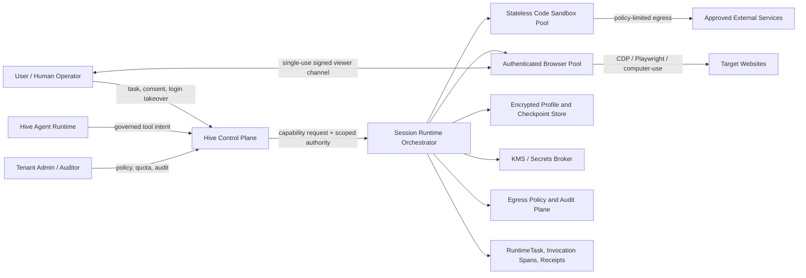

# Cloud Execution and Browser Runtime Architecture Context

> Status: Step 30 architecture context for discussion, 2026-07-15.
> Scope: Define quality goals, constraints, and the system boundary. The current delivery baseline remains Vercel Sandbox; the open-source replacement decision is deferred to Step 31. The browser decision is closed here under KISS: one production engine, Chromium + Playwright.
> Scope confirmation: the initial product covers public-web reading plus interactive/authenticated web workflows. QR/OTP-assisted login uses the user's physical phone. Native Android/iOS automation and cloud-mobile infrastructure are excluded.

## §1 Quality Goals

The goals below are proposed acceptance targets, not claims about the current implementation. They derive from the requested outcomes: avoid ecosystem lock-in, support authenticated browser activity, preserve privacy, and sustain large parallel workloads.

| Priority | Quality Attribute | Scenario | Metric / Acceptance Target |
|---|---|---|---|
| 1 | Privacy and credential safety | A user signs in through a remote browser and the agent continues with the resulting authenticated session. | Zero raw passwords, OTP seeds, cookies, profile blobs, or provider credentials in LLM input, ordinary agent workspace, command environment, URLs, or logs. Browser profiles are encrypted, tenant-bound, domain-scoped, leased, revocable, and TTL-governed. |
| 1 | Tenant isolation and governed effects | Untrusted code, a compromised page, or a malicious downloaded file attempts to reach Hive infrastructure, another tenant, or an unauthorized external destination. | Dedicated-kernel or equivalently reviewed isolation for untrusted cloud workloads; default-deny egress; no raw host-process fallback; 100% of session operations and external mutations have authenticated authority, policy decision, invocation receipt, and audit event; zero cross-tenant leakage in adversarial and fault-injection tests. |
| 1 | Human-controlled authentication | Login requires password entry, QR scan, WebAuthn, CAPTCHA, or OTP. | The agent pauses at a typed checkpoint; the user receives a single-use, short-lived viewer URL bound to tenant/user/session; model actions and sensitive capture pause during takeover; access is auditable and revocable; the agent resumes only from typed completion state. |
| 1 | Provider portability | The active cloud sandbox provider becomes unavailable, too expensive, or contractually unsuitable. | Hive's tool, task, evidence, profile, and recovery contracts do not change when switching providers. At least two independent providers pass the same conformance suite, and no provider SDK object becomes durable domain truth. |
| 2 | Browser compatibility and correctness | An agent logs into and operates a modern JavaScript-heavy site with downloads, popups, storage, service workers, and federated login. | Chromium + Playwright is the single production browser contract. Unsupported site behavior fails visibly; it is not routed to a second engine. |
| 2 | Elastic scale and performance | Many agents concurrently start code and browser workloads. | Initial load-test targets: code sandbox ready p95 <= 1 s at 100 concurrent creates; Chromium ready p95 <= 8 s at 100 concurrent creates; 200 active browser sessions plus 1,000 queued jobs per cluster with <1% infrastructure failures. Scale through prewarmed isolated runtimes, bounded queues, and admission control rather than a second browser engine. Targets must be re-baselined using Hive images, policies, and real workflows before production commitment. |
| 2 | Recovery and state integrity | A control-plane process, compute node, browser, or network path fails during an authenticated task. | Control-plane restart never leaks or silently loses a session. Recovery uses provider session identity or a Hive-owned encrypted checkpoint. Profile writes use an exclusive lease and version compare-and-swap. Non-idempotent external actions are not replayed without an effect receipt or renewed confirmation. |
| 2 | Data minimization and evidence safety | Screenshots, DOM snapshots, downloads, traces, or network metadata contain personal or confidential data. | Metadata-only audit is the default. Content capture is purpose-limited, encrypted, access-controlled, retention-bounded, and independently deletable. Revocation removes usable provider-side copies and keys within a defined deletion SLO (proposed: 15 minutes for active copies). |
| 3 | Operability and cost control | A workload spike or hostile task consumes excessive CPU, memory, network, proxy, or storage resources. | Per-tenant/session quotas, admission control, queue backpressure, warm-pool bounds, per-session resource/cost/egress metrics, and hard TTLs are enforced. Capacity exhaustion is typed and retryable rather than causing an unsafe fallback. |

## §2 Constraints

### Technical Constraints

| Constraint | Rationale | Impact |
|---|---|---|
| Preserve the current stateless code-execution contract | Current Hive creates a Vercel sandbox per command, synchronizes workspace artifacts, stops it, sanitizes environment input, defaults to deny-all networking, and fails closed for unknown providers. | Browser sessions must not be smuggled into the existing short-command contract. A stateful session runtime may share low-level provider adapters but needs its own lifecycle contract. |
| Use a Hive-owned capability contract, not a Vercel- or E2B-shaped domain model | Vercel, CubeSandbox, E2B, OpenSandbox, and future runtimes expose different lifecycle, network, checkpoint, port, and persistence semantics. | Define capabilities such as create, exec, expose endpoint, update egress, checkpoint, restore, pause, resume, terminate, and attest. Unsupported capabilities return typed `unsupported`, not emulation or silent degradation. |
| Keep the Railway application plane separate from privileged compute | CubeSandbox requires KVM-capable Linux or its PVM host path. Its own deployment and node lifecycle differ from ordinary application containers. | Hive backend/API remain the authority and orchestration plane. KVM/microVM and browser pools are separate private compute planes reached through authenticated service APIs. Railway support for `/dev/kvm` must not be assumed without explicit provider evidence. |
| Keep only two initial workload classes | Stateless code and authenticated browser sessions have different state, startup, recovery, and privacy requirements. Android would add a third scheduler, image pipeline, device pool, sanitization contract, and failure domain before a native-app requirement exists. | Operate one code-sandbox contract and one stateful browser-session contract. Do not deploy an Android pool for QR/OTP-assisted browser login. |
| Chromium + Playwright is the only production browser engine | A login-capable browser needs real layout and paint, screenshots/streaming for human takeover, service workers, complete browser profiles, popups, downloads, and broad Web API compatibility. Lightpanda and Obscura deliberately omit graphical rendering. Camoufox is a real Firefox fork but its current 2026 releases and remote server are explicitly experimental. | All browser tasks use the same Playwright contract and isolated Chromium runtime. Scale through warm capacity and lifecycle engineering, not engine diversity. Keep the browser sandbox enabled and do not share credential-bearing browser processes across tenants. |
| No multi-engine routing in the initial architecture | A second engine creates a routing policy, compatibility matrix, profile-conversion boundary, duplicated tests, two failure semantics, and extra on-call surface. It does not help the hardest current requirement: safe authenticated visual interaction. | Obscura, Lightpanda, Camoufox, and Steel are not runtime dependencies. Reopen the decision only after measured Chromium cost or throughput misses an agreed SLO and profiling proves that browser-engine work, rather than pooling or workload design, is the bottleneck. |
| Browser profiles are credential-equivalent artifacts | Profiles contain cookies, local storage, IndexedDB, saved credentials, and application state. | Profiles never enter normal workspace, LLM context, generic file tools, provider logs, or reusable public snapshots. They require envelope encryption, tenant/user/agent binding, domain/app scope, TTL, lease, versioning, revocation, and deletion receipts. |
| Human login is a first-class authority boundary | Passwords, OTP, WebAuthn, QR, and CAPTCHA require human authority and may reveal sensitive material. | Provide signed interactive takeover, pause autonomous input and sensitive recording, and return a typed checkpoint. Do not make password or cookie text a tool argument. |
| API credential brokering and interactive browser privacy are different modes | Vercel can broker credentials at egress. CubeEgress can MITM HTTPS after installing a trusted CA, inspect destinations, and inject headers. Decrypting interactive login traffic expands the trusted computing base. | API workloads may use audited header injection. Human-authenticated browsing defaults to no content inspection; any TLS interception requires explicit policy, disclosure, and separate threat review. Validate whether the chosen provider can enforce domain egress without decrypting user content. |
| External actions require effect-aware governance | Scraping/read activity and submitting, messaging, buying, posting, or deleting have different risk. | Read actions still obey source policy, rate limits, and data minimization. Externally visible mutations require preflight/approval, idempotency or effect receipts, and replay protection. |
| Native mobile automation is deferred | A QR scan or SMS OTP can be completed on the user's physical phone through the browser takeover flow. A cloud Android fleet would introduce a large independent operational and privacy surface. | Do not deploy Cuttlefish, ReDroid, Appium, Mobile MCP, or Mobilerun initially. If a concrete native-app workflow is accepted later, add `agent-device` as the sole agent-oriented driver behind Hive authority; select and test the device substrate at that time. |

### Browser Engine Fit Matrix

The figures below are project-published discovery evidence, not cross-project benchmark results. The test shapes differ materially, and Chrome is sometimes measured as a cold process per page, which is not how a production browser pool should be operated.

| Candidate | Engine class and protocol | Visual/auth capability | Published scale signal | Maturity and license | Hive fit |
|---|---|---|---|---|---|
| Standard Chromium + Playwright | Full Chromium/Blink browser; native Playwright protocol or CDP; real layout, paint, accessibility, downloads, workers, and browser profiles. | Strongest of the four for general login, OAuth popups, QR display, screenshots/video, human takeover, and broad site compatibility. Persistent `userDataDir` is complete but credential-sensitive. | Heavier than the purpose-built DOM engines. Prewarming isolated runtimes and measuring per-session processes with Hive's security policy enabled is the capacity plan; vendor-comparison numbers are not accepted as production evidence. | Mature browser baseline. Chromium is open source; Playwright is Apache-2.0. Branded Google Chrome is not the open-source dependency baseline. | **Selected: the single production engine.** Run inside a microVM/container boundary, enable the browser sandbox, and use a dedicated encrypted automation profile rather than a user's daily profile. |
| Camoufox | Patched Firefox with Playwright/Juggler, real rendering, persistent contexts, fingerprint controls, and optional Xvfb headful execution. | Can support visual login and takeover. It is Firefox rather than Chromium, so site behavior and fingerprints differ. The remote-server path is experimental and one server uses one browser/fingerprint. | Project claims a headless-first footprint below 200 MB, but publishes no directly comparable Hive workload result. Per-session server rotation reduces density. | MPL-2.0. Current documentation warns that 2026 preview releases are highly experimental and unsuitable for production; maintenance ownership is transitioning. | **Not selected.** It adds a second browser stack and is not a suitable credential-bearing production fallback in its current maturity state. |
| Lightpanda | New Zig + V8 DOM/JS browser, CDP, no graphical rendering engine; native MCP and an embedded agent mode. | No pixels means no screenshot stream, visual CAPTCHA/QR, or human takeover. Web API coverage is incomplete; the project says beta and warns of errors/crashes. | Project reports 123 MB peak for 100 pages and 5 s for 100-page execution versus 2 GB/46 s for its Chrome run. This is promising but not comparable to authenticated sessions. | AGPL-3.0, beta. Telemetry is on by default unless disabled. Network-service use and modifications need legal review for Hive's Apache-2.0 distribution model. | **Not selected.** It cannot cover the authenticated visual workflow and would add a separate compatibility and licensing surface. |
| Obscura | New Rust + V8 DOM/JS engine, a subset of CDP, native MCP, no layout/paint engine. It persists cookies and localStorage in a supplied storage directory. | It can submit forms and preserve simple sessions, but has no screenshot/PDF/video, service workers, full Playwright storage-state parity, or visual takeover. Pages in one server share a V8 isolate, so CPU-heavy JS can block peers. | Project reports about 27 MB per cold process on its fixture set, about 21x Chrome speed and 7x lower memory, 83.3% "Core" WPT and 60.0% full WPT. Its own benchmark notes no rendering and that cold-process Chrome is a worst case. | Apache-2.0, v0.1.x, young. The security policy covers SSRF, availability, cross-session leakage, and TLS correctness, but production isolation remains Hive's responsibility. | **Not selected.** Its extraction efficiency does not compensate for the missing visual login/takeover path, and a read-only fast lane would create premature routing and profile-boundary complexity. |

### KISS Browser Decision for Hive

1. Use **Chromium + Playwright as the single browser engine** for reading, extraction, authentication, human takeover, visual reasoning, downloads, and external effects.
2. Do **not** introduce Obscura, Lightpanda, Camoufox, Steel, or an engine router in the initial architecture.
3. Obtain scale from bounded queues, prewarmed isolated runtimes, reusable images, explicit browser/session TTLs, and workload-level backpressure. Do not share credential-bearing browser processes across tenants to save memory.
4. Reopen the engine decision only when production profiling proves that Chromium is the dominant cause of a missed, agreed SLO and the projected saving exceeds the permanent cost of a second compatibility, profile, test, and operations surface.

### KISS Mobile Decision

- **Current selection: no cloud mobile runtime.** QR scan, SMS OTP, WebAuthn, and similar login steps use the same browser human-takeover checkpoint and the user's physical phone.
- **Future native-app selection: `agent-device` only.** If a real native Android/iOS workflow becomes an accepted requirement, add `agent-device` as the deterministic hands/eyes/evidence adapter while Hive remains the semantic and authority owner.
- Do not introduce Mobile MCP, Mobilerun, Appium/Maestro, Cuttlefish, or ReDroid until that requirement exists. Device substrate and deterministic replay are then selected from acceptance evidence, not prebuilt into today's architecture.

### KISS Current Delivery Boundary

1. Keep the existing **Vercel Sandbox** provider for stateless code execution. Do not combine a provider migration with the first authenticated-browser delivery.
2. Add a separate stateful `BrowserSessionProvider` on the same Vercel Sandbox fabric, using one Chromium + Playwright image. Vercel's current sandbox surface supports custom OCI images, persistent named sandboxes, snapshots, long-running sessions, and exposed ports; Hive still owns profile encryption, session leases, signed viewer access, evidence, and recovery.
3. Treat **CubeSandbox as the single open-source replacement candidate**, not as a second live provider. Its KVM/microVM isolation, pause/resume, snapshots, egress policy, and browser examples make it directionally suitable, but its own roadmap still lists material cluster operations and recovery work. Promote it only after the same Hive provider conformance, isolation, recovery, and load suite passes.

### Remaining Decisions Before Solution Strategy

Only decisions that change product authority or durable data semantics remain open. The proposed defaults deliberately avoid adding another browser framework or runtime lane.

| Decision | Proposed KISS default | Why it matters |
|---|---|---|
| Public reading versus interactive browser | Keep existing `web_search` / `web_fetch` as the default public-read path. Start Chromium only when the model chooses a declared browser capability because the task needs authentication, rendered interaction, uploads/downloads, or an externally visible web action. | Avoids paying browser startup and memory cost for ordinary research without creating a second browser engine or platform heuristic router. |
| Browser-profile owner | Every profile has one explicit authenticated principal: a human user or an Agent service identity. Cross-agent use requires an explicit delegation grant; a tenant-wide shared cookie jar is forbidden. | Determines account accountability, revocation, audit, and whether a digital employee can own its own external account. |
| Login persistence | Persistence is opt-in per profile. The active VM/session has a short idle TTL; encrypted profile state may survive across tasks until its retention deadline or immediate user/admin revocation. Provider snapshots are cache/recovery artifacts, not the only durable authority. | Playwright authentication state can impersonate the account, so convenience cannot silently create permanent credentials. |
| Human takeover coverage | Support password entry, SMS/email OTP, QR login, and ordinary federated-login popups through a single-controller viewer. Pause Agent input and sensitive capture during takeover. CAPTCHA is human-only; hardware-bound passkeys are supported only when the site offers a compatible cross-device flow. | Defines what “login supported” truthfully means without promising CAPTCHA bypass or physical-device capabilities the cloud browser does not have. |
| Autonomous effects | Authorized reading and extraction may proceed without a new confirmation. Submitting forms, sending messages, publishing, purchasing, deleting, or changing account/security state goes through Hive's existing capability policy, approval/checkpoint, idempotency, and effect-receipt boundary. | Browser clicks are not all equivalent; visible external mutations need the same governance as API tools. |
| Authenticated-network boundary | Anonymous public reading may reach the public Internet while still blocking private, link-local, and metadata targets. An authenticated profile is restricted to the user-authorized site/domain set and required identity-provider flow; scope expansion is explicit and auditable. | Reduces SSRF and credential-exfiltration exposure without pretending that a modern login page uses only one hostname. |
| Evidence and downloads | Metadata receipts are retained by default. Screenshots, DOM snapshots, traces, and video are transient unless required for a deliverable, failure investigation, or explicit retention policy. Downloads become governed workspace artifacts and never remain only inside the browser sandbox. | Browser evidence routinely contains personal or confidential content and needs a different retention policy from operational metadata. |

The exact TTL values, content-retention duration, and concurrency quotas are operational defaults to validate in load and security tests; they do not require a new product architecture decision unless the business requires permanent sessions or mandatory full-session recording.

### Organizational Constraints

| Constraint | Rationale | Impact |
|---|---|---|
| Self-hosting removes vendor dependency but creates an infrastructure product | MicroVM hosts, kernel/KVM patches, images, snapshot storage, network policy, capacity, upgrades, incident response, and tenant isolation become Hive's responsibility. | An open-source provider is acceptable only with an owner, on-call model, patch SLA, reproducible images, security response, load tests, and rollback/runbooks. License and stars are not production evidence. |
| Vendor benchmark numbers are discovery evidence only | CubeSandbox's published cold-start tests use a large bare-metal node and its own images; authenticated browser workloads have a different cost profile. | Reproduce tests with Hive's templates, egress rules, encrypted profile flow, artifact sync, and target concurrency. Record p50/p95/p99, failure rate, cost, and recovery behavior. |
| Migration must preserve a safe rollback path | The existing Vercel path is live and has provider-specific tests and probes. | Add a conformance harness and shadow/canary evidence before changing production routing. Keep provider selection reversible until the replacement passes security, recovery, and load gates. |
| Legal and product policy must be explicit | Authenticated automation and scraping can handle personal data and interact with third-party services. | Each connector/domain needs an allowed-purpose policy, user authority, rate limits, retention rules, and terms/robots review. CAPTCHA or anti-bot evasion is not treated as a generic platform capability. |

### Regulatory and Privacy Constraints

| Constraint | Rationale | Impact |
|---|---|---|
| Data minimization and purpose limitation | Browser sessions can observe credentials, messages, files, and identifiers beyond the requested task. | Scope domains, redact or avoid sensitive capture, keep profile and evidence retention independently configurable, and expose deletion/revocation controls. |
| Data residency and subprocessor disclosure | Managed providers, proxy networks, object storage, and model providers may process data in different jurisdictions. | Provider and region are policy inputs. Session placement must respect tenant residency; durable metadata records provider/region without exposing secret material. |
| User consent and auditability | A user must understand when an agent is acting inside an authenticated account. | Show active session, target domain/app, current controller (agent or human), allowed actions, and an immediate revoke/stop control. Preserve immutable metadata receipts for security review. |

## §3 System Context

### Context Diagram

### Users

- **End user / profile owner**: authorizes a task, performs sensitive login steps, observes or revokes the session, and owns profile retention choices.
- **Hive agent**: requests browser/code capabilities and interprets typed results, but never receives raw login secrets or profile bytes.
- **Tenant administrator**: configures providers, regions, quotas, retention, domain/app policies, and approval rules.
- **Security operator / auditor**: inspects metadata receipts, isolation attestations, denied egress, lifecycle events, and deletion evidence under least privilege.

### External Systems

| System | Direction | Data | Protocol | Notes |
|---|---|---|---|---|
| Cloud sandbox fabrics (current Vercel; candidates such as CubeSandbox/E2B/OpenSandbox-backed runtimes) | Bidirectional | lifecycle commands, workspace artifacts, evidence, resource metrics | Provider adapter over HTTPS/gRPC/SDK | Provider identity is evidence, not authority. |
| Browser runtime/control layer | Bidirectional | DOM/accessibility state, screenshots, downloads, browser events | Playwright; CDP only for narrow diagnostics | Single Chromium production lane. |
| Target websites | Outbound and response | task-scoped requests, page data, externally visible effects | HTTPS | Domain allowlist, rate policy, effect preflight. |
| Encrypted object/profile store | Bidirectional | encrypted browser profiles, workspace checkpoints, downloads | Private object API | Envelope encryption, CAS version, lease, TTL, deletion receipt. |
| KMS/secrets broker | Bidirectional | short-lived decrypt grants or egress credential transforms | Private authenticated API | Raw provider/backend secrets do not enter the workload. |
| Viewer gateway | Bidirectional | video/display stream, user input, ephemeral session control | WebRTC/noVNC-equivalent over signed HTTPS/WSS | Bound to tenant, user, session, TTL; no durable public provider URL. |
| Observability and evidence store | Outbound | metadata spans, lifecycle transitions, resource/egress metrics, effect receipts | OTLP/internal DB/event API | Content capture is separate, explicit, and retention-governed. |

### Canonical Data Flows

1. **Stateless code**: Agent intent -> Hive authority/preflight -> provider conformance adapter -> isolated command -> workspace diff and provider evidence -> Hive artifact/evidence truth -> terminate.
2. **Authenticated web task**: User-authorized task -> create browser session and exclusive profile lease -> hydrate encrypted profile -> start Chromium -> agent read/action loop -> effect preflight before external mutation -> checkpoint encrypted profile and artifacts -> revoke provider copy -> release lease.
3. **Human login**: Agent reaches typed `login_required` -> autonomous input and sensitive recording pause -> Hive issues single-use viewer grant -> user logs in directly or scans a QR code with a physical phone -> user ends takeover -> Hive checkpoints profile -> agent resumes without receiving credentials.
4. **Recovery**: RuntimeTask reconciler detects loss -> reconnect to active provider session when attested, otherwise create a replacement from the last Hive-owned checkpoint -> compare profile version/lease -> resume only safe reads; non-idempotent effects require receipt reconciliation or renewed confirmation.

## Source Notes

- Current Hive provider seam and Vercel implementation: `backend/app/services/code_execution/service.py`, `vercel_provider.py`, `env_policy.py`, and provider tests in the current checkout.
- Current Hive public-web read surface: `backend/app/tools/handlers/search.py`, `backend/app/services/agent_tool_domains/web_mcp.py`, and the governance mappings in `backend/app/services/governance_capability_taxonomy.py` in the current checkout.
- Vercel Sandbox isolation, networking, persistence, limits: https://vercel.com/docs/sandbox and https://vercel.com/changelog/sandbox-persistence-is-now-ga
- CubeSandbox architecture, browser example, security proxy, benchmarks, and roadmap: https://github.com/TencentCloud/CubeSandbox, https://github.com/TencentCloud/CubeSandbox/tree/master/examples/browser-sandbox, https://github.com/TencentCloud/CubeSandbox/blob/master/docs/guide/security-proxy.md, https://github.com/TencentCloud/CubeSandbox/blob/master/docs/blog/posts/2026-06-01-cubesandbox-perf-benchmark.md, https://github.com/TencentCloud/CubeSandbox/blob/master/docs/guide/roadmap.md
- OpenSandbox architecture and runtime-provider split: https://github.com/opensandbox-group/OpenSandbox/blob/main/docs/architecture.md
- Kubernetes agent-sandbox stateful identity, persistence, pause/resume, and warm pools: https://github.com/kubernetes-sigs/agent-sandbox
- Steel browser sessions and self-hosted browser API: https://github.com/steel-dev/steel-browser
- Lightpanda performance claims and beta/coverage status: https://github.com/lightpanda-io/browser
- Obscura engine, Playwright limitations, persisted storage, security policy, and self-published benchmark: https://github.com/h4ckf0r0day/obscura, https://github.com/h4ckf0r0day/obscura/blob/main/docs/Use-with-Playwright.md, https://github.com/h4ckf0r0day/obscura/blob/main/docs/Persist-cookies-and-storage.md, https://github.com/h4ckf0r0day/obscura/blob/main/SECURITY.md, and https://github.com/h4ckf0r0day/obscura-benchmark
- Camoufox capabilities, persistent contexts, experimental remote server, and 2026 production warning: https://github.com/daijro/camoufox, https://camoufox.com/, https://camoufox.com/python/usage/, and https://camoufox.com/python/remote-server/
- Chromium/Playwright browser channels, persistent contexts, authentication state, screenshots, and service workers: https://playwright.dev/docs/browsers, https://playwright.dev/docs/api/class-browsertype, https://playwright.dev/docs/auth, https://playwright.dev/docs/screenshots, and https://playwright.dev/docs/service-workers
- Browser-use and Stagehand agent-control layers: https://github.com/browser-use/browser-use and https://github.com/browserbase/stagehand
- Cua computer-use and cross-OS/Android control surface: https://github.com/trycua/cua
- Android Cuttlefish scale/fidelity goals: https://source.android.com/docs/devices/cuttlefish
- ReDroid cloud Android runtime: https://github.com/remote-android/redroid-doc
- Appium driver boundary: https://appium.io/docs/en/latest/intro/drivers/
- Agent-oriented mobile drivers and frameworks: https://github.com/callstack/agent-device, https://github.com/mobile-next/mobile-mcp, and https://github.com/droidrun/mobilerun
