# Hive Engineering Documentation

Current snapshot: 2026-06-13
Product version: 1.7.0 (`backend/VERSION`, `frontend/VERSION`)
Stack: FastAPI + React 19 + PostgreSQL + Redis + Railway

This document describes the current engineering shape of Hive. It is the main
technical reference for architecture, runtime contracts, deployment, and the
recent product surface changes.

## Current Closure Baseline

The current engineering baseline is the post-harness, post-round2 closure state:

- Canonical review evidence lives in `docs/harness-engineering-audit-2026-06-11.md` and `docs/round2-sota-benchmark-2026.md`.
- Runtime self-evolution is treated as a governed harness problem: hard verification, source evidence, rollback metadata, audit records, and replay/eval gates are part of the promotion path.
- Production-grade runtime contracts now include restart-resumable `RuntimeTask` execution, DB-backed `invocation_spans`, provider retry/overload fallback, token budget gates, Anthropic thinking-signature preservation, prompt-cache anchoring, and unified sandboxing for agent-controlled subprocesses.
- Enterprise-control contracts now include per-agent identity/sponsor lifecycle, fail-closed principal retrieval for memory, MCP token-passthrough rejection, A2A-style Agent Cards, machine-readable interoperability profile, and memory hygiene startup repair.
- Most recent full backend verification before this documentation pass: `cd backend && source .venv/bin/activate && pytest tests -q` -> `4223 passed, 7 skipped, 4 warnings`.

## System Shape

```
Frontend (React 19, Vite, React Router 7)
  - App surface: /plaza, /agents/:id, /messages
  - Workspace surface: /enterprise/*, including /enterprise/dashboard
  - Admin surface: /admin/*
        |
        | /api, /api/v1, /ws/chat/:agent_id
        v
Backend (FastAPI, SQLAlchemy async)
  - Agent kernel and runtime invoker
  - Tool governance and capability packs
  - Memory Control Plane
  - Web chat durable RuntimeTask runs
  - Invocation trace spine and provider fallback
  - Channel stream managers
  - Interoperability profile and A2A-style Agent Cards
        |
        +-- PostgreSQL 15, tenant-scoped models and RLS
        +-- Redis 7, cache/pubsub/session support
        +-- Agent workspace filesystem under AGENT_DATA_DIR
        +-- ONLYOFFICE document server for browser editing
```

## Current Code Map

Counts are from the current tree, not historical docs.

| Area | Current Size | Notes |
|------|--------------|-------|
| API routers | 62 files | Mounted under both `/api` and `/api/v1`, except public webhooks and WebSocket. |
| ORM models | 43 files | Tenant-scoped SQLAlchemy models, including runtime tasks, coordination, objectives, identity, pending replies, channel config, invocation spans, and session feedback. |
| Services | 163 files | Runtime, channel delivery, memory, extraction, evolution, office, Feishu, triggers, skills, governance, trace, MCP authz, interoperability. |
| Tool handlers | 16 files | filesystem, search, communication, email, Feishu, memory, office, finance, HR, MCP, deep research, objectives, plaza, tasks, triggers. |
| Tool domain services | 21 files | Feishu office domains, workspace, messaging, objectives, web MCP, code exec, image upload. |
| Memory modules | 25 files | write gate, activation, retriever, T2 store, lifecycle, retention, access log, replay corpus, hygiene, optional backends. |
| Runtime modules | 13 files | invoker, prompt builder, context budget, hooks, session, recovery manifest, coordinator, eval helpers. |
| Alembic migrations | 79 files | `alembic heads` must stay single-head before new migrations. |
| Frontend pages | 16 page files | App, workspace, admin, login/setup, agent detail, Agent Circle. |
| Frontend section files | 25 section files | Agent detail, workspace admin, admin companies. |
| Frontend API domains | 37 files | Typed adapters for agents, chat, office, deep research, memory, autonomy, enterprise, etc.; count includes tests and index files. |

## Product Surfaces

### App Surface

The authenticated app surface lives under `/`.

| Route | Surface |
|-------|---------|
| `/` | Redirects to `/plaza`. |
| `/plaza` | Agent Circle. Backend and tool names still use `plaza` for compatibility. |
| `/agents/new` | Agent creation entry; redirects into HR agent flow. |
| `/agents/:id` | Agent detail hub. |
| `/agents/:id/chat` | Legacy chat route that redirects to the agent chat tab. |
| `/messages` | Message center. |
| `/dashboard` | Legacy redirect to `/enterprise/dashboard`. |

### Workspace Surface

Company-scale control plane routes live under `/enterprise` and require
`WorkspaceGuard`.

| Route | Section |
|-------|---------|
| `/enterprise` | Redirects to `/enterprise/dashboard`. |
| `/enterprise/dashboard` | Workbench dashboard inside Company Admin. |
| `/enterprise/info` | Company info. |
| `/enterprise/llm` | Model configuration. |
| `/enterprise/memory` | Workspace memory controls. |
| `/enterprise/hr` | HR agent controls. |
| `/enterprise/tools` | Tool registry and policies. |
| `/enterprise/skills` | Skill library. |
| `/enterprise/quotas` | Usage quotas. |
| `/enterprise/users` | User management. |
| `/enterprise/org` | Organization structure. |
| `/enterprise/approvals` | Approval workflows. |
| `/enterprise/audit` | Audit logs. |
| `/enterprise/invitations` | Invite codes. |

### Admin Surface

`/admin/platform-settings` is guarded by `AdminGuard` and reserved for platform
administrators.

## Backend Startup

`backend/app/main.py` owns process startup. Startup work is intentionally
best-effort where possible so one optional subsystem does not prevent the core
API from booting.

1. Configure logging and intercept standard logging.
2. Validate production secrets when `DEBUG=false`.
3. Initialize the secrets provider with `SECRETS_MASTER_KEY`.
4. Run idempotent `Base.metadata.create_all()`.
5. Apply compatibility enum/table patches where required.
6. Migrate legacy workspace files and objective ledger projections.
7. Seed built-in tools, default company, Atlassian/Rovo tools, skills, and default agents.
8. Run tool coverage and capability mapping audits.
9. Apply workspace memory hygiene repair when an agent workspace is bootstrapped; the standalone `python -m app.scripts.repair_memory_hygiene --apply --confirm` path is available for fleet repair.
10. Resume persisted async delegations and reconcile orphaned runtime tasks.
11. Replay pending memory extraction queue entries from previous crashes or deploy restarts.
12. Register runtime memory hooks.
13. Backfill legacy trigger reply contexts.
14. Start background tasks:
    - `trigger_daemon`
    - `evolution_daemon`
    - `feishu_ws`
    - `dingtalk_stream`
    - `wecom_stream`
    - `wechat_personal_stream`
15. Start optional `ss-local` SOCKS5 proxy for Discord.
16. On shutdown, stop WeChat personal streams, close Redis, close OpenViking, close memory backends.

## API Routing

Most routers are mounted twice:

- `/api/...` for backward compatibility
- `/api/v1/...` for versioned clients

`webhooks_router` is mounted without `/api` for public provider callbacks.
`ws_router` is mounted without `/api` for `/ws/chat/{agent_id}`.

Important routers added or promoted in the current architecture:

- `chat_sessions.py`: web chat sessions and durable run endpoints.
- `office.py`: ONLYOFFICE editor config, download/callback/force-save endpoints.
- `deep_research.py`: deep research job control and stream proxy.
- `interoperability.py`: machine-readable platform interoperability profile.
- `tenant_channels.py`, `email_channel.py`, `telegram.py`, `wechat_personal.py`: per-channel configuration and runtime surfaces.
- `objectives.py`, `autonomy.py`: durable objectives and autonomy overview/repair.
- `desktop_auth.py`, `desktop_sync.py`, `desktop_agents.py`, `desktop_audit.py`: desktop sync foundation.

## Agent Kernel Runtime

All agent execution must enter through:

```
runtime/invoker.py::invoke_agent()
  -> kernel/engine.py::AgentKernel.handle()
  -> tools/service.py::ToolRuntimeService.execute()
```

The kernel stays DB-free. Platform I/O is injected through `KernelDependencies`.
Current dependency wiring includes runtime config, memory context, retrieval
context, tools, tool expansion, compaction, LLM client creation, governed tool
execution, memory persistence, token tracking, vision transforms, and provider
cache hints.

Runtime facts:

- Default per-agent `max_tool_rounds` is 200 (`Agent.max_tool_rounds`).
- Heartbeat uses its own lower round budget.
- Mid-loop compaction checks every 3 rounds and triggers at 75% context use.
- Prompt-too-long retries use reactive compaction for provider rejections.
- Tool result eviction threshold is 50,000 characters.
- Evicted tool result previews keep 4,000 characters inline.
- Per-round aggregate tool result budget is 200,000 characters.
- Microcompaction clears old tool results after 60 minutes, or after 10 minutes once context pressure is at or above 60%.
- Prompt prefix caching uses `SessionContext` and an explicit prompt cache version.
- Anthropic list content blocks preserve signed thinking blocks and `cache_control` hints through provider formatting.
- Provider retry/fallback handles transient network failures, 429/5xx retryable responses, and overload failover without changing the kernel entry contract.
- `record_invocation_span` persists invocation, generation, and tool spans to PostgreSQL while also preserving file-backed JSONL compatibility.

## Web Chat Runtime

Web chat is no longer tied to one browser WebSocket lifetime.

Current flow:

```
AgentDetail chat UI
  -> WebSocket /ws/chat/{agent_id}?session_id=...
  -> user message
  -> chat_sessions / web_chat_runtime creates RuntimeTask(task_type="web_chat_turn")
  -> background execute_web_chat_run()
  -> web_chat_broker broadcasts run_started/chunk/tool_call/done events
  -> frontend polls active run as recovery path
```

Key files:

| File | Responsibility |
|------|----------------|
| `backend/app/api/websocket.py` | WebSocket subscription, auth, control messages, idle handling, run start compatibility path. |
| `backend/app/api/chat_sessions.py` | HTTP session list/history plus start/active/cancel run endpoints. |
| `backend/app/services/web_chat_runtime.py` | Creates and executes durable `RuntimeTask(task_type="web_chat_turn")`. |
| `backend/app/services/web_chat_broker.py` | Session-scoped WebSocket broadcast and runtime session cache. |
| `frontend/src/pages/AgentDetail.tsx` | Session state, socket reconnect, active run polling, chat UI orchestration. |
| `frontend/src/pages/agent-detail/chatRuntime.ts` | Chat runtime helpers and transport notice normalization. |

Operational contracts:

- Closing or refreshing the page does not cancel the background run.
- Only explicit stop/cancel should kill the active run.
- Frontend sends a keepalive ping every 30 seconds while a run is waiting or streaming.
- Backend replies to `{"type":"ping"}` with `{"type":"pong"}` and does not treat it as a chat message.
- Backend default `WS_IDLE_TIMEOUT_SECONDS` is 3600.
- If a WebSocket idle timeout fires while the session still has an active web chat run, the backend defers closing and sends `pong`.
- `WS_IDLE_DREAM_SECONDS` defaults to 180 for session idle hook work.

## Memory System Closed Loop

Hive's memory system is not a passive RAG folder. It is a closed control loop
that turns runtime behavior into durable, permission-aware future behavior:

1. Capture what happened.
2. Extract durable learnings.
3. Curate stable memory.
4. Activate only the right memory for the current principal, goal, and company.
5. Let the agent act with governed tools.
6. Feed outcomes and owner feedback back into the next cycle.
7. Promote only proven behavior into identity, skills, or policy.

The storage shape is still Markdown-first, but the important system boundary is
the control loop around those files.

```mermaid
flowchart LR
    Run["Agent run\nweb chat / channel / trigger / delegation"]
    Hooks["Runtime hooks\nRESPONSE_COMPLETE / PRE_COMPACTION / IDLE / CLOSE"]
    T0["T0 raw behavior logs\nlogs/YYYY-MM-DD/behavior/*.md"]
    Queue["durable extract queue\n.failed_extractions/*.json"]
    T2["T2 learnings\nmemory/learnings/*.md"]
    T3["T3 semantic memory\nmemory/*.md + understandings.md"]
    Activate["Activation gate\nPrincipalStack + goal/company/owner scoring"]
    Prompt["Prompt memory section\nbudgeted, sensitivity-stripped"]
    Tools["Governed tool execution\ncapability gate + action preflight"]
    Feedback["Outcome + owner feedback\ndecision trace / pending reply / T0"]
    Evolve["Evolution ledger + replay guard\ncandidate -> eval -> promote/hold"]
    Soul["soul.md / skills / policy\nstable behavior"]

    Run --> Hooks --> T0 --> Queue --> T2 --> T3 --> Activate --> Prompt --> Run
    Prompt --> Tools --> Feedback --> Hooks
    T3 --> Evolve --> Soul --> Run
    Feedback --> Evolve
```



### Storage Layers

| Layer | Storage | Writer | Purpose |
|-------|---------|--------|---------|
| Working | `focus.md`, objective ledger, runtime/session memory | objective services, runtime recovery | Current intent, open loops, and recovery state. This is not long-term memory. |
| T0 raw | `logs/YYYY-MM-DD/behavior/*.md` | `runtime/hooks_setup.py`, `services/t0_logger.py` | Cursor-based record of agent/user/channel/trigger/delegation behavior. Eligible input for extraction and replay. |
| T0 system audit | `logs/YYYY-MM-DD/system/*.md` | heartbeat and dream hooks | Distiller self-trace for operators. Not consumed as behavioral evidence for T2. |
| T2 learnings | `memory/learnings/{insights,errors,requests}.md` | `services/extract_agent.py`, `memory/t2_store.py` | Weighted extracted facts, corrections, strategies, requests, and failure patterns. |
| T3 semantic | `memory/{feedback,knowledge,strategies,blocked,user}.md` | heartbeat, dream, `save_memory`, governed write paths | Prompt-eligible durable memory. Markdown is the source of truth. |
| Understanding graph | `memory/understandings.md` | `memory/understanding_store.py` | Relationship-shaped knowledge with evidence, confidence, contradictions, boundaries, and open questions. |
| Identity | `soul.md` | dream / charter evolution path | Stable self-model, role, boundaries, and operating style. Promotion requires evidence and rollback metadata. |
| Evolution evidence | `workspace/evolution/evolution_ledger.jsonl` | heartbeat, dream, evolution services | Candidate, eval, promotion/hold decisions for prompt, skill, memory, and policy changes. |
| Session feedback | PostgreSQL `session_feedback_events` + governed T3 writeback | chat session feedback API | Useful/misleading labels and calibration notes tied to agent/session/decision context. |

Optional semantic backends such as Hindsight are read-side accelerators. They do
not replace Markdown as the canonical memory source.

### Capture Loop

Runtime lifecycle events are the intake bus:

| Hook | Memory role |
|------|-------------|
| `RESPONSE_COMPLETE` | Schedules non-blocking T0->T2 extraction and fast reflection. |
| `PRE_COMPACTION` | Runs synchronous extraction before context is summarized away. |
| `SESSION_IDLE` | Writes incremental T0 chat logs without duplicating already-flushed messages. |
| `SESSION_CLOSE` | Drains pending extraction, writes final T0, and runs objective intake. |
| `TRIGGER_END` / `DELEGATION_END` | Writes behavior T0 for autonomous work. |
| `HEARTBEAT_TICK_END` / `DREAM_END` | Writes system audit T0 for curation/evolution decisions. |
| `POST_TOOL_USE` | Captures outbound pending replies so later owner feedback can be tied to the action. |

T0 has a privacy gate before disk persistence. `t0_logger.py` masks credentials,
adds `t0_sensitivity`, records form warnings, spills large tool results to
artifacts, and keeps behavior logs separate from system logs. T0 retention is
short-lived by design; durable knowledge must be distilled upward.

### Extraction And Curation

The hot extraction path is intentionally non-blocking, but it is not best-effort
only:

1. `extract_agent.schedule_extract()` is called from `RESPONSE_COMPLETE`.
2. `extract_queue.enqueue()` persists the batch before the async work starts.
3. Successful extraction calls `mark_done()`.
4. Startup replay scans `.failed_extractions/*.json` so process crashes do not
   silently drop learnings.
5. The extractor writes T2 through `memory/t2_store.py`.

T2 is weighted by source and category. Human corrections and constraints rank
highest; autonomous observations are useful but less authoritative. Heartbeat
then reads T2 plus current T3 as deduplication context and curates stable facts
into T3. Heartbeat does not directly turn its own outcome into permanent memory;
it writes evolution files, normalizes T3, optionally syncs Hindsight, and lets
dream decide what deserves promotion.

Dream consolidates T3 and proposes soul/memory promotions through
`evolution_ledger.jsonl`. A promotion candidate must carry `source_refs`,
evidence type, rollback strategy, and a promotion/hold decision. Inferred,
ephemeral, or weakly evidenced identity changes are held instead of silently
changing the agent.

### Write Safety

Every durable memory write should pass through `prepare_memory_write()` or a
wrapper that calls it.

| Gate | Effect |
|------|--------|
| Privacy classification | Classifies PL1/PL2/PL3/PL4 and masks sensitive text. |
| PL4 zero retention | Credentials are rejected from durable memory. |
| Form lint | Rejects entries that are too vague, relative, or malformed to be useful later. |
| Metadata envelope | Adds `entry_id`, `sensitivity`, `status`, `version`, `evidence_refs`, `access_count`, `last_accessed`, supersession, and expiry fields. |
| Near-dedup | `save_memory` rejects paraphrases of an existing T3 fact unless the new fact states a clear delta. |

This gate is what keeps memory from becoming a transcript dump. Durable entries
must be concise, evidence-backed, scoped, and safe to activate later.

Memory hygiene is part of the write-safety surface, not a one-off migration.
`memory/hygiene.py` retires legacy `memory.sqlite3` / `memory.json` shadow stores,
quarantines dead `reflections.md` stubs, backfills missing lifecycle metadata,
and writes a report for operator review. Startup workspace bootstrapping applies
the repair per agent, while `app.scripts.repair_memory_hygiene` provides a dry-run
and explicit `--apply --confirm` fleet path.

### Activation Loop

Prompt memory is selected at invocation time. The retriever does not blindly
dump every Markdown file into context.

Current retrieval sources:

1. Working projection from `focus.md`.
2. T3 entries from `memory/*.md`.
3. Relationship-shaped understandings from `memory/understandings.md`.
4. Episodic context for the current/previous session.
5. Optional semantic backend and external memory paths.

`runtime/invoker.py` builds an `ActivationContext` around:

- the current query,
- direct owner and company terms,
- creator/current user/delegating-agent accountability from `PrincipalStack`,
- current goal/objective terms.

`ActivationScorer` then:

- strips memories the current principal cannot access,
- boosts goal, owner, company, open-loop, retention, and high-confidence matches,
- writes `activation_score` and `activation_reasons` into metadata,
- bumps `access_count` and `last_accessed` for prompt-included entries.

Access writeback closes the loop: memory that repeatedly helps the agent gets a
stronger retention signal; memory that is never activated decays into lower
priority during later curation.

### Action And Feedback Loop

Memory changes behavior only through governed execution:

1. Activated memory enters the prompt.
2. The agent chooses an action or tool.
3. `ToolRuntimeService.execute()` applies capability policy and action
   preflight.
4. External-visible, sensitive, irreversible, or company-boundary actions may
   become `prepare_only`, `ask`, `refuse`, or `escalate`.
5. Decision traces and pending replies make later feedback attributable.
6. Owner feedback, tool outcomes, failures, and corrections re-enter T0/T2.

This is the closed-loop safety model: the agent can learn from feedback, but the
next behavioral change still has to pass memory write gates, activation gates,
tool governance, and promotion/eval gates.

### Policy And Self-Evolution Loop

Memory policy itself is not allowed to drift silently.

| Component | Role |
|-----------|------|
| `memory/replay_corpus.py` | Stores anonymized activation cases with expected memory hits. |
| `memory/policy_replay.py` | Compares baseline vs candidate activation policies and rejects quality drops. |
| `services/evolution_ledger.py` | Records candidates, eval runs, promotion decisions, source refs, and rollback strategy. |
| `services/heartbeat.py` | Produces evolution file writeback and skill candidates under runtime governance. |
| `services/auto_dream.py` | Consolidates memory and decides which memory/soul promotions are strong enough to apply. |
| `services/session_feedback.py` | Persists useful/misleading feedback events and feeds calibrated durable memory through governed write paths. |

The intended promotion path is:

```
runtime evidence -> candidate -> replay/eval -> promote or hold -> rollback-capable artifact
```

No prompt, skill, memory policy, or identity change should become durable simply
because a single run produced a plausible idea. Verified promotion requires
hard evidence where available, explicit eval/verification records, and rollback
metadata.

### Memory Invariants

- Markdown remains the canonical source of truth for T2/T3/soul memory.
- Runtime state, task progress, and temporary debugging evidence belong in the
  objective ledger or workspace artifacts, not durable memory.
- PL4 credentials must never be retained in any durable memory layer.
- Behavior T0 and system T0 are separate; only behavior T0 feeds extraction.
- Every T2/T3 durable write must carry evidence, sensitivity, lifecycle, and
  access metadata.
- Prompt memory must be selected by `ActivationContext`, not static inclusion.
- Principal context must include owner/company/current-user/delegation posture
  when available.
- Activated memory must update access evidence so retention and curation can
  learn from actual use.
- Owner feedback should link to a decision or action whenever possible.
- Self-evolution must leave candidate/eval/promotion records with rollback
  information before durable promotion.

## Tool Governance And Packs

Every tool call must pass through `ToolRuntimeService.execute()`.

Core path:

1. Resolve agent security zone.
2. Apply capability policies and managed capability guards.
3. Create approval request when required.
4. Run action preflight for external-visible, sensitive, irreversible, or company-boundary actions.
5. Execute through the registry only after governance passes.
6. Audit the outcome.

Static tool packs currently include:

- `web_pack`
- `feishu_pack`
- `plaza_pack` (product label: Agent Circle)
- `email_pack`
- `mcp_admin_pack`
- `finance_pack` (experimental, tenant-enabled)
- `office_pack`
- `deep_research_pack`

MCP server imports generate dynamic pack names such as `mcp_server:{slug}`.
MCP auth is intentionally conservative: registry URLs with userinfo,
`access_token`, or passthrough credentials are rejected; legacy `apiKey` query
parameters are normalized into an authorization header before execution. This
prevents agent-controlled tool configuration from smuggling bearer tokens into
remote URLs or subprocess environments.

Agent-controlled subprocesses must be launched through
`services/subprocess_sandbox.py`. Linux production uses `bubblewrap`; macOS
development uses `sandbox-exec`; unavailable sandboxes fail closed unless an
explicit development bypass is configured.

## Office Editing Runtime

Hive now has a browser editing runtime, not only thin document tools.

Key files:

| File | Responsibility |
|------|----------------|
| `backend/app/api/office.py` | Document create, editor config, download token, callback token, force-save, ONLYOFFICE command proxy. |
| `backend/app/services/office_document_service.py` | Workspace path safety, document templates, atomic saves, revision manifest. |
| `backend/app/services/officecli_adapter.py` | OfficeCLI integration for agent-side processing. |
| `frontend/src/pages/agent-detail/OfficeWorkbenchSection.tsx` | Agent detail office workbench UI. |
| `frontend/src/api/domains/office.ts` | Typed frontend API adapter. |

Runtime contracts:

- Agent workspace remains the source of truth for files.
- ONLYOFFICE handles browser WYSIWYG editing.
- Download and callback URLs are scoped JWTs.
- Callback tokens last 12 hours.
- `editorConfig.user` is tenant-scoped: `{tenant_id}:{user_id}` when tenant exists.
- Saved document revisions are tracked under the document service manifest.
- Production Railway includes `onlyoffice-documentserver` as a separate service.

Required production env:

- `ONLYOFFICE_DOCS_URL`
- `ONLYOFFICE_INTERNAL_DOCS_URL` when the backend should call the internal document-server URL
- `ONLYOFFICE_JWT_SECRET`
- `ONLYOFFICE_DOWNLOAD_TOKEN_EXPIRE_SECONDS` optional, default 300
- `BASE_URL` or `PUBLIC_BASE_URL` for signed document URLs

## Interoperability Surface

Hive exposes machine-readable interoperability descriptors without pretending
that unimplemented standards are complete:

- `GET /api/v1/interoperability/profile` returns the platform profile, including MCP hardening status and A2A/OAuth support boundaries.
- `GET /api/v1/agents/{agent_id}/a2a-card` returns an A2A-style Agent Card guarded by `check_agent_access()`.
- The card declares implemented Hive surfaces such as OpenClaw gateway poll/report/send-message, tenant-scoped messages, and agent identity/sponsor/security-zone metadata.
- OAuth delegation and A2A JSON-RPC task surfaces are explicitly marked `not_exposed` until they are implemented end to end.

## Channels

Channel configuration is per agent unless explicitly tenant-scoped.

| Channel | Key code paths | Runtime notes |
|---------|----------------|---------------|
| Feishu/Lark | `api/feishu.py`, `services/feishu_ws.py`, Feishu tool domains | WebSocket + webhook, SSO, approval cards, office tools. Agent-level `channel_configs` are the production truth source for bot credentials. |
| Slack | `api/slack.py` | Bot API chat. |
| Discord | `api/discord_bot.py` | Bot gateway, optional SOCKS5 proxy. |
| DingTalk | `api/dingtalk.py`, `services/dingtalk_stream.py` | Stream SDK. |
| WeChat Work | `api/wecom.py`, `services/wecom_stream.py` | WebSocket/webhook, encrypted callbacks. |
| WeChat Personal | `api/wechat_personal.py`, `services/wechat_personal_stream.py` | Personal channel bridge. |
| Telegram | `api/telegram.py` | Telegram channel bridge. |
| Microsoft Teams | `api/teams.py` | Bot Framework. |
| Email | `api/email_channel.py`, `services/email_service.py` | SMTP/IMAP style email channel. |

Unified delivery uses channel/session metadata so outbound replies can return to
the originating channel when a run was triggered outside the web UI.

## Frontend Architecture

Frontend stack:

- React 19
- TypeScript 5
- Vite 6
- React Router 7
- TanStack Query 5
- Zustand 5
- i18next with `en.json` and `zh.json`
- Tabler Icons

Important current files:

| File | Responsibility |
|------|----------------|
| `frontend/src/App.tsx` | Surface route tree and redirects. |
| `frontend/src/surfaces/app/AppLayout.tsx` | App shell. |
| `frontend/src/surfaces/workspace/WorkspaceLayout.tsx` | Company Admin shell. |
| `frontend/src/surfaces/workspace/sections.ts` | Workspace section registry and legacy redirects. |
| `frontend/src/pages/layout/AppSidebar.tsx` | Shared sidebar and bottom actions. |
| `frontend/src/pages/Dashboard.tsx` | Workbench dashboard, now under Company Admin. |
| `frontend/src/pages/Plaza.tsx` | Agent Circle feed. |
| `frontend/src/pages/AgentDetail.tsx` | Agent management hub, chat runtime, workspace tabs. |
| `frontend/src/pages/EnterpriseSettings.tsx` | Workspace settings section host. |

UI naming contracts:

- "Dashboard" as a top-level app item is deprecated.
- Workbench lives inside Company Admin at `/enterprise/dashboard`.
- Plaza remains the backend/API route name, but user-facing product copy is Agent Circle / Agent圈.
- Workspace settings sections exclude the dashboard from `WORKSPACE_SETTINGS_SECTIONS`.

## Deployment

Local:

```bash
bash setup.sh --dev
bash restart.sh
```

Backend:

```bash
cd backend
source .venv/bin/activate
ruff check app/ tests/
pytest
alembic heads
alembic upgrade head
uvicorn app.main:app --host 0.0.0.0 --port 8008 --reload
```

Frontend:

```bash
cd frontend
npm run test
npm run build
npm run dev
```

Railway production services currently include:

- `backend`
- `frontend`
- `Postgres`
- `Redis`
- `onlyoffice-documentserver`

Deployment checks should include service status plus external health:

```bash
railway service status --all --environment production --json
node -e "fetch('https://frontend-production-0346.up.railway.app/api/health').then(r=>r.text()).then(console.log)"
```

## High-Value Regression Commands

For web chat durable run changes:

```bash
cd backend
pytest tests/services/test_web_chat_runtime.py tests/api/test_chat_session_runs.py tests/api/test_websocket_call_llm.py -q
```

```bash
cd frontend
npx vitest run src/pages/agent-detail/chatRuntime.test.ts src/pages/agent-detail/AgentDetailSections.test.tsx
```

For Office runtime changes:

```bash
cd backend
pytest tests/services/test_office_document_service.py tests/api/test_office_editor.py tests/tools/test_office_tools.py -q
```

```bash
cd frontend
npx vitest run src/pages/agent-detail/OfficeWorkbenchSection.test.tsx src/api/domains/office.test.ts
```

For broad release confidence:

```bash
cd backend
ruff check app/ tests/
pytest
```

```bash
cd frontend
npm run test
npm run build
```

For current harness/control-plane closure checks:

```bash
cd backend
pytest tests/services/test_invocation_trace_service.py tests/kernel/test_invocation_trace.py tests/services/test_session_feedback.py tests/services/test_interoperability.py tests/api/test_interoperability_api.py tests/memory/test_hygiene.py tests/architecture/test_deployment_contracts.py -q
```

## Non-Negotiable Invariants

- All LLM execution goes through `invoke_agent()` and `AgentKernel.handle()`.
- All tool execution goes through `ToolRuntimeService.execute()`.
- All external-visible, sensitive, irreversible, or company-boundary actions go through action preflight.
- Durable T2/T3 memory writes go through `prepare_memory_write()` or a wrapper that calls it.
- Prompt memory activation must preserve principal and sensitivity context when known.
- Agent creation must render first-person accountability plus frozen company/owner charter sections in `soul.md`.
- WebSocket disconnects must not cancel durable web chat runs.
- Office document saves must preserve path safety and revision history.
- Agent-controlled subprocesses must use the shared sandbox/environment builder and must not inherit host secrets.
- MCP imports and execution must go through `mcp_authz`; URL userinfo and token passthrough are forbidden.
- A2A/interoperability descriptors must be honest machine-readable contracts; unsupported OAuth delegation or JSON-RPC task surfaces must stay marked `not_exposed`.
- Invocation trace spans are append-only runtime evidence and must carry tenant/runtime join keys.
- Memory hygiene repair must be reversible, reportable, and applied through the shared hygiene path rather than ad hoc workspace edits.
- UI text changes must update both English and Chinese i18n files.
- Migrations require a single Alembic head.
