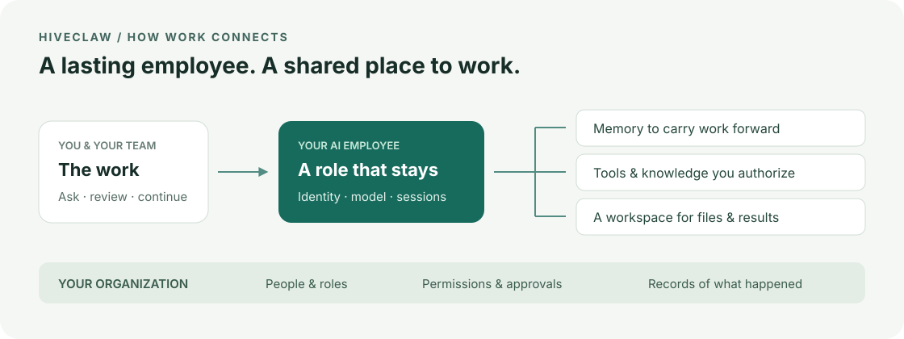
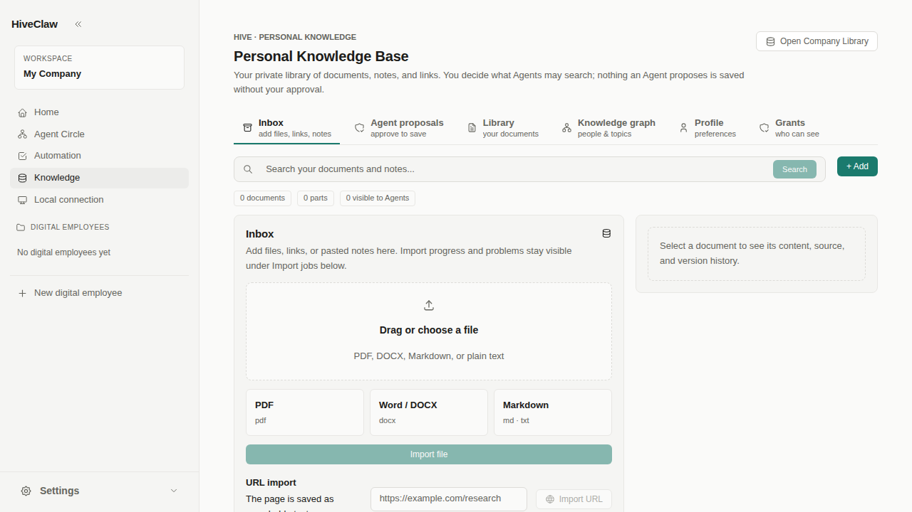

<div align="center">
  <h1>HiveClaw</h1>
  <p>有记忆、会用工具，能与你长期共事的 AI 员工。</p>
  <p><a href="README.md">English</a> · <strong>简体中文</strong></p>
  <p>
    <a href="#开始使用">开始使用</a> ·
    <a href="docs/README.md">文档</a> ·
    <a href="CHANGELOG.md">更新日志</a> ·
    <a href="https://github.com/SteamRocket-Labs/hiveclaw/issues">问题反馈</a>
  </p>
  <a href="LICENSE"></a>
</div>

<br>

HiveClaw 是一个可以自行部署的 AI 数字员工工作空间。你可以为员工定义职责、选择模型、连接工具，再通过对话一起完成工作。它的身份、记忆和文件会保留下来，供后续任务继续使用。

团队还可以在同一个地方管理员工、公司知识、权限和审批。每位员工能访问什么，哪些操作需要人来确认，都由你决定。



## 可以用它做什么？

- 为员工定义角色、选择模型，并维护它自己的记忆和工作空间。
- 通过对话分享文件、查看工具执行、处理审批，也可以稍后回来继续。
- 按照工作需要和员工权限，连接内置工具、Skill 与 MCP 服务。
- 管理个人和公司知识库、授予访问权限，审核员工建议保存的内容。
- 通过记忆和 Skill 候选逐步改进员工的工作方式，变更经过审核后再生效。
- 设置自动化、把工作委派给其他员工，或为步骤明确的工作使用 Workflow。

比如，你可以让研究员读取已授权的项目资料、整理一份简报，检查它引用的来源，再把结果留在工作空间。下一次对话时，你面对的仍然是这位员工，而不是一个全新的聊天窗口。



*个人知识库的真实界面，截图来自空资料库的 UI 测试，不含客户数据。*

## 开始使用

源码安装面向 **macOS 或 Linux 本地开发环境**。请先准备 Python 3.12+、Node.js 22 和 npm。脚本可以配置本地 PostgreSQL；Redis 需要另外启动，并通过 `REDIS_URL` 指向它，默认地址是 `redis://localhost:6379/0`。

```bash
git clone https://github.com/SteamRocket-Labs/hiveclaw.git
cd hiveclaw
bash setup.sh --dev
```

脚本会安装依赖、准备 `.env`、配置数据库并写入初始数据。请在开发环境中运行，不要连接已有生产数据库。启动前检查 [`.env.example`](.env.example) 和生成的 `.env`，不要把密钥提交到 Git。

请替换 `SECRET_KEY` 和 `JWT_SECRET_KEY` 的占位值，并备份生成的 `SECRETS_MASTER_KEY`；它用于加密保存的模型服务商和渠道凭据。

```bash
bash restart.sh --source
```

打开 [localhost:3008](http://localhost:3008)。源码模式下，后端监听 [localhost:8008](http://localhost:8008)。

### 创建第一位员工

1. 注册账号。第一位注册用户会成为平台管理员。
2. 在管理设置中配置模型服务商，并启用可用模型。需要自备服务商凭据，调用模型可能产生费用。
3. 点击 **新建数字员工**，按照 HR 创建流程确定员工职责和模型。
4. 打开员工的对话，先交给它一个小任务，再按需要连接工具、授予知识访问权限。

第一次可以试着让它根据你提供的文件写一份简报。从有限权限开始；连接能发消息或修改外部数据的系统之前，先确认相关审批设置。

### 容器与生产部署

仓库提供 [Docker Compose 配置](docker-compose.yml)。使用前请检查密钥、存储、网络暴露范围和 Docker socket 挂载。这是部署起点，不是已经完成安全加固的生产配置。

本地容器使用方法见[部署说明](ENGINEERING.md#14-development-commands)，Railway 运维见[生产运行手册](docs/railway-production-runbook.md)。可用工具和沙箱行为取决于宿主环境与已配置的服务。

## 它是怎么工作的？

HiveClaw 的前端使用 React 和 TypeScript，后端使用 Python 和 FastAPI，通过 PostgreSQL 保存状态，使用 Redis 协调运行。

工作由后端承载，不依赖浏览器标签页一直打开。会话把员工上下文、模型调用、受权限约束的工具执行和保存的结果串在一起。平台在执行边界检查权限，推理和写作仍交给模型。

模型接入包括 OpenAI、Anthropic、Gemini 和 OpenAI 兼容接口。会话中能用哪些工具和模型特性，取决于所选服务商与配置。

想沿着代码理解执行过程，可以阅读 [ENGINEERING.md](ENGINEERING.md)。

## 文档导航

| 我想…… | 从这里开始 |
| --- | --- |
| 找使用说明或设计文档 | [文档索引](docs/README.md) |
| 开发或排查问题 | [工程指南](ENGINEERING.md) |
| 了解产品方向 | [产品目标](docs/hive-sota-master-goal.md) |
| 查看有哪些更新 | [更新日志](CHANGELOG.md) |
| 核对验收证据与剩余限制 | [验收入口](docs/acceptance/2026-08-30-weekend-rc/README.md) |
| 让编码 Agent 参与开发 | [Agent 工作约定](AGENTS.md) |

设计文档描述预期行为，验证状态请沿验收入口查询。文档中介绍了一项能力，不等于每套部署都已通过这项能力的验收。

## 参与贡献

欢迎提交问题、改进文档或提供范围明确的 Pull Request。报告问题时，请说明运行环境、复现步骤和预期结果，并先移除日志、截图中的凭据与私人对话数据。

较大的改动建议先[开一个 Issue](https://github.com/SteamRocket-Labs/hiveclaw/issues)讨论范围。[工程指南](ENGINEERING.md)列出了代码入口和提交前可运行的检查。

## 许可证

HiveClaw 使用 [Apache 2.0 许可证](LICENSE)。
