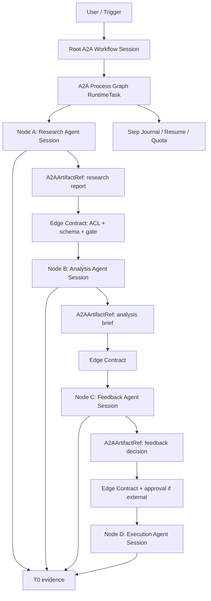

# A2A Workflow Orchestration Design (2026-06-24)

> 状态：docs-only 设计文档。
>
> 关系：本文属于 `docs/ccplus-round2-v2-hive-connect-master-plan-2026-06-24.md` 的 Workflow 主线专项，和 `docs/dynamic-workflow-harness-semantics-2026-06-24.md` 并列补充。Dynamic Workflow 解决“单个当前 Agent 如何动态设计/沉淀 harness”；本文解决“多个完整 Agent 主体之间如何用 workflow 交接、等待、复核、继续执行”。

## 文档索引关系

本文是 A2A 的**跨完整 Agent 编排层**，建立在 [A2A Relationship Group Collaboration Plan](./a2a-relationship-group-collaboration-plan-2026-06-20.md) 之上。

- 上游总纲：[CCPlus Round 2 / V2 Hive Connect Master Plan](./ccplus-round2-v2-hive-connect-master-plan-2026-06-24.md)。它定义 V2 六条主线、`A2AWorkflowProcessGraphV1` 契约、实施顺序和验收矩阵。
- 上游授权文档：[A2A Relationship Group Collaboration Plan](./a2a-relationship-group-collaboration-plan-2026-06-20.md)。它定义 same-owner implicit allow、cross-owner active collaboration group required、approval/revocation、`relationships.md` 投影和前端关系视图。
- 本文职责：定义 A2A Process Graph、handoff envelope、artifact_ref、node session、edge gate、resume/retry、workflow UI 和可复用模板。
- 强约束：任何 A2A Workflow participant、node target、edge handoff 都不能只因为同 tenant 可见而可执行；它必须消费上游 relationship/collaboration policy 的 allowed 结果。cross-owner edge 必须绑定 active group/capability scope 或进入 gate/suspended。
- 边界分工：如果问题是“谁可以被列为协作对象、能否调用 `send_message_to_agent` / `delegate_to_agent`”，回到 Relationship Group 文档；如果问题是“这些已授权 Agent 如何按顺序/条件/并行交接 artifact 并沉淀流程”，留在本文。

## 1. 结论

Hive 不应该在“拖拽式 n8n/Rivet 工作流”和“把所有 Agent 拉进一个群聊”之间二选一。

正确形式是三层合一：

```text
A2A Process Graph
  控制层：谁先执行、谁等谁、artifact 怎么传、何时 gate/resume/retry

Agent Sessions / Multi-Agent Chat
  证据层：每次 handoff、回复、争议、反馈、工具调用都进入 Session/T0

A2A Artifact Contract
  数据层：上一个 Agent 的输出不是靠聊天粘贴，而是变成带 ACL/hash/schema 的 artifact_ref
```

一句话：**Graph 管控制，Session 管证据，Artifact 管交接。**

Multi-Agent Chat 应该存在，但它不是执行引擎。它是 root room / timeline / negotiation surface。真正决定 A 做完后 B 是否开始、B 读哪个文件、C 是否要求 D 执行的，应该是可审计的 A2A Process Graph。

## 2. 为什么这不是 Dynamic Workflow

Dynamic Workflow 当前讨论的是：

```text
一个当前 Agent
  -> 自己设计 harness
  -> 组合 subagent / leaf / verifier
  -> 在当前 session 内完成任务
  -> 高质量 harness 以后可 promote 成 fixed workflow
```

A2A Workflow 讨论的是：

```text
多个完整 Agent 主体
  -> 每个 Agent 有自己的 owner / tenant / workspace / memory / tools / sessions
  -> 上一个 Agent 产出 artifact
  -> 下一个 Agent 通过授权 contract 接收 artifact 并执行
  -> 每条边都要通过 A2A collaboration policy 和 artifact ACL
```

所以它们是两个维度：

| 维度 | Dynamic Workflow | A2A Workflow |
| --- | --- | --- |
| 主体 | 当前 Agent + 它创建/调用的 leaf/subagent | 多个完整 Agent 实例 |
| 控制权 | 当前 Agent 设计 harness，platform 执行 IR | Process Graph/Coordinator 控制跨主体 handoff |
| 证据 | 当前 session + workflow journal | root workflow session + 每个 Agent node session + T0 |
| 数据交接 | step output / leaf output | artifact_ref + ACL + schema + provenance |
| 权限边界 | 当前 Agent 的工具/leaf 权限 | 每个 Agent 自己的权限 + cross-owner collaboration gate |
| 固化路径 | dynamic harness -> fixed workflow | a2a process run -> reusable a2a process template |

## 3. 外部实践给出的模式

### 3.1 OpenAI: handoff 和 agents-as-tools 是两个模式

OpenAI Agents SDK 把 orchestration 分成两类：让 LLM 决策，或用代码决定 flow；并明确可以混用。它还把常见模式分为：

- `Agents as tools`：manager 保持控制，只把 specialist 当 bounded capability 调用。
- `Handoffs`：specialist 接管下一段 conversation。

这对 Hive 的启发是：A2A Workflow 不能只有“调用别的 Agent 当工具”，也不能只有“把控制权完全丢给对方”。需要在 graph edge 上显式声明：

- 这是 bounded subtask，还是 delegated ownership。
- 谁拥有下一段输出。
- 谁拥有最终交付。
- manager 是否还能 intervene / interrupt / ask follow-up。

参考：[OpenAI Agents SDK Agent orchestration](https://openai.github.io/openai-agents-python/multi_agent/)，[OpenAI Orchestration and handoffs](https://developers.openai.com/api/docs/guides/agents/orchestration)。

### 3.2 LangGraph: workflow 和 agent 的边界是控制流是否预定

LangGraph 文档的分界很清楚：workflow 有预定 code path，agent 是动态定义自己的过程和 tool usage。它还展示了 orchestrator-worker、evaluator-optimizer、parallelization、routing 等模式。

这支持 Hive 的判断：A2A 的固定业务流程应该是 graph；Agent 的推理、研究、分析仍然在 node session 内自由发生。

参考：[LangGraph Workflows and agents](https://docs.langchain.com/oss/python/langgraph/workflows-agents)。

### 3.3 AutoGen: group chat 需要 selector，复杂流程转 GraphFlow

AutoGen 的 `SelectorGroupChat` 允许通过 `candidate_func` 限制下一轮 speaker，这说明 group chat 不是完全自由发言，也需要选择器/控制器。

AutoGen `GraphFlow` 更直接：当需要严格顺序、条件分支、循环和确定性控制时，应该用 graph；group chat 更适合 ad-hoc conversation。

Magentic-One 则是 manager/orchestrator 模式：Orchestrator 计划、委派、跟踪进度，并动态修正计划。

参考：[AutoGen Selector Group Chat](https://microsoft.github.io/autogen/stable/user-guide/agentchat-user-guide/selector-group-chat.html)，[AutoGen GraphFlow](https://microsoft.github.io/autogen/stable/user-guide/agentchat-user-guide/graph-flow.html)，[AutoGen Magentic-One](https://microsoft.github.io/autogen/stable/user-guide/agentchat-user-guide/magentic-one.html)。

### 3.4 A2A Protocol: Agent 互操作不是共享 memory/tools

A2A 的核心约束是：opaque agentic applications 可以互相发现能力、协商交互方式、协作 long-running tasks，但不暴露内部 state、memory、tools。

这和 Hive 的多租户边界高度一致：跨 Agent workflow 只能通过公开 capability contract、task/session、artifact 来交互，不能直接读对方 memory 或复用对方工具上下文。

参考：[A2A Protocol GitHub](https://github.com/a2aproject/A2A)。

### 3.5 Conductor / Rivet / n8n: graph 很有价值，但不能替代 Agent 主体

Microsoft Conductor 的观点是：已知结构的多 Agent 流程应该 deterministic、inspectable、version-controlled，context flow 显式，human oversight 是内建步骤。Rivet 证明了 visual graph 对构建和 debug 复杂 LLM prompt graph 很有价值。n8n 的 AI Agent node 说明 workflow editor 可以把 agent 当节点接入工具环境。

但这些工具的默认节点通常不是 Hive 语义里的完整企业 Agent 主体。Hive 要借鉴它们的 graph/editor/debug 形式，而不是把 Agent 降级成普通 node。

参考：[Microsoft Conductor](https://opensource.microsoft.com/blog/2026/05/14/conductor-deterministic-orchestration-for-multi-agent-ai-workflows/)，[Rivet docs](https://rivet.ironcladapp.com/docs)，[n8n AI Agent node](https://docs.n8n.io/integrations/builtin/cluster-nodes/root-nodes/n8n-nodes-langchain.agent/)。

### 3.6 CrewAI: manager delegation 需要验证和边界

CrewAI hierarchical process 用 manager agent 分配任务、验证结果、控制流程。这印证了 Hive 需要 Coordinator，但 Coordinator 必须被 graph/policy 约束，不能让一个 manager LLM 越过 owner、tool、artifact ACL。

参考：[CrewAI Hierarchical Process](https://docs.crewai.com/en/learn/hierarchical-process)。

## 4. Hive 当前实现事实

当前代码里已经有几块可以复用的底座：

| 能力 | 当前代码事实 | 对 A2A Workflow 的意义 |
| --- | --- | --- |
| 完整 Agent 行为主体 | `backend/app/models/agent.py` 包含 owner、tenant、participant、model、status、agent_type、security_zone、max_tool_rounds 等 | Agent node 必须引用这个主体，而不是临时 leaf |
| Agent workspace | `backend/app/services/agent_tools.py` 定义 `AGENT_DATA_DIR/<agent_id>/` 下的 `soul.md`、`memory/**`、`skills/**`、`runtime_artifacts/`、`workspace/` | artifact handoff 不能靠读对方 workspace，必须通过授权 artifact_ref |
| A2A collaboration gate | `backend/app/services/a2a_collaboration_policy.py` 已实现 same-owner implicit、cross-owner active group required | 每条 cross-agent edge 必须调用这个 gate |
| Collaboration group model | `backend/app/models/agent_collaboration.py` 已有 group/member/status/capability_scope | A2A Workflow 的 edge 可以绑定 group 和 capability scope |
| Agent pair session | `backend/app/services/agent_pair_session.py` 会创建 `session_kind="agent_chat"` 的稳定 pair session | 对话式 A2A 已有证据底座 |
| A2A message | `backend/app/services/agent_tool_domains/messaging.py::_send_message_to_agent` 是 request-response，并写 `ChatSession/ChatTranscriptEvent/T0` | consult/notify 已接近正确模型 |
| A2A delegation | `backend/app/services/agent_tool_domains/messaging.py::_delegate_to_agent_async` 返回 `task_id/runtime_task_id/child_session_id` | 已能启动异步目标 Agent，但还不是 graph node |
| Delegation transcript | `backend/app/agents/orchestrator.py` 会为 delegation 创建 `session_kind="delegation_run"` session，并 append child transcript | 运行证据已经存在，但缺 process-level edge/handoff contract |
| Agent Team | `backend/app/models/agent_team.py`、`backend/app/api/agent_teams.py` 提供 parent session 下的 `team_member` sessions | 适合“当前 Agent 拉临时队伍”，但不是跨 owner 完整 Agent workflow |
| Workflow runtime | `backend/app/services/workflow_runtime_service.py` 用 `RuntimeTask(task_type="workflow")` + `workflow_steps` journal | A2A Workflow 应复用 RuntimeTask/journal 的可恢复模式 |

### 4.1 当前断点

当前瓶颈不是“没有 Agent 之间聊天”，而是：

1. **没有 A2A Process Graph**：没有一份结构化定义说明 A -> B -> C -> D 的 step、edge、artifact、completion、gate。
2. **handoff 仍然偏 task handle**：`delegate_to_agent` 返回 task/session handle，但没有把它挂到上层 process node。
3. **artifact 交接缺 contract**：A 的 research 保存到 workspace 后，B 怎么拿、拿哪一版、是否 hash 固定、是否 schema 合格，目前不是 first-class。
4. **continuation scope 需要梳理**：`send_agent_session_message` 当前按 `ChatSession.agent_id == caller agent` 查 session，适合同一 lead 下的 team/subagent child session；standalone A2A delegation 的 session 归 target agent，parent Agent 续写时需要专门的 A2A continuation policy。
5. **Group Chat 不是控制器**：Agent Team/member sessions 可以被进入和续聊，但没有“某个 member 完成后自动启动另一个完整 Agent”的 edge executor。
6. **跨 owner 的 workflow approval 未成定义的一部分**：collaboration group 已存在，但 workflow edge 还没有声明 required group、capability scope、artifact grants。

## 5. 如何定义一个完整 Agent

在 A2A Workflow 里，完整 Agent 不是一个 prompt，也不是一个 leaf executor。它是一个可被授权、可被追责、可独立运行的 principal。

建议定义为：

```text
CompleteAgent =
  DB Identity:
    Agent row + Participant row + tenant_id + owner_user_id/creator_id/sponsor_user_id

  Runtime Identity:
    primary/fallback model + max_tool_rounds + execution_mode + status + agent_type

  Cognitive Identity:
    soul.md + memory/t0,t2,t3 + skills capsules + work ledger

  Authority:
    AgentPermission + CapabilityPolicy + tool assignments + ActionPreflight + Memory Gate

  Workspace:
    AGENT_DATA_DIR/<agent_id>/
      soul.md
      memory/**
      skills/**
      runtime_artifacts/**
      workspace/**

  Session Surface:
    ChatSession + ChatTranscriptEvent + T0 projection + RuntimeTask spans

  Public A2A Contract:
    AgentCard-like profile:
      capabilities
      accepted input artifacts
      produced output artifacts
      interaction modes
      required approvals
      owner/collaboration constraints
```

关键边界：**A2A 对外暴露的是 contract，不是内部 memory、workspace、tools 的裸访问权。**

## 6. 三种协作形态

### 6.1 Direct A2A Chat

适合：

- 问答咨询。
- 澄清需求。
- 两个 Agent 之间短链路反馈。
- 需要把对话证据留在 Session/T0。

Hive 当前 `send_message_to_agent` 已经基本在这个方向上。

限制：

- 不适合确定性多步交接。
- 不适合要求 artifact schema/hash/ACL 的流程。
- 不应该靠聊天文本解析来启动下一位 Agent。

### 6.2 Multi-Agent Chat / Agent Team

适合：

- brainstorming。
- 多个角色在同一任务下讨论。
- 用户希望进入某个成员 session。
- manager/selector 根据讨论选择下一位 speaker。

Hive 当前 Agent Team 更像“当前 lead Agent 下的临时 team_member sessions”。它不是跨 owner 完整 Agent workflow，但 UI 和 session 模型值得复用。

限制：

- group chat 是协作空间，不是 durable process graph。
- speaker selection 可以辅助，但不能替代 edge policy、artifact ACL、completion check。

### 6.3 A2A Process Graph

适合：

- 研究 -> 分析 -> 反馈 -> 执行。
- 跨 owner Agent。
- 固定、可复跑、可审计、可版本化的业务流程。
- 需要明确 artifact handoff、approval gate、retry、wait/resume。

这是本文建议新增的模式。

## 7. A2A Workflow 的目标架构



核心原则：

- Root session 记录整个流程的 timeline。
- 每个 node 都有自己的 child `ChatSession`，属于执行该 node 的 Agent。
- 每个 edge 都是显式 handoff contract。
- 每个 artifact 都是可校验引用，不是聊天正文。
- 每个 cross-owner edge 都先过 collaboration policy。
- Workflow runtime 只控制 handoff，不替 Agent 思考。

## 8. 最小可实现的数据结构

建议不要第一步做拖拽编辑器。先做可读 JSON/YAML 定义，后续 UI 再把它渲染成 graph。

### 8.1 A2AWorkflowDefinition

```yaml
kind: a2a_workflow
name: research-analysis-feedback-execute
description: Research result is handed across full Agent principals.

args_schema:
  topic:
    type: string
    required: true

participants:
  research_agent:
    agent_id: "agent-a"
    role: research
  analysis_agent:
    agent_id: "agent-b"
    role: analysis
  feedback_agent:
    agent_id: "agent-c"
    role: feedback
  execution_agent:
    agent_id: "agent-d"
    role: execution

nodes:
  - id: research
    type: agent_handoff_step
    agent_ref: research_agent
    ownership: delegated
    task: "Research {{args.topic}} and save a sourced report."
    output_contract:
      artifacts:
        - name: research_report
          kind: markdown_report
          required: true
          schema_ref: "a2a.schemas.markdown_report.v1"
      completion:
        require_artifacts: ["research_report"]

  - id: analysis
    type: agent_handoff_step
    agent_ref: analysis_agent
    task: "Analyze the research report and produce risks, opportunities, and open questions."
    input_artifacts:
      - from: research.research_report
        as: research_report
    output_contract:
      artifacts:
        - name: analysis_brief
          kind: structured_json
          required: true

  - id: feedback
    type: agent_handoff_step
    agent_ref: feedback_agent
    input_artifacts:
      - from: analysis.analysis_brief
        as: analysis_brief
    task: "Review the analysis and decide whether execution should proceed."
    output_contract:
      artifacts:
        - name: feedback_decision
          kind: structured_json
          required: true
      completion:
        success_condition:
          field: feedback_decision.approved
          op: eq
          value: true

  - id: execute
    type: agent_handoff_step
    agent_ref: execution_agent
    effects: workspace_write
    input_artifacts:
      - from: research.research_report
        as: research_report
      - from: analysis.analysis_brief
        as: analysis_brief
      - from: feedback.feedback_decision
        as: feedback_decision
    task: "Execute the approved next steps and write an execution report."

edges:
  - from: research
    to: analysis
    pass: ["research_report"]
  - from: analysis
    to: feedback
    pass: ["analysis_brief"]
  - from: feedback
    to: execute
    pass: ["feedback_decision", "analysis_brief", "research_report"]
    gate:
      when_cross_owner: require_active_collaboration_group
      when_external_or_irreversible: require_human_checkpoint
```

### 8.2 A2AHandoffEnvelope

每次 edge 触发时生成一个 envelope，写入 root session、source session、target session：

```json
{
  "kind": "a2a_handoff",
  "workflow_run_id": "...",
  "edge_id": "research->analysis",
  "from_agent_id": "agent-a",
  "to_agent_id": "agent-b",
  "from_session_id": "...",
  "to_session_id": "...",
  "handoff_message": "Analyze the attached research report...",
  "input_artifacts": [
    {
      "artifact_id": "...",
      "name": "research_report",
      "producer_agent_id": "agent-a",
      "producer_session_id": "...",
      "path": "runtime_artifacts/a2a_workflows/<run_id>/artifacts/research_report.md",
      "content_hash": "sha256:...",
      "schema_ref": "a2a.schemas.markdown_report.v1"
    }
  ],
  "expected_outputs": [
    {
      "name": "analysis_brief",
      "kind": "structured_json",
      "required": true
    }
  ],
  "policy": {
    "collaboration_group_id": "...",
    "visibility_scope": "agent_owner_or_group",
    "allow_target_workspace_read": false,
    "artifact_access": "read_only"
  },
  "completion": {
    "mode": "artifact_required",
    "timeout_seconds": 3600
  }
}
```

这个 envelope 是 A2A Workflow 的核心。它把“交给下一个 Agent”从自然语言愿望变成可审计控制对象。

### 8.3 A2AArtifactRef

Artifact 不应该默认留在 producer 的 `workspace/` 下让 consumer 直接读。建议第一版使用 run-scoped exchange packet：

```text
AGENT_DATA_DIR/<orchestrator_or_owner_agent_id>/
  runtime_artifacts/a2a_workflows/<run_id>/
    definition.json
    events.jsonl
    artifacts/
      research/research_report.md
      analysis/analysis_brief.json
      feedback/feedback_decision.json
      execute/execution_report.md
```

每个 artifact_ref 至少有：

```json
{
  "artifact_id": "...",
  "workflow_run_id": "...",
  "node_id": "research",
  "producer_agent_id": "...",
  "producer_session_id": "...",
  "path": "runtime_artifacts/a2a_workflows/.../research_report.md",
  "content_hash": "sha256:...",
  "mime_type": "text/markdown",
  "schema_ref": "a2a.schemas.markdown_report.v1",
  "created_at": "...",
  "access_grants": [
    {
      "agent_id": "agent-b",
      "mode": "read",
      "expires_at": "..."
    }
  ]
}
```

后续如果需要跨 tenant / remote A2A，可以把 `path` 换成 signed URL、object storage key、A2A file part，contract 不变。

## 9. Runtime 落地方式

建议新增 `A2AWorkflowRuntimeService`，但复用现有 runtime substrate：

| 层 | 建议 |
| --- | --- |
| Run record | `RuntimeTask(task_type="a2a_workflow")` |
| Step journal | 复用 `workflow_steps`，`step_type="agent_handoff_step" / "artifact_gate_step" / "human_gate_step" / "wait_signal_step"` |
| Root evidence | 新建 `ChatSession(session_kind="a2a_workflow")` |
| Node evidence | 每个 node 新建/绑定 `ChatSession(session_kind="a2a_workflow_node")` 或复用 `delegation_run` 但 metadata 标出 workflow/node |
| Handoff evidence | `append_session_event(..., event_type="a2a_handoff")` |
| Execution | 对目标 Agent 调 `start_web_chat_run` 或 delegation runtime，绑定 `runtime_task_id` 和 `child_session_id` |
| Resume | 按 `RuntimeTask + workflow_steps + child RuntimeTask` 恢复 |
| Gate | 复用 collaboration policy、checkpoint、wait_signal |

不要把现有 `WorkflowDefinition` 直接改成跨 Agent 语义的万能 DSL。它现在的 `LeafRef` 是 governed leaf executor，不是完整 Agent principal。更稳的路径是：

1. A2A Workflow 有单独 definition/parser。
2. RuntimeTask/journal/quota/gate/resume 底座共享。
3. UI 上统一展示 workflow run，但定义层保留 `kind=a2a_workflow`。

## 10. 执行算法

```text
start_a2a_workflow(definition, args):
  1. compile definition:
     - validate participant agent ids
     - validate node/edge graph
     - validate no dangling artifact refs
     - validate effects require gate

  2. create root ChatSession(session_kind="a2a_workflow")

  3. create RuntimeTask(task_type="a2a_workflow")

  4. for each ready node:
     - resolve target Agent
     - resolve edge policy:
       same owner -> allowed
       cross owner -> active collaboration group required
     - create target node ChatSession
     - materialize input A2AArtifactRefs with read grants
     - append a2a_handoff event to root/source/target sessions
     - start target run
     - mark workflow_step running

  5. wait for node completion:
     - child RuntimeTask completed, or
     - required artifact event emitted, or
     - explicit completion signal

  6. validate output_contract:
     - artifact exists
     - hash captured
     - schema check passes when schema_ref exists
     - producer/session provenance captured

  7. mark step done and release next edges

  8. on suspended:
     - store wait reason in step journal
     - wait for human checkpoint, signal, timeout, or artifact repair
```

关键点：不要通过“解析 Agent 最后一段自然语言”判断完成。自然语言可以生成 summary，但控制层要看 artifact、status、signal、checkpoint。

## 11. UI 形态

推荐 UI 是：

```text
左侧 / 主区域：Process Graph
  - node 状态：pending/running/suspended/done/failed
  - edge 状态：waiting/artifact_ready/gated/passed
  - artifact chips：report.md / brief.json / decision.json

右侧：Conversation / Evidence Drawer
  - root workflow timeline
  - 当前 node session transcript
  - handoff envelope
  - tool calls / T0 refs

底部或侧栏：Controls
  - approve gate
  - retry node
  - ask follow-up
  - reassign target agent
  - fork workflow
```

也可以提供一个 “Group Chat View”，但它是同一 run 的 projection：

- root room 显示所有 handoff 和 summaries。
- 点击每个 Agent 的消息进入它自己的 node session。
- manager/Coordinator 可以发言，但不能绕过 graph edge 直接启动未授权 Agent。

所以用户看到的是“像群聊一样可读”，底层是“像 workflow 一样可控”。

## 12. 逻辑边界

### 12.1 Agent Team vs A2A Workflow

| 项 | Agent Team | A2A Workflow |
| --- | --- | --- |
| 成员 | lead Agent 下的 team_member session | 完整 Agent principal |
| owner 边界 | 通常同一 lead/user 上下文 | 可能跨 owner |
| memory/workspace | 主要跟随 lead Agent | 每个 Agent 独立 |
| 控制 | 人/lead 进入成员 session 发消息 | graph edge 自动 handoff |
| 适用 | 当前任务下临时多角色协作 | 企业级 Agent-to-Agent 业务流程 |

### 12.2 Subagent / leaf vs Full Agent

| 项 | Subagent / leaf | Full Agent |
| --- | --- | --- |
| 身份 | 当前 Agent 的 worker | 独立 digital employee |
| 权限 | 父 Agent 派生/限制 | 自己的 tool/capability policy |
| workspace | 通常父 Agent 或子 session | 自己的 Agent workspace |
| memory | 子任务上下文/父上下文切片 | 自己的 T0/T2/T3/soul |
| handoff | runtime internal | A2A collaboration policy |

### 12.3 MCP / A2A / Hive Session

| 协议/层 | 负责 | 不负责 |
| --- | --- | --- |
| MCP | 工具和资源暴露 | durable conversation / cross-agent task ownership |
| A2A profile/card | 能力发现、交互方式、长任务互操作 | Hive 内部 memory/tool 暴露 |
| Hive Session | transcript、T0、resume、evidence | 工作流控制 |
| A2A Workflow | 控制流、handoff、artifact、gate | 替 Agent 思考 |

### 12.4 Workspace 边界

禁止：

- Agent B 直接读取 Agent A 的整个 workspace。
- workflow runtime 把 Agent A 的 memory/t3 或 soul.md 当 artifact 传给 B。
- 通过聊天文本夹带无 ACL 的文件路径。

允许：

- Agent A 显式产出 `A2AArtifactRef`。
- runtime 复制或发布到 run-scoped exchange packet。
- Agent B 通过 grant 读取 exact artifact hash/version。

## 13. Coordinator 该怎么存在

Coordinator 有两种形态：

### 13.1 Deterministic Coordinator

固定流程默认用它。

```text
Process Graph Runtime:
  ready nodes -> policy check -> start node session -> wait output -> validate -> release next edge
```

优点：

- 成本低。
- 可审计。
- resume 简单。
- 不会因为 LLM 临场发挥跳过 gate。

### 13.2 Agentic Coordinator

开放任务可以用它，但必须被约束。

```text
Coordinator Agent:
  reads graph state + artifacts + node summaries
  proposes next edge / replan / retry / new node
  platform validates policy
  user approves high-risk mutation
  runtime applies mutation
```

它不能直接绕过 graph 执行，只能提出 graph mutation 或选择 allowed candidate。这样保留模型智能，但不牺牲治理。

## 14. 最简单的实现路径

### M1: A2A Handoff Contract

目标：先解决“Agent A 的输出如何交给 Agent B”。

实现内容：

- 新增 `A2AHandoffEnvelope` schema。
- 新增 `A2AArtifactRef` schema 和 run-scoped exchange packet。
- 新增 artifact grant 校验。
- 新增 `start_a2a_handoff` service：
  - policy check
  - create target node session
  - append handoff event
  - start target run
  - return `node_session_id`, `runtime_task_id`, `artifact_refs`

测试重点：

- same-owner allowed。
- cross-owner without active group rejected。
- artifact hash/schema captured。
- target only sees granted artifact, not producer workspace。

### M2: A2A Workflow Runtime

目标：支持 A -> B -> C -> D 的 deterministic chain。

实现内容：

- `A2AWorkflowDefinition` parser/compiler。
- `RuntimeTask(task_type="a2a_workflow")` run。
- `workflow_steps` journal 记录 node 状态。
- sequence edges。
- completion by required artifacts。
- failure/suspend/resume。

测试重点：

- A done 后自动启动 B。
- B missing artifact 时 workflow suspended。
- resume 后只跑未完成 node。
- failed node 不误触发 downstream。

### M3: Fanout / Gate / Wait

目标：从 chain 扩展到企业流程。

实现内容：

- fanout to multiple Agents。
- join/synthesis node。
- human checkpoint。
- wait_signal / wait_until。
- retry policy。
- timeout/kill/reassign。

测试重点：

- partial fanout resume。
- gate 未批准不能启动 external/irreversible node。
- timeout 后状态可解释。

### M4: UI

目标：把它做成可操作产品。

实现内容：

- Graph view。
- Root timeline。
- Node session drawer。
- Artifact inspector。
- Gate/retry/reassign/fork controls。

### M5: Fixed A2A Workflow Template

目标：把稳定流程沉淀成可复用模板。

实现内容：

- registered A2A workflow definitions。
- immutable version/hash。
- owner/tenant/org visibility。
- collaboration group binding。
- trigger integration。
- run quality evidence。

## 15. 对当前问题的直接回答

### 15.1 如何定义一个完整 Agent？

完整 Agent 是 `Agent principal + workspace + memory vault + sessions + tools/capability policy + model runtime + public collaboration contract`。它不是 prompt，也不是 workflow leaf。

在 A2A Workflow 中只能通过 public collaboration contract、session、artifact、policy 和 task envelope 交互，不能共享内部 memory/tools/workspace。

### 15.2 跨 Agent 过程应该如何编排？

用 A2A Process Graph 编排：

```text
node = full Agent session execution
edge = handoff contract
artifact_ref = typed payload
RuntimeTask = run lifecycle
WorkflowStep = step journal
ChatSession/T0 = evidence
CollaborationGroup = cross-owner authorization
```

Graph 决定何时启动谁；Agent 在自己的 node session 内自由完成任务。

### 15.3 逻辑边界是什么？

- Graph 控制 flow，不替 Agent 思考。
- Agent 产出 artifact，不把内部 workspace/memory 暴露给别人。
- Session 留证据，不承担控制流。
- Group Chat 是 projection/negotiation，不是 durable executor。
- Work Ledger 是 observation，不启动执行。
- Collaboration Group 是 authorization，不代表流程定义。
- Dynamic Workflow 是当前 Agent 的 harness 能力；A2A Workflow 是完整 Agent 主体之间的 process 能力。

### 15.4 应该像 Group Chat 还是像 n8n？

产品形态应该像二者结合，但控制语义必须偏 workflow：

```text
用户看到：
  graph + chat timeline + node session drawer

系统执行：
  deterministic A2A Process Graph

Agent 协商：
  Multi-Agent Chat / Coordinator 可提出 replan，但必须通过 graph mutation + policy gate
```

所以第一版不要做全量拖拽 n8n clone，也不要只做群聊。第一版做 JSON/YAML A2A Process Graph + session/timeline UI，等语义稳定后再做 visual builder。

## 16. 最终建议

Hive 的后续 workflow 体系应该拆成三条互补路线：

1. **Dynamic Harness Workflow**：当前 Agent 自己设计 harness，试运行，评分，promote 成 fixed workflow。
2. **Fixed Workflow**：已批准、版本化、可触发、可复跑的 deterministic platform workflow。
3. **A2A Workflow**：多个完整 Agent principal 之间的 process graph，通过 session 留证据，通过 artifact_ref 传数据，通过 collaboration group 控权。

A2A Workflow 的第一优先级不是视觉拖拽，而是把 handoff contract 做对。只要 `A2AHandoffEnvelope + A2AArtifactRef + node ChatSession + RuntimeTask/journal` 成型，A -> B -> C -> D 就能稳定落地；拖拽 UI 只是这个语义的编辑器。
