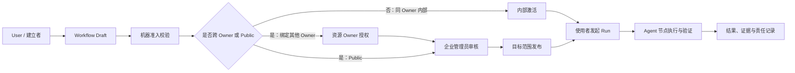

# Hive A2A Workflow 产品共识与北极星基线

> 2026-07-20 后续修订：本文中“Owner 是创建 Agent 的 User”的旧结论已被 `docs/agent-owner-and-user-offboarding-contract-2026-07-20.md` 取代。Creator/Sponsor 是不可变 provenance，`owner_user_id ?? creator_id` 才是当前 Owner；下文 Owner 权责均指当前 Owner。

> 日期：2026-07-20
>
> 状态：产品共识基线（北极星方向已收敛，业务细则待继续讨论）
>
> 范围：A2A 与确定性 Workflow 的企业定位、角色和 Owner 权责、创建与审核边界、节点判断与学习边界、产品评价指标
> 非范围：本轮不展开企业知识库总方案，不形成权限系统施工图，不修改任何实现

## 0. 文档目的

这份文档不是一次性给出完整 Workflow 方案，也不是技术实现规格。它完成四件事：

1. 把过去数轮讨论中已经确认的产品共识固定下来；
2. 明确 Workflow 面向企业用户的产品定位和北极星方向；
3. 把平台、Workflow 建立者、Agent、Agent Owner 和企业管理者的边界说明白；
4. 把尚未决定的问题保留下来，供后续围绕真实业务样例逐项讨论。

本文使用三种结论级别：

- **已确认共识**：可以作为后续产品设计的前提；
- **设计原则**：已被本轮方向接受，但仍需在具体业务场景中细化；
- **待讨论问题**：当前不能写成既定规则。

若本文的“已确认共识”与此前较早的研究草稿冲突，以本文记录的最新讨论结论为准；此前对毕升、StaffDeck 等项目的研究仍作为参考材料，不自动成为 Hive 的产品规则。

---

## 1. 核心结论

### 1.1 核心服务对象是企业用户

**已确认共识：Workflow 首先服务企业，而不是面向个人的通用自动化工具。**

核心用户包括：

- 普通业务人员：提交材料、补充信息、查看进度并接收结果；
- Workflow 建立者：把企业业务规则和协作关系固化成可运行流程；
- Agent Owner：决定自己的 Agent 可以代表自己承担什么责任；
- 企业管理者：建立企业级发布、风险、权限和职责分离规则。

同一 User 在企业中经常身兼数职，但系统仍必须分别记录他在某次动作中以什么身份行动、权限来自哪里、对什么对象负责。允许一人兼任，不等于把多个角色合并成一个含义模糊的“用户”。

### 1.2 Workflow 北极星

**已确认的北极星方向：**

> 让企业把多 Owner 的数字员工组织成责权清晰的确定性业务网络，在不牺牲 Agent 语义智能的前提下，持续提升受治理的业务闭环质量，并把人的注意力逐步集中到高风险判断、异常处理和标准制定。

Workflow 的价值终点不是画出流程图，也不是创建更多节点，而是完成真实、可担责的企业业务闭环。

### 1.3 A2A 不是一种固定状态

**已确认共识：A2A 包含两个独立但共享底层能力的产品形态。**

1. **Communication A2A**
   - 面向临时意图、临时委托和动态协作；
   - 不要求预先固化为 Workflow；
   - 允许 Agent 根据当前任务进行沟通、交接和结果回流；
   - 它解决的是“这一次如何协作”。

2. **Workflow A2A**
   - 面向重复发生、需要明确责任和稳定流转的业务流程；
   - 预先定义参与者、节点、流向、审核、证据与异常处理；
   - 它解决的是“这一类业务以后都如何协作”。

因此，不能把全部 A2A 都改造成固定 Workflow，也不能让需要确定性的业务流程继续依赖临时对话自行维持。

### 1.4 Workflow 的产品定位发生了变化

**已确认共识：Workflow 是建立在现有 A2A 规则之上的、定向且控制更精细的企业责任执行系统。**

此前的 Agent/A2A 模式主要解决组织内的沟通、委托和临时决策；确定性 Workflow 要进一步进入报税、法务、财务、审批等业务执行层，解决多 Agent、多 Owner、重复流程中的权责归属和真实损失风险。

在这个系统中，Agent 不是传统 SaaS 流程里的普通机械节点，而是具有语义判断能力的“智能节点”或“超级节点”。它可以理解非结构化材料、依据标准作出判断、解释理由并提出下一步，但仍在明确的流程、权限、证据和外部效果边界内工作。

它不是另一套与 A2A 平行、互不相干的 Agent 系统，也不是把多个 Agent 塞进一个多人 Session。它是在 A2A 的通信、委托和结果回流能力上，增加：

- 固定或受控变化的协作拓扑；
- 明确的业务角色和责任人；
- 可配置的人工验证点；
- 确定的流转与终止条件；
- 可审计的证据；
- 可暂停、恢复、重试和追责的运行状态。

这里的“确定性”主要约束允许的流程图、权限边界、状态、外部效果、证据和恢复，不意味着每次都必须走同一条直线，也不意味着用机械规则代替 Agent 在节点内的语义判断。

### 1.5 A2A 的完整协作主体

**已确认共识：需要独立身份、独立责任和独立权限控制的完整 A2A，发生在数字员工之间。**

- 独立数字员工是 A2A 网络中的正式协作主体；
- Sub-agent 是数字员工内部的执行单元，不天然成为企业责任网络中的独立主体；
- Sub-agent 的 SOP 可以由 Skill 或数字员工内部固定下来的 Workflow 管理；
- 只有当一个执行单元需要独立 Owner、独立权限、独立责任和独立审计身份时，才应上升为正式数字员工并进入 A2A。

---

## 2. 业务角色、资源所有权与企业治理必须分开

### 2.1 Owner 的唯一含义

**已确认共识（后续修订）：Owner 是当前承担 Agent 归属和责任的 User。**

Owner 由 `owner_user_id` 标识；仅 legacy 空值回退到 `creator_id`。它不能通过昵称、当前操作者、企业管理员身份或 Session 参与关系临时推断，也不能回退到历史 Sponsor。

Owner 表示的是人与 Agent 之间的归属和责任关系。它不是 Workflow 中新增的第四种业务角色。

### 2.2 Public 不会消除 Owner

**已确认共识：Public Agent 仍然有 Owner。**

Public 只代表 Owner 放开了某种使用或调用能力，不代表：

- Agent 变成无主资源；
- 所有人都可以管理或修改 Agent；
- 所有人都可以读取 Agent Owner 的 Workspace；
- 所有人都可以让 Agent 长期代表自己承担业务责任；
- 所有人都可以不经授权把该 Agent 固定绑定到自己的 Workflow；
- Agent 的 Owner 放弃了审批、撤销和追责权。

因此，“可以临时调用 Public Agent”和“可以把 Public Agent 固定编入 Workflow”必须是两个不同的授权动作。

### 2.3 三类 Workflow 参与意图

**已确认共识：从人的意图出发，Workflow 至少包含三类角色。**

| 角色 | 核心意图 | 主要权利与责任 |
|---|---|---|
| 建立者 / 创建者（Builder） | 把业务意图固化成一条 Workflow | 创建和编辑 Draft、选择参与 Agent/Workflow、描述节点责任、提交审核或发布 |
| 验证者 / 审查者（Validator） | 判断定义或业务节点是否满足责任标准 | 查看所需证据、作出通过/退回/拒绝等决定、留下理由和责任记录 |
| 使用者 / 提交者（User） | 使用已发布 Workflow 发起具体业务 | 按准入范围提交输入、查看有权查看的进度和结果、补充材料或响应要求 |

同一个 User 可以同时是建立者、验证者和使用者，也可以只承担其中一种角色。系统不能因为三种角色恰好由同一个人承担，就把它们在数据模型和审计记录中合并成一个模糊的“用户”。

每次关键动作至少需要明确：

- `actor_user_id`：是谁执行；
- `acting_as`：以建立者、发布审查者、节点验证者还是使用者身份执行；
- `authority_source`：权限来自所有权、角色分配、企业策略还是一次性授权；
- `object_scope`：动作针对哪个 Workflow、版本、节点或运行实例。

### 2.4 建立者不等于 Agent Owner

**已确认共识：业务角色和所有权关系是两条不同的轴。**

| 身份或关系 | 回答的问题 |
|---|---|
| Workflow 建立者 | 谁设计了业务流程和节点关系？ |
| Workflow Owner | 谁对这条 Workflow 的定义、发布和生命周期负责？ |
| Agent Owner | 谁拥有该 Agent，并决定它能否以什么条件进入 Workflow？ |
| 节点验证者 | 谁对某次 Run 中的节点判断承担业务责任？ |
| 使用者 | 谁有权发起和使用这条 Workflow？ |
| 企业管理者 | 谁制定企业级发布、风险和职责分离规则？ |

同一个 User 可以同时拥有多个身份，但 Workflow 建立者不能因为自己设计了流程，就覆盖其他 Agent Owner 的授权；Agent Owner 也不能单方面改写整条 Workflow。

发生分歧时遵循以下原则：

1. 企业硬政策是所有参与者都不能越过的上层边界；
2. Agent Owner 决定自己的 Agent 是否接受这份绑定和代表责任；
3. Workflow 建立者决定是否接受该 Agent Owner 的条件，以及是否继续在流程中使用该 Agent；
4. 双方无法达成一致时，结果是不能形成该绑定，而不是由任意一方强行覆盖另一方。

### 2.5 “验证者”需要拆成两个责任面

**设计原则：后续模型中不应只保留一个含义过宽的 Reviewer。**

1. **发布审查者**：审查 Workflow 定义是否可以进入某个发布范围；
2. **运行时节点验证者**：对某一次 Workflow Run 中的业务材料和 Agent 建议作出决定。

两者可能由同一个 User 承担，但审查对象、时机、证据和法律/业务责任不同，不能共用一条模糊的审批记录。

---

## 3. 创建、授权、审核和使用是四件不同的事

### 3.1 所有 User 都可以创建 Draft

**已确认共识：Workflow 的创建权应向所有 User 开放。**

“可以创建”只表示可以形成和编辑自己的 Draft，不自动表示：

- 可以绑定任意其他 Owner 的 Agent；
- 可以代表其他 Owner 作出长期承诺；
- 可以把 Workflow 发布给所有人；
- 可以绕过企业治理；
- 可以让未授权的使用者运行 Workflow。

### 3.2 同 Owner 内部组合不需要后台人工审核

**已确认共识：以下情况不需要企业管理员人工审核。**

- 一个 Owner 使用当前归属于自己的多个 Agent 组成内部 Workflow；
- 一个 Workflow 引用同一 Owner 的另一条 Workflow；
- 同一 Owner 的 Agent 在既有 A2A 权限范围内相互协作；
- Workflow 只在该 Owner 已被授权的内部范围内使用，且没有进入 Public 或跨 Owner 边界。

这里的逻辑不是“没有治理”，而是 Owner 对自己的 Agent、Workflow 和内部责任组合自行负责。平台或企业管理员不应替 Owner 审核其内部事务。

### 3.3 “后台审核”只指企业管理员

**已确认共识：Hive 平台不存在一个替企业审核内部业务流程的“平台管理员”。**

本文所说的后台审核，是企业治理范围内的企业管理员审核。Hive 平台负责提供权限、审计、证据和执行边界，但不充当企业业务责任的最终判断者。

### 3.4 Public Workflow 必须经过审核

**已确认共识：Workflow 一旦要 Public，就必须经过企业审核。**

Public 表示 Workflow 将被 Owner 边界之外的使用者发现或使用，影响范围已经从内部编排变成对外承诺。因此必须在发布前确认：

- 发布者是否有权公开该 Workflow；
- Workflow 中所有 Agent 与子 Workflow 的绑定是否合法；
- 是否包含其他 Owner 的资源；
- 公开范围与使用者准入是否清楚；
- 数据、Workspace、工具和外部效果是否会超出授权；
- 责任人、撤销方式和变更影响是否明确。

### 3.5 绑定其他 Owner 的 Agent 必须先取得 Owner 授权

**已确认共识：即使目标 Agent 已经 Public，也不能自动把它固定绑定到自己的 Workflow。**

Public Agent 的临时使用许可，不等于 Workflow Binding 许可。固定绑定会带来持续调用、稳定输入输出、版本依赖、责任承担和撤销影响，因此必须由该 Agent 的 Owner 明确授权。

这个授权与企业管理员审核不是同一件事：

- **Owner 授权**回答：“我的 Agent 是否愿意以这些条件进入这条 Workflow？”
- **企业管理员审核**回答：“这条 Workflow 是否允许在企业治理范围内进入目标发布状态？”

跨 Owner 场景不能用其中一个动作代替另一个动作。

### 3.6 当前审核边界矩阵

下表固定的是当前讨论中的产品边界，不是最终 API 或数据库模型：

| 组合场景 | 资源 Owner 授权 | 企业管理员人工审核 | 说明 |
|---|---:|---:|---|
| 只包含建立者当前拥有的 Agent / Workflow，供 Owner 内部使用 | 不需要额外授权 | 不需要 | Owner 对自己的内部组合负责 |
| 引用同一 Owner 的另一条 Workflow | 不需要额外授权 | 不需要 | 不因“引用 Workflow”本身触发人工审核 |
| 绑定其他 Owner 的 Public Agent | 需要 | 需要进入跨 Owner 治理 | Public 调用权不等于固定绑定权 |
| 绑定其他 Owner 的 Private Agent | 需要明确、定向授权 | 需要进入跨 Owner 治理 | 未授权时不能进入可运行定义 |
| Workflow 发布为 Public | 所有外部依赖均须已授权 | 必须 | Public 是独立的发布审核触发器 |

**设计原则：无须人工审核不等于无须机器校验。** 所有 Workflow 在激活前仍应完成结构、引用、权限、循环、版本、输入输出契约和失效依赖等确定性校验。机器校验用于证明契约成立，不能替企业管理员作业务判断。

---

## 4. Workflow 如何建立在现有 A2A 规则之上

### 4.1 现有 A2A 基础规则

**已确认共识：**

- 同一 Owner 的 Agent 之间进行 Communication A2A，不需要先建立额外 Relationship；
- Public Agent 可以在其公开使用范围内被临时调用；
- 临时调用不自动产生长期绑定、Workspace 共享、代表权或转委托权；
- Workflow 在这些规则之上增加固定依赖和精细控制，而不是推翻这些规则。

### 4.2 临时调用与固定绑定的边界

| 维度 | Communication A2A 临时调用 | Workflow A2A 固定绑定 |
|---|---|---|
| 意图 | 完成当前一次协作 | 重复执行同一类业务流程 |
| 关系持续时间 | 当前任务或 Session 范围 | 跟随 Workflow 版本持续存在 |
| 参与者变化 | 可由 Agent 在授权范围内动态选择 | 由 Workflow 定义和绑定授权约束 |
| 输入输出 | 可协商、可临时形成 | 需要声明节点契约和交付物 |
| 人工介入 | 由当前任务按需触发 | 预先声明节点责任与介入方式 |
| 外部 Owner | Public 能力可被临时使用 | 需要目标 Owner 的绑定授权 |
| 审核 | 不因一次普通调用自动触发发布审核 | 跨 Owner 或 Public 时进入治理审核 |
| 证据与恢复 | 保留调用链和结果回流 | 还需保留节点状态、审批、版本和恢复点 |

### 4.3 嵌套委托的建议边界

**设计原则：应区分“有权调用某 Agent”和“有权把该权限继续向下转委托”。**

例如，User Example Owner 调用 A，A 临时调用其他 Owner 的 Public Agent B，并不天然意味着 B 可以代表 Example Owner 或 A，再自主选择并调用另一个外部 Owner 的 C。

- 同 Owner 的 A、B、C：B 可以在原始任务和资源预算范围内自主调用 C；
- 跨 Owner：新的嵌套调用必须有明确的 delegation scope，不能仅凭上游一次 Public 调用无限扩散；
- 确定性 Workflow：允许的 A→B→C 路径应在发布前完成绑定、授权和治理审查，运行时只在该已批准图内流转。

这条边界保留 Agent 在授权范围内的自主性，同时防止一次调用被悄然放大成未授权的跨 Owner 协作网络。

### 4.4 从创建到使用的权责链

图中的三个治理动作不能互相替代：机器校验验证契约，Owner 授权资源进入流程，企业管理员决定是否允许跨边界发布或运行。

### 4.5 平台固定边界，不替企业制定业务流程

**已确认共识：平台不是 A→B→C 业务路径的制定者。**

- Workflow 建立者和相关 Agent Owner 定义业务目标、允许的节点、分支、判断责任和交付关系；
- 平台把被接受的定义编译并固定为可执行的允许图，保证运行不能悄然越界；
- Agent 在允许图内根据业务语义选择分支、形成判断和解释理由；
- 平台在读取数据、调用工具、转账、发布、转委托等真实效果发生前执行硬性权限和安全检查。

因此，平台与 Agent 的分工不是“平台负责思考、Agent 负责执行”，而是：

| 主体 | 主要责任 |
|---|---|
| 平台 | 身份与权限、允许图、状态机、效果门禁、证据、审计、恢复和资源上限 |
| Workflow 建立者与相关 Owner | 业务目标、流程拓扑、节点责任、输入输出、人工介入和判断标准 |
| Agent | 在授权证据和判断标准内进行语义理解、分析、选择、建议、执行和解释 |
| 人类责任人 | 制定或确认标准、处理高风险和异常判断、批准受控学习进入新版本 |

例如“未经允许不得转账”必须由平台在转账效果边界机械阻断，不能只写进 Prompt 期待 Agent 自觉遵守；但“这份合同的商业风险是否可接受”仍应由 Agent 在明确标准和证据下作出智能判断或形成供 Owner 确认的建议。

---

## 5. 节点责任与人工介入：当前可固定的原则

### 5.1 每个 Agent 节点都必须有局部责任

**已确认共识：整条 Workflow 必须有唯一的最终负责主体，但不能因此抹掉中间节点的责任。**

每个正式 Agent 节点至少需要明确：

- 从上一个节点接收什么输入、文件或引用；
- 按什么业务标准处理和判断；
- Agent 可以代表 Owner 自动完成到什么程度；
- 哪些情况必须由该 Agent 的 Owner 介入；
- 正常、退回、拒绝和异常分别流向哪里；
- 需要留存什么证据、建议、决定和交付物。

主 Agent 对最终交付负责；中间 Agent Owner 对自己节点被授权的决定和效果负责。两种责任同时存在，而不是二选一。

### 5.2 人工验证必须回到该 Agent 的 Owner

**已确认共识：当一个 Agent 节点要求人工担责时，默认验证者应是该 Agent 的 Owner。**

原因是 Agent 在业务流程中代表的是具体的人。不能因为 Workflow 由 A 创建，就让 A 的 Owner 越过 B 的 Owner，替 B 的节点承担本应属于 B 的业务责任。

如果企业未来需要代理审批、岗位审批或多人会签，也必须来自 Owner 或企业明确授予的结构化代理关系，不能由系统临时猜测“谁更高级”或“谁当前在线”。

### 5.3 两个业务模式，三个配置选项

**设计原则：节点真正的责任模式只有两个，配置界面可以有第三个继承项。**

1. **Owner Confirm / Ask me first**：Agent 先处理并形成建议，再由 Owner 对该节点作出最终决定；
2. **Owner Delegated Auto**：Owner 预先授权 Agent 在明确边界内代表自己自动完成该节点；
3. **Inherit**：仅表示继承 Workflow 或组织默认配置，不是第三种业务责任状态。

不建议继续把第二种模式直接命名为 `Bypass`。`Bypass` 容易同时被理解为跳过节点、跳过审核、跳过权限或 Agent 自己批准自己。这里真正发生的是 **Owner 把节点处理权委托给 Agent**，并不绕过责任。

“是否跳过整个节点”应是另一种流程路由语义，不能与“由 Agent 自动代表 Owner 完成”混为一谈。

### 5.4 每个智能节点都需要版本化 Decision Contract

**已确认共识：Agent 掌握语义判断，但不能单方面拥有或悄然改变业务标准。**

每个 Agent 节点都应有一份可审计、可版本化的 `Decision Contract`，至少声明：

- 节点要完成的业务目标；
- 必须读取的输入、材料和权威证据；
- 业务判断标准、正反例和不可违反的规则；
- Agent 可以调用的能力及允许产生的外部效果；
- 哪些风险、缺证、冲突或不确定性必须请求 Owner；
- 允许的输出、分支、退回和终止方式；
- 必须留下的理由、引用、结果和责任证据；
- 标准的 Owner、版本、有效期与适用范围。

判断标准分成三层，并保持明确优先级：

1. **企业政策与权威知识**：全企业不可违反的法务、财务、安全和业务规则；
2. **Workflow Decision Contract**：当前 Workflow 版本对这个节点规定的验收标准；
3. **Agent Memory / Skill**：Agent 从历史反馈中学习到的方法、偏好、案例和执行经验。

优先级为：

`企业政策与权威知识 > Workflow Decision Contract > Agent Memory / Skill`

Agent 的智能体现在如何理解证据、应用标准、处理模糊情况和解释结论，而不是未经授权重新定义标准。

### 5.5 Memory 负责学习，不能直接改写正在运行的标准

**已确认共识：Human-in-the-Loop 不只是一次审批，也是 Workflow 受控进化的反馈来源。**

正确的学习闭环是：

`Agent 判断 → 人类确认或纠正 → Memory/标准变更候选 → 独立评估 → Owner 确认 → 发布新版本`

需要严格区分：

- 人类对某次 Run 的纠正；
- Agent 对该纠正形成的 Memory；
- 是否把经验提升为新的 Workflow 标准；
- 新标准何时对后续 Run 生效。

一次例外不能被 Agent 自动学成永久规则，某个 Agent 在一条 Workflow 中获得的反馈也不能未经判断污染它参与的其他 Workflow。已经开始的 Run 使用哪个标准版本，必须留下机械可验证的事实。

### 5.6 人类参与应从重复判断迁移到高风险判断

**已确认方向：随着标准和 Agent 判断能力成熟，人类参与应显著下降。**

从初期约 80% 人工参与，逐步降到约 10% 的长期设想，可以作为成熟 Workflow 的方向性目标，但不能成为所有业务和风险等级的统一硬指标。报税、付款、合同签署等节点可能因企业政策或法规长期保留强制人工确认。

真正应该减少的是低风险、重复、没有新增判断价值的人工审核；应该保留的是：

- 高风险或不可逆效果；
- 证据不足、冲突或低置信度情况；
- 新类型异常；
- 业务标准制定和修改；
- 学习候选进入正式版本前的确认。

---

## 6. 本轮明确不定案的内容

以下问题会显著影响产品结构，需要在北极星方向下结合真实业务样例逐项讨论，不能在本轮文档中伪装成已确认方案：

1. **Workflow 发布范围**：仅 Owner 私有、团队可用、企业内部可用和 Public 是否需要四个独立层级；
2. **企业审核规则**：由哪类企业管理员审核，是否需要多人会签，什么条件下允许委托；
3. **Owner 绑定授权粒度**：按 Agent、Workflow、版本、调用目的、有效期、预算还是输入数据范围授权；
4. **授权撤销影响**：只阻止新 Run，还是同时暂停正在运行的 Run；
5. **版本与变更**：修改节点、Agent、子 Workflow、权限或输入输出契约后，何时形成新版本，何时需要重新授权和重新审核；
6. **运行中版本稳定性**：已开始的 Run 是否必须固定到启动时版本；
7. **嵌套 Workflow**：父 Workflow 是否必须展开检查全部传递依赖，以及子 Workflow 更新如何影响父 Workflow；
8. **节点验证动作**：通过、退回、拒绝、补充材料、转交和超时分别如何流转；
9. **职责分离**：同一 User 同时是建立者、验证者和使用者时，哪些高风险流程需要企业策略强制分离；
10. **异常与恢复**：Owner 不在线、Agent 不可用、权限撤销、外部依赖失败时，由谁决定继续、替换或终止；
11. **可视化表达**：普通使用者、Workflow 建立者、节点 Owner 和企业管理员分别需要看到多少图、状态和证据；
12. **指标精确口径**：统计窗口、风险权重、强制人工节点、正确权限阻断和结果观察期如何进入分子与分母。

这些问题都重要，但应先用一条真实的高价值企业流程验证产品语义，再进入详细业务和技术设计。

---

## 7. 产品评价指标

### 7.1 价值单位：受治理的有效业务闭环

**已确认方向：创建 Workflow、增加节点或发送 A2A 消息都不是最终价值。**

一次 Workflow Run 只有同时满足以下条件，才应计为“受治理的有效业务闭环”：

1. 到达预先声明的真实业务终态，而不是仅仅技术执行结束；
2. 结果被下游系统、责任人或业务验收机制接受；
3. 所有必须的 Owner 确认、企业规则和节点责任已经满足；
4. 必要输入、判断理由、审批和交付证据完整；
5. 没有越权读取、越权绑定、越权转委托或未经授权的外部效果；
6. 在约定观察期内没有发生重大返工、撤销、损失或合规事故。

### 7.2 指标体系

| 指标层 | 建议指标 | 要回答的问题 |
|---|---|---|
| 北极星价值 | 受治理的有效业务闭环数及闭环率 | Workflow 是否真实完成了有价值、可担责的企业业务？ |
| 自主能力 | 风险调整后的自主完成率 | 在允许自动化的节点中，有多少不再需要计划外人工介入？ |
| 人类效率 | 每次成功闭环消耗的人类注意力 | 人类是否从重复审核转向高风险判断和标准制定？ |
| 交付质量 | 下游接受率、返工率、撤销率、重大纠错率 | 结果是否真正可用，质量是否随反馈持续提升？ |
| 恢复能力 | 中断后恢复成功率、明确终止率 | 失败是否可恢复、可解释，而不是形成悬空任务？ |
| 安全护栏 | 越权和未经授权外部效果数量 | 是否在提高自动化的同时守住企业责任边界？ |

其中，重大越权、未经授权转账或其他高风险外部效果的目标必须是 `0`，不能用更高的自动化率抵消。

### 7.3 自动化率必须经过风险调整

简单计算“自动执行节点数 / 全部节点数”会鼓励取消必要审批，不能作为独立北极星。

风险调整后的统计至少需要遵守：

- 只把企业政策允许自动化的节点放进自动化率分母；
- 法规或企业明确要求人工确认的节点，不算作自动化失败；
- 预先设计的高风险人工 Gate 与运行中因 Agent 能力不足产生的计划外人工救火分开统计；
- 自动完成后发生返工、撤销或重大纠错的节点，不能被记为高质量自动化；
- 不同风险等级和业务类型分别观察，不能用低风险流程数量掩盖高风险流程质量。

因此，“从 80% 人工参与降到 10%”是成熟 Workflow 在合适风险范围内的方向，不是跨企业、跨场景统一考核的绝对数字。

### 7.4 质量评分必须来自业务结果和独立证据

Agent 可以给出自评、置信度和理由，但不能由执行结果的同一个 Agent 自己宣布成功并成为唯一质量真相。

Workflow 质量应综合：

- 真实业务终态；
- 下游接受或责任人验收；
- 必需证据和标准符合度；
- 后续返工、撤销、损失和合规结果；
- 人类纠正以及纠正后是否真正形成受控改进。

不同业务应有不同 Scorecard。报税、法务、销售线索和内容生产不能被压成一套没有业务含义的通用 LLM 分数。

### 7.5 下一轮设计顺序

下一轮不再重复讨论抽象北极星，而是选择一条存在真实责任和损失风险的企业流程作为共同样例，然后依次完成：

1. 定义该流程的建立者、Workflow Owner、Agent Owner、验证者、使用者和企业管理者；
2. 为每个智能节点定义 Decision Contract；
3. 定义同 Owner、跨 Owner 和 Public 三种授权与发布路径；
4. 定义人工确认、Owner Delegated Auto、退回、拒绝、超时和异常恢复；
5. 定义反馈如何形成 Memory 候选、如何评估并进入新版本；
6. 定义建立、运行、待办、证据和学习进度的可视化；
7. 最后进入数据模型、API、RuntimeTask、Session、统一权限和迁移方案。

---

## 8. 决策总账

### 8.1 已确认

- Workflow 的核心服务对象是企业用户，包括普通业务人员、Workflow 建立者、Agent Owner 和企业管理者；
- Workflow 的北极星是建立多 Owner、责权清晰、受治理且能受控学习的企业业务网络；
- A2A 分为 Communication A2A 与 Workflow A2A；
- 不是所有 A2A 都要固定成 Workflow；
- Workflow 是进入企业业务层的责任执行系统，而不仅是自动化画布；
- Agent 是具有语义判断能力的智能节点，但必须在明确的流程和效果边界内工作；
- 正式 A2A 主体是独立数字员工，Sub-agent 默认属于 Agent 内部执行；
- Creator 是不可变创建来源；Owner 是 `owner_user_id ?? creator_id` 解析出的当前责任主体；
- Public Agent 仍有 Owner；
- 建立者、验证者和使用者是三类独立意图，同一 User 可以兼任；
- Workflow 建立者不等于 Agent Owner，业务角色与资源所有权必须分别记录；
- 企业硬政策约束所有参与者；Agent Owner 决定是否接受绑定，建立者决定是否使用该 Agent；
- 所有 User 都可以创建 Workflow Draft；
- 同 Owner 的多个 Agent 和 Workflow 内部组合不需要企业管理员人工审核；
- 平台不替企业审核内部业务事务；
- Public Workflow 必须经过企业审核；
- 绑定其他 Owner 的 Agent，即使该 Agent 是 Public，也必须取得该 Owner 授权；
- 同 Owner Agent 的 Communication A2A 不需要额外 Relationship；
- Public Agent 的临时调用权不等于 Workflow 固定绑定权；
- 每条 Workflow 有最终负责主体，每个 Agent 节点也有自己的局部责任；
- 节点需要人工担责时，默认回到该 Agent 的 Owner；
- 业务参与方定义允许的流程图，平台负责固定和执行边界，而不是替企业制定业务路径；
- 平台负责权限、状态、外部效果、证据和恢复，Agent 负责授权范围内的语义判断；
- 节点业务标准采用企业政策、Workflow Decision Contract、Agent Memory/Skill 三层结构；
- Memory 可以形成学习和标准变更候选，但不能直接改写正在运行的标准；
- 人类参与应从重复判断迁移到高风险判断、异常处理和标准制定；
- 产品价值以受治理的有效业务闭环为核心，而不是 Workflow、节点或消息数量。

### 8.2 设计原则，细节待确认

- 发布审查者与运行时节点验证者应分开建模；
- 所有 Workflow 激活前都经过机器准入校验，但机器校验不等于人工审核；
- 跨 Owner 的嵌套转委托必须有明确 delegation scope；
- 节点责任模式采用 `Owner Confirm` 与 `Owner Delegated Auto` 两种，配置层另有 `Inherit`；
- 不再用含义模糊的 `Bypass` 表达 Owner 授权 Agent 自动代表；
- 每个智能节点应有版本化、可审计的 Decision Contract；
- 学习进入正式流程遵循“反馈—候选—评估—Owner 确认—新版本”；
- 自动化率必须按风险和自动化资格调整，不能把强制人工 Gate 算作失败；
- 质量必须由业务终态、下游接受、证据和后续返工共同验证，不能只依赖 Agent 自评；
- 受治理闭环指标必须同时设置责任、权限、恢复、体验和智能护栏。

### 8.3 待讨论

- 发布范围层级；
- 企业管理员审核流程；
- Owner Binding 授权的粒度、有效期和撤销；
- Workflow/节点版本与变更规则；
- 嵌套 Workflow 的传递依赖；
- 运行时节点状态、人工动作和超时策略；
- 高风险场景的职责分离；
- 异常恢复和在途 Run 处理；
- 面向不同角色的可视化信息架构；
- 第一条用于验证产品语义的真实企业 Workflow；
- 指标的风险权重、统计窗口、观察期和精确分子分母。

---

## 9. 本文的使用方式

北极星方向已经形成。下一轮应选择一条具有多 Agent、多 Owner、真实责任和损失风险的企业业务流程，重点把第 5.4 节的 Node Decision Contract 以及角色冲突、Owner 授权、人工 Gate 和学习升级过程走通。

待真实样例中的产品语义被共同确认后，再把第 6 节的问题逐项收敛为正式规则，并形成独立的 Workflow 产品规格与一次性完整技术施工图。在此之前，本文是共同讨论的权威基线，不代表已经授权开发。
