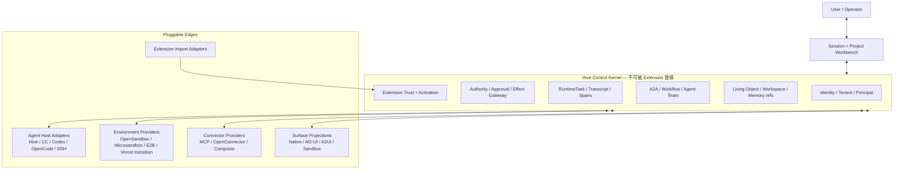

# Hive Agent Environment、Workbench 与 Extension Convergence 架构决策

> 日期：2026-08-23
>
> 状态：下一阶段方向、Environment Control Plane 首个 Change 与开源优先 provider 路线已由 owner 确认；OpenSandbox 仅为首选候选，最终采用仍取决于 live conformance
>
> 当前源码基线：`de66ac4ea8107254e9518d5119388f6e6d9f3526`
>
> 适用范围：Agent Runtime、Sandbox、Local Agent、A2A、Workflow、Agent Team、Session Workbench、Skills、MCP、插件与外部 Connector
>
> 不代表：本文不授权运行时代码修改、数据库迁移、旧接口删除、部署、供应商采购或第三方 package 升级
>
> 交付纪律：后续每个获批 Change 都必须一次闭环，包含迁移、回填、权限、恢复、观测、验收与旧路径清理；本文给出的是依赖关系，不是 MVP 分期许可

---

## 0. 执行摘要

Hive 下一阶段不应继续把 Vercel Sandbox 当作 `execute_code` 的临时补丁，也不应为了兼容 CC、Codex、OpenCode、DSH、MCP 与各类插件生态而继续增加平行子系统。

本文件记录六项架构决定：

1. **把 `ExecutionEnvironment` 建成一等产品能力。** `Agent` 是长期身份，`ExecutionEnvironment` 是可恢复的执行环境，`EnvironmentSession` 是一次实际启动的 VM/container/process。三者不得再混成 Session 或一次 command。
2. **默认每个 Agent 使用私有环境，但不做永久一对一绑定。** `agent_private` 是默认 scope；Team、Project 只有在显式授权后才能使用共享环境；高风险或探索性工作使用 `task_fork`。
3. **生产 Environment 采用开源优先、provider-neutral 路线。** OpenSandbox 是首选生产候选，Microsandbox 是本地候选，E2B 是成熟度基准/重型备选；Vercel 只保留为迁移、兼容和回滚 provider。候选角色已经确认，但任何第三方都必须先通过同一 live conformance，不能把研究结论写成已采用事实。
4. **核心内核保持小而不可插件化，边缘能力统一 provider/adapter 化。** 身份、权限、RuntimeTask、证据、恢复、A2A、Workflow 与 Team 语义属于 Hive Control Kernel；Agent Host、Environment、Connector、Extension import 与 UI projection 才是可插拔边缘。
5. **把需求与成果从 Session 中抽离到持久 Workbench。** Session 负责意图、过程、澄清和决策；Workbench/Living Object 负责长期对象、revision、ACL、协作、恢复与自定义 UI。AG-UI/A2UI 是投影协议，不是事实源。
6. **把 Skills、MCP、旧插件和 External Capability 收敛为一个用户概念 `Extensions`。** Extension package 只负责分发；权限、工具执行、Hook、Workflow、Agent Host 和 Environment 的实际权威仍由 Hive 内核分别治理。

一句话目标：

> **Hive 是团队 Agent 的身份、权限、协作与恢复控制面；不同 Agent Harness、执行环境、Connector 和 UI 生态通过受治理适配器接入，而不是各自形成新的运行真相。**

---

## 1. 决策状态与术语校正

### 1.1 已确认的方向

- 下一阶段需要从“单次 Vercel Sandbox 调用”升级为“每个 Agent 默认隔离、可恢复的执行环境”。
- 架构目标是 Simple 与插件化，优先复用成熟生态，不继续无边界自研。
- Hive 回归团队 Agent 平台核心：A2A、Workflow、Agent Team、统一权限、隔离环境和可恢复工作台。
- 先形成可审阅文档，再单独确认实施 Change。
- owner 于 2026-08-24 确认首个完整 Change 为 **Environment Control Plane**；正式落地计划见 `docs/wip/agent-environment-control-plane.md`。
- owner 于 2026-08-24 进一步确认 **开源优先、Vercel 过渡**：Hive 不把 Vercel persistent sandbox 当作终局；OpenSandbox 暂定首选生产候选，但必须通过 `ENV-A02` 的真实采用门才可成为默认 provider。

### 1.2 本文提出、仍需 owner 在实施前确认的产品选择

- 首个完整 Workbench 对象建议选择 `ProjectWorkbench`。
- 第一项 Environment Change 是否同时包含持久浏览器 profile 与交互式 browser surface。
- OpenSandbox 的 exact version/digest、Docker 或 Kubernetes backend、gVisor/Kata/Firecracker isolation profile 与部署拓扑；这些由 `ENV-A02` 证据决定，首选候选身份不等于已经采用。
- Connector 默认采用自托管 OpenConnector、托管 Composio，还是同时支持但只推荐一个默认值。
- 本地 Agent 的隔离等级：明确标记 trusted host，还是要求 rootless container、gVisor 或 VM。

### 1.3 名称校正

为避免后续实现建立在错误对象上，本文采用下列名称：

- 用户给出的 OpenBolt 链接实际指向 **CopilotKit OpenBot**。
- 用户提到的 Prem-Agent，本文按 **Prime Agent** 研究；若实际指另一个项目，需要在实施前更正。
- 用户提到的 OpenConnect / Compact，本文暂按 **OpenConnector / Composio** 理解；这项名称映射尚待 owner 最终确认。
- QM 指 **YC Software 的 QM 多 Agent 协作平台**。

---

## 2. 为什么当前方案只是补救，而不是完整方案

### 2.1 当前 Vercel 路径的真实语义

当前 `backend/app/services/code_execution/vercel_provider.py` 的主路径是：

```text
command arrives
  -> AsyncSandbox.create(...)
  -> upload workspace.tar.gz
  -> execute one command
  -> download workspace-out.tar.gz
  -> merge files back
  -> sandbox.stop()
```

这条路径提供了真实的 Firecracker microVM 隔离，但它的抽象单位仍是“一次命令”，不是“一个 Agent 的长期环境”：

- 每次 command 创建新 sandbox；
- workspace 与 agent-home 通过 tar 往返同步；
- command 结束后无条件 stop；
- 没有稳定 `environment_id`、generation、lease、checkpoint 或 fork 语义；
- RuntimeTask、Session、Agent 与 provider sandbox 之间没有持久绑定；
- provider snapshot 还没有进入 Hive 的恢复模型。

因此，当前缺陷首先是 Hive 只把 Vercel 实现成了 command provider；这不等于 Persistent Vercel 应成为长期终局。新的控制面必须先形成 provider-neutral truth，再由统一采用门选择开源默认实现。

### 2.2 当前 Credential Broker 仍不是凭据代理

`_brokered_credentials()` 目前只把 allowlisted 环境变量映射成 `cred://agent/<key>` 句柄，并在 evidence 中记录“不包含值”。这能防止 backend token 直接进入 microVM，但还没有形成真正的凭据代理：

- sandbox 内没有通过受控 gateway 兑换短期操作能力；
- 没有按 target/action/resource 注入 header 的 egress proxy；
- 没有 per-call revocation、receipt 与调用级审计；
- 句柄本身不能证明某次外部调用经过了 Hive 权限判定。

所以当前状态应表述为“原始凭据阻断已有基础，受治理 credential egress 尚未闭环”，不能称为完整 broker。

### 2.3 Session 无法承担长期工作台

Session 是一次交互与运行过程的容器。把需求、文件、UI 状态、Project 结构、审批、多人协作和长期成果都塞进 Session，会产生四个问题：

- 同一个成果跨 Session 后失去稳定 identity；
- UI state 与聊天 transcript 形成双事实源；
- Agent Team 很难围绕同一个可恢复对象协作；
- Session compaction、fork、关闭与业务对象生命周期相互绑死。

因此需要把“交互过程”和“长期工作对象”分离。

### 2.4 多套插件概念正在增加维护成本

当前 checkout 同时存在：

- Skills；
- MCP Servers；
- legacy `TenantInstalledPlugin` 与 agent assignment；
- External Capability Snapshot / Review / Activation；
- Codex plugin import adapter；
- Host 自己的 plugin、hook 与 skill 机制。

`get_agent_extensions()` 仍把 skills、mcp_servers、plugins 与 external activations 并列返回。这说明 UI 与 runtime 看到的是多个历史模型的拼接，而不是一个清晰的 Extension 生命周期。

---

## 3. 当前 checkout 的事实审计

以下状态只描述当前源码，不代表生产部署状态；内部 A2A、Workflow 与 Agent Team 的完整七原子审计也不在本文中重复展开。

| 能力 | 当前证据 | 状态 | 结论 |
|---|---|---:|---|
| Agent 逻辑 workspace | `agent_tool_domains/code_exec.py` 使用 Agent workspace，并按 authority scope 物化可写子集 | 局部闭环 | 有路径与资源边界，但不是独立长期 compute environment |
| Vercel command 隔离 | `vercel_provider.py` 调用真实 `AsyncSandbox.create()`，执行后 `sandbox.stop()` | 局部闭环 | 每 command 有 microVM，不等于每 Agent 有环境 |
| 开源 Environment provider | 当前无 OpenSandbox、E2B、Microsandbox 或 Kubernetes Agent Sandbox production adapter | 缺失 | 只能先做隔离环境中的 live conformance，不得把候选项目写成已接入 |
| 长期 `ExecutionEnvironment` | 当前无稳定 environment/session/lease/checkpoint 模型 | 缺失 | 需要新的一等领域模型与唯一执行入口 |
| Credential egress proxy | 当前只有 `cred://agent/...` 占位句柄与环境变量过滤 | 断点 | secret non-ingress 有基础，外部调用代理未闭环 |
| Remote workstation | `docs/remote-workstation-runtime.md` 是带前置条件的探索规格 | 缺失 | 应收敛为 Environment 的 browser/interactive profile，而不是第二套 runtime |
| Living Object / A2UI / AG-UI | `docs/hive-living-object-native-surface-architecture-2026-07-10.md` 明确标记目标而非落地 | 缺失 | 可作为 Workbench 上位设计输入，不能写成已实现 |
| 公共 A2A JSON-RPC | `interoperability.py` 明确返回 `not_exposed` | 缺失 | 内部能力应通过 adapter 投影，不重写内部执行引擎 |
| Extension 统一模型 | legacy plugins、MCP、Skills、External Capability 并存 | 断点 | 需要统一安装/激活语义和一次迁移清理 |
| Codex plugin import | 当前有 `codex_plugin_adapter.py`，本次检索未发现 production call | 断点 | 实施时必须接入真实 catalog/trust gate 或删除，不保留孤儿兼容层 |
| Vercel SDK | `backend/pyproject.toml` pin `vercel>=0.5.9,<0.6` | 已知约束 | 实施前需按目标 API 重核版本，不在本文授权升级 |

### 3.1 与既有文档的关系

- `docs/remote-workstation-runtime.md`：保留为 browser/interactive workstation 的场景资料；目标实现不得再新建一套与 `ExecutionEnvironment` 平行的生命周期。
- `docs/hive-living-object-native-surface-architecture-2026-07-10.md`：继续定义 Living Object 与 Surface 方向；本文把它落到 Project Workbench、Environment 与 Extension 的统一边界中。
- `docs/ccplus-north-star-contract-2026-06-24.md`：继续负责 CC 本地 Agent 语义基线；本文只定义 Host 如何接入 Hive，不削弱 CC/Codex/OpenCode 本身的能力。
- `docs/hive-sota-master-goal.md` 与 `docs/round2-sota-benchmark-2026.md`：继续负责整体能力与 benchmark；本文只收敛下一阶段架构。

---

## 4. 外部项目给出的有效信号

外部项目不是可以直接拷贝的答案。每个项目只解决了问题的一部分，其安全边界与 Hive 的企业控制面目标不同。

| 项目 | 值得吸收 | 不应照搬 |
|---|---|---|
| OpenBot | 每个 Bot 有独立 computer、workspace、browser profile；gateway 负责授权与审计；AG-UI/components 连接 Agent 与 UI | alpha 成熟度；普通 Docker 共享 host kernel；让 supervisor 持有 Docker socket；对 CopilotKit Intelligence 的依赖 |
| QM | per-scope durable sandbox；Harness/Session/Sandbox/Memory 接口分离；多 Harness 调度 | command policy 可绕过、egress 不完整、sandbox 中明文凭据等已知安全缺口 |
| Prime Agent | 持久 Python/IPython 控制环境；程序化组合 tools/subagents；小而清晰的 `/refine` 与 rollback | Python 进程拥有宿主 OS 权限；可执行 skills 的供应链风险；缺少 Hive 所需的企业权限、证据与 durable promotion |
| DeepSeek Harness | Cordis service injection、plugin lifecycle、profile/bundle layering；适合承接 DSH 自身生态 | “everything is plugin”不能进入 Hive 权限与证据内核；developer preview 的 breaking changes 风险 |
| OpenSandbox | Apache-2.0；统一 lifecycle/exec/files SDK 与 OpenAPI；Docker/Kubernetes backend；egress policy、Credential Vault、gVisor/Kata/Firecracker profile；可验证 release artifact | 尚不声明 stable v1；OTel、in-sandbox audit 与部分运维能力仍在演进；pause/resume 保存 filesystem 而非进程内存；Credential Vault 在 sidecar 重建后必须由可信控制面重新注入 |
| Kubernetes SIG Agent Sandbox | Kubernetes-native stable identity、Claim/Template/WarmPool、PVC suspend/resume 与 RuntimeClass 接入 | 更接近调度/生命周期底座；高层 exec/files SDK、claim-time identity/network policy 与 auto-resume 仍在演进，不能单独冒充完整 Hive provider contract |
| E2B Infra | Apache-2.0 Firecracker 数据面；snapshot/resume 与完整控制/数据面实现；适合作为成熟度和故障恢复基准 | self-host 需要 Terraform、Nomad/Consul、KVM 与多类节点/外部服务，首个默认部署的运维面明显更重 |
| Microsandbox | 可嵌入、local-first、OCI-compatible microVM；适合 Local Agent 与开发环境；支持本地 disk snapshot | 当前 snapshot 是 local disk-only，不承诺 resumable VM/process state；没有现成的多租户 fleet control plane，不能直接承担云端生产控制面 |
| Vercel Sandbox | 持久 sandbox identity、snapshot/resume、`getOrCreate`、fork、lifecycle hook、tag、custom image | provider API 不能成为 Hive 产品领域模型；snapshot 不能变成业务事实源 |
| OpenConnector | 自托管 Connector gateway 与较轻的数据托管边界 | 仍需 Hive 自己拥有 grant、审计、tool schema 与调用证据 |
| Composio | 托管连接器生态、account 与 action 管理 | 供应商数据托管、费用与锁定；不能让其 account 权限替代 Hive Agent grant |

结论不是选择某一个项目替代 Hive，而是把它们的成熟部件放在正确边界：

- OpenBot/QM 证明长期 environment 与 Agent 身份分离是必要的；OpenBot 只作为 browser/workbench/human-takeover donor，不作为 Hive Sandbox Control Plane；
- Prime 证明 programmatic shell 对复杂 Agent 很有效；
- DSH 证明 service/profile 式插件装配比散落 registry 更易扩展；
- OpenSandbox 是最贴近 Hive provider contract 的首选开源生产候选，但其版本、部署 profile 和缺失能力必须通过 live conformance 冻结；
- Kubernetes SIG Agent Sandbox 可作为 Kubernetes lifecycle/调度底座，Kata/Firecracker 或 gVisor 是部署隔离选择，而不是 Hive 产品状态；
- E2B 作为成熟度与重型 self-host 备选，Microsandbox 作为 Local Agent 候选；二者都不自动进入生产依赖；
- Vercel 保留为迁移、兼容与回滚 provider，不再是长期默认终局；
- OpenConnector/Composio 证明 connector account 与 Agent permission 应分层。

---

## 5. 目标架构：小内核、可插拔边缘



### 5.1 不可插件化的 Control Kernel

以下能力必须只有一个 Hive 权威入口：

- tenant、user、service principal、Agent identity 与 delegation；
- capability policy、approval、effect preflight 与 credential boundary；
- RuntimeTask、ChatTranscriptEvent、invocation spans、idempotency 与 recovery；
- A2A、Workflow 与 Agent Team 的内部语义；
- Living Object、Workspace、Memory 与 Artifact 的 canonical reference；
- Extension provenance、review、installation、activation、grant 与 revocation。

插件可以贡献能力，不能替换这些判断。尤其禁止：

- 插件自己判定当前 Agent 是否有权限；
- Host 直接把 tool call 发到外部系统而绕过 effect gateway；
- provider snapshot 覆盖 RuntimeTask 或对象 revision；
- Extension install 自动启用 Hook、MCP、工具或 workflow；
- UI action 直接写数据库或 provider filesystem。

### 5.2 可插拔边缘

可插拔边缘使用窄接口和 conformance test：

- `AgentHostProvider`：运行 Hive-native、CC、Codex、OpenCode、DSH 或远端 Agent；
- `EnvironmentProvider`：创建、恢复、执行、checkpoint、fork 与销毁环境；
- `ConnectorProvider`：发现 schema、执行外部 action、管理 account 与 receipt；
- `ExtensionImportAdapter`：读取第三方 package 并规范化为 Hive snapshot；
- `SurfaceProjectionAdapter`：把 RuntimeTask/Living Object 投影为 Native、AG-UI、A2UI 或 sandbox surface；
- `ChannelAdapter`：接收外部 ingress，但不拥有内部运行真相。

“插件化”在这里指**替换边缘实现而不改变核心语义**，不是让任何包都能覆写内核服务。

---

## 6. `ExecutionEnvironment` 领域模型

### 6.1 五个必须分开的概念

| 概念 | 生命周期 | 负责什么 | 不负责什么 |
|---|---|---|---|
| `Agent` | 长期 | identity、soul、memory、policy、capability | 不等于一台 VM，也不等于一个 Session |
| `ExecutionScope` | 长期或任务级 | 定义环境由 Agent、Team、Project 或 task fork 拥有 | 不执行命令 |
| `ExecutionEnvironment` | 长期、可恢复 | 稳定 logical ID、provider、image、filesystem/checkpoint、network/credential policy | 不拥有业务成果语义 |
| `EnvironmentSession` | 一次启动 | 当前 VM/container/process generation、runtime endpoint、heartbeat | 不作为长期 identity |
| `EnvironmentLease` | 短期 | 把 RuntimeTask/Session 以收敛后的权限、TTL、路径与工具范围附着到环境 | 不扩大调用者已有权限 |

建议增加 `EnvironmentCheckpoint` 作为恢复记录，而不是把 provider snapshot URL 直接塞进 Agent 或 RuntimeTask。

### 6.2 Scope 规则

```text
agent_private   默认；只绑定一个 Agent identity
team_shared     显式；由 Team membership + role + resource grant 决定
project_shared  显式；围绕一个 ProjectWorkbench / project ACL 协作
task_fork       从某个环境或 checkpoint 派生；默认不能反向修改 parent
```

默认规则：

- 新 Agent 可以拥有一个默认 private environment，但 Agent 与 Environment 不是永久 1:1；
- 一个 Agent 可以按项目绑定多个环境；
- Team/Project shared 必须由结构化 action 创建，不能从聊天自然语言暗示中推导；
- shared environment 的文件写入、checkpoint 与 merge 必须有冲突和所有权规则；
- 高风险代码、第三方 Extension eval、自进化 candidate eval 默认进入 `task_fork`；
- fork promotion 回到 parent 必须走 artifact/revision merge，不允许 provider 层静默覆盖。

### 6.3 Environment 不是事实源

| 信息 | Canonical authority | Environment 中的角色 |
|---|---|---|
| Agent identity / policy | Hive DB 与治理记录 | 只接收当前 lease 投影 |
| run ordering / resume | `RuntimeTask` + `ChatTranscriptEvent` | 执行当前 generation |
| Agent Memory / Soul | Agent Markdown Wiki / governed commit | 受权读取或提交候选，不以 snapshot 为准 |
| Workbench 内容 | Living Object revision store | materialized working copy / cache |
| 源码与普通文件 | Git、object store 或 workspace authority | checkout / mutable working tree |
| 工具与外部 action | ToolRuntimeService / invocation spans / receipt | 通过 SDK 请求执行 |
| provider filesystem | `EnvironmentCheckpoint` + provider generation | 恢复加速与临时状态，不创作业务真相 |

这样即使 provider 丢失、snapshot 损坏或更换，Hive 仍能从 canonical artifacts 重建环境，不会把云厂商快照变成不可迁移的第二数据库。

### 6.4 生命周期

```text
ensure
  -> attach / resume
  -> exec / connect / stream
  -> checkpoint
  -> stop / hibernate

optional branches:
  -> fork -> isolated work -> propose merge or abandon
  -> provider loss -> rehydrate from canonical checkpoint
  -> revoke lease -> deny new effects -> checkpoint if authorized -> stop
  -> destroy -> revoke handles -> delete provider state -> retain audit receipt
```

所有操作必须幂等，并区分：

- `unavailable`：provider 或网络暂不可用，可重试；
- `denied`：authority 不允许，重试不会改变结果；
- `approval_required`：需要结构化批准；
- `conflict`：revision/generation 不匹配；
- `expired`：lease 或 viewer token 过期；
- `destroyed`：环境已终止，只允许从合法 checkpoint 新建。

### 6.5 `EnvironmentProvider` 最小契约

协议必须语言中立；Python/TypeScript SDK 只是客户端投影。

```text
capabilities(provider) -> CapabilitySet
ensure_environment(spec, idempotency_key) -> EnvironmentRef
attach(environment_id, lease_spec) -> EnvironmentSessionRef
exec(session_id, command_spec) -> InvocationRef
stream(invocation_id) -> stdout/stderr/events
read/write_files(session_id, scoped_paths) -> receipts
checkpoint(session_id, expected_generation) -> CheckpointRef
fork(environment_id | checkpoint_id, fork_spec) -> EnvironmentRef
stop(session_id, reason) -> StopReceipt
destroy(environment_id, reason) -> DestroyReceipt
inspect(environment_id) -> typed state + provider evidence
```

Capability negotiation 至少覆盖：

- shell、files、PTY、streaming；
- persistent filesystem、snapshot/resume、fork；
- ports/viewer endpoint；
- browser/browser profile；
- custom image/template；
- network deny/allowlist/egress proxy；
- secret handle injection；
- idle timeout、absolute TTL、CPU/memory/storage quotas。

缺少能力时必须返回 typed `unsupported`，不能静默退回 raw subprocess 或 trusted host。

### 6.6 Provider 策略

#### 已确认策略与仍待证据结论

已确认的是产品方向，不是某个第三方版本已经通过验收：

- Hive 采用 **开源优先、provider-neutral** 的 Environment 路线；
- OpenSandbox 是首选生产候选；Microsandbox 是 Local Agent 候选；E2B 是成熟度基准与重型备选；
- Vercel 只作为迁移、兼容和回滚 provider，不再是长期默认；
- OpenBot 只提供 browser computer、viewer、human takeover 与 workbench 设计参考，不进入 Environment provider 选型；
- 最终 provider、exact artifact digest、部署 backend 与 isolation runtime 必须由统一 live conformance 产生，不能从 README、SDK type 或项目热度推断。

#### 候选角色矩阵

| 角色 | 候选 | 采用边界 |
|---|---|---|
| 生产默认候选 | OpenSandbox | `ENV-A02` 全部 mandatory gate 通过后才成为默认；Hive 不承诺其尚未闭环的能力 |
| Kubernetes lifecycle/调度底座 | Kubernetes SIG Agent Sandbox | 可作为 OpenSandbox backend/underlay；不直接替代 Hive exec/files/credential/evidence contract |
| 强隔离 runtime profile | Kata + VM isolation / Firecracker 或 gVisor | 属于部署 profile；必须在目标基础设施实测，不进入 `ExecutionEnvironment` 产品状态枚举 |
| 本地隔离候选 | Microsandbox | 通过目标 macOS/Linux host、OCI image、volume、network、secret 与 disk snapshot conformance 后使用 |
| 成熟度/恢复基准 | E2B Infra | 用于检验 Firecracker、snapshot/resume、故障恢复和运营模型；因 self-host 较重，不默认落为首个生产栈 |
| 迁移/回滚 | Vercel Sandbox | 现有 direct path 收敛到 adapter；只保留有界兼容窗口与明确退出条件 |

`ENV-A02` 只运行候选 conformance 和运维验证，不并行建设多个 production adapter。通过采用门后，`ENV-A05` 只实现一个首选开源 production provider；其它候选没有真实消费者时不得留下 adapter scaffolding。

#### OpenSandbox：首选开源生产候选

OpenSandbox 与 Hive 的窄 provider contract 最接近，但当前只能写成 **preferred candidate**：

- exact server/SDK/Helm/image digest 必须固定并验证签名、attestation、license 与依赖清单；不得追随 `main` 或 mutable tag；
- Docker 与 Kubernetes backend 分别是不同 operational profile；生产 profile 是否采用 Kubernetes SIG Agent Sandbox、Kata/Firecracker 或 gVisor，由目标环境的 isolation、pause/resume、network、cost 和 failure test 决定；
- OpenSandbox 尚不声明 stable v1，Hive 必须保存 capability snapshot、compatibility matrix、升级/回滚路径和不支持状态；
- Kubernetes pause/resume 当前恢复的是 root filesystem，不是进程内存、socket 或 CPU state；跨 restart/provider 的正确性只能依赖 canonical workspace 与 Hive evidence；
- Credential Vault 是 egress data-plane 能力，不是 Hive 的 credential authority。sidecar 重建或 pause/resume 后，可信控制面必须从 secret reference 重新注入窄 binding，再允许需要凭据的工作继续；真实 secret 不进入 Environment metadata、env、snapshot 或日志；
- OTel、agent in-sandbox audit、自动 idle pause/resume 与生产运维能力按 exact version 如实标成 supported/unsupported，不能用 roadmap 代替当前能力。

#### Vercel：有界迁移与回滚 provider

目标不是继续建设 Persistent Vercel 终局，而是安全退出当前 per-command 依赖：

- 现有 Vercel direct path 在 cutover 前收敛到同一 `EnvironmentProvider`/`EnvironmentService` 边界；
- 不向领域模型、公开 API、状态机或 workspace 写入只有 Vercel 才能解释的语义；provider ID、generation、snapshot ref 与 tag 只存在 provider projection；
- 新默认流量只在首选开源 provider 通过 conformance、跨 provider rehydrate、回滚与资源对账后切换；
- bounded rollback window 内可保留 Vercel adapter，但禁止继续从业务调用方 direct import；
- 当所有消费者已切换、canonical workspace 可在另一 provider 重建、回滚演练通过且 Vercel orphan 已对账后，按单独授权删除 adapter、凭据与外部资源。

跨 provider 恢复只承诺 canonical 文件、明确 metadata 与可重放证据；不伪装迁移运行中进程、内存、socket、临时未提交文件或 provider-private snapshot。

#### Local：必须准确声明信任等级

本地执行至少分成两种 provider profile：

- `local_trusted_host`：直接使用用户机器权限；可用但不得宣称 sandbox isolation；
- `local_isolated`：首选候选为 Microsandbox，或由 `ENV-A02` 证明的等价 microVM/container runtime。

Microsandbox 当前可作为 local-first microVM 候选，但 disk snapshot 不等于 resumable process state，也没有替 Hive 提供多租户 fleet control plane。Hive Connect 负责连接本地 Agent Host；除非它实际启动并证明隔离运行时，否则不能把“运行在本地”描述成“有 sandbox”。

---

## 7. Programmatic orchestration shell：借 Prime 的优点，不交出权威

Prime Agent 的关键优势不是“用 Python 写了 Agent”，而是给模型一个持久、可检查、可组合的 programmatic control environment。Hive 应吸收这类交互方式，但保持两层分离：

```text
Model-facing programmatic shell
  -> typed Hive SDK
  -> Authority / Tool / A2A / Environment gateways
  -> external effect
```

建议形态：

- Environment 内提供 Python-first persistent shell，可保存变量、数据处理过程和轻量 helper；
- `hive.tools.search()`、`hive.tools.call()`、`hive.agents.delegate()`、`hive.objects.read()` 等 SDK 只产生结构化请求；
- Tool schema 按需发现，不把几百个 connector schema 全塞进 prompt；
- 每个 effect 仍进入统一权限、审批、credential 与 invocation span；
- Python namespace 可以 checkpoint，但其中对象只保存 opaque refs，不保存 raw token；
- 可执行 Skill 或第三方代码始终在相应 Environment/Host 内运行，不进入 Hive backend Python 进程。

不采用的 Prime 路径：

- 不把同 OS 权限的 Python daemon 当作安全 sandbox；
- 不让 Python 代码直接拿 connector credentials；
- 不让 `/refine` 或 Skill 自修改直接 durable promotion；
- 不用一个 Python runtime 替代 RuntimeTask、Workflow、A2A 和 Team。

Python 是首个高杠杆交互语言，不是协议本身。未来 TypeScript code mode 可以复用同一 host SDK contract。

---

## 8. Session 与自定义 Workbench

### 8.1 产品边界

| Surface | 负责什么 | 不负责什么 |
|---|---|---|
| Session | 用户意图、对话、澄清、Agent 过程、决定、待批准事项、交付引用 | 不保存长期对象的唯一内容真相 |
| Project Workbench | 项目目标、对象关系、Team、Workflow、Todo/Findings、Artifacts、Files、Approvals、Environment bindings | 不替代 RuntimeTask 或 transcript |
| Living Object | 稳定 object ID、typed content、revision、ACL、provenance、rollback | 不决定每个客户端如何渲染 |
| Surface projection | inline、right canvas、fullscreen、自定义 UI | 不成为第二份对象数据 |

### 8.2 首个完整对象建议：`ProjectWorkbench`

选择 ProjectWorkbench 的原因是它能以一条真实用户路径连接现有核心：

```text
ProjectWorkbench
  ├─ members / Agent Team
  ├─ sessions / RuntimeTasks
  ├─ workflow runs / gates
  ├─ Todo + Progress + Findings
  ├─ Living Objects / artifacts / files
  ├─ approvals / decisions
  ├─ environment bindings
  └─ activity / evidence projections
```

同一个 Workbench 必须能在聊天内联卡片、右侧画布与全屏模式显示同一 `object_id + revision`，不能复制三份状态。

### 8.3 AI to UI 的正确叠层

- **Native React catalog**：Project、Dataset、Deck、Approval、Workflow、Team 等核心对象的高质量 renderer。
- **AG-UI**：把 Agent run、tool activity、state delta 与 UI action 投影给前端。
- **A2UI**：模型或外部 Agent 描述声明式组件树；它是可重建 projection，不是 storage schema。
- **Sandbox Surface**：任意 HTML/CSS/JS、MCP Apps 与长尾可视化，只能运行在独立 origin、无 ambient credential、无直接网络/Tool 权限的环境。

A2UI 与 AG-UI 仍在演进，接入时必须 exact pin，并放在 Hive adapter 后。协议变化不得迫使 Living Object 或 RuntimeTask 数据模型跟随漂移。

### 8.4 UI action 的唯一执行链

```text
user action on Surface
  -> typed ObjectAction
  -> object ACL + expected revision
  -> approval/effect preflight when needed
  -> RuntimeTask / ToolRuntimeService / Workflow
  -> typed receipt
  -> new Living Object revision
  -> AG-UI/A2UI/native projection refresh
```

UI 不能直接写 provider filesystem、connector 或核心表。Agent 也不能用自然语言字符串伪装成 approval。

---

## 9. A2A、Workflow 与 Agent Team：三个概念，一个执行真相

这三者都保留，但必须避免形成三套 scheduler。

| 概念 | 唯一职责 | 内部权威 |
|---|---|---|
| `RuntimeTask` | 一次 durable run 的状态、恢复与证据 | 所有 Agent/Workflow run 的执行真相 |
| `Workflow` | 确定性依赖、step、gate、wait/resume、quota | 通过 RuntimeTask 执行 leaf，不另建 Agent loop |
| `A2A` | Agent identity 之间的 delegation/message/artifact edge | 映射到 RuntimeTask、message 与 ArtifactRef |
| `AgentTeam` | membership、roles、共享 Workbench、导航与协作策略 | 不直接调度或复制 Workflow 状态机 |

### 9.1 Authority attenuation

每条边都只能收窄权限：

```text
principal authority
  ∩ agent capability policy
  ∩ team/project membership
  ∩ delegated task scope
  ∩ environment lease
  ∩ tool/connector grant
  ∩ current approval state
```

子 Agent、外部 A2A Agent、Workflow leaf 和 Host Adapter 都不得继承超出这组交集的能力。

### 9.2 公共 A2A 的正确落地方式

当前 public A2A JSON-RPC 标记为 `not_exposed`。未来若获批，应新增一个协议 adapter：

- A2A v1 Task ↔ internal RuntimeTask；
- A2A Message ↔ governed message edge；
- A2A Artifact ↔ immutable ArtifactRef / Living Object ref；
- external auth identity ↔ Hive principal/delegation；
- remote state/event ↔ typed projection 与 receipt。

不得为了“兼容 A2A”重写 Hive 的内部 runtime、Workflow 或 transcript truth。

---

## 10. Extension Convergence

### 10.1 一个用户概念，不等于一个万能运行时

用户面对统一的 `Extensions`：发现、审查、安装、激活、授权、升级、撤销。内部仍按 component type 使用不同安全边界。

建议 canonical 层次：

```text
ExtensionSource
  -> immutable ExtensionSnapshot
  -> tenant ExtensionInstallation
  -> Agent/Team/Project ExtensionActivation
  -> component-specific ExtensionGrant
  -> runtime projection
```

`ExtensionSnapshot` 至少记录：

- source、publisher、version、content hash、lock/provenance；
- normalized manifest 与原始 package ref；
- component list 与每个 component 的 permissions/risk；
- compatibility matrix 与 required host/provider；
- review result、known limitations 与 revocation status。

### 10.2 Component 类型

| Component | 运行位置 | 权威边界 |
|---|---|---|
| Skill | 作为 progressive instructions/reference 加载；可执行资产进入 sandbox | 加载 Skill 不自动获得工具权限 |
| Connector / MCP | Connector gateway 或受治理 MCP client | account credential 与 Agent grant 分离 |
| Agent Host Adapter | Hive Connect 或远端 host process | 所有效果回到 Hive gateway |
| Environment Provider | 独立 provider adapter | 只能实现生命周期，不能决定业务权限 |
| UI Pack | trusted catalog 或 Sandbox Surface | UI action 必须回到 ObjectAction/effect gateway |
| Hook | 明确 lifecycle point | 只观察或执行窄机械 invariant，不拥有语义判断 |
| Workflow definition | 数据化定义 | 实际执行仍由 Workflow core |
| Team/Subagent definition | 数据化角色与模板 | 实际 delegation 仍由 A2A/Team core |

### 10.3 安装与激活流程

```text
fetch
  -> inspect and normalize
  -> verify provenance/integrity
  -> static/dynamic review as required
  -> owner/admin accepts exact snapshot
  -> install into tenant inventory
  -> activate for exact Agent/Team/Project
  -> grant component-specific permissions
  -> project into Host/Environment/Connector/UI runtime
```

硬性规则：

- `fetch != accept != install != activate != grant`；
- 更新产生新 immutable snapshot，不在原版本上漂移；
- Extension package 是 distribution envelope，不是 authority；
- package 内声明的 permission 只是请求，不是批准；
- Host 自己的 plugin config 是 derived projection，可重建；
- disable/revoke 必须立即阻断新 effect，并保留历史 receipt；
- executable asset 按供应链风险处理，必须 pin、scan、sandbox、audit。

### 10.4 CC、Codex、OpenCode 与 DSH 生态接入

第三方生态通过 import/host 两条路径接入：

1. **Portable import**：只导入可证明可移植的 Skill、MCP definition、workflow/team data 或 UI component metadata。
2. **Run in native host**：任意 Host-specific executable plugin、hook、Cordis service 或内部 API 依赖，在对应 CC/Codex/OpenCode/DSH Host 内运行，通过 Hive Connect/A2A/AG-UI 与 Hive 协作。

不得把任意 DSH Cordis plugin 或 CC/Codex executable code 翻译后加载进 Hive backend 进程。

对 DSH 的采用原则：

- 借 service injection、lifecycle、profile/bundle layering；
- 把 DSH 作为 `AgentHostProvider`；
- portable component 才进入 Hive Extension catalog；
- Hive identity/authority/evidence kernel 不随 DSH 一起插件化。

### 10.5 旧插件系统的一次性收敛

后续获批的 Extension Change 必须一次完成：

1. 定义 canonical snapshot/install/activation/grant schema；
2. 将 `TenantInstalledPlugin`、agent assignments 与可迁移 External Capability 回填到新模型；
3. 为 Skills、MCP 与 Extension activation 提供单一 read model；
4. 把 Codex importer 接入真实 trust gate/catalog，或删除孤儿 adapter；
5. 在 parity、回填和 rollback 验证后切换所有 production readers；
6. 删除 legacy API、表、UI 与双写；
7. 保留 migration receipt、失败恢复和审计。

如迁移窗口必须 dual-read，它只能是有明确 cutover 与删除条件的迁移机制，不能成为永久架构。

---

## 11. Hive Connect 的边界与 fork 策略

Hive Connect 应被定位为 **Local/External Agent Host bridge**，不是 Sandbox，也不是第二个 Control Kernel。

职责：

- 启动或连接 Codex、CC、OpenCode、DSH 等 native host；
- 传递 attenuated authority envelope；
- 回传消息、artifact、approval request、tool/effect request 与 recovery receipt；
- 把本地 host 状态投影到 RuntimeTask/Workbench。

不负责：

- 自己发放 Hive 权限；
- 把本地 OS 执行冒充隔离环境；
- 持有另一套 canonical task/workflow truth；
- 为每个上游项目复制长期 fork。

2026-08-23 研究快照中，本地 Hive Connect fork 相对参考 upstream 已有明显扩展面。维护策略应调整为：

- 通用 Codex/CC/OpenCode 修复优先 upstream；
- downstream 只保留 Hive platform/channel、authority envelope、artifact/approval replay 与 packaging；
- 若 upstream 的静态 Go registry 阻止 out-of-tree adapter，优先贡献稳定 extension seam；
- 无法 upstream 时保留最小、pinned downstream build，不继续形成宽 fork。

---

## 12. Connector：连接归 principal，能力授予 Agent

“Personal 接入还是单 Agent 接入”不是二选一。正确模型是：

```text
ConnectedAccount
  owner = User | Tenant | ServicePrincipal

AgentConnectorGrant
  = agent_id
  + connected_account_id
  + allowed actions/resources/scopes
  + approval policy
  + validity/revocation

RuntimeTask
  -> short-lived opaque credential handle
  -> connector gateway injects token at egress
```

因此：

- OAuth/API connection 由可问责 principal 持有；
- Agent 只获得对特定 account、action、resource 的 grant；
- raw token 不进入 model context、Environment env、transcript、artifact 或 plugin config；
- Connector provider 可以是 OpenConnector 或 Composio，但 Hive 保留 grant、tool schema、effect preflight、receipt 与 audit；
- Team/Project 使用 connector 时仍需明确 account owner 与 delegated grant，不能用“共享环境”推导共享凭据。

---

## 13. 保留、复用、收敛与剥离

| 当前资产/方向 | 决策 | 目标 |
|---|---|---|
| Agent、Soul、Memory、RuntimeTask | 保留并强化 | 长期 identity、run truth 与自进化仍是 Hive 核心 |
| 内部 A2A、Workflow、Agent Team | 保留并收敛边界 | 一套 RuntimeTask truth；Team 不成为 scheduler |
| ToolRuntimeService / approval / spans | 保留为唯一 effect path | 所有 Host、Python shell、UI action 与 Connector 回流 |
| OpenSandbox | 首选候选，采用门后接入 | 作为默认开源 production Environment provider；不进入 Hive 领域语义 |
| Microsandbox | Local Agent 候选 | 在通过目标 host conformance 后承接 `local_isolated`，不冒充云端 fleet control plane |
| E2B Infra | 对标/重型备选 | 对标 Firecracker、snapshot/resume 与故障恢复；不默认引入整套重型 self-host 拓扑 |
| Kubernetes SIG Agent Sandbox + secure RuntimeClass | 部署底座候选 | 承接 Kubernetes lifecycle/调度/隔离，不替代 Hive provider API 与权限证据 |
| Vercel Sandbox provider | 有界迁移/回滚 | direct per-command path 收敛到 adapter；开源主路径验收后按退出条件剥离 |
| per-agent workspace authority | 复用 | 作为 canonical files/materialization 的一部分，不冒充完整环境 |
| remote workstation 设计 | 上收 | 变成 Environment 的 browser/interactive capability profile |
| Living Object / Native Surface 设计 | 复用并落到 Workbench | 对象为真相，UI 为投影 |
| Hive Connect | 收窄 | 外部 Host bridge；通用改动 upstream，Hive delta 最小化 |
| DSH plugin ecosystem | 通过 Host/import adapter 复用 | 不把 Cordis arbitrary code 引入 Hive backend |
| Skills、MCP、External Capability | 收敛到 Extensions 用户面 | component-specific runtime 不强行统一 |
| legacy Tenant plugin API/model | 迁移后删除 | 不保留永久双读、双写与重复 UI |
| orphan compatibility adapters | 接线或删除 | 每个模块必须 trace 到 live consumer |
| provider snapshot | 作为 recovery/cache | 不成为 Agent、Workbench 或 Memory 的 canonical truth |

Simple 的含义不是删除模型能力，而是删除重复权威、重复生命周期和不可证明的兼容层。

---

## 14. 隔离与安全边界

### 14.1 必须阻断的具体威胁

| 威胁 | 受保护资产 | 最小控制 |
|---|---|---|
| Agent A 读取 Agent B 的文件/变量 | workspace、memory、artifact | private scope 默认、lease path allowlist、cross-agent negative test |
| backend/任一 provider secret 进入环境 | platform credential | no ambient env、opaque handle、egress injection、resume 后由可信控制面重注入、secret scan |
| 恶意 Extension 扩权 | tenant data、external effects | immutable snapshot、review、activation/grant 分离、sandbox |
| 环境任意出网 exfiltrate | tenant/user data | deny-all 默认、target allowlist、connector proxy、egress receipt |
| shared environment 覆盖他人成果 | project files/object revisions | ACL、expected revision、scoped merge、conflict state |
| provider crash 伪装成 task success | run/evidence truth | RuntimeTask authoritative state、heartbeat、typed unavailable、rehydrate |
| fork 污染 parent | production project/environment | copy-on-write、explicit merge、promotion receipt |
| Host 绕过 Hive effect gate | credentials、external systems | host SDK/protocol enforcement、no raw tokens、audit conformance |
| UI/Sandbox Surface 直接执行高风险 action | external effects、object truth | isolated origin、capability bridge、typed ObjectAction、approval |

### 14.2 Credential 与 egress 的目标链

```text
model / code requests connector action
  -> Hive tool/connector gateway validates principal + Agent grant + approval
  -> gateway resolves credential internally
  -> egress proxy injects credential only for exact destination/action
  -> external call
  -> redacted result + receipt
  -> invocation span / RuntimeTask evidence
```

Environment 只能看见 opaque handle 或受限 local endpoint，不能读取原始 token。allowlist 只解决“能访问哪里”，不能替代“有权做什么”。

---

## 15. 七原子闭环标准

未来任何“Agent Environment 已落地”结论必须同时满足：

| 原子 | 目标闭环 |
|---|---|
| Input | Agent、Team、Project 或 RuntimeTask 通过结构化 action 创建、绑定、attach、fork、stop；输入可恢复 |
| Authority | tenant/principal、scope owner、membership、Agent policy、lease、tool/connector grant 与 approval 明确绑定 |
| Execution | 所有环境操作只经过一个 EnvironmentService/provider gateway；无 raw provider SDK 或 subprocess 旁路 |
| Evidence | RuntimeTask event、invocation span、environment generation、provider receipt、checkpoint ref 与 redacted network receipt 可关联 |
| Recovery | ensure/attach/checkpoint/resume/fork/stop/destroy 幂等；重启、重复投递、provider loss 与冲突都有支持的出口 |
| Consumption | `execute_code`、Agent Host、Workflow、Team、Workbench 与必要的 browser/code surface 实际走新环境路径 |
| Acceptance | 首选 OSS、local 与 Vercel migration profile 的真实 conformance、跨 provider canonical rehydrate、self-host/supply-chain verification、故障注入、跨 Agent 隔离、secret/egress negative tests、UI 主路径与 migration cleanup 全部验证 |

Extension 与 Workbench 也必须分别通过七原子检查，不能用“有 schema、有 API、有 adapter、有绿测试”替代真实 wiring proof。

### 15.1 Environment 必测失败探针

- Agent A 在默认 private scope 无法读取 Agent B 的文件、process、port、checkpoint 与 env。
- 显式 project_shared lease 只开放被 grant 的 path/action，撤销后新 effect 立即被拒绝。
- backend、OpenSandbox、Vercel 与 connector 原始 token 不出现在 env、stdout/stderr、transcript、artifact、checkpoint 或日志；egress sidecar/vault 重建后必须先恢复窄 credential binding，再恢复相关工作。
- provider session 消失后，RuntimeTask 不被标记 completed；可从合法 checkpoint rehydrate。
- 首选 provider 整体不可用时，可在另一真实 provider 从 canonical workspace 与 Hive metadata 重建；验收明确不声称迁移进程内存、socket、provider-private snapshot 或未提交临时状态。
- 相同 idempotency key 的 ensure/checkpoint/stop/destroy 不创建重复资源或重复副作用。
- deny-all、allowlist、approval_required、unavailable 与 denied 状态在模型和 UI 中可区分。
- task fork 的写入不改变 parent；显式 merge 遇到 revision conflict 时停止并给出恢复路径。
- provider 不支持某 capability 时返回 `unsupported`，绝不 raw subprocess fallback。

### 15.2 Extension 必测失败探针

- fetch package 后没有任何 Agent 自动获得工具、MCP、Hook 或 workflow。
- package 请求的权限与最终 grant 可逐项比较，未批准项不可执行。
- 相同版本不同 hash 被拒绝或隔离，不静默覆盖 snapshot。
- disable/revoke 后 active Host/Environment 的下一次调用被阻断，并留下 receipt。
- legacy 数据回填可重跑、可审计、可回滚；cutover 后不存在 production dual truth。
- DSH/CC/Codex arbitrary executable extension 不进入 Hive backend process。

### 15.3 Workbench 必测失败探针

- inline、canvas、fullscreen 读取同一个 object ID 与 revision。
- stale revision action 返回 conflict，不静默覆盖。
- Session 关闭、fork 或 compaction 不删除 Workbench 对象。
- UI action 未经 ACL/effect preflight 不能触发外部 action。
- Sandbox Surface 无 ambient credential、无直接 DB/Tool 权限、无默认网络。

---

## 16. 候选实施 Change 与依赖顺序

以下是可以独立验收的完整 Change，不是允许欠债的 Phase，也不是本文已经授权的任务。

### Change A — Environment Control Plane

完整范围：领域模型、DB migration/backfill decision、EnvironmentService、统一 OSS provider conformance、通过门禁的首选开源 production provider、local isolated provider、Vercel migration/rollback adapter、现有 code execution 迁移、lease/authority、checkpoint/resume/fork、network/credential boundary、observability、operator/UI 状态、cross-provider canonical rehydrate、self-host/supply-chain verification、legacy tar/per-command 路径清理与 Vercel 退出条件。需要凭据的 effect 继续通过 ToolRuntimeService/Connector 治理；没有真实消费者时不在 A 伪造通用 credential proxy。

owner 需要先决定：browser profile、viewer/PTY/ports 是否属于该 Change 的 accepted outcome。若不属于，它是独立产品能力，不得用半成品 browser scaffolding 混入 A。

### Change B — Extension Convergence

完整范围：canonical snapshot/install/activation/grant、Skills/MCP/legacy plugin/External Capability read model、import adapters、信任与升级/撤销、legacy 回填与 cutover、旧 API/table/UI 删除、Host projection 与完整回滚证据。

### Change C — Project Workbench Reference Object

完整范围：ProjectWorkbench/Living Object、revision/ACL/recovery、Session 引用、Team/Workflow/RuntimeTask/Todo/Artifact/Environment binding、Native renderer、AG-UI/A2UI adapters、typed actions、inline/canvas/fullscreen 同对象验收与 Sandbox Surface 边界。

### Change D — Public A2A Adapter

完整范围：A2A v1 Agent Card、Task/Message/Artifact mapping、external principal/delegation、streaming/reconnect/idempotency、approval与artifact provenance、conformance 与跨组织故障验收；内部 RuntimeTask/A2A engine 不重写。

建议依赖顺序：A 与 B 先确定受治理 capability substrate；C 消费 A/B；D 可在内部模型稳定后并行或随后完成。owner 已于 2026-08-24 选择先完成 A；该选择不自动授权运行时代码或部署。

---

## 17. 已确认顺序与下一次 owner 决策

owner 已于 2026-08-24 确认：

> **第一项完整 Change 是 Environment Control Plane。**

同日确认 Environment provider 路线：

> **开源优先，OpenSandbox 暂定首选生产候选，Microsandbox 暂定本地候选，E2B 作为成熟度/重型备选，Vercel 仅作迁移与回滚。最终 provider 必须先通过统一 live conformance。**

正式的范围、模块、依赖任务、migration、rollback 与 acceptance 计划见：

- `docs/wip/agent-environment-control-plane.md`

下一次只需确认 `ENV-OD-01`：持久 browser profile、viewer、PTY 与 exposed ports 是否属于 Change A。当前建议不包含；在 owner 确认前，这只是推荐，不是既定产品决定。OpenSandbox 的 exact version、backend 与 isolation profile 不需要预先靠偏好拍板，由 `ENV-A02` 机械证据决定；只有首选候选未通过 mandatory gate 时才回到 owner 决策。

---

## 18. 明确不在本文授权范围内

- 不修改 backend/frontend runtime；
- 不新建或迁移数据库表；
- 不升级 `vercel`、OpenSandbox、Microsandbox、CopilotKit、AG-UI、A2UI、DSH 或任何 Connector package；
- 不安装、购买或启用 OpenSandbox/E2B/Microsandbox/OpenConnector/Composio/Vercel 新产品或外部资源；
- 不删除 legacy plugin API/table/UI；
- 不部署 Railway/OpenSandbox/E2B/Microsandbox/Vercel；
- 不改变 Hive Connect fork 或向 upstream 提交；
- 不把本文建议写成已完成能力。

任何实施都需要单独的 Change intent、accepted outcome、七原子 acceptance、测试计划和 rollback。`docs/wip/agent-environment-control-plane.md` 当前只是可审阅计划，不是实施授权或 `.ultra` canonical task ledger。

---

## 19. 参考资料

### 19.1 当前仓库

- `backend/app/services/code_execution/vercel_provider.py`
- `backend/app/services/agent_tool_domains/code_exec.py`
- `backend/app/services/mcp_server_service.py`
- `backend/app/api/plugins.py`
- `backend/app/models/installed_plugin.py`
- `backend/app/models/external_capability.py`
- `backend/app/services/external_capabilities/codex_plugin_adapter.py`
- `backend/app/services/interoperability.py`
- `docs/remote-workstation-runtime.md`
- `docs/hive-living-object-native-surface-architecture-2026-07-10.md`
- `docs/ccplus-north-star-contract-2026-06-24.md`
- `docs/hive-sota-master-goal.md`
- `docs/round2-sota-benchmark-2026.md`

### 19.2 外部一手资料

- [CopilotKit OpenBot](https://github.com/CopilotKit/openbot)
- [OpenBot architecture](https://github.com/CopilotKit/openbot/blob/main/docs/architecture.md)
- [YC Software QM](https://github.com/yc-software/qm)
- [QM security](https://github.com/yc-software/qm/security)
- [Prime Agent architecture](https://github.com/PrimeIntellect-ai/prime-agent/blob/main/packages/coding-agent/docs/architecture.md)
- [Prime Agent RLM runtime](https://github.com/PrimeIntellect-ai/prime-agent/blob/main/packages/coding-agent/docs/rlm-runtime.md)
- [DeepSeek Harness architecture](https://github.com/deepseek-ai/deepseek-harness/blob/master/docs/architecture.md)
- [DeepSeek Harness](https://deepseek.com/harness/en/)
- [OpenSandbox](https://github.com/opensandbox-group/OpenSandbox)
- [OpenSandbox roadmap](https://github.com/opensandbox-group/OpenSandbox/blob/main/ROADMAP.md)
- [OpenSandbox configuration and secure runtimes](https://github.com/opensandbox-group/OpenSandbox/blob/main/docs/getting-started/configuration.md)
- [OpenSandbox pause/resume](https://github.com/opensandbox-group/OpenSandbox/blob/main/docs/guides/pause-resume.md)
- [OpenSandbox Credential Vault](https://github.com/opensandbox-group/OpenSandbox/blob/main/docs/guides/credential-vault.md)
- [OpenSandbox release verification](https://github.com/opensandbox-group/OpenSandbox/blob/main/docs/community/release-verification.md)
- [OpenSandbox + Kubernetes SIG Agent Sandbox OSEP](https://github.com/opensandbox-group/OpenSandbox/blob/main/oseps/0002-kubernetes-sigs-agent-sandbox-support.md)
- [Kubernetes SIG Agent Sandbox](https://github.com/kubernetes-sigs/agent-sandbox)
- [Kubernetes SIG Agent Sandbox roadmap](https://github.com/kubernetes-sigs/agent-sandbox/blob/main/roadmap.md)
- [E2B Infra architecture](https://github.com/e2b-dev/infra/blob/main/docs/ARCHITECTURE.md)
- [E2B self-host infrastructure](https://github.com/e2b-dev/infra)
- [Microsandbox](https://github.com/superradcompany/microsandbox)
- [Microsandbox snapshot contract](https://github.com/superradcompany/microsandbox/blob/main/docs/sdk/typescript/snapshots.mdx)
- [Vercel Sandbox persistence GA](https://vercel.com/changelog/sandbox-persistence-is-now-ga)
- [A2A specification](https://github.com/a2aproject/A2A/blob/main/docs/specification.md)
- [AG-UI introduction](https://github.com/ag-ui-protocol/ag-ui/blob/main/docs/introduction.mdx)
- [A2UI](https://github.com/a2ui-project/a2ui)
- [OpenConnector](https://github.com/oomol-lab/open-connector)
- [Composio](https://github.com/ComposioHQ/composio)

外部项目、协议和 SDK 在实施前必须重新核对当前版本、license、稳定性与 breaking changes；本文只固定 Hive 的边界，不固定第三方实现细节。
