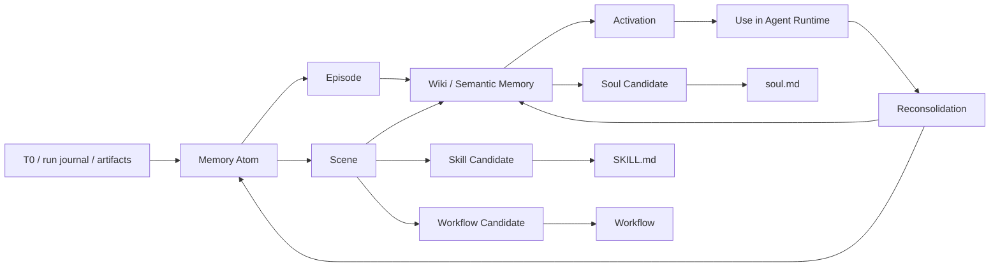

# Agent Memory MD-first Research

> Codex 独立研究稿。2026-06-04。  
> 目标：在不修改 `docs/knowledge-container-boundaries.md` 的前提下，单独研究 Agent Memory 的开源项目、论文、认知科学依据，并反推 Hive 的 MD-first 记忆链路应该如何串起来。

## 0. 结论先行

Hive 的记忆系统不应该被理解成“把更多内容塞进 context”，也不应该被实现成“vector DB + recall”。更稳的定义是：

> **Memory Engine = 以 Markdown 为真相源的认知压缩、激活、再巩固、晋升系统。**

它要做四件事：

1. **把经历编码成可追溯的记忆**：从 run journal / T0 到 atom、episode、scene、wiki，每一步都保留 source ref。
2. **把记忆组织成可检索、可验证、可降级的网络**：不是一次性摘要，而是带 entity、concept tag、time、sensitivity、confidence、lifecycle 的 Markdown 条目。
3. **把记忆和行为容器分流**：Memory 是证据与事实层；Soul、Skill、Flow 是从 Memory 中经验证晋升出的特殊容器，不是 Memory 的同义词。
4. **让使用本身反过来改进记忆**：每次 retrieval / use / contradiction / user correction 都进入 reconsolidation，而不是永远 append。

一句话版本：

> `soul.md` 是长期自我模型，`memory/*.md` 是可追溯事实与经历网络，`SKILL.md` 是验证过的方法论，`workflow` 是可执行的流程状态机；四者由 Memory Engine 的 capture、distill、activate、promote、reconsolidate 串成闭环。

## 1. Research 边界

本稿参考两类材料：

1. **开源项目**：
   - [TencentDB-Agent-Memory](https://github.com/Tencent/TencentDB-Agent-Memory)
   - [agentmemory](https://github.com/rohitg00/agentmemory)
   - [mem0](https://github.com/mem0ai/mem0)
   - [Graphiti](https://github.com/getzep/graphiti) / [Zep paper](https://arxiv.org/abs/2501.13956)
   - [Letta](https://github.com/letta-ai/letta) / [MemGPT paper](https://arxiv.org/abs/2310.08560)

2. **论文和认知科学基础**：
   - Agent memory / agent architecture：CoALA、Generative Agents、Reflexion、Voyager、MemGPT、MemoryBank、LongMemEval、A-MEM、Zep、MemOS、MemBench。
   - Cognitive science / neuroscience：Tulving episodic vs semantic memory、Baddeley working memory、Squire memory systems、Complementary Learning Systems、hippocampal indexing、sleep consolidation、reconsolidation、autobiographical self-memory system。

本稿不写复杂代码，不做 runtime 改动；它只回答：

1. MD-first 约束下，Hive 的记忆生命周期应该怎么串。
2. 蒸馏 prompt、concept tag、wiki、index、promotion gate 应该承担什么职责。
3. Soul / Memory / Skill / Flow 四个容器如何互相转化但不互相污染。

## 2. 认知科学给出的硬约束

### 2.1 记忆不是一个池子，而是多个系统

Tulving 的 episodic / semantic 区分给 Agent Memory 的直接启发是：

- **Episodic memory**：我经历过什么，发生在什么时间、地点、上下文。
- **Semantic memory**：我知道什么，哪些事实和概念已经脱离单次经历，成为可泛化知识。

Squire 的 memory systems 进一步说明，记忆不能只按“长期/短期”切分，还要区分 declarative、procedural、conditioning、priming 等系统。对 Hive 来说，这意味着：

- T0 / run journal 不是 T3。
- T3 fact 不是 skill。
- skill 不是 workflow。
- soul 不是普通 semantic memory，而是 autobiographical / identity memory 的特殊稳定区。

### 2.2 Working memory 是任务现场，不是长期记忆

Baddeley 的 working memory / episodic buffer 告诉我们：当前 context 应该被看成工作台，而不是仓库。Agent 在每轮执行时需要一个“当前可用的认知现场”，但这个现场应该由 activation 动态组装：

```text
current goal
  + current task state / Work Ledger
  + soul identity constraints
  + selected memory entries
  + selected skill / workflow instructions
  + source artifacts needed for this run
```

因此 Hive 不应该追求把 `memory/*.md` 全部常驻。正确目标是：

- soul 小而常驻。
- memory 索引常驻或轻量可见。
- memory 全文按需激活。
- workflow / Work Ledger 提供当前目标的执行状态。

### 2.3 Hippocampal indexing 支持“索引先行，全文按需展开”

Hippocampal indexing theory 的关键启发是：索引不等于内容本身。索引用于重新激活分散存储的经验内容。

对应到 MD-first：

- `memory/INDEX.md` 或 entry-level manifest 是 hippocampal index。
- `memory/*.md` 条目是可读事实。
- raw T0 / artifacts 是可回溯 source。
- derived vector / KG / BM25 只是可重建索引，不是真相源。

这支持 Hive 未来的“index first + load_memory(ids)”协议：context 中先放轻量索引和少量高优先条目；需要更多细节时再按 id 展开 Markdown 原文。

### 2.4 Complementary Learning Systems 支持快慢双环

Complementary Learning Systems 认为 hippocampus 快速记录新经验，neocortex 慢速整合稳定结构。Agent Memory 的工程等价物是：

```text
fast path:
  run journal / T0 -> atom candidate -> next-turn adaptation candidate

slow path:
  repeated atoms -> episode / scene -> semantic wiki -> skill / soul / workflow proposal
```

这也解释了 Hermes 给 Hive 的压力：单 agent 感知上的“聪明”来自快速学习；但 Hive 不能复制 Hermes 的直接写入，必须用 candidate、manifest、eval、approval、rollback 包住 fast loop。

### 2.5 Consolidation 不是摘要，Reconsolidation 也同样重要

MemoryBank 使用遗忘曲线模拟强化/衰减；neuroscience 中的 reconsolidation 说明：记忆在被检索后会重新进入可塑状态。对 Hive 的要求是：

- 被调用的记忆要记录 `access_count`、`last_accessed`、`use_outcome`。
- 被用户纠正的记忆要进入 contradiction / supersession。
- 被多次成功使用的策略才有资格晋升 skill。
- 被持续矛盾的 soul 条目要降级或生成修订 proposal。

### 2.6 Autobiographical memory 支持 soul 的边界

Conway & Pleydell-Pearce 的 self-memory system 把 autobiographical memory 与 working self 绑定。对 Hive 来说，`soul.md` 不是“最重要的 memory 文件”，而是 agent 的长期自我模型：

- 我是谁。
- 我为谁负责。
- 我如何定义好结果。
- 哪些权限与价值边界不可越过。
- 哪些长期偏好已经稳定到可以跨任务影响行为。

所以 `soul.md` 不应承载临时路径、当前项目细节、单次反馈、具体 SOP、工具配置。

## 3. 开源项目横向结论

### 3.1 TencentDB-Agent-Memory

关键设计：

- 短期 symbolic memory：raw refs、JSONL、Mermaid canvas。
- 长期 L0/L1/L2/L3：Conversation -> Atom -> Scenario -> Persona。
- 上层用 Markdown / Mermaid，底层可用 DB。
- 支持 `node_id` 追溯：Persona -> Scenario -> Atom -> Conversation。
- 配置中显式存在 recall strategy、budget、L1/L2/L3 周期、dedup、conflict、retention。

对 Hive 的启发：

1. **Atom / Scenario / Persona 这条链路值得借鉴**，但 Hive 要把 Persona 拆成 `soul_candidate`，不能让 L3 直接写 soul。
2. **Mermaid canvas 很适合 long-task / deep-research 的 working memory**，它不是长期事实，而是任务现场的可视化索引。
3. **traceability 是核心**：每个高层条目都必须能 drill down 到原始对话或 artifact。

### 3.2 agentmemory

关键设计：

- hook 驱动：SessionStart、UserPromptSubmit、PreToolUse、PostToolUse、Stop、SubagentStart/Stop 等。
- 四层记忆：working、episodic、semantic、procedural。
- hybrid retrieval：BM25 + vector + KG + reciprocal rank fusion。
- lifecycle：versioning、supersession、retention、audit、governance delete。
- multi-agent scope：agent id、shared / isolated memory。
- observability：viewer / traces / timeline / waterfall。

对 Hive 的启发：

1. **capture surface 要覆盖 agent lifecycle，而不是只覆盖 chat message**。工具前后、subagent 起止、通知、失败都应该是 memory signal。
2. **procedural memory 不能停在 T3 strategies**。重复成功的策略要有 skill candidate pipeline。
3. **memory observability 是产品能力**：用户需要看到“为什么这条记忆被写入、被召回、被晋升、被废弃”。

### 3.3 mem0

关键设计：

- ADD-only extraction：新事实优先追加，不覆盖旧事实。
- entity linking：新增 memory 要链接到相同实体/主题/事件。
- multi-signal retrieval：semantic、BM25、entity graph、temporal filter。
- 明确强调 assistant-generated facts 也是 first-class memory。
- prompt 中要求时间归一、归因、防 echo extraction、防 existing-memory contamination。

对 Hive 的启发：

1. **不要在抽取阶段过早合并或覆盖**。原子事实先保留，后续再由 reconsolidation 处理 contradiction / supersession。
2. **entity linking 是 MD-first 也必须有的字段**，哪怕图数据库只是 derived index。
3. **assistant 自己发现的事实也可以进 memory**，但必须标注 `attributed_to=assistant_inference`、confidence、source evidence，不能伪装成用户事实。

### 3.4 Graphiti / Zep

关键设计：

- Temporal knowledge graph：facts / edges 带 validity window。
- Episodes 保留 provenance。
- Facts 变化时 invalidated，不是简单删除。
- 支持 prescribed / learned ontology。
- 检索结合 semantic、BM25、graph traversal、reranking。

对 Hive 的启发：

1. **时间有效性必须是 memory metadata 的一等字段**：`valid_from`、`valid_until`、`observed_at`、`superseded_by`。
2. **关系型记忆不应埋在自然语言 bullet 里**。Hive 现有 understanding / relationship memory 方向是对的，应纳入统一 activation。
3. **KG 可以是 derived index**。MD-first 不排斥 graph；它只要求 graph 可由 Markdown 重建，且不是唯一真相源。

### 3.5 MemGPT / Letta

关键设计：

- 把 context window 类比成内存，把外部存储类比成磁盘。
- agent 通过 tool / function call 管理 virtual context。
- Letta 暴露 memory blocks，例如 `human`、`persona`。
- 强调“memory tier management”，不是单纯 RAG。

对 Hive 的启发：

1. **context management 是 agent 能力的一部分**：agent 应该能看到索引、请求展开、决定是否写候选。
2. **memory block 要有强语义边界**：Hive 的 block 不应只有 `human/persona`，而应对齐 Soul / Memory / Skill / Flow。
3. **virtual context 管理要被 governance 包住**：agent 可请求激活，但不能绕过 sensitivity / owner / company boundary。

## 4. 论文横向结论

| 论文 | 对 Hive 的关键启发 |
| --- | --- |
| [CoALA: Cognitive Architectures for Language Agents](https://arxiv.org/abs/2309.02427) | 语言 agent 应有 modular memory、structured action space、decision process。Hive 的 Memory Engine 应定义 memory action，而不是把记忆当被动文件。 |
| [Generative Agents](https://arxiv.org/abs/2304.03442) | observation、reflection、planning 都是行为可信度关键组件；完整经验记录 -> higher-level reflection -> dynamic retrieval 是 agent memory 基础链路。 |
| [Reflexion](https://arxiv.org/abs/2303.11366) | verbal reflection + episodic memory buffer 可以在不改模型权重的情况下提升下一次执行；Hive 的 fast reflection candidate 方向正确，但要纳入 lifecycle。 |
| [Voyager](https://arxiv.org/abs/2305.16291) | skill library 是终身学习的加速器；skill 必须可组合、可执行、经环境反馈和 self-verification 更新。 |
| [MemGPT](https://arxiv.org/abs/2310.08560) | memory tier management 和 virtual context 是核心，不是“更长上下文”。Hive 的 index-first / load-on-demand 应成为 runtime protocol。 |
| [MemoryBank](https://arxiv.org/abs/2305.10250) | 长期陪伴场景需要 memory update、personality adaptation、forget/reinforce。Hive 可借鉴 decay/reinforce，但要保留企业 audit。 |
| [LongMemEval](https://arxiv.org/abs/2410.10813) | 长期记忆能力至少包含 extraction、multi-session reasoning、temporal reasoning、knowledge updates、abstention；这可作为 Hive eval 维度。 |
| [A-MEM](https://arxiv.org/abs/2502.12110) | Zettelkasten 式 note、tag、link、dynamic indexing、memory evolution 很适合 MD-first；新 memory 加入时应反向更新旧 memory 的 context/links。 |
| [Zep](https://arxiv.org/abs/2501.13956) | 企业记忆需要 temporal KG 和多源动态知识整合；static RAG 不够。Hive 的公司级 agent memory 应关注 temporal relationship。 |
| [MemOS](https://arxiv.org/abs/2505.22101) | memory 应被提升为 first-class operational resource，并有 representation、organization、governance。Hive 的 Memory Control Plane 与此方向一致。 |
| [MemBench](https://arxiv.org/abs/2506.21605) | 评估应覆盖 factual / reflective memory，不同 interactive scenarios，以及 effectiveness / efficiency / capacity。Hive 的 bakeoff 应纳入这些维度。 |

## 5. MD-first 的核心立场

### 5.1 真相源与加速器分离

Hive 可以使用 SQLite、Postgres、Hindsight、BM25、vector index、temporal KG，但这些都应是 derived index。

```text
Markdown truth source
  -> parsed manifest
  -> BM25 index
  -> vector index
  -> temporal graph index
  -> prompt activation view
```

规则：

1. **人能读懂的 Markdown 是 durable truth source**。
2. **机器索引可重建**，不能成为唯一事实来源。
3. **每个索引结果必须能回到 Markdown entry_id / source_ref**。
4. **每个 Markdown entry 必须能回到 raw source 或 artifact**。

### 5.2 Everything is Markdown 不等于 Everything is one Markdown file

建议把 `memory/` 理解成一个 Markdown knowledge graph，而不是一堆无结构 bullet。可以保持现有物理布局，但逻辑上应有这些层：

```text
memory/
  INDEX.md                 # entry-level manifest, concept index, load ids
  feedback.md              # high-priority corrections and preference evidence
  blocked.md               # repeated failures, unresolved blockers
  user.md                  # user and owner model
  knowledge.md             # stable facts and project knowledge
  understandings.md        # relationship-shaped memory
  open_loops.md            # durable unresolved threads
  wiki/
    <concept>.md           # semantic schemas and consolidated concepts
  episodes/
    <episode-id>.md        # time-bounded experience clusters
  scenes/
    <scenario-id>.md       # repeated scenario / pattern clusters
  traces/
    <run-id>.md            # distilled trace summary, not raw log dump
```

这不是要求立刻改目录，而是定义逻辑边界：

- `feedback.md`、`blocked.md` 是 activation priority 不同。
- `user.md` 是 owner/user model。
- `knowledge.md` 是事实层。
- `wiki/*.md` 是概念层。
- `episodes/*.md` 是经历层。
- `scenes/*.md` 是模式层。
- `understandings.md` 是关系层。

### 5.3 Wiki 的位置

Wiki 不应是“随手放资料”的地方。Wiki 在认知结构中对应 semantic schema：

```markdown
# <Concept>

## Current Claim
- 当前最可信结论。

## Scope
- 适用范围。

## Evidence
- memory:<entry_id>
- episode:<episode_id>
- artifact:<path>

## Changes
- 2026-06-04: replaced older claim X because Y.

## Retrieval Tags
- concept:<name>
- project:<name>
- workflow:<name>
```

Wiki 的职责：

1. 把多个 atom / episode / scene 汇总成稳定概念。
2. 显式记录 evidence 和 supersession。
3. 给 retrieval 提供 schema-level 扩展，而不是替代原始记忆。
4. 作为 Skill / Flow / Soul promotion 的证据材料。

## 6. 记忆生命周期链路

完整链路应该是：

```text
Capture
  -> Encode
  -> Atom Extraction
  -> Episode / Scene Consolidation
  -> Semantic Wiki Consolidation
  -> Activation / Retrieval
  -> Use
  -> Reconsolidation
  -> Promotion / Retention / Retirement
```

### 6.1 Capture

输入：

- user message
- assistant response
- tool call before / after
- tool error
- subagent start / stop
- workflow step start / stop
- user correction
- approval / rejection
- runtime artifact refs

输出：

- T0 raw log / run journal / Work Ledger / RuntimeTask metadata。
- 不直接写 durable memory。

原则：

- Capture 是证据，不是结论。
- T0 可以脱敏、切分、引用 artifact，但不要 LLM 总结替代原文。
- PL4 credential 不能进入 durable T0/T2/T3。

### 6.2 Encode

输入：

- T0 / run journal / artifact refs。

输出：

- 当前任务的 working memory sketch。
- long-task 可用 Mermaid canvas / outline。
- candidate source packet。

作用：

- 给 extract LLM 提供完整但有结构的输入。
- 避免直接把长日志截断成低质量摘要。
- 标出 source ranges、artifact refs、speaker、time。

### 6.3 Atom Extraction

Atom 是最小可追溯记忆单位。它不应该同时承担 scenario、wiki、skill、soul 的职责。

建议 prompt 输出 schema：

```yaml
id: mem_atom_<stable_id>
source_ref: t0:<session>/<message_or_tool_id>
claim: "最小事实或观察"
attributed_to: user | assistant | tool | system | external_source
subject:
  type: user | agent | company | project | tool | workflow | external_entity
  name: ""
time:
  observed_at: "YYYY-MM-DDTHH:MM:SSZ"
  valid_from: null
  valid_until: null
confidence: 0.0-1.0
sensitivity: PL1_public | PL2_internal | PL3_sensitive | PL4_credential
memory_kind: episodic | semantic_candidate | procedural_candidate | identity_candidate | workflow_candidate
container_candidate: memory | soul_candidate | skill_candidate | workflow_candidate | artifact_only
tags:
  - project:<name>
  - concept:<name>
  - tool:<name>
  - failure:<class>
entities:
  - type: ""
    name: ""
linked_memory_ids: []
contradiction_of: []
replaces: []
evidence_quote: "短证据，不超过必要长度"
promotion_hint: "none | needs_repeat | needs_eval | needs_owner_approval"
```

Extractor 的硬规则：

1. 不从 generic filler 抽取。
2. 不把 assistant echo 当用户事实。
3. relative time 必须归一到 observation date。
4. 只从 source 提取，不用 existing memory 污染新事实。
5. 新旧冲突时先追加 atom，并标 `contradiction_of`，不直接覆盖。
6. 对 identity / procedural / workflow 只生成 candidate，不直接晋升。

### 6.4 Episode / Scene Consolidation

Episode 是一次经历簇；Scene 是重复出现的场景模式。

Episode schema：

```yaml
id: episode_<stable_id>
title: ""
time_range:
  start: ""
  end: ""
participants: []
goal: ""
outcome: success | partial | failed | blocked | unknown
source_atoms: []
artifacts: []
summary: ""
open_loops: []
lessons:
  - claim: ""
    evidence_atoms: []
```

Scene schema：

```yaml
id: scene_<stable_id>
pattern: "重复出现的问题或任务类型"
trigger_conditions: []
successful_moves: []
failure_modes: []
evidence_episodes: []
candidate_outputs:
  skill_candidate: null
  workflow_candidate: null
  soul_candidate: null
```

关键判断：

- Episode 解决“发生了什么”。
- Scene 解决“这种情况反复出现时，模式是什么”。
- Skill / Workflow 的候选应该从 Scene 出，不应该从单条 atom 直接出。

### 6.5 Semantic Wiki Consolidation

Wiki consolidator 负责把多个 atom / episode / scene 变成 concept page。

Prompt 必须要求：

1. 列出支持证据。
2. 列出反证或冲突。
3. 给出 validity scope。
4. 不足证据时保持 unresolved，不强行定论。
5. 输出 Markdown page patch，而不是直接覆盖全文。

### 6.6 Activation / Retrieval

Activation 不是 search 的同义词。它要同时考虑：

- goal relevance
- owner / company / current user authority
- sensitivity
- recency
- access history
- contradiction / supersession
- open loop relevance
- workflow / skill relevance
- budget

建议 retrieval 流程：

```text
query packet
  -> parse intent / entities / task type
  -> manifest candidate filter
  -> BM25 / vector / temporal graph derived search
  -> ActivationScorer
  -> prompt budget allocator
  -> render compact entries
  -> optional load_memory(ids)
```

激活输出不应只是 bullet 全文。建议结构：

```markdown
## Activated Memory

### Always-on identity
- source: soul.md#...

### High-priority direct memory
- [mem_123] claim ... why=owner correction, active, PL1

### Indexed memory available on demand
- [mem_456] title ... tags=project:x, concept:y, score=0.82
- [mem_789] title ... tags=workflow:z, score=0.77

Use `load_memory(["mem_456"])` if exact details are needed.
```

### 6.7 Use

每次 memory 被用于回答、工具调用、plan、workflow step 时，都要产出 usage signal：

```yaml
memory_id: mem_123
used_in: runtime_task:<id> | workflow_run:<id> | response:<id>
use_type: answer_context | tool_decision | plan_decision | verification | promotion_evidence
outcome: helpful | contradicted | irrelevant | harmful | unknown
evidence_ref: artifact_or_trace_ref
```

这会让 retention、promotion、retirement 有数据基础。

### 6.8 Reconsolidation

Reconsolidation 是本设计最容易缺失、但最关键的一环。

触发条件：

- memory 被激活并使用。
- 用户纠正了基于 memory 的回答。
- 新 atom 与旧 memory 冲突。
- workflow / skill 使用失败。
- 旧 memory 长期未被召回。

输出：

- update links
- add contradiction
- supersede old claim
- lower confidence
- merge duplicates
- split overloaded entry
- promote to wiki / skill / flow / soul candidate
- mark stale / archived

注意：Reconsolidation 不等于“自动改 soul”。它只是生成可审计 patch / candidate。

## 7. Concept Tag 体系

MD-first 要想不变成散文堆，必须有统一标签。

### 7.1 Cognitive Kind

```text
cog:working
cog:episodic
cog:semantic
cog:procedural
cog:autobiographical
cog:relationship
```

用途：

- working：当前任务现场。
- episodic：具体经历。
- semantic：稳定事实或概念。
- procedural：方法、策略、操作习惯。
- autobiographical：身份、自我模型、长期行为约束。
- relationship：人与人、agent 与 agent、owner/company 关系。

### 7.2 Container Candidate

```text
container:memory
container:soul_candidate
container:skill_candidate
container:workflow_candidate
container:artifact_only
```

规则：

- `container:memory` 可进入 T2/T3。
- `soul_candidate` 必须经过 dream / owner approval / charter boundary。
- `skill_candidate` 必须有 repeat + success evidence + eval。
- `workflow_candidate` 必须有 deterministic step / gate / resume value。
- `artifact_only` 不沉淀为长期知识，只保留引用。

### 7.3 Scope

```text
scope:user
scope:owner
scope:company
scope:project
scope:agent
scope:team
scope:tool
scope:external
```

Scope 决定 activation 权限和冲突处理。例如 owner preference 不一定等于 company policy；company policy 不一定对所有 tenant 可见。

### 7.4 Lifecycle

```text
state:candidate
state:active
state:contradicted
state:superseded
state:stale
state:pinned
state:archived
state:deleted_by_policy
```

规则：

- contradicted 不等于删除。
- superseded 要指向新 entry。
- stale 可以降低激活分。
- pinned 需要来源和理由。
- deleted_by_policy 只保留审计痕迹，不保留敏感内容。

### 7.5 Evidence / Quality

```text
confidence:0.0-1.0
evidence:direct_user | tool_result | source_doc | assistant_inference | repeated_success | eval_pass
sensitivity:PL1_public | PL2_internal | PL3_sensitive | PL4_credential
valid_from:<date>
valid_until:<date>
observed_at:<datetime>
```

没有 evidence 的 memory 不应晋升。

### 7.6 Retrieval Facets

```text
project:<name>
concept:<name>
entity:<name>
workflow:<name>
skill:<name>
tool:<name>
failure:<class>
channel:<name>
```

Facet 的目标不是美观，而是让 manifest、BM25、vector、KG 能用同一套字段。

## 8. Soul / Memory / Skill / Flow 的关系

### 8.1 Memory 是根，不是终点

所有长期容器都应该能回到 Memory 证据：

```text
Memory atom / episode / scene / wiki
  -> soul proposal
  -> skill proposal
  -> workflow proposal
```

但反过来不成立：

- soul 不是 memory 的普通文件。
- skill 不是 memory 的 strategies bullet。
- workflow 不是 memory 下的 SOP。
- artifact / Work Ledger 不是长期 memory。

### 8.2 Soul 的晋升条件

可进 soul 的内容：

- 长期身份。
- owner/company accountability。
- 冻结 charter。
- 跨任务行为原则。
- 长期稳定偏好。
- 被反复验证的自我修正。

不可进 soul 的内容：

- 临时项目事实。
- 单次用户反馈。
- 具体命令。
- 当前 workflow 状态。
- 文件路径和 API 细节。
- 未经审批的权限扩张。

Soul promotion gate：

```text
memory evidence
  + repeated signal or owner explicit instruction
  + no policy conflict
  + no active contradiction
  + budget check
  + owner approval if frozen / charter / authority boundary
  -> soul patch proposal
```

### 8.3 Skill 的晋升条件

可进 skill 的内容：

- 可重复执行的方法。
- 有触发条件。
- 有步骤。
- 有验证方式。
- 有失败处理。
- 可迁移到多个任务。

不可进 skill 的内容：

- 一次性事实。
- 项目当前状态。
- 模糊偏好。
- 未验证的灵感。
- 需要 workflow state machine 才能安全执行的流程。

Skill promotion gate：

```text
scene pattern
  + repeated success evidence
  + at least one failure/edge case considered
  + verification command or checklist
  + usage telemetry plan
  -> SKILL.md candidate
```

### 8.4 Flow / Workflow 的晋升条件

可进 workflow 的内容：

- 多步骤流程。
- 需要 durable state。
- 需要 checkpoint / resume / replay。
- 需要 verification gate。
- 需要多 agent / worker 协调。
- 需要审计证据。

不可进 workflow 的内容：

- 单个技巧。
- 简单偏好。
- 静态事实。
- 只有自然语言 SOP、没有状态与 gate 的文档。

Workflow promotion gate：

```text
scene pattern
  + repeated multi-step task
  + clear start/stop condition
  + durable state required
  + step journal / evidence shape
  + failure recovery
  + verification contract
  -> workflow definition candidate
```

### 8.5 四容器转化图



## 9. 蒸馏 Prompt 的分工

### 9.1 Extract Prompt

职责：从 source packet 中抽 atom。

必须回答：

1. 这是不是长期有用？
2. 它是 episodic / semantic / procedural / identity / workflow 中哪类？
3. 谁说的？证据在哪？
4. 它是否敏感？
5. 它是否和旧记忆冲突？
6. 它应进入 memory，还是只产生 candidate？

禁止：

- 直接改 soul。
- 直接写 skill。
- 直接写 workflow。
- 把未验证推论写成事实。

### 9.2 Scene Prompt

职责：从多个 atom / episode 发现重复场景。

必须回答：

1. 这个 pattern 是否重复出现？
2. 成功条件是什么？
3. 失败条件是什么？
4. 它是 strategy、skill、workflow，还是只是 fact cluster？
5. 证据是否足够？

### 9.3 Wiki Prompt

职责：维护 semantic concept page。

必须回答：

1. 当前最可信 claim 是什么？
2. 哪些 evidence 支持它？
3. 哪些 evidence 反驳它？
4. 有效范围是什么？
5. 旧 claim 如何 supersede？

### 9.4 Promotion Prompt

职责：把 memory-derived candidate 分流到 Soul / Skill / Flow。

必须回答：

```text
Is this:
  A. identity-level invariant?
  B. declarative fact?
  C. reusable procedure?
  D. durable workflow?
  E. runtime artifact only?
```

如果答案是 A：

- 走 soul proposal。

如果答案是 C：

- 走 skill candidate。

如果答案是 D：

- 走 workflow candidate。

如果答案是 B：

- 留在 memory/wiki。

如果答案是 E：

- 留在 artifact / Work Ledger，不进入长期容器。

## 10. Hive 当前系统的对齐与缺口

### 10.1 已经对齐的方向

从现有文档和源码路径看，Hive 已经有几个正确地基：

- T0 / T2 / T3 / soul pyramid。
- Memory Control Plane：write gate、sensitivity、owner/company context、activation。
- `prepare_memory_write()` 方向：memory write 不应绕过治理。
- `ActivationContext` 方向：read path 要带 owner/company/current user。
- understanding / relationship memory 方向：关系不是普通 bullet。
- lifecycle / access_count 方向：记忆不是写完就结束。
- fast reflection candidate 方向：下一轮学习需要快环。
- skill / workflow / soul 的 candidate 化方向：不能直接写入高风险容器。

### 10.2 仍然缺的不是“更多层”，而是“完整链路”

缺口不是再加第五层 memory，而是把已有部件串起来：

```text
capture signal
  -> atom schema
  -> concept tags
  -> entry manifest
  -> activation protocol
  -> usage telemetry
  -> reconsolidation
  -> promotion gate
  -> retirement
```

当前风险：

1. T3 bullet 仍容易承担过多职责。
2. strategies / knowledge / wiki 的边界会漂。
3. promotion 可能被多个 distiller 重复提出。
4. retrieval 还未完全变成 index-first / load-on-demand 协议。
5. usage telemetry 与 promotion/retirement 还没有形成统一闭环。

## 11. 建议的 Memory Engine 组件

不要求立刻写复杂代码，但概念上应明确这几个 engine：

| Engine | 输入 | 输出 | 职责 |
| --- | --- | --- | --- |
| `CaptureLoop` | message/tool/subagent/workflow/artifact signals | T0 / source packet | 保留证据，不做结论 |
| `AtomExtractor` | source packet | memory atoms | 生成最小可追溯事实 |
| `EpisodeConsolidator` | atoms | episodes | 聚合时间范围内经历 |
| `SceneConsolidator` | atoms / episodes | scenes | 发现重复模式 |
| `WikiCurator` | atoms / scenes / episodes | wiki pages | 维护 semantic schema |
| `ActivationEngine` | goal + manifest + indexes + policy | prompt memory view | 选取上下文 |
| `UsageRecorder` | runtime use signals | access/use metadata | 记录记忆是否有用 |
| `Reconsolidator` | use/correction/conflict/staleness | patch/candidate | 更新链接、冲突、置信度 |
| `PromotionRouter` | scene/wiki candidates | soul/skill/workflow proposals | 分流高阶容器 |
| `RetentionEngine` | lifecycle + usage + policy | stale/archive/delete proposal | 防孤儿和遗忘策略 |

## 12. 最小落地路线

### P0：先定 schema 和 prompt，不动 runtime 大结构

产物：

- atom schema。
- concept tag taxonomy。
- promotion router 判据。
- wiki page template。
- reconsolidation decision table。

验收：

- 任一 T2/T3 条目能回答：source、kind、scope、state、container candidate、evidence。
- 任一 candidate 能回答：为什么不是普通 memory。

### P1：entry-level manifest

把 `INDEX.md` 从文件级索引推进到 entry-level manifest：

```yaml
id: mem_...
file: memory/knowledge.md
heading: ...
preview: ...
tags: []
entities: []
sensitivity: ...
state: active
confidence: 0.82
source_refs: []
access_count: 0
last_accessed: null
```

验收：

- prompt 可只放 manifest preview。
- agent 可按 ids 请求全文。
- derived index 可从 manifest 重建。

### P2：抽取 prompt 加四路分流

在 extract / heartbeat / dream / skill_distiller 之间加入统一问题：

```text
This item is primarily:
  fact memory
  identity candidate
  procedural candidate
  workflow candidate
  artifact only
```

验收：

- 同一 signal 不会同时生成 skill 和 workflow 两份重复 candidate。
- single-event 不直接晋升 skill/soul/workflow。

### P3：Wiki / Scene curator

先不做复杂 KG，先用 Markdown：

- `memory/wiki/*.md`
- `memory/scenes/*.md`
- `memory/episodes/*.md`

验收：

- 每个 wiki claim 都能回到 atoms。
- 每个 scene 都能列出 evidence episodes。
- 每个 skill/workflow candidate 都来自 scene，而不是孤立 atom。

### P4：Activation 协议化

目标：

```text
manifest preview
  + high-priority direct memory
  + load_memory(ids)
```

验收：

- memory prompt 不再只是“命中 bullet 全文”。
- 被激活条目写 usage signal。
- suppressed sensitive memory 不增加 access_count。

### P5：Reconsolidation 和 Retention

目标：

- 被纠正的 memory 进入 contradiction。
- 被重复成功使用的 procedural scene 进入 skill candidate。
- 被长期零召回的条目进入 stale review。
- 被 workflow gate 验证成功的流程进入 workflow candidate。

验收：

- 有 `state:superseded`、`state:stale`、`state:contradicted` 的真实样例。
- promotion 以 usage/evidence 驱动，而不是 distiller 主观判断。

## 13. 判断准则

### 13.1 什么应该在 Memory

放入 Memory：

- 用户偏好证据。
- 项目事实。
- 失败记录。
- 成功策略的原始证据。
- 关系理解。
- open loop。
- 外部资料摘要及 source。
- workflow / skill / soul candidate 的证据。

不放入 Memory：

- 已固化的 workflow definition 本体。
- 已凝练的 SKILL.md 本体。
- 当前 run 的临时 TODO。
- 未蒸馏的大型 artifact。
- 应该进 soul 的 frozen charter。

### 13.2 什么应该在 Soul

放入 Soul：

- 身份。
- owner/company accountability。
- 长期不可变边界。
- 高置信跨任务行为原则。
- 冻结 charter。

不放入 Soul：

- 事实列表。
- SOP。
- 工具调用方法。
- 项目状态。
- 单次反馈。

### 13.3 什么应该在 Skill

放入 Skill：

- 可重复的方法论。
- 触发条件。
- 步骤。
- 验证方式。
- 失败处理。
- 示例。

不放入 Skill：

- 用户/项目事实。
- 身份原则。
- workflow run state。
- 只在一个项目里成立的临时流程。

### 13.4 什么应该在 Flow

放入 Flow：

- 可执行流程定义。
- step state。
- gate contract。
- resume / replay。
- verifier。
- 多 agent handoff。

不放入 Flow：

- 抽象做事原则。
- 无状态 checklist。
- 一条记忆。
- 单工具技巧。

## 14. 本稿对 Hive 的核心建议

1. **保留 T0/T2/T3/soul，不新增第五层**。新增的是 Memory Engine 链路和 entry schema，不是新容器。
2. **把 atom、episode、scene、wiki 作为 logical layer**。它们可以都存在 Markdown 中，不必一开始引入新数据库。
3. **把 derived index 当加速器**。BM25、vector、KG、Hindsight 都可用，但必须能从 Markdown 重建。
4. **把 promotion router 做成唯一分流口**。不要让 dream、heartbeat、skill_distiller、workflow_suggester 各自独立判断，避免重复晋升。
5. **把 usage telemetry 接到 reconsolidation**。没有 use outcome 的 memory 不该长期膨胀，也不该随意晋升。
6. **把 Wiki 定义成 semantic schema 层**。Wiki 不是杂物箱，而是概念页和证据页。
7. **把 workflow 与 procedural memory 分开**。procedural memory 是“观察到的做法”，skill 是“可复用方法”，workflow 是“可执行状态机”。
8. **把 brain science 的原则落实为工程约束**：快慢双环、索引先行、检索后再巩固、遗忘/衰减、身份记忆独立。

## 15. 与当前 Hive 代码的结合：Distiller 不应合并，应该收口权力

### 15.1 当前代码事实

当前 Hive 不是“一个蒸馏器重复写三遍”，而是三条不同频率、不同职责的链路：

| 当前组件 | 代码路径 | 当前职责 | 当前写入面 |
| --- | --- | --- | --- |
| 原始蒸馏器 / Extractor | `backend/app/services/extract_agent.py` | T0 / message / Work Ledger -> T2 learnings | `append_t2_entries()`，已走 `prepare_memory_write()` + `record_active_memory_lifecycle()` |
| Heartbeat | `backend/app/services/heartbeat.py` + `backend/app/templates/HEARTBEAT.md` | 平台后台 tick；T2 -> T3 策展；顺手跑 evolution / skill distillation | 通过 agent 工具读写 `memory/*.md`，后置 `validate_and_normalize_t3()` + Hindsight sync |
| Dream | `backend/app/services/auto_dream.py` | 低频 T3 整理、T3 merge/contradiction、soul promotion、T2 truncation、T0 cleanup | soul promotion 已接 evolution ledger；T3 merge/contradiction 仍直接改 Markdown |

另外还有一个相关但不应混为 memory distiller 的组件：

| 组件 | 代码路径 | 定位 |
| --- | --- | --- |
| Skill Distiller | `backend/app/services/skill_distiller.py`，由 Heartbeat 调起 | 从重复内部 workflow/tool evidence 中生成 Skill；这是 Skill promotion lane，不是 T2/T3/soul memory distiller |

这说明问题不在“蒸馏器数量太多”，而在“不同蒸馏器是否都拥有最终写入权”。当前最规整的是 Extractor，因为 T2 写入统一经过 `prepare_memory_write()`；最需要收口的是 Heartbeat 和 Dream 的 T3/soul/skill 权限边界。

### 15.2 是否需要减少蒸馏器总数？

**不建议按数量减少。**

保留三个 memory distiller 更符合快慢双环：

```text
Extractor: fast encoding
Heartbeat: medium curation
Dream: slow reconsolidation / identity promotion
```

真正要减少的是“最终裁决点”：

```text
多个 distiller 可以存在
但 promotion / lifecycle / write policy 必须只有一个横向 Memory Control Plane
```

如果为了“少组件”把 Heartbeat 和 Dream 合并，会丢两个重要性质：

1. Heartbeat 需要高频、增量、低风险地处理新 T2。
2. Dream 需要低频、全局、谨慎地做 T3 去重、冲突、身份晋升。

这两个节奏不同，不应合并成同一个 worker。

### 15.3 三者是取舍还是全部保留？

建议全部保留，但改名和降权：

| 旧称 | 建议新定位 | 允许做什么 | 不允许做什么 |
| --- | --- | --- | --- |
| Extractor | `AtomExtractor` | 从 source packet 抽 T2 atom；加 evidence / concept / lifecycle metadata | 不写 T3；不写 soul；不产 skill/workflow 文件 |
| Heartbeat | `MemoryCurator` | 从 T2 选择高价值内容，生成 T3 append candidate；维护 evolution context；触发 skill lane | 不直接 `save_skill`；不绕过 governed T3 append API；不重写 T3 |
| Dream | `Reconsolidator + IdentityPromoter` | T3 dedup、contradiction、supersession、soul proposal、retention | 不直接无记录删除 T3；不绕过 owner/charter gate 改 frozen soul |

也就是说：**保留 worker，收口 authority。**

### 15.4 Memory Control Plane 与 Distiller 的关系

Memory Control Plane 不是第四个蒸馏器，也不是和蒸馏器互相替代的组件。它是横向治理层：

```text
Distiller = 产生候选内容和判断理由
Memory Control Plane = 决定候选是否能写、能被谁读、是否激活、是否晋升、何时退役
```

对应代码里的已有基础：

- 写入安全：`memory/write_gate.py::prepare_memory_write`
- T2 lifecycle：`memory/t2_store.py::append_t2_entries`
- T3 manifest / index：`memory/md_store.py::build_t3_entry_manifest`
- 读取激活：`memory/retriever.py` + `memory/activation.py::ActivationContext`
- lifecycle sidecar：`memory/lifecycle_store.py`
- soul/skill promotion evidence：`services/evolution_ledger.py`
- Hindsight：`memory/hindsight_sync.py`，只应是 T3 Markdown 的 derived index

目标结构：

```text
Extractor ─┐
Heartbeat ├──▶ Memory Control Plane ───▶ MD truth source + lifecycle + derived indexes
Dream ────┘

Memory Control Plane 横切：
  write gate
  lifecycle state
  manifest/index
  activation policy
  promotion router
  retention/retirement
  audit/eval evidence
```

### 15.5 推荐结合方式：加 Promotion Router，不删 Distiller

当前文档里提出的 `PromotionRouter` 应落在 Heartbeat / Dream / SkillDistiller 之前：

```text
T2 atom / T3 entry / scene evidence
  -> PromotionRouter.classify()
      memory_append
      soul_candidate
      skill_candidate
      workflow_candidate
      artifact_only
  -> target-specific gate
```

它解决三个问题：

1. Heartbeat 不再在 prompt 里同时决定 T3、Skill、Workflow。
2. Dream 不再独自决定 soul 与 T3 rewrite。
3. SkillDistiller 不再从 raw session evidence 旁路 Memory Engine，而是消费 `skill_candidate` / `workflow_signature` 这类已归一化证据。

最小接口可以是：

```python
class PromotionKind(str, Enum):
    MEMORY_APPEND = "memory_append"
    SOUL_CANDIDATE = "soul_candidate"
    SKILL_CANDIDATE = "skill_candidate"
    WORKFLOW_CANDIDATE = "workflow_candidate"
    ARTIFACT_ONLY = "artifact_only"


@dataclass
class PromotionCandidate:
    kind: PromotionKind
    content: str
    source_refs: list[str]
    evidence: str
    confidence: float
    scope: str
    concept: str | None = None
    reason: str = ""
```

这不是复杂实现，第一版可以只是一个纯函数 + tests：

```text
category=strategy + repeated_success + no durable_state -> skill_candidate
category=strategy + durable_state/resume/gate -> workflow_candidate
category=feedback/constraint + stable/repeated -> soul_candidate or memory_append
category=project/reference/user -> memory_append
session-local/artifact ref only -> artifact_only
```

### 15.6 具体改造点

#### P0：先改文案和边界，不动运行路径

改：

- `backend/app/templates/HEARTBEAT.md`
- `backend/app/services/extract_agent.py` 的 prompt
- `backend/app/services/auto_dream.py` 的 prompt

目标：

1. 三个 prompt 都显式回答 container candidate。
2. Heartbeat prompt 删除或弱化“可直接 `save_skill`”的授权。
3. Heartbeat 只生成 skill/workflow candidate signal，不直接保存 skill。
4. Dream 明确“soul promotion 是 proposal / ledger-backed decision，不是自由写身份”。

#### P1：把 T3 append 收敛到 governed API

当前 Extractor -> T2 已走 write gate；`save_memory` -> T3 也走 write gate；但 Heartbeat 通过 `write_file` 写 T3，Dream 对 T3 merge/contradiction 直接改文件。

建议补一个窄 API：

```python
append_t3_memory_candidate(
    agent_id,
    category,
    content,
    source_refs,
    evidence,
    confidence,
    proposed_by="heartbeat|dream|manual",
)
```

内部统一调用：

```text
prepare_memory_write
find_similar_t3_entries
append_t3_entry
record_active_memory_lifecycle
rebuild_index
sync_t3_to_hindsight(best-effort)
```

这样 Heartbeat 仍能策展，但不能绕过 Memory Control Plane。

#### P2：Dream 的 T3 merge/contradiction 改成 lifecycle patch

当前 `_apply_dream_decisions()` 对 T3 merge 和 contradiction 是直接 drop line。建议改成：

```text
old entry -> state:superseded / archived
new entry -> active, supersedes=[old]
INDEX.md / lifecycle.json -> 同步
```

MD-first 不要求永远不删，但删除必须有 lifecycle 记录。否则以后很难解释“为什么这条记忆消失了”。

#### P3：SkillDistiller 接 PromotionRouter

当前 `skill_distiller.py` 自己从内部 session evidence 聚合 workflow signature，再直接保存 skill。这个方向比 Heartbeat prompt 直接 `save_skill` 好，但仍和 Memory Engine 是并行关系。

建议改成：

```text
Heartbeat / fast reflection / Work Ledger
  -> PromotionRouter emits skill_candidate / workflow_candidate
  -> skill_distiller consumes skill_candidate evidence
  -> evolution eval
  -> _save_skill
```

好处：

- Skill 和 Workflow 分流统一。
- repeated workflow signal 不会同时被写成 T3 strategy、Skill、Workflow 三份。
- SkillDistiller 的 evidence 可回到 memory entry ids / runtime artifacts。

#### P4：Memory Control Plane 增加 distillation audit

每个 distiller 输出应记录：

```yaml
distiller: extractor | heartbeat | dream | skill_distiller
input_refs: []
output_candidates: []
accepted: []
rejected: []
held: []
policy_reason: ""
```

这可以先落在 Markdown / JSONL artifact，不必上复杂表。

### 15.7 最终回答三个问题

1. **是否需要减少蒸馏器总数？**  
   不需要先减少。三者对应快、中、慢三种认知节奏；删掉会损失能力。要减少的是直接写入点和晋升裁决点。

2. **三者之间取舍还是全部保留？**  
   全部保留，但重新定义边界：Extractor 抽 atom，Heartbeat 策展 memory candidate，Dream 做 reconsolidation / identity proposal。SkillDistiller 作为 promotion lane，不再让 Heartbeat prompt 直接 `save_skill`。

3. **横向 Memory 机制和蒸馏器如何结合？**  
   Memory Control Plane 是横切层，不是第四个 distiller。所有 distiller 只产候选和理由；所有 durable write、activation、promotion、retention、audit 都经过 Memory Control Plane。

## 16. 落地顺序规划

### 16.1 总原则

先后端、再前端；先 read model、再交互；先候选和审计、再自动晋升。

原因：

1. 前端现在难懂，不只是样式问题，而是后端没有给它一个“知识系统”的稳定 read model。
2. 如果前端继续直接暴露 `soul.md`、`memory/`、`evolution/`、`skills/`、`workflows/` 文件夹，界面再美也只是更漂亮的文件浏览器。
3. Memory Engine 的关键是解释链路：这条记忆从哪里来、被谁蒸馏、为什么激活、为什么晋升、现在是否仍有效。

推荐顺序：

```text
P0 terminology + prompt contract
  -> P1 PromotionRouter pure seam
  -> P2 governed T3 append API
  -> P3 Dream lifecycle patch
  -> P4 Skill/Workflow candidate lane
  -> P5 Knowledge read model API
  -> P6 Agent Knowledge UI
  -> P7 advanced graph/wiki/candidate workflows
```

### 16.2 P0：冻结术语和蒸馏器边界

目标：不改运行行为，先把 prompt / docs / labels 对齐。

改动点：

- `backend/app/services/extract_agent.py`
- `backend/app/templates/HEARTBEAT.md`
- `backend/app/services/auto_dream.py`
- 本文档 / `knowledge-container-boundaries.md` 后续可引用，但不要混写。

验收：

- Extractor 明确自己只做 atom extraction。
- Heartbeat 明确自己是 Memory Curator，不是 Skill/Workflow 最终晋升器。
- Dream 明确自己是 Reconsolidator + IdentityPromoter，不是自由身份编辑器。
- 三者 prompt 都输出或考虑 `container_candidate`。

### 16.3 P1：PromotionRouter 纯函数 seam

目标：先做一个无 IO 的分类器，把“这条东西该去哪”统一。

建议新模块：

```text
backend/app/memory/promotion_router.py
backend/tests/memory/test_promotion_router.py
```

第一版只做规则 + schema，不接 LLM：

```text
feedback / constraint -> memory_append or soul_candidate
project / reference / user -> memory_append
strategy + repeated_success + no durable state -> skill_candidate
strategy + durable state / resume / verifier / multi-step gate -> workflow_candidate
runtime artifact / temporary state -> artifact_only
```

验收：

- 同一条 repeated workflow signal 不会同时被归到 `memory_append`、`skill_candidate`、`workflow_candidate`。
- 所有输出都有 `source_refs`、`evidence`、`confidence`、`reason`。

### 16.4 P2：T3 写入收敛到 governed append API

目标：把 Heartbeat 对 T3 的写入从 `write_file` 语义收敛到 Memory Control Plane。

建议新接口：

```text
backend/app/memory/t3_store.py
append_t3_memory_candidate(...)
```

内部统一调用：

```text
prepare_memory_write
find_similar_t3_entries
append_t3_entry
record_active_memory_lifecycle
rebuild_index
sync_t3_to_hindsight(best-effort)
```

验收：

- Heartbeat 不能绕过 write gate 写 T3。
- T3 entry 都有 `entry_id`、sensitivity、status、version、evidence refs。
- `memory/INDEX.md` entry manifest 和 `memory/lifecycle.json` 同步。

### 16.5 P3：Dream 从直接改 T3 改成 lifecycle patch

目标：Dream 仍可 dedup / contradiction / consolidation，但不能让记忆无解释地消失。

当前风险：

- `_apply_dream_decisions()` 对 `t3_merges` / `t3_contradictions` 会直接 drop line。

建议：

```text
merge -> old entries state:superseded, canonical entry state:active
contradiction kept_new -> old entry state:superseded, new entry active
contradiction both -> both active, add contradiction edge
cap cleanup -> state:archived, not silent delete
```

验收：

- `lifecycle.json` 能解释 Dream 每次删除/合并/替换。
- `DREAM_END` hook 带 patch summary。
- Hindsight sync 只同步 active entry。

### 16.6 P4：Skill / Workflow candidate lane 统一

目标：让 SkillDistiller、Workflow promotion、Heartbeat strategy 不再并行竞争。

改法：

1. Heartbeat prompt 删除“可直接 `save_skill`”的授权，改成“record skill/workflow candidate signal”。
2. `skill_distiller.py` 消费 `PromotionRouter` 生成的 `skill_candidate`，而不是只从 raw internal session tool signature 自己独立判断。
3. Workflow promotion 也消费 `workflow_candidate`，进入 workflow definition draft / approval。

验收：

- Skill 候选有 memory entry / scene / runtime artifact refs。
- Workflow 候选必须带 durable state、gate、resume/replay、verifier 证据。
- `strategies.md` 里被晋升的条目标注 `promoted_to_skill` 或 `promoted_to_workflow`，避免双源漂移。

### 16.7 P5：Knowledge read model API

目标：给前端一个稳定、产品化的“知识视图”，不要让前端解析文件系统。

建议新增只读聚合接口：

```text
GET /api/agents/{agent_id}/knowledge/overview
GET /api/agents/{agent_id}/knowledge/pages
GET /api/agents/{agent_id}/knowledge/pages/{page_id}
GET /api/agents/{agent_id}/knowledge/events
GET /api/agents/{agent_id}/knowledge/candidates
```

第一版可由现有数据拼出来：

- `soul.md`
- `memory/INDEX.md`
- `build_t3_entry_manifest()`
- `memory/lifecycle.json`
- `understandings.md`
- `evolution/*`
- skill lifecycle summary
- workflow definitions

不要一开始做复杂 graph DB。先生成 read-only view：

```ts
type AgentKnowledgeOverview = {
  identity: { sections: number; frozenSections: number; lastUpdated?: string };
  memory: { active: number; stale: number; superseded: number; sensitiveSuppressed: number };
  distillers: {
    extractor: DistillerStatus;
    heartbeat: DistillerStatus;
    dream: DistillerStatus;
    skillDistiller: DistillerStatus;
  };
  linkedCapabilities: {
    skillsReferenced: number;
    workflowsReferenced: number;
    mcpToolsReferenced: number;
  };
};
```

验收：

- 前端不需要知道 `feedback.md`、`blocked.md` 等文件细节才能展示主页面。
- 仍保留 Raw Markdown 入口给高级用户。
- Skills / MCP / Workflows 只作为 linked capability refs 出现在 Knowledge，不在 Knowledge 中被管理。

### 16.8 P6：Agent Knowledge UI

目标：重构 AgentDetail 的信息架构，而不是只美化 `AgentMindSection`。

建议把现在分散的 memory / identity / evolution 视图：

```text
Mind
Evolution
部分 Workspace / TeamMemory
```

整合成一个主入口：

```text
Knowledge
```

但 **Skills、MCP、Workflows 不应被并入 Knowledge**：

```text
Skills     = 标准技能协议 / 用户安装 / 自进化产物 / 第三方 skill
MCP        = 标准外部工具协议 / server / tool / auth / capability policy
Workflows  = 可执行流程定义 / run state / gate / replay
Knowledge  = 记忆、Wiki、身份、证据、来源、激活、候选解释
```

其他 tab 保留但降噪：

```text
Overview | Chat | Knowledge | Skills | MCP | Workflows | Workspace | Activity | Settings
```

`Knowledge` 内部再用二级导航：

```text
Overview
Wiki
Memory
Soul
Candidates
Timeline
Raw Markdown
```

验收：

- 普通用户默认看到 Wiki / Overview，不看到文件树。
- 工程/管理员可以进 Raw Markdown。
- Knowledge 只解释 Skill / MCP / Workflow 与记忆的关系，不拥有这些协议模块。
- Skills 与 MCP 保持独立入口，支持用户安装、第三方接入和自进化产物治理。

### 16.9 P7：可视化增强

最后再做图和高级交互：

- concept graph
- memory provenance graph
- distillation pipeline view
- candidate approval queue
- entry diff / supersession view
- “why activated” inspector

不要先做图。图只能辅助导航，不能替代 Wiki/列表/搜索。

## 17. 前端表达：从 Agent Detail 迁移到 Agent Knowledge Base

### 17.1 当前前端问题

当前 `AgentDetail` 的一级 tabs 是：

```text
status, aware, mind, evolution, tools, skills, relationships,
workspace, workflows, office, chat, activityLog, approvals, settings
```

Memory 相关信息被拆散，同时 capability/protocol 模块和 knowledge 模块在视觉上混在同一层级：

- `AgentMindSection`：`soul.md` + `memory/` + `evolution/` 文件浏览器。
- `AgentEvolutionSection`：skill lifecycle summary + timeline，但它其实混合了 self-evolution 与 capability lifecycle。
- `AgentSkillsSection`：skills 文件夹管理，这是独立标准协议模块，不应被 Knowledge 吞掉。
- `ToolsManager`：MCP Servers 管理；代码里已经写明“Skills 已移至独立技能 tab，工具 tab 只管 MCP”。
- `AgentWorkflowsSection`：workflow 控制台；它是执行/编排模块，不是 Wiki 页面。
- `TeamMemorySummaryCard`：team memory 在 workspace/aware 场景里单独出现。
- Work Ledger / PlanCard / runtime artifacts 又在 chat 附近。

这导致用户看到的是工程目录，而不是 agent 的“知识系统”。

### 17.2 目标心智模型

前端应该表达这件事：

```text
这个 Agent 知道什么？
这些知识从哪里来？
哪些知识正在影响它？
哪些知识准备晋升成身份，或作为证据流向 Skill / Workflow？
哪些知识过期、冲突或需要人工确认？
```

而不是表达：

```text
这里有 soul.md、memory 文件夹、evolution 文件夹、skills 文件夹、workflow JSON。
```

这里必须加一条产品边界：

```text
Knowledge 展示“为什么可能需要某个 Skill / Workflow / MCP 能力”；
Skills / MCP / Workflows 展示“这些能力是什么、是否安装、如何授权、如何运行”。
```

更准确地说，前端需要分成两个平面：

```text
Knowledge Plane
  - soul.md / memory/ / evolution evidence
  - wiki / concepts / provenance / lifecycle / activation
  - explains why a capability was proposed, used, blocked, or superseded

Capability Plane
  - Skills: SKILL.md protocol, user-installed skills, third-party skills, self-evolved skill candidates
  - MCP: external MCP servers, tools, auth, capability policy, availability
  - Workflows: executable definitions, run history, gates, replay, SOP hardening
```

这不是视觉分组问题，而是治理边界问题。Skill 和 MCP 都是标准协议入口：它们可能来自 Hive 自进化，也可能来自用户安装或第三方生态。
因此 Knowledge 不能成为 Skill/MCP 的父容器；它只能保存证据、来源、激活理由和跳转链接。

### 17.3 推荐产品形态：Wiki + Inspector

主视图叫：

```text
Agent Knowledge Base
```

布局：

```text
┌─────────────────────────────────────────────────────────────┐
│ Knowledge header: health, freshness, active candidates       │
├───────────────┬───────────────────────────┬─────────────────┤
│ Left nav      │ Center wiki/page view      │ Right inspector │
│ - Overview    │ - selected concept/page    │ - provenance    │
│ - Wiki        │ - linked entries           │ - lifecycle     │
│ - Memory      │ - markdown-rendered body   │ - activation    │
│ - Soul        │ - related capabilities      │ - actions       │
│ - Candidates  │                           │                 │
│ - Timeline    │                           │                 │
│ - Raw MD      │                           │                 │
└───────────────┴───────────────────────────┴─────────────────┘
```

设计原则：

1. **中心是知识页，不是卡片堆**。
2. **右侧 inspector 解释来源和状态**。
3. **Raw Markdown 是高级视图，不是默认视图**。
4. **用户先看概念，再看条目，再看证据**。
5. **候选、冲突、过期是任务队列，不藏在文件里**。
6. **Skill / MCP / Workflow 是独立模块；Knowledge 只显示它们的证据链接和引用关系**。

### 17.4 Knowledge Overview

默认页不要放文件树，放系统状态：

```text
Identity
  active soul sections, frozen charter, pending soul candidates

Memory
  active entries, suppressed sensitive entries, stale/superseded count

Distillation
  extractor last run, heartbeat last tick, dream last run, skill distiller status

Linked Capabilities
  related skills, workflow definitions, MCP tools referenced by knowledge entries
```

这个 Overview 是用户判断“这个 agent 脑子是否健康”的地方。
它可以提示“某条策略已晋升为 skill X”，但不在这里管理 skill X。

### 17.5 Wiki View

Wiki 是默认阅读体验：

```text
左侧：concept tree / tags / projects / entities
中间：concept page
右侧：linked memory / source refs / related skills / MCP tools / workflows
```

Page 类型：

| Page type | 来源 | 展示方式 |
| --- | --- | --- |
| Concept | `memory/wiki/*.md` 或由 manifest 聚合 | Markdown page + linked entries |
| Project | project-tagged memory | timeline + decisions + open loops |
| User / Owner | `user.md` + feedback | stable preferences + recent corrections |
| Failure Pattern | `blocked.md` | failure mode + avoidance + evidence |
| Strategy | `strategies.md` | strategy + promotion state |
| Relationship | `understandings.md` | subject/relation/object + boundaries |

### 17.6 Memory Entry View

Memory entry 不应只是 bullet。列表字段至少包括：

```text
claim
category
state
confidence
sensitivity
source_refs
last_accessed
access_count
promoted_to
superseded_by
```

过滤器：

```text
All / Active / Candidates / Stale / Superseded / Sensitive / Promoted
Feedback / Knowledge / Strategy / Blocked / User / Relationship
```

点击 entry 后右侧 inspector 显示：

```text
Source
  T0 / session / tool / artifact refs

Lifecycle
  created -> activated -> used -> promoted/superseded

Activation
  why it reached prompt, score, sensitivity decision

Related
  wiki pages, soul candidates, linked skills/MCP/workflows
```

### 17.7 Candidate Queue

这是把复杂性变成可操作性的关键。

Knowledge 内的候选队列只管理 knowledge / identity 相关候选：

```text
Soul candidates
Wiki consolidation candidates
Relationship correction candidates
Memory cleanup candidates
```

每个候选只回答：

```text
What will change?
Why now?
Evidence?
Risk?
Decision: approve / hold / reject / edit
```

这比让用户打开 `evolution/lineage.md` 或 `skill_distiller_state.json` 更接近控制台产品。

Skill candidates 和 workflow candidates 不在 Knowledge 中审批；Knowledge 只展示它们的 evidence refs，并提供跳转：

```text
Skill candidate -> open Skills module
Workflow candidate -> open Workflows module
MCP tool need -> open MCP module
```

### 17.8 Timeline View

Timeline 不应只是 skill lifecycle。它应该是 unified memory timeline：

```text
Extractor wrote 6 T2 atoms
Heartbeat promoted 3 entries to T3
Dream superseded 2 stale entries
Dream proposed 1 soul patch
SkillDistiller emitted 1 skill candidate link
Workflow promotion referenced memory evidence
Memory activated in runtime response
User corrected memory-derived answer
```

这能让用户理解 agent 是如何学习的。

### 17.9 Raw Markdown View

Raw Markdown 仍然重要，因为 MD-first 是底层原则。但它应降级成高级入口：

```text
Raw Markdown
  soul.md
  memory/
  evolution/
```

默认不展示文件树，避免把内部实现当产品心智模型。
`skills/` 的 Raw view 归 Skills 模块，workflow definition / run JSON 归 Workflows 模块。

### 17.10 AgentDetail 一级导航建议

现状 tabs 太多。建议逐步收敛：

第一阶段不破坏路由，只新增 `Knowledge`：

```text
status | chat | knowledge | skills | mcp | workflows | workspace | activity | settings
```

旧 tab 映射：

```text
mind -> knowledge/soul + knowledge/memory + raw markdown
evolution -> knowledge/timeline + knowledge candidates + skill lifecycle deep links
skills -> skills（保留独立模块）
tools -> mcp（重命名或拆出 MCP 模块）
workflows -> workflows（保留独立执行模块）
aware -> overview/autonomy，保留但和 knowledge 区分
```

第二阶段再把 `mind/evolution` 从一级 tab 移除或隐藏为 deep link；`skills`、`mcp`、`workflows` 继续作为独立 capability / execution modules。

### 17.11 前端实施顺序

#### F0：只做信息架构，不改视觉

- 新增 `AgentKnowledgeSection` 壳。
- 在 `AgentDetail.tsx` 加 `knowledge` tab。
- 先用现有 `fileApi` + `evolutionApi` 拼 overview。
- Raw Markdown 继续复用 `FileBrowser`。
- 保留 `AgentSkillsSection`；`ToolsManager` 里的 MCP surface 不放进 Knowledge。

#### F1：接 Knowledge read model API

- 新增 `frontend/src/api/domains/knowledge.ts`。
- `AgentKnowledgeSection` 改用 `/agents/{id}/knowledge/*`。
- Overview / Memory / Timeline 有真实结构化数据。

#### F2：Wiki 视图

- 左侧 concept / tags。
- 中间 markdown-rendered page。
- 右侧 provenance inspector。

#### F3：Candidate Queue

- 展示 soul/wiki/relationship/memory cleanup candidates。
- 只读开始；审批动作等后端 gate 完成后再开。
- Skill / Workflow candidates 只显示引用和跳转，不在 Knowledge 内审批。

#### F4：替换旧 tabs

- `mind` deep link 到 `knowledge/raw`.
- `evolution` deep link 到 `knowledge/timeline`.
- `skills` 保留为独立模块，后续升级为 Skill Registry / Skill Lifecycle UI。
- `tools` 重命名或拆为 `mcp`，保留 MCP server/tool/auth/policy 管理。
- `workflows` 保留为独立模块，后续只从 Knowledge 接 evidence deep link。

### 17.12 设计风格建议

Hive 是企业级 agent 控制台，不应该做成营销页或装饰性大卡片。

推荐风格：

- 密集但有层级。
- 左侧导航稳定。
- 中间文档阅读区宽度受控。
- 右侧 inspector 固定。
- 颜色只用于状态：active、candidate、stale、superseded、sensitive、blocked。
- 用图标辅助类型，但不要用 emoji 做主视觉。
- Markdown page 要像内部知识库，不像代码编辑器。

一句话：

> 前端应该像“agent 的可审计知识库”，不是“agent 工作目录浏览器”。

## 18. Source Notes

开源项目：

- [TencentDB-Agent-Memory](https://github.com/Tencent/TencentDB-Agent-Memory)：L0/L1/L2/L3、symbolic memory、Mermaid canvas、Markdown upper layer、traceability。
- [agentmemory](https://github.com/rohitg00/agentmemory)：hook capture、working/episodic/semantic/procedural tiers、hybrid retrieval、lifecycle、multi-agent scope、observability。
- [mem0](https://github.com/mem0ai/mem0)：ADD-only extraction、entity linking、multi-signal retrieval、temporal reasoning、assistant facts。
- [Graphiti](https://github.com/getzep/graphiti)：temporal KG、episode provenance、fact invalidation、hybrid graph retrieval。
- [Letta](https://github.com/letta-ai/letta)：agent memory blocks、tool-managed memory、MemGPT lineage。

Agent memory / architecture papers：

- [CoALA: Cognitive Architectures for Language Agents](https://arxiv.org/abs/2309.02427)
- [Generative Agents: Interactive Simulacra of Human Behavior](https://arxiv.org/abs/2304.03442)
- [Reflexion: Language Agents with Verbal Reinforcement Learning](https://arxiv.org/abs/2303.11366)
- [Voyager: An Open-Ended Embodied Agent with Large Language Models](https://arxiv.org/abs/2305.16291)
- [MemGPT: Towards LLMs as Operating Systems](https://arxiv.org/abs/2310.08560)
- [MemoryBank: Enhancing Large Language Models with Long-Term Memory](https://arxiv.org/abs/2305.10250)
- [LongMemEval: Benchmarking Chat Assistants on Long-Term Interactive Memory](https://arxiv.org/abs/2410.10813)
- [A-MEM: Agentic Memory for LLM Agents](https://arxiv.org/abs/2502.12110)
- [Zep: A Temporal Knowledge Graph Architecture for Agent Memory](https://arxiv.org/abs/2501.13956)
- [MemOS: An Operating System for Memory-Augmented Generation](https://arxiv.org/abs/2505.22101)
- [MemBench: Towards More Comprehensive Evaluation on the Memory of LLM-based Agents](https://arxiv.org/abs/2506.21605)

Cognitive science / neuroscience：

- Tulving, E. 1972. Episodic and semantic memory.
- [Baddeley, A. 2000. The episodic buffer](https://pubmed.ncbi.nlm.nih.gov/11058819/)
- [Squire, L. R. 2004. Memory systems of the brain](https://doi.org/10.1016/j.nlm.2004.06.005)
- [McClelland, McNaughton, O'Reilly. 1995. Complementary learning systems](https://web.stanford.edu/~jlmcc/papers/McCMcNaughtonOReilly95.pdf)
- [Teyler & DiScenna. 1986. The hippocampal memory indexing theory](https://pubmed.ncbi.nlm.nih.gov/3008780/)
- [Rasch & Born. 2013. About sleep's role in memory](https://doi.org/10.1152/physrev.00032.2012)
- [Nader, Schafe, LeDoux. 2000. Reconsolidation after retrieval](https://pubmed.ncbi.nlm.nih.gov/10963596/)
- [Conway & Pleydell-Pearce. 2000. The self-memory system](https://doi.org/10.1037/0033-295X.107.2.261)
