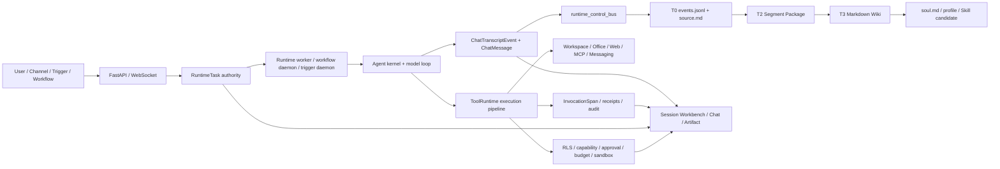

# Hive Agent-Native 七原子细致审查报告

> **历史来源报告提示（2026-07-14）**：本报告的 findings 已并入 `docs/agent-native-extreme-boundary-atomic-review-2026-07-14.md`。后者是当前 canonical 数量、极端边界裁决与最终施工方案；本文仅保留独立 session 的来源证据，不再单独承担总断点分母或最终顺序。
>
> 审查基准：`docs/reusable-agent-native-atomic-review-prompt.md`
> 审查日期：2026-07-14（Asia/Shanghai）
> 稳定源码基线：`main@501db6555dae374e5fcf43a6fdcfe8a3dd89343e`
> 生产应用基线：`33fbecd9d`（`501db655` 相比它仅改文档、规则和测试，没有已提交的应用代码差异）
> 当前工作区：存在由其他并发工作产生、且在审查期间持续变化的未提交改动；本报告没有修改或回滚这些改动。
> 审查性质：只读 review；除本报告外没有实施修复。

## 1. 执行摘要

整体裁决是 **局部闭环，当前不可宣称 Agent-Native / SOTA 完整闭环，也不满足直接上线门槛**。

当前架构已经具备真实而且有价值的骨架：`RuntimeTask` 是 durable run authority，`ChatTranscriptEvent` 是 cloud transcript truth，`InvocationSpan` 是数据库 trace surface；WebSocket 断线不取消 run；Workflow 有 daemon 扫描与 restart resume；Personal KB 保持 tool-only；Memory 已收敛到 T0/T2/T3 + resident/profile 两平面；生产 RLS runtime role、Vercel Sandbox deny-all probe 和三个 Railway 服务均有 live evidence。

但七原子追踪确认 18 个独立根因：

| 级别 | 数量 | 关键结论 |
|---|---:|---|
| P0 | 2 | `web_fetch` 可 SSRF；Personal KB 声称 sensitivity-filtered，但实际 read/search 权威谓词没有 sensitivity clearance。 |
| P1 | 9 | durable subagent 恢复替换 requester identity；A2A 丢 permission profile；Recovery Manifest 跨 session；终态内联执行 T2 三次 LLM；平台伪造 assistant failure + 自然语言 hard outcome；Memory storage 故障冻结无关 effect；部署迁移 fail-open；Enterprise Knowledge 已知缺失；生产 transcript→T0 commit race 与当前修复未通过全量验收。 |
| P2 | 7 | Messages 前后端契约断裂；280 个 literal i18n key 缺失；governance outcome 由字符串反推；T0 hash chain 无读取校验；Skill promotion marker 非原子；AI Asset 统一平面只覆盖五类；当前文档中的多条验收命令已指向不存在的测试文件。 |

最重要的上线裁决：

1. P0-001、P0-002 是安全阻断项。
2. P1-003、P1-004 直接破坏多 Agent 的根身份和权限继承。
3. P1-006、P1-007、P1-008 违反“平台约束 effect、不替代模型语义/不因旁路依赖降级 Agent”的北极星。
4. 生产当前仍报告 `runtime_control_bus.last_error = LookupError: transcript_event ... not visible after 40 attempts`；未提交修复方向正确地移到 after-commit，但当前全量 backend 为 `23 failed, 6907 passed, 2 skipped`，frontend 为 `1 failed, 667 passed`，因此不能作为已修复证据。

## 2. 审查范围、环境和未覆盖范围

### 2.1 已覆盖

- 后端入口、API、runtime/kernel、tool pipeline、Hook、daemon/worker、Memory、Personal Knowledge、AI Asset、RLS/bootstrap、部署脚本。
- 前端路由、Session Workbench、Messages、AI Asset、i18n、runtime event projector、build/test。
- 正向路径：WebSocket/user prompt → RuntimeTask → model/tool loop → transcript/span/artifact → terminal/UI。
- 反向路径：UI/Artifact/T0/T2/T3/approval/workflow/subagent evidence → producer、authority、recovery。
- 当前本地 FreeCode、Codex Rust、Hermes Agent 源码对照；先用可用 code graph，再读精确源码行。
- Railway 三服务最新 deployment、公共 backend health、frontend HTTP；未写生产数据。

### 2.2 快照边界

审查期间出现三个不同事实层：

| 层 | 边界 | 用法 |
|---|---|---|
| 稳定 Git truth | `501db655` | 所有长期架构和主要断点的基准。 |
| 生产 truth | 三服务部署自 `33fbecd9d` | live health、RLS、sandbox、daemon、T0 bridge 错误。 |
| live dirty worktree | diff 在测试期间继续变化 | 只用于评估正在进行的 transcript/Hook/thread-item 修复，不把它冒充已完成。 |

### 2.3 未覆盖或未证实

- 本地数据库没有用户，`dev@hiveclaw.dev` 也不存在；为了保持 review-only，没有注册用户。因此只在真实浏览器验证了公开 Login，受保护的 Workspace/Approval/Artifact/Multi-Agent journey 标记为“未证实”，其静态组件、API contract、测试和 build 仍已审查。
- 未执行生产写入、审批、外部消息、生产 migration 或故障注入；只读 live evidence 不能证明写路径 E2E。
- Hive 本仓库的 codebase-memory graph 在本轮返回“project not indexed”；按 prompt 回退到精确 `rg`/symbol/line 读取。FreeCode、Codex、Hermes graph 均为 ready。
- Railway MCP auth 不可用，但同一账号的 Railway CLI 可读 deployment；这不影响三服务状态证据。

## 3. 权威顺序与北极星符合性

本轮裁决顺序严格采用：产品目的 → Model Agency → FreeCode/CC semantic floor → Codex additive control → Hive-native Memory/evolution → 企业治理 → 产品消费 → 七原子 → 交付纪律。

| 法则 | 当前裁决 | 证据摘要 |
|---|---|---|
| Goal 1：Agent 智能与自进化优先 | 局部闭环 | Runtime/tool/memory/workflow 骨架真实；但 T2 阻塞终态、memory outage 冻结无关 effect、平台代写 assistant error，实际体感会弱于 lean benchmark。 |
| Model Agency | 断点 | `llm_error_policy.py:138-143` 和 `sessionSocketEventProjector.ts:206-218` 以自然语言做 hard outcome；平台 error 被写成 assistant message。 |
| CC/FreeCode floor | 局部闭环 | Skill/Hook/subagent/session/compaction 均有映射；但 session-scoped recovery 和完整 permission frame 在 restart/A2A 被丢失。 |
| Codex additive delta | 局部闭环 | Hive 有 approval、sandbox、typed run/span；但 Codex 的 pending approval resume 与 typed `ExecApprovalRequirement` 对照暴露 Hive 的字符串反推和恢复断点。 |
| Hive-native advantage | 局部闭环 | T0/T2/T3、soul、skill evolve、workflow 都存在真实消费；T0 chain verify、promotion marker、Enterprise Knowledge 尚未闭环。 |
| 企业治理 | 局部闭环 | live strict RLS 与 sandbox 为正证据；PKB sensitivity、SSRF、A2A permission frame 是反证。 |
| 产品消费 | 局部闭环 | Workbench/AI Asset/Approvals/Artifact 路由存在；Messages 与 i18n 是可见断点，受保护 journey 未 live 验证。 |

## 4. 仓库与运行拓扑

生产部署是三个服务：`backend`（runtime/daemon）、`backend-api`（API package root）和 `frontend`。2026-07-14 读到的最新 deployment 均为 `SUCCESS`：

- backend `0e1f43f4-ec0f-4d33-87d4-bb88831772a6`
- backend-api `1d560bc3-bd18-4d45-8714-1648b900274b`
- frontend `b4dbeba0-589e-4997-b95d-524bb94d5487`

## 5. 核心实体、状态机和事实源矩阵

### 5.1 核心实体

| 实体 | 唯一权威/主键边界 | 主要消费者 | 当前状态 |
|---|---|---|---|
| tenant / user / agent | PostgreSQL + tenant pin/RLS | API、runtime、governance、UI | 局部闭环 |
| thread/session/turn | `ChatSession` + `ChatTranscriptEvent` ordering | replay、fork、Workbench、T0 bridge | 局部闭环 |
| run | `RuntimeTask` + lease/version/idempotency | worker、resume、cancel、UI | 闭环主路径 |
| tool call / approval | immutable request envelope + tool pipeline | ToolRuntime、approval UI、span | 局部闭环 |
| workflow | RuntimeTask(workflow) + step/leaf journal | workflow daemon、UI、trigger | 闭环主路径 |
| subagent/A2A | RuntimeTask/child session + orchestration context | parent agent、UI、T0/span | 断点 |
| memory | T0 raw → T2 → T3 → soul/profile | prompt、tools、evolution、UI | 局部闭环 |
| knowledge | Personal KB PostgreSQL core + ACL | governed tools、owner UI | 断点；Enterprise 已知缺失 |
| artifact/workspace | workspace file + ChatArtifact/transcript refs | chat/sidebar/workbench | 局部闭环 |
| AI asset | `AIAssetRecord` + `ConfigRevision` + usage event | enterprise workspace | 局部闭环 |

### 5.2 关键状态机

- Agent run：`pending → claimed/running → waiting/approval_required → completed/failed/cancelled`，lease/version fence 防重复 claim；WebSocket disconnect 不 cancel。
- Tool：`prepared → governed → approval/preflight → executing → succeeded/failed → span/receipt`；问题是 governance 的 typed outcome 在 pipeline 末端被字符串反推。
- Approval：immutable envelope → pending → approved/denied/expired → execution dispatch；嵌套 A2A frame 不完整。
- Workflow：run journal → leaf/step → gate/wait → resume/reconcile → terminal；daemon 周期扫描 pending runs。
- Subagent：durable record → child frame/session → worker dispatch → tool/model loop → result receipt → parent；restart hydrate 使用 creator 替代 root requester。
- Memory：committed transcript → after-commit/control bus → T0 exactly-once projection → segment seal → T2 → T3/profile/skill candidate；生产部署仍有 commit visibility race。

### 5.3 事实源矩阵

| 能力 | 写入口 | 机械事实源 | 恢复入口 | UI/下游消费 |
|---|---|---|---|---|
| run | `start_web_chat_run` / workflow/subagent start | `RuntimeTask` | claim sweeper、resume dispatcher | Workbench/runtime panels |
| transcript | `append_session_event` | `ChatTranscriptEvent` | replay/fork/checkpoint | Chat、ThreadItem、T0 bridge |
| trace | `persist_invocation_span` | `InvocationSpan` | best-effort/reconcile | Activity/ops/AI asset usage |
| T0 | transcript bridge | `events.jsonl` | pending projection sweep | T2/T3/source refs |
| approval | approval service | immutable DB envelope/status | pending dispatch/retry | Approval cards |
| workflow | workflow runtime service | run/step/leaf journals | `resume_pending_runs` | workflow UI |
| Personal KB | governed ingest/proposal | Knowledge tables + grants | job retry/reindex | search/read tools、owner UI |
| artifact | workspace/tool persistence | file + ChatArtifact/transcript refs | reconcile/file state | Chat/Workspace/sidebar |

## 6. 单 Agent 结论

| 能力 | 七原子结论 | 断裂原子 | 裁决 |
|---|---|---|---|
| Web chat durable turn | Input/Authority/Execution/Evidence 主路径成立；disconnect 可恢复 | terminal memory lane、typed failure、当前 T0 publish | 局部闭环 |
| Model/tool loop | model output与工具循环真实，ToolRuntime 是统一执行入口 | governance outcome、memory outage effect freeze | 局部闭环 |
| Plan Mode | 有 agent-authored plan、confirmation、tool boundary | 平台 error/failure presentation 仍可污染 assistant truth | 局部闭环 |
| Compaction/resume/fork | 有 manifest、checkpoint、transcript replay | per-agent manifest 覆盖 session，post-compact 未统一验证 | 断点 |
| Skill progressive disclosure | load 只加上下文，执行仍走受治理 runtime | profile promotion marker 非原子 | 局部闭环 |
| Memory/self-evolution | T0/T2/T3/soul 真实；resident/profile 不静默截断 | T2 内联、T0 chain 不 verify、storage 与 authority 混合 | 局部闭环 |
| Personal KB tool-only | 未静态注入 prompt，tool surface 可发现 | sensitivity authority 缺失 | 断点 |
| Artifact/Workspace | tool result、ChatArtifact、file change event 有消费 | 受保护 live journey 未证实；当前 dirty tests 红 | 局部闭环 |

## 7. Hive Native 结论

| 能力 | 当前证据 | 裁决 |
|---|---|---|
| Workflow | `workflow_daemon.py:39-99` 周期调用 `resume_pending_runs`；`workflow_runtime_service.py:1363-1410` 扫描、reconcile 外部 in-flight、恢复执行。原“重启后不恢复”候选被反证。 | 闭环主路径 |
| Subagent | durable record、child session、T0、span、worktree isolation 均存在；restart 时未使用 record 的 `root_user_id`。 | 断点 |
| A2A/peer delegation | depth、budget、RuntimeTask、receipt 均存在；custom tool executor 丢 permission profile/session frame。 | 断点 |
| Trigger/schedule | 生产 trigger daemon healthy；有 idempotent task/outbox 路径 | 写 E2E、provider denial、duplicate delivery 未 live 注入，局部闭环 |
| Local Agent/Bridge | 有页面、API、permission mode 和 channel boundary | 本轮没有真实本地 agent 配对，标记未证实 |
| 多 Agent UI | Agent Team、Subagent、A2A、activity surfaces 存在 | protected journey 未 live，且 thread warning union 正在并发修改 | 局部闭环 |

## 8. 企业治理、安全和 AI 资产结论

- RLS：生产 health 报告 runtime role `app_rls`、`superuser=false`、`bypassrls=false`、`enforcement=strict`、无 violations；这是当前 live 正证据，不等同所有业务谓词正确。
- Sandbox：生产 Vercel Sandbox probe `passed=true`、`network_policy=deny-all`、workspace round-trip 成功。
- Approval/budget：主工具管道具备 immutable approval envelope、quota/budget/receipt；A2A frame 和字符串 outcome 使嵌套治理局部失真。
- Web egress：`web_fetch` 被标 safe，但没有统一 SSRF transport policy，是 P0。
- AI Asset：revision/usage/rollback/reconcile 真实闭环，但统一 registry 只允许 agent/skill/workflow/subagent/external capability。
- Enterprise Knowledge：源码明确 `company_kb_available=false`，没有用 legacy files 冒充；诚实，但产品能力仍是已知缺失。
- Startup：schema owner 路径对 Alembic/RLS grant fail-open，可能让 stale schema 的进程进入服务态。

## 9. 用户使用体验与 UI/UX 结论

真实浏览器在 `http://127.0.0.1:3008` 验证了 Login：语言切换、登录/注册入口、账号密码和 Feishu 登录均可见。因本地用户表为空，受保护 journey 未进行写入式初始化。

静态消费审查结果：

- `App.tsx:129-169` 有 Plans、Automations、Knowledge、Memory、Docs、Approvals、Team、Agent Sessions、Messages、Enterprise Settings 等真实路由。
- AI Asset inspector 能展示 owner、trust、admission、projection、usage、revision、rollback、reconcile（`WorkspaceAIAssetsSection.tsx:32-238`）。
- Messages 前端调用两个不存在的 PUT route，并按后端从未返回的 `read_at` 渲染未读态。
- 203 个非测试 TS/TSX 文件静态扫描得到 1,905 个 literal `t()` key，其中 280 个在 zh/en 两份 catalog 都缺失；critical governance/recovery surfaces 会显示 raw key 或 fallback。
- 平台把 quota/error 变成 assistant bubble，并以 `message.includes('expired')` 判断 auth expiry，破坏 typed failure 信息层级。
- 当前 live dirty worktree 新增 `warning` thread item；frontend build 成功，但 reducer exhaustiveness test 未同步，说明 UI contract 尚未闭环。

## 10. Model Agency / 机械化限制专项结论

| 检查 | 结果 | 证据 |
|---|---|---|
| 授权 evidence 是否完整可见 | Memory current suites 与 no-truncation suites 为正证据 | resident/profile 无 silent trim；targeted 66 + 37 passed（稳定基线） |
| 输出 budget 是否被机械饥饿 | 未发现本轮新增固定小 `max_tokens` 主路径 | provider/task budget 仍需生产 usage evidence |
| 自然语言是否产生 hard outcome | 是，违规 | error prefix scanner、`includes('expired')`、governance substring |
| 平台是否代写模型结论 | 是，违规 | infra failure 通过 `finalize_with_assistant` 进入 assistant truth |
| fallback 是否仅 abstain/hold/retry | 部分 | T2 failure 非 fatal；但 error presentation 与 replay filtering 创建语义事实 |
| deny 是否只约束 effect | 否 | resident/storage failure 把所有非只读 tool 冻结 |

FreeCode 对照：`src/query.ts:545-578` 保持 model/tool loop 与 permission mode 在同一 turn state；`src/utils/hooks.ts:3394-3476` 把 pre/post tool hook 作为明确生命周期；`src/services/compact/sessionMemoryCompact.ts:514-629` 恢复 context 后继续 loop。Codex additive 对照：`codex-rs/core/src/tools/sandboxing.rs:41-176` 使用 typed approval store / `ExecApprovalRequirement`；`thread_resume.rs:3395-3538` 测试 pending approval 原样 replay。Hive 当前的字符串 outcome 与 session recovery 低于这两个基线。

## 11. Personal KB tool-only 与 Knowledge authority 结论

正面结论：Personal KB 没有在 original prompt assembly 中预取；`search_personal_kb` / `read_personal_kb` 是可发现、只读、受 tenant/owner/grant 控制的工具。Enterprise legacy files 明确 `agent_consumable=false`，没有冒充 Knowledge。

关键反证：tool description 承诺 sensitivity filtering（`knowledge.py:233-240,326-331`），但 runtime principal 只有 agent/requester/session/delegation（`:80-87`）；access predicate 只检查 owner/grant/agent_searchable（`personal_knowledge_access.py:49-107`）；search/read 返回完整 snippet/segment 与 sensitivity，没有调用 `PrincipalStack.can_access_sensitivity`。因此 Personal KB 当前是“tool-only 形态正确、authority 实现断裂”。

Enterprise Knowledge 必须保持“已知缺失”：`db_bootstrap.py:129-132` 明确 future organization knowledge 尚无 runtime；`enterprise.py:1167-1177` 明确 legacy quarantine 不可供 agent 消费；`tools/handlers/hr.py:185-189` 把假定的 Company KB source 降级为 unknown。

## 12. 代码极简性结论

需要收敛的不是功能，而是事实源和边界重复：

1. URL private-network 判断只存在 trigger 私有 helper，web/advanced providers 自己发请求；应收敛为唯一 egress transport policy。
2. Governance 先产生 rendered string，再由 pipeline 反解析；应直接返回 typed decision，rendering 只做消费。
3. Recovery Manifest 用 per-agent singleton file，同时 session 又有 transcript/checkpoint truth；应收敛为 session/root-run scoped artifact。
4. Memory availability、identity availability、authority availability 被一个 boolean 合并；应拆成正交 typed dimensions。
5. Infra failure 同时存在 socket error event、assistant message、prefix scanner、replay filter、frontend string scanner；应收敛为一个 typed terminal item。
6. AI Asset 的 native projection 与统一 catalog 范围不一致；要么扩展统一 registry，要么明确只称“extension asset registry”，不能使用过宽命名。

Hermes 当前源码提供了有用的 lean 反例：`agent/turn_context.py:92-137` 用一个 typed `TurnContext` 汇聚 per-turn state，`conversation_loop.py:571-633` 组装后直接进入 loop，`tool_executor.py:274-303` 用单一 middleware 包裹 tool execution。Hive 不应减少能力，但可用同样的“单边界、typed state、少反解析”原则降低复杂度。

## 13. 全部断点清单

### [P0-001] `web_fetch` 可访问私网、metadata 和重定向后的内网地址

- 所属模块：单 Agent / 企业安全 / Tool execution
- 严重级别：P0
- 当前状态：断点
- 影响对象：所有获准使用 `web_fetch` / `advanced_web_fetch` 的 Agent 和 tenant。
- 用户可见现象：表面是正常网页读取，实际可读取宿主、VPC、metadata service 或 redirect target。
- 触发条件：传入含点 hostname、IP、DNS rebinding 域名或指向私网的重定向。
- 输入原子：任意 URL；只做 `netloc` 含点判断。
- 权威原子：工具被 `_STATIC_SAFE_TOOLS` 标为 safe，无审批；没有 egress authority。
- 执行原子：`httpx.AsyncClient(follow_redirects=True).get` 直接执行。
- 证据原子：普通 tool result/span，不记录 resolved IP/redirect policy receipt。
- 恢复原子：HTTP error 可返回；安全违规没有 quarantine/review。
- 消费原子：模型直接消费响应正文。
- 验收原子：没有 loopback/link-local/metadata/DNS rebinding/redirect SSRF regression。
- 断裂位置：URL normalization → HTTP transport 之间。
- 根因：把“像 URL”误当作“允许访问的 egress destination”，且 trigger 的私网 helper 未复用。
- 是否削弱模型能力：否；修复只约束外部 effect destination。
- 是否存在自然语言机械 hard outcome：否。
- 是否存在双事实源：是，trigger 有 `_is_private_url`，web fetch 没有统一 policy。
- 是否存在治理/RLS 冲突：是，safe taxonomy 绕过了应有的 network governance。
- 是否存在跨租户或安全风险：是，P0 SSRF/secret exposure。
- 是否可能导致 Agent 无法继续：可导致数据泄漏或基础设施封禁；不是合理继续路径。
- 源码证据：`backend/app/services/agent_tool_domains/web_mcp.py:205-219,1267-1304`；`backend/app/services/trigger_daemon.py:731-757`；`backend/app/tools/governance.py:45-74`。
- 数据库/迁移证据：无需 schema；需要审计字段/metric contract。
- UI 消费证据：当前 UI 只看到普通 tool result，无法识别 blocked egress。
- 测试证据：全仓搜索未找到 core web fetch SSRF regression。
- 反证或不确定性：外层云网络可能额外阻断，但源码没有可证明的 invariant，不能依赖环境偶然性。
- 北极星裁决：治理必须在最窄 effect boundary 阻断，这是允许的 hard constraint。
- 完整修复方案：统一 egress resolver；限定 scheme；每次 DNS resolve 后拒绝 private/loopback/link-local/reserved/multicast/metadata；手动逐跳 redirect 重验；固定连接目标防 rebinding；限制 body/timeout；typed deny/unavailable receipt；覆盖所有 direct/advanced provider fallback。
- 最小复杂度方案：一个 shared transport policy + 所有 HTTP fetch adapter 只调用它。
- 需要删除的旧路径：删除 trigger 私有重复 helper和 provider 内直接 `follow_redirects=True`。
- 迁移与回填：无需业务数据；回填 capability policy version/audit label。
- 可观测性：`egress_denied_total{reason,tool}`、resolved IP class、redirect count，不记录 secret URL query。
- 依赖项：tool result typed error、governance taxonomy。
- 验收标准：所有 private/metadata/redirect/rebinding case fail closed；公网 IPv4/IPv6 正常。
- 回归测试：literal IP、十/八/十六进制、IPv6、CNAME、DNS answer rotation、30x chain、userinfo、scheme confusion。
- 故障注入：DNS timeout、多 A/AAAA 混合、redirect loop、body bomb。
- 实施风险：误杀企业内网资源；应通过显式 tenant egress allowlist + approval，而不是放开默认策略。

### [P0-002] Personal KB sensitivity 声明与实际 authority 谓词不一致

- 所属模块：单 Agent / Personal Knowledge / 企业权限
- 严重级别：P0
- 当前状态：断点
- 影响对象：共享 Agent、被授权 Agent、owner 的 PL3/PL4 文档。
- 用户可见现象：Agent 可能搜索/读取调用者不具 sensitivity clearance 的完整 snippet/segment。
- 触发条件：document `agent_searchable=true` 且 owner/grant predicate 成立，但 requester clearance 不足。
- 输入原子：tenant、agent、requester、document/segment/query；缺 sensitivity clearance。
- 权威原子：只检查 owner/grant/agent_searchable；description 承诺的 sensitivity check 不存在。
- 执行原子：Knowledge SQL search/read。
- 证据原子：返回 source_ref 与 sensitivity，但没有 clearance decision receipt。
- 恢复原子：没有发现越权后的 revoke/incident projection；grant 可撤销但已泄露内容不可逆。
- 消费原子：模型直接消费完整 snippet/content。
- 验收原子：PL3/PL4 + shared agent/requester/subagent matrix 缺失。
- 断裂位置：`AgentRuntimePrincipal` → Knowledge access predicate。
- 根因：Personal KB 使用简化 principal，没有接入已有 `PrincipalStack.can_access_sensitivity`。
- 是否削弱模型能力：否；只阻止未经授权 bytes 进入模型。
- 是否存在自然语言机械 hard outcome：否。
- 是否存在双事实源：是，tool description/PrincipalStack 与实际 access predicate 不一致。
- 是否存在治理/RLS 冲突：是，RLS tenant 隔离不能替代 document sensitivity ACL。
- 是否存在跨租户或安全风险：主要是同 tenant/同 owner 代理边界的数据泄漏；也需验证 delegation 的跨 principal 绑定。
- 是否可能导致 Agent 无法继续：安全修复应返回 typed denied，不应降级其他 reasoning。
- 源码证据：`backend/app/tools/handlers/knowledge.py:80-87,233-240,267-320,326-331,363-456`；`backend/app/services/personal_knowledge_access.py:49-107`；`backend/app/services/personal_knowledge_service.py:2415-2472,2660-2758`；`backend/app/services/principal_context.py:63-72`；`backend/app/models/knowledge.py:34-58`。
- 数据库/迁移证据：`KnowledgeDocument.sensitivity` 与 `agent_searchable` 是独立列，现存 sensitive+searchable 组合需要扫描。
- UI 消费证据：Personal Knowledge UI 显示 sensitivity，但 Agent tool path 没有同一 clearance evidence。
- 测试证据：现有 tool tests 主要覆盖 internal/PL1 与 owner/grant；没有完整 PL3/PL4 shared-agent 矩阵。
- 反证或不确定性：proposal policy 会拦部分 credential 写入，但 manual/API import 仍可创建敏感文档，不能当 read boundary。
- 北极星裁决：未经授权 bytes 不得进入 context；这是 ingress authority，不是模型能力限制。
- 完整修复方案：principal stack 成为唯一 clearance authority；search SQL 与 read detail 都带 sensitivity predicate；PL4 默认 deny/redact，PL3 仅 direct owner/admin；sensitivity escalation 原子关闭 agent_searchable，除非 structured approval；所有 decision 产生 typed receipt。
- 最小复杂度方案：扩展 shared `build_personal_knowledge_access_predicate`，禁止 handler 自己重复判断。
- 需要删除的旧路径：删除简化的 sensitivity-free principal/access 分支。
- 迁移与回填：扫描现存 `sensitivity in (pl3,pl4) AND agent_searchable=true`，先 quarantine；按可证明 owner policy 回填，不能猜测授权。
- 可观测性：denied/read counts 按 sensitivity，不记录内容；异常 searchable-sensitive inventory。
- 依赖项：PrincipalStack、grant schema、delegation principal。
- 验收标准：每个 search/read 都有 tenant+owner/grant+sensitivity receipt；未授权内容字节不进入 tool result。
- 回归测试：owner、tenant admin、shared agent、delegated subagent、revoked grant、PL1-PL4、search 和 direct read。
- 故障注入：clearance service unavailable 必须 typed unavailable/hold，不能视为空结果或 allow。
- 实施风险：历史敏感文档短期不可搜索；必须提供 owner review queue。

### [P1-003] Durable subagent restart 用 Agent creator 替代原始 requester

- 所属模块：Hive Native / Subagent / 身份与审计
- 严重级别：P1
- 当前状态：断点
- 影响对象：由非 creator 用户发起、经历持久化/重启 dispatch 的 subagent run。
- 用户可见现象：恢复后的 child tool、T0 actor、span/approval 被归到 Agent creator，而非本次 root requester。
- 触发条件：requester B 调用 creator A 所属/共享 Agent，subagent 进入 durable dispatch/restart。
- 输入原子：start 时正确接收 `parent_user_id` 并保存为 `root_user_id`。
- 权威原子：恢复阶段未从 RuntimeTask 恢复 root requester。
- 执行原子：child executor 使用错误 `ctx.parent_user_id`。
- 证据原子：T0 actor、InvocationRequest user、approval/audit 全被污染。
- 恢复原子：正是 restart path 发生身份替换。
- 消费原子：Personal KB、tool governance、UI attribution 会消费错误 principal。
- 验收原子：persisted dispatch test 未包含/断言 `root_user_id`。
- 断裂位置：RuntimeTask record → `_resolve_parent_runtime` / `SubagentSpawnContext`。
- 根因：把静态 `agent.creator_id` 当作动态 run requester authority。
- 是否削弱模型能力：否；修复身份不会限制 reasoning。
- 是否存在自然语言机械 hard outcome：否。
- 是否存在双事实源：是，record.root_user_id 与 reconstructed creator。
- 是否存在治理/RLS 冲突：是，approval/KB/tool authority 使用错误 principal。
- 是否存在跨租户或安全风险：tenant 仍可相同，但存在跨用户数据/权限越权；tenant mismatch 也必须 fail closed。
- 是否可能导致 Agent 无法继续：修复时 legacy 缺 root identity 的 run 应 hold/reconcile，而非猜 creator。
- 源码证据：`backend/app/services/subagent_run_service.py:249-359,395-421,750-805,1333-1368`；`backend/app/agents/subagent.py:783-808,829-846,1098-1129`。
- 数据库/迁移证据：`RuntimeTask.root_user_id` 已存在，主要是消费断点；legacy NULL 需 backfill/quarantine。
- UI 消费证据：subagent activity/receipt 依赖这些 actor/user refs。
- 测试证据：`backend/tests/services/test_subagent_run_service.py:1128-1229` 的 fake record 没有 root_user_id，fake resolver 随机生成 parent_user_id，也没有身份断言。
- 反证或不确定性：即时、未重启 spawn path 使用真实 parent_user_id；问题限定 durable recovery path。
- 北极星裁决：root requester 是 authenticated authority，禁止用 creator 猜测。
- 完整修复方案：dispatch 必须读取 record.root_user_id，校验 tenant/agent/session/root-run；hydrate 后向所有 child tool/T0/span/approval 传同一 principal；legacy NULL 转 `needs_identity_reconciliation`。
- 最小复杂度方案：删除 resolver 中 creator→requester 映射，resolver 只补静态 agent/model，run principal 只来自 record。
- 需要删除的旧路径：`parent_user_id=agent.creator_id`。
- 迁移与回填：从可信 parent RuntimeTask/session actor 回填；无法唯一证明则 quarantine。
- 可观测性：`subagent_identity_reconcile_total`、root/child principal mismatch span。
- 依赖项：RuntimeTask authority、delegation token、Personal KB fix。
- 验收标准：即时、restart、retry、cancel、nested subagent 全程 root requester byte-identical。
- 回归测试：creator≠requester、shared Agent、restart、legacy NULL、tenant mismatch、nested child。
- 故障注入：record/session disagreement、deleted requester、expired delegation。
- 实施风险：历史 in-flight run 会被 hold；这是安全正确行为。

### [P1-004] A2A custom tool executor 丢失 permission profile 与 runtime frame

- 所属模块：Hive Native / A2A / Tool governance
- 严重级别：P1
- 当前状态：断点
- 影响对象：peer agent message/delegation 中的工具调用。
- 用户可见现象：父层传入的 allowed_tools、permission mode、session/delegation/sandbox frame 可能不约束目标 Agent 的实际工具执行。
- 触发条件：`delegate_to_agent` 使用 `_build_agent_message_tool_executor`。
- 输入原子：`permission_profile` 正确传到 orchestrator。
- 权威原子：实际 executor signature 不接受该 frame。
- 执行原子：`execute_tool` 只收到 target agent、owner 和 hook flag。
- 证据原子：外层 session metadata 看似有 profile，内层 tool receipt 无法证明消费。
- 恢复原子：restart/retry 会沿同一 executor 重复缺口。
- 消费原子：目标 Agent 仍看到/调用未经 session profile 收窄的工具。
- 验收原子：测试只断言 profile 到 orchestrator，没有断言进入 `execute_tool`。
- 断裂位置：orchestrator invocation → custom tool executor。
- 根因：invoker 只向 executor signature 支持的 kwargs 注入 frame，而 A2A wrapper 只声明 `emit_runtime_hooks`。
- 是否削弱模型能力：当前不是削弱，而是越权扩大；修复应提供授权内完整 capability surface。
- 是否存在自然语言机械 hard outcome：否。
- 是否存在双事实源：是，session metadata profile 与 actual executor args。
- 是否存在治理/RLS 冲突：是，permission/sandbox policy 没到唯一 effect boundary。
- 是否存在跨租户或安全风险：有潜在跨 principal/外部 effect 风险。
- 是否可能导致 Agent 无法继续：deny 应 typed 返回，不能让整个 A2A 回合崩溃。
- 源码证据：`backend/app/services/agent_tool_domains/messaging.py:942-1042`；invoker 的 signature-based frame injection 位于 `backend/app/runtime/invoker.py:1051-1070`。
- 数据库/迁移证据：无需 schema；existing run metadata 可保留作审计，但不能当执行证据。
- UI 消费证据：A2A session/permission UI 展示的是声明 profile，可能与实际执行漂移。
- 测试证据：`backend/tests/services/test_agent_message_runtime.py:50-167` 的 fake executor 不接收/断言 permission profile。
- 反证或不确定性：ToolRuntime 仍会做全局 capability governance；缺失的是 per-session/parent-scoped 收窄，不代表所有治理都绕过。
- 北极星裁决：完整授权 frame 必须到 effect boundary，不能以 wrapper 便利为由丢失。
- 完整修复方案：定义 typed `ToolExecutionFrame`；A2A/subagent/workflow 只传这一对象；包含 principal、tenant、session、delegation、permission profile、approval、sandbox、root task、trace；ToolRuntime 强制验证。
- 最小复杂度方案：先让 A2A executor 接受 `**kwargs` 并逐项显式转发，再收敛成 typed frame。
- 需要删除的旧路径：位置参数式 `execute_tool(tool, args, agent, owner)` wrapper。
- 迁移与回填：无数据迁移；in-flight A2A run 需从 RuntimeTask snapshot hydrate frame。
- 可观测性：span 记录 policy hash/profile version，不记录 secrets。
- 依赖项：P1-003 root identity、typed governance outcome。
- 验收标准：父/子看到的 allowed tools 和 approval mode 一致；receipt 带同一 policy hash。
- 回归测试：bypass/readOnly/acceptEdits、allowed/excluded tools、nested A2A、restart、denied/unavailable。
- 故障注入：profile missing/hash drift/expired delegation/provider unavailable。
- 实施风险：过去错误放行的工具会被正确拒绝，需 UI 展示原因。

### [P1-005] Recovery Manifest 是 per-agent singleton，不能可靠绑定并发 session

- 所属模块：单 Agent / Compaction / Resume
- 严重级别：P1
- 当前状态：断点
- 影响对象：同一 Agent 的并发 session、compact/resume、legacy manifest。
- 用户可见现象：一个 session 的 files、pending tool、permissions、skills 可能覆盖或注入另一个 session。
- 触发条件：同 Agent 多会话写 manifest；或 post-compaction consumer 直接 load。
- 输入原子：manifest 内有 `session_id`。
- 权威原子：path 只按 agent，legacy 无 session 时 fail-open。
- 执行原子：每次 persist 覆盖单文件。
- 证据原子：manifest 内容可读，但缺 tenant/user/root-run/config/policy binding。
- 恢复原子：normal attach 有 match；post-compaction 直接 load/inject，边界不一致。
- 消费原子：prompt restoration、pending tool/permission/MCP/skill state。
- 验收原子：缺 concurrent sessions、legacy fail-closed、post-compact mismatch tests。
- 断裂位置：manifest storage key 与 session consumer。
- 根因：早期轻量 per-agent artifact 没随 durable session authority 演进。
- 是否削弱模型能力：错误恢复会污染 context；修复应保持全部授权状态。
- 是否存在自然语言机械 hard outcome：restoration text 不是根因，机器 state binding 才是。
- 是否存在双事实源：是，transcript/checkpoint session truth 与 singleton file。
- 是否存在治理/RLS 冲突：permission profile 可跨 session 污染。
- 是否存在跨租户或安全风险：Agent/tenant 复用或迁移场景有风险；至少跨 session/user。
- 是否可能导致 Agent 无法继续：错误 pending frame 可能重复 side effect 或卡审批。
- 源码证据：`backend/app/runtime/recovery_manifest.py:20-21,318-374,443-458,542-590,628-680`；`backend/app/kernel/engine.py:391-406,2989-3006`。
- 数据库/迁移证据：当前 file-native；建议新增 session/root-run scoped artifact record 或纳入 checkpoint truth。
- UI 消费证据：Workbench recovery 状态无法区分 stale manifest owner。
- 测试证据：existing persistence tests 覆盖 normal match，不覆盖 post-compact/concurrency/legacy。
- 反证或不确定性：单 session 常见路径可工作；这不证明并发/恢复安全。
- 北极星裁决：恢复必须 lossless、可证明、不能猜测。
- 完整修复方案：唯一 key=`tenant/agent/user/session/root_runtime_task`；manifest 绑定 config/policy hashes 和 base transcript sequence；所有 consumer 调同一 verifier；legacy 只在可证明 owner 时 import，否则 quarantine。
- 最小复杂度方案：按 session 子目录存储 + 一个 shared load-and-verify 函数。
- 需要删除的旧路径：per-agent `runtime_artifacts/recovery_manifest.json` singleton 和直接 load consumer。
- 迁移与回填：将 active session 可证明的文件移动到 session path；多候选/无 session 留 quarantine。
- 可观测性：stale/mismatch/quarantine/recovered counters。
- 依赖项：ChatTranscriptEvent checkpoint、RuntimeTask root authority。
- 验收标准：并发 session 不互相覆盖；每次 hydrate 先验证完整 authority envelope。
- 回归测试：2 sessions interleave、restart、fork、compact twice、legacy missing session、policy drift。
- 故障注入：partial write、corrupt JSON、stale sequence、deleted session。
- 实施风险：旧 manifest 暂时不可恢复；保留可读 quarantine 与 operator repair。

### [P1-006] Terminal Hook 内联执行 T2 三次 LLM，阻塞最终完成

- 所属模块：单 Agent / Memory / Runtime lifecycle
- 严重级别：P1
- 当前状态：断点
- 影响对象：每个正常完成的 web turn。
- 用户可见现象：模型已完成并持久化，但 UI `done` 仍等待 T2 summary/labels/review；provider 慢或失败会放大尾延迟。
- 触发条件：`TURN_STOP` → `t0_turn_stop` → sealed segment T2 job。
- 输入原子：完整 sealed T0 segment。
- 权威原子：T2 写入仍走 memory lane，权限本身无主要问题。
- 执行原子：terminal path await Hook，Hook sequential await T2，T2 sequential await 三次 LLM。
- 证据原子：T2 job 有状态，但 chat terminal latency 与 peripheral memory 耦合。
- 恢复原子：T2 有 job retry语义；chat `done` 不应等待它。
- 消费原子：UI terminal、T3/evolution。
- 验收原子：缺“model final 已 durable 时 T2 timeout 不影响 done”的测试。
- 断裂位置：assistant finalization → terminal broadcast 之间。
- 根因：把 peripheral post-turn intelligence 当作 synchronous terminal hook handler。
- 是否削弱模型能力：是，运行体感和可用性低于 Hermes/CC；不是模型推理质量下降，但会让 Agent 高频卡尾。
- 是否存在自然语言机械 hard outcome：否。
- 是否存在双事实源：否；主要是错误的同步边界。
- 是否存在治理/RLS 冲突：无直接冲突。
- 是否存在跨租户或安全风险：无直接风险。
- 是否可能导致 Agent 无法继续：是，终态迟迟不交付或 client timeout。
- 源码证据：`backend/app/services/web_chat_run_orchestrator.py:877-927`；`backend/app/services/web_chat_runtime.py:3152-3195`；`backend/app/runtime/hooks_setup.py:445-481,600-632,979-984`；`backend/app/memory/t2/segment_package.py:248-354,357-430,1235-1278`；`backend/app/runtime/hooks.py:1423-1473,1607-1620`。
- 数据库/迁移证据：已有 durable T2 job model，可扩为 outbox/RuntimeTask；无需语义数据重写。
- UI 消费证据：done broadcast 在 hook 后，用户直接感知。
- 测试证据：memory targeted suite 通过只证明 T2 正常工作，不证明 terminal isolation。
- 反证或不确定性：Hook exception 被 non-fatal catch，但必须等异常/timeout发生后才返回；没有默认 timeout。
- 北极星裁决：Memory 是 peripheral self-evolution lane，不得阻塞已完成的核心 Agent 回合。
- 完整修复方案：同一事务 durable terminal + enqueue T2 outbox；commit 后立即 broadcast done；worker exactly-once claim T2；retry/dead-letter/operator UI；startup sweep pending jobs。
- 最小复杂度方案：复用现有 RuntimeTask/outbox，不新造队列。
- 需要删除的旧路径：`TURN_STOP` handler 内直接 `await run_t2_segment_package_job`。
- 迁移与回填：扫描 sealed segment 无完成 T2 package，幂等 enqueue。
- 可观测性：terminal-to-broadcast latency、T2 queue age/retry/dead-letter、segment coverage。
- 依赖项：transcript after-commit fix、T0 exactly-once。
- 验收标准：T2 provider hang/timeout 时 chat terminal < 明确预算，T2 后台最终可恢复。
- 回归测试：success/failure/timeout/restart/duplicate enqueue/cancel。
- 故障注入：LLM unavailable、DB restart、worker crash after write before ack。
- 实施风险：最终消息先于 memory ready；UI 应以 secondary status 展示，不阻塞交付。

### [P1-007] 平台把基础设施失败写成 assistant truth，并用自然语言做 hard outcome

- 所属模块：单 Agent / Model Agency / UI runtime projection
- 严重级别：P1
- 当前状态：断点
- 影响对象：provider error、quota、runtime limit、auth expiry、replay。
- 用户可见现象：系统错误伪装成 Agent 结论；包含特定前缀或 `expired` 的正常文本会被过滤/重分类。
- 触发条件：pre-invocation terminal、exception、quota/error socket event、replay。
- 输入原子：typed infrastructure event 原本存在。
- 权威原子：平台拥有 failure fact，但无权代写模型语义。
- 执行原子：`finalize_with_assistant` 持久化平台 prose；frontend 合成 assistant bubble。
- 证据原子：assistant transcript 与 infra event 混在同一 truth surface。
- 恢复原子：replay 通过 prefix scanner 丢弃“像错误”的 assistant rows。
- 消费原子：Chat UI、model history、Memory/T0 都可能消费错误角色。
- 验收原子：现有测试反而固化 `includes('expired')` 行为，缺 benign keyword regression。
- 断裂位置：typed failure → transcript/UI role projection。
- 根因：为了统一聊天展示，把事实状态渲染和模型语义合并。
- 是否削弱模型能力：是，平台覆盖/过滤模型原文。
- 是否存在自然语言机械 hard outcome：是，直接违规。
- 是否存在双事实源：是，socket event 与 assistant error row。
- 是否存在治理/RLS 冲突：authority 类型混淆，不是 RLS 本身。
- 是否存在跨租户或安全风险：无直接跨租户；可能错误触发 auth UI。
- 是否可能导致 Agent 无法继续：是，错误 replay/filter 可能丢真实回答或错误要求重新登录。
- 源码证据：`backend/app/services/web_chat_run_orchestrator.py:300-345,753-788,930-975`；`backend/app/services/llm_error_policy.py:138-143`；`backend/app/services/web_chat_runtime.py:1308-1316`；`frontend/src/services/sessionSocketEventProjector.ts:206-218`。
- 数据库/迁移证据：历史平台 error assistant rows 需按可证明 event metadata 迁移为 runtime item；不能仅靠前缀猜。
- UI 消费证据：frontend projector 创建 assistant bubble，并以 message string 判断 expired。
- 测试证据：projector tests 覆盖当前行为；缺模型原文 byte-faithful 和 benign keyword cases。
- 反证或不确定性：exact secret redaction 仍允许；本发现不反对 typed/system card。
- 北极星裁决：平台只能陈述机械 failure fact，最终表达和语义属于模型。
- 完整修复方案：新增 typed terminal/runtime item（code、class、retryable、receipt refs）；Chat 用 system/runtime card；auth 只认 anchored code；模型原文单独 immutable；如需解释，发起新 evidence-grounded LLM turn。
- 最小复杂度方案：删除 error→assistant projection 和所有 prefix/substring classifiers，统一消费 event code。
- 需要删除的旧路径：`is_llm_error_message`、assistant error row、`includes('expired')`。
- 迁移与回填：仅对带明确 error metadata/event causation 的历史行重标；无法证明的保留原文。
- 可观测性：typed error code counts、regeneration、redaction byte count。
- 依赖项：ThreadItem typed warning/error surface。
- 验收标准：model-authored bytes 除 exact unauthorized secret redaction外不变；infra failure 不进入 assistant role。
- 回归测试：正常文本含 `[LLM Error]`、`[Runtime Limit]`、`expired`；quota、auth、timeout、provider unavailable。
- 故障注入：error event 与 final message竞态、reconnect/replay、duplicate delivery。
- 实施风险：旧客户端需兼容 typed item；用 versioned projection，不保留双写。

### [P1-008] Memory storage/resident 故障冻结所有非只读 effect

- 所属模块：单 Agent / Memory / Governance
- 严重级别：P1
- 当前状态：断点
- 影响对象：Memory 配置、resident self/owner 文件故障时的所有工具。
- 用户可见现象：即使 principal/approval/RLS 正常，邮件、Workspace、Office 等无关 effect 也被全局冻结。
- 触发条件：`get_settings`/storage/read resident critical section 抛错。
- 输入原子：memory availability 与 authenticated principal 是两类独立事实。
- 权威原子：代码把 storage/identity read error 都设成 `authority_context_available=false`。
- 执行原子：invoker 对所有 non-read-only tool 统一返回 unavailable。
- 证据原子：error code 可见，但 dependency 被统称 memory authority。
- 恢复原子：恢复 Memory 后才能继续所有 effect，没有局部降级。
- 消费原子：model 仍可 reasoning/read-only，但无法完成无关任务。
- 验收原子：测试固化 resident failure→authority false，缺 orthogonal availability matrix。
- 断裂位置：Memory context assembly → generic tool effect gate。
- 根因：一个 boolean 合并 storage、identity、principal authority、durable write availability。
- 是否削弱模型能力：是，旁路依赖故障不必要地剥夺 capability。
- 是否存在自然语言机械 hard outcome：不是关键词扫描，但 platform hard outcome 范围过宽。
- 是否存在双事实源：否；是维度错误合并。
- 是否存在治理/RLS 冲突：是，Memory storage 取代了真实 principal/effect authority。
- 是否存在跨租户或安全风险：修复不能 fail-open principal；必须只解耦可证明无关的 storage failure。
- 是否可能导致 Agent 无法继续：是，广泛治理 deadlock。
- 源码证据：`backend/app/services/memory_service.py:148-206,238-277`；`backend/app/runtime/invoker.py:1028-1049`。
- 数据库/迁移证据：无需 schema；可能需 versioned session metadata contract。
- UI 消费证据：UI 只收到 generic memory authority unavailable，不能指导局部恢复。
- 测试证据：`backend/tests/services/test_memory_service.py` resident failure 用例和 `backend/tests/runtime/test_invoker.py:2587-2640` 验证 current degraded behavior，但没有 effect matrix。
- 反证或不确定性：self/owner identity 如果真是 effect principal 的唯一来源，部分 effect 应冻结；关键是必须用明确 source/invariant，而非所有 memory storage failure。
- 北极星裁决：deny 一个依赖不得降级无关 reasoning/capability。
- 完整修复方案：typed dimensions=`principal_authority`,`identity_context`,`memory_read`,`memory_write`,`profile_overlay`；tool policy 声明依赖；只有依赖缺失的 effect hold；principal unresolved 仍全局 fail-closed。
- 最小复杂度方案：将 `external_effects_available` 改为按 dependency 的 map，ToolRuntime 查询 tool policy。
- 需要删除的旧路径：单一 boolean 全局 gate。
- 迁移与回填：session metadata contract version bump；旧 boolean 映射为 conservative legacy state。
- 可观测性：每 dependency unavailable/frozen tool class、recovery duration。
- 依赖项：typed governance outcome、tool capability taxonomy。
- 验收标准：Memory index/storage down 时无关 approved effect 可运行；principal unavailable 时仍 fail closed。
- 回归测试：每个 dimension × read/write/external effect；denied/unavailable 分离。
- 故障注入：resident file missing、permission denied、DB down、profile corrupt、principal resolver timeout。
- 实施风险：错误解耦会放行依赖 identity 的 effect；必须由 tool policy 显式声明。

### [P2-009] Messages 未读状态前后端契约断裂

- 所属模块：UI/UX / A2A consumption
- 严重级别：P2
- 当前状态：断点
- 影响对象：Messages 页面用户。
- 用户可见现象：所有消息被当作未读；单条/全部标记已读调用 404；失败没有用户提示；后端未读数恒为 0。
- 触发条件：打开 Messages 或点击 mark read/all read。
- 输入原子：message id / current user。
- 权威原子：没有 per-user read receipt authority。
- 执行原子：frontend PUT route 不存在。
- 证据原子：ChatMessage 没有 read_at，后端明确 hardcode 0。
- 恢复原子：mutation 失败不 rollback UI/给提示。
- 消费原子：页面自行把缺失 `read_at` 解释成 unread。
- 验收原子：没有 API contract/E2E test 捕获 404。
- 断裂位置：frontend messageApi → backend router/schema。
- 根因：UI 先实现了 read receipt UX，后端明确仍是 placeholder。
- 是否削弱模型能力：否。
- 是否存在自然语言机械 hard outcome：否。
- 是否存在双事实源：是，frontend 计算未读与 backend 恒 0。
- 是否存在治理/RLS 冲突：read receipt 必须按 current user/tenant，而不是 Agent owner 猜测。
- 是否存在跨租户或安全风险：实现时若 receipt 未绑定 user/tenant 会有越权；当前主要是功能断点。
- 是否可能导致 Agent 无法继续：不阻断 runtime，但破坏协作消费。
- 源码证据：`frontend/src/api/domains/messages.ts:5-12`；`frontend/src/pages/Messages.tsx:13-105`；`backend/app/api/messages.py:64-137`。
- 数据库/迁移证据：当前无 per-user message read receipt。
- UI 消费证据：`read_at` 决定 row class/dot/click，但 backend response 不含该字段。
- 测试证据：frontend/backend suites 没有 cross-contract route test。
- 反证或不确定性：若产品决定不需要未读能力，应删除整套 UI，而不是保留假交互。
- 北极星裁决：UI 必须消费机械事实，不能自行发明状态。
- 完整修复方案：新增 tenant/user/message-scoped receipt + RLS；PUT single/all routes；inbox join read_at；unread count 同一查询；optimistic UI rollback/error toast；索引与 retention。
- 最小复杂度方案：一个 `message_read_receipts` 表，不给 ChatMessage 加全局 read flag。
- 需要删除的旧路径：hardcoded unread 0 和前端本地推断。
- 迁移与回填：历史消息默认按产品决定 unread 或以 rollout timestamp 为界；不可猜历史已读。
- 可观测性：mark success/failure、unread query latency。
- 依赖项：message identity/tenant RLS。
- 验收标准：single/all read E2E，多个用户状态独立。
- 回归测试：404/403、duplicate mark、new message after read-all、pagination。
- 故障注入：network failure、stale optimistic cache、message deleted。
- 实施风险：历史 unread flood；需要明确 cutover policy。

### [P2-010] 280 个 literal i18n key 在中英文 catalog 同时缺失

- 所属模块：UI/UX / Consumption
- 严重级别：P2
- 当前状态：断点
- 影响对象：Dashboard、Agent runtime、Hook、Knowledge、Recovery、Enterprise 等 59 个文件。
- 用户可见现象：raw translation key 或不一致 fallback，关键失败/审批信息难读。
- 触发条件：渲染缺失 key 的组件。
- 输入原子：literal `t('key')`。
- 权威原子：zh/en catalog 应是 UI copy authority。
- 执行原子：i18next fallback，不阻止 build。
- 证据原子：build/test 没有 catalog parity gate。
- 恢复原子：无自动发现/CI 阻断。
- 消费原子：用户直接看到 raw key/fallback。
- 验收原子：缺 static extraction 和 critical screen assertions。
- 断裂位置：component key → locale catalog。
- 根因：新增 surface 没有强制同步 catalog。
- 是否削弱模型能力：不直接；会削弱用户对 Agent 状态、治理和恢复的理解。
- 是否存在自然语言机械 hard outcome：否。
- 是否存在双事实源：fallback prose 与 catalogs 并存。
- 是否存在治理/RLS 冲突：无直接冲突；governance UI 误读有操作风险。
- 是否存在跨租户或安全风险：无直接风险。
- 是否可能导致 Agent 无法继续：用户可能看不懂恢复/审批动作，间接卡住。
- 源码证据：`frontend/src/i18n/zh.json`、`en.json`；高发文件 `Dashboard.tsx` 25、`StructuredToolResult.tsx` 17、`AgentExtensionCatalogSection.tsx` 13、`SessionAgentTeamControls.tsx` 12、`HookRuntimeControlCard.tsx` 11。
- 数据库/迁移证据：无。
- UI 消费证据：Messages 的 `messages.justNow/minutesAgo/hoursAgo/markAllRead` 即为实例。
- 测试证据：read-only Node scan：203 files、1,905 literal keys、zh 2,886、en 2,865、missing both 280、zh-only 21；build 仍 exit 0。
- 反证或不确定性：动态 key 未纳入，实际缺口只会更大或相同，不会更小。
- 北极星裁决：用户必须能读懂 intent/progress/decision/recovery，raw key 不合格。
- 完整修复方案：AST extractor 生成 used-key ledger；补齐两 catalog；CI 对 literal missing、locale parity、interpolation/plural mismatch fail；critical runtime cards 做双语 render test。
- 最小复杂度方案：复用现有 i18next/Vitest，不引入新的国际化框架。
- 需要删除的旧路径：业务组件内任意 default English fallback，改为 catalog authority（调试/无障碍 fallback 除外）。
- 迁移与回填：无数据；copy review。
- 可观测性：开发模式 missing-key telemetry，不上传用户内容。
- 依赖项：typed runtime/error item。
- 验收标准：literal missing=0、zh/en parity=0、critical cards 两语言快照通过。
- 回归测试：plural/interpolation、nested keys、lazy routes。
- 故障注入：catalog load failure 应有统一 shell fallback。
- 实施风险：机械补空字符串掩盖问题；必须由产品语义 review。

### [P1-011] Startup migration 与 RLS grant fail-open

- 所属模块：企业治理 / Deployment / Recovery
- 严重级别：P1
- 当前状态：断点
- 影响对象：backend schema-owner deployment 与依赖最新 schema/RLS 的全部服务。
- 用户可见现象：migration/grant 失败后进程仍可能启动并返回 health，随后业务 route 500 或绕开预期 policy readiness。
- 触发条件：Alembic error、DDL permission、lock/timeout、grant script failure。
- 输入原子：SCHEMA_URL、migration head、RLS role credentials。
- 权威原子：Alembic head/RLS grant 是启动前 hard invariant。
- 执行原子：shell `|| echo WARNING` 吞掉失败。
- 证据原子：日志有 warning，但 readiness 不一定 fail。
- 恢复原子：靠人工察觉；进程不会自动 hold。
- 消费原子：API/runtime 直接消费可能陈旧的 schema。
- 验收原子：缺 startup fail-hard/head mismatch health tests。
- 断裂位置：migration result → process readiness。
- 根因：早期为提高可用性，把 schema invariant 当作 optional patch。
- 是否削弱模型能力：不直接；会造成系统性 runtime failure。
- 是否存在自然语言机械 hard outcome：否。
- 是否存在双事实源：可能存在“进程 healthy”与“schema not ready”双状态。
- 是否存在治理/RLS 冲突：是，RLS role grant 是 security invariant。
- 是否存在跨租户或安全风险：若 policy/grant 未到目标 head，可能是 P0 潜在面；当前以 P1 fail-open 发布风险记录。
- 是否可能导致 Agent 无法继续：是，核心数据库路径广泛失败。
- 源码证据：`backend/entrypoint.sh:153-176`。
- 数据库/迁移证据：当前 dirty worktree又新增 `memory_context_warning_0714` head，而 closure-head test 未同步，证明 drift 能真实发生。
- UI 消费证据：health 绿但 route error 时用户只看到运行失败。
- 测试证据：当前 stable-window backend full suite中 `test_alembic_single_head_is_current_closure_head` 失败。
- 反证或不确定性：backend-api role 分支会跳过 schema steps，这是合理服务分工；前提是 schema-owner deployment 已成功并有 durable readiness fact。
- 北极星裁决：machine contract/schema/RLS 是允许 hard block 的 invariant。
- 完整修复方案：schema-owner migration/grant fail hard；写 durable migration readiness（head/hash/time）；API/runtime startup 读取并比对 expected head；health 返回 not-ready；Railway deploy gate先 schema owner 后 API/runtime。
- 最小复杂度方案：使用 Alembic current/head + one readiness record，不保留 ad-hoc patch safety net 长期并行。
- 需要删除的旧路径：`|| echo non-fatal` 与可吞异常的长期 column patch。
- 迁移与回填：将已知 patch 收敛进 Alembic；验证生产 head；不可逆步骤仍 dry-run/confirm。
- 可观测性：migration head mismatch、duration、lock wait、grant verification。
- 依赖项：三服务 deploy orchestration。
- 验收标准：任何 migration/grant 失败都不能进入 ready；三服务只消费同一 expected head。
- 回归测试：bad SQL、permission denied、lock timeout、API starts before schema ready。
- 故障注入：中断 migration、网络断连、旧 head rollback rehearsal。
- 实施风险：错误 migration 会阻断 deploy，这是正确安全行为；需保留上一版本服务和 rollback runbook。

### [P1-012] Enterprise Knowledge 是诚实但实质性的已知缺失

- 所属模块：企业治理 / Knowledge / AI asset
- 严重级别：P1
- 当前状态：已知缺失
- 影响对象：organization-level ACL/RLS knowledge、HR、企业 Agent collaboration。
- 用户可见现象：无法以组织权限、provenance、retention、legal hold、version、deletion propagation 提供可消费的 Enterprise Knowledge。
- 触发条件：Agent 或 HR flow 需要 company-governed evidence。
- 输入原子：尚无正式 Enterprise Knowledge ingest/source authority。
- 权威原子：尚无 organization ACL/grant model 的 live runtime。
- 执行原子：没有企业 search/read tool plane。
- 证据原子：legacy files 仅 quarantine/export，agent_consumable=false。
- 恢复原子：无 enterprise reindex/deletion propagation。
- 消费原子：HR 将 company KB attribution 降级为 unknown。
- 验收原子：没有 E2E，因为能力未实现。
- 断裂位置：Personal Knowledge Core → organization authority/consumption。
- 根因：明确尚未建设，不是回归。
- 是否削弱模型能力：缺少授权企业 evidence 会削弱企业任务质量；不能用静态 prompt 或 Personal KB 冒充。
- 是否存在自然语言机械 hard outcome：HR 的 downgrade 是诚实 failure path，不是违规语义替代。
- 是否存在双事实源：当前没有；legacy 明确排除是正确做法。
- 是否存在治理/RLS 冲突：未来实现必须独立 organization authority，不能复用 owner Personal KB。
- 是否存在跨租户或安全风险：若错误复用 legacy/personal surface 会有重大风险；当前 fail closed。
- 是否可能导致 Agent 无法继续：相关任务只能请求用户 evidence/标记 knowledge debt。
- 源码证据：`backend/app/db_bootstrap.py:129-139`；`backend/app/api/enterprise.py:1136-1177`；`backend/app/tools/handlers/hr.py:73-75,185-189`。
- 数据库/迁移证据：Knowledge tables为未来保留 scope compatibility，但当前注释明确无 Company KB runtime。
- UI 消费证据：legacy status/export 是 quarantine，不是 Knowledge UI。
- 测试证据：不存在 Enterprise Knowledge E2E；这是缺失状态的符合事实证据。
- 反证或不确定性：Company Intro/普通文件树不是反证。
- 北极星裁决：不得伪装完成；仍是企业控制面核心缺口。
- 完整修复方案：在 governed knowledge tool plane 上新增 organization source、ACL/RLS、provenance、retention/legal hold、version/deletion propagation、audit、index jobs、search/read citations、UI policy/coverage ledger。
- 最小复杂度方案：复用 Knowledge Core segment/index primitives，只新增 authority scope，不复制 Personal KB 服务。
- 需要删除的旧路径：未来上线时删除所有把 legacy/company intro 当 evidence 的兼容分支。
- 迁移与回填：legacy 仅经 admin review/import pipeline 导入，保留 source hash/provenance；不可自动信任。
- 可观测性：coverage、ACL deny/unavailable、index lag、deletion propagation、citation consumption。
- 依赖项：Personal KB sensitivity修复、tenant/org principal、AI Asset scope。
- 验收标准：organization ACL matrix、RLS、retention/delete、citations、UI、failure/recovery 七原子全闭环。
- 回归测试：cross-tenant、role change、grant revoke、legal hold、stale index、source delete。
- 故障注入：index/provider unavailable、ACL service timeout、partial delete propagation。
- 实施风险：范围大但不能做伪 MVP；需一次完整落地并保持 Personal KB tool-only。

### [P2-013] Tool governance typed outcome 在 pipeline 末端被字符串反推

- 所属模块：企业治理 / Tool pipeline / Model Agency
- 严重级别：P2
- 当前状态：断点
- 影响对象：approval_required、denied、unavailable、preflight ask/prepare-only。
- 用户可见现象：typed unavailable 可能在 final decision trace 中被记为 DENY；包含特定词的 rendered message 可能被误判为 approval。
- 触发条件：governance/preflight 返回 blocking string。
- 输入原子：governance 已拥有 typed fact/event。
- 权威原子：真实 decision 由 policy/dependency authority产生。
- 执行原子：pipeline 以 substring 决定 enum。
- 证据原子：rendered message 与 decision trace 可不一致。
- 恢复原子：unavailable 本应 retry，DENY 不应 retry。
- 消费原子：model/UI/ops 根据错误 outcome 采取动作。
- 验收原子：缺 benign substring 和 unavailable-vs-denied test。
- 断裂位置：`run_tool_governance` return → `_apply_governance` decision record。
- 根因：service contract 返回 `str | None`，typed event只是旁路。
- 是否削弱模型能力：会把可重试基础设施问题误当 policy deny。
- 是否存在自然语言机械 hard outcome：是。
- 是否存在双事实源：是，event extra.outcome 与 string-derived final decision。
- 是否存在治理/RLS 冲突：治理语义自身漂移。
- 是否存在跨租户或安全风险：主要是错误 deny/approval；错误 allow 当前未直接证实。
- 是否可能导致 Agent 无法继续：是，unavailable 被永久化为 deny。
- 源码证据：`backend/app/tools/execution_pipeline.py:332-380`；`backend/app/tools/governance.py:886-925`。
- 数据库/迁移证据：DecisionTrace 历史 outcome 可受污染；不宜无依据重写。
- UI 消费证据：approval/error cards 依赖 outcome/status。
- 测试证据：当前 tests 聚焦 rendered content，缺 exact enum contract。
- 反证或不确定性：当前字符串由内部 renderer生成，误判概率低于任意用户输入，但仍违反 machine contract。
- 北极星裁决：schema/protocol validity应 typed，不得扫描 prose。
- 完整修复方案：`GovernanceDecision{outcome,reason_codes,retryable,receipt,rendered}`；pipeline只读 enum；preflight同一 contract；event/UI由同一 object投影。
- 最小复杂度方案：dataclass/enum替代 string return，不增新 service。
- 需要删除的旧路径：所有 `in str(block)` outcome inference。
- 迁移与回填：无需强制历史重写；新 span 标 contract version。
- 可观测性：outcome/retryability/reason code counter。
- 依赖项：P1-007 typed runtime items。
- 验收标准：deny/approval/unavailable/timeout/retryable exact round-trip。
- 回归测试：benign keywords、governance timeout、permission hook deny、preflight ask。
- 故障注入：DB timeout、event callback failure、renderer exception。
- 实施风险：兼容 callers；一次切换，不长期双 contract。

### [P2-014] T0 hash chain 只写不验，无法机械发现 tamper/corruption

- 所属模块：Memory / Evidence / Recovery
- 严重级别：P2
- 当前状态：局部闭环
- 影响对象：T0 `events.jsonl`、T2/T3 residual evidence verification。
- 用户可见现象：被修改/截断/乱序的 T0 仍可能被下游读取为 canonical raw evidence。
- 触发条件：文件损坏、人工修改、partial write、磁盘回滚。
- 输入原子：每条 event 带 sequence/prev hash。
- 权威原子：T0 被定义为 Memory raw truth。
- 执行原子：append 计算 hash chain。
- 证据原子：hash 存在，但 reader/curator 没有 verifier gate。
- 恢复原子：没有 corrupt/quarantine/rebuild typed state。
- 消费原子：T2/T3/source bundle 可能消费未验证内容。
- 验收原子：tests 只断言链接值，不做 tamper detection。
- 断裂位置：T0 read → downstream curation。
- 根因：实现了写时完整性 metadata，未实现读时证明。
- 是否削弱模型能力：修复不删 evidence；corrupt 时应保留 recovery ref并 hold。
- 是否存在自然语言机械 hard outcome：否；hash 是允许的 mechanical invariant。
- 是否存在双事实源：events.jsonl 是 truth、source.md 是 projection，定义正确；缺验证。
- 是否存在治理/RLS 冲突：无直接冲突。
- 是否存在跨租户或安全风险：tamper 可能伪造 memory evidence；tenant path仍需一并验证。
- 是否可能导致 Agent 无法继续：corrupt segment 应局部 quarantine，不能清空全部 memory。
- 源码证据：`backend/app/memory/t0/ledger.py:97-179,555-609`。
- 数据库/迁移证据：T0 file-native；ChatTranscriptEvent 可作为 cloud reprojection authority。
- UI 消费证据：当前没有 operator-visible integrity status。
- 测试证据：全仓未发现 production verifier symbol；existing ledger tests覆盖 hash writing。
- 反证或不确定性：云 transcript 能帮助重建，但只有在映射/coverage可证明时。
- 北极星裁决：evidence truth必须可验证和可恢复。
- 完整修复方案：reader验证 schema/sequence/hash/prev hash/segment index；失败记录 typed corrupt state、隔离原文件、按 transcript reprojection；coverage ledger进入 T2/T3 job。
- 最小复杂度方案：一个 streaming verifier，所有 reader调用。
- 需要删除的旧路径：未验证直接迭代 JSONL。
- 迁移与回填：离线扫描现存 segments；只标记，不自动改原证据；可证明时重投影。
- 可观测性：verified/corrupt/gap/reproject counters和segment id。
- 依赖项：ChatTranscriptEvent↔T0 exactly-once mapping。
- 验收标准：一字节修改、删除、重排都被发现；原文件仍可审计。
- 回归测试：tamper/truncate/duplicate/wrong prev/index mismatch。
- 故障注入：write后fsync前崩溃、磁盘满、并发append。
- 实施风险：会暴露历史损坏；需要 quarantine/rebuild runbook。

### [P2-015] Skill promotion 后直接改 profile Markdown，缺 revision/lock/事务

- 所属模块：Memory / Skill evolution / Durable commit
- 严重级别：P2
- 当前状态：断点
- 影响对象：T3 capability entry 与 provisional Skill 的双向 linkage。
- 用户可见现象：并发写可能丢 profile 内容，或 Skill 已晋升但 profile marker 未写，形成状态漂移。
- 触发条件：Skill distillation promotion 与其他 T3/profile write 并发；write中断。
- 输入原子：entry id、skill id/name、promotion evidence。
- 权威原子：profile/T3 应由 governed gate commit。
- 执行原子：`read_text` 后直接 `write_text`。
- 证据原子：marker failure只 log，promotion已完成。
- 恢复原子：没有 idempotent reconciliation/outbox。
- 消费原子：profile/Skill UI和后续 evolution读取不一致 linkage。
- 验收原子：缺并发、crash-between-commits、reconcile test。
- 断裂位置：Skill durable promotion → profile marker commit。
- 根因：把“辅助 marker”当作非关键 best-effort，而它实际被下游消费。
- 是否削弱模型能力：不直接；丢 evidence会影响后续 learning。
- 是否存在自然语言机械 hard outcome：否。
- 是否存在双事实源：Skill registry与Markdown marker暂时双状态。
- 是否存在治理/RLS 冲突：绕过统一 memory write gate/revision。
- 是否存在跨租户或安全风险：path按agent；主要是完整性风险。
- 是否可能导致 Agent 无法继续：通常不阻断，但会长期漂移。
- 源码证据：`backend/app/memory/plane_read.py:414-443`；`backend/app/services/skill_distillation_runner.py:897-915`。
- 数据库/迁移证据：Skill promotion与file marker不在同一 durable transaction。
- UI 消费证据：Skill/evolution views可能分别读两侧。
- 测试证据：未发现 crash/reconcile回归。
- 反证或不确定性：异常 non-fatal 保持 Agent运行，这是对的；缺的是最终一致恢复。
- 北极星裁决：平台负责 durable commit、evidence、rollback，不能 best-effort 丢 linkage。
- 完整修复方案：promotion transaction写outbox；memory gate按base revision/lock原子patch；marker幂等；reconciler扫描skill↔profile差异；rollback双向更新。
- 最小复杂度方案：复用现有 memory gate和outbox，不新增第二store。
- 需要删除的旧路径：直接 `Path.write_text` marker。
- 迁移与回填：扫描 provisional/active skill source refs，按唯一evidence回填marker；冲突进入review。
- 可观测性：marker pending/retry/drift/reconciled。
- 依赖项：T3 write gate、AI Asset usage evidence。
- 验收标准：并发和任意crash point都不丢profile内容，最终 linkage一致。
- 回归测试：revision conflict、duplicate promotion、rollback、marker write failure。
- 故障注入：写前/写后崩溃、文件锁超时、磁盘满。
- 实施风险：历史手工编辑冲突，必须保留diff和人工合并。

### [P2-016] 统一 AI Asset 平面只覆盖五类资产

- 所属模块：企业治理 / AI Asset / Consumption
- 严重级别：P2
- 当前状态：局部闭环
- 影响对象：model、memory、soul、knowledge、eval、policy 等企业 AI 资产。
- 用户可见现象：统一 catalog/usage/revision/rollback 只能治理 agent、skill、workflow、subagent、external capability；其余仍分散。
- 触发条件：管理员期望从 AI Assets 页面审查完整 AI 资产面。
- 输入原子：native projection 当前仅五类。
- 权威原子：每类 native source authority不同，统一 record只做control projection。
- 执行原子：五类 register/reconcile/rollback真实存在。
- 证据原子：revision-bound usage event完善。
- 恢复原子：五类支持 reconcile/rollback；缺失类型无统一恢复。
- 消费原子：Workspace AI Asset inspector真实消费五类。
- 验收原子：没有全目标资产inventory/coverage gate。
- 断裂位置：产品命名“AI Assets” →实际 asset type enum。
- 根因：extension asset control plane先落地，命名/范围扩展快于实现。
- 是否削弱模型能力：不直接；分散治理会妨碍可控自进化。
- 是否存在自然语言机械 hard outcome：否。
- 是否存在双事实源：native source是authority、AIAssetRecord是projection，设计可以成立；缺失类型无projection。
- 是否存在治理/RLS 冲突：现有记录tenant scoped；缺失类型没有统一policy视图。
- 是否存在跨租户或安全风险：未直接发现；扩展必须保持native authority和RLS。
- 是否可能导致 Agent 无法继续：不直接。
- 源码证据：`backend/app/models/ai_asset.py:15-35,89-108`；`backend/app/services/ai_assets.py:106-191,230-319,355-373,487-584`；`frontend/src/pages/workspace/WorkspaceAIAssetsSection.tsx:32-238`。
- 数据库/迁移证据：check constraint只允许五类。
- UI 消费证据：inspector完整展示这五类的owner/trust/admission/projection/usage/revision。
- 测试证据：AI asset service/integration tests覆盖现有五类，不覆盖总资产inventory。
- 反证或不确定性：如果产品明确把它命名为“Extension Assets”，现状可闭环；当前北极星语义更广。
- 北极星裁决：不能把局部control plane称作全量企业AI资产闭环。
- 完整修复方案：先建立asset inventory/authority contract；为model/memory/soul/knowledge/eval/policy定义native key、revision、usage、rollback限制；逐类一次性接入UI/ops/testing，不复制native truth。
- 最小复杂度方案：扩展projection adapter registry和enum，保留一个表/服务/UI。
- 需要删除的旧路径：每类独立、无统一usage/revision的admin shell（接入后删除）。
- 迁移与回填：从native authority确定性投影；无法hash/rollback的资产标capability而非伪造支持。
- 可观测性：inventory coverage、projection drift、unregistered active asset。
- 依赖项：Enterprise Knowledge、Memory gate、model config versioning。
- 验收标准：目标资产类型都有七原子，或明确排除理由；UI coverage ledger可查。
- 回归测试：register/use/revision/rollback/reconcile/RLS各类型。
- 故障注入：native delete、hash drift、rollback partial failure。
- 实施风险：错误统一会制造第二事实源；adapter必须保持native authority。

### [P1-017] 生产 transcript→T0 commit visibility race；当前修复方向正确但未通过全量验收

- 所属模块：Runtime / Evidence / Recovery / Delivery
- 严重级别：P1
- 当前状态：断点
- 影响对象：所有需要 transcript→T0 projection 的 session event，以及当前待发布修复。
- 用户可见现象：生产 health 持续保留 `LookupError: transcript_event ... not visible after 40 attempts`；T0 projection 延迟/失败，Memory evidence不及时。
- 触发条件：在写 transaction commit 前向 runtime_control_bus 发布 event id，consumer用独立session查询。
- 输入原子：ChatTranscriptEvent id/tenant/agent/session。
- 权威原子：ChatTranscriptEvent仍是cloud truth，T0是portable projection。
- 执行原子：已部署版本commit前publish；dirty修复引入outer-commit callback。
- 证据原子：production health明确记录last_error；pending projection保留，可由sweeper恢复。
- 恢复原子：consumer重试40次后失败，后续sweeper可恢复但bus error持续；修复需要after-commit exactly-once。
- 消费原子：T2/T3/Memory依赖T0 readiness。
- 验收原子：dirty targeted 61 tests通过，但full backend/frontend均红，不能宣称closure。
- 断裂位置：DB transaction commit → control bus publish。
- 根因：副作用发布早于拥有被引用行的outer commit；同时当前修复未完成所有caller/test contract。
- 是否削弱模型能力：T0延迟会削弱后续memory evidence；核心当前turn仍可完成。
- 是否存在自然语言机械 hard outcome：否。
- 是否存在双事实源：定义上不是；commit race让projection暂时不可见。
- 是否存在治理/RLS 冲突：consumer tenant scope正确时仍看不到未提交行。
- 是否存在跨租户或安全风险：无直接跨租户；修复callback必须携immutable IDs且保持tenant scope。
- 是否可能导致 Agent 无法继续：核心run继续，但self-evolution/evidence lane退化；当前dirty test doubles甚至让channel runtime返回停止错误。
- 源码证据（dirty snapshot）：`backend/app/database.py:72-126` 新增after-commit callback；`backend/app/services/chat_transcript.py:274-298` 改为commit后publish；`backend/app/services/runtime_control_bus.py:450-480` consumer。
- 数据库/迁移证据：pending projection status已存在；dirty同时新增`memory_context_warning_0714` migration，但closure-head test未同步。
- UI 消费证据：dirty新增typed `warning` ThreadItem，方向正确；renderer/reducer contract在测试中仍漂移。
- 测试证据：production health在2026-07-14仍有last_error；dirty targeted suite `61 passed`；稳定窗口 full backend `23 failed, 6907 passed, 2 skipped`，frontend `1 failed, 667 passed`，frontend build exit 0。
- 反证或不确定性：审查期间worktree持续变化，部分失败是test double/expectation未同步；不能据此断言生产实现必然坏，也不能宣称修复完成。
- 北极星裁决：after-commit边界是正确机械事实约束；必须完成全消费面和验收闭环。
- 完整修复方案：transactional outbox或outer-commit callback只提交immutable event id；publish失败保持pending；sweeper claim/retry/idempotency；所有真实caller明确transaction boundary；test harness使用真实AsyncSession contract；typed warning item从backend schema生成frontend union；migration head同步。
- 最小复杂度方案：优先复用现有pending projection+sweeper；after-commit只做wakeup，不承担truth。
- 需要删除的旧路径：commit前publish、独立consumer忙等未提交行、重复手写thread item union。
- 迁移与回填：扫描pending/error projection并重投；新migration按安全deploy gate执行。
- 可观测性：commit→publish→project latency、pending age、retry/dead-letter、bus last_error清零条件。
- 依赖项：P1-011 migration gate、P2-014 T0 verify。
- 验收标准：full backend/frontend全绿；production last_error不再新增；pending最终清零；重复wakeup不重复T0 event。
- 回归测试：outer rollback、nested savepoint、commit后publish失败、consumer restart、duplicate message、typed union generation。
- 故障注入：Redis down、DB commit delay、worker crash、sweeper concurrent claim。
- 实施风险：callback task在进程退出时丢失；因此wakeup非truth，pending DB row+sweeper必须兜底。

### [P2-018] 架构文档中的验收命令已漂移到不存在的测试路径

- 所属模块：Acceptance / Documentation / Delivery discipline
- 严重级别：P2
- 当前状态：断点
- 影响对象：Memory architecture复核、未来Agent执行验收。
- 用户可见现象：按当前truth docs复制pytest命令直接exit 4，不能重现文档所称closure。
- 触发条件：执行memory clean-loop文档列出的旧测试文件。
- 输入原子：文档中的精确pytest paths。
- 权威原子：当前tests tree才是可执行authority。
- 执行原子：pytest file-not-found。
- 证据原子：历史通过数字不可重现。
- 恢复原子：没有文档→测试路径CI校验。
- 消费原子：工程师/Agent使用文档做验收。
- 验收原子：本身断裂。
- 断裂位置：architecture truth doc → executable test suite。
- 根因：测试重命名/收敛后文档未同步。
- 是否削弱模型能力：间接；Agent会依据失效验收路径得出错误结论。
- 是否存在自然语言机械 hard outcome：否。
- 是否存在双事实源：旧docs结果与current test tree。
- 是否存在治理/RLS冲突：无。
- 是否存在跨租户或安全风险：无直接风险。
- 是否可能导致 Agent 无法继续：review/CI命令直接失败。
- 源码证据：`docs/memory-clean-loop-refactor-plan-2026-06-17.md:1623-1742`；缺失示例包括`tests/architecture/test_memory_clean_loop_ownership.py`、`tests/memory/test_segment_package.py`、`tests/memory/test_t3_markdown_wiki_contract.py`、`tests/architecture/test_memory_peripheral_boundaries.py`。
- 数据库/迁移证据：无。
- UI 消费证据：无直接UI。
- 测试证据：针对旧文件的pytest命令exit 4；当前替代memory suite 66 passed、model-agency no-truncation suite 37 passed。
- 反证或不确定性：能力可能仍由新测试覆盖；问题是evidence contract，不等同产品回归。
- 北极星裁决：不能用不可执行的历史证据声明closed loop。
- 完整修复方案：建立canonical acceptance manifest（test id→current path→claim）；docs引用manifest；CI验证paths存在并运行claim-tagged subsets；删除旧数字或标历史快照。
- 最小复杂度方案：一个repo脚本检查Markdown中的`tests/...py`路径并由CI运行。
- 需要删除的旧路径：所有已退休test path和无法重现的“passed N”当前态表述。
- 迁移与回填：将历史命令映射到当前test IDs，保留changelog而不伪造等价。
- 可观测性：acceptance manifest coverage/report。
- 依赖项：无。
- 验收标准：所有canonical docs命令可执行；claim对应至少一个current test或live evidence。
- 回归测试：docs path checker、rename simulation。
- 故障注入：删除/重命名test后CI必须fail。
- 实施风险：机械path存在不证明语义覆盖；manifest还需claim owner review。

## 14. P0/P1 上线阻断项

| 顺序 | ID | 阻断理由 | 解除条件 |
|---:|---|---|---|
| 1 | P0-001 | 任意Agent safe web read可转成基础设施SSRF | 统一egress policy覆盖所有provider/redirect/DNS，安全回归全绿 |
| 2 | P0-002 | Personal KB可把无clearance敏感bytes交给模型 | search/read同一sensitivity authority、历史quarantine/backfill、权限矩阵全绿 |
| 3 | P1-003 | durable child用错root requester | record-root identity唯一、legacy reconciliation、restart/nested tests |
| 4 | P1-004 | A2A真实effect未消费父permission frame | typed execution frame到ToolRuntime，receipt policy hash一致 |
| 5 | P1-007 | 平台代写/过滤模型语义 | typed runtime item替代assistant error，删除prose scanner |
| 6 | P1-008 | Memory旁路故障冻结无关能力 | availability dimensions正交，tool dependency精确 |
| 7 | P1-005 | session恢复状态可互相覆盖/污染 | session/root-run scoped manifest、统一verifier、legacy quarantine |
| 8 | P1-006 | peripheral T2阻塞核心turn交付 | terminal commit/broadcast与durable T2 worker解耦 |
| 9 | P1-011 | schema/RLS invariant失败仍启动 | migration/grant fail-hard + readiness head gate |
| 10 | P1-017 | production evidence projection race，当前修复验收红 | pending+sweeper+after-commit闭环；backend/frontend full green；production error不再新增 |
| 11 | P1-012 | Enterprise Knowledge缺失 | 不阻断现有Personal KB release，但阻断“企业Knowledge/SOTA完整”宣称；七原子实现后解除 |

## 15. 双事实源和旁路清单

| 双事实/旁路 | 当前风险 | 收敛目标 |
|---|---|---|
| Web private URL helper只在trigger | provider fetch绕过同一安全边界 | shared egress transport policy |
| RuntimeTask.root_user_id vs agent.creator_id | restart身份漂移 | run record是动态principal唯一authority |
| Session permission metadata vs A2A executor args | 声明受限、执行未消费 | typed execution frame |
| Transcript/checkpoint vs per-agent recovery file | 并发session覆盖 | session/root-run scoped artifact |
| Typed failure event vs assistant error row | 角色/语义漂移 | typed runtime ThreadItem |
| Governance event outcome vs rendered string inference | deny/unavailable漂移 | typed decision object |
| Skill registry vs profile marker | promotion linkage漂移 | outbox + memory gate原子patch |
| Frontend local unread vs backend hardcoded zero | 用户状态矛盾 | per-user receipt authority |
| Native AI asset vs partial unified registry | coverage不完整 | adapter projection，不复制native truth |
| ChatTranscriptEvent vs T0 projection | 合法source/projection关系，但commit race | after-commit wakeup + pending sweeper |

## 16. 治理、RLS、预算、审批冲突清单

1. Personal KB tenant RLS成立，但sensitivity ACL缺失；RLS不能替代document-level authority。
2. A2A global ToolRuntime governance仍在，但per-session profile没有传到effect boundary。
3. Memory storage availability被错误提升为全局effect authority，造成治理deadlock。
4. Governance dependency unavailable在event里是typed unavailable，在DecisionTrace可能被字符串逻辑记为DENY。
5. Startup RLS grant失败被标non-fatal，与production strict RLS目标冲突。
6. `web_fetch`被静态标safe，但网络destination没有policy receipt；“read-only”不等于“无外部安全副作用”。
7. Budget主路径有admission/settlement/receipt，未发现新的机械削减模型输出证据；A2A frame丢失仍可能让budget/policy attribution不完整。

## 17. 无消费路径清单

| 产物/状态 | 当前消费者扫描 | 裁决 |
|---|---|---|
| T0 event hash | writer/tests可见，无生产read verifier | 无有效完整性消费者，P2-014 |
| Skill promotion marker failure | log可见，无durable reconciler | 恢复消费者缺失，P2-015 |
| AI asset之外的model/memory/soul/knowledge/eval/policy | 无统一registry consumer | coverage缺失，P2-016 |
| Governance typed `extra.outcome=unavailable` | event consumer有，final decision不消费 | 旁路消费，P2-013 |
| Messages mark-read API | frontend调用，backend无producer | dead consumer，P2-009 |
| 多个旧memory test paths | docs消费，tests tree无目标 | dead acceptance refs，P2-018 |

## 18. 应删除、合并或收敛的抽象

- 删除provider/daemon各自的URL safety helper，合并为一个network egress boundary。
- 删除`str | None` governance block contract与substring outcome inference，合并为typed decision。
- 删除per-agent singleton Recovery Manifest和post-compact直读，合并到session/root-run verifier。
- 删除平台error assistant row、prefix scanner、frontend substring auth classifier，合并为typed runtime item。
- 删除Memory的单一`external_effects_available`语义，改为dependency availability map。
- 删除Messages的假read UI或补齐真正receipt；不得继续双边placeholder。
- 删除T3/profile direct `write_text` mutation，所有semantic/durable write只走gate。
- 删除手写frontend/backend ThreadItem union漂移，改由一个schema生成或共享contract test。
- 将ad-hoc startup column patches迁入Alembic并最终删除安全网。

## 19. 已知缺失、排除项和未证实项

### 已知缺失

- Enterprise Knowledge：不是回归，不得用Personal KB/legacy files冒充。
- 受统一AI Asset治理的model/memory/soul/knowledge/eval/policy类型。

### 排除项

- CC/FreeCode中的provider-hosted proprietary remote capabilities（Claude Code web、S-Work/CCR/Ant remote等）不计Hive parity债务。
- 本轮没有发现需要把任何本地CLI lifecycle capability错误排除。

### 未证实

- 受保护UI的完整live journey：本地DB无用户，review-only不创建数据。
- 生产写入E2E、approval、artifact delivery、A2A/subagent实际故障注入。
- Local Agent真实配对与断线恢复。
- 当前dirty worktree最终形态；它在两次full suite期间仍有并发变化。
- Provider真实token/cost边界在所有model上的长期生产分布。

## 20. 按依赖排序的一次完整落地方案

以下是**同一个完整交付内的施工顺序**，不是分期发布或MVP。提交必须同时包含实现、测试、迁移/回填、UI、observability、cleanup和rollback。

### 20.1 先锁安全、身份和机器契约

1. `backend/app/services/agent_tool_domains/web_mcp.py`：所有HTTP fetch改走shared egress policy；`trigger_daemon.py`删除重复helper。
2. `backend/app/services/personal_knowledge_access.py`、`personal_knowledge_service.py`、`tools/handlers/knowledge.py`：把sensitivity clearance放进search SQL与read predicate；接入`services/principal_context.py`。
3. `backend/app/services/subagent_run_service.py::_resolve_parent_runtime/dispatch_persisted_subagent_run`：record root principal唯一；legacy hold/reconcile。
4. `backend/app/services/agent_tool_domains/messaging.py::_build_agent_message_tool_executor` 与 `runtime/invoker.py`：引入完整`ToolExecutionFrame`。
5. `backend/app/tools/governance.py`、`tools/execution_pipeline.py`：typed governance decision，删除所有prose inference。

### 20.2 再修Model Agency与运行终态

1. `web_chat_run_orchestrator.py`：infra failure只写typed runtime terminal item，不调用`finalize_with_assistant`。
2. `llm_error_policy.py`、`web_chat_runtime.py`、`sessionSocketEventProjector.ts`：删除prefix/substring scanner；旧client通过versioned item projector兼容。
3. ThreadItem schema增加`warning/error/runtime_failure`的明确discriminator、code、retryability、receipt refs；frontend union从backend schema生成。
4. `memory_service.py`、`runtime/invoker.py`：拆分principal/memory storage/identity/profile/write availability；tool policy声明依赖。

### 20.3 收敛durable evidence与recovery

1. `database.py`/`chat_transcript.py`：after-commit只wakeup；pending projection+sweeper是durable truth；补完所有caller/test contract。
2. `recovery_manifest.py`/`kernel/engine.py`：session/root-run scoped path + one verifier；legacy quarantine/import。
3. `runtime/hooks_setup.py`/`memory/t2/segment_package.py`：terminal commit后enqueue T2 RuntimeTask/outbox；worker resume/retry/dead-letter。
4. `memory/t0/ledger.py`：streaming hash/sequence verifier、corrupt quarantine、ChatTranscriptEvent reprojection。
5. `memory/plane_read.py`/`skill_distillation_runner.py`：promotion outbox + revisioned memory gate + reconciler。

### 20.4 完成企业消费面

1. Messages新增per-user read receipt/RLS/routes/schema/UI error handling。
2. i18n补齐280 keys和21个locale parity差异，CI加入AST gate。
3. AI Asset adapter扩展到约定的完整资产inventory，native truth不变。
4. Enterprise Knowledge一次性完成organization authority、ingest/index/search/read/citation/retention/delete/audit/UI；legacy只经reviewed import。

### 20.5 清理交付边界

1. Alembic head、RLS grant、readiness fail-hard；删除ad-hoc patch和non-fatal warning。
2. 建立acceptance manifest，更新所有canonical docs test paths。
3. 删除所有旧双写/兼容scanner/helper；不留default-off半成品。
4. 跑全量backend/frontend、security、migration、browser E2E和production canary，再按三服务规则部署与验证。

## 21. 迁移、回填、清理和回滚方案

| 数据/路径 | 迁移与回填 | 清理 | 回滚 |
|---|---|---|---|
| Sensitive Personal KB | dry-run列出sensitive+searchable；默认quarantine；仅按明确owner policy恢复 | 删除sensitivity-free read path | 恢复旧binary但保持quarantine，不重新暴露 |
| Subagent root identity | 从parent RuntimeTask/session actor确定性回填；不唯一则hold | 删除creator substitution | 保留old record和reconcile queue |
| Recovery Manifest | 按session/root run导入；legacy无owner进quarantine | 删除singleton与直读 | 只读legacy exporter，不恢复消费 |
| Platform error assistant rows | 仅依据typed metadata/causation重标runtime item | 删除scanner/双写 | versioned projector读旧行，不回写assistant truth |
| Message read receipt | rollout时间前历史按明确产品策略；每用户独立 | 删除hardcoded zero/local推断 | 可停新UI，receipt表保留不丢数据 |
| T0 projection pending | 扫描pending/error并幂等重投 | 删除commit前publish | pending row允许旧worker继续sweep |
| T0 hash integrity | 先只读扫描/标记；可证明时由transcript重投影 | 不改原corrupt证据 | 关闭enforcement但保留报告，不删除quarantine |
| Skill marker | 依据promotion receipt/source refs回填；冲突review | 删除direct write | outbox可重试/反向rollback |
| AI Assets | 从native source确定性投影 | 删除分散admin shell（接入后） | native source仍是authority |
| Alembic/RLS | schema-owner dry-run/current检查后apply | 删除column patches | 保留上一版本服务；只用有验证的down/forward fix |

任何生产不可逆数据操作必须单独dry-run + 用户确认；本报告没有执行。

## 22. 验收矩阵与故障注入方案

### 22.1 本轮实际执行证据

| 命令/检查 | 结果 | 解释 |
|---|---|---|
| 稳定HEAD：`cd backend && ./.venv/bin/pytest tests -q` | `6915 passed, 2 skipped in 236.72s` | 在并发dirty改动出现前，稳定commit test baseline为绿。 |
| dirty targeted transaction/hook suite | `61 passed in 7.94s`，测试前后diff hash一致 | after-commit/Hook新增局部测试为绿。 |
| dirty full backend（后续稳定窗口） | `23 failed, 6907 passed, 2 skipped in 240.27s` | schedule_after_commit fake-session contract、span kwargs、migration head、thread union等未闭环。 |
| stable frontend `npm test` | `115 files, 668 tests passed` | dirty ThreadItem改动前的基线。 |
| dirty frontend `npm test` | `1 failed, 114 files passed; 667 passed` | `warning` discriminator未同步reducer expectation。 |
| dirty frontend `npm run build` | exit 0；7356 modules；bundle budgets passed | 可编译不等于行为验收通过。 |
| Model Agency no-truncation targeted | `37 passed` | stable baseline正证据。 |
| Current Memory architecture targeted | `66 passed` | two-plane/T0/T2/T3正证据。 |
| 文档旧memory test paths | pytest exit 4 | acceptance docs漂移。 |
| Browser Login | live渲染成功 | protected routes因无本地用户未证实。 |
| Railway deployment list | backend/backend-api/frontend均SUCCESS | 当前生产部署完成但版本为33fb。 |
| production `/api/health` | HTTP 200；RLS/sandbox/daemons healthy；runtime_control_bus保留transcript visibility error | health总体绿不等于所有component无断点。 |

### 22.2 修复后的强制验收矩阵

| 领域 | 必测正常路径 | 必测失败/恢复路径 |
|---|---|---|
| Egress | 公网IPv4/IPv6、redirect | loopback/private/metadata/DNS rebinding/mixed answers/timeout |
| PKB | owner PL1-PL3 search/read | shared agent PL3、所有PL4、revoked grant、clearance unavailable |
| Subagent/A2A | immediate/nested/result receipt | restart、creator≠requester、profile drift、cancel、duplicate dispatch |
| Model Agency | model final byte-faithful | benign error keywords、provider/quota/auth failures、replay/reconnect |
| Memory availability | profile/memory正常、无关effects | storage down、identity corrupt、principal timeout，各dependency精确冻结 |
| Transcript/T0 | commit→publish→exactly-once T0 | rollback、Redis down、duplicate wakeup、worker crash、sweeper restart |
| Recovery | compact/resume/fork | concurrent sessions、legacy manifest、corrupt file、policy hash drift |
| T2 | background success→T3 | LLM timeout/unavailable、dead letter、restart、terminal不阻塞 |
| Workflow | gate/wait/resume/terminal | provider wait、restart、duplicate leaf、cancel/reconcile |
| Messages/UI | inbox/read single/all、多用户 | 403/404/network fail、optimistic rollback、pagination |
| Migration/RLS | expected head/start ready | bad migration、grant denied、old head、API先启动 |
| Browser E2E | Login→Agent→chat→tool→artifact→approval→recovery | disconnect/reload/retry/deny/unavailable/multi-agent |

## 23. 残余风险

1. 当前worktree仍由其他工作并发修改；本报告对稳定HEAD和未触及的核心文件置信度高，对dirty最终形态不做完成声明。
2. 本轮没有生产写E2E，跨tenant/RLS的最终证明仍需要隔离fixture或staging故障注入。
3. SSRF修复若只做hostname字符串过滤会留下DNS/redirect/rebinding风险；必须在transport层验证每一跳实际IP。
4. PKB历史数据的真实授权意图不可机械猜测；quarantine可能带来短期可用性下降。
5. Enterprise Knowledge是完整产品能力而非局部bug，必须坚持一次完整交付，不能用legacy import shell冒充完成。
6. Full suite数量在dirty变化时增长，表明正在引入新contract；发布前必须重新锁定commit并从clean worktree执行全部证据。

## 24. 整体和分模块置信度

置信度是“本报告判断有多少被当前证据覆盖”，不是“系统完成度”。

| 维度 | 覆盖率 | 缺口 |
|---|---:|---|
| 生产路径覆盖率 | 88% | 无生产写E2E/外部provider effect |
| 七原子覆盖率 | 91% | Local Agent、部分trigger/UI journey未live |
| 源码证据覆盖率 | 96% | Hive code graph不可用，已用精确line fallback |
| 数据库/RLS覆盖率 | 84% | 无生产表级读写matrix/故障注入 |
| UI消费覆盖率 | 76% | protected browser journey未验证 |
| 失败与恢复路径覆盖率 | 86% | 生产restart/Redis/DB故障未实际注入 |
| 基线源码对比覆盖率 | 92% | 只选取当前关键语义，不做逐文件parity inventory |
| 测试与live evidence覆盖率 | 85% | dirty并发变化、full suites当前红 |

简单等权平均为 **87%**。模块置信度：

- 单 Agent：91%
- Hive Native：88%
- 企业治理/安全/AI资产：87%
- UI/UX：78%
- 整体：87%

没有达到95%的主要原因不是缺少源码阅读，而是受保护UI和生产写路径未live验证、当前dirty worktree持续变化且验收为红。要提高到95%以上，需要：锁定clean commit；完成P0/P1修复；全量测试零失败；真实tenant隔离fixture；浏览器完成Agent→tool→artifact→approval→recovery→A2A journey；生产canary故障注入与T0 projection backlog清零。

---

最终裁决：Hive 已经拥有比普通Agent平台更完整的durable runtime、Memory和control-plane基础，但当前仍有两个安全P0、九个能力/治理P1和七个消费/完整性P2。应按第20节在一次完整交付内全部收敛；在此之前，任何“全面Agent-Native闭环”“Enterprise Knowledge已完成”或“当前dirty修复可部署”的结论都没有足够证据。
