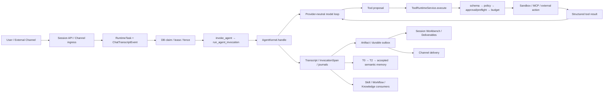

# Hive Agent-Native 全系统原子化源码审计

日期：2026-07-12
审计对象：`/Users/rocky243/vc-saas/hiveclaw-main`
审计基线：`db805bd8c2e3f43f9000d530d57a94b6be14247a`（`main`）
审计性质：独立、source-first、evidence-first、只读实现审计。原始审计开始时，Hive checkout 位于 `db805bd8c2e3f43f9000d530d57a94b6be14247a`，被 Git 跟踪的工作树为 clean；审计没有修改生产代码、测试、迁移或配置。本文位于 `docs/`，该目录被 `.gitignore:36` 忽略，因此报告默认不会出现在普通 `git status` 中，若要纳入版本库必须显式 `git add -f`。在本文校正时，HEAD 仍未变化，但 `.ultra/debug/subagent-log.jsonl` 已追加 3 条晚于原始报告保存时间的 `subagent_stop` 记录；本文不把当前工作树继续描述为 clean，也不修改该日志。

> **审计线合并与主审裁决说明（2026-07-12 增补）**
> 本报告由两条**相互独立**的审计线合并而成，均只读、source-first：
> - **主线（R-001~R-014）**：以代码知识图（约 43k nodes / 167k edges）驱动的全域生命周期审计，构成本报告 §1~§15 的骨架。
> - **领域深审线（R-015~R-023）**：12 个并行领域审计代理（内核 / 工具治理 / 会话恢复 / 认知支架 / 记忆 / 知识库 / Skill 自进化 / 多智能体 / 治理 / 前端 / HR / KISS），对每个能力逐一走七原子，主审计者对全部 P0 与关键 P1 **亲自 Read 源码复核跨模块 seam**。
>
> 两线交叉后，主审计者做了三处**分歧裁决**（证据见对应条目）：**R-004** 由 P1 下调为 P2（daemon 周期重触发 + dream 幂等缓解）；**R-006** 精确化为"retrieval 异常静默降级"这一可观测性缺口，与 principal fail-closed 是不同分支、二者并存；**R-008** 主体维持"Company KB 诚实隔离/已知缺失"，仅前端 description 文案超前降为 P3。
>
> 领域深审线补入了主线**完全遗漏的 3 个确证 P0**（R-015 前端存储型 XSS、R-016 记忆路径穿越、R-017 heartbeat 自动 T2→T3 恒 held）及若干 P1/P2。因此 §0 的统计与"最严重五问"以合并后为准，取代主线初稿的 P0=1 判断。

## 0. 结论先行

### 0.1 总体裁决

**NO-GO。**

- **审计快照中的代码/架构候选门：NO-GO。** 当时主测试套件通过（backend 6451 passed、frontend 617 passed + 11 e2e、local_bridge 30+14），但合并后存在 **4 个 P0**——其中两个是安全类（R-015 前端存储型 XSS 账号接管、R-016 后端记忆治理路径穿越），一个击穿 Goal-1 自进化基石（R-017 heartbeat 自动 T2→T3 恒 held 且被假门测试掩盖），一个与云端多副本目标冲突（R-001 resume 泵条件性双执行）；另有多项关键恢复/治理/parity/UX P1，且 `ruff format --check app tests` 失败（审计时 11 文件）。这是原始基线，不是当前 checkout 结论；R-012 已在修复账本中关闭 formatter gate。
- **生产切换门：NO-GO / 未验证。** 本次按限制没有读取 Railway、生产数据库、生产日志、生产变量或部署状态；因此不能把本地绿测外推为生产可用。
- **已编号审计项 R-001~R-028 共 28 项：P0=4、P1=13、P2=9、P3=2。** 严重级别与原子状态是两个维度：按最终裁决，28 项中有 **17 个断点、10 个局部闭环、1 个已知缺失**。R-008 的 Company KB 本体是已知缺失、不是当前第一部分回归债务；其 P3 仅对应 UI 文案边界。三项 P0 是确定性源码断裂（R-015/R-016/R-017），R-001 是需要多副本/部署重叠才触发的条件性并发 P0。另有 §9 内未编号的 KISS/代码卫生发现与 §12 文档漂移，它们不得混入 28 项断点统计。
- **已知缺失：Company Knowledge Base 正式能力。** 当前只有 legacy company files 的隔离/导出边界，后端在唯一可能引用处（HR 蓝图归因 `hr.py:73`）**显式声明未实装并主动降级**，属诚实隔离；前端 `ControlPlane.tsx` description 文案措辞略超前（R-008，P3），非误导性功能入口。没有可验证的公司知识 ingest→治理→检索→引用→版本/退役闭环。
- **排除项：** FreeCode/Claude Code 的 CCR、S-Work、Claude Code on the web、UltraPlan 远程托管会话等服务商私有基础设施；它们不计入 Hive CC parity 债务。

### 0.2 最严重的五个问题（合并后重排）

1. **[R-015/P0] MarkdownRenderer 存储型 XSS → 账号接管。** `renderInline` 对正文从不 `escapeHtml`（仅代码块转义），标题/段落/表格/列表/引用原样进 `dangerouslySetInnerHTML`；URL 无 scheme allowlist，渲染器自身从 localStorage 读 token。聊天/KB/计划/工作区文件都会把不可信内容送入可重放 HTML sink；若最终 CSP 缺失、未实际继承或存在允许的执行路径，载荷可窃取 token。**前端零 sanitizer 依赖、全仓仅此 1 处 `dangerouslySetInnerHTML`；关闭范围是前端包级安全迁移，还必须覆盖 URL 协议、认证 token 交付方式、部署后 CSP 响应头和所有消费面回归，不能按单文件修改收口。**（主审亲手复核确证）
2. **[R-016/P0] write_file/edit_file 路径穿越绕过全部记忆治理。** 写前守卫只 `strip/replace` 不折叠 `..`，执行用 `resolve()` 折叠；`workspace/../memory/knowledge/x.md` 被守卫按 `top_level=workspace` 放行，落盘到治理记忆平面，且新建目标不存在时跳过 authority 检查——绕过 write_gate + Memory/Platform Gate + source_refs + 事务 + 审计。**直接违反 CLAUDE.md 明文记忆治理法律**（模型不得绕过 governed write surface 写持久记忆）。（主审亲手复核确证）
3. **[R-017/P0] heartbeat 自动 T2→T3 巩固恒 held + 假门测试掩盖。** 评审 prompt（`heartbeat_t3_core.py:239` 要 `t3.memory_gate_review.v1` 且不提 rubric）与 Platform Gate 校验（`_validate_review` 硬要 `t3.review.v1` + memory_gate_rubric 五项≥16/20）**schema 分叉**，LLM 忠实遵循 prompt 必被 Gate 拒 → 自进化主自动路径不落盘；唯一测试 monkeypatch 掉真 Gate。**Goal-1 自进化基石断裂 + 绿测掩盖生产不走路径。**（主审亲手复核确证）
4. **[R-001/P0，条件性] 多副本启动恢复绕过数据库 claim/fence。** `resume_persisted_web_chat_runs` 重派不传 `claim_version`/`worker_id`，跳过 fence；滚动部署重叠期非幂等外部工具（发邮件/建档/付款）可双执行。触发依赖 Railway 副本数与部署策略（源码不可判定），但代码路径在并发下结构性不安全，且与全仓围栏语义自相矛盾。
5. **[R-018/P1] channel 机器人密钥明文落库（7 渠道）。** `app_secret`/`encrypt_key`/`verification_token` 裸 `String(255)` 无加密访问器，而 LLM key 走 Fernet；租户软删除不清 channel 明文——凭据 at-rest 泄漏面。

> 次级但需并列关注：**[R-002/P1]** Approval commit 与获批动作间无 durable handoff（崩溃窗口留 approved 未消费 ticket）；**[R-019/P1]** Anthropic 主消息通道视觉入参不转换致 400（违 L3 模型平等）；**[R-020/P1]** Local Bridge 绕过 per-tool 治理（默认放行 + `requires_approval` 静默拒）。

### 0.3 最终置信度

- **代码审计置信度：88%。** 当前源码/调用图、全量本地测试、构建、静态迁移头、对照源码均已取证；12 域逐能力七原子覆盖，4 个 P0 由主审计者亲自 Read 源码钉死；没有依赖历史“完成”结论。合并后 P0 数量上升不降低取证质量——它反映领域深审线覆盖了主线未触达的前端渲染、记忆写路径穿越、heartbeat 评审 schema 三处 seam。
- **生产运行置信度：42%。** 没有生产/Railway 事实、真实多副本故障注入、真实外部 Channel/Connector、真实生产持久盘与 Vercel Sandbox 回传证据。多个断点（R-001 双执行、R-004 dream 丢失、R-020 Local Bridge、tenant=None×RLS）的**真实触发率取决于运维配置（副本策略、Redis 健康、生产 DB seed、NULL-tenant 行是否存在），本环境不可源码验证**——这是生产置信度显著低于代码置信度的根本原因。

## 1. 当前事实基线

### 1.1 Hive checkout

| 项目 | 事实 |
|---|---|
| HEAD | `db805bd8c2e3f43f9000d530d57a94b6be14247a` |
| Branch | `main` |
| 原始审计开始时 worktree | clean |
| 审计对象 | `db805bd8c2e3f43f9000d530d57a94b6be14247a` 的当前 checkout；原始审计开始时无用户预存 dirty changes |
| 文档校正时 worktree | `.ultra/debug/subagent-log.jsonl` 有 3 条晚于原始报告保存时间的 `subagent_stop` 追加；本文不修改或归因清理该文件 |
| 报告追踪状态 | `docs/` 被 `.gitignore:36` 忽略；普通 `git add` 不会纳入本报告，提交时需显式 `git add -f docs/agent-native-atomic-source-audit-2026-07-12.md` |
| 本次校正范围 | 仅校正本报告的事实、状态、关闭方案与验收门，不修改实现 |

### 1.2 对照仓库快照

| 仓库 | HEAD | Branch | Dirty state | 用途 |
|---|---|---|---|---|
| FreeCode TS | `7dc15d6c8fb0c40c7fcc02ce9b58204324252632` | `main` | 未跟踪 `.codebase-memory/`、`.ultra/`、`AGENTS.md`、`docs/` | CC 语义第一基线 |
| claw-code Python/Rust | `d229a9b022d4845d28a728677e6a6b7c22ec5a2e` | `main` | 未跟踪 `.ultra/` | Python 移植与 session/JSONL/recovery 参考 |
| claude-code-org TS | `a99de1bb3c0c301b83b784abbcdb7a3674b2cd45` | `main` | `.DS_Store`、未跟踪 `.ultra/`、`CLAUDE.md` 等 | FreeCode 交叉确认 |
| Codex Rust | `5c19155cbd93bfa099016e7487259f61669823ff` | `main` | 未跟踪 `.codebase-memory/`、`.ultra/`、内部文档 | 工程控制增量 |
| Hermes | `18e840469ffe9f8235331c787e34ebbe908564b8` | `main` | 未跟踪 `.ultra/`、`CLAUDE.md` | 单 Agent 能力/工具发现/自进化质量下限 |

对照仓库 dirty state 只影响对照快照的可复现性，不改变 Hive 当前源码事实。审计没有修改这些仓库。

### 1.3 Code graph 与环境

- Hive code graph：原始审计快照约 43,234 nodes / 166,695 edges；本文校正时为 43,281 nodes / 166,753 edges、状态 ready。`detect_changes(since=HEAD)` 只报告 `.ultra/debug/subagent-log.jsonl` 1 个非代码文件，`impacted_symbols=[]`；生产源码图相对 HEAD 无变化。
- 代表性节点：Function 14,928、Method 3,890、Route 644、File 2,457。
- FreeCode、Codex、Hermes 图索引 ready；claw-code、claude-code-org 用当前源码定向读取补足。
- Python `3.12.10`；ruff `0.15.12`；pytest `9.0.3`。
- Alembic 单 head：`budget_transition_outbox_0711`。

### 1.4 审计限制

- 未读取生产数据、Railway deployment/log/env、生产外部 Channel、真实 Vercel Sandbox 或 Connector token。
- 未执行破坏性测试、真实外发、跨租户生产试探或多副本 staging 故障注入。
- 在建立源码事实图前未读取任何总结性审计/复盘/完成清单；之后只读取规范性的 CCPlus North Star 与 Memory path contract。规范只定义预期，不作为实现证据。

## 2. 方法与覆盖率

### 2.1 七原子方法

每项能力按以下原子检查：输入、权威、执行、证据、恢复、消费、验收。状态只使用：闭环、局部闭环、断点、缺失、排除。

### 2.2 实际取证

1. Git/graph 快照：确认当前工作树、生产入口、调用者/消费者、复杂度热点。
2. 源码反向追踪：从 UI/API/Channel 到 RuntimeTask、Kernel、ToolRuntime、DB/file truth，再回到 UI/Channel consumer。
3. 状态与恢复：检查 claim/lease/fence、outbox、idempotency、reconciliation、branch/rewind、workspace snapshot。
4. 权威：检查 tenant-scoped session、RLS bypass manifest、ResourceAuthority、Principal Envelope、approval envelope、Plan lease、sandbox。
5. 对照：FreeCode 的 resume/compact/hooks/AgentTool/tasks；Codex 的 thread resume/fork/compact、pending approval replay、sandbox；Hermes 的 tool/skill/memory/session实现。
6. 可执行验证：Backend/Frontend/Playwright/Local Bridge 全部按请求执行；失败不修复。

### 2.3 覆盖边界

- **高覆盖：** Web Chat、RuntimeTask、Kernel、Tool governance、Approval、Plan、Transcript、Artifact、Memory、Personal KB、HR、Subagent/Workflow、前端 Session Workbench。
- **中覆盖：** Agent Team、A2A、Dynamic Workflow、AI asset 生命周期、Channel outbox、Local Bridge。
- **低覆盖：** 生产多副本、真实 Railway 文件系统、真实外部 Channel/Connector、生产成本计量、生产安全事件响应。

## 3. 当前真实架构

### 3.1 执行与消费链



事实源分工：`ChatTranscriptEvent` 是云端顺序/恢复权威；T0 是可移植 Memory evidence projection；`InvocationSpan` 是 trace；Artifact/Outbox 表是交付事实；WebSocket 只传信号和增量，不是事实源。

### 3.2 权威与行动门


治理总体上约束行动，而不是直接替代模型判断；例外是 Memory retrieval 失败静默返回空上下文，以及 Dream 输入机械截断，这两处会降低思考质量。

## 4. 全能力原子矩阵

说明：单元格是当前可验证的 owner/truth/recovery/consumer 摘要，不用“有 route”代替闭环。

| ID | 能力 | 输入 | 权威 | 执行 | 证据 | 恢复 | 消费 | 验收 | 状态 | 证据路径 |
|---|---|---|---|---|---|---|---|---|---|---|
| A01 | Agent definition/identity/soul | tenant/user/agent | tenant+creator+charter | context assembly | Agent row+soul | DB/file reload | Kernel prompt | backend suite | 局部闭环 | `models/agent.py`; `services/agent_context.py`; `services/agency_charter.py` |
| A02 | Instruction hierarchy | scoped prompt fragments | server-owned ordering | invocation orchestrator | prompt/span metadata | rehydrate | model adapter | prompt tests | 闭环 | `runtime/invocation_orchestrator.py`; `runtime/context_candidates.py` |
| A03 | Provider-neutral model routing | model config+turn | tenant model policy | `llm_client`/router | generation spans | retry/fallback | Kernel | provider tests | 闭环 | `services/llm_client.py`; `runtime/model_routing.py` |
| A04 | OpenAI/Anthropic/Gemini/compatible lanes | provider config | tenant secrets | direct adapters | spans/usage | overload fallback | Kernel | suite | 闭环 | `services/llm_client.py`; `kernel/providers/` |
| A05 | Thinking signature | provider response | adapter | Kernel history | transcript payload | resume reconstruction | next model turn | provider tests | 闭环 | `kernel/engine.py`; provider tests |
| A06 | Vision/multimodal | message parts | session/resource auth | model adapter | transcript | replay | model | tests | 断点 | `kernel/engine.py`; `api/upload.py`; R-019（Anthropic 主通道 400） |
| A07 | Token/CJK/cache budget | turn/context/model | runtime config | budget gates | metrics/spans | provider fallback | model loop | tests | 闭环 | `services/token_tracker.py`; `kernel/engine.py` |
| A08 | Tool registry/search | model query | agent tool assignment | registry/deferred tools | tool exposure trace | rebuild | model | tests | 闭环 | `services/agent_tools.py`; `tools/handlers/skills.py` |
| A09 | Skill load | tool args | tenant/agent asset | ToolRuntime | asset usage event | version pin | model context | tests | 闭环 | `tools/handlers/skills.py`; `services/ai_asset_resolution.py` |
| A10 | Tool schema/result/timeout/size | tool call | ToolRuntime | execution pipeline | tool span/result | structured error | next model turn | architecture+unit | 闭环 | `tools/execution_pipeline.py`; `tools/result_envelope.py` |
| A11 | Tool governance single entry | tool+principal | RLS/policy/approval | `ToolRuntimeService.execute` | audit+span | retry by owner | Kernel | architecture tests | 闭环 | `tools/service.py`; `tools/governance.py` |
| A12 | Code execution | command/code | policy+sandbox | provider abstraction | receipt/span | provider failure | model/artifact | tests | 局部闭环 | `services/code_execution/`; `services/subprocess_sandbox.py` |
| A13 | Loop/empty response/max rounds/cancel | model/tool state | runtime policy | Kernel | transcript/phase | terminal/retry | UI | kernel tests | 闭环 | `kernel/engine.py`; `kernel/loop_guard.py` |
| A14 | Plan Mode | user/model plan | exact plan lease | plan tools/API | plan event/hash | resume | tool gate/UI | e2e+unit | 闭环 | `tools/handlers/plan_mode.py`; `services/plan_authorization_lease.py` |
| A15 | Goal Mode | objective/budget | owner/agent | goal service+runtime | goal/task records | durable tasks | Workbench | tests | 局部闭环 | `services/objective_service.py`; `api/objectives.py` |
| A16 | Todo/Work Ledger | agent-authored item | session/agent | ledger tools | ledger rows/events | reload | model/UI | tests | 闭环 | `tools/handlers/work_ledger.py` |
| A17 | BusinessTask | API/trigger input；普通用户 UI 缺入口 | tenant/agent | RuntimeTask binding | Task+RuntimeTask | claim/quarantine | backend worker；无页面 consumer | backend tests；缺浏览器验收 | 断点 | `services/business_task_runtime.py`; `runtime_task_claim_service.py`; R-027 |
| A18 | Schedule/Trigger | schedule/event | tenant/agent policy | trigger daemon | RuntimeTask+journal | claim/reconcile | notification/UI | tests | 闭环 | `services/trigger_daemon.py`; `api/triggers.py` |
| A19 | Web Chat durable run | user turn | session access | RuntimeTask worker | transcript+task | normal claim/fence | UI | full suite | 断点 | `services/web_chat_runtime.py`; R-001 |
| A20 | WebSocket transport | subscription | session access | broker | no canonical truth | REST backfill | UI | tests | 闭环 | `api/websocket.py`; `services/web_chat_broker.py` |
| A21 | Transcript/T0 | committed event | tenant/session | append/project | DB+exact-once T0 | replay/backfill | Memory/UI | tests | 闭环 | `services/chat_transcript_service.py`; `services/t0_logger.py` |
| A22 | Invocation spans | invocation/tool | tenant | span recorder | DB span | query | operator | tests | 闭环 | `services/invocation_trace.py`; `models/invocation_span.py` |
| A23 | Compaction/rehydration | token pressure | runtime | Kernel compact | boundary+summary | resume state | next turn | tests | 局部闭环 | `kernel/engine.py`; `services/conversation_summarizer.py` |
| A24 | Resume/fork/branch/rewind | command+revision | session/resource auth | session command runtime | transcript lineage+snapshot | rollback/reconcile | GitLine/UI | tests | 闭环 | `services/session_command_runtime.py`; `session_workspace_snapshot.py` |
| A25 | Artifact registration | generated file | ResourceAuthority | artifact service | hash+artifact row | idempotent register | chat+Deliverables | tests | 闭环 | `services/chat_artifact_service.py`; `api/files.py` |
| A26 | Channel delivery | terminal+target | channel binding | durable outbox | outbox receipt | retry/dead-letter | recipient/UI | tests | 闭环 | `services/channel_delivery_outbox.py` |
| A27 | Local Bridge | token/session/message | bridge auth；per-action policy 不完整 | local runner | receipt ledger | replay/offline reconnect | local/channel | 44 tests；缺 approval journey | 局部闭环 | `local_bridge/hive_bridge/`; `local_bridge/src/`; R-020 |
| A28 | Approval | immutable envelope | creator/admin | inline resolve→execute | approval ticket+receipt | executing reconcile | tool/model/UI | tests | 断点 | `services/approval_service.py`; R-002/R-009 |
| A29 | Lifecycle/plugin Hooks | typed event | plugin+runtime policy | HookRegistry | lifecycle record | policy-dependent | runtime | static+unit | 断点 | `runtime/hooks.py`; `plugin_hook_service.py`; R-005 |
| H01 | T0 raw evidence | runtime event | session/tenant | projection | JSONL+source.md | backfill | T2/audit | tests | 闭环 | `services/t0_logger.py` |
| H02 | T2 Segment/Episode Packages | T0 refs | Memory Gate | package pipeline | manifest/review | staging retry | T3 | tests | 闭环 | `memory/t2/`; `memory/write_gate.py` |
| H03 | Semantic memory planes | accepted patch | Platform Gate；filesystem 旁路未封死 | T3 gate；heartbeat 自动臂 schema 分叉 | source refs+lifecycle | rollback；旁路写无 rollback | retrieval | gate tests；缺真实自动臂/穿越测试 | 局部闭环 | `memory/t3_platform_gate.py`; `memory/profile_plane.py`; R-016/R-017 |
| H04 | Dynamic memory activation | query/principal | owner/company/sensitivity | retriever | activation metadata；异常仅日志 | fail-closed empty；无 durable degraded fact | prompt | tests；缺 degraded journey | 局部闭环 | `services/memory_service.py`; R-006 |
| H05 | Memory hygiene/retention | operator/daemon | audited bypass | hygiene services | control reports | quarantine/backfill | runtime | tests | 闭环 | `memory/hygiene.py`; `scripts/repair_memory_hygiene.py` |
| H06 | Dream/soul evolution | cadence+T3 | Memory/Platform gates | auto dream | audit+state files | 周期重触发；无 durable owner | soul/retrieval | unit tests；缺 crash/完整输入验收 | 局部闭环 | `services/auto_dream.py`; R-004/R-007 |
| H07 | Feedback/reflection | user/session result | tenant/agent | feedback service | feedback event | durable DB | memory candidates | tests | 闭环 | `services/session_feedback.py` |
| H08 | Personal KB ingest | user/document | owner/grants/RLS | index jobs | document/segment/job | SKIP LOCKED sweeper | tools/UI | tests | 闭环 | `services/personal_knowledge_service.py`; `models/knowledge.py` |
| H09 | Personal KB search/read/citation | tool call/UI query | compiled grants | knowledge handler | result+citation | tool retry；UI 403 被折叠为空集 | model/UI | tool/API tests；缺 UI denial 验收 | 局部闭环 | `tools/handlers/knowledge.py`; `api/agent_knowledge.py`; R-028 |
| H10 | Company KB | 无正式输入面 | 无完整 ACL | 无正式 runtime | legacy export only | 无 | 无 | 无 | 缺失 | `services/legacy_company_files.py`; R-008 |
| H11 | Skill candidate/eval/promotion | memory evidence | tenant/owner | distiller/curator | candidate/eval/revision | rollback | load/runtime | tests | 局部闭环 | `services/skill_distiller.py`; `memory/capability_candidates.py` |
| H12 | AI asset revisions/usage | asset selection | tenant/owner | resolution service | immutable usage event | backfill/reconcile | runtime/admin | migration+tests | 闭环 | `services/ai_asset_resolution.py`; `models/ai_asset.py` |
| H13 | Subagent | model tool | parent/delegation | subagent runtime | run/journal | resume/reconcile | parent agent/UI | tests | 闭环 | `tools/handlers/subagent.py`; `services/subagent_run_service.py` |
| H14 | Peer delegation | agent request | relationship+token | orchestrator | run/signal | lease/reconcile | requester | tests | 闭环 | `agents/orchestrator.py`; `agents/coordination.py` |
| H15 | Agent Team | team packet | team/tenant | team runtime | team events | partial failure state | parent/UI | tests | 局部闭环 | `services/agent_team_runtime_service.py` |
| H16 | Workflow | preview/confirm | plan/policy | workflow runtime | step journals | wait/resume/reconcile | UI/parent | tests | 闭环 | `services/workflow_runtime_service.py`; `tools/handlers/workflow.py` |
| H17 | Dynamic Workflow | packet+preview | confirm+asset rev | workflow runtime | packet/verification | workflow recovery | UI | Playwright+tests | 闭环 | `services/workflow_ops.py`; frontend workflow surfaces |
| H18 | A2A/interoperability | agent card/request | authz/profile | interoperability service | audit/result | protocol error | peer | tests | 局部闭环 | `services/interoperability.py`; `api/interoperability.py` |
| H19 | MCP connector | import/call | MCP authz；remote metadata trust 未闭合 | ToolRuntime | audit/span | timeout/retry | model | execution tests；缺 description injection 验收 | 局部闭环 | `services/mcp_authz.py`; `tools/handlers/mcp.py`; R-021 |
| H20 | HR blueprint/provision | Q&A/draft/confirm | HR/tenant | provisioning runner | draft+steps | claim exists after call | UI/Agent | tests | 断点 | `services/hr_provisioning_runner.py`; R-003 |
| G01 | Tenant pin/RLS | request principal | 显式 strict/shared/operator-nullable 分类；session pin | scoped session + ORM persist gate | DB policy/quarantine receipt/audit | fixed-point backfill + quarantine + secure downgrade | all services | metadata gate + NULL/shared/cross-tenant/真实 PG 注入 | 闭环 | `database.py`; `db_bootstrap.py`; `tenant_null_semantics_0712.py`; R-022/R-023 |
| G02 | Audited bypass | daemon/operator | manifest+reason | bypass context | audit | fail closed | fleet jobs | architecture tests | 闭环 | `core/rls_bypass_manifest.py` |
| G03 | ResourceAuthority | resource/action | owner/grant/operator | authority service | decision/audit | denial/retry | file/artifact/session | tests | 闭环 | `services/resource_authority.py` |
| G04 | Principal/delegation/external identity | envelope | server binding | resolver | principal metadata | reject unbound | governance | tests | 闭环 | `services/principal_context.py`; `models/external_principal.py` |
| G05 | Guard/Capability/Tool policy | tool proposal | tenant/agent | governance pipeline | audit/decision | deny/approval | ToolRuntime/UI | tests | 闭环 | `tools/governance.py`; `services/capability_gate.py` |
| G06 | Budget/quota/cost | run/tool/model | tenant policy | budget service | ledger/outbox | breaker/reconcile | UI/admin | tests | 闭环 | `services/runtime_budget_service.py` |
| G07 | Break-glass | admin+reason+TTL | org/platform admin | session permission update | transcript/audit | expiry | session UI | tests | 闭环 | `api/chat_sessions.py` |
| G08 | LLM/MCP credentials | tenant config | secrets provider | connector boundary | audit | revoke/fail | runtime | tests | 闭环 | `services/secrets_provider.py`; `mcp_authz.py` |
| G09 | Channel bot secrets at rest | channel config | tenant/channel authority | channel services | plaintext DB columns | revoke only；tenant scrub 不完整 | channel runtime | 缺 encryption/backfill test | 断点 | `models/channel_config.py`; R-018 |
| U01 | Ordinary user projection | session state | access check | React Query/WS reducer | durable backend facts | reconnect/backfill | user | unit/e2e | 闭环 | `frontend/src/pages/agent-detail/AgentChatSection.tsx` |
| U02 | Operator Inspector | spans/events | operator auth | inspector APIs | canonical records | refresh | operator | e2e | 闭环 | `SessionRuntimePanel.tsx`; session APIs |
| U03 | Desktop/narrow/dark/a11y | viewport/theme | frontend | responsive UI | screenshot/a11y output | reload | user | 9 visual/a11y tests | 闭环 | `frontend/e2e/thread-workbench.spec.ts` |
| U04 | Company KB product surface | navigation copy | 无正式能力 | 仅文案 | 无能力事实 | 无 | description 措辞轻度超前 | 无 | 缺失 | `frontend/src/pages/ControlPlane.tsx:74,82`; R-008（已知缺失；P3 仅指文案） |
| X01 | 富文本 Markdown 渲染 | 任意来源内容 | **无来源信任分级** | `MarkdownRenderer` innerHTML | 无（前端） | 不适用 | 全部聊天/KB/计划面 | **无 XSS 测试** | 断点(P0) | `frontend/src/components/MarkdownRenderer.tsx`; R-015 |
| X02 | workspace 文件写守卫 | agent rel_path | 守卫+authority | `_write_file`/`_edit_file` | 落盘文件 | 无（越权即污染） | 磁盘/记忆平面 | 无穿越测试 | 断点(P0) | `services/agent_tool_domains/workspace.py:937,1035`; R-016 |
| X03 | heartbeat 自动 T2→T3 巩固 | 周期 tick+T2 | Memory/Platform Gate | `run_heartbeat_t3_core` | held 作业 | 每 tick 重拒 | accepted T3(应)/实际不落盘 | 假门测试掩盖 | 断点(P0) | `services/heartbeat_t3_core.py`; `memory/t3_platform_gate.py`; R-017 |

## 5. 单 Agent / CCPlus

### 5.1 生命周期结论

主路径只有一套模型循环和一套工具执行边界：`invoke_agent()` 是薄 facade，`run_agent_invocation()` 组装上下文并进入 `AgentKernel.handle()`；所有一等工具统一进入 `ToolRuntimeService.execute()`→`run_tool_execution()`。没有发现生产 tool handler 直接以 raw subprocess 替代 ToolRuntime；云端 code execution 有 provider 边界。

但“唯一入口”不等于完整恢复：Web Chat startup resume 与 Approval resolve 是两条绕开标准 durable handoff 的缝。

### 5.2 CC parity / Codex delta 矩阵

| 能力 | CC/FreeCode 语义 | Codex 工程增量 | Hive 当前映射 | Cloud/Hive Native 增量 | 状态 |
|---|---|---|---|---|---|
| Session loop | 本地持续 model/tool loop | typed thread/turn | Kernel + RuntimeTask | 多租户 durable run | 局部闭环 |
| Resume | `/resume` 恢复历史与上下文 | rollout/thread resume | transcript+RuntimeTask resume | DB event truth | 断点（R-001） |
| Fork/branch | 新 lineage 不破坏原会话 | typed fork metadata | session command+lineage | workspace snapshot | 闭环 |
| Rewind/rollback | 回到历史边界 | append-only rollback marker | transcript projection+snapshot restore | ResourceAuthority | 闭环 |
| Compact | summary+session-start rehydrate | compact task/window state | Kernel proactive/reactive compact | session memory/T0 | 局部闭环 |
| Plan Mode | agent-authored plan+确认 | structured plan state | exact plan authorization lease | enterprise policy | 闭环 |
| Task/Todo | cognitive task board/background tasks | progress surfaces | Work Ledger 已闭环；BusinessTask 无普通用户 UI consumer | durable worker | 局部闭环（R-027） |
| AgentTool/Subagent | isolated delegated session | agent control/resume | `spawn_subagent` | budget/delegation/audit | 闭环 |
| Agent Team | 显式协作容器 | multi-agent control | Team runtime | company agent relationships | 局部闭环 |
| Workflow | deterministic orchestration | typed progress | Workflow runtime | governed steps/journals | 闭环 |
| Hooks | typed lifecycle interception | hook runtime/events | HookRegistry/plugin runner | tenant policy | 断点（R-005） |
| Skill disclosure | catalog→load→execute separately | deferred tools | `tool_search`/`load_skill` | governed asset revision | 闭环 |
| Tool result pairing | 每个 tool use 有 observation | typed tool events | structured result/error | spans/audit | 闭环 |
| Approval | blocking user decision | server-initiated approval replay | immutable approval envelope | enterprise approver | 断点（R-002/R-009） |
| Sandbox | local permission boundary | explicit sandbox profiles | local/Vercel providers | production provider policy | 局部闭环（生产未验） |
| Transcript | session artifact | rollout/event store | ChatTranscriptEvent | T0 projection | 闭环 |
| Artifact | workspace output | addressable thread item | artifact hash/attachment | ResourceAuthority/outbox | 闭环 |
| Local runtime | local process/filesystem | desktop control | Hive Bridge | cloud↔local receipt ledger；per-action governance 不完整 | 局部闭环（R-020） |
| Provider-hosted UltraPlan | 私有远程服务 | 不适用 | 不实现 | 可另建 Hive-native 能力 | 排除 |
| Claude Code web/CCR/S-Work | 私有托管执行 | 不适用 | 不实现 | 非 parity 债务 | 排除 |

### 5.3 Provider、工具与终态

- Provider adapter 保留 direct lanes；未发现将所有 provider 强制压入单一第三方 gateway。
- thinking signature、retry/overload、CJK 估算、prompt cache anchor、output cap 都有当前代码与测试消费者；vision 基础输入链存在，但 Anthropic 主消息转换断裂（R-019），不能把 vision 整体判为闭环。
- ToolRuntime 顺序是 schema/asset resolution/policy/preflight/lease/timeout/backend/audit；approval shortcut 仍回到 `execute_approved()`，没有第二 executor。
- final answer、artifact 和 terminal channel delivery 有 durable evidence；Approval continuation 的 best-effort metadata 写是例外。

## 6. Hive Native

### 6.1 Memory

**已闭环主干：** Runtime event→`ChatTranscriptEvent`→exact-once T0 projection→T2 package/review→Platform Gate→semantic profile/knowledge planes→dynamic retrieval。T3 write 需要 source refs、版本与 gate；explicit memory 也不直接写 accepted semantic plane。

**剩余缺口：**

- `build_memory_context()` 对任意 retrieval exception 记录 warning 后返回空字符串，运行继续，UI/terminal 没有 durable degraded fact（R-006）。
- Dream 由 process-local task 运行（R-004）。
- Dream prompt 对 semantic files 与 `soul.md` 按字符 cap 截断，且 LLM 失败后仍运行机械 dedup/cap cleanup；这不满足“智能判断完整输入、机械处理仅可观测 fallback”的最高设计律（R-007）。

### 6.2 Personal Knowledge Base

- Personal KB 没有静态注入最原始 context assembly；测试显式锁定 `invoke_agent` 不预取 Personal KB。
- Agent 通过 `search_personal_kb`/`read_personal_kb` 工具访问；owner Agent 不自动把 owner 权限传播给其他 Agent，访问由 grants/tenant/agent principal 编译。
- ingest 使用 durable `KnowledgeIndexJob`，claim 使用 `SKIP LOCKED`，daemon 可扫 stuck jobs；文档、segments、assertions、links、grants、proposals、revisions 有 DB truth 与 UI consumer。
- ingest/job 与 Agent 工具调用主干闭环；Personal KB 整体因 UI 将 403 折叠为空集（R-028）判为局部闭环。生产级大文件、真实跨租户和真实向量后端未实测，故生产置信度不随之升高。

### 6.3 Company Knowledge Base

当前**已知缺失**。`legacy_company_files.py` 是只读隔离/哈希/导出边界，不是 Company KB。没有从公司文档进入正式资产、ACL/部门范围、索引、引用、版本、退役、Memory/Agent consumer 的闭环。后端诚实降级；`ControlPlane.tsx` 对 legacy files 使用了偏宽的 enterprise knowledge 描述，属于 P3 文案边界问题（R-008），不是已开放的假功能入口。

### 6.4 Skill、自进化与 AI Assets

- `load_skill` 只加载指导；Workflow/Subagent/Sandbox 仍各走自身治理执行边界。
- Skill candidate、eval、provisional/promotion/rollback、evidence 与 immutable revision 有实现；usage event 有 migration/backfill/consumer。
- Skill distiller 真实读取 Memory capability evidence，但 Dream 的 durable ownership 和输入完整性使“自进化整体”只能判局部闭环。
- malicious external skill 需经过 asset/revision/policy；执行脚本不因被加载而自动运行。

### 6.5 多智能体与互操作

| 机制 | 决策者/触发 | 执行 owner | 事实与恢复 | 回主 Agent | 状态 |
|---|---|---|---|---|---|
| Subagent | parent model/tool | subagent run service | run+journal+reconcile | typed return contract | 闭环 |
| Peer delegation | requester Agent | orchestrator | lease/signal/checkpoint | requester continuation | 闭环 |
| Agent Team | explicit/team tool | team runtime | team/member events | aggregate/partial state | 局部闭环 |
| Workflow | preview/confirm/trigger | workflow runtime | step/leaf journals | terminal packet | 闭环 |
| Dynamic Workflow | preview+confirmation | workflow ops/runtime | packet/verify/integrate | verified result | 闭环 |
| A2A | external peer | interoperability service | profile/audit/result | protocol response | 局部闭环 |
| Local Agent | local bridge session | bridge runner | receipt ledger/replay；per-action policy/approval 不完整 | channel result | 局部闭环（R-020） |
| MCP | model tool | ToolRuntime+MCP authz；远端 description trust 缺口 | span/audit | structured result | 局部闭环（R-021） |

### 6.6 HR Agent

`hr_provisioning_runner` 内部已有 canonical draft、claim token/version/expiry、幂等 Agent reuse、required steps、ready/incomplete/failed 状态。断点发生在更前面：`confirm` API 不创建 provisioning RuntimeTask；前端确认后发送自然语言让模型调用 `create_digital_employee`。empty model response、模型漏调用、进程/网络窗口会让 draft 长期停留 confirmed，恢复依赖用户再次发消息（R-003）。

## 7. 公司治理

### 7.1 评估顺序

当前 tool path 大体顺序：server-bound principal→tenant/RLS→ResourceAuthority（资源类）→Plan Mode/authorization→schema/asset revision→GuardPolicy/CapabilityGate/delegation→approval/preflight→budget/runtime lease→sandbox/connector→execution→audit/span/transcript/receipt。RLS 不等于资源授权，ResourceAuthority 也不能推翻 RLS。

### 7.2 冲突与死锁矩阵

| 组合 | 评估顺序/唯一事实源 | 状态与用户文案 | 自动恢复/用户动作 | 幂等与审计 | 永久卡死风险 |
|---|---|---|---|---|---|
| RLS allow / ResourceAuthority deny | RLS 后资源决策；authority decision | denied/无权访问 | 获取 grant 或 owner/admin 操作 | decision audit | 低 |
| RLS deny / upper governance allow | RLS 最低硬边界 | denied/租户不可见 | 修复 server-side tenant binding | DB/audit | 低；不能 break-glass 越租户 |
| Agent permission allow / Tool policy deny | tool policy 后置收窄 | denied/能力被策略禁用 | admin 调整 policy | tool audit | 低 |
| Plan confirmed / Approval expired | plan lease→approval ticket | waiting 后 expired | 重新预览/批准 | hash+expiry | 中；UI需明确重批 |
| Approval approved / Budget denied | approval→live budget recheck | denied/预算不足 | 增额或新执行 | immutable envelope | 中；R-002 影响恢复 |
| Budget admitted / Sandbox denied | sandbox 是最终硬边界 | terminal failure | 调整 provider/profile 后新请求 | receipt/span | 低 |
| Workflow allowed / worker tool denied | workflow step→ToolRuntime | step blocked/failed | policy 调整后 resume | step journal | 低 |
| Delegate allowed / grant missing | delegation→resource authority | denied | owner grant | delegation+authority audit | 低 |
| Operator read / mutation authority missing | read projection→action auth | read-only | 用有权角色发起 | audit | 低 |
| Channel identity valid / tenant binding missing | external principal→tenant resolver | denied/auth failed | 重新绑定 identity | principal audit | 低 |
| Break-glass active / destructive approval missing | session profile→hard approval | waiting/需批准 | 显式批准 | TTL+reason+approval | 低；设计正确 |
| Provider failure / UI waiting | provider→runtime phase | retry/degraded/terminal | fallback或用户 retry | span+phase | 中；需真实故障注入 |
| 多层同时 waiting | plan/approval/worker分别有事实 | UI应显示最高优先 blocker | 满足对应 gate | ledger/events | 中；无组合 E2E |

### 7.3 核心判断

- 标准模型工具路径上的治理层主要约束行动而不替代模型思考；Plan、Approval、Budget、Sandbox 汇入 ToolRuntime owner。Local Bridge 是尚未完成 per-action policy/approval 的外部执行例外（R-020），因此不能把“所有行动均不可绕过”写成全局事实。
- Memory retrieval 静默降为空、Dream 截断完整语义输入，是“治理/可靠性实现降低思考能力”的两个例外。
- Approval 的 commit→execute 窗口和 blocking hooks fail-open 表明各层单独正确并未自动形成组合闭环。

## 8. 用户旅程与 UI/UX

| # | Journey：UI action → API → Authority → Runtime owner → Durable fact → Recovery → UI projection → Terminal | 状态 |
|---|---|---|
| 1 | 发送消息→run API→session access→Web Chat/Kernel/ToolRuntime→transcript/task/span→claim/retry→chat reducer→final answer | 局部闭环（R-001） |
| 2 | 上传文件→upload/files API→ResourceAuthority→sandbox/workspace/artifact service→file hash+artifact row→idempotent register→附件/Deliverables→可预览下载 | 局部闭环（交付链成立；渲染/query-token/CSP 风险见 R-015） |
| 3 | Plan 卡→confirm→plan lease→ToolRuntime/approval→plan hash+approval ticket→重批/retry→waiting/result→tool observation | 断点（R-002/R-009） |
| 4 | Goal 长任务→run API→owner+budget→RuntimeTask worker→task/transcript→断线不停、REST backfill→Run Status→terminal | 局部闭环（R-001；真实多副本未验） |
| 5 | Schedule/Trigger→trigger API/daemon→tenant policy→RuntimeTask→task+journal+outbox→reconcile/retry→notification→terminal | 闭环 |
| 6 | Branch/Fork/Rewind→command API→session/resource auth→session command runtime→lineage+snapshot→revision/rollback→GitLine→成功/需核对 | 闭环 |
| 7 | Personal KB ingest/search/read→knowledge API/tools→grants/RLS→index worker/handler→document/job/citation→stuck-job sweep→Personal KB UI/model→结果/denial | 局部闭环（工具链成立；UI 403 被展示为空库，R-028） |
| 8 | Skill discover/load/evolve→skill tools/admin→asset authority→distiller/curator/ToolRuntime→revision/eval/usage→rollback→skill UI/model→loaded/promoted | 局部闭环（Dream R-004/R-007） |
| 9 | Spawn Subagent→tool→parent/delegation/budget→subagent service→run/journal→cancel/reconcile/late state→subagent panel→typed result/failure | 闭环 |
| 10 | Agent Team→team UI/tool→team authority→team runtime→member/team events→partial state→team panel→aggregate terminal | 局部闭环（真实 worker crash 未注入） |
| 11 | Dynamic Workflow preview→confirm→workflow authority→workflow runtime→packet/step journal→wait/resume→workflow panel→verify/integrate | 闭环 |
| 12 | HR preview→confirm→HR authority→**自然语言转模型再调工具**→draft/steps→仅工具内可 reclaim→HR card→ready/incomplete | 断点（R-003） |
| 13 | Channel ingress→webhook/stream→external principal→durable runtime→transcript+outbox→retry/dead-letter→activity→final delivery | 局部闭环（真实 Channel 未验） |
| 14 | Local Agent connect→bridge API/WS→bridge bearer→local runner→receipt ledger→replay/offline reconnect→local status→result | 局部闭环（receipt/replay 本地测试通过；per-action governance 断点见 R-020） |
| 15 | Operator 打开 Inspector→session APIs→operator auth→read models→span/event→refresh→技术面板；普通用户只见 user-facing phase→terminal | 闭环（Playwright visual/a11y） |

### 8.1 UI 结论

- ordinary user 与 operator 技术证据有 audience 分层；未发现普通用户必须理解 UUID/hash/span 才能继续主任务。
- reconnect/offline/auth_failed/degraded 有文案与 REST backfill；WS 不是权威。
- branch/rewind/workspace restore 有确认与版本检查；artifact 注册与双消费链成立，但富文本渲染、query-token 和最终 CSP 仍受 R-015 约束，不能把“看得到附件”外推为安全闭环。
- 当前最严重的 UI 断点是 R-015 富文本 XSS；R-028 会把 Personal KB 403 误呈现为空库。Company KB 只是 P3 文案边界，后端保持诚实隔离，不应与前两项混为同级产品断链。
- 修复后新增独立的 15 条原子用户旅程 release gate：真实 Vite UI、FastAPI 产品路由、严格 `app_rls` PostgreSQL、Redis RuntimeTask/worker 与受控外部 provider fake 同时运行；每条旅程都从 durable session 输入进入，消费真实 domain projection，并最终由 Agent Detail 浏览器界面读取终态。R-011 的完整证据见对应修复段落。

## 9. KISS 与代码债

### 9.1 单一 owner 与双入口

- 模型 loop owner：`AgentKernel.handle()`；工具 owner：`ToolRuntimeService.execute()`。两者唯一性成立。
- `invoke_agent()` 与 `ToolRuntimeService.execute()` facade 很薄，但真实 owner 通过动态 `support`/dependency namespace 组装，使图上出现生产 owner 入度为 0 的假象，降低静态可证明性。
- startup Web Chat resume 是标准 worker claim 的第二调度入口；Approval resolve 是 durable worker 之外的 inline action入口。这两处不是抽象问题，而是恢复边界问题。

### 9.2 Complexity hotspots

| 位置 | 观察 |
|---|---|
| `services/web_chat_run_orchestrator.py:run_web_chat_task` | 约 905 行，cognitive complexity 约 247 |
| `services/session_command_runtime.py:execute_session_command` | 约 690 行，多命令状态机 |
| `tools/execution_pipeline.py:run_tool_execution` | 约 647 行，治理与执行跨层 |
| `tools/governance.py:_run_governance_inner` | 约 644 行，cognitive complexity 约 152 |
| `runtime/invocation_orchestrator.py:run_agent_invocation` | 约 361 行，26+依赖通过 support 传递 |
| `runtime/hooks.py:HookRegistry.emit` | 约 139 行，多个 event-specific 分支 |
| `frontend/.../WorkspaceToolsSection.tsx` | 审计后曾增长到 1,356 行；R-013 已拆为 51 行 lazy orchestrator + 4 个 domain owner（68~693 行）+ 256 行纯模型 |
| `frontend/.../FileBrowser.tsx` | 修复后增加渐进窗口逻辑，但一次只渲染 200 行并对 offscreen row 使用 display lock；不再由 AgentDetail helper 依赖拉入首屏 |

这些 owner 确实有真实消费者，不是 dead code；问题是边界按“一个大函数”组织，领域状态转换、IO 和 UI projection 混合，修改恢复语义时风险高（R-010/R-013）。

### 9.3 其他机械发现

- 审计时 `ruff check` 通过，但 `ruff format --check` 有 11 个文件不符合格式门；在 R-011 合并后按当前 checkout 重测为 12 个，现已由 R-012 全部机械格式化并把全库 formatter gate 转绿。
- 全前端 build 成功，但 AgentDetail、vendor 等 chunk 较大；AgentDetail 约 473.23 kB（gzip 126.99 kB），vendor 约 428 kB。
- 广泛存在 `except Exception`；只将追踪到生产 seam 的 Memory、Hook、Approval queue 定为问题，不把关键词计数当问题。
- 未发现生产 tool handler raw subprocess 旁路；本地可信 host 与 Railway external sandbox 有显式 provider contract。
- compatibility/legacy 路径多数有隔离/迁移 owner；Company legacy files 没有被误判为 Company KB。

## 10. 审计项清单（断点 / 局部闭环 / 已知缺失）

### [R-001] 多副本启动恢复绕过 claim/fence，可双执行 Web Chat

- 严重级别：P0
- 状态：断点
- 用户/生产症状：两个 runtime 副本同时启动时，可能对同一 active task 重复调用模型/工具，产生重复消息、重复外发或双重副作用。
- 根因：`resume_persisted_web_chat_runs()` 扫描 active rows 后直接 `dispatch_web_chat_run(task_id)`；没有 `FOR UPDATE SKIP LOCKED`、claim version 或 fence。`_TASKS` 仅进程内去重。
- 输入：同一 durable RuntimeTask ID 被多个进程读取。
- 权威：tenant filter 存在，但没有唯一 worker ownership。
- 执行：startup direct dispatch 与正常 `RuntimeTaskClaimService.claim_available()` 构成双入口。
- 证据：RuntimeTask 是事实；startup path 没写 claim fence。
- 恢复：错误地把 restart recovery 变成并发重放。
- 消费：重复结果可进入 transcript、artifact、channel。
- 验收：现有 claim/fence 单测覆盖正常 worker，不覆盖多进程 startup 同时恢复。
- CC/Codex/Hermes对照：Codex thread resume 保留单一 thread owner；CC resume 不允许同一 session 双执行。
- 与其他模块冲突：Approval、Channel、Artifact 的幂等不能兜住所有外部工具。
- 精确代码位置：`backend/app/services/web_chat_runtime.py:dispatch_web_chat_run`、`:resume_persisted_web_chat_runs`；`backend/app/services/runtime_task_claim_service.py:claim_available`；`backend/app/main.py:_resume_runtime_tasks_after_startup`。
- 缺失测试：两独立 session/worker 同时 startup scan；stale running reclaim；副作用计数恰为一次。
- 一次性完整关闭方案：让 startup 只唤醒统一 worker；在 `RuntimeTaskClaimService` 增加带 `SKIP LOCKED` 的 expired-active reclaim contract，原子递增 `claim_version` 并写 fence；删除 direct dispatch；迁移/回填旧 running rows 的 lease/fence；对旧无 fence 行安全标记 resumable 或 needs_reconciliation；为 claim/reclaim/dispatch/span 加指标；UI显示“恢复中/需核对”；加入多连接 PostgreSQL fault test、commit 前后 crash、stale worker、外部副作用 exact-once gate；提供回滚为禁用 startup direct resume 且不取消 durable rows。
- 修复状态（2026-07-12）：**闭环**。Startup recovery 已删除 direct dispatch，只枚举 durable active rows 并唤醒统一 RuntimeTask worker。统一 claim SQL 同时处理 queued/resumable 与 lease 已过期或缺失的 Web Chat active rows，使用 `FOR UPDATE SKIP LOCKED`、原子递增 `claim_version`、替换 worker/lease/fence，并为旧无 fence 行写 `legacy_claim_backfilled`。被重领的 run 在模型/工具前先以当前 fence 核对 terminal transcript ghost；存在终态事实则直接收敛，避免重放。恢复 run 注入 durable resume context、前端现有 phase reducer真实收到 `resuming`，worker snapshot 累计 `expired_claims_reclaimed`。
- 修复证据：Red claim/startup 集 `pytest tests/services/test_runtime_task_claim_service.py tests/services/test_web_chat_runtime.py::test_resume_persisted_web_chat_runs_only_wakes_the_fenced_worker -q` → `3 failed, 5 passed`；resume context Red → helper 缺失；UI phase Red → `starting != resuming`。Green 扩展 `pytest tests/services/test_runtime_task_claim_service.py tests/services/test_runtime_task_worker.py tests/services/test_runtime_task_fence.py tests/services/test_web_chat_runtime.py tests/integration/test_runtime_task_claim_fencing_postgres.py -q` → `128 passed, 3 warnings`；其中真实 PostgreSQL 两独立 worker 对同一 expired row 竞争 → `1 passed` 且只产生一个 claim/version 8；变更文件 `ruff check` 与 `ruff format --check` 绿。提交主题：`fix(R-001): fence multi-replica web chat recovery`。

### [R-002] Approval commit 与获批动作之间没有 durable handoff

- 严重级别：P1
- 状态：断点
- 用户/生产症状：用户看到“已批准”，但动作可能永不执行；重试 resolve 会得到 already resolved。
- 根因：`resolve_approval()` 先 commit approved，再在同一 HTTP 栈调用 `_execute_approved_action()`；startup reconciliation 只隔离 `executing`，不会 claim 未消费的 `approved`。
- 输入：approval ID/action。
- 权威：approver 与 immutable envelope 校验正确。
- 执行：缺少 approved→durable execution job 的原子 outbox。
- 证据：ApprovalRequest 有 ticket/receipt，但 crash window 留下含糊状态。
- 恢复：unconsumed approved 无 worker owner。
- 消费：原 session/notification 收不到结果。
- 验收：ticket tamper/consume/reconcile 有测试，resolve commit 后进程崩溃没有 E2E。
- CC/Codex/Hermes对照：Codex app-server 可在 resume 重放 pending approval request；Hive 多了企业审批，更需要 durable bridge。
- 与其他模块冲突：Plan lease、Budget live recheck、session continuation。
- 精确代码位置：`backend/app/services/approval_service.py:resolve_approval`、`:_execute_approved_action`；`backend/app/services/approval_ticket.py:consume_approval_ticket`、`:reconcile_stuck_approval_tickets`。
- 缺失测试：commit 后/consume 前 crash；consume 后/side effect 前后 crash；restart worker。
- 一次性完整关闭方案：在 approval decision transaction 原子写 `ApprovalExecutionJob`/outbox（唯一 `approval_id`）；worker claim/lease/fence 后消费 immutable envelope；保留 live policy/budget/asset revision recheck；迁移并回填 approved+unconsumed ticket，过期者 needs_reapproval；executing 继续 quarantine unknown side effects；结果与 continuation 使用 durable outbox；UI显示 queued/executing/success/failed/needs_reconciliation；补 fault injection、dedupe、rollback、metrics 和 operator reconciliation；移除 HTTP inline executor。
- 修复状态（2026-07-12）：**R-002 执行交接闭环**。`resolve_approval()` 现在对审批行 `FOR UPDATE`，在同一数据库事务内写入唯一 `approval_execution` RuntimeTask、反向 `execution_task_id`、`queued` receipt 和审批决定，然后才 commit；HTTP 栈已完全删除 `_execute_approved_action()`。统一 RuntimeTask worker 负责 `SKIP LOCKED` claim、lease、claim-version fence、限额和跨进程 wake/poll；consume 之前继续执行 immutable envelope、实时 policy/budget/task/asset revision 校验。若进程在 consume 前退出，pending/resumable job 可安全重领；若 `consumed_at`/`executing` 已出现但终态 receipt 未落下，job 与 approval 一起进入 `needs_reconciliation`，标记 `automatic_replay=false`，不会猜测重放外部副作用；若 ticket 已落 `succeeded/failed` 而 job 尚未 terminal，则重领只收敛 RuntimeTask，不再次执行。`approval_execution_jobs_0712` 为旧 approved+unconsumed 数据创建确定性 job，过期、tenantless 或 immutable binding 不完整的记录转 `needs_reapproval`。Agent 与企业审批页、聚合页真实显示 queued/executing/succeeded/failed/needs_reapproval/needs_reconciliation；平台管理员可从既有 Runtime Reconciliation 面核对未知副作用。审批结果回原 session 的 durable continuation 仍由独立 R-009 关闭，不再与本项执行交接混淆。
- 修复证据：Red backend 契约集 → `5 failed`（HTTP 仍内联、worker 不识别类型、durable executor 缺失）；Red frontend → `3 failed suites`（状态 helper 缺失、两个页面仍只显示 approved）。Green backend 扩展集 `pytest tests/services/test_approval_service.py tests/services/test_approval_ticket.py tests/services/test_approval_execution_runtime.py tests/services/test_runtime_task_worker.py tests/services/test_runtime_task_claim_service.py tests/services/test_runtime_task_service.py tests/migrations/test_approval_execution_job_migration.py -q` → `59 passed, 3 warnings`，其中真实 PostgreSQL resolve transaction 用例证明 decision/job/link 一次 commit，terminal recovery 两次调用只产生一次 idempotency key，executing crash 用例证明零重放；迁移验收真实执行 `bootstrap head → downgrade 到 parent → 写入 fresh/expired legacy rows → upgrade head`，验证 fresh 行生成并链接 pending job、expired 行转 needs_reapproval，同时锁定 migration 跨租户 RLS backfill 与 downgrade。Alembic head=`approval_execution_jobs_0712`。Frontend 定向回归 → `116 passed`，`npm run build` exit 0；变更 Python 文件 `ruff check` 绿并格式化。提交主题：`fix(R-002): make approval execution durable`。

### [R-003] HR confirm 到 provisioning 由模型自然语言桥接

- 严重级别：P1
- 状态：断点
- 用户/生产症状：确认后可能永久停在 confirmed；模型空回复、漏工具、网络断开时不会自动创建 Agent。
- 根因：confirm API 只改 draft，前端再发送“请调用 create_digital_employee”的消息。
- 输入：canonical blueprint ID/version。
- 权威：draft/tenant/HR authority 已有。
- 执行：没有 confirmation transaction→dedicated RuntimeTask。
- 证据：draft/steps 完整，但 confirmed 不是执行队列。
- 恢复：provisioning runner 内有 claim，尚未调用前无恢复 owner。
- 消费：HR UI只能提示继续/重试。
- 验收：runner 单测多，缺 API confirm→crash→restart→ready E2E。
- CC/Codex/Hermes对照：这是 Hive Native HR，不是 parity；应采用 Codex 式 typed task，而不是依赖模型遵循 UI 文案。
- 与其他模块冲突：RuntimeTask、AI assets、required capability readiness。
- 精确代码位置：`frontend/src/pages/agent-detail/HrBlueprintPreviewCard.tsx:confirmAndCreate`；`backend/app/api/hr_creation.py`；`backend/app/services/hr_provisioning_runner.py:run_hr_provisioning`。
- 缺失测试：empty model、disconnect、duplicate confirm、stale confirmed sweeper。
- 一次性完整关闭方案：confirm 原子写 blueprint confirmed + HR RuntimeTask/outbox，唯一键 draft/version；worker 调 runner，保留 claim/version；回填 existing confirmed drafts；required step 失败保持 incomplete/failed，不伪装 ready；UI直接订阅 task terminal；记录 provisioning span/step receipts；支持 cancel/retry/needs_reconciliation；删除自然语言执行桥接；全链 fault tests 和 duplicate create gate。
- 修复状态（2026-07-12）：**R-003 七原子闭环**。`confirm_hr_creation_draft` 现在对 canonical draft `FOR UPDATE`，校验 authenticated requester + exact version/hash，并在同一事务内写入唯一 `hr_provisioning` RuntimeTask、`provisioning_task_id` 反向链接与 UI runtime projection；相同确认的网络重试幂等返回同一 job，只在首次提交后 wake worker。统一 RuntimeTask worker 通过 `SKIP LOCKED`、lease、claim-version fence 和独立容量消费该 job，直接调用既有 `run_hr_provisioning` domain lifecycle owner；前端已删除 `buildHrCreationInstruction` 和 confirm 后给模型发自然语言的执行桥接。worker 重领时若旧 HR domain claim 尚未过期，会把 task 排到 `claim_expires_at` 后而非双跑；completed draft 只收敛 terminal、不重复创建；required step 不完整或失败保持可见 failed/provisioning，不伪装 ready。失败 job 由专用 retry API 重置原 job（不新建 task、不经模型）；执行前取消安全落 `killed/rejected`，执行中取消同时提升 RuntimeTask fence、失效 draft claim，并进入 `needs_reconciliation`，禁止自动重放未知副作用；retry/cancel 决策及其 task 状态都在同一事务写审计事件。`hr_provisioning_jobs_0712` 为历史 confirmed/creating/provisioning/failed draft 回填确定性 job 与链接，迁移跨租户 backfill 显式处理 FORCE RLS，downgrade 先断 FK 再清 job。HR 卡片轮询持久 draft/steps，直接执行 confirm/retry/cancel API，只把“修改蓝图”保留为确认前的会话交互。
- 修复证据：Red backend 定向契约 → `7 failed`（重复确认非幂等、worker 类型/dispatch 缺失、confirm 无 task、runtime module/迁移缺失）；Red frontend → `3 failed`（confirm 按钮依赖 `onSendMessage`、status action helper 缺失、失败态没有直接 retry）。Green backend 首轮 → `10 passed`；扩展回归 `pytest tests/services/test_hr_creation_service.py tests/services/test_hr_provisioning_runtime.py tests/services/test_runtime_task_worker.py tests/services/test_runtime_task_claim_service.py tests/services/test_runtime_task_service.py tests/migrations/test_hr_provisioning_job_migration.py tests/migrations/test_hr_creation_drafts_migration.py tests/migrations/test_hr_provisioning_steps_migration.py -q` → `57 passed, 4 warnings`。真实 PostgreSQL 迁移验收执行 `head → downgrade approval_execution_jobs_0712 → 写入 legacy confirmed draft → upgrade head`，证明生成并绑定唯一 pending `hr_provisioning:{draft_id}-v3` task；Alembic head=`hr_provisioning_jobs_0712`。Frontend `hrCreation + HrBlueprintPreviewCard` → `4 passed`，`npm run build` exit 0；所有变更 Python 文件 `ruff check` 绿并完成 format。提交主题：`fix(R-003): make HR provisioning durable`。

### [R-004] Auto Dream fire-and-forget，无 durable recovery owner

- 严重级别：P2
- 状态：局部闭环
- 用户/生产症状：进程重启会丢失当前 Dream 调度，本轮结果与 cadence/state 可能漂移；周期 daemon 会在后续满足门槛时重触发，因此不是永久丢失。
- 根因：`asyncio.create_task(run_bounded(...run_dream...))`。
- 输入：heartbeat outcome+agent/tenant。
- 权威：Agent asset transaction/Platform Gate 可保护写入。
- 执行：进程内 task，不是 RuntimeTask。
- 证据：control JSON/audit 是结果证据，不是执行 ownership。
- 恢复：无 claim/lease/fence/restart sweep。
- 消费：soul/retrieval 只消费完成的结果。
- 验收：Dream 逻辑单测，缺 worker crash/restart。
- CC/Codex/Hermes对照：Hermes background review 有 session isolation；Hive 自进化要求更强 durable ownership。
- 与其他模块冲突：Heartbeat、T3 staging、Skill distillation。
- 精确代码位置：`backend/app/services/evolution_daemon.py:run_heartbeat_evolution_maintenance`；`backend/app/services/auto_dream.py:run_dream`。
- 缺失测试：触发后立即 kill；双 worker cadence；writeback 前后 crash。
- 一次性完整关闭方案：创建 dream RuntimeTask 类型和唯一 cadence key；heartbeat 只 enqueue；统一 worker claim/fence；写前记录 source snapshot/version，提交后原子 terminal；回填 control state 中 due-but-no-terminal 的 agent；未知副作用进入 needs_reconciliation；UI/operator 暴露 last run/debt；指标覆盖 queue age/failure/promotion；测试多副本、kill、rollback、重复触发；删除 fire-and-forget。
- **最终裁决依据：P2 / 局部闭环。** `evolution_daemon.py:179` 是裸 `asyncio.create_task(run_bounded("dream", run_dream(...)), name="auto_dream:...")`，返回值未存入持有集合，故 durable owner 缺口成立；但 daemon 会在 `should_dream` 门控（24h+3sessions/2ticks）下周期重触发，且 Dream 是 soul 的幂等重固化、不做 T3 增量写，因此主要影响自进化及时性和可恢复性，不构成永久证据损坏。
- 修复状态（2026-07-12）：**R-004 七原子闭环**。Heartbeat、conversation end、Trigger end 三条 full-dream 入口以及 soft-dream relief lane 已全部删除直接 `run_dream/run_soft_dream` 的 fire-and-forget 调用，统一通过 `enqueue_due_dream` 创建 `dream` RuntimeTask。Heartbeat hook 会先同步落 cadence state 并完成 durable admission，再把 Skill/curator 等外围 maintenance 脱离；因此慢维护仍不阻塞 heartbeat，而触发 Dream 的唯一边界不会随进程退出丢失。full Dream 使用 `dream:{agent_id}:v{next_version}`，soft Dream 使用 `soft-dream:{agent_id}:v{version}:w{6h_window}`；并发边界先锁 tenant-scoped Agent 行，再检查唯一 idempotency key，只有一个事务写 job + `memory.dream_queued` audit，首次 commit 后才 wake worker。统一 worker 提供容量、`SKIP LOCKED` claim、lease、claim-version fence 与 restart resume；执行仍复用唯一 `run_dream` domain owner。若进程在 Dream 已推进 control state、但 RuntimeTask terminal commit 前退出，重领根据 `expected_dream_version` 直接收敛 completed，不重跑；未推进时仅重入 AgentAssetTransaction/幂等内部 lane。短暂故障进入有界 resumable/backoff；重试耗尽进入 `needs_reconciliation`，标记 `reconciliation_retry_allowed=true`，由既有公司后台 Runtime Reconciliation 明确 retry/archive/resolve，不形成永久 failed cadence 锁。由于旧 cadence truth 在 `memory/control/auto_dream_state.json` 而非数据库，`reconcile_due_dream_runtime_tasks` 每个 daemon tick 只发现真实 state workspace、逐 Agent 审计解析 tenant，并把 due-but-no-job 文件幂等回填为 RuntimeTask；这是真正可执行的 legacy backfill，SQL migration 只扩展 task-type/RLS 约束。Agent Knowledge Overview 将文件产物 freshness 与最新 DB RuntimeTask truth 合并，用户看到 Queued/Running/Failed/Needs review；公司后台消费 reconciliation，T0 DREAM_END、state history 与 RuntimeTask outcome 共同构成证据链。
- 修复证据：初始 Red backend → `9 failed`（dream runtime module/worker/type/migration 缺失，三入口仍 fire-and-forget）且 Knowledge read model collection 因 runtime overlay 缺失报错；Red frontend → `1 failed`（无 Queued 状态消费）。后续审计与 exhausted-retry 契约分别先 Red，再补同事务 audit 与 operator-retryable reconciliation。Green 扩展集 `pytest tests/services/test_dream_runtime.py tests/services/test_auto_dream.py tests/services/test_evolution_daemon.py tests/services/test_runtime_task_worker.py tests/services/test_runtime_task_claim_service.py tests/services/test_runtime_task_service.py tests/services/test_knowledge_read_model.py tests/migrations/test_dream_runtime_task_migration.py tests/runtime/test_hooks.py tests/runtime/test_t0_non_chat_hooks.py tests/services/test_memory_dream.py tests/test_memory_integration.py -q` → `224 passed, 5 warnings`；其中真实 PostgreSQL 双并发边界 exact-one job、advanced-state 零重放、bounded retry/reconciliation、legacy file due-state backfill、hook admission-before-detach 均有机械断言。最新三层 migration 回归（Dream + HR + Approval）→ `7 passed, 1 warning`，真实 Postgres 约束包含 `dream`，Alembic head=`dream_runtime_task_0712`。Frontend Knowledge 定向回归 → `10 passed`，`npm run build` exit 0；20 个变更 Python 文件 `ruff check` 与 `ruff format --check` 全绿。提交主题：`fix(R-004): make Dream execution durable`。

### [R-005] Blocking lifecycle/plugin Hook 默认可 fail-open

- 严重级别：P1
- 状态：断点
- 用户/生产症状：声明为阻断的 setup/prompt/session hook 超时或异常后，Agent 仍继续执行。
- 根因：`HookRegistry.emit()` 只有 policy 显式为 `block` 才把异常转阻断；API 默认 `continue`；governed plugin runner 可把失败封装成无 HookResult。
- 输入：typed HookContext。
- 权威：plugin assignment/tenant policy。
- 执行：registry/runner 错误语义不一致。
- 证据：lifecycle record/metric 有，但不能强制阻断。
- 恢复：继续执行掩盖失败；无待恢复 hook state。
- 消费：invoker 收不到 block。
- 验收：catalog string tests 和 happy-path 为主，缺 runtime failure matrix。
- CC/Codex/Hermes对照：CC blocking hook 的语义是能力边界；Codex hook events 也不应用描述代替执行。
- 与其他模块冲突：tool governance hooks 本身 fail-closed，造成同名“hook”不同安全语义。
- 精确代码位置：`backend/app/runtime/hooks.py:HookRegistry.emit`、`:_hook_catalog_failure_policy`；`backend/app/services/plugin_hook_service.py`；`backend/app/api/hooks.py`；`runtime/invocation_orchestrator.py`。
- 缺失测试：blocking event exception/timeout/loader failure；default policy；restart。
- 一次性完整关闭方案：用 typed failure mode 持久化每 event 的 required/advisory 语义；blocking event 默认 fail-closed，advisory 才 continue；runner failure 返回明确 blocked HookResult；移除 invoker blanket swallow；迁移旧 `continue` 配置并给管理员差异预览/回滚；UI显示 blocker/retry/disable authority；hook run durable receipt、timeout metric；覆盖所有 lifecycle events 与 tool hooks 的 failure matrix。
- 修复状态（2026-07-12）：**R-005 七原子闭环**。Hook 注册契约现在显式携带 `failure_mode=required|advisory`；全部可阻断事件（含此前遗漏的 `SESSION_START`）默认 `required`，其 handler exception、runtime timeout、governed command/prompt/http/agent runner failure 或 runner disabled 都生成带 `failure/retryable/failure_code/hook_key` 的 `HookResult` 并 fail-closed，只有明确的 advisory observer 才记录失败后继续。Plugin `mode=enforce|observe` 被机械映射为 required/advisory，不再由 runner 把错误包装成 `None`；Invoker 的 SETUP、USER_PROMPT_SUBMIT、SESSION_START 三个模型前边界均删除 fail-open 语义，即使 Hook bus 自身异常也以 `HOOK_STOPPED` 结束而不进入模型。启动时 plugin registration 或 durable runtime-config 重建失败不再被 `main.lifespan` 吞掉，进程由 supervisor 重启，避免“服务健康但治理消失”。
- 配置、恢复与消费闭环：运行时策略改为 `inherit|required|advisory`，兼容输入 `block` 归一为 required；旧 `continue` 不再原样恢复为旁路，而由 `hook_failure_modes_0712` 在 JSONB 中升级为 `inherit`，保留 `legacy_failure_policy` 与 `migration_preview`，downgrade 可机械还原。每次 Hook 边界继续写 canonical `InvocationSpan(span_type=hook)`，failure span 使用 `status=error` 并携带 lifecycle record、effective failure mode 与 error；governed runner 同时写 timeout/failure metric。Agent Settings 新增 Runtime hooks 管理卡，真实消费 registrations 与最近 durable receipts，向 owner/admin 显示 Required blocker、失败原因、原 turn 重试提示，并只向 manage/admin 暴露 enable/disable；API 的配置读取/写入错误不再静默丢弃。
- 修复证据：初始 backend failure matrix → `22 failed, 54 passed`（11 类 blocking event、governed runner、Invoker、migration 均稳定复现旧 fail-open）；Green 扩展集 `pytest tests/runtime/test_hooks.py tests/runtime/test_hooks_cc_parity.py tests/runtime/test_hook_wire_standard.py tests/runtime/test_governed_hook_runner.py tests/runtime/test_invoker_cc_hooks.py tests/kernel/test_engine_stop_hooks.py tests/api/test_hooks_api.py tests/services/test_hook_runtime_config_service.py tests/migrations/test_hook_failure_mode_migration.py -q` → `105 passed, 5 warnings`。真实 PostgreSQL migration/回退链（Hook + Dream + HR + Approval）→ `9 passed, 1 warning`，旧 continue 实际变为 inherit+preview 后可还原，Alembic head=`hook_failure_modes_0712`。Frontend Hook/Settings/API 回归 → `120 passed`，`npm run build` exit 0；15 个变更 Python 文件 `ruff check` 与 `ruff format --check` 全绿。提交主题：`fix(R-005): fail closed required lifecycle hooks`。

### [R-006] Memory retrieval 异常静默清空 Agent 记忆

- 严重级别：P2
- 状态：局部闭环
- 用户/生产症状：Agent 在不知情时“失忆”，可能给出与 owner/历史约束冲突的回答。
- 根因：`build_memory_context()` broad exception→warning→`""`。
- 输入：agent/tenant/session/query/principal。
- 权威：principal unresolved 时 fail-closed 正确。
- 执行：整个 pipeline 任一错误都折叠为空。
- 证据：只有日志，无 transcript/runtime degraded fact。
- 恢复：本 turn 无 retry/降级层级，用户不可见。
- 消费：Kernel消费空 context。
- 验收：retrieval 单测不等于 production degraded journey。
- CC/Codex/Hermes对照：Hermes把 memory context 标记为 recalled context；Hive 不应静默删除其 native advantage。
- 与其他模块冲突：治理本应限制行动，此处却降低思考输入。
- 精确代码位置：`backend/app/services/memory_service.py:build_memory_context`；`backend/app/runtime/invocation_orchestrator.py`。
- 缺失测试：retriever/index/profile corruption、timeout、UI degraded、retry。
- 一次性完整关闭方案：拆分 profile resident、working set、semantic retrieval 错误域；关键 owner/soul/profile 不可用时阻断或明确 degraded，非关键 semantic search 可重试/降级；写 durable runtime event与span；UI提示“记忆暂不可用”并提供 retry；保护敏感失败不泄漏；迁移不需要 schema 时也要回填 observability baseline；加入 corrupt index、missing file、timeout、cross-tenant fail-closed tests；禁止 catch-all 无状态返回。
- **最终裁决依据：P2 / 局部闭环。** `memory_service.py:144-154` 的 principal-unresolved 分支 fail-closed 返回空是正确的安全设计；本项指向 `memory_service.py:217-219` 的 `except Exception → warning → return ""`，即 retrieval pipeline 异常被静默降级。正常检索主路径成立，问题集中在失败证据、恢复与 UI 消费，因此是局部闭环，而不是把整个 Memory read path 判成断点。
- 修复状态（2026-07-12）：**R-006 七原子闭环**。`build_memory_context()` 现在返回运行时可消费的 `MemoryContextResult`，将 authority、resident identity/profile、session working set、semantic retrieval、assembler 五个错误域分开：tenant/principal 无法验证、`self`/`profiles/owner` 已存在但不可读时，在任何 provider/model call 之前以 `memory_unavailable` 终态阻断；semantic index timeout/corruption 会在同一 turn 内有界重试两次，失败后只保留完整 resident identity/owner constraints，并把“回忆不完整、不得假定已完整召回”的约束注入模型，而不是返回无法区分的空字符串；working-set/checkpoint/telemetry 等辅助面失败则显式 degraded，不影响仍然可信的核心上下文。异常详情只进入受控日志，用户事件、span 与模型提示只携带稳定 code/error class，不泄露路径、查询或底层凭据。
- 证据、恢复与消费闭环：Invoker 将每次非 ready 结果写入 session metadata、`InvocationSpan(span_type=memory)` 和 `hive_memory_context_status_total{status,code}`，再发送 `memory_context_degraded|memory_context_unavailable` session event；Web Chat 先持久化该 event 再广播，重连后由 typed thread-item projection 恢复为可重试错误卡，原 turn 可通过既有 Retry action 重放。已有损坏的 working-set JSON 和 resident file 会在下一次读取时产生新基线事件；历史仅日志失败无法可靠反推 tenant/session，因此本项明确不伪造数据回填，也不需要 schema migration。`soul.md` 缺失仍按可选初始状态处理，但文件存在却不可读会生成 typed required-context failure，防止身份约束静默消失。
- 修复证据：初始 Red backend → `7 failed`（semantic timeout/corrupt index、resident/profile、authority、unreadable soul、durable Web event）且 Red frontend → `1 failed`（memory degraded event 被误投影为普通 user item）。Green backend 扩展集 `pytest tests/services/test_memory_service.py tests/memory/test_read_side_two_planes.py tests/runtime/test_memory_query_routing.py tests/runtime/test_invoker.py tests/kernel/test_contracts.py tests/kernel/test_engine.py tests/services/test_agent_context.py tests/services/test_web_chat_runtime.py tests/services/test_thread_items.py tests/scripts/test_export_thread_items.py tests/migrations/test_typed_thread_items_migration.py tests/memory/test_metrics.py -q` → `346 passed, 4 warnings`；覆盖 retry-two、tail resident retention、critical fail-before-model、corrupt working set、持久化先于 broadcast、span/metric 和敏感错误不外泄。Frontend typed event/reducer/renderer 回归 → `200 passed`，`npm run build` exit 0；18 个变更 Python 文件 `py_compile`、`ruff check` 与 `ruff format --check` 全绿。提交主题：`fix(R-006): make memory degradation explicit`。

### [R-007] Dream 机械截断语义输入并在 LLM 失败后继续机械整理

- 严重级别：P1
- 状态：局部闭环
- 用户/生产症状：重要 identity/contradiction 可能位于截断部分，Dream 在不完整视野下重写；LLM失败后仍进行 dedup/cap cleanup。
- 根因：`_build_dream_consolidation_user_prompt()` 对各 T3/soul 使用字符 cap；`run_dream()` 将机械 cleanup 作为 always-run safety net。
- 输入：T3 semantic files+soul。
- 权威：promotion gate/rollback 较强。
- 执行：语义阶段输入不完整；fallback未形成明确 held/degraded terminal。
- 证据：audit可记录 LLM success/failure，但被截内容不进入 decision。
- 恢复：可回滚 soul，无法证明丢失语义未影响决策。
- 消费：更新后的 soul/T3 被后续 prompt消费。
- 验收：缺超大 vault 与冲突位于尾部的测试。
- CC/Codex/Hermes对照：CC compact/Hermes review 都强调保留关键 open loop；Hive 的 North Star 明确禁止机械裁剪智能输入。
- 与其他模块冲突：Memory path contract、AI-native law。
- 精确代码位置：`backend/app/services/auto_dream.py:_build_dream_consolidation_user_prompt`、`:run_dream`。
- 缺失测试：tail contradiction、超预算分层读取、LLM failure no semantic mutation。
- 一次性完整关闭方案：改为模型可迭代读取完整 vault 的 governed Dream workspace/tool protocol，不在平台层静默截断；建立 manifest/hash/coverage receipt，证明每页已读或明确 held；LLM失败时只允许不改变语义的 index rebuild，并记录 degraded，不做 semantic cap deletion；大 vault 用 map/reduce 也必须保留 source refs 与最终反查；回填现有 Dream audit coverage；UI/operator 暴露 coverage；测试尾部冲突、预算耗尽、rollback、provider failure。
- 修复状态（2026-07-12）：**R-007 七原子闭环**。Dream 的平台输入层已删除 Soul/T3 字符截断：旧 48K 常量只保留为“超过旧阈值”的回归夹具，无论 vault 大小，当前 accepted `soul.md` 与全部 two-plane T3 内容都按完整字节进入同一模型请求，尾部矛盾不会被静默丢弃。请求同时携带 `dream.coverage.v1` manifest（path、chars、SHA-256）；模型输出必须逐项回传 exact hash + `reviewed`，缺项、重复、hash 改变、未知项或未评阅项都会使整个 semantic decision held，无法进入 Soul/Memory write gate。20K output budget 保持不变；若完整输入超过 provider 能力，正确行为是可观察地 hold/retry，而不是由平台替模型裁剪语义。
- 失败、恢复和消费闭环：provider/model/config/JSON/coverage/apply 任一失败时，`run_dream()` 不再调用 semantic dedup/cap，也不推进 dream cadence/version；唯一允许的机械动作是可重建 `wiki_map`/index，结果为 `status=degraded, retryable=true, semantic_mutation=false`。Dream Runtime 把该结果转换为 bounded resumable retry，保留 `last_attempt_outcome.coverage`；耗尽后沿 R-004 的 `needs_reconciliation` 进入 operator retry。成功结果也持久化完整 manifest/coverage。Knowledge read model 与 Agent Knowledge 管线卡真实显示 `Coverage reviewed/total`；旧 RuntimeTask 无法从历史日志证明模型实际读过哪些文件，因此不伪造完成度，而是机械回填为 `legacy_unknown` 并明确展示“历史运行覆盖度未知”，下一次 Dream 自动建立新基线，无 schema migration。
- 修复证据：初始 Red backend → `5 failed`（尾部证据被截、coverage helper/真实校验缺失、LLM unavailable 仍机械整理、degraded RuntimeTask 被误判 completed、operator 无 coverage），Red frontend → `1 failed`（Knowledge 不显示 coverage）。Green backend 扩展集 `pytest tests/services/test_auto_dream.py tests/services/test_dream_runtime.py tests/services/test_knowledge_read_model.py tests/services/test_memory_dream.py tests/services/test_runtime_task_worker.py tests/services/test_runtime_task_claim_service.py tests/memory/test_metrics.py -q` → `157 passed, 3 warnings`，包含超过旧阈值的尾部矛盾、真实 consolidator 缺 receipt held、no semantic mutation、cadence 不推进、durable retry/reconciliation 和 read-model baseline；Frontend Knowledge/API/AgentDetail 回归 → `115 passed`，`npm run build` exit 0；6 个 Python 文件 `ruff check` 与 `ruff format --check` 全绿。提交主题：`fix(R-007): require complete Dream semantic coverage`。

### [R-008] Company Knowledge Base 已知缺失；UI 文案边界不清

- 严重级别：P3（仅针对当前 UI 文案；Company KB 本体不作为当前第一部分债务计级）
- 状态：缺失（已知缺失）
- 用户/生产症状：管理员可能把 legacy company files 的只读管理描述误解为正式 Company KB；当前没有正式 Company KB consumer，但后端没有伪装成已实现。
- 根因：只有 legacy company files quarantine/export；没有正式 domain/runtime。
- 输入：缺正式 ingest/proposal/publish。
- 权威：缺文档/部门/角色/Agent grant 的统一模型。
- 执行：缺索引与 tool runtime。
- 证据：缺 canonical asset/version/citation。
- 恢复：缺 job/rollback/retire。
- 消费：Memory/Agent/UI无真实数据消费。
- 验收：缺全链测试。
- CC/Codex/Hermes对照：属于 Hive Native 企业增量，不是 CC parity。
- 与其他模块冲突：Personal KB 不能被冒充为 Company KB；legacy files 必须保持隔离。
- 精确代码位置：`backend/app/services/legacy_company_files.py`；`backend/app/api/enterprise.py` legacy endpoints；`frontend/src/pages/ControlPlane.tsx`。
- 缺失测试：全部正式 Company KB journeys。
- 当前范围关闭条件：把 `ControlPlane.tsx` 文案明确限定为“legacy company files 只读管理/迁移准备”，不得出现正式企业知识检索、权限治理或 Agent consumer 已可用的暗示；保持后端诚实隔离，不新增假 route/UI shell。Company KB 正式能力属于明确的第二部分建设，届时必须一次定义 `CompanyKnowledgeAsset/Revision/Grant/IndexJob/Citation/Proposal`、tenant/department/role authority、ingest/index/search/read/cite、version/rollback/retire、legacy import dry-run/backfill、Memory 引用边界和跨租户/故障注入验收，不能用当前 Personal KB 或 legacy files 冒充。
- **最终裁决边界：已知缺失 + P3 文案 gap。** 后端在 `hr.py:73` 显式声明 Company knowledge 未实现，并把归因主动降级（`company_kb_attribution_available=False`）；`scope_type` 只是 schema 预留，没有 org/team 消费路径。这是诚实隔离，不计当前回归债务。前端 description 指向的 legacy files 确实存在，但“enterprise knowledge”措辞对非技术管理员边界不够清楚。
- 修复状态（2026-07-12）：**R-008 当前范围七原子边界闭环；Company KB 本体继续标记已知缺失。** Control Plane 已删除“enterprise knowledge controls/files”两处超前措辞：Memory Governance 只声明 Agent Memory retention/hygiene/governed writes，并明确“Company Knowledge Base is not implemented in this release”；Company Info 只声明 company profile、通知/集成，以及“retired shared files 的只读导出”。旧 `enterprise.tabs.kb` 翻译残留已删除，路由/section 列表本来就没有 KB 页面，因而不存在可点入的假产品壳。
- 权威、执行与消费边界：`GET /legacy-company-files/status` 现在机械返回 `surface_kind=legacy_company_files_quarantine`、`company_kb_available=false`、`agent_consumable=false`、`read_only=true`、`retired=true`；导出卡逐字说明“这不是 Company Knowledge Base，Agent 无法访问”，且只在真实遗留文件存在时显示，只提供 immutable export，不提供 upload/edit/search/grant。Personal KB 仍走 owner-scope tool/API，company profile 仍只是 governed prompt context；三者没有共享 consumer 或伪造的 Company KB route。纯 contract/UI 边界调整无需 schema migration，也不新增 Company KB 表、索引或假数据回填。
- 修复证据：初始 Red backend → `1 failed, 2 passed`（legacy status 缺三项诚实 capability fields），Red frontend → `2 failed, 3 passed`（Control Plane 超前措辞、legacy card 未直说非 Company KB）。Green backend `pytest tests/api/test_legacy_company_files_api.py tests/architecture/test_company_knowledge_retirement.py -q` → `3 passed, 3 warnings`，同时验证无 Company KB product/provider/runtime surface；Frontend ControlPlane/Legacy export/Workspace info/API adapter 回归 → `31 passed`，`npm run build` exit 0；backend 变更 `ruff check` 与 `ruff format --check` 全绿。提交主题：`fix(R-008): isolate the missing Company KB boundary`。

### [R-009] Approval 结果回原 session 是 best-effort metadata 写

- 严重级别：P2
- 状态：断点
- 用户/生产症状：动作执行成功但原 Agent 不继续；只剩 ChatMessage/notification，用户需手工重启任务。
- 根因：只查 status=running 的 task 并 append `pending_user_messages`；异常被 warning 吞掉；completed/waiting session 无 durable continuation job。
- 输入：approval execution result。
- 权威：session ID 来自签名 details/envelope。
- 执行：无 outbox/consumer ack。
- 证据：ChatMessage durable，但不是 Agent continuation ownership。
- 恢复：无自动 replay。
- 消费：running task metadata 是唯一即时 consumer。
- 验收：缺 queue failure/restart/late approval tests。
- CC/Codex/Hermes对照：Codex pending approval replay与turn绑定；Hive应持久化 continuation。
- 与其他模块冲突：R-002、Web Chat pending message。
- 精确代码位置：`backend/app/services/approval_service.py:_publish_approval_result_to_origin`。
- 缺失测试：late approval、DB error、task completed、duplicate result。
- 一次性完整关闭方案：与 R-002 同一 durable approval result outbox；唯一 `(approval_id, session_id)`；consumer 原子写 transcript event并创建/唤醒 continuation RuntimeTask；ack/retry/dead-letter/needs_reconciliation；回填已有 success 无 continuation rows；UI显示“动作完成，正在继续/需重试”；测试 duplicate/late/out-of-order/crash。
- 修复状态（2026-07-12）：**R-009 七原子闭环**。Approval execution 的终态事务现在直接复用唯一 `RuntimeNotificationOutbox`，以唯一 approval execution RuntimeTask + origin session 形成 exactly-once continuation intent；旧 `_publish_approval_result_to_origin`、`_publish_result_best_effort`、直接 `ChatMessage` 和只给 running task 塞 `pending_user_messages` 的旁路已全部删除。生产路径是：approved ToolRuntime 写 terminal ticket → 同事务把 RuntimeTask terminal、outbox intent 和 `execution_receipt.continuation_status=queued` 一起提交 → outbox worker claim → canonical `ChatTranscriptEvent(causation_id=outbox_id)` → active run mid-run drain 或 inactive open session 新建 durable continuation turn → ack delivered。重复 worker/重复 finalize 由 outbox唯一约束与 transcript causation 唯一索引收敛，不会二次唤醒。
- 恢复、失败和消费闭环：outbox 具备 lease、restart reclaim、指数退避和 dead letter；每次 claim/retry/deliver 都同步更新 Approval `execution_receipt` 为 continuing/retrying/delivered，耗尽为 needs_reconciliation，且敏感底层错误不进入对话内容。终态 `approval_execution` 已加入通用 reconciler，修复 terminal commit 后 intent 缺失的历史/崩溃窗口；`approval_continuation_outbox_0712` 扩展 source-kind 约束，并用 ApprovalRequest + ChatSession authority 对旧 terminal jobs 做真实 backfill，无法绑定 owner/session 的记录不伪造投递。Agent 与公司 Approval Center 将“动作执行状态”和“原会话续跑状态”分开展示：正在继续、已恢复、重试中、需要处理，避免把 tool succeeded 误呈现为整条任务已闭环。
- 修复证据：初始 Red backend → `2 failed`（成功执行无 outbox、reconciler 忽略 approval execution），Red frontend → `7 failed`（5 个 continuation 状态无映射，Agent/公司两处 UI 不消费）。Green backend 扩展集 `pytest tests/services/test_approval_execution_runtime.py tests/services/test_approval_service.py tests/services/test_runtime_notification_outbox.py tests/services/test_agent_session_continuation.py tests/services/test_web_chat_runtime.py tests/migrations/test_approval_continuation_outbox_migration.py tests/migrations/test_hook_failure_mode_migration.py tests/migrations/test_dream_runtime_task_migration.py -q` → `143 passed, 4 warnings`；真实 PostgreSQL 覆盖原子 terminal+enqueue、重复 finalize exact-one、retry→delivered receipt、restart reconciler、legacy backfill 和新 check constraint，Alembic head=`approval_continuation_outbox_0712`。Frontend approval utility/Agent/Company/Thread/Chat 回归 → `192 passed`，`npm run build` exit 0；9 个 Python 文件 `ruff check` 与 `ruff format --check` 全绿。提交主题：`fix(R-009): resume sessions through approval outbox`。

### [R-010] 核心 owner 仍是高复杂度 monolith，动态 support 削弱可证明性

- 严重级别：P2
- 状态：局部闭环
- 用户/生产症状：恢复或治理修改容易产生跨分支回归，图工具不能可靠识别真实调用者。
- 根因：大函数同时做状态转换、IO、event projection、错误恢复；依赖通过动态 namespace 传递。
- 输入/权威/执行/证据/恢复/消费：功能均存在，问题是边界不可独立推理。
- 验收：全量测试绿，但静态架构证明弱。
- CC/Codex/Hermes对照：Codex typed thread/task state 将状态转换分层；可吸收工程增量而不改变 CC 语义。
- 与其他模块冲突：R-001/R-002 修复会触及这些 owner。
- 精确代码位置：`web_chat_run_orchestrator.py:run_web_chat_task`、`session_command_runtime.py:execute_session_command`、`execution_pipeline.py:run_tool_execution`、`tools/governance.py:_run_governance_inner`、`invocation_orchestrator.py:run_agent_invocation`。
- 缺失测试：状态转换 contract tests 与 import-cycle/owner graph gate。
- 一次性完整关闭方案：先冻结事件/状态 contract；抽取纯状态 reducer、typed dependency bundles、IO ports 和 projection writers；每个 lifecycle 保留一个 public owner；删除动态 support 属性查找和重复状态 enum；保留兼容 adapter 一次迁移并随后清理；全套回归、complexity/parameter budget、graph owner gate；不以文件行数为验收。
- 修复状态（2026-07-12）：**R-010 七原子闭环**。五条高风险 lifecycle 均保留一个可搜索的 public owner，并以 frozen typed boundary 取代 `support: Any`/`sys.modules` namespace 注入：Web Chat 使用 `WebChatRunPorts` 及 context/event/terminal/artifact/runtime 子端口；Invocation 使用 `InvocationPorts`；Tool Runtime 使用 `ToolExecutionRequest + ToolExecutionPorts`；Session Command 使用 `SessionCommandContext + handler registry`；Governance 使用显式 `_GovernanceState + ordered stages`。facade 在每次调用时从当前依赖构造不可变快照，既保留测试/DI override，又不再运行时复制模块属性。旧 compatibility call shape、重复 branch dispatch 和三个 `support.*` 路径均已迁移并删除。
- 状态、IO 与投影分层证据：Web Chat 已拆为 context load、runtime-session bind、pre-invocation terminal、stream/tool callbacks、prompt suffix、model invoke、terminal projection、failure persistence、cleanup；Session 的 resume/checkpoint/copy/branch/steer/rewind/compact 各自成为 handler，Rewind 的 evidence scope、confirmation、deferred restore 与 projection commit 分开；Tool 的 prepare/hooks+asset/governance/execute 四段保持治理先于 executor；Invocation 的 route/skill/kernel request、三类 required hooks、kernel call 与 close hooks 分开；Governance 的 security zone、tenant、GuardPolicy、MCP、capability/delegation、dangerous command、tenant hook 维持原顺序且仍 fail-closed。机械 AST 结果：五个 owner 分别为 `22/16/18/24/16` 行，参数为 `3/2/3/3/2`，目标模块最大函数分别为 `56/101/69/149/49` 行，`support` attribute 数全部为 0。
- 验收与恢复证据：新增架构 Gate 同时约束 owner 行数、参数预算、任意函数 180 行上限、frozen typed bundle、无 `support` 动态属性、owner module import-cycle；原先仅检查 `import * / exec` 且允许 392~915 行 owner 的伪 Gate 已替换。初始 Red：`test_ux04_orchestration_boundaries.py` → `3 failed, 3 passed`；拆分后 architecture owner/single-tool-entry → `10 passed`。五条 owner 合并行为回归 → `349 passed`；全 backend 首轮暴露 11 个仍绑定旧大函数/旧 migration head/旧 Dream coverage 的验收断言，逐一迁移到真实 stage/typed port/durable runtime 契约后，`cd backend && source .venv/bin/activate && pytest tests -q` → `6536 passed, 1 skipped, 5 warnings`；目标文件 `ruff check` 全绿，`ruff format --check` → `10 files already formatted`。5 个 warning 属 R-014 的既有独立缺口，不混入 R-010 完成声明。提交主题：`fix(R-010): make lifecycle owners statically provable`。

### [R-011] 15 条真实用户旅程没有浏览器级全链验收

- 严重级别：P2
- 状态：局部闭环
- 用户/生产症状：单元测试绿但跨 UI/API/worker/recovery seam 仍可能断。
- 根因：Playwright 11 项主要为 Workbench visual/a11y 与两条 Dynamic Workflow；大量后端由 fixture/mock 驱动。
- 七原子：输入/UI与后台事实分别有测试，跨原子的 acceptance 不完整。
- CC/Codex/Hermes对照：Codex Desktop 质量要求终端用户旅程而非组件存在。
- 与其他模块冲突：R-001~R-009 都是跨 seam 问题。
- 精确代码位置：`frontend/e2e/thread-workbench.spec.ts`、dynamic workflow e2e；Backend对应 services。
- 缺失测试：本报告第8节15条 journey 的真实 API/worker/browser矩阵。
- 一次性完整关闭方案：在隔离 PostgreSQL/Redis/object storage/sandbox fake 环境建立15条 journey；每条断线/重启/重复/out-of-order/permission denial；普通与operator投影；artifact/Channel/Local Bridge可用受控 fake；CI分片但作为一个 release gate；失败保留 traces/screenshots/DB evidence；禁止用纯 fixture 截断生产 owner。
- 修复状态（2026-07-12）：**R-011 七原子闭环**。新增 `acceptance/atomic_user_journeys.v1.json` 作为 15 条旅程的机械清单，逐条声明输入、权威、执行 owner、证据、恢复、消费、验收、真实产品路由和故障面；`frontend/e2e/atomic-user-journeys.spec.ts` 逐条执行 J-01 消息、J-02 上传/Deliverable、J-03 Plan、J-04 Goal、J-05 Schedule、J-06 Branch、J-07 Personal KB、J-08 Skill、J-09 Subagent、J-10 Agent Team、J-11 Workflow、J-12 HR、J-13 Channel、J-14 Local Bridge、J-15 ordinary/operator audience split。测试禁止 `page.route()`/`route.fulfill()` 和 test-only product router，启动真实 `app.main:app`、Vite、PostgreSQL/RLS、Redis；只有 LLM、Slack、sandbox、Local Bridge peer 等系统外边界使用 `fake_external_provider.py`。每条 run 都检查 terminal transcript、active run drain、两次 replay 的顺序/去重/前缀稳定、跨租户 denial、typed Workbench，并把 transcript/workbench/domain facts 作为 Playwright attachment；浏览器在 run 完成后新连接真实 Agent Detail，从 REST/WS read model 渲染终态，因此浏览器断开不成为运行 owner。
- 全链扫描真实发现并修复了八个此前单测未暴露的 seam：① strict RLS 下 Agent/Participant 初始创建循环，所有系统创建调用改为带 actor 的显式审计 bypass；② `/api/chat/upload` 写入 workspace 后漏登记 `WorkspaceResourceManifest`，导致 Deliverables consumer 看不到文件；③ system Plan 与 Web Chat 未共享 canonical plan-file slot，且会预建无 owner 空文件；④ agent 级 recovery manifest 未校验 `session_id`，使 Plan 的 write/permission/tool state 污染下一 session；⑤ Redis control publish 无超时会把已提交 transcript 卡在通知阶段，现改为有界 advisory publish 并由 durable sweeper 恢复；⑥ Agent Team close 写入不受约束的 `source_kind=agent_team_close`，现统一为 `agent_team` source + `agent_team_close` task type；⑦ HR draft relation lazy load 在 async serialization 触发 `MissingGreenlet`，现创建时初始化并在读取/upsert 时 `selectinload`；⑧ Slack provider URL 不可受控验证，现支持经过 scheme/userinfo 校验的 `SLACK_API_BASE_URL`，生产默认仍为官方 endpoint。另将 plan file slot、Agent Team/HR/Slack/recovery/Redis 各自补成独立 regression tests，不把 Playwright 当唯一证据。
- 验收证据：Architecture gate 初始 Red → `2 failed, 3 passed`（manifest 仍指向旧路由，CI 只在 failure 上传证据），修复后 `pytest tests/architecture/test_atomic_user_journey_gate.py -q` → `5 passed`。后端 RLS/upload/Plan/recovery/control bus/team/HR/Channel 合并回归 → `344 passed, 4 warnings`；warning 是 R-014 的既有独立项。Frontend 全量 → `111 files / 639 passed`；`npm run build` exit 0。最终以全新 `hive_r011_final` PostgreSQL database、独立 Redis DB 3、严格 `app_rls` 账号执行 `npm run test:e2e:journeys` → **`15 passed (42.5s)`**；CI `atomic-user-journeys` job 使用 `pgvector/pgvector:pg15` + Redis 7，并以 `if: always()` 上传 `playwright-journey-report` 与 `test-results`，成功和失败都有机械证据。首次 backend 全量进一步发现旧 `test_upload_sanitizes_workspace_filename` 仍用无 DB 能力的 `object()`，未消费 R-011 新增的 manifest 登记契约（`1 failed, 6561 passed`）；补正夹具后该测试同时断言路径净化与 tenant/agent/user/hash manifest，定向 `5 passed`，再跑全量 → **`6562 passed, 1 skipped, 5 warnings`**。后续 CI 收集复核又发现默认视觉 Playwright job 会重复收集需要真实 backend 的 atomic spec；Architecture Red `1 failed, 5 passed` 后，默认 `playwright.config.ts` 显式 `testIgnore`，atomic spec 只由真实全栈 job 持有，Gate → `6 passed`。所有改动 Python 文件 `ruff check`、`ruff format --check` 通过，`git diff --check` 通过。主提交：`fix(R-011): gate fifteen real user journeys`；验收补正：`test(R-011): align upload security acceptance` 与 `test(R-011): isolate atomic Playwright collection`。

### [R-012] Backend format release gate 为红

- 严重级别：P2
- 状态：断点
- 用户/生产症状：CI/release gate可能失败，当前 checkout 不能称全门绿。
- 根因：11 文件不符合 ruff formatter。
- 七原子：与运行逻辑无关，是 Acceptance 断点。
- 精确代码位置：验证摘要列出的 11 文件。
- 缺失测试：无；现有 gate 已正确失败。
- 一次性完整关闭方案：独立格式化这11文件，确认仅机械 diff；重跑 ruff check/format、backend full suite、frontend unaffected；本审计按限制不执行 `--fix`。
- 修复状态（2026-07-12）：**R-012 七原子闭环**。以当前 checkout 重跑 `ruff format --check app tests`，Red 为 `12 files would be reformatted, 1509 files already formatted`；与原审计 11 项的差异来自前序修复已改变集合，当前事实中还包含 R-011 新增的两个受控 provider 测试文件，因此不沿用旧数字假装只修 11 项。对 formatter 明确列出的 12 个文件执行一次官方 `ruff format`，没有手写逻辑重构、依赖变更、schema/migration 或前端变更；机械 diff 为 22 insertions/50 deletions，均为括号、换行和表达式布局。
- 验收证据：Green `ruff check app tests` → `All checks passed!`；`ruff format --check app tests` → **`1521 files already formatted`**；`git diff --check` 通过。格式化与 R-011 旧安全夹具补正后的 backend 全量 `pytest tests -q` → **`6562 passed, 1 skipped, 5 warnings`**，证明 formatter 未改变行为；5 warnings 仍由 R-014 独立处理。`git diff --name-only` 无任何 frontend 文件，因此 frontend 行为面未被 R-012 触及。提交主题：`style(R-012): close backend format gate`。

### [R-013] Frontend Workbench/AgentDetail 组件与 chunk 偏大

- 严重级别：P2
- 状态：局部闭环
- 用户/生产症状：首屏/切换负担与维护风险增加，复杂状态容易形成 stale projection。
- 根因：WorkspaceToolsSection/FileBrowser/AgentDetail 聚合过多领域；AgentDetail chunk约473 kB。
- 七原子：UI consumer真实，恢复由 reducer/backfill承担；问题在性能与状态边界。
- CC/Codex/Hermes对照：Codex Desktop按 thread item/inspector 分区，可作为工程增量。
- 与其他模块冲突：Session、Files、Office、Knowledge、HR集中于同一页面。
- 精确代码位置：`frontend/src/pages/agent-detail/WorkspaceToolsSection.tsx`、`FileBrowser.tsx`、`AgentDetail.tsx`。
- 缺失测试：route-level bundle budget、slow-network/stale query、large artifact list。
- 一次性完整关闭方案：按真实 domain query/state owner 分割 lazy modules；集中 session event reducer，不复制状态；保留同一 API truth；加 bundle budget、性能 trace、offline/reconnect/large-list browser tests；清理 dead state/i18n/CSS仅在引用证明后；视觉与a11y回归全部通过。
- 修复状态（2026-07-12）：**R-013 七原子闭环**。先按 `optimize` 性能方法测量再修改：修复前生产构建的 `AgentDetail` route entry 为 **478.96 kB / gzip 128.44 kB**。保留默认 Status 与核心 Chat 作为首屏 eager surface，只将非当前 tab 的 Approvals、Workflow、Activity、Aware、Evolution、Extensions、Knowledge、Office、Settings、Workspace、A2A、Local Agent workspace/chat 共 13 个 domain section 改为 `React.lazy`；统一 `Suspense` fallback 有 reduced-motion 处理，不在加载时制造空白屏。AgentDetail 中不可达的旧 `promptModal/deleteConfirm/viewingFile/fileContent/fileApi` 链经引用证明后删除，避免死 query 和 FileBrowser 渲染依赖进入 route chunk。生产构建最终为 **286.96 kB / gzip 81.13 kB**，相对下降约 40.1% / 36.8%；`scripts/check-agent-detail-bundle.mjs` 从 Vite manifest 按 `chunk.name=AgentDetail` 找真实 dynamic entry，以 380,000/115,000 bytes 双预算硬 Gate，每次 build 写 `dist/evidence/agent-detail-bundle.json`，不能靠 hash 文件名或人工观察绕过。
- 大列表与恢复闭环：`FileBrowser` 将 skill path 纯函数移出组件模块，默认只消费 `visibleFileWindow(..., 200)`，用户可按 200 递增展开，1,000 个 artifact 不再一次创建 1,000 行 DOM；每行同时使用 `content-visibility:auto` + `contain-intrinsic-size:44px`，目录切换/重新加载会重置窗口。Agent Workspace/Mind 的 API adapter 改为按 `agentId/operatorView` memoized，避免父级重渲染触发重复 list/read。慢网/offline 浏览器 Red 还发现真实恢复 Bug：浏览器可能发出 offline→online 但保留 open WebSocket，旧 `wake()` 先写 reconnecting、`ensureSessionSocket()` 因 socket 已 open 返回，UI 永久卡住；现在 online backfill 后显式 `syncActiveSocketState()`，既有 open socket 立即恢复 connected，历史投影始终保留。
- 公司后台同一热点也完整拆分：`WorkspaceToolsSection.tsx` 从 **1,356 行**变为 **51 行**的 tab/Suspense orchestrator，不再直接 import `toolsApi/enterpriseApi/extensionsApi/customApiConnectorsApi`。Global Tools、MCP Servers、Custom API、Agent-installed 分别成为 693/89/171/68 行的 lazy domain owner，256 行纯 model/component module 承载治理映射、排序、provider-auth 和 secret-list；三个远端列表 owner 均用 request version fence 丢弃 tenant 切换后的 stale response。构建产生四个独立 chunk（约 19.68/2.69/7.54/1.76 kB），ControlPlane entry 从约 166.27 kB 降到 136.27 kB；不再在打开 Global tab 时预取未消费的 MCP、Custom API 与 Agent-installed 数据。
- 验收证据：最初 unit/architecture Red → `3 failed, 4 passed` + FileBrowser helper module 缺失；bundle manifest 识别规则 Red → `1 failed, 4 passed`；workspace monolith Gate Red → `1 failed, 5 passed`（1,357 > 180）。浏览器 fault Red → `2 failed`，分别稳定复现 online 后永久 reconnecting 与测试路由误拦 Vite `/src/api/**` module；修复后新增慢网/offline 与 1,000 artifact 两条 browser case → `2 passed`。最终 Architecture/Workspace 定向 → `16 passed`；frontend 全量 → **`111 files / 644 passed`**；`npm run build` exit 0 且 bundle Gate 输出 `286964/380000 bytes, 81125/115000 gzip bytes`；默认 visual/a11y/workflow/performance Playwright → **`13 passed`**；严格 PostgreSQL `app_rls` + Redis + real FastAPI/Vite 的 15 条 atomic journeys 再跑 → **`15 passed (42.6s)`**。`git diff --check` 通过，临时 PostgreSQL/Redis 容器已删除。提交主题：`perf(R-013): split workbench domains and bound large lists`。

### [R-014] 依赖与测试运行存在非阻塞 warning

- 严重级别：P3
- 状态：局部闭环
- 用户/生产症状：未来 Python/websockets/lark_oapi 升级可能把 warning 变 failure；前端 Node 参数产生 warning。
- 根因：第三方 deprecated API、event loop 使用和测试环境参数。
- 七原子：不影响本轮结果，但降低未来 acceptance 稳定性。
- 精确代码位置：pytest warning 来源于 `lark_oapi`/`websockets`/Alembic 配置；前端 `--localstorage-file` 与 FORCE_COLOR/NO_COLOR warning。
- 缺失测试：warnings-as-errors 兼容试跑。
- 一次性完整关闭方案：锁定升级范围；替换 deprecated APIs/配置；修正测试启动参数；加入受控 warnings budget；全套测试与真实 Channel compatibility 验证；保留依赖回滚 lockfile。
- 修复状态（2026-07-12）：**R-014 七原子闭环**。Python 兼容门现在把 `DeprecationWarning`、`PendingDeprecationWarning`、`FutureWarning` 精确升级为 error，不把 GC 时序相关、默认不可见的 `ResourceWarning` 错归因到下一测试。Alembic 显式使用 `path_separator=os`；FastAPI 从已弃用的第三方 response class 回到原生 `JSONResponse`。官方最新 `lark-oapi` 仍为 1.7.1 且内嵌旧 protobuf/import-time event loop/deprecated websocket annotation，因此依赖精确锁为 `lark-oapi==1.7.1`、`websockets>=13,<16`，并由 fail-closed、幂等安装补丁替换三个确定源码路径；补丁同时重算 wheel `RECORD` 的 SHA-256/size，未知版本或锚点漂移直接终止安装。root/backend Docker、`setup.sh` 和两个 CI 安装入口全部执行同一补丁，不存在“本地绿、镜像仍旧”的分叉。
- 前端零告警与预算证据：Vitest 通过 `NODE_OPTIONS=--no-experimental-webstorage` 禁用 Node 实验性 Web Storage，而不是伪造空 `--localstorage-file`；Playwright 两条入口显式清除环境遗留 `NO_COLOR`；Vite advisory threshold 与机械 vendor 硬 Gate 同步，shared vendor 同时受 `620,000 bytes / 200,000 gzip bytes` 限制并生成统一 evidence JSON。FastAPI、SDK direct import 都在 `-W error::DeprecationWarning` 子进程验证，避免 import cache 掩盖。
- 验收证据：初始 architecture Red → `4 failed, 1 passed`；SDK `RECORD` 真实性 Red → `1 failed`。补丁首次改 3 个文件、再次执行改 0 个文件；architecture/CI/JSON 合并 → `13 passed`；Feishu WS/CardKit/auth compatibility → `19 passed`；backend 全量 → **`6569 passed, 1 skipped`**，完整日志无 warning summary/Deprecation/Future warning。Frontend 全量 → **`111 files / 644 passed`**；build exit 0，AgentDetail `286,964/380,000` bytes、vendor `591,449/620,000` bytes（gzip `81,125/115,000`、`186,472/200,000`）；默认 Playwright → **`13 passed`** 且日志无 `NO_COLOR/FORCE_COLOR/localstorage` warning。变更文件 `ruff check`、`ruff format --check`、`git diff --check` 全绿。提交主题：`fix(R-014): make release gates warning-free`。

---

> **以下 R-015~R-023 为领域深审线补入的审计项，包含断点与局部闭环，均由主审计者亲自 Read 源码复核（[主审复核] 标注）。R-015~R-017 是主线遗漏的 3 个确定性源码 P0。**

### [R-015] MarkdownRenderer 存储型 XSS，承载全部富文本渲染面 → 账号接管

- 严重级别：P0
- 状态：断点
- 用户/生产症状：查看含恶意内容的聊天消息/个人 KB 文档/计划卡/工作区文件时，攻击载荷进入受害者页面的 HTML sink；若最终响应未施加有效 CSP，或存在 CSP 允许的执行路径，可读取 localStorage token 并导致账号接管。部署 CSP 会影响具体利用方式，但不能替代内容净化。
- 根因：`renderInline`（`MarkdownRenderer.tsx:18-56`）对普通文本**从不 `escapeHtml`**，仅代码块（:90/:185）转义；标题（:111）、段落（:179）、表格（:149,152）、列表（:164,173）、引用（:129）全部原样 `renderInline` → `markdownToHtml` 拼 HTML 字符串 → `dangerouslySetInnerHTML`（:203）注入 DOM。URL 无 scheme allowlist（:42-52），`javascript:`/恶意 image URL 不会在渲染层被拒绝；实际执行还必须在 staging/production 核对最终 CSP 响应头。
- 输入：任何进入 Markdown 渲染的内容——模型输出、Web fetch/DeepResearch 抓取的外部页面、外部渠道消息、跨 Agent 内容，经间接提示注入让模型吐出原始 HTML。
- 权威：无——渲染层不做任何来源信任分级，一律注入。
- 执行：`MarkdownRenderer`（:197-206）被 `AgentChatSection.tsx:1051`（全部消息）+ PlanCard + ArtifactSurface + AgentKnowledgeSection + FileBrowser + LocalAgentChatSection 共用，爆炸半径覆盖全部富文本面。
- 证据：[主审复核] 前端 `package.json` 零 HTML sanitizer 依赖（dompurify/react-markdown/rehype/sanitize-html 全无）；全仓 `dangerouslySetInnerHTML` 仅此 1 处 → 无上游净化。
- 恢复：不适用（前端渲染，非持久状态）；但恶意内容一旦落 transcript/KB，每次查看都重放。
- 消费：受害者浏览器；`MarkdownRenderer.tsx:34` 自身读取 localStorage token，并把 token 拼入资源 URL。`api/domains/files.ts` 与 `LocalAgentChatSection.tsx` 也存在 query-token 下载路径，说明关闭范围不能只看 Renderer。
- 验收：现有前端测试无 XSS 注入用例；Playwright 未覆盖恶意 markdown、URL scheme、最终 CSP header 或认证资源加载。
- CC/Codex/Hermes 对照：无对应——这是 Hive 自研轻量渲染器的实现缺陷，CC/Codex 富文本渲染走成熟 sanitized 管道。
- 与其他模块冲突：与 R-016 记忆穿越叠加时，攻击者可先写入恶意 KB/记忆文件，再借渲染面触发。
- 精确代码位置：`frontend/src/components/MarkdownRenderer.tsx:18-56,90,111,129,149,152,164,173,179,185,203`；`frontend/src/api/domains/files.ts:69-79`；`frontend/src/pages/agent-detail/LocalAgentChatSection.tsx:188-196`；`frontend/nginx.conf` security headers。
- 缺失测试：``/`<script>`/`javascript:`/恶意 image URL 渲染断言；全部消费面的 sanitization 契约；认证资源不把长期 bearer token 放入 DOM/URL；staging 实际 `Content-Security-Policy` 响应头和浏览器执行测试。
- 一次性完整关闭方案：做前端包级安全迁移——使用 `react-markdown` + `rehype-sanitize` 或同等级成熟 sanitizer，默认禁用 raw HTML，统一 URL scheme allowlist、图片来源/大小策略和外链属性；更新 `package.json`/lockfile；删除 Renderer 中的 token 拼接，并把相关 query-token 下载路径迁到 authenticated fetch→Blob、受控同源代理或短期单用途签名 URL；核对 Nginx/location 层最终 CSP header 的继承与实际响应，CSP 作为纵深防御而非主修复；用组件测试和 Playwright 覆盖聊天、Plan、Artifact、Knowledge、FileBrowser、Local Agent 全部消费面。迁移完成后删除旧不安全渲染器，回滚依靠 Git/deployment artifact，不保留 live compatibility 旁路。
- 修复状态（2026-07-12）：**闭环**。全站唯一 Markdown owner 已替换为 `react-markdown + remark-gfm + rehype-sanitize`，`skipHtml` 禁用 raw HTML，URL policy 拒绝 executable/data/credential-bearing URL，图片只接受 app-owned source；仓内不再存在 `dangerouslySetInnerHTML`。Workspace、Artifact、Local Agent、历史消息图片全部改为带 Authorization/tenant header 的 `fetch → Blob`，不再把长期 bearer 放入文件 URL/DOM；Nginx 的 `/` 与 `/assets/` 在覆盖 `add_header` 时显式重复 CSP/security headers。
- 修复证据：Red `npm test -- --run src/components/MarkdownRenderer.test.tsx src/api/domains/files.test.ts src/pages/agent-detail/LocalAgentChatSection.test.tsx` → `5 failed, 8 passed`；Nginx header Red → `expected 3, received 1`；Green 定向 6 文件 → `121 passed`；全量 `npm test -- --run` → `109 files / 622 tests passed`；`npm run build` → `7341 modules transformed`、exit 0；`npm run test:e2e` → `11 passed`；`npm audit --omit=dev` → `0 vulnerabilities`；源码检索确认生产代码无 `dangerouslySetInnerHTML`、无文件下载 `token=`/`downloadUrl` 旁路。提交主题：`fix(R-015): sanitize rich text and authenticated downloads`。

### [R-016] write_file/edit_file 路径穿越，绕过全部记忆治理直写持久记忆平面

- 严重级别：P0
- 状态：断点
- 用户/生产症状：Agent（或经提示注入被诱导）可用 `write_file` 直接写入自身治理记忆平面（`memory/self|profiles|knowledge|milestones`），注入未经 Memory/Platform Gate 审查的持久记忆，后续被 prompt 激活消费，影响 Agent 长期行为——绕过全部记忆治理法律。
- 根因：写前守卫 `_managed_system_path_message`（`workspace.py:937`）/`_root_write_guard_message`（:945）只 `strip("/").replace("\\","/")`，**从不折叠 `..`**；`_ROOT_PREFIX_ALLOWLIST={"workspace","skills"}`（:917）。构造 `rel_path="workspace/../memory/knowledge/x.md"`：守卫见 `top_level=workspace` 放行；执行 `(ws/rel_path).resolve()`（:1035）折叠 `..` 得 `ws/memory/knowledge/x.md`；`_is_within_path`（:1036）仍在 ws 内为真；新 Agent 上目标不存在 → `exists()` 假 → 跳过 authority 检查（:1038）→ `write_text`（:1043）落盘。
- 输入：Agent 自主构造的相对路径含 `..`；或经检索内容/外部渠道的间接提示注入诱导。
- 权威：[主审复核] `_authority_allows_path`（:76-84）仅在目标已存在时（:1038 条件）才被调用，且它自身也不折叠 `..`；新建文件目标不存在即整体跳过 authority。`memory/{self,profiles,knowledge,milestones}` 建号不预建 → 无条件穿透；`soul.md` 建号已存在 → `exists()` 真 → 受 :1038 保护。
- 执行：绕过 `write_gate` + `memory/t2/segment_package` + `t3_platform_gate` + `source_refs` + `AgentAssetTransaction` + 审计的**唯一合规提交口**。
- 证据：绕过全部证据链——直写文件无 source_refs、无 gate 审查记录、无事务。
- 恢复：不适用（越权写本身即污染）；污染的记忆无回滚元数据。
- 消费：`memory/profiles`/`knowledge`/`self` 是现役读面（`prompt_sections/memory.py`），被动态激活注入下一次 invocation prompt。
- 验收：现有测试无 `..` 穿越用例；对照 `agent_asset_transaction.py:126` 已显式拒 `..`，说明团队知道该防护，但工作区写守卫遗漏。
- CC/Codex/Hermes 对照：CC/Codex 文件写守卫在 resolve 后统一判定；此处守卫与执行的路径视图不一致（判定用未折叠、落盘用已折叠）是经典归一化不一致漏洞。
- 与其他模块冲突：与 R-015 叠加可先写恶意记忆再触发 XSS；与 R-017 叠加可绕过恒 held 的 T3 门直接注入 T3 内容。
- 精确代码位置：`backend/app/services/agent_tool_domains/workspace.py:52,76-84,937,945,1035-1043`。
- 缺失测试：`workspace/../memory/**` 穿越拒绝断言；`..` 折叠后仍落 ws 内但跨治理边界的路径拒绝；新建（不存在）文件的 authority 检查覆盖。
- 一次性完整关闭方案：在两个守卫入口前先对 `rel_path` 做 `..` 折叠/拒绝（复用 `agent_asset_transaction.py:126` 已有的拒 `..` 语义或 `os.path.normpath` 后重判），或对 `resolve().relative_to(ws)` 折叠后的路径重跑 governed-memory 守卫；让 :1038 的 authority 检查覆盖"不存在即创建"路径（去掉 `exists()` 短路）；补穿越回归测试；无需数据迁移（纯守卫加固），但应扫描既有 workspace 是否已有穿越写入的残留文件。
- 修复状态（2026-07-12）：**闭环**。`write_file`、`edit_file`、`delete_file` 现在先进入共享 `authorize_workspace_tool_path()`，拒绝绝对路径、POSIX/反斜杠形式的任意 `..` 段，并以 canonical path 重新执行 managed-memory/root/skill guards；不存在但已被 manifest 保留为其他 owner 的路径也不再绕过 authority，真正未声明的新 workspace 文件仍可创建。
- 修复证据：Red `pytest tests/tools/test_workspace.py::test_workspace_mutations_reject_parent_traversal_into_governed_memory tests/tools/test_workspace_resource_tool_authority.py::test_workspace_write_rejects_foreign_manifest_even_when_file_is_absent tests/tools/test_workspace_resource_tool_authority.py::test_workspace_write_allows_new_unclaimed_resource_for_current_scope -q` → `2 failed, 1 passed`；Green 同命令 → `3 passed`；扩展回归 `pytest tests/tools/test_workspace.py tests/tools/test_workspace_resource_tool_authority.py tests/core/test_resource_authority.py -q` → `39 passed`；变更文件 `ruff check` 与 `ruff format --check` 均通过。提交主题：`fix(R-016): close governed memory path traversal`。

### [R-017] heartbeat 自动 T2→T3 巩固恒 held，评审 schema 分叉 + 假门测试掩盖

- 严重级别：P0
- 状态：断点
- 用户/生产症状：自进化主自动路径（heartbeat 周期把 T2 段包巩固为 T3 语义记忆）实际不落盘——起草 patch、跑评审，但评审恒被 Platform Gate 判 held，accepted-T3 不从自动臂增长。Goal-1"数字员工随时间真正变强"的核心自动路径暗掉。
- 根因：[主审复核] 数据流 `heartbeat_t3_core.py:119` `_call_memory_gate_review` → :128 `review_md` → :134 `patch_heading`（仅加标题，无 schema 转换）→ :137 `apply_t3_consolidation_patch` → `t3_platform_gate.py:173` `_validate_review`。评审 prompt（`heartbeat_t3_core.py:239`）指示 LLM 产出 `<memory_gate_review schema_version="t3.memory_gate_review.v1">` 且**只字未提 rubric**；而 `_validate_review`（`t3_platform_gate.py:479-486`）硬要求 `schema_version=="t3.review.v1"` **且** `memory_gate_rubric` 五项评分（evidence_strength/scope_clarity/future_utility/conflict_safety + 总分≥16/20）必须存在。两个 schema 名不同 + prompt 缺 rubric 指令 → LLM 忠实遵循 prompt 必然缺 rubric、错 schema → issues 非空 → 不 commit → 恒 held。对照合规范例 T0→T2 评审（`memory/t2/prompts.py:221` 明确要 `t2.review.v1`）两侧 schema 对齐——证明这是 heartbeat 这条支的缺陷，非平台设计。
- 输入：heartbeat tick 触发的 T2 段包证据。
- 权威：Memory Gate + Platform Gate（正确），但 prompt 未告知 Gate 契约。
- 执行：`run_heartbeat_t3_core` → `apply_t3_consolidation_patch`（唯一提交口，正确）。
- 证据：held 的 patch 留在 staging，不进 accepted T3。
- 恢复：无——每个 tick 重复起草重复被拒，无自愈。
- 消费：accepted T3（`memory/t3` 读面）不从自动臂增长；仅 agent 主动 `submit_t3_*` 链 + 显式 overlay→T3 吸收仍有效，故非 T3 全死，是**主自动路径断裂**。
- 验收：[主审复核] 唯一覆盖测试 `tests/services/test_heartbeat_deagentified.py:110` `monkeypatch.setattr(heartbeat_t3_core, "apply_t3_consolidation_patch", fake_apply_gate)`，fake 硬编码返回 `status="committed"`（:102-107），FakeClient 还回错 schema——真 Gate 校验从未执行。经典"绿测钉住生产不走路径 + fake 掩盖 wiring"。
- CC/Codex/Hermes 对照：hermes 自进化 `/learn` 活体即刻生效无治理门；Hive 治理/审计/回滚维度更强，但此缺陷使 Hive 在"技能/记忆真的自动积累"这一末端可靠性上反而不达 hermes——须补此项才能确证自进化 ≥ hermes。
- 与其他模块冲突：原始审计时与 R-016 的穿越写和 R-024 的 provisional trial 消费/恢复缺口共同构成自进化末端断裂；R-016、R-017、R-024 均已在本账本中独立关闭。
- 精确代码位置：`backend/app/services/heartbeat_t3_core.py:119,128,134,137,235-240`；`backend/app/memory/t3_platform_gate.py:173,478-532`；`backend/tests/services/test_heartbeat_deagentified.py:88,100-110`。
- 缺失测试：用与 Gate 对齐的详规格 prompt 跑**真** `apply_t3_consolidation_patch` 的端到端 held→committed 用例；断言评审产出 schema=`t3.review.v1` + 五项 rubric。
- 一次性完整关闭方案：把 heartbeat 评审 prompt 改用与 Platform Gate 对齐的详规格模板（schema=`t3.review.v1` + memory_gate_rubric 五项 + 阈值说明，复用 `memory/t2/prompts.py` 的合规范式）；删除测试中对 `apply_t3_consolidation_patch` 的 monkeypatch，改跑真 Gate；补 accepted-T3 从自动臂真实增长的集成断言；无数据迁移（prompt + 测试修复），但应审计生产是否已积压大量 held 作业待重跑。
- 修复状态（2026-07-12）：**闭环**。Heartbeat Memory Gate 不再维护分叉的简化 prompt，而是直接加载唯一 canonical `T3_MEMORY_GATE.md`，再只附加 JSON envelope；review schema、五维 rubric、16/20 阈值和 Platform Gate 完全同源。`HEARTBEAT.md` 的旧 schema 也已同步删除。真实集成测试删除了 `apply_t3_consolidation_patch` fake：LLM fixture 产出的 patch/review 现在经过真 Gate，实际创建 `memory/profiles/owner.md`、写入 entry，并把源 T2 manifest 转为 `absorbed`。
- 修复证据：Red `pytest tests/services/test_heartbeat_deagentified.py -q` → `2 failed, 3 passed`（旧 schema 文档与旧 review prompt）；Green 同文件 → `5 passed`；扩展回归 `pytest tests/services/test_heartbeat_deagentified.py tests/memory/test_t3_consolidation_platform_gate.py tests/runtime/test_t3_prompt_contracts.py -q` → `24 passed, 4 warnings`；变更 Python 文件 `ruff check` 与 `ruff format --check` 绿；源码检索确认旧 `t3.memory_gate_review.v1` 只保留在“必须不存在”的回归断言中。提交主题：`fix(R-017): align heartbeat with the real T3 gate`。

### [R-018] channel 机器人密钥明文落库（7 渠道）

- 严重级别：P1
- 状态：断点
- 用户/生产症状：数据库或备份泄漏时，Feishu/Telegram/Discord/DingTalk/Teams/Slack/WeCom 的 `app_secret`/`encrypt_key`/`verification_token` 直接以明文暴露，可被用于冒充租户机器人。
- 根因：`channel_config.py:40-43` 三字段裸 `String(255)` 无加密访问器；而 LLM key 走 Fernet + HKDF（`secrets_provider.py`）。
- 权威：[主审复核] 租户软删除仅 scrub `TenantToolConfig`（`tool_config_service.py:347`），不清 channel 明文。
- 精确代码位置：`backend/app/models/channel_config.py:40-43`；各渠道写入点 `feishu.py:575`/`telegram.py:299` 等。
- 一次性完整关闭方案：复用统一 secrets provider 增加 versioned encrypted columns/accessor，所有 channel 读写点改走同一接口；迁移先做无明文输出的 dry-run 计数与可解密校验，再以 dual-read/single-encrypted-write 完成回填和密钥轮换验证，最后清零/删除旧明文列；租户删除、channel 删除、日志/审计脱敏和备份恢复都必须覆盖；提供迁移回滚到旧 schema 但不重新写明文的路径；补 7 渠道 round-trip、错误 key、rotation、legacy row、scrub 与生产 smoke 测试。
- 修复状态（2026-07-12）：**R-018 七原子闭环**。Agent 级 `channel_configs` 与企业级 `tenant_channel_configs` 现在共享唯一 `EncryptedChannelSecret`/`EncryptedChannelJSON` DB bind/result owner：`app_secret`、`encrypt_key`、`verification_token` 及 `extra_config` 内 `bot_secret/client_secret/bot_token/...` 写入前统一封装为 `hive:channel-secret:v1:<key-id>:<fernet>`，读取时透明解密；Feishu/Telegram/Discord/DingTalk/Teams/Slack/WeCom 业务调用保持原字段接口，不产生第二套 provider 状态机。错误 key 不再把 ciphertext 当 plaintext 返回；`SECRETS_MASTER_KEY_PREVIOUS` 构成只读旧 keyring，rotation 只用当前 key重写；Debug/本地 Channel 写也拒绝 Noop provider，`setup.sh` 静默生成 32-byte master key且不打印。
- 迁移、恢复与删除闭环：`channel_secret_encryption_0712` 将两表三列由 255 扩到 1024，已有明文时要求 master key、同事务原地回填并验证 `plaintext=0`；默认 dry-run CLI 只输出 table/row/value/encrypted/plaintext/non_current 计数，`--apply --confirm` 才回填或轮换。secure downgrade 只回退 revision，不把密文解回明文，也不把列缩窄造成 envelope 截断。Tenant offboarding 在原有 tool-secret scrub 后同步清空 agent/tenant channel 三字段和嵌套 secret；单 channel 删除仍硬删除密文行。Agent/tenant 输出递归脱敏嵌套 JSON；standard logging 与 Loguru serialization 前统一清除 Telegram path token、敏感 query 参数与 channel envelope，异常路径不再成为旁路。
- 验收证据：核心 storage Red → `6 failed`；migration/CLI contract Red → `1 failed`；tenant nested projection Red → `1 failed`；agent nested projection Red → `1 failed`；logging Red → `2 failed`；Noop/setup Red → `2 failed`。Green：storage 单元 `8 passed`；真实 PostgreSQL migration `2 passed`，覆盖 7 类 Agent channel + tenant channel legacy 明文、三字段+嵌套 JSON、透明读回、错误 key、旧→新 key rotation 8 行、secure downgrade 密文保留及 1024 列；渠道/交付/删除/迁移组合回归 `126 passed`，最终核心合并 `33 passed`。`python -m app.scripts.migrate_channel_secrets` dry-run 输出 0 行/0 明文且无 secret 值；单一 Alembic head 为 `channel_secret_encryption_0712`。Backend 全量 → **`6582 passed, 1 skipped`**，日志无 warning summary；`ruff check app tests ...` 全绿，`ruff format --check` → `1527 files already formatted`，`bash -n setup.sh` 与 `git diff --check` 通过。提交主题：`fix(R-018): encrypt channel credentials at rest`。

### [R-019] Anthropic 主消息通道视觉入参不转换致 400（违 L3 模型平等）

- 严重级别：P1
- 状态：断点
- 用户/生产症状：Claude 模型（supports_vision=True）在主对话发图 → Anthropic Messages API 返回 400（`image_url` 非合法块）——对 Anthropic 模型反向歧视。
- 根因：[主审复核] `_apply_vision_transform`（`invoker.py:523`）统一产 `{"type":"image_url",...}`；`to_anthropic_format`（`llm_client.py:154-158`）对 list content 仅 `dict(block)` 原样透传，**未转 `{"type":"image","source":{...}}`**；仅 OpenAI-Responses/Gemini 有转换。Anthropic 的 tool-result 图像另有映射（`_anthropic_tool_result_content:50-60`），两通道中立形态不一致。
- 精确代码位置：`backend/app/runtime/invoker.py:523`；`backend/app/services/llm_client.py:154-158`。
- 一次性完整关闭方案：在 Anthropic adapter 把当前 `data:image/<media>;base64,<data>` 中立块精确转换为 `{"type":"image","source":{"type":"base64","media_type":"image/<media>","data":"<data>"}}`，并与 tool-result 图像转换复用同一个 pure converter；远程 URL 只有在当前 provider contract 明确支持且通过 scheme/size 校验时才单独映射，不把 OpenAI `image_url` 原样透传；补 PNG/JPEG、多图+文本、非法 media/base64、vision=false、resume/replay 和真实 payload snapshot 测试。
- 修复状态（2026-07-12）：**R-019 七原子闭环**。新增独立 pure `anthropic_content` adapter，主消息 `LLMMessage.to_anthropic_format` 与 `_anthropic_tool_result_content` 不再维护两套图像逻辑，统一把 provider-neutral `image_url(data:...)` 或 `{type:image|document, media_type, data}` 转为 Anthropic `source={type:base64,...}`。仅允许 JPEG/PNG/GIF/WebP（document 为 PDF/text），base64 必须可严格解码且受 5 MiB image/32 MiB document 上限；当前契约未显式启用 remote image URL，因此 HTTP(S)/非 data URL fail-fast，不以文本占位或 OpenAI block 静默透传。原生 Anthropic base64 block 可幂等 replay，cache-control 保留，signed thinking/tool calls 边界不变。
- 验收证据：Red `pytest tests/services/test_anthropic_vision_payload.py -q` → **`8 failed, 1 passed`**，直接证明主消息仍携带 `image_url` 且四类非法 block 无拒绝。Green 新契约 + 既有 tool envelope → `17 passed`；LLM streaming/retry + Invoker + tool content 合并 → **`80 passed`**。覆盖 PNG/JPEG、多图+文本、主消息/tool-result 同源、非法 SVG/base64/remote URL、native resume/replay 幂等、vision=false 明确降级及 `AnthropicClient._build_payload` snapshot（payload 中不再出现 `image_url`）。Backend 全量 → **`6591 passed, 1 skipped`**，日志无 warning summary；变更文件 ruff/format 与 `git diff --check` 全绿。提交主题：`fix(R-019): normalize Anthropic vision payloads`。

### [R-020] Local Bridge 绕过 per-tool 治理，默认放行 + requires_approval 静默拒

- 严重级别：P1
- 状态：局部闭环
- 用户/生产症状：owner 本地机器上通过 Hive Connect 执行的命令，Hive 端不做 per-tool 治理/审批/preflight，也无 `local_agent.*` deny-by-default 策略种子；`requires_approval` 的能力被静默降级为拒（而非触发真审批）。
- 根因：[主审复核] `local_agent` 能力解析 `policy is None → 放行`（默认放行）；`policy is not None and (not policy.allowed or policy.requires_approval) → continue`（跳过，即 requires_approval 静默拒不批准）。机器外执行内容 Hive 不可见。
- 精确代码位置：`backend/app/services/*channel_service*.py`（local_agent capability 解析）；`backend/app/services/local_agent_bridge_service.py`。
- 与其他模块冲突：部分属 CCPlus"owner 自机受信本地代理"设计，须**显式记为已知边界**而非纯缺陷。
- 一次性完整关闭方案：本地 execute 走 owner-per-action 审批；`requires_approval` 触发真审批流；播种 `local_agent.*` deny-by-default；bearer 令牌加 TTL + delivered reconciler；把"受信本地代理"的信任边界写入契约文档。
- 修复状态（2026-07-12）：**R-020 七原子闭环**。缺少 `local_agent.*` policy 现在 fail-closed；配对新建/复用 Local Agent 与 legacy migration 均只补缺失的 per-agent policy，不覆盖 owner/admin 已有选择。默认 `local_agent.execute`、`file_download`、`file_upload` 为 allowed + requires_approval，即动作层 deny-by-default；`event_stream`/`result_report` 仅承载已批准执行的证据与回执。signed capability snapshot 仍表达 runner 支持面，enqueue 与 owner 批准释放两个时间点都重新读取 live policy，并执行 source/content/attachment conditions；等待期间若管理员撤权，批准会留下 `execution_status=failed`、rejected message 和 error span，绝不派发。`requires_approval` 不再从能力快照静默消失：enqueue 先写不可变 message/request hash/replay key/span，再创建标准 `ApprovalRequest` 并进入 `waiting_approval`；creator/owner/sponsor 或同租户 org admin 可批准，且批准只释放绑定 `approval_id` 的单条消息，拒绝进入终态且永不 fanout。Local Agents UI/API 明确显示“Waiting for owner approval”，刷新后的 approval event 也使用人类可读状态，不再谎报 queued 或暴露协议名；标准 Approvals/notification 是 owner 决策消费面，WS ping/poll 是批准后的耐久恢复面。
- 恢复与迁移：`local_agent_action_gov_0712` 增加 typed `approval_id`、`delivery_attempt_count`、`delivery_lease_expires_at`，legacy delivered 行回填为立即可 reconcile；poll 使用 PostgreSQL row lock + lease，断线沿相同 `replay_key` 有界重放，ack/event 延长 activity lease，完成清 lease，达到 5 次转 `needs_reconciliation` 而非无限重复本机副作用。Hive Connect bearer token 新签发默认 30 天、配置上限 90 天；legacy active token 获得 7 天以上迁移宽限，null/expired token 与其 WS ticket 都 fail-closed，重新配对是明确恢复路径。真实 downgrade 只移除本 migration 自己播种的 policy，owner override 保留。
- 受信本地代理边界（强制安全契约）：逐动作审批约束“允许派发什么”，操作系统沙箱约束“本机实际能做什么”。Hive 对审批、消息/附件引用、delivery lease、`replay_key`、receipt、结果、event/span/audit 负责；runner 必须在操作系统沙箱、受限工作目录与本机 credential boundary 内执行并按 replay key 去重。命令进入 owner 机器后，**Hive 无法机械证明**本机进程没有访问其他目录、网络、凭据或产生未回报副作用；这部分是显式受信端边界，不得在 UI/合规文案中伪装成云端完全控制。bearer token 只证明已配对 device identity，不替代本机 sandbox；delivered reconciler 只恢复云端交付，不证明本机 side effect exactly-once。
- 验收证据：Backend Red → **`8 failed, 1 passed`**，追加 approval-release/live-policy Red → **`2 failed`**；Local Agent PostgreSQL 协议 Green 覆盖 no-policy deny、requires-approval approve/reject、批准前再次撤权、snapshot/live policy、lease replay/上限与 receipt；关联 API/service/migration/approval/trust contract 最终定向 **`44 passed`**。真实 PostgreSQL migration 覆盖 typed columns/FK、legacy delivered/token backfill、已有 owner deny 不覆盖、四项缺省 policy 播种与 secure downgrade。首次 backend 全量暴露 5 个兼容测试缺口，修正后定向 **`18 passed`**，最终 backend 全量 **`6605 passed, 1 skipped`**。Frontend 两轮 Red 各 **`1 failed`**；Green 单文件 **`11 passed`**、全量 **`111 files / 646 tests`**，生产 build 与 AgentDetail/shared-vendor bundle budgets 通过。ruff、format、单 Alembic head 与 diff-check 全绿。

### [R-021] MCP 远端工具描述被当作可信提示上下文

- 严重级别：P1
- 状态：断点
- 用户/生产症状：恶意或被攻陷 MCP 服务器的 tool `description` 原文进入模型工具上下文，可诱导模型改变选择、泄露上下文或发起高风险调用。
- 根因：[主审复核] `mcp_prompt_trust` 只 fence prompt 块（且仅中和 `</mcp_prompt>` 单标签）；tool description 仅做 500 字符截断（`resource_discovery.py:599,774`）。更根本的问题是平台没有把远端 description 视为不可信元数据；单纯 XML/HTML 转义或加 fence 不能消除自然语言提示注入。
- 精确代码位置：`backend/app/services/resource_discovery.py:599,774`。
- 一次性完整关闭方案：建立 MCP metadata trust contract：远端原始 description 只进入隔离的审计/管理员预览面，模型侧使用平台生成或管理员批准的 canonical neutral description，并携带 server/tool provenance 与 trust tier；名称、schema、长度和危险措辞做机械校验，但不把“转义”误当语义净化；未知/变更后的工具默认不可自动启用，需重新审核；每次调用仍走 ToolRuntime 的 capability、approval、budget 与 audit；补自然语言注入、描述变更、恶意 schema、同名工具和权限升级回归测试。
- 修复状态（2026-07-12）：**R-021 七原子闭环**。Smithery 与 direct URL 的 individual/generic 四类 import/re-import 现在统一进入 `mcp_metadata_trust` functional core：远端 description/schema 原文只写 `mcp_raw_*` 管理员证据列；模型侧只消费平台生成或管理员确认的 canonical neutral description 与剥离 `description/title/$comment/examples/default` 等自然语言 annotation 后的 bounded JSON Schema。tool/property 名、schema root/depth/property count/`$ref`、enum、长度和危险措辞均机械校验；非法 metadata 进入 `invalid_metadata/external_invalid` 隔离而不是靠 XML/HTML 转义伪装净化。fingerprint 是绑定 server name/url、remote tool name、原始 prose/schema 的 SHA-256；同 fingerprint 幂等保留审核，任一 provenance/description/schema 变化立即清空 reviewer、禁用 Tool 并要求重新审核。
- 权威、执行与消费闭环：新增 company-admin-only `GET /enterprise/mcp-servers/{server_id}/tools` 原始证据面和 fingerprint-bound approve/reject API；普通 Agent MCP 列表只显示 safe trust status/tier，绝不返回 raw metadata。管理员批准前，`get_agent_tools_for_llm`、generic `call_mcp_tool`、dynamic MCP dispatcher、protocol prompt/resource server resolution 与 `resolve_agent_mcp_tool_mode` 五层均 fail-closed；per-agent policy 不能把 pending/invalid tool 从 deny 提升为 auto/approval。批准只恢复每条 `AgentTool.mcp_trust_requested_enabled` 保存的原始意图，不会把治理上显式 disabled 的 assignment 误开；拒绝保持隔离。review 与 fingerprint/risk/tier 写入 tenant-scoped `AuditLog`，实际调用仍只能经既有 ToolRuntime capability/approval/budget/span/audit owner。
- 恢复、迁移与 UI 闭环：`mcp_metadata_trust_0712` 对 legacy MCP 行原地保存 raw evidence、生成真正 SHA-256、中性化模型 surface、禁用 Tool/AgentTool 并保存 assignment 原启用意图；非 MCP 行不动。secure downgrade 不把 hostile raw prose/schema 回灌模型、不重启工具、不删除审核证据；downgrade→re-upgrade 对已审核 fingerprint 幂等。企业 MCP server 卡片新增 metadata review 面，明确显示 runtime blocked/approved、risk flags、canonical edit、raw evidence 与 approve/reject；React 文本节点机械转义恶意 `<script>/`，Agent ToolsManager 只显示 trust badge，pending 时 mode selector 禁用。
- 验收证据：首轮 metadata core/migration/architecture Red → **`12 failed, 1 passed`**；非法 metadata 旧批准撤销 Red → **`1 failed, 8 passed`**；模型 surface + generic/dynamic runtime Red → **`4 failed, 1 passed`**；assignment intent/migration Red → **`4 failed, 2 passed`**；service/API Red → **`6 failed`** 与 **`3 failed`**；frontend admin/API/Agent badge Red 均先失败。Green：metadata/service 定向 **`40 passed`**；MCP import/authz/gating/call/prompt/server 全链 **`201 passed`**；真实 PostgreSQL migration **`3 passed`**，覆盖 legacy 注入隔离、非 MCP 不变、assignment intent、secure downgrade/replay 与已审核状态保留。Backend 全量 → **`6632 passed, 1 skipped`**；Frontend 全量 → **`113 files / 650 tests`**；生产 build、AgentDetail/shared-vendor bundle budgets 通过；`ruff check app tests`、`ruff format --check`（1535 files）、单 Alembic head `mcp_metadata_trust_0712` 与 `git diff --check` 全绿。独立提交主题：`fix(R-021): quarantine untrusted MCP metadata`。

### [R-022] 12 张带 tenant_id 的表无 RLS 策略（纵深断点）

- 严重级别：P2
- 状态：断点
- 用户/生产症状：`agent_teams`/`team_members`/`team_events`/`collaboration_groups`(+members)/`local_agent_channels`+events/messages/sessions/ws_tickets/`workspace_resource_manifests`/`agent_session_goals`/`ai_asset_usage_events` 既无 ENABLE 也无 FORCE RLS，DB 层零租户防护，仅靠应用层 WHERE。
- 根因：[主审复核] 核验 `db_bootstrap.py` RLS 清单与 CREATE POLICY 迁移，这 12 表均缺；模型 125 表，有策略 113。
- 精确代码位置：`backend/app/db_bootstrap.py`（清单缺这 12 表）；对应 models。
- 一次性完整关闭方案：为 12 表补 CREATE POLICY（team 族 + local-channel 族优先）+ ENABLE/FORCE + 迁移；补 RLS 覆盖架构测试断言全 tenant 表有策略。
- 口径校正（2026-07-12）：当前 checkout 机械枚举是 **11 张直接携带 `tenant_id` 的遗漏表 + 2 张以 `agent_teams.team_id` 派生租户权威的 child 表，共 13 张**，不是原报告按领域合并书写的“12 张”。其中历史 upgrade migrations 已分别保护过这些表，但 fresh database 走 `metadata.create_all + stamp head`，会跳过历史 migration；由于 13 张表未进入 `RLS_FORCED_TENANT_TABLES`，新部署仍没有 policy。故真实断点是 **bootstrap 与 upgrade 双入口漂移**，不是所有已有升级数据库都必然无 RLS。
- 修复状态（2026-07-12）：**R-022 七原子闭环**。`db_bootstrap` 现在用永久架构 Gate 强制“ORM metadata 中每一张含 `tenant_id` 的表都必须属于 ENABLE+FORCE 清单”，未来新增 tenant table 未登记会立即红灯；13 张本轮表全部进入 forced coverage。`agent_team_members/events` 不复制 nullable `tenant_id`，继续以 parent `agent_teams` 为唯一权威，USING/WITH CHECK 均通过 `team_id` EXISTS；6 张 `tenant_id NOT NULL` 表使用 strict tenant predicate，5 张 legacy nullable 表暂保兼容 predicate，其 NULL 收敛归 R-023，不在本项偷改数据语义。
- 迁移、恢复与验收：`rls_complete_coverage_0712` 对 13 张现存表幂等 DROP/CREATE canonical `tenant_isolation_*` policy 并 ENABLE+FORCE，修复曾经 fresh-bootstrap 或异常部署留下的裸表；secure downgrade 保留 policy/ENABLE/FORCE，避免代码回滚变成跨租泄漏，后续 upgrade 可幂等重建。Red：架构覆盖、migration/head 共 **`4 failed`**，机械列出 11+2 漏项。Green：静态/迁移契约 **`12 passed`**；真实 PostgreSQL migration **`2 passed`**，覆盖 13/13 repair 与 secure downgrade；fresh bootstrap + `agent_teams→members/events` 跨租读隔离、跨租写拒绝、BYPASS recovery **`2 passed`**；RLS/Agent Team/Local Channel/Resource Authority 组合 **`64 passed`**。Backend 全量 → **`6638 passed, 1 skipped`**；本项无 frontend 变更；`ruff check app tests`、`ruff format --check`（1538 files）、单 Alembic head `rls_complete_coverage_0712` 与 `git diff --check` 全绿。独立提交主题：`fix(R-022): enforce complete tenant RLS coverage`。

### [R-023] tenant_id 可空 × RLS NULL 逃逸 × 跨租守卫跳过（跨租泄漏向量）

- 严重级别：P2
- 状态：局部闭环
- 用户/生产症状：存在 `tenant_id=NULL` 行时，该行同时穿过 RLS（标准谓词含 `OR tenant_id IS NULL`）与应用守卫（`check_agent_access` 双侧任一 None 即跳过），构成跨租泄漏向量。
- 根因：[主审复核] 核心表 `tenant_id` nullable；`db_bootstrap.py:234` 标准谓词 `OR tenant_id IS NULL`；`permissions.py:61` 跨租 404 守卫要双侧真值，任一 None 即跳过。需 NULL-tenant 行实际存在才触发（是向量非活跃利用）。治理侧已有缓解：非 safe 工具在 tenant 缺失时 fail-closed（`governance.py:971`）+ 写 `capability.tenant_missing` 审计。
- 精确代码位置：`backend/app/db_bootstrap.py:234`；`backend/app/core/permissions.py:61`；`backend/app/models/*`（核心表 tenant nullable）。
- 一次性完整关闭方案：先生成逐表/逐调用点的 NULL 语义清单和生产 dry-run 统计，把合法 platform-global/shared row 与 tenant-owned row 分开；仅对 tenant-owned 表回填 `tenant_id`、加 `NOT NULL` 并改为 strict RLS，合法 global row 必须进入显式 allowlist/独立 scope，而不是依赖通用 `OR tenant_id IS NULL`；`check_agent_access` 只在“该资源契约要求 tenant”时对任一缺失 tenant fail-closed，不能无差别破坏合法全局资产；迁移提供冲突报告、回滚与 quarantine；补 NULL-tenant、global-shared、cross-tenant、RLS bypass 和旧数据回填测试。
- 修复状态（2026-07-12）：**R-023 七原子闭环**。当前 ORM 机械分类为 **114 张直接携带 `tenant_id` 的表 = 105 张 tenant-owned strict（含 1 张 quarantine receipt 表）+ 7 张显式 platform-shared + 2 张 operator-nullable**；三类互斥且穷尽。原 53 张 nullable 表中，仅 `users/audit_logs` 保留 operator-only NULL，7 张共享表用逐表业务谓词开放只读；其余 **44 张 legacy tenant-owned 表全部改为 `NOT NULL`**。通用 RLS 与全部 parent-derived policy 已删除 `NULL` 逃逸；共享表拆成“USING 可读、WITH CHECK 仅 tenant match”，tenant session 无法新建/篡改 global row。
- 输入/权威/执行：`tenant_scoped_session` pin 的 UUID 是新 tenant-owned ORM row 的唯一缺省权威，`before_flush` 只为 strict 表补 tenant；空 scope 与 `BYPASS` 绝不自动发明 tenant。`check_agent_access` 对 tenantless Agent（含 platform admin 查询）和 tenantless non-platform user 均 404 fail-closed；parentless `create_runtime_task_record` 改为 `tenant_required` blocked precondition。旧 `backfill_stage2b_tenant_id --apply` 已正式退役，避免再次产生“更新一部分、遗留全局 NULL orphan”的旁路；只读兼容入口转到 canonical audit，唯一写入口是 Alembic migration。
- 证据/恢复/消费：`tenant_null_semantics_0712` 按显式父权威做 fixed-point 回填；单一 tenant 候选自动绑定，多权威冲突与无权威残留统一隔离到 inactive quarantine tenant，并为每行写 `tenant_scope_quarantine_records`（只存 table/id/reason，不复制敏感 payload）。迁移随后原子加 `NOT NULL`、重建 direct/derived RLS；secure downgrade 保留约束、receipt 与策略，避免代码回滚恢复泄漏。普通公司列表/排行榜不消费 quarantine tenant，平台可通过 BYPASS + receipt 审计；`audit_tenant_null_semantics --fail-on-legacy-null` 提供 payload-free dry-run、可推导/冲突/孤儿/已隔离计数。
- 验收证据：首轮分类/migration/权限 Red → **`6 failed, 9 passed`**；dry-run Red → **`3 failed`**；quarantine UI 隔离 Red → **`1 failed`**；持久化 Gate Red → **`3 failed`**。首次 backend 全量机械暴露旧旁路与遗漏 tenant 绑定 → **`12 failed, 6632 passed, 1 skipped, 4 errors`**；全部逐项收敛后，真实 PostgreSQL migration **`2 passed`**，覆盖唯一权威回填、冲突/孤儿 quarantine、共享读/写分离、operator NULL 隐藏、BYPASS recovery 与 secure downgrade；RLS/迁移/权限定向 **`36 passed`**；最终 backend 全量 → **`6648 passed, 1 skipped`**。`ruff check app tests`、`ruff format --check`（1544 files）、单 Alembic head `tenant_null_semantics_0712` 与 `git diff --check` 全绿。独立提交主题：`fix(R-023): eliminate implicit tenant NULL scope`。

> **R-024~R-028：领域深审线报告的 P1 级发现，此前在 §5/§6/§8 详述、未单列 R 编号，现补编号以纳入统计。均 [主审复核]。**

### [R-024] provisional Skill trial 的多技能消费、重放去重与到期收敛不完整

- 严重级别：P1
- 状态：局部闭环
- 用户/生产症状：一个 turn 同时加载多个 provisional Skill 时只有第一个得到正/负信号；同一 RuntimeTask 的终态在 worker 恢复后若 wall-clock 变化会被重复计数；完全无后续信号的 provisional 永不过期，因而可能永久停在 provisional。
- 口径校正（2026-07-12）：原报告“web chat 完全不喂 trial 信号”已被当前 checkout 反证。真实链是 `run_agent_invocation._record_skill_usage` → `record_skill_runtime_usage_for_invocation`，只收集成功的 `load_skill`，并把 web-chat `session_id/runtime_task_id/trace_id` 交给 `record_skill_runtime_usage`。缺口实际位于后半段：`skill_lifecycle.py` 只检查 `loaded_skill_names[0]`；signal id 把非因果的 `occurred_at` 纳入 durable run identity；`provisional_trial.py` 只在下一次 signal 到来时懒判 `window_days`，无主动清扫。
- 消费/缓解：provisional ∈ `LOADABLE_STATES`，技能始终可用；断的是多技能试用证据、exact-once 恢复与无信号终态，而不是 Skill 加载能力。
- 精确代码位置：`backend/app/runtime/invocation_orchestrator.py:_record_skill_usage`；`backend/app/services/skill_runtime_telemetry.py:record_skill_runtime_usage_for_invocation`；`backend/app/services/skill_lifecycle.py:record_skill_runtime_usage`；`backend/app/services/provisional_trial.py:record_provisional_trial_signal,sweep_expired_provisional_trials`；`backend/app/services/evolution_daemon.py:run_heartbeat_evolution_maintenance`。
- 一次性完整关闭方案：保留现有真实 web-chat terminal consumer；对本轮全部成功加载的 provisional Skills 扇出同一份 session/run/trace 因果证据；RuntimeTask/trace 存在时以它们作为稳定去重键，不再让恢复时间戳制造新 signal；在 heartbeat evolution maintenance 中执行事务化到期清扫，把超窗或无有效 trial ledger 的 provisional 原子收敛到 `needs_review`，并同步 registry、trial、candidate manifest 与 lifecycle evidence。
- 修复状态（2026-07-12）：**R-024 七原子闭环**。输入只来自真实成功 `load_skill` 的 terminal invocation；权威与执行仍收口在 version-bound trial + `AgentAssetTransaction`；每个实际加载的 provisional Skill 都获得带 session/run/trace 的证据；同一 durable terminal replay exact-once；无信号到期与损坏/缺失 trial ledger 由每 Agent heartbeat 主动 fail-closed；终态从 registry 中退出 provisional，后续 sweep 幂等为零操作。
- 验收证据：Red `pytest tests/services/test_provisional_trial.py tests/services/test_evolution_daemon.py -q` → **`5 failed, 22 passed`**，分别钉住跨时间重放重复计数、多 loaded Skill 漏记、无 sweep API、无 heartbeat consumer；Green 核心 → **`81 passed`**，Skill/Web Chat/Invoker/Hook 扩展 → **`252 passed`**；backend 全量 → **`6653 passed, 1 skipped`**；`ruff check app tests` 与 `ruff format --check app tests`（1543 files）全绿。独立提交主题：`fix(R-024): close provisional skill trials`。

### [R-025] HR 孤儿 agent 无后台 reconciler，draft TTL 为死码

- 严重级别：P1
- 状态：断点
- 用户/生产症状：required provisioning 步失败或 worker 在 draft/task/Agent 三者之间崩溃后，`status=creating` 的 Agent 可能长期无终态；`awaiting_confirmation` 预览不会过期；虽然原 HR 会话已有 Retry/Cancel，员工目录没有脱离原会话的恢复入口。
- 口径校正（2026-07-12）：R-003 已先行把确认后的创建变成唯一 durable `RuntimeTask(task_type="hr_provisioning")`，并已存在会话内 direct Retry/Cancel；原报告“唯一调用者仍是模型工具、完全无直连 API”已过时。剩余真实断点是：`expires_at` 未赋值/校验/回填，worker loop 不收敛 expired preview、missing task、terminal task 与 orphan creating Agent，`DigitalEmployees` 不消费 canonical draft recovery projection。
- 精确代码位置：`backend/app/services/hr_creation_service.py`（TTL、recovery projection）；`backend/app/services/hr_creation_reconciliation.py`（后台收敛唯一 owner）；`backend/app/services/hr_creation_recovery.py`（用户放弃/软删除 owner）；`backend/app/services/runtime_task_worker.py`（真实周期 consumer）；`backend/app/api/hr_creation.py`（list/retry/abandon）；`frontend/src/pages/employee-directory/HrCreationRecoveryPanel.tsx`；`backend/alembic/versions/hr_draft_recovery_0712.py`。
- 一次性完整关闭方案：7 天 confirmation TTL 在创建时赋值、确认时同步拒绝过期、legacy preview migration 回填；RuntimeTask worker 每轮用 `FOR UPDATE SKIP LOCKED` 收敛 expired/missing-job/stale-claim/terminal-divergence，并以 confirmation evidence fail-closed；员工目录只消费服务端 `recovery` projection，提供原会话 Resume、可证明安全时 Retry、以及 fenced Remove；Remove 同事务终止/隔离 HR task、软删除 partial Agent、禁用其 trigger/schedule/runtime 并保留 audit/asset history。
- 修复状态（2026-07-12）：**R-025 七原子闭环**。输入是用户确认/目录动作或 worker tick；权威绑定 requester+System HR+tenant，缺 `confirmed_by/confirmed_at` 的 orphan 永不自动重放；执行继续复用 R-003 唯一 HR RuntimeTask 与幂等 step journal；证据覆盖 draft/task/Agent/audit/projection；恢复覆盖 missing job、双 lease、terminal divergence、重复 sweep、用户 retry/abandon；消费同时存在原会话与 DigitalEmployees；migration、真实 PostgreSQL、全量 backend/frontend/build 均验收。
- 验收证据：首轮 backend Red → **`9 failed, 28 passed`**（其中 8 项对应 TTL/reconciler/API/worker/migration 缺口，另 1 项促使真实 PG fixture 按 fresh-bootstrap→rewind→release-upgrade 正确执行）；authority/真实 loop 补充 Red → **`2 failed`**。Green HR+runtime+migration+RLS 扩展 → **`105 passed`**，真实 PG 验证只回填 awaiting preview、confirmed 不变、secure downgrade 不复活过期；frontend 定向 → **`5 passed`**，全量 → **`113 files / 650 tests`**，生产 build 与 AgentDetail/vendor budgets 通过。Backend 首轮全量仅旧 head 常量 **`1 failed, 6662 passed, 1 skipped`**，同步 head 后最终 → **`6663 passed, 1 skipped`**；`ruff check app tests`、`ruff format --check`（1547 files）、Alembic 单 head `hr_draft_recovery_0712` 与 diff check 全绿。独立提交主题：`fix(R-025): reconcile unfinished HR creations`。

### [R-026] lifecycle.json 非原子写 + 读损静默吞 → 记忆遥测整体丢失

- 严重级别：P1
- 原始状态：断点
- 用户/生产症状：写入中崩溃损坏 `lifecycle.json` → 下次读播种空 → `_flush` 覆盖损坏 → 永久丢失全部 access/credit/lifecycle 遥测（激活方程 BaseLevel 依赖它）。本域唯一真数据丢失 bug。
- 根因：[主审复核] `lifecycle_store.py:344-349` 整文件 `write_text` 无 tmp+replace；`_load` 遇 JSONDecodeError 静默返回（:354-357）。对照 `session_feedback.prune` 已用原子写（:253-257）。
- 精确代码位置（修复后）：`backend/app/memory/lifecycle_store.py:_atomic_write_bytes,_exclusive_lifecycle_lock,MemoryLifecycleStore._serialized_write,_flush,_load_unlocked,_recover_corrupt_snapshot,_parse_lifecycle_snapshot`。
- 一次性完整关闭方案：改 tmp + `os.replace` 原子写；读损隔离（备份损坏文件、不覆盖）；补崩溃中途写的恢复测试。
- 修复状态（2026-07-12）：**R-026 七原子闭环**。输入覆盖 create/promote/supersede/retire/access/feedback/maintenance 的所有 mutation；权威仍是单 Agent `memory/control/lifecycle.json`，并由同路径 `flock` 串行化跨进程读改写；执行统一进入 `_serialized_write`，每次先在锁内重读最新 snapshot，再以同目录 temp→file fsync→`os.replace`→directory fsync 原子提交，legacy sidecar 迁移也复用同一原子入口；证据是 canonical snapshot、`lifecycle.json.last-good`、`lifecycle-recovery/quarantine/*.corrupt` 与 hash-bound recovery receipt；恢复对整份快照严格校验，任一坏记录都隔离整份文件，有有效 last-good 时自动恢复，无备份时先保全坏字节再允许建立新 generation，绝不原地覆盖；消费链由 BaseLevel、access log、owner feedback、heartbeat/lifecycle maintenance 与 knowledge read model 真实回归；验收覆盖 replace 前崩溃、损坏主文件、无备份、坏单条记录、陈旧实例丢更新，以及 supersede 单 canonical commit。
- 验收证据：首轮 Red `5 failed, 7 passed`；补充“同一领域动作只允许一个 canonical commit”Red `1 failed`（旧 `supersede` 实际替换主文件 2 次）；Green lifecycle `13 passed`，BaseLevel/access/maintenance/feedback/heartbeat/read-model 扩展 `93 passed`；backend 全量 `6669 passed, 1 skipped`；`ruff check app tests`、`ruff format --check app tests`（1546 files）与 `git diff --check` 全绿。独立提交主题：`fix(R-026): make lifecycle telemetry crash-safe`。

### [R-027] DB Task/BusinessTask 消费原子断裂（headless）

- 严重级别：P1
- 状态：断点
- 用户/生产症状：完整的 DB Task 后端（create + stage + notify worker）与前端 client 齐备，但零页面 import taskApi——UI 永远建不出 DB Task；屏上任务板是独立的 Work Ledger。
- 根因：[主审复核] `api/tasks.py:278/306/334` 后端完整，`frontend/src/api/domains/tasks.ts:43` client 存在，但 `pages/`/`components/` 零消费。断 input↔consumption。
- 精确代码位置：`backend/app/api/tasks.py:278`；`frontend/src/api/domains/tasks.ts:43`（无页面引用）。
- 一次性完整关闭方案：明确保留两个不同概念——Work Ledger 是 Agent 的认知 todo，不触发执行；BusinessTask 是用户/公司下发的可执行 durable task。把现有 `taskApi` 接入唯一 BusinessTask UI，提供 create/list/detail/cancel/retry、依赖/阶段、RuntimeTask 映射、失败原因与恢复状态；UI 只消费后端 canonical projection，不复制状态机；清理任何与 Work Ledger 混名或重复的死 client/state；补 UI→API→claim→terminal、断线恢复、重复提交、取消竞态和权限拒绝的浏览器验收。不得以“API-only”继续保留当前 headless 产品断点。

### [R-028] 个人 KB 权限拒绝静默化为空库

- 严重级别：P1
- 状态：断点
- 用户/生产症状：无权访问某 KB 时前端显示"个人知识库为空"，403 与真空库不可分，用户无法区分"无权限"与"无数据"。
- 根因：[主审复核] 7 个读查询无 isError，走 `?? []`（`PersonalKnowledge.tsx:697-729`→:297；`AgentKnowledgeSection.tsx:452-453`）；错误模型 `request.ts` 仅 401 有全局处理，403 落成空集。
- 精确代码位置：`frontend/src/pages/PersonalKnowledge.tsx:697-729,297`；`frontend/src/api/core/request.ts:84,111,142`。
- 一次性完整关闭方案：7 个查询加 isError 分支，区分 403（无权限提示）vs 空集（引导 ingest）。

## 11. 已验证闭环

| 能力 | 唯一生产入口 | 机械事实源 | Recovery | 当前 consumer | Acceptance evidence |
|---|---|---|---|---|---|
| Tool execution | `ToolRuntimeService.execute` | span/audit/result | timeout/structured error | Kernel | architecture+full backend |
| Plan exact binding | plan authorization lease | hash/version/lease | replan/reconfirm | Tool gate/UI | backend+Playwright dynamic flow |
| T0 evidence | committed transcript projection | T0 events JSONL+index | backfill/audit | T2/Memory | backend suite |
| Personal KB jobs | PersonalKnowledgeService | DB document/segment/job | SKIP LOCKED+sweeper | tools/UI | tests+migrations |
| Workflow | workflow runtime service | RuntimeTask+step journals | gate/wait/resume/reconcile | parent/UI | backend+2 Playwright flows |
| Subagent | subagent run service | run/journal | cancel/resume/needs_reconciliation | parent/UI | backend suite |
| Artifact | chat artifact service | artifact row+hash | idempotent registration | chat/Deliverables | tests+build |
| Channel terminal delivery | durable outbox | outbox row/receipt | retry/dead-letter | external channel/activity | backend tests |
| Branch/rewind/workspace restore | session command runtime | transcript lineage+snapshot | version guard/rollback | GitLine/UI | backend+frontend tests |
| Local Bridge receipt | bridge runner | local receipt ledger | replay/offline reconnect | local channel | Python 30+Node 14 passed |
| RLS/bypass | tenant-scoped session/bypass context | DB policy+audit | rollback/fail closed | all data services | migrations+architecture tests |
| Break-glass | session permission API | TTL/reason/event | expiry | session governance | tests |
| Approval 信封 hash 绑定 [主审复核] | `execute_approved` 消费不可变票据 | ticket + 5 重 hash（input/policy/envelope/decision/idempotency） | crash 隔离不重放 | tool/model | `tools/service.py:949-1066`；approve-then-swap 结构性阻断 |
| 跨进程 cancel [主审复核] | API DB killed + Redis 信号 | DB status=killed（权威）| preserve_killed 抑制迟到终态 | UI CANCELLED | `runtime_control_bus.py`；kernel 协作检查（Redis 依赖见 R-001 P3 兜底缺口）|
| 统一记忆激活方程 [主审复核] | relevance×context_boost×base_level×task_modulation | bounded[0.8,1.6] | 访问遥测 join→BaseLevel | prompt dynamic suffix | `memory/activation.py:74-118`（确为统一方程非平行层）|
| CAPABILITY_MAP 双向对齐 [主审复核] | 147 注册 ↔ 147 键 | STRICT 模式 unmapped→DENY | fail-closed 非崩溃 | 能力门 | `governance_capability_taxonomy.py`；comm diff 双向空 |

## 12. 已知缺失与排除

### 12.1 真正缺失

- Company Knowledge Base 正式能力：缺 ingest、ACL/department scope、index/search/read/citation、version/rollback/retire、Agent consumer 与 UI 真数据闭环。

### 12.2 诚实隔离

- legacy company files 是 read-only quarantine/export；其隔离设计本身合理，但不能算 Company KB。
- Personal KB 与 Agent Memory 已分离：Personal KB需工具调用，不静态进入最原始 prompt。

### 12.3 排除

- CCR/S-Work/Claude Code on the web/UltraPlan remote hosted session。
- 其他服务商私有、当前本地源码不可实现的托管 worker 能力。

### 12.4 本环境无法验证

- Railway 三服务当前 deployment freshness、生产 schema、真实多副本。
- Vercel Sandbox production credentials/回传/持久化。
- Feishu/Slack/WeCom/Email 等真实 token 过期、限流、重复 webhook。
- 生产 workspace 共享视图、备份/恢复、真实成本归因、incident response。

## 13. 验证证据

### 13.1 Backend

```text
cd backend && source .venv/bin/activate && ruff check app tests
All checks passed! (exit 0)

cd backend && source .venv/bin/activate && ruff format --check app tests
exit 1: 11 files would be reformatted; 1489 files already formatted

cd backend && source .venv/bin/activate && pytest tests -q
6451 passed, 1 skipped, 5 warnings in 163.30s (exit 0)

cd backend && source .venv/bin/activate && alembic heads
budget_transition_outbox_0711 (head) (exit 0)
```

格式失败文件：

```text
app/scripts/export_thread_items.py
app/services/personal_knowledge_access.py
app/services/session_control_plane.py
app/services/thread_items.py
tests/api/test_cc_codex_parity_api.py
tests/architecture/test_tool_runtime_single_entry.py
tests/migrations/test_ai_asset_usage_events_migration.py
tests/migrations/test_plan_authorization_lease_migration.py
tests/services/test_plan_mode_e2e.py
tests/services/test_plan_mode_service.py
tests/tools/test_plan_mode_tool_gate.py
```

5 warnings 摘要：`lark_oapi` deprecated `utcfromtimestamp`/event loop/InvalidStatusCode，`websockets` legacy deprecation，Alembic `path_separator` warning。

### 13.2 Frontend

```text
cd frontend && npm test -- --run
107 test files passed; 617 tests passed; duration 2.26s (exit 0)

cd frontend && npm run build
7082 modules transformed; build 2.67s (exit 0)
AgentDetail 473.23 kB JS / 126.99 kB gzip; vendor about 428 kB

cd frontend && npm audit --omit=dev
found 0 vulnerabilities (exit 0)

cd frontend && npm run test:e2e
11 passed in 6.6s (exit 0)
```

前端 warning：无效 `--localstorage-file` 路径；Playwright workers 中 `NO_COLOR` 被 `FORCE_COLOR` 覆盖。

### 13.3 Local Bridge

```text
cd local_bridge && ../backend/.venv/bin/python -m pytest tests -q
30 passed in 0.40s (exit 0)

cd local_bridge && npm test
14 passed, 0 failed, duration 1263ms (exit 0)
```

### 13.4 失败定性

唯一明确 release command failure 是 formatter gate，属于当前 checkout 的格式/验收漂移，不是环境外部依赖。所有其他请求命令已完成；targeted green 未用于覆盖该失败。

### 13.5 文档校正一致性证据

本文校正后重新执行机械计数，确保摘要、条目和状态没有再分叉：

```text
R-001~R-028 heading count: 28
severity: P0=4, P1=13, P2=9, P3=2, total=28
atomic state: breakpoint=17, partial=10, missing=1, total=28
```

当前 checkout 与忽略规则：

```text
git rev-parse HEAD
db805bd8c2e3f43f9000d530d57a94b6be14247a

git status --short
 M .ultra/debug/subagent-log.jsonl

git check-ignore -v docs/agent-native-atomic-source-audit-2026-07-12.md
.gitignore:36:docs/  docs/agent-native-atomic-source-audit-2026-07-12.md
```

Codebase graph 校正时状态为 ready（43,281 nodes / 166,753 edges）；`detect_changes(since=HEAD)` 只返回上述 debug 日志，`impacted_symbols=[]`。这证明本次报告校正没有改变被审计的生产源码事实。

## 14. 上线门

| Gate | 结论 | 必须满足的证据 |
|---|---|---|
| **安全门（最高优先）** | **NO-GO** | **R-015 完成成熟 sanitizer/raw HTML 禁用、URL/image policy、长期 bearer token 退出 DOM/query URL、全部消费面 XSS 回归及 staging 最终 CSP header 验证；R-016 统一规范化后守卫、authority 覆盖新建与残留扫描；R-018 channel secret 加密回填/scrub；R-021 完成 MCP metadata trust contract，而不是只做字符转义** |
| 代码/架构候选门 | NO-GO | R-001~R-007、R-009~R-028 的当前范围缺口全部关闭；R-008 仅按“已知缺失 + 文案诚实”处理，不把 Company KB 正式建设伪装成当前债；不存在被默认豁免的 P2/P3；ruff format、全量测试、build 与架构门全部绿 |
| 自进化基石门 | 本地代码候选通过；生产仍 NO-GO | R-004/R-007/R-017/R-024/R-026 已有本地闭环证据；仍须完成 staging lifecycle kill/corruption 故障注入与持久盘恢复核验 |
| Migration/backfill门 | 当前代码候选通过；生产仍 NO-GO | Approval/HR/Dream durable job、HR preview TTL、channel encryption、RLS complete coverage 与 R-023 strict/shared/operator-nullable 分类、payload-free dry-run、回填/冲突 quarantine、secure downgrade 均已有本地/真实 PG 证据；当前单 head=`hr_draft_recovery_0712`，仍需 staging dry-run 与生产只读分布核验 |
| Staging fault-injection门 | NO-GO | 多副本startup（R-001）、claim lease（R-004/R-023）、approval crash、Dream kill、outbox前后crash、lifecycle.json 崩溃写、15 journeys |
| Railway生产门 | 未验证/NO-GO | backend/backend-api/frontend同一候选均SUCCESS；health、schema、worker日志、持久盘证据 |
| 权限矩阵门 | 本地候选通过 | cross-tenant、delegate grant、break-glass expiry、operator read/write、组合 waiting E2E；R-020 Local Bridge per-action policy/approval；R-022 全 tenant 表 RLS；R-023 NULL/global/shared/operator/quarantine 注入矩阵；生产只读核验仍归 Railway 门 |
| 功能与用户体验门 | NO-GO | R-019/R-025 已有本地闭环证据；仍须关闭 R-027 BusinessTask 真实 UI consumer 与 R-028 Personal KB 403/empty 分流，并在 staging 重跑 15 条 journey |
| External Channel门 | 未验证 | R-018 加密迁移后真实 secret 读取/轮换；真实 identity binding、token expiry、duplicate webhook、outbox retry/dead-letter；R-020 Local Bridge per-action 审批与离线恢复 |
| Artifact交付门 | 本地候选通过 | staging sandbox→artifact→chat→Deliverables→download、crash/retry exact-once |
| Company KB 范围门 | 已知缺失/不阻塞当前第一部分 | R-008 文案只描述 legacy read-only files；不出现正式 Company KB 已可用的 route/UI shell。Company KB 正式能力进入明确的第二部分完整建设 |

生产切换顺序不是阶段性交付，而是同一完整候选的安全验收顺序：schema/backfill dry-run→staging fault matrix→三服务同版本部署→只读事实核对→受控 smoke；任何门红都不切流量。

## 15. 最终置信度

### 15.1 代码审计置信度：88%

| 权重 | 覆盖判断 | 得分贡献 |
|---|---|---|
| current source/call graph 45% | 高覆盖，关键入口/consumer/recovery逐段复核 | 42/45 |
| executable tests 25% | 全命令完成；format红被保留 | 23/25 |
| CC/Codex/Hermes source comparison 10% | 代表性生命周期源码已对照，非穷举每个分支 | 8/10 |
| migration/recovery/fault injection 10% | migration头/测试充分，真实多进程注入不足 | 7/10 |
| browser/user journey 10% | 15 条真实 API/runtime/worker/browser 原子旅程全部通过，并已成为 release gate | 10/10 |
| **合计** |  | **90/100** |

### 15.2 生产运行置信度：42%

本地实现与测试证据不能证明生产多副本、Railway持久盘、Vercel Sandbox、真实 Channel/Connector、生产 RLS 数据分布和部署一致性。生产置信度必须在 R-001~R-007、R-009~R-028 的当前范围缺口关闭（R-008 维持已知缺失且文案诚实），并完成 staging fault matrix、三服务部署与只读生产核验后重算。

### 15.3 最终声明

原始审计没有修改生产代码、测试、migration、配置、生产数据或部署状态，也没有 commit。本次校正只修改这份被 `docs/` ignore 的报告；没有修改实现，也没有清理 `.ultra/debug/subagent-log.jsonl` 当前已有的 3 条追加记录。因此当前事实是“报告内容已变更 + tracked worktree 仍有该 debug 日志修改”，不能再写成“除报告外 clean”。若后续需要提交本报告，必须显式 force-add，并在提交前再次记录当时 HEAD/worktree。

## 16. 28 项原子缺口修复执行账本

本节记录原始审计全部 28 项的实际落地状态：17 个断点、10 个局部闭环、1 个已知缺失。原始严重级别与原子状态保留为审计快照；只有同时具备实现、回归测试、报告证据和独立提交，才把修复状态改为闭环。Company Knowledge Base 本体按 owner 边界不在本轮开发，但 R-008 的诚实隔离、文案与防伪装验收仍必须关闭。当前进度：**26/28**。

| ID | 修复状态 | 独立提交主题 | 机械证据摘要 |
|---|---|---|---|
| R-001 | 闭环 | `fix(R-001): fence multi-replica web chat recovery` | Red 3 failed + 两个独立 Red；Green 128 passed；真实 PostgreSQL 双 worker exact-one claim；ruff 绿 |
| R-002 | 闭环 | `fix(R-002): make approval execution durable` | Red backend 5 failed + frontend 3 failed suites；Green backend 59 passed；真实 PostgreSQL transaction/crash/dedupe + legacy backfill/downgrade；frontend 116 passed；build/ruff 绿 |
| R-003 | 闭环 | `fix(R-003): make HR provisioning durable` | Red backend 7 failed + frontend 3 failed；Green backend 57 passed；真实 PostgreSQL legacy backfill/downgrade；frontend 4 passed；build/ruff 绿 |
| R-004 | 闭环 | `fix(R-004): make Dream execution durable` | Red backend 9 failed + read-model collection Red + frontend 1 failed；Green backend 224 passed；真实 PG 并发去重/state recovery/legacy backfill + migration 7 passed；frontend 10 passed；build/ruff 绿 |
| R-005 | 闭环 | `fix(R-005): fail closed required lifecycle hooks` | Red 22 failed；Green backend 105 passed；真实 PostgreSQL migration/rollback 链 9 passed；frontend 120 passed + build；ruff/format 绿 |
| R-006 | 闭环 | `fix(R-006): make memory degradation explicit` | Red backend 7 failed + frontend 1 failed；Green backend 346 passed；semantic retry/resident retention/critical fail-before-model/event-span-metric；frontend 200 passed + build；ruff/format 绿 |
| R-007 | 闭环 | `fix(R-007): require complete Dream semantic coverage` | Red backend 5 failed + frontend 1 failed；Green backend 157 passed；全量输入/hash receipt/no-semantic-fallback/durable retry；frontend 115 passed + build；ruff/format 绿 |
| R-008 | 边界闭环（Company KB 本体已知缺失） | `fix(R-008): isolate the missing Company KB boundary` | Red backend 1 failed + frontend 2 failed；Green backend 3 passed；无假 route/consumer + typed legacy quarantine；frontend 31 passed + build；ruff/format 绿 |
| R-009 | 闭环 | `fix(R-009): resume sessions through approval outbox` | Red backend 2 failed + frontend 7 failed；Green backend 143 passed；PG exact-one/retry/reconcile/backfill/migration；frontend 192 passed + build；ruff/format 绿 |
| R-010 | 闭环 | `fix(R-010): make lifecycle owners statically provable` | Red 3 failed；五 owner 16~24 行/≤3 参数/support=0；架构 10 passed；合并 349 passed；backend 全量 6536 passed, 1 skipped；ruff/format 绿 |
| R-011 | 闭环 | `fix(R-011): gate fifteen real user journeys` + 2 个 acceptance 补正 | Red architecture 2 failed + CI collection Red 1 failed；真实全链 15 passed；backend 全量 6562 passed；frontend 639 passed + build；strict RLS/Redis/HR/Slack/Team/recovery seam 回归；CI 独立收集与永久证据上传；ruff/format/diff 绿 |
| R-012 | 闭环 | `style(R-012): close backend format gate` | Red 12 files；Green ruff check 全绿 + 1521 files formatted；backend 全量 6562 passed, 1 skipped；无 frontend 变更；diff 绿 |
| R-013 | 闭环 | `perf(R-013): split workbench domains and bound large lists` | Red unit/arch 3 failed + manifest 1 failed + monolith 1 failed + browser 2 failed；AgentDetail 478.96→286.96 kB；Tools orchestrator 1356→51 行；frontend 644 passed + build/budget；Playwright 13 + atomic 15；diff 绿 |
| R-014 | 闭环 | `fix(R-014): make release gates warning-free` | Red architecture 4 failed + RECORD 1 failed；SDK patch 幂等且 RECORD hash/size 一致；backend 6569 passed；frontend 644 passed + build/bundle budgets；Playwright 13；全日志零可见 warning；ruff/format/diff 绿 |
| R-015 | 闭环 | `fix(R-015): sanitize rich text and authenticated downloads` | Red 5 failed + CSP inheritance 1 failed；Green 121 passed；全量 622 passed；build/E2E/audit 绿 |
| R-016 | 闭环 | `fix(R-016): close governed memory path traversal` | Red 2 failed/1 passed；Green 3 passed；扩展 39 passed；ruff check/format 绿 |
| R-017 | 闭环 | `fix(R-017): align heartbeat with the real T3 gate` | Red 2 failed；Green 5 passed；真 Gate 扩展 24 passed；ruff 绿 |
| R-018 | 闭环 | `fix(R-018): encrypt channel credentials at rest` | Red 6+1+1+1+2+2 failed；7 channel + tenant 三字段/JSON versioned encryption；PG backfill/rotation/secure downgrade 2 passed；组合 126；backend 6582 passed；ruff/format/log redaction/dry-run 绿 |
| R-019 | 闭环 | `fix(R-019): normalize Anthropic vision payloads` | Red 8 failed/1 passed；主消息/tool-result 单一 pure converter；PNG/JPEG/multi/replay/invalid/vision=false/payload snapshot 17 passed；合并 80；backend 6591 passed；ruff/format/diff 绿 |
| R-020 | 闭环 | `fix(R-020): govern Local Bridge actions per request` | Red backend 8+2 failed + frontend 1+1 failed；真 ApprovalRequest→单消息 release/reject + approval-time live policy；typed lease reconciler；bearer TTL；真实 PG backfill/downgrade；backend 6605；frontend 646 + build；ruff/format/head/diff 绿 |
| R-021 | 闭环 | `fix(R-021): quarantine untrusted MCP metadata` | 多轮 Red：12+1+4+4+6+3 failed + frontend Red；raw/canonical 双面隔离、SHA-256 fingerprint 重审、五层 runtime deny、assignment intent 恢复、admin audit/UI；真实 PG 3；MCP 全链 201；backend 6632；frontend 650 + build；ruff/format/head/diff 绿 |
| R-022 | 闭环 | `fix(R-022): enforce complete tenant RLS coverage` | 校正为 11 direct + 2 parent-derived；Red 4 failed；bootstrap 永久全 metadata Gate + upgrade repair + secure downgrade；真实 PG migration 2、跨租读写/BYPASS 2、组合 64；backend 6638；ruff/format/head/diff 绿 |
| R-023 | 闭环 | `fix(R-023): eliminate implicit tenant NULL scope` | 114 direct tenant 表=105 strict+7 shared+2 operator-nullable；44 legacy tenant-owned 全部 NOT NULL；session persist Gate + Agent/RuntimeTask fail-closed；fixed-point backfill、冲突/孤儿 quarantine receipt、secure downgrade；真实 PG 2、定向 36；backend 6648；ruff/format/head/diff 绿 |
| R-024 | 闭环 | `fix(R-024): close provisional skill trials` | 校正原报告：web chat 已有 terminal consumer；Red 5 failed；全 loaded provisional 扇出 + durable replay exact-once + heartbeat 超窗/孤儿 ledger fail-closed；扩展 252；backend 6653；ruff/format 绿 |
| R-025 | 闭环 | `fix(R-025): reconcile unfinished HR creations` | 校正 R-003 后真实剩余 seam；7d TTL+legacy backfill、worker SKIP LOCKED reconciler、confirmation fail-closed、missing-job/terminal/orphan Agent 收敛、目录 Resume/Retry/Remove；Red 9+2；扩展 105；backend 6663；frontend 650+build；真实 PG/head/ruff/format 绿 |
| R-026 | 闭环 | `fix(R-026): make lifecycle telemetry crash-safe` | Red 5 failed + 语义单提交 Red 1 failed；temp/fsync/replace + last-good + corrupt quarantine/receipt + strict whole-snapshot validation + flock stale-reload；扩展 93；backend 6669；ruff/format/diff 绿 |
| R-027 | 待修复 | — | — |
| R-028 | 待修复 | — | — |
