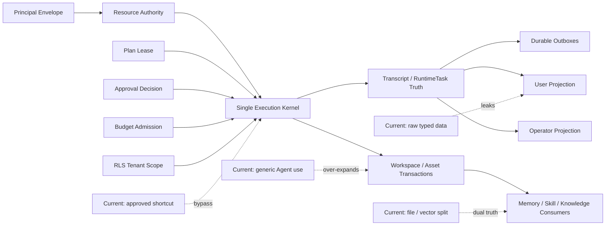

# Hive Agent-Native 第三轮原子化审计报告

> 审计日期：2026-07-11
>
> 审计对象：Hive 当前 checkout 及本地 CC / Codex / Hermes 对照源码
>
> Hive HEAD：`4074cf9f5952818d36aac9728db82329fab9a88b`
>
> FreeCode HEAD：`7dc15d6c8fb0c40c7fcc02ce9b58204324252632`
>
> Codex HEAD：`1f0566d3f59298d1bb88820a0d35294f1eeb07ea`
>
> Hermes HEAD：`18e840469ffe9f8235331c787e34ebbe908564b8`

## 0. 结论先行

本轮结论是：**当前版本仍然不满足上线条件，结论为 NO-GO。**

第三轮不是再次罗列“缺了哪些功能”，而是从实际生产链路反查：输入进入系统后，身份和权限有没有漂移，是否存在第二执行入口，机械事实是否可恢复，结果是否真的到达 Memory、Skill、Workflow、Knowledge、UI 或外部通道，以及这些路径是否有可重复的验收证据。

本轮共收敛出 **28 个根断点**：

- **P0：14 个**。会造成越权、重复执行、错误终态、文件回滚破坏、创建流程假完成、交付丢失或企业知识语义误导，必须在上线前全部关闭。
- **P1：13 个**。会造成恢复能力、CC parity、自进化、资产统计、实时 UI 或验收可信度不足，不能作为“上线后再补”的债务。
- **P2：1 个**。是确定的 KISS/维护性残留，应与本轮一起清理。

当前修复进度：**4 / 28**（SA-01、SA-02、SA-03、SA-04 已按七原子闭环并分别提交）；其余断点未全部关闭前，结论继续保持 NO-GO。

这里的“95% 以上信心”指的是：**对当前 checkout 根断点清单完整度的置信度为 95.3%**，不代表系统有 95.3% 的上线成熟度。只要任一 P0 尚存，上线结论就是 NO-GO。

置信度计算口径：

| 证据面 | 权重 | 本轮可信度 | 加权贡献 |
|---|---:|---:|---:|
| 当前源码、调用链、数据库/文件/事件消费路径 | 60% | 97% | 58.2% |
| 后端、前端、Bridge 自动化验证 | 25% | 96% | 24.0% |
| FreeCode / Codex / Hermes 本地源码对照 | 10% | 96% | 9.6% |
| 当前 UI 像素与真实浏览器运行态 | 5% | 70% | 3.5% |
| **合计** | **100%** |  | **95.3%** |

UI 像素证据被主动降权：当前浏览器受用户浏览器策略保护，无法接管生产标签页；本地 Vite 监听端口也被当前沙箱拒绝。现有 Playwright 截图早于最近 9 个前端提交，不能冒充当前视觉验收。这项限制已作为 UX 验收断点记录，而不是被隐藏。

## 1. 原子化标准

本报告继续严格使用七原子，不把“有 API”“有表”“有页面”算作完成：

1. **输入（I）**：谁发起，输入结构是什么，是否可恢复。
2. **权威（A）**：谁有权读取、决定和写入，租户、用户、Agent、代理关系如何绑定。
3. **执行（X）**：唯一执行入口是什么，是否可能绕过治理。
4. **证据（E）**：event、span、transcript、文件和数据库中谁是机械事实源。
5. **恢复（R）**：断线、重启、重试、取消、回滚、fork 是否幂等。
6. **消费（C）**：Memory、Skill、Workflow、Knowledge、UI 是否真实使用产物。
7. **验收（T）**：测试、迁移、回填、故障注入、可观测性是否覆盖。

状态只使用：**闭环、局部闭环、断点、缺失、排除**。

## 2. 审计范围与对照边界

### 2.1 四块目标

| 目标块 | 本轮覆盖 | 当前总判定 |
|---|---|---|
| 单 Agent | prompt、模型循环、tool loop、Plan、Approval、Task、Goal、Trigger、Hook、Transcript、Resume、Rewind、Channel、Artifact、Local Bridge | **断点** |
| Hive Native | Memory、个人知识库、Skill、Skill evolve、A2A、Subagent、Agent Team、Workflow、Dynamic Workflow、HR、AI 资产消费 | **断点** |
| 公司治理 | Tenant/RLS、Principal、资源授权、审批、预算、审计、企业资产、企业知识、管理员/使用者边界 | **断点** |
| 用户体验 | 会话、状态、Workspace、Deliverables、分支、多人/多 Agent 状态、错误恢复、信息分层、实时连接、视觉验收 | **局部闭环，含 P0 依赖** |

### 2.2 对照原则

- CC 语义以 FreeCode 为第一事实源，重点对照 `src/services/tools/toolExecution.ts`、`src/services/tools/toolHooks.ts`、`src/types/hooks.ts`、session/resume/fork/compact 路径。
- Codex 只提供工程增强：typed thread/turn、approval、sandbox、permission profile、rollout/read model、桌面端信息架构；不覆盖 CC 语义。
- Hermes 作为 Hive Native 单 Agent 智能、工具发现和自进化的质量下限，不作为 CC parity 的定义者。
- CC/Codex 服务商私有远程能力继续标记为“排除”，不伪装成 Hive 技术债。

### 2.3 对照后的核心判断

FreeCode 的工具执行把 validation、PreToolUse、permission、执行、PostToolUse/PostToolUseFailure 放在同一工具生命周期内。Hive 正常工具路径已经具备更多企业治理层，但批准后执行却分叉到另一条快捷路径，这是“功能更多、生命周期反而不唯一”的典型反优化。

Codex 的 PermissionProfile、thread identity、sandbox policy 和 approval event 都说明：审批是原执行请求上的一个决策，不应创建一个缺少原 session/turn/run/budget/cancellation/workspace 的新执行上下文。Hive 目前在批准后丢失这些字段。

## 3. 根断点总表

图例：`✓` 已有真实消费路径；`△` 主路径存在但不完整；`✗` 原子断开。

| ID | 模块 | 优先级 | 状态 | I | A | X | E | R | C | T |
|---|---|---:|---|:---:|:---:|:---:|:---:|:---:|:---:|:---:|
| SA-01 | Plan 授权未绑定具体动作 | P0 | **闭环** | ✓ | ✓ | ✓ | ✓ | ✓ | ✓ | ✓ |
| SA-02 | Approval 后存在第二工具执行入口 | P0 | **闭环** | ✓ | ✓ | ✓ | ✓ | ✓ | ✓ | ✓ |
| SA-03 | Business Task 双状态机与错误终态 | P0 | **闭环** | ✓ | ✓ | ✓ | ✓ | ✓ | ✓ | ✓ |
| SA-04 | Workspace Rewind 操作 Agent 共享目录 | P0 | **闭环** | ✓ | ✓ | ✓ | ✓ | ✓ | ✓ | ✓ |
| SA-05 | Channel ingress 无 durable inbox | P0 | 断点 | △ | △ | △ | ✗ | ✗ | △ | △ |
| SA-06 | 外部通道身份被建成全局 User | P0 | 断点 | △ | ✗ | △ | ✗ | ✗ | ✗ | △ |
| SA-07 | 最终通道交付无 durable outbox | P0 | 断点 | ✓ | ✓ | △ | ✗ | ✗ | ✗ | △ |
| SA-08 | CC Hook surface 有 no-op/planned 壳 | P1 | 缺失/局部闭环 | ✓ | ✓ | ✗ | △ | △ | ✗ | △ |
| SA-09 | Frozen prompt cache 依赖签名不完整 | P1 | 局部闭环 | ✓ | △ | △ | △ | △ | △ | △ |
| SA-10 | 智能上下文机械截断无恢复指针 | P1 | 局部闭环 | △ | ✓ | △ | △ | ✗ | △ | △ |
| SA-11 | Local Bridge receipt 文件并发丢写 | P1 | 断点 | ✓ | ✓ | △ | △ | ✗ | △ | ✗ |
| SA-12 | 全量测试入口不 hermetic | P1 | 断点 | ✓ | ✓ | △ | △ | ✗ | △ | ✗ |
| HN-01 | Personal KB 浏览器继承 Agent owner 权威 | P0 | 断点 | ✓ | ✗ | △ | △ | △ | ✗ | △ |
| HN-02 | Memory/Skill 原生资产缺统一事务锁 | P0 | 断点 | ✓ | ✓ | ✗ | △ | ✗ | △ | △ |
| HN-03 | A2A REST 丢 requester 且 consult 假成功 | P0 | 断点 | △ | ✗ | △ | ✗ | △ | ✗ | △ |
| HN-04 | Subagent/async 查询取消只按 parent Agent | P0 | 断点 | ✓ | ✗ | △ | △ | ✗ | ✗ | △ |
| HN-05 | HR provisioning 恢复会假完成 | P0 | 断点 | ✓ | ✓ | △ | △ | ✗ | ✗ | △ |
| HN-06 | Skill provisional 只有负向回滚，无正向转正 | P1 | 断点 | ✓ | ✓ | △ | △ | ✗ | ✗ | △ |
| HN-07 | AI 资产用量投影只覆盖部分实际消费 | P1 | 局部闭环 | ✓ | △ | △ | △ | △ | ✗ | △ |
| GOV-01 | Agent use 与 Session/Resource ownership 混用 | P0 | 断点 | ✓ | ✗ | △ | ✗ | ✗ | ✗ | △ |
| GOV-02 | 企业知识库“语义缺失、产品已上线” | P0 | 断点 | ✓ | △ | ✗ | ✗ | ✗ | ✗ | ✗ |
| GOV-03 | Workflow promotion 需要 manager 又要求原会话 owner | P1 | 断点 | ✓ | ✗ | △ | △ | △ | ✗ | △ |
| GOV-04 | Budget 状态通知声称有 outbox，实际不存在 | P1 | 断点 | ✓ | ✓ | △ | ✓ | ✗ | ✗ | △ |
| UX-01 | 普通用户直接看到运行时/治理原始字段 | P1 | 局部闭环 | ✓ | △ | ✓ | ✓ | ✓ | ✗ | △ |
| UX-02 | WebSocket 20 次后永久放弃且无恢复入口 | P1 | 断点 | ✓ | ✓ | △ | △ | ✗ | ✗ | △ |
| UX-03 | 当前 UI 无新鲜像素基线与 CI gate | P1 | 断点 | △ | ✓ | ✓ | △ | ✗ | △ | ✗ |
| UX-04 | 核心运行时/前端巨型模块维持多责任 | P1 | 局部闭环 | ✓ | △ | △ | △ | ✗ | △ | △ |
| UX-05 | Sidebar pin/search 状态已无消费方 | P2 | 断点 | ✓ | ✓ | ✗ | ✗ | ✓ | ✗ | ✗ |

## 4. 第一块：单 Agent

### SA-01：Plan 授权没有绑定“这一次具体执行” — P0

**修复状态（2026-07-11）**：**闭环**。Plan confirmation 现在签发基于 canonical `ApprovalRequest` 账本的单次 `PlanAuthorizationLease`；旧 confirmed plan 在迁移时显式过期，不能继承宽泛授权。模型不能自行加入或扩大 scope；受信 runtime 预置的 scope 或从 plan 确定性派生的 handoff scope，均随 plan hash 一起确认。PlanCard 只显示用户可理解的授权摘要，不显示 `target_ref`、canonical arguments、lease id 或 evidence id。

**机械事实**：`backend/app/services/plan_mode_gate.py:81-283` 只检查 plan 是否存在、是否属于同一 Agent、intent 是否相同、status/version/hash 是否匹配；`backend/app/models/plan_request.py:79` 虽有 `expires_at`，gate 没有消费它。检查过程只读，不记录 `consumed_at`，也没有绑定 current user、session、run、target 或 canonical arguments hash。

**断链**：一个已确认 plan 可以在同 Agent、同 intent 的不同 session 和不同参数动作间重放。Plan 从“计划确认”错误地变成了宽泛 capability token。

**一次性关闭**：引入 `PlanAuthorizationLease`，不可变绑定 tenant、agent、requester、confirmer、session、action_kind、target_ref、canonical_args_hash、expiry、max_uses、consumed_at；消费必须 row-lock/CAS。Schedule、Trigger、Task、Workflow、Tool 都只消费同一种 lease。

**验收**：跨用户、跨 session、跨目标、标点/字段改变、过期、并发双消费、重放、fork 后复用全部必须 fail closed。

### SA-02：批准后工具调用绕开正常工具内核 — P0

**修复状态（2026-07-11）**：**闭环**。`ApprovalRequest` 现在保存 hash-bound `hive.approval_execution_envelope.v1`，审批只产生一次性 `ApprovalDecisionSet`；`execute_approved()` 恢复原 runtime authority 后重新进入唯一的 `ToolRuntimeService.execute()`。原 `_execute_without_governance` 已物理删除。批准后的动作会再次经过 Plan 证据复验、当前 hooks、validation、L2、完整 Governance、Action Preflight、runtime-task fence、统一 timeout、backend、artifact/asset usage 与 terminal lifecycle；批准只能覆盖原 action_type 对应的 exact approval gate，不能覆盖 live deny、RLS、资源消失、取消、预算耗尽或 preflight drift。

**机械事实**：正常路径 `backend/app/tools/service.py:715-1011` 依次执行 Plan gate、完整 runtime context、hook、validation、L2 policy、governance runner、Action Preflight、timeout；批准路径 `execute_approved` 在 `1259-1333` 进入 `_execute_without_governance`（`1335-1573`）。后者只恢复 agent/user，未恢复 session_id、turn_id、runtime_task_id、budget_run_id、origin_channel、permission profile、T0 refs、workspace override 和 cancellation，并跳过 hard Plan gate、governance runner、Action Preflight 和正常 timeout。`1755-1769` 的 docstring 反而声称 approved execution 共用 gate，与代码不符。

`ApprovalRequest` 在 `backend/app/models/audit.py:28-69` 保存 agent、requester、tool、arguments/hash、policy snapshot、expiry/consumption，但没有 immutable session/run execution envelope。

**断链**：审批成功后，执行身份、预算、取消、审计和恢复语义被重新创建；策略在审批后变化时也没有统一的不可覆盖重检。

**一次性关闭**：删除 `_execute_without_governance`。建立唯一 `ToolExecutionKernel.execute(ExecutionEnvelope, DecisionSet)`；Approval 只向原 envelope 增加 scoped decision，不产生新入口。可覆盖策略沿用票据，不可覆盖策略、RLS、资源存在性、preflight drift、budget、cancellation 在真正执行前重检。

**验收**：同一工具在 direct/ask/approved/retry/resume 五条入口必须产生同构 span、hook、preflight、timeout、artifact 和 terminal event；属性测试证明不存在第二 backend execution call site。

### SA-03：Business Task 的 Task 与 RuntimeTask 不是一个状态机 — P0

**修复状态（2026-07-11）**：**闭环**。Task 创建与对应 `RuntimeTask(task_type="business_task")` 现在共用一次数据库事务；`execute_task` 只返回 typed `TaskExecutionOutcome`，唯一 finalizer 在 tenant row-lock 下同步转移两种投影。创建与手动触发都要求 caller-owned `request_id`，并用 principal-bound request hash、数据库唯一键和冲突恢复保证并发重试只产生一个逻辑 run。Plan block、Agent/Model 缺失、空内容、异常、取消与未知副作用不再伪装成 completed。旧 running 数据在迁移中进入 `needs_reconciliation`，pending 数据得到可恢复 RuntimeTask；状态 REST/retired CRUD 旁路和跨 Agent TaskLog 访问同时关闭。

**机械事实**：`backend/app/api/tasks.py:104-157` 先 commit `Task`，再创建 `RuntimeTask`；创建 RuntimeTask 失败会留下 orphan pending Task，HTTP 重试会再建一条 Task。`backend/app/services/runtime_task_service.py:23-29` 的 restart-resumable 类型没有 `business_task`。worker 在 `runtime_task_worker.py:308-329` 调用 `execute_task` 后无条件把 RuntimeTask 标 completed。

`backend/app/services/task_executor.py:292-379` 在 Plan 被阻止、Agent/Model 缺失等分支直接 return，仅写 TaskLog；`471-532` 对非异常 invocation 仍可能把 Task 标 done；反思 session 使用 `agent.creator_id`，不是 Task requester。

Task logs 在 `backend/app/api/tasks.py:181-207` 只按 task_id 查写，没有验证 task_id 属于 path 中的 Agent。

**断链**：用户会看到 RuntimeTask completed，但业务 Task 仍 pending/doing，或者 Task done 但模型实际没有交付；重启不会自动恢复。

**一次性关闭**：用 outbox/同事务创建 TaskIntent 与 RuntimeTask；`execute_task` 返回 typed `TaskExecutionOutcome`，worker 只按 outcome 转移两者；补 orphan reconciler、root idempotency key、requester/session 绑定和 terminal invariant。

**验收**：在 Task insert、RuntimeTask insert、claim、Plan block、模型缺失、tool error、terminal persist 各点故障注入；断言两个状态机永不矛盾且重试不复制任务。

### SA-04：Workspace Rewind 恢复的是 Agent 全局目录 — P0

**修复状态（2026-07-11）**：**闭环**。Workspace rewind 现在只恢复“当前 session 在 checkpoint 之后、且 lineage 可连续证明”的路径；其他 session 的文件保持不变。所有生产 workspace 写入口和 restore 共用跨进程 Agent workspace lock；restore 在锁内完成 manifest/checksum/lineage/CAS 校验、stage、fsync、原子目录 swap，并以 durable transaction journal 协调文件系统与 transcript/数据库提交。失败、取消和进程崩溃均可回滚或在启动时按已提交 control event 收敛；branch 会克隆独立快照而不共享 retention 生命周期。

**机械事实**：`backend/app/services/session_workspace_snapshot.py:102-168` 同步复制 Agent workspace，限制 1000 文件/50MB，但无共享锁；capture 会直接 `rmtree` 已有 snapshot。restore 在 `183-295` 校验后对当前 workspace 原地 unlink/copy，没有 stage、fsync、atomic swap 或 rollback。`backend/app/services/session_command_runtime.py:367-433` 只锁当前 ChatSession、取消当前 session active run；`1039-1121` 先修改文件系统，再写 transcript/DB 事件。

**断链**：同一个 Agent 的两个用户/会话并发工作时，一个 session rewind 可以删除另一个 session 的新交付物；进程在文件恢复后、DB commit 前崩溃会形成不可解释状态。

**一次性关闭**：优先采用 session/branch workspace overlay；若仍共享 Agent workspace，则必须使用 AgentWorkspaceTransaction，跨该 Agent 所有 session 加写锁，restore 先 stage+hash，再 atomic swap，并写 durable restore journal 与反向 rollback package。Snapshot 异步化并有 retention。

**验收**：两个 session 并发写+rewind、restore 中途 kill、磁盘满、checksum 错、超限文件、同 checkpoint 双重 rewind、fork 后 restore 全部覆盖。

### SA-05：外部通道入口没有 durable inbox — P0

**机械事实**：Slack 使用进程内 set 且在处理前标记（`backend/app/api/slack.py:129,194-202`）；Feishu 使用进程内 set，并在真正消息处理前的配置阶段标记（`feishu.py:693-694,907-931`）；Telegram 用 Redis NX 但 TTL 仅 1 小时且 Redis 异常时 fail open（`telegram.py:271-282,426`）；Discord 直接 background task，无持久事件账本（`discord_bot.py:213-417`）。

**断链**：多 worker、重启、超时重投、处理到一半崩溃时会重复执行或永久丢事件。

**一次性关闭**：统一 `ChannelIngressEvent`，唯一键绑定 tenant/provider/installation-or-account/event_id，状态 received/claimed/processed/failed/dead_letter，保存 payload digest、attempt、next_retry_at、result run id；provider ack 与 durable insert 分离。

**验收**：跨 worker 并发重复、ack 后 crash、处理前 crash、处理后 ack 丢失、Redis/DB 短暂失败、事件晚于一小时重投。

### SA-06：Slack/Telegram/Discord 外部联系人被伪造成平台 User — P0

**机械事实**：User 的 username/email 全局唯一；Slack 在 `backend/app/api/slack.py:245-287` 建 `slack_<sender>` active member，Telegram 在 `telegram.py:485-508`、Discord 在 `discord_bot.py:289-300` 同样处理。它们没有 tenant/installation/account 维度。Feishu 已有 `ExternalIdentity` 路径，说明项目内已有更正确的邻近实现。

**断链**：同一 provider subject 在两个 tenant 或两个 bot installation 中碰撞；外部联系人污染公司成员、license、治理和 ownership 语义。

**一次性关闭**：建立 `ExternalPrincipal(tenant, provider, installation/account, subject)`，只在明确邀请/绑定后关联 User；消息 session、approval requester、audit actor 支持 external principal，不再创建假 member。

**验收**：相同 sender 跨租户/跨 bot、外部人后续受邀绑定、解绑、删除 provider、历史 transcript 回填、license 统计不污染。

### SA-07：Agent 完成了，但最终消息仍可能永远送不到通道 — P0

**机械事实**：`backend/app/services/web_chat_runtime.py:3600-3631` 的最终 channel send 捕获异常后只记录日志。现有 `RuntimeNotificationOutbox` 的 reconciler 仅支持 subagent/team/workflow/delegation/a2a/trigger（`backend/app/services/runtime_notification_outbox.py:257-271`），不含 web_chat_turn 或 business_task。

**断链**：进程在 terminal transcript/RuntimeTask commit 后、channel send 前崩溃，聊天事实成功但用户永远收不到最终文本和附件。

**一次性关闭**：统一 `ChannelDeliveryOutbox`，payload 包含 terminal text、artifact ids、delivery target snapshot、idempotency key；provider receipt、retry、dead letter、人工重送均可审计。

**验收**：terminal commit 后 kill、provider 5xx/429、同 delivery 重放、部分附件成功、目标撤销、DLQ 重送。

### SA-08：Hook 仅有枚举，不等于 CC parity — P1

`backend/app/runtime/hooks.py:200-215` 明确把 Setup、ElicitationResult、WorktreeCreate/Remove、CwdChanged、FileChanged 标成 disabled no-op；Notification、Elicitation、ConfigChange、InstructionsLoaded、WorkspaceContextChanged、ArtifactChanged 只是 planned observe。FreeCode 已在 Setup、UserPromptSubmit、Notification、InstructionsLoaded、Worktree 和 Stop/TeammateIdle 等真实路径消费这些 hook。

关闭标准不是“把事件 emit 出去”，而是每个 hook 有：确定触发点、blocking/observe 语义、timeout、修改输入规则、失败恢复、transcript evidence、测试 fixture。Hive 不支持 worktree 时应明确标“缺失”或映射到 cloud workspace transaction，不能保留假 parity 壳。

### SA-09：Frozen prompt cache 可能复用过时治理上下文 — P1

`backend/app/kernel/engine.py:2462-2644` 的 cache key支持若干可选 signature，但全仓未发现生产路径写入 configured channel/company/org/A2A 等 signature。workspace 文件有 hash，DB-driven ChannelConfig、Company Intro、协作者状态不一定失效。`backend/app/services/agent_context.py:381-399` 查询 ChannelConfig 使用裸 `async_session`，在强制 RLS/background 下异常会被吞掉并静默省略。

关闭方式：构造 versioned `ContextDependencyManifest`，每个 frozen section 必须贡献 revision/hash；缺 signature 时禁用复用而不是默认为稳定。ChannelConfig 查询必须 tenant-scoped。

### SA-10：智能上下文截断后没有检索恢复通道 — P1

`backend/app/services/agent_context.py:345-350,455-474,484` 对 soul、company、org、A2A 做字符预算截断。预算本身合理，但被截掉的部分没有 source ref、tool hint 或 continuation token，模型不知道还有内容可取。

关闭方式：保留短 resident summary，但附带 `context_ref` 和按需读取工具；由模型判断是否检索。个人知识库继续严格 tool-only，不能借此重新直接注入。

### SA-11：Local Bridge replay receipt 并发不安全 — P1

`local_bridge/hive_bridge/execution_receipts.py:18-69` 每次读取整份 JSON、内存修改、写固定 `.tmp` 后 replace，无 file lock/CAS。两个本地执行并发完成会丢记录或争用同一 temp 文件；当前 tests 没有并发 case。

关闭方式：SQLite/WAL 或带 flock 的 append-only receipt ledger；唯一 replay_key、fsync、corruption quarantine、并发与 crash 测试。

### SA-12：全量测试命令不是 hermetic 机械事实源 — P1

默认 `pytest tests -q` 会写 `~/.hive/data/agents`；在受限环境中产生 116 个失败。显式设置可写 `AGENT_DATA_DIR` 后收敛为 3 个失败，其中 2 个是当前宿主禁止嵌套 `sandbox-exec`，1 个是 `tests/tools/test_service.py::test_tool_decision_links_the_durable_approval_ticket` 没有注入 capability policy loader，意外连接 PostgreSQL。

关闭方式：pytest session fixture 强制临时 AGENT_DATA_DIR/HOME；OS sandbox 测试有 capability probe 而不是只检查二进制存在；所有 unit test 注入 DB/策略依赖。CI 必须一条命令可重复。

## 5. 第二块：Hive Native

### 先确认一个关键原则：Personal KB tool-only 仍然成立

`backend/app/services/agent_context.py:337-357` 明确不在原始 context 装载 canonical memory，也没有 Personal KB 内容；Personal KB 的真实入口是 `search_personal_kb` / `read_personal_kb`（`backend/app/tools/handlers/knowledge.py:220-344`）。

运行时 `TruthSearchService` 会自动查询 OpenViking 并渲染为 “Relevant Company Knowledge”，但当前仓库唯一 `viking_client.add_resource` 生产调用来自旧 Enterprise KB upload（`backend/app/api/files.py:696-726`），没有把 `KnowledgeDocument(scope_type=person)` 索引进该自动检索面。因此本轮没有发现 Personal KB 被直接塞回原始上下文。

这个结论只对当前代码成立。后续 Company Knowledge Core 必须使用不同 scope/provider，不得把 person scope 混入统一 `viking://resources/` 自动检索。并且现有 ACL mirror 只把 `openviking://` 识别为 governed prefix，而 OpenViking client/Enterprise upload 实际使用 `viking://`；在任何新知识进入该 provider 前，必须先修正这个 scheme contract 并对无 ACL metadata 的 provider result fail closed。

### HN-01：Personal KB 的浏览器 API 错把 Agent 权威借给当前人 — P0

`backend/app/services/personal_knowledge_access.py:22-63` 只要传入的 agent 是 owner agent，`owner_agent_predicate` 就允许访问，和当前浏览用户是不是 owner 无关。Agent-scoped browser routes 在 `backend/app/api/agent_knowledge.py:622-737` 只做 generic Agent access，然后同时传 current_user_id 和 agent_id。

**断链**：被共享使用该 Agent 的普通用户，可通过浏览器 API 读取 owner Personal KB 中标记为 `agent_searchable` 的内容；“允许 Agent 检索”被错误扩大成“允许当前人直接浏览正文”。Agent runtime 的受托检索权被错误等同于人类浏览权。

**一次性关闭**：拆分 `HumanBrowserPrincipal` 与 `AgentRuntimePrincipal`。Human browser 只按 owner/user grant；Agent tool call 才可使用 agent grant/owner-agent relation，并带 requester/delegation evidence。

**验收**：owner、shared use user、manager、explicit user grant、agent grant、过期 grant、delegated run 的矩阵测试。

### HN-02：Memory、Soul、Skill Registry 没有一个共享资产事务 — P0

`backend/app/memory/explicit_overlay.py:53-154,286-309` 是 check→write file→append manifest→rebuild index，多文件间无共享锁。T3 Platform Gate 有单次 patch 的 staged rollback，但 tool submission 与 Auto Dream 没有共用同一 Agent write lock。`backend/app/services/skill_lifecycle.py:462-580` 与 `skill_evolution_registry.py:104-169` 仍是 read-modify-write/append，固定 temp 文件也没有并发锁。

**断链**：两个 session 同时保存 explicit memory、Dream 合并 T3、Skill usage 更新 registry 时会丢更新，manifest/index 与内容不一致。

**一次性关闭**：建立每 Agent 唯一 `AssetTransaction`，Memory overlay、T3、soul、skill registry、derived index 全部使用同一 lock/version journal；先 stage 所有文件与 manifest，再 atomic commit。index/graph/search 都必须可从 canonical assets 重建。

**验收**：多进程并发写、kill -9、磁盘满、旧 revision、重复 candidate、Dream 与 tool commit 同时运行、index 重建。

### HN-03：A2A REST 丢失 requester，consult 失败仍标 sent — P0

`backend/app/api/advanced.py:86-97` 验证 source Agent access 后没有把 current_user/session 传入 CollaborationService。`backend/app/services/collaboration.py:110-156` 对 consult 直接包装 `{status: sent}`，即使底层返回 `❌...`；delegate 分支才识别错误。底层 A2A session owner 在 `backend/app/services/agent_tool_domains/messaging.py:1039,1116` 回退为 source_agent.creator_id，并用 broad catch+字符串错误。

**断链**：审计记录无法证明谁发起；错误可能在 UI 中表现为 sent；共享 Agent 用户的操作归到 creator。

**一次性关闭**：统一 `ExecutionPrincipal` 贯穿 REST/tool/A2A；返回 typed `A2AOutcome`，禁止 emoji/string 判断终态；A2A RuntimeTask、child session、audit、budget 都绑定 root requester/session。

### HN-04：Subagent/async control 只认 parent Agent，不认 root user/session — P0

`backend/app/services/agent_tool_domains/messaging.py:1530-1610` 的 check/cancel/list 只传 parent_agent_id；`backend/app/services/subagent_run_service.py:1560-1583` 明确把 ownership 定义为 parent Agent。共享使用同一 Agent 的两个用户可看见或取消彼此的 child work。

关闭方式：所有 child RuntimeTask 持久化 root_user_id、root_session_id、delegation chain；普通用户按 root ownership，manager 使用显式 operator action 并审计。

### HN-05：HR 主契约已修，但 provisioning 状态机仍会假完成 — P0

已关闭的部分：`backend/app/tools/handlers/hr.py:1411-1453` 把 blueprint 绑定 tenant/HR agent/user/session；create tool 在 `1456-1485` 只接受 blueprint_id，不再要求模型复述整份蓝图。

仍断开的部分：claim 在 `1449-1451` 先把 draft 标 creating 并 commit，随后 `1497-1501` 才做 name 校验；坏 blueprint 会占用 300 秒 lease。`backend/app/services/hr_creation_service.py:74-98` lease 固定 300 秒且无续租。核心 Agent commit 后 draft 进入 provisioning（`hr.py:1946-1964`），optional installs 才开始；重试只要发现 `created_agent_id` 对应 Agent 存在，就在 `1586-1601` 直接标 completed/ready，不会继续未完成 install plan。

**一次性关闭**：创建 `HrProvisioningStep` journal：validate、model、core row、workspace、defaults、T0、每个 MCP/Skill、finalize；每步幂等、可重入、可续租。ready 只能由 required-step invariant 推导，optional warning 单独呈现，不能把“Agent row 存在”当完成。

### HN-06：Skill provisional trial 没有正向转正路径 — P1

`backend/app/services/provisional_trial.py:14-55` 只返回 continue_trial 或 rolled_back；`skill_lifecycle.py:551-579` 仅在 failed/workaround 时调用它。虽然 `skill_lifecycle.py:413-448` 会从成功用量产生 promote candidate，但没有任何路径把已安装 registry entry 的 state 从 provisional 改为 active。全仓 active state 只在初次非 provisional 安装时写入。

关闭方式：TrialLedger 记录正/负信号、窗口、版本 hash；达到正向阈值后显式 `promote_to_active`，失败则恢复 rollback ref；loader/catalog 必须按 registry state 决定是否可用，并显示 trial 状态。

### HN-07：企业 AI 资产“有注册表”，但用量不是全执行面事实 — P1

正向证据：Agent invocation span、Workflow definition resolution、external capability activation 已能投影 usage。缺口：`backend/app/tools/service.py:608-659` 的通用工具消费只识别 load_skill 和 spawn_subagent；Skill native key 还从模型原始参数重构，不一定等于实际解析版本；external capability 只在 activation 记账，不代表每次 runtime use。

关闭方式：资产解析器返回不可变 `ResolvedAssetRef(asset_id, revision, native_key, source_ref)`，ExecutionEnvelope 直接携带它；每次真实消费由 runtime span 投影，不能从字符串猜资产身份。

## 6. 第三块：公司治理

### GOV-01：generic Agent use 被当成 workspace/session/resource ownership — P0

**机械事实**：

- Workspace list/read/write/delete/upload 只调用 `check_agent_access`（`backend/app/api/files.py:200-248,436-478,540-588`），共享 use user 可读写整个 Agent workspace。
- ChatArtifact loader 只校验 artifact.agent_id（`files.py:298-310,344-355,406-433`），没有校验 artifact.session_id 的当前用户 ownership。
- Activity/tool failures 对任何 use user展示整个 Agent（`backend/app/api/activity.py:24-70`）。
- Task list/log 同样按 Agent 共享，且 log endpoint 未校验 task 与 path Agent 的关系。
- Schedule 手工 run/history 也只需要 generic use；其动作和历史没有独立资源授权。
- 项目已有正确邻近实现 `authorize_session_action`（`backend/app/core/permissions.py:147-208`），但上述 routes 没使用。

**断链**：能“使用某 Agent”被错误扩大成能浏览所有人的文件、产物、错误、任务、自动化历史，甚至修改共享目录。

**一次性关闭**：中央 `ResourceAuthority` 按 resource kind/action 计算 owner/session/grant/operator 权限。Agent use 只代表可发起执行，不自动获得 browse/mutate Agent 全部状态。Manager override 必须显式、可审计、UI 标 operator view。

**迁移**：ChatArtifact/Task/Workspace manifest 回填 owner_user_id、root_session_id；无法证明归属的 legacy 数据进入 admin-only quarantine，不默认开放。

### GOV-02：企业知识库是“幽灵能力” — P0

用户已经明确企业知识库尚未建设，但代码把它作为完整产品公开：`backend/app/api/files.py:591-810` 挂载 `/enterprise/knowledge-base`，以 `enterprise_info_<tenant>` 文件夹为事实源；前端 `frontend/src/pages/workspace/WorkspaceInfoSection.tsx:67-73` 宣称是所有 Agent 可访问的共享文件。

Upload 在 `files.py:696-726` 用 fire-and-forget `asyncio.create_task` 写 OpenViking，无 durable index job/receipt；PUT edit 与 DELETE 完全不更新/删除向量索引。没有 document version、grant、sensitivity、citation、promotion、rollback 或 DB canonical truth。

还有一个更隐蔽的 ACL fail-open：`backend/app/services/connector_acl.py:23-36` 只把 `openviking://` 列为 governed source，OpenViking client 与 upload 使用的却是 `viking://`；`connector_item_visible` 在 `540-556` 对无 ACL metadata 的非 governed scheme 直接放行。因此只要 provider search result 没有回传 ACL，Hive 本地 mirror 就会把它当 legacy internal item 注入 prompt。现有 tests 也没有 `viking://` 缺 ACL 必须拒绝的契约。

**断链**：文件内容与检索索引必然分裂；UI/Agent 认为这是企业知识，而实际上只是共享目录加最佳努力向量副本。

**本轮正确关闭方式**：既然 Company KB 是后续第二部分，本轮应隐藏/退役这组 route、UI 和自动 OpenViking retrieval，保留 Company Intro 与 org structure；把现存文件只读导出/隔离。未来 Company KB 必须建立在 KnowledgeDocument/Grant/IndexJob 的 company scope 上，而不是扩写 legacy folder。

### GOV-03：Workflow promotion 的两种权威相互否定 — P1

`backend/app/api/workflows.py:900-924` 先要求 Agent manage，然后又调用 `_authorize_workflow_run_action`；该 helper 在 `548-572` 要求当前人正好拥有 initiating parent session。管理员无法固化员工会话产生的优质 workflow，普通会话 owner 又通常没有 manage。

关闭方式：明确两人制。Requester 从自己 session 提交 immutable promotion proposal；manager 审批归档 run hash/definition hash 后生成公司/Agent asset。不得让 manager 冒充原 session owner。

### GOV-04：Budget 通知注释声称 outbox 可补偿，但没有消费者 — P1

`backend/app/services/runtime_budget_service.py:1256-1294` 写 session status event 失败后吞异常，注释称 outbox 可 reconcile；当前没有对应 producer/reconciler。RuntimeBudgetEvent 是预算事实，但用户可能永远不知道批准/拒绝结果。

关闭方式：BudgetTransitionOutbox，以 budget_run_id+transition 唯一，投影到 transcript/UI/channel；原始预算状态仍是事实源，outbox 只负责消费。

### RLS 正向结论

RLS 基础设施本身不是本轮主断点：`backend/app/database.py` 已有 tenant pin、commit 后重 pin、审计式 BYPASS；`backend/app/main.py:386-389` 启动时检查 runtime role。当前问题主要是上层把错误 principal/resource 带进合法 RLS 查询，RLS 无法替业务语义纠错。

## 7. 第四块：用户实际使用体验与 UI/UX

### 当前布局事实

普通用户当前不是固定三栏：`frontend/src/pages/agent-detail/AgentChatSection.tsx:4069-4072,4188-4205` 只有 admin manage 模式才出现左侧 All Users；普通 session 是中央对话 + 右侧 Workspace。右侧已经按用户目标调整：Deliverables 在上、Run status 在下，可折叠、可拖拽（`2292-2408`）。这部分方向正确。

### UX-01：普通用户仍直接消费 operator/debug 数据 — P1

`frontend/src/pages/session-workbench/ThreadItemRenderer.tsx:53-149` 默认列出 tool_call_id、permission_request_id、risk class、arguments、approver id、plan hash、runtime task/session ids、compaction counters、provider error code。`151-228` 只折叠 tool/result/workflow/subagent/reasoning，approval/error/plan/artifact/boundary/event 详情默认展开；组件没有 audience/role policy 参数。

右侧 runtime summary 在翻译缺失时直接显示 raw state（`AgentChatSection.tsx:2389-2394`）。这正是用户截图里“API request 和运行 data 为什么放在用户面前”的根因。

关闭方式：后端产出双投影：`user_summary/user_action` 与 `operator_details/evidence_refs`。普通用户只看“发生了什么、需要做什么、结果在哪里”；管理员在显式 Inspector/诊断模式查看 ID、hash、span、arguments。敏感 arguments 还要字段级 redaction。

### UX-02：实时连接重试 20 次后永久停掉 — P1

`frontend/src/pages/AgentDetail.tsx:1719-1734` 在 20 次失败后把 reconnectDisabled 设为 true；`1940-1953` 的 effect 不会因网络恢复自动再触发，也没有 online listener 或用户“重新连接”按钮。UI 会长期显示 reconnecting，用户仍可能发起 HTTP run，却看不到增量和终态。

关闭方式：无限但有上限间隔的后台重连；监听 online/visibility；到达 degraded 阈值时切 polling/backfill；显示明确“离线，任务仍在后台运行”和手动重连；重连后按 transcript sequence 补齐。

### UX-03：视觉验收基线已经过期 — P1

现有 desktop snapshot 最后更新于 commit `96c261fe755a18bcb7a7235e7737b755693a703a`。此后前端有 9 个提交、59 个文件变化、2758 行增加/2236 行删除。`frontend/package.json` 有 `test:e2e`，但 `.github` 未发现 Playwright CI 调用。

当前 snapshot SHA256：

- desktop：`62ad8eec495122b7d4c320c37cc998b19de4c9cc2272e0c505fd11f2b0eec064`
- narrow：`7e2f9f1790462b1c816c49f27e27e0611a73f245af772eabd57fa0c85119d28e`

关闭方式：以当前代码重拍 desktop/narrow、普通用户/admin、idle/running/approval/error/branch/subagent/workflow/artifact 关键状态；CI 做 screenshot diff 和可访问性 gate。

### UX-04：代码层还没有达到 KISS/奥卡姆目标 — P1

当前高风险热点：

| 文件 | 行数 |
|---|---:|
| `backend/app/kernel/engine.py` | 5935 |
| `backend/app/services/web_chat_runtime.py` | 4418 |
| `backend/app/tools/service.py` | 2033 |
| `backend/app/runtime/invoker.py` | 1600 |
| `backend/app/tools/handlers/hr.py` | 2502 |
| `backend/app/services/skill_distiller.py` | 2535 |
| `frontend/src/pages/AgentDetail.tsx` | 3250 |
| `frontend/src/pages/agent-detail/AgentChatSection.tsx` | 4567 |

行数不是罪证，真正问题是这些文件同时拥有状态机、权限、IO、恢复、投影和 UI orchestration，已经造成 approved tool 第二入口、HR 假恢复、raw UI fallback 等现实断点。

关闭方式不是抽象重写，而是围绕本报告的唯一事实源做功能核心拆分：ExecutionEnvelope、ResourceAuthority、Durable Inbox/Outbox、WorkspaceTransaction、AssetTransaction、typed state transitions、User/Operator Projection。删除分叉，不再新增 parallel helper。

### UX-05：Sidebar 仍保留无消费者状态 — P2

`frontend/src/pages/Layout.tsx:273-289,348-361` 维护 pinnedAgents/sidebarSearch 并传给 AppSidebar；`frontend/src/pages/layout/AppSidebar.tsx:93-100,281-288` 只声明和解构，组件内没有消费。这是已移除 UI 的残余状态、localStorage 和测试噪声，应直接删除。

## 8. 已确认闭环，后续修复必须保护

| 能力 | 七原子结论 | 当前证据 |
|---|---|---|
| Web chat durable run 主链 | 闭环 | RuntimeTask、transcript、disconnect 不取消、restart claim、UI backfill 均有当前路径 |
| Personal KB 原始上下文边界 | 闭环 | 不在 `build_agent_context` 拼接；只通过 Personal KB tools 消费 |
| HR Preview→Confirm→Create 参数契约 | 闭环 | server canonical blueprint + blueprint_id-only create；全 provisioning 仍由 HN-05 判断点 |
| Code execution artifact→聊天附件 | 闭环 | structured artifact manifest 被 kernel/file-change 与 chat artifact delivery 消费；原 Excel 附件断点已修 |
| Session Goal continuation | 闭环 | session authority、稳定 continuation run id、RuntimeTask resume、budget/blocked 状态、terminal bridge |
| Trigger/定时任务主执行账本 | 局部闭环 | preflight→budget→RuntimeTask→inflight→success/failure；仍继承 SA-01 Plan 授权问题 |
| 右侧 Workspace 信息架构 | 闭环 | Deliverables 上、Run status 下；普通用户无固定左栏，admin 才有 All Users |
| RLS 底座 | 闭环 | tenant pin、audited bypass、startup role guard；业务资源授权仍由 GOV-01 判断点 |

## 9. 跨模块冲突图



当前最危险的不是“治理太多”，而是治理在不同入口重复实现、字段不一致：Plan、Approval、Preflight、L2、Budget、RLS 各自正确的一部分组合后，反而产生 bypass 或无法运行。解决方式是减少入口和事实源，不是继续加 gate。

## 10. 一轮完成的落地施工图

以下是同一轮发布的依赖顺序，不是 MVP、Phase 1/2 或延期路线。任何一项都包含 schema、迁移、回填、代码、UI、测试、故障注入和观测。

### A. PrincipalEnvelope + ResourceAuthority

- 扩展 `backend/app/tools/runtime.py`，统一 tenant/user/external principal/agent/session/turn/run/delegation/operator。
- 在 `backend/app/core/permissions.py` 建唯一 resource action evaluator。
- 收口 `files.py`、`activity.py`、`tasks.py`、`schedules.py`、`agent_knowledge.py`、`workflows.py`。
- 新增 ExternalPrincipal 与 legacy fake users 的非破坏回填。

### B. 唯一 ToolExecutionKernel

- `backend/app/tools/service.py` 删除 approved shortcut。
- `approval_service.py` 和 ApprovalRequest 持久化 immutable ExecutionEnvelope ref。
- PlanAuthorizationLease 与 ApprovalDecision 都只是同一执行的输入。
- normal/approved/retry/resume 共享 hook、validation、L2、preflight、budget、timeout、artifact、span。

### C. Durable Inbox / Outbox

- ChannelIngressEvent 收所有 provider webhook。
- ChannelDeliveryOutbox 收 final chat、business task、artifact delivery。
- BudgetTransitionOutbox 收批准/拒绝通知。
- provider-specific adapter 只做验签/ack/send，不拥有重试事实。

### D. Session Workspace Transaction

- session/branch overlay 或 Agent 级事务锁。
- capture/restore 采用 stage→verify→atomic swap→journal。
- snapshot retention、quota、recovery reconciler。

### E. Agent AssetTransaction

- Memory overlay、T3、soul、Skill registry/index 共用 per-Agent lock/version journal。
- graph/vector/index 全部作为可重建派生面。
- Personal KB person scope 与未来 Company KB company scope 物理/逻辑分离。

### F. Durable State Machines

- BusinessTask：typed outcome + transactional enqueue + reconciliation。
- HR：step journal + lease heartbeat + required-step ready invariant。
- Skill trial：positive promotion + negative rollback。
- Workflow promotion：requester proposal + manager approval。

### G. User / Operator 双投影

- Thread item schema增加 audience-safe summary/action。
- 普通用户默认只看交付物、状态、阻塞、可执行动作。
- raw IDs、hash、arguments、span、evidence refs 只在 operator inspector。
- WebSocket degraded/polling/manual reconnect 闭环。

### H. 验收与发布门

- pytest 默认 temp data root；DB/unit dependency 全注入。
- Playwright 当前截图 + CI visual/a11y gate。
- 所有 P0 故障注入用真实 state invariant 验收。
- migration dry-run、legacy backfill report、rollback rehearsal、生产 canary。

## 11. 必须执行的故障注入矩阵

| 场景 | 必须成立的 invariant |
|---|---|
| 同一 Plan 跨 session/参数/目标重放 | 第二次或不匹配动作 fail closed |
| Approval 后 policy/RLS/budget 改变 | 不可覆盖策略重新检查；原 envelope 不丢 |
| Task row commit 后 RuntimeTask insert crash | reconciler 补齐或原子回滚，不复制 Task |
| 两个 session 同 Agent workspace 并发 rewind | 互不删除对方文件；DB/FS 同步终态 |
| 两 worker 同时处理同 webhook | 只产生一个 root run |
| terminal commit 后进程退出 | outbox 重送最终文本与附件 |
| shared Agent use user 浏览 Personal KB | 无 user grant 时 403/404 |
| OpenViking 返回 `viking://` 且缺 ACL metadata | prompt 注入 fail closed，并记录 provider contract error |
| Dream、save_memory、skill evolve 并发 | canonical assets/manifest/index 无丢写 |
| HR 在每个 provisioning step 后 crash | 重试从下一未完成 step 继续，不假 ready |
| provisional Skill 连续成功/失败 | 确定转 active 或 rollback，状态可见 |
| manager 固化员工 workflow | 双人审批成立且不冒充 session owner |
| WebSocket 离线超过 20 个周期 | 自动恢复或 polling backfill；用户有明确状态/动作 |
| 当前 desktop/narrow 关键状态 | screenshot/a11y CI 通过 |

## 12. 本轮机械验证证据

### Backend

命令：

```bash
cd backend
source .venv/bin/activate
AGENT_DATA_DIR=/private/tmp/hive-audit-agent-data-20260711 pytest tests -q
```

结果：`5860 passed, 3 failed, 262 skipped, 4 warnings in 187.74s`。

三项失败分类：

1. `test_run_command_executes_inside_workspace`：当前宿主禁止嵌套 `sandbox-exec`。
2. `test_workspace_write_profile_allows_workspace_write`：同一宿主限制。
3. `test_tool_decision_links_the_durable_approval_ticket`：测试未注入 L2 policy loader，误连本机 PostgreSQL；属于真实验收隔离债务。

静态检查：

```bash
cd backend
source .venv/bin/activate
ruff check app
```

结果：`All checks passed!`

审计基线 Alembic：`runtime_notification_outbox_0710 (head)`，单 head。

SA-04 修复后的当前全量门禁：

```bash
cd backend
source .venv/bin/activate
pytest tests -q
```

结果：`6226 passed, 1 skipped, 5 warnings in 130.71s`，零失败。

```bash
cd backend
source .venv/bin/activate
ruff check <当前未提交 Python 文件>
ruff format --check <当前未提交 Python 文件>
alembic heads
```

结果：当前变更 Ruff lint/format 全绿；Alembic 单 head：`business_task_atomic_state_0711 (head)`。

### Frontend

```bash
cd frontend
npm test -- --run
npm run build
```

结果：97 个 test files、580 tests 全绿；TypeScript + Vite production build exit 0，7068 modules transformed。

### Local Bridge

```bash
cd local_bridge
../backend/.venv/bin/python -m pytest tests -q
npm test
```

结果：Python 24 tests 全绿；Node 10 tests 全绿。

### 当前无法伪装成已完成的验收

- 未能在受保护的用户生产浏览器标签页做当前像素/交互复验。
- 当前宿主禁止本地监听端口和嵌套 `sandbox-exec`。
- 没有在本轮修改或读取生产数据；本报告是 current-checkout 源码与本地机械验证审计，不是 Railway 生产健康证明。

## 13. 上线门

只有同时满足以下条件，NO-GO 才能改为 GO：

1. 14 个 P0 全部关闭，每个都能展示七原子真实消费路径。
2. 13 个 P1 与 1 个 P2 同轮清零，不以 feature flag 隐藏半成品。
3. 企业知识库旧表面被隐藏/隔离，直到 Company Knowledge Core 真正建设。
4. 全量 backend/frontend/bridge/Playwright 在标准 CI 环境零失败。
5. 故障注入矩阵全绿；迁移 dry-run、回填报告、rollback rehearsal 完成。
6. Railway 三服务部署成功并完成生产 smoke、权限矩阵、外部通道与附件交付 canary。

最终判断：**前两轮已经修掉了 HR canonical blueprint、Artifact delivery、Workspace 信息架构等显性断点；第三轮发现的主要债务已经下沉到“执行身份是否连续、是否只有一个内核、文件与数据库是否同事务、资源授权是否比 Agent access 更细、状态是否真的被最终消费者使用”。这些不是小修小补，必须按上述单轮施工图关闭后再上线。**

## 14. 第三轮修复证据账本

### SA-01 — PlanAuthorizationLease 单次动作绑定

状态：**闭环**。提交主题：`fix(SA-01): bind confirmed plans to single-use actions`。

七原子证据：

1. **输入**：`PlanModeState.authorization_scopes` 只接受受信 runtime pre-arm；无 pre-arm 时由 confirmed plan 的 handoff 确定性生成单次 scope。`exit_plan_mode` 的模型参数不能新增或扩大 scope。
2. **权威**：`backend/app/services/plan_authorization_lease.py` 将 tenant、Agent、requester、confirmer、plan id/version/hash、session-or-runtime context、action kind、target 与 canonical arguments hash 绑定到同一 lease；跨用户、跨 session/fork、跨目标、字段或标点改变均 fail closed。
3. **执行**：REST Schedule/Trigger/Task/Workflow/Delegation、Tool Runtime、Plan handoff 与后台 preflight 使用同一 lease/receipt 契约；没有第二种“只读 plan 就放行”的生产路径。消费与资源写入共用调用方事务；跨 runtime 启动前先提交消费事实。
4. **证据**：复用 canonical `ApprovalRequest(action_type='plan_authorization')`，以 row lock、`consumed_at`、`use_count=1`、execution receipt 和 durable resource `plan_authorization` 形成机械事实链；没有新增重复授权表。
5. **恢复**：同 evidence id 仅允许显式 handoff recovery；普通重放、并发双消费和 fork 复用被拒绝。Task、Trigger、Delegation restart 只验证已消费 receipt，不会再消费第二张票。
6. **消费**：Trigger preflight、Task executor、Delegation orchestrator、Workflow run metadata、current-session run、Agent Team 与 PlanCard 均消费新证据；PlanCard 仅呈现安全的“Approved actions / single use”摘要。
7. **验收**：迁移 `plan_authorization_lease_0711` 为单 Alembic head，给 Task 增加 evidence 列；历史 confirmed plan 若无 lease 会转 `expired`，downgrade 精确恢复原 expiry。

RED 证据（修复前失败）：

- lease 模块缺失：`pytest tests/services/test_plan_authorization_lease.py -q` → `8 failed`。
- Workflow confirmed plan 未消费 exact preview：目标测试 → `1 failed`（gate call 为 0）。
- Tool gate 未提交消费：目标测试 → `1 failed`（`commit_calls == 0`）。
- model-only scope 被写入 plan：目标测试 → `1 failed`。
- session binding 错绑 ephemeral RuntimeTask：目标测试 → `1 failed`。

GREEN 证据：

```bash
cd backend
source .venv/bin/activate
pytest \
  tests/integration/test_plan_authorization_lease_postgres.py \
  tests/migrations/test_plan_authorization_lease_migration.py \
  tests/services/test_plan_authorization_lease.py \
  tests/services/test_plan_mode_core.py \
  tests/services/test_plan_mode_gate.py \
  tests/services/test_plan_mode_gate_core.py \
  tests/services/test_plan_mode_service.py \
  tests/services/test_plan_mode_handoff.py \
  tests/services/test_plan_mode_session_handoff.py \
  tests/services/test_plan_mode_delegation_handoff.py \
  tests/services/test_plan_mode_agent_team_handoff.py \
  tests/services/test_plan_mode_system_run.py \
  tests/services/test_task_executor.py \
  tests/services/test_trigger_preflight.py \
  tests/api/test_plan_gate_helper.py \
  tests/api/test_plan_mode_plans_api.py \
  tests/api/test_plan_mode_rest_gate.py \
  tests/api/test_workflows.py \
  tests/agents/test_orchestrator_plan_gate.py \
  tests/agents/test_orchestrator.py \
  tests/services/test_collaboration_service.py \
  tests/tools/test_exit_plan_mode_tool.py \
  tests/tools/test_plan_mode_tool_gate.py \
  tests/tools/test_workflow_tool.py -q
```

结果：`388 passed, 5 warnings in 11.62s`。

```bash
cd frontend
npm test -- --run src/pages/agent-detail/AgentDetailSections.test.tsx
npm run build
```

结果：`103 passed`；TypeScript + Vite production build exit 0，`7068 modules transformed`。

```bash
cd backend
source .venv/bin/activate
alembic heads
```

结果：`plan_authorization_lease_0711 (head)`。

### SA-02 — ApprovalExecutionEnvelope 与单一工具执行内核

状态：**闭环**。提交主题：`fix(SA-02): reenter one tool kernel after approval`。

七原子证据：

1. **输入**：正常工具调用在 governance 之前从受信 `ToolExecutionContext` 捕获不可变 envelope；字段覆盖 tenant、Agent、requester、session、tool_call、turn、RuntimeTask、BudgetRun、PermissionProfile、DelegationToken、workspace、origin、round state、T0 refs、hook 与 Plan mode capability。Command escalation 同样先构造该 envelope，不能创建无 requester 的可执行票据。
2. **权威**：envelope 与 tool input、policy snapshot 分别使用 canonical SHA-256 绑定；创建和消费时均校验 tenant/Agent/requester。消费前重查 UUID ChatSession、RuntimeTask tenant/Agent/cancel 状态、BudgetRun tenant/root principal/live status 与 DelegationToken TTL/child authority；opaque 外部 channel session 保留精确字符串绑定，不伪造数据库资源。
3. **执行**：`execute_approved()` 只消费票据、恢复 envelope 并调用 `ToolRuntimeService.execute(..., _approval_decision=...)`；旧 `_execute_without_governance` 及其独立 backend/fallback/hook 路径已删除。direct/approved 共用相同 Plan、hook、validation、L2、governance、preflight、timeout、backend 和 lifecycle。
4. **证据**：`ApprovalRequest.execution_envelope` / `execution_envelope_hash`、input/policy hashes、single-use `consumed_at`、execution status/result/receipt、tool decision、preflight metadata、activity lifecycle 与 approval result publication 形成同一机械证据链。
5. **恢复**：票据仍使用 row lock 单次消费；crash-window 继续进入 `needs_reconciliation` 且禁止自动重放。审批后 payload/hook 变化 fail closed；已消费 Plan lease只允许按原 evidence 复验，不会二次消费。取消 RuntimeTask、exhausted/cancelled BudgetRun、过期 DelegationToken 和 policy drift 均阻止执行。迁移把无法安全补齐 envelope 的历史 pending/approved tool ticket 转为 `rejected + needs_reapproval`，并保存原 status、execution status、resolved_at 供 downgrade 精确恢复。
6. **消费**：企业 CapabilityPolicy 的 exact approval gate消费 `ApprovalDecisionSet`；live deny 仍优先。Tool activity、invocation evidence、AI asset usage、PostTool hook、approval receipt、origin session/active run 通知均消费唯一执行路径的产物，不再各自产生第二套结果。
7. **验收**：覆盖 envelope round-trip/tamper/schema、缺 tenant、票据 principal/input/policy/replay、取消任务、耗尽预算、Plan evidence、hook block/mutation、exact approval、live deny、command escalation、迁移单 head 与 AST 单入口约束。

RED 证据（修复前失败）：

- envelope 与单入口契约：`pytest tests/services/test_approval_execution_envelope.py tests/architecture/test_tool_runtime_single_entry.py -q` → `4 failed, 3 passed`；缺少 envelope API，且 `_execute_without_governance` 仍存在。
- legacy invalidation migration：目标测试 → `1 failed`（迁移文件不存在）。
- command escalation envelope：目标测试 → `1 failed`（`execution_envelope` 缺失）。

GREEN 证据：

```bash
cd backend
source .venv/bin/activate
pytest \
  tests/services/test_approval_execution_envelope.py \
  tests/services/test_approval_ticket.py \
  tests/services/test_approval_service.py \
  tests/services/test_command_escalation.py \
  tests/tools/test_service.py \
  tests/tools/test_plan_mode_tool_gate.py \
  tests/tools/test_governance.py \
  tests/tools/test_governance_resolver.py \
  tests/architecture/test_tool_runtime_single_entry.py \
  tests/architecture/test_ai_asset_mutation_wiring.py \
  tests/migrations/test_approval_execution_envelope_migration.py -q
```

结果：`126 passed, 5 warnings in 11.28s`。

```bash
cd backend
source .venv/bin/activate
pytest tests/tools \
  tests/services/test_approval_service.py \
  tests/services/test_approval_ticket.py \
  tests/services/test_approval_execution_envelope.py \
  tests/services/test_command_escalation.py \
  tests/architecture -q
```

结果：`651 passed, 4 warnings in 9.06s`。

```bash
cd backend
source .venv/bin/activate
ruff check app/services/approval_ticket.py app/services/approval_service.py \
  app/services/command_escalation_service.py app/tools/service.py app/tools/runtime.py \
  app/tools/governance.py app/tools/governance_resolver.py
alembic heads
```

结果：Ruff `All checks passed!`；Alembic 单 head：`approval_execution_envelope_0711 (head)`。

### SA-03 — BusinessTask 单一原子状态机

状态：**闭环**。提交主题：`fix(SA-03): make business task lifecycle atomic`。

七原子证据：

1. **输入**：`TaskCreate.request_id` 与 `TaskTriggerIn.request_id` 为必填稳定幂等键；canonical request hash 绑定 tenant、Agent、requester、动作和完整 payload。前端 `taskApi.create/trigger` 明确传递 request id 与 Plan provenance，不再发送无 body trigger。
2. **权威**：Task 和 RuntimeTask 都保存同 tenant/Agent/requester 绑定；开始与终结时重新定位 tenant，并在 tenant-scoped transaction 内同时校验 `business_task_id`、`active_runtime_task_id`、parent Agent 和 requester metadata。TaskLog route 先验证 Task 属于 path Agent；reflection session 使用实际 Task requester，而不是 Agent creator。
3. **执行**：`stage_business_task_runtime()` 是唯一 Task→RuntimeTask staging 入口；REST 创建只 commit 一次。通用 claim service 在同一次 claim transaction 内把 RuntimeTask 与 linked Task 同步转为 running/doing，非法 link 直接隔离为 `needs_reconciliation` 且不 dispatch；worker随后只能调用 `mark_business_task_execution_started()` → `execute_task()` → `finalize_business_task_execution()`。执行器不能自行写 terminal Task 状态，REST/retired CRUD 也不能改写 linked execution status。
4. **证据**：Task 保存 request/hash、active RuntimeTask、attempt、last execution status/error/result；RuntimeTask metadata 保存 immutable Task/requester/request/attempt/phase/outcome；reflection transcript/T0 与 TaskLog 保存用户可读执行证据。两种状态和 terminal log 在同一 finalizer transaction 落盘。
5. **恢复**：数据库唯一键覆盖 `(tenant_id, agent_id, request_id)` 与 RuntimeTask root key；并发唯一键冲突 rollback 后读取同 hash winner，payload drift 409。Task 行锁与 active pointer authority invariant 还保证不同 request id 不能并发执行同一 Task。启动 reconciler 同事务把 orphan business RuntimeTask 与 linked Task 标为 `needs_reconciliation`。迁移只重排 pending legacy Task；旧 doing 不自动重放，明确进入人工/策略 reconciliation。
6. **消费**：Runtime worker、Task API、Task log、reflection session、T0 ledger 和前端 Task 类型均消费同一 typed terminal contract；blocked/failed/cancelled/needs_reconciliation 不再被 UI 或 worker折叠为 completed/done。
7. **验收**：覆盖 typed outcome 映射、同事务 staging、link invariant、Plan block、executor failure、并发重复 create/trigger、status 旁路、跨 Agent log、startup reconciliation、legacy backfill/downgrade、前端请求 body 和 TypeScript production build。

RED 证据（修复前失败）：

- 新原子状态机/迁移/边界测试：`8 failed`；模块与迁移不存在，API 仍调用二次事务 helper，worker仍有无条件 completed 路径。
- 旧执行器/worker/API 契约：`1 + 1 + 4 failed`；成功调用直接写 Task done、失败依赖独立 RuntimeTask update、trigger 缺 request body 会产生 500。
- 前端 durable request identity：`1 failed, 1 passed`；trigger 发出的 HTTP body 为 `undefined`。
- 并发恢复与状态旁路架构测试：`2 failed, 3 passed`；无 `IntegrityError` recovery，TaskUpdate 仍可直接写 status。
- 单 Task 多请求竞态：active-run 与 row-lock 目标测试先为 `2 failed`；外键归属目标测试为 `1 failed`；API 对不同 request 的并发触发最初返回 `500`，修复后统一 `409` 且 transaction rollback。

GREEN 证据：

```bash
cd backend
source .venv/bin/activate
pytest \
  tests/services/test_business_task_runtime.py \
  tests/services/test_task_executor.py \
  tests/services/test_runtime_task_worker.py \
  tests/services/test_runtime_task_service.py \
  tests/services/test_runtime_task_claim_service.py \
  tests/api/test_plan_mode_rest_gate.py \
  tests/architecture/test_business_task_atomicity.py \
  tests/migrations/test_business_task_atomic_state_migration.py \
  tests/integration/test_stage2b_backfill.py::test_backfill_task_logs_chains_after_tasks -q
```

结果：`75 passed, 4 warnings in 9.82s`。

```bash
cd backend
source .venv/bin/activate
pytest tests -q -k 'task'
```

结果：`274 passed, 5914 deselected, 5 warnings in 19.95s`。

```bash
cd frontend
npm test -- --run src/api/domains/tasks.test.ts
npm run build
```

结果：`2 passed`；TypeScript + Vite production build exit 0，`7068 modules transformed`。

```bash
cd backend
source .venv/bin/activate
ruff check <SA-03 changed Python files>
ruff format --check <SA-03 changed Python files>
alembic heads
```

结果：Ruff `All checks passed!`，15 个文件格式通过；Alembic 单 head：`business_task_atomic_state_0711 (head)`。

### SA-04 — Session-scoped Workspace Rewind 原子事务

状态：**闭环**。提交主题：`fix(SA-04): make workspace rewind session-safe and atomic`。

七原子证据：

1. **输入**：checkpoint snapshot 使用 `hive.session_workspace_snapshot.v2` manifest，记录不可变的相对路径、size、mtime 与 SHA-256；每个成功的 workspace mutation 在工具仍持有锁时捕获 exact before/after state。rewind 只接受显式 checkpoint、mode、client revision 与二次确认，并从 committed transcript terminal metadata 计算当前 session 的恢复范围和连续 lineage。
2. **权威**：restore scope 只包含当前 session 在 checkpoint 后拥有完整写入证据的路径；未被本 session 修改的文件永不进入删除/覆盖集合。Agent workspace 使用按 Agent ID 的跨进程 `flock`，工具写入、代码执行、Files/Upload API、Office callback、snapshot 和 restore 共用同一锁；tenant/session/Agent 的原有 command access 与 revision row lock 继续生效。
3. **执行**：`restore_session_workspace_snapshot()` 是唯一 restore kernel；它先在锁内校验整个 snapshot、当前 CAS 与逐次 lineage，克隆当前 workspace 到 stage，只对 scoped paths 应用目标状态，fsync 后通过目录 rename 原子安装。`ToolRuntimeService` 只按 registry 的 exact `workspace_mutating` metadata 加锁，读工具不会被误串行；失败工具和 `{ok:false}` 结果不能登记伪写入证据。
4. **证据**：snapshot manifest、`workspace_mutation_states`、`workspace_mutation_lineage`、terminal transcript 的 `file_change_states`、restore transaction journal、`session_workspace_rewind` control event 与 command payload 形成一条机械事实链。代码执行 artifact 同样携带 created/updated/deleted 的 before/after hash；证据扫描有 1000 文件、5MB/文件、50MB 总量上限，超限不是静默截断而是 fail closed。
5. **恢复**：durable journal 覆盖 prepared/swapped/committed/rolled_back；stage、backup 与两次 rename 的任意崩溃窗口可在启动时按已提交 transcript control event finalize，否则回滚。DB flush/commit 失败和 `CancelledError` 会回滚 deferred swap；启动恢复早于任何 workspace migration。相同 checkpoint 重放在目标已成立时幂等成功；later/interleaved writer、checksum、磁盘/journal 写入失败均保持或恢复原 workspace。快照按 session 限制 50 个；branch 克隆独立快照和 retention，不引用源 session 目录。
6. **消费**：Kernel、Web Chat terminal event、artifact delivery、Session Command、Branch/Fork、Files/Office/Upload API 和启动 recovery 均消费同一 exact evidence/lock/transaction contract。用户确认文案明确说明只恢复当前 session 文件，任何 later 或 interleaved 同路径写入都会停止 restore；Workspace/Deliverables 不会显示一次未提交的 rewind 结果。
7. **验收**：覆盖两个 session/同路径交错写、foreign file 保留、同 checkpoint 双 rewind、checksum/缺失/超限、stage/rename/journal/DB failure、取消、启动恢复、event-loop 非阻塞、锁序列化、retention、branch 独立性、代码执行 artifact lineage、直接 API 写入口和 AST 单入口约束。

RED 证据（修复前由新增回归测试稳定复现）：

- `test_scoped_workspace_restore_preserves_foreign_session_files`：旧 restore 会把不在 checkpoint 的另一个 session 文件删除。
- `test_scoped_workspace_restore_fails_closed_on_interleaved_foreign_writer`：旧实现没有逐写入 lineage，无法识别“本 session 写入之后又被外部写入”的同路径冲突。
- `test_atomic_workspace_swap_rolls_back_when_install_fails`、`test_workspace_restore_startup_recovery_resolves_swapped_journal`：旧实现原地 unlink/copy，无 rollback package 或 durable recovery journal。
- `test_every_governed_mutating_tool_observes_the_agent_workspace_lock`、`test_non_tool_workspace_write_entrypoints_share_the_rewind_lock`：旧工具和 Files/Upload/Office 入口没有共享 workspace transaction boundary。

GREEN 证据：

```bash
cd backend
source .venv/bin/activate
pytest \
  tests/services/test_session_workspace_snapshot.py \
  tests/services/test_session_command_runtime.py \
  tests/services/test_conversation_branch_service.py \
  tests/services/test_web_chat_runtime.py \
  tests/services/test_chat_artifact_delivery.py \
  tests/services/test_command_tooling.py \
  tests/services/test_vercel_code_execution.py \
  tests/tools/test_service.py \
  tests/tools/test_decorator.py \
  tests/tools/test_parallel_metadata.py \
  tests/kernel/test_engine.py \
  tests/runtime/test_session_skill_lifecycle.py \
  tests/api/test_cc_codex_parity_api.py \
  tests/architecture/test_workspace_rewind_atomicity.py -q
```

结果：`403 passed, 4 warnings in 5.93s`。

```bash
cd backend
source .venv/bin/activate
pytest tests -q
```

结果：`6226 passed, 1 skipped, 5 warnings in 130.71s`，零失败。

```bash
cd backend
source .venv/bin/activate
ruff check <SA-04 当前变更 Python 文件>
ruff format --check <SA-04 当前变更 Python 文件>
alembic heads
```

结果：Ruff lint/format 全绿；Alembic 单 head：`business_task_atomic_state_0711 (head)`。SA-04 不新增 schema migration，复用 transcript control event 与 workspace journal 作为 FS/DB 协调证据。
