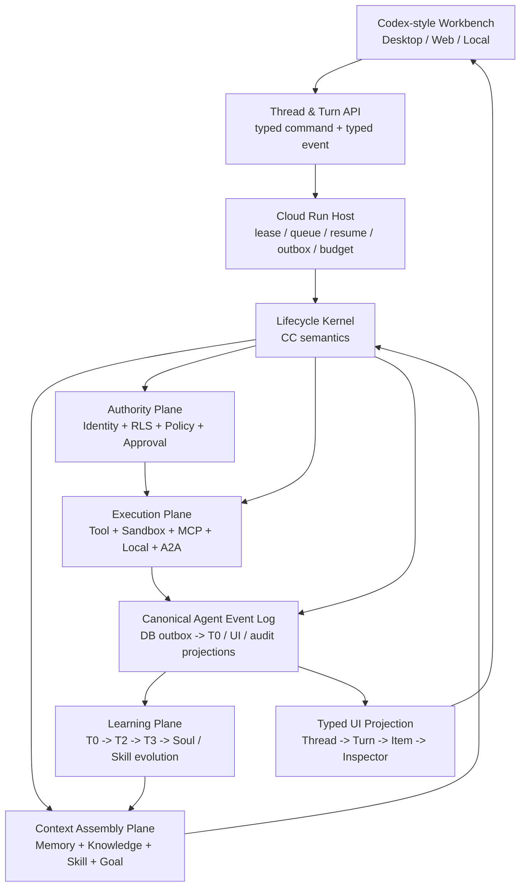
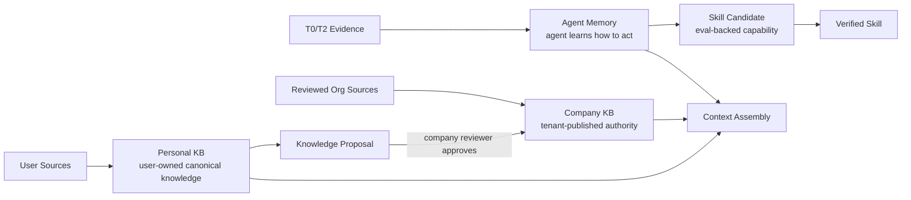
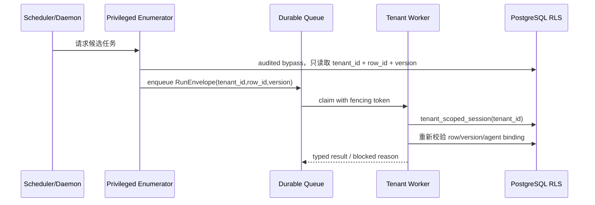
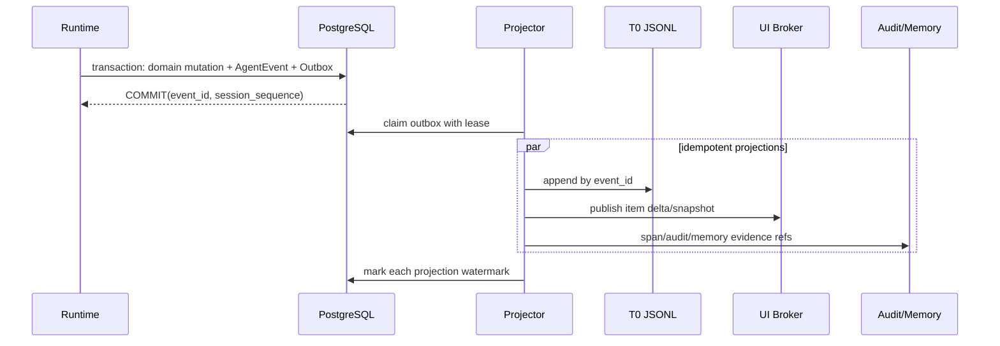

# Hive Agent-Native 终极原子化架构审计与闭环方案

> 日期：2026-07-10
> 当前状态：历史审计快照；Knowledge 与 Context 结论已由 2026-07-13/14 current-checkout 审计覆盖
> 性质：基于 2026-07-10 源码的独立审计报告；不作为当前实现状态或施工入口
> 审计对象：Hive、CC/FreeCode、Codex、Hive Connect
> 结论口径：CC 决定 Agent 语义基线；Codex 只提供不破坏 CC 语义的工程增量；Hive-native 负责记忆、知识、自进化、协作和企业控制面。

> **2026-07-14 覆盖说明：** 本文关于 `Personal KB hint`、Company KB interface seam、全局 `ContextAssemblyDecision` 统一语义选择的判断已经过时。当前默认 runtime 不预取 Personal/Company Knowledge；Knowledge 严格 Tool-first。旧 Q/K/V Router 已退役，Memory 当前采用“完整授权候选 + LLM semantic selector + selector 失败返回全部候选”，平台只做权限、容量、证据和执行治理。当前权威入口是 `docs/runtime-model-agency-constraint-audit-2026-07-13.md`、`docs/hive-native-external-attention-runtime-2026-07-06.md` 与 Knowledge canonical 文档组。

---

## 0. 先给结论

Hive 已经不是“缺少 Agent Runtime 的产品壳”。当前代码中，CC 风格的模型循环、工具循环、Hook、压缩、会话恢复、Plan、Todo、Goal、Sub-agent、Team、Workflow、Trigger、持久化 RuntimeTask、Memory Gate、Personal KB、Skill evolution、沙箱和审计均有真实消费路径。

但它还没有成为一套**没有断点的统一 Agent-native 系统**。最关键的问题不是功能数量，而是同一件事在不同层存在多个事实源、多个决策器、多个状态协议：

1. **权限断点**：RLS、Capability Gate、Session permission mode、Enterprise policy、Hook、Action Preflight、Approval 分别做判断，没有单一 `EffectiveAuthorityDecision`；新会话默认 `bypassPermissions` 又掩盖了一部分冲突。
2. **事件断点**：PostgreSQL transcript 与 T0 JSONL 由运行进程双写，缺少事务型 Outbox 和稳定事件序号；云端崩溃可能留下单边事实。
3. **历史上下文判断（已覆盖）**：2026-07-10 时曾把 Personal KB 旁路与全局仲裁器列为断点；当前 Personal KB prefetch/hint 已退役，Company KB 状态为 `Missing`，Knowledge 统一改走 governed search/read tools。Memory semantic selection 归 LLM，平台不建设跨内容面的机械语义仲裁器。
4. **本地 Agent 断点**：Hive Connect 已有配对、队列、适配器、approval 和 resume，但云端没有强制的能力协商、权限交集和执行证明；UI 也无法呈现本地实际 sandbox/network/workspace 权限。
5. **UI 协议断点**：后端已有丰富事件，前端仍主要消费字符串事件和大对象可选字段；没有 Codex 式 `Thread -> Turn -> typed Item` 的稳定协议，终端、Diff、Approval、MCP、Sub-agent、Compaction 还不是统一的一等时间线对象。
6. **模块边界断点**：`AgentKernel.handle`、`execute_web_chat_run`、`AgentDetail.tsx`、`AgentChatSection.tsx`、`timelineModel.ts`、全局 CSS 已形成巨型模块，继续加功能会放大回归半径。

因此，本文给出的“95% 置信度”指向的是：

- **目标架构正确性：95%**。其核心边界由 CC、Codex 和 Hive 当前真实实现共同约束，不依赖推测。
- **当前系统完成度不是 95%**。按本文闭环标准，当前估计为：单 Agent/CC 语义 89%，Codex 工程增量 76%，Hive-native 82%，企业治理 68%，Codex Desktop 式 UI/UX 61%。
- Codex Desktop 的协议、状态和交互结构有当前源码与官方资料证据；由于本轮本机桌面视觉控制通道启动失败，像素级间距、动画曲线和个别最新视觉细节不能伪装成已逐屏验证。本文对 UI 架构和状态语义置信度为 95%，对像素级完全一致的置信度为 80%。

最终建议不是重写 Hive，也不是再叠一层“统一服务”。正确做法是：**保留已经工作的纵向能力，以五个强类型公共契约收口所有边界，再拆解巨型消费模块。**

---

## 1. 审计基线与方法

### 1.1 当前源码基线

| 对象 | 本地路径 | 当前提交 | 用途 |
|---|---|---|---|
| Hive | `/Users/example-owner/vc-saas/hiveclaw-main` | `512200142c247922566afb6497dee67febc1c2f2` | 被审计系统 |
| CC / FreeCode | `/Users/example-owner/vc-saas/free-code-main` | `7dc15d6c8fb0c40c7fcc02ce9b58204324252632` | CC 可运行语义基线，优先级最高 |
| Codex | `/Users/example-owner/Context Engineering/codex` | `be33f80bc65159c094ecd06bf155afa3061ce23d` | 工程、协议、沙箱、线程与桌面交互增量 |
| Hive Connect | `/Users/example-owner/vc-saas/hive-connect` | `20718e629be1a1d506aa366a526bff245edd8277` | Local Agent / Bridge 基线 |

Hive 工作树中有用户自己的 Personal KB 文档改动，本报告未覆盖、未修改这些文件。

### 1.2 什么叫“原子化”

本文不把“有 API”“有表”“有页面”算作完成。每个能力按七个原子检查：

1. **输入**：谁发起，输入结构是什么，是否可恢复。
2. **权威**：谁有权读取、决定和写入，租户/用户/Agent/代理关系如何绑定。
3. **执行**：唯一执行入口是什么，是否可能绕过治理。
4. **证据**：事件、span、transcript、文件和数据库谁是机械事实源。
5. **恢复**：断线、重启、重试、取消、回滚、fork 是否幂等。
6. **消费**：Memory、Skill、Workflow、Knowledge、UI 是否真实使用产物。
7. **验收**：测试、迁移、回填、故障注入、可观测性是否覆盖。

状态定义：

- **闭环**：七个原子均有当前消费路径。
- **局部闭环**：主路径成立，但存在双事实源、旁路、恢复或 UI 断点。
- **断点**：能力存在，但生产路径在两个原子之间断开。
- **缺失**：当前源码无实现；若是明确暂不建设，会标成“已知缺失”，不伪装成回归。
- **排除**：CC/Codex 的服务商私有远程能力，不计入 Hive 的 CC parity 债务。

### 1.3 源码证据入口

CC 主要证据：

- `src/query.ts::queryLoop`：Prompt、stream、tool、compact、stop 的核心循环。
- `src/utils/hooks.ts`：UserPrompt、Session、Tool、Permission、Stop、Subagent、Task Hook。
- `src/utils/sessionStorage.ts`、`src/commands/resume.ts`、branch 路径：transcript、resume、fork。
- `src/tools/AgentTool/**`、Task/Team tools：sub-agent、resume、task/team 语义。

Codex 主要证据：

- `codex-rs/app-server-protocol/src/protocol/common.rs`：thread/turn/approval/FS/terminal 的 RPC 与通知。
- `codex-rs/app-server-protocol/src/protocol/v2/item.rs`：强类型 `ThreadItem`。
- `codex-rs/app-server-protocol/src/protocol/v2/thread.rs`：ThreadStatus、Goal、token usage。
- `codex-rs/core/src/exec_policy.rs`：命令解析与 declarative approval policy。
- `codex-rs/ext/goal/**`：Goal 的创建、状态、预算、续跑和 steering。

Hive 主要证据：

- `backend/app/runtime/invoker.py::invoke_agent`
- `backend/app/kernel/engine.py::AgentKernel.handle`
- `backend/app/services/web_chat_runtime.py::execute_web_chat_run`
- `backend/app/services/session_control_plane.py::build_session_workbench`
- `backend/app/services/chat_transcript.py::append_session_event`
- `backend/app/runtime/prompt_builder.py::build_dynamic_prompt_suffix`
- `backend/app/tools/service.py::ToolRuntimeService.execute`
- `backend/app/memory/**`、`backend/app/services/personal_knowledge_service.py`
- `backend/app/services/skill_distiller.py::run_skill_distillation_cycle`
- `frontend/src/pages/AgentDetail.tsx`、`AgentChatSection.tsx`、`timelineModel.ts`

Codex Desktop 产品面补充参照：[Introducing the Codex app](https://openai.com/index/introducing-the-codex-app/) 与 [Work with Codex from anywhere](https://openai.com/index/work-with-codex-from-anywhere/)。

---

## 2. 终极目标架构：一个运行内核，四个平面，五个公共契约



四个平面的职责必须互不替代：

1. **Lifecycle Plane**：只负责 CC 语义——Turn、model loop、tool loop、hook boundary、compact、stop、resume、fork、sub-agent。
2. **Authority Plane**：只负责“能不能做、在什么范围做”；不能通过删上下文、降低模型能力来代替治理。
3. **Learning/Knowledge Plane**：LLM 负责语义判断，平台负责 evidence、ACL、dedupe、rollback、commit；Memory、Personal KB、Company KB 不互相冒充。
4. **Projection Plane**：UI 只消费 typed event/read model，不从字符串、日志或 optional bag 猜测运行状态。

五个公共契约是全部闭环的最小收口点：

```python
class RunEnvelope:
    run_id: UUID
    run_kind: Literal["turn", "goal", "workflow", "delegation", "trigger", "heartbeat"]
    tenant_id: UUID
    agent_id: UUID
    session_id: UUID | None
    actor: ActorContext
    parent_run_id: UUID | None
    idempotency_key: str
    budget_ref: str | None
    workspace_revision: str | None

class EffectiveAuthorityDecision:
    decision_id: UUID
    outcome: Literal["allow", "deny", "ask", "degrade"]
    actor: ActorContext
    resource: ResourceRef
    action: str
    reason_code: str
    matched_policy_refs: list[str]
    effective_scope: dict
    approval_request_id: UUID | None
    expires_at: datetime | None
    repair_hint: str | None

class ContextAssemblyDecision:
    candidate_id: str
    source_kind: Literal["memory", "personal_kb", "company_kb", "skill", "goal", "runtime"]
    authority_ref: str
    sensitivity: str
    score: float
    token_cost: int
    outcome: Literal["selected", "suppressed", "redacted"]
    reason_code: str
    source_refs: list[str]

class AgentEvent:
    event_id: UUID
    session_sequence: int
    run_id: UUID
    turn_id: UUID | None
    item_id: UUID | None
    type: str                    # discriminated union, not free-form bag
    payload: dict
    occurred_at: datetime
    causation_id: UUID | None
    correlation_id: UUID

class ExecutionReceipt:
    execution_id: UUID
    authority_decision_id: UUID
    provider: Literal["cloud_sandbox", "local_adapter", "mcp", "internal"]
    capability_snapshot_hash: str
    input_hash: str
    output_ref: str | None
    side_effect_refs: list[str]
    exit_status: str
```

这五个契约不是新的“万能服务”。它们是各模块必须共同说的语言：一项能力可以有自己的实现，但不能再发明自己的身份、状态、事件或批准格式。

---

## 3. 单 Agent 全生命周期：CC 语义、Codex 增量、Hive 当前状态

### 3.1 原子对比矩阵

| 生命周期原子 | CC / FreeCode 基线 | Codex 工程增量 | Hive 当前真实状态 | 判定与终局要求 |
|---|---|---|---|---|
| Agent 定义 | instructions、tools、model、permission context | thread config、model/provider、sandbox/approval policy | Agent、soul、tools、model、tenant、owner 已持久化 | **闭环**；定义需输出 immutable config snapshot hash |
| 身份装配 | project/user instructions | developer/user/environment context 分层 | principal、charter、soul、user、tenant 已装配 | **局部闭环**；统一进入 ContextAssemblyDecision |
| 用户 Prompt 接收 | UserPromptSubmit hook 可阻断 | `turn/start` typed input | API/WS/Channel 均可入站，USER_PROMPT_SUBMIT 可阻断 | **闭环**；所有入口必须生成相同 RunEnvelope |
| Session 创建 | transcript/session id | `thread/start` | ChatSession + RuntimeTask | **闭环** |
| Turn admission | query loop 前置准备 | thread 序列化、approval/sandbox profile | runtime tenant admission、active run uniqueness | **局部闭环**；admission 与权限决策仍分散 |
| Prompt 组装 | system/project/skill/context | typed contextual fragments | dynamic suffix + LLM-selected Agent Memory + permission/runtime/capability sections；Knowledge Tool-first | **当前重基线**：无 Personal KB hint；context manifest 与 provider capacity gate 负责机械证据，语义选择不归全局机械 Router |
| 模型调用 | 单一 query/model loop | provider abstraction、reasoning/event deltas | 所有调用经 `invoke_agent -> AgentKernel.handle` | **闭环**；保持 vendor-neutral |
| Streaming | assistant/tool stream | typed delta notifications | WebSocket broker + durable run | **闭环**；事件类型需强类型化 |
| Mid-turn steering | CC 可继续写入/反馈当前 loop | `turn/steer` 明确 RPC | Hive 有 slash steer/active-turn command 路径 | **局部闭环**；统一为 `turn.input.injected` item |
| Interrupt | abort/stop | `turn/interrupt` | active run cancel/interrupt | **闭环**；区分 requested、acknowledged、terminal |
| Tool discovery | built-ins、MCP、skills | skills/config、plugin、MCP | `tool_search`、registry、MCP、external capabilities | **闭环**；展示来源、信任和 activation 状态 |
| Skill load | progressive disclosure | skill listing/config | `load_skill` 只加载 capsule，执行仍走治理 runtime | **闭环** |
| Tool call | loop 生成 tool use | typed item + approval request | ToolRuntimeService 唯一入口 | **主路径闭环**；治理结果需要单一 decision |
| 并行工具 | parallel-safe tools | command/MCP 独立 item | Kernel 支持 parallel-safe execution | **闭环** |
| Tool result | tool result 进入 transcript | item completed + output delta | transcript/tool event 均持久化 | **局部闭环**；DB/T0 双写非原子 |
| Hook | Session/User/Tool/Permission/Stop/Subagent/Task hooks | typed hook started/completed | Hive 有 session/turn/tool/hook 事件及阻断 | **局部闭环**；Hook 不能形成第二套审批系统 |
| Permission request | PermissionRequestHook | command/file/tool/permissions server request | session approval + enterprise approval + preflight | **断点 GOV-01**；必须合并 outcome |
| Plan Mode | 计划、ask、exit 边界 | Plan item/turn mode | first-class plan、clarification、confirm gate | **闭环**；Plan 不等于 Workflow/Goal |
| Todo / Task ledger | TaskCreate/TaskUpdate/Todo | plan/update_plan UI | Work Ledger/Progress Ledger | **闭环**；写 Todo 不启动执行 |
| Goal | CC 不把普通任务自动升级为持久 Goal | thread goal、预算、续跑、steering | durable goal、续跑 RuntimeTask、token/turn cap、blocked audit | **闭环度高**；Hive 比 CC 基线新增，需统一 RunEnvelope |
| Auto continuation | 普通 loop 由用户/agent 边界控制 | active goal idle continuation | `goal_continuation` 走普通 web runtime，不绕治理 | **闭环**；当前 time budget 字段未形成完整 enforcement 证据 |
| Context compact | pre/reactive compact、microcompact | compaction item、rollout continuity | 60% micro/75% proactive/reactive fallback | **闭环**；UI 应显示 compact item 和前后 token |
| Transcript | session transcript 是 resume/fork 基础 | rollout JSONL + typed history | ChatMessage/ChatTranscriptEvent + T0 JSONL | **断点 EVT-01**；缺事务事件事实源 |
| Resume | resume transcript | `thread/resume` | RuntimeTask restart resume、session resume | **闭环** |
| Fork / Branch | branch transcript | `thread/fork` | session branch + checkpoint | **闭环** |
| Rewind | transcript/workspace 回退依实现边界 | rollback/turn boundary | conversation/workspace/both rewind，前端已有确认 UI | **闭环**；旧报告中“无 UI”已过期 |
| Workspace snapshot | CC 本地工作区 | Codex worktree/rollback/diff | Hive 有 workspace revision/rewind，但非全量 Git worktree | **局部闭环**；coding agent 才启用 worktree provider |
| Sub-agent | AgentTool、resumeAgent、隔离 context | collab agent item/state | `spawn_subagent`、delegate、fanout、shared tool governance | **闭环度高** |
| Team | TeamCreate/Task 协作 | sub-agent activity | agent team、lease/signal/checkpoint | **闭环度高** |
| Workflow | 非 CC 核心语义 | 非普通 turn；Codex 侧以 thread/turn 为主 | deterministic workflow、journal、gate/wait/resume、trigger pin | **Hive-native 闭环**；不得冒充 Plan/Goal |
| Trigger / Schedule | CLI 本地调度不等于 Agent goal | automations/remote workbench | trigger daemon、cron/once/poll/webhook、workflow caller | **闭环**；trigger 是 wake policy，不是 goal |
| Heartbeat | 非 CC 必需 | 后台维护不是普通 turn | 平台 memory maintenance，不跑完整工具 loop | **闭环**；命名和 UI 必须避免“自主任务”误解 |
| Error/retry | provider/tool error、loop guard | typed failed/interrupted/reroute/warning | provider fallback、terminal reason、retry、visible failure | **局部闭环**；统一 error taxonomy 和 event |
| Token/tool budget | max turns、context pressure | token usage notification/goal budget | tool round、turn token、runtime budget、goal budget | **局部闭环**；预算所有权分散，需要 BudgetRef |
| Session close | SessionEnd/Stop | thread archive/delete/status | session close、archive、runtime terminal | **闭环** |
| 云端断线 | CC 本地进程语义无此要求 | remote/long-running steer | 浏览器断线不取消，后台 RuntimeTask 继续 | **闭环，是 Hive 的必要增量** |
| 云端多实例 | CC 不负责 | app-server serialization 思路 | DB active-run guard、Redis broker/lease、reconciliation | **局部闭环**；事件 outbox 与严格 lease fencing 仍需收口 |

### 3.2 单 Agent 的准确结论

**Hive 的 Agent 生命周期总体 follow CC，且已经融合了一部分 Codex 工程优势。** 不应该再把问题描述为“重做一个 CC loop”。真正未完成的是：

- CC 语义目前被分散在 `invoke_agent`、`AgentKernel.handle`、`execute_web_chat_run`、session command、goal continuation、workflow worker 中，缺少一个稳定的 `RunEnvelope + AgentEvent` 外壳。
- Codex 最强的工程优势不是“Rust”或“桌面 UI”，而是**协议先行**：Thread、Turn、Item、Approval、Diff、Terminal、Compaction 都有稳定类型。Hive 目前的后端能力多于前端协议能表达的能力。
- 云端优化已经有 durable RuntimeTask 和断线继续，但还缺数据库事件 outbox、fencing token、幂等 projection、跨实例稳定 sequence；这正是本地 CLI 不需要、云端必须补的层。

### 3.3 Goal、Plan、Workflow、Trigger、Heartbeat 的无冲突定义

| 机制 | 唯一职责 | 谁决定 | 是否执行工具 | 是否跨 Turn | 是否可定时唤醒 |
|---|---|---|---|---|---|
| Plan | 在执行前形成可确认的方案 | Agent，用户确认 | 未确认时否 | 可，但主要是当前会话边界 | 否 |
| Work Ledger | 认知记账与进度恢复 | Agent | 不因写 ledger 自动执行 | 是 | 否 |
| Goal | 维持一个用户明确要求的持续目标 | 用户显式开启；Agent 只报告状态 | 通过正常 Turn | 是 | 自身只续跑，不定义日历 |
| Workflow | 确定性控制流、gate、wait、resume | 已审核定义 + runtime | 是 | 是 | 由 Trigger 调用 |
| Trigger | 何时唤醒谁 | 用户/治理后的 Agent | 自身不承载目标 | 是 | 是 |
| Heartbeat | 平台记忆维护与低风险反思 | 平台策略 | 不进入完整 Agent tool loop | 是 | 平台周期 |

终局中它们都生成 `RunEnvelope`，但 `run_kind` 不同；预算、权限、事件、恢复统一，认知语义不合并。这样既不冲突，也不会把所有事情塞进 Workflow。

---

## 4. Hive-native 全面审计：Memory、Knowledge、Evolution、Local、A2A 与扩展

### 4.1 原子对比矩阵

| Hive-native 原子 | 当前实现 | 当前消费路径 | 判定 | 终局闭环 |
|---|---|---|---|---|
| T0 机械事实 | per-segment `events.jsonl` + Markdown projection | replay/resume/evidence | **局部闭环** | 由 canonical DB event outbox 投影，JSONL 保持可导出/可重建 |
| T2 Segment Package | source_refs、候选与包结构 | Memory Gate/T3 intake | **闭环** | 保持 LLM author + platform validate |
| T3 profile plane | user/worker/capabilities 等 | prompt activation、dream | **闭环** | 与 knowledge plane 继续分离 |
| T3 knowledge plane | episodes/knowledge pages | retrieval、relation graph | **闭环** | graph/vector/index 仅 derived view |
| soul.md | identity/charter/evolution candidate | agent prompt | **闭环** | 只能通过 governed candidate promotion |
| Memory Gate | 语义 review | T2/T3 promotion | **闭环** | LLM 判断，不用 regex/counter 代替 |
| Platform Gate | refs、ACL、dedupe、atomic write、rollback | durable commit | **闭环** | 继续做唯一落盘权威 |
| Dynamic activation | factor scoring + ACL/sensitivity | prompt memory selection | **闭环度较高** | 高歧义/高风险时增加 LLM rerank，不机械裁剪完整性 |
| Session working set | pinned attention/open loops | Goal/context | **闭环** | 纳入统一 ContextAssemblyDecision |
| Memory feedback | useful/misleading feedback | governed write lane | **闭环** | UI 显示反馈影响范围与状态 |
| Dream | LLM consolidation/review/soul candidates | Memory pipeline | **闭环** | 不直接写 T3 的约束必须保留 |
| Heartbeat learning | reflection 进入学习 lane | T2/T3 candidate | **闭环** | 与主动任务 UI 分离 |
| Skill capsule | instructions/references/scripts/evals/workflows/subagents | `load_skill` + governed runtime | **闭环** | Skill 是能力包，不是知识页 |
| Skill evolution | LLM draft/referee、artifact gate、eval、provisional/verified、rollback | registry/install/promotion/audit | **闭环度高** | UI 建立 candidate -> eval -> promotion -> rollback evidence chain |
| Workflow evolution candidate | Memory 可记录重复模式 | distillation/definition path | **局部闭环** | 只能产生 proposal，不能从 Memory 直接执行 Workflow |
| Personal KB ingest | file/url/media/markdown、async job、retry、FTS/vector/entity/graph | API/upload/UI | **闭环度高** | 统一 job event 与 source preview contract |
| Personal KB ACL/grant | owner + agent grant | search provider | **闭环** | grant 需与 RLS 消费同一个 authority decision |
| Personal KB search | `search_personal_kb` tool + context candidate | runtime/tool | **闭环** | 解释命中、source、ACL、是否入 prompt |
| Agent 写 Personal KB | 当前无 propose/save tool | 无 | **缺失 KB-01** | Agent 只提交 `PersonalKnowledgeProposal`，用户 approve 后发布 |
| Personal KB 契约测试 | 路由集合测试 | CI | **断点 TEST-01** | 新增 `source-preview` 后白名单测试需同步 |
| Company KB | 只有 scope/provider interface seam | runtime 硬编码 personal | **已知缺失 KB-02** | 独立 CompanyKnowledgeService + review/publish/retire |
| Personal -> Company | 无 proposal/promotion | 无 | **缺失 KB-03** | 只允许 proposal，不允许直接复制成为企业事实 |
| Knowledge authority | Personal owner 与 Company tenant authority 尚未统一建模 | 局部 ACL | **断点 CTX/GOV** | `KnowledgeAuthority` 明确 owner、publisher、reviewer、validity |
| Internal A2A | send/delegate、RuntimeTask、artifact ref、policy、no nested delegation | agent collaboration | **闭环度高** | 与 public protocol 分开，消费统一 RunEnvelope/AuthorityDecision |
| Lease/Signal/Checkpoint | 去重、进度、确认边界 | teams/workflow/proactive loop | **闭环度高** | 投影成 typed timeline items |
| Public A2A | Agent Card 诚实标注 partial/not_exposed | discovery only | **已知缺失 A2A-01** | JSON-RPC task/stream/push/OAuth delegation 独立适配层 |
| Hive Connect pairing | device code、hashed token、user/tenant/agent binding、revoke | local bridge | **闭环** | 加 token rotation/expiry 与细粒度 scope consent |
| Local agent queue | durable queue + WS/poll + ChatSession event | local channel | **局部闭环** | 使用单调 session sequence/cursor，而不是 UUID 排除式刷新 |
| Local capability | runtime_kind/capabilities_json 上报 | 主要用于展示 | **断点 LOC-01** | signed capability snapshot + policy intersection + receipt |
| Local permission | adapter 有 permission/approval | 云端 UI 传 null/展示泛化 badge | **断点 LOC-02** | UI 显示实际 adapter mode、sandbox、network、workspace roots |
| MCP auth | 拒绝 URL userinfo/token passthrough，server-side OAuth credential | MCP runtime | **闭环度高** | MCP elicitation/approval 显示为 typed item |
| External skills/plugins | quarantine、trust gate、materialize、activate、deactivate | extension runtime | **闭环度较高** | installed/reviewed/activated/runtime-projected 分状态 |
| Session MCP try | 返回 runtime projection pending | 尚未完整注入当前 session | **断点 EXT-01** | activation commit 与 session projection 形成原子 receipt |
| Hook activation | pending_hook_approval | approval 后才执行 | **正确安全边界，消费未闭环** | UI 明确 pending，不显示成 installed success |
| Office/artifact | workspace source of truth + browser editing + signed callback | workbench/tool | **闭环度高** | artifact/diff/source ref 进入统一 item inspector |
| Relations/vector/index | derived and rebuildable | retrieval/UI | **闭环** | 禁止升级为 canonical truth |

### 4.2 三层知识与能力所有权



不可打破的边界：

- Agent Memory 记录 Agent 的经验、偏好、失败和能力证据，不是用户知识库。
- Personal KB 由用户拥有；Agent 可搜索，未来可提交候选，但不能直接污染用户事实。
- Company KB 是企业发布权威；Personal 内容只有经过 proposal/review 才能升格。
- Skill 是可执行能力胶囊，必须有 eval 和 rollback；不能把 T3 page 改名叫 Skill。
- Workflow 是执行控制定义；Memory 只能给它 evidence/proposal，不能直接触发未审核执行。

### 4.3 Hive-native 的主要结论

Memory 与 Skill evolution 是 Hive 当前最成熟的差异化资产，已经超过“概念设计”阶段。需要修复的不是再做一个 memory provider，而是让它们与 Context、Authority、Event 和 UI 共享同一证据链。Personal KB 已可用，但 Agent 写入和 Personal-to-Company promotion 必须采用 proposal，而不是开放 direct write。Company KB 是明确的未来缺口；当前不应拿 Personal scope 假装 Company scope 已存在。

---

## 5. 企业治理与 RLS：为什么会互相冲突，如何彻底收口

### 5.1 当前决策链不是一个决策器

当前 `ToolRuntimeService.execute` 大体按以下顺序运行：

```text
runtime context
  -> pre-tool hook
  -> input validation
  -> L2 capability-group policy
  -> session/enterprise governance
  -> action preflight
  -> tool execution + timeout
  -> post-tool hook
```

每一层单独看都有合理性，问题是输出协议不同：有的返回字符串阻断，有的返回 approval request，有的返回 `DO/PREPARE_ONLY/ASK/REFUSE/ESCALATE`，有的依赖 RLS 查询直接“查不到”。最终 Agent 无法区分：

- 资源真的不存在；
- RLS 隐藏了资源；
- Session mode 要求询问；
- Enterprise policy 禁止；
- Capability 未安装；
- Hook 阻断；
- 需要 checkpoint；
- 只是当前用户没有授权，但 owner 可以授权。

这就是“规则都正确，Agent 却无法运行”的根因。

### 5.2 治理原子矩阵

| 治理原子 | 当前状态 | 真实风险 | 终局规则 |
|---|---|---|---|
| Actor 身份 | user/owner/creator/agent/tenant 部分路径均有 | 不同 service 自己拼 actor | 只接受服务端签发的 `ActorContext` |
| Tenant admission | background runtime 已先解析 agent tenant，缺失即 block | 已修复主路径，但非所有工作单元共享 envelope | RunEnvelope 创建前必须通过 admission |
| PostgreSQL RLS | tenant context、after_begin 重绑、forced RLS migration | 查询空结果仍可能被误判为业务不存在 | repository 层把 `not_found` 与 `not_authorized` 分离 |
| RLS fail-closed | 空 tenant pin 为 `''` | 可导致后台 Agent “消失” | admission 错误必须成为可见 blocked event |
| RLS bypass | audited、reason required | 当前源码有 90 个调用点，审查面过大 | 仅 privileged enumerator 可 bypass；业务读写回租户 session |
| Session permission | default/auto/bypassPermissions | **当前默认是 bypassPermissions** | 新会话默认 `default/ask` 或 tenant default；bypass 仅 break-glass |
| Enterprise capability policy | 独立于 session mode | 与 session 决策串行，可能重复批准 | 作为 Authority Kernel 的 policy input |
| Capability map | tool -> capability，有 mapping audit | 新 tool 漏映射时行为取决于旁路 | unmapped 在 production fail-closed，并给 repair hint |
| Capability group | L2 extension group gate | 与 tool capability/activation 状态重复 | capability snapshot 中一次解析 |
| Tool config/assignment | agent tool assignment | “已分配”不等于“允许执行” | 作为可发现性，不作为授权结论 |
| Hook | 可阻断/观察 | Hook 可能形成隐形第二审批层 | Hook 输出 typed advice/block reason，最终由 kernel 合并 |
| Action Preflight | DO/PREPARE_ONLY/ASK/REFUSE/ESCALATE | 与 session/enterprise ASK 可能重复 | 合并为单一 outcome；保留 preflight evidence |
| Approval | session、enterprise、post-approval execute | approval 后路径跳过部分 governance | receipt 必须绑定原 decision + input hash；变更参数需重判 |
| Checkpoint | confirm-first side effect | 与 approval UI 可分裂 | approval 是授权，checkpoint 是可恢复边界；同卡展示 |
| Plan Mode | 未确认阻断实质执行 | 与 permission mode PLAN 容易同名混淆 | `planning_state` 与 `authority_mode` 分字段 |
| Budget | runtime/goal/workflow/tool 多套预算 | retry/resume 可能重复记账或跨 owner | RunEnvelope 只绑定一个 root BudgetRef，子运行归集 |
| Sandbox | profile/roots/network 已落地 | 未给 profile 的 legacy local full access 仍过宽 | 无隐式 full access；workspace-write 为本地安全默认 |
| Command policy | 有危险命令/沙箱规则 | 粒度弱于 Codex parsed command policy | 引入 command AST/prefix policy/amendment，仍走 preflight |
| Network egress | sandbox profile 与外部工具各自控制 | “tool 允许”不等于“目标域允许” | authority scope 包含 host/method/data class |
| Secrets | encrypted provider/MCP authz | local adapter 可能继承宿主权限 | secret handle 不下发原文；provider 侧 resolve |
| MCP auth | 禁 token passthrough/URL userinfo | session activation 尚有 projection pending | activation receipt 后才进入 tool catalog |
| Local agent | cloud token + adapter permission | cloud 无法证明本地实际执行边界 | capability attestation + local execution receipt |
| Internal A2A | collaboration policy + no nested delegation | 代理人/被代理人权限可能被错误并集 | 取权限交集，不允许 delegated privilege escalation |
| Audit/span | invocation spans、audit logs、decision traces | 多种 decision id 无 join key | AuthorityDecision ID 贯穿 span/event/receipt |
| Retention/export/delete | 多域各自有生命周期 | Memory、KB、transcript 删除可能不一致 | data lineage + tombstone + projection rebuild contract |
| Company knowledge publish | 未实现 | 企业事实没有 reviewer/publisher 权威 | Company publisher role + four-eyes review + validity |

PostgreSQL 的 RLS 本身不应承担产品授权语义：启用 RLS 而无 policy 时是 default-deny，table owner 和 `BYPASSRLS` 又有特殊行为。它适合做最后一道数据隔离，不能告诉 Agent “为什么不能做”。参见 [PostgreSQL Row Security Policies](https://www.postgresql.org/docs/17/ddl-rowsecurity.html)。

### 5.3 单一 Authority Kernel 的决策优先级

同一个 action 只允许产生一个最终 outcome，优先级固定：

```text
1. 数据完整性前置条件（tenant/agent/session/resource binding）
2. 绝对安全禁止（secret exfiltration、unsupported auth、forbidden command）
3. RLS 可见范围与资源所有权
4. Enterprise hard policy / legal hold / segregation of duties
5. Owner delegation / agent assignment / capability activation
6. Session permission mode
7. Action risk preflight / checkpoint requirement
8. Hook advice
9. Tool input validation与执行环境约束
```

合并规则：

- 任意上层 `deny` 不能被下层 `allow` 覆盖。
- 多个 `ask` 合并为一张 approval card，不连续弹窗。
- 无法执行但可降级为草稿/preview 时返回 `degrade`，而不是模糊失败。
- RLS 查询不能直接返回“资源不存在”；先用 trusted locator 确认资源 tenant，再在 tenant scope 取数。
- approval 绑定 `actor + resource + action + normalized_input_hash + capability_snapshot_hash + expiry`。
- 参数、目标资源或 capability snapshot 变化，旧 approval 自动失效。

### 5.4 RLS 与后台 Agent 的双阶段模型



强制规则：

- bypass transaction 内禁止业务 mutation、模型调用、工具执行和外部 side effect。
- enumerator 只返回定位字段，不装载业务 payload。
- worker 用 tenant-scoped session 重读并校验版本，避免 TOCTOU。
- 每次 claim 都有 fencing token；旧 worker 即使恢复也不能覆盖新 owner。
- 缺 tenant、mismatch、RLS empty、policy deny 都写成不同 AgentEvent，UI 不再统一显示“失败”。

### 5.5 默认权限模式必须修正

当前源码：

- `backend/app/runtime/ccplus_contracts.py` 将 `DEFAULT_CCPLUS_PERMISSION_MODE` 设为 `BYPASS_PERMISSIONS`。
- `backend/app/api/chat_sessions.py` 的多个 request/response 默认继承它。
- `frontend/src/pages/AgentDetail.tsx` 同样默认 `bypassPermissions`，UI 称为“完全访问”。

这里的 bypass 仍受企业 hard rules 约束，并非完全绕过安全；但它默认跳过会话内批准，造成两个问题：一是企业产品默认姿态过宽，二是很多治理冲突被“先放行”掩盖，直到 RLS 或 preflight 后面才失败。

终局策略：

- 新 tenant 默认：`default`，由 tenant policy 决定低风险 auto、高风险 ask。
- 新个人 workspace 可选择 `auto`，但不能隐式进入 bypass。
- `bypassPermissions` 改名为 `breakGlass`，必须有理由、TTL、actor、scope、audit，过期自动回落。
- 迁移时不静默改变历史 session；保留原 metadata，只有新 session 使用新默认。
- 管理员可配置 tenant default，但不能把 absolute deny 改成 allow。

### 5.6 冲突矩阵与唯一解法

| 冲突 | 当前可能症状 | 不能采用的处理 | 正确闭环 |
|---|---|---|---|
| RLS deny × Session allow | UI 显示已允许，工具却查不到资源 | 让 Agent 重试 | AuthorityDecision 先绑定 tenant/resource，RLS 只执行范围 |
| Enterprise ask × Session ask | 连续两次 approval | 两层各弹一张卡 | 合并 policy refs，一次批准 |
| Hook block × Approval allow | 批准后仍被 Hook 阻断 | approval 路径跳过所有 Hook | Hook 原因进入同一 decision；参数不变时执行 receipt 可重放 |
| Capability disabled × Tool visible | Agent 反复调用不可用工具 | 在 prompt 中隐藏所有禁用原因 | tool catalog 标 unavailable + repair hint；必要时根本不暴露 |
| Budget exhausted × Provider retry | 重试继续烧预算或错误 blocked | 无限 fallback | root BudgetRef 原子记账；retry reservation/settlement |
| Goal continuation × pending input | Agent 自动继续越过用户问题 | 只靠 prompt 提醒 | pending input 是 hard continuation gate |
| Workflow wait × trigger refire | 重复运行 | 仅 120 秒内存 dedupe | workflow definition hash + trigger occurrence idempotency key |
| Memory sensitivity × Context relevance | 高相关敏感内容被选中 | 先评分再靠模型不泄露 | hard ACL/sensitivity mask 后再相关性排序 |
| Personal grant × RLS | grant 表允许但 RLS tenant 不一致 | bypass 读取 | grant 与 tenant scope 同一个 authority binding |
| Local adapter allow × Cloud deny | 本地执行越权 | 信任 adapter 自报 | 取 cloud/local policy 交集，签名 receipt 回传 |
| Delegator allow × Delegatee deny | 被代理 Agent 借权 | 权限并集 | delegated authority 取交集 + explicit scoped grant |
| Rewind × external side effect | transcript 回退但邮件已发送 | 假装全局可逆 | rewind 只回本地状态；外部 side effect 用 compensation/status marker |

---

## 6. UI/UX：对齐 Codex Desktop 的不是皮肤，而是运行语义

### 6.1 Codex 真正值得对齐的四层模型

Codex 当前 app-server 协议不是一个“大聊天消息”数组，而是：

```text
Thread
  -> Turn
      -> ThreadItem (discriminated union)
          -> command / file change / MCP / subagent / plan / reasoning /
             approval / user input / web search / image / compaction / review
```

Thread 还拥有独立状态：`idle`、`systemError`、`active(waitingOnApproval/waitingOnUserInput)`；Turn 有 `inProgress/completed/interrupted/failed`；每个 Item 再有自己的 status、增量、结果和证据。这使桌面端可以准确呈现“Agent 在做什么、在等什么、哪里失败、能否恢复”。

Hive 当前已有大量等价数据，但 `timelineModel.ts` 的顶层 cell 主要仍是 `user_turn / assistant_final / active_run / boundary`，`AgentChatMessage` 通过大量 optional 字段承载工具、权限、工作流、子 Agent、memory、artifact 等状态。结果是：后端每新增一种能力，前端必须猜字段组合并继续扩张巨型组件。

### 6.2 目标信息架构

```text
┌──────────────────────────────────────────────────────────────────────────┐
│ Global bar: workspace / agent / model / connection / account            │
├───────────────┬────────────────────────────────────┬─────────────────────┤
│ Navigation    │ Thread / Turn Timeline             │ Context Inspector   │
│               │                                    │                     │
│ Agents        │ User item                          │ selected item       │
│ Threads       │ Plan / Reasoning                   │ - input/output      │
│ Automations   │ Tool / Terminal / Diff             │ - diff/source refs  │
│ Knowledge     │ Approval / User input              │ - authority trace   │
│ Skills        │ Sub-agent / Workflow               │ - audit/span        │
│ Governance    │ Compaction / Final                 │ - retry/rollback    │
│ Runtime Ops   │                                    │                     │
├───────────────┴────────────────────────────────────┴─────────────────────┤
│ Composer: mode / model / permission / local runtime / attach / send      │
└──────────────────────────────────────────────────────────────────────────┘
```

主界面遵循三条规则：

1. 中间只讲当前工作的因果时间线，不堆管理表单。
2. 右侧 Inspector 根据选中 Item 切换 Diff、Terminal、Approval、Context、Evidence、Policy，不再用固定“会话摘要”替代事件详情。
3. Team、Workflow、Goal、Background run 在 Timeline 有摘要卡，在 Runtime Console 展开；用户不需要离开当前 Thread 才知道后台发生了什么。

### 6.3 UI 原子对比矩阵

| UI/UX 原子 | Codex 协议/桌面语义 | Hive 当前 | 终局要求 |
|---|---|---|---|
| Project/Workspace | workspace/worktree/thread 分层 | Agent workspace + session | coding agent 显示 revision/worktree；普通 Agent 显示 workspace revision |
| Thread list | 多任务并行、状态/未读 | session list | 显示 idle/running/waiting/error/background 和 last meaningful item |
| Thread header | model/cwd/branch/status | status/model/provider/permission chips 已有 | 收敛为一行 primary metadata，详细项进 Inspector |
| Turn boundary | turn/start/completed | 消息边界 + runtime phase | 固定 Turn 容器，支持折叠、复制、fork、rewind |
| User item | typed content/attachments | message | 保留 source channel、actor、attachments、steer 标记 |
| Plan item | 一等 Plan | 有 Plan 面板/事件 | 直接进入 timeline，确认动作固定位置 |
| Reasoning | delta + summary | thinking disclosure | 流式可折叠；结束后默认摘要，不泄露不可展示内容 |
| Tool call | item started/completed | tool cards | 统一 ToolItem，显示来源、输入摘要、状态、duration |
| Terminal | cwd/process/output/exit/duration | 缺少统一一等 item | 可暂停滚动、copy、search、exit、background terminal |
| File change | patch/status/diff | artifact/部分 diff | DiffItem 支持 staged/accepted/rejected/rollback |
| MCP | progress/result/error | tool card | MCP server/tool/elicitation/progress 独立展示 |
| Approval | server request + review | permission cards | 一张卡合并所有 policy refs；scope/TTL/why/impact 清晰 |
| User input | waiting flag + request | plan clarification/permission 分散 | `UserInputRequestItem` 统一 question/form/choice |
| Hook | started/completed | 有事件但非主要 item | 默认低噪声折叠；block/error 时自动展开 |
| Compaction | ContextCompaction item | 有 phase/统计 | timeline 插入 compact item，展示 before/after/continuity ref |
| Sub-agent | collab item/activity | child/team side models | parent timeline 显示 spawn/progress/handoff/result，可跳 child thread |
| Workflow | 非 Codex 核心；Hive-native | 有 runtime/journal/UI | step/gate/wait/resume 是 typed item，不伪装成普通 tool |
| Goal | thread goal/status/budget | goal UI/read model | 目标、预算、续跑次数、blocked audit 固定显示 |
| Background run | parallel task surface | RuntimeTask/active run | Runtime Console 统一 Goal/Workflow/Trigger/Heartbeat/Delegation |
| Knowledge context | Codex context/environment fragments | memory/knowledge 状态零散 | Inspector 显示 selected/suppressed/redacted 与 source refs |
| Governance context | approval/sandbox policy | permission/governance chip | Inspector 显示 EffectiveAuthorityDecision，不显示内部敏感 policy 内容 |
| Local runtime | remote/local/SSH surface | LocalAgentChatSection | 实际 adapter、online、permission、sandbox、network、roots、receipt |
| Notifications | typed warning/reroute/error | toast + timeline 混合 | transient toast 只提示；所有可追责状态持久进 timeline |
| Reconnect | thread read + events | broker reconnect/read model | cursor replay，无重复、无丢失、稳定 item identity |
| Empty state | task-first | 多管理模块空态 | 给可执行起点：连接/授权/发起任务/导入知识 |
| Error state | failed item + retry | generic failure 较多 | 原因、影响、可修复动作、trace id、retry scope |
| Keyboard | desktop task switching | 尚未形成统一 command layer | Cmd/Ctrl+K、thread switch、approve/deny、inspector、composer shortcuts |
| Accessibility | 状态变化可感知 | CSS 有 reduced-motion，但关键 workbench 缺 aria-live/aria-busy | live region、focus trap/return、status text、非颜色编码 |

### 6.4 统一 Typed Item 协议

建议后端定义 OpenAPI/JSON Schema，再生成 TypeScript 类型；禁止前端手写第二份字符串 union。

```typescript
type AgentTimelineItem =
  | UserMessageItem
  | AgentMessageItem
  | PlanItem
  | ReasoningItem
  | ToolCallItem
  | CommandExecutionItem
  | FileChangeItem
  | McpCallItem
  | ApprovalRequestItem
  | UserInputRequestItem
  | HookItem
  | ContextAssemblyItem
  | CompactionItem
  | SubAgentItem
  | WorkflowItem
  | GoalItem
  | RuntimeWarningItem
  | TurnBoundaryItem;

interface BaseItem {
  id: string;
  type: AgentTimelineItem['type'];
  runId: string;
  turnId: string | null;
  status: 'queued' | 'running' | 'waiting' | 'succeeded' | 'failed' | 'cancelled';
  startedAt: string | null;
  completedAt: string | null;
  evidenceRefs: string[];
}
```

前端只做三件事：按 `type` 选择 renderer，按 `status` 选择状态样式，按 `id` 合并增量。它不再根据 `message.type + metadata.action + payload.status` 猜事件是什么。

### 6.5 状态、动效与细节规范

| 状态 | 主界面呈现 | 动效 | 持久化规则 |
|---|---|---|---|
| queued | 灰色队列位置 + 等待原因 | 无循环 spinner | 持久 |
| starting | 创建 workspace/model/session | 120ms 淡入 | 成功后折叠为 metadata |
| thinking | reasoning row | 低频、无布局跳动 | 摘要持久，流式 delta 可丢弃 |
| tool_running | 当前 tool item + duration | 只在图标局部 pulse | item 持久 |
| waiting_approval | 固定 approval card、标题栏 badge | 不使用 spinner | 持久，直到 decision |
| waiting_user_input | question card + composer focus | 不使用 spinner | 持久 |
| compacting | compact item | 一次进度过渡 | 持久 result |
| responding | final response stream | 50–100ms micro-batch | 内容持久 |
| background | header/console badge | 无持续抢眼动画 | 持久摘要 |
| done | 完成时间/usage | 120ms settle | 持久 |
| failed | 就地错误 + retry/repair | 轻微 highlight 一次 | 持久 |
| cancelled | 中性终止态 | 无 | 持久 |

动效原则：

- motion token 只有 `fast 120ms`、`normal 180ms`、`panel 220ms` 三档。
- streaming 按帧批处理，不能每 token 触发整棵 timeline render。
- row 高度尽量稳定；展开详情由 Inspector 承担，避免时间线抖动。
- 等待用户/批准是“停驻态”，不能继续转圈暗示系统仍在工作。
- `prefers-reduced-motion` 下移除 pulse/slide，只保留 opacity 状态变化。
- 每个重要状态同时有图标、文字、颜色；不能只用颜色。

### 6.6 前端模块化边界

当前规模信号：`AgentDetail.tsx` 约 3.1K 行、`AgentChatSection.tsx` 约 4.8K 行、`timelineModel.ts` 约 1.8K 行、`index.css` 约 6K 行。终局拆分不是按“更多小组件”机械切文件，而是按协议责任切：

```text
frontend/src/features/agent-workbench/
  shell/                 # layout, navigation, responsive panes
  thread/                # thread query, turn/item projection, cursor replay
  items/                 # one renderer per typed item
  inspector/             # diff/terminal/context/authority/evidence inspectors
  composer/              # mode/model/permission/local/attachment/input
  runtime-console/       # goal/workflow/team/trigger/background
  command-palette/       # keyboard command registry
  motion/                # motion tokens and reduced-motion behavior
  accessibility/         # live region and focus orchestration
```

`AgentDetail` 只负责路由和 Agent identity；业务状态移入 feature stores/query adapters。CSS 改为 component tokens + CSS modules/既有工程可接受的 scoped 方案，不新增另一套大型 UI framework。

---

## 7. 云端适配层：不能只把本地 CC Loop 放进 FastAPI

### 7.1 云端原子矩阵

| 云端原子 | Hive 当前 | 断点 | 终局 |
|---|---|---|---|
| Durable run | RuntimeTask 持久化，浏览器断开不取消 | 多种 task_type 的 metadata contract 不完全统一 | 所有 run 使用 RunEnvelope |
| Claim/lease | 多处 Redis/DB lease、active uniqueness | lease/fencing 语义分散 | 单一 claim service + monotonically increasing fencing token |
| Idempotency | workflow/trigger/web chat 局部实现 | 没有全局 idempotency key contract | ingress、tool side effect、projection 都绑定 key |
| Event durability | ChatMessage/Event + T0 append | DB 与 JSONL 非原子 | DB AgentEvent/Outbox 为机械提交点，T0/UI/audit 异步幂等投影 |
| Event ordering | transcript sequence 使用时间值等局部方式 | time-based sequence 不是严格 session cursor | DB per-session sequence allocator 或 ordered event stream |
| Reconnect | workbench/read model + broker | optional bag 合并容易重复/漏状态 | `after_sequence` cursor replay + snapshot watermark |
| Backpressure | stream/broker 局部处理 | 高频 delta 可能压前端和 DB | ephemeral delta 与 durable item state 分层；micro-batch |
| Crash recovery | startup scan/reconciliation | 不同 run_kind 自己写恢复规则 | RunRecoveryPolicy registry，统一 claimed/stale/resume/compensate |
| Retry | provider/tool/workflow 各自重试 | side effect 与 budget 可能重复 | retry attempt 与 root run 分离，receipt/idempotency guard |
| Cancellation | run cancel/interrupt | cancel request、worker ack、side effect 状态未统一 | three-state cancel protocol + compensation status |
| Workspace storage | Agent workspace 文件源 | 多实例共享 FS/对象存储一致性 | WorkspaceProvider 接口 + revision/manifest + atomic publish |
| Sandbox | local OS sandbox / Railway Vercel Sandbox | profile 缺省仍可能走 legacy full access | provider capability snapshot + no implicit raw subprocess/full access |
| Multi-tenant worker | admission + tenant sessions | bypass 调用面大 | privileged enumerate -> tenant worker |
| Region/placement | 依部署环境 | 本地 Agent、对象、数据库地域关系未建模 | RunEnvelope 记录 placement/data residency；policy 决定 provider |
| Quota/budget | runtime budget service、goal/tool limits | root owner/child accounting 分散 | root BudgetRef + reservation/settlement |
| Observability | spans/audit/activity/runtime tasks | join key 不统一 | event/run/turn/item/decision/execution 六级 join keys |
| Reconciliation | admin runtime reconciliation | 主要面向 RuntimeTask，未覆盖所有 projection | DB event -> transcript/T0/UI/KB 全链 checksum/rebuild |
| Deploy compatibility | migration + production services | schema/code rolling window需显式设计 | expand/backfill/switch/contract 在一次交付内完成，支持双版本窗口 |

### 7.2 Canonical Event + Transactional Outbox

当前 `append_session_event` 先向数据库 flush，再由运行进程直接 append T0 JSONL，而最终数据库 commit 常在调用者之后发生；T0 append 与数据库 commit 不属于同一事务。崩溃窗口会产生：数据库有而 T0 无、T0 有而数据库回滚、UI 已广播但事实未提交等情况。

终局提交顺序：



规则：

- 数据库 `AgentEvent` 是云端机械提交点；T0 JSONL 仍是 Agent workspace 可携带、可审阅、可重放的证据投影，不被取消。
- `event_id` 全局唯一，`session_sequence` 会话内严格单调。
- 每个 projector 维护 watermark 和去重键；失败可重放，不重新执行业务 side effect。
- UI 可先显示 ephemeral streaming delta，但 durable 状态必须以 committed item event 覆盖。
- T0 与 DB 定期 checksum；任何差异进入 reconciliation，不静默修补。

---

## 8. 当前断点总表

### 8.1 P0：不修会直接破坏安全、事实一致性或核心可运行性

| ID | 断点 | 当前证据 | 影响 | 必须关闭的结果 |
|---|---|---|---|---|
| GOV-01 | 多治理决策器 + 新会话默认 bypassPermissions | `ToolRuntimeService.execute` 串行 Hook/Governance/Preflight；backend/frontend 默认 bypass | 重复批准、错误失败、默认过宽、Agent 无法解释为何被挡 | `EffectiveAuthorityDecision` 唯一 outcome；新会话默认 tenant/default；break-glass 有 TTL |
| EVT-01 | Transcript/T0 双写非事务 | `append_session_event` DB flush 后直接 append JSONL，commit 在外层 | 崩溃后单边事实、resume/UI/memory 分叉 | AgentEvent + transactional outbox + idempotent projector |
| CTX-01 | 历史断点，已由后续 Model Agency 审计重定义 | Personal KB hint 与旧 Q/K/V Router 已退役；Memory 使用 LLM selector，dynamic section 与 context manifest 记录机械事实，provider overflow typed fail | 不得复活机械全局语义裁决器；剩余问题按 2026-07-13 Model Agency 审计逐项判断 | 权限在 ingress/effect 边界；LLM 负责语义；context ledger 与 selection receipt 提供证据；Knowledge Tool-first |
| RLS-01 | 跨租户 bypass 审计面过大 | 当前源码扫描 90 个 `enter_rls_bypass(` 调用点 | 一处 manual filter 漏失即可跨租户；RLS 空结果让 Agent 假性失能 | bypass 只枚举 locator；所有业务执行进入 tenant worker |
| LOC-01 | Local Agent 没有强制能力证明 | cloud 接收 runtime_kind/capabilities_json，但 UI/执行未绑定签名 snapshot | 云端 policy 与本地真实权限不一致，无法证明 side effect 边界 | capability negotiation + policy intersection + signed ExecutionReceipt |

### 8.2 P1：系统可运行，但无法达到终极可维护与企业闭环

| ID | 断点 | 当前证据 | 关闭标准 |
|---|---|---|---|
| UI-01 | 无统一 typed Thread/Turn/Item 协议 | `AgentChatMessage` optional bag；timeline 顶层 cell 过粗 | schema-generated TS union；每类 item 有 renderer/inspector/tests |
| MOD-01 | Runtime/Frontend 巨型模块 | Kernel handle ~2.4K 行；Chat section ~4.8K 行等 | 按 lifecycle/contract/renderer 拆分，公开入口不变，characterization tests 全绿 |
| KB-01 | Agent 无 governed Personal KB 写入 | 只有 search tool 与用户/API ingestion | proposal -> user review -> publish/deny -> audit/feedback |
| KB-02 | Company KB 未实现 | runtime scope 硬编码 personal；只有 interface seam | tenant-owned source/document/page/proposal/review/publish/retire/ACL 全链 |
| KB-03 | Personal -> Company promotion 缺失 | 无 KnowledgeProposal | promotion 不复制隐含权限；reviewer/publisher/source lineage 完整 |
| LOC-02 | Local queue cursor/权限 UI 不精确 | event cursor 依 UUID 排除/全量刷新；permissionMode 为 null | monotonic cursor；显示 adapter 实际 mode/sandbox/network/roots |
| ORCH-01 | Goal/Workflow/Trigger/Heartbeat 各自 durable，但 envelope/budget/event 不统一 | 不同 task_type metadata/recovery paths | 统一 RunEnvelope、BudgetRef、event taxonomy、recovery registry |
| EXT-01 | Extension activation 与 session runtime projection 未闭环 | MCP try 为 projection pending；hook 为 pending approval | activation transaction 产生 receipt；UI 准确区分各状态 |
| SBX-01 | 无 profile 时 legacy local full access 过宽 | sandbox contract 仍保留 legacy fallback | agent-controlled code execution 无隐式 full access/raw subprocess |
| OPS-01 | 生产 RLS 数据完整性未在本轮验证 | 本报告只审当前源码，未读取 production DB | dry-run 报告覆盖 null tenant、session/agent mismatch、policy drift、budget owner |
| TEST-01 | Personal KB 路由契约测试与实现漂移 | 全量后端唯一失败：新增 source-preview 路由未加入 expected set | 路由 contract 测试更新并增加 OpenAPI/schema consumer test |

### 8.3 P2：不会阻塞内部主路径，但影响开放互操作与体验上限

| ID | 断点 | 状态 | 关闭标准 |
|---|---|---|---|
| A2A-01 | Public A2A task/stream/push/OAuth delegation | 当前 Agent Card 诚实标 partial/not_exposed | 独立协议 adapter，不改变内部 delegation 语义 |
| UI-02 | selected-item inspector 不完整 | 当前 inspector 偏 session summary | Diff/Terminal/Context/Authority/Evidence per-item inspector |
| A11Y-01 | 关键运行状态缺 aria-live/aria-busy/focus contract | reduced-motion 已有，但 workbench semantic announcement 不完整 | axe + keyboard + screen-reader state tests |
| MOTION-01 | 动效散落于全局 CSS | 有 pulse/shimmer/transition，但无统一 token/state law | motion tokens、no-layout-shift、parked state no-spinner |
| CMD-01 | Codex 式 declarative command policy 不完整 | Hive 有 sandbox/危险命令规则 | parsed command segments + prefix rule + admin amendment + audit |

### 8.4 已经关闭、不能再重复列为缺口的项目

- Web chat 已是 durable background run，浏览器断开不会取消。
- Session rewind 已支持 conversation/workspace/both，前端已有 checkpoint 与危险确认。
- Sandbox profile、read/write roots、network 以及 Railway 外部 sandbox 已有真实执行路径。
- Skill evolution 不是 stub：LLM draft/referee、eval、provisional/verified、promotion、rollback 已连通。
- External plugin/skill 系统已具备 source adapter、quarantine、trust gate、materialize、activate/deactivate；剩余问题是 session projection/状态精确性，不是“完全没有 marketplace”。
- Dynamic memory activation 已有 scoring、ACL、sensitivity；缺的是跨所有上下文来源的全局统一仲裁，不是“没有动态注入”。
- Internal A2A/Sub-agent/Team/Workflow 已有真实 runtime；Public A2A 是另一个清晰边界。

---

## 9. 一次性交付施工图：八个并行施工包，一个发布门

这不是 V1/V2，也不是先做 MVP 再还债。八个施工包可以并行开发，但合并发布必须同时通过第 10 节所有 gate；任何包缺 migration、backfill、cleanup、observability 或 UI consumption 都不能称完成。

### 包 A：强类型契约与 Canonical Event

| 动作 | 精确位置 |
|---|---|
| 先写 characterization/contract tests | 新增 `backend/tests/runtime/test_agent_event_contract.py`、`test_event_outbox_atomicity.py`、`test_session_event_replay.py` |
| 定义五个公共契约 | 新增 `backend/app/runtime/contracts/{run_envelope,authority,context,event,execution}.py` |
| 建 event/outbox/projection watermark schema | 新 Alembic migration；models 放 `backend/app/models/agent_event.py` |
| 收口 transcript 写入 | 修改 `backend/app/services/chat_transcript.py::append_session_event`，事务内只写 domain + event/outbox |
| T0 projector | 修改 `backend/app/memory/t0/ledger.py`；新增 `backend/app/services/agent_event_projector.py` |
| broker/read model | 修改 `web_chat_broker.py`、`session_control_plane.py::build_session_workbench`，按 sequence/cursor 输出 |
| RuntimeTask 绑定 envelope | 修改 `runtime_task_service.py`、`web_chat_runtime.py`、goal/workflow/trigger/heartbeat 创建路径 |

完成定义：杀死 worker 于 DB flush、commit、T0 append、publish 四个故障点，重启后都得到同一 committed event 集，无重复 side effect。

### 包 B：Authority Kernel、RLS 与默认权限迁移

| 动作 | 精确位置 |
|---|---|
| 先写决策矩阵测试 | 新增 `backend/tests/governance/test_effective_authority_matrix.py`，覆盖 RLS/session/enterprise/hook/preflight 组合 |
| 单一决策器 | 新增 `backend/app/services/effective_authority.py` |
| 现有逻辑改成 inputs/adapters | 修改 `tools/governance.py`、`action_preflight.py`、`capability_gate.py`、`approval_service.py` |
| Tool 唯一消费 | 修改 `backend/app/tools/service.py::ToolRuntimeService.execute`；post-approval 通过 receipt 校验，不盲跳过 |
| RLS 双阶段 worker | 修改 `database.py` sanctioned bypass API；逐个迁移 90 个调用点，增加 lint/AST gate |
| permission default | 修改 `ccplus_contracts.py`、`chat_sessions.py`、`AgentDetail.tsx`；新增 tenant default/break-glass schema |
| 审计 join | decision_id 写入 invocation span、AgentEvent、approval、execution receipt |

迁移规则：历史 session mode 原值保留；新 session 使用 tenant default。break-glass 回填 expiry/actor/reason，不满足条件的旧值只读展示并在下一次执行时要求重新确认。

### 包 C：Context Assembly 与三层 Knowledge Authority

| 动作 | 精确位置 |
|---|---|
| 先写上下文黄金测试 | 扩展 `backend/tests/runtime/`：ACL-first、global budget、duplicate source、sensitive redaction、explanation |
| 收口 prompt builder | 将 `prompt_builder.py::build_dynamic_prompt_suffix` 拆为 collector/ranker/renderer；公开入口保持兼容 |
| 统一 Personal KB | 修改 `runtime/invoker.py` 的 knowledge hint 路径和 `runtime/retrieval/kb_candidates.py`，禁止旁路 suffix |
| 保持 Memory activation | `memory/activation.py` 输出 ContextCandidate，不重写其 LLM/Platform Gate 语义 |
| Personal proposal | 新增 model/service/API/tool：`PersonalKnowledgeProposal`，Agent 只能 propose |
| Company KB | 新增 tenant-owned service/model/API/provider；review/publish/retire 与 RLS/authority 一体 |
| Promotion | 新增 `KnowledgeProposal`，保存 source lineage、reviewer、publisher、validity、supersession |
| UI consumption | ContextAssemblyItem + inspector 显示 selected/suppressed/redacted/source refs |

完成定义：任意一段进入模型的 Memory/Knowledge/Skill/Goal 内容，都能回答“来源、所有者、为什么可见、为什么被选、占多少 token、如何撤回”。

### 包 D：Local Agent 与 A2A 权限闭环

| 动作 | 精确位置 |
|---|---|
| Local capability handshake tests | Hive 与 Hive Connect 增加相同 JSON Schema fixture 和 protocol compatibility tests |
| Capability snapshot | `local_bridge_service.py` 持久化 signed snapshot/version/expiry |
| Policy intersection | local dispatch 前消费 EffectiveAuthorityDecision；adapter 必须确认更严格的 local policy |
| Execution receipt | Hive Connect 回传 input hash/provider/profile/exit/side-effect refs；cloud 验签 |
| Stable cursor | `local_agent_channel_service.py` 改用 session_sequence/after_sequence |
| UI | LocalAgent item/inspector 显示 actual mode、sandbox、network、roots、online、receipt |
| Internal A2A | messaging/delegation 绑定 delegated ActorContext，权限取交集 |
| Public A2A | 放在独立 adapter package；Agent Card 只声明真正实现的 surface |

### 包 E：Codex-style Agent Workbench

| 动作 | 精确位置 |
|---|---|
| 先写 projection tests | 新增 `frontend/src/features/agent-workbench/**/*.test.ts(x)`，覆盖每种 item、增量、重连、错误 |
| Schema generation | backend AgentEvent schema 生成 `frontend/src/api/generated/agentEvents.ts` |
| Timeline | 从 `AgentChatSection.tsx`/`timelineModel.ts` 抽出 `thread/` 与 `items/` |
| Inspector | 新建 diff/terminal/context/authority/evidence inspector |
| Composer | 从 `AgentDetail.tsx` 抽出 mode/model/permission/local/attachments |
| Runtime Console | 聚合 Goal/Workflow/Team/Trigger/Background，不改变各 runtime 语义 |
| Command palette | 建统一 command registry，复用现有 session command API |
| A11y/motion | live region、focus contract、keyboard、motion tokens、reduced-motion tests |

完成定义：后端增加一个新 item type 时，TypeScript exhaustive check 必须失败；补 renderer/inspector 后才能构建。重连后 item id 和状态不抖动、不重复。

### 包 F：巨型模块解耦但不重写核心

| 当前模块 | 提取边界 | 保留入口 |
|---|---|---|
| `AgentKernel.handle` | turn setup、model exchange、tool loop、compaction、terminalization | `handle()` 仍是唯一 kernel API |
| `execute_web_chat_run` | admission、run lease、event sink、invocation、finalization、recovery | service entry 保持 |
| `build_dynamic_prompt_suffix` | candidate collection、authority filter、budget selection、render | builder API 兼容 |
| `PersonalKnowledgeService` | ingestion jobs、index/search、ACL/grant、source materialization | facade 保持 |
| `auto_dream.py` | evidence collection、LLM review、proposal routing、commit coordination | daemon entry 保持 |
| `AgentDetail.tsx` | route shell + feature composition | route 不变 |
| `AgentChatSection.tsx` | timeline/composer/inspector/runtime console | export compatibility wrapper |
| `index.css` | design tokens、workbench modules、legacy global | visual snapshot 防回归 |

先为现有行为写 characterization tests，再提取；禁止在拆分时顺手改变业务语义。

### 包 G：Migration、Backfill、Cleanup、Reconciliation

一次性交付必须包含：

- AgentEvent/outbox/sequence/projection watermark 表与索引、forced RLS policy。
- AuthorityDecision/ExecutionReceipt/LocalCapabilitySnapshot/KnowledgeProposal/Company Knowledge schema。
- 历史 transcript -> AgentEvent backfill，保留原 message/event id 映射。
- T0 checksum/index backfill，发现差异只报告和 quarantine，不静默覆盖。
- RuntimeTask metadata -> RunEnvelope backfill；无法确定 tenant/actor 的记录标 `needs_reconciliation`。
- 新 permission default 迁移，历史 bypass 不静默重写。
- local event cursor backfill；旧 UUID cursor 兼容窗口与明确删除日期。
- extension pending activation cleanup/retry ledger。
- 所有 destructive cleanup 必须先 dry-run，用户确认后 apply；这是一道安全门，不是分期交付。

### 包 H：Observability、Eval 与生产发布门

必须增加的统一指标：

- `authority_decision_total{outcome,reason_code,run_kind}`
- `agent_event_projection_lag{projector}` / duplicate / checksum mismatch
- `run_recovery_total{run_kind,outcome}` / fencing rejection
- `context_candidate_total{source_kind,outcome,reason_code}` / token share
- `approval_round_trip_seconds` / merged policy count / expired approval
- `local_receipt_invalid_total` / capability snapshot age
- `rls_admission_block_total{reason_code}` / bypass enumerator rows
- `ui_replay_gap_total` / unknown item type

发布顺序可以采用兼容性的 expand/backfill/switch/contract 技术步骤，但仍属于同一个完整交付：旧后端/新后端与旧前端/新前端必须在滚动发布窗口内互相兼容；所有三项 Railway 服务成功且 smoke test 通过后才关闭旧 projection。

---

## 10. 最终验收门槛

### 10.1 行为验收

1. 一次普通会话完整覆盖 start -> prompt -> model -> tool -> approval -> result -> compact -> final -> close，并可从 event log 100% replay。
2. worker 在每个事务边界被杀死后重启，DB、T0、UI、audit 最终一致，无重复邮件/消息/文件修改。
3. Session allow 但 Enterprise deny、RLS deny、Hook deny、Preflight ask 的所有组合只产生一个明确 decision 和一张必要的 approval 卡。
4. Goal 在 pending user input、Plan mode、budget exhausted、active run exists 时不误续跑；provider transient error 按上限重试并可见。
5. Workflow trigger 以 definition version/hash + occurrence id 去重；wait/resume/restart 不重复 step side effect。
6. Personal KB 命中可解释；Agent proposal 未批准前不进入 canonical KB；Company KB 发布必须经过 reviewer/publisher 权威。
7. Skill candidate 必须有 source refs/eval/rollback；失败 promotion 不污染 verified skill。
8. Local Agent 云端 allow、本地 deny 时最终 deny；receipt 与发起参数不匹配时结果拒收并告警。
9. Internal A2A 代理权限取交集；不能通过 delegate 提升权限。
10. UI 重连从 sequence cursor 恢复，timeline 无未知 optional bag、无重复 item、等待态不显示假 spinner。

### 10.2 安全与数据验收

- `alembic heads` 只能有一个 head；新表全部 forced RLS，并有正/负 tenant isolation 测试。
- AST/CI 阻止在 sanctioned enumerator 之外新增 `enter_rls_bypass`。
- 所有 approval 与 receipt 绑定 normalized input hash 和 capability snapshot hash。
- production dry-run 对 null tenant、agent/session mismatch、orphan runtime task、policy drift、budget owner mismatch 输出为 0 或有逐条处置单。
- 无 Agent-controlled raw subprocess、无隐式 host secret inheritance、无 URL userinfo/token passthrough。
- export/delete 能沿 lineage 处理 transcript、T0/T2/T3、Personal/Company KB、derived index 和 event projection。

### 10.3 UI/UX 验收

- 所有 typed item 有 loading/running/waiting/success/error/cancelled 状态与 Storybook/fixture 或等价测试。
- Approval、User Input、Error 具备键盘操作、焦点进入/返回和 screen reader announcement。
- `prefers-reduced-motion`、200% zoom、窄窗口、长输出、CJK/英文混排均通过。
- 10K item thread 使用虚拟化和 cursor，streaming 不导致整页重复渲染。
- Terminal、Diff、MCP、Sub-agent、Workflow、Context、Authority 均可在 Inspector 检查证据和 trace id。
- 视觉验收使用当前 Codex Desktop 逐屏对照，但只对齐信息层级、状态语义、反馈速度与交互逻辑；Hive 保持自己的品牌，不复制商标或专有视觉资产。

### 10.4 交付后必须全部为绿的命令

```bash
cd /Users/example-owner/vc-saas/hiveclaw-main/backend
source .venv/bin/activate
pytest tests -q
alembic heads
ruff check app tests

cd /Users/example-owner/vc-saas/hiveclaw-main/frontend
npm run test -- --run
npm run build
```

还必须新增并执行：

```bash
cd /Users/example-owner/vc-saas/hiveclaw-main/backend
source .venv/bin/activate
python -m app.scripts.audit_rls_integrity --dry-run
python -m app.scripts.reconcile_agent_events --dry-run
python -m app.scripts.verify_context_authority --sample-all-tenants
```

后三个命令是本方案要求的新交付物，当前不能假装已经存在。

### 10.5 本轮当前基线证据

| 检查 | 结果 |
|---|---|
| Backend full tests | `6037 passed, 1 failed, 1 skipped`；唯一失败为 `test_knowledge_router_registers_agent_and_personal_get_routes` 未包含新增 `source-preview` route |
| Frontend tests | `84 passed` test files，`528 passed` tests |
| Frontend build | `tsc && vite build` 成功，7046 modules transformed |
| Alembic | `external_capability_strict_rls_0709 (head)`，单 head |
| 文档范围 | 仅新建本报告；未修改既有文档，未覆盖用户当前 Personal KB 文档改动 |

因此不能把当前 checkout 描述成“全绿”；TEST-01 是真实而明确的现有断点。

---

## 11. 终局模块所有权

| 模块 | 唯一拥有的责任 | 明确不拥有 |
|---|---|---|
| Lifecycle Kernel | CC Agent turn/tool/hook/compact/stop 语义 | 企业 policy、知识所有权、UI projection |
| Cloud Run Host | queue/lease/fencing/resume/budget/outbox | 模型语义判断 |
| Authority Kernel | actor/resource/action 的唯一有效授权结果 | 通过删上下文降低模型能力 |
| Context Assembly | 可见候选、权威、相关性、预算、解释 | durable memory/KB commit |
| Memory & Evolution | T0/T2/T3/Soul/Skill candidate/eval/rollback | Company fact publication、Workflow execution |
| Knowledge Plane | Personal/Company source、proposal、review、publish、retrieval | Agent 行为记忆、Skill execution |
| Collaboration Plane | sub-agent/team/A2A/lease/signal/checkpoint | 权限并集、企业 policy 绕过 |
| Execution Plane | tool/sandbox/MCP/local provider 与 receipt | 自己批准自己 |
| Extension Trust Plane | source/quarantine/review/materialize/activate | 未批准即 runtime projection |
| Projection Plane | event -> transcript/T0/UI/audit/read models | 从 UI 状态反推业务事实 |
| Agent Workbench | Codex-style Thread/Turn/Item/Inspector 交互 | 发明后端状态或隐藏治理失败 |

这个所有权表是防止未来再次产生断点的核心。任何新能力在合并前必须回答：它使用哪个 RunEnvelope、AuthorityDecision、ContextDecision、AgentEvent 和 ExecutionReceipt；如果自己定义了第六套同类协议，应被拒绝。

---

## 12. 最终判断

### 12.1 当前系统是否 follow CC

**核心 Agent lifecycle 基本 follow CC，且关键路径已超过“平齐”进入工程增强阶段。** 模型循环、工具循环、Hook、compact、stop、resume、fork、Plan、Task ledger、sub-agent 均有真实实现。偏差不在 Agent 智能语义，而在云端壳层的统一性：事件、权限、上下文和 UI 协议没有完全收口。

### 12.2 是否融合 Codex 优势

**已融合 durable run、sandbox profile、approval、session command、rewind、Goal、background task 等部分优势；尚未吸收 Codex 最关键的 typed Thread/Turn/Item 协议、declarative command policy、per-item inspector 和状态机投影。** 这是下一轮不能遗漏的核心。

### 12.3 Hive-native 是否成立

**成立。** Memory Gate + Platform Gate、T0/T2/T3/Soul、dynamic activation、Personal KB、Skill evolution、Workflow、Internal A2A、Hive Connect 都不是文档占位。最需要补的是：统一 Context/Evidence、Agent-to-Personal proposal、Company KB、Local capability attestation，以及它们在 UI 中的可解释消费。

### 12.4 企业治理是否闭环

**尚未。** 当前有许多强零件，但不是一个单一决策系统；默认 bypassPermissions、RLS bypass 调用面、post-approval 旁路和不同错误格式会让 Agent 在复杂组合下“被规则卡死却不知道为什么”。Authority Kernel + 双阶段 RLS worker 是最高优先级。

### 12.5 最优终局

Hive 不应成为“CC + Memory + Admin Dashboard”的堆叠，也不应复制 Codex 的产品外观。最优形态是：

> **CC 语义内核 + Codex 强类型工程外壳 + Hive 学习/知识/协作系统 + 单一企业 Authority Plane + Codex-style Agent Workbench。**

只要一次性交付完成本文 P0/P1、公共契约、迁移回填、UI consumption 和故障注入验收，这套架构可以达到“优雅、干净、模块化、鲁棒、可维护”的 Agent-native 目标，目标架构置信度为 **95%**。剩余 5% 主要来自生产数据分布、真实并发负载、Local adapter 异构环境和当前 Codex Desktop 像素级视觉未能在本轮逐屏自动化验证；这些必须通过 production dry-run、故障注入、负载测试和逐屏 UI QA 消除，不能靠文档宣称完成。

---

## 13. 当前提交的关键源码锚点

这些行号只对第 1.1 节列出的 commit 有效，用于复核本文最关键判断。

| 判断 | 源码锚点 |
|---|---|
| CC 核心 query loop | FreeCode `src/query.ts:241::queryLoop` |
| CC Hook 边界 | FreeCode `src/utils/hooks.ts:3492,3529,3639,3745,3789,3826,3867,3932,4097,4157` |
| CC transcript path | FreeCode `src/utils/sessionStorage.ts:207::getTranscriptPathForSession` |
| Codex ThreadItem union | Codex `codex-rs/app-server-protocol/src/protocol/v2/item.rs:221` |
| Codex TurnStatus/TurnStart | Codex `codex-rs/app-server-protocol/src/protocol/v2/turn.rs:30,68` |
| Codex ThreadStatus/waiting flags | Codex `codex-rs/app-server-protocol/src/protocol/v2/thread.rs:1253,1267` |
| Codex thread/turn RPC | Codex `codex-rs/app-server-protocol/src/protocol/common.rs:476-814` |
| Codex command/file/permission approval | Codex `codex-rs/app-server-protocol/src/protocol/common.rs:1456-1483` |
| Codex command policy decisions | Codex `codex-rs/core/src/exec_policy.rs:327-421` |
| Hive runtime tenant admission | Hive `backend/app/services/runtime_tenant_admission.py:25` |
| Hive transcript/T0 boundary | Hive `backend/app/services/chat_transcript.py:106::append_session_event` |
| Hive dynamic activation | Hive `backend/app/memory/activation.py:121::ActivationScorer` |
| Hive prompt/context builder | Hive `backend/app/runtime/prompt_builder.py:645::build_dynamic_prompt_suffix` |
| Hive Agent invocation | Hive `backend/app/runtime/invoker.py:1463::invoke_agent` |
| Hive Kernel loop | Hive `backend/app/kernel/engine.py:3456::AgentKernel.handle` |
| Hive durable web run | Hive `backend/app/services/web_chat_runtime.py:3402::execute_web_chat_run` |
| Hive workbench read model | Hive `backend/app/services/session_control_plane.py:1645::build_session_workbench` |
| Hive Personal KB | Hive `backend/app/services/personal_knowledge_service.py:751::PersonalKnowledgeService` |
| Hive Skill evolution | Hive `backend/app/services/skill_distiller.py:1634::run_skill_distillation_cycle` |
| Hive permission default | Hive `backend/app/runtime/ccplus_contracts.py:48`；frontend `frontend/src/pages/AgentDetail.tsx:131` |
