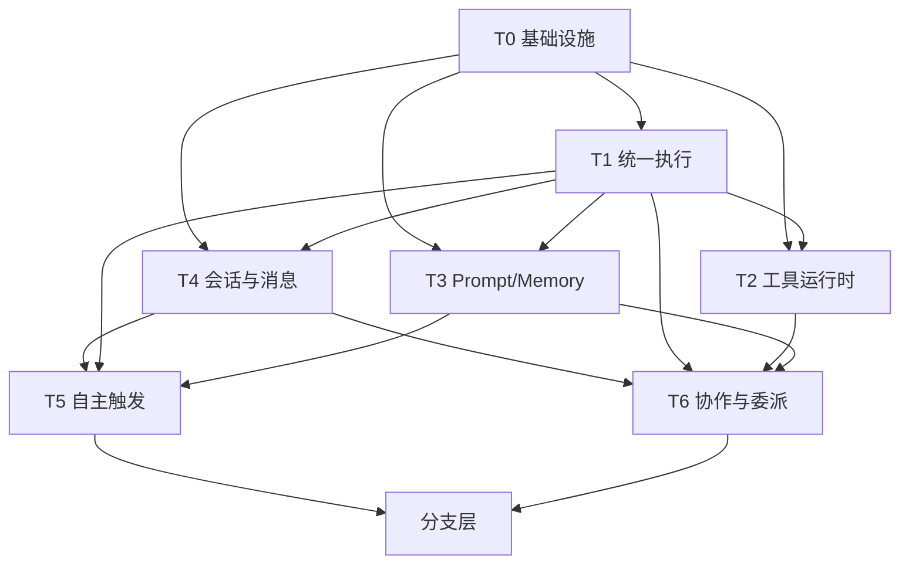

# 主干依赖图与断裂风险图

## 1. 主干依赖图



## 2. 为什么这个顺序不能打乱

### T5 不能先于 T4 完全展开

原因：

- trigger 执行最终会创建 session / message
- 如果 T4 没收口，触发主干修好后仍会把会话写回老路径

策略：

- Phase 1 先只统一“触发语义”和“后台循环”
- Phase 2 再统一“session 写入”

### T6 不能早于 T4 与 T1 大改

原因：

- 协作/委派同时依赖执行主干和会话主干
- T1 不稳时，A2A 和 delegation 容易再长出私有执行器
- T4 不稳时，A2A 对话会继续产生散落 session

### T3 不能在 T1 契约没冻结时大动

原因：

- prompt/memory 的注入点都挂在统一执行主干上
- 如果 T1 请求对象和 metadata 还在抖动，T3 的调整会不断返工

---

## 3. 每条主干的上游/下游

### T0

- 上游：无
- 下游：全部
- 改坏表现：全系统报错、租户污染、权限异常

### T1

- 上游：T0
- 下游：T2/T3/T4/T5/T6
- 改坏表现：多入口执行漂移、fallback/cancel/tool loop 行为不一致

### T2

- 上游：T0/T1
- 下游：T5/T6/各渠道
- 改坏表现：工具可用性不一致、审批失效、schema 失真

### T3

- 上游：T0/T1
- 下游：T5/T6/会话质量/记忆质量
- 改坏表现：回答漂移、memory recall 断裂、prompt 爆炸

### T4

- 上游：T0/T1
- 下游：T5/T6/渠道/recall/T0 日志
- 改坏表现：session 丢失、conversation_id 漂移、回忆链断

### T5

- 上游：T0/T1/T3/T4
- 下游：所有 autonomous execution 分支
- 改坏表现：重复触发、漏触发、多个后台循环并存

### T6

- 上游：T0/T1/T2/T3/T4
- 下游：A2A、delegation、高级协作 UI
- 改坏表现：A2A/delegation 语义混淆、task 句柄漂移、hook 错报

---

## 4. 断裂风险清单

### R1 入口断裂

定义：

- 上游修了，入口还没迁移，导致新主干没人调用或旧入口失效

检测：

```bash
rg -n "include_router|websocket|invoke_agent|delegate_to_agent|AgentSchedule|AgentTrigger" backend/app
```

缓解：

- 先迁移入口
- 再删执行器

### R2 双写断裂

定义：

- 新主干开始写新路径，但旧路径仍被别的入口继续写

检测：

```bash
rg -n "ChatSession\\(|Task\\(|RuntimeTask|AgentSchedule|AgentTrigger" backend/app
```

缓解：

- 对每个核心模型做写点盘点
- 新旧并存期间必须有“写点归零计划”

### R3 读取漂移

定义：

- 写路径改了，但 recall / UI / logs / hooks 还按旧结构读取

检测：

```bash
rg -n "conversation_id|summary|runtime_task|schedule|trigger|delegation_" backend/app
```

缓解：

- 修改写路径前，先列出所有读方
- 在 Phase 文档里给出“读方跟单”

### R4 行为漂移

定义：

- 系统还能跑，但 prompt、memory、tool policy、metadata 已经不一致

检测：

- snapshot 测试
- prompt contract 测试
- metadata contract 测试

缓解：

- 每条主干修完都跑局部回归
- 全部主干修完后跑全量主干回归

---

## 5. 进入下一主干前的门槛

每完成一条主干，必须同时满足：

1. 主干架构测试通过
2. 与该主干直接相关的功能回归通过
3. 旧写路径/旧入口搜索结果符合预期
4. 文档台账已更新

未满足以上条件，不得进入下一主干。

