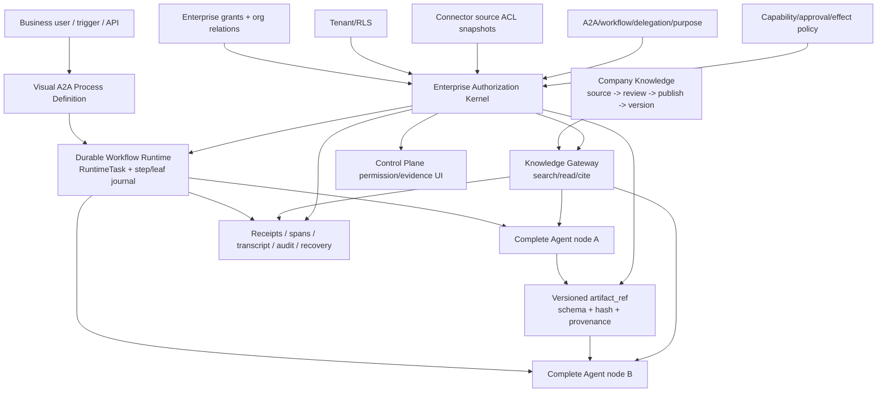

# Bisheng 借鉴分析：A2A 确定性业务工作流、企业知识库与企业权限统一

> **目的**：以 Bisheng 当前源码为对照，明确 Hive 真正需要补强的三块能力：
> 1. 多个完整 Agent 参与的、可视化且可恢复的确定性业务流程；
> 2. 完整的 Company / Enterprise Knowledge 产品与运行闭环；
> 3. 企业侧统一权限裁决，收敛当前 Agent、Resource、Knowledge、A2A、Connector ACL 与 Runtime 权限碎片。
>
> **关键纠正**：本文中的“A2A 工作流”不是协议互操作，也不是 Dynamic Workflow。它指企业真实业务流程中，多个完整 Agent 作为受治理节点，按照确定性图、数据合同、审批、等待、重试和恢复规则完成协作。
>
> **Bisheng 对照基线**：`/Users/example-owner/vc-saas/bisheng`，commit `e87e2655eea412a8422f0a425e6712d3fa63504f`。
> **Hive 对照基线**：`/Users/example-owner/vc-saas/hiveclaw-main`，commit `27f1a55b4b07e0cbf569e0b2ad32bd609ecd7fb0`。
> **状态**：只读源码审计与设计校正，未施工、未部署、未运行 Bisheng 外部依赖。
> **日期**：2026-07-19。

## 0. 总结论

Hive 现在真正薄弱的不是 Agent 之间“能不能互相发消息”，而是：

1. **A2A 与 Workflow 还没有合成一个企业业务 Process Graph**：Hive 已有真实 A2A delegation，也有可恢复的确定性 Workflow runtime，但没有把完整 Agent、edge contract、artifact handoff、审批、等待、版本和可视化编排收敛成一个产品。
2. **Company Knowledge 仍是已知缺失**：Personal Knowledge 已有真实闭环，但 Company authority、source ingest、proposal/review/publish、版本、检索、引用、权限、UI 与 Agent tools 尚未形成生产闭环。
3. **企业权限没有统一内核**：`AgentPermission`、`ResourcePermission`、`KnowledgeGrant`、A2A collaboration policy、Connector source ACL、RLS、capability policy、session permission/approval 各自解决了一部分问题，但没有统一成一个 typed decision contract。继续按功能新增 ACL，只会扩大重复与旁路。

Bisheng 的正确借法是：

| 领域 | 借什么 | 不借什么 |
| --- | --- | --- |
| A2A 确定性 Workflow | 可视化图编辑、富节点、agent-as-node、typed input、版本/发布、运行事件和调试体验 | `MemorySaver + _global_workflow` 进程内恢复；把内部 subagent 冒充协议 A2A |
| Company Knowledge | Knowledge Space 产品面、部门/用户组分享、文档版本、混合检索、检索前过滤、结果后复核、citation 再鉴权 | `Knowledge.type=SPACE` 分支式权威；v1/v2 授权漂移；双主版本字段 |
| 企业权限 | user/department/group/resource hierarchy、action vocabulary、父子继承、check/list/authorize 产品能力、迁移/对账思想 | OpenFGA/DB creator/Config JSON/legacy RBAC/cache 并行发权；故障时 creator fallback 放权 |

**Bisheng 不是 Hive 三块能力的共同权限底座。** OpenFGA 可以成为关系计算引擎或可重建 projection，但不能直接成为 Hive 的第二份 durable authority。Hive 需要的是一个 Enterprise Authorization Kernel，再由 Workflow、Company Knowledge、A2A、Connector 和 UI 共同消费。

## 1. 范围：这里的 A2A Workflow 到底是什么

### 1.1 目标定义

本文中的 A2A Workflow 是：

```text
完整 Agent 节点
  + 确定性 Process Graph
  + typed edge / artifact contract
  + enterprise authorization decision
  + approval / wait / retry / compensation
  + durable run / step / checkpoint / receipt
  + visual authoring / operations / evidence UI
```

示例不是“Agent A 和 Agent B 聊天”，而是：

```text
客户材料进入
  -> Research Agent 收集与引用证据
  -> Risk Agent 按固定 schema 审核
  -> Finance Agent 计算并产出 artifact
  -> Human gate 审批
  -> Execution Agent 执行获批动作
  -> Control Plane 展示每一步状态、证据和恢复入口
```

流程顺序、节点资格、输入输出 schema、审批和副作用边界由平台确定；每个 Agent 节点内部的研究、判断、综合和表达仍归模型。这符合 Hive 的 capability-preserving determinism：确定外部业务过程，不机械化 Agent 智能。

### 1.2 不在本次主目标中的两件事

1. **Dynamic Workflow**：模型生成或调整流程候选，属于另一条能力；本次不以它作为目标 runtime。
2. **协议级 A2A interoperability**：Agent Card、远程 peer transport、跨平台任务协议仍重要，但不是这里所说的“确定性业务工作流”。

### 1.3 与现有 canonical 文档的关系

本文是 Bisheng 借鉴与边界校正文档，不替代以下施工权威：

- `docs/a2a-workflow-orchestration-design-2026-06-24.md`：A2A Process Graph、完整 Agent 节点、artifact handoff 与 edge contract；
- `docs/company-knowledge-base-spec-2026-07-07.md`：Company Knowledge / Ontology 的完整七原子施工规格；
- `docs/agent-permission-governance-spec-2026-07-07.md`：Accountable/Actor/Resource/Context principal 与统一权限语义。

后续实施若与本文冲突，以三份 canonical 规格和当前源码为准。

## 2. Hive 当前真实断点

### 2.1 A2A 与确定性 Workflow：两边都有底座，但中间没接成产品

Hive 已有：

- `ExecutionPrincipal`：绑定 requester、source Agent、tenant、root session/run；
- A2A collaboration policy：same-owner、public Agent、active collaboration group、cross-tenant deny；
- `delegate_to_agent` / `send_message_to_agent`：真实 child session、RuntimeTask、typed `A2AOutcome` 与审计；
- `WorkflowDefinition`、`WorkflowDefinitionRecord`、`RuntimeTask(task_type="workflow")`、step/leaf journal、wait/gate/signal、restart/resume、budget 与 audit；
- definition draft/activate/deprecate/revoke/fork 生命周期。

真正断点是：

1. Workflow 的 `agent_step` 还没有完整表达一个受治理企业 Agent 节点的 authority、accepted artifact、produced artifact、A2A group/capability scope 和 continuation contract。
2. `delegate_to_agent` 返回 task/session handle，但没有成为上层 process node 的 durable child reference。
3. Agent 之间的数据交接仍缺统一 `artifact_ref + schema + hash + ACL + provenance` 合同。
4. 前端主要消费 JSON definition，没有面向业务用户的可视化 authoring、节点配置、运行图、单步证据和恢复操作台。
5. A2A collaboration allowed、Workflow step executable、artifact readable、tool effect allowed 仍由不同入口判断。

因此当前组合能力应判为：**A2A 和 Workflow 各自有真实执行路径，但 A2A Deterministic Business Workflow 仍是断点，不是闭环。**

### 2.2 Company Knowledge：不是“Personal KB 再加共享”

当前 Company Knowledge 仍是 **Missing**：

- 没有 Company-owned source/proposal/publication/version authority；
- 没有 tenant curator、reviewer、publisher 与 separation-of-duties；
- 没有 `search_company_kb` / `read_company_kb` / citation runtime；
- 没有 Company permission resolver；
- 没有 source ACL revoke、reindex/tombstone、retire/restore/rollback 闭环；
- 没有 Company Knowledge Control Plane UI 与正向 E2E。

必须继续保持三层 ownership：

| 平面 | 权威所有者 | 进入下一层的方式 |
| --- | --- | --- |
| Agent Memory | Agent | 带 source refs 的 candidate，不直接成为企业真相 |
| Personal Knowledge | User / Principal | owner consent + Company proposal |
| Company Knowledge | Tenant / Company | review + publish，形成新的 Company-owned authority record |

### 2.3 权限碎片：问题不是 ACL 存在，而是没有统一裁决

Hive 当前权限面包括：

| 权限事实/机制 | 正确职责 | 当前碎片风险 | 目标位置 |
| --- | --- | --- | --- |
| tenant/RLS | 数据隔离与 tenant authority 下界 | 与应用层 decision 的 reason/evidence 不统一 | 永久保留的 hard gate |
| `AgentPermission` / `check_agent_access` | Agent visibility/use/manage | 与 generic resource、A2A、Knowledge action 分开 | 迁入统一 resource/action vocabulary，保留兼容 adapter |
| `ResourcePermission` | 通用 user/role/department/agent resource grant | 字段不足，消费者不统一，deny/expiry/purpose/source ACL 不完整 | 企业 durable entitlement authority 的演进起点 |
| `KnowledgeGrant` | Personal Knowledge owner/delegation edge | 若扩成 Company grant 会形成第二知识权限真相 | 明确保留 Personal-only |
| A2A collaboration group/policy | Agent 是否可联系、委派、协作 | 容易被误当成 artifact/Knowledge/tool 权限 | 作为统一 decision 的一项 context constraint |
| Connector source ACL | 外部 source item 谁可读、是否可进入 prompt/final | 新增一套 source-level判断，但尚未进入统一 Company decision | 作为外部 authority hard constraint，不发放 Company grant |
| capability/tool/session permission | actor 在当前 run 能否使用能力和产生 effect | 与 resource permission/approval 分开返回 | 作为 runtime/effect constraint |
| approval/checkpoint | 高风险动作是否获准 | 可能被误解为永久 resource grant | 仅是当前 object/session/action 的临时授权证据 |

这里有些层是**合法的纵深防御**，不能物理合并。例如 RLS、外部 source ACL 与工具副作用批准解决的是不同问题。要统一的是：

```text
所有消费者都提交同一种请求
  principal × resource × action × context

所有权威事实都进入同一个 resolver
  tenant/RLS
  + enterprise resource grant / org relations
  + external source ACL
  + delegation / A2A relationship
  + sensitivity / retention / purpose
  + capability / approval / effect policy

所有消费者得到同一种 typed result
  allowed | denied | unavailable | approval_required
  + reason codes
  + authority/evidence refs
  + policy version
  + retry/recovery state
```

因此，新增 ACL 本身不是错误；错误是让 ACL 成为又一个能够独立决定最终权限的平行系统。

## 3. Bisheng 的确定性 Workflow：最值得借的是产品层

### 3.1 它怎么做

Bisheng 的 static `GraphEngine` 是一套真实的非 Dynamic Workflow：

- 前端 `@xyflow/react` 保存 `nodes / edges / viewport`；
- 节点包含 Start、End、Input、Output、Tool、RAG、Report、QA Retriever、Condition、Agent、Code、LLM、Knowledge Retriever；
- Workflow 有 definition/version/save/publish/online/offline/use/edit 等产品生命周期；
- 运行路径是 WebSocket/API → Redis → Celery Worker → `Workflow`/`GraphEngine` → node callback → UI/DB；
- Input/Output node 可以产生 typed interactive form，运行可等待用户输入后继续；
- agent-as-node 通过 typed variables 消费上游输出并产生下游输入；
- 前端按 node/stream/input/output 事件展示运行过程。

关键源码：

- `src/frontend/platform/src/pages/BuildPage/flow/Panne.tsx`
- `src/backend/bisheng/workflow/nodes/node_manage.py`
- `src/backend/bisheng/workflow/graph/graph_engine.py`
- `src/backend/bisheng/worker/workflow/tasks.py`
- `src/backend/bisheng/worker/workflow/redis_callback.py`

### 3.2 Hive 应该完整吸收的产品能力

1. **Visual Process Builder**：业务用户拖拽 Agent、Tool、Knowledge、Condition、Human Gate、Output 等节点。
2. **Agent node inspector**：选择真实 Hive Agent，展示 owner/tenant/status/capabilities、accepted artifacts、required approvals，而不是只填 prompt。
3. **Typed edge contract**：每条边声明 input/output schema、artifact binding、completion condition、timeout、retry、compensation 和 ACL requirement。
4. **版本与发布**：draft、validate、preview、activate、deprecate、revoke、fork，发布时固定 definition hash。
5. **运行可视化**：active node、waiting reason、child Agent、artifact、approval、retry、failure、receipt、resume/cancel。
6. **交互式步骤**：typed form/select/file/confirmation schema；等待期间状态持久，恢复时重查权限和 expiry。
7. **业务模板与应用目录**：把经过治理的 Workflow 当作企业应用，而不是 Agent 设置页中的 JSON 附件。

### 3.3 不能复制的恢复底座

Bisheng static Workflow 使用进程内 `MemorySaver()`，暂停对象保存在模块级 `_global_workflow`。它能在同一 Worker 存活时继续，但 Worker 重启、扩缩容或重新路由后无法恢复；stop 也可能因为未绑定原 Worker 而失效。

Hive 应保留现有：

- `RuntimeTask` durable run authority；
- workflow step/leaf journal；
- typed wait/signal/gate；
- definition/args/hash replay metadata；
- idempotent resume/cancel/kill；
- invocation spans、transcript/event 与 audit evidence。

正确实现是：**Visual Graph 编译到现有 `WorkflowDefinition` 和 durable runtime，不建立第二套 Workflow engine。**

### 3.4 Bisheng Linsight 的位置

Linsight main agent → `general-purpose` researcher 是同进程 hierarchical subagent，不是协议级 A2A，也不是本文的确定性业务 Process Graph。

可借的只有：

- child context/todo 隔离；
- self-contained task description；
- parent 保留最终综合权；
- nested namespace/event 在 UI 中展示 child progress。

不应复制 blacklist/default-allow child tools。Hive 必须根据 principal、A2A relationship、workflow edge、artifact permission、capability policy 和 approval 的交集构造 child authority。

## 4. Bisheng Enterprise Knowledge：借完整产品与检索机制

### 4.1 值得借的完整产品面

Bisheng Knowledge Space 已覆盖：

- 我的空间、加入的空间、部门空间、知识广场；
- user、department、user group 分享与管理；
- folder/file/web URL/tag/batch operations；
- 文档版本、历史版本、primary version；
- ingestion、解析、切块、向量/全文检索、rerank；
- message citation、page/bbox、preview/download；
- Knowledge-as-tool 与 Workflow/Assistant 消费。

这些能力对 Hive 的价值不是“再做一个 RAG 页面”，而是提供 Company Knowledge 的完整 Consumption 和运营表面。

### 4.2 最关键的检索权限纵深

Bisheng 正确路径采用：

```text
authenticated principal
  -> list accessible file IDs / index pre-filter
  -> vector / keyword retrieval
  -> result-level file permission post-filter
  -> model-visible results
  -> citation resolve 时重新鉴权
```

`knowledge_file_visibility_service.py` 同时提供检索前过滤与结果后复核，这是 Hive 必须吸收的安全不变量：

1. denied resource 不能通过 title/count/score 暴露；
2. 索引过滤不能作为最终授权；
3. 每个 result 必须回到 authority plane rebind；
4. citation/read/export 必须重新判当前权限；
5. source ACL revoke 后要 tombstone/reindex，并保留 receipt。

### 4.3 Bisheng 自己的断点

不能把 Bisheng Knowledge Space 直接判成闭环：

1. `Knowledge(type=SPACE)` 与 legacy Knowledge Library 共表并靠业务分支选择权限，容易出现漏分支。
2. v1 folder/space retrieval 使用 prefilter + postfilter，但统一 v2 retrieve 路径只检查 space view 后直接检索，未执行逐文件 visibility pipeline。
3. OpenFGA owner、DB creator、space member/binding 等存在多份 authority。
4. `KnowledgeDocument.primary_version_id` 与 version `is_primary` 同时表达主版本，写入中断会造成 UI 与检索不一致。
5. 删除、授权、版本切换跨 MySQL/OpenFGA/Milvus/ES 时缺单一 durable commit 与完备 reconcile。

### 4.4 Hive 的正确吸收方式

Hive 应吸收 Bisheng 的产品与检索机制，但继续服从 Company Knowledge canonical contract：

- Company source 先形成 `SourceContract + CanonicalEvidenceEnvelope + source ACL snapshot`；
- Personal → Company 必须 owner consent + proposal/review/publish，不能翻转 scope；
- Company publication/version 是 Hive DB authority；
- vector/search/graph/OpenFGA 都只能是 projection；
- `search_company_kb` / `read_company_kb` 为 tool-first；
- search/read/cite/export/execute_action 是不同 action；
- Knowledge Publication 与 Ontology Release 生命周期分离，但共享 permission/evidence/publish governance；
- Company Knowledge 不新建 `knowledge_acl_bindings` 平行真相。

## 5. 企业权限统一：从“新增 ACL”转为“一个裁决内核”

### 5.1 Bisheng 的可借机制

Bisheng 的 OpenFGA/ReBAC 模型提供了有价值的表达能力：

- subject：user、department member、user group member/admin；
- resource：knowledge space/library/folder/file、workflow、assistant、tool、channel 等；
- relation：owner → manager → editor → viewer；
- parent inheritance：folder/file 继承父级关系；
- action vocabulary：view/edit/delete/share/manage；
- check/list accessible IDs/authorize 三类消费；
- migration、dual-write、reconcile、failed tuple retry 的运维思路。

Hive 应借 relation graph、action vocabulary、父子继承和迁移/对账方法。

### 5.2 Bisheng 权限底座为什么不能照搬

Bisheng 实际上同时依赖：

- OpenFGA tuple；
- MySQL creator/member；
- Config JSON relation binding；
- legacy RBAC；
- Redis cache；
- 各业务 handler 的显式权限调用。

产生的后果包括：

1. OpenFGA unavailable 时，DB creator fallback 可能重新获得 owner 等效权限；
2. OpenFGA grant 已成功但 Config binding 保存失败，API 报失败而权限实际生效；
3. retry 后可能出现 false failure / later success；
4. check、list、permission-id action 与业务列表入口可能使用不同事实源；
5. legacy alias、resource type 与 binding 漂移；
6. handler 漏调即形成授权旁路。

因此不能把“接入 OpenFGA”写成 Hive 权限统一本身。

### 5.3 Hive Enterprise Authorization Kernel

建议锁定以下逻辑合同：

```text
AuthorizationRequest
  principal:
    tenant_id
    accountable_user/company
    actor_type + actor_id
    session_id / runtime_task_id
    delegation / workflow / a2a context
  resource:
    resource_kind
    resource_id
    parent/namespace/company scope
    source_ref?
  action:
    discover | search | read | cite | use | edit | share | manage
    propose | review | approve | publish | retire | export | execute
  context:
    purpose
    sensitivity
    retention/legal state
    approval/effect metadata

PermissionDecision
  status: allowed | denied | unavailable | approval_required
  requested_action
  allowed_actions[]
  reason_codes[]
  authority_sources[]
  policy_version
  source_acl_snapshot_hash?
  redaction_policy?
  approval_requirement?
  retryable
  evidence_refs[]
  audit_payload
```

### 5.4 单一 authority 与多层 hard constraints

统一后应遵守：

1. **Enterprise entitlement authority**：以演进后的 `ResourcePermission` + 组织成员/关系事实为 durable source；必须支持 allow/deny、deny precedence、expiry/revocation、purpose、sensitivity ceiling、条件与审计。
2. **RLS**：继续作为 tenant 数据边界，不被 OpenFGA 或应用层 decision 替代。
3. **Connector source ACL**：只证明外部 source item 是否允许当前 principal 使用，是 hard constraint；它不能授予 Company publish/export/action 权。
4. **KnowledgeGrant**：继续 Personal-only，不承担 Company authority。
5. **A2A collaboration policy**：只决定两个 Agent 是否可以联系/委派；artifact、Knowledge、tool effect 仍需请求统一 decision。
6. **Capability/session/approval**：只能进一步缩小当前 actor 的 side-effect 权限，不能扩大 resource grant。
7. **OpenFGA**：若采用，只作为由 durable grant/outbox 构建的关系计算 projection；unavailable 返回 typed `unavailable`，不得回退到 creator 或陈旧 JSON 放权。
8. **所有消费者共用一个 resolver**：API、tool、Workflow、A2A、search prefilter、result postfilter、citation、export、UI action state 不得各写授权算法。

### 5.5 UI 也必须统一

统一权限不是后端函数结束。Control Plane 必须消费同一 action catalog 与 decision：

- 用户为什么看不到某个资源；
- 当前是 denied、unavailable 还是 approval required；
- 谁可以 share/manage/publish；
- 哪个 source ACL、grant、department relation 或 policy 产生结果；
- 何时过期、如何撤回、如何重试或请求审批；
- 权限变更影响哪些 Workflow、Knowledge publication、artifact 和 Agent。

UI 不得根据 role name 自行猜权限，也不得把“按钮隐藏”当授权。

## 6. 三块能力应如何接成一个企业控制面



这里的核心不是三块各自“接 ACL”，而是三块共同提交同一种 AuthorizationRequest，并消费同一种 PermissionDecision。

## 7. 后续若施工，必须一次覆盖的完整范围

本文不授权实现。后续若进入施工，不能拆成默认关闭的半成品，完整范围至少包括：

### 7.1 A2A Deterministic Business Workflow

- graph schema、node/edge/artifact/condition/gate/wait/retry/compensation contracts；
- 完整 Agent node 与 A2A child RuntimeTask/session 绑定；
- visual editor、validation、preview、version、publish、template/catalog；
- durable run/step/checkpoint、restart/resume/cancel、idempotency；
- artifact store/ref/hash/schema/ACL/provenance；
- Authorization Kernel 接入与 resume re-authorization；
- run graph、evidence、approval、failure、repair UI；
- migration/backfill、observability、fault injection 与 E2E。

### 7.2 Company Knowledge

- source ingest、SourceContract、ACL snapshot、canonical evidence；
- Personal proposal、Company review/publish、separation-of-duties；
- publication/document/version/segment/citation authority；
- parser/chunk/index/rerank 与 rebuildable projections；
- search prefilter + result postfilter + citation re-authorization；
- search/read/cite/review/publish/retire/export tools/API/UI；
- revoke/tombstone/reindex/rollback/reconcile；
- legacy-data import/backfill、audit、golden retrieval/ACL/E2E。

### 7.3 Enterprise Authorization Kernel

- canonical principal/resource/action/context registries；
- durable grant/relationship authority 与 deny/expiry/revocation；
- RLS、source ACL、A2A/delegation、capability/approval adapters；
- one typed resolver + batch/list/prefilter APIs；
- transactional outbox、projection rebuild、cache invalidation、DLQ/reconcile；
- compatibility migration for AgentPermission/ResourcePermission consumers；
- UI action model、permission editor、impact analysis、audit/recovery；
- cross-tenant, outage, stale ACL, revoked grant, concurrent update、false-success regressions。

## 8. 七原子结论

| 能力 | Input | Authority | Execution | Evidence | Recovery | Consumption | Acceptance | 当前结论 |
| --- | --- | --- | --- | --- | --- | --- | --- | --- |
| Hive A2A direct delegation | 有 | 局部统一 | 有 | 有 | 局部 | 有 | 局部 | 局部闭环 |
| Hive deterministic Workflow runtime | 有 | 局部统一 | 有 | 强 | 强 | UI 偏 JSON | 有但非完整 visual A2A E2E | 局部闭环 |
| Hive A2A deterministic business process | 定义有、产品入口弱 | 分裂 | 两条 runtime 未合成 graph | 底座有、process graph 无 | process-level 缺 | visual control plane 缺 | 缺 | 断点 |
| Hive Company Knowledge | 缺 | 缺 | 缺 | 缺 | 缺 | 缺 | 缺 | 已知缺失 |
| Hive enterprise permission unification | 多入口 | 多事实/多 resolver | 各域各自执行 | 各自有 | 缺统一 reconcile | UI/Tool/API 不统一 | 缺全域 parity E2E | 局部闭环且需收敛 |
| Bisheng static Workflow | 有 | 局部 | 有 | 局部 | Worker boundary 断点 | visual UI 强 | 缺 restart/multi-worker E2E | 局部闭环 |
| Bisheng Knowledge Space | 有 | v1/v2 漂移 | 有 | 较强 | 跨存储不完整 | 产品面强 | 文件级泄漏回归不足 | 局部闭环 |
| Bisheng ReBAC | 有 | 多权威 | 有 | 多面 | false failure/later success 风险 | UI 较强 | outage/concurrency 缺口 | 局部闭环 |

## 9. 最终裁决

1. **A2A 主目标重新定义为“确定性、多 Agent、可视化企业业务流程”**，不是协议 A2A，也不是 Dynamic Workflow。
2. **Workflow 不重写 runtime**：以 Hive 现有 durable Workflow 为底座，吸收 Bisheng visual graph、富节点、typed interaction 和运营 UI。
3. **Company Knowledge 按完整企业资产面建设**：借 Bisheng 的 Knowledge Space 产品、检索和引用，不把 Personal KB 共享化，不复制 type-switch 权威。
4. **权限先统一逻辑裁决，不再横向增加 ACL 系统**：RLS/source ACL/A2A/capability 都作为明确 hard constraint 输入；企业 grant/组织关系保留一个 durable authority；所有产品消费一个 typed resolver。
5. **OpenFGA 是可选关系计算引擎，不是架构答案**：是否引入应在统一 authority/outbox/rebuild contract 锁定后决定，不能让它与数据库/JSON/legacy RBAC 再形成双主。
6. **三块必须共享同一企业控制面语言**：principal、resource、action、artifact、decision、receipt、version、recovery；否则可视化 Workflow 和 Company Knowledge 只会继续复制权限碎片。

## 附录 A：关键源码索引

### Bisheng

- Workflow：`src/backend/bisheng/workflow/graph/graph_engine.py`
- Workflow worker/recovery：`src/backend/bisheng/worker/workflow/tasks.py`
- Workflow node registry：`src/backend/bisheng/workflow/nodes/node_manage.py`
- Visual editor：`src/frontend/platform/src/pages/BuildPage/flow/Panne.tsx`
- Linsight subagent：`src/backend/bisheng/linsight/domain/services/agent_factory.py`
- Knowledge Space：`src/backend/bisheng/knowledge/domain/services/knowledge_space_service.py`
- Knowledge visibility：`src/backend/bisheng/knowledge/domain/services/knowledge_file_visibility_service.py`
- Space retrieval：`src/backend/bisheng/knowledge/domain/services/space_flow_retrieval.py`
- Unified retrieve 断点：`src/backend/bisheng/knowledge/domain/services/knowledge_space_chat_service.py`
- ReBAC model：`src/backend/bisheng/core/openfga/authorization_model.py`
- Permission resolver：`src/backend/bisheng/permission/domain/services/permission_service.py`
- Permission grant/binding：`src/backend/bisheng/permission/api/endpoints/resource_permission.py`

### Hive

- Execution principal：`backend/app/core/execution_context.py`
- A2A policy：`backend/app/services/a2a_collaboration_policy.py`
- A2A collaboration runtime：`backend/app/services/collaboration.py`
- Workflow definition：`backend/app/runtime/workflow_definition.py`
- Workflow runtime：`backend/app/services/workflow_runtime_service.py`
- Workflow frontend：`frontend/src/pages/agent-detail/AgentWorkflowsSection.tsx`
- Agent permission：`backend/app/models/agent.py`
- Generic resource permission：`backend/app/models/security_audit.py`
- Personal Knowledge grant：`backend/app/models/knowledge.py`
- Personal Knowledge decision：`backend/app/services/personal_knowledge_access.py`
- Connector source ACL：`backend/app/services/connector_acl.py`
- Company Knowledge canonical spec：`docs/company-knowledge-base-spec-2026-07-07.md`
- Permission canonical spec：`docs/agent-permission-governance-spec-2026-07-07.md`
- A2A Workflow canonical design：`docs/a2a-workflow-orchestration-design-2026-06-24.md`

## 附录 B：证据边界

- 本文基于 Bisheng 与 Hive 当前 checkout 的源码、调用路径与代码图；没有把 Bisheng 自带营销/架构文档当完成证据。
- 未启动 Bisheng MySQL、OpenFGA、Milvus、Elasticsearch、Redis、MinIO 或 Celery 集群，也未执行生产 E2E；因此 Bisheng 能力只按源码判为闭环/断点。
- 本文没有修改任何 Hive runtime、schema、API、UI、权限或部署配置。
- 施工前必须重新核对 live entry、migration head、consumer wiring、dirty worktree 和 production baseline。
