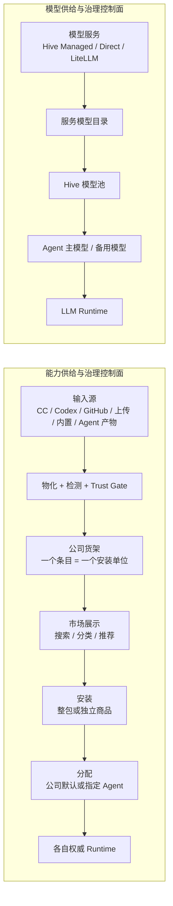

# 能力市场、插件货架与模型服务控制面统一改造设计

| 字段 | 内容 |
|---|---|
| 状态 | 已按 CC / Codex 当前源码校正，待一次性交付实现 |
| 日期 | 2026-07-14 |
| 文档类型 | 产品决策记录 + 前后端完整施工图 |
| 产品范围 | 输入源、公司货架、用户侧能力市场、Agent Detail 安装与模型配置、公司后台治理 |
| 技术范围 | Marketplace Source、Shelf Item、Plugin Bundle、Standalone Capability、Trust Gate、Installation/Assignment、OpenConnector、LiteLLM、原生模型直连、运行时投影、迁移回填、可观测性与验收 |
| 当前代码基线 | `main@33fbecd9d8021685aa2471114113b1edcc740b98` |

## 0. 文档地位与上游约束

本文是本轮“能力市场 + 模型选择”统一改造的跨产品面权威设计，负责回答六个问题：

1. 外部 Marketplace、GitHub、后台预置和 Agent 产物如何进入系统。
2. 哪些对象真正作为独立商品进入公司货架。
3. 普通用户在哪里发现、安装、更新和管理这些商品。
4. Agent Detail 如何显示某个 Agent 真正安装的商品、可用能力与可选模型。
5. 公司后台如何管理来源、审核、上架、公司默认、连接身份、模型服务和模型目录。
6. 前后端如何以同一组权威对象闭合上架、安装、分配、执行、证据、恢复和验收。

本文不替代以下专项文档；冲突时按北极星和专项边界裁决：

- `docs/external-capability-trust-gate-plan-2026-06-26.md`：外部能力物化、审查、不可变 snapshot、激活与撤销。
- `docs/llm-service-gateway-redesign-2026-06-20.md`：LiteLLM、原生直连、Key ownership、OpenConnector Gateway 的技术边界。
- `docs/subagent-source-capability.md`：Sub-agent 定义、调用、隔离、恢复和公司库语义。
- `docs/workflow-source-capability.md`：Workflow definition、版本、执行 journal、等待/恢复与治理语义。
- `docs/frontend-design-refinement-2026-07-03.md`：Codex Desktop 风格的克制、层级、密度和渐进披露。

本文新增的权威结论是：

> **输入源、货架商品、前端展示、安装记录和 Agent 分配是五个不同对象。Plugin 是一等、原子化的整包安装单位；Plugin 包内的 Skill、Sub-agent、Hook、MCP/App 等只是包内清单，不得被自动拆成独立货架商品。单独的 Skill、Sub-agent 和 Workflow 必须从各自独立来源进入货架，形成各自独立版本与安装记录。**

这条结论是对 CC / Codex 原生 Plugin 语义的保护，不是重新发明 Plugin。产品层仍统一为“能力市场”，公司治理层统一为“能力管理”，Agent 层统一显示“已安装商品 + 运行时有效能力”，但任何统一读模型都不得抹掉原始安装单位。

## 1. 一句话结论

本轮改造不是两个孤立页面，而是两条平行且隔离的控制面。能力控制面的正确主链是：



货架允许承载来自不同输入源的不同安装单位：

```text
公司货架
  -> Plugin Bundle                 # CC/Codex/Git/上传/后台预置；永远整包装
  -> Standalone Skill              # 独立 Skill 来源
  -> Standalone Sub-agent/Expert   # 独立专家来源
  -> Standalone Workflow           # 独立 Workflow 来源
  -> Connector Offer               # OpenConnector/独立连接器来源
```

两条控制面共享以下交互模式：

```text
发现 -> 配置/审查 -> 上架 -> 安装 -> 分配 -> 运行 -> 证据 -> 恢复
```

但它们不得共用运行时对象：

- 模型不是插件。
- OpenConnector 不是模型 Gateway。
- Plugin 是用户可选择的独立商品和整包安装单位，不是仅供内部使用的隐藏容器。
- Plugin 包内组件不会因为市场要按 Skill/专家等分类展示，就自动变成独立商品。
- Standalone Skill、Standalone Sub-agent、Standalone Workflow 与 Plugin 并行存在，来源和安装记录互不冲突。
- 统一货架和统一展示不等于统一执行器；各安装单位继续进入各自权威 Runtime。

## 2. 已确认的产品决策

### 2.1 命名

| 位置 | 用户文案 | 内部允许保留的术语 |
|---|---|---|
| 主侧边栏 | 能力市场 | capability market / extension catalog |
| Agent Detail | 能力 | agent extensions / effective capabilities |
| 公司后台 | 能力管理 | extension governance / trust gate |
| 公司后台模型页 | 模型服务 | LLM service connection / model catalog |
| 货架商品 | 插件包、连接器、Skill、专家、工作流 | plugin_bundle、connector、skill、subagent、workflow |
| Plugin 包内清单 | 包含内容 | component inventory；仅用于检测、说明和运行时装载 |

普通用户界面不出现 `MCP`、`MCP Server`、`Factor Intake`、`AI Asset hash`、`snapshot id`、`pack` 等内部术语。它们只在管理员高级信息、审核证据或运维面渐进披露。

### 2.2 货架商品与安装单位

货架条目的类型由其**原始发行单位**决定，不由 UI 想展示什么决定：

| 货架商品 | 合法输入源 | 安装语义 | 不允许的行为 |
|---|---|---|---|
| 插件包 | CC/Codex Marketplace、Git、URL、本地上传、后台预置 | 检测并安装完整 Plugin root；CC 格式同时解析完整 dependency closure | 从包内只摘一个 Skill/Agent 安装；把包内组件复制成独立商品；以“部分安装”冒充插件已安装 |
| 连接器 | OpenConnector Gateway、平台/公司独立连接器源 | 安装连接器定义；连接身份、Action 权限继续独立授权 | 自动传播凭据；把 generic super-tool 直接交给模型 |
| Skill | Finding Skill、Skill Hub、Git、上传、Agent 建议获批、平台/公司预置 | 安装一个独立发行、独立版本的 Skill artifact | 从某个 Plugin 内隐式拆出 Skill，并伪装成独立来源 |
| 专家 | 专家库、Git、上传、Agent 建议获批、平台/公司预置 | 安装一个独立发行、独立版本的 Sub-agent definition | 把 Plugin 内的 Agent 再显示成独立专家商品；安装即 spawn |
| 工作流 | Workflow 库、Git、上传、Agent 建议获批、平台/公司预置 | 安装一个独立发行、独立版本的 Workflow definition | 假设 CC/Codex Plugin 原生包含 Workflow；安装即运行 |

“单独安装”只适用于已经作为独立货架商品进入系统的 Skill、专家、Workflow 或连接器。它不等于从 Plugin 内选择一个 component。

### 2.3 Plugin 原子性与包内清单

Plugin 在货架、安装、更新、回滚和卸载上始终是一个原子商品：

```text
PluginShelfItem
  -> PluginRelease / immutable full-tree snapshot
      -> skills
      -> agents / subagents
      -> commands
      -> hooks
      -> MCP servers / apps
      -> dependencies
      -> shared scripts / assets / templates / config
```

包内清单只承担四个职责：

1. Trust Gate 检测完整包的权限、依赖、Hook、网络、凭据、路径和兼容性。
2. 详情页说明“这个插件包含什么”。
3. 完整安装后，Runtime 按原生格式加载包内能力。
4. 卸载、更新和回滚时计算影响范围。

包内清单**不是货架清单**。因此：

- 一个 Plugin 只产生一个顶层货架条目。
- Plugin 内的 Agent 不进入“独立专家”货架列表，Skill 也不进入“独立 Skill”货架列表。
- Plugin 详情页没有“只安装这个 Skill/Agent”的按钮。
- 检测不通过时，整个 Plugin 保持 `review_required|blocked|incompatible`；不得在用户选择“安装插件”后静默只装获批组件。
- 检测通过时，完整文件树和依赖闭包一起安装；运行时可以按需加载其中能力，但这不改变安装原子性。

Standalone Skill、Standalone Sub-agent 和 Standalone Workflow 则各自拥有独立的 source、release、hash、review、installation 和 assignment。它们与 Plugin 并行，不与 Plugin 争夺同一条安装语义。

### 2.4 输入源、货架、展示、安装与分配分离

| 层 | 权威对象 | 回答的问题 | 明确不代表什么 |
|---|---|---|---|
| 输入源 | Marketplace Source / Upload / Generated Candidate | 从哪里发现候选商品 | 不代表已经上架、安装或可运行 |
| 货架 | Shelf Item + Release | 公司/平台允许用户选择哪些独立安装单位 | 不代表任何 Agent 已安装 |
| 展示 | Market Read Model | 当前页面如何搜索、分类、推荐和排序 | 不改变商品边界，不生成新的安装单位 |
| 安装 | Tenant Installation | 哪个版本的完整商品已经物化到公司 | 不自动等于所有 Agent 可用 |
| 分配 | Company Default / Agent Assignment | 哪些 Agent 可以消费该安装 | 不改变原始 artifact，也不产生新的商品 |

后台“预制 Marketplace 内容”只是在输入源同步、审核后把商品放上货架。用户在前端看到什么，是货架的权限化展示。用户点安装时，系统安装他所选的那个顶层商品。这三件事可以由同一个按钮编排，但后端必须保存为三个独立事实。

### 2.5 “公开 / 个人”的准确语义

Codex 截图的价值是视觉和信息层级清晰，不足以证明其“公开”一定会自动安装到所有已有 Agent。Hive 必须把三个轴分开：

| 轴 | 可选值 | 回答的问题 |
|---|---|---|
| 所有权/可见性 | 平台、公司、个人私有 | 谁能在市场中看见它 |
| 安装状态 | 仅在货架、公司已安装 | artifact 是否已经物化到 tenant |
| 分配范围 | 公司默认、Selector 命中、指定 Agent、仅此 Agent | 哪些 Agent 可以消费该安装 |
| 运行状态 | 可用、待连接、待审批、启用、禁用、阻止、更新可用 | 当前 Agent 是否真的能使用 |

产品主操作可以保持 Codex 式简单，但后端仍拆分 installation 与 assignment：

1. `公开安装 / 设为公司默认`
   - 公司安装该商品一次。
   - 所有当前 Agent 经 reconcile 获得分配。
   - 所有未来新建 Agent 通过持久 default policy 自动继承。
2. `安装到指定 Agent / 个人`
   - 公司物化该商品后，只为所选 Agent 建立 assignment。
   - 不影响其他 Agent。

“已上架/公司可用”只表示商品在货架上；“公司已安装”表示 artifact 已物化；“公司默认/指定 Agent”才表达分配；“已分配”仍不等于运行时所有外部动作已获授权。

### 2.6 连接器的特殊规则

连接器即使设为公司默认，也只默认分配连接器定义和获批动作集合，不默认分配用户凭据。

- User-owned connection 必须由当前用户显式授权。
- Agent-owned connection 必须由 Agent owner/admin 显式配置。
- Tenant service account 必须由公司管理员创建，并在具体 Agent + Action 上显式允许。
- 不存在静默从 user-owned 连接回退到 tenant service account 的行为。

### 2.7 模型选择的特殊规则

- 公司后台负责建立模型服务、同步目录并发布到 Hive 模型池。
- Agent Detail 只能从公司已发布且当前可用的模型池选择主模型和备用模型。
- Agent Detail 不出现 API Key、Base URL、LiteLLM virtual key 或 provider raw JSON。
- 备用模型只在明确的不可用、超载、配额、显式预算策略等机械事实下接管。
- 禁止通过“简单任务”等自然语言启发式偷偷降级用户选择的主模型。

## 3. 当前 checkout 事实与断点

### 3.1 当前代码事实

| 事实 | 当前证据 | 结论 |
|---|---|---|
| 主侧边栏没有能力市场 | `frontend/src/pages/layout/AppSidebar.tsx::workspaceNavItems` | 需要新增独立用户入口和 route |
| 公司后台已有 Models 与 Extensions | `frontend/src/surfaces/workspace/sections.ts` | 两条控制面可以沿现有后台路由演进 |
| Agent 能力面仍有 5 个内部子页 | `frontend/src/pages/agent-detail/AgentExtensionsSection.tsx::EXTENSION_SUBVIEWS` | Catalog、MCP、Skills、Sub-agents、Self-grown 心智重复 |
| Workflow 仍是 Agent Detail 独立大页 | `frontend/src/pages/AgentDetail.tsx` 同时挂载 `AgentWorkflowsSection` 与 `AgentExtensionsSection` | 市场与有效能力读模型没有纳入 Workflow |
| 公司 Extensions 有 6 个内部子页 | `frontend/src/pages/workspace/WorkspaceExtensionsSection.tsx::WORKSPACE_EXTENSION_SUBVIEWS` | AI Assets、Factor Intake、MCP 等直接暴露给普通管理员 |
| 市场源已有 manual/GitHub/CC/Codex | `frontend/src/pages/workspace/WorkspaceExtensionCatalogSection.tsx` | 来源与手动同步基础可复用 |
| Marketplace sync 只有显式 API/服务调用 | `backend/app/services/external_capabilities/marketplace_sources.py::sync_marketplace_source` | 尚无完整定期刷新、更新审批和 rollout |
| 内置 Plugin 安装已保留整包依赖语义 | `backend/app/services/plugin_install_service.py::resolve_plugin_dependency_closure/install_plugin` | Plugin 依赖闭包、tenant install、Agent assignment 的方向正确，必须保留 |
| 当前“全部 Agent”只枚举安装时已有 Agent | `backend/app/services/plugin_install_service.py::_sync_agent_assignments` | 还缺未来 Agent 动态继承的持久 company-default policy |
| Trust Gate 已有 review/snapshot/component evidence | `backend/app/models/external_capability.py` | 不应新造第二套外部审查总账，但产品 Listing 必须保留顶层商品原子性 |
| External snapshot 当前按 component 生成 Catalog Entry | `backend/app/services/external_capabilities/trust_gate.py::_catalog_entries_for_snapshot` | 把 Plugin 展平为多个商品，违反整包安装语义 |
| External activation 允许选择 component 并据此重建 Plugin root | `backend/app/services/external_capabilities/activation.py::_activate_components` | 会遗漏共享文件/资源/依赖，不能作为完整 Plugin 安装路径 |
| Marketplace sync 主要消费嵌入式 `components` | `backend/app/services/external_capabilities/marketplace_sources.py::_normalize_remote_plugin_payload/_bundle_from_entry` | 尚未闭合原生 CC/Codex manifest -> 拉取完整 source -> adapter -> full snapshot |
| Codex adapter 当前只导入 Skill，并把 App 标为 unsupported | `backend/app/services/external_capabilities/codex_plugin_adapter.py::load_codex_plugin_bundle` | 与当前 Codex `skills/mcpServers/apps/hooks` manifest 仍不完整对齐 |
| `/agents/{id}/extensions` 仅聚合 Skills/MCP/Plugins/External Activations | `backend/app/services/mcp_server_service.py::get_agent_extensions` | 还不是“顶层安装商品 + 有效运行能力”的完整读模型 |
| `TenantInstalledPlugin` 被标为 compatibility projection，但其整包语义仍正确 | `backend/app/models/installed_plugin.py` | 可迁移存储，不能退役 Plugin 作为一等安装单位，也不能改成 component install |
| AgentCapabilityInstall 只覆盖 platform_skill/mcp_server/clawhub_skill | `backend/app/models/capability_install.py` | 它是安装尝试/就绪证据，不足以表达统一 desired/effective assignment |
| Workflow 已有 scope/version/hash/owner | `backend/app/models/workflow.py::WorkflowDefinitionRecord` | 应作为 Standalone Workflow 接入 Shelf，不重写 Workflow Runtime |
| LLMModel 把服务凭据和运行模型参数放在一行 | `backend/app/models/llm.py::LLMModel` | 必须拆为 Service -> Catalog -> Published Model |
| 当前模型页面是 Add Model 大表单 | `frontend/src/pages/workspace/WorkspaceLlmSection.tsx` | UI 问题来自数据形状，不是只换样式即可解决 |
| LLM Service/OpenConnector 新领域对象尚不存在 | 当前代码未找到 `LLMServiceConnection`、`litellm_gateway`、`ConnectorGateway` 等定义 | `llm-service-gateway-redesign` 仍是设计态 |

### 3.2 七原子状态判断

| 能力 | 状态 | 当前主要断点 |
|---|---|---|
| 内置/本地 Plugin 整包安装 | 局部闭环 | 依赖、安装与当前 Agent assignment 已存在；外部 approved snapshot 和未来 Agent 默认继承未接通 |
| 外部 CC/Codex Plugin 市场 | 断点 | source listing 与 Trust Gate 存在，但在“原生包物化/检测 -> 顶层 Plugin Listing -> 完整包安装”之间被 component 展平 |
| Standalone Skill/Sub-agent/Workflow 货架 | 断点 | 各自 runtime/source 局部存在，但尚未作为与 Plugin 平行的独立商品统一进入货架、安装和分配 |
| Marketplace source + Trust Gate | 局部闭环 | 输入、权威、证据主链已存在；原生 source 物化、定期刷新、更新恢复和产品消费不完整 |
| 用户侧能力市场 | 缺失 | 无主侧边栏入口和普通用户市场 read model |
| Agent 安装/有效能力面 | 断点 | endpoint 名义统一，但未区分顶层安装商品与包内运行能力，UI 仍多套入口 |
| 公司默认/指定 Agent | 断点 | 现有 Plugin `agent_ids=None` 只覆盖当前 Agent，没有所有当前/未来 Agent 的持久 default policy |
| Workflow 市场化 | 缺失 | Workflow 应以 Standalone Workflow 来源上架，不应作为 CC/Codex Plugin component 补入 |
| OpenConnector 产品化 | 缺失 | 领域表、连接身份、action assignment、runtime client 尚未落地 |
| Agent 模型选择 | 局部闭环 | 当前能选 `llm_models`，但 Service/Catalog/发布层缺失 |
| LiteLLM Gateway | 缺失 | 专项设计已完成，当前代码尚无 gateway provider 与 service connection |

## 4. 信息架构总图

### 4.1 普通用户主导航

```text
首页
Agent 协作
自动化
知识
能力市场       <- 新增
本地连接
```

`能力市场` 是公司货架的用户侧 read model，不是公司治理后台。无管理员权限的用户只能看到其有权发现的顶层货架商品，以及自己可以管理的 Agent。市场分类、推荐和搜索只改变展示结果，不改变商品的安装单位。

### 4.2 Agent Detail

```text
概览
聊天
任务/工作台
能力           <- 合并当前 Workflow + Extensions 的资产/配置面
模型           <- 主模型、备用模型、来源与健康状态
记忆
设置
```

Workflow 的“定义管理与有效状态”进入能力页；Workflow 的“运行、journal、等待、恢复”仍留在任务/工作台或 Workflow run surface，不混进市场。

### 4.3 公司后台

```text
模型服务
  - 服务
  - 模型目录
  - Hive 模型池
  - 使用与健康

能力管理
  - 来源
  - 候选与审核
  - 公司货架
  - 安装与默认策略
  - 连接与权限
  - 高级证据
```

## 5. 用户侧能力市场设计

### 5.1 页面结构

```text
能力市场
为你的 Agent 安装插件包、连接器、Skill、专家与工作流

[搜索能力................................................]

已安装
[Gmail] [GitHub] [数据分析] [周报工作流] [更多]

[市场] [已安装]                         [筛选]
[全部] [插件] [连接器] [Skill] [专家] [工作流]
[公司] [我的] [推荐]

推荐
  Office Toolkit 插件            Finding Skill
  包含 4 个 Skill、2 个专家       独立 Skill
  [安装插件]                     [安装]

生产力
  GitHub Connector               周报工作流
  [安装]                         [安装]
```

布局原则：

- 默认宽度克制，最大内容宽度与 Codex Desktop 接近。
- 顶部只保留搜索、已安装摘要、核心筛选。
- 列表行优先于重卡片；图标、名称、一句话、状态和主操作足够。
- Plugin 卡片只显示一个顶层商品；包内 Skill/Agent 不在其他分类中重复生成卡片。
- 来源、hash、权限 diff、包内 component inventory 只进详情抽屉。
- 空状态、加载状态、无权限状态和失败状态必须是页面一等状态。

### 5.2 Shelf Item 行与详情抽屉

市场行最少显示：

- 图标、名称、一句话用途。
- 安装单位类型：插件包、连接器、Skill、专家或工作流。
- 来源标签：平台、公司、个人、第三方。
- 当前状态：在货架、公司已安装、当前 Agent 已分配、待审批、需更新、不可用。

Plugin 行额外显示只读摘要，例如“包含 4 个 Skill、2 个专家、1 个 MCP/App”，但这些摘要没有独立安装操作。Standalone 行则明确显示“独立 Skill”“独立专家”或“独立工作流”，避免用户误以为它来自某个 Plugin 的拆包。

详情抽屉分层：

1. `概览`：顶层商品类型、能做什么、适合什么 Agent、维护者、最近更新。
2. `包含内容`：仅 Plugin 显示完整 component inventory、shared assets 和 dependency 摘要；包内项目只读，不提供单独安装按钮。
3. `需要的权限`：连接身份、外部写动作、审批要求、网络/凭据需求。
4. `版本与来源`：原始 source、版本、resolved ref、完整 artifact/snapshot hash、兼容等级、更新 diff。
5. `管理员证据`：Trust Review、扫描结果、receipt、失败详情；无权限用户不显示。

### 5.3 安装交互

点击 `安装` 后打开目标选择。用户操作可以一次完成 installation + assignment，但后端必须分别落账：

```text
安装 Office Toolkit 插件

将安装完整插件包：4 个 Skill、2 个专家、1 个连接器
无法只选择其中一个组件。

( ) 公开 / 公司默认
    安装到公司，并应用到所有当前 Agent
    未来新建 Agent 也会自动继承

( ) 个人 / 指定 Agent
    [选择 Agent................................]

[取消] [继续]
```

第二步显示顶层商品相关配置：

- Plugin：显示完整包权限、依赖闭包、Hook/脚本、网络、凭据和兼容性检测结果；不显示 component checkbox。
- Connector：选择允许的 actions；连接身份可稍后绑定。
- Skill：选择默认加载策略，但不能变成 always-on 全量 prompt 注入。
- Expert：显示关联 Skill、允许工具、上下文继承边界。
- Workflow：显示 definition version、输入 schema、外部效果和启动审批。

第三步显示结果：

- 已添加且可用。
- 已添加，等待连接。
- 已提交管理员审批。
- Plugin 检测未通过，整个包未安装，并显示阻断项与修复动作。
- 失败，可安全重试；不得只显示笼统 toast。

禁止出现“部分组件不兼容，已只添加获批组件，但 Plugin 显示已安装”。如果用户选择的是 Plugin，成功条件只能是完整包和必要依赖全部通过检测并安装。

### 5.4 已安装页

“已安装”只展示顶层 installation，不展示包内 component 的重复安装假象。每个 Plugin 一行，可展开查看包内运行能力；Standalone Skill/Sub-agent/Workflow 各自一行：

| 状态 | 说明 | 主操作 |
|---|---|---|
| 公司已安装 | 完整 artifact 已物化，但可能尚未分配给当前 Agent | 分配 |
| 可用 | 已安装、已分配且 runtime projection 健康 | 管理 |
| 需要连接 | Connector 已分配但没有可用身份 | 连接 |
| 需要审批 | 分配请求或动作升级等待审批 | 查看审批 |
| 更新可用 | 新完整 release 已审核，但当前仍 pin 旧版本 | 查看差异 |
| 被公司禁用 | 公司策略或 snapshot revocation 阻止 | 查看原因 |
| 投影失败 | desired assignment 存在，runtime projection 失败 | 重试/恢复 |

## 6. Agent Detail 设计

### 6.1 单一“能力”页

Agent Detail 不再展示 `Catalog / MCP & Plugins / Skills / Sub-agents / Self-grown` 五个内部 tab。统一为：

```text
能力

[已拥有] [添加能力]

插件
  Office Toolkit  v2.4 / 可用   公司默认   包含 4 Skill、2 专家   [展开]

连接器
  Gmail       需要连接       来源：公司默认     [连接]
  GitHub      可用           来源：指定添加     [管理]

Skill
  Finding Skill  可用        来源：独立 Skill / 指定添加 [详情]

专家
  投研专家     可用           来源：独立专家 / 当前 Agent [详情]

工作流
  周报生成     v4 / 可用       来源：独立 Workflow / 公司默认 [预览]

Agent 建议
  2 个待提交推广的能力候选                         [查看]
```

`Agent 建议` 代替 Self-grown / Factor Intake。它是治理候选，不混入“已拥有”。

Plugin 展开后可以显示包内 Skill、Agent、Hook、MCP/App 的运行状态和来源，但它们始终标记为“由 Office Toolkit 插件提供”，不进入独立 Skill/专家列表，也不产生独立卸载按钮。

### 6.2 Agent effective capability read model

Agent 页面必须消费一个服务端派生的有效读模型，不允许前端自行拼接五个 API：

```json
{
  "agent_id": "...",
  "installations": [
    {
      "shelf_item_id": "...",
      "installation_id": "...",
      "install_unit_type": "plugin_bundle|connector|skill|subagent|workflow",
      "display_name": "...",
      "source_scope": "platform|company|personal",
      "assignment_source": "company_default|selector|explicit_agent|agent_authored",
      "desired_state": "enabled|disabled",
      "effective_state": "ready|needs_connection|approval_required|blocked|projection_failed",
      "pinned_release_id": "...",
      "runtime_ref": {"kind": "...", "id": "..."},
      "provided_capabilities": [
        {
          "qualified_name": "office-toolkit:researcher",
          "component_type": "subagent",
          "state": "ready",
          "ownership": "included_in_plugin"
        }
      ],
      "policy_summary": {},
      "connection_summary": {},
      "update_summary": {},
      "recovery_actions": []
    }
  ],
  "coverage": {
    "install_unit_types": ["plugin_bundle", "connector", "skill", "subagent", "workflow"],
    "legacy_projection_complete": true
  }
}
```

计算公式：

```text
effective capability
  = shelf availability
  ∩ tenant installation
  ∩ tenant policy
  ∩ agent assignment/selector
  ∩ snapshot/release status
  ∩ runtime projection health
  ∩ type-specific authority
```

Connector 还必须额外交集：

```text
connector effective action
  = effective capability
  ∩ action allowlist
  ∩ connection identity authority
  ∩ required scopes
  ∩ action preflight / approval policy
```

### 6.3 添加能力

`添加能力` 复用全局市场的顶层货架商品组件，但固定 `target_agent_id`，不复制另一套列表、详情和安装逻辑。选择 Plugin 时始终整包安装；选择 Skill/专家/Workflow 时，安装的是对应独立商品。用户从 Agent Detail 返回市场后，筛选状态可恢复。

### 6.4 专家边界

- UI 文案使用“专家”，详情高级信息可标记 `Sub-agent`。
- “添加专家”只使定义对父 Agent 可发现。
- 独立专家必须来自 Standalone Sub-agent Shelf Item；Plugin 内 Agent 只随 Plugin 整包装载。
- 真正 spawn/delegate 时继续走现有 Sub-agent authority、深度、fanout、工具与上下文隔离。
- 不能把公司 100 个专家全部伪装成当前 Agent 已安装。
- 不能把一个 Plugin 内的 Agent 再复制到独立专家列表。
- Digital Employee 是持久 Agent/员工实体；专家不是 HR 雇佣入口。

### 6.5 工作流边界

- Standalone Workflow 安装 pin `WorkflowDefinitionRecord` 的确定版本/hash。
- CC/Codex Plugin adapter 不推断或生成 Workflow 商品。
- “预览”调用现有 preview contract；“启动”调用现有 Workflow Runtime。
- 更新 definition 不改变正在运行的 run。
- revoked/deprecated definition 阻止新 run，但保留历史 run/journal/evidence。

### 6.6 Agent 模型页

```text
模型

主模型
[Claude Opus 4.6..........................]
来源：Anthropic Direct     健康     支持视觉/工具/推理

备用模型
[Gemini 2.5 Pro...........................]
仅在主模型不可用、超载或明确预算策略命中时接管

模型策略
  当前公司默认：Claude Sonnet
  本 Agent 覆盖：Claude Opus

[保存]
```

选择项只来自 `llm_models` 已发布池，并显示：

- 来源服务。
- Native Direct 或 Gateway Lane。
- 健康和最近探测时间。
- vision/tools/reasoning/context capability。
- 配额或预算可用性。
- 不可用原因和恢复动作。

当前 `Smart Model Routing` 入口应删除或改成“可审计故障/预算切换策略”。不得保留“简单对话自动使用备用模型”的产品承诺，除非其依据是明确授权、可观察、非语义启发式的机械策略。

## 7. 公司后台能力管理设计

### 7.1 来源

来源页管理“从哪里发现候选商品”，不直接上架，也不直接安装到 Agent：

```text
来源

GitHub - Company Capabilities      已同步   18 项   每 6 小时
CC Marketplace                    已同步   42 项   每 24 小时
Codex Marketplace                 失败     83 项   [重试]
Finding Skill Source              已同步   12 项   每 24 小时
Company Expert Library            已同步    8 项   每 24 小时
Workflow Library                  已同步   15 项   每 24 小时
OpenConnector                     健康     36 Apps  [管理]
本地上传                          -         -        [上传]
```

每个来源支持：

- source type、URI、credential handle、branch/ref、allowlist。
- 手动刷新与定期刷新策略。
- last success、last failure、next run、entry count。
- 新增、更新、删除/retired diff。
- 暂停、恢复、删除前影响检查。

每个 source adapter 必须产出原始安装单位：CC/Codex adapter 产出 Plugin Bundle；Skill source 产出 Standalone Skill；专家源产出 Standalone Sub-agent；Workflow source 产出 Standalone Workflow。禁止把一个 Plugin source 展平为多个 Standalone 商品。

定期刷新只更新候选版本/cache，不自动上架，不改变 approved release、tenant installation 和 active runtime projection。

### 7.2 候选、审核与上架

审核队列统一承接：

- 外部市场新顶层 entry。
- 已上架商品的新版本。
- Agent 建议/能力因子推广。
- scope 扩大。
- Plugin 完整文件树、dependency、component inventory、credential、network、Hook、tool/action schema 变化。

审核页面主视图使用人类可读 diff：

```text
Gmail Connector 2.3.0 -> 2.4.0

新增动作：gmail.move_message
权限变化：新增 gmail.modify scope
外部写效果：是
依赖变化：无
兼容性：完整
建议：需要管理员复核
```

Raw manifest、scanner output、source hash、receipt 放在证据抽屉。

Plugin 审核的批准对象是完整 PluginRelease。包内 component 可以分别显示风险，但审核结果不能把同一个 PluginRelease 切成“可安装组件子集”。Standalone Skill/Sub-agent/Workflow 则各自独立审核、独立上架。

### 7.3 公司货架、安装与默认策略

这里管理：

- 候选商品是否上架、下架或仅内部可见。
- 顶层商品是否已安装到公司及当前 pin 的 release。
- 公司默认：所有当前 Agent reconcile，所有未来 Agent 动态继承。
- role/team/tag/template selector。
- 指定 Agent 批量分配。
- mandatory、recommended、optional、requestable、blocked 语义。
- 当前安装数、分配数、异常数、版本分布。

后台操作词必须稳定：

- `上架`：进入公司货架，未安装。
- `安装到公司`：完整 artifact 物化一次，未必分配。
- `设为公司默认`：基于该 installation 为所有当前/未来 Agent 建立有效分配。
- `安装到指定 Agent`：确保公司 installation 存在，仅为选中 Agent 建立分配。
- `下架`：阻止新安装，不自动卸载已有版本。
- `卸载`：先做受影响 Agent/依赖预览，再移除 installation。

批量应用必须先返回影响预览：

```json
{
  "matched_agents": 127,
  "already_assigned": 80,
  "new_assignments": 47,
  "blocked_by_policy": 3,
  "needs_connection": 19,
  "projection_conflicts": 2
}
```

确认后使用 idempotency key 执行，并生成可回滚 batch receipt。

### 7.4 连接与权限

管理连接器 Gateway、Provider、Action、连接身份和策略：

- Gateway 健康、目录同步、schema fingerprint。
- Provider/app allowlist。
- Action 默认 mode：`auto|approval|deny`。
- Tenant service account。
- OAuth client/callback health。
- 过期连接、缺 scope、最近失败。
- 不显示 raw token、runtime token 或 connection alias。

### 7.5 高级证据

当前 `AI Assets`、legacy migration、Factor Intake 的技术信息进入高级面：

- 顶层 Shelf Item/Release、完整 artifact snapshot 与 Plugin component inventory。
- Hash、source ref、review/approver。
- Runtime projection receipt。
- Legacy compatibility mapping。
- Failed migration/reconcile record。
- Agent suggestion source refs。

它们用于审计和恢复，不作为默认导航第一屏。

## 8. 公司后台模型服务设计

### 8.1 三层模型

```text
模型服务连接
  -> 服务模型目录
    -> Hive 模型池
      -> Agent.primary_model_id / fallback_model_id
```

### 8.2 四种 ownership mode

| 模式 | 管理员输入 | Hive 持有 | Runtime |
|---|---|---|---|
| Hive Managed Gateway | 不输入 provider key，只启用公司额度 | Hive 上游 keys + tenant virtual key/budget | Hive -> LiteLLM -> provider |
| BYOK Direct | OpenAI/Anthropic/Gemini/DeepSeek 官方 key | 加密官方 key | Hive -> native adapter -> provider |
| BYOK Gateway Relay | MiniMax/Qwen/Moonshot 等官方 key | 加密上游 key并注册到 Hive-managed LiteLLM | Hive -> LiteLLM -> provider |
| Self-hosted Gateway | Gateway URL + virtual key | 仅 gateway endpoint/key | Hive -> tenant gateway -> provider |

### 8.3 页面结构

```text
模型服务

┌─────────────────────────┬──────────────────────────────────────┐
│ Hive Managed  推荐       │ 服务详情                              │
│ LiteLLM Gateway          │ 连接状态 / Test / Sync Catalog       │
│ OpenAI Direct            │ 模型目录                              │
│ Anthropic Direct         │ 已发布到 Hive 模型池                  │
│ Gemini Direct            │ 使用中的 Agent / 健康 / 额度          │
│ DeepSeek Direct          │                                      │
└─────────────────────────┴──────────────────────────────────────┘
```

主流程只展示：

1. 选择服务类型。
2. 填写该模式真正需要的凭据。
3. 测试连接。
4. 同步/打开模型目录。
5. 发布模型到 Hive 模型池。

`max_tokens`、temperature、reasoning mode/effort/budget、provider_options 等进入模型详情高级抽屉。

### 8.4 Runtime 诚实映射

| 来源 | `llm_models.provider` |
|---|---|
| OpenAI Direct | `openai` / `openai-response` |
| Anthropic Direct | `anthropic` |
| Gemini Direct | `gemini` |
| DeepSeek Direct | `deepseek` |
| LiteLLM/Hive Managed/Self-hosted Gateway | `litellm_gateway` |

Gateway 中的 Claude/Gemini 只把 upstream family 作为展示 metadata，不伪装成 native provider，不误触发 native thinking/cache/signature/tool-result 逻辑。

### 8.5 服务与模型状态

模型服务需要以下状态：

- unconfigured
- never_tested
- healthy
- degraded
- auth_failed
- unavailable
- disabled

目录同步需要：

- never_synced
- syncing
- synced
- partial
- failed
- stale

发布模型需要：

- enabled
- disabled
- unhealthy
- retired_upstream
- referenced_by_agents
- update_available

删除服务默认阻止正在被 Agent 引用的模型。安全路径是先 disable，保留引用和错误证据，再迁移 Agent 模型或明确确认不可逆删除。

## 9. OpenConnector 在统一设计中的位置

### 9.1 双重身份

OpenConnector 在内部是 plugin-contributed Connector Gateway，在普通用户侧不是一个“OpenConnector 超级工具”Listing。

```text
公司后台
  OpenConnector Gateway
    -> providers/apps
    -> actions
    -> connection identities

用户能力市场
  Gmail Connector
  GitHub Connector
  Notion Connector

Agent Runtime
  assigned action + server-resolved connection
```

公司管理员可以看见 OpenConnector Gateway 的健康和来源；普通用户安装的是 Gmail/GitHub 等具体连接器。

如果 OpenConnector 自身以 Plugin Bundle 交付，则公司首先整包安装 OpenConnector Plugin；配置完成后，它作为独立 Connector Source 向货架同步 Gmail/GitHub 等 Connector Offer。后者不是从 Plugin component inventory 拆出来的商品，而是 Gateway 提供的独立、版本化连接器目录记录。

### 9.2 连接身份

| Owner | 用途 | 约束 |
|---|---|---|
| user | 当前用户自己的 Gmail/GitHub 等 | 必须有当前 user context；不得用于无用户上下文的 autonomous run |
| agent | 数字员工专属邮箱/bot/service account | Agent owner/admin 配置；可用于被允许的 autonomous run |
| tenant | 公司共享 CRM/Notion/support inbox | 公司管理员配置；每个 Agent/Action 显式授权 |

### 9.3 Action 运行边界

Runtime 必须执行：

1. 验证 principal、tenant、agent、delegation context。
2. 验证 Connector capability assignment。
3. 验证具体 Action assignment 和 mode。
4. 服务端解析 ConnectorConnection；拒绝 LLM 传入 token/alias/authorization。
5. 执行 ActionPreflight、approval、quota、idempotency。
6. 调 OpenConnector。
7. 保存 invocation span、external receipt、artifact/source refs。
8. 返回 typed success/denied/approval_required/unavailable/retryable 状态。

禁止把 OpenConnector `execute_action` 作为无限制超级工具暴露给模型。

## 10. 后端领域模型

### 10.1 设计原则

1. 复用现有 Trust Gate，不创建第二套 review/snapshot 总账。
2. Source、Shelf Item、Release、Installation、Assignment 五层分别落账，禁止一张表同时冒充五种事实。
3. 一个 source entry 只按原始发行单位产生顶层 Shelf Item；Plugin component inventory 不生成产品 Listing。
4. Plugin 的唯一执行入口必须复用/扩展现有整包 installer、dependency closure 和 AgentPluginAssignment 投影，不建立 component installer 旁路。
5. desired state 和 actual projection 必须分开，避免“货架上有”“安装成功”“Agent 可用”三个状态互相冒充。
6. `TenantInstalledPlugin` 等存储可以迁移或作为兼容 projection，但 Plugin 整包装、更新、卸载、依赖保护语义必须保留。
7. 所有 tenant-owned 表有物理 `tenant_id`、RLS、principal/agent authority 检查。

### 10.2 Canonical Shelf 与 Release 对象

建议新增 `capability_shelf_items`，记录平台/公司允许展示和安装的**顶层商品**：

```text
CapabilityShelfItem
  id
  tenant_id nullable             # platform item 可为空
  install_unit_type              # plugin_bundle|connector|skill|subagent|workflow
  stable_key
  display_name
  description
  icon_ref
  owner_scope                    # platform|tenant|user|agent
  owner_id nullable
  source_kind                    # cc_marketplace|codex_marketplace|git|upload|builtin|agent_authored|connector_gateway
  source_ref_json
  current_release_id
  visibility                    # listed|unlisted|private
  status                         # available|deprecated|revoked|blocked
  metadata_json
  created_at / updated_at
```

`capability_shelf_releases` 提供统一不可变版本引用，并保留原始 artifact 边界：

```text
CapabilityShelfRelease
  id
  tenant_id nullable
  shelf_item_id
  version
  artifact_kind                  # plugin_root|skill_package|subagent_definition|workflow_definition|connector_schema
  artifact_hash
  artifact_ref_json              # full tree / definition / gateway catalog ref
  source_snapshot_id nullable    # external -> ExternalCapabilitySnapshot
  component_inventory_json       # Plugin only; evidence/read-only, not child Shelf Items
  dependency_lock_json           # CC Plugin dependency closure; other types may be empty
  runtime_source_kind
  runtime_source_id
  compatibility_json
  permission_summary_json
  status                         # review_required|approved|revoked|retired
  created_at / approved_at
```

映射规则：

- CC/Codex Plugin：一个原生 marketplace entry 形成一个 `plugin_bundle` Shelf Item；release 指向完整、不可变 Plugin root snapshot，并保存只读 component inventory。CC Plugin 同时保存 dependency lock/closure。
- Standalone Skill：一个独立 Skill source artifact 形成一个 `skill` Shelf Item，release 指向稳定 package/hash。
- Standalone Sub-agent：一个独立专家 source artifact 形成一个 `subagent` Shelf Item，release 指向版本化 definition。
- Standalone Workflow：一个独立 Workflow source artifact 形成一个 `workflow` Shelf Item，release 指向 `WorkflowDefinitionRecord.id + definition_hash`。
- Connector：一个 Gateway/独立连接器目录项形成一个 `connector` Shelf Item，release 指向 provider/action catalog fingerprint。

现有 `ExternalExtensionCatalogEntry` 停止作为产品 Listing。迁移时必须先按 `snapshot_id + top-level source artifact` 聚合：

- 如果 snapshot 来自 Plugin，聚合成一个 Plugin Shelf Item，原 component rows 只保留为 inventory/evidence。
- 如果 snapshot 本来就是独立 Skill/Sub-agent 等 artifact，才允许一对一生成 Standalone Shelf Item。
- 无法证明原始发行边界的 component row 进入 quarantine/review，不得猜测其是独立商品。

### 10.3 Tenant Installation、公司策略与 Agent assignment

`TenantCapabilityInstallation` 是“公司已经物化哪个顶层商品版本”的权威：

```text
TenantCapabilityInstallation
  id
  tenant_id
  shelf_item_id
  release_id
  install_unit_type
  status                         # pending|installed|failed|blocked|uninstalling
  installed_artifact_ref_json
  dependency_lock_json
  install_receipt_json
  installed_by
  installed_at / updated_at
```

Plugin installation 约束：

- `installed_artifact_ref_json` 指向完整 Plugin root，不能指向 selected components。
- 请求/记录中不得出现 `component_qualified_names` 之类的部分安装选择。
- Trust Gate 任一 required component/依赖阻断时，installation 不得进入 `installed`。
- CC dependency closure 中的依赖 Plugin 以明确 installation member/edge 落账，并受卸载保护。

```text
TenantCapabilityPolicy
  id
  tenant_id
  shelf_item_id
  availability                  # available|hidden|blocked
  default_policy                # mandatory|default|recommended|optional|requestable|blocked
  selector_json                 # role/team/tag/template
  pinned_release_id nullable
  config_json
  created_by / updated_by

AgentCapabilityAssignment
  id
  tenant_id
  agent_id
  installation_id
  desired_state                 # enabled|disabled
  assignment_source             # company_default|selector|explicit|agent_authored
  source_policy_id nullable
  pinned_release_id
  config_json
  idempotency_key
  created_by
  created_at / updated_at

CapabilityProjectionReceipt
  id
  tenant_id
  assignment_id
  runtime_kind
  runtime_ref_json
  projection_version
  status                         # pending|applied|failed|rolled_back|drifted
  error_code / error_message
  rollback_ref_json
  evidence_json
  started_at / completed_at
```

权威关系：

- `CapabilityShelfItem/Release` 是货架与版本事实，不是安装事实。
- `TenantCapabilityInstallation` 是公司物化事实；一个顶层商品在同一 tenant 的一个 active release 只有一个 active installation。
- `TenantCapabilityPolicy` 和 `AgentCapabilityAssignment` 是 desired distribution state。
- Plugin/Skill/MCP/Sub-agent/Workflow/Connector 现有运行表是 actual runtime state。
- `company_default` policy 必须驱动现有 Agent reconcile，并接入 Agent 创建路径，使未来 Agent 自动继承；不能只在安装当下枚举已有 Agent。
- `CapabilityProjectionReceipt` 是 desired -> actual 的机械证据与恢复点。
- `AgentCapabilityInstall` 保留为历史安装尝试/HR provisioning telemetry，不再被当成统一 runtime authority。
- `TenantInstalledPlugin`/`PluginDependencyEdge`/`AgentPluginAssignment` 可作为 Plugin installation 的实际投影或迁移底座；不得把它们的整包语义改成 component activation。

### 10.4 Connector Gateway 对象

沿用专项文档并新增：

- `ConnectorGateway`
- `ConnectorProvider`
- `ConnectorAction`
- `ConnectorConnection`
- `AgentConnectorActionAssignment`

关键约束：

- `ConnectorConnection` 只保存 encrypted secret handle、server alias reference、masked profile，不返回 raw secret。
- `AgentConnectorActionAssignment` 绑定 `agent_id + action_id + connection policy + mode`。
- user-owned connection 使用时必须绑定当前 authenticated user。
- schema fingerprint 变化触发 review/update，不直接覆盖 active action schema。

### 10.5 LLM Service 对象

沿用 `docs/llm-service-gateway-redesign-2026-06-20.md`：

- `LLMServiceConnection`
- `LLMServiceCatalogModel`
- `LLMModel.service_connection_id`
- `LLMModel.catalog_model_id`
- `LLMModel.source_kind`
- `LLMModel.upstream_provider_family`

`llm_models.id` 继续是 Agent、Memory、Eval、Workflow、Sub-agent 的 runtime model reference，不在本轮改写消费方 ID contract。

## 11. API 设计

### 11.1 用户市场

```text
GET  /capability-market/items
GET  /capability-market/items/{item_id}
GET  /capability-market/installed
POST /capability-market/items/{item_id}/install
POST /capability-market/assignments/preview
POST /capability-market/assignments/batch
POST /capability-market/assignments/{assignment_id}/update
DELETE /capability-market/assignments/{assignment_id}
```

安装请求：

```json
{
  "release_id": "...",
  "assignment": {
    "mode": "company_default|agent_ids",
    "agent_ids": []
  },
  "type_config": {},
  "idempotency_key": "..."
}
```

服务端规则：

- `company_default` = 安装一次 + reconcile 所有当前 Agent + 持久策略覆盖未来 Agent。
- `agent_ids` = 确保 installation 存在 + 只分配给指定 Agent。
- `install_unit_type=plugin_bundle` 时，schema 明确拒绝 `selected_components`、`component_ids` 等字段。
- Plugin 只有完整检测和完整安装成功后才返回 `installed`；不支持 `partial_success`。

### 11.2 Agent effective read model

继续以现有 route 为 canonical product contract：

```text
GET /agents/{agent_id}/extensions
```

响应升级为 `installations[] + coverage + recovery`。顶层 installation 可带只读 `provided_capabilities[]`，但不得把 Plugin component 提升成独立 installation。迁移窗口内保留旧 `skills/mcp_servers/plugins/external_activations` 字段作为兼容 projection；新前端只消费 `installations`。

Agent 目标操作：

```text
POST   /agents/{agent_id}/extensions/{item_id}/install
PATCH  /agents/{agent_id}/extensions/{assignment_id}
DELETE /agents/{agent_id}/extensions/{assignment_id}
POST   /agents/{agent_id}/extensions/{assignment_id}/retry-projection
```

`POST .../install` 对 Plugin 仍然是整包安装；Agent Detail 不能通过另一个 endpoint 绕过市场的 package atomicity。

### 11.3 公司能力管理

现有 external capability endpoints 继续负责 source/review/snapshot。新增或收敛：

```text
GET/POST/PATCH /enterprise/capability-sources
POST           /enterprise/capability-sources/{id}/sync
GET            /enterprise/capability-sources/{id}/diff
GET            /enterprise/capability-reviews
POST           /enterprise/capability-reviews/{id}/decision
GET/PATCH      /enterprise/capability-shelf/{item_id}
POST           /enterprise/capability-shelf/{item_id}/publish
POST           /enterprise/capability-shelf/{item_id}/unpublish
GET/POST       /enterprise/capability-installations
DELETE         /enterprise/capability-installations/{installation_id}
GET/POST/PATCH /enterprise/capability-policies
POST           /enterprise/capability-policies/{id}/impact-preview
POST           /enterprise/capability-policies/{id}/apply
POST           /enterprise/capability-batches/{id}/rollback
```

### 11.4 Connector Gateway

```text
GET/POST/PATCH /enterprise/connector-gateways
POST           /enterprise/connector-gateways/{id}/test
POST           /enterprise/connector-gateways/{id}/sync
GET            /enterprise/connector-providers
GET/PATCH      /enterprise/connector-actions/{id}
GET/POST       /enterprise/connector-connections
POST           /connector-connections/oauth/start
POST           /connector-connections/{id}/refresh
DELETE         /connector-connections/{id}
GET/PUT        /agents/{agent_id}/connector-actions
```

### 11.5 模型服务

```text
GET/POST       /enterprise/llm-services
GET/PATCH      /enterprise/llm-services/{id}
POST           /enterprise/llm-services/{id}/test
POST           /enterprise/llm-services/{id}/sync-catalog
GET            /enterprise/llm-services/{id}/catalog
POST           /enterprise/llm-services/{id}/publish-models
GET            /enterprise/llm-models
PATCH          /enterprise/llm-models/{id}
DELETE         /enterprise/llm-models/{id}
```

现有 `/enterprise/llm-models` 保持兼容；旧“创建模型并顺便上传 key”的写入口在迁移完成后只作为 advanced/manual compatibility action，不再是主流程。

## 12. 更新、撤销与恢复

### 12.1 市场来源刷新

```text
Fetch source
  -> compare stable identity + resolved ref + content hash
  -> unchanged: update last_seen only
  -> changed: create candidate/review
  -> review approved: create/update top-level Shelf Item + immutable Shelf Release
  -> existing installations and assignments remain pinned to old release
  -> admin/user reviews update diff
  -> update tenant installation, then reconcile assignments/runtime projection
```

任何 source refresh 都不得直接改 active runtime。

### 12.2 更新策略

- 纯展示 metadata 且 artifact hash/runtime fingerprint 不变：可自动刷新 Shelf Item 展示 metadata。
- artifact、permission、credential、network、schema、Plugin component inventory、dependency 有变化：必须新 top-level release + review。
- Plugin 更新以完整包为单位，不能只更新其中一个 component，也不能把新版 component 混入旧 Plugin root。
- 更新 Tenant Installation 前展示受影响 Agent、连接身份、action/schema、依赖闭包、兼容性和 rollback plan。
- 正在运行的 Workflow/Sub-agent task 固定旧 version，不被热替换。

### 12.3 Revocation

Revocation 必须：

1. 阻止新上架、安装、assignment/activation。
2. 标记当前受影响 installations 和 assignments。
3. 按严重度选择 `warn_only|disable_new_runs|disable_runtime`，决定必须来自管理员/安全策略的明确结构化动作。
4. 保留 snapshot、receipt、历史运行证据。
5. 为安全 revocation 提供批量 disable 和恢复到上一 approved release 的操作。

### 12.4 Projection 失败

Projection 必须幂等：

- 相同 assignment + release + projection_version 重试不重复创建 runtime objects。
- 内部步骤发生 partial failure 时保存 checkpoint 和 compensation plan；Plugin 顶层 installation 必须保持原子状态，未完成全包投影不得标记 `installed/ready`。
- retry 从最后安全 checkpoint 恢复。
- rollback 只回滚本次 receipt 创建/修改的对象，不删除用户原有资产。
- UI 显示 `projection_failed` 与具体恢复动作，不把 desired assignment 伪装为 ready。

## 13. 迁移与回填

### 13.1 能力数据回填

一次性交付必须完成：

1. 从 `ExternalMarketplaceSource`、`ExternalCapabilitySnapshot`、`ExternalExtensionCatalogEntry` 还原原始顶层发行边界；Plugin components 按 snapshot/source artifact 聚合为一个 Plugin Shelf Item/Release。
2. 为每个现有 `TenantInstalledPlugin` 建立 `plugin_bundle` Shelf Item/Release/Tenant Installation；保留 dependency edge、lockfile、完整 artifact provenance 和 Agent assignments。
3. 为平台/公司独立 Skills 建立 Standalone Skill Shelf Item 和稳定 release/hash；不得把 Plugin 内 Skill 一并回填成 Standalone。
4. 为 tenant/builtin/agent 独立 Sub-agent definitions 建立 Standalone Sub-agent Shelf Item；Plugin 内 Agent 只进入 Plugin inventory。
5. 为 `WorkflowDefinitionRecord` active definitions 建立 Standalone Workflow Shelf Item/release；不把 Workflow 伪造成 CC/Codex Plugin component。
6. 只有独立 MCP/Connector 来源才能映射为 Connector Shelf Item；Plugin 内 MCP/App 保留在 Plugin inventory，普通用户详情页显示“由插件提供”。
7. 将 `AgentCapabilityInstall` 保留为 telemetry，并关联 installation/assignment/receipt（可关联时），不反向当 authority。
8. 为现有“全 Agent”Plugin assignments 生成明确迁移报告；只有能够证明原本是公司默认的记录才回填 persistent default policy，不能仅凭当前覆盖率猜测。
9. 生成 coverage ledger：每个旧 active object 要么映射成功，要么进入 quarantine/error report，不允许静默丢失或错误拆包。

回填前必须 dry-run，输出：

- source rows / snapshots / top-level shelf items / component evidence rows 数量。
- active skills/MCP/plugins/subagents/workflows 数量。
- Plugin component rows 成功聚合数、疑似错误拆包数、独立商品数。
- 可自动映射、冲突、孤儿、缺 full-tree hash、缺 tenant、缺 runtime ref 数量。
- 每个冲突的修复建议。

### 13.2 LLM 数据回填

现有 `llm_models` 不改 ID。按以下稳定键建立 Service Connection：

```text
tenant_id + provider + normalized_base_url + credential_fingerprint
```

不得直接用随机加密 ciphertext 判断两条 key 是否相同。迁移进程在服务端解密后计算 tenant-scoped HMAC fingerprint；明文不得写日志、report 或迁移表。

回填规则：

- `anthropic` -> Anthropic Direct。
- `gemini` -> Gemini Direct。
- `deepseek` -> DeepSeek Direct。
- `openai` / `openai-response` -> OpenAI Direct。
- 其他 OpenAI-compatible -> Custom/Self-hosted Gateway compatibility service。
- 现有 Agent primary/fallback/default model IDs 保持不变。
- 无法识别的 provider 标为 `needs_review`，不擅自改变 runtime provider。

### 13.3 不可逆清理

旧表物理删除、credential 重写、批量 revoke 属于不可逆操作，必须：

1. dry-run。
2. 人工确认。
3. 备份/回滚锚点。
4. 完成后 coverage ledger 为 100%。

在确认前，legacy 表可保留为 compatibility projection。`TenantInstalledPlugin`、`PluginDependencyEdge`、`AgentPluginAssignment` 可以继续由 canonical Plugin installer 写入，但禁止 UI/API 绕过 ShelfRelease/Trust Gate/Installation 直接写这些表；产品 read authority 由顶层 installation read model 提供。

## 14. 权限、安全与模型主权

### 14.1 Authority

- 所有写操作从 authenticated principal 推导 tenant/user/agent authority，不接受客户端任意 tenant_id。
- company default、source、review、上架/下架、tenant service account、bulk apply 需要公司管理员权限。
- Agent owner/manage 权限可为该 Agent 添加 optional capability；use 权限只能使用已分配能力。
- Personal Shelf Item 不因安装到某 Agent 就自动变成公司可见。
- Sub-agent delegation 不继承超出父 Agent/调用 principal 的能力权限。

### 14.2 Secret boundary

- raw API key、OAuth token、OpenConnector runtime/admin token 不进入浏览器响应、prompt、snapshot、review 文本或 tool arguments。
- 前端只处理 masked status、authorization URL 和 server-side connection id。
- 模型服务和连接器都通过 secrets provider/credential handle 解析凭据。
- 日志、span 和错误响应执行精确 secret redaction，但不得用固定平台 prose 改写模型语义输出。

### 14.3 Model Agency Boundary

- 市场筛选、权限、版本、hash、schema、状态是平台机械事实。
- 哪个 Skill/专家/Workflow 对当前任务有帮助，由模型在获授权能力面内判断。
- 平台不得通过用户输入关键词机械删除工具、专家或模型能力。
- denied/unavailable/approval_required/retryable 必须是 typed state，不能混成“没有结果”。
- 模型选择不得用自然语言“简单/复杂”分类器偷偷降级。

## 15. 可观测性与运维

### 15.1 事件

至少记录：

- `capability.source.sync.started|succeeded|failed`
- `capability.review.created|approved|rejected`
- `capability.shelf.published|unpublished`
- `capability.release.published|revoked`
- `capability.installation.started|installed|failed|uninstalled`
- `capability.assignment.created|updated|removed`
- `capability.projection.started|applied|failed|rolled_back|drifted`
- `connector.connection.started|connected|expired|failed`
- `connector.action.denied|approval_required|executed|failed`
- `llm.service.tested|catalog_synced|disabled`
- `llm.model.published|unhealthy|retired`
- `llm.fallback.activated`（带机械原因码）

### 15.2 指标

- source sync success rate / latency / stale age。
- review queue age / shelf candidate age。
- installation success rate / atomic rollback count / dependency resolution failure count。
- Plugin inventory-to-installation cardinality drift（一个 Plugin 顶层 installation 不得膨胀成多个 component installations）。
- assignment projection success rate / retry count / drift count。
- effective capability state distribution。
- connector connection health / missing scope / action error rate。
- model service health / catalog staleness / published model availability。
- fallback count by typed reason，禁止只记录“smart routing”。

### 15.3 管理员健康面

公司后台只展示可行动的信息：

- 哪个来源失败，何时重试。
- 哪些货架商品尚未审核/上架，哪些 installation 检测失败。
- 哪些 Plugin component inventory 被错误展平或完整文件树缺失。
- 哪些 Agent desired/effective 不一致。
- 哪些连接过期或缺 scope。
- 哪些模型被 Agent 引用但服务不健康。
- 哪些更新等待审批。
- 哪个 batch 可以回滚。

Raw payload、trace ID、schema、hash 放详情抽屉。

## 16. 一次性交付施工图

本节不是分期 roadmap。所有工作流必须在同一次授权实现中闭环，顺序只表示依赖关系。

### 16.1 Backend touchpoints

需要新增或修改：

- `backend/app/models/external_capability.py`
  - 保留 Trust Gate authority。
  - 增加与顶层 Shelf Item/Release 的映射关系；component rows 明确降为 inventory/evidence。
- `backend/app/models/installed_plugin.py`
  - 保留 `TenantInstalledPlugin`、`PluginDependencyEdge`、`AgentPluginAssignment` 的整包安装/依赖/Agent 投影语义。
- `backend/app/models/capability_market.py`（新增）
  - Shelf Item、Shelf Release、Tenant Installation、Tenant Policy、Agent Assignment、Projection Receipt。
- `backend/app/models/connector_gateway.py`（新增）
  - Gateway、Provider、Action、Connection、Agent Action Assignment。
- `backend/app/models/llm_service.py`（新增）
  - LLM Service Connection、Catalog Model。
- `backend/app/models/llm.py`
  - 新增 service/catalog/source references，保留现有 model ID contract。
- `backend/app/services/external_capabilities/types.py`
  - 明确 top-level artifact 与 component inventory；不要把 Workflow 伪装成 CC/Codex Plugin component。
- `backend/app/services/external_capabilities/trust_gate.py`
  - 一个 approved Plugin snapshot 只发布一个顶层 Plugin Shelf Item；component catalog entries 仅作为证据。
- `backend/app/services/external_capabilities/activation.py`
  - 删除/封闭 Plugin selected-component 安装语义；Plugin 交给整包 installer，Standalone 商品按各自 projector 执行。
- `backend/app/services/external_capabilities/marketplace_sources.py`
  - 原生解析 CC/Codex marketplace source，物化完整 package 后调用 adapter；补定期刷新、diff、staleness、idempotent sync。
- `backend/app/services/external_capabilities/codex_plugin_adapter.py`
  - 对齐当前 Codex `skills/mcpServers/apps/hooks` manifest；unsupported required surface 使整包不可安装，不静默部分成功。
- `backend/app/services/plugin_install_service.py`
  - 继续作为 Plugin bundle/dependency closure 执行底座；扩展为消费 approved full-tree release，并接入 persistent company default。
- `backend/app/services/capability_shelf_service.py`（新增）
  - 跨来源顶层 Shelf Item/Release 查询、审核后上架与下架。
- `backend/app/services/capability_installation_service.py`（新增）
  - 按 install_unit_type 分发；Plugin 整包，Standalone Skill/Sub-agent/Workflow 各走独立 projector。
- `backend/app/services/capability_assignment_service.py`（新增）
  - company default（当前 reconcile + 未来继承）、agent explicit、policy、impact preview、batch、desired state。
- `backend/app/services/capability_projection_service.py`（新增）
  - 类型分发、receipt、retry、rollback、drift reconcile。
- `backend/app/services/agent_capability_read_model.py`（新增）
  - `/agents/{id}/extensions` 的唯一 effective projection。
- `backend/app/services/open_connector_client.py`（新增）
  - Gateway admin/runtime API、redaction、error normalization。
- `backend/app/services/llm_service_connections.py`（新增）
  - connection test、catalog sync、publish。
- `backend/app/services/llm_client.py`
  - 新增 `litellm_gateway` provider spec，保留 native clients。
- `backend/app/api/external_capabilities.py`
  - source/review/shelf/installation/policy API 收敛。
- `backend/app/api/mcp_servers.py`
  - `/agents/{id}/extensions` 切到 effective read model，保留兼容字段。
- `backend/app/api/enterprise.py`
  - LLM service/catalog API；旧 model CRUD 兼容。
- `backend/app/api/agent_subagents.py`
  - Standalone 专家 Shelf/installation/assignment 映射，不改变 spawn runtime；Plugin Agent 不重复上架。
- `backend/app/api/workflow_definitions.py`
  - Standalone Workflow Shelf/installation/assignment/pinned release 映射。
- Alembic migration + dry-run/backfill/verify scripts。

### 16.2 Frontend touchpoints

- `frontend/src/pages/layout/AppSidebar.tsx`
  - 新增“能力市场”。
- `frontend/src/App.tsx`
  - 新增 market route。
- `frontend/src/pages/CapabilityMarketPage.tsx`（新增）
  - 市场、已安装、搜索、插件/连接器/Skill/专家/工作流分类、顶层详情、安装目标。
- `frontend/src/api/domains/extensions.ts`
  - Shelf Item/Release/Installation/Assignment DTO；Plugin inventory 为只读嵌套字段。
- `frontend/src/pages/agent-detail/AgentExtensionsSection.tsx`
  - 改为已拥有/添加能力；顶层显示 Plugin 与 Standalone 商品，包内能力只在 Plugin 下展开。
- `frontend/src/pages/agent-detail/AgentWorkflowsSection.tsx`
  - 资产配置并入能力读模型；run surface 保留现有执行入口。
- `frontend/src/pages/agent-detail/AgentSettingsSection.tsx`
  - 模型页/区块只消费 published models；删除语义型 smart routing 文案。
- `frontend/src/pages/workspace/WorkspaceExtensionsSection.tsx`
  - 来源、候选与审核、公司货架、安装与默认、连接权限、高级证据。
- `frontend/src/pages/workspace/WorkspaceExtensionCatalogSection.tsx`
  - 拆出 source/diff/review 人类可读工作台；legacy dry-run 移入高级面。
- `frontend/src/pages/workspace/WorkspaceCapabilityFactorsSection.tsx`
  - 改名和重构为“Agent 建议/待推广能力”。
- `frontend/src/pages/workspace/WorkspaceLlmSection.tsx`
  - service-first + catalog + published pool。
- `frontend/src/i18n/zh.json`、`frontend/src/i18n/en.json`
  - 统一能力、专家、公司默认、模型服务等文案。

### 16.3 兼容与清理

- 旧 `/enterprise/tools|skills|subagents` redirect 可保留。
- 正常产品页面不再显示 MCP/pack/factor/raw snapshot 术语。
- 现有 Plugin installer、dependency closure、`TenantInstalledPlugin`/`AgentPluginAssignment` 语义必须保留，并纳入 approved full-tree release 主路径。
- 旧 component-select external activation 不再承担 Plugin install；只能服务真正独立的 Standalone artifact，或在迁移后退役。
- 旧 `AgentCapabilityInstall` 不再被 UI 当有效能力权威。
- 全部 direct external install 必须继续经过 Trust Gate。
- 不删除现有 Skill/MCP/Sub-agent/Workflow/LLM runtime；只替换进入和消费控制面。

## 17. TDD 与验收计划

本文是文档变更，不要求实现测试。实现必须严格 Red -> Green -> Refactor。

### 17.1 Backend Red tests

先创建失败测试：

```bash
cd /Users/example-owner/vc-saas/hiveclaw-main/backend
source .venv/bin/activate

pytest tests/services/test_capability_shelf_service.py -q
pytest tests/services/test_capability_installation_service.py -q
pytest tests/services/test_capability_assignment_service.py -q
pytest tests/services/test_capability_projection_service.py -q
pytest tests/services/test_agent_capability_read_model.py -q
pytest tests/api/test_capability_market_api.py -q
pytest tests/api/test_agent_extensions_effective_v2.py -q
pytest tests/migrations/test_capability_market_backfill.py -q
pytest tests/services/test_open_connector_gateway.py -q
pytest tests/services/test_open_connector_identity_resolution.py -q
pytest tests/services/test_open_connector_action_runtime.py -q
pytest tests/services/test_llm_service_connections.py -q
pytest tests/services/test_llm_client_gateway_provider.py -q
pytest tests/migrations/test_llm_service_connection_migration.py -q
```

最低必测：

1. Source sync/审核上架 Shelf Item 后，不自动创建 Tenant Installation 或 Agent Assignment。
2. 原生 CC marketplace fixture 只生成一个 Plugin Shelf Item；安装完整 Plugin root、dependency closure 和全部 required components。
3. 原生 Codex marketplace fixture 只生成一个 Plugin Shelf Item；`skills/mcpServers/apps/hooks` 全部进入完整包检测/装载。
4. Plugin 内 Skill/Agent 不出现在 Standalone Skill/Sub-agent Shelf 查询结果。
5. Plugin install API 拒绝 `selected_components/component_ids`；任一 required component 阻断时整个 installation 失败，不返回 partial success。
6. Standalone Skill、Standalone Sub-agent、Standalone Workflow 从各自独立 source 上架并可分别安装，互不生成 sibling 商品。
7. 公司默认 reconcile 所有当前 Agent，并通过 Agent creation hook 覆盖未来 Agent；重复 reconcile 幂等。
8. Agent explicit assignment 只影响指定 Agent；Agent explicit disable 能覆盖 optional/default，但不能绕过 mandatory policy。
9. revoked release 不能新安装/分配；source refresh 不改变 pinned active installation。
10. Projection retry 幂等；Plugin 内部 partial failure 可恢复，但顶层 installation 不得显示 installed/ready。
11. 五种 install_unit_type 都出现在 effective read model；Plugin components 只能嵌套为 `provided_capabilities`。
12. Workflow assignment pin version/hash，不影响运行中 run；Expert install 不 spawn Sub-agent。
13. Connector install 不自动授予全部 actions/凭据；user-owned connection 无 user context 时不静默用 tenant account。
14. LLM supplied token/alias 参数被拒绝。
15. Gateway model 保持 `provider=litellm_gateway`；Native Direct 仍走原生 adapter。
16. LLM migration 保留 model IDs 和 Agent references；credential fingerprint 不泄漏明文。
17. RLS 阻止跨 tenant source/shelf/installation/assignment/connection/model 访问。

### 17.2 Frontend Red tests

```bash
cd /Users/example-owner/vc-saas/hiveclaw-main/frontend

npm run test -- CapabilityMarketPage
npm run test -- AgentExtensionsSection
npm run test -- WorkspaceExtensionsSection
npm run test -- WorkspaceLlmSection
npm run test -- AgentSettingsSection
```

最低必测：

1. 市场按插件、连接器、Skill、专家、工作流筛选，普通用户看不到 Factor 等内部术语。
2. Plugin 只有一个顶层卡片；包内 Skill/Agent 不在其他分类重复出现，详情也没有 component install checkbox。
3. 安装弹窗区分公司默认和指定 Agent；公司默认明确覆盖所有当前/未来 Agent。
4. Plugin 检测失败时显示整包未安装，不显示“部分成功”。
5. Agent 页面顶层显示 installation，Plugin component 只在包下展开且无独立卸载按钮。
6. 添加能力复用同一 market 组件并绑定当前 Agent。
7. OpenConnector 显示具体 Apps/Actions，不显示无限制超级工具。
8. Agent 模型页不出现 key/base URL/provider raw JSON。
9. Hive Managed、Direct、Gateway 四种服务模式文案正确。
10. 更新 diff、projection failure、source sync failure、empty/denied/loading 均有可恢复状态。
11. 键盘导航、focus、screen reader label、窄屏布局可用。

### 17.3 回归与构建

```bash
cd /Users/example-owner/vc-saas/hiveclaw-main/backend
source .venv/bin/activate
pytest tests -q
ruff check app tests

cd /Users/example-owner/vc-saas/hiveclaw-main/frontend
npm run test
npm run build
```

### 17.4 端到端验收路径

能力路径：

1. 管理员分别添加 CC/Codex Marketplace、Standalone Skill、专家库和 Workflow source。
2. 定期/手动 sync：CC/Codex entry 产生 Plugin candidate；其他 source 产生各自 Standalone candidate。
3. Trust Review 对完整 Plugin root/dependency closure 或独立 artifact 做检测并批准 release。
4. 上架到公司货架；此时没有 Tenant Installation，也没有 Agent Assignment。
5. 用户选择 Plugin 并安装到指定 Agent：系统只创建一个顶层 Plugin installation，完整安装包与依赖，包内 Agent/Skill 不生成独立商品/installation。
6. 用户分别安装 Finding Skill、独立投研专家和周报 Workflow；三者来自各自 source，各自独立安装。
7. 管理员把某个商品设为公司默认：所有当前 Agent reconcile，未来 Agent 自动继承。
8. Agent Detail 顶层显示 Plugin/Connector/Skill/专家/Workflow 安装来源；Plugin 可展开包内能力但不重复列出。
9. Connector 连接 user/agent/tenant 身份并只授权指定 actions。
10. Runtime 执行，产生 span/receipt；失败后可重试和恢复。
11. 新版本出现时 active installation 保持旧 pin，审核完整新版后可原子升级/回滚。

模型路径：

1. 管理员启用 Hive Managed 或添加 Direct/LiteLLM 服务。
2. 测试连接并同步目录。
3. 发布模型到 Hive 模型池。
4. Agent 选择主模型/备用模型。
5. Direct 模型走 native adapter；Gateway 模型走 `litellm_gateway`。
6. 主模型真实不可用时以 typed reason 切换备用模型并记录事件。
7. 服务恢复后不丢失 Agent model references。

## 18. 七原子完成标准

| 原子 | 能力市场闭环证据 | 模型服务闭环证据 |
|---|---|---|
| 输入 | source adapter 明确产出顶层 install unit；Plugin 有 full-tree artifact，Standalone 有独立 artifact | service mode/credential/catalog publish 有 typed schema |
| 权威 | tenant/user/agent/RLS、review、上架、install、scope、connection owner、action policy | tenant admin、credential owner、published model visibility、Agent manage 权限 |
| 执行 | Source -> Trust Gate -> Shelf Release -> Tenant Installation -> Assignment -> 对应 Runtime 唯一链；Plugin 必经整包 installer | Service -> Catalog -> LLMModel -> existing LLMClient 唯一链 |
| 证据 | full artifact hash、Plugin inventory/dependency lock、review、installation、assignment、projection receipt、invocation span | connection test/catalog snapshot/publish record/model invocation/fallback reason |
| 恢复 | sync retry、pinned installation、Plugin 原子升级/回滚、projection retry、revocation | test retry、catalog stale、disable、model reference preservation、typed fallback |
| 消费 | Sidebar Market、Agent Detail、公司后台消费顶层 installation；各 Runtime 消费对应 artifact，Plugin component 不重复安装 | 公司 Models、Agent model selector、Kernel/Memory/Workflow/Sub-agent 真消费 |
| 验收 | 原生 CC/Codex fixture、Standalone 三源、no-flatten/no-partial、当前/未来 Agent 默认继承、migration coverage、RLS、E2E 全绿 | native fidelity、gateway honesty、migration refs、health/fallback tests 全绿 |

只有两个控制面的七原子均有当前真实消费路径，才可标记“闭环”。页面、API、表或 mock demo 单独存在都不算完成。

## 19. 非目标与禁止事项

### 19.1 非目标

- 不自建新的 Skill/Plugin 社区市场。
- 不把外部 marketplace 当 trust root。
- 不重写 Skill、Sub-agent、Workflow、MCP、Tool、LLM Kernel Runtime。
- 不在本轮改变 `llm_models.id` 的消费 contract。
- 不把所有现有连接器强迁移到 OpenConnector。
- 不让普通用户管理 raw manifest、snapshot、MCP transport 或 provider JSON。

### 19.2 禁止事项

- 禁止把“公司可用”实现成自动向所有 Agent 注入能力。
- 禁止把 Plugin 包内 Skill/Agent/Hook/MCP/App 自动发布成独立货架商品。
- 禁止为 Plugin 提供 component checkbox、selected-component install 或 partial-success 安装语义。
- 禁止在完整 Plugin 检测失败后仍把它标记为已安装。
- 禁止把 Standalone Skill/Sub-agent/Workflow 当成 Plugin 的子安装模式；它们必须有独立 source/release。
- 禁止连接器默认传播凭据。
- 禁止 Plugin install 直接绕过 Trust Gate 写 active runtime。
- 禁止 marketplace refresh 热替换 active snapshot。
- 禁止把 Workflow 安装等同于运行。
- 禁止把 Expert 安装等同于 spawn。
- 禁止暴露 OpenConnector generic super-tool。
- 禁止让 LLM/浏览器接触 raw connection alias/token。
- 禁止 Gateway Claude/Gemini 伪装 native provider。
- 禁止用自然语言启发式偷偷降级模型或移除能力。
- 禁止只改 UI 而保留旧的混合数据权威。

## 20. 最终验收清单

- [ ] 左侧栏有能力市场，搜索、插件/连接器/Skill/专家/工作流筛选、已安装和详情可用。
- [ ] Source、Shelf、Display、Installation、Assignment 五层分别落账且 UI 文案不混淆。
- [ ] CC/Codex Marketplace entry 只形成一个 Plugin Shelf Item；完整包、完整文件树和 dependency closure 原子安装。
- [ ] Plugin 包内 Skill/Agent 不在独立分类重复出现，不可单独安装/卸载；检测失败不产生 partial success。
- [ ] Standalone Skill、Standalone Sub-agent、Standalone Workflow 从各自独立 source 上架、安装和分配。
- [ ] 安装范围明确区分公司默认与指定 Agent；公司默认覆盖所有当前 Agent 并由未来 Agent 动态继承。
- [ ] Agent Detail 只有一个统一能力消费面，不再要求用户理解 MCP/Factor/pack。
- [ ] `/agents/{id}/extensions` 返回顶层 installations + nested provided capabilities + desired/effective/recovery。
- [ ] 公司后台按来源、候选/审核、货架、安装/默认、连接权限、高级证据组织。
- [ ] Agent 建议替代 Factor Intake 用户文案，promotion 仍保留证据与审批。
- [ ] Marketplace 支持手动和定期 refresh，refresh/update/activation 三者分离。
- [ ] OpenConnector 作为 Gateway/source，市场展示具体 connector apps/actions。
- [ ] user/agent/tenant 三类连接身份有严格 authority 和无静默 fallback。
- [ ] 公司 Models 改为 Service -> Catalog -> Hive Model Pool。
- [ ] Agent 只选择 published model，不接触凭据和 gateway 配置。
- [ ] Native Direct fidelity 保留，Gateway model runtime provider 诚实。
- [ ] 旧数据回填有 dry-run、coverage ledger、冲突报告、rollback anchor。
- [ ] legacy Plugin 表只允许 canonical installer/projector 写入，保留整包语义，不再被 component activation 旁路。
- [ ] 全部 runtime projection 有 receipt、幂等 retry、rollback 和 drift detection。
- [ ] Backend/Frontend/RLS/E2E/故障注入/全量回归通过。
- [ ] 七原子全部有当前代码、运行证据和产品消费路径。
