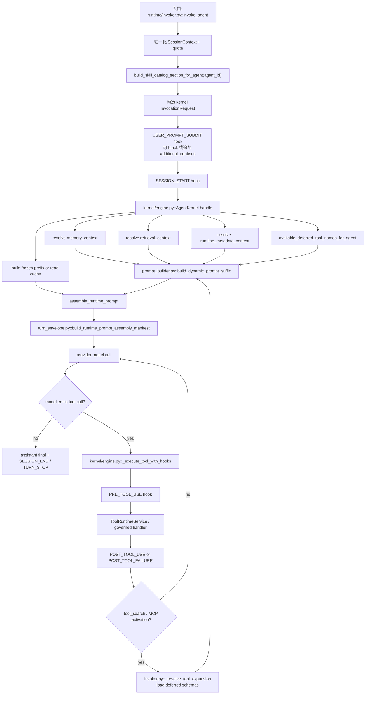

# CCPlus Runtime / Context / Tooling 技术债与一致性清单

日期：2026-07-06  
状态：代码证据版，供一轮完整清债使用  
范围：Agent Session Runtime、上下文组装、工具暴露、Skill / Subagent progressive disclosure、CC 对齐缺口  
非范围：类 Transformer QKV / Attention Router 升级本体。该升级依赖本文清掉的底座债务，但不是本文的替代品。

## 0. 结论

这轮要先清的债务不止 `Package / Pack` 一个。`Package / Pack` 是最明显的命名和兼容债，但真正影响 Runtime 质量的是下面六类：

1. 上下文分类账缺失：没有 CC `/context` 那种按类别统计和解释的 context usage ledger。
2. Tool / Skill / Subagent 的 disclosure 语义还没有统一：工具 schema 展开、Skill 指令加载、Subagent 类型披露、MCP 按需加载分别存在，但没有统一的候选、理由、限制和返回账本。
3. Prompt cache 与动态上下文边界不够干净：部分会变化的 DB / subagent / org / channel 上下文仍混在 frozen prefix 侧，缓存签名覆盖不完整。
4. CC 机制缺口：尤其是 Skill `paths` 条件激活、nested skill discovery、`/context` 可观测分类、on-demand tools 零 token 暴露语义。
5. Agent 周期控制器分散：压缩、Goal continuation、LoopGuard、Plan Mode、Trigger、Workflow、Subagent、Agent Team 都已各自落地，但缺统一的触发、胜负判定、返回限制和下一步动作账本。
6. Codex 工程优化吸收不完整：approval/sandbox decision、compaction lifecycle hook、turn-scoped telemetry、resume/reconciliation 这些优化应作为 CC 语义之上的控制面增强，而不能替代 CC 的 runtime 语义。

这不是要推翻现有 Runtime。现有主链路是对的：

```text
invoke_agent -> USER_PROMPT_SUBMIT hook -> AgentKernel.handle
-> memory / retrieval / runtime metadata / tools / skills resolver
-> frozen prefix + dynamic suffix
-> provider model loop
-> tool execution + PRE/POST hooks
-> prompt rebuild / tool result / spans
```

但在做类 Transformer 升级前，必须把这些底座债务清成一套原子化、可测试、可观测的 contract。

## 1. CC `/context` 暴露哲学

用户给出的 CC `/context` 截图直观显示，CC 并不是把所有材料混成一坨 prompt，而是分成可计量的上下文类别：

| 类别 | 截图含义 | Runtime 哲学 | Hive 当前对应面 |
| --- | --- | --- | --- |
| System prompt | 固定系统行为与基础规则 | 每轮可见，但应可缓存、可计量 | `build_frozen_prompt_prefix()` + provider system prompt |
| System tools | 当前已加载工具 schema | schema 是模型可直接调用的行动边界 | `get_agent_tools_for_llm()` / kernel `tools_for_llm` |
| Custom agents | `.claude/agents/` | 代理类型是可委派能力，不等于普通 prompt 文本 | `subagent_listing.py` / `spawn_subagent` |
| Memory files | `/memory` | 持久记忆是独立类别，不和消息历史混算 | `memory_service.py` / `memory/retriever.py` / dynamic memory section |
| Skills | `/skills` | Skill 是 progressive disclosure 能力胶囊 | `build_skill_catalog_section_for_agent()` / `load_skill` |
| Messages | 当前会话消息 | 对话历史与系统上下文分开计量 | provider messages |
| MCP tools | `/mcp loaded on-demand` | 未加载 schema 不占工具 token，按需发现 | `tool_search` / `discover_resources` / `import_mcp_server` |
| Auto-compact buffer | context reserve | 预留压缩窗口，不挤占真实工作上下文 | kernel compaction budget / context budget |
| Free space | 剩余窗口 | 预算是显式一等对象 | `ContextBudget` 但缺少对外诊断 |

从 FreeCode 源码可确认的 CC 事实：

| CC 机制 | 代码证据 | 语义 |
| --- | --- | --- |
| System context cached per conversation | `/Users/rocky243/vc-saas/free-code-main/src/context.ts:116` `getSystemContext` | git status / cache breaker 等会话级系统上下文可缓存 |
| User context cached per conversation | `/Users/rocky243/vc-saas/free-code-main/src/context.ts:155` `getUserContext` | CLAUDE.md / memory files / current date 单独进入 user context |
| Skill `paths` frontmatter | `/Users/rocky243/vc-saas/free-code-main/src/skills/loadSkillsDir.ts:159` `parseSkillPaths` | Skill 可声明路径触发条件 |
| 条件 Skill 动态激活 | `/Users/rocky243/vc-saas/free-code-main/src/skills/loadSkillsDir.ts:997` `activateConditionalSkillsForPaths` | 读写相关路径后，把 conditional skill 移入 dynamic skills 并通知缓存清理 |

因此，Hive 的对齐目标不是复制 CC UI，而是实现同样的 runtime contract：

```text
每一类上下文都要知道：
来源是什么；
什么时候触发；
为什么入选；
以什么形式暴露给模型；
消耗多少预算；
有哪些权限 / 生命周期限制；
工具调用或上下文变化后返回了什么状态。
```

## 2. Hive 当前 Runtime 原子流程



当前关键代码事实：

| 事实 | 当前代码位置 | 说明 |
| --- | --- | --- |
| Prompt hook 在 durable append 后、model loop 前 | `backend/app/runtime/invoker.py:1220` `invoke_agent` | `USER_PROMPT_SUBMIT` 可 block 或追加 context |
| Skill catalog 当前进入 dynamic suffix | `backend/app/runtime/invoker.py:1256` | 但 ranker 未接当前 query / scenario |
| deferred tool schema 由 `tool_search` 展开 | `backend/app/runtime/invoker.py:816` `_resolve_tool_expansion` | 使用 `discoverable_tool_names_for_query` 和 `get_agent_tools_for_llm(requested_names=...)` |
| dynamic suffix 手写排序 | `backend/app/runtime/prompt_builder.py:510` | Memory、runtime metadata、tool groups、deferred tools、skills、retrieval 等按硬编码顺序拼接 |
| prompt assembly manifest 已有但偏弱 | `backend/app/runtime/turn_envelope.py:247` | 记录 sections 和工具名，但缺 reasons、scores、source hashes、token categories |
| frozen prompt cache 只看 `soul.md` 与 `skills/**` | `backend/app/kernel/engine.py:2044` / `:2085` | 不覆盖 subagent definitions、DB org/channel/team 等动态来源 |
| Tool 执行有 hook 包装 | `backend/app/kernel/engine.py:1473` `_execute_tool_with_hooks` | PRE/POST/FAILURE hook、span、connector source、side effect sink 已存在 |
| `TaskProfile` 仍输出 pack 名 | `backend/app/runtime/context_budget.py:25` / `:281` | `suggested_pack_names` 会驱动 prompt 中的 deferred hint |
| Skill loader 没有 `workflows` / `subagents` 资源目录 | `backend/app/skills/loader.py:11` | 和 Skill capsule 文档能力不一致 |
| Skill parser 解析 `packs`，不解析 `paths` | `backend/app/skills/parser.py:31` | 兼容旧 pack，但缺 CC conditional skill |
| `tool_search` 混合 Skill lexical search 与 deferred schema discovery | `backend/app/services/agent_tool_domains/workspace.py:1098` | 返回文案可用，但不是统一候选 contract |
| `load_skill` 只加载指令，不让 schema callable | `backend/app/services/agent_tool_domains/workspace.py:228` | 这个语义是正确的，需要保留 |

## 3. Tool 调用核心逻辑对照

### 3.1 发现工具

| 原子环节 | CC 期望语义 | Hive 当前实现 | 判定方式 | 返回 / 状态 | 债务 |
| --- | --- | --- | --- | --- | --- |
| Turn-1 system tools | 已加载 system tools 的 schema 直接暴露给模型 | kernel 在 `AgentKernel.handle` 中调用 `_deps.get_tools(agent_id, core_only)` | agent id、core_only、allowed/excluded tool names | `tools_for_llm` provider schemas | 需要进入 context usage ledger，标记为 `system_tools` |
| Deferred tools 列表 | 未加载工具只作为可发现候选，不占 schema token | `available_deferred_tool_names_for_agent()` 进入 dynamic suffix | agent 可达工具 + 非 core | `## Available Deferred Tools` 文本 | token 仍进 prompt，缺少 CC 式“0 schema tokens”诊断 |
| Deferred schema 激活 | 模型明确调用 discovery 工具后才加载 schema | `_resolve_tool_expansion(tool_search)` | `tool_search` query / selector | `ToolExpansionResult.tools` + `active_tool_groups` + event payload | 返回仍叫 `tool_groups` / `packs`，缺统一 reasons |
| MCP 工具激活 | MCP 工具按需加载，未加载时不占 schema token | `_resolve_tool_expansion(discover_resources/import_mcp_server)` | 触发工具名 | 加载 MCP core schemas | 缺 `/context` 中 MCP tools 数量 / token 类别 |
| Skill 发现 | Skill catalog 是方法索引，不等于工具 schema | `build_skill_catalog_section_for_agent()` + `_tool_search()` lexical match | 当前只按 registry / keyword | skill catalog 文本、`load_skill` body | 缺 query-aware ranking、paths 条件激活、selection trace |
| Subagent 发现 | Custom agents 是委派类型，不等于普通工具 | `subagent_listing.py` + `spawn_subagent` | agent / tenant / builtin definitions | prompt listing + tool call | frozen cache 不覆盖 subagent definition 文件 |

### 3.2 判断调用时机

| 原子环节 | CC 期望语义 | Hive 当前实现 | 判定主体 | 限制 |
| --- | --- | --- | --- | --- |
| 模型是否调用工具 | 模型根据 tool schema description、system prompt、上下文自行判断 | provider sees `tools_for_llm` + prompt | 主模型 | 只能调用已加载 schema |
| 是否需要发现 deferred tool | 模型看到 deferred index 后主动 `tool_search` | `Available Deferred Tools` 文本提示 `select:<tool_name>` | 主模型 | selector 文案不是机器可计量 contract |
| 是否允许执行外部动作 | 平台 gate 约束行动，不替代模型思考 | `ToolRuntimeService` + `ActionPreflightService` + hook | 平台 | 权限、风险、owner/company boundary |
| 是否允许 hook 改写 | PRE 可改 args / block，POST 可 rewrite output | `_execute_tool_with_hooks()` | hook registry | hook 结果进入 span，但未统一进入 activation ledger |
| 是否需要 Skill 指令 | 模型显式 `load_skill` | `_load_skill()` 返回 skill body | 主模型 | `load_skill` 不加载工具 schema，这是正确边界 |

### 3.3 调用后返回什么

| 原子环节 | 当前返回 | 当前状态变化 | 缺口 |
| --- | --- | --- | --- |
| 普通工具成功 | `result_str` 回模型 | POST_TOOL_USE、span、connector source、tool outcome | 缺统一 `ToolResultLedger` 把 result category、source refs、context effect 写入 manifest |
| 普通工具失败 | `[Tool execution error] ...` | POST_TOOL_FAILURE、span error | 缺失败对 deferred discovery / future recall 的 structured credit |
| Hook block | `Blocked by hook: reason` | span `blocked_by_hook` | 缺 prompt/context usage 分类 |
| ToolContentEnvelope | normalize 后给模型，side effects 写 sink | new messages / terminal signal 可被 kernel 消费 | 已有基础，但 manifest 不解释其 context effect |
| `tool_search` | 文本结果 + runtime schema delta | `session_context.discovered_tools`，active tool groups，prompt rebuild | 返回字段仍带 pack/tool_group 兼容词，缺 candidate score/reason |
| `load_skill` | skill body + scope guidance | session loaded skills 记录 | 缺 paths / conditional activation，缺 token category |

## 4. 原子技术债清单

### RTD-01：`Package / Pack` 术语仍漏在 Runtime 一线

| 字段 | 内容 |
| --- | --- |
| 触发 | `infer_task_profile()` 输出 `suggested_pack_names`；prompt builder 渲染 `Likely Deferred Tool Groups`；tool expansion 返回 `packs` / `tool_groups` |
| 判定 | 只要 runtime prompt、event payload、manifest、skill metadata 仍使用 pack 作为能力单位，就是债务 |
| 返回影响 | 模型看到过期概念，设计上把 Skill / Capability / Tool Group 混在一起 |
| 代码位置 | `backend/app/runtime/context_budget.py:25`、`:281`；`backend/app/runtime/prompt_builder.py:510`；`backend/app/runtime/invoker.py:816` |
| 一轮修复 | Runtime 公共名改为 `capability_group` / `deferred_tool_group`；数据库和旧 manifest 可保留 compatibility adapter，但 prompt 和新事件不得再出现 `pack` |
| 落地证据 | 2026-07-06：`TaskProfile` 新增 `suggested_deferred_tool_group_names`，旧 `suggested_pack_names` 仅兼容；dynamic prompt 渲染 `web` / `mcp_admin` 这类 deferred tool group label，不再渲染 `web_pack`。验证：`source backend/.venv/bin/activate && pytest backend/tests/runtime/test_context_budget.py backend/tests/runtime/test_prompt_builder.py -q` -> `64 passed, 4 warnings` |

### RTD-02：Pack policy 仍承担 L2 capability policy 的入口名

| 字段 | 内容 |
| --- | --- |
| 触发 | L2 extension tool policy 判断仍依赖 pack policy service / pack catalog 命名 |
| 判定 | 用户或模型看到 pack 作为权限单位，而不是 capability / tool group |
| 返回影响 | 清债后容易出现“UI/DB 是 pack，Runtime 是 capability”的双重真相 |
| 代码位置 | `backend/app/services/pack_policy_service.py`、`backend/app/services/pack_service.py`、`backend/app/tools/runtime_tool_groups.py`、`backend/app/services/governance_capability_taxonomy.py` |
| 一轮修复 | 新增 `capability_group_policy` 语义层，旧 pack storage 仅作为 migration-compatible backing；prompt/API 返回新词 |

2026-07-06 落地证据：新增 `backend/app/services/capability_group_policy_service.py` 作为 Runtime facade；`agent_tools`、`ToolRuntimeService`、`commands.py` 均改为调用 `get_agent_capability_group_policies` / `policy_capability_group_names_for_tool` / `is_capability_group_enabled`；`governance_capability_taxonomy.py` 新增 `taxonomy_policy_capability_group_names_for_tool`，旧 `pack_policy_service` 仅保留为 SystemSetting / plugin 安装存量 backing。验证命令：`source backend/.venv/bin/activate && pytest backend/tests/services/test_capability_group_policy_service.py backend/tests/services/test_pack_policy_service.py backend/tests/tools/test_service.py backend/tests/services/test_agent_tools_core_surface.py backend/tests/services/test_agent_tools.py backend/tests/api/test_cc_codex_parity_api.py -q` -> `97 passed, 4 warnings`；`source backend/.venv/bin/activate && ruff check backend/app/services/capability_group_policy_service.py backend/app/services/agent_tools.py backend/app/tools/service.py backend/app/api/commands.py backend/app/services/governance_capability_taxonomy.py backend/app/services/pack_policy_service.py backend/tests/services/test_capability_group_policy_service.py backend/tests/services/test_agent_tools_core_surface.py backend/tests/services/test_agent_tools.py backend/tests/api/test_cc_codex_parity_api.py` -> `All checks passed!`。

### RTD-03：没有 CC `/context` 等价的 context usage ledger

| 字段 | 内容 |
| --- | --- |
| 触发 | 每次 provider call 组装 prompt 和 tool schemas |
| 判定 | 无法回答 system prompt、system tools、custom agents、memory、skills、messages、MCP、free space 各占多少 |
| 返回影响 | 预算问题只能看总 token 或 prompt preview，无法定位债务和回归 |
| 代码位置 | `backend/app/runtime/turn_envelope.py:247`；`backend/app/kernel/engine.py:3024` 之后 prompt assembly |
| 一轮修复 | 建 `ContextUsageLedger`，从 actual provider prompt、tools_for_llm、message list、manifest sections 统计 category tokens / chars / counts；暴露 debug API 或 session metadata |

2026-07-06 落地证据：`backend/app/runtime/turn_envelope.py` 新增 `build_context_usage_ledger`，在 `prompt_assembly_manifest` 中写入 `context_usage_ledger`，覆盖 `system_prompt`、`system_tools`、`custom_agents`、`memory_files`、`skills`、`messages`、`mcp_tools`、`free_space`；`backend/app/kernel/engine.py` 在真实 prompt assembly 后把 ledger 同步到 `session_context.metadata["context_usage_ledger"]`。验证命令：`source backend/.venv/bin/activate && pytest backend/tests/runtime/test_turn_envelope_prompt_manifest.py backend/tests/runtime/test_invoker.py::test_invoke_agent_writes_prompt_assembly_manifest_from_actual_prompt backend/tests/services/test_session_control_plane.py -q` -> `20 passed, 4 warnings`；`source backend/.venv/bin/activate && ruff check backend/app/runtime/turn_envelope.py backend/app/kernel/engine.py backend/tests/runtime/test_turn_envelope_prompt_manifest.py backend/tests/runtime/test_invoker.py` -> `All checks passed!`。

### RTD-04：Prompt manifest 缺 selection reasons / source hashes

| 字段 | 内容 |
| --- | --- |
| 触发 | `build_runtime_prompt_assembly_manifest()` 只记录 section 名和工具名 |
| 判定 | 任一 memory / skill / tool / retrieval 入选，manifest 无 `why_selected`、`score`、`source_ref`、`hash` |
| 返回影响 | 无法回放“为什么这个上下文被塞进去”，也无法与 Transformer Router 对接 |
| 代码位置 | `backend/app/runtime/turn_envelope.py:247` |
| 一轮修复 | Manifest 加 `context_candidates`、`selected_contexts`、`suppressed_contexts`、`source_hashes`、`budget_decisions` |

2026-07-06 落地证据：`backend/app/runtime/turn_envelope.py` 新增 `build_context_selection_manifest`，`prompt_assembly_manifest` 现在包含 `context_candidates`、`selected_contexts`、`suppressed_contexts`、`source_hashes`、`budget_decisions`；每个候选有稳定 `id`、`kind`、`source_ref`、`source_hash`、`why_selected` / `suppressed_reason`、`budget_key`、`budget_chars`、实际 chars/tokens 与 cacheability。验证命令：`source backend/.venv/bin/activate && pytest backend/tests/runtime/test_turn_envelope_prompt_manifest.py backend/tests/runtime/test_invoker.py::test_invoke_agent_writes_prompt_assembly_manifest_from_actual_prompt backend/tests/services/test_session_control_plane.py -q` -> `21 passed, 4 warnings`；`source backend/.venv/bin/activate && ruff check backend/app/runtime/turn_envelope.py backend/tests/runtime/test_turn_envelope_prompt_manifest.py backend/tests/runtime/test_invoker.py backend/tests/services/test_session_control_plane.py` -> `All checks passed!`。

### RTD-05：ContextEngine artifacts 只覆盖部分动态上下文

| 字段 | 内容 |
| --- | --- |
| 触发 | memory / retrieval / runtime metadata 通过 `DefaultContextEngine.inject()`，其他 prompt sections 手工拼接 |
| 判定 | frozen prefix、skill catalog、active tool groups、deferred tools、subagent listing 没有统一 artifact 记录 |
| 返回影响 | 上下文 provenance 不完整 |
| 代码位置 | `backend/app/runtime/context_engine.py`；`backend/app/runtime/invoker.py` resolvers；`backend/app/runtime/prompt_builder.py:510` |
| 一轮修复 | 所有进入 prompt 的 section 都走 `ContextArtifact` 或等价 builder，不允许裸字符串绕过 manifest |

2026-07-06 落地证据：`backend/app/runtime/context_engine.py` 新增 `record_prompt_manifest_context_artifacts()`，把 `prompt_assembly_manifest.selected_contexts` 回写到现有 `session_context.metadata["context_artifacts"]` 轨道，记录 `candidate_id`、`source`、`content_hash`、chars/tokens、`selection_reason`、cacheability，且不保存原文；`backend/app/kernel/engine.py` 在真实 prompt assembly 后调用该函数，因此 frozen prefix、skill catalog、active/deferred tool groups、MCP refs、hook context、messages 等手工拼接 section 也拥有 artifact provenance。验证命令：`source backend/.venv/bin/activate && pytest backend/tests/runtime/test_context_engine.py backend/tests/runtime/test_runtime_context_composition.py backend/tests/runtime/test_turn_envelope_prompt_manifest.py backend/tests/runtime/test_invoker.py::test_invoke_agent_writes_prompt_assembly_manifest_from_actual_prompt backend/tests/services/test_session_control_plane.py -q` -> `32 passed, 4 warnings`；`source backend/.venv/bin/activate && ruff check backend/app/runtime/context_engine.py backend/app/kernel/engine.py backend/tests/runtime/test_context_engine.py backend/tests/runtime/test_invoker.py` -> `All checks passed!`。

### RTD-06：Frozen prefix 缓存签名覆盖不完整

| 字段 | 内容 |
| --- | --- |
| 触发 | 首轮构造 frozen prefix 后复用缓存 |
| 判定 | prefix 内含会变化的公司、org、channel、A2A、subagent 信息，但 signature 只 fingerprint `soul.md` 和 `skills/**` |
| 返回影响 | agent/company/subagent 改动后，模型可能继续看到旧上下文 |
| 代码位置 | `backend/app/kernel/engine.py:2044`、`:2085`；`backend/app/services/agent_context.py`；`backend/app/runtime/prompt_sections/subagent_listing.py` |
| 一轮修复 | 二选一：把 volatile DB / subagent / A2A section 移到 dynamic suffix；或把其 version/hash 纳入 prompt cache key。优先前者 |

2026-07-06 落地证据：`backend/app/kernel/engine.py` 将 frozen prompt cache schema bump 到 `frozen-v4`；`_build_frozen_prompt_cache_key()` 现在纳入 `standalone_system_prompt_hash`、allowed/excluded tools、`core_tools_only`、`session_context.metadata` 中的 `frozen_context_signature` / channel / company / org / A2A / subagent listing signatures，并把 tenant `enterprise_info_<tenant_id>/org_structure.md` 纳入 workspace signature。验证命令：`source backend/.venv/bin/activate && pytest backend/tests/kernel/test_prompt_cache_integration.py -q` -> `12 passed, 3 warnings`；`source backend/.venv/bin/activate && ruff check backend/app/kernel/engine.py backend/tests/kernel/test_prompt_cache_integration.py` -> `All checks passed!`。

### RTD-07：Subagent definition 不参与缓存失效

| 字段 | 内容 |
| --- | --- |
| 触发 | agent / tenant subagent definitions 变化 |
| 判定 | `_FROZEN_PROMPT_DIRS` 不包含 subagents，且 tenant subagent definitions 不在 workspace signature |
| 返回影响 | `spawn_subagent` 可见类型可能 stale |
| 代码位置 | `backend/app/agents/subagent_definition.py`；`backend/app/runtime/prompt_sections/subagent_listing.py`；`backend/app/kernel/engine.py:2044` |
| 一轮修复 | Subagent listing 进入 dynamic artifact，或显式加 agent + tenant definition version hash |

2026-07-06 落地证据：`backend/app/agents/subagent_definition.py` 新增 `subagent_definition_signature()`，对 agent-level 与 tenant-level definition `.md` 文件做文件级 hash/stat 签名，并包含 builtin 类型列表；`backend/app/kernel/engine.py` 将该 signature 纳入 `_frozen_prompt_runtime_signature()`，支持通过 `session_context.metadata["agent_data_dir"]` 指向测试/运行时数据根。验证命令：`source backend/.venv/bin/activate && pytest backend/tests/kernel/test_prompt_cache_integration.py backend/tests/agents/test_subagent_definition.py backend/tests/agents/test_subagent_scope_resolution.py -q` -> `44 passed, 4 warnings`；`source backend/.venv/bin/activate && ruff check backend/app/kernel/engine.py backend/app/agents/subagent_definition.py backend/tests/kernel/test_prompt_cache_integration.py` -> `All checks passed!`。

### RTD-08：Skill 缺 `paths` 条件激活

| 字段 | 内容 |
| --- | --- |
| 触发 | 文件读写、workspace path 被访问、tool result 指向某路径 |
| 判定 | Skill frontmatter 有路径意图时，Hive parser 不解析，runtime 也不会自动激活 |
| 返回影响 | CC 里会自动出现的相关 skill，在 Hive 里必须靠模型搜索或手动 load，召回弱 |
| CC 对照 | FreeCode `parseSkillPaths()` 与 `activateConditionalSkillsForPaths()` |
| 代码位置 | `backend/app/skills/parser.py:31`；`backend/app/skills/types.py`；`backend/app/kernel/engine.py:1473` 的 file read/write tracking |
| 一轮修复 | `SkillMetadata.paths`；路径 matcher；在 `_execute_tool_with_hooks()` 的 read/write tracking 后触发 conditional skill activation，并刷新 dynamic skill catalog / manifest |

2026-07-06 落地证据：`SkillMetadata` 新增 `paths`；`SkillParser` 解析 `paths` / `path` / `hive.paths`；`SkillRegistry.skills_for_paths()` 支持 POSIX glob 与目录前缀匹配；`backend/app/kernel/engine.py` 新增 `_activate_conditional_skills_for_paths()`，在 `read_file` / `fs_read` 与写路径 tracking 后按访问路径自动激活匹配 skill，并在 `session_context.metadata["conditional_skill_activations"]` 记录 skill、matched_path、patterns、source。验证命令：`source backend/.venv/bin/activate && pytest backend/tests/skills/test_parser_v2.py backend/tests/skills/test_registry.py backend/tests/services/test_skill_registry.py backend/tests/runtime/test_session_skill_lifecycle.py backend/tests/kernel/test_conditional_skill_paths.py -q` -> `35 passed, 4 warnings`；`source backend/.venv/bin/activate && ruff check backend/app/skills/types.py backend/app/skills/parser.py backend/app/skills/registry.py backend/app/kernel/engine.py backend/tests/skills/test_parser_v2.py backend/tests/skills/test_registry.py backend/tests/kernel/test_conditional_skill_paths.py` -> `All checks passed!`。

### RTD-09：Nested skill discovery / additional skill directories 不完整

| 字段 | 内容 |
| --- | --- |
| 触发 | 工作目录或读取文件附近存在额外 skills 目录 |
| 判定 | Hive 只按 agent workspace `skills` registry，不按触达路径发现 nested skill dirs |
| 返回影响 | CC 项目局部 skill 语义缺失 |
| 代码位置 | `backend/app/skills/loader.py`；`backend/app/services/agent_context.py::_load_skills_index`；`backend/app/services/agent_tool_domains/workspace.py::_build_skill_registry` |
| 一轮修复 | 在 agent workspace 内支持 scoped skill dirs；路径触发后纳入 dynamic skills，必须经过同一 SkillGuard / path boundary |

2026-07-06 落地证据：`WorkspaceSkillLoader.load_from_workspace()` 保留根 `skills/` 优先，同时在 workspace 边界内发现 nested `*/skills/`，跳过常见构建/依赖目录并拒绝 workspace 外 symlink 逃逸；`list_resources()` / `read_resource()` 通过同一解析结果支持 nested folder skill，但仍只允许 `references/scripts/templates/assets/evals` 资源目录；`load_skill` 支持按名称加载 nested scoped skill 与按 workspace-relative 显式路径读取，并把 `_is_skill_instruction_file()` 扩展到任意 workspace 内 `*/skills/<slug>/SKILL.md` / `*/skills/<slug>.md`，保证 nested SKILL.md 读取仍执行 managed credential guidance sanitization。验证命令：`source backend/.venv/bin/activate && pytest backend/tests/skills/test_parser_v2.py backend/tests/services/test_skill_registry.py backend/tests/services/test_skill_loading.py backend/tests/kernel/test_conditional_skill_paths.py -q` -> `26 passed, 4 warnings`；`source backend/.venv/bin/activate && ruff check backend/app/skills/loader.py backend/app/services/agent_tool_domains/workspace.py backend/tests/skills/test_parser_v2.py backend/tests/services/test_skill_loading.py` -> `All checks passed!`。

### RTD-10：Skill capsule resource dirs 与文档能力不一致

| 字段 | 内容 |
| --- | --- |
| 触发 | Skill 包含 workflow definitions 或 subagent definitions |
| 判定 | loader 只允许 `references/scripts/templates/assets/evals`，但平台文档说 Skill 可封装 workflow / subagent definitions |
| 返回影响 | 能力胶囊语义不完整，未来升级时会把 workflow/subagent 误放到 prompt 文本 |
| 代码位置 | `backend/app/skills/loader.py:11`；`backend/app/skills/registry.py` catalog 文案 |
| 一轮修复 | 明确允许 `workflows/`、`subagents/` 作为资源目录，但执行仍走 `preview_workflow/start_workflow` 和 `spawn_subagent/delegate_to_agent` |

2026-07-06 落地证据：`backend/app/skills/loader.py` 的 `RESOURCE_DIRS` 纳入 `workflows` 与 `subagents`，`list_resources()` / `read_resource()` 可枚举和读取 skill capsule 内的 workflow/subagent 定义文件，但仍受 skill 根目录与资源目录 allowlist 约束；`backend/app/skills/registry.py` 的 catalog footer 显式列出 `workflows/`、`subagents/`，并声明读取组件文件不会执行，执行必须走 `preview_workflow` / `start_workflow`、`spawn_subagent` / `delegate_to_agent` 或 approved sandbox/code execution。验证命令：`source backend/.venv/bin/activate && pytest backend/tests/skills/test_parser_v2.py backend/tests/skills/test_registry.py backend/tests/services/test_skill_registry.py backend/tests/services/test_prompt_contracts.py::test_core_tool_descriptions_define_when_not_to_use_and_fallbacks -q` -> `23 passed, 4 warnings`；`source backend/.venv/bin/activate && ruff check backend/app/skills/loader.py backend/app/skills/registry.py backend/tests/skills/test_parser_v2.py backend/tests/skills/test_registry.py` -> `All checks passed!`。

### RTD-11：Skill catalog ranking 没吃当前 query / scenario

| 字段 | 内容 |
| --- | --- |
| 触发 | `invoke_agent()` 构造 skill catalog |
| 判定 | `build_skill_catalog_section_for_agent()` 只接 budget profile，不接 latest user query / scenario text |
| 返回影响 | Skill 顺序与当前任务相关性弱 |
| 代码位置 | `backend/app/runtime/invoker.py:1256`；`backend/app/services/skill_catalog_ranker.py`；`backend/app/services/agent_context.py` |
| 一轮修复 | 把当前 prompt、session task profile、路径触发 skill、已加载 skill 状态统一传给 ranker，并写入 manifest reasons |

2026-07-06 落地证据：`backend/app/services/skill_catalog_ranker.py` 新增 `SkillRankingDecision` 与 `rank_skills_for_prompt_with_reasons()`，按 path-trigger、active-in-session、scenario overlap、lifecycle state、usage count 统一排序并产出 reasons；`backend/app/runtime/invoker.py` 新增 `_skill_catalog_ranking_inputs()`，从 latest user prompt、`session_context.metadata["task_profile/current_task/task_context/goal/objective"]`、Plan Mode mirror、`active_skills`、`conditional_skill_activations` 汇总 ranking 输入；`build_skill_catalog_section_for_agent()` / `_load_skills_index()` 接收 scenario、active/path-trigger skill，并把 `skill_catalog_ranking` 与输入摘要写入 session metadata；`backend/app/runtime/turn_envelope.py` 与 `backend/app/kernel/engine.py` 把 ranking payload 写入 `ctx:skill:skill_catalog` manifest candidate / context usage ledger。验证命令：`source backend/.venv/bin/activate && pytest backend/tests/services/test_skill_catalog_ranker.py backend/tests/services/test_skill_registry.py backend/tests/services/test_skill_loading.py backend/tests/runtime/test_invoker.py::test_skill_catalog_ranking_inputs_include_prompt_session_active_and_path_triggers backend/tests/runtime/test_turn_envelope_prompt_manifest.py backend/tests/runtime/test_context_engine.py -q` -> `28 passed, 4 warnings`；`source backend/.venv/bin/activate && ruff check backend/app/services/skill_catalog_ranker.py backend/app/services/agent_context.py backend/app/runtime/invoker.py backend/app/runtime/turn_envelope.py backend/app/kernel/engine.py backend/tests/services/test_skill_catalog_ranker.py backend/tests/runtime/test_invoker.py backend/tests/runtime/test_turn_envelope_prompt_manifest.py` -> `All checks passed!`。

### RTD-12：`tool_search` 同时承担 schema discovery 和 Skill lexical search

| 字段 | 内容 |
| --- | --- |
| 触发 | 模型调用 `tool_search` |
| 判定 | 同一个返回里混合“schema 已加载”和“matching skills”，但两者边界不同 |
| 返回影响 | 模型容易误以为 load_skill 会让工具 callable，或以为 skill 就是 tool group |
| 代码位置 | `backend/app/services/agent_tool_domains/workspace.py:1098`；`backend/app/runtime/invoker.py:816` |
| 一轮修复 | `tool_search` 返回结构分区：`loaded_tool_schemas`、`skill_candidates`、`subagent_candidates`、`mcp_candidates`；文本可保留，但 manifest 必须结构化 |

2026-07-06 落地证据：新增 `backend/app/services/tool_search_manifest.py` 作为共享结构化 discovery manifest，统一生成 `loaded_tool_schemas`、`skill_candidates`、`subagent_candidates`、`mcp_candidates`；`backend/app/services/agent_tool_domains/workspace.py::_tool_search()` 保留原有可读文本，同时追加四段结构化分区，并从 `SkillRegistry` 与 `list_subagent_definitions()` 填充 skill/subagent 候选；`backend/app/runtime/invoker.py::_resolve_tool_expansion()` 在 schema expansion event payload 与 `session_context.metadata["tool_search_manifests"]` 写入同一 manifest，明确 `load_skill` 候选不等于 callable schema。验证命令：`source backend/.venv/bin/activate && pytest backend/tests/tools/test_workspace.py::test_tool_search_returns_structured_discovery_sections backend/tests/runtime/test_invoker.py::test_tool_search_records_discovered_tools_and_returns_deferred_schema backend/tests/runtime/test_invoker.py::test_tool_search_records_compact_requested_tool_alias backend/tests/services/test_mcp_tool_discovery.py::test_tool_search_text_and_schema_agree_on_mcp backend/tests/services/test_prompt_contracts.py::test_core_tool_descriptions_define_when_not_to_use_and_fallbacks -q` -> `5 passed, 4 warnings`；`source backend/.venv/bin/activate && ruff check backend/app/services/tool_search_manifest.py backend/app/services/agent_tool_domains/workspace.py backend/app/runtime/invoker.py backend/tests/tools/test_workspace.py backend/tests/runtime/test_invoker.py` -> `All checks passed!`。

### RTD-13：Deferred tools 的 selector 文案不是稳定机器契约

| 字段 | 内容 |
| --- | --- |
| 触发 | dynamic suffix 渲染 `select:<tool_name>` |
| 判定 | 选择语义只存在提示文本中，没有 `DeferredToolCandidate` contract |
| 返回影响 | 不利于测试、审计和后续 Router 接管 |
| 代码位置 | `backend/app/runtime/prompt_builder.py:510`；`backend/app/services/agent_tools.py` |
| 一轮修复 | 建 `DeferredToolCandidate{name, group, reason, selector, schema_token_cost, risk}`，prompt 从 contract 渲染 |

2026-07-06 落地证据：新增 `backend/app/runtime/deferred_tools.py`，定义 `DeferredToolCandidate{name, group, reason, selector, schema_token_cost, risk}` 与 coercion/payload helper；`backend/app/services/agent_tools.py` 新增 `available_deferred_tool_candidates_for_agent()`，从 discoverable deferred tool names 推导 group/risk/reason/selector contract；`backend/app/kernel/engine.py` 使用 candidate contract 注入 dynamic suffix 与 session metadata；`backend/app/runtime/prompt_builder.py` 从 candidate contract 渲染 `select:<tool>`、group、risk、schema token cost、reason；`backend/app/runtime/turn_envelope.py` 的 `ctx:tools:available_deferred_tools` payload 保存 candidate dict，同时顶层保留 names 兼容。验证命令：`source backend/.venv/bin/activate && pytest backend/tests/runtime/test_prompt_builder.py::test_dynamic_suffix_renders_available_deferred_tools backend/tests/runtime/test_turn_envelope_prompt_manifest.py backend/tests/services/test_mcp_tool_discovery.py::test_select_syntax_directly_discovers_one_deferred_tool backend/tests/runtime/test_invoker.py::test_tool_search_records_discovered_tools_and_returns_deferred_schema -q` -> `7 passed, 4 warnings`；`source backend/.venv/bin/activate && ruff check backend/app/runtime/deferred_tools.py backend/app/runtime/prompt_builder.py backend/app/runtime/turn_envelope.py backend/app/services/agent_tools.py backend/app/kernel/engine.py backend/tests/runtime/test_prompt_builder.py backend/tests/runtime/test_turn_envelope_prompt_manifest.py` -> `All checks passed!`。

### RTD-14：Tool result 对上下文的影响没有统一分类

| 字段 | 内容 |
| --- | --- |
| 触发 | tool 成功、失败、block、rewrite、side effect |
| 判定 | span 有结果，但没有统一说明 result 是 evidence、state change、terminal signal、external ref、context injection 还是 ignored |
| 返回影响 | 工具结果无法系统性反哺召回强度、路径触发 skill、context usage |
| 代码位置 | `backend/app/kernel/engine.py:1473`；`backend/app/tools/service.py`；`backend/app/runtime/hooks.py` |
| 一轮修复 | `ToolResultLedger` 写入 session metadata / invocation spans：`result_kind`、`context_effect`、`source_refs`、`side_effects`、`followup_activation_events` |
| 2026-07-06 落地证据 | 新增 `backend/app/runtime/tool_result_ledger.py`，生成 `hive.tool_result_ledger.v1`；`backend/app/kernel/engine.py::_execute_tool_with_hooks()` 在 success / `blocked_by_hook` / cancelled / error 分支写入 span metadata，并追加到 `session_context.metadata["tool_result_ledger"]`；success 分支复用 `trace_metadata_sink` 的 evidence refs 与 `ToolContentEnvelope` side-effect channel。验证：`source backend/.venv/bin/activate && pytest backend/tests/runtime/test_tool_result_ledger.py backend/tests/kernel/test_engine.py::test_execute_tool_with_hooks_records_tool_result_ledger backend/tests/kernel/test_engine.py::test_execute_tool_with_hooks_writes_trace_metadata_sink_to_span backend/tests/kernel/test_engine.py::test_execute_tool_with_hooks_records_lifecycle_records_in_tool_span -q && ruff check backend/app/runtime/tool_result_ledger.py backend/app/kernel/engine.py backend/tests/runtime/test_tool_result_ledger.py backend/tests/kernel/test_engine.py` -> `5 passed, 4 warnings`，`All checks passed!` |

### RTD-15：Context ordering 是手写拼接，不是候选选择

| 字段 | 内容 |
| --- | --- |
| 触发 | 每次 `build_dynamic_prompt_suffix()` |
| 判定 | Memory、runtime metadata、tools、skills、retrieval 顺序固定，不能解释候选抑制和预算竞争 |
| 返回影响 | 大上下文下无法知道为什么某块被截断或优先 |
| 代码位置 | `backend/app/runtime/prompt_builder.py:510` |
| 一轮修复 | 清债阶段先建立 `ContextSectionCandidate` 和预算 ledger；Transformer 升级阶段由 Activation Router 接管 score |
| 2026-07-06 落地证据 | `backend/app/runtime/prompt_builder.py` 新增 `ContextSectionCandidate`、`_select_context_section_candidates()` 和 `hive.ccplus.context_section_candidate.v1` 决策记录；`build_dynamic_prompt_suffix()` 改为先收集 memory / runtime / permissions / tools / skills / knowledge / suffix / environment 候选，再由选择器输出最终 suffix，保留原有渲染顺序。`backend/app/kernel/engine.py` 在 cache-hit/cache-cold 两条主 provider-call 路径传入 `dynamic_context_section_ledger`，并写入 `prompt_assembly_manifest["dynamic_context_section_ledger"]` 与 `session_context.metadata["dynamic_context_section_ledger"]`。验证：`source backend/.venv/bin/activate && pytest backend/tests/runtime/test_prompt_builder.py::test_dynamic_suffix_records_context_candidate_selection_ledger backend/tests/runtime/test_invoker.py::test_invoke_agent_writes_prompt_assembly_manifest_from_actual_prompt backend/tests/runtime/test_prompt_builder.py -q` -> `51 passed, 4 warnings`；`ruff check backend/app/runtime/prompt_builder.py backend/app/kernel/engine.py backend/tests/runtime/test_prompt_builder.py backend/tests/runtime/test_invoker.py` -> `All checks passed!` |

### RTD-16：`RuntimeContext` 还不是真实汇流点

| 字段 | 内容 |
| --- | --- |
| 触发 | Runtime 组装上下文、工具、session metadata |
| 判定 | 实际仍是 `InvocationRequest + SessionContext.metadata + DefaultContextEngine + prompt_builder` 多点传递 |
| 返回影响 | 插入 QKV / context ledger 时会继续散落 |
| 代码位置 | `backend/app/runtime/context.py`；`backend/app/runtime/invoker.py`；`backend/app/kernel/engine.py` |
| 一轮修复 | 不大改调用栈，但在现有 request/session 上挂一个 `RuntimeAssemblyState`，成为 context/tool/skill/retrieval 的单一账本对象 |
| 2026-07-06 落地证据 | `backend/app/runtime/context.py` 新增 `RuntimeAssemblyState` 与 `ensure_runtime_assembly_state()`，schema 为 `hive.ccplus.runtime_assembly_state.v1`；`SessionContext` 增加 runtime-only `runtime_assembly_state` 引用，metadata 只保存可序列化 read model。`backend/app/runtime/tool_result_ledger.py` 的工具结果写入、`backend/app/kernel/engine.py` 的 deferred tool candidates / prompt manifest 写入、`backend/app/runtime/invoker.py` 的 skill catalog ranking 写入均通过该汇流点同步，同时保留旧顶层 metadata 镜像。验证：`source backend/.venv/bin/activate && pytest backend/tests/runtime/test_runtime_context_composition.py backend/tests/runtime/test_tool_result_ledger.py backend/tests/runtime/test_invoker.py::test_skill_catalog_ranking_inputs_include_prompt_session_active_and_path_triggers -q` -> `13 passed, 4 warnings`；`ruff check backend/app/runtime/context.py backend/app/runtime/session.py backend/app/runtime/tool_result_ledger.py backend/app/kernel/engine.py backend/app/runtime/invoker.py backend/tests/runtime/test_runtime_context_composition.py backend/tests/runtime/test_invoker.py backend/tests/kernel/test_engine.py` -> `All checks passed!` |

### RTD-17：Memory / Retrieval / Tool / Skill 候选没有统一 ID 空间

| 字段 | 内容 |
| --- | --- |
| 触发 | 任意候选进入 prompt 或 schema list |
| 判定 | memory refs、retrieval source items、tool names、skill names、subagent types 各自有 ID，无统一 `candidate_id` |
| 返回影响 | 无法做跨层排序、反馈归因、回放 |
| 代码位置 | `memory/retriever.py`、`memory/wiki_retrieval.py`、`runtime/invoker.py`、`services/agent_tools.py`、`skills/registry.py` |
| 一轮修复 | `ContextCandidateRef`：`kind:id:version/hash`，先用于 manifest，不改变存储真相 |
| 2026-07-06 落地证据 | 新增 `backend/app/runtime/context_candidates.py`，提供 `ContextCandidateRef` 与 `build_context_candidate_ref()`，统一生成 `hive.ccplus.context_candidate_ref.v1`。`backend/app/runtime/turn_envelope.py` 在 prompt manifest 中为 `context_candidates` 增加 `candidate_ref`，并新增 `context_candidate_refs`、`skill_candidate_refs`、`tool_candidate_refs`；`available_deferred_tool_candidates` 每项也携带 `candidate_ref`。`backend/app/runtime/prompt_builder.py` 的动态 section ledger 同步携带统一 ref，旧 `id` / `candidate_id` 均保留为兼容字段。验证：`source backend/.venv/bin/activate && pytest backend/tests/runtime/test_context_candidate_ref.py backend/tests/runtime/test_turn_envelope_prompt_manifest.py backend/tests/runtime/test_prompt_builder.py::test_dynamic_suffix_records_context_candidate_selection_ledger backend/tests/runtime/test_invoker.py::test_invoke_agent_writes_prompt_assembly_manifest_from_actual_prompt -q` -> `8 passed, 4 warnings`；`ruff check backend/app/runtime/context_candidates.py backend/app/runtime/turn_envelope.py backend/app/runtime/prompt_builder.py backend/tests/runtime/test_context_candidate_ref.py backend/tests/runtime/test_prompt_builder.py backend/tests/runtime/test_turn_envelope_prompt_manifest.py backend/tests/runtime/test_invoker.py` -> `All checks passed!` |

### RTD-18：没有 CC `/context` 式用户可见诊断入口

| 字段 | 内容 |
| --- | --- |
| 触发 | 用户或调试工具请求当前 context 状态 |
| 判定 | 只能看日志 / manifest，不能像 CC 一样看到类别、文件数、工具数、token 估算 |
| 返回影响 | context debt 会继续隐形 |
| 代码位置 | `backend/app/api/chat_sessions.py` 或 runtime debug API；`frontend/src/pages/agent-detail` 右侧 runtime console |
| 一轮修复 | 后端提供 `GET /api/chat-sessions/{id}/context-usage` 或 session event；前端可先只显示调试面板 |
| 2026-07-06 落地证据 | `backend/app/api/chat_sessions.py` 新增 `GET /agents/{agent_id}/sessions/{session_id}/context-usage`，权限复用 `_get_run_session_and_agent()`；返回 `hive.ccplus.session_context_usage.v1`，包含 `categories`、token/free-space、context candidates、selected/suppressed contexts、dynamic context sections、tool result ledger、active/deferred tools、loaded skills 与 counts。数据读取面为 `ChatSession.transcript_metadata_json["runtime_assembly_state"]` / `prompt_assembly_manifest` / `context_usage_ledger` 的持久化 read model。验证：`source backend/.venv/bin/activate && pytest backend/tests/api/test_chat_sessions_permissions.py::test_get_session_context_usage_returns_context_diagnostics backend/tests/api/test_chat_sessions_permissions.py::test_get_session_messages_allows_manage_access_for_non_owner backend/tests/api/test_chat_sessions_permissions.py::test_get_session_transcript_returns_replayable_events -q` -> `3 passed, 3 warnings`；`ruff check backend/app/api/chat_sessions.py backend/tests/api/test_chat_sessions_permissions.py` -> `All checks passed!` |

### RTD-19：on-demand MCP / deferred tools 的 token 语义不够清楚

| 字段 | 内容 |
| --- | --- |
| 触发 | 大量 deferred / MCP tools 可达时 |
| 判定 | CC 截图显示 MCP tools 数量可见但 schema token 为 0；Hive 现在会把最多 40 个 deferred names 写进 prompt |
| 返回影响 | 可达工具多时会占 prompt token，并模糊“列表 token”和“schema token” |
| 代码位置 | `backend/app/runtime/prompt_builder.py:510`；`backend/app/runtime/turn_envelope.py:247` |
| 一轮修复 | Ledger 区分 `deferred_tool_index_tokens` 和 `loaded_tool_schema_tokens`；prompt 列表按 budget / relevance 渲染，其余只进 manifest count |
| 2026-07-06 落地证据 | `backend/app/runtime/prompt_builder.py` 新增 `_render_deferred_tool_index()`，按 `active_tool_groups_budget_chars` 预算逐行渲染 deferred tool index，并保留 `(+N more available in manifest)` 说明，避免固定塞入前 40 个候选。`backend/app/runtime/turn_envelope.py::build_context_usage_ledger()` 新增 `deferred_tool_index` category，并在 ledger 顶层区分 `deferred_tool_index_tokens` 与 `loaded_tool_schema_tokens`，后者由已加载 system/MCP tool schema token 汇总而非重复 category 计数；完整 deferred 候选仍保留在 prompt manifest。验证：`source backend/.venv/bin/activate && pytest backend/tests/runtime/test_prompt_builder.py backend/tests/runtime/test_turn_envelope_prompt_manifest.py backend/tests/runtime/test_context_candidate_ref.py -q` -> `57 passed, 4 warnings`；`ruff check backend/app/runtime/prompt_builder.py backend/app/runtime/turn_envelope.py backend/tests/runtime/test_prompt_builder.py backend/tests/runtime/test_turn_envelope_prompt_manifest.py backend/tests/runtime/test_context_candidate_ref.py` -> `All checks passed!` |

### RTD-20：Hook additional contexts 没有统一优先级与预算理由

| 字段 | 内容 |
| --- | --- |
| 触发 | `USER_PROMPT_SUBMIT` hook 返回 `additional_contexts` |
| 判定 | 追加到 `system_prompt_suffix`，但没有与 memory/retrieval/skill 统一竞争预算 |
| 返回影响 | hook context 可能挤掉更重要的上下文，或者理由不可见 |
| 代码位置 | `backend/app/runtime/invoker.py:1220`；`backend/app/runtime/prompt_builder.py:510` |
| 一轮修复 | Hook contexts 进入 `ContextSectionCandidate(kind=hook_context)`，有 priority、source、budget cap、manifest reason |
| 2026-07-06 落地证据 | `backend/app/runtime/prompt_builder.py` 的 `ContextSectionCandidate` 增加 `source_ref` 与 `reason`；当 `system_prompt_suffix` 以 `## Hook Additional Context` 开头时，动态 suffix 不再把它记作普通 suffix，而是记录为 `kind=hook_context`、`source_ref=hook:user_prompt_submit`、`reason=hook_additional_context`、`budget_key=hook_context_chars` 的候选，最终 prompt 文本保持兼容。`backend/app/runtime/turn_envelope.py` 中 `ctx:hook:additional_context` 的 manifest kind 同步为 `hook_context` 并携带 `hook_context_chars` budget key。验证：`source backend/.venv/bin/activate && pytest backend/tests/runtime/test_prompt_builder.py backend/tests/runtime/test_turn_envelope_prompt_manifest.py backend/tests/runtime/test_invoker_cc_hooks.py -q` -> `58 passed, 4 warnings`；`ruff check backend/app/runtime/prompt_builder.py backend/app/runtime/turn_envelope.py backend/tests/runtime/test_prompt_builder.py backend/tests/runtime/test_turn_envelope_prompt_manifest.py backend/tests/runtime/test_invoker_cc_hooks.py` -> `All checks passed!` |

## 4A. Agent 周期补充技术债清单

这组债务不是说这些能力没有落地。相反，当前代码里已经能看到各自的闭环：

| 能力 | 当前已落地 | 主要代码事实 | 仍缺什么 |
| --- | --- | --- | --- |
| KV / prompt cache / 压缩 | 有 frozen prefix cache、prompt assembly manifest、tool result budget、preflight autocompact、compaction spans | `kernel/engine.py::_build_frozen_prompt_cache_key`、`runtime/session_context_controller.py::prepare_session_context_for_request` | 没有把 cache 命中/失效、压缩触发、压缩结果统一进入 `/context` 分类账和 RuntimeDecisionLedger |
| LoopGuard | 有 total/failed/identical/repeated text 的 warn/abort | `kernel/loop_guard.py::LoopGuard`、`kernel/engine.py::_inject_loop_guard_warning`、`_abort_for_loop_guard` | 没有统一“赢/输/继续/暂停”的 terminal decision matrix |
| Goal continuation | 有 post-turn bridge、预算/次数/plan mode/pending input 判定 | `services/session_goal_runtime.py::should_continue_goal`、`services/goal_continuation_service.py` | Goal 成功/失败/blocked/budget limited 与 runtime terminal reason 没有统一账本 |
| Plan Mode / Schedule | 自然语言 schedule 会交回 agent 起草；启用 autonomous wake 要 confirmed plan 或可信 decline | `api/commands.py::_execute_schedule_command`、`services/plan_mode_core.py`、`services/plan_mode_gate.py` | command、plan、trigger、runtime task 的判定分散，用户看不到统一原因链 |
| Trigger / Loop wake | daemon 每 15 秒评估 trigger，合并 wake，创建 RuntimeTask/BudgetRun | `services/trigger_daemon.py` | wake 被触发、跳过、失败退避、预算拒绝没有进入同一 runtime 决策分类 |
| Dynamic Workflow | `propose_dynamic_workflow -> preview_workflow -> start_workflow`，start 要 session 和 preview/candidate hash | `tools/handlers/workflow.py`、`runtime/dynamic_workflow.py`、`services/workflow_launch.py` | proposal / preview / start / repair / completion wake 没有进入统一 candidate/decision ledger |
| Agent Team | `team_create` 是 container，teammate 通过 `spawn_subagent team_name + name` 创建并投影 completion | `services/agent_team_runtime_service.py`、`api/agent_teams.py`、`tools/handlers/subagent.py` | Team container、member session、parent wake、workbench projection 缺统一上下文用量和胜负判定 |
| Background subagent | background 走 durable `RuntimeTask(subagent_run)`，worker dispatch，可 resume/reconcile/cancel | `tools/handlers/subagent.py`、`services/subagent_run_service.py` | same-session subagent 与 background subagent 的返回/唤醒/reconciliation contract 没有在 prompt manifest 中一等化 |
| 权限与异常 | ToolRuntimeService、ActionPreflight、Plan Gate、permission profile、RuntimeControlBus 都存在 | `tools/service.py`、`services/action_preflight.py`、`tools/plan_gate_registry.py`、`services/runtime_control_bus.py` | “失败后继续、暂停、告知用户、等待确认、终止”的判定缺集中矩阵 |

### RTD-21：KV Cache 与 prompt cache 语义没有明确分层

| 字段 | 内容 |
| --- | --- |
| 触发 | 每次 provider call、compact、fork/subagent、dynamic suffix 变化 |
| 判定 | 文档或 runtime 把“模型内部 KV Cache”和“外部 prompt/prefix cache”混说，或 manifest 不能解释 cache key / invalidation reason |
| 返回影响 | 优化方向会跑偏：我们不能控制模型内部 KV Cache，只能控制 prompt cache / prefix cache / cache-safe params / cache editing 类外围策略 |
| 代码位置 | `backend/app/kernel/engine.py::_build_frozen_prompt_cache_key`；`backend/app/runtime/prompt_builder.py::_meter_frozen_prefix`；FreeCode 对照 `src/services/compact/compact.ts::streamCompactSummary`、`src/tools/AgentTool/forkSubagent.ts` |
| 一轮修复 | 新增 `CacheDecisionLedger` 或纳入 `RuntimeDecisionLedger`：记录 `cache_surface=prompt_prefix|provider_prompt_cache|cache_editing|none`、`cache_key_hash`、`hit/miss/invalidated`、`invalidation_reason`、`shared_with_parent` |
| 2026-07-06 落地证据 | 新增 `backend/app/runtime/cache_decision_ledger.py`，生成 `hive.ccplus.cache_decision.v1`，只暴露 `cache_key_hash` 且原始 key 标记为 `[redacted]`。`RuntimeAssemblyState` 增加 `cache_decision_ledger` 并镜像到 session metadata。`backend/app/kernel/engine.py` 在 prompt prefix cache hit/miss 和 `_invalidate_prompt_prefix_cache()` 的 invalidated 分支写入 `cache_surface=prompt_prefix`、`decision`、`invalidation_reason`、`shared_with_parent`。验证：`source backend/.venv/bin/activate && pytest backend/tests/runtime/test_runtime_context_composition.py backend/tests/kernel/test_engine.py::test_execute_tool_with_hooks_tracks_filesystem_facade_events backend/tests/kernel/test_prompt_cache_integration.py::test_kernel_rebuilds_frozen_prefix_when_prompt_cache_key_changes -q` -> `13 passed, 4 warnings`；`ruff check backend/app/runtime/context.py backend/app/runtime/cache_decision_ledger.py backend/app/kernel/engine.py backend/tests/runtime/test_runtime_context_composition.py backend/tests/kernel/test_engine.py` -> `All checks passed!` |

### RTD-22：压缩触发有事件，但未进入统一 RuntimeDecisionLedger

| 字段 | 内容 |
| --- | --- |
| 触发 | `prepare_session_context_for_request()` 达到 CC fixed-buffer autocompact threshold；或 tool result budget 先裁剪 |
| 判定 | `context_window_status`、`tool_result_budget_pass`、`compaction_started/completed/skipped` 已发事件，但没有成为与 Goal/Loop/Trigger 同一层的 runtime decision |
| 返回影响 | `/context` 能看到 token，但看不到“为什么先裁剪工具结果、为什么压缩、压缩后是否仍可继续” |
| 代码位置 | `backend/app/runtime/session_context_controller.py:252`；`backend/app/kernel/engine.py:3662` |
| 一轮修复 | 每次压缩写 `RuntimeDecisionEntry(kind=compaction)`：trigger、threshold、before/after tokens、tool_result_trimmed、status、next_action |
| 2026-07-06 落地证据 | 新增 `backend/app/runtime/runtime_decision_ledger.py`，定义 `hive.ccplus.runtime_decision.v1`；`RuntimeAssemblyState` 增加 `runtime_decision_ledger` 并镜像到 session metadata。`prepare_session_context_for_request()` 现在在 `tool_result_budget_pass`、`compaction_skipped`、`compaction_started`、`compaction_completed` 中写入 `RuntimeDecisionEntry(kind=compaction)`，包含 `trigger`、`threshold`、`before/after_tokens`、`tool_result_trimmed`、`status`、`next_action`。`backend/app/kernel/engine.py::_emit_context_decision_event()` 将事件中的 `runtime_decision_entry` 落入 assembly state。Red：`pytest backend/tests/runtime/test_session_context_controller.py::test_prepare_session_context_emits_skipped_reason_when_below_threshold backend/tests/runtime/test_session_context_controller.py::test_prepare_session_context_compresses_when_cc_threshold_reached -q` -> `2 failed`，失败原因为缺少 `runtime_decision_entry`；`pytest backend/tests/runtime/test_runtime_context_composition.py::test_runtime_decision_ledger_mirrors_into_runtime_assembly_state -q` -> `ModuleNotFoundError`。Green：`pytest backend/tests/runtime/test_session_context_controller.py::test_prepare_session_context_records_tool_result_budget_runtime_decision backend/tests/runtime/test_session_context_controller.py::test_prepare_session_context_emits_skipped_reason_when_below_threshold backend/tests/runtime/test_session_context_controller.py::test_prepare_session_context_compresses_when_cc_threshold_reached backend/tests/runtime/test_runtime_context_composition.py::test_runtime_decision_ledger_mirrors_into_runtime_assembly_state -q` -> `4 passed, 4 warnings`。回归：`pytest backend/tests/runtime/test_session_context_controller.py backend/tests/runtime/test_runtime_context_composition.py backend/tests/kernel/test_session_context_controller_integration.py -q` -> `20 passed, 4 warnings`；`ruff check backend/app/runtime/session_context_controller.py backend/app/runtime/context.py backend/app/runtime/runtime_decision_ledger.py backend/app/kernel/engine.py backend/tests/runtime/test_session_context_controller.py backend/tests/runtime/test_runtime_context_composition.py` -> `All checks passed!` |

### RTD-23：Tool result budget 只裁剪消息，没有产出可解释的 context effect

| 字段 | 内容 |
| --- | --- |
| 触发 | 工具结果总字符数或单条结果超过 policy |
| 判定 | `ToolResultBudgetPass` 只记录 trimmed count / call ids，不知道被裁剪结果属于 evidence、large file、external fetch、failed output 还是 terminal signal |
| 返回影响 | 主模型可能丢失关键证据；用户也看不到裁剪影响 |
| 代码位置 | `backend/app/runtime/session_context_controller.py::apply_tool_result_budget`；`backend/app/kernel/engine.py` 的 `tool_result_exempt_names` |
| 一轮修复 | 与 `ToolResultLedger` 合并：裁剪前先分类 result_kind/context_effect/source_refs；裁剪后保留可追溯 preview 和 reload pointer |
| 2026-07-06 落地证据 | `ToolResultBudgetPass` 增加 `trimmed_context_effects`，每条被裁剪工具结果先从 assistant `tool_calls` 恢复 `tool_name/tool_args`，再复用 `ToolResultLedger` 的 `build_tool_result_ledger_entry()` 分类出 `result_kind`、`context_effect`、`source_refs`。裁剪事件和 RTD-22 的 `RuntimeDecisionEntry.details` 都带 `trimmed_context_effects`，包含 `preview`、`preview_truncated`、`reload_pointer={kind=conversation_tool_result,message_index,tool_call_id}`、before/after chars。Red：`pytest backend/tests/runtime/test_session_context_controller.py::test_tool_result_budget_pass_compacts_oldest_non_exempt_tool_results backend/tests/runtime/test_session_context_controller.py::test_prepare_session_context_records_tool_result_budget_runtime_decision -q` -> `2 failed`，失败原因为 `ToolResultBudgetPass` 无 `trimmed_context_effects` 且 runtime decision details 缺失该字段。Green：同命令 -> `2 passed, 4 warnings`。回归：`pytest backend/tests/runtime/test_session_context_controller.py backend/tests/kernel/test_session_context_controller_integration.py -q` -> `8 passed, 4 warnings`；`ruff check backend/app/runtime/session_context_controller.py backend/tests/runtime/test_session_context_controller.py` -> `All checks passed!` |

### RTD-24：LoopGuard 缺统一胜负判定矩阵

| 字段 | 内容 |
| --- | --- |
| 触发 | total tool calls、连续失败、相同参数重复、助手重复文本 |
| 判定 | 当前有 warn 和 abort，但“这是输、暂停、需要用户继续、还是工具预算耗尽”分散在 `_abort_for_loop_guard()` |
| 返回影响 | Goal continuation、workflow repair、background subagent completion 无法消费同一个 loop outcome |
| 代码位置 | `backend/app/kernel/loop_guard.py`；`backend/app/kernel/engine.py::_abort_for_loop_guard` |
| 一轮修复 | 定义 `RuntimeOutcome{status=won|lost|paused|blocked|budget_limited|needs_user, terminal_reason, next_action}`，LoopGuard 只产出结构化 outcome，渲染文案由上层统一 |
| 2026-07-06 落地证据 | 新增 `backend/app/runtime/outcome.py::RuntimeOutcome`，schema 为 `hive.ccplus.runtime_outcome.v1`。`LoopGuardDecision` 增加 `outcome`，`LoopGuard._decision()` 统一产出矩阵：warn -> `status=paused,next_action=self_correct_and_continue`；`total_tool_calls` abort -> `status=budget_limited,terminal_reason=tool_budget,next_action=ask_user_to_continue`；其他 non-progress abort -> `status=blocked,terminal_reason=loop_guard,next_action=stop_and_report_non_progress`。`trace_event.runtime_outcome` 同步暴露该结构；`backend/app/kernel/engine.py::_abort_for_loop_guard()` 改为消费 outcome 的 `terminal_reason`，用户文案仍由 engine 渲染。Red：`pytest backend/tests/kernel/test_loop_guard.py::test_loop_guard_total_tool_budget_abort_has_runtime_outcome backend/tests/kernel/test_loop_guard.py::test_loop_guard_non_progress_abort_has_blocked_runtime_outcome -q` -> `2 failed`，失败原因为 `LoopGuardDecision` 无 `outcome`。Green：同命令 -> `2 passed, 4 warnings`。回归：`pytest backend/tests/kernel/test_loop_guard.py -q` -> `11 passed, 4 warnings`；`ruff check backend/app/runtime/outcome.py backend/app/kernel/loop_guard.py backend/app/kernel/engine.py backend/tests/kernel/test_loop_guard.py` -> `All checks passed!` |

### RTD-25：Goal continuation 缺成功/失败/预算/blocked 的闭环归因

| 字段 | 内容 |
| --- | --- |
| 触发 | 普通 `web_chat_turn` terminal 后 `_maybe_continue_goal_after_terminal_turn()` |
| 判定 | `should_continue_goal()` 能判断 active/status/plan/pending/active_run/token/turn cap，但不会判断上一轮是否真正推进 objective |
| 返回影响 | 可能出现“继续了很多轮但没有赢/输归因”，或者 budget limited 只是 metadata，不进入用户可见 runtime 状态 |
| 代码位置 | `backend/app/services/session_goal_runtime.py`；`backend/app/services/goal_continuation_service.py`；`backend/app/services/web_chat_runtime.py` |
| 一轮修复 | Goal 每轮写 `GoalDecisionEntry`：previous_terminal_reason、progress_evidence、continue_reason、stop_reason、status_transition、user_visible_next_action |
| 2026-07-06 落地证据 | `backend/app/services/session_goal_runtime.py` 新增 `GoalDecisionEntry(schema=hive.ccplus.goal_decision.v1)` 和 `build_goal_decision_entry()`。`should_continue_goal()` 现在接收 `previous_terminal_reason`，并统一判定：`tool_budget -> usage_limited/ask_user_to_continue`，`loop_guard/provider_error/turn_abort -> blocked`，`clarification_required -> paused`，`user_cancel -> cancelled`。`backend/app/services/goal_continuation_service.py` 每轮 append `goal_decision_ledger` 并写 `last_goal_decision_entry`，包含 `previous_terminal_reason`、`progress_evidence`、`continue_reason`、`stop_reason`、`status_transition`、`user_visible_next_action`；bridge 从 web chat runtime metadata 提取 `terminal_reason`、artifact/file evidence。Red：`pytest backend/tests/services/test_goal_continuation_service.py::test_continue_session_goal_starts_goal_continuation_run backend/tests/services/test_goal_continuation_service.py::test_continue_session_goal_marks_budget_limited_without_starting_run backend/tests/services/test_goal_continuation_service.py::test_continue_session_goal_records_previous_tool_budget_as_usage_limited -q` -> `3 failed`，失败原因为无 `goal_decision_ledger` 且 `continue_session_goal()` 无 `previous_terminal_reason` 入参。Green：同命令 -> `3 passed, 3 warnings`。回归：`pytest backend/tests/services/test_goal_continuation_service.py backend/tests/services/test_cc_codex_parity_substrate.py::test_session_goal_continuation_rules_are_event_driven_and_budgeted backend/tests/services/test_web_chat_runtime.py::test_completed_user_turn_bridges_to_goal_continuation -q` -> `7 passed, 3 warnings`；`ruff check backend/app/services/session_goal_runtime.py backend/app/services/goal_continuation_service.py backend/app/services/web_chat_runtime.py backend/tests/services/test_goal_continuation_service.py` -> `All checks passed!` |

### RTD-26：异常处理没有全局 continue / pause / stop 判定层

| 字段 | 内容 |
| --- | --- |
| 触发 | provider error、tool failure、hook block、preflight deny、workflow leaf failure、subagent replay blocker、trigger preflight skip |
| 判定 | 各模块各自返回 JSON error / RuntimeTask status / assistant text / event |
| 返回影响 | 主 agent 不知道哪些失败应该继续尝试，哪些必须告知用户，哪些需要等待确认或人工 reconciliation |
| 代码位置 | `kernel/engine.py`、`tools/service.py`、`services/workflow_runtime_service.py`、`services/subagent_run_service.py`、`services/trigger_daemon.py` |
| 一轮修复 | 建 `RuntimeFailurePolicy`：`retryable`、`side_effect_risk`、`requires_user`、`requires_reconciliation`、`safe_to_continue`、`model_visible_summary`；所有 runtime controller 都输出同一字段 |
| 2026-07-06 落地证据 | 新增 `backend/app/runtime/failure_policy.py::build_runtime_failure_policy()`，schema 为 `hive.ccplus.runtime_failure_policy.v1`，统一输出 `retryable`、`side_effect_risk`、`requires_user`、`requires_reconciliation`、`safe_to_continue`、`model_visible_summary`。已接入 `backend/app/kernel/engine.py::_execute_tool_with_hooks()` 的 `tool_failure`、`hook_block`、`cancelled` 分支：span metadata 写 `runtime_failure_policy`，tool ledger `side_effects.runtime_failure_policy` 同步写同一结构；已接入 `backend/app/services/trigger_failure_policy.py::apply_trigger_failure_policy()`，返回和 trigger config 都写 `runtime_failure_policy`。Red：`pytest backend/tests/runtime/test_failure_policy.py backend/tests/kernel/test_engine.py::test_execute_tool_with_hooks_records_runtime_failure_policy_on_error -q` -> `3 failed`，失败原因为缺 `app.runtime.failure_policy` 且 span metadata 无 policy；`pytest backend/tests/services/test_trigger_failure_policy.py::test_trigger_failure_policy_returns_runtime_failure_policy -q` -> `1 failed`，失败原因为返回缺 `runtime_failure_policy`。Green/回归：`pytest backend/tests/runtime/test_failure_policy.py backend/tests/services/test_trigger_failure_policy.py backend/tests/kernel/test_engine.py::test_execute_tool_with_hooks_records_runtime_failure_policy_on_error backend/tests/kernel/test_engine.py::test_execute_tool_with_hooks_records_runtime_failure_policy_on_hook_block backend/tests/kernel/test_engine.py::test_execute_tool_with_hooks_records_tool_result_ledger -q` -> `6 passed, 4 warnings`；`ruff check backend/app/runtime/failure_policy.py backend/app/kernel/engine.py backend/app/services/trigger_failure_policy.py backend/tests/runtime/test_failure_policy.py backend/tests/kernel/test_engine.py backend/tests/services/test_trigger_failure_policy.py` -> `All checks passed!` |

### RTD-27：Plan Mode、Schedule、Trigger 的判定链不可一眼回放

| 字段 | 内容 |
| --- | --- |
| 触发 | `/schedule`、`schedule_once`、`set_trigger`、confirmed plan handoff、trusted decline |
| 判定 | command surface、PlanModeGate、plan metadata、trigger daemon preflight 各自判定 |
| 返回影响 | 很难回答“为什么这次可以启用自动 wake、为什么这次只是起草、为什么这次 fail closed” |
| 代码位置 | `backend/app/api/commands.py::_execute_schedule_command`；`backend/app/services/plan_mode_core.py`；`backend/app/services/plan_mode_gate.py`；`backend/app/services/trigger_daemon.py` |
| 一轮修复 | `ScheduleDecisionEntry` 串起 command_origin、natural_vs_structured、plan_gate_decision、confirmed_plan_ref、trigger_id、next_fire、runtime_task_id |
| 2026-07-06 落地证据 | 新增 `backend/app/runtime/schedule_decision_ledger.py::build_schedule_decision_entry()`，schema 为 `hive.ccplus.schedule_decision.v1`，字段覆盖 `command_origin`、`natural_vs_structured`、`plan_gate_decision`、`confirmed_plan_ref`、`trigger_id`、`next_fire`、`runtime_task_id`。`backend/app/api/commands.py::_execute_schedule_command()` 的自然语言草稿路径返回 `schedule_decision_entry(reason=draft_with_agent_before_enable)`；结构化 `/schedule`/`/once` 创建路径把 entry 写入返回 payload、session event metadata、trigger config。`backend/app/services/agent_tool_domains/triggers.py::_handle_set_trigger()` 创建/重启 trigger 时把同 schema 写入 trigger config。Red：`pytest backend/tests/runtime/test_schedule_decision_ledger.py::test_build_schedule_decision_entry_links_command_plan_trigger_and_run -q` -> `1 failed`，失败原因为缺 `app.runtime.schedule_decision_ledger`。Green：`pytest backend/tests/runtime/test_schedule_decision_ledger.py -q` -> `1 passed, 4 warnings`。回归：`pytest backend/tests/services/test_plan_mode_e2e.py -q` -> `6 passed, 4 warnings`；`ruff check backend/app/runtime/schedule_decision_ledger.py backend/app/api/commands.py backend/app/services/agent_tool_domains/triggers.py backend/tests/runtime/test_schedule_decision_ledger.py` -> `All checks passed!` |

### RTD-28：Trigger wake 的上下文注入和预算归因不完整

| 字段 | 内容 |
| --- | --- |
| 触发 | trigger daemon 评估 cron/once/interval/poll/on_message/webhook |
| 判定 | daemon 创建 RuntimeTask/BudgetRun，并把 trigger reason/focus/confirmed plan context 组装成一次 wake prompt |
| 返回影响 | trigger wake 看起来像普通用户消息，缺“这是自动唤醒、预算是谁给的、上下文来自哪个 trigger”的可见分类 |
| 代码位置 | `backend/app/services/trigger_daemon.py::_build_trigger_context`、`_create_trigger_runtime_task`、`_build_confirmed_plan_context` |
| 一轮修复 | wake prompt 对应 `ContextCandidate(kind=trigger_wake)`，写 trigger ids、classes、budget_run_id、confirmed_plan_ref、dedup/rate-limit/preflight decision |
| 2026-07-06 落地证据 | `backend/app/services/trigger_daemon.py` 新增 `_build_trigger_wake_context_candidate()`，输出 `hive.ccplus.trigger_wake_context_candidate.v1`，内含 `ContextCandidateRef(kind=trigger_wake)`、`trigger_ids`、`trigger_classes`、`runtime_task_id`、`budget_run_id`、`confirmed_plan_ref`、`preflight_decision`。`_create_trigger_runtime_task()` 在创建 `RuntimeBudgetRun` 后把 `trigger_wake_context_candidate` 和 `context_candidate_refs` 写入 RuntimeTask metadata；`_invoke_agent_for_triggers()` 在 trigger session 的 `user_message` metadata 中写同类 candidate，标记上下文注入来源。Red：`pytest backend/tests/services/test_trigger_daemon.py::test_build_trigger_wake_context_candidate_records_budget_and_plan_refs -q` -> `1 failed`，失败原因为缺 `_build_trigger_wake_context_candidate`。Green/回归：`pytest backend/tests/services/test_trigger_daemon.py::test_build_trigger_wake_context_candidate_records_budget_and_plan_refs backend/tests/services/test_trigger_daemon.py::test_tick_creates_trigger_runtime_task_before_invocation backend/tests/services/test_trigger_daemon.py::test_build_trigger_context_frames_scheduled_run backend/tests/services/test_trigger_daemon.py::test_build_trigger_context_frames_event_driven_with_poll_change -q` -> `4 passed, 3 warnings`；`ruff check backend/app/services/trigger_daemon.py backend/tests/services/test_trigger_daemon.py` -> `All checks passed!` |

### RTD-29：Dynamic Workflow 候选、预览、启动、修复不是同一条 ledger

| 字段 | 内容 |
| --- | --- |
| 触发 | `propose_dynamic_workflow`、`preview_workflow`、`start_workflow`、workflow repair/resume/completion |
| 判定 | proposal 在内存 TTL cache，preview 有 hash binding，start 校验 session 和 candidate，但 run 后的 success/failure/repair 不回写同一候选链 |
| 返回影响 | 不能稳定回答“哪个候选赢了、哪个失败策略触发、为何 promotion eligible” |
| 代码位置 | `backend/app/tools/handlers/workflow.py`；`backend/app/runtime/dynamic_workflow.py`；`backend/app/services/workflow_runtime_service.py` |
| 一轮修复 | `WorkflowDecisionEntry` 串起 proposal_id/candidate_id/preview_id/run_id/hash/failure_policy/outcome/repair_plan/promotion_eligible |
| 2026-07-06 落地证据 | `backend/app/runtime/dynamic_workflow.py` 新增 `WorkflowDecisionEntry` 构造与 `attach_workflow_decision_outcome()`，Dynamic Workflow run metadata 在启动时写入 proposal/candidate/preview/hash/failure_policy 初始 entry；`backend/app/services/workflow_runtime_service.py` 在 workflow 完成/失败后把 `outcome_evidence`、`repair_plan`、`run_id` 回填到同一条 `workflow_decision_entry`，因此 proposal -> preview -> start -> outcome/repair/promotion eligibility 是同一候选链。Red：`pytest backend/tests/runtime/test_dynamic_workflow_proposal.py::test_attach_workflow_decision_outcome_preserves_single_decision_chain -q` -> collection error，失败原因为缺 `attach_workflow_decision_outcome`。Green：`pytest backend/tests/runtime/test_dynamic_workflow_proposal.py -q` -> `7 passed, 4 warnings`。环境受限验证：`pytest backend/tests/services/test_workflow_runtime_service.py::test_dynamic_workflow_run_updates_decision_entry_with_outcome_and_repair -q` -> `1 skipped`，当前本地无 migrated PG fixture；该测试已保留用于有 PG 的 service 集成环境。Lint：`ruff check backend/app/runtime/dynamic_workflow.py backend/app/services/workflow_runtime_service.py backend/tests/runtime/test_dynamic_workflow_proposal.py backend/tests/services/test_workflow_runtime_service.py` -> `All checks passed!` |

### RTD-30：Dynamic Workflow 与 subagent fan-out 的选择边界只有 prompt 文案

| 字段 | 内容 |
| --- | --- |
| 触发 | 主模型面对并行、长任务、固定流程、审批 gate、fan-out |
| 判定 | `executing_actions.py` 里写了规则，但没有机器可测的 Router criterion |
| 返回影响 | 模型可能把一次性并行误升成 workflow，或把需要固定顺序的任务误用 subagent |
| 代码位置 | `backend/app/runtime/prompt_sections/executing_actions.py`；`backend/app/tools/handlers/workflow.py`；`backend/app/tools/handlers/subagent.py` |
| 一轮修复 | `ActivationQuery.execution_shape` 输出 `one_off_parallel|fixed_sequence|approval_gate|long_running|recurrent`，tool admission 用该字段写 warning/deny/recommendation |
| 2026-07-06 落地证据 | `backend/app/runtime/context_budget.py` 在 `TaskProfile` 增加 `execution_shape`，由 `infer_execution_shape()` 推断 `one_off_parallel` / `fixed_sequence` / `approval_gate` / `long_running` / `recurrent` / `direct`；同文件新增 `build_tool_execution_shape_decision()`，输出 `hive.ccplus.execution_shape_admission.v1`，包含 tool、shape、allowed、severity、recommendation、warning。`backend/app/runtime/invoker.py` 把 shape 写入 `turn_route.execution_shape`，并通过 tool frame `round_state.execution_shape` 传给 tool handler。`backend/app/tools/handlers/workflow.py::start_workflow()` 把 decision 写入返回 payload 和 run metadata；当 shape 是 `one_off_parallel` 时 recommendation 为 `use_spawn_subagent`。`backend/app/tools/handlers/subagent.py::spawn_subagent_tool()` 在 foreground/background 成功返回中写同一 decision；当 shape 是 `fixed_sequence` / `approval_gate` / `recurrent` 时 recommendation 为 `use_dynamic_workflow`。Red：`pytest backend/tests/runtime/test_context_budget.py::test_infer_task_profile_records_execution_shape ...` / `test_execute_tool_receives_execution_shape_in_round_state` / `test_start_workflow_returns_execution_shape_admission_warning` / `test_spawn_tool_returns_execution_shape_recommendation` -> 分别失败于缺 `execution_shape`、round_state 未传播、payload 缺 `execution_shape_decision`。Green：上述 4 个新增测试 -> `4 passed, 4 warnings`。回归：`pytest backend/tests/runtime/test_context_budget.py backend/tests/runtime/test_invoker.py::test_execute_tool_receives_session_frame_metadata backend/tests/runtime/test_invoker.py::test_execute_tool_receives_plan_execution_contract_in_round_state -q` -> `18 passed, 4 warnings`；`pytest backend/tests/tools/test_workflow_tool.py::test_start_workflow_low_risk_launches backend/tests/tools/test_workflow_tool.py::test_start_workflow_returns_execution_shape_admission_warning backend/tests/tools/test_workflow_tool.py::test_start_workflow_persists_dynamic_proposal_binding backend/tests/agents/test_subagent_spawn_tool.py::test_spawn_tool_resolves_model_and_spawns backend/tests/agents/test_subagent_spawn_tool.py::test_spawn_tool_returns_execution_shape_recommendation -q` -> `5 passed, 4 warnings`；`pytest backend/tests/runtime/test_invoker.py::test_invoke_agent_keeps_primary_for_simple_turn_without_explicit_smart_routing backend/tests/runtime/test_invoker.py::test_invoke_agent_routes_simple_turn_only_when_smart_routing_enabled backend/tests/runtime/test_invoker.py::test_invoke_agent_keeps_primary_model_for_task_execution backend/tests/runtime/test_invoker.py::test_invoke_agent_respects_explicit_disabled_smart_model_routing -q` -> `4 passed, 4 warnings`；`pytest backend/tests/agents/test_subagent_spawn_tool.py::test_spawn_tool_background_returns_child_session_and_wake_first_contract -q` -> `1 passed, 4 warnings`。Lint：`ruff check backend/app/runtime/context_budget.py backend/app/runtime/invoker.py backend/app/tools/handlers/workflow.py backend/app/tools/handlers/subagent.py backend/tests/runtime/test_context_budget.py backend/tests/runtime/test_invoker.py backend/tests/tools/test_workflow_tool.py backend/tests/agents/test_subagent_spawn_tool.py` -> `All checks passed!` |

### RTD-31：Agent Team 是 session container，但缺 team-level outcome

| 字段 | 内容 |
| --- | --- |
| 触发 | `team_create`、`spawn_subagent(team_name,name)`、member run completion、team close |
| 判定 | container、member session、parent event、completion projection 都存在，但 team 是否完成、失败、需要 lead action 没有统一 outcome |
| 返回影响 | session workbench 能看到 team，但主 agent 很难用结构化方式知道团队整体赢/输 |
| 代码位置 | `backend/app/services/agent_team_runtime_service.py`；`backend/app/services/session_control_plane.py`；`backend/app/api/agent_teams.py` |
| 一轮修复 | `AgentTeamDecisionEntry`：team_id、member statuses、open_tasks、lead_required_actions、team_outcome、close_summary_ref |
| 2026-07-06 落地证据 | `backend/app/services/agent_team_runtime_service.py` 新增 `build_agent_team_decision_entry()`，schema 为 `hive.ccplus.agent_team_decision.v1`，统一生成 `team_id`、`member_statuses`、`open_tasks`、`lead_required_actions`、`team_outcome`、`close_summary_ref`；`team_payload()`、member completion projection、parent completion wake metadata 均写入同一 entry。`backend/app/services/session_control_plane.py` 在 team read model 与 runtime section 中补齐 `agent_team_decision_entry`、`team_outcome`、`lead_required_actions`，即使 `_list_teams()` 返回 dict 快照也会重建 decision。`backend/app/api/agent_teams.py` 的 list/get/close 返回同一 entry，close 分支写 `close_summary_ref=agent_team_close:<team_id>` 到 team metadata、`team_closed` event 和 close summary session event。Red：新增测试分别失败于缺 `build_agent_team_decision_entry`、completion payload 缺 `agent_team_decision_entry`、workbench team item 缺 `team_outcome`、close payload 缺 `agent_team_decision_entry`。Green：`pytest backend/tests/services/test_agent_team_runtime_service.py::test_agent_team_decision_entry_summarizes_members_and_lead_actions backend/tests/services/test_agent_team_runtime_service.py::test_team_member_completion_projects_to_member_metadata_and_event backend/tests/services/test_session_control_plane.py::test_runtime_sections_separate_agent_team_subagent_background_workflow backend/tests/api/test_cc_codex_parity_api.py::test_agent_teams_api_lists_enters_and_closes_team -q` -> `4 passed, 4 warnings`。回归：`pytest backend/tests/services/test_agent_team_runtime_service.py -q` -> `7 passed, 4 warnings`；`pytest backend/tests/services/test_session_control_plane.py::test_runtime_sections_separate_agent_team_subagent_background_workflow backend/tests/api/test_cc_codex_parity_api.py::test_agent_teams_api_creates_container_only backend/tests/api/test_cc_codex_parity_api.py::test_agent_teams_api_lists_enters_and_closes_team backend/tests/api/test_cc_codex_parity_api.py::test_agent_team_api_exposes_workbench -q` -> `4 passed, 3 warnings`。Lint：`ruff check backend/app/services/agent_team_runtime_service.py backend/app/services/session_control_plane.py backend/app/api/agent_teams.py backend/tests/services/test_agent_team_runtime_service.py backend/tests/services/test_session_control_plane.py backend/tests/api/test_cc_codex_parity_api.py` -> `All checks passed!` |

### RTD-32：Session subagent 与 background subagent 的返回 contract 未完全显式

| 字段 | 内容 |
| --- | --- |
| 触发 | `spawn_subagent(run_in_background=false|true)` |
| 判定 | inline 返回 result；background 返回 queued/run_id/child_session_id，之后靠 completion wake 或 `check_subagent` |
| 返回影响 | prompt manifest 不知道本轮注入的是即时结果还是未来 wake，容易诱导 busy-poll |
| 代码位置 | `backend/app/agents/subagent.py::spawn_subagent`；`backend/app/tools/handlers/subagent.py`；`backend/app/services/subagent_run_service.py` |
| 一轮修复 | subagent tool result 写 `return_contract=inline_result|background_completion_wake|needs_reconciliation`，manifest 和 workbench 同步 |
| 2026-07-06 落地证据 | 新增 `backend/app/runtime/subagent_return_contract.py`，schema 为 `hive.ccplus.subagent_return_contract.v1`，统一生成 `inline_result`、`background_completion_wake`、`needs_reconciliation` 三类 machine-readable contract，固定 `busy_poll_allowed=false`，并标注 `result_visibility`、`normal_wait_path`、`fallback_tool`、`parent_next_step`。`backend/app/tools/handlers/subagent.py::spawn_subagent_tool()` 在 foreground 返回 `return_contract=inline_result`，background 返回 `return_contract=background_completion_wake`；`check_subagent()` 从 RuntimeTask metadata 或当前状态重建 contract。`backend/app/services/subagent_run_service.py::start_subagent_run()` 把 background contract 写入 RuntimeTask metadata，`_mark_subagent_run_needs_reconciliation()` 把 reconciliation contract 写入 metadata，`list_subagent_runs()` 返回同一 contract。`backend/app/services/session_control_plane.py` 在 runtime task payload、completion wake、runtime sections 中投影 `return_contract` / `subagent_return_contract`；`backend/app/services/web_chat_runtime.py::_runtime_action_event_from_tool_result()` 把 subagent runtime action event 同步带上 contract。Red：`pytest backend/tests/agents/test_subagent_spawn_tool.py::test_spawn_tool_foreground_returns_child_session_continuation backend/tests/agents/test_subagent_spawn_tool.py::test_spawn_tool_background_returns_child_session_and_wake_first_contract backend/tests/agents/test_subagent_spawn_tool.py::test_check_subagent_returns_child_session_refs_and_fallback_language backend/tests/services/test_session_control_plane.py::test_session_workbench_projects_background_completion_wake_state backend/tests/services/test_session_control_plane.py::test_runtime_sections_separate_agent_team_subagent_background_workflow backend/tests/services/test_web_chat_runtime.py::test_spawn_subagent_tool_result_builds_runtime_action_started_event -q` -> `6 failed`，失败点均为缺 `return_contract` / `subagent_return_contract`。Green/回归：`pytest backend/tests/agents/test_subagent_spawn_tool.py backend/tests/services/test_session_control_plane.py::test_session_workbench_projects_background_completion_wake_state backend/tests/services/test_session_control_plane.py::test_runtime_sections_separate_agent_team_subagent_background_workflow backend/tests/services/test_web_chat_runtime.py::test_spawn_subagent_tool_result_builds_runtime_action_started_event backend/tests/services/test_subagent_run_service.py::test_start_subagent_run_queues_subagent_task_and_wakes_worker backend/tests/services/test_subagent_run_service.py::test_start_subagent_run_creates_child_session_and_records_session_contract backend/tests/services/test_subagent_run_service.py::test_resume_persisted_subagent_runs_reconciles_general_purpose_without_child_transcript_resume backend/tests/services/test_subagent_run_service.py::test_resume_persisted_subagent_runs_reconciles_mutating_child_pending_frame -q` -> `35 passed, 4 warnings`。Lint：`ruff check backend/app/runtime/subagent_return_contract.py backend/app/tools/handlers/subagent.py backend/app/services/subagent_run_service.py backend/app/services/session_control_plane.py backend/app/services/web_chat_runtime.py backend/tests/agents/test_subagent_spawn_tool.py backend/tests/services/test_session_control_plane.py backend/tests/services/test_web_chat_runtime.py` -> `All checks passed!` |

### RTD-33：Background subagent restart/reconciliation 没有进入主 agent 下一步动作

| 字段 | 内容 |
| --- | --- |
| 触发 | process restart、child pending tool frame unsafe、parent runtime unavailable、cancel |
| 判定 | `dispatch_persisted_subagent_run()` 会 mark failed/needs_reconciliation/killed |
| 返回影响 | 用户或主 agent 可能只看到任务停了，不知道应 retry、人工确认、还是放弃 |
| 代码位置 | `backend/app/services/subagent_run_service.py::dispatch_persisted_subagent_run`、`resume_persisted_subagent_runs` |
| 一轮修复 | `SubagentDecisionEntry` 写 replay mode、blocker、safe_to_retry、required_user_action，并通过 completion wake 进入 parent session |
| 2026-07-06 落地证据 | 新增 `backend/app/runtime/subagent_decision_entry.py`，schema 为 `hive.ccplus.subagent_decision_entry.v1`，统一生成 `run_id`、`status`、`subagent_name/type`、`replay_mode`、`blocker`、`safe_to_retry`、`retry_available`、`required_user_action`、`child_session_id`、`parent_session_id`、`summary`。`backend/app/services/subagent_run_service.py::make_run_completer()` 在 terminal completion metadata 写 `subagent_decision_entry`；`_mark_subagent_run_needs_reconciliation()` 在 blocked/reconciliation metadata 写同一 entry，区分 `approve_reconciliation_retry` 与 `manual_reconcile_or_abandon`；`update_subagent_child_session_state_for_run()` 把 entry 写入 child session metadata、parent `child_session` event metadata 和 `_wake_parent_session_from_subagent_completion()` metadata，因此 completion wake 进入 parent session 时携带下一步动作。`backend/app/services/session_control_plane.py` 在 runtime task payload、completion wake、subagent runtime section 中投影 `subagent_decision_entry`、`safe_to_retry`、`required_user_action`；`backend/app/tools/handlers/subagent.py::check_subagent()` 也返回同一 decision。Red：`pytest backend/tests/services/test_subagent_run_service.py::test_subagent_completion_projects_child_session_event_to_parent backend/tests/services/test_subagent_run_service.py::test_resume_persisted_subagent_runs_reconciles_general_purpose_without_child_transcript_resume backend/tests/services/test_subagent_run_service.py::test_resume_persisted_subagent_runs_reconciles_mutating_child_pending_frame -q` -> `3 failed`，失败点均为缺 `subagent_decision_entry`。Green：同一 3 个测试 -> `3 passed, 4 warnings`。回归：`pytest backend/tests/services/test_subagent_run_service.py -q` -> `33 passed, 2 skipped, 4 warnings`；`pytest backend/tests/agents/test_subagent_spawn_tool.py backend/tests/services/test_session_control_plane.py::test_session_workbench_projects_background_completion_wake_state backend/tests/services/test_session_control_plane.py::test_runtime_sections_separate_agent_team_subagent_background_workflow -q` -> `30 passed, 4 warnings`。Lint：`ruff check backend/app/runtime/subagent_decision_entry.py backend/app/runtime/subagent_return_contract.py backend/app/tools/handlers/subagent.py backend/app/services/subagent_run_service.py backend/app/services/session_control_plane.py backend/tests/services/test_subagent_run_service.py backend/tests/services/test_session_control_plane.py backend/tests/agents/test_subagent_spawn_tool.py` -> `All checks passed!` |

### RTD-34：权限判定缺 unified authorization reason surface

| 字段 | 内容 |
| --- | --- |
| 触发 | tool execution、generated source use、MCP import/call、Plan Gate、ActionPreflight、tenant/company boundary |
| 判定 | permission profile / ActionPreflight / Plan Gate / generated source permission 各自判定 |
| 返回影响 | 用户看到“不能做”，但上下文账本不知道是权限、风险、计划缺失、source denied 还是 tenant boundary |
| 代码位置 | `backend/app/tools/service.py`；`backend/app/services/action_preflight.py`；`backend/app/tools/plan_gate_registry.py`；`backend/app/services/generated_source_permissions.py` |
| 一轮修复 | `AuthorizationDecisionEntry`：resource/action/principal/company/sensitivity/policy/result/reason/model_visible_message |
| 2026-07-06 落地证据 | 新增 `backend/app/runtime/authorization_decision.py`，schema 为 `hive.ccplus.authorization_decision.v1`，统一字段为 `resource`、`action`、`principal`、`company`、`sensitivity`、`policy`、`result`、`reason`、`model_visible_message`、`source`。`backend/app/services/action_preflight.py::ActionPreflightResult.as_authorization_decision_entry()` 将 ActionPreflight 的 `do/ask/refuse/escalate` 转成同一 entry；`backend/app/tools/service.py::_plan_mode_gate_block()` 在 `requires_confirmation` payload 写 `authorization_decision_entry(policy=plan_gate,result=requires_confirmation)`，`_preflight_tool_execution()` 把 preflight entry 写入 trace metadata，并在 `[Preflight:*]` block 后附结构化 `<authorization_decision>`。`backend/app/tools/governance.py` 在 permission-profile no-policy deny 的 `permission_denied` event/hook 中写 `authorization_decision_entry(policy=permission_profile,result=denied)`。当前 checkout 没有文档中旧称的 `generated_source_permissions.py`；真实 generated-source ACL 路径是 `backend/app/services/connector_acl.py::validate_generated_source_permissions()` 与 `backend/app/kernel/engine.py::_enforce_generated_source_permissions()`，现已在 session metadata 和 permission span 中写 `authorization_decision_entry(policy=generated_source_acl,result=blocked|allowed)`。Red：`pytest backend/tests/services/test_action_preflight.py::test_never_do_or_runtime_denied_refuses backend/tests/tools/test_plan_mode_tool_gate.py::test_execute_blocks_tagged_tool_without_confirmed_plan backend/tests/kernel/test_generated_source_acl.py::test_kernel_blocks_forbidden_connector_source_before_streaming -q` -> `3 failed`，失败点为缺 `as_authorization_decision_entry`、plan gate payload 缺 `authorization_decision_entry`、generated-source check 缺 `authorization_decision_entry`；补充 permission-profile Red 后同样缺 event entry。Green：`pytest backend/tests/services/test_action_preflight.py::test_never_do_or_runtime_denied_refuses backend/tests/tools/test_plan_mode_tool_gate.py::test_execute_blocks_tagged_tool_without_confirmed_plan backend/tests/kernel/test_generated_source_acl.py::test_kernel_blocks_forbidden_connector_source_before_streaming backend/tests/services/test_permission_profile_v1.py::test_permission_profile_dont_ask_blocks_mapped_no_policy_capability -q` -> `4 passed, 4 warnings`。回归：`pytest backend/tests/services/test_action_preflight.py backend/tests/tools/test_plan_mode_tool_gate.py backend/tests/kernel/test_generated_source_acl.py backend/tests/services/test_permission_profile_v1.py -q` -> `35 passed, 4 warnings`。Lint：`ruff check backend/app/runtime/authorization_decision.py backend/app/services/action_preflight.py backend/app/tools/service.py backend/app/services/connector_acl.py backend/app/kernel/engine.py backend/app/tools/governance.py backend/tests/services/test_action_preflight.py backend/tests/tools/test_plan_mode_tool_gate.py backend/tests/kernel/test_generated_source_acl.py backend/tests/services/test_permission_profile_v1.py` -> `All checks passed!` |

### RTD-35：Reminder / Scheduler 注入不是 context candidate

| 字段 | 内容 |
| --- | --- |
| 触发 | LoopGuard warning、Plan Mode reminder、work ledger reminder、completion wake |
| 判定 | scheduler transiently injects reminder，但不走 context candidate/reason/budget |
| 返回影响 | 主模型被提醒了，但 `/context` 和 manifest 无法解释这段文字来自哪里 |
| 代码位置 | `backend/app/kernel/engine.py::_inject_loop_guard_warning`；`backend/app/services/plan_mode_system_run.py`；`backend/app/services/session_control_plane.py` |
| 一轮修复 | 所有 reminder 进入 `ContextCandidate(kind=runtime_reminder)`，含 source、ttl、priority、consumed_at |
| 2026-07-06 落地证据 | 新增 `backend/app/runtime/runtime_reminder_candidate.py`，统一构造 `schema=hive.ccplus.context_candidate.v1`、`kind=runtime_reminder` 的 context candidate，字段包含 `source`、`ttl`、`priority`、`consumed_at`、`candidate_ref`、预算字段和内容 preview。`backend/app/runtime/context.py::RuntimeAssemblyState` 新增 `runtime_reminder_candidates` ledger，并镜像到 `SessionContext.metadata` 与 `runtime_assembly_state`。`backend/app/kernel/reminder_scheduler.py` 保留旧 `collect()` 文本 API，同时新增 `RuntimeReminderInjection` 与 `collect_with_metadata()`；Plan Mode、Work Ledger、progress replan、round pressure、LoopGuard warning 都带 source/ttl/priority。`backend/app/kernel/engine.py::_inject_loop_guard_warning()` 将 LoopGuard warning 以 `source=loop_guard` 入队；每轮 transient reminder 注入 provider request 前同步调用 `append_runtime_reminder_candidate(... consumed_at=round:N)`，并在 `reminder_injected` debug event 中附带 `context_candidates`。`backend/app/services/session_control_plane.py` 从 `completion_wakes` 派生 `runtime_reminder_candidates(source=completion_wake, ttl=until_parent_observed)`，同步挂到顶层 workbench、`prompt_manifest.context_candidates/context_candidate_refs` 与 `runtime_sections.notifications.items[*].runtime_reminder_candidate`。Red：`pytest backend/tests/runtime/test_runtime_context_composition.py::test_runtime_reminder_candidate_mirrors_into_runtime_assembly_state backend/tests/kernel/test_runtime_reminder_scheduler.py::test_scheduler_collects_runtime_reminder_metadata backend/tests/kernel/test_runtime_reminder_scheduler.py::test_first_round_request_still_carries_full_reminder backend/tests/services/test_session_control_plane.py::test_session_workbench_projects_background_completion_wake_state -q` -> `4 failed`，失败点分别为缺 helper 模块、scheduler `enqueue` 不接收 metadata、session 缺 `runtime_reminder_candidates`、workbench 缺 `runtime_reminder_candidates`。Green：同一命令 -> `4 passed, 4 warnings`。回归：`pytest backend/tests/kernel/test_runtime_reminder_scheduler.py backend/tests/kernel/test_memory_persist_filters.py backend/tests/runtime/test_runtime_context_composition.py backend/tests/services/test_session_control_plane.py::test_session_workbench_projects_background_completion_wake_state backend/tests/services/test_session_control_plane.py::test_runtime_sections_separate_agent_team_subagent_background_workflow -q` -> `36 passed, 4 warnings`。Lint：`ruff check backend/app/runtime/context.py backend/app/runtime/runtime_reminder_candidate.py backend/app/kernel/reminder_scheduler.py backend/app/kernel/engine.py backend/app/services/session_control_plane.py backend/tests/runtime/test_runtime_context_composition.py backend/tests/kernel/test_runtime_reminder_scheduler.py backend/tests/services/test_session_control_plane.py` -> `All checks passed!` |

### RTD-36：Codex additive 优化没有被显式分层吸收

| 字段 | 内容 |
| --- | --- |
| 触发 | 对照 Codex Rust runtime / app-server / hooks / analytics |
| 判定 | Codex 提供更好的 approval/sandbox enum、compaction lifecycle hooks、turn_id/thread_id telemetry、resume/reconciliation、memory consolidation worker，但这些不应改写 CC tool/session 语义 |
| 返回影响 | 如果不分层，容易把 Codex 工程控制面误当成 CC 语义主线，或漏掉可吸收的 observability |
| 代码位置 | `/Users/rocky243/Context Engineering/codex/codex-rs/hooks/src/schema.rs`；`hooks/src/events/compact.rs`；`analytics/src/events.rs`；`execpolicy/src/decision.rs`；`codex-api/src/common.rs` |
| 一轮修复 | 在 Hive 增加 `CodexOptimizationLedger` 只作为控制面参考：approval/sandbox/result telemetry/compaction hook lifecycle 可吸收；CC 的 tool discovery、skill、subagent、context semantics 仍以 FreeCode 为准 |
| 2026-07-06 落地证据 | 已读取本机 Codex Rust 参考：`hooks/src/schema.rs` 的 `HookEventNameWire` 含 `PreCompact`/`PostCompact`，hook 输出严格 schema；`hooks/src/events/compact.rs::PreCompactRequest/PostCompactRequest` 带 `session_id`、`turn_id`、`model`、`trigger`；`execpolicy/src/decision.rs::Decision` 只有 `allow/prompt/forbidden`；`analytics/src/events.rs` 暴露 `thread_id`、`turn_id`、sandbox/approval telemetry、hook/compaction/turn events；`codex-api/src/common.rs` 暴露 `prompt_cache_key`、`client_metadata`、`MemorySummarizeInput/Output`。新增 `backend/app/runtime/codex_optimization_ledger.py`，schema 为 `hive.ccplus.codex_optimization_ledger.v1`，固定 `semantic_baseline=freecode_cc`、`codex_role=additive_control_plane`，列出可吸收的 `approval_sandbox_decision_enum`、`compaction_lifecycle_hooks`、`turn_thread_telemetry`、`resume_reconciliation`、`memory_consolidation_worker`，并显式禁止 `tool_discovery`、`skill_progressive_disclosure`、`subagent_context_semantics`、`context_composition_semantics` 被 Codex 覆盖。`backend/app/runtime/context.py::RuntimeAssemblyState` 新增 `codex_optimization_ledger` mirror；`backend/app/services/session_control_plane.py` 顶层 workbench 暴露同一 ledger，但不注入 prompt，不改 CC 语义路径。Red：`pytest backend/tests/runtime/test_codex_substrate.py::test_codex_optimization_ledger_keeps_codex_as_additive_control_plane backend/tests/runtime/test_runtime_context_composition.py::test_codex_optimization_ledger_mirrors_into_runtime_assembly_state backend/tests/services/test_session_control_plane.py::test_session_workbench_aggregates_turn_runtime_goal_and_team_state -q` -> `3 failed`，失败点为缺 ledger 模块、缺 assembly mirror、缺 workbench 字段。Green：同一命令 -> `3 passed, 4 warnings`。回归：`pytest backend/tests/runtime/test_codex_substrate.py backend/tests/runtime/test_runtime_context_composition.py backend/tests/services/test_session_control_plane.py::test_session_workbench_aggregates_turn_runtime_goal_and_team_state backend/tests/services/test_session_control_plane.py::test_session_workbench_projects_background_completion_wake_state -q` -> `22 passed, 4 warnings`。Lint：`ruff check backend/app/runtime/codex_optimization_ledger.py backend/app/runtime/context.py backend/app/services/session_control_plane.py backend/tests/runtime/test_codex_substrate.py backend/tests/runtime/test_runtime_context_composition.py backend/tests/services/test_session_control_plane.py` -> `All checks passed!` |

### RTD-37：缺一个总的 Agent Cycle Decision Matrix

| 字段 | 内容 |
| --- | --- |
| 触发 | 任意 agent turn、tool round、background wake、workflow/subagent/team completion |
| 判定 | 当前判定分散在各模块，缺统一 answer：为什么触发、谁判定、输赢是什么、返回给谁、是否继续、权限如何界定 |
| 返回影响 | 技术债会以“局部看都 OK，全链路还是不清楚”的形式继续存在 |
| 代码位置 | 汇总：`kernel/engine.py`、`runtime/session_context_controller.py`、`services/session_goal_runtime.py`、`services/trigger_daemon.py`、`services/workflow_runtime_service.py`、`services/subagent_run_service.py`、`services/agent_team_runtime_service.py` |
| 一轮修复 | 新增 `backend/app/runtime/decision_ledger.py`，所有控制器统一写：`trigger`、`judge`、`decision`、`outcome`、`next_action`、`model_interaction`、`user_visible`、`permission_result`、`budget_result` |
| 2026-07-06 落地证据 | 新增 `backend/app/runtime/decision_ledger.py`，定义 `hive.ccplus.agent_cycle_decision.v1` 与 `hive.ccplus.agent_cycle_decision_matrix.v1`，统一字段为 `trigger`、`judge`、`decision`、`outcome`、`next_action`、`model_interaction`、`user_visible`、`permission_result`、`budget_result`；matrix 覆盖 compaction、loop_guard、goal、schedule、trigger、workflow、agent_team、subagent。`backend/app/runtime/context.py::RuntimeAssemblyState` 新增 `agent_cycle_decision_ledger`，`backend/app/runtime/runtime_decision_ledger.py::build_runtime_decision_entry()` 保留原 `hive.ccplus.runtime_decision.v1`，但内嵌 `agent_cycle_decision_entry` 并在 append 时同步写总账本；`session_context_controller.py` 因此对 compaction/tool-result-budget 输出统一矩阵。`backend/app/services/session_goal_runtime.py::build_goal_decision_entry()`、`backend/app/runtime/schedule_decision_ledger.py::build_schedule_decision_entry()`、`backend/app/runtime/dynamic_workflow.py::build_workflow_decision_entry()`、`backend/app/runtime/subagent_decision_entry.py::build_subagent_decision_entry()`、`backend/app/services/agent_team_runtime_service.py::build_agent_team_decision_entry()` 均内嵌同一 `agent_cycle_decision_entry`。`backend/app/services/session_control_plane.py` 顶层 workbench 暴露 `agent_cycle_decision_matrix`。Red：`pytest backend/tests/runtime/test_decision_ledger.py backend/tests/runtime/test_session_context_controller.py::test_prepare_session_context_records_tool_result_budget_runtime_decision -q` -> `3 failed`，失败点为缺 `decision_ledger.py`、各 subsystem decision 缺 `agent_cycle_decision_entry`、runtime decision 缺统一 matrix 字段；补充 matrix Red：`pytest backend/tests/runtime/test_decision_ledger.py::test_agent_cycle_decision_matrix_lists_all_runtime_subsystems -q` -> `1 failed`，失败点为缺 `build_agent_cycle_decision_matrix`。Green：`pytest backend/tests/runtime/test_decision_ledger.py backend/tests/runtime/test_session_context_controller.py::test_prepare_session_context_records_tool_result_budget_runtime_decision backend/tests/services/test_session_control_plane.py::test_session_workbench_aggregates_turn_runtime_goal_and_team_state -q` -> `5 passed, 4 warnings`。回归：`pytest backend/tests/runtime/test_decision_ledger.py backend/tests/runtime/test_session_context_controller.py backend/tests/runtime/test_runtime_context_composition.py backend/tests/runtime/test_schedule_decision_ledger.py backend/tests/runtime/test_dynamic_workflow_proposal.py backend/tests/services/test_goal_continuation_service.py backend/tests/services/test_agent_team_runtime_service.py backend/tests/services/test_subagent_run_service.py backend/tests/services/test_session_control_plane.py::test_session_workbench_aggregates_turn_runtime_goal_and_team_state backend/tests/services/test_session_control_plane.py::test_runtime_sections_separate_agent_team_subagent_background_workflow -q` -> `78 passed, 2 skipped, 4 warnings`。Lint：`ruff check backend/app/runtime/decision_ledger.py backend/app/runtime/runtime_decision_ledger.py backend/app/runtime/context.py backend/app/runtime/schedule_decision_ledger.py backend/app/runtime/dynamic_workflow.py backend/app/runtime/subagent_decision_entry.py backend/app/services/session_goal_runtime.py backend/app/services/agent_team_runtime_service.py backend/app/services/session_control_plane.py backend/tests/runtime/test_decision_ledger.py backend/tests/runtime/test_session_context_controller.py backend/tests/services/test_session_control_plane.py` -> `All checks passed!` |

### 3A. 最终大逻辑召回与收尾断点

37 个 RTD 原子项全部提交后，按 backend cwd 运行完整 runtime 回归：`cd backend && source .venv/bin/activate && pytest tests/runtime -q`。第一次有效运行暴露 4 个存量断点：`spawn_subagent.subagent_type` schema 缺少公开 builtin enum；`task_eval` 仍期待旧 `web_pack` 术语，和 RTD-01/RTD-02 的 capability/deferred group 术语清债冲突。收尾修复：`backend/app/tools/handlers/subagent.py` 给 `subagent_type` 增加 `enum=list(PUBLIC_BUILTIN_SUBAGENT_TYPES)`，自定义定义改由 `definition_name` 表达；`backend/app/runtime/task_eval.py` 将 research benchmark expectation 从旧 `web_pack` 改为当前 `Likely Deferred Tool Groups` 中的 `- web`。验证：`pytest tests/runtime/test_coordinator_force_async_acceptance.py::test_coordinator_agenttool_surface_is_session_worker_variant tests/runtime/test_task_eval.py::test_evaluate_task_readiness_reports_core_scenarios_ready tests/runtime/test_task_eval.py::test_evaluate_task_readiness_distinguishes_initial_tools_from_skill_reachable_tools tests/runtime/test_task_eval.py::test_task_eval_main_reports_success -q` -> `4 passed, 4 warnings`；完整回归 `pytest tests/runtime -q` -> `664 passed, 19 skipped, 4 warnings`；Lint：`ruff check app/tools/handlers/subagent.py app/runtime/task_eval.py tests/runtime/test_coordinator_force_async_acceptance.py tests/runtime/test_task_eval.py` -> `All checks passed!`。

### 4A.1 Agent Cycle 判定矩阵目标形态

| 子系统 | 触发机制 | 胜负 / 继续判定 | 与主 agent 的关系 | 工具失败后策略 | 权限边界 |
| --- | --- | --- | --- | --- | --- |
| Compaction | context threshold / prompt-too-long / manual compact | 压缩成功且 token 降到阈值下为 continue；失败且仍超限为 pause/needs_user | 不是提醒；直接改写下一轮上下文，并发 event | compressor 失败则保留原消息并返回可见错误或 fallback | 不改变权限，只影响上下文可见性 |
| LoopGuard | tool/text 重复模式 | warn 给一次自纠；abort 为 lost/paused | warn 是 transient reminder；abort 是 terminal result | 重复失败达到阈值后停止，避免继续烧 token | 不授权或禁用工具，只终止非进展循环 |
| Goal | terminal web turn 后 | active + 未超 budget/turn cap + 无 pending input 才继续；complete/blocked/budget_limited 停止 | 以 `goal_continuation` 发起下一次普通 web_chat_turn | 上轮失败要进 GoalDecisionEntry，决定继续/停/问用户 | 继承普通 web chat tool/runtime 权限 |
| Plan/Schedule | command 或 prompt 触发 | 未确认计划只能起草/建议；confirmed/declined exemption 才能启用 wake | 主 agent 起草计划或执行 handoff | plan 缺失/不匹配 fail closed，告知用户 | PlanGate + creator check + tool policy |
| Trigger | daemon tick / external event | preflight/budget/rate-limit 过才 wake；否则 skipped/failed | 作为自动 wake context 注入，不等于用户消息 | preflight skip 写 RuntimeTask result，失败退避 | trigger class + confirmed plan provenance + budget |
| Dynamic Workflow | propose/preview/start | preview hash 绑定；run completed 且无 failed leaf 为 win；failed/suspended 触发 repair/needs_user | 由主 agent 发起，执行后通过 completion wake 回 session | leaf failure 进入 repair plan，不让主模型盲目重跑 | workflow admission + tool governance + budget |
| Agent Team | team_create + teammate spawn | member 状态聚合成 team outcome；team close 生成 summary | Team 是主 session 的 enterable workspaces，不是独立产品 | member 失败进入 team decision，lead 决定 retry/close | team member 仍走 subagent/web_chat/runtime 权限 |
| Background subagent | `run_in_background=true` | queued/running/completed/failed/needs_reconciliation | 不阻塞主 agent；完成后 wake，`check_subagent` 是 fallback | unsafe replay -> needs_reconciliation；safe retry 才自动 resume | parent runtime + subagent budget + replay risk |

### 4A.2 CC 为主、Codex 只做增强

| 对照来源 | 可采纳内容 | 不可让它覆盖的内容 |
| --- | --- | --- |
| FreeCode / CC | `/context` 分类哲学、Skill paths/nested discovery、prompt cache 稳定性、compact/microcompact/autocompact、subagent 独立上下文、tool_search/on-demand schema | 无 |
| Codex | approval/sandbox decision enum、turn/thread telemetry、pre/post compact hook schema、compaction event fields、resume/reconciliation、memory consolidation worker 的工程纪律 | 不用 Codex 改写 CC 的 Skill、Subagent、Tool discovery、context composition 语义 |
| Hive native | T0/T2/T3/soul、Memory Gate/Platform Gate、Workflow、Agent Team、Enterprise governance、Personal/Company Knowledge | 不把 native 能力误标成 CC 缺口；只要求它们进入同一个 context/decision/permission ledger |

## 5. 一轮完整清债施工面

以下不是分阶段路线，而是一轮完整修改面。所有 item 必须在同一轮形成一致 contract，避免再出现旧词、旧入口、旧 manifest 并存。

| 修改面 | 文件 / 函数 | 完成标准 |
| --- | --- | --- |
| 能力命名清债 | `runtime/context_budget.py`、`runtime/prompt_builder.py`、`runtime/invoker.py`、`tools/runtime_tool_groups.py`、`governance_capability_taxonomy.py` | prompt / event / manifest 使用 `capability_group` 或 `deferred_tool_group`；旧 `pack` 只在 compatibility adapter / migration 注释出现 |
| Context usage ledger | `runtime/turn_envelope.py`、`kernel/engine.py`、新增 `runtime/context_usage.py` | 每次 provider call 产出 CC 分类：system prompt、system tools、custom agents、memory files、skills、messages、MCP/deferred、knowledge、runtime metadata、autocompact buffer、free space |
| Context artifacts 全覆盖 | `runtime/context_engine.py`、`runtime/prompt_builder.py`、`runtime/invoker.py` | 所有 prompt section 都有 kind/source/hash/budget/reason |
| Prompt cache 边界修正 | `kernel/engine.py`、`services/agent_context.py`、`runtime/prompt_sections/subagent_listing.py`、`runtime/prompt_sections/a2a_collaborators.py` | frozen prefix 只含真正 session-stable 内容；volatile section dynamic 化或 version hash 化 |
| Skill conditional activation | `skills/types.py`、`skills/parser.py`、`skills/loader.py`、`services/agent_tool_domains/workspace.py`、`kernel/engine.py` | 支持 `paths`，读写路径后激活 matching skill，刷新 dynamic catalog，manifest 记录 activation reason |
| Skill capsule dirs 补齐 | `skills/loader.py`、`skills/registry.py`、`tools/handlers/skills.py` | 允许 `workflows/`、`subagents/` 资源目录，但执行仍走 governed runtime |
| Tool search 结构化 | `services/agent_tool_domains/workspace.py`、`runtime/invoker.py`、`tools/handlers/skills.py` | `tool_search` 文本之外返回结构化 discovery categories，区分 schema、skill、subagent、MCP |
| Tool result ledger | `kernel/engine.py`、`tools/service.py`、`runtime/hooks.py` | 成功/失败/block/rewrite/side effect 都有 result_kind/context_effect/source_refs |
| Runtime decision ledger | 新增 `runtime/decision_ledger.py`，接入 `session_context_controller.py`、`kernel/loop_guard.py`、`goal_continuation_service.py`、`trigger_daemon.py`、`workflow_runtime_service.py`、`subagent_run_service.py`、`agent_team_runtime_service.py` | 每个控制器统一输出 trigger/judge/outcome/next_action/model_interaction/permission/budget |
| Cache / compaction ledger | `kernel/engine.py`、`runtime/session_context_controller.py`、`services/conversation_summarizer.py` | prompt cache hit/miss/invalidation、compaction threshold、before/after tokens、cache-safe params 可回放 |
| Goal / Loop outcome | `kernel/loop_guard.py`、`services/session_goal_runtime.py`、`services/goal_continuation_service.py` | 胜负、暂停、继续、blocked、budget limited 使用同一 outcome vocabulary |
| Workflow / Team / Subagent completion wake | `services/session_control_plane.py`、`services/workflow_runtime_service.py`、`services/subagent_run_service.py`、`services/agent_team_runtime_service.py` | completion wake 都带 decision ref，不再只是状态通知 |
| Runtime assembly state | `runtime/context.py` 或新增 `runtime/assembly_state.py` | 不替换主调用栈，但提供单一账本对象承载 candidates、selected sections、tool schemas、usage ledger |
| Frontend/debug 入口 | `api/chat_sessions.py` 或专门 runtime debug route；Agent runtime console | 能看到当前 turn 的 CC-style context categories 和 loaded/deferred tools |

## 6. 必须新增或更新的测试

文档修改本身不需要 TDD，但真正执行本文清债时必须补下面这些测试，且先写失败用例：

```text
backend/tests/runtime/test_context_budget.py
backend/tests/runtime/test_prompt_builder.py
backend/tests/runtime/test_turn_envelope_prompt_manifest.py
backend/tests/runtime/test_context_usage_ledger.py
backend/tests/runtime/test_prompt_cache_invalidation_sources.py
backend/tests/runtime/test_tool_discovery_contract.py
backend/tests/runtime/test_tool_result_ledger.py
backend/tests/skills/test_skill_parser.py
backend/tests/skills/test_conditional_skill_activation.py
backend/tests/skills/test_skill_loader_resource_dirs.py
backend/tests/services/test_skill_catalog_ranker.py
backend/tests/services/test_agent_tool_workspace_search.py
```

关键断言：

```text
1. dynamic prompt 不再出现 "Pack" / "Likely Deferred Tool Groups"。
2. legacy pack metadata 仍能解析，但只映射到 compatibility adapter。
3. Skill frontmatter paths 能被解析，文件读写后激活 matching skill。
4. Subagent definition 变更不会命中 stale frozen prefix。
5. prompt assembly manifest 含 selected/suppressed candidates、reasons、hashes、budget decision。
6. context usage ledger 能输出 CC-style categories 和 token/char/count。
7. tool_search 返回结构化 discovery categories，且 load_skill 不会让 schema callable。
8. MCP/deferred 未加载 schema 的 token 统计和已加载 schema token 分开。
9. Tool success/failure/hook block 都写 result_kind/context_effect。
10. Compaction 达阈值、跳过、失败、完成都写 RuntimeDecisionLedger，并可被 `/context` 诊断读出。
11. LoopGuard warn/abort 写统一 outcome；Goal continuation 能消费上一轮 terminal_reason。
12. schedule/trigger 启用、跳过、preflight deny、budget deny 都能回放 confirmed plan / trusted decline / rate-limit / budget reason。
13. Dynamic Workflow proposal/preview/start/run outcome 串同一 candidate_id；Agent Team member completion 聚合到 team outcome。
14. background subagent queued/completed/failed/needs_reconciliation 都有 completion wake 和 required_user_action。
15. Codex 借鉴项只进入 engineering/control ledger，不改变 CC semantic baseline。
```

## 7. 不属于技术债的部分

以下是 Hive-native 增强，不应作为“缺失 CC 机制”处理：

| 能力 | 为什么不是债务 |
| --- | --- |
| T0/T2/T3/soul Memory 金字塔 | 这是 Hive 的长期记忆地基，不需要退回 CC CLAUDE.md 机制 |
| Memory Gate + Platform Gate | 这是企业治理和证据回查能力 |
| A2A collaborator / Lease / Signal / Checkpoint | CC 没有同等企业协作层，是 Hive delta |
| Workflow runtime | Workflow 是确定性编排，不应被降级成 Skill 文本 |
| Plan Mode | 这是交互确认边界，不是 tool discovery debt |
| Personal Knowledge / Company Knowledge Wiki | 属于三产品路径中的后两层，不是 Agent Runtime 缺口 |

这些能力本身不是要清掉的债。债务只在于它们还没有全部接入同一个 context usage ledger、manifest、候选理由、权限边界和 RuntimeDecisionLedger。  
也就是说，Workflow、Plan Mode、Agent Team、Subagent、Trigger 都不应被降级或删除；需要清掉的是“能力已经存在，但触发、判定、胜负、返回限制、completion wake、权限理由不可统一回放”的运行时债。

## 8. 与类 Transformer 升级的关系

本文清的是底座债：

```text
命名统一；
上下文分类账；
tool / skill / subagent disclosure contract；
prompt cache 边界；
manifest reasons；
tool result ledger；
runtime decision ledger；
cache / compaction ledger。
```

类 Transformer 升级要做的是在清债后的底座上增加：

```text
ActivationQuery = Q；
ContextCandidate / activation_keys = K；
ValueLoader / selected prompt/tool/schema slices = V；
ActivationRouter = hard mask + scoring；
ActivationEvents = feedback / heat / retention；
RuntimeDecisionLedger = Goal / Loop / Trigger / Workflow / Subagent / Team outcome；
CacheDecisionLedger = prompt cache / prefix cache / compaction 可解释账本。
```

也就是说：

```text
没有清债，Router 会接在一堆旧 pack、裸字符串、stale cache 和不可解释 section 上。
清完债，Router 才能把 Memory / Skill / Tool / Subagent / KB 真正统一成外部 Attention。
```

## 9. 当前判定

当前存量问题可以明确收敛为 37 个原子债务。最优先的是：

```text
RTD-01 / RTD-02：Package / Pack 清债；
RTD-03 / RTD-04 / RTD-05：context usage + manifest + artifacts；
RTD-06 / RTD-07：prompt cache 边界；
RTD-08 / RTD-09 / RTD-10 / RTD-11：Skill progressive disclosure 对齐；
RTD-12 / RTD-13 / RTD-14：tool discovery / result ledger；
RTD-18 / RTD-19：CC /context 诊断对齐；
RTD-21 / RTD-22 / RTD-23：KV/prompt cache、压缩、tool result budget 归账；
RTD-24 / RTD-25 / RTD-37：Loop/Goal/Agent Cycle outcome 统一；
RTD-27 / RTD-28：Plan/Schedule/Trigger 判定链；
RTD-29 / RTD-30 / RTD-31 / RTD-32 / RTD-33：Dynamic Workflow、Agent Team、Subagent 返回与 completion wake；
RTD-34 / RTD-36：权限 surface 与 Codex additive control 面。
```

这批债务和 Transformer 升级必须分开叙述，但实现时应在同一轮完成到底座一致。否则新 Router 会继续背旧 Runtime 的结构债。
