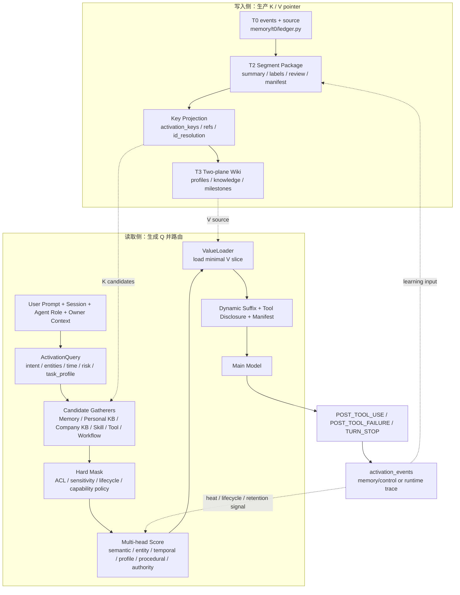
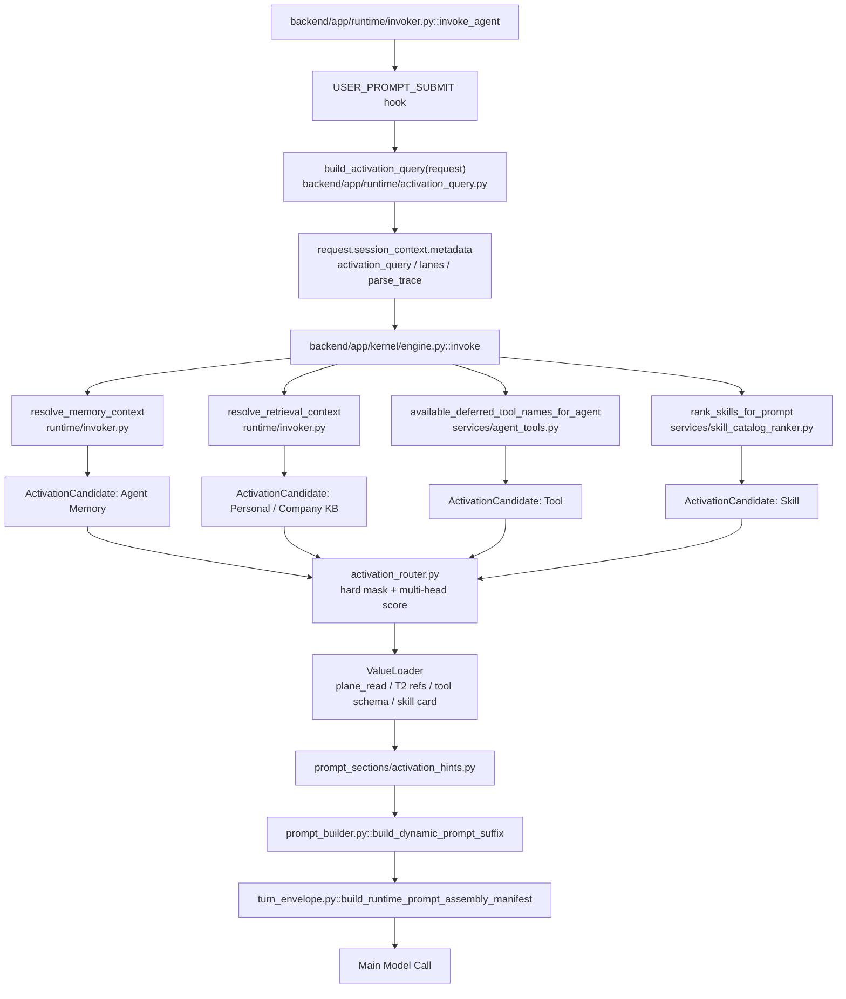
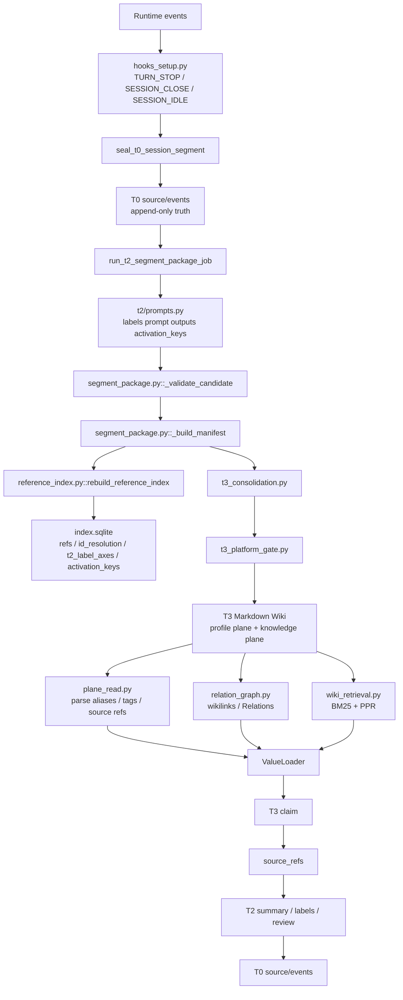
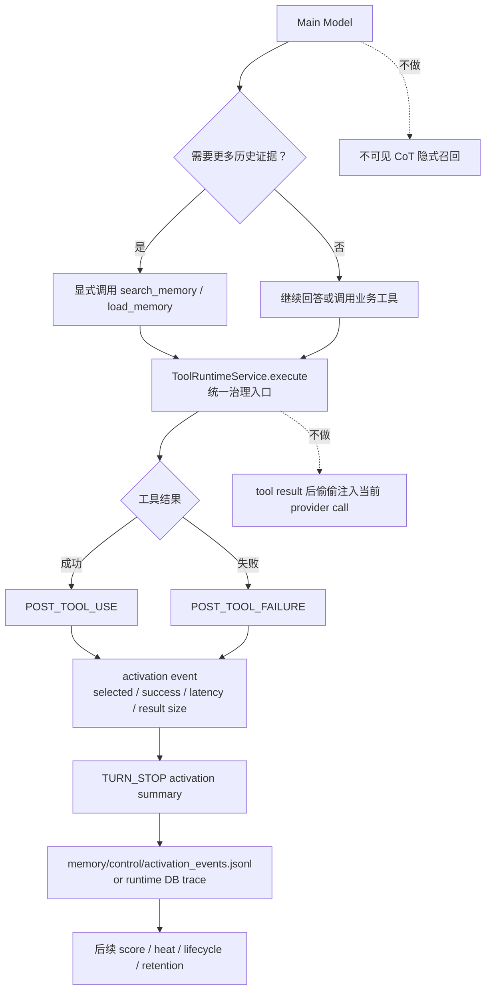
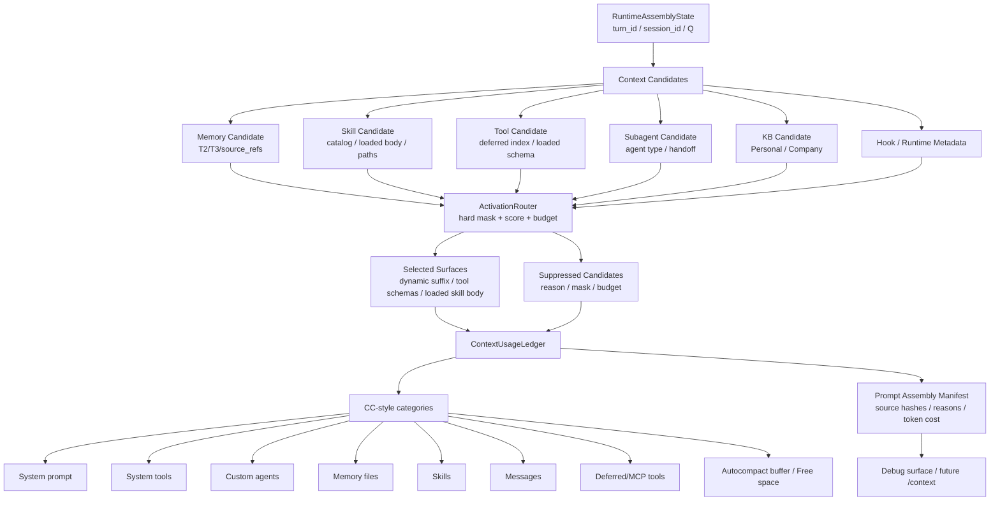

# CCPlus 类 Transformer 记忆与运行时升级计划

日期：2026-07-05  
状态：落地施工账本（4 个计划 / 48 个原子项），基于当前代码走查与 2026-07-06 Runtime / Context / Tooling 清债闭环  
范围：在不推翻现有 Agent Memory / Personal Knowledge / Company Knowledge 三层产品路径的前提下，把 Memory、Runtime、Tool/Skill disclosure 做成可解释的 runtime Attention / QKV 机制。

相关文档：

- `docs/memory-system-spec.md`：Agent Memory 现行规格，T0/T2/T3/soul 两平面体系。
- `docs/knowledge-pyramid-agent-person-org-2026-07-03.md`：Agent → Person → Org 三级 Wiki 路径。
- `docs/personal-knowledge-base-spec.md`：Person Wiki / Knowledge LM 实施规格。
- `docs/ccplus-runtime-activation-weight-design-2026-07-04.md`：Runtime Activation / 权重层讨论稿。
- `docs/ccplus-runtime-context-tooling-debt-ledger-2026-07-06.md`：Runtime / Context / Tooling 技术债与 CC 一致性清单。本计划依赖该清债底座，但不把清债问题混同为 Transformer 升级本体。

---

## 0. 一句话判断

我们不应该把 Transformer/QKV 理解成“让主模型在 CoT 里自己想一遍该召回什么”。  
正确方向是把它做成 **runtime 外部 Attention Router**：

```text
写入侧：T0/T2/T3 生产 Memory 的 Key 与 Value pointer
读取侧：runtime 根据当前任务生成 Query
路由层：Query 匹配 Key，hard mask 后排序
披露层：只加载最小 Value slice 进入 dynamic suffix / tool result / prompt manifest
反馈层：工具结果、模型采纳、用户反馈回流到 heat / lifecycle / retention / T2→T3
```

它不是训练层，不改 base model 权重，也不做真正反向传播。  
它是外部、可审计、可回滚的 **inference-time attention + credit assignment**。

### 0.1 与技术债清理的关系

类 Transformer 升级之前必须先把 Runtime 底座整理成可解释 contract。否则 Router 会接在旧 `pack` 术语、裸字符串 prompt section、stale frozen prefix、不可解释 `tool_search` 结果和不完整 manifest 上。

本计划与清债文档的边界如下：

| 层 | 本轮清债文档负责 | 本升级计划负责 |
| --- | --- | --- |
| 命名与兼容 | 清掉 Runtime 一线 `Package / Pack` 术语，改成 `capability_group` / `deferred_tool_group` | Router 只消费清债后的能力候选，不再理解 pack |
| Context usage | 建 CC `/context` 等价分类账 | 用分类账做 budget / free space / selected V 可解释输出 |
| Tool / Skill disclosure | 明确 schema discovery、load_skill、subagent listing、MCP on-demand 的边界和返回 | 把它们统一成 `ActivationCandidate` |
| Prompt cache | 修正 frozen / dynamic 边界和缓存签名 | Router 只在 dynamic assembly 中工作，不依赖 stale prefix |
| Manifest | 增加 reasons、hashes、budget decisions | 写入 Q/K/V score、selected/suppressed candidates、feedback |

因此一轮完整施工必须同时完成两件事：

```text
先把 Runtime 组装面变成干净、可计量、可回放的 contract；
再把 QKV / Attention Router 接到这个 contract 上。
```

### 0.2 CC `/context` 对本计划的启发

CC `/context` 的关键不是 UI，而是上下文分类哲学：

```text
System prompt
System tools
Custom agents
Memory files
Skills
Messages
MCP tools loaded on-demand
Autocompact buffer
Free space
```

Hive 的升级必须输出同等粒度的 `ContextUsageLedger`。每个 provider call 都要能回答：

```text
哪些内容是 system prompt；
哪些是已加载 tool schema；
哪些只是 deferred / MCP 候选且未加载 schema；
哪些是 Skill catalog 或 loaded skill body；
哪些是 Memory / KB value slice；
哪些是 messages；
剩余窗口和 autocompact reserve 还有多少；
每一块为什么入选，为什么被压低或抑制。
```

这会成为 Router 的“仪表盘”。没有这个分类账，权重和召回强度无法调试。

### 0.3 KV Cache、压缩、Goal / Loop 的位置

这里必须先定清楚边界：

```text
模型内部 KV Cache：不可控，不作为 Hive 设计入口。
Provider prompt cache / prefix cache：可通过稳定前缀、cache-safe params、schema 展开策略优化。
压缩 / microcompact / tool result budget：是上下文窗口控制器。
Goal / Loop / Trigger / Workflow / Subagent / Team：是 Agent cycle 控制器。
```

所以本计划不尝试“操作模型 KV Cache”。Hive 要做的是把外围可控层做成可解释的 runtime attention：

```text
CacheDecisionLedger：记录 cache surface、hit/miss、cache key hash、invalidation reason。
CompactionDecisionEntry：记录 threshold、before/after tokens、compressed/skipped/failed、next_action。
RuntimeDecisionLedger：记录 Goal / Loop / Plan / Trigger / Workflow / Team / Subagent 的 trigger、judge、outcome、permission、budget、next_action。
ContextUsageLedger：记录这些决策最终怎样影响 prompt / tool schema / dynamic suffix / messages。
```

这几件事与 Memory QKV 是同一套外部 Attention 的不同面：

```text
Memory Router 决定“召回什么”；
Context Router 决定“注入什么”；
Decision Ledger 决定“继续、暂停、告知用户、等待确认、修复还是终止”；
Cache / Compaction Ledger 决定“保留、裁剪、压缩、复用缓存还是重建上下文”。
```

---

## 1. 当前代码事实

### 1.1 写入链路已经存在

当前 T0→T2→T3 主链路已经落地：

```text
runtime hooks
  └─ TURN_STOP / SESSION_CLOSE / SESSION_IDLE
      └─ seal_t0_session_segment()
          └─ run_t2_segment_package_job()
              └─ summary.md / labels.md / review.md / manifest.json
                  └─ heartbeat run_heartbeat_t3_core()
                      └─ T3 Consolidator / Memory Gate / Platform Gate
                          └─ memory/self, profiles, knowledge, milestones
```

关键代码：

| 层 | 代码 | 现状 |
| --- | --- | --- |
| T0 ledger | `backend/app/memory/t0/ledger.py` | append-only JSONL + source.md，含 sequence、event_hash、segment boundary |
| Hook→T0/T2 | `backend/app/runtime/hooks_setup.py` | `TURN_STOP` seal T0，并调用 `run_t2_segment_package_job()` |
| T2 builder | `backend/app/memory/t2/segment_package.py` | LLM summary / labels / review，Platform Gate 原子提交 |
| T2 prompts | `backend/app/memory/t2/prompts.py` | 已有 `continuity_state`、`four_plane_signals`、`failure_signals`、`rework` |
| T3 batch | `backend/app/memory/t3_consolidation.py` | 聚合 reviewed T2 + explicit overlay，生成 T3 job source bundle |
| T3 gate | `backend/app/memory/t3_platform_gate.py` | 校验 target、source/base revision、Relations、Contradictions，原子写 accepted T3 |

结论：写入侧不是从零改造。需要补的是 **feature/key 的一等形态**，不是重写 T0/T2/T3。

### 1.2 读取侧已有弱版 Attention

当前 `build_memory_context()` 已经做了几件事：

```text
resident profile plane 常驻
+ explicit overlay
+ knowledge/milestones PPR
+ episodic session summaries
+ ActivationScorer 轻打分
+ MemoryAssembler 拼 prompt section
```

关键代码：

| 代码 | 现状 |
| --- | --- |
| `backend/app/services/memory_service.py` | `build_memory_context()` 是 memory prompt snapshot 主入口 |
| `backend/app/memory/retriever.py` | `MemoryRetriever` 拉 explicit / knowledge PPR / episodic |
| `backend/app/memory/activation.py` | `ActivationScorer` 支持 goal/owner/company/open_loop/retention/confidence/usage heat |
| `backend/app/memory/assembler.py` | 按 score 去重、分组、裁剪后渲染 |
| `backend/app/memory/wiki_retrieval.py` | BM25 seed + PPR，多跳检索已存在 |
| `backend/app/memory/relation_graph.py` | 从 Markdown wikilink / Relations 重建图 |

现状问题：

1. `Q` 主要还是原始 query 字符串，不是结构化任务对象。
2. `K` 分散在 labels、frontmatter、Relations、metadata、SQLite 派生表里，没有统一 key schema。
3. `V` 加载路径存在，但没有统一成 `ValueLoader` / `ActivationCandidate`。
4. score 只覆盖 Memory，未统一 Skill / Tool / Workflow / Personal KB / Company KB。
5. prompt manifest 记录了 section，但没有记录“为什么这些候选被选中”。

### 1.3 Runtime prompt assembly 是正确插入点

当前模型调用前的动态上下文由 kernel 统一装配：

```text
invoker
  └─ USER_PROMPT_SUBMIT hook
      └─ kernel.invoke()
          ├─ resolve_memory_context()
          ├─ resolve_retrieval_context()
          ├─ resolve_runtime_metadata_context()
          ├─ available_deferred_tool_names_for_agent()
          ├─ skill_catalog
          ├─ build_dynamic_prompt_suffix()
          └─ build_runtime_prompt_assembly_manifest()
```

关键代码：

| 代码 | 现状 |
| --- | --- |
| `backend/app/runtime/invoker.py` | `USER_PROMPT_SUBMIT` hook 在 durable append 后、model loop 前触发，可追加 `Hook Additional Context` |
| `backend/app/kernel/engine.py` | 真正装配 memory / retrieval / tools / skills / manifest |
| `backend/app/runtime/prompt_builder.py` | dynamic suffix 承载 Memory、Runtime metadata、Tool groups、Skill catalog、Knowledge |
| `backend/app/runtime/turn_envelope.py` | prompt assembly manifest 已记录 sections、tools、deferred tools、loaded skills |

结论：**原生 Q 解析与 Attention Router 应该放 runtime/kernel resolver，不应该做成插件 hook。**

Hook 是生命周期边界和插件扩展面；CCPlus native 能力必须在 runtime 内核里有稳定语义、预算控制、权限 hard mask 和 manifest trace。

### 1.4 Tool / Skill 已经有 progressive disclosure

Tool 与 Skill 的披露机制已经存在：

| 代码 | 现状 |
| --- | --- |
| `backend/app/services/agent_tools.py` | `discoverable_tool_names_for_query()` 是 `tool_search` 与 schema path 的单一来源 |
| `backend/app/services/agent_tools.py` | `available_deferred_tool_names_for_agent()` 给 turn-1 deferred list |
| `backend/app/services/skill_catalog_ranker.py` | Skill catalog 已按 scenario overlap / lifecycle / use_count 排序 |
| `backend/app/kernel/engine.py` | `load_skill` 后注册 active skill，并通过 tool result 披露 skill body |

现状问题：

1. Tool discovery 主要是 query text + legacy pack/capability policy，没有和 Memory/Profile/Task/Risk 统一排序。
2. Skill ranker 只有简单 scenario token，不知道 owner feedback、recent failure、tool success。
3. Tool/Skill 是否被模型采纳、是否成功，没有统一回流到 activation score。

---

## 2. 核心设计：外部 QKV

### 2.1 Q：当前任务的结构化表示

`Q` 不应该放在 system prompt 里让主模型自己解析。  
`Q` 应该是 runtime 内部结构化对象。

```text
ActivationQuery:
  raw_prompt
  session_id / turn_id / intent_id
  agent_id / agent_role
  owner/principal context
  task_profile
  intent
  entities
  concepts
  temporal_hints
  referenced_files
  risk_level
  memory_need
  knowledge_need
  skill_need
  tool_need
  candidate_lanes
  budget_policy
```

当前已有的 `TaskProfile` 是结构化 Q 的机械基座，但本轮必须升级成完整 `ActivationQuery`：

```text
已有：coding / research / operations / memory_recall / self_evolution / general
缺失：entities、concepts、time hints、risk、open_loop、owner domain、candidate lanes
```

### 2.2 K：语料和能力对象的索引特征

`K` 是候选对象“在什么情况下应该被想起”的特征。

来源：

| 来源 | K 的形态 |
| --- | --- |
| T2 `labels.md` | continuity、risk_flags、system、memory_domain、self_signal、nutrient_plane、failure_signal、rework |
| T2 `summary.md` | decisions、facts、artifacts、open questions、method trace |
| T2 `manifest.json` | source_refs、session_id、t0_segment_id、lineage、created_at |
| T3 profile plane | entry id、heading、section、scene condition、source_refs、lifecycle |
| T3 knowledge plane | title、aliases、Relations、Contradictions、Evidence、status |
| explicit overlay | category、target_hint、timestamp、source_refs、status |
| Skill | name、description、lifecycle state、use_count、declared packs |
| Tool | tool name、description、pack、policy、reachability、risk |
| Personal KB | document/segment/entity/assertion/link keys |
| Company KB | typed ontology、policy、ACL、authority surface |

### 2.3 V：被披露的最小内容

`V` 不是 Index。  
`V` 是被选中后实际加载给模型的内容切片。

```text
Memory V:
  profile slice
  knowledge page preview or page body
  milestone
  explicit overlay fact
  T2 summary/evidence refs

Skill V:
  catalog row
  load_skill body

Tool V:
  deferred tool name
  tool_search result
  function schema

KB V:
  segment preview
  segment body
  source refs
```

原则：

```text
K 小、稳定、可索引。
V 大、受权限与预算控制，只有入选后才加载。
```

---

## 3. 写入端改造量

### 3.1 结论：中等改造，不是重写 Memory

我们不需要推翻 T0/T2/T3。最小改造是：

```text
T0：基本不动，只补少量 metadata discipline
T2：增强 labels/manifest 的 activation feature 输出
T3：保留两平面写法，补 key extraction / frontmatter 约定
Index：扩展派生 key projection
Read side：新增 runtime ActivationQuery / Candidate / Router
```

### 3.2 T0 改造

T0 仍然只做机械真相，不做深语义。

可以补强：

1. 确保每个事件都有 `turn_id`、`intent_id`、`runtime_task_id`、`source`、`sequence`。
2. 对 tool result 事件补 `tool_name`、`tool_success`、`result_kind`、`artifact_refs`。
3. 保持 `events.jsonl` / `source.md` 双面，不把 QKV 语义塞进 T0。

不应该做：

```text
不在 T0 里做实体抽取。
不在 T0 里写长期权重。
不让 T0 直接进入 prompt recall。
```

### 3.3 T2 改造

T2 是最重要改造点。

当前 `labels.md` 已经有四平面信号，但还不够做完整 K。建议将 `LABELS_PROMPT_VERSION` 从当前 labels prompt 版本一次性升级为能力命名版本 `t2.learning_brain_labels.activation_20260705`，增加：

```xml
<activation_keys schema_version="t2.activation_keys.20260705">
  <task_intent>architecture_design</task_intent>
  <scenario>memory_runtime_design</scenario>
  <entity type="doc">personal-knowledge-base-spec.md</entity>
  <entity type="concept">Agent Memory</entity>
  <entity type="concept">QKV</entity>
  <temporal_hint kind="continuation">previous discussion</temporal_hint>
  <decision status="accepted">Only three products...</decision>
  <open_loop>Define QKV runtime implementation path</open_loop>
  <relation_seed rel="depends_on">memory-system-spec</relation_seed>
  <risk_flag>architecture_drift</risk_flag>
</activation_keys>
```

本轮直接完成两件事：

1. 从历史 T2 的现有 labels/summary/manifest 机械回填一部分 keys，保证旧数据可用。
2. 升级 labels prompt，让新 T2 显式输出 `activation_keys`，保证新数据进入完整 QKV 体系。

### 3.4 T3 改造

T3 不需要改两平面结构，但需要让每个长期条目更像可召回对象。

Profile plane 建议条目格式保留 Markdown 可读性，同时约定可解析字段：

```markdown
### 需求不清时不要自己猜
<!-- id: self:fm-ask-before-assume -->
- 状态: active
- 场景: architecture_design; product_spec
- 触发: vague_request; multiple_possible_products
- 证据: t2-xxxx · fb-yyyy
- lifecycle: active
```

Knowledge page frontmatter 本轮直接支持：

```markdown
---
title: Runtime Activation Layer
status: active
aliases: [Attention Router, Activation Router]
tags: [memory, runtime, qkv]
---
```

本轮不手工迁移所有旧页正文；由 index rebuild 做兼容解析，新写入和被重写的页必须产出这些 key 字段。

### 3.5 Index 改造

当前 `reference_index.py` 已有：

```text
refs
id_resolution
tombstones
t2_label_axes
consolidation_debt_history
```

建议新增或扩展：

```text
activation_keys
  candidate_ref
  candidate_kind
  scope
  key_axis
  key_value
  source_ref
  confidence
  created_at

activation_events
  turn_id
  candidate_ref
  score
  reasons
  rendered_surface
  selected_by_model
  tool_success
  user_feedback
  token_cost
```

其中 `activation_keys` 可以进入可重建 Index；`activation_events` 更适合进入 trace / sidecar / DB 事件流。两者都不是长期语义真相。

注意：Index 仍然是派生读模型，不是真相源。动态 score 与反馈事件是控制面证据，不应反向伪装成 T3 事实。

真相位置：

| 内容 | 真相 |
| --- | --- |
| 原始对话和工具事实 | T0 |
| T2 语义抽取 | `summary.md` / `labels.md` / `manifest.json` |
| 长期记忆 | T3 Markdown |
| 引用与生命周期事件 | MD / JSONL sidecar |
| 快速检索 projection | SQLite / PG index，可重建 |
| 本轮 score | trace / manifest / activation event，不是长期事实 |

---

## 4. 读取侧与 Task 解析

### 4.1 谁负责解析 Q

答案：**runtime 原生层负责，不是主模型 CoT，也不是插件 hook。**

建议新增：

```text
backend/app/runtime/activation_query.py
backend/app/runtime/activation_candidates.py
backend/app/runtime/activation_router.py
backend/app/runtime/prompt_sections/activation_hints.py
```

职责：

| 模块 | 职责 |
| --- | --- |
| `activation_query.py` | 从 request/messages/session/model/runtime config 生成 `ActivationQuery` |
| `activation_candidates.py` | 定义 `ActivationCandidate` / `ActivationScore` / hard mask reason |
| `activation_router.py` | gather candidates → hard mask → score → top-k |
| `activation_hints.py` | 渲染极短 hints，不放大段正文 |

### 4.2 触发位置

当前 `USER_PROMPT_SUBMIT` hook 触发点是：

```text
durable user prompt append 后
kernel.invoke() 前
```

这个时机是正确的生命周期边界，但实现应该分层：

```text
USER_PROMPT_SUBMIT hook:
  给插件/外部 hook 一个机会追加上下文或拦截。

Runtime ActivationQueryBuilder:
  CCPlus 原生逻辑，必须在 runtime/kernel 内部执行。
  不依赖插件 hook 是否启用。
  结果进入 session_context.metadata 和 prompt manifest。
```

建议时序：

```text
invoke_agent()
  ├─ emit USER_PROMPT_SUBMIT hook
  ├─ build ActivationQuery  ← 新增，原生 runtime
  └─ kernel.invoke()
      ├─ resolve_memory_context(activation_query)
      ├─ resolve_retrieval_context(activation_query)
      ├─ rank skill_catalog(activation_query)
      ├─ rank available_deferred_tools(activation_query)
      ├─ build_dynamic_prompt_suffix()
      └─ manifest records activation trace
```

如果实现上更方便，也可以把 `ActivationQueryBuilder` 放进 `kernel/engine.py`，在 `resolve_memory_context()` 前执行。关键不是文件位置，而是语义：

```text
它是 runtime 原生 resolver，不是用户/plugin hook。
```

### 4.3 Q 是否需要 LLM

不应该每轮都跑 LLM 解析 Q。

建议三层：

| 层 | 成本 | 用途 |
| --- | --- | --- |
| 机械解析 | 零 LLM | 文件名、URL、显式历史词、时间词、tool/skill 词、语言、长度、风险关键词 |
| 现有 TaskProfile | 零 LLM | coding/research/ops/memory/self-evolution/general |
| 轻量 LLM parser | 条件触发 | 高风险、模糊、多实体、多轮 continuation、召回失败、候选冲突 |

轻量 LLM parser 可以用便宜模型，但必须：

```text
同步发生在主模型调用前；
有超时，例如 800-1500ms；
失败降级到机械 Q；
输出严格 JSON；
结果进 trace；
不写长期 Memory。
```

不建议：

```text
不让 Flash 模型“一直在后台跑”。
不在主模型已经开始生成后，试图把新解析塞回本轮 prompt。
```

因为模型调用开始后，prompt 已经定型。后台解析只能影响后续 turn，不能稳定影响当前 provider call。

---

## 5. 主模型 CoT 与工具循环中的召回

### 5.1 不依赖 CoT 做召回判断

主模型的 thinking / CoT 不应该成为系统唯一的召回判断来源。

原因：

1. CoT 不一定可见、可控、可保存。
2. 不同 provider 的 thinking 行为不同。
3. 隐式 CoT 解析无法进入 manifest，难以调试“为什么召回这条”。
4. 无法做 hard mask 与权限审计。

所以主模型看到的是路由后的 Value，而不是被要求“请先自行构造 QKV”。

### 5.2 当前循环内召回方式

当前模型循环中，memory recall 的稳定入口是显式工具：

```text
search_memory(query)
load_memory(ids)
```

这应该保留。  
也就是说：

```text
模型在思考/工具循环中如果发现需要更多历史证据，应该显式调用 search_memory/load_memory。
```

### 5.3 是否在每个 tool result 后自动召回

不做隐式自动召回。

原因：

1. 当前 kernel 的 dynamic suffix 是模型调用前构建的，不是每个 tool round 自动重建。
2. 在 tool result 后强行塞新 memory，会改变模型循环语义和预算。
3. 自动召回可能把低相关记忆带进高风险工具链。
4. 成本不可控。

本轮定案：

```text
模型调用前做 pre-call activation。
工具循环中由模型显式 search_memory/load_memory。
POST_TOOL_USE/FAILURE 记录反馈信号，不在当前 provider call 里偷偷注入新上下文。
如果模型需要更多历史证据，正确路径是显式调用 memory tool，而不是 runtime 在 CoT 背后替它塞内容。
```

---

## 6. Attention 联想如何处理三大问题

### 6.1 时序问题

现状：

- T0 有 sequence、created_at、segment boundary。
- T2 有 source_range、session_id、t0_segment_id、continuity_state。
- Episode Stitcher 已经处理 `same_episode_candidate/needs_previous/needs_next`。

增强：

```text
temporal head:
  seed = temporal_hints / session_id / turn_id / continuity_state / open_loop
  path = current session → previous T2 segment → stitched episode → milestone
```

需要补的 K：

```text
time_anchor
sequence_range
precedes/follows
same_episode_id
open_loop_id
decision_time
```

### 6.2 多对话混合问题

现状：

- Knowledge plane 有 Relations + PPR。
- T2 Episode Stitcher 可拼相邻断裂段。
- Reference index 可从 T3 回指 T2。

增强：

```text
entity/relation head:
  query entity → aliases → T3 concept/profile entries
  → backlinks/source_refs → multiple T2 packages
  → if needed load evidence from several sessions
```

重点不是把三四段对话总结成一个摘要，而是让它们共同指向同一个 concept / decision / owner preference / open loop。

### 6.3 语义压缩偏移问题

原则：

```text
T3/T2 用于召回；
T2/T0 用于验证；
高影响回答必须沿 refs 下钻。
```

也就是说，残差连接不仅适用于写入端，也适用于读取端：

```text
T3 claim
  → source_refs
    → T2 summary/labels/review
      → T0 source/events
```

读取侧应有 `authority/evidence head`：

```text
证据完整 + 多 source_refs + reviewed + no conflict → boost
缺证据 / 冲突未解 / stale / needs_revalidation → suppress or verify-first
```

---

## 7. 单轮完整施工图

本节是一次性完整改造范围，不拆层、不留未接边界。工程上可以按依赖顺序提交代码，但验收时必须是一个闭环：Q 生成、K 投影、V 加载、排序、注入、manifest、反馈回流全部可用。

### 7.A 落地执行账本：4 个计划 / 48 个原子项

本轮不再拆 V1 / V2 / V3。下面的“计划”不是产品分期，而是同一个升级项目的四张施工图；下面的“原子项”是 commit 粒度。执行时允许按依赖顺序推进，但验收时必须一次性闭环。

#### 7.A.1 四个计划

| 计划 | 作用 | 交付物 | 完成标准 |
| --- | --- | --- | --- |
| P1 主架构计划 | 固定 Q/K/V、Router、ValueLoader、ActivationEvents 的最终形态 | 本文档作为 canonical plan | 不再出现新增产品面；不把 QKV 塞进主模型 CoT；Router 是 runtime 原生 resolver |
| P2 原子落地账本 | 管 48 个 atomic parts、每项触点、Red/Green、commit 证据 | 本节 `7.A.2` 表格持续更新 | 每个原子项有测试、实现、验证、commit hash |
| P3 Backfill / Rebuild / Compatibility 计划 | 管旧 T2/T3/explicit/skill/tool 如何生成 `activation_keys`，以及 index 如何可重建 | `reference_index` rebuild 规则、backfill 脚本、兼容测试 | 删除派生 index 后可从 MD/JSONL 重建 keys；旧数据不失效 |
| P4 验收 / 大召回 / 回滚计划 | 管最终 gates、断点复查、回滚边界 | backend/runtime 全量测试、manifest audit、ACL audit、文档证据 | 48 项全部完成后，跑大逻辑召回并确认没有路径断点 |

#### 7.A.2 48 个原子项

| ID | 原子项 | 主要触点 | 测试门 | 提交证据 |
| --- | --- | --- | --- | --- |
| A-01 | 将本文状态提升为落地施工账本 | `docs/ccplus-transformer-style-memory-runtime-upgrade-plan-2026-07-05.md` | 文档计数脚本 | 已完成：`59fb839d3`；验证：4 个计划 / 48 个唯一原子项 |
| A-02 | 建立 atomic ledger 更新规则 | `backend/app/scripts/validate_qkv_landing_ledger.py`、`backend/tests/scripts/test_validate_qkv_landing_ledger.py`、本文档 | `pytest tests/scripts/test_validate_qkv_landing_ledger.py -q`、`python -m app.scripts.validate_qkv_landing_ledger ../docs/ccplus-transformer-style-memory-runtime-upgrade-plan-2026-07-05.md`、`ruff check app/scripts/validate_qkv_landing_ledger.py tests/scripts/test_validate_qkv_landing_ledger.py` | 已完成：fb7569ae2；验证 48 项唯一且证据单元齐全 |
| B-01 | 定义 `ActivationQuery` schema | `backend/app/runtime/activation_query.py` | `tests/runtime/test_activation_query.py` | 已完成：56df357d4；Red `pytest tests/runtime/test_activation_query.py -q` -> 3 failed / ModuleNotFoundError；Green -> 3 passed, 4 third-party warnings；Lint `ruff check app/runtime/activation_query.py tests/runtime/test_activation_query.py` -> All checks passed |
| B-02 | 定义 `ActivationCandidate` / score / hard mask schema | `backend/app/runtime/activation_candidates.py` | `tests/runtime/test_activation_candidates.py` | 已完成：cd97d678c；Red `pytest tests/runtime/test_activation_candidates.py -q` -> 3 failed / ModuleNotFoundError；Green -> 3 passed, 4 third-party warnings；Lint `ruff check app/runtime/activation_candidates.py tests/runtime/test_activation_candidates.py` -> All checks passed |
| B-03 | 定义 `ActivationEvent` / feedback schema | `backend/app/runtime/activation_events.py` | `tests/runtime/test_activation_events.py` | 已完成：fd40e47bc；Red `pytest tests/runtime/test_activation_events.py -q` -> 3 failed / ModuleNotFoundError；Green -> 3 passed, 4 third-party warnings；Lint `ruff check app/runtime/activation_events.py tests/runtime/test_activation_events.py` -> All checks passed |
| B-04 | 扩展 `RuntimeAssemblyState` 以承载 Q/Candidates/Router output | `backend/app/runtime/context.py` | `tests/runtime/test_runtime_context_composition.py` | 已完成：3352f8c9d；Red targeted test -> AttributeError `record_activation_query`；Green targeted -> 1 passed, full file -> 15 passed, 4 third-party warnings；Lint `ruff check app/runtime/context.py tests/runtime/test_runtime_context_composition.py` -> All checks passed |
| C-01 | 在 `USER_PROMPT_SUBMIT` 后构造 Q | `runtime/invoker.py::invoke_agent` | `tests/runtime/test_invoker.py` | 已完成：ec5444afb；Red targeted test -> KeyError `activation_query` before kernel；Green targeted -> 1 passed, full file -> 49 passed, 4 third-party warnings；Lint `ruff check app/runtime/invoker.py tests/runtime/test_invoker.py` -> All checks passed |
| C-02 | `ActivationQuery` 引用 `turn_id` / `intent_id` | `runtime/invoker.py::_ensure_turn_metadata` | `tests/runtime/test_activation_query.py` | 已完成：f8ce35982；Red targeted test -> missing parse_trace source for `turn_id` / `intent_id`；Green `pytest tests/runtime/test_activation_query.py -q` -> 4 passed, 4 third-party warnings；Lint `ruff check app/runtime/invoker.py tests/runtime/test_activation_query.py` -> All checks passed |
| C-03 | 接入 `TaskProfile` 为 Q 子结构 | `runtime/context_budget.py`、`activation_query.py` | `tests/runtime/test_context_budget.py` | 已完成：07c5d7c14；Red targeted tests -> missing `task_profile_to_activation_payload` and empty Q `task_profile`；Green targeted -> 2 passed, related files -> 22 passed, 4 third-party warnings；Lint `ruff check app/runtime/activation_query.py app/runtime/invoker.py tests/runtime/test_context_budget.py tests/runtime/test_activation_query.py` -> All checks passed |
| C-04 | 增加机械 Q parser | `activation_query.py` | URL、文件名、时间词、风险词测试 | 已完成：e8403e64d；Red targeted tests -> missing `parse_mechanical_activation_features` and empty Q entities；Green targeted -> 2 passed, related activation/invoker tests -> 8 passed, 4 third-party warnings；Lint `ruff check app/runtime/activation_query.py app/runtime/invoker.py tests/runtime/test_activation_query.py` -> All checks passed |
| C-05 | 增加条件 LLM Q parser 与降级 | `activation_query.py`、LLM client seam | 超时/失败 fallback 测试 | 已完成：baa0223b1；Red targeted tests -> missing `maybe_parse_activation_query_with_llm`；Green targeted -> 2 passed, activation query file -> 9 passed, 4 third-party warnings；Lint `ruff check app/runtime/activation_query.py tests/runtime/test_activation_query.py` -> All checks passed |
| D-01 | T0 事件补齐 runtime metadata discipline | `services/t0_logger.py`、T0 writers | T0 event schema tests | 已完成：ae2bd98e8；Red targeted test -> JSONL missing top-level `turn_id` / `intent_id`；Green targeted -> 1 passed, T0 ledger file -> 10 passed；Lint `ruff check app/memory/t0/ledger.py tests/memory/test_t0_session_ledger.py` -> All checks passed |
| D-02 | T2 labels prompt 输出 `<activation_keys>` | `memory/t2/prompts.py` | labels prompt contract test | 已完成：a2eab4c11；Red targeted test -> prompt version still `t2.learning_brain_labels.v3`；Green prompt contract -> 2 passed, package manifest version test -> 1 passed；Lint `ruff check app/memory/t2/prompts.py tests/memory/test_t2_segment_package_builder.py` -> All checks passed |
| D-03 | T2 segment package 校验 activation keys | `memory/t2/segment_package.py` | invalid/legacy package tests | 已完成：a4d13fb9a；Red invalid activation_keys test -> expected schema issue absent；Green legacy/valid/invalid targeted -> 3 passed, package commit test -> 1 passed；Lint `ruff check app/memory/t2/segment_package.py tests/memory/test_t2_segment_package_builder.py` -> All checks passed |
| D-04 | T2 manifest 写入 activation key preview | `memory/t2/segment_package.py` | manifest rebuild tests | 已完成：d5741ea60；Red targeted test -> missing `activation_keys_preview`; Green targeted -> 1 passed, D-03/package regression -> 4 passed；Lint `ruff check app/memory/t2/segment_package.py tests/memory/test_t2_segment_package_builder.py` -> All checks passed |
| D-05 | T3 profile/knowledge 解析 aliases/tags/lifecycle | `memory/plane_read.py` | T3 parsing tests | 已完成：d7011b09f；Red targeted test -> profile entry missing `aliases`；Green targeted -> 1 passed, retrieval pipeline file -> 10 passed；Lint `ruff check app/memory/plane_read.py tests/memory/test_retrieval_pipeline.py` -> All checks passed |
| D-06 | explicit overlay 产生 candidate keys | `memory/explicit_overlay.py` | explicit key projection tests | 已完成：6e23e8a04；Red targeted test -> `KeyError: 'activation_keys'`；Green targeted -> 1 passed, explicit overlay file -> 4 passed；Lint `ruff check app/memory/explicit_overlay.py tests/memory/test_explicit_memory_overlay.py` -> All checks passed |
| D-07 | Skill/Tool/Subagent 元数据产生 candidate keys | `runtime/context_candidates.py`、`services/skill_catalog_ranker.py`、`services/agent_context.py`、`services/agent_tools.py`、`runtime/prompt_sections/subagent_listing.py` | key projection tests | 已完成：931d90f83；Red targeted tests -> missing `SkillRankingDecision.activation_keys`, deferred tool `KeyError: 'activation_keys'`, unexpected `activation_key_manifest`; Green targeted -> 3 passed, related files -> 12 passed；Lint `ruff check app/runtime/context_candidates.py app/services/skill_catalog_ranker.py app/services/agent_context.py app/services/agent_tools.py app/runtime/prompt_sections/subagent_listing.py tests/services/test_skill_catalog_ranker.py tests/services/test_agent_tools.py tests/runtime/test_subagent_listing_section.py` -> All checks passed |
| E-01 | `reference_index` 新增 `activation_keys` 派生表 | `memory/reference_index.py` | migration-free rebuild tests | 已完成：c8b1a140b；Red targeted test -> missing `ReferenceIndexRebuildReport.activation_key_rows` / table；Green targeted -> 1 passed, derived table file -> 10 passed, source-ref smoke -> 2 passed；Lint `ruff check app/memory/reference_index.py tests/memory/test_c8_derived_tables.py` -> All checks passed |
| E-02 | 旧 T2 机械回填 activation keys | `reference_index.py` | legacy T2 fixture tests | 已完成：d94ec5154；Red targeted test -> `activation_key_rows=0` while `label_axis_rows=12`；Green targeted -> 1 passed, derived table file -> 11 passed；Lint `ruff check app/memory/reference_index.py tests/memory/test_c8_derived_tables.py` -> All checks passed |
| E-03 | 旧 T3 机械回填 activation keys | `reference_index.py`、`plane_read.py` | legacy T3 fixture tests | 已完成：a8c76c2d9；Red targeted test -> missing `t3_profile` / `t3_knowledge` activation rows；Green targeted -> 1 passed, derived table + plane metadata regression -> 13 passed；Lint `ruff check app/memory/reference_index.py app/memory/plane_read.py tests/memory/test_c8_derived_tables.py tests/memory/test_retrieval_pipeline.py` -> All checks passed |
| E-04 | 提供 `query_activation_keys()` / `candidate_refs_for_keys()` | `reference_index.py` | query API tests | 已完成：b0803912c；Red targeted test -> cannot import `candidate_refs_for_keys`；Green targeted -> 1 passed, derived table file -> 13 passed；Lint `ruff check app/memory/reference_index.py tests/memory/test_c8_derived_tables.py` -> All checks passed |
| E-05 | 删除派生 index 后全量重建验证 | rebuild script / tests | rebuild smoke + source_refs test | 已完成：2d906dba4；Red targeted tests -> missing `app.scripts.rebuild_reference_index`；Green script tests -> 2 passed, script + derived table regression -> 15 passed；Lint `ruff check app/scripts/rebuild_reference_index.py tests/scripts/test_rebuild_reference_index.py app/memory/reference_index.py tests/memory/test_c8_derived_tables.py` -> All checks passed |
| F-01 | Memory gatherer 输出 `agent_memory` candidates | `memory/retriever.py` | memory candidate tests | 已完成：e163903a4；Red targeted test -> missing `MemoryRetriever.retrieve_candidates`；Green targeted -> 1 passed, retrieval pipeline file -> 11 passed；Lint `ruff check app/memory/retriever.py tests/memory/test_retrieval_pipeline.py` -> All checks passed |
| F-02 | T2 gatherer 输出 evidence candidates | `reference_index.py`、`retriever.py` | T2 candidate tests | 已完成：a5a73cdff；Red targeted test -> missing `MemoryRetriever.gather_t2_evidence_candidates`；Green targeted -> 1 passed, retrieval pipeline file -> 12 passed；Lint `ruff check app/memory/retriever.py tests/memory/test_retrieval_pipeline.py` -> All checks passed |
| F-03 | T3 gatherer 输出 profile/knowledge candidates | `plane_read.py`、`retriever.py` | T3 candidate tests | 已完成：d7feb22f5；Red targeted test -> missing `MemoryRetriever.gather_t3_plane_candidates`；Green targeted -> 1 passed, retrieval pipeline file -> 13 passed；Lint `ruff check app/memory/retriever.py tests/memory/test_retrieval_pipeline.py` -> All checks passed |
| F-04 | explicit overlay gatherer | `explicit_overlay.py`、`retriever.py` | explicit candidate tests | 已完成：bd47df3d7；Red targeted test -> missing `MemoryRetriever.gather_explicit_overlay_candidates`；Green targeted -> 1 passed, retrieval pipeline file -> 14 passed；Lint `ruff check app/memory/retriever.py tests/memory/test_retrieval_pipeline.py` -> All checks passed |
| F-05 | Skill gatherer | `services/skill_catalog_ranker.py` | skill candidate tests | 已完成：本提交；Red targeted test -> cannot import `gather_skill_candidates_for_prompt`；Green targeted -> 1 passed, skill ranker file -> 5 passed；Lint `ruff check app/services/skill_catalog_ranker.py tests/services/test_skill_catalog_ranker.py` -> All checks passed |
| F-06 | Tool / deferred tool gatherer | `services/agent_tools.py` | tool candidate tests | 已完成：本提交；Red targeted test -> cannot import `gather_deferred_tool_candidates_for_agent`；Green targeted -> 1 passed, deferred candidate pair -> 2 passed；Lint `ruff check app/services/agent_tools.py tests/services/test_agent_tools.py` -> All checks passed |
| F-07 | Subagent gatherer | `runtime/prompt_sections/subagent_listing.py` | subagent candidate tests | 已完成：本提交；Red targeted test -> cannot import `gather_subagent_candidates`；Green targeted -> 1 passed, subagent listing file -> 6 passed；Lint `ruff check app/runtime/prompt_sections/subagent_listing.py tests/runtime/test_subagent_listing_section.py` -> All checks passed |
| F-08 | Personal / Company KB gatherer 接口 | `runtime/retrieval` / KB service seam | ACL + empty implementation tests | 已完成：本提交；Red `pytest tests/runtime/test_kb_candidates.py -q` -> missing `app.runtime.retrieval`；Green -> 3 passed；Lint `ruff check app/runtime/retrieval/kb_candidates.py tests/runtime/test_kb_candidates.py` -> All checks passed |
| G-01 | Router hard mask：ACL / sensitivity / policy | `activation_router.py` | deny/suppress tests | 已完成：本提交；Red `pytest tests/runtime/test_activation_router.py -q` -> missing `app.runtime.activation_router`；Green -> 4 passed；Lint `ruff check app/runtime/activation_router.py tests/runtime/test_activation_router.py` -> All checks passed |
| G-02 | Router multi-head score | `activation_router.py` | semantic/entity/temporal/profile tests | 已完成：本提交；Red targeted test -> `ActivationRouterContext` missing `activation_query`；Green targeted -> 1 passed, router file -> 5 passed；Lint `ruff check app/runtime/activation_router.py tests/runtime/test_activation_router.py` -> All checks passed |
| G-03 | Router budget-aware top-k | `activation_router.py`、`context_usage` | budget pressure tests | 已完成：本提交；Red targeted test -> router returned all candidates under `budget_policy`；Green targeted -> 1 passed, router file -> 6 passed；Lint `ruff check app/runtime/activation_router.py tests/runtime/test_activation_router.py` -> All checks passed |
| G-04 | Router suppression reasons | `activation_router.py` | suppressed reason manifest tests | 已完成：本提交；Red targeted test -> missing `suppression_reasons` in router manifest；Green targeted -> 1 passed, router file -> 7 passed；Lint `ruff check app/runtime/activation_router.py tests/runtime/test_activation_router.py` -> All checks passed |
| G-05 | Router output 写入 `RuntimeAssemblyState` | `runtime/context.py`、`kernel/engine.py` | state mirror tests | 已完成：本提交；Red targeted test -> `ActivationRouterOutput` object not iterable in `record_activation_router_output`；Green targeted -> 1 passed, context+router files -> 23 passed；Lint `ruff check app/runtime/context.py app/runtime/activation_router.py tests/runtime/test_runtime_context_composition.py tests/runtime/test_activation_router.py` -> All checks passed |
| H-01 | Memory ValueLoader 只加载入选 V | `memory/plane_read.py`、`memory/assembler.py` | no eager body load tests | 已完成：本提交；Red targeted test -> cannot import `load_selected_memory_values`；Green targeted -> 1 passed, retrieval pipeline -> 15 passed, assembler -> 25 passed；Lint `ruff check app/memory/plane_read.py app/memory/assembler.py tests/memory/test_retrieval_pipeline.py tests/memory/test_assembler.py` -> All checks passed |
| H-02 | Skill / Tool / Subagent hint 渲染 | `prompt_sections/activation_hints.py` | prompt section tests | 已完成：本提交；Red `pytest tests/runtime/test_activation_hints_section.py -q` -> missing `prompt_sections.activation_hints`；Green targeted -> 2 passed, prompt sections -> 65 passed；Lint `ruff check app/runtime/prompt_sections/activation_hints.py app/runtime/prompt_sections/__init__.py tests/runtime/test_activation_hints_section.py` -> All checks passed |
| H-03 | dynamic suffix 接入 activation hints | `runtime/prompt_builder.py` | prompt builder tests | 已完成：本提交；Red：`pytest tests/runtime/test_prompt_builder.py::test_dynamic_suffix_injects_activation_hints_and_records_ledger -q` 先失败于 `unexpected keyword argument 'activation_router_output'`；Green：`pytest tests/runtime/test_prompt_builder.py tests/runtime/test_activation_hints_section.py -q` -> 55 passed；Lint：`ruff check app/runtime/prompt_builder.py app/runtime/prompt_sections/activation_hints.py tests/runtime/test_prompt_builder.py tests/runtime/test_activation_hints_section.py` -> All checks passed |
| H-04 | manifest 写 Q/K/V trace | `runtime/turn_envelope.py`、`kernel/engine.py` | manifest tests | 已完成：本提交；Red：`pytest tests/runtime/test_turn_envelope_prompt_manifest.py::test_runtime_prompt_manifest_records_activation_qkv_trace_without_value_bodies -q` 先失败于 `unexpected keyword argument 'activation_query'`；Green targeted -> 1 passed；周边回归：`pytest tests/runtime/test_turn_envelope_prompt_manifest.py tests/runtime/test_context_candidate_ref.py tests/runtime/test_runtime_context_composition.py -q` -> 23 passed；Lint：`ruff check app/runtime/turn_envelope.py app/kernel/engine.py tests/runtime/test_turn_envelope_prompt_manifest.py` -> All checks passed；Syntax：`python -m py_compile app/kernel/engine.py app/runtime/turn_envelope.py` -> exit 0 |
| H-05 | ContextUsageLedger 归账 selected V | `turn_envelope.py`、`context_usage` | context usage tests | 已完成：本提交；Red：`pytest tests/runtime/test_turn_envelope_prompt_manifest.py::test_context_usage_ledger_accounts_selected_memory_values_without_double_counting -q` 先失败于缺少 `selected_memory_value_count`；Green targeted -> 1 passed；周边回归：`pytest tests/runtime/test_turn_envelope_prompt_manifest.py tests/runtime/test_context_candidate_ref.py -q` -> 8 passed；Lint：`ruff check app/runtime/turn_envelope.py tests/runtime/test_turn_envelope_prompt_manifest.py` -> All checks passed |
| I-01 | Tool success/failure 写 `ActivationEvent` | `kernel/engine.py::_execute_tool_with_hooks`、`runtime/context.py` | POST_TOOL_USE/FAILURE tests | 已完成：本提交；Red：`pytest tests/kernel/test_engine.py::test_execute_tool_with_hooks_records_tool_result_ledger tests/kernel/test_engine.py::test_execute_tool_with_hooks_records_runtime_failure_policy_on_error -q` 先失败于 `followup_activation_events` 为空；Green targeted -> 2 passed；周边回归：`pytest tests/runtime/test_activation_events.py tests/runtime/test_runtime_context_composition.py tests/runtime/test_tool_result_ledger.py tests/kernel/test_engine.py::test_execute_tool_with_hooks_records_tool_result_ledger tests/kernel/test_engine.py::test_execute_tool_with_hooks_records_runtime_failure_policy_on_error tests/kernel/test_engine.py::test_execute_tool_with_hooks_records_runtime_failure_policy_on_hook_block -q` -> 24 passed；Lint：`ruff check app/kernel/engine.py app/runtime/context.py tests/kernel/test_engine.py tests/runtime/test_runtime_context_composition.py` -> All checks passed |
| I-02 | TURN_STOP 汇总本轮 activation feedback | `runtime/hooks_setup.py` | turn stop tests | 待执行 |
| I-03 | 用户 feedback 回流 heat/decay sidecar | `services/session_feedback.py`、`activation_events.py` | feedback tests | 待执行 |
| I-04 | activation events 不污染 T0/T2/T3 truth surface | `activation_events.py`、memory tests | truth surface invariant tests | 待执行 |
| J-01 | Runtime 全链路 E2E | `tests/runtime/*activation*` | runtime suite | 待执行 |
| J-02 | Backend 全量 + lint | backend test suite | `pytest tests -q` / `ruff check` | 待执行 |
| J-03 | 最终大召回与文档证据 | 本文档、技术债文档 | 48/48 证据计数 +断点复查 | 待执行 |

#### 7.A.3 执行规则

1. 每个 atomic part 必须先写 Red test，文档-only 项除外。
2. 每个 atomic part 完成后单独 commit，commit message 使用 `QKV-<ID> <summary>`。
3. 每个 commit 后更新上表 `提交证据`，写入 commit hash 和验证命令。
4. 不允许新增第 4 个产品；persona/profile/taste 仍属于 Personal Knowledge 内部 plane。
5. 不允许让主模型在 CoT 中自行构造 QKV；Q 是 runtime 原生对象。
6. 不允许把 `activation_events` 写回 T0/T2/T3 truth surface；它只能进入 sidecar / control ledger。
7. 不允许通过 Router 绕过 `ToolRuntimeService`、ActionPreflight、Plan Gate、ACL 或 capability policy。
8. 48 项全部完成后，必须再跑一次大逻辑召回，确认没有路径不统一、旧 Pack 术语回流、schema disclosure 冲突、权限绕过或 manifest 不可解释。

### 7.0 同轮必须清掉的 Runtime 底座债

这不是单独阶段，而是同一轮改造的底座约束。下面这些没有清完，QKV Router 不允许验收：

| 底座债 | 精确改动 | Router 依赖 |
| --- | --- | --- |
| `Package / Pack` 一线术语 | `context_budget.py`、`prompt_builder.py`、`invoker.py`、`runtime_tool_groups.py` 改为 `capability_group` / `deferred_tool_group`，旧 pack 只留 compatibility adapter | Router 的 K 不能引用过期能力单位 |
| CC `/context` 分类账 | 新增 `runtime/context_usage.py`，`turn_envelope.py` 写入 category usage，kernel 每次 provider call 保存 ledger | Router 必须知道 selected V 和 tool schema 的预算成本 |
| Prompt manifest reasons | `build_runtime_prompt_assembly_manifest()` 增加 selected/suppressed candidates、source hash、budget decision | Router 的选择结果必须可回放 |
| Frozen / dynamic 边界 | `agent_context.py`、`subagent_listing.py`、`a2a_collaborators.py` 中 volatile 内容 dynamic 化或纳入 version hash | Router 不能被 stale prefix 覆盖 |
| Skill `paths` 条件激活 | `skills/types.py`、`skills/parser.py`、`kernel/engine.py::_execute_tool_with_hooks()` 增加 path-triggered dynamic skill activation | 路径相关 Skill 是重要 K source |
| Skill capsule resource dirs | `skills/loader.py` 支持 `workflows/`、`subagents/`，执行仍走 governed runtime | Skill 作为能力胶囊时，V 不应退化为纯 Markdown |
| Tool result ledger | `_execute_tool_with_hooks()` 成功/失败/block/rewrite 后写 result_kind/context_effect/source_refs | Feedback / credit assignment 需要结构化工具结果 |
| `tool_search` 结构化返回 | `workspace.py::_tool_search()` 与 `invoker.py::_resolve_tool_expansion()` 区分 loaded schemas、skill candidates、subagent candidates、MCP candidates | Router 需要统一候选，不接受混杂文本 |
| KV/prompt cache 分层 | `kernel/engine.py` 记录 frozen prefix cache key、hit/miss、invalidated reason；文档明确模型内部 KV 不可控 | Router 只能优化可控 prompt cache，不能假装改模型权重或 KV |
| Compaction / tool result budget 决策 | `session_context_controller.py` 把 tool result trim、autocompact start/skip/complete 写入统一决策账 | Router 需要知道哪些 V 被裁剪、压缩或保留 |
| Goal / Loop outcome | `loop_guard.py`、`goal_continuation_service.py` 输出统一 `RuntimeOutcome` | QKV 不只决定召回，也要决定 Agent cycle 是否继续 |
| Trigger / Workflow / Subagent / Team completion wake | `trigger_daemon.py`、`workflow_runtime_service.py`、`subagent_run_service.py`、`agent_team_runtime_service.py` 写 runtime decision ref | 后台工作回到主 session 时必须可解释，不靠裸消息提醒 |

### 7.1 Runtime Q 入口

新增文件：

```text
backend/app/runtime/activation_query.py
backend/app/runtime/activation_candidates.py
backend/app/runtime/activation_router.py
backend/app/runtime/assembly_state.py
backend/app/runtime/context_usage.py
backend/app/runtime/tool_result_ledger.py
backend/app/runtime/decision_ledger.py
backend/app/runtime/cache_decision.py
backend/app/runtime/prompt_sections/activation_hints.py
```

精确插入点：

| 文件 / 函数 | 改法 |
| --- | --- |
| `backend/app/runtime/invoker.py::invoke_agent()` | 在 `USER_PROMPT_SUBMIT` hook 返回之后、`SESSION_START` hook 与 `kernel.invoke()` 之前，调用 `build_activation_query(request)` |
| `backend/app/runtime/invoker.py::_ensure_turn_metadata()` | 继续作为 `turn_id` / `intent_id` 来源；`ActivationQuery` 必须引用这两个 id |
| `backend/app/runtime/context_budget.py::infer_task_profile()` | 保留为机械 task profile 子模块，由 `activation_query.py` 调用；输出字段改为 capability group 语义，不再输出 pack |
| `backend/app/runtime/assembly_state.py` | 在 `SessionContext.metadata` 上挂 `RuntimeAssemblyState`，承载 Q、候选、selected sections、tool schemas、usage ledger |
| `backend/app/kernel/engine.py::invoke()` | 从 `request.session_context.metadata["activation_query"]` / `RuntimeAssemblyState` 读取 Q，传给 memory/retrieval/tool/skill resolver 与 manifest |
| `backend/app/runtime/decision_ledger.py` | 统一记录 Goal、Loop、Compaction、Trigger、Workflow、Subagent、Agent Team、Permission 的 runtime decision |
| `backend/app/runtime/cache_decision.py` | 统一记录 prompt cache / prefix cache / cache-safe params / cache invalidation；明确不建模模型内部 KV Cache |

`ActivationQuery` 必须写入：

```text
request.session_context.metadata["activation_query"]
request.session_context.metadata["activation_lanes"]
request.session_context.metadata["activation_parse_trace"]
request.session_context.metadata["runtime_assembly_state"]
```

不把 Q 全量渲染给主模型；只把路由后的短 hints / selected V 渲染进 dynamic suffix。

### 7.1A RuntimeDecisionLedger

`RuntimeDecisionLedger` 是本轮新增的控制面中心，不替代各模块现有状态表，但要求所有控制器写同一种决策条目：

```text
decision_id
kind = compaction | cache | loop_guard | goal | plan | trigger | workflow | subagent | agent_team | authorization | tool_result
trigger = user_prompt | tool_round | context_threshold | daemon_tick | completion_wake | restart_resume | hook
judge = model | platform | plan_gate | loop_guard | scheduler | workflow_engine | subagent_worker
decision = continue | warn | pause | stop | retry | ask_user | deny | compress | trim | wake | enqueue | reconcile
outcome = won | lost | running | paused | blocked | budget_limited | needs_user | needs_reconciliation | skipped
next_action = model_continue | user_continue | wait_completion_wake | retry_safe | manual_reconcile | no_action
permission_result
budget_result
context_effect
model_visible_summary
source_refs
```

精确接入点：

| 控制器 | 写入点 | 必填字段 |
| --- | --- | --- |
| Compaction | `runtime/session_context_controller.py::prepare_session_context_for_request()` | threshold、before/after tokens、trimmed tool results、status |
| Cache | `kernel/engine.py::_build_frozen_prompt_cache_key()` 和 prefix hit/miss 位置 | cache_surface、cache_key_hash、hit/miss、invalidation reason |
| Loop | `kernel/loop_guard.py::LoopGuard._decision()` | pattern、warn/abort、terminal_reason、next_action |
| Goal | `services/goal_continuation_service.py::continue_session_goal()` | continue_reason、status transition、budget/turn cap、last_terminal_reason |
| Plan / Schedule | `api/commands.py::_execute_schedule_command()`、`services/plan_mode_gate.py` | natural/structured、confirmed_plan_ref、trusted_decline、gate result |
| Trigger | `services/trigger_daemon.py::_create_trigger_runtime_task()` 和 preflight skip | trigger ids/classes、dedup/rate-limit/preflight/budget decision |
| Workflow | `tools/handlers/workflow.py`、`services/workflow_runtime_service.py` | proposal/candidate/preview/run/outcome/repair/promotion |
| Subagent | `tools/handlers/subagent.py`、`services/subagent_run_service.py` | inline/background/replay/reconcile/completion wake |
| Agent Team | `services/agent_team_runtime_service.py` | team/member statuses、lead required action、team outcome |
| Authorization | `tools/service.py`、`services/action_preflight.py`、`tools/plan_gate_registry.py` | principal、action、resource、policy、result、reason |

主模型不需要看到完整 ledger。它只看到压缩后的 `activation_hints` 和必要的 `model_visible_summary`。

### 7.2 Q 解析规则

`activation_query.py` 直接实现三层解析，但这是一个完整模块，不是分期：

| 层 | 实现 |
| --- | --- |
| 机械解析 | 文件名、URL、时间词、历史词、tool/skill 词、风险词、语言、长度 |
| TaskProfile | 调用 `context_budget.infer_task_profile()` |
| 条件 LLM parser | 高风险、复杂、多实体、显式历史、低置信、候选冲突时调用轻量模型；超时降级到机械 Q |

LLM parser 落点：

```text
backend/app/runtime/activation_query.py
  build_activation_query()
  maybe_parse_query_with_llm()
  merge_llm_query_patch()
```

约束：

```text
严格 JSON 输出。
同步发生在主模型调用前。
超时必须降级。
只写 trace，不写长期 Memory。
```

### 7.3 写入端 K 输出

精确改动：

| 文件 / 函数 | 改法 |
| --- | --- |
| `backend/app/memory/t2/prompts.py` | `LABELS_PROMPT_VERSION` 从当前 labels prompt 版本一次性升到 `t2.learning_brain_labels.activation_20260705`，在 `LEARNING_BRAIN_LABELS_PROMPT` 增加 `<activation_keys>` 输出契约 |
| `backend/app/memory/t2/segment_package.py::_validate_candidate()` | 校验 `<activation_keys>` XML 形态、controlled enum、空值、source-backed 字段；旧包缺失时兼容 |
| `backend/app/memory/t2/segment_package.py::_build_manifest()` | 从 `labels.md` 提取 `activation_keys` 摘要写入 manifest，便于 index rebuild 不必重复解析全文 |
| `backend/app/memory/t3_platform_gate.py` | 不改变两平面写入方式；确保新 knowledge page 可以携带 `aliases` / `tags` frontmatter |
| `backend/app/memory/plane_read.py` | 读取 T3 profile/knowledge 时解析 lifecycle、scenario、aliases、tags、source refs |
| `backend/app/memory/relation_graph.py` | 将 aliases/tags 纳入 node 可检索字段，不改变 Relations 真相来源 |
| `backend/app/memory/wiki_retrieval.py` | BM25 corpus 纳入 aliases/tags/activation key preview |

T2 `<activation_keys>` 输出必须至少覆盖：

```text
task_intent
scenario
entity[type]
concept
temporal_hint
decision
open_loop
relation_seed[rel]
risk_flag
source_ref
```

旧数据兼容规则：

```text
旧 T2 没有 activation_keys：从 continuity_state / risk_flag / system / memory_domain / nutrients / failure_signals / rework 机械回填。
旧 T3 没有 aliases/tags：用 title、heading、Relations、正文标题回填。
```

这是兼容逻辑，不是分期。

### 7.4 Index 与 Key Projection

精确改动：

| 文件 / 函数 | 改法 |
| --- | --- |
| `backend/app/memory/reference_index.py::rebuild_reference_index()` | 建表时新增 `activation_keys`，同一 rebuild 内填充 |
| `backend/app/memory/reference_index.py::_label_axis_rows()` | 保留现有 `t2_label_axes`，并复用其解析逻辑给旧包回填 activation keys |
| `backend/app/memory/reference_index.py` | 新增 `_activation_key_rows(packages)`、`_t3_activation_key_rows(root, agent_id)` |
| `backend/app/memory/reference_index.py` | 新增读取 API：`query_activation_keys()` / `candidate_refs_for_keys()` |

`activation_keys` 是 SQLite 派生表：

```text
candidate_ref TEXT
candidate_kind TEXT
scope TEXT
key_axis TEXT
key_value TEXT
source_ref TEXT
confidence REAL
created_at TEXT
PRIMARY KEY(candidate_ref, key_axis, key_value, source_ref)
```

`activation_events` 不进这个 index 表。它进入：

```text
memory/control/activation_events.jsonl
```

或 runtime DB trace。它是控制面事件，不是可检索真相。

### 7.5 Memory 读取与 ValueLoader

精确改动：

| 文件 / 函数 | 改法 |
| --- | --- |
| `backend/app/runtime/invoker.py::_resolve_memory_context()` | 从 session metadata 取 `ActivationQuery`，传给 `build_memory_context()` |
| `backend/app/services/memory_service.py::build_memory_context()` | 增加 `activation_query` 参数；构造增强版 `ActivationContext` |
| `backend/app/memory/activation.py` | 扩展 `ActivationContext`，从单 query 字符串升级为结构化 Q 字段 |
| `backend/app/memory/retriever.py::retrieve()` | 接收结构化 activation context；用 `activation_keys` 做候选召回，再走 existing explicit / PPR / episodic |
| `backend/app/memory/retriever.py::_apply_activation()` | score reasons 标准化，输出 candidate_ref、surface、reasons |
| `backend/app/memory/assembler.py::assemble()` | 保留 reasons，并渲染 `id/source/why`，避免只有自然语言正文 |
| `backend/app/memory/plane_read.py::load_plane_entries()` | 作为 Memory ValueLoader 的主体；只加载入选 V，不提前加载大正文 |

Memory 读取的完整路径：

```text
ActivationQuery
→ reference_index activation_keys / relation_graph / explicit overlay / episodic
→ ActivationCandidate(kind=agent_memory)
→ hard mask
→ score
→ ValueLoader(load_plane_entries / T2 summary refs)
→ MemoryAssembler
```

### 7.6 Skill / Tool / KB Candidate 化

精确改动：

| 文件 / 函数 | 改法 |
| --- | --- |
| `backend/app/skills/types.py` / `backend/app/skills/parser.py` | 增加 `paths`，兼容旧 frontmatter；`packs` 只作为 legacy hint，不进入新 prompt contract |
| `backend/app/skills/loader.py` | 允许 `workflows/`、`subagents/` resource dirs；读取仍受 skill root path boundary 限制 |
| `backend/app/kernel/engine.py::_execute_tool_with_hooks()` | 在 file read/write tracking 后触发 path-based skill activation；激活结果进入 `RuntimeAssemblyState` 和 manifest |
| `backend/app/services/skill_catalog_ranker.py::rank_skills_for_prompt()` | 接受 `activation_query` 与 path-triggered skill names，输出排序 reasons；纳入 task intent、scenario、entities、history success/failure |
| `backend/app/services/agent_tools.py::available_deferred_tool_names_for_agent()` | 增加 `activation_query` 参数；保留 capability policy hard mask，排序 deferred tool names |
| `backend/app/services/agent_tools.py::discoverable_tool_names_for_query()` | 保持 `tool_search` 单一来源；内部接入 tool candidate scorer，select:<tool> 仍然精确命中 |
| `backend/app/services/agent_tool_domains/workspace.py::_tool_search()` | 返回结构化 discovery：`loaded_tool_schemas`、`skill_candidates`、`subagent_candidates`、`mcp_candidates`；文本只是渲染层 |
| `backend/app/runtime/invoker.py::_resolve_retrieval_context()` | 接受 `activation_query`，把 Personal KB / Company Knowledge 结果转成 candidate 后再渲染 |
| `backend/app/runtime/prompt_builder.py::build_dynamic_prompt_suffix()` | 增加 `activation_hints` 参数；在 Memory section 后、Scenario/Tool/Skill 前渲染短 hints |

ToolRuntimeService 不改执行语义：

```text
权重只影响 disclosure/ranking。
tool_search / load_skill 仍是模型显式选择。
ToolRuntimeService.execute 仍是唯一执行入口。
ActionPreflight / governance / capability policy 不可绕过。
```

四类 disclosure 必须严格分开：

| 类型 | 进入模型形式 | 是否让 schema callable | Router 中的 candidate kind |
| --- | --- | --- | --- |
| Deferred tool | tool index / selector / loaded schema | 只有 `tool_search` 选中后才 callable | `deferred_tool` / `loaded_tool_schema` |
| Skill | catalog card / loaded skill body | 否，`load_skill` 只加载指令 | `skill_card` / `skill_body` |
| Subagent | available agent type / spawn guidance | 只有 `spawn_subagent` schema 已加载时可调用 | `subagent_type` |
| MCP resource/tool | resource index / imported tool schemas | import/discovery 后按策略 callable | `mcp_candidate` / `mcp_tool_schema` |

### 7.7 Router 与 Manifest

精确改动：

| 文件 / 函数 | 改法 |
| --- | --- |
| `backend/app/runtime/activation_candidates.py` | 定义 `ActivationCandidate`、`ActivationScore`、`ActivationHardMask`、`ActivationSurface` |
| `backend/app/runtime/activation_router.py` | 实现 gather → hard mask → multi-head score → fusion → top-k |
| `backend/app/runtime/prompt_sections/activation_hints.py` | 渲染极短 hints，不超过预算 |
| `backend/app/runtime/context_usage.py` | 从 prompt sections、messages、tools_for_llm、deferred tool index、loaded skill body 计算 CC-style context categories |
| `backend/app/kernel/engine.py::invoke()` | 在 `build_dynamic_prompt_suffix()` 前调用 router；把结果传给 dynamic suffix 与 manifest |
| `backend/app/runtime/turn_envelope.py::build_runtime_prompt_assembly_manifest()` | 增加 `activation_query`、`top_activation_candidates`、`suppressed_counts_by_reason`、`rendered_activation_surfaces`、`context_usage_ledger`、`source_hashes` |

多头 score 必须至少包含：

```text
semantic
entity
temporal
profile
procedural
authority/evidence
cost/risk penalty
```

### 7.8 Feedback Ledger

精确改动：

| 文件 / 函数 | 改法 |
| --- | --- |
| `backend/app/runtime/tool_result_ledger.py` | 定义 `ToolResultLedgerEntry`：result_kind、context_effect、source_refs、side_effects、latency/result_size、followup_activation_events |
| `backend/app/kernel/engine.py::_execute_tool_with_hooks()` | `POST_TOOL_USE` / `POST_TOOL_FAILURE` / hook block / output rewrite 后写 tool result ledger 与 activation event |
| `backend/app/runtime/hooks_setup.py` | 增加 `TURN_STOP` activation summary handler，汇总本轮候选展示、工具/技能/记忆采纳、用户反馈 |
| `backend/app/memory/access_log.py` | 保留 memory access bump；补 candidate_ref heat 更新 |
| `backend/app/memory/lifecycle_store.py` 或新增 `backend/app/runtime/activation_events.py` | 写 `memory/control/activation_events.jsonl`，作为控制面 ledger |
| `backend/app/runtime/decision_ledger.py` | 接收 Goal / Loop / Trigger / Workflow / Subagent / Team / Authorization outcome，生成统一 credit assignment 输入 |

反馈不直接改 T3 事实。它只影响：

```text
heat
success/failure counters
lifecycle hints
retention priority
后续 ActivationScore
后续 T2→T3 消化输入
```

### 7.9 一轮验收条件

这轮完成后必须同时满足：

1. 每个普通 turn 都有 `ActivationQuery` trace。
2. 每个进入 prompt 的 memory / skill / tool / KB hint 都有 `candidate_ref` 和 `reasons`。
3. `activation_keys` 可从 T2/T3/explicit/skill/tool 重建。
4. 无权限 Company Knowledge 不进入候选可见字段。
5. `tool_search` 与 schema expansion 仍共享同一 discovery 来源。
6. `load_skill` 仍然只加载模型显式选择的 skill body。
7. `POST_TOOL_USE` / `POST_TOOL_FAILURE` / `TURN_STOP` 能写 activation event。
8. 高影响记忆 claim 能沿 T3→T2→T0 refs 下钻。
9. prompt manifest 能解释“为什么这些东西被注入/排序/抑制”。
10. 删除 `index.sqlite` 后可从 MD/JSONL 重建 activation keys。
11. `ContextUsageLedger` 能输出 CC `/context` 等价类别：system prompt、system tools、custom agents、memory files、skills、messages、deferred/MCP、autocompact buffer、free space。
12. dynamic prompt / event / manifest 不再出现一线 `pack` 术语，旧 pack 只存在于 compatibility adapter。
13. Skill `paths` 能被解析，并由文件读写触发 dynamic activation。
14. `tool_search` 返回结构化 discovery categories，且 `load_skill` 不会让 schema callable。
15. 没有新增第 4 个产品面；persona/profile/taste 仍属于 Personal Knowledge 内部 plane。
16. prompt cache / prefix cache / cache invalidation 有 `CacheDecisionLedger`；文档和代码不把模型内部 KV Cache 当成可控对象。
17. 压缩、tool result budget、prompt-too-long fallback 都写 `CompactionDecisionEntry`，能解释 before/after token 和 next_action。
18. LoopGuard warn/abort 与 Goal continuation 使用同一 `RuntimeOutcome` vocabulary。
19. schedule/trigger 的起草、启用、跳过、preflight deny、budget deny 都能串起 command、plan gate、trigger、RuntimeTask。
20. Dynamic Workflow 的 proposal/preview/start/run/repair/completion 使用同一个 candidate/run lineage。
21. Agent Team 的 team container、member run、completion wake、team close 能聚合 team outcome。
22. background subagent 的 queued/completed/failed/needs_reconciliation 能通过 completion wake 返回主 session，且 manifest 说明不是 inline result。
23. Codex 借鉴项只作为 control/observability 增强；CC / FreeCode 仍是 runtime semantic baseline。

---

## 8. 回答当前三个核心问题

### 8.1 Memory 系统修改量到底多大？

不是大重构，是中等规模增强。

必须改：

```text
runtime: 新增 ActivationQuery / Candidate / Router
runtime assembly: 新增 RuntimeAssemblyState / ContextUsageLedger / ToolResultLedger
memory_service/retriever: 接受结构化 Q
reference_index: 增加 key projection
prompt manifest: 记录 activation trace / context usage / source hashes
```

本轮一起纳入完整设计，但执行语义保持克制：

```text
T2 labels prompt：本轮升级为 activation 输出契约。
T3 frontmatter：本轮支持新写入与 index 兼容解析，不做手工全量改写。
Personal KB / Company KB：本轮进入统一 candidate 接口；具体数据源仍遵守各自 ACL 与现有服务边界。
Tool loop：本轮不做隐式自动注入；保留 search_memory/load_memory 显式召回。
LLM Q parser：本轮作为条件触发能力接入，有超时和降级。
```

不应该改：

```text
T0 append-only 真相原则
T2 reviewed package 原子提交
T3 两平面结构
soul frozen prefix 边界
ToolRuntimeService 治理入口
load_skill / tool_search 的显式语义
```

必须同步清掉：

```text
Runtime 一线 pack 术语；
Skill paths 条件激活缺口；
Prompt cache stale source；
tool_search 混杂文本返回；
context usage 不可见。
```

### 8.2 意图解析从哪里发出？

从 runtime 原生层发出。

不是：

```text
不是主模型 CoT。
不是单纯 prompt hook 插件。
不是 system prompt 里一句“请先判断意图”。
```

是：

```text
USER_PROMPT_SUBMIT hook 后、memory/retrieval/tool/skill resolver 前。
```

Hook 仍可追加上下文，但 native Q 解析必须在 runtime 内部可观测、可测试、可进入 manifest。

### 8.3 CoT / thinking / tool loop 中是否需要召回？

本轮定案：

```text
pre-call 自动 activation；
loop 内显式 search_memory/load_memory；
tool result 后只记录反馈，不自动注入。
```

不要在不可见 CoT 中做隐式召回，也不要后台模型边跑边往当前 prompt 塞内容。tool result 产生的新实体、失败、外部证据冲突、权限风险进入 activation event，并影响后续 provider call 的显式路由。

---

## 9. 流程图

这套改造可以看成一个外部 Attention Router：写入侧生产 K/V pointer，读取侧生成 Q，Router 做 hard mask、score、ValueLoader，最后把入选结果披露给主模型，并把工具结果和用户反馈回流到 activation events。

### 9.1 总闭环



### 9.2 单次 turn 的读取链路



### 9.3 写入、索引与证据回查链路



### 9.4 工具循环与反馈边界



### 9.5 CC `/context` 分类账与 Router 的关系



这个图的重点是：`/context` 分类账不是升级后的 UI 附属品，而是 Router 的审计表。Router 选择了什么、压掉了什么、花了多少上下文预算，都必须落在这个账本里。

---

## 10. 风险与控制

| 风险 | 控制 |
| --- | --- |
| Q parser 误判导致召回偏 | 先机械 Q，LLM parser 条件触发；trace 可回放 |
| 召回内容越来越多 | Key/Value 分离；只披露 top-k V；cold/archived 不自动召回 |
| Company Knowledge 泄漏 | hard mask 先于 score；denied candidate 不进 prompt/manifest 可见字段 |
| T2 prompt 变复杂 | 本轮同时支持旧包兼容解析与新包 `<activation_keys>`，避免旧数据断档 |
| 主模型被过度提示 | activation hints 极短；正文通过 ValueLoader 按需加载 |
| 成本失控 | 默认零 LLM Q；LLM Q parser 有条件、有超时、有降级 |
| 隐式召回不可调试 | 不依赖 CoT；所有候选和 reasons 进 manifest/trace |
| 清债和升级混在一起导致范围漂移 | 技术债文档只处理 Runtime contract；本计划只处理 QKV / Router；实现同轮完成但文档边界分开 |
| 旧 `pack` 字段断裂 | 旧 DB / manifest / skill metadata 保留 compatibility adapter；prompt/event/manifest 新 surface 不再暴露 pack |
| Skill paths 自动激活误触发 | 只匹配 workspace 内相对路径；记录 activation reason；可由 manifest 回放 |
| Frozen prefix stale | volatile DB/subagent/A2A/channel section dynamic 化，或纳入 version hash；测试覆盖 cache invalidation |
| `/context` token 统计不精确 | 初始以 provider tokenizer 可用时优先，退化为 char/estimated token；manifest 标明 estimate source |
| 把 KV Cache 当成可改机制 | 只记录外部 prompt/prefix/cache-editing surface；模型内部 KV Cache 只作为类比，不进入实现 contract |
| Goal/Loop/Workflow/Subagent outcome 分散 | RuntimeDecisionLedger 只做统一账本，不重写各子系统执行器，避免大改核心架构 |
| 后台 completion wake 被模型误认为普通消息 | completion wake 进入 `ContextCandidate(kind=completion_wake)`，带 parent run / required action / terminal state |
| Codex 优化与 CC 语义冲突 | 文档和测试固定：FreeCode 决定语义，Codex 只补 approval/sandbox/telemetry/hook lifecycle/resume 工程控制面 |

---

## 11. 当前结论

这条路是对的，但正确施工方式不是“把 Transformer 搬进 prompt”，也不是“后台小模型一直跑”。  
本轮要把现有系统里已经存在的弱 Attention 一次性显式化：

```text
Q 一等化：ActivationQuery
K 一等化：activation keys / feature projection
V 一等化：ValueLoader / render surface
Score 一等化：ActivationCandidate + reasons
Trace 一等化：prompt manifest + context usage ledger + activation events
Decision 一等化：RuntimeDecisionLedger + CacheDecisionLedger + CompactionDecisionEntry
Feedback 一等化：ToolResultLedger + POST_TOOL_USE / TURN_STOP credit assignment
```

本轮完整闭环：

```text
runtime 生成结构化 Q；
T2/T3/Skill/Tool/KB 产出并投影 K；
Router 统一 hard mask + score；
ValueLoader 只加载入选 V；
dynamic suffix / tool disclosure / manifest / context usage ledger 记录结果；
RuntimeDecisionLedger 统一 Goal / Loop / Trigger / Workflow / Team / Subagent outcome；
ToolResultLedger / POST_TOOL_USE / TURN_STOP 回流 activation events。
```

这样既不会破坏现有 Agent Memory 地基，也能把 CCPlus 的核心优势真正做出来：  
**Memory 与工具调用机制结合，在模型外部形成可解释、可治理、可学习的 Attention Router。**
