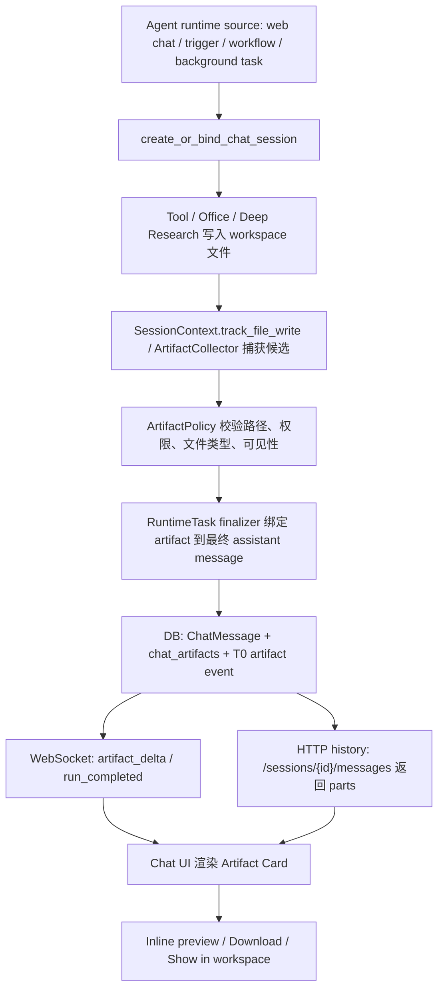

# Chat Artifact Delivery Redesign

> 日期：2026-06-20  
> 状态：第一轮主链路实装完成，legacy channel adapter 兼容面待后续收敛
> 范围：Web Chat / 后台任务完成回报 / 对话内文件打开 / 技术细节展示降级

## 1. 问题定义

当前 Hive 的文件产出链路是“文件写入 workspace，然后用户去 workspace 找”。这在存储上没有错，但在产品体验上不符合 Codex / Claude Code 的核心体感：任务发生在对话框内，结果也应该回到对话框内。

现状断点：

1. 后端 `SessionContext.recent_writes` 已经记录本轮文件写入，但主要用于压缩恢复和运行时 continuity，不是用户可见的交付物索引。
2. `web_chat_runtime` 在 run 完成时只持久化 assistant 文本并广播 `done`，没有把本轮产物作为 durable message part 写回聊天。
3. 前端收到 `done` 后只渲染 `content`，不会显示可打开的文件卡片。
4. `AgentChatSection` 当前用“显示技术详情”暴露 tool call trace，这属于诊断面，不应该成为默认聊天体验。

因此，当前缺的不是 workspace 文件能力，而是一个统一的 **Chat Artifact Delivery** 层：把 agent 生成的用户可见产物，作为对话消息的一部分持久化、广播、渲染和打开。

### 1.1 为什么上一轮修复后还需要继续改

上一轮修复解决的是旧架构里的几个明显裂口：

1. 终端工具卡完成后不再继续等待模型自觉结束。
2. `active run` 轮询不应覆盖正在 streaming 的 UI。
3. `done` / 空 assistant / 重复工具卡需要前端防御性去重。
4. `create_digital_employee`、Plan confirmation、用户澄清等用户可见工具结果需要能从 history 重建。

这些修复是必要的，但它们仍然运行在旧结构上：`ChatMessage` history、WebSocket live event、frontend local `chatMessages`、`activeSessionRun` polling、runtime summary 仍然是多套状态拼装。只要这些状态源继续平行存在，刷新后消失、重复气泡、loading 复活、后台任务完成但没有回报等问题就仍会以其他形态出现。

本次改造不是再补一个 UI guard，而是把 Web Chat / 后台任务 / artifact delivery 的底座改成 **single replayable transcript**：

1. runtime 先追加一条持久 transcript event；
2. T0 ledger、ChatMessage/API read model、artifact index、WebSocket、notification 都从这条 event 派生；
3. 前端只消费同一条 transcript 投影，不再把 live state 和 history state 各自拼装；
4. active run 只表示“还有未完成的 runtime”，不能再反向制造聊天内容或 loading 真相。

因此，上一轮是症状级修复；这一轮是底座级统一。上一轮不浪费，它提供了必须保留的边界用例和回归测试；但最终正确性必须落到统一 transcript event path。

## 2. 设计原则

1. **Chat-first**：对话框是任务主界面。用户不应该为了查看本轮结果跳到 workspace 手动寻找文件。
2. **Session transcript is the replayable workflow**：所有 agent runtime 触发来源，包括 web chat、trigger、schedule、workflow、deep research、subagent delegation、heartbeat/dream 后台任务，本质上都必须拥有一个可回放的 `ChatSession` transcript。session 不是 UI 附属物，而是运行过程、用户回看、T0 证据和产物引用的基础容器。纯平台守护任务，例如 health check、RLS 启动检查、migration、ops script，不应伪造成 agent session。
3. **Workspace remains source of truth**：文件仍然落在 agent workspace；chat artifact 只是面向对话的交付索引和打开入口。
4. **Durable before live**：WebSocket 只负责实时更新；真实状态必须先能从 DB/history 恢复。断线、刷新、后台完成后仍可看到产物。
5. **LLM writes meaning, platform attaches references**：assistant 负责用户可读总结；平台只附加结构化文件引用、权限校验、预览/下载入口，不机械生成语义结论。
6. **No technical trace in primary chat**：默认聊天只展示必要进度、最终回答和交付物。tool call JSON、压缩详情、内部 trace 进入 Activity Log 或调试面板。
7. **One path**：所有 web chat、trigger、workflow、deep research、office/code execution 产物都走同一个 session transcript + artifact delivery contract，不允许各自拼链接。

## 3. 目标形态

一次任务完成后，聊天里应该出现：

```text
Assistant:
已完成报告。我整理了三部分：市场概览、竞品对比、风险假设。

[Artifact Card]
report.docx
Word document · 128 KB · Open · Download · Show in workspace

[Artifact Card]
sources.md
Markdown · 42 KB · Open
```

后台任务也一样：即使用户离开页面，任务完成后也要在对应 session 中追加一条完成消息，包含结果摘要和 artifact cards。用户重新打开这个 session 时，不依赖旧 WebSocket 事件，也能看到同样结果。

如果任务不是由当前人工对话直接触发，例如定时任务、一次性后台任务或 trigger 唤醒，也必须创建或绑定一个明确的 `ChatSession` 窗口。这个 session 要像 Claude Code transcript / Codex rollout 一样可回放：能看到任务为什么启动、执行了哪些关键步骤、哪些权限/治理事件发生、最终回答是什么、生成了哪些可打开产物。

## 4. 统一数据契约

### 4.0 Transcript event 是唯一运行入口

所有用户可见消息、工具卡、治理事件、后台完成回报、artifact 引用，都先进入统一 transcript event：

```ts
type ChatTranscriptEvent = {
  event_id: string;
  sequence: number;
  tenant_id: string;
  agent_id: string;
  session_id: string;
  run_id?: string;
  parent_event_id?: string;
  root_session_id?: string;
  parent_session_id?: string;
  actor_type: "user" | "assistant" | "tool" | "agent" | "system" | "platform";
  event_type:
    | "session_started"
    | "user_message"
    | "assistant_delta"
    | "assistant_message"
    | "tool_call_started"
    | "tool_call_completed"
    | "tool_card"
    | "governance_event"
    | "artifact_attached"
    | "run_started"
    | "run_waiting_for_user"
    | "run_completed"
    | "run_failed"
    | "run_cancelled"
    | "compaction_boundary"
    | "session_sealed";
  visibility_scope: "direct_user" | "participants" | "agent_owner" | "tenant_admin" | "internal_audit";
  listed_surface: "chat" | "task_updates" | "activity_log" | "audit_only" | "hidden";
  content?: string;
  parts?: Array<ChatTextPart | ChatArtifactPart | ChatToolCardPart | ChatGovernancePart>;
  metadata?: Record<string, unknown>;
  created_at: string;
};
```

关键约束：

1. `event_id + sequence` 是 replay / reconnect / idempotency 的主轴。
2. WebSocket 只广播已经持久化的 event，不广播“还没有落盘的真相”。
3. HTTP history 返回的是 transcript projection，不再是另一套 ad hoc chat message list。
4. Frontend reducer 只接受 transcript event，并投影成 timeline；不得同时从 active run、runtime summary、history message 三条路径拼最终 UI。
5. `activeSessionRun` 只能作为恢复提示：告诉前端是否需要继续订阅 / 拉取 event；不能创建消息、不能复活 loading、不能覆盖已经 terminal 的 timeline。

新增统一 message part 概念：

```ts
type ChatArtifactPart = {
  type: "artifact";
  artifact_id: string;
  agent_id: string;
  session_id: string;
  runtime_task_id?: string;
  message_id?: string;
  path: string;              // workspace-relative path, e.g. workspace/reports/report.docx
  name: string;
  mime_type?: string;
  size?: number;
  modified_at?: string;
  preview_kind: "markdown" | "text" | "image" | "pdf" | "office" | "download";
  source: "workspace_write" | "office" | "deep_research" | "code_exec" | "workflow" | "trigger" | "subagent";
  created_at: string;
};
```

持久化决策：

1. 增加 `chat_artifacts` 表，按 `agent_id + session_id + runtime_task_id + path + snapshot` 去重。
2. `ChatMessage` 仍保存 assistant 文本；API 序列化时把关联 artifact 组装为 `parts=[text, artifact...]`。
3. T0 ledger 记录 artifact delivery event，作为 session 原始证据的一部分。
4. 不把 artifact 元数据塞进 assistant 自然语言文本，避免第二真相源。

### 4.1 唯一 session binding 契约

所有 agent-facing run 必须通过单一入口创建或绑定 session：

```text
create_or_bind_chat_session(
  tenant_id,
  agent_id,
  runtime_source,
  actor_type,
  runtime_task_id?,
  parent_session_id?,
  root_session_id?,
  initiating_user_id?,
  external_conversation_id?,
  source_channel?,
  title_seed?,
)
```

幂等键按优先级确定：

1. `runtime_task_id` 存在时：`tenant_id + agent_id + runtime_task_id` 是唯一绑定键。
2. 人工 web chat 继续同一窗口时：复用显式 `session_id`，不得根据最近消息猜测。
3. IM / 外部 channel 会话：`tenant_id + agent_id + source_channel + external_conversation_id + channel_thread_id`。
4. subagent / workflow leaf：`tenant_id + parent_session_id + runtime_task_id + runtime_source`，并强制写 `parent_session_id` 和 `root_session_id`。
5. trigger / schedule / heartbeat 没有人工父 session 时：每个 `RuntimeTask` 创建自己的后台 session，标题由 trigger/workflow/heartbeat 名称和启动时间生成。

纯平台任务不得调用该入口。RLS guard、health check、migration、ops script 只进入 system audit / ops log；只有它们解释某个 agent run 的阻断、审批或失败时，才作为 governance event 追加到既有 session。

### 4.2 Transcript 单一写入扇出

所有 runtime 事件必须通过 `append_session_event` 追加。禁止 runtime 各自直接写 `chat_messages`、T0 ledger、WebSocket 和 notification。

```text
append_session_event(
  session_id,
  event_type,
  actor_type,
  content?,
  parts?,
  runtime_task_id?,
  artifact_candidates?,
  governance_ref?,
  audit_ref?,
)
```

一次 append 的扇出顺序：

1. 先构造一条规范化 `ChatTranscriptEvent`，分配 `event_id + sequence`。
2. 同步追加 T0 ledger event，event 内保存稳定引用和必要原始内容，不复制大文件内容。
3. 在 DB transaction 中写 indexed transcript event / `chat_messages` read model / `chat_artifacts` / session metadata read model。
4. transaction 成功后再广播 WebSocket event。
5. notification 只保存跳转引用：`session_id + event_id + message_id?`，不得复制最终答案或 artifact 列表。
6. Activity Log / Audit 只保存 trace 和治理证据，不作为用户交付物的唯一入口。

如果 DB 写入成功但 WebSocket 失败，历史接口必须能恢复完整消息和 artifact。
如果 T0 ledger append 失败，agent run 不得静默完成；必须记录可恢复错误并进入 retry / failed path，避免 chat read model 与 T0 truth 分裂。

### 4.3 与 T0 / T2 / T3 记忆地基的关系

这次 transcript 改造 **不推翻 T0 -> T2 -> T3 的记忆地基**。它改变的是 runtime 事件进入系统的统一入口，不改变记忆层的职责、路径和晋升规则。

保持不变：

1. T0 仍然是原始、append-only、可回放的证据层。
2. T0 canonical path 仍然是 `memory/t0/sessions/<session_id>/segments/<segment_id>/source.md`，并保持 MD/XML event block 形态。
3. T2 仍然只从合格的 T0 session segment 生成一对一 Segment Package。
4. T3 仍然只从通过复查和治理的 T2 package 做跨 session 收敛。
5. `summary.md` / `labels.md` / `review.md` / `manifest.json` 的 T2 package contract 不因为 chat UI 改造而改变。

需要调整：

1. T0 的写入入口要从分散 hook / runtime finalizer 改成统一订阅或参与 `append_session_event`。也就是说，T0 不再自己猜“什么时候 idle/close 才写”，而是接收同一条 transcript event。
2. T0 event block 需要记录 `transcript_event_id`、`sequence`、`run_id`、`message_id?`、`artifact_ids?`，便于从 T2 source refs 回到聊天回放和 artifact。
3. 旧的 `ChatMessage` / `RuntimeTask.result_summary` / notification 不再能绕过 T0；它们只能是 transcript 的 read model 或 pointer。
4. 如果某个 agent-facing run 没有进入 transcript event path，就不能进入 T0，也不能进入 T2/T3。

不需要重做：

1. 不需要重新设计 T0 的四层记忆位置。
2. 不需要改变 T2/T3 的晋升逻辑。
3. 不需要把 T0 从 Markdown/XML 改成 JSONL。
4. 不需要把已有 T2/T3 文档推倒重写。

结论：T0 地基不变，但 T0 的上游接入点要统一。正确形态是：

```text
agent runtime
  -> append_session_event(event_id, sequence, payload)
      -> T0 source.md event block
      -> DB transcript/read model
      -> WebSocket projection
      -> notification pointer
  -> T2/T3 继续从 T0 segment 晋升
```

这样做后，Web UI 的可回放 transcript 和记忆系统的 T0 证据层共享同一条事件链，不再产生第二真相源。

### 4.4 T0 改造红线

这轮实现必须改 T0 的入口接线，但不得改变 T0 的地基。任何实现方案如果为了接入 transcript event 而重写 T0 语义、路径或晋升契约，必须视为错误方案。

允许改：

1. T0 writer 的上游触发点：从分散 runtime hook / idle / close / finalizer 改为统一 `append_session_event`。
2. T0 event block 的引用字段：新增 `transcript_event_id`、`sequence`、`run_id`、`message_id?`、`artifact_ids?`。
3. T0 写入幂等和顺序控制：用 transcript `event_id + sequence` 防重复、防乱序。
4. T0 与 DB/WebSocket/read model 的扇出关系：让 T0 进入同一 durable event transaction / finalizer 纪律。

禁止改：

1. 禁止改变 T0 作为 raw evidence layer 的定位；T0 不能开始做总结、评分、标签、晋升判断。
2. 禁止改变 canonical path：`memory/t0/sessions/<session_id>/segments/<segment_id>/source.md`。
3. 禁止把 T0 从 MD/XML event block 改成 JSONL、SQL-only 或纯 DB truth。
4. 禁止让 `ChatMessage`、runtime summary、notification、Activity Log 成为 T0 的替代 truth。
5. 禁止改变 T0 -> T2 一对一 Segment Package 关系，或让 T2/T3 直接读 transcript read model 绕过 T0。
6. 禁止因为 UI transcript 改造而重写 T2/T3 的文件结构、标签体系、review/gate 顺序。

验收标准：实现后应能证明同一条 runtime event 同时可从 chat transcript 回放和 T0 `source.md` source refs 追溯；但 T2/T3 的输入仍然只认 T0 segment，不认前端 timeline 或 DB read model。

## 5. 运行链路



关键点：

1. live 用户通过 WebSocket 立即看到 artifact。
2. 非 live 用户通过 history/polling 看到同一份 artifact。
3. 所有打开动作走现有文件权限检查，不绕过 `check_agent_access`。
4. 只允许用户可见产物进入 chat artifact；`memory/`、`evolution/`、`runtime_artifacts/`、内部 ledger 默认不展示。

### 5.1 Artifact 捕获矩阵

所有用户可见文件产物都进入同一个 `ArtifactCollector`。不同 runtime 只能提交候选，不允许自己拼 UI 链接。

| 来源 | 捕获点 | 进入候选的条件 | 默认 source |
| --- | --- | --- | --- |
| `write_file` / `edit_file` | filesystem tool handler + `SessionContext.track_file_write` | 写入 `workspace/` 且本轮 run 关联当前 session | `workspace_write` |
| Office create/apply/export | office tool handler | 输出 docx/xlsx/pptx/pdf 或用户请求的办公文件 | `office` |
| Deep Research export | deep research finalizer/exporter | 报告、引用清单、结构化结果文件 | `deep_research` |
| Code execution | sandbox artifact promotion | 从 sandbox 提升到 workspace 的用户可见结果 | `code_exec` |
| Workflow leaf | workflow runtime leaf finalizer | leaf 声明输出或写入 workspace 的结果 | `workflow` |
| Subagent | subagent run completion | 子任务返回的文件路径或写入 workspace 的结果 | `subagent` |
| Trigger / schedule | trigger task finalizer | 有用户应消费的结果或提醒 | `trigger` |
| Channel attachment | channel delivery resolver | agent 生成后被发送/准备发送的附件 | `workspace_write` |

不进入候选：

1. `memory/`、`evolution/`、`runtime_artifacts/`、`.staging/`、内部 ledger、prompt/cache/trace 文件。
2. secret、token、cookie、browser profile、原始凭据、带 PL4 标记的文件。
3. 纯中间文件、临时日志、未被用户请求且没有最终解释价值的 scratch 文件。
4. 超过 preview 上限且没有 download 权限的文件。

### 5.2 ArtifactPolicy 硬规则

`ArtifactPolicy` 只做权限、路径、安全和展示分类，不生成语义总结。

1. 路径必须是 workspace-relative，禁止绝对路径、`..`、symlink escape、`workspace/workspace` 影子路径。
2. 允许默认展示的根目录只有 `workspace/` 下的用户产物目录；内部系统目录默认拒绝。
3. 打开和下载必须复用现有 agent file API 权限检查，不允许前端直接拼物理路径。
4. MIME / preview 按内容探测和扩展名双重判断；冲突时降级为 download，不 inline 渲染。
5. 文本 / Markdown preview 需要大小上限；超限时展示摘要说明和下载按钮。
6. image/pdf/office 使用专用 preview；office 默认在 chat side panel 打开，并提供 `Open in Office`。
7. 同一路径多次写入必须生成 snapshot/version 引用，历史消息固定到当时 snapshot，不随 workspace 后续覆盖漂移。
8. 文件被删除或权限变化后，artifact card 保留历史记录，但打开时显示“文件已不可用/权限不足”，不静默消失。
9. 任何 secret scan / sensitivity check 命中高危时，artifact 不进入聊天卡片，并在 session 中追加可见的安全阻断事件或内部 audit 事件，具体取决于父 session 可见性。

## 6. 前端展示策略

主聊天：

1. Assistant 消息正常渲染 Markdown。
2. 消息下方渲染 artifact cards。
3. 点击 `Open`：
   - Markdown/text：chat 内 drawer/modal 预览。
   - image/pdf：chat 内预览。
   - docx/xlsx/pptx：复用 Office viewer / OnlyOffice 入口。
   - 其他文件：下载。
4. `Show in workspace` 只是辅助定位，不是主路径。

技术细节：

1. 移除主聊天 header 的“显示技术详情”按钮。
2. 默认不展示 tool call trace。
3. Plan confirmation、permission gate、用户澄清等用户必须参与的交互仍可 inline 展示。
4. 完整 tool trace 放入 Activity Log / 工作日志，不污染聊天主线。

## 7. 后台任务回报

所有 agent-facing `RuntimeTask` 完成时统一执行：

1. 启动时先创建或绑定一个 `ChatSession`，并把 `runtime_task_id` 写入 session/run metadata。
2. 执行过程中的关键状态、用户可见治理事件、可恢复进度写入同一个 session transcript。
3. 读取本 run 关联的 artifact candidates。
4. 执行 `ArtifactPolicy`。
5. 若有产物，绑定到对应 session 的完成消息。
6. 若没有 live WebSocket，仍然持久化消息并更新 session `last_message_at`。
7. 若任务来自 trigger / schedule / heartbeat，而没有人工当前打开的 session，则创建该任务自己的后台 session 窗口。notification 只能提示“有新任务回报”，不能替代 session transcript。

纯平台维护任务不走这条用户回报链路。RLS/health/migration/ops cleanup 这类没有 agent 判断、没有用户消费产物、只维护平台不变式的任务，应进入 system audit / ops log；只有当它们是某个 agent 工作轨迹的一部分，例如 agent 调用工具时被 preflight 拦截、触发 approval、或因为权限不足导致任务停止，才绑定到对应 `ChatSession`。

这保证“后台跑完无人看见”的问题不会再出现。

### 7.1 后台任务类型矩阵

| runtime source | 是否创建/绑定 session | 默认可见性 | 父子关系 | 完成回报 |
| --- | --- | --- | --- | --- |
| web chat | 是 | `chat` | root session | assistant final message + artifact cards |
| IM channel chat | 是 | `chat` 或 channel thread | external conversation 对应 root session | channel 摘要 + Web session artifact cards |
| trigger | 是 | 有结果时 `task_updates` / 无结果时 `activity_log` | 无人工父 session 时自建后台 session | 结果摘要、失败原因、artifact cards |
| schedule | 是 | 同 trigger | 同 trigger | 同 trigger |
| workflow root | 是 | 用户启动则 `chat`；后台启动则 `task_updates` | root 或当前 session child | root completion message |
| workflow leaf | 是 | 默认折叠 | `parent_session_id=workflow root session` | leaf event + leaf artifacts，父 session 汇总 |
| deep research | 是 | `chat` 或 `task_updates` | 当前 session child 或 root | research summary + exports |
| subagent | 是 | 默认折叠 | `parent_session_id` 必填 | child transcript + parent handoff summary |
| heartbeat | 是，内部 session | `hidden` / `activity_log` | agent internal root | 内部 summary，不进普通 chat |
| dream | 是，内部 session | `hidden` / `evolution` | agent internal root | evolution transcript |
| memory distillation | 是，内部 session | `hidden` / `evolution` | session package 或 agent internal root | distillation artifacts |
| eval | 是，内部或 admin session | `audit_only` | eval run root | eval report，不进普通用户 chat |
| platform RLS/health/migration/ops | 否，默认不创建 agent session | system audit only | 无 | system audit / ops log |

规则：只要 run 有 agent 判断、用户可消费结果、或解释 agent 工作轨迹，就必须有 transcript。只维护平台不变式的任务不是 agent run。

## 8. Session 可见性

`ChatSession` transcript 的存在性和用户可见性必须分开。所有 agent run 都必须拥有可回放 transcript，但不是所有 transcript 都应该进入普通用户的聊天列表。纯平台系统日志不属于 agent run，不能为了满足 transcript 原则而伪造成 agent session。

### 8.1 两层定义

1. **Transcript 存在性**：所有 agent runtime source 都必须创建或绑定 `ChatSession`。这是运行证据、T0 原始素材、回放、审计和 artifact 绑定的底层事实。
2. **用户可见性**：session 是否显示给普通用户、显示在哪个入口、是否折叠到父 session 下，由 session 创建时的可见性元数据决定，不能靠前端临时过滤或 source 字符串猜测。
3. **平台系统日志**：纯平台守护、RLS/health/migration/ops 检查只进入 system audit / ops log。它们只有在解释某个 agent work trajectory 时，才作为 governance event 挂回对应 session。

### 8.2 可见性分类

| 类型 | 是否创建 session | 普通用户可见 | 默认入口 |
| --- | --- | --- | --- |
| 用户直接发起的 web / IM 对话 | 是 | 是 | Chat 列表 |
| 用户在对话中启动的 Deep Research / Workflow / 长任务 | 是 | 是 | 原 session 或子 session |
| trigger / schedule 产生了用户应消费的结果 | 是 | 是 | 任务回报 / Chat 列表 |
| trigger / schedule 只是例行检查、无有效结果 | 是 | 默认不显示 | Run history / Activity Log |
| subagent 子任务 | 是 | 默认折叠 | 父 session 内展开 |
| heartbeat / dream / memory distillation | 是 | 不显示 | 内部运行日志 / 管理员审计 |
| T2 / T3 / skill / evolution / eval 内部治理 | 是 | 不显示 | 审计 / evolution log |
| agent 执行中触发的权限 / 安全 / approval 事件 | 绑定当前 session | 按父 session 可见性；阻断用户任务时可见 | 当前 session + Audit |
| agent 内部维护 / memory / evolution governance | 是，内部 session 或 evolution transcript | 不显示 | Activity Log / Audit / Evolution |
| 平台级 RLS / health / migration / ops 检查 | 否，默认不创建 agent session | 不显示 | System audit / ops log |

核心判断标准：**这个 session 是否承载了目标用户需要消费的结果。**

应该显示给用户的内容包括：最终答案、报告、文件、提醒、审批请求、失败原因、需要用户决策的澄清或确认。  
不应污染普通聊天列表的内容包括：内部学习、压缩、蒸馏、索引、治理、定时空跑、健康检查、内部 eval。

### 8.3 元数据契约

```text
session_kind:
  human_chat
  user_task
  trigger_run
  workflow_run
  delegation_child
  memory_evolution
  agent_internal_maintenance
  audit

actor_type:
  user
  agent
  system
  platform_job

runtime_source:
  web_chat
  trigger
  schedule
  workflow
  deep_research
  subagent
  heartbeat
  dream
  memory_distillation
  rls_guard
  health_check
  ops_script
  migration

visibility_scope:
  direct_user
  participants
  agent_owner
  tenant_admin
  internal_audit

listed_surface:
  chat
  task_updates
  activity_log
  audit_only
  hidden

parent_session_id:
  用于 subagent / workflow leaf / background child session 挂回父 session
```

`create_or_bind_chat_session` 必须同时确定 `session_kind + actor_type + runtime_source + visibility_scope + listed_surface + parent_session_id`。后续 UI 只消费这些明确字段，不再靠 `source_channel === heartbeat` 之类的临时规则过滤。

`agent_internal_maintenance` 只用于 heartbeat / dream / memory / evolution 等 agent 内部运行。纯平台 RLS/health/migration/ops 不使用这个 kind，也不创建 agent session。

### 8.4 可见性红线

1. 不允许无 session 的 run。
2. 不允许用户可见产物只落 workspace。
3. 不允许内部 heartbeat / dream / memory session 出现在普通聊天列表。
4. 不允许 notification 替代 session；notification 只能指向 session。
5. 不允许靠 source_channel 字符串临时猜可见性，必须在 session 创建时确定。
6. 不允许 subagent / workflow leaf 子 session 脱离父 session 漂浮在普通聊天列表。
7. 不允许纯平台守护 / DB / RLS / health 检查伪造成 agent session；只有 agent 参与或解释 agent work trajectory 的事件才进入 `ChatSession`。

### 8.5 父子 session UI 契约

1. `root_session_id` 表示一次用户可理解的总任务；`parent_session_id` 表示当前 run 的直接上级。
2. subagent / workflow leaf 默认不出现在普通聊天列表，只在父 session 内以可展开节点展示。
3. 父 session 必须显示子 session 的状态摘要：running / needs_input / failed / completed。
4. 子 session 失败时，父 session 必须有一条用户可见 summary，说明失败原因和下一步，而不是只在 Activity Log 里失败。
5. 子 session 的 artifact 默认挂在子节点下；父 final message 可以引用聚合后的关键 artifact。
6. 用户从 notification 打开后台 run 时，定位到 root session，并自动滚动到对应 completion / failure message。

### 8.6 非 Web 渠道契约

IM / 外部渠道不能直接渲染完整 artifact card，但不能走第二条交付路径。

1. Web session transcript 仍是完整 truth surface。
2. IM 中发送：短摘要 + 可授权打开链接 + 必要附件；链接指向同一 `session_id/message_id/artifact_id`。
3. 如果渠道支持附件上传，附件上传只是一种 delivery projection，不是 artifact 真相源。
4. 外部渠道消息失败，不影响 Web session 内 artifact 可见；失败事件写回同一 session。
5. `/new` 或外部 thread 切换必须创建新的 root session，不得把 channel history helper 和 session boundary 混成一个路径。

### 8.7 Notification / 未读契约

1. notification 只保存指针：`session_id + message_id + event_type`。
2. 未读状态以 session/message 为准，不以 notification 文本为准。
3. 后台 run 完成后，更新 session `last_message_at` 和 unread marker；用户点击通知进入对应消息。
4. notification 删除不删除 session transcript；session 删除/归档才影响聊天列表。
5. 同一 runtime task 重复 completion 不得产生多条 unread completion；由 finalizer 幂等保证。

### 8.8 Activity Log / 主聊天分工

主聊天展示用户需要理解和行动的内容：最终回答、进度摘要、artifact、审批/澄清/失败原因。
Activity Log 展示诊断和审计内容：tool call JSON、raw trace、压缩详情、governance evidence、内部 memory/evolution/eval event。

边界：

1. permission gate / approval request 属于用户行动项，必须 inline 出现在主聊天。
2. tool call 参数、raw stdout、internal scratchpad 不进主聊天。
3. 用户点击 artifact card 的“详情”可以打开最小 provenance：来自哪个 run、哪个 tool/source、文件路径和 snapshot；完整 trace 仍在 Activity Log。
4. Activity Log 不得成为用户产物唯一入口。

### 8.9 历史数据迁移

迁移策略采用 forward-first + lazy backfill：

1. 新 run 必须走新 contract。
2. 老 session 不做全量强制回填，避免用机械推断伪造历史 artifact 语义。
3. 用户打开老 session 时，可以基于历史 `SessionContext.recent_writes`、workspace 文件和 message 时间做只读候选提示，但必须标记为 legacy inferred，不写入 T0 truth。
4. 对生产关键 session 可运行一次性 backfill job，但输出必须是 migration report + review gate，不能静默改历史。
5. 老的 workspace-only 文件仍可在 workspace 找到；新 contract 只保证新 run 不再 workspace-only。

### 8.10 Finalizer 幂等契约

终态写入必须是单一 gate：

1. `RuntimeTask` terminal transition、assistant final message、artifact binding、`done` broadcast 必须在同一 finalizer 管理。
2. finalizer 对 `runtime_tasks` 行加锁或使用等价 compare-and-set；只有 active/running 状态能进入 terminal 写入。
3. 已 terminal 的 run 再次进入 finalizer 时，只返回既有 `message_id/artifact_ids`，不得插入第二条 assistant message。
4. WebSocket `done` 只能在 durable write 成功后发；不能先 broadcast 再补 DB。
5. 前端可以做防御性 dedupe，但不能把 dedupe 当正确性边界。
6. `ask_user_question`、`request_plan_mode`、`exit_plan_mode(needs_plan)`、`create_digital_employee(success)` 这类用户可见工具卡可以是当前 turn 的终端输出。工具结果持久化成功后，runtime 必须立即 terminalize run 并广播空 `done` 用于清除 live loading；不能继续等待模型自觉结束。
7. 刷新后的历史回放必须从 persisted `tool_call` 重建同一张用户可见卡片；实时 WebSocket 路径和 DB history 路径不得有两套解析逻辑。

## 9. 验收红线

1. Web chat 生成 `workspace/report.md` 后，最终 assistant 消息必须带 artifact card；刷新页面后仍存在。
2. 断开 WebSocket 后任务完成，重新打开 session 仍能看到完成消息和 artifact card。
3. Deep Research / Office / code execution / workflow 产物不能各自拼接独立 UI 路径，必须走统一 `ChatArtifactPart`。
4. `memory/`、`evolution/`、`runtime_artifacts/` 不应默认出现在用户聊天产物卡里。
5. 主聊天不再出现“显示技术详情”按钮；tool call trace 仍可在 Activity Log 查询。
6. 文件打开必须复用现有 agent file API 权限，不允许前端直接拼无鉴权物理路径。
7. 任何 trigger / schedule / workflow / heartbeat agent 后台 run 都必须能定位到一个可回放 `ChatSession`；不得只写 `RuntimeTask.result_summary`、workspace 文件或 notification。
8. 普通聊天列表必须只显示 `listed_surface=chat` 或明确可见的用户任务 session；内部 session 只能通过 Activity Log / Audit / Evolution 等入口查看。
9. 终端工具卡出现后，聊天输入区不得继续显示“Agent 正在继续执行”；刷新后该工具卡仍必须存在，不得变成空消息、消失或被隐藏成技术细节。
10. T0 的入口必须接到 `append_session_event`，但 T0 canonical path、MD/XML block 形态、raw evidence 定位、T0 -> T2 -> T3 晋升契约不得变化。

### 9.1 测试矩阵

Backend 必测：

1. `create_or_bind_chat_session` 对同一 `runtime_task_id` 幂等，只创建一个 session。
2. web chat 文件写入后，final assistant message 绑定 artifact；history reload 返回 `parts=[text, artifact]`。
3. WebSocket 断开后 run 完成，DB/history 仍可读完成消息和 artifact。
4. 同一 `RuntimeTask` 被重复 finalizer 调用，只产生一条 assistant message 和一组 artifact。
5. trigger 有结果时创建后台 session；trigger 空跑时只进 activity/run history，不进普通 chat。
6. workflow leaf / subagent 子 session 必须有 `parent_session_id/root_session_id`，普通 chat list 不漂浮显示。
7. permission/preflight 阻断事件绑定当前 session，并同时写 audit ref。
8. RLS/health/migration/ops script 不创建 agent session。
9. `memory/`、`evolution/`、`runtime_artifacts/`、secret 文件不会生成 chat artifact。
10. 同一路径覆盖写入生成 snapshot/version，旧 message 打开旧 snapshot。
11. 文件删除或权限变化后，artifact card 保留但打开失败可解释。
12. IM channel delivery 失败时，Web session artifact 仍可见，并写回失败 event。
13. `append_session_event` 写入后，T0 `source.md` 包含同一 `transcript_event_id/sequence`；T2 source refs 仍然只指向 T0 segment，不直接指向前端 timeline 或 runtime summary。

Frontend 必测：

1. artifact part 渲染为 card，不混进 assistant Markdown 文本。
2. Markdown/text/image/pdf/office/download preview 分流正确。
3. `Show in workspace` 只是辅助入口；Open 默认在 chat side panel。
4. 主聊天不显示“显示技术详情”按钮。
5. approval / permission gate 仍 inline 展示。
6. 子 session 在父 session 中折叠展示，失败状态可见。
7. notification 点击后定位到对应 completion/failure message。
8. 老 session legacy inferred artifact 不写成真实 artifact card，除非经过 backfill gate。

## 10. 实施顺序

1. Backend red tests：`append_session_event` sequence/idempotency、T0 append、history replay、WS after durable write、active-run 不制造消息。
2. Backend schema：新增 indexed transcript event 表或等价持久层；新增 `chat_artifacts` 独立表；补 `ChatSession` metadata 字段或 metadata contract；必要 migration 一次完成。
3. Backend service：实现 `create_or_bind_chat_session`、`append_session_event`、T0 writer adapter、transcript read projection、`ArtifactCollector`、`ArtifactPolicy`、finalizer binding。
4. Runtime coverage：web chat、trigger/schedule、workflow、deep research、office、code execution、subagent、heartbeat/dream/memory 内部 session 全部接入同一 contract。
5. Channel coverage：IM/channel delivery 使用同一 transcript/artifact ref；外部消息只做 projection。
6. Frontend red tests：transcript reducer replay、WS/history 等价、artifact card、preview、history reload、child session folding、notification 定位、移除 primary trace toggle。
7. Frontend implementation：用 `ChatTranscriptEvent` reducer 替代多状态拼装；`AgentChatMessage.parts`、artifact card、side panel preview、Activity Log 入口调整、session list visibility filter。
8. Legacy handling：实现 lazy inferred 只读提示或明确不回填；如做 backfill，必须输出 report + review gate。
9. Regression：backend chat/runtime/T0/file permission tests、frontend chat tests、build、diff check。

## 11. 已定决策

1. `chat_artifacts` 使用独立表，不把结构化 artifact 塞进 `ChatMessage.content`。
2. 后台 agent run 每个 `RuntimeTask` 绑定一个明确 session；无人工父 session 时自建后台 session。
3. notification 只作为跳转入口，不承载最终结果。
4. Office 第一入口是 chat side panel / drawer，保留 `Open in Office`。
5. finalizer 是 durable truth gate；WebSocket 和 notification 都在 durable write 后发生。
6. 纯平台 RLS/health/migration/ops 不创建 agent session。
7. 老数据 forward-first，不机械伪造历史 artifact truth。
8. 本次改造不重做 T0/T2/T3；只把 T0 的上游事件入口统一到 `append_session_event`，并补 `transcript_event_id/sequence` 桥接字段。
9. 前端最终状态只能来自 transcript projection；`active run`、runtime summary、notification 都不能成为第二条聊天内容路径。

## 12. 2026-06-20 实装状态

本轮已经落地的主链路：

1. 新增 `chat_transcript_events` 持久事件表，作为 session replay / refresh / websocket 幂等的 indexed event stream。
2. 新增 `append_session_event(...)`，统一追加 `ChatTranscriptEvent`，按需 materialize `ChatMessage` read model，并桥接同一事件到 T0 `memory/t0/sessions/<session_id>/segments/<segment_id>/source.md`。
3. `web_chat_runtime` 的 user / assistant / tool / runtime event 主路径已改为 `append_session_event(...)`。其中 terminal `tool_call done` 已改成 durable write before WebSocket broadcast，并携带 `transcript_event_id/sequence`。
4. `task_executor` 的后台 task session 已改为 `append_session_event(...)`，不再直接写 `ChatMessage + append_t0_session_event` 两条路径；task 的 user/tool/assistant 事件同时进入 transcript 和 T0。
5. 新增 `GET /agents/{agent_id}/sessions/{session_id}/transcript`，按 `sequence` 返回可重放事件；旧 `/messages` 保留为 legacy fallback / read model。
6. 前端新增 `TranscriptReplayState` / `applyTranscriptEvent(...)` / `replayTranscriptEvents(...)` reducer。选中 session 时优先读取 `/transcript`，旧数据为空时才 fallback 到 `/messages`。
7. 前端 terminal tool card（用户澄清、Plan 确认、创建员工成功、HR preview）会清理 active-run/loading 状态，不再显示“Agent 正在继续执行”。
8. 主聊天顶部 runtime 技术指标条已移除；runtime summary 只保留为后台观测，不作为 primary chat transcript UI。
9. 删除 session 时按 `chat_artifacts -> chat_transcript_events -> chat_messages -> chat_sessions` 顺序清理，避免新 transcript 表和旧 read model 外键互相卡住。

当前仍是兼容面的路径：

1. 多个 channel adapter 里仍存在直接 `ChatMessage(...)` read-model 写入。这些属于历史 IM/channel compatibility surface，不能继续扩展为新的运行真相源。
2. 新的 agent runtime 主路径必须新增或绑定 `ChatSession`，并通过 `append_session_event(...)` 进入 transcript；禁止新增直接写 `ChatMessage` 或直接写 T0 的 runtime finalizer。
3. `hooks_setup.py` 中的 T0 idle/close seal 保留：它是 T0 segment 边界和 T2 构建触发器，不是聊天消息真相源。
4. `t0_logger.py` 保留 legacy import/manual compatibility；新的 session truth 不允许回到 `logs/YYYY-MM-DD/**`。

已验证：

1. Backend：`pytest tests/services/test_chat_transcript.py tests/services/test_task_executor.py tests/services/test_web_chat_runtime.py tests/api/test_chat_sessions_permissions.py tests/services/test_chat_artifact_delivery.py tests/services/test_chat_message_parts.py -q` -> 70 passed。
2. Backend：`pytest tests/api/test_chat_session_runs.py tests/services/test_web_session_contract.py tests/architecture/test_session_context_contract.py -q` -> 8 passed。
3. Backend：`ruff check app/services/chat_transcript.py app/services/web_chat_runtime.py app/services/task_executor.py app/api/chat_sessions.py app/models/chat_transcript_event.py tests/services/test_chat_transcript.py tests/services/test_task_executor.py tests/services/test_web_chat_runtime.py tests/api/test_chat_sessions_permissions.py` -> pass。
4. Frontend：`vitest run src/pages/agent-detail/chatRuntime.test.ts src/api/adapter-cleanup.test.ts src/pages/agent-detail/AgentDetailSections.test.tsx` -> 83 passed。
5. Frontend：`npm run build` -> pass。
