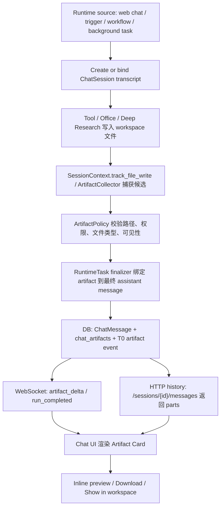

# Chat Artifact Delivery Redesign

> 日期：2026-06-20  
> 状态：讨论稿  
> 范围：Web Chat / 后台任务完成回报 / 对话内文件打开 / 技术细节展示降级

## 1. 问题定义

当前 Hive 的文件产出链路是“文件写入 workspace，然后用户去 workspace 找”。这在存储上没有错，但在产品体验上不符合 Codex / Claude Code 的核心体感：任务发生在对话框内，结果也应该回到对话框内。

现状断点：

1. 后端 `SessionContext.recent_writes` 已经记录本轮文件写入，但主要用于压缩恢复和运行时 continuity，不是用户可见的交付物索引。
2. `web_chat_runtime` 在 run 完成时只持久化 assistant 文本并广播 `done`，没有把本轮产物作为 durable message part 写回聊天。
3. 前端收到 `done` 后只渲染 `content`，不会显示可打开的文件卡片。
4. `AgentChatSection` 当前用“显示技术详情”暴露 tool call trace，这属于诊断面，不应该成为默认聊天体验。

因此，当前缺的不是 workspace 文件能力，而是一个统一的 **Chat Artifact Delivery** 层：把 agent 生成的用户可见产物，作为对话消息的一部分持久化、广播、渲染和打开。

## 2. 设计原则

1. **Chat-first**：对话框是任务主界面。用户不应该为了查看本轮结果跳到 workspace 手动寻找文件。
2. **Session transcript is the replayable workflow**：所有 agent runtime 触发来源，包括 web chat、trigger、schedule、workflow、deep research、subagent delegation、heartbeat/dream 后台任务，本质上都必须拥有一个可回放的 `ChatSession` transcript。session 不是 UI 附属物，而是运行过程、用户回看、T0 证据和产物引用的基础容器。纯平台守护任务，例如 health check、RLS 启动检查、migration、ops script，不应伪造成 agent session。
3. **Workspace remains source of truth**：文件仍然落在 agent workspace；chat artifact 只是面向对话的交付索引和打开入口。
4. **Durable before live**：WebSocket 只负责实时更新；真实状态必须先能从 DB/history 恢复。断线、刷新、后台完成后仍可看到产物。
5. **LLM writes meaning, platform attaches references**：assistant 负责用户可读总结；平台只附加结构化文件引用、权限校验、预览/下载入口，不机械生成语义结论。
6. **No technical trace in primary chat**：默认聊天只展示必要进度、最终回答和交付物。tool call JSON、压缩详情、内部 trace 进入 Activity Log 或调试面板。
7. **One path**：所有 web chat、trigger、workflow、deep research、office/code execution 产物都走同一个 session transcript + artifact delivery contract，不允许各自拼链接。

## 3. 目标形态

一次任务完成后，聊天里应该出现：

```text
Assistant:
已完成报告。我整理了三部分：市场概览、竞品对比、风险假设。

[Artifact Card]
report.docx
Word document · 128 KB · Open · Download · Show in workspace

[Artifact Card]
sources.md
Markdown · 42 KB · Open
```

后台任务也一样：即使用户离开页面，任务完成后也要在对应 session 中追加一条完成消息，包含结果摘要和 artifact cards。用户重新打开这个 session 时，不依赖旧 WebSocket 事件，也能看到同样结果。

如果任务不是由当前人工对话直接触发，例如定时任务、一次性后台任务或 trigger 唤醒，也必须创建或绑定一个明确的 `ChatSession` 窗口。这个 session 要像 Claude Code transcript / Codex rollout 一样可回放：能看到任务为什么启动、执行了哪些关键步骤、哪些权限/治理事件发生、最终回答是什么、生成了哪些可打开产物。

## 4. 统一数据契约

新增统一 message part 概念：

```ts
type ChatArtifactPart = {
  type: "artifact";
  artifact_id: string;
  agent_id: string;
  session_id: string;
  runtime_task_id?: string;
  message_id?: string;
  path: string;              // workspace-relative path, e.g. workspace/reports/report.docx
  name: string;
  mime_type?: string;
  size?: number;
  modified_at?: string;
  preview_kind: "markdown" | "text" | "image" | "pdf" | "office" | "download";
  source: "workspace_write" | "office" | "deep_research" | "code_exec" | "workflow" | "trigger";
  created_at: string;
};
```

持久化建议：

1. 增加 `chat_artifacts` 表，按 `agent_id + session_id + runtime_task_id + path + snapshot` 去重。
2. `ChatMessage` 仍保存 assistant 文本；API 序列化时把关联 artifact 组装为 `parts=[text, artifact...]`。
3. T0 ledger 记录 artifact delivery event，作为 session 原始证据的一部分。
4. 不把 artifact 元数据塞进 assistant 自然语言文本，避免第二真相源。

## 5. 运行链路



关键点：

1. live 用户通过 WebSocket 立即看到 artifact。
2. 非 live 用户通过 history/polling 看到同一份 artifact。
3. 所有打开动作走现有文件权限检查，不绕过 `check_agent_access`。
4. 只允许用户可见产物进入 chat artifact；`memory/`、`evolution/`、`runtime_artifacts/`、内部 ledger 默认不展示。

## 6. 前端展示策略

主聊天：

1. Assistant 消息正常渲染 Markdown。
2. 消息下方渲染 artifact cards。
3. 点击 `Open`：
   - Markdown/text：chat 内 drawer/modal 预览。
   - image/pdf：chat 内预览。
   - docx/xlsx/pptx：复用 Office viewer / OnlyOffice 入口。
   - 其他文件：下载。
4. `Show in workspace` 只是辅助定位，不是主路径。

技术细节：

1. 移除主聊天 header 的“显示技术详情”按钮。
2. 默认不展示 tool call trace。
3. Plan confirmation、permission gate、用户澄清等用户必须参与的交互仍可 inline 展示。
4. 完整 tool trace 放入 Activity Log / 工作日志，不污染聊天主线。

## 7. 后台任务回报

所有 agent-facing `RuntimeTask` 完成时统一执行：

1. 启动时先创建或绑定一个 `ChatSession`，并把 `runtime_task_id` 写入 session/run metadata。
2. 执行过程中的关键状态、用户可见治理事件、可恢复进度写入同一个 session transcript。
3. 读取本 run 关联的 artifact candidates。
4. 执行 `ArtifactPolicy`。
5. 若有产物，绑定到对应 session 的完成消息。
6. 若没有 live WebSocket，仍然持久化消息并更新 session `last_message_at`。
7. 若任务来自 trigger / schedule / heartbeat，而没有人工当前打开的 session，则创建该任务自己的后台 session 窗口。notification 只能提示“有新任务回报”，不能替代 session transcript。

纯平台维护任务不走这条用户回报链路。RLS/health/migration/ops cleanup 这类没有 agent 判断、没有用户消费产物、只维护平台不变式的任务，应进入 system audit / ops log；只有当它们是某个 agent 工作轨迹的一部分，例如 agent 调用工具时被 preflight 拦截、触发 approval、或因为权限不足导致任务停止，才绑定到对应 `ChatSession`。

这保证“后台跑完无人看见”的问题不会再出现。

## 8. Session 可见性

`ChatSession` transcript 的存在性和用户可见性必须分开。所有 agent run 都必须拥有可回放 transcript，但不是所有 transcript 都应该进入普通用户的聊天列表。纯平台系统日志不属于 agent run，不能为了满足 transcript 原则而伪造成 agent session。

### 8.1 两层定义

1. **Transcript 存在性**：所有 agent runtime source 都必须创建或绑定 `ChatSession`。这是运行证据、T0 原始素材、回放、审计和 artifact 绑定的底层事实。
2. **用户可见性**：session 是否显示给普通用户、显示在哪个入口、是否折叠到父 session 下，由 session 创建时的可见性元数据决定，不能靠前端临时过滤或 source 字符串猜测。
3. **平台系统日志**：纯平台守护、RLS/health/migration/ops 检查只进入 system audit / ops log。它们只有在解释某个 agent work trajectory 时，才作为 governance event 挂回对应 session。

### 8.2 可见性分类

| 类型 | 是否创建 session | 普通用户可见 | 默认入口 |
| --- | --- | --- | --- |
| 用户直接发起的 web / IM 对话 | 是 | 是 | Chat 列表 |
| 用户在对话中启动的 Deep Research / Workflow / 长任务 | 是 | 是 | 原 session 或子 session |
| trigger / schedule 产生了用户应消费的结果 | 是 | 是 | 任务回报 / Chat 列表 |
| trigger / schedule 只是例行检查、无有效结果 | 是 | 默认不显示 | Run history / Activity Log |
| subagent 子任务 | 是 | 默认折叠 | 父 session 内展开 |
| heartbeat / dream / memory distillation | 是 | 不显示 | 内部运行日志 / 管理员审计 |
| T2 / T3 / skill / evolution / eval 内部治理 | 是 | 不显示 | 审计 / evolution log |
| agent 执行中触发的权限 / 安全 / approval 事件 | 绑定当前 session | 按父 session 可见性；阻断用户任务时可见 | 当前 session + Audit |
| agent 内部维护 / memory / evolution governance | 是，内部 session 或 evolution transcript | 不显示 | Activity Log / Audit / Evolution |
| 平台级 RLS / health / migration / ops 检查 | 否，默认不创建 agent session | 不显示 | System audit / ops log |

核心判断标准：**这个 session 是否承载了目标用户需要消费的结果。**

应该显示给用户的内容包括：最终答案、报告、文件、提醒、审批请求、失败原因、需要用户决策的澄清或确认。  
不应污染普通聊天列表的内容包括：内部学习、压缩、蒸馏、索引、治理、定时空跑、健康检查、内部 eval。

### 8.3 建议元数据

```text
session_kind:
  human_chat
  user_task
  trigger_run
  workflow_run
  delegation_child
  memory_evolution
  system_maintenance
  audit

actor_type:
  user
  agent
  system
  platform_job

runtime_source:
  web_chat
  trigger
  schedule
  workflow
  deep_research
  subagent
  heartbeat
  dream
  memory_distillation
  rls_guard
  health_check
  ops_script
  migration

visibility_scope:
  direct_user
  participants
  agent_owner
  tenant_admin
  internal_audit

listed_surface:
  chat
  task_updates
  activity_log
  audit_only
  hidden

parent_session_id:
  用于 subagent / workflow leaf / background child session 挂回父 session
```

`create_or_bind_chat_session` 必须同时确定 `session_kind + actor_type + runtime_source + visibility_scope + listed_surface + parent_session_id`。后续 UI 只消费这些明确字段，不再靠 `source_channel === heartbeat` 之类的临时规则过滤。

### 8.4 可见性红线

1. 不允许无 session 的 run。
2. 不允许用户可见产物只落 workspace。
3. 不允许内部 heartbeat / dream / memory session 出现在普通聊天列表。
4. 不允许 notification 替代 session；notification 只能指向 session。
5. 不允许靠 source_channel 字符串临时猜可见性，必须在 session 创建时确定。
6. 不允许 subagent / workflow leaf 子 session 脱离父 session 漂浮在普通聊天列表。
7. 不允许纯平台守护 / DB / RLS / health 检查伪造成 agent session；只有 agent 参与或解释 agent work trajectory 的事件才进入 `ChatSession`。

## 9. 验收红线

1. Web chat 生成 `workspace/report.md` 后，最终 assistant 消息必须带 artifact card；刷新页面后仍存在。
2. 断开 WebSocket 后任务完成，重新打开 session 仍能看到完成消息和 artifact card。
3. Deep Research / Office / code execution / workflow 产物不能各自拼接独立 UI 路径，必须走统一 `ChatArtifactPart`。
4. `memory/`、`evolution/`、`runtime_artifacts/` 不应默认出现在用户聊天产物卡里。
5. 主聊天不再出现“显示技术详情”按钮；tool call trace 仍可在 Activity Log 查询。
6. 文件打开必须复用现有 agent file API 权限，不允许前端直接拼无鉴权物理路径。
7. 任何 trigger / schedule / workflow / heartbeat agent 后台 run 都必须能定位到一个可回放 `ChatSession`；不得只写 `RuntimeTask.result_summary`、workspace 文件或 notification。
8. 普通聊天列表必须只显示 `listed_surface=chat` 或明确可见的用户任务 session；内部 session 只能通过 Activity Log / Audit / Evolution 等入口查看。

## 10. 实施顺序

1. Backend red tests：finalized web chat run with file write creates durable artifact part；history reload returns artifact part。
2. Backend implementation：`ChatArtifactPart` schema、`chat_artifacts` persistence、`ArtifactCollector`、`ArtifactPolicy`、finalizer binding。
3. Frontend red tests：artifact part renders card；click opens preview/download；history reload still renders。
4. Frontend implementation：`AgentChatMessage.artifacts`、artifact card、inline preview、移除 primary trace toggle。
5. Runtime coverage：web chat、trigger、workflow/deep research、office/code execution 全部接入同一 contract。
6. Regression：run chat runtime tests、frontend chat tests、file permission tests。

## 11. 待确认点

1. `chat_artifacts` 是独立表，还是先用 `ChatMessage.metadata_json` / JSON content 过渡。建议独立表，避免语义文本和结构化产物混在一起。
2. 后台 session 的列表和命名规则。建议每个后台 run 创建自己的 session 窗口，标题由 trigger/workflow 名称和启动时间生成，通知中心只作为跳转入口。
3. Office 文档打开方式：直接在 chat drawer 中嵌 OnlyOffice，还是跳转 Office tab 并定位文件。建议第一版 drawer/side panel 打开，保留 “Open in Office”。
