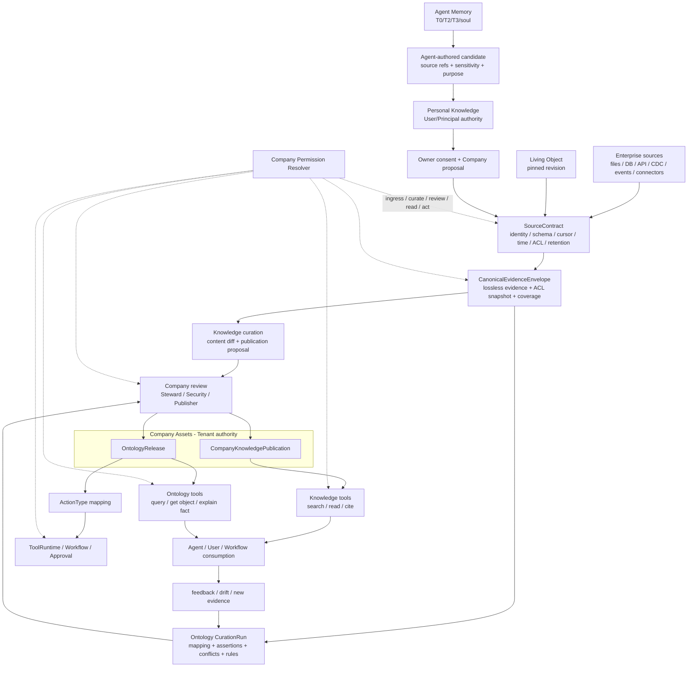
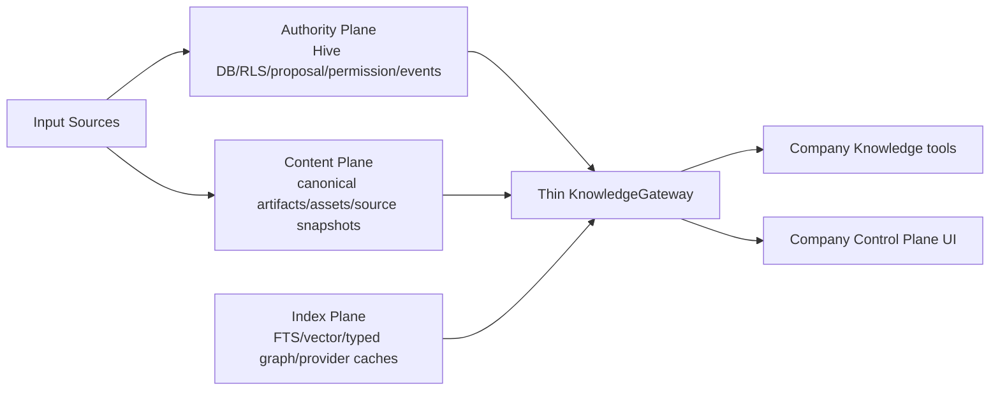
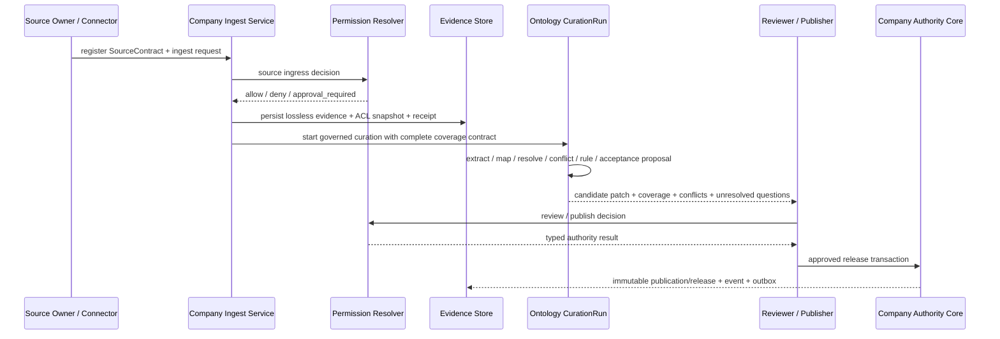
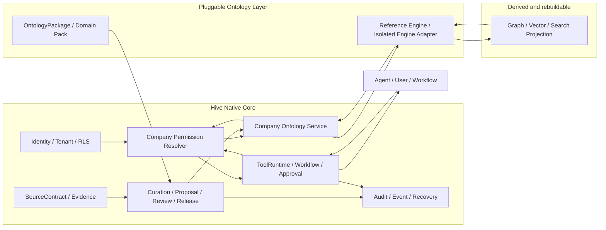
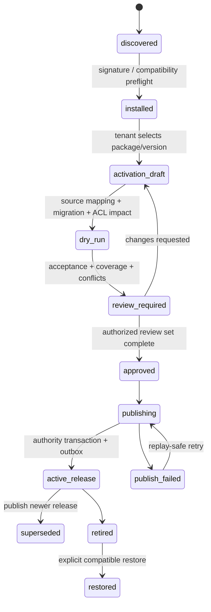
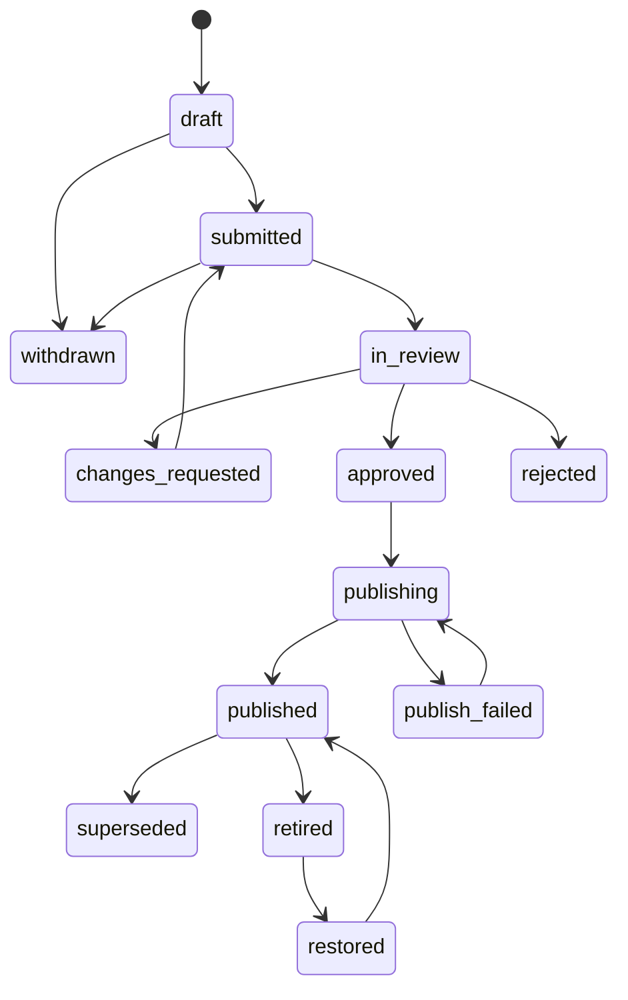
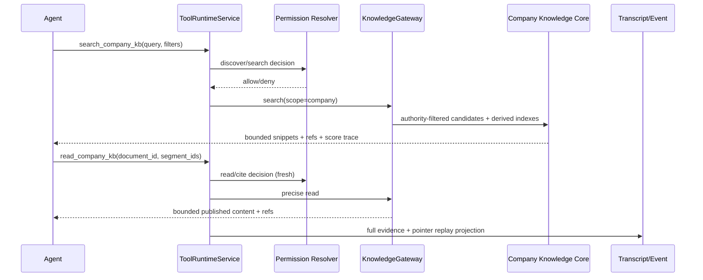

# Company Knowledge Base 权威规格

> 首版日期：2026-07-07
> 重基线日期：2026-07-14
> 最近修订日期：2026-07-15
> 状态：当前 canonical 施工规格；双层产品与原生/可插拔责任边界已锁定，独立 package/repo/service 的抽象条件与首批 Domain Pack 仍需按 §18 定义
> 当前代码基线：Hive checkout `501db6555dae374e5fcf43a6fdcfe8a3dd89343e`
> 交付纪律：实现必须一次完成 Input、Authority、Execution、Evidence、Recovery、Consumption、Acceptance 七原子，不采用 MVP、分期欠债或默认关闭的半成品

## 0. 文档权威与覆盖关系

本文是 Company Knowledge Base 的唯一专项施工规格，负责最终数据模型、生命周期、权限、API、Agent tools、索引、UI、迁移、恢复、观测和验收。

它服从并引用：

- `docs/knowledge-substrate-plugin-architecture-2026-07-09.md`：Authority / Content / Index 三平面与 provider 边界；
- `docs/personal-company-knowledge-tool-boundary-2026-07-10.md`：Personal/Company Knowledge Tool-first、current-turn 与 replay 契约；
- `docs/agent-permission-governance-spec-2026-07-07.md`：主体、动作、资源和统一权限判定；
- `docs/hive-living-object-native-surface-architecture-2026-07-10.md`：Living Object publication/reference/revision 边界；
- `docs/knowledge-pyramid-agent-person-org-2026-07-03.md`：Agent -> Personal -> Company ownership chain；
- `docs/runtime-model-agency-constraint-audit-2026-07-13.md`：Model Agency Boundary 与知识工具披露规则。

其中 Knowledge substrate 文档的 provider contract 只覆盖 Content/Index 可替换能力；Ontology 的双层产品定义、Domain Package、Engine SPI、CurationRun 与 Release authority 以本文为准。本文不把 Ontology 再定义成第四个 knowledge authority plane。

以下旧结论被本文覆盖：

1. Personal/Company KB 自动 prefetch、KB Hint、candidate injection、dynamic suffix 注入；
2. Graphiti 为默认 provider、SAG 必须并行接入；
3. `org | team` 各自成为平行知识真相根；
4. Personal document 原地翻转 scope 成为 Company truth；
5. `KnowledgeGrant` 与 `knowledge_acl_bindings` 各自形成权限真相；
6. M1/M2 或 Phase 0-5 式分批施工。

`docs/company-knowledge-ontology-plane-plan-2026-06-20.md` 仅保留历史研究价值，不再是实施入口。

## 1. 当前真实状态

### 1.1 状态结论

当前 Company KB 是 **已知缺失（Missing）**，不是局部闭环。

| 能力 | 当前状态 | 当前真实边界 |
|---|---|---|
| Company authority/runtime | 缺失 | 无 Company 专用 proposal、publish、ACL decision、API、tools、search/read、provider 或 UI 消费 |
| Personal Knowledge | 已有真实底座 | `knowledge_*` 表族、Personal ingest/search/read/grant/proposal/UI 已存在，但全部受 Personal ownership 约束 |
| Legacy company files | 退役目标闭环 | 只保留 tenant admin 的只读盘点与 evidence ZIP 导出，Agent 不可消费 |
| Company Context | 局部闭环 | `company_profile.md`、`org_structure.md` 是受信任治理上下文，不是 Company KB 检索内容 |

机械事实：

- `backend/app/models/knowledge.py::KnowledgeDocument` 明确写明当前 runtime 只使用 person scope；
- `KnowledgeGrant` 明确是 Personal permission edge；
- `PersonalKnowledgeProposal` 只表示 Agent -> Owner Personal KB candidate；
- `backend/app/tools/handlers/knowledge.py` 当前只有 Personal propose/search/read；
- `backend/app/runtime/invoker.py` 不会在 Turn 开始前预取 Personal 或 Company KB；
- `backend/tests/architecture/test_company_knowledge_retirement.py` 阻止旧 Company surface/provider 复活；
- `frontend/src/pages/ControlPlane.tsx` 明确显示 Company KB 当前未实现。
- `backend/app/models/installed_plugin.py` 与 `/enterprise/plugins` 是 legacy plugin projection；新外部能力走 Trust Gate，但当前 normalized component types 只有 slash command、skill、subagent、hook、MCP server，没有 Ontology Package/Engine；
- `ToolRuntimeService`、capability policy、External Capability Trust Gate/activation 可复用为 Ontology tools 与 package admission 的工程底座，但不能被描述成 Ontology runtime 已落地。

### 1.2 七原子基线

| 原子 | 当前状态 | 缺口 |
|---|---|---|
| Input | 缺失 | 无 Company upload/URL/connector/Personal promotion/legacy import proposal 入口 |
| Authority | 缺失 | 无 tenant curator、department/role/resource ACL、deny precedence、source ACL 决策 |
| Execution | 缺失 | 无 Company API/tool/service/Gateway 唯一入口 |
| Evidence | 缺失 | 无 Company proposal/review/publish/search/deny/retire domain evidence |
| Recovery | 缺失 | 无幂等、并发 review、publish rollback、reindex reconcile |
| Consumption | 缺失 | Agent 无 Company search/read tools，UI 无 Company operating surface |
| Acceptance | 缺失 | 只有“不存在”的负向测试，无正向 E2E |

任何后续文档不得把 schema、route、provider adapter 或 UI shell 单独称为 Company KB 已落地。

## 2. 产品定位、企业资产链与双层定义

### 2.1 Agent -> Personal -> Company 企业资产链

Company Knowledge Base 是 tenant/company authority plane，不是“全员共享的 Personal KB”，也不是旧文件目录。既有三层企业资产定义继续成立：知识从 Agent 的学习证据出发，经个人权威沉淀，再通过显式治理进入企业权威面。

| 层 | 所有者 | 权威资产 | 进入企业层的方式 |
|---|---|---|---|
| Agent Memory | Agent | 学习、反思、行为演化、T0/T2/T3/soul | 生成带完整 evidence 的 candidate，不直接进入企业真相 |
| Personal Knowledge | User/Principal | 个人 canonical workspace、直接资料、跨 Agent 的个人资产 | Owner consent + Company proposal |
| Company Assets | Tenant/Company | 组织资料、政策、SOP、事实、对象、关系、规则、决策和发布历史 | Company review + publish decision |

这里的“企业资产”是上位概念。它包含 Company Knowledge Publication 和 Ontology Release，但不把二者压成同一种数据或同一个读取接口。

### 2.2 Company Knowledge 与 Ontology 双层定义

| 维度 | Company Knowledge / 企业知识资产层 | Ontology / 业务语义与流程层 |
|---|---|---|
| 回答的问题 | 公司有哪些已发布资料、政策、SOP、报告、决策和证据 | 公司里有哪些业务对象、事实、关系、事件、规则和可用动作 |
| 核心产物 | `CompanyKnowledgePublication` | `OntologyRelease` |
| 典型形态 | 文档、Markdown、原文件引用、Living Object pinned revision、结构化 publication | Object/Property/Link/Event/Assertion/Rule/Action 的 typed package |
| 主要消费 | search、read、cite、review | query、traverse、explain fact、simulate action、map action |
| 版本语义 | 内容版本、来源、有效期、retire/restore | schema/rule/mapping/fact set 版本、effective window、migration/rollback |
| 是否可独立存在 | 可以；不是每份企业资料都需要抽取成 Ontology | 不可以成为无来源真相；每个 published fact/rule 必须有 Company evidence 或明确的 tenant-authored authority source |

二者的正确关系是：**逻辑分离、治理共享、证据相连、运行协同**。

1. 分开保存 publication 与 ontology release，避免修改文档时隐式改写业务真相，也避免对象状态更新制造文档版本噪声。
2. 共享 tenant/RLS、SourceContract、Evidence、Proposal/Review/Publish、权限、审计与回滚。
3. 文档可以只作为 Company Knowledge 发布；只有被业务问题或动作消费的内容才进入 Ontology curation。
4. Ontology Assertion 必须通过 `EvidenceBinding` 回到可验证证据；不能把模型推断直接伪装为企业事实。
5. Ontology `ActionType` 只表达业务动作语义和 runtime mapping，最终权限裁决与副作用执行仍属于 Hive Core。

### 2.3 总体闭环



### 2.4 边界不变量

1. Company Knowledge 不读取或复制所有员工 Personal Knowledge。
2. Agent Memory、Personal Knowledge、Company Assets 各有独立 authority，不通过修改 scope 偷换所有权。
3. 公司政策原文可以存入 Company Knowledge；真正强制执行的 policy/Charter 必须投影到独立 Governance Plane，不能依赖 Agent 主动搜索文档。
4. `company_profile.md`、`org_structure.md` 继续作为 Company Context。若需要进入 Company search，必须生成有 lineage 的 published projection。
5. Agent 可以提出、检索、读取、解释和模拟；Agent 不能自提自批，也不能直接 publish/retire。
6. Company Knowledge 不是 Ontology 的临时 staging 表；Ontology 也不是 Company Knowledge 的 graph view。
7. Ontology 不是某个图数据库、向量库或 provider 的名称；存储和索引可以替换，authority contract 不能替换。
8. Ontology 不作为全量 prompt 注入插件；Agent 通过 governed tools 按需发现和读取。

## 3. 架构决策

ADR-CKB-01 至 ADR-CKB-09 为已锁定边界。ADR-CKB-10 至 ADR-CKB-11 是本规格的工作建议；其中物理 package/repo/service 的抽象条件尚未拍板。

### ADR-CKB-01：Company 是唯一企业权威根

领域语义统一使用 `company`；持久层由 `tenant_id` 锚定。department、team、project 是 Company 内 namespace、collection 与 ACL 维度，不默认建立平行 truth root。

若 §18.6 最终决定某类子组织确实需要独立发布/保留生命周期，必须通过显式 `authority_scope` contract 扩展，不能复活模糊的 `org | team` 枚举。

### ADR-CKB-02：三平面分离



- Authority Plane 决定谁有权发现、读取、提案、审核、发布、撤回和导出。
- Content Plane 保存 canonical Markdown、原文件引用、Living Object revision ref 和 source snapshot。
- Index Plane 全部可重建，不拥有 publish status、ACL 或组织真相。

### ADR-CKB-03：Tool-first，禁止自动注入

Company Knowledge 内容只能通过：

```text
search_company_kb -> read_company_kb -> current-turn tool result
```

进入模型。Base/System Context 只能携带工具 schema 和强制 Governance，不携带 Company 标题、snippet、source ref、分数或 KB Hint。

### ADR-CKB-04：显式模型工具，内部薄 Gateway

模型侧保持 `search/read_personal_kb` 与 `search/read_company_kb` 的显式命名，便于表达 authority 意图；内部 API、UI 和 tools 统一进入一个薄 `KnowledgeGateway(scope=...)`。Gateway 是真实 vertical slice 的复用入口，不是先建独立平台或 provider 框架。

### ADR-CKB-05：晋升创建新权威记录

Personal -> Company promotion 不修改原 Personal row 的 scope。Company proposal 固定源 document/revision/content hash；publish 后创建 Company-owned document/publication/object/link。Personal 原件继续受原 owner/grant 管理。

### ADR-CKB-06：索引和 provider 永远是派生面

PostgreSQL FTS、optional vector、typed graph、PPR、Graphiti、SAG 或其他 provider 都只能返回绑定 Hive IDs/source refs 的 candidates。任何 provider 命中都必须回到 Authority Plane 重新判权后才能返回模型。

### ADR-CKB-07：Ontology Action 不拥有执行权

Ontology 可以定义 `ActionType` 与 tool/workflow mapping，但实际执行必须经过 `ToolRuntimeService`、Workflow、Approval/Checkpoint 和 audit。Ontology 不能成为治理旁路。

### ADR-CKB-08：双层逻辑分离、共享治理

Company Knowledge Publication 与 Ontology Release 使用不同 aggregate、版本与 read model，但共享 SourceContract、EvidenceBinding、Company Permission Resolver、Proposal/Review/Publish 和审计协议。不得为了“统一知识库”把两种生命周期压成一张表，也不得为了“Ontology 独立”复制一套 tenant/ACL/publish 真相。

### ADR-CKB-09：Ontology Control Plane 原生，业务定义、Domain Pack 与 Engine 可插拔

正式决策：

> **Hive 原生建设 Company Knowledge 与 Ontology Control Plane；Ontology 的业务定义、Domain Pack 和 Engine 可插拔，但权限、证据、发布和动作执行不可插拔。**

Ontology 的普适性来自稳定元模型、typed protocol 和可替换业务定义/Domain Pack/Engine，不来自允许插件接管 Hive authority。责任边界固定为：

1. Hive Core：Authority、Evidence、Curation/Release 状态机、Permission、Audit、ToolRuntime；
2. `OntologyPackage`：类型、映射、业务规则、查询模板、动作声明、acceptance、migration；
3. `OntologyEnginePlugin`：validate、map、derive、query、explain、simulate 的可替换执行适配器；
4. Index/Storage Provider：图、向量、搜索等可重建派生能力。

这里锁定的是**逻辑责任与替换协议**。“可插拔”不自动等于独立 Python package、独立 Git repo、独立进程或独立服务；这些物理封装条件仍由 ADR-CKB-10 与 §18.2 后续定义。

### ADR-CKB-10（待定义）：何时抽象为独立 package/repo/service

“单独做一个库”必须区分三件事：

- **代码库/SDK**：可以。Ontology contract、package loader、engine SPI 可形成独立 Python package 或未来独立 repo；
- **数据库**：默认不另建第二 authority database。Company source、proposal、release、permission 与 audit 继续在 Hive PostgreSQL/RLS；外部 graph/vector store 只能是 derived index；
- **独立服务**：不是默认前提。先保持可替换接口和进程内 adapter；只有出现独立扩缩容、隔离、第三方生态或多语言 engine 的真实需求时，才把相同 contract 远程化。

进程内 adapter 只适用于受信任的 Hive reference/first-party engine。第三方 executable engine 不能直接加载到 Hive backend；第三方可分发 declarative Domain Pack，或通过 sandbox/remote authenticated SPI 运行。

本 ADR 当前只记录候选形态和不可突破的 authority/security 边界，不锁定何时必须抽离、以何种 artifact 发布或是否单独建 repo。`§6.3.7` 的表格是后续决策矩阵，不是已选定实施形态。

### ADR-CKB-11（工作建议）：规则通过版本化 Domain Pack 更换

Ontology 不做一个不可配置的“万能行业模型”。Hive 提供稳定 System Ontology；tenant 安装和定制 Domain Pack。规则覆盖顺序为：

```text
Hive hard invariants / security
  -> tenant authority and access policy
  -> Hive System Ontology
  -> installed Domain Pack
  -> reviewed tenant business override
  -> immutable OntologyRelease
```

下层规则不得削弱上层 tenant/RLS、source ACL、approval、sandbox、evidence 或 machine contract。自然语言规则只能作为 LLM 语义判断和 reviewer guidance；只有通过 typed schema 发布的确定性规则才能产生机械结果。

## 4. 输入与摄取契约

### 4.1 支持的输入

完整实现必须同时支持：

1. tenant admin/curator 上传文件；
2. 粘贴 Markdown/text；
3. URL 导入；
4. connector document/wiki/import proposal；
5. 数据库/API 的结构化 snapshot；
6. CDC、webhook 与业务事件流；
7. Personal document/segment/Living Object 的 promotion proposal；
8. Agent/Workflow/A2A 产物 proposal；
9. legacy company file evidence archive 的 dry-run import proposal；
10. Company Context 的显式 published projection。

所有输入先形成 `CompanyKnowledgeSource`、`SourceContract` 与 `CanonicalEvidenceEnvelope`，再形成 Knowledge 或 Ontology proposal；不得直接写 published truth。只有文档型输入要求 canonical Markdown，结构化记录和事件必须保留原始类型、主键、游标与时间语义，不能为了统一接口被压成 Markdown。

### 4.2 SourceContract

每个 source 在首轮摄取前必须有可版本化 `SourceContract`：

```text
SourceContract
  id, tenant_id, version, status
  source_kind, provider_kind, stable_source_id
  owner_principal_ref, accountable_steward_ref
  connection_ref                 # secret 只保存到受管 credential surface
  schema_ref, schema_version
  identity_keys[], relation_keys[]
  ingest_mode                    # manual | snapshot | incremental | cdc | webhook | reference
  cursor_kind, cursor_policy, watermark_field?
  occurred_at_mapping?, effective_at_mapping?, observed_at_policy
  source_acl_mapping_policy
  default_sensitivity, export_policy
  retention_policy, legal_hold_policy
  allowed_namespaces[]
  precedence_policy_ref?
  acceptance_suite_ref
  idempotency_policy
  created_by, reviewed_by[], effective_from, retired_at?
```

`SourceContract` 的职责是规定“这份数据是什么、如何重复读取、谁能读取、如何识别对象、时间代表什么、如何验收”，而不是决定提取后的业务含义。Schema/ACL/identity/time mapping 变化必须创建新版本并触发 drift review，不能静默覆盖。

### 4.3 CanonicalEvidenceEnvelope

统一 envelope 必须支持不同 canonical evidence kind：

| evidence kind | 必须保真的内容 | 禁止退化 |
|---|---|---|
| `document` | 原文件、canonical Markdown/layout、segment refs、content hash | 只保留摘要或片段 |
| `structured_record` | schema version、record ID、完整字段或 lossless snapshot ref、cursor | 转成无类型自然语言后丢失主键和字段语义 |
| `event` | event ID、payload、occurred/effective/observed time、sequence | 只保留“最新状态”而丢失事件顺序 |
| `living_object_revision` | object ID、pinned revision、artifact hash | silent follow mutable latest |
| `external_immutable_ref` | provider stable ID、revision/version、retrieval receipt | 仅保存不可验证 URL |

```text
CanonicalEvidenceEnvelope
  evidence_id, tenant_id
  source_contract_id, source_contract_version
  evidence_kind, source_item_id, source_revision
  artifact_ref?, schema_ref?, typed_payload_ref?
  content_hash, source_acl_snapshot_hash
  occurred_at?, effective_from?, effective_until?, observed_at
  cursor?, sequence?, idempotency_key
  coverage_ledger_ref
  ingestion_receipt_ref
```

大规模输入若无法在一次 LLM 调用中覆盖，必须使用完整 chunk/map-reduce coverage、source refs 与 coverage ledger；不得通过静默 head/tail sampling 对全量数据作语义结论。

### 4.4 统一输入请求

```text
CompanyKnowledgeIngestRequest
  tenant_id
  actor_user_id
  actor_agent_id?
  source_contract_id
  source_contract_version
  evidence_kind
  source_item_id
  source_revision?
  artifact_ref?
  typed_payload_ref?
  content_hash
  source_acl_snapshot_hash
  cursor?
  occurred_at?
  effective_at?
  proposed_namespace
  proposed_sensitivity
  purpose
  idempotency_key
  trace_id
```

外部 source ACL 缺失、过期或无法映射时必须 fail closed，状态为 `blocked_source_authority`，不能当作空 ACL 或公开资料。

### 4.5 智能与机械职责

LLM 负责：

- 语义切段、实体/断言/关系/事件候选；
- ontology mapping、entity resolution、冲突与时间语义解释；
- 规则候选、例子、反例、reviewer brief 与 proposal patch；
- source coverage 的语义评估和未决问题说明。

平台负责：

- tenant/principal/source ACL 绑定；
- hash、exact schema、cursor、幂等、typed protocol 与可重复 ingest；
- proposal 状态机、审计、rollback、最终 commit；
- provider/index job 调度和证据保存。

机械 fallback 只能 `hold/quarantine/retry/request_review`，不得自动接受、拒绝、合并或改写语义内容。

### 4.6 摄取与整理执行链



## 5. Authority 与权限

### 5.1 主体

Company Knowledge 请求必须同时解析：

- accountable principal：当前 authenticated user/company authority；
- actor principal：Agent、Workflow、integration 或 user；
- resource principal：tenant、namespace、document/object/link；
- context principal：session、RuntimeTask、workflow run、A2A delegation；
- source principal：外部文档 owner/ACL snapshot。

有效权限是这些权威面的交集，不是 Agent visibility 或 tenant admin 单点判断。

### 5.2 动作

```text
discover
search
read
cite
propose
review
approve
publish
retire
restore
manage_permissions
export
execute_action
```

`search` 不等于 `read`；`read` 不等于 `cite/export`；`approve` 不等于 `publish`；`publish` 不等于 ontology action execution。

### 5.3 单一权限事实源

Company KB 不新增与通用治理平行的 `knowledge_acl_bindings` 真相表。实现应扩展现有 `ResourcePermission`/组织成员关系，使其支持：

- principal：user、agent、role、department、team、integration；
- resource：company knowledge scope、namespace、document、segment、object、link、field；
- effect：allow/deny，deny precedence；
- actions、conditions、sensitivity ceiling、purpose、expiry、revocation；
- tenant/RLS 和 source ACL snapshot hash。

`KnowledgeGrant` 继续作为 Personal Knowledge permission edge，不承担 Company authority。

### 5.4 CompanyKnowledgePermissionDecision

所有 API、tool、UI query、index readback 和 export 必须调用同一判定入口，返回 typed decision：

```text
CompanyKnowledgePermissionDecision
  allowed
  requested_action
  allowed_actions
  authority_sources[]
  deny_reason_code?
  sensitivity_ceiling
  source_acl_snapshot_hash?
  redaction_policy
  approval_requirement?
  retryable
  audit_payload
```

平台只能根据 tenant/RLS、明确 grant/policy、source ACL、sensitivity、expiry 等机械事实产生 allow/deny；不得扫描自然语言来推断权限。

### 5.5 四个独立权限关口

同一个 principal 在不同生命周期阶段的权限不能互相推导：

1. **Source ingress**：Hive/Connector 是否有权获取原始 source item；
2. **Candidate curation**：Agent、Steward 是否有权查看原始 evidence 和 candidate workspace；
3. **Publication**：reviewer/publisher 是否有权批准特定 namespace、类型、规则和敏感度；
4. **Runtime consumption/action**：调用者是否可 discover/read/cite 某个 publication、object、field、assertion，以及是否可提出或执行 Action。

有效读取至少满足：

```text
tenant/RLS
  AND company resource/field permission
  AND sensitivity/purpose/delegation
  AND complete accessible evidence support
  AND publication status/policy
```

`read` 权限不推出 `execute_action`；Ontology 上存在关系也不构成权限 grant。

### 5.6 EvidenceBinding 与 EvidenceBundle

每个 published assertion/property/link/derived fact 都必须引用一个或多个 `EvidenceBundle`：

- 同一 bundle 内的 evidence 是共同支撑，调用者只有能读取完整 bundle 时才能以该 bundle 读取事实；
- 多个 bundle 可以表示互相独立的替代证明，只要存在一个完整可读的充分 bundle，且 Company publication policy 允许，事实才可返回；
- 查询结果只能展示调用者可读 bundle 的 citations，不得泄露 denied bundle 的存在性、数量、标题或 graph edges；
- derived fact 的默认敏感度不得低于其充分 evidence bundle 的有效限制；显式 declassification 必须有独立 policy、review 和 audit，Agent 无权决定；
- source ACL revoke、expiry 或 mapping drift 必须沿 dependency graph 重新评估相关事实，进入 `held_for_authority_review`、`revoked` 或保持可读，并触发 index tombstone/rebuild。

### 5.7 特殊规则

1. Agent 的 `scope_type=company` visibility 不代表 Company KB 读取权。
2. A2A allowed 不代表 Company KB allowed。
3. Manager operator view 必须显式 reason、审计且不自动赋予 publish/export。
4. 未授权内容不得泄露 title、存在性、score trace、graph neighbor 或 source URI。
5. Company admin 默认可治理 metadata，不自动获得所有高敏正文；正文权限服从 tenant policy 和职责分离。

## 6. 数据模型

### 6.1 复用的 Knowledge Core

保留并扩展：

```text
knowledge_documents
knowledge_segments
knowledge_entities
knowledge_assertions
knowledge_links
knowledge_index_jobs
```

Company 记录使用：

```text
scope_type = "company"
scope_id = tenant_id
tenant_id = tenant_id
owner_user_id = null
```

`knowledge_documents.status` 只表示 ingestion/index readiness；组织发布状态由 Company publication truth 管理，避免把 `ready` 与 `published` 混成一个字段。

### 6.2 新增 Company authority aggregates

#### `company_knowledge_sources`

保存输入 lineage、canonical artifact、source ACL snapshot、content hash、retention/legal hold 和 current source state。

#### `company_knowledge_proposals`

独立于 `personal_knowledge_proposals`。至少包含：

```text
id, tenant_id, idempotency_key
proposal_kind
source_id, source_document_id?, source_revision_ref?
baseline_publication_id?, baseline_version?
proposed_patch_json, proposed_content_hash
proposed_namespace, proposed_sensitivity
source_refs_json, source_coverage_json
conflict_candidates_json, ontology_mapping_json
status, risk_level, required_review_policy
created_by_type, created_by_id
submitted_at, updated_at
```

Personal 与 Company proposal 可以共享 protocol/value objects，但不能共用 authority aggregate 或状态行。

#### `company_knowledge_reviews`

Append-only review decisions：reviewer、role、decision、reason、evidence refs、policy snapshot、created_at。多签通过 review rows 计算，不覆盖旧 reviewer 字段。

#### `company_knowledge_publications`

不可变 published version：

```text
id, tenant_id, document_id/object_id/link_id
version, content_hash, artifact_ref
proposal_id, review_set_hash
valid_from, valid_until
status(active|superseded|retired|revoked)
supersedes_publication_id?, rollback_ref
published_by_user_id, published_at
```

同一 logical resource 的 active version 唯一；历史 publication 不物理删除。

#### `company_knowledge_events`

Append-only domain evidence，覆盖 ingest、proposal、review、publish、permission、search/read、index、retire、rollback、export。通用 `AuditLog` 和 `InvocationSpan` 是其 operator projection/关联面，不替代领域事实。

#### `company_knowledge_outbox`

Publish transaction 内写入 outbox；index、connector sync、UI projection 从 outbox 幂等消费。Authority commit 不依赖 provider 可用性。

### 6.3 Ontology

#### 6.3.1 元模型与权威数据

Ontology 是 Company evidence 的 typed、versioned、queryable 业务语义投影。它不是知识文档的 graph view，也不是外部 graph database 的别名。完整 contract 至少覆盖：

```text
company_ontology_packages
company_ontology_package_versions
company_ontology_curation_runs
company_ontology_releases

company_ontology_object_types
company_ontology_property_types
company_ontology_link_types
company_ontology_event_types
company_ontology_rule_definitions
company_ontology_action_types

company_ontology_objects
company_ontology_object_identities
company_ontology_assertions
company_ontology_links
company_ontology_events
company_ontology_evidence_bindings
company_ontology_release_items
```

共同要求：tenant/RLS、stable ID、namespace、status、validity window、observed time、source/evidence refs、published release、sensitivity、permission resource ref 和 supersede/rollback lineage。

事实不能通过直接覆盖 `object.property=value` 保存。`Assertion` 至少包含：

```text
assertion_id
subject_object_id
predicate_ref
object_id_or_typed_value
assertion_kind                 # sourced | derived | tenant_authored
valid_from, valid_until
observed_at
evidence_bundle_refs[]
derived_by_rule_ref?
curation_run_id
ontology_release_id
sensitivity, permission_resource_ref
status                         # candidate | active | superseded | held | revoked
```

Object identity 必须保存 source identity keys、aliases、merge/split lineage。Agent 只能创建 merge/split proposal；不能破坏性合并对象或删除冲突历史。

`ActionType` 只保存 input/output schema、required capability、tool/workflow mapping、approval policy、side-effect classification 和 simulation contract。它不能直接执行函数或数据库 mutation。

#### 6.3.2 OntologyPackage

> 决策状态：Domain Pack 的逻辑可插拔性已锁定；是否必须形成独立 Python package、独立 repo 或独立发布物尚未锁定。以下内容定义逻辑 bundle contract，不预设物理封装。

`OntologyPackage` 是可安装、可升级、可回滚的 Domain Pack，不是获得系统权限的代码压缩包。一个 package version 是 immutable、content-addressed bundle，至少包含：

```text
manifest
  package_id, version, publisher, signature
  hive_contract_version, engine_capabilities[]
  namespaces[], dependencies[], conflicts[]

schema/
  object_types, property_types, link_types, event_types, action_types
mappings/
  source_contract mappings, identity mappings, temporal mappings
rules/
  typed rules, semantic guidance, examples, counterexamples
queries/
  named typed queries and expected result schemas
actions/
  ActionType declarations and Tool/Workflow mapping requirements
permissions/
  requested resource types/actions and default sensitivity metadata
acceptance/
  golden evidence, questions, actions, ACL cases, expected outcomes
migrations/
  upgrade/downgrade plan, backfill plan, rollback compatibility
```

Package 默认是声明性的 manifest/schema/mapping/rule/query/acceptance 数据，不包含可在 Hive backend 任意执行的第三方代码。Package 可以声明所需能力，但不能自行授予 capability、创建 principal、绕过 review、读取 host secret、直接访问 tenant DB 或注册未治理副作用。若未来允许 executable extension，只能作为受信任 first-party engine，或运行在批准的 sandbox/remote isolation 中并使用显式 capability contract。安装 package 只表示定义可用；tenant activation 和 `OntologyRelease` publish 是另外两个显式权威动作。

#### 6.3.3 规则分类、所有者与执行方式

| 规则类别 | 例子 | 规则所有者 | Agent/LLM 角色 | 可否机械执行 |
|---|---|---|---|---|
| Platform invariant | tenant、stable ID、schema、cardinality、protocol | Hive Platform | 生成修复建议 | exact contract 可执行 |
| Source mapping | 字段映射、主键、外键、时间映射 | Source Owner / Data Steward | 分析并提出 mapping | 发布后的 typed mapping 可执行 |
| Identity resolution | 别名、同一对象、merge/split | Domain Steward | 语义判断和证据化 proposal | exact key 可执行；模糊判断不可自动接受 |
| Business semantic/derivation | “有效合同”“项目负责人”的定义 | Domain Steward / Business Owner | 提出规则、例子、反例和影响 | 仅 typed、reviewed rule 可执行 |
| Authority/retention | ACL、敏感度、保留、导出限制 | Security / Legal / Tenant Admin | 风险识别，不负责批准 | 由 Hive Core 强制执行 |
| Action/approval | 动作映射、审批、职责分离 | Business Owner + Security | 模拟、解释、提出变更 | 仅产生 governed execution request |
| Acceptance | golden questions、ACL、回滚、质量门槛 | Domain Steward + Reviewer | 运行语义评估并解释差异 | machine assertions 与 LLM review 组合 |

每条 `RuleDefinition` 必须有：stable rule ID、kind、owner、version、scope、typed input/output、effective window、source refs、examples、counterexamples、risk、review policy、conflict precedence、evaluation mode 和 acceptance refs。

允许的 evaluation mode：

- `deterministic_typed`：对已发布 typed facts 执行确定性计算；
- `llm_semantic_candidate`：LLM 基于完整授权证据生成候选，必须经 review/publish；
- `human_decision`：只生成 review brief，不自动作语义结论；
- `external_authoritative_result`：引用外部权威系统的 typed receipt，不把 provider 文本当真相。

禁止用 keyword、regex、字符串相似度或未经批准的固定阈值决定业务语义、事实真假、规则通过、实体合并或知识发布。

#### 6.3.4 OntologyCurationRun

Agent 通过有界、可恢复的 `OntologyCurationRun` 参与整理，而不是以“后台自动清洗”身份直接修改 Ontology：

```text
OntologyCurationRun
  run_id, tenant_id, runtime_task_id
  source_contract_versions[]
  evidence_scope, authority_snapshot
  target_package_id, baseline_release_id?
  requested_operations[]        # profile/extract/map/resolve/conflict/rule/test/drift
  model_and_prompt_receipts[]
  candidate_patch_ref
  coverage_ledger_ref
  conflict_ledger_ref
  unresolved_questions[]
  acceptance_result_ref
  status, retry_state, checkpoint_ref
```

一次 run 的完整产物包括 candidate objects/assertions/links/events/rules、完整 source refs、coverage ledger、conflict ledger、未决问题、模型与工具 receipts、acceptance 结果。失败只能 `hold/quarantine/retry/request_review`；恢复必须回到 LLM-primary path。

逻辑作业包括：source profiling、semantic extraction、ontology mapping、entity resolution、temporal/conflict analysis、rule proposal、review brief、acceptance evaluation 和 drift proposal。它们可以由同一 Agent 在不同 run mode 中完成，不要求创建一组永久“清洗 Agent”产品。

#### 6.3.5 OntologyEnginePlugin 边界

> 决策状态：Engine 必须可替换、不得拥有 authority 的边界已锁定；Engine 最终采用 monorepo module、独立 package、sandbox adapter 或 remote service，以及 SPI 的最终物理承载方式尚未锁定。

Ontology engine 是可替换执行适配器，不是 authority owner。静态边界如下：



图中的 Company Knowledge、Authority、Curation/Release、ToolRuntime 和 Audit 是 Hive 原生企业能力；可更换的是 Domain Package、engine 和 derived projection。插件只能通过 `Company Ontology Service` 的 typed contract 参与，不能直接连接 Agent prompt、Authority tables 或副作用执行器。

最小 SPI：

```python
class OntologyEnginePlugin:
    async def capability_status(self, request): ...
    async def validate_package(self, request): ...
    async def validate_candidate(self, request): ...
    async def materialize_release_projection(self, request): ...
    async def query(self, request): ...
    async def resolve_fact_lineage(self, request): ...
    async def simulate_action(self, request): ...
    async def rebuild_projection(self, request): ...
```

SPI 只接收经过 Authority preflight 的 typed request，返回 IDs、typed facts、evidence refs、coverage、capability/failure status 和 receipts；真正的 evidence read/rebind 仍由 Hive Core 完成。它不得：

- 直接访问未授权 source、Personal Knowledge 或 host credential；
- 自己产生 allow/publish/retire 决策；
- 把 provider 裸文本直接放入模型上下文；
- 注册绕过 `ToolRuntimeService` 的动作；
- 在 unavailable 时静默切换到语义较弱的规则或旧 release；
- 将 index/cache 结果写回成为 authority truth。

LLM 语义判断由 Hive 的 governed `OntologyCurationRun` 执行；engine 负责 typed validation、published deterministic rules、query/projection 和 no-side-effect simulation。Package 可以提供 vendor-neutral instructions/examples，但不能私自选择模型或缩减授权证据。

#### 6.3.6 插件如何进入 Agent 运行时

Ontology 不是在每个 Turn 开始前向 prompt 注入一段业务图谱，而是通过 capability discovery 和 governed tools 进入 Agent loop：

```mermaid
sequenceDiagram
  participant A as Agent
  participant TS as Tool Search / Registry
  participant TR as ToolRuntimeService
  participant P as Company Permission Resolver
  participant O as Company Ontology Service
  participant E as OntologyEnginePlugin
  participant T as Transcript / Evidence

  A->>TS: discover ontology capabilities
  TS-->>A: typed tool schemas + availability
  A->>TR: query_company_ontology(request)
  TR->>P: discover/query/read decision
  P-->>TR: typed allow / deny / approval_required
  TR->>O: authorized typed request
  O->>E: query against active OntologyRelease projection
  E-->>O: typed facts + evidence refs + coverage + receipt
  O->>P: result rebind and field/source ACL validation
  P-->>TR: visible result projection
  TR-->>A: bounded result; LLM interprets and expresses
  TR->>T: invocation span + evidence pointer
```

Agent-visible tools 至少拆分为：

```text
query_company_ontology
get_company_object
explain_company_fact
propose_ontology_change
simulate_company_action
```

模型不获得 raw SQL/Cypher，也不获得 engine/provider 管理工具。`simulate_company_action` 永不产生外部副作用；真正执行继续由 `ToolRuntimeService`/Workflow/Approval 接管。

Ontology Package 是 company/tenant-scoped product extension，不使用 legacy `AgentPluginAssignment` 作为启用真相。Agent 不单独“安装本体”；tenant 发布 active OntologyRelease 后，符合 Company permission/capability policy 的 Agent 才能发现和调用对应 typed tools。这样 package availability 与 Agent authority 保持分离。

#### 6.3.7 封装、仓库、进程与存储选择

> 本节是后续 package 抽象讨论的决策矩阵。除“不得建立第二 authority database”和“第三方 executable code 不得直接进入 Hive backend”外，其余物理封装选择尚未拍板。

| 形态 | 是否推荐为 authority 形态 | 适用边界 |
|---|---|---|
| Hive monorepo 内独立 `ontology` package/module | 是，作为完整 reference implementation | 最低运维复杂度，能直接复用 identity/RLS/runtime/evidence，同时保持接口可抽取 |
| 独立代码 repo / SDK | 可以，但不是闭环前提 | 受信任的 first-party contract/reference engine 独立版本和发布节奏 |
| declarative third-party Domain Pack | 可以 | 只加载已签名 manifest/schema/mapping/rules/tests；不在 backend 执行任意 package code |
| third-party executable plugin 直接加载到 Hive backend | 否 | Python in-process 不能真实隔离 host secret、DB 和 process 权限，声明“不得访问”不是安全边界 |
| isolated remote/sandbox engine | 条件式 | 第三方 executable engine、独立扩缩容、语言运行时或多产品复用，通过 authenticated SPI、network policy、quota 和 receipts 接入 |
| 独立 authority database | 否 | 会复制 tenant/ACL/proposal/release/audit 真相；默认禁止 |
| 独立 graph/vector/index store | 可以 | 仅作为可删除重建的 projection/provider，结果必须回 Hive rebind |

完整施工应在 Hive 内同时交付稳定 contract、reference engine、package loader、tenant activation、release lifecycle 和两套真实 Domain Pack acceptance；不以“未来拆 repo/service”作为延期当前闭环的理由。

#### 6.3.8 Package 安装与 Release 生命周期



Install、tenant activation、release publish 是三个不同动作。Package code 已安装不表示 tenant 已启用；tenant 已配置不表示规则已发布；engine unavailable 不得把 active release 静默切到其他语义版本。

#### 6.3.9 System Ontology 与 Domain Pack

Hive System Ontology 只包含与产品北极星稳定相关的基础语义：

```text
Tenant, Department, Team, Role, User, Agent
Capability, Tool, Workflow, Policy, Approval
Project, Goal, Task, Deliverable, LivingObject
Source, KnowledgePublication, OntologyRelease
```

行业和 tenant 业务对象通过 Domain Pack 增加，例如 Customer、Contract、Product、Invoice，不硬编码进 Hive Core。Domain Pack 必须从业务问题和受控动作反推 schema，而不是从“尽可能多的实体类型”开始。

首批建议用两个真实闭环约束通用 contract：

1. `policy-agent-action-approval`：政策适用、Agent/Tool/Workflow 动作、数据敏感度、审批与执行映射；
2. `project-goal-deliverable-owner`：组织责任、项目/目标/任务、Living Object 产物、依赖、状态和 evidence lineage。

每个 pack 必须同时包含 sources、objects、relations、events、rules、permissions、queries、actions、examples/counterexamples、migration、rollback 和 Acceptance Suite；不能只交 schema。

### 6.4 Structured source refs

所有 published document/assertion/object/link/property 必须使用结构化 source ref：

```json
{
  "source_contract_id": "uuid",
  "source_contract_version": 3,
  "evidence_id": "uuid",
  "evidence_kind": "document",
  "source_item_id": "provider-stable-id",
  "document_id": "uuid-or-null",
  "segment_id": "uuid-or-null",
  "record_id": "typed-record-id-or-null",
  "event_id": "typed-event-id-or-null",
  "revision_ref": "opaque-version-ref",
  "content_hash": "sha256",
  "source_acl_snapshot_hash": "sha256",
  "occurred_at": null,
  "effective_from": "RFC3339-or-null",
  "observed_at": "RFC3339",
  "captured_at": "RFC3339"
}
```

`EvidenceBinding` 将一个 source ref 绑定到具体 assertion/link/rule/publication，并声明其在 bundle 中是 joint support 还是 independent sufficient support。禁止把不可解析的自由文本路径当作唯一 source ref，也禁止只保存无法重放的模型摘要。

## 7. Proposal / Review / Publish 生命周期

### 7.1 状态机



`approved` 是 review 决策完成，`published` 是 authority transaction 已提交；二者不能混为一个状态。

### 7.2 Review

Review 必须展示完整授权 evidence 或 lossless references，并由 LLM 辅助完成语义检查：

- source coverage；
- 敏感信息与隐私；
- 与当前 active truth 的冲突；
- ontology mapping；
- validity window；
- proposed ACL/namespace；
- Living Object revision policy；
- supersede/retire 影响。

平台只验证 reviewer authority、required signatures、exact schema、hash、并发版本和 policy snapshot，不代替 reviewer/LLM 的语义判断。

### 7.3 Publish transaction

同一数据库事务必须：

1. 锁定 proposal/baseline version；
2. 验证 approval set 与 authority；
3. 写 Company document/object/link 与 immutable publication；
4. 标记旧 publication superseded；
5. 写 domain event、rollback ref、outbox；
6. 将 proposal 标为 published。

Provider indexing 在事务后异步执行，失败只使 index capability degraded，不回滚已提交 authority truth。

### 7.4 Retire / rollback

- 默认检索只返回 active publication；
- retire/revoke 不物理删除历史内容；
- rollback 创建新的 publication 或恢复明确历史 version，不把数据库静默改回旧值；
- legal hold/retention 可以阻止 purge，但不能让 retired 内容继续作为 current truth；
- source permission 被撤销时，相关 publication 进入 review/hold 或按 policy revoke，并触发 index tombstone。

### 7.5 Knowledge Publication 与 Ontology Release

同一个 Company proposal 可以只产生 Knowledge Publication、只产生 Ontology Release，或在一个 review set 下产生二者，但必须使用两个独立 commit aggregate：

- Knowledge publication commit 固定内容、artifact、source refs、ACL、validity；
- Ontology release commit 固定 package/schema/rule/mapping 版本、candidate facts、migration、acceptance、evidence bundles；
- 二者通过 proposal ID、source/evidence refs 和可选 `companion_release_ref` 关联，不共享 mutable status row；
- 任一侧 publish failure 不得留下另一侧“看似同时成功”的假状态；若产品要求原子联合发布，必须使用显式 release bundle transaction 与恢复 receipt；
- 文档 retire 不自动删除由其他独立 evidence bundle 充分支持的事实；依赖关系必须由 evidence dependency graph 重新计算。

### 7.6 Ontology Release gate

每次 Ontology publish 必须同时提交：

1. immutable package/version/hash 和 Hive compatibility；
2. baseline release、candidate diff、schema/rule/mapping migration；
3. source coverage、conflict、unresolved question 与 evidence bundle ledger；
4. deterministic validation 与 LLM semantic review receipts；
5. Domain Steward/Security/Publisher 所需 review set；
6. object identity merge/split plan 和 backfill impact；
7. query/action/ACL golden acceptance 结果；
8. projection rebuild、rollback 和 source revoke 处理计划。

存在未解决的 schema incompatibility、authority ambiguity、insufficient evidence、required review 或 acceptance failure 时，只能保持 candidate/hold，不能由平台自动降低门槛。

## 8. Personal -> Company 与 Living Object

### 8.1 Personal promotion

```text
Personal source/revision
  -> owner consent evidence
  -> Company proposal
  -> sensitivity/source ACL/conflict/ontology review
  -> Company publication
```

规则：

1. Owner consent 必须来自 authenticated UI action、anchored command 或已持久化 session event，不能由 Agent 自报。
2. 个人偏好、行为画像、健康/财务/家庭等 profile 默认禁止普通 promotion；需要独立合规审批才能例外。
3. Company publication 有自己的 ACL、version、retention 和 rollback，不依赖 Personal source 的运行时可见性。
4. Personal source 删除/撤权不会静默删除 Company truth；必须触发 policy-defined review/revoke 流程并保留 lineage。

### 8.2 Living Object publication

Company KB 保存 Living Object 的 published reference，而不是复制 private object 的 mutable latest：

```text
object_id
pinned_revision_id
publication_policy: pinned | reviewed_follow
summary_projection_hash
source_refs
company_acl_resource_ref
```

- `pinned`：永远引用已审核 revision；
- `reviewed_follow`：新 revision 自动生成 update proposal，审核后切换；
- 禁止 silent follow private latest；
- Dataset row truth、Deck blocks 等继续由 Living Object authority 管理。

## 9. 检索、读取与 Tool Result

### 9.1 Tool-first sequence



### 9.2 Search

`search_company_kb` 只发现 published/active 且可 discover/search 的候选，返回 bounded snippet、IDs、authority marker、source refs 和 score trace。它不返回整份文档。

排序可以融合：

- PostgreSQL FTS；
- exact object/property/link match；
- typed graph/PPR；
- optional embedding/vector provider；
- authority、validity、freshness 与 citation quality；
- provider candidates。

ACL/sensitivity/status filter 必须在任何 model-visible result 前完成。不得通过 title、数量、分数或 graph neighborhood 泄露 denied resource。

### 9.3 Read

`read_company_kb` 必须重新判权，只读取 Company Knowledge document/publication/segment，支持 segment selection、`max_chars`、`truncated` 和 source refs。不得通过 filesystem、provider API 或 canonical artifact path 绕过。Ontology object/fact/link 由 typed ontology tools 读取，不在同一参数面混用。

### 9.4 Replay

当前 Turn 模型获得完整 bounded tool result；T0/domain event 保留完整 evidence；下一 Turn model-visible transcript 只回放 `knowledge_tool_replay.v1` pointer，并提示重新调用 search/read。

### 9.5 Ontology query / explain / simulate

Ontology read path 固定为：

```text
typed query request
  -> Company Permission Resolver preflight
  -> active OntologyRelease selection
  -> OntologyEnginePlugin query/projection
  -> Hive object/assertion/evidence rebind
  -> field/source ACL validation
  -> bounded typed facts + accessible citations + coverage
  -> LLM interpretation/final expression
```

要求：

1. query 使用 object/type/property/link/time/namespace 等 typed filters，不接收 raw SQL/Cypher；
2. `get_company_object` 返回允许字段、关系摘要、release/validity 和 evidence pointers；
3. `explain_company_fact` 返回 assertion lineage、rule/source refs、冲突和 coverage，不由平台编写语义结论；
4. `simulate_company_action` 只计算 typed preconditions、所需权限/审批、预计 Tool/Workflow mapping，不创建副作用；
5. graph count、neighbor、path、ranking 和 failure 状态都必须完成 authority rebind，避免图侧信道；
6. `denied`、`unavailable`、`not_installed`、`incompatible`、`rebuilding`、`empty` 必须是不同 typed states。

## 10. Provider 与索引

### 10.1 Mandatory baseline

实现必须提供不依赖外部 provider 的可用 baseline：

- PostgreSQL full-text；
- typed object/link exact lookup；
- bounded graph traversal/PPR；
- RRF 或等价可解释融合；
- capability status、index job、rebuild 与 tombstone。

embedding/vector 是否作为 production 必需能力由 §18.7 的 benchmark gate 决定；当前代码和文档不得假定 pgvector 已安装。

### 10.2 Provider contract

Provider 输入输出必须绑定：tenant、document/publication/segment/object IDs、artifact hash、source refs、index version。Provider 不接收最终 ACL 决策权，也不得返回裸文本直接进入模型。

Provider failure 状态必须区分：

```text
ready
degraded
unconfigured
blocked
rebuilding
failed_retryable
failed_terminal
```

### 10.3 评测

Graphiti、SAG、pgvector 或其他候选通过同一 corpus/eval 比较：

- recall@k / nDCG；
- citation/source accuracy；
- multi-hop correctness；
- temporal update/retire correctness；
- ACL leakage = 0；
- latency/cost；
- rebuild/recovery；
- tenant isolation。

外部 provider 不作为 Company KB 闭环的发布阻断项，除非 §18.7 明确将某能力定为 production mandatory。

## 11. API 与 Agent Tools

### 11.1 API prefix

与 Personal API 统一到：

```text
/api/knowledge/company/*
```

最小完整面：

```text
POST   /api/knowledge/company/source-contracts
GET    /api/knowledge/company/source-contracts
GET    /api/knowledge/company/source-contracts/{id}
POST   /api/knowledge/company/source-contracts/{id}/revisions
POST   /api/knowledge/company/imports
GET    /api/knowledge/company/import-jobs/{id}
GET    /api/knowledge/company/evidence/{id}
GET    /api/knowledge/company/documents
GET    /api/knowledge/company/documents/{id}
POST   /api/knowledge/company/search
POST   /api/knowledge/company/proposals
GET    /api/knowledge/company/proposals
GET    /api/knowledge/company/proposals/{id}
POST   /api/knowledge/company/proposals/{id}/submit
POST   /api/knowledge/company/proposals/{id}/review
POST   /api/knowledge/company/proposals/{id}/publish
POST   /api/knowledge/company/publications/{id}/retire
POST   /api/knowledge/company/publications/{id}/restore
GET    /api/knowledge/company/ontology/packages
POST   /api/knowledge/company/ontology/package-installations
GET    /api/knowledge/company/ontology/package-installations/{id}
POST   /api/knowledge/company/ontology/activations
POST   /api/knowledge/company/ontology/activations/{id}/dry-run
POST   /api/knowledge/company/ontology/curation-runs
GET    /api/knowledge/company/ontology/curation-runs/{id}
POST   /api/knowledge/company/ontology/query
GET    /api/knowledge/company/ontology/types
GET    /api/knowledge/company/ontology/objects
GET    /api/knowledge/company/ontology/objects/{id}
GET    /api/knowledge/company/ontology/links
GET    /api/knowledge/company/ontology/facts/{id}/evidence
POST   /api/knowledge/company/ontology/actions/{action_type}/simulate
GET    /api/knowledge/company/ontology/releases
GET    /api/knowledge/company/ontology/releases/{id}
POST   /api/knowledge/company/ontology/releases/{id}/retire
POST   /api/knowledge/company/ontology/releases/{id}/restore
GET    /api/knowledge/company/permissions
POST   /api/knowledge/company/permissions
GET    /api/knowledge/company/events
GET    /api/knowledge/company/capabilities
POST   /api/knowledge/company/legacy-imports/dry-run
POST   /api/knowledge/company/legacy-imports/{id}/proposals
```

API 不得提供绕过 proposal/review 的 direct publish create endpoint。

### 11.2 Agent tools

```text
search_company_kb(query, filters?, limit?)
read_company_kb(document_id?, publication_id?, segment_ids?, max_chars?)
propose_company_kb_update(source_refs, proposed_change, reason, namespace?, sensitivity?)
explain_company_kb_source(source_ref)

query_company_ontology(query, type_filters?, relation_filters?, time_window?, limit?)
get_company_object(object_id, fields?, relation_depth?, max_items?)
explain_company_fact(assertion_id, include_conflicts?)
propose_ontology_change(source_refs, proposed_patch, reason, target_package_id?)
simulate_company_action(action_type, object_refs, proposed_input)
```

普通 Agent 不获得 package install/activate、approve/publish/retire、permission mutation 或 engine/provider admin 工具。所有 tools 通过 `ToolRuntimeService.execute()`、capability policy 和 Company permission resolver。Ontology package 是否安装只影响 capability availability，不得改变普通 Agent 的 authority。

## 12. UI / 产品消费

Company KB 是 Company Control Plane 的一级 operating surface，至少包含：

1. **Knowledge Library**：published documents、source、version、validity、sensitivity、citations；
2. **Knowledge Search**：与 Agent 同一 Gateway，展示 citations 与 score trace；
3. **Sources**：SourceContract、connector/cursor、ACL snapshot、freshness、drift、import receipts；
4. **Evidence**：canonical evidence、coverage、permission state 与 dependent publications/facts；
5. **Proposals**：Knowledge/Ontology proposal 的 draft/submitted/in-review/changes/approved/failed；
6. **Review**：source preview、typed diff、conflicts、unresolved questions、ACL、required signatures；
7. **Ontology Explorer**：active release、object/property/link/event/rule/action types 与实例；
8. **Domain Packs**：installed/active package version、compatibility、requested capabilities、migration 与 acceptance；
9. **Curation Runs**：coverage/conflict ledger、checkpoint、模型/工具 receipts、retry/hold；
10. **Ontology Releases**：schema/rule/mapping diff、acceptance、publish/retire/restore/rollback；
11. **Permissions**：namespace/resource/field/action grants、deny、expiry 与 evidence restrictions；
12. **Audit/Events**：proposal、review、publish、query/read/deny、action simulation、retire、rollback；
13. **Providers/Engines**：capability、compatibility、index lag、rebuild、typed failure；
14. **Legacy Import**：只读盘点、dry-run、proposal batch；
15. **Living Objects**：published pinned references 与 update proposals。

UI 不把 Knowledge 与 Ontology 混成一个树形目录。统一入口可以共享导航、Source、Proposal、Permission 和 Audit，但 Library 与 Ontology Explorer 使用不同 read model 和操作语言。

旧 `LegacyCompanyFilesExportCard` 保留为 quarantine/recovery surface，不能改名伪装成 Company Library。

## 13. Evidence 与可观测性

### 13.1 Domain events

至少记录：

```text
company_knowledge.source_registered
company_knowledge.proposal_created
company_knowledge.proposal_submitted
company_knowledge.review_recorded
company_knowledge.publish_started
company_knowledge.published
company_knowledge.publish_failed
company_knowledge.permission_allowed
company_knowledge.permission_denied
company_knowledge.searched
company_knowledge.read
company_knowledge.index_scheduled
company_knowledge.index_completed
company_knowledge.index_failed
company_knowledge.retired
company_knowledge.restored
company_knowledge.exported
company_ontology.package_installed
company_ontology.activation_dry_run_completed
company_ontology.curation_started
company_ontology.curation_checkpointed
company_ontology.curation_held
company_ontology.curation_completed
company_ontology.release_publish_started
company_ontology.release_published
company_ontology.release_publish_failed
company_ontology.queried
company_ontology.fact_explained
company_ontology.action_simulated
company_ontology.source_authority_invalidated
company_ontology.release_retired
company_ontology.release_restored
```

Event 至少包含 tenant、actor/accountable principal、resource/version、source refs/hash、policy snapshot、trace/request/idempotency key 和结果。

### 13.2 Spans 与指标

`InvocationSpan` 关联 tool/search/read/provider/review/publish trace；指标至少覆盖：

- proposal queue age；
- publish latency/failure/retry；
- permission allow/deny by reason；
- index lag/rebuild/error；
- citation resolution failure；
- source contract drift/ACL invalidation backlog；
- curation coverage/conflict/unresolved count；
- ontology release acceptance/pass/failure by gate；
- engine/package compatibility and active release projection lag；
- fact evidence resolution failure；
- action simulation/approval/execute handoff outcomes；
- provider latency/cost；
- legacy proposal conversion count；
- cross-tenant leak counter（必须为 0）。

UI 默认展示人类可读状态；raw event/span/payload 放到渐进披露或 operator view。

## 14. Recovery

1. 所有 mutation 接受 tenant-scoped idempotency key。
2. proposal edit/review/publish 使用 optimistic version；并发冲突返回 typed conflict，不覆盖。
3. publish 使用 DB transaction + outbox；worker crash 后从 outbox 继续。
4. index job 可重试、取消、重建、tombstone、reconcile；index 不改变 authority truth。
5. connector source ACL 变化触发 re-evaluation 与 tombstone，不静默继续公开。
6. retire/restore/rollback 创建新 evidence，不删除历史。
7. legacy import dry-run 可重复，按 source hash 去重；生成 proposal 前展示完整 coverage ledger。
8. provider unavailable 与 permission denied、empty result 必须是不同 typed 状态。
9. SourceContract schema/identity/time/ACL mapping 变化创建新版本，旧 ingestion receipt 与 evidence 继续可重放。
10. OntologyCurationRun 按 checkpoint 恢复；不得因重试重复创建 object/assertion/link 或丢失 coverage。
11. package install、tenant activation、release publish 分别幂等；任一步失败不能伪装 active。
12. engine unavailable/incompatible 时保留 active authority release，查询返回 typed unavailable/degraded，不静默切换 rule/package version。
13. Ontology projection 可由 immutable release + evidence bindings 重建；projection store 丢失不改变 published facts。
14. source ACL revoke 沿 evidence dependency graph 重评，相关 fact hold/revoke 与 index tombstone 必须有 receipt。
15. package/release rollback 验证 schema、data migration 与 action mapping compatibility，不能只切换 version pointer。

## 15. Legacy 文件迁移

当前 legacy surface 只允许 admin 只读盘点和 evidence ZIP 导出。完整 Company KB 需要新增安全迁移路径：

```text
legacy quarantine
  -> read-only dry-run scan
  -> source hash + manifest + permission unknown flags
  -> conversion preview + coverage ledger
  -> proposal batch
  -> human review
  -> publish
```

硬规则：

- 不修改、移动或删除 legacy source；
- 不自动 publish；
- 无法恢复 source ACL 的条目标记 `blocked_source_authority`；
- symlink、path race、文件替换防护沿用现有 legacy exporter；
- 完成迁移验收前保留 export recovery surface；
- 真正清理 legacy 数据属于不可逆操作，必须另走 dry-run + owner confirmation。

## 16. 精确实现落点

实现前再次核对 HEAD，但当前完整施工图为：

### Backend

| 文件 | 责任 |
|---|---|
| `backend/app/models/knowledge.py` | 扩展 Company scope 的共享 Knowledge Core 字段/约束 |
| `backend/app/models/company_knowledge.py` | Company source/source-contract/evidence/proposal/review/publication/event/outbox aggregates |
| `backend/app/models/company_ontology.py` | Package/activation/curation/release/type/object/assertion/link/event/rule/evidence-binding aggregates |
| `backend/app/models/security_audit.py` | 扩展 `ResourcePermission` effect/actions/expiry/revocation/conditions |
| `backend/alembic/versions/*_company_knowledge_closed_loop.py` | schema、RLS、indexes、constraints、legacy-safe backfill |
| `backend/app/services/knowledge_gateway.py` | Personal/Company 的薄统一调用 contract，不持有 authority |
| `backend/app/services/company_knowledge_service.py` | ingest/proposal/review/publish/retire/read domain service |
| `backend/app/services/company_knowledge_permissions.py` | 单一 typed permission decision |
| `backend/app/ontology/contracts.py` | OntologyPackage、candidate、query、release、engine SPI 的 vendor-neutral typed contracts |
| `backend/app/ontology/package_loader.py` | signature、compatibility、dependency/conflict、immutable package loading |
| `backend/app/ontology/reference_engine.py` | validate/query/projection/simulation 的完整 in-process reference engine |
| `backend/app/services/company_ontology_package_admission.py` | 复用 External Capability Trust Gate 的 provenance/review 模式，但写 ontology-specific tenant package snapshot，不创建 legacy plugin/agent assignment |
| `backend/app/services/company_ontology_service.py` | activation/curation/review/release/query/explain/simulate authority shell |
| `backend/app/services/company_ontology_curation.py` | governed LLM-primary CurationRun、coverage/conflict/checkpoint/recovery |
| `backend/app/services/company_ontology_release.py` | release gate、migration/backfill、publish/retire/restore/rollback/outbox |
| `backend/app/services/company_knowledge_indexer.py` | outbox/index/rebuild/tombstone/reconcile |
| `backend/app/services/company_knowledge_legacy_import.py` | legacy dry-run 与 proposal batch |
| `backend/app/api/knowledge_company.py` | `/api/knowledge/company/*` |
| `backend/app/tools/handlers/knowledge.py` | Company search/read/propose/explain tools |
| `backend/app/tools/registry.py` | tool definitions/capability metadata |
| `backend/app/services/governance_capability_taxonomy.py` | Company knowledge capability pack |
| `backend/app/services/web_chat_runtime.py` | `knowledge_tool_replay.v1` pointer projection 复用 |
| `backend/app/services/connector_acl.py` | 复用 source ACL registration/filter/final validation |

### Frontend

| 文件 | 责任 |
|---|---|
| `frontend/src/api/domains/knowledge.ts` | Company API types/client |
| `frontend/src/pages/CompanyKnowledge.tsx` | Company operating surface |
| `frontend/src/pages/company-knowledge/*` | Library/Search/Source/Evidence/Proposal/Review/Ontology/Pack/Curation/Release/Permission/Event/Provider/Legacy sections |
| `frontend/src/pages/ControlPlane.tsx` | 缺失提示替换为真实入口与状态摘要 |
| `frontend/src/pages/EnterpriseSettings.tsx` | Company admin navigation |
| `frontend/src/pages/workspace/LegacyCompanyFilesExportCard.tsx` | 保留隔离导出，并链接 dry-run import proposal |
| `frontend/src/i18n/locales/en.json`、`zh.json` | 双语文案 |

### Tests

```text
backend/tests/migrations/test_company_knowledge_migration.py
backend/tests/services/test_company_knowledge_service.py
backend/tests/services/test_company_knowledge_permissions.py
backend/tests/services/test_company_knowledge_indexer.py
backend/tests/services/test_company_knowledge_legacy_import.py
backend/tests/services/test_company_ontology_package_loader.py
backend/tests/services/test_company_ontology_curation.py
backend/tests/services/test_company_ontology_release.py
backend/tests/services/test_company_ontology_query.py
backend/tests/services/test_company_ontology_action_simulation.py
backend/tests/api/test_company_knowledge_api.py
backend/tests/api/test_company_ontology_api.py
backend/tests/tools/test_company_knowledge_tool.py
backend/tests/tools/test_company_ontology_tool.py
backend/tests/integration/test_company_knowledge_closed_loop.py
backend/tests/integration/test_company_ontology_closed_loop.py
backend/tests/integration/test_company_ontology_source_acl_revocation.py
backend/tests/architecture/test_company_knowledge_tool_only.py
backend/tests/architecture/test_company_ontology_plugin_boundary.py
backend/tests/architecture/test_company_ontology_not_agent_plugin_projection.py
frontend/src/api/domains/knowledge.test.ts
frontend/src/pages/CompanyKnowledge.test.tsx
```

## 17. 单轮七原子施工账本

### Input

- 完成所有 §4 输入；
- SourceContract version、CanonicalEvidenceEnvelope、hash、source ACL snapshot、coverage ledger；
- document/structured record/event/Living Object/external ref 全部保真；
- import jobs、retry、cancel、dedupe；
- legacy dry-run/backfill proposal。

### Authority

- Company root/namespace contract；
- `ResourcePermission` 扩展与 single permission resolver；
- RLS、deny precedence、sensitivity、source ACL、review separation；
- ingress/curation/publication/runtime 四个独立权限关口；
- EvidenceBundle 的 joint/independent sufficient support 与 revoke propagation；
- Personal consent 和 connector mapping。

### Execution

- thin Gateway；
- API/tool/UI 全部进入同一 services；
- proposal/review/publish/retire/restore transaction；
- OntologyPackage install、tenant activation、CurationRun、release/migration/rollback；
- in-process reference engine 与可替换 SPI；
- ontology Action 继续走 ToolRuntime/Workflow。

### Evidence

- domain events、AuditLog、InvocationSpan、source/evidence refs、coverage/conflict ledger、diff、hash、review set、outbox receipt；
- package signature/compatibility、模型/Prompt/工具、rule evaluation、release acceptance receipts；
- search/read/deny/provider trace；
- UI evidence consumption。

### Recovery

- idempotency、optimistic concurrency、retry/cancel/rebuild/reconcile；
- publish failure、engine/provider outage、package incompatibility、ACL change、retire/restore/rollback；
- CurationRun checkpoint、source drift、release migration/backfill、evidence dependency re-evaluation；
- no physical history deletion。

### Consumption

- Agent Knowledge search/read/propose/explain 与 Ontology query/get/explain/propose/simulate tools；
- Company Control Plane 全部产品面；
- Knowledge Library 与 Ontology Explorer 独立 read models；
- Living Object publication；
- Company Context 与 mandatory Governance 的明确分离。

### Acceptance

- migration/backfill/rollback；
- unit/API/tool/integration/frontend E2E；
- SourceContract drift、全量 coverage、identity merge/split、temporal/conflict golden cases；
- Domain Pack golden questions/actions、typed rule、LLM semantic review、package upgrade/downgrade；
- cross-tenant, role/department, field/evidence ACL, deny, sensitivity；
- concurrent review/publish、worker crash、engine/provider outage、source ACL revoke；
- replay isolation、filesystem/provider bypass、graph side-channel leakage；
- full backend/frontend regression and production observability smoke。

## 18. 已拍板与后续待定义

### 18.1 已拍板：Company Knowledge 与 Ontology 不完全分开

正式决策：产品语义、aggregate、release 和 read model 分开；Source/Evidence、Authority、Proposal/Review/Publish、Permission、Audit、Recovery 共享。§2.2 的“逻辑分离、治理共享、证据相连、运行协同”是 locked contract。

### 18.2 待定义：何时将 Ontology 抽象为独立 package/repo/service

本轮不预先锁定物理封装。后续需要分别定义：

1. 什么真实复用、独立版本、依赖隔离、部署隔离或第三方生态需求会触发抽离；
2. 抽离对象是 declarative Domain Pack、contract/SDK、Engine，还是 remote adapter；
3. 独立 artifact 的兼容、签名、发布、升级、回滚和 support policy；
4. 何时 monorepo 内独立 module 已足够，何时才需要独立 repo/process/service。

在该问题拍板前，“可插拔”只表示存在稳定逻辑 contract、版本和可替换实现，不表示必须立即创建独立 package。已经锁定的硬边界不受后续封装选择影响：tenant/ACL/proposal/release/audit 不建立第二 authority database；graph/vector store 只能是 derived projection；第三方 executable code 不直接载入 Hive backend。

### 18.3 已拍板：原生 Control Plane 与可插拔业务层

正式决策：

> **Hive 原生建设 Company Knowledge 与 Ontology Control Plane；Ontology 的业务定义、Domain Pack 和 Engine 可插拔，但权限、证据、发布和动作执行不可插拔。**

该决策进一步锁定：

- Package 可以提供类型、规则、映射、示例、查询和动作声明；
- Engine 可以 validate/query/project/simulate；
- Hive Core 独占 authority、LLM curation、publish、audit 和 side effects；
- engine/package unavailable 时返回 typed state，不静默改变规则或退化语义；
- Ontology 通过 package/capability discovery、typed tools、`ToolRuntimeService` 和 Company Permission Resolver 进入 Agent loop，不作为 prompt injection plugin。

### 18.4 规则普适性与 tenant 可替换方式

需要拍板：

1. 是否采用 Hive System Ontology + installable Domain Pack + reviewed tenant override；
2. tenant override 是否只允许覆盖业务定义，永远不能削弱平台安全/权限/evidence/approval；
3. 哪些业务规则允许同一 authorized steward submit + approve；
4. 哪些规则要求 Business/Security/Legal 职责分离或多签。

默认建议：普通内部业务定义允许 policy 约束下单 reviewer；高敏、政策、法律、安全、执行动作和 declassification 要求职责分离。

### 18.5 首批 Domain Pack

建议锁定：

1. `policy-agent-action-approval`；
2. `project-goal-deliverable-owner`。

需要确认这两套是否足以代表 Hive 的 AI-native control-plane 北极星，或是否替换/增加一个真实 tenant 行业包。没有明确业务问题、受控动作、source 和 acceptance 的 CRM/Customer 通用模型不应先做。

### 18.6 子组织是否拥有独立生命周期

推荐：Company/tenant 是唯一 authority root；department/team/project 只做 namespace + ACL。只有存在独立 publisher、retention、legal hold 和 version lineage 的真实需求时才增加子 scope。

### 18.7 Semantic/vector 是否 production mandatory

推荐：先以 retrieval quality acceptance 决定，不以某个存储名称决定。Native FTS + typed graph/PPR 是必须 baseline；embedding/vector 若被 benchmark 证明为达标必要能力，则作为生产必需 provider，但仍是 derived index。

### 18.8 Legacy UX

需要确认 legacy export card 是否提供“一键生成 proposal batch”。默认建议：支持 dry-run proposal batch，但永不自动 publish；未知 source authority 保持 blocked。

## 19. Definition of Done

Company Knowledge + Ontology 只有同时满足以下条件才可标记为闭环：

1. Agent Memory -> Personal Knowledge -> Company Assets 的 promotion authority、consent、lineage 和 rollback 全部成立；
2. Company Knowledge Publication 与 Ontology Release 使用独立 aggregate/read model，并通过共享 Source/Evidence/Authority 合法关联；
3. 文件、结构化 snapshot/API/CDC、event、Living Object 和外部 ref 都通过版本化 SourceContract 与 lossless CanonicalEvidenceEnvelope 摄取，不能旁路发布；
4. 每次 ingress/curate/discover/search/read/cite/review/publish/query/simulate/retire/export 都有统一 typed permission decision；
5. 每个 published document/assertion/object/link/event/rule 都有 immutable release、EvidenceBinding/Bundle、validity 和 structured source refs；
6. OntologyCurationRun 由 LLM 完成语义候选，平台只执行 authority/schema/evidence/recovery/commit；Agent 不能自提自批或直接改 active release；
7. OntologyPackage、tenant activation、CurationRun、Release、engine SPI 和 reference engine 全部闭环；插件不能获得第二 authority、prompt 注入旁路或 side-effect 执行权；
8. Agent 通过 Tool-first Knowledge 与 Ontology tools 真实消费；UI 能分别操作 Library/Ontology，并共同审查 Source、Proposal、Permission、Evidence 和 Audit；
9. ActionType 只能经 `ToolRuntimeService`/Workflow/Approval 执行，query/simulation 永远无外部副作用；
10. 断线、重启、重复请求、并发 review、engine/provider failure、package incompatibility、source drift/ACL revoke、migration/backfill、retire/rollback 都有机械恢复证据；
11. 两套首批 Domain Pack 的 golden evidence/questions/actions、ACL、conflict、temporal、upgrade/downgrade、rollback acceptance 全部通过；
12. migration/RLS、跨租户、图侧信道、故障注入、API/tool/frontend E2E、全量回归和生产 observability smoke 全部通过；
13. 旧 `/enterprise/knowledge-base` 继续被隔离，Company Context 与 Governance 不被误算或降格为可选搜索；
14. engine/index/provider 可删除并重建，删除派生面不影响 Company publication、Ontology release、ACL 或 evidence truth；
15. 当前文档、代码、测试和 Git 证据同步，不再以“有表/API/UI/插件”替代七原子闭环证明。

## 20. 修订记录

- 2026-07-15：正式锁定“Company Knowledge 与 Ontology Control Plane 原生，业务定义/Domain Pack/Engine 可插拔，权限/证据/发布/动作执行不可插拔”；明确可插拔是逻辑责任与替换协议，不自动等于独立 Python package、repo、process 或 service；将物理 package 抽象条件保留为后续独立决策。
- 2026-07-14：补齐 Company Knowledge / Ontology 双层定义、Agent -> Personal -> Company 企业资产链和总体闭环图；新增 SourceContract、CanonicalEvidenceEnvelope、EvidenceBundle、Ontology 元模型、规则责任制、CurationRun、Domain Pack、Engine SPI、Agent tool-first 插件接入、库/进程/存储选择、release gate、首批 Domain Pack 与双层 DoD；将原三项待拍板扩展为真实产品架构决策。
- 2026-07-14：按当前 checkout 完成重基线；移除自动注入、Graphiti 默认、scope 翻转、双 ACL 真相和阶段式交付；加入 Tool-first、统一 permission decision、独立 Company proposal/publication、Living Object、legacy proposal migration、恢复/证据和七原子完整施工图。
- 2026-07-07：初版规格稿。
