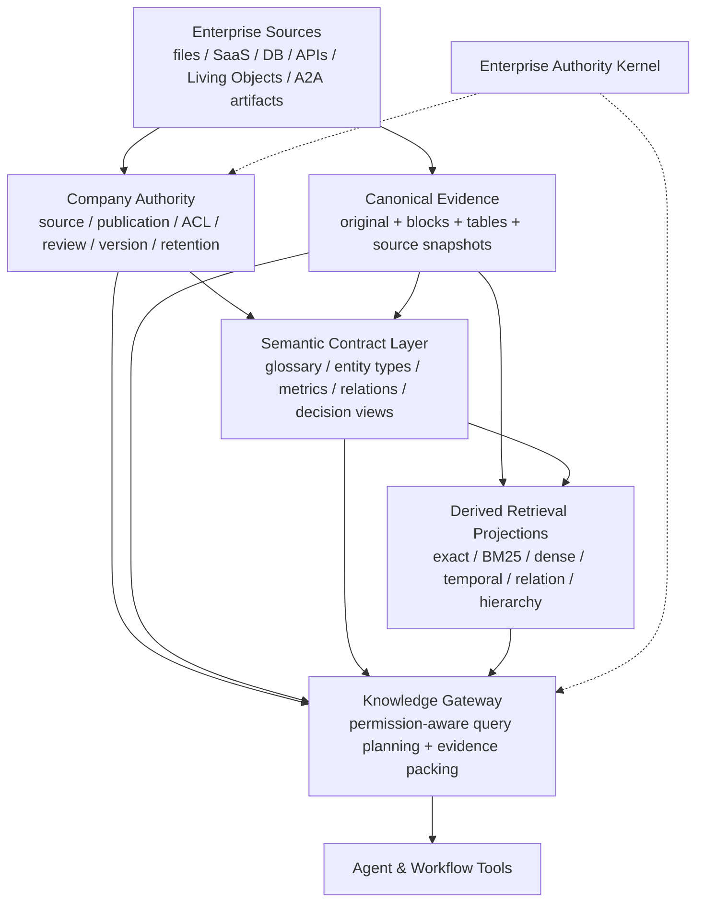
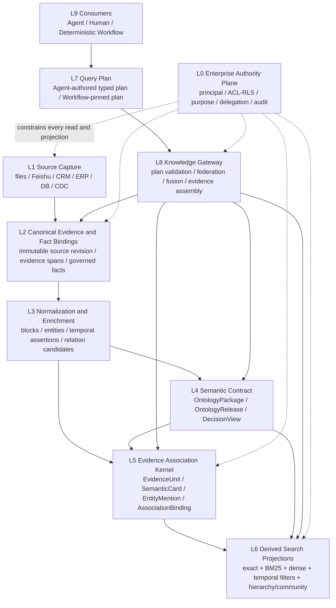
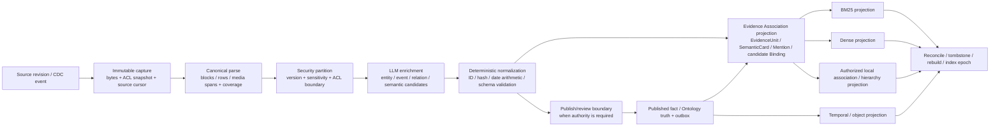

# Company Knowledge Space 与轻量语义层决策建议

> 日期：2026-07-20
>
> 状态：讨论与决策稿；在 §15 的业务问题得到确认前，不覆盖现有 canonical 施工规格
>
> 本轮边界：只研究、只写文档；未修改代码、数据库、Railway 配置，未部署
>
> 代码基线：Hive `f901b7f29f570a7cfc6398f5394fc79208e471b4`；Bisheng `e87e2655eea412a8422f0a425e6712d3fa63504f`；StaffDeck `f7fa7d7c216ca72ac66f346fe0e1ef161f0053a8`；TrustGraph HEAD `80ca41f8d222e245534ae0d4302944e07973c575`
>
> 专项范围：Company Knowledge Space、Semantic Layer、Ontology、多索引混合检索、时序/关系/联想查询、permission-aware retrieval；不重新讨论 A2A Workflow 和统一权限内核本身
>
> 2026-07-20 深化：补齐 Ontology 之下的生产数据面、检索面、时序模型、调用决策、融合排序和具体技术选型；纠正“向量仅是可选候选”的过弱表述
>
> 2026-07-20 轻内核收敛：确认以 Hive-native `Evidence Association Kernel` 承接证据内部关系；借鉴 SAG 的 source-bound semantic unit、entity index 与 query-time local association，但不把 SAG、PPR、GraphRAG 或独立图数据库设为 Company authority 或 mandatory runtime dependency

## 0. 先给结论

这轮最重要的判断是：**Hive 需要语义层，但不需要现在就建设一套企业级“大本体系统”。**

我们之前把文档知识、向量语义、知识图谱、业务对象、指标定义、业务规则和 Workflow 动作都放进了 “Ontology / Semantic Layer” 这个大盒子，因此架构越看越重，也越难判断从哪里开始。正确做法是先把它们拆开：

| 问题 | 本文建议 |
| --- | --- |
| Company Knowledge 到底是什么 | 企业对来源、内容、版本、权限、发布、引用、撤回和语义定义负责的知识权威与消费系统，不等于 RAG |
| 是否需要切片 | 对非结构化文档需要，但切片是可重建的检索投影；应先保存结构化 block/section，再派生 chunk |
| 是否需要向量 | 需要。Company Evidence Search 的平台能力基线应同时具备 exact/metadata、Chinese-aware BM25 与 dense vector；benchmark 决定 provider、模型、参数和每类 query 是否实际调用 dense，不再决定平台是否建设 dense 能力 |
| 是否需要内层关系 | 需要。所有 Company Knowledge 都必须具备 source-bound 的结构关系与证据关联 contract；relation extraction、SQL local expansion、PPR 和 dedicated graph 分别按 source/query/domain 启用 |
| 是否需要 Graph | “有关系数据模型”“运行关系扩展算法”“部署独立图数据库”是三件事。第一项必建，第二项按查询调用，第三项只在规模和质量门槛证明必要时启用；不能全库默认 GraphRAG |
| 时间怎么处理 | 时间不是普通 metadata boost。必须把记录时间、事件/有效时间、系统获知时间、相对时间锚点、事件状态分开，并建立可精确区间查询的 Temporal Assertion/Event 投影 |
| 是否需要 Ontology | 需要轻量、按业务域发布的 Semantic Contract；当前不需要全企业 OWL/RDF、大而全对象模型或独立 Ontology 平台 |
| 语义层放哪里 | 逻辑上放在 Hive Company/Ontology Control Plane；权威由 `OntologyPackage` / `OntologyRelease` 表达，向 lake/search/vector/graph 投影，不“放在某一个数据库里” |
| OceanBase 的 lake 方案是否适合 | 借鉴 “semantics as code + context layer” 思想；不能简单理解成把语义权威塞进 Data Lake，更不应因此先更换 Hive 数据底座 |
| TrustGraph 是否做底座 | 不做 Company Knowledge 的 mandatory foundation；可作为 GraphRAG/OntologyRAG/Context Core 的远程可替换 provider，在真实 corpus 评测通过后接入 |
| 权限怎么做 | source ACL 与 Company publication authority 双边约束；检索前 authorization filter、命中后 exact rebind、read/cite 时 fresh check，任何 index/provider 都不发权 |
| 如何辅助业务 Agent 判断 | Company Knowledge 提供两条消费通道：文档证据检索，以及 typed Decision Context；关键业务判断不能只靠“搜几个 chunk 让模型猜” |

一句话目标架构：

> **用版本化 Semantic Contract 定义业务含义，用 Hive-native Evidence Association Kernel 连接 source-bound 证据、语义卡片和实体索引；在授权 scope 内并行取得 typed object/temporal facts 与 exact/BM25/dense seeds，重新鉴权后只在需要时做 SQL local association 或局部 PPR，最终回绑原始证据形成 Decision Context。**

---

## 1. 先消除“语义层”这个词的歧义

### 1.1 三种语义不能再混成一层

行业里至少有三种不同的 “semantic”：

| 层 | 回答的问题 | 典型实现 | 是否是 authority |
| --- | --- | --- | --- |
| Retrieval Semantics | “这段内容和查询在意思上是否相近？” | embedding、vector index、query expansion、reranker | 否，全部可重建 |
| Business Semantics | “公司里的客户、合同、收入、负责人、有效政策分别是什么意思？” | glossary、entity type、metric、dimension、relationship、mapping | 是，必须版本化和治理 |
| Decision Semantics | “在这个业务场景下哪些事实和规则适用，缺什么证据，下一步允许做什么？” | decision view、typed predicate、rule binding、workflow/tool mapping | 定义是 authority；副作用执行不属于知识层 |

向量只解决第一种；知识图谱可能参与第一、第二种；Ontology 主要解决第二种；业务 Workflow 需要第三种。

如果继续把三者统称为“企业知识图谱”，就会出现两个错误：

1. 为了提高文档召回，先建设一套过重的对象/规则平台；
2. 为了让业务 Agent 做判断，把自动抽取的 GraphRAG edge 当成企业事实。

### 1.2 “Graph + Vector”也必须拆成两种图

行业常说的 Graph + Vector 实际也包含两类完全不同的图：

#### Retrieval Graph

- 从 chunk 中自动抽取实体和关系；
- 用 vector 找入口，再沿 graph 扩展上下文；
- 主要目标是提高召回、多跳发现和 corpus-level synthesis；
- 可以有噪声、confidence 和 extraction drift；
- 必须能删除、重建，不能作为企业真相。

#### Governed Semantic Graph

- 类型、对象、关系、事实、有效期和证据经过发布或明确 source authority；
- 供业务查询、解释、决策视图和 Workflow 使用；
- 每个事实必须能回到 source/evidence、release 和 permission；
- 不能由一次 LLM extraction 自动晋升为 active truth。

TrustGraph 的 GraphRAG 属于前者；它的 OntologyRAG 能按 schema 约束抽取，但抽取结果仍不自动等于 Hive 的 Company authority。这个边界必须由 Hive 保持。

还要再拆开三个经常被混写成 “Graph” 的概念：

| 概念 | Hive 裁决 |
| --- | --- |
| Relation representation | 必建。source、block、EvidenceUnit、SemanticCard、entity、assertion 之间必须有稳定、带 evidence/authority/time 的关系 contract |
| Relation execution | 按 query 调用。默认先做 authorized SQL local expansion；复杂多跳再在局部授权子图上运行 PPR |
| Graph infrastructure | 按 domain gate。Neo4j、TrustGraph、GraphRAG community 等只有在 PostgreSQL 局部关联无法满足质量、规模或 SLA 时才接入 |

因此，“当前不上重型 KG”绝不等于“当前不建关系层”。真正需要避免的是让一个可重建的 retrieval graph 冒充企业事实，而不是删除证据之间的关联能力。

### 1.3 OceanBase 方案的正确理解

[OceanBase 2026-07 的公开架构](https://en.oceanbase.com/blog/oceanbase-ai-database-lakebase-architecture)不是简单地说“把语义层放进湖里”。它区分：

```text
Lakebase engine
  -> unified structured / semi-structured / unstructured data and hybrid search

Context layer
  -> data context: semantic definitions + governance
  -> application context: memory + RAG

Within data context
  -> metrics / definitions / raw-data bindings
  -> context graph
  -> ontology
```

真正值得借的是：

- semantics as code；
- 定义一次，被 BI、Agent、SQL、governance 多方复用；
- 语义定义与底层 data binding、lineage 和 context graph 相连；
- structured 和 unstructured knowledge 不再是完全断开的产品。

不应照搬的推论是：

- Hive 必须先采用 Lakebase；
- 语义层必须和 raw data 放在一个物理数据库；
- 文档 embedding、Ontology 和指标定义应使用同一种表或图存储。

对 Hive 而言，**语义层首先是逻辑 authority 和 contract，不是存储产品选型。**

---

## 2. Hive 当前真实基线

### 2.1 三层知识 ownership 继续成立

以下边界不需要推翻：

| 层 | Owner | Canonical truth | 当前状态 |
| --- | --- | --- | --- |
| Agent Memory | Agent，受 owner/company 治理 | T0/T2/T3/soul Markdown Vault | 真实主链已存在 |
| Personal KB | User / Principal | owner-scoped canonical artifacts + Knowledge Core | 核心 vertical slice 存在，完整产品只完成一部分 |
| Company Knowledge | Tenant / Company | governed publication + independent `OntologyRelease` + evidence | 生产能力 Missing |

晋升仍然是两次彼此独立、可审计的授权，而不是一次 consent 贯穿三层：

```text
Agent evidence
  -> Personal candidate
  -> authenticated Personal owner consent + Personal commit
  -> Personal authority record @ pinned revision + content hash
  -> authenticated owner consent for Company proposal
  -> Company curator review / publish decision
  -> new Company-owned publication
```

第二次 owner consent 必须绑定即将提交的 Personal revision/hash、目标 tenant/space、用途、敏感度和建议发布模式；Personal 侧后续变化不能静默改写已经提交的 Company proposal。不能用 scope flip，也不能把 Agent A/B/C 能读取的 Workspace 文件直接视为 Company Knowledge。

### 2.2 Agent Memory 不应被改造成企业向量库

当前 Agent Memory 已经有自己的语义机制：T3 Markdown、wiki-like relation、BM25/PPR、LLM selector 和 dynamic activation。它的目标是 Agent 学习与连续性，不是企业资料发现。

因此：

- Company KB 不应吞入所有 Agent Memory；
- 企业 Ontology 不应成为每个 Agent Memory 的强制存储；
- Agent Memory 只产生带 evidence 的候选或 A2A artifact；
- 是否进入 Personal/Company 由上层 authority 决定。

### 2.3 Personal KB 的可复用底座与真实缺口

当前 Personal KB 已有：

- canonical Markdown；
- heading-aware deterministic segments；
- `KnowledgeDocument / Segment / Entity / Assertion / Link / IndexJob`；
- PostgreSQL FTS；
- LLM entity/assertion/link extraction；
- text + entity + graph/PPR + optional vector 的 RRF；
- Personal owner/grant/delegation permission-aware search/read；
- `search_personal_kb` / `read_personal_kb` / proposal；
- `/knowledge` UI、revision 和 rollback。

但它仍是局部闭环：

1. production app 实例没有注入 vector provider，当前 live vector capability 是 `provider_unconfigured`；
2. media/OCR/STT provider 仍只是 seam；
3. profile lane 尚未有后端产物；
4. Personal → Company promotion 缺失；
5. 当前切片是 heading + paragraph + `3600 chars / 400 overlap`，不是完整结构化 block/table aware parser；
6. PostgreSQL 使用 `to_tsvector("simple")`，对中英混合特别是连续中文的 lexical recall 必须单独 benchmark，不能把它当完整企业搜索；
7. free-form entity/assertion graph 可以帮助 retrieval，但不具备 Company ontology release 的 authority。
8. 当前 PPR 构图先读取 person scope 的 `KnowledgeLink`，最终读取 segment 时才做 document/segment grant filter；它能阻止正文直接返回，却还没有证明未授权 edge 不会影响可见结果的 PPR 分数、hop 和排序。Company path 必须在扩展前构造 authorized association view，不能依赖 final-result filtering 收口。

可以复用的不是“Personal 整个产品”，而是这些共享 substrate：

```text
conversion
canonical artifact
stable document / section / segment IDs
index job / capability status
source refs / provenance
hybrid candidate contract
current-turn result / replay pointer
```

不能直接复用为 Company authority 的是：

```text
KnowledgeGrant
PersonalKnowledgeProposal
Personal owner semantics
Personal agent_searchable shortcut
free-form extracted assertions as published facts
```

因此 Personal KB 与 Company KB 应复用**表示和检索 contract**，但不能复用 authority record：`KnowledgeDocument/Segment/Entity/Assertion/Link` 是轻内核的现有骨架，Company 需要在其上补 `SemanticCard`、typed evidence binding、edge class、authority state、bi-temporal fields、identity lineage 与 permission projection，而不是另起一套不相容的 Graph 产品。

### 2.4 Company Knowledge 仍然是 Missing

当前代码中不存在：

- Company source/document/publication/review models；
- Company Knowledge Gateway；
- `discover_company_knowledge` / `query_company_objects` / `query_company_events` / `read_company_evidence` live tool；
- Company permission adapter；
- Company BM25/dense/temporal/relation provider；
- Company UI；
- Ontology Package/Release/Curation/Engine；
- TrustGraph adapter。

旧 Company files 仍被明确标记为 retired、不可被 Agent 消费。现有文档描述的是目标，不是已实现能力。

### 2.5 对既有 Company KB 规格的调整建议

现有 `docs/company-knowledge-base-spec-2026-07-07.md` 中以下边界继续保留：

- Company-owned authority；
- Authority / Content / Index 三平面；
- proposal / review / publish / retire / rollback；
- Tool-first；
- immutable source refs / evidence；
- provider 只返回 candidates；
- Ontology action 不拥有副作用执行权；
- Personal 与 Company 不共享 authority record。

但以下内容不应继续作为“当前第一轮必建地基”：

- 一次建设完整 `company_ontology_*` 对象、属性、关系、事件、规则、动作全套表族；
- 先完成通用 Ontology Engine SPI 再做业务消费；
- 从一开始支持独立 package/repo/service 的所有形态；
- 把两个 Domain Pack 和完整 Ontology acceptance 作为 Company 文档检索上线前置条件；
- 在真实 corpus/query class 尚未证明关系召回收益前，把 typed graph/PPR 作为所有 Company 检索的强制 baseline。

本文提出的是对既有规格**首发施工范围与首发 DoD** 的 rebaseline 建议，目前不自动覆盖 canonical spec。若本文经讨论接受，必须以正式 ADR 回填 `docs/company-knowledge-base-spec-2026-07-07.md`，且只调整首发范围：完整 Ontology Control Plane 继续作为 L2 扩展上限，`CompanyKnowledgePublication` 与 `OntologyRelease` 继续保持独立 aggregate/read model，既有 Ontology authority、Evidence、Permission、Publish 和 Action boundary 均不改变。

§6 的轻量 Semantic Contract Layer 不是新权威面，也不引入 `CompanySemantic*` 第二套对象。它是既有 `OntologyPackage` / `OntologyRelease` 的 **L1 profile**：只有被真实业务域证明需要的定义和 read model，才继续演进成 L2 typed ontology graph。

### 2.6 从旧方案走到当前轻内核：保留了什么，改进了什么

我们并不是看完更多项目后推翻重来，而是逐步把“能力”“执行算法”“产品权威”和“物理底座”拆开：

| 讨论阶段 | 当时解决了什么 | 暴露的问题 | 当前保留/修正 |
| --- | --- | --- | --- |
| 早期 Company KB / Markdown-first | 原文与 canonical Markdown 是可读、可迁移证据；Knowledge 不能只剩 vector | 关系层仍较抽象，容易把 links 当完整 KG | 保留 canonical evidence/source refs；用 `EvidenceUnit` 和逐证据 binding 固定内层关系 |
| 2026-06 `Graphiti + SAG` 方案 | Graphiti 提供 temporal relation，SAG 提供轻量 association；意识到 Graph 与 vector 可并行 | provider-first，两个系统各自形成数据模型；没有先固定 Company authority、ACL 与统一 evidence contract | 保留 Graphiti 的 bi-temporal/supersession 思想和 SAG 的 source-bound local association；不再把二者设为并行 mandatory runtime |
| 2026-07 Company KB canonical spec | 建立 Authority / Content / Index、proposal/publish、Tool-first、provider candidates、Ontology Control Plane | 首发把完整 typed ontology graph、通用 engine、typed graph/PPR 绑得过重 | 权威边界完整保留；首发 Ontology 降到 L1 Semantic Contract，关系收敛到 EAK |
| 本文初稿的 multi-index 方案 | 补齐 exact、BM25、dense、temporal、relation、hierarchy 能力 | 容易被读成“六路每次并行”，relation 又像一个 optional plugin | 改成有顺序的 execution chain；relation contract mandatory，但 expansion/PPR/provider 分级启用 |

所以“内层关系”不应删除，而应从一个模糊的 Markdown links / provider graph 概念升级为明确的中间合同：

```text
过去：chunk -> entity/assertion/link -> BM25/vector/graph 各自解释

现在：canonical evidence
  -> EvidenceUnit + SemanticCard + EntityMention + AssociationBinding
  -> exact/BM25/dense seeds
  -> authorized local association
  -> optional PPR / dedicated graph
  -> evidence rebind
```

真正变化的不是“我们还要不要关系”，而是：**关系不再由某个 provider 定义，也不再默认全局运行；它成为 Hive 拥有、逐证据授权、可被多种算法消费的轻内核。**

---

## 3. 2025–2026 行业趋势：真正发生了什么

### 3.1 Vector-only 已经不是生产默认答案

当前主流生产方案正在收敛到：

```text
exact / metadata filters
  + lexical / BM25
  + dense vector
  + RRF or equivalent fusion
  + rerank
  + citations / provenance
```

[Azure AI Search 2026 RAG 文档](https://learn.microsoft.com/en-us/azure/search/retrieval-augmented-generation-overview)把 hybrid query、RRF 和 optional semantic reranking 作为推荐组合，其[RRF 文档](https://learn.microsoft.com/en-us/azure/search/hybrid-search-ranking)也明确说明 lexical/vector 并行结果如何融合；Bisheng 当前源码采用相近的 Milvus dense + Elasticsearch BM25 + weighted RRF + optional rerank。

阿里和腾讯当前公开产品也验证了同一方向：

- [Alibaba Cloud Model Studio Knowledge Base](https://www.alibabacloud.com/help/en/model-studio/rag-knowledge-base)使用 embedding/vector retrieval，并推荐同时考虑语义相关度和 BM25 文本匹配特征的 hybrid reranker；它还把 metadata、query rewrite、retrieval column 和 model-visible column 分开；
- [Alibaba Cloud Tablestore Retrieve](https://www.alibabacloud.com/help/en/tablestore/knowledge-storage-retrieval)直接提供 dense vector、full-text、hybrid、metadata filter、weighted fusion、RRF 和 model rerank；文档里的 `0.7/0.3` 只是产品默认值，不应被 Hive 抄成通用真理；
- [Tencent Cloud VectorDB](https://cloud.tencent.com/document/product/1709/95099)提供 Dense + Sparse 双路召回，Sparse 使用 BM25，并用 RRF 或 Weight 融合；其文档明确指出 BM25 用来补偿 dense 对数字、编码、公式和语义过度泛化的弱点；
- [OpenSearch hybrid search](https://docs.opensearch.org/latest/vector-search/ai-search/hybrid-search/index/)也把 BM25 与 neural/vector 结果的 score normalization 或 rank fusion 作为标准 search pipeline。

因此这轮需要纠正之前过于保守的表述：**对 Company Evidence Search，dense 不是“以后也可以不做”的产品能力，而是必须与 BM25、exact/metadata 一起建设的 derived retrieval channel。** 真正由 benchmark 决定的是：

1. 使用 OpenSearch/Elasticsearch、PostgreSQL + pgvector，还是拆分的 Milvus/Qdrant；
2. 哪个 embedding/reranker 适合中文、英文和业务域；
3. 某一类 query 是否需要调用 dense，以及召回规模和融合参数；
4. corpus 很小或完全结构化时，是否在该请求上跳过 vector，而不是删除平台 vector 能力。

原因很现实：

- vector 擅长同义、改写、概念相似；
- lexical 擅长人名、代码、SKU、条款号、金额、专有词；
- metadata/exact filter 负责时间、状态、空间、权限、对象类型；
- rerank 在候选范围内提高精度；
- 任何一种通道单独使用都会丢失一类问题。

但行业的混合检索共识不能被误解成“BM25 + vector 已经解决企业知识”。这些产品主要回答“哪些片段与 query 相关”，通常没有完整回答：

- 一句话是在什么时候记录的，描述的事情又在什么时候发生；
- “计划发生”是否后来真的发生、取消或被修改；
- 查询过去某一天时，应该使用当时有效的事实还是今天修订后的事实；
- 一个跨文档关联是检索线索，还是已经发布的企业事实；
- graph/vector 命中如何继承源 ACL、撤权、版本和证据。

这正是 Hive 不能只采购一个 hybrid search 产品的原因。

### 3.2 企业产品正在把 permission-aware retrieval 当成知识层核心

这不是附属 ACL 功能。[Azure AI Search 2026](https://learn.microsoft.com/en-us/azure/search/search-document-level-access-overview) 已把 document-level access、ADLS/SharePoint ACL、Purview sensitivity labels 和 query-time enforcement 纳入 agentic/RAG 能力；[Amazon Bedrock Knowledge Bases](https://docs.aws.amazon.com/bedrock/latest/userguide/kb-test-retrieve-acl.html) 也提供 ACL-aware filtering，并明确说明：

- caller identity 必须由应用认证；
- filtering 不等于 authorization；
- missing ACL 应 fail closed；
- source permission change 是 eventual consistent；
- filtering 后可能返回不足 `k` 的结果。

这正说明企业知识库最难的部分不是 embedding，而是：

```text
identity truth
source ACL sync
permission propagation latency
authorized recall
revocation
audit
provider drift
```

### 3.3 Chunking 正在从固定长度转向结构感知

[RAGFlow](https://github.com/infiniflow/ragflow) 强调 deep document understanding、template-based chunking、chunk 可视化和人工干预；Bisheng 支持 hierarchical heading、page/bbox、Excel header/row window；StaffDeck 先形成 Document Card、section tree、bucket，再生成 evidence chunk。

趋势不是“不切片”，而是：

- 先恢复文档结构；
- 再按内容类型派生检索单元；
- 保留 parent/child、page/bbox、table、source span；
- 小块用于命中，大块或父 section 用于返回；
- chunk 可重建，source block 才是稳定证据。

### 3.4 GraphRAG 从热点变成“按问题类型选用”

[Microsoft GraphRAG 的官方文档](https://microsoft.github.io/graphrag/query/overview/)明确区分：

- local search：围绕特定实体；
- global search：对整个 corpus 做主题/全局归纳；
- DRIFT：结合 global/local；
- basic search：普通 vector RAG 对照。

它也[明确警告 indexing 成本高](https://github.com/microsoft/graphrag)，官方估算 [graph extraction 约占标准 GraphRAG indexing 成本的 75%](https://github.com/microsoft/graphrag/blob/main/docs/index/methods.md)。这意味着 GraphRAG 的正确问题不是“行业都在做，要不要上”，而是：

> 在我们的哪一类问题上，它相对 hybrid document retrieval 有可量化收益，收益是否覆盖 extraction、更新、权限和运维成本？

### 3.5 Ontology 和 semantic layer 正在回归，但主要动力是共享业务定义

[Open Semantic Interchange（OSI）](https://open-semantic-interchange.org/)把 semantic model 定义为 datasets、fields、metrics、dimensions、relationships 等 declarative YAML；OceanBase 使用 “semantics as code” 描述 metrics、definitions、context graph 和 ontology。

这股趋势的核心不是“所有企业都要先上 RDF”，而是：

- 指标和业务术语不能在每个 Agent/BI/Workflow 里重新解释；
- semantic definitions 必须可版本化、可交换、可验证；
- AI 访问结构化数据时需要受治理的 business meaning；
- ontology 只是在复杂域中表达类型/关系/约束的一种更强形式。

### 3.6 Context Graph / Context Core 是值得观察的新方向

[TrustGraph](https://docs.trustgraph.ai/overview/architecture) 的价值在于把：

- document ingestion；
- vector entry point；
- entity/relationship graph；
- ontology-guided extraction；
- provenance；
- retrieval trace；
- portable/versioned Context Core

组织成一个独立知识处理系统。

这很适合做复杂 domain context provider，但仍不等于企业 publication、source ACL、review、retention 或 Workflow authority。

### 3.7 时序图和联想检索正在补普通 RAG 的空白，但仍是分立能力

[Graphiti](https://github.com/getzep/graphiti)把 episode/raw source、实体、带 validity window 的事实以及 transaction time 组合成 temporal context graph，并提供 semantic + BM25 + graph traversal 的 hybrid retrieval；它的重要启发是“旧事实失效但不删除”和“所有 derived fact 回到 episode”。[HippoRAG](https://arxiv.org/abs/2405.14831)则以 query seed + Personalized PageRank 做联想和多跳发现；[Microsoft GraphRAG](https://microsoft.github.io/graphrag/query/overview/)用 local/global/DRIFT 区分实体邻域、全局主题和扩展探索。

三者解决的是不同问题：

| 方法 | 擅长 | 不自动解决 |
| --- | --- | --- |
| Graphiti-style temporal graph | 事实变化、历史状态、episode provenance、关系随时间失效 | Company publication、精细 ACL、业务规则 authority |
| HippoRAG/PPR | 从少量线索联想到多跳相关节点 | 关系是否为已发布事实、时间与权限的 exact truth |
| Microsoft GraphRAG | entity-local、corpus-global theme、DRIFT exploration | 高频增量事实、完整双时态、源系统 row/column authority |

所以 Hive 应吸收它们的**索引与查询方法**，而不是把任一项目整体提升为 Company KB 的唯一数据模型。

---

## 4. 真实落地最常见的痛点

### 4.1 数据进来不等于可被正确理解

复杂 PDF、扫描件、表格、页眉页脚、图片、音视频、网页动态内容都会破坏 canonical structure。解析覆盖不足时，后面的 embedding、graph、ontology 只是对错误输入做更昂贵的加工。

需要把以下指标放在 ingestion 第一层：

```text
source bytes captured
parse coverage
page / block / table coverage
OCR/STT confidence
unsupported regions
content hash
source revision
```

### 4.2 权限同步比检索算法更难

源系统 ACL、Company publication ACL、部门/角色、用户组、Agent delegation 和 sensitivity 同时存在。任何一个投影滞后，都可能产生：

- 已撤权仍可召回；
- 有权资料召回不到；
- title/count/score 泄露；
- citation 点击后越权；
- A2A 子 Agent 继承过多或过少权限。

### 4.3 版本、时间和“哪个是真的”比相似度更难

企业 corpus 会同时存在 draft、signed、superseded、future-effective 和 retired 版本。更麻烦的是，一条信息至少有四种不同时间：

```text
recorded_at / authored_at   # 这句话何时被写下
occurred_at / valid_time    # 事情何时发生，或事实何时在现实中有效
observed_at / system_time   # 系统何时获知、写入或修订这条事实
effective_at                # 政策/合同版本何时生效
```

纯 vector/BM25 会把它们折叠成一段文本相似度，因而可能把旧草稿和有效政策一起送入模型，也可能只按文件日期查而错过由相对时间表达指向目标日的事件。

每个文档结果至少需要携带 publication/version 时间；每个 event/fact assertion 则必须独立携带 real-world valid time 与 system time：

```text
logical_document_id
publication_version
source_revision
authored_at / source_anchor_time / timezone
valid_time or event_time_range
observed_at / superseded_at
status: planned | occurred | cancelled | superseded | unknown
content_hash
authority_version
source_span / evidence_refs
```

“某日计划开会”和“某日确实开过会”不是同一个事实；“今天知道某事实过去有效”和“今天才发生该事实”也不是同一时间轴。系统必须能如实返回不确定与冲突，不能用相似度把它们抹平。

### 4.4 自动抽取的实体和关系容易被误用

LLM extraction 会有 alias、entity resolution、关系方向、时间和否定语义错误。检索图允许带 confidence；业务决策图不能。

### 4.5 召回效果无法靠 demo 判断

真实系统需要按 query class 测试：

- exact identifier；
- paraphrase；
- policy applicability；
- multi-document synthesis；
- multi-hop relation；
- temporal version；
- table/number；
- unauthorized near-match；
- source revoked；
- Chinese/English mixed query。

没有自己的 golden questions，任何 GraphRAG、RAGFlow 或 TrustGraph 选型都是印象决策。

### 4.6 Agent 的“业务判断”不能只靠自然语言 RAG

当问题是“这个合同是否需要法务审批”“这个客户是否满足升级条件”时，Agent 需要的不只是几段文本，而是：

- 当前对象事实；
- 适用规则及版本；
- 规则输入是否齐全；
- deterministic predicate 结果；
- 仍需模型判断的语义部分；
- 引用和冲突；
- 后续动作的权限/审批要求。

这正是 Company KB 必须增加 Decision Context lane 的原因。

---

## 5. Company Knowledge Space 的产品定义

### 5.1 它不是一个“企业 RAG 页面”

推荐产品定义：

> Company Knowledge Space 是企业对知识证据与业务语义进行摄取、整理、审核、发布、授权、检索、解释、撤回和复用的控制面；它同时服务人、Agent 和 Workflow。

Space 是 namespace、stewardship 和 policy boundary，不是新的 truth root。Company/tenant 仍是最高 authority。

### 5.2 两条消费通道

#### Evidence Knowledge Lane

用于：

- 查政策、SOP、报告、合同、项目资料；
- 问答、总结、对比；
- 引用原文；
- 跨文档研究。

工具形态：

```text
discover_company_knowledge
query_company_objects
query_company_events
traverse_company_relations
read_company_evidence
get_company_citation
```

这些 tool 共享 Gateway/authority/evidence，但返回不同 typed handle；产品上仍可呈现为一个 Company Knowledge 入口。

#### Decision Context Lane

用于：

- 解析 typed business object；
- 获取适用术语、指标、关系、规则；
- 返回业务 Agent 可消费的结构化判断上下文；
- 向确定性 Workflow 提供 pinned `OntologyRelease`。

工具形态建议：

```text
resolve_company_object
query_company_semantics
get_company_decision_context
explain_company_fact
```

`get_company_decision_context` 只返回 facts、definitions、pure predicate results、missing evidence、conflicts、citations 和 pinned `OntologyRelease`；它不执行外部副作用，也不签发 permission/approval。

Decision Context 继续遵守 Tool-first：不自动 prefetch、不静态注入原始 prompt。Agent/Workflow 必须显式调用 typed tool；当前 turn 返回有界但覆盖账本完整的结果，跨 turn 的持久消费只保存可重放的 evidence/result pointer，下一 turn 重新鉴权并读取，不能把整份结果悄悄常驻上下文。

知识层与执行治理之间有一个不可突破的不变量：

```text
Decision Context
  -> 只提供事实、定义、纯函数条件结果、证据和解释

Company Charter / tenant RLS / capability policy / source ACL
approval or checkpoint / ToolRuntime / Workflow runtime
  -> 在每次 effect boundary 独立、实时裁决
```

即使 Agent 完全绕过 Company KB、自己读取了别处证据，动作权限也不能因此扩大；反过来，Decision Context 返回 `approval_required=true` 也只是被引用的业务语义，真正的 approval requirement 和执行许可仍由 Enterprise Authority Kernel 与执行 runtime 发权。

### 5.3 Company Knowledge 应支持的资产类型

| 资产 | Canonical 形态 | 主要读取方式 |
| --- | --- | --- |
| 文档/政策/SOP/报告 | immutable publication version + canonical blocks | search/read/cite |
| Structured source view | versioned source binding + governed query/view | typed query |
| Business glossary/metric | Semantic Contract | semantic query/explain |
| Entity/relation type | Semantic Contract | resolve/query |
| Curated fact/assertion | evidence-backed released fact | object/fact query |
| Temporal assertion/event | valid/system time + status + evidence binding | temporal/as-of query |
| Decision view | typed inputs/outputs + rules + evidence policy | decision context |
| Living Object | pinned revision 或 reviewed-follow policy | object adapter |
| A2A artifact | immutable result object + collaboration evidence | proposal → publication |

### 5.4 不属于 Company KB 强制职责的内容

- Agent 的全部长期记忆；
- Personal KB 的全部内容；
- Workflow runtime state；
- tool side effects；
- secret/credential 内容；
- 未审核的模型推断；
- raw data lake 全量复制；
- 每个业务系统自己的 transaction truth。

---

## 6. 推荐的轻量 Semantic Contract Layer

### 6.1 逻辑位置



Semantic Contract Layer 不是第四个独立 authority database，也不是 `CompanyKnowledgePublication` 的一种。它是既有 Ontology aggregate 的 L1 profile：定义由 immutable `OntologyPackage` 承载，经独立 `OntologyRelease` 激活，通过 `EvidenceBinding` 连接 Company publications/structured sources，再向 Index/Runtime 产生可重建 projection。Company Knowledge Publication 与 Ontology Release 的生命周期、版本和 read model 继续分离。

### 6.2 物理落点

当前资源条件下建议：

```text
Hive PostgreSQL
  -> source / publication / review / permission / OntologyRelease metadata
  -> exact typed read models / object refs / bi-temporal assertions
  -> Evidence Association Kernel bindings / lightweight adjacency
  -> outbox / projection status

Object storage / canonical artifact store
  -> original files
  -> canonical Markdown / block tree / table artifacts
  -> immutable OntologyPackage L1 profile YAML/JSON

OpenSearch-compatible retrieval provider
  -> Chinese-aware BM25
  -> dense segment/entity/semantic-element embeddings
  -> filterable metadata and coarse temporal fields
  -> Gateway-level RRF / authorized rerank

Optional dedicated graph provider (TrustGraph / Neo4j / GraphRAG)
  -> retrieval graph / ontology projection / context core
```

不建议当前新建独立 semantic authority service 或 authority database，也不建议第一天同时运行 Elasticsearch + Milvus + Neo4j 三套索引集群。OpenSearch-compatible provider 是当前推荐物理 profile；PostgreSQL + pgvector 或 dedicated vector/graph 仍可以在同一 provider contract 后由 benchmark 替换/拆分。

### 6.3 最小权威对象

Company 文档侧继续保留：

```text
CompanyKnowledgeSpace
CompanyKnowledgeSource
CompanyKnowledgeDocument
CompanyKnowledgePublication
CompanyKnowledgePublicationVersion
CompanyKnowledgeEvidenceBinding
CompanyKnowledgeProjection
```

Ontology 侧复用现有 authority names，当前只实现它们的 L1 Semantic Contract profile：

```text
OntologyPackage
  -> immutable YAML/JSON artifact + profile=L1 + schema version + domain + owner

OntologyRelease
  -> active/superseded/retired + effective window + review set

EvidenceBinding
  -> semantic element -> source/publication/field/table/evidence refs

DecisionView
  -> OntologyPackage/Release 内的 typed element；可投影成 exact read model
  -> typed inputs/outputs + fact queries + predicates + evidence policy

Ontology projection/read model
  -> exact/graph/vector/provider materialization status
```

这些不是一组新的 `CompanySemantic*` 表。L1 可以先把稳定 element IDs 和 schema-validated definitions 放在现有 `OntologyPackage` artifact 中，只为真实查询需要的元素建立 read model/projection；不需要第一天就把 object type、property type、link type、event type、rule type、action type全部拆成几十张 authority 表。

### 6.4 `OntologyPackage` 的 L1 Semantic Contract profile 示例

```yaml
api_version: hive.company.semantic/v1
package_id: contract_approval
package_version: 1.3.0
profile: semantic_contract_l1
domain: contract_approval

terms:
  - id: high_value_contract
    label: 高金额合同
    definition: 合同含税金额达到当前审批政策阈值的合同
    evidence_refs:
      - company-publication://legal-policy@7#section=approval-threshold

entities:
  - id: contract
    keys: [contract_id]
    aliases: [合同, 协议]
    source_bindings:
      - source: crm.contracts
        fields:
          contract_id: id
          amount_with_tax: total_amount
          region: legal_region

relations:
  - id: contract_owned_by_department
    from: contract
    to: department
    cardinality: many_to_one

decision_views:
  - id: legal_review_requirement
    inputs:
      contract_id: string
    outputs:
      required: boolean
      reasons: list[string]
      missing_evidence: list[string]
      applicable_policy_refs: list[ref]
    predicates:
      - ref: policy.high_value_threshold
      - ref: policy.cross_border_contract
    action_mapping:
      workflow_ref: workflow://contract-approval@4
      side_effects: false
```

这个 `OntologyPackage` profile 解决“含义、映射、决策输入输出和版本”，不执行 SQL、不直接审批合同，也不把自然语言 policy 变成无审核代码。tenant activation/review 后另行生成独立 `OntologyRelease`，记录 release ID、package ref、effective window、review set 和状态；package version 不能冒充 release。

### 6.5 四类规则必须区分

| 规则类型 | 例子 | 执行方式 |
| --- | --- | --- |
| Definition | “有效客户”的业务定义 | 供 Agent/人解释，不产生机械 verdict |
| Deterministic pure predicate | 金额 ≥ 已发布阈值 | 受限表达式 runtime，例如 CEL-class DSL；无副作用 |
| Semantic judgment | “条款是否构成重大不利变化” | LLM/人基于完整授权证据判断，返回 evidence-backed opinion |
| Action policy | 满足条件后需要法务审批 | 映射到 Workflow/Approval；知识层不执行 |

这样既保留 Agent 智能，又避免把关键业务条件全交给自然语言推断。

### 6.6 与 OSI、OWL、TrustGraph 的兼容方式

- 对 metrics/dimensions/datasets/joins，`OntologyPackage` 的 L1 profile 可提供 OSI import/export adapter；不需要内部直接采用完整 OSI 数据模型。
- 对已有行业 ontology，可提供 OWL/Turtle import，经 review 后转换为 Hive package；不要求业务人员直接维护 RDF。
- 对 TrustGraph，active `OntologyRelease` 可投影为 ontology/schema；TrustGraph 返回 graph candidates 和 provenance，再绑定回 Hive IDs。
- Hive 的 `OntologyPackage` / `OntologyRelease` / permission / evidence 仍是唯一 authority。

---

## 7. Ontology 之下的完整数据与索引分层

Ontology 已经回答“企业里的对象、字段、关系和规则是什么意思”，但它不负责保存所有原始材料，也不应该承担全部检索。Ontology 之下需要一个明确的证据—事实—索引分层：



这里有三个不变量：

1. **L2 与已发布 Ontology 是 truth，L5/L6 是受治理的 read model。** BM25、vector、SemanticCard、retrieval association、graph、summary 全部可以重建，不能反过来成为企业事实源；
2. **结构化事实与文本证据并列。** CRM/ERP row、指标、事件不应先被转成 chunk 再查询；
3. **权限不是最后一层 filter。** L0 约束 source capture、projection、candidate discovery、exact read 和 citation 全链。

### 7.1 系统实际检索的不是“字段”，而是六类 typed handle

BM25 或 vector 命中的最终对象不能统一叫 chunk。不同问题应返回不同类型的 candidate handle：

| Candidate 类型 | 用途 | 索引中可存什么 | 最终如何读取 |
| --- | --- | --- | --- |
| `EvidenceUnitRef` | 文档段落、表格行组、图片/音视频片段 | title、heading path、retrieval text、embedding、time/ACL projection | 按 block/source span exact read |
| `SemanticElementRef` | glossary、entity type、property、metric、relation、DecisionView | 名称、别名、定义摘要、适用域、release ID | 从 pinned `OntologyRelease` exact read |
| `BusinessObjectRef` | 合同、客户、项目、发票等真实对象 | stable key、可检索 label、允许公开的索引字段 | 通过 governed source binding / object query 读取 |
| `TemporalAssertionRef` / `EventRef` | 发生、计划、有效、取消、替代等时间事实 | resolved interval、status、subject/object、source refs | 从 temporal fact projection + source evidence 读取 |
| `RelationPathRef` | 多跳与联想线索 | node/edge IDs、time window、confidence、provenance | 在 authorized subgraph 中重放并逐边绑定 evidence |
| `MetricResultRef` | 金额、计数、趋势、聚合 | 不把结果当向量文档；只索引 metric definition | 运行 pinned semantic query 后返回 typed result object |

因此，Agent 问“合同金额字段是什么意思”时可以先 hybrid-search `SemanticElementRef`；问“合同 A 金额多少”时必须 exact query `BusinessObjectRef`；问“6 月 1 日发生了什么”时以 `EventRef` 为主；问“相关背景材料”时才以 `EvidenceUnitRef` 为主。**先把所有数据切成文本，再希望一个向量索引回答所有问题，是架构错误。**

### 7.2 非结构化资料：先 canonical block，再派生多种 retrieval representation

推荐处理链：

```text
original source revision
  -> canonical document tree
  -> typed blocks: heading / paragraph / list / table / image / code / attachment
  -> stable source spans + page/bbox/table/audio-video timecode
  -> security-safe retrieval segments
  -> SemanticCard + EntityMention + temporal/relation candidates
  -> lexical representation + dense representation + local association projection
```

不应再从 Markdown 字符串直接把 chunk 当唯一结构。每个检索单元至少带：

```text
publication_id + version
document_id + source_revision
block_ids[] + heading_path
page / bbox / table coordinates / media timecode
content_hash + language
authored_at + effective/validity window
permission_projection_ref + sensitivity
source/evidence refs
lexical analyzer + embedding model/index version
```

Chunk 安全不变量继续成立：

1. chunk 不能跨 ACL、sensitivity、publication version 或 effective-time boundary；
2. mixed-permission source 必须先按最小安全 block 分区，再切片；
3. overlap 不能把 restricted 末尾复制进 allowed chunk；
4. table header 与 row group、图片与 caption、音视频片段与 timecode 要保留绑定；
5. source span 必须可回放，不能只保留摘要；
6. dedupe key 使用 stable IDs/hash，不使用 `page_content`；
7. chunk、embedding 或 summary 删除/重建不改变 publication truth。

解析器本身不需要 Hive 从零自建。应自建 `CanonicalBlockTree` contract 和 coverage ledger，再把现有 converter、Bisheng parser、[Docling](https://docling-project.github.io/docling/usage/supported_formats/) 或其他 OCR/STT provider 放在 adapter 后比较；缺页、坏表格、未识别图片必须成为 typed coverage gap。

### 7.3 Evidence Association Kernel：关系合同必建，重型 Graph 不必建

我们之前的“内层关系”应该正式收敛为 Hive-native `Evidence Association Kernel`。它位于 canonical evidence 与搜索索引之间，目标不是构建一张全局企业知识图谱，而是回答三个更窄的问题：

1. 一个检索候选完整表达的是哪一段授权证据；
2. 哪些 source-bound semantic units 因共享实体、引用、支持、冲突或时间关系而可被局部联想；
3. 哪些 derived association 只是召回线索，哪些关系已经被 Company source/reviewer 发布为 governed fact。

核心对象固定为：

| 对象 | 语义 | Authority / rebuild 边界 |
| --- | --- | --- |
| `EvidenceUnit` | canonical block/range 派生的最小安全检索单元，保留 page/bbox/table/timecode 和 hash | 绑定 canonical evidence；chunking strategy 可重建，但 source span 不可丢失 |
| `SemanticCard` | 对一个 `EvidenceUnit` 完整含义的 source-bound 索引卡，避免把语义拆成互不相干的 triples | LLM-derived projection；可缺失、降级、重建，永不单独成为 Company truth |
| `EntityMention` / `EntityRef` | 人、组织、合同、项目、条款等轻量索引锚点；mention 保留 source span，ref 保留 identity lineage | candidate identity 可重建；confirmed merge/split 需 governed decision |
| `AssociationBinding` | `EvidenceUnit/SemanticCard/EntityRef` 之间的一条 typed、逐证据绑定的关联断言 | structural 可确定性生成；retrieval association 是 derived candidate；governed relation 只引用已发布 fact |
| `BusinessFactRef` / `TemporalAssertionRef` | Company source、review 或可复现 typed query 已确认的事实/事件引用 | authority 留在 publication/source truth；Kernel 只引用，不复制发权 |

这里借鉴 [SAG](https://arxiv.org/abs/2606.15971) 的不是产品外壳，而是它最有价值的数据与执行思想：保留一个 semantically complete、source-bound unit，用 entity 作为索引和扩展点，在查询时通过 SQL join 只实例化当前问题需要的 local associations，最终仍返回原始 evidence。Hive 将 SAG 的 `event` 改称 `SemanticCard`，因为企业系统里 `Event` 已专指具有 `valid_time/status` 的真实业务事件；二者不能混成一个对象。

Kernel 的最小 relation contract 至少包括：

```yaml
association_id: assoc_...
from_ref: semantic-card://...
to_ref: entity://project/alpha
relation_type: mentions
edge_class: retrieval_association   # structural / retrieval_association / governed_fact_ref
authority_state: candidate          # candidate / reviewed / published / contested / superseded
evidence_binding_refs: [evidence://publication/...#block-42]
confidence: 0.91
valid_time: null
system_time: "[2026-07-20T10:00:00+08:00,)"
extractor_profile: extractor://...@prompt-hash
permission_projection_ref: permission-projection://...@epoch-18
status: active
```

并不是所有 edge 都要填满所有字段：deterministic structural edge 不需要模型 confidence；retrieval association 不得伪造 governed validity；governed fact 必须通过 `BusinessFactRef/TemporalAssertionRef` 回到 authority。统一 schema 的目的，是让每条 edge 的类别、来源、时间、权限依赖和可重建性都机械可判，而不是把所有关系升格成 Ontology。

#### 7.3.1 默认执行是 authorized SQL local association

默认多跳路径采用：

```text
authorized exact/BM25/dense seeds
  -> visible EvidenceUnit / SemanticCard / EntityMention IDs
  -> SQL join over visible AssociationBinding rows
  -> query-local dynamic candidate neighborhood
  -> optional bounded PPR inside that local neighborhood
  -> authorized evidence rebind
```

这意味着：

- 普通条款、FAQ、单文档问题只走 seed discovery，不付关系扩展开销；
- 跨文档“X 与 Y 如何相关”先走 SQL shared-entity/local association；
- 只有 Agent/Workflow 的 query plan 显式请求扩散、且 golden set 已证明该 query class 有收益时才运行 PPR；
- 只有 PostgreSQL adjacency/recursive query 达不到关系规模或遍历 SLA 时，才接 TrustGraph/Neo4j；
- GraphRAG community/global report 是另一类 corpus-level synthesis，不属于内核默认路径。

#### 7.3.2 权限必须先于关系扩展

`AssociationBinding` 的可见性不由“聚合后的 edge”独立决定，而由当前 principal 可读取的 evidence bindings 决定：

1. Gateway 先取得 authorized `EvidenceUnit`/fact binding IDs；
2. association SQL 只能在这些 IDs 和当前 permission epoch 内 join；
3. 同一概念由五份资料支持、principal 只能看两份时，只能用这两份 materialize 当前可见关系和 provenance；
4. restricted entity label、alias、edge existence、degree、PPR mass 都不能通过不可见来源影响可见排序；
5. 最终交付前仍做 fresh rebind，但 final filter 不能替代 pre-expansion authorization。

因此 Company Kernel 不能照搬当前 Personal PPR 的“先构图、后过滤 segment”形状。关系路径本身就是受权限约束的 evidence product，不只是最后正文的导航 metadata。

#### 7.3.3 与当前 Personal KB 的承接关系

当前 `KnowledgeDocument/Segment/Entity/Assertion/Link`、LLM extractor、RRF 和 `personalized_pagerank()` 是可复用骨架，但不是完整 Company Kernel：

| 当前对象/路径 | Company Kernel 的承接方式 |
| --- | --- |
| `KnowledgeSegment` | 映射为 `EvidenceUnit` read model；citation 继续锚定 canonical block/source span |
| `KnowledgeEntity` | 保留为 candidate `EntityRef`；补 mention、merge/split decision 和 ontology mapping lineage |
| `KnowledgeAssertion` | 默认保持 derived candidate；发布为 Company fact 时生成独立 authority ref，不原地改 status 冒充真相 |
| `KnowledgeLink` | 演进为逐 evidence 的 `AssociationBinding`；补 edge class、authority/time、extractor 和 permission projection |
| person-scope PPR | 改成 authorized local SQL expansion first、bounded local PPR second；Company 不读取全 tenant graph 后再过滤 |

Personal 与 Company 可以共享 provider contract、projection schema 和评测工具，但 Personal owner grant 与 Company publication/ACL/ontology authority 仍完全独立。

### 7.4 多索引能力是基线，但不是六个平行 lane

Company KB 不应选择“BM25 还是 vector 还是 graph”，但也不应把 exact、BM25、dense、temporal、relation 和 hierarchy 当成六个同层、每次都并行运行的召回头。它们在执行链中的职责不同：

| 执行角色 | Capability | 解决的问题 | 推荐首选技术 | 建设/调用裁决 |
| --- | --- | --- | --- |
| Hard scope / typed truth | Exact / object / metadata | ID、状态、source、release、对象 key、ACL scope | PostgreSQL B-tree/GIN + canonical registry | 必建；按 typed request 直接查询，不与 similarity score 混算 |
| Seed discovery | Lexical / sparse | 条款号、人名、SKU、数字、专有词、中文关键词 | OpenSearch/Elasticsearch BM25 + 中文 analyzer | 必建；按 query plan 调用 |
| Seed discovery | Dense semantic | 同义改写、概念相似、自然语言问法 | OpenSearch k-NN/vector 或 pgvector；规模证明后可拆 Milvus/Qdrant | 平台能力必建；按 query plan 调用 |
| Typed resolution | Temporal | 某时发生/有效/获知什么，时间区间、as-of、相对日期 | PostgreSQL `tstzrange`/`daterange` + GiST；检索引擎仅同步 coarse filter | contract/index 必建；有时间语义时调用 |
| Local expansion | Evidence association | 实体邻域、多跳、引用、支持/冲突、联想扩展 | PostgreSQL authorized SQL join/adjacency；必要时局部 PPR | relation contract 必建；expansion 按 query 调用 |
| Context / global synthesis | Hierarchy / community | parent section、整库主题、global synthesis | canonical section tree；大型复杂 corpus 再启 GraphRAG community reports | parent 必建；community/dedicated graph 按 gate |

因此真实顺序是：**先确定 authority scope 并 pin version/release；再并行取得 typed object/temporal truth 与 exact/BM25/dense seeds；seed rebind 后才按需运行 local association；global synthesis 最后选择性执行。** 每个 derived provider 只返回 canonical candidate ID、rank、match reason、index version 和 authority projection ref；Knowledge Gateway 统一 rebind 和融合。

对当前 Hive，推荐的轻量生产 profile 是：

```text
PostgreSQL
  -> authority / publication / ontology release / object refs
  -> temporal ranges / lightweight relation adjacency / outbox

Object Storage
  -> original revisions / canonical block tree / media / large evidence artifacts

OpenSearch-compatible Retrieval Provider
  -> Chinese-aware BM25 + dense vector + filterable metadata
  -> one service first, gateway-level RRF/rerank

Optional domain provider
  -> TrustGraph / Neo4j / Milvus / Qdrant only after measured need
```

选择 OpenSearch-compatible provider 作为首选目标，是因为 Hive 当前 PostgreSQL `to_tsvector("simple")` 不能视为成熟中文 BM25，而同一 retrieval service 可以先承载 lexical、dense 和 metadata，避免第一天就复制 Bisheng 的 Elasticsearch + Milvus 双集群。若 benchmark 证明 `PostgreSQL + pgvector + 成熟中文 lexical extension` 在目标规模下同时满足召回、过滤和运维要求，也可以采用该 profile；[pgvector](https://github.com/pgvector/pgvector)本身支持 HNSW/IVFFlat、metadata filtering 并建议与 PostgreSQL FTS + RRF/cross-encoder 组合，但 filtered ANN 的 recall/backfill 必须单测。

因此 benchmark 的问题变为“选择哪个 provider 和参数”，不是“是否建设 dense”。每个 provider 都必须具备：permission filter、oversampling/backfill、tombstone、rebuild、dual-index model migration、typed unavailable/degraded 和 score trace。

### 7.5 时间必须成为一等事实模型，不是 chunk metadata

一个 `TemporalAssertion` / `Event` 至少需要以下 contract：

```yaml
assertion_id: evt_...
subject_ref: object://project/alpha
predicate: scheduled_meeting
object_or_value: ...

source_ref: publication://...#block-42
source_recorded_at: 2026-05-31T20:00:00+08:00
temporal_expression: "明天上午开会"
anchor_time: 2026-05-31T20:00:00+08:00
anchor_source: document_metadata
timezone: Asia/Shanghai

valid_time: "[2026-06-01T00:00:00+08:00,2026-06-02T00:00:00+08:00)"
system_time: "[2026-05-31T20:05:12+08:00,)"
status: planned
modality: asserted
resolution_status: resolved
confidence: 0.94
supersedes_ref: null
evidence_refs: [...]
```

字段含义必须严格区分：

- `source_recorded_at`：材料被写下/记录的时间；
- `valid_time`：事实在现实世界成立或事件计划/发生的时间；
- `system_time`：Hive 何时知道这条 assertion，何时被新 assertion supersede；
- `status/modality`：planned、occurred、cancelled、superseded、unknown，以及 assertion/negation/conditional；
- `anchor_time/timezone`：把“明天、下周一、月底前”解析成时间区间所依据的机械事实；
- `resolution_status`：resolved、ambiguous、unresolved，不能为追求可检索性强行猜一个日期。

存储上使用 bi-temporal 思路：real-world `valid_time` 与 system/transaction time 分开。[PostgreSQL range types](https://www.postgresql.org/docs/current/rangetypes.html) 的 `tstzrange`/`daterange` 与 GiST overlap/containment query 足以承担第一版精确时间索引，不需要为了“有时间”先上 temporal graph database。OpenSearch 中只同步可过滤的时间字段以做候选 prefilter，权威仍回 PostgreSQL assertion/evidence。

提取上采用组合而不是单一路线：

```text
LLM
  -> 识别事件、主体、语义角色、否定/条件、候选时间表达

deterministic temporal normalizer
  -> 根据已验证 anchor/timezone 做日期算术与 TIMEX-style interval normalization

review / conflict process
  -> 对高风险、模糊、相互矛盾 assertion 决定是否晋升 governed fact
```

[HeidelTime](https://github.com/HeidelTime/heideltime)这类支持中文和 TIMEX3 normalization 的工具、Duckling-class parser 或模型 structured output 都可以作为 provider 候选；Hive 一定要自建的是 temporal contract、anchor provenance、状态与评测集，不是手写所有中文日期规则。

### 7.6 “明天开会”案例：真正需要的是 event-time projection

假设一条笔记在 **5 月 31 日 20:00（Asia/Shanghai）** 写下：

> 明天上午有项目评审会。

正确处理不是只给原 chunk 加 `document_date=05-31`，而是产生两个互相绑定的对象：

```text
EvidenceUnit
  recorded_at = 05-31 20:00
  text = "明天上午有项目评审会"

TemporalAssertion
  event_time = 06-01 morning
  status = planned
  anchor = 05-31 20:00 Asia/Shanghai
  evidence_ref = EvidenceUnit
```

于是查询“6 月 1 日有哪些事情”时，Temporal Index 直接命中 `event_time overlaps 06-01`，再回取 5 月 31 日的源证据；不依赖“6 月 1 日”这几个字是否出现在原文，也不依赖 embedding 恰好学会日期算术。

这个例子还有两个必须保留的真实性边界：

1. 用户举例前半提到“5 月 30 日的记录”，后半又提到“5 月 31 日的记录”。若 source anchor 真是 5 月 30 日，“明天”只能机械解析到 5 月 31 日，不能为了迎合 query 改成 6 月 1 日；anchor 不确定时应返回 `ambiguous` 候选；
2. “有会要开”只证明 **planned/scheduled**。查询“6 月 1 日发生了什么”时，系统最多回答“5 月 31 日资料显示计划在 6 月 1 日开会”；只有会议纪要、日历状态、签到或后续事实才能晋升为 `occurred`。若后来出现取消通知，`cancelled` assertion supersede 计划状态，但历史计划仍保留。

这就是为什么时间不是 rerank weight，而是需要独立事件模型和证据状态机。

### 7.7 结构化、时序型和非结构化数据不能走同一处理链

| 数据类型 | Canonical truth | 主要处理 | 主要检索/查询 |
| --- | --- | --- | --- |
| PDF/Word/PPT/网页/会议纪要 | source revision + canonical blocks | parse、block、chunk、entity/time/relation candidate extraction | BM25 + dense + metadata/time + citation read |
| Excel/表格 | file revision + table/header/cell ranges | 保留 schema、row group、formula/value、header binding | exact/filter；需要语义发现时对 row card 做 hybrid |
| CRM/ERP/数据库对象 | source system row/object 或 governed snapshot | CDC/snapshot、schema mapping、row/column policy | typed object query / governed SQL，不先 chunk |
| 时序指标/流水 | source event/log/warehouse table | event time、ingest time、dedupe、aggregation semantics | range query / SQL / time-series aggregation |
| 政策/合同有效版本 | Company publication + release | effective window、status、supersession、evidence | version/effective-time exact query + text evidence |
| Agent/会议产生的事件 | immutable runtime/artifact evidence | event extraction、anchor、modality、conflict/supersession | temporal index + evidence read |

结构化数据的 SQL 责任也要明确：Agent 表达 typed intent、filters、dimensions、time range 和 result schema；`OntologyRelease` 提供受审 source binding 与 join/metric definition；平台 compiler 生成受限 query 并执行 row/column policy。LLM 可以在 ad-hoc analysis lane 提议 SQL，但不能直接用 provider credential 绕过 schema allowlist、read-only、cost、RLS 和 evidence contract。

Data Lake/warehouse 可以继续保存原始和分析数据；Semantic Contract 引用 dataset/field/metric，Temporal/Event projection引用 source refs。语义层逻辑上覆盖 lake，但不要求把所有语义、文档和图物理塞进 lake。

### 7.8 关系型数据与“联想型数据”要分为三种 edge

“能从 A 联想到 B”不一定是企业认可的关系。至少区分：

| Edge 类型 | 例子 | 权威与用途 |
| --- | --- | --- |
| Structural edge | document → section、table → row、event → evidence | deterministic，可作为导航事实 |
| Governed semantic/fact edge | 合同属于客户、发票结算合同、政策适用于地区 | source/curator 发布，有 valid time，可用于 Decision Context |
| Retrieval association edge | 共现、相似、引用、同一实体候选、LLM extracted relation | derived candidate，只用于扩展召回，带 confidence/provenance |

联想检索建议采用三级递进，而不是一开始构造全库图：

```text
exact / BM25 / dense / temporal 找 authorized seeds
  -> 在 authorized AssociationBinding view 上做 SQL local join
  -> 只有局部邻域仍需扩散排序时，才运行 bounded local PPR
  -> 把扩展结果作为带 path/evidence provenance 的独立 candidate 返回
```

HippoRAG 式 PPR 适合“从若干线索找到跨文档相关事实”，但它是局部候选排序算法，不是关系 authority，也不是每次查询的固定步骤。PPR score 不能把 derived edge 晋升成业务事实。

Dedicated Graph provider 只有满足至少一类真实问题时才接入：

- “X 与 Y 如何相关”或跨多份文档的多跳关系；
- corpus-level theme/sensemaking；
- entity resolution 和关系导航显著提高 recall；
- ontology-constrained extraction；
- 需要解释一条事实由哪些关系和证据得到。

找某个条款、SOP 步骤、标题/编号、小 corpus FAQ、单文档摘要和数据库 exact fact 通常不需要关系扩展。轻量关系先存在 PostgreSQL `AssociationBinding`/adjacency projection；SQL local join 和 bounded local PPR 达不到关系规模、遍历 SLA 或质量门槛后，再接 TrustGraph/Neo4j。即使接入 dedicated provider，返回的 node/path 仍必须按 Hive association/evidence ID 回绑，不能形成第二套关系真相。

### 7.9 自动 extraction 的晋升规则

```text
LLM extracted entity / event / relation / assertion
  -> candidate + source span + model/prompt/version + confidence
  -> lexical/vector/temporal/retrieval graph 可消费候选
  -> business decision use prohibited by default
  -> contradiction search / source validation / domain review
  -> governed fact or OntologyRelease projection
```

机械 fallback 只能把失败项标成 unresolved/quarantined/retryable；不能在模型或 reviewer 不可用时自动制造 semantic truth。

### 7.10 从 source change 到可检索结果的生产流水线



一次 ingest 必须有 coverage ledger：source bytes、parsed blocks、unsupported regions、`EvidenceUnit/SemanticCard/EntityMention/AssociationBinding` 投影、extracted candidates、review status、各 index epoch、permission projection epoch 和失败/重试状态。自动 enrichment 可以先进入可重建 Kernel 投影；只有需要成为企业事实的 assertion/relation 才经过 review/publish 进入 authority。这样“文件已上传”“存在检索关联”和“已发布企业事实”不会被混为一谈。

### 7.11 哪些必须 Hive 自建，哪些直接用成熟底座

| 能力 | 裁决 | 原因/候选技术 |
| --- | --- | --- |
| Company publication、mirror/republish、review/retire | Hive 自建 | 这是产品 authority 和 ownership，不是搜索引擎能力 |
| Enterprise principal、ACL/RLS、delegation、purpose、audit | Hive 自建并统一 | provider filter 只能执行投影，不能发权 |
| `OntologyPackage/OntologyRelease/DecisionView` | Hive 自建 authority；支持 import/export | 业务语义与 Workflow/Agent 消费是 Hive 差异化核心；可兼容 OSI/OWL/TrustGraph schema |
| Canonical IDs、EvidenceBinding、coverage ledger、outbox/reconcile | Hive 自建 contract | 连接所有 provider，保证可回放、撤权与重建 |
| `TemporalAssertion/Event` 与 planned/occurred/superseded 语义 | Hive 自建 contract | 不同企业 source 的时间真相必须统一；日期 parser 只是实现部件 |
| Query Plan、Knowledge Gateway、typed Evidence Pack、融合 trace | Hive 自建 | 决定 Agent 如何调用、权限如何贯穿、多源结果如何保持类型 |
| Connector/CDC | 优先成熟组件 + source-specific adapter | Airbyte/Debezium-class 能做数据移动；飞书/SharePoint 等 ACL/版本语义仍需原生 adapter |
| PDF/Office/table/OCR/STT parser | 成熟 provider | Docling/Bisheng/RAGFlow/云 OCR/ASR；Hive 只定 canonical/coverage contract |
| BM25/dense/vector storage | 成熟引擎 | 首选 OpenSearch-compatible；pgvector、Milvus、Qdrant 作为 profile/provider |
| Embedding/cross-encoder/reranker | 模型 provider | 模型中立 adapter + corpus eval；不自训通用模型起步 |
| 日期表达 parser/normalizer | 成熟 parser + LLM 协作 | HeidelTime/Duckling-class/structured model；Hive 保留 anchor 和不确定性 |
| Graph store/GraphRAG | 先轻量 PostgreSQL，复杂域复用 | TrustGraph/Neo4j/GraphRAG；不自建通用 graph database |
| Pure predicate runtime | 成熟受限表达式 | CEL-class DSL；Hive 自建 binding、发布、evidence 和 effect boundary，不自建通用语言 |

这份裁决把真正的产品工程集中在 authority、semantic/time contracts、Agent consumption 与 evidence closure；把数据库、parser 和通用检索算法留给成熟组件。

---

## 8. Query Planning、调用逻辑与综合检索

### 8.1 Query Planning 由 Agent/调用方负责，Gateway 只治理和执行

语义意图、需要哪些证据以及采用哪些检索通道，属于 Agent/调用方 LLM 的判断。它通过 typed `KnowledgeQueryPlan` 表达目标、子问题、目标对象类型、时间语义、所需能力、预算和结果 schema；确定性 Workflow 也可以显式 pin 一份计划。

建议 contract：

```yaml
goal: "解释 6 月 1 日项目 Alpha 发生和计划发生的事情"
ontology_release_ref: ontology://project-ops@release-12
as_of_system_time: 2026-06-02T09:00:00+08:00
target_kinds: [event, business_object, evidence]
subqueries:
  - text: "项目 Alpha"
    channels: [exact, lexical, dense]
    entity_refs: [project://alpha]
  - text: "6 月 1 日发生或计划发生的事件"
    channels: [temporal, lexical, dense]
    temporal_constraint:
      valid_time_overlaps: "[2026-06-01,2026-06-02)"
      statuses: [occurred, planned, cancelled, unknown]
association:
  requested: true
  mode: authorized_local_sql
  ppr: explicit_or_workflow_pinned
relation_budget:
  max_depth: 2
  allowed_edge_classes: [structural, governed, retrieval_association]
result_schema: event_timeline_with_evidence
freshness: current_authority
coverage_budget: {candidate_pool: 200, final_evidence_units: 20}
```

Knowledge Gateway 不用关键词、regex 或固定分类器替 Agent 决定业务意图，也不能因为机械分类结果而删除 Agent 已获授权的检索能力。Gateway 只负责：

- 验证 plan/schema、时间区间、ID 和 query budget；
- 绑定 principal、purpose、delegation、authority epoch；
- 将 requested channels 与 authorized/available capabilities 求交；
- 执行 exact query、source query、fan-out、融合和 evidence assembly；
- 返回 typed evidence、coverage 和 capability state。

计划无效或能力不可用时，返回 `invalid_plan / denied / unavailable / degraded / partial_coverage` 供 Agent replan，不能静默把 graph query 变成普通 vector query，也不能把无结果伪装成无事实。Agent 不可指定 raw SQL/Cypher 绕过 typed source/graph contract；Gateway 对显式 ID、日期区间、schema validation 等机器事实可以做确定性优化，但不得改变业务目标。

### 8.2 什么情况调用什么：按问题形态组合，而不是单选一个 RAG

下表是 plan 参考，不是关键词硬路由：

| 问题形态 | 首要调用 | 补充调用 | 不应采用的主路径 |
| --- | --- | --- | --- |
| 条款号、SKU、文件名、合同 ID | exact + BM25 | dense 用于别名/改写 | vector-only |
| 自然语言同义问法、概念说明 | BM25 + dense | rerank + parent context | exact-only |
| “字段/指标是什么意思” | hybrid search `SemanticElementRef` | pinned release exact read | 在 raw schema 上猜 |
| “对象当前状态/金额/负责人” | typed object/source query | 文档证据补充 | 把数据库 row 向量化后问答 |
| 聚合、趋势、同比、时序指标 | metric contract + governed SQL/time-series query | evidence/caveat retrieval | chunk RAG 计算数字 |
| 明确日期/时间区间事件 | temporal overlap query | entity + BM25 + dense | 只按文档创建日期搜 |
| “明天/上周/当时”等相对时间 | anchored temporal normalization + temporal query | lexical/dense 找源证据 | 让 embedding 做日期算术 |
| 某对象历史状态 / “当时知道什么” | bi-temporal `valid_time × system_time` query | version/evidence expansion | 只读 latest snapshot |
| “X 与 Y 如何相关”/跨文档多跳 | hybrid seed + authorized SQL local association | 必要时 bounded local PPR；复杂域才用 dedicated graph | 全库无界遍历 |
| 整个 corpus 的主题/风险分布 | hierarchy/community reports 或 GraphRAG global/DRIFT | source sampling + citations | 普通 top-k vector |
| 规则是否适用、流程下一步 | pinned Decision Context | evidence search for semantic judgment | chunk-only RAG verdict |
| 开放式复杂研究 | Agent 分解多个 subquery 并并行组合上述通道 | replan/coverage pass | 单次搜索框请求 |

核心原则是：**exact/structured/temporal channel 负责机械事实，BM25/dense/association channel 负责发现，LLM 负责理解、取舍和综合。**

### 8.3 推荐的端到端检索链

```mermaid
sequenceDiagram
  participant A as Agent / Workflow
  participant G as Knowledge Gateway
  participant K as Authority Kernel
  participant I as Exact / BM25 / Dense Projections
  participant R as Evidence Association Kernel
  participant T as Typed Sources / Temporal Facts
  participant S as Semantic Registry / Sources
  participant C as Canonical Content

  A->>G: typed query + principal + purpose
  G->>K: resolve discoverable scope and source constraints
  K-->>G: allowed scope/filter + authority epoch
  G->>S: pin ontology/release; resolve semantic elements
  par typed truth
    G->>T: object/metric/temporal query within source policy
  and seed discovery
    G->>I: exact + BM25 + dense within security filter
  end
  I-->>G: IDs/ranks/match reasons only
  T-->>G: typed object/event/result refs + evidence bindings
  G->>K: batch seed/evidence rebind
  K-->>G: allowed seed IDs + current evidence scope
  opt plan requests relation / associative context
    G->>R: allowed seeds + evidence scope + edge/depth budget
    R->>R: SQL local association over visible bindings
    opt plan explicitly requests diffusion
      R->>R: bounded PPR inside current local neighborhood
    end
    R-->>G: path candidates + per-edge evidence refs
    G->>K: batch expanded-candidate rebind
    K-->>G: current allowed expansion
  end
  G->>G: dedupe / RRF / rerank / diversity / conflict-completion
  G->>K: final fresh rebind
  G->>C: fetch authorized blocks/ranges
  C-->>G: hash-verified evidence
  G-->>A: typed Evidence Pack + score/time/path trace + coverage + capability status
```

这个链路允许 Agent 发起多种查询，但把物理存储和安全细节收敛在 Gateway。所有 provider 的命中都只是 candidate；structured source 的 typed result 也必须带 source policy/evidence binding，不能因为不是 RAG 就绕过 Company authority。

### 8.4 综合检索与排序：先分硬约束，再融合软相关性

权限、版本和显式时间不是 relevance score，不能与 vector similarity 做加权平均。正确顺序是：

#### Stage A：硬边界与 pinned truth scope

```text
tenant / principal / purpose / delegation
  -> source/document/row/field scope
  -> pinned publication + ontology release
  -> explicit status/effective/as-of/temporal interval constraints
```

这些条件不满足就是排除、denied 或 missing；绝不出现 `0.7 * permission_score + 0.3 * semantic_score`。

#### Stage B：typed truth 与 seed discovery

在已授权 scope 内并行取得 typed result 和足量、可回填的初始候选：

```text
exact/object match
BM25 / Chinese-aware lexical
dense vector
temporal interval/event match
```

各 source/projection 保留 raw score、rank、query/subquery、index epoch 和 match reason。ANN 或 provider 因 filter 导致不足 `k` 时必须 oversample/iterative scan/backfill，并显式记录 `partial_coverage`；不能把权限过滤后的少量结果当作 corpus 里没有相关内容。

#### Stage C：按需 authorized local association

只有 query plan 明确需要关系、引用、支持/冲突或多跳上下文时，才把 Stage B 已重新鉴权的 seed IDs 交给 Evidence Association Kernel：

```text
allowed seed/evidence IDs
  -> SQL local joins on visible AssociationBinding
  -> optional bounded local PPR when the plan permits diffusion
  -> path candidates with per-edge evidence
  -> exact expanded-candidate rebind
```

这一阶段不读取全 tenant graph，也不允许隐藏 edge 的存在、degree 或 rank mass 影响结果。Dedicated graph provider 即使启用，也必须实现同一输入/输出 contract。

#### Stage D：canonical dedupe + rank fusion

BM25、cosine、graph distance 和 temporal proximity 的分数尺度不可直接相加。默认采用 RRF 这类 rank-based fusion：

```text
RRF(candidate) = Σ_channel weight(channel) / (k + rank_channel(candidate))
```

初始 baseline 使用同权 RRF；只有分 query class 的标注集证明稳定收益后，才使用 weighted RRF 或 score normalization。Alibaba、Tencent、Azure、OpenSearch 的默认权重只是各自产品配置示例，不能直接成为 Hive 参数。

Exact match、explicit temporal overlap 可以作为 match class/pinned constraint，而不是粗暴给一个无限 relevance boost。一个候选被 BM25 和 dense 同时命中时，融合应该增加置信；一个只由 association edge 找到的候选必须保留其较弱的 discovery provenance。

#### Stage E：authorized rerank

Reranker只看到已经通过 candidate rebind 的内容，可使用：

- query/subquery 与候选正文；
- heading/parent window、表头和对象 label；
- time interval、event status、version/effective state；
- relation path 与 evidence quality；
- query 要求的 answer type。

默认比较 model-neutral cross-encoder/reranker；复杂决策可由 LLM 做 evidence selection，但必须保留候选 coverage ledger。Rerank 失败返回 typed degradation，不能把底层候选清空。

#### Stage F：diversity、parent merge 与反证补全

1. 按 logical document、version、source、event/object 去重和多样化；
2. 命中小 block 后回取足够 parent context，但仍受同一 ACL；
3. 对关键 fact/event 查找同 subject/predicate 的 superseding、cancelled、conflicting assertion；
4. 对多跳答案补齐每条 edge 的 source evidence；
5. 最终 fresh authorization rebind 后才读取正文和交付 citation。

不要在架构文档里固定每路 top-k、chunk size、RRF `k` 或权重；这些参数必须按 query class、语言、数据类型和 permission selectivity 评测，并记录完整 score trace。

### 8.5 时间查询的独立执行逻辑

时间检索不是在最终排序阶段加一个 recency boost，而是先把 query 与 source assertion 都归一成区间和状态：

```text
query "6 月 1 日发生了什么"
  -> query valid-time interval = [06-01, 06-02)
  -> requested semantics = occurred; optionally compare planned/cancelled
  -> temporal index overlap
  -> entity/source filters
  -> linked EvidenceUnit retrieval
  -> conflict/supersession completion
  -> answer distinguishes occurred vs planned vs cancelled vs unknown
```

不同问题的 hard/soft time 语义不同：

| Query | 时间用法 |
| --- | --- |
| “6 月 1 日发生了什么” | `valid_time` overlap 为主；`recorded_at` 只解释证据来源 |
| “6 月 1 日我们当时知道什么” | 同时约束 `valid_time` 与 `system_time <= 06-01 end` |
| “6 月 1 日写了什么” | 查 `recorded_at`，不等同事件时间 |
| “最近的相关政策” | 先过滤 active/effective version，再把 recency 作为 soft rank feature |
| “明天的安排” | 以 authenticated query/session time + timezone 解析 query；不是 source document anchor |
| “文档里说的明天” | 以该 source span 的 anchor 解析；query 当前时间不能替代 source anchor |

对于模糊表达，Gateway 返回多个 normalized interval candidate、ambiguity reason 和 source anchor，Agent/人可以澄清；平台不能机械选择一个对业务最方便的日期。

### 8.6 Evidence Pack 而不是 chunk dump

最终给 Agent 的结果应包含：

```text
query interpretation
query plan + subquery/channel execution status
matched semantic/object/event/relation handles
authorized passages / typed source results
parent context
publication/version/effective status + ontology release
recorded/valid/system time + event status + temporal resolution trace
citations
source/evidence refs
relation paths + per-edge provenance
conflicts / supersession / missing evidence
coverage / truncation / unsupported regions
provider/index/model version + rank/score trace
permission decision refs
```

面向普通 Agent 的主对象保持简洁；forensic score、permission 和 index trace 可以 progressive disclosure，但必须可审计。全文或超长结果使用分页/typed result object，不能静默 head/tail truncate。

Evidence Pack 还必须区分三个结论等级：

```text
retrieved evidence       # 找到了哪些来源
derived candidate        # 模型/图/时间解析提出了什么候选
governed fact/result     # 哪些事实来自发布、source truth 或可复现 query
```

Agent 可以基于前两者推理，但不能把它们在 UI/API 中伪装成第三者。

### 8.7 Decision Context 的查询链

```text
typed decision request
  -> pin active OntologyRelease
  -> authorize decision view
  -> resolve business object and required fields
  -> execute governed structured queries
  -> retrieve applicable publication evidence
  -> evaluate pure deterministic predicates
  -> LLM/person judges only declared semantic questions
  -> return facts + definitions + predicate results + missing + conflicts + citations
  -> Workflow independently authorizes any action
```

这条链是真正让 Company KB 辅助业务 Agent 判断的关键，而不是把整个 Ontology 塞进 prompt。

### 8.8 最终融合关系：不是一个“万能召回接口”

推荐向 Agent 暴露一个统一的 Company Knowledge capability family，但内部保留不同 typed operation：

```text
discover_company_knowledge     # BM25/dense/exact/semantic element discovery
query_company_objects          # governed structured object/filter query
query_company_events           # valid/system-time event query
traverse_company_relations     # authorized local association；可路由到已启用 graph provider
read_company_evidence          # exact canonical source read/cite
get_company_decision_context   # pinned ontology + facts + predicates + evidence
```

Tool discovery 可以让 Agent 看见这些能力；Gateway 共享 principal、authority、evidence 和 tracing，但不能为了 API 表面统一而把 SQL result、event、graph path 和 document chunk 压成同一个字符串列表。

---

## 9. Permission-aware retrieval 的完整设计

### 9.1 权限主体不能只有 user_id

每次知识请求至少绑定：

```text
accountable_user_id
actor_type / actor_id       # user or Agent
tenant_id
session_id?
root_runtime_task_id?
delegation_chain[]
purpose
requested_action
sensitivity ceiling
policy / authority epoch
```

同 owner Agent、A2A child、Workflow service 和普通用户可能访问同一 Company publication，但 delegation、purpose 和可执行动作不同。

### 9.2 Resource hierarchy

```text
Company
  -> Knowledge Space
    -> Source
      -> Logical Document / Structured Dataset
        -> Publication Version / OntologyRelease
          -> Section / Record / Field / Fact / Decision View
```

ACL 编辑应主要发生在 Space/Source/Document/Release 层。只有 source 本身存在混合敏感区时，才需要 section/record/field policy；不应让用户逐 chunk 管 ACL。

### 9.3 Action vocabulary

至少区分：

```text
discover
search
read
cite
query_semantics
query_decision_view
explain_lineage
propose
review
publish
retire
export
administer
```

“能 search”不表示能 read 全文；能 query aggregate 不表示能看 row；能 cite publication 不表示能读取 restricted original evidence。

### 9.4 Source ACL 与 Company publication ACL 的关系

默认规则是 mode-dependent，不能把 mirror 和 republish 混成一个 ACL 公式：

```text
common hard constraints
  = Enterprise Kernel allow
  ∩ tenant/RLS
  ∩ sensitivity/purpose/delegation constraints

mirror content access
  = common hard constraints
  ∩ current source ACL
  ∩ mirror publication policy

republished content access
  = common hard constraints
  ∩ new Company publication policy
  ∩ non-waivable source-contract/legal constraints (when declared)

original evidence access after republish
  = common hard constraints
  ∩ original source ACL
```

两种 source mode 必须显式区分：

#### Mirror Source

- Company KB 镜像 SharePoint/Drive/Confluence 等原有权限；
- source ACL change 应尽快生效；
- publication 不得自行扩大可见性。

#### Republished Company Asset

- 公司经过合法 review，生成新的 Company-owned publication；
- 可以拥有不同 ACL/retention；
- 如果 `SourceContract`、数据授权条款、法务或保密规则规定原 source ACL 或更严限制必须继续继承，republish 不得豁免；
- 任何权限扩大必须是显式 republish/declassification 决策，不能由 ingestion 自动发生。

### 9.5 为什么必须 prefilter + rebind

只做 post-filter 会：

- 让 restricted docs 占据 top-k，导致 authorized recall 变差；
- 产生不足 k 或空结果；
- 让某些 provider/reranker先看到不应处理的内容。

只做 prefilter 也不够：

- index ACL projection 可能滞后；
- source ACL 刚撤销；
- delegation/purpose 在 query time 才能决定；
- provider filter 实现可能漂移。

因此固定为：

```text
authority-derived prefilter
  -> provider retrieval
  -> exact candidate rebind
  -> authorized rerank/context building
  -> final read/citation fresh check
```

Bisheng 的正确实现也是 accessible file IDs prefilter + per-result `view_file` post-filter，并在授权结果不足时扩大候选重新检索；Hive 应把它收敛成唯一 Knowledge Gateway 路径，禁止不同 consumer 自己实现一版。

### 9.6 Revocation 与 projection lag

每次 source/company permission 变更：

1. Authority Plane 立即更新 allow/deny；
2. resource/space `authority_epoch` 递增；
3. 写 outbox/tombstone 给 lexical/vector/graph/provider；
4. query prefilter 携带当前 epoch；
5. provider projection 落后时，Gateway 仍以 authoritative deny overlay 阻止结果；
6. cache key 包含 principal-equivalence、purpose、resource version、authority epoch；
7. read/cite 每次 fresh check；
8. reconcile 持续对账，失败返回 `degraded/unavailable`，不能恢复 allow。

### 9.7 Graph、temporal 与 semantic side-channel

权限不仅约束返回文本，还约束：

- node/edge 是否存在；
- neighbor count；
- path length；
- ranking score；
- community summary；
- entity alias；
- conflict count。
- 某日期是否存在隐藏事件；
- event status、时间区间或取消/变更次数；
- 某业务对象存在多少不可见 temporal assertions。

Graph traversal 每一跳都要在 authorized subgraph 中执行或 rebind；temporal overlap/count 也只能在 authorized assertion set 上计算。不能返回“存在 5 个隐藏邻居”或“这天另有 3 个无权查看的会议”这类侧信道。

### 9.8 Fact visibility 与证据组合

一个语义事实可能由多个 evidence 支持：

- `independent_sufficient`：用户只要能访问任一独立充分证据，就可以看到相应可见 fact projection；
- `joint_support`：用户必须能访问构成结论所需的全部证据，或只能收到 redacted/incomplete；
- republished fact：经过明确 Company review，形成新的 Company-owned fact ACL；
- 未经 republish，derived fact 默认不能比其必要证据更宽。

这比简单给 graph node 复制一个 ACL 更准确。

### 9.9 Structured source 的双重授权

Semantic definition 可对全公司可见，但执行 metric/query 时仍需：

```text
allow semantic definition
  ∩ allow source/dataset
  ∩ row policy
  ∩ column/field policy
  ∩ purpose/delegation
```

Knowledge Gateway 不能用自己的 service credential 把底层 row/column policy绕过去。

---

## 10. Ontology 到底做多重

### 10.1 推荐三个等级

| 等级 | 能力 | 当前建议 |
| --- | --- | --- |
| L0 Knowledge Metadata | tags、document type、owner、time、source、glossary | Company KB 必须有 |
| L1 Semantic Contracts | entity types、keys、aliases、relations、metrics、mappings、decision views | 当前重点建设 |
| L2 Governed Ontology Graph | curated objects/facts/events/rules、graph query、ontology reasoning/provider | 按 domain gate 建设 |

当前不建议直接从 L0 跳到全企业 L2。

### 10.2 何时一个 domain 值得进入 L2

至少满足以下多项：

1. 同一对象跨多个 source，需要稳定 identity resolution；
2. 有重复、高价值业务决策，而不是偶发问答；
3. 关系或多跳路径直接影响答案；
4. 需要时态、冲突、证据和可解释性；
5. 单纯 hybrid document retrieval 在 golden set 上明显不足；
6. 有明确 domain steward 负责定义和 review；
7. 能写出 acceptance questions/actions；
8. ontology extraction 和维护成本可接受。

### 10.3 何时不要做 Ontology

- corpus 小且主要是政策/SOP 查找；
- 业务词汇仍快速变化；
- 没有 owner/steward；
- 只想提高自然语言相似召回；
- 没有真实 Workflow 或 decision consumer；
- 不能区分模型候选与企业事实；
- 只因为工具支持 Neo4j/OWL 就想使用。

### 10.4 首批语义域建议

保留之前讨论的两个方向，但降低其实现重量：

#### `policy-agent-action-approval`

先表达：

- policy applicability；
- sensitivity；
- Agent/tool/workflow action；
- approval requirement；
- evidence 和 effective version。

价值：直接连接 Company Knowledge、统一权限和确定性 Workflow，也是检验 Decision Context 的最好业务域。

但该 domain 只能发布 policy definition、action mapping、pure predicate 和 explanation，不是执行时 permission source of truth。Company Charter、tenant/RLS、capability policy、source ACL、approval/checkpoint 必须在 effect boundary 独立强制执行；删除、停用或绕过该 Knowledge domain 也不能绕过执行权限。

#### `project-goal-deliverable-owner`

先表达：

- project/goal/task/deliverable；
- owner/responsibility；
- dependencies/status；
- A2A artifact 与 Living Object refs。

价值：连接 A2A 协作产物、组织责任和 Company publication。

但这两个只是推荐。如果真实客户的第一个业务 Agent 是合同、销售、客服或财务，应以真实 workflow 替换其中一个，不能为了证明通用架构而造 demo domain。

---

## 11. 外部项目与方法分别借什么

### 11.1 Bisheng：借企业知识产品和权限检索链

最值得借：

- Space / folder / file / URL / tag / batch；
- logical document + version；
- Office/PDF/OCR/media/web pipeline；
- hierarchical chunk、page/bbox、Excel row windows；
- Milvus dense + ES BM25 + RRF + rerank；
- user/department/group resource hierarchy；
- accessible IDs prefilter + exact per-file post-filter；
- citations 与 Agent/Workflow tool consumption；
- tenant-aware scheduler、file lock、reconcile 思想。

不应照搬：

- `Knowledge.type=SPACE` 作为 Company authority；
- OpenFGA、DB creator、legacy RBAC/cache 多头发权；
- provider 不可用时 creator fallback；
- author identity 的隐式 shared retrieval；
- MySQL/OpenFGA/Milvus/ES 无单一 outbox 的一致性；
- 以 `page_content` 去重；
- 把 tag/folder 当 ontology。

Bisheng 当前没有真实 Ontology/KG Control Plane，因此它只能回答 Company RAG 产品怎么做，不能回答 Hive 的 Semantic Contract 应由谁发权。

### 11.2 StaffDeck：借结构导航、可读投影和 Agent 消费体验

最值得借：

- Document Card → section tree → knowledge bucket → evidence chunk；
- LLM 只在 deterministic ID allowlist 内做 document/bucket route；
- OKF typed Markdown Wiki、citations、source refs、lint、ZIP import/export；
- knowledge query 作为 Agent loop 的正式一步；
- route/section/evidence 的可解释 span 和 UI；
- Agent private branch、promote、rollback 的产品形状；
- 先 discovery proposal，再由人确认。

不能把 StaffDeck 误判为：

- vector/hybrid RAG；
- semantic layer 或 ontology；
- enterprise connector fabric；
- source ACL / RBAC / ABAC / RLS 底座；
- durable distributed ingestion runtime。

它当前主要是 substring/token/CJK n-gram + LLM route，所谓“知识图谱”是 Markdown links/read model。这个轻量可读层很有价值，但不发权。

### 11.3 TrustGraph：借复杂知识处理 provider

最值得借：

- DocumentRAG、GraphRAG、OntologyRAG 并存；
- graph + vector entry + traversal；
- W3C PROV-O extraction provenance；
- query-time explainability graph；
- Context Core 的可移植、版本、load/unload；
- ontology/schema guided extraction；
- event-driven processors、独立扩缩容；
- graph/vector/storage provider 抽象。

不能让它拥有：

- Company proposal/review/publish/retire；
- Hive principal/delegation/purpose；
- source/document/section/field ACL；
- retention/legal hold/declassification；
- Workflow action authority。

当前 TrustGraph 开源权限模型的公开描述主要是 [workspace isolation 和 reader/writer/admin 粗角色](https://docs.trustgraph.ai/overview/workspaces.html)；其 [maturity 文档](https://docs.trustgraph.ai/overview/maturity.html)同时提示 API Gateway 的用户/权限/token 管理并非完整内建能力。无论按哪种描述，都没有证据证明它具备 Hive 需要的 document/section/field/source-ACL enterprise authorization。

### 11.4 TrustGraph 的最终采用裁决

**不作为第一轮 Company KB 的 mandatory bottom layer。**

正确顺序：

```text
先完成 Hive Company authority + canonical content + hybrid baseline + ACL retrieval
  -> 建真实 corpus/golden questions
  -> 选一个需要关系/多跳的 domain
  -> 用同一 corpus 比较 baseline / GraphRAG / OntologyRAG
  -> 通过质量、安全、成本、更新和恢复 gate
  -> 作为 remote provider 接入 Knowledge Gateway
```

TrustGraph 的运行面包括消息系统、metadata/graph store、object store、vector store、多个 processors 和 Workbench。对当前团队，它作为 mandatory foundation 过重；作为隔离、可替换、可观测的 domain provider 则很有价值。

### 11.5 SAG：作为轻内核首要算法参考，不作为 Company authority

截至 2026-07-20，SAG 不能再按我们 6 月看到的旧版本理解。[当前仓库](https://github.com/Zleap-AI/SAG)在 2026-07-14 已声明以 `zleap-sag` 为基础重写，旧实现移入 `v1` branch。当前方法和产品最值得 Hive 借的是：

- 一个 chunk 对应一个 semantically complete、source-bound `event`，避免把完整语义拆成孤立 triples；
- entity 是轻量索引和扩展点，而不是承载全部语义的 truth node；
- offline 只持久化 unit、entity 和 binding，online 才通过 shared-entity SQL join 生成 query-local dynamic hyperedges；
- lexical/vector 负责发现 seed，relation 负责局部扩展，最终交付仍回到 original evidence chunk；
- relational/vector backend 可替换，提供 SQLite/LanceDB 到 PostgreSQL/pgvector 或 split provider 的渐进形态。

这与 Hive 轻内核非常接近，但不能直接等同：

| SAG 当前概念/边界 | Hive 采用方式 |
| --- | --- |
| `event` 表达 chunk 完整语义 | 改称 `SemanticCard`；真实业务 `Event` 保留 valid/system time、status 和 source authority |
| entity/event association | 映射为逐 evidence 的 `EntityMention` 与 `AssociationBinding` |
| query-time SQL hyperedge | 作为 authorized local association 的首选执行算法 |
| vector / atomic / multi strategy | 放入 typed Query Plan，由 Agent/Workflow 请求，Gateway 治理预算与能力状态 |
| source tracing | 强化为 canonical block/span/hash、publication version 和 citation rebind |
| local-first、single-user 产品 | 不继承；Company tenant、ACL/RLS、delegation、purpose、review 和 audit 仍由 Hive 负责 |

SAG 当前产品明确是 local-first、single-user，`zleap-sag` 当前连接仍有 one `EngineConfig` per process 的约束；它尚不能成为 Hive 多租户 Company authority runtime。正确采用顺序是：

```text
先定义 Hive-native Evidence Association Kernel contract
  -> 在 PostgreSQL 上实现 authority-safe reference path
  -> 用同一 corpus 比较 native SQL 与 zleap-sag adapter 的 recall/latency/cost
  -> 若 adapter 有稳定收益，再作为可替换 extraction/retrieval provider 接入
```

因此，SAG 对 Hive 的价值不是“少部署一个图数据库”这么简单，而是帮助我们确定一个更轻的核心抽象：**完整证据语义留在 source-bound card 上，entity 只负责索引，关系在 query time 局部形成。** 这条抽象应由 Hive 自己拥有。

### 11.6 GraphRAG、HippoRAG、Graphiti：只借各自擅长的一段

| 参考 | 最值得借 | 放在 Hive 哪一层 | 不应成为 |
| --- | --- | --- | --- |
| Microsoft GraphRAG | community reports、local/global/DRIFT query 对大型 corpus 的全局归纳 | selective global-synthesis provider | 普通条款查询默认路径、Company truth |
| HippoRAG | entity seed + PPR 的关联扩散、multi-hop eval 方法 | Evidence Association Kernel 的 bounded local PPR 与评测参考 | 全库固定 PPR、权限后置的 ranking source |
| Graphiti | valid/system-time、supersession、episode/entity provenance 的时序图思想 | `TemporalAssertion/Event` 与 governed fact lineage 参考 | 自动抽取即企业事实、默认 graph authority |

三者与 SAG 不是四选一。SAG 主要回答轻量 source-bound association 如何形成；HippoRAG 回答局部扩散何时有用；GraphRAG 回答全局主题归纳；Graphiti 提供时态与事实演化参考。Hive 通过同一个 typed provider/evidence contract 按 query class 组合它们，而不是把任何一个项目升格成整套 Company KB。

---

## 12. 推荐建设顺序

这不是用半成品 MVP 拆债，而是按依赖关系设置 go-live gate。每个对外启用的能力都必须同时闭合 Input、Authority、Execution、Evidence、Recovery、Consumption、Acceptance。

以下 Work Package 是同一交付中的责任/依赖工作流，不是允许分别上线的产品阶段。对首个 Company Knowledge + Decision Context 业务域，A、B、C、D 应进入同一个 change envelope；其中 **A+B+C 是 Evidence Knowledge Lane 不可拆分的 go-live unit**，B 的 authority/content 对象不得在 C 的检索权限闭环前单独对 Agent 开放。E 是否进入同一次交付，由 Gate 0 的 provider benchmark 决定；未选中 Graph/TrustGraph 时不生成虚假依赖。

### Gate 0：先确定真实问题和评测集

必须得到：

- 一个首发业务 domain/workflow；
- 真实 source 清单和 ACL 语义；
- 代表性的 documents/tables/scans；
- 50–200 个分类型 golden questions；
- permission matrix；
- stale/revoke/version/conflict cases；
- latency/cost/SLA。

没有 Gate 0，不做 Graph/Ontology provider 与检索参数拍脑袋选型。Hybrid capability（exact + Chinese-aware BM25 + dense + metadata）、Temporal contract、Evidence Association contract 与 authorized SQL local association 是平台基线；Gate 0 选择 provider、模型、query-class plan、权重、规模参数、是否运行 bounded PPR，以及某 domain 是否需要 dedicated graph。

### Work Package A：共享 Knowledge substrate 补齐

一次闭合：

- tenant-level extraction/media/embedding/rerank provider config；
- capability status；
- structure-aware canonical block tree；
- stable source spans / page/bbox/table；
- `EvidenceUnit / SemanticCard / EntityMention / AssociationBinding` 轻内核 contract、projection job 与 rebuild lineage；
- Chinese-aware BM25 + dense vector production provider contract；
- `TemporalAssertion/Event`、anchor/timezone、valid/system time、status/supersession contract；
- PostgreSQL range/GiST temporal projection与 event/evidence binding；
- exact/metadata/object candidate contract；
- vector/lexical index rebuild、dual-index model migration与 permission-aware backfill；
- evaluation harness；
- durable index jobs/outbox/tombstone。

Personal 和 Company 共同消费这些能力，但不共享 authority。

### Work Package B：Company authority/content internal workstream

一次闭合：

- Space / Source / Document / Publication / Version；
- source mode：mirror vs republished；
- proposal/review/publish/retire/rollback；
- source ACL snapshot / retention / sensitivity；
- UI curation：source status、version、permission、proposal/review/publish；
- Personal document @ pinned revision/hash → authenticated owner consent again → Company proposal；
- A2A artifact @ immutable result/evidence refs → accountable owner consent → Company proposal；
- proposal 不复制 Personal authority，也不能在 source revision 漂移后静默换内容。

### Work Package C：统一 retrieval + permission closure go-live workstream

一次闭合：

- exact + Chinese-aware BM25 + dense + metadata/temporal 强制能力；
- per-query typed plan、typed truth/seed fan-out、canonical dedupe、RRF、authorized rerank；
- seed rebind 后的 authorized SQL local association、按计划启用的 bounded local PPR、逐 edge evidence path；
- event-time/source-time/as-of query、planned/occurred/cancelled distinction、conflict/supersession completion；
- authority prefilter；
- batch candidate rebind；
- final fresh read/cite；
- authorized oversampling/backfill；
- permission epoch/cache invalidation；
- graph/count/title/score side-channel tests；
- `discover_company_knowledge` / `query_company_objects` / `query_company_events` / `traverse_company_relations` / `read_company_evidence` / cite tools；
- UI query trace、capability/degradation 和 permission evidence；
- provider outage、rebuild、revocation、真实 Agent E2E；
- bilingual and mixed-permission eval。

B 与 C 必须原子启用：search/read/cite 只有在 publication authority、prefilter、exact rebind、fresh read、revocation、UI evidence 和 E2E 同时通过后才可上线；不得先发布“能搜但权限稍后补”的 B-only 路径。

### Work Package D：轻量 Semantic Contract + 一个真实 Decision View

一次闭合：

- 复用 `OntologyPackage` / `OntologyRelease` / `EvidenceBinding`，并在其中承载 L1 `DecisionView`；
- versioned YAML/JSON schema；
- glossary/entity/metric/relation/source mapping；
- event type、temporal property 与 structured source/time binding；
- pure predicates 与 semantic judgments 分离；
- `get_company_decision_context`；
- pin `OntologyRelease` into deterministic Workflow；
- explain/missing/conflict/citation；
- proposal/review/publish/rollback。

### Work Package E：Selective Graph / TrustGraph gate

只在 baseline 证明缺口后进入：

- Context Core mapping；
- TrustGraph workspace/collection isolation；
- GraphRAG/OntologyRAG benchmark；
- Hive ID/evidence bindings；
- per-result Kernel rebind；
- update/revoke/tombstone；
- provider failure/rebuild/backup/upgrade runbook。

若未达到增益阈值，不接入生产；这不是功能缺失，而是正确的 provider selection outcome。

Work Package E 只决定是否引入 dedicated graph/provider，不决定是否建设关系层。`AssociationBinding`、authorized SQL local association 与相应权限/评测在 A+C 中已经是 go-live contract；不得以“不接 TrustGraph”为由删掉，也不得为了接 TrustGraph 重建第二套 IDs 或 authority。

### 12.1 Personal KB 与 Company KB 的施工关系

不需要等 Personal 的 Ask/Notes/Profile/所有 UX 全部做完，才能开始 Company。

需要先完成的是两者共享的 substrate：

```text
conversion
canonical blocks
EvidenceUnit / SemanticCard / EntityMention / AssociationBinding contracts
temporal / object refs
embedding/media config
capability status
index jobs
provider contract
evaluation
```

Personal-specific profile、notes、个人工作台体验可以继续独立演进；Company authority、publication、source ACL 和 `OntologyRelease` 必须独立建设。任何 Personal → Company 路径都必须在 Company proposal 时重新取得 authenticated owner consent，并固定 Personal revision/hash；Personal 的旧 consent、Agent delegation 或 `KnowledgeGrant` 不能代替这次授权。

---

## 13. 评测与 Definition of Done

### 13.1 Retrieval quality

按 query class 分开测：

```text
Recall@K
nDCG@K
MRR
answer correctness
citation precision / recall
numeric/table accuracy
temporal/version correctness
relative-time normalization accuracy
planned-vs-occurred classification accuracy
as-of / bi-temporal correctness
multi-hop correctness
Chinese/English parity
```

不能只用一个平均分决定 Graph/vector。

每个 query class 至少做以下 ablation，才能知道增益来自哪里：

```text
exact + BM25
BM25 + dense
BM25 + dense + RRF
BM25 + dense + RRF + rerank
+ temporal index
+ authorized SQL local association
+ bounded local PPR
+ GraphRAG/TrustGraph provider
```

Dense 是生产 capability baseline，但仍要通过 ablation 决定在哪些 query plan 上调用、召回多少、是否值得进入 rerank。Graph provider 只有在多跳/global 类上相对 hybrid + temporal baseline 有稳定增益才进入该 domain。

Temporal golden set 必须单列，至少覆盖：

1. explicit date 与 date range；
2. source-anchored “今天/明天/下周一/月末”及 timezone/day-boundary；
3. query-anchored relative time 与 source-anchored relative time的区别；
4. recorded time 与 occurred/valid time 不同；
5. planned、occurred、cancelled、superseded、unknown；
6. late-arriving evidence 与 `as known at time T`；
7. ambiguous/missing anchor 必须 abstain 或澄清；
8. 事件跨多个 source、存在冲突或否定；
9. 查询 6 月 1 日能召回 5 月 31 日写下且指向 6 月 1 日的事件，同时不会把 5 月 30 日的“明天”误移到 6 月 1 日。

### 13.2 Security

硬指标：

```text
unauthorized model-visible hit = 0
unauthorized citation/read/export = 0
cross-tenant leakage = 0
title/count/score/graph/temporal side-channel = 0
unauthorized edge influence on visible rank/path = 0
permission revoke enforcement within defined SLA
stale ACL projection never restores allow
```

同时测 authorized recall，避免安全正确但结果全空。

### 13.3 Evidence and semantics

- 每个 passage 可回到 publication version 和 source span；
- 每条 association/path 可回到当前 principal 可见的逐 edge evidence binding；
- 每个 released fact/rule 可回到 evidence binding；
- extraction candidate 不会自动变成 released fact；
- `OntologyRelease` 可 pin、supersede、retire、rollback；
- conflicting/effective-time facts 不被静默合并；
- source-recorded、valid/event、system/observed 和 policy-effective time 不被混用；
- relative temporal expression 可回放 anchor、timezone、normalizer/model version；
- planned evidence 不会自动冒充 occurred fact；
- deterministic predicate 可复现；
- semantic judgment 保留模型/证据/结论，不冒充机械事实。

### 13.4 Recovery and operations

- duplicate ingest 幂等；
- worker restart 可恢复；
- provider/index 可删除重建；
- publication truth 不依赖 provider；
- update/revoke/tombstone 可对账；
- embedding model migration 可双读/重建但不双 authority；
- TrustGraph unavailable 时返回 typed capability state；
- cost、queue lag、index freshness、permission lag 有 metrics/alert。

---

## 14. 建议拍板的架构决策

### ADR 建议 1：Company Knowledge 是双通道产品

正式区分 Evidence Knowledge 与 Decision Context；普通 RAG 不承担所有业务判断。

### ADR 建议 2：语义层是 versioned contract，不是数据库

Semantic authority 位于 Hive Company/Ontology Control Plane；定义由 immutable `OntologyPackage` 承载、经独立 `OntologyRelease` 发布，再向 structured source、lexical、vector、graph 和 Workflow 投影。

### ADR 建议 3：当前采用 Ontology-lite

当前建设 L0/L1；L2 full ontology graph 按 domain gate 启用。L1 必须复用既有 `OntologyPackage` / `OntologyRelease` / `EvidenceBinding` aggregate，不创建平行 `CompanySemantic*` authority。

本文仍是讨论稿，不会自行改写 canonical decision。若接受本 ADR，必须在 `docs/company-knowledge-base-spec-2026-07-07.md` 明确记录：它只 supersede 旧规格的 first-release scope/DoD 与“typed graph/PPR 必须先完成”的上线前置条件；保留 ADR-CKB-08/09、Company Knowledge Publication 与 Ontology Release 双 aggregate、Ontology Control Plane 原生责任、provider 可插拔边界，以及 permission/evidence/publish/action execution 不可插拔原则。完整 Ontology 规格继续作为 L2 expansion contract。

### ADR 建议 4：Hybrid 是平台基线，检索能力按执行阶段组合

exact/metadata + Chinese-aware BM25 + dense vector + temporal 是 Company retrieval 的无条件 capability baseline，但不是四个每次并行的平行 lane：exact/object/temporal 返回 typed truth，BM25+dense 发现 seeds，relation 只在重新鉴权后扩展，hierarchy/global synthesis 最后按需调用。Provider、embedding/reranker、query-class plan、召回预算和融合参数由真实 corpus benchmark 决定；exact/structured query 可以在某次请求中跳过 dense，但平台不能以“尚未评测”为理由交付一个 vector 缺失的 Company Evidence Search。Vector 仍是 derived capability，不是 authority dependency；dedicated Graph 继续按 domain gate。

### ADR 建议 5：结构 block 是稳定证据，chunk 是投影

所有 citation、ACL boundary、version 和 source span 锚定 canonical blocks；chunk 可以随策略和 embedding model 重建。

### ADR 建议 6：Permission 在召回中是第一等输入

统一 Enterprise Authority Kernel 提供 scope/filter/decision；Knowledge Gateway 固定执行 prefilter + exact rebind + fresh read/cite，所有 consumer 只能走同一路径。

### ADR 建议 7：TrustGraph 是 selective provider

只在一类关系/多跳 domain 上 benchmark 后接入；不拥有 Company authority，不成为 mandatory runtime dependency。

### ADR 建议 8：Temporal Assertion/Event 是一等对象

记录时间、事件/事实 valid time、system/observed time、政策 effective time、相对时间 anchor/timezone 和 event status 分开存储。Temporal index 直接返回 `EventRef/TemporalAssertionRef` 并绑定源证据；recency boost、document date 或 vector similarity 不能替代该模型。

### ADR 建议 9：当前轻量物理 profile 是 PostgreSQL + Object Storage + unified hybrid search

PostgreSQL 保存 Company/Ontology authority、object refs、bi-temporal assertion、Evidence Association Kernel bindings/adjacency 与 outbox；Object Storage 保存原始 revision 和 canonical artifacts；OpenSearch-compatible provider 优先同时承担中文 BM25、dense 与 filterable metadata。Milvus/Qdrant/Neo4j/TrustGraph 仅在规模或 query-class gate 证明必要时拆出。所有选择仍位于 provider contract 后，不把产品品牌写成 domain authority。

### ADR 建议 10：关系表示是 mandatory contract，Graph 基础设施不是

所有 Company Knowledge ingestion 都建立 source-bound `EvidenceUnit`，并可派生 `SemanticCard`、`EntityMention` 与逐 evidence `AssociationBinding`；这构成 Hive-native Evidence Association Kernel。默认 relation execution 是 authorization-before-expansion 的 SQL local association，PPR 只在 query plan 明确允许且局部扩散有增益时运行；dedicated graph/provider 只有通过 domain benchmark 才接入。SAG 是这套轻内核的首要算法与数据模型参考，但不拥有 tenant、ACL、Ontology release、published fact 或 audit authority。

---

## 15. 需要你回答的针对性问题

这些问题不是为了继续抽象讨论，而是决定实际数据模型、provider 和首个验收场景。按优先级排列。

### Q1. 第一个必须由 Company KB 辅助判断的真实业务流程是什么？

请尽量给一个具体流程，而不是行业名，例如：

- 合同是否需要法务/财务审批；
- 客户工单应按哪个 SOP 处理；
- 某项目交付物是否满足验收条件；
- 销售机会是否满足某阶段准入；
- 风险事件应走哪条处置流程。

需要知道输入对象、当前人工依据、输出、规则、仍需人/模型判断的部分。**这是 Ontology 深度最关键的决定。**

默认建议：优先选择一个“重复发生 + 有明确政策/SOP + 有结构化对象 + 有审批”的流程。

### Q2. 首批 Company source 是什么，来源权限要镜像还是重新发布？

请确认首批是：

- 公司上传的公共政策/SOP；
- SharePoint/Drive/Notion/Confluence；
- CRM/ERP/项目系统；
- 数据库/数据湖；
- Personal KB/A2A artifacts；
- 以上组合。

还要确认：source ACL 变化是否必须实时继承，还是资料经过审核后成为新的 Company publication。

默认建议：内部上传政策走 republished mode；外部协作文档走 mirror mode，除非明确发布。

### Q3. Decision Context 最终是“建议”还是“可机械 gate 的判断”？

例如 “需要法务审批” 是：

- Agent 基于证据给建议；
- pure predicate 得到 deterministic result；
- 两者组合，最终由 Workflow gate；
- 必须人审批。

默认建议：定义/事实/pure predicate 可机械；模糊条款由模型解释；任何 side effect 由 Workflow/Approval 执行。

### Q4. 首批 corpus 的规模、语言、格式和更新频率是什么？

需要大致知道：

- 文档数、总页数/GB；
- 中文、英文或中英混合；
- PDF/扫描件/Word/PPT/Excel/音视频占比；
- 日更新量和权限变更频率；
- 是否要求近实时；
- 最大可接受 search latency。

这决定统一 OpenSearch-compatible hybrid provider 是否足够、是否值得改用 PostgreSQL + pgvector profile，以及何时需要拆出 Milvus/Qdrant/TrustGraph；不再决定“要不要 vector”。

### Q5. 谁是 Company Knowledge 和 `OntologyPackage` L1 profile 的 steward？

需要明确：

- 谁可以 propose；
- 谁 review 内容；
- 谁 review 权限/敏感度；
- 谁发布 semantic definition；
- 高风险规则是否职责分离；
- source 撤销或规则冲突由谁处理。

没有长期 owner 的 ontology 会比没有 ontology 更危险。

### Q6. Company Knowledge 是否需要对结构化数据做 live query？

如果需要，需要知道：

- 哪些系统是 transaction truth；
- 是否允许 Agent 查 row-level 数据；
- row/column masking 如何继承；
- 是否需要指标/维度/SQL 语义；
- 是否已经有数据仓库/湖/BI semantic model。

如果首发只做文档/SOP，则暂不引入 OSI/metric runtime；如果首发业务判断依赖 CRM/ERP，则 L1 Semantic Contract 必须从第一天包含 structured source bindings。

### Q7. TrustGraph 的目标是解决哪一个 baseline 做不到的问题？

请从以下选择实际目标：

- 多跳关系；
- 跨文档全局归纳；
- 已有 ontology 导入；
- source → edge → answer provenance；
- Context Core 可移植发布；
- 自托管/数据主权；
- 只是希望“有一个完整知识底座”。

默认建议：若没有一个具体 query class，不先部署 TrustGraph。

### Q8. 首个业务域到底需要哪几种时间真相？

请给出至少 10 个真实时间问题，并明确它们是在问：

- 资料什么时候写下；
- 事件计划什么时候发生；
- 事件是否真的发生/取消；
- 某事实在哪段时间有效；
- 系统在某个历史时点知道什么；
- 政策/合同版本何时生效；
- 指标按 event time 还是 ingest/accounting time 聚合。

还需要确认权威 anchor 来自文件 metadata、会议系统、消息 timestamp、source row 还是人工输入，以及默认 timezone/财务日历。默认建议：首发即包含 planned/occurred/cancelled 和 valid/system time，但只对被真实 workflow 使用的 event type 做 extraction。

### Q9. 首批“联想问题”能否写成可验收的问题，而不是先建 KG？

例如：

- 哪些合同、客户投诉和政策变更共同影响项目 Alpha？
- 这次风险判断跨过了哪几个业务对象与证据？
- 哪些不同文档实际描述同一个事件？

若 20–50 个此类 golden questions 上，hybrid + temporal + authorized SQL local association（必要时 bounded local PPR）已足够，就不接 dedicated graph；若明显不足，再对同一数据比较 TrustGraph/GraphRAG，避免用“联想型数据”这个抽象名词预先制造重型架构。

---

## 16. 最终建议

现在最合理的 Company Knowledge 路线，不是从 RAGFlow、SAG、GraphRAG、TrustGraph、OceanBase 中选一个“总底座”，而是先固定 Hive 自己不可替代的六个核心：

```text
Company publication authority
  + canonical evidence and versions
  + L1 semantic contracts and decision views
  + Evidence Association Kernel
  + temporal/object/fact projections
  + permission-aware Knowledge Gateway
```

这六项在执行上不是平铺的组件列表，而是一条可解释链：

```text
Company authority 限定可见来源
  -> canonical evidence 保留完整证据
  -> Semantic Contract 解释业务含义
  -> exact/BM25/dense/typed query 产生 seeds 与机械事实
  -> Evidence Association Kernel 按需做授权局部关联
  -> fresh rebind 后形成 Evidence Pack / Decision Context
  -> Agent 判断；Workflow 独立治理任何动作
```

然后把外部能力放到正确位置：

```text
Bisheng
  -> 产品面、ingestion、hybrid retrieval、ACL filtering 参考

StaffDeck
  -> 结构导航、typed Markdown read model、Agent 消费体验参考

SAG
  -> source-bound SemanticCard、entity index、query-time SQL local association 的首要参考

Graphiti / HippoRAG / GraphRAG / TrustGraph
  -> 分别提供时态 lineage、局部 PPR、global synthesis、复杂 graph/ontology provider 参考

OceanBase / OSI
  -> semantics-as-code 与 structured data interoperability 参考
```

因此本文的建议不是“不要 Ontology”，而是：

> **Ontology 负责定义业务含义，Evidence Association Kernel 负责保存 source-bound 内层关系，exact/BM25/dense/typed query 负责找到授权种子与机械事实，SQL local association 负责按需联想，PPR/dedicated Graph 只负责被证明有价值的复杂扩展。最终所有结果回到原始证据，由 Agent 判断，由 Workflow 治理动作。**

---

## 附录 A：本地源码证据索引

### Hive

```text
backend/app/models/knowledge.py
backend/app/services/personal_knowledge_ingest.py
backend/app/services/personal_knowledge_service.py
backend/app/services/personal_knowledge_access.py
backend/app/services/personal_knowledge_extractor.py
backend/app/api/agent_knowledge.py
backend/app/tools/handlers/knowledge.py
backend/app/runtime/invoker.py
frontend/src/pages/PersonalKnowledge.tsx
frontend/src/pages/ControlPlane.tsx
backend/tests/architecture/test_company_knowledge_retirement.py
```

### Bisheng

```text
src/backend/bisheng/knowledge/domain/models/knowledge.py
src/backend/bisheng/knowledge/domain/models/knowledge_document.py
src/backend/bisheng/knowledge/domain/models/knowledge_document_version.py
src/backend/bisheng/knowledge/rag/pipeline/base.py
src/backend/bisheng/knowledge/rag/pipeline/transformer/hierarchical_splitter.py
src/backend/bisheng/workflow/common/knowledge.py
src/backend/bisheng/permission/domain/knowledge_space_permission_template.py
src/backend/bisheng/permission/domain/services/knowledge_file_visibility_service.py
src/backend/bisheng/worker/knowledge/scheduler.py
```

### StaffDeck

```text
backend/app/db/models.py
backend/app/knowledge/schema.py
backend/app/knowledge/parser.py
backend/app/knowledge/service.py
backend/app/knowledge/okf.py
backend/app/core/agent_loop.py
backend/app/core/context_projection.py
backend/app/security/permissions.py
backend/app/agents/branching.py
frontend-enterprise/src/pages/KnowledgePage.tsx
```

## 附录 B：外部一手资料

- TrustGraph: [Architecture](https://docs.trustgraph.ai/overview/architecture), [Retrieval](https://docs.trustgraph.ai/overview/retrieval.html), [GraphRAG](https://docs.trustgraph.ai/guides/graph-rag/), [OntologyRAG](https://docs.trustgraph.ai/guides/ontology-rag/), [Explainability](https://docs.trustgraph.ai/overview/explainability), [Workspaces](https://docs.trustgraph.ai/overview/workspaces.html), [Maturity](https://docs.trustgraph.ai/overview/maturity.html), [GitHub](https://github.com/trustgraph-ai/trustgraph)
- Microsoft GraphRAG: [GitHub](https://github.com/microsoft/graphrag), [Query modes](https://microsoft.github.io/graphrag/query/overview/), [Indexing methods and cost](https://github.com/microsoft/graphrag/blob/main/docs/index/methods.md)
- Alibaba Cloud: [Model Studio Knowledge Base](https://www.alibabacloud.com/help/en/model-studio/rag-knowledge-base), [Tablestore hybrid retrieve/rerank](https://www.alibabacloud.com/help/en/tablestore/knowledge-storage-retrieval), [PAI LangStudio Knowledge Base](https://www.alibabacloud.com/help/en/pai/knowledge-base-management)
- Tencent Cloud: [VectorDB retrieval methods](https://cloud.tencent.com/document/product/1709/95099), [VectorDB hybrid-search release notes](https://cloud.tencent.com/document/product/1709/95477)
- Search/vector substrate: [OpenSearch hybrid search](https://docs.opensearch.org/latest/vector-search/ai-search/hybrid-search/index/), [pgvector](https://github.com/pgvector/pgvector), [PostgreSQL range types](https://www.postgresql.org/docs/current/rangetypes.html)
- Lightweight association: [SAG paper](https://arxiv.org/abs/2606.15971), [SAG application](https://github.com/Zleap-AI/SAG), [SAG benchmark](https://github.com/Zleap-AI/SAG-Benchmark), [`zleap-sag` package](https://pypi.org/project/zleap-sag/)
- Temporal/association references: [Graphiti](https://github.com/getzep/graphiti), [HippoRAG paper](https://arxiv.org/abs/2405.14831), [HippoRAG repository](https://github.com/OSU-NLP-Group/HippoRAG), [HeidelTime](https://github.com/HeidelTime/heideltime)
- Canonical parsing: [Docling supported formats](https://docling-project.github.io/docling/usage/supported_formats/)
- Connectors and rule/runtime references: [Airbyte docs](https://docs.airbyte.com/), [Debezium connectors](https://debezium.io/documentation/reference/stable/connectors/index.html), [CEL](https://cel.dev/overview/cel-overview)
- Enterprise semantic references: [Palantir object/link/action type model](https://www.palantir.com/docs/foundry/object-link-types/type-reference), [DataHub](https://docs.datahub.com/)
- Azure AI Search: [RAG overview](https://learn.microsoft.com/en-us/azure/search/retrieval-augmented-generation-overview), [Hybrid/RRF ranking](https://learn.microsoft.com/en-us/azure/search/hybrid-search-ranking), [Vector filter modes](https://learn.microsoft.com/en-us/azure/search/vector-search-filters), [Document-level access](https://learn.microsoft.com/en-us/azure/search/search-document-level-access-overview), [Security trimming](https://learn.microsoft.com/en-us/azure/search/search-security-trimming-for-azure-search)
- Amazon Bedrock Knowledge Bases: [ACL-aware retrieval](https://docs.aws.amazon.com/bedrock/latest/userguide/kb-test-retrieve-acl.html)
- OceanBase: [AI Database / Lakebase / Context Layer](https://en.oceanbase.com/blog/oceanbase-ai-database-lakebase-architecture)
- Open Semantic Interchange: [Official specification site](https://open-semantic-interchange.org/)
- RAGFlow: [GitHub](https://github.com/infiniflow/ragflow)

## 附录 C：与现有文档的关系

本文依赖并保留：

- `docs/knowledge-pyramid-agent-person-org-2026-07-03.md` 的 ownership chain；
- `docs/knowledge-substrate-plugin-architecture-2026-07-09.md` 的 Authority / Content / Index 与 thin Gateway；
- `docs/personal-company-knowledge-tool-boundary-2026-07-10.md` 的 Tool-first；
- `docs/company-knowledge-base-spec-2026-07-07.md` 的 Company publication/governance/evidence 边界；
- `docs/enterprise-a2a-workflow-authority-company-knowledge-solution-2026-07-19.md` 的 TrustGraph provider 与 Enterprise Authority Kernel 边界。

若用户确认 §15 的关键问题，下一步文档工作应是：

1. 将本文 ADR 建议提升为已拍板；
2. 精简 `company-knowledge-base-spec-2026-07-07.md` 中当前过重的 first-release Ontology 施工范围；
3. 保留完整 Ontology Control Plane 作为 L2 expansion contract；
4. 以第一个真实业务 workflow 写出 corpus、permission matrix、Decision View 和 acceptance contract。
