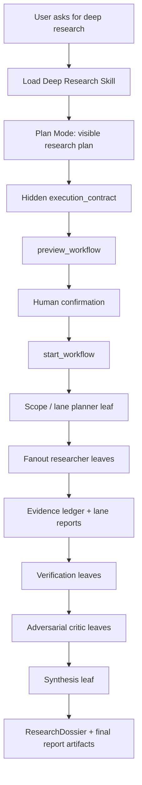

# Deep Research V3: Skill Capsule + Workflow Orchestration 方案

> 状态: 方案稿 / docs-only  
> 日期: 2026-06-27  
> 目标: 在旧 Deep Research 已退役清理后,重新定义 Hive-native Deep Research 的产品形态、执行结构、阶段计划和验收标准。  
> 约束: 不新增 Deep Research 专用 runtime/API/tool/UI 分叉; 只复用现有 Skill、Plan Mode、Workflow、Sub-agent、Work Ledger、Workspace Artifact、InvocationSpan/T0 机制。

## 1. 结论

Deep Research V3 不应做成单独的一套 `deep_research_*` 工具或私有 runtime。推荐形态是:

```text
Deep Research Skill capsule
  -> Plan Mode 产出用户可见研究计划 + 隐藏 workflow execution contract
  -> preview_workflow 预检 definition/hash/budget/leaf calls
  -> 用户确认
  -> start_workflow 启动通用 workflow run
  -> workflow leaves 调用真实 spawn_subagent
  -> ResearchDossier / EvidenceLedger 统一承载证据、验证、对抗和报告
```

一句话: **Deep Research 是一个 Skill 包装的 workflow template,不是一个新的执行系统。**

这也回答了「纯 Skill」和「Workflow」的选择:

| 方案 | 判断 | 适用范围 |
| --- | --- | --- |
| 纯 Skill | 不足以承载完整 Deep Research | 可用于轻量 web research 指南、单轮报告写作、人工按步骤执行。不能保证并发、恢复、预算、hash-pinned plan、verification gate、artifact contract。 |
| Skill + Workflow | 推荐 | Skill 负责触发、指导、模板、角色说明、检查清单; Workflow 负责确定性编排、fanout、gate、resume、quota、journal; Sub-agent 负责隔离研究、验证、对抗。 |
| 专用 Deep Research runtime/API/tool | 明确拒绝 | 旧问题会复发: 两条路径、引用清理困难、Plan Mode 混乱、产品状态和执行状态不一致。 |

## 2. 当前仓库事实

本轮核查得到的事实:

- 当前 `Deep Research` 显式代码命中只剩 retired guard 和对应测试;旧功能面已经被清掉。
- `backend/app/skills/registry.py` 已明确定义 Skill 是 progressive-disclosure capability capsule; Skill 可以携带 workflow/subagent/script guidance,但执行必须走 governed runtime。
- `backend/app/tools/handlers/workflow.py` 已提供 `preview_workflow` 和 `start_workflow`; `start_workflow` 要求先 preview,并绑定 `preview_id` / `definition_hash` / `args_hash`。
- `backend/app/runtime/workflow_definition.py` 定义的 workflow 是结构化数据,不是代码执行面; task 字符串只支持受限 key substitution。
- `backend/app/tools/handlers/subagent.py` 已定义 `spawn_subagent` 是 lightweight worker,不是 peer digital employee delegation;内建 `explorer` / `worker` / `critic` 类型。
- `backend/app/services/workflow_leaf_presets.py` 已有 leaf preset registry; preset 包装真实 `spawn_subagent`,不替代它。
- `backend/app/skills/retired.py` 已将 `deep-research` folder slug 标记为 retired;后续 V3 不应直接复用 `deep-research` 作为 folder slug,否则会和清理机制冲突。

因此 V3 的实现应使用新 folder slug,例如:

```text
backend/app/templates/system_skills/deep-research-v3/
```

产品展示名可以仍然叫 `Deep Research`,但底层 folder slug 不复用旧 `deep-research`。如果未来坚持复用旧 slug,必须先设计并测试 retired-list 迁移,否则线上启动清理会删除新 skill row 或工作区副本。

## 3. 外部参考结论

参考对象:

- OpenAI Deep Research: https://openai.com/index/introducing-deep-research/ 和 system card: https://cdn.openai.com/deep-research-system-card.pdf
- Anthropic agent patterns: https://www.anthropic.com/engineering/building-effective-agents
- Anthropic multi-agent research system: https://www.anthropic.com/engineering/multi-agent-research-system
- LangChain Open Deep Research: https://www.langchain.com/blog/open-deep-research
- LangChain Deep Agents research example: https://docs.langchain.com/oss/python/deepagents/deep-research
- NVIDIA AI-Q Blueprint: https://docs.nvidia.com/aiq-blueprint/1.2.1/architecture/overview.html
- DeepResearch Bench: https://github.com/Ayanami0730/deep_research_bench

抽象出来的共同点:

1. Deep Research 不是一次搜索,而是 long-running research workflow。
2. 可靠形态通常是 supervisor/orchestrator + 多个 researcher/verifier/critic worker。
3. Worker 必须有上下文隔离;最终 writer 不应该直接吞大量原始网页拼接。
4. Citation/source verification 是核心质量门,不是报告末尾装饰。
5. Adversarial review 应在最终报告前发生,而不是报告后才备注。
6. 最终报告必须显式区分 verified findings、rejected claims、unresolved gaps、coverage limits。

这些结论和 Hive 当前架构天然一致: Workflow 做 orchestration,Sub-agent 做 isolated work,Skill 做 progressive disclosure 和 reusable procedure。

## 4. 产品目标与非目标

### 4.1 目标

Deep Research V3 要完成四件事:

1. **多方向研究**: 把问题拆成若干 research lanes,并行收集不同方向的证据。
2. **验证**: 对来源、引用、关键 claim、数据新鲜度、互相矛盾处做独立 verification。
3. **对抗分析**: 让 critic/skeptic subagents 主动挑战结论、覆盖面、推理链、过度外推和证据强度。
4. **报告落地**: 形成一份可审计、可引用、可交付的最终报告,并保留完整 ResearchDossier。

### 4.2 非目标

明确不做:

- 不恢复 `deep_research_run/start/check/cancel/export` 作为默认模型工具。
- 不新增 `RuntimeTask(task_type="deep_research")`。
- 不新增 Deep Research 专用 API router 或前端状态源。
- 不让 Skill 本身绕过 workflow/subagent runtime 执行。
- 不让 subagent 写 durable memory / skill / soul。
- 不让外部网页、PDF、网页正文中的指令成为系统指令。

## 5. 目标架构



### 5.1 Deep Research Skill Capsule

建议结构:

```text
backend/app/templates/system_skills/deep-research-v3/
  SKILL.md
  references/
    process.md
    source-quality.md
    verification.md
    adversarial-review.md
    report-style.md
  templates/
    visible-plan.md
    research-dossier-schema.md
    final-report.md
  evals/
    eval.yaml
```

Skill 的职责:

- 识别什么时候该进入 Deep Research。
- 明确先 Plan Mode,再 Workflow,再 Sub-agent。
- 给主 agent 研究计划格式、source policy、验证清单、对抗清单、报告要求。
- 声明不可做的事: 不直接启动旧工具、不绕过 confirmation、不写 memory、不扩 scope。
- 指导 agent 使用 `preview_workflow` / `start_workflow` 的正确时机。

Skill 不负责:

- 自己执行长期任务。
- 自己并发 worker。
- 自己保存 runtime state。
- 自己绕过 workflow hash/preview 绑定。

### 5.2 Workflow Execution Contract

Plan Mode 输出必须分两层:

```json
{
  "visible_plan": {
    "title": "研究主题",
    "objective": "用户要解决的决策问题",
    "scope": {
      "in_scope": [],
      "out_of_scope": [],
      "assumptions": []
    },
    "research_lanes": [],
    "source_policy": {},
    "verification_plan": [],
    "adversarial_plan": [],
    "deliverables": [],
    "success_criteria": [],
    "stop_conditions": []
  },
  "execution_contract": {
    "type": "workflow",
    "workflow_ref": "deep_research_v3",
    "definition_hash": "...",
    "args_hash": "...",
    "args": {
      "question": "...",
      "audience": "...",
      "output_language": "zh",
      "lanes": [],
      "source_policy": {},
      "budget": {},
      "requested_artifacts": ["report.md", "sources.jsonl", "claims.jsonl"]
    },
    "artifact_contract": {
      "canonical": "research_dossier",
      "final_report": "report.md",
      "structured_result": "final.json"
    }
  }
}
```

用户只看 `visible_plan`。平台和 runtime 使用 `execution_contract`。可见计划里不得出现内部 runtime path、hash、tool 名、jsonl 文件名、`deep_research_*` 字样。

### 5.3 Workflow Shape

V3 的 workflow 建议为:

```yaml
name: deep_research_v3
description: Multi-lane research with verification, adversarial review, and report synthesis.
args_schema:
  question: {type: string, required: true}
  output_language: {type: string, required: true}
  audience: {type: string, required: false}
  lanes: {type: array, required: true}
  source_policy: {type: object, required: true}
  budget: {type: object, required: true}
  requested_artifacts: {type: array, required: true}
steps:
  - id: scope
    type: agent_step
    leaf: {name: deep-research-v3-planner, type: critic, max_tool_rounds: 1}
    effects: read_only
    task: "Validate scope and lane plan for {{args.question}}."
  - id: research
    type: fanout_step
    leaf: {name: deep-research-v3-researcher, type: explorer, max_tool_rounds: 12}
    effects: read_only
    items_from: args.lanes
    max_concurrency: 4
    per_item_task: "Research lane {{item.id}} for {{args.question}} using source policy {{args.source_policy}}."
  - id: verify
    type: agent_step
    leaf: {name: deep-research-v3-verifier, type: critic, max_tool_rounds: 4}
    effects: read_only
    task: "Verify source quality, citations, and claims from {{steps.research.output}}."
  - id: adversarial
    type: agent_step
    leaf: {name: deep-research-v3-adversary, type: critic, max_tool_rounds: 4}
    effects: read_only
    task: "Challenge the verified findings for gaps, contradictions, weak evidence, and overreach."
  - id: synthesize
    type: agent_step
    leaf: {name: deep-research-v3-synthesizer, type: critic, max_tool_rounds: 3}
    effects: workspace_write
    task: "Write final report in {{args.output_language}} from verified dossier and adversarial review."
```

说明:

- 这个 YAML 是目标 shape,不是要求 workflow 引擎新增语法。
- `workspace_write` 需要确认后的 workflow 执行阶段;Plan Mode 中只能 preview。
- Leaf name 绑定系统侧 preset;definition 数据不注入任意 prompt/tool。

### 5.4 Sub-agent Roles

| Role | Type | Tools | 输出 |
| --- | --- | --- | --- |
| Planner / Scope Validator | critic | zero-tool 或 read-only | 校验研究问题、scope、lanes、source policy 是否可执行。 |
| Researcher | explorer | web/search/fetch/crawl/read-only connectors | 每个 lane 的 source-bound digest,不写最终报告。 |
| Source Verifier | critic | read-only source access | source grade、freshness、primary/secondary、paywall/auth gap、citation support。 |
| Claim Verifier | critic | read-only source access | claim verdict: supported / weak / contradicted / unsupported。 |
| Adversary | critic | zero-tool 或 read-only | coverage gaps、contradictions、alternative explanations、confidence calibration。 |
| Synthesizer | critic | zero-tool + system-side artifact postprocess | 基于 dossier 写报告;不得引入新事实。 |
| Artifact Composer | deterministic postprocess plus optional LLM formatting | office/workspace tools only after confirmation | report.md/final.json/可选 DOCX/PPTX/XLSX/HTML。 |

Sub-agent 定义可以作为 Skill references 或 leaf preset prompt 资产存在,但执行必须通过真实 `spawn_subagent` 或 workflow leaf executor。

## 6. ResearchDossier 契约

Deep Research 的 source of truth 不是最终 `report.md`,而是 `ResearchDossier`。

建议目录:

```text
research_dossier/
  request.json
  visible_plan.md
  execution_contract.json
  workflow_preview.json
  lanes.json
  sources.jsonl
  claims.jsonl
  lane_reports.jsonl
  verification.jsonl
  adversarial_review.jsonl
  synthesis_notes.json
  report.md
  final.json
  coverage.json
  artifacts/
```

最小结构:

```json
{
  "claim_id": "claim_001",
  "lane_id": "market",
  "claim": "...",
  "supporting_sources": ["src_001", "src_002"],
  "verdict": "supported",
  "confidence": "medium",
  "verification_notes": "...",
  "adversarial_notes": "...",
  "included_in_report": true
}
```

硬规则:

- 每个 report claim 必须回指 `claims.jsonl`。
- 每个 supported claim 必须至少有一个 source ref。
- 未验证、弱证据、互相矛盾的 claim 不能伪装成确定结论。
- 被 adversary refute 的 claim 默认不得进入最终 payload;若必须保留,要以 caveat/gap 形式出现。
- 最终报告必须能从 dossier 复核,不能只有自然语言成品。

## 7. 运行阶段与验收标准

这些阶段是实现顺序和验收门,不是允许上线半成品的 MVP。Deep Research V3 只有在所有阶段通过后才算 product-ready。

### Stage 0: ADR 与边界钉死

交付:

- 本方案文档。
- 明确不恢复旧 `deep_research_*` 默认工具。
- 明确 V3 slug 不复用 retired `deep-research`。

验收:

```bash
cd /Users/rocky243/vc-saas/hiveclaw-main
rg -n -i "deep_research_|deepResearch|deep research|deep-research" backend/app frontend/src docs
```

通过标准:

- 旧专用 runtime/API/UI/tool 不被重新引入。
- 新文档只描述 V3 方案和 retired guard。

### Stage 1: Deep Research V3 Skill Capsule

交付:

- `backend/app/templates/system_skills/deep-research-v3/SKILL.md`
- `references/` 和 `templates/`。
- `evals/eval.yaml` 覆盖 should-trigger / should-not-trigger / output quality。
- `skill_seeder.py` 将 V3 skill 加入 builtin/system skill 列表。

验收:

- Skill catalog 中出现产品名 `Deep Research`,folder 为 `deep-research-v3`。
- `load_skill("Deep Research")` 只加载指导,不解锁新工具。
- Skill body 不引用不存在的 tool。
- `deep-research` retired guard 仍能清旧数据,不会清 V3。

建议测试:

```bash
cd /Users/rocky243/vc-saas/hiveclaw-main/backend
source .venv/bin/activate
pytest tests/templates/test_skill_capability_alignment.py tests/services/test_skill_seeder.py tests/skills/test_parser_v2.py -q
```

### Stage 2: Workflow Contract 与 Preview

交付:

- Deep Research V3 workflow definition template。
- Plan Mode hidden `execution_contract` schema。
- `preview_workflow` 可编译并返回 hash/budget/leaf calls。
- 用户确认绑定 `definition_hash` / `args_hash`。

验收:

- Plan Mode 内只能 `preview_workflow`,不能 `start_workflow`。
- 可见计划不泄漏 `workflow_ref` hash、内部路径、jsonl 文件名、tool 名。
- `start_workflow` 启动前必须能证明 definition/args 与 preview 一致。

建议测试:

```bash
cd /Users/rocky243/vc-saas/hiveclaw-main/backend
source .venv/bin/activate
pytest tests/tools/test_workflow_tool.py tests/tools/test_plan_mode_policy.py tests/services/test_plan_mode_service.py -q
```

### Stage 3: ResearchDossier 与 Evidence Ledger

交付:

- Dossier writer/reader contract。
- `sources.jsonl`、`claims.jsonl`、`lane_reports.jsonl` 的 schema。
- 每个 researcher leaf 只能写自己的 shard,再由 synthesis 前合并。

验收:

- 并行 lanes 不竞争同一个 jsonl append。
- 每条 claim 有 `claim_id`、`lane_id`、`source_refs`、`verdict`。
- 空 source / unreadable PDF / auth wall / low-quality page 不能被当成成功 source。
- Dossier 可通过 workflow_run_id / plan_id / chat_session_id 追溯。

### Stage 4: Verification Gate

交付:

- Source verifier。
- Claim verifier。
- Citation verifier。
- Coverage checker。

验收:

- 报告正文引用不存在的 source id 时 fail 或 downgrade,不能 clean completed。
- source ledger 中未被正文引用的 source 不进入最终 footnote 表。
- 关键 claim 被 verifier 判定 unsupported 时不得进入 writer payload。
- 每个 lane 都有 coverage 状态: covered / partial / missing / blocked。

### Stage 5: Adversarial Review Gate

交付:

- Adversary leaf prompt/preset。
- `adversarial_review.jsonl`。
- synthesis 只能读取 verifier + adversary 后的 payload。

验收:

- Adversary 必须挑战 coverage、contradictions、freshness、alternative explanation、overclaiming。
- 如果 adversary 发现 material issue,最终报告必须显式处理,不能静默忽略。
- 被 refuted 的 claim 默认从 final writer payload 剔除。
- 最终报告中必须有 limitations / confidence / unresolved gaps。

### Stage 6: Final Report 与 Artifact Composer

交付:

- `report.md` canonical report。
- `final.json` structured summary。
- 可选 DOCX/PPTX/XLSX/HTML composer,但它们必须读 dossier,不能只机械转 Markdown。

验收:

- 报告语言跟用户要求一致。
- 报告不是 lane-by-lane 拼接;必须有 thesis、evidence weighting、conflict resolution、implications。
- 每个事实性 claim 可追溯。
- PPTX 是决策叙事;XLSX 是 evidence workbook;DOCX 是 formal memo;HTML 是可交互阅读层。

### Stage 7: Product UX 与 Ops

交付:

- 前端复用 workflow run / artifact surface。
- 不新增 Deep Research 专用状态源。
- Progress 显示来自 workflow steps/leaves。
- Admin/ops 使用现有 workflow admin commands。

验收:

- plan card 是计划状态唯一真相源。
- workflow progress 是执行状态唯一真相源。
- assistant 普通消息不重复宣布和 card 冲突的成功/失败。
- cancel / suspend / replay / resume 走 workflow ops。

### Stage 8: Evals 与 Live Rollout

交付:

- Golden evals: happy path、missing data、conflicting evidence、prompt injection、citation hallucination、source blocked、multi-format output。
- Production/eval scripted traces。

验收:

- eval 不只看 final answer,还检查 dossier、source refs、claim verdicts、adversarial handling。
- 至少覆盖中文报告、英文报告、混合来源但单语言输出。
- Live trace 证明: Plan Mode -> preview -> confirmation -> workflow -> subagents -> dossier -> report 全链闭环。

建议命令:

```bash
cd /Users/rocky243/vc-saas/hiveclaw-main/backend
source .venv/bin/activate
pytest \
  tests/templates/test_skill_capability_alignment.py \
  tests/services/test_skill_seeder.py \
  tests/tools/test_plan_mode_policy.py \
  tests/tools/test_workflow_tool.py \
  tests/agents/test_subagent_spawn_tool.py \
  tests/services/test_subagent_run_service.py \
  tests/api/test_workflows.py \
  -q
```

## 8. 关键质量标准

Deep Research V3 的完成标准不是 `status=completed`,而是:

1. **Plan fidelity**: 用户确认的 scope、lanes、source policy、format、language 与 execution contract 一致。
2. **Source fidelity**: 每个来源有 URL/metadata/fetch time/source grade。
3. **Claim fidelity**: 每个关键 claim 有 source refs 和 verification verdict。
4. **Citation fidelity**: 报告引用没有悬空 id,没有未引用 sources 塞进 footnotes。
5. **Coverage honesty**: 未覆盖方向和 blocked source 明确写出。
6. **Adversarial handling**: 对抗意见被合成阶段处理,不是丢在附件里。
7. **Single language**: 最终报告遵守用户语言,内部英文 scaffolding 不外泄。
8. **No stitched report**: 最终报告有论点结构和冲突消解,不是 worker digest 拼接。
9. **Governed execution**: 所有执行都走 `preview_workflow` / `start_workflow` / `spawn_subagent` / workspace artifact。
10. **Auditability**: 通过 workflow run、InvocationSpan/T0、ResearchDossier 可以复盘。

## 9. 需要先写的 Red Tests

实现前建议先写这些失败测试:

1. `deep-research-v3` 可以 seed,但 retired `deep-research` 仍被 cleanup 删除。
2. Skill catalog 里 `Deep Research` 可见,但加载 skill 不新增任何专用工具。
3. Plan Mode visible plan 出现 `deep_research_*`、`runtime_artifacts/`、`*.jsonl` 时失败。
4. Hidden execution contract 中 `workflow_ref=deep_research_v3` 通过 schema 校验。
5. Plan Mode 内 `preview_workflow` 允许,`start_workflow` 拒绝。
6. `start_workflow` definition/args 与 preview hash 不一致时拒绝。
7. Research fanout 为每个 lane 写独立 shard,并可合并成 top-level `sources.jsonl` / `claims.jsonl`。
8. Verifier refute 的 claim 不进入 synthesizer writer payload。
9. Report 引用未知 source id 时不能 clean completed。
10. Adversarial review 的 material issue 必须出现在 final report 的 limitation/confidence/decision section。
11. Final report `report.md` 每个 factual claim 都能映射到 `claims.jsonl`。
12. Workflow run completed 后 artifact surface 能读到 `report.md` 和 `final.json`。

## 10. 决策记录

当前推荐拍板:

- Deep Research V3 = **system Skill + workflow template + subagent leaf roles + dossier artifacts**。
- 不复活旧 `deep_research_*` 默认工具。
- 不新增 Deep Research 专用 runtime。
- V3 folder slug 使用 `deep-research-v3`,产品名仍可为 `Deep Research`。
- ResearchDossier 是 source of truth,final report 是 communication layer。
- Verification 和 adversarial review 是 mandatory gates,不是 best-effort 后处理。

后续若进入实现,第一步不是写业务逻辑,而是写 Stage 1/2 的 red tests,先钉住 skill seeding、retired slug、Plan Mode visible/hidden contract、workflow preview/hash 绑定。
