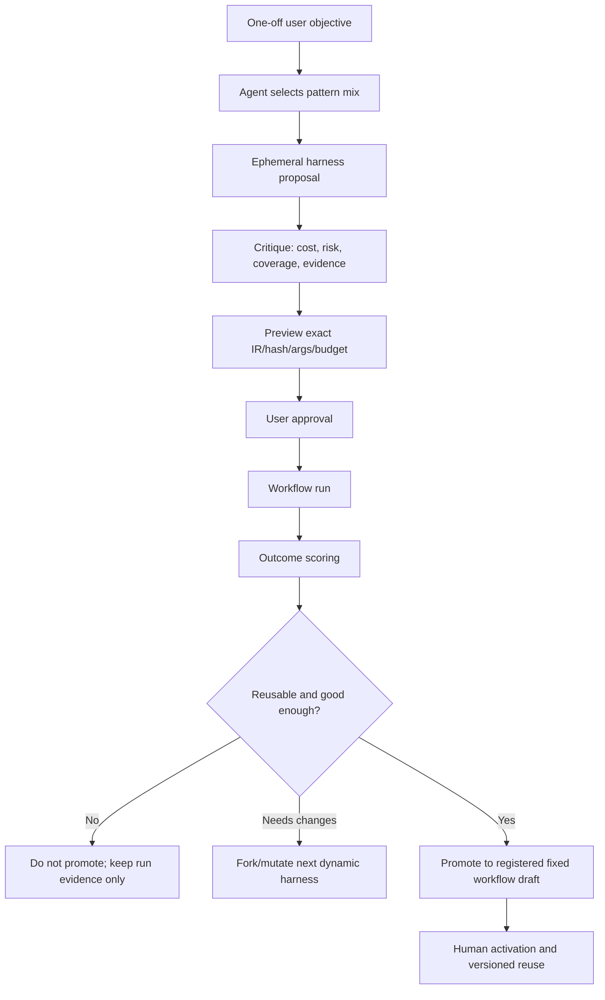

# Dynamic Workflow Harness Semantics and Evolution Plan (2026-06-24)

> 状态：docs-only 设计文档。
>
> 关系：本文属于 `docs/ccplus-round2-v2-hive-connect-master-plan-2026-06-24.md` 的 Workflow 主线专项，是 `docs/dynamic-workflow-cc-alignment-redesign-2026-06-23.md` 的补充，不替代它。06-23 文档回答“Hive 当前 runtime 和 CC Dynamic Workflow 的差距”；本文专门回答“Dynamic Workflow 的底层语义、几种常见形式如何组合、以及动态 harness 如何沉淀成固定 workflow”。

## 文档索引关系

本文回答 V2 Workflow 主线中的 `DynamicHarnessWorkflowV1`。

- 上游总纲：[CCPlus Round 2 / V2 Hive Connect Master Plan](./ccplus-round2-v2-hive-connect-master-plan-2026-06-24.md)。它定义 V2 六条主线、Workflow 双轨、实施顺序和验收矩阵。
- 并列专项：[A2A Workflow Orchestration Design](./a2a-workflow-orchestration-design-2026-06-24.md)。它回答多个完整 Agent 主体之间如何用 process graph、artifact_ref、node session 交接。
- 上游差距文档：[Dynamic Workflow CC Alignment Redesign](./dynamic-workflow-cc-alignment-redesign-2026-06-23.md)。它回答当前 runtime 与 CC Dynamic Workflow 的差距。
- 边界分工：本文不定义 A2A cross-owner authorization，不定义完整 Agent 之间的 artifact handoff；这些属于 A2A Relationship 与 A2A Workflow 文档。本文也不改变现有 `WorkflowDefinition -> compiler -> admission -> WorkflowEngine` 的企业安全底座。

## 1. 结论

Hive 不应该把现有 Workflow 改成任意 JavaScript/Python runtime。现有 `WorkflowDefinition -> compiler -> admission -> WorkflowEngine -> RuntimeTask/journal` 是正确的企业安全底座。

但 Hive 现在缺的是 **Dynamic Harness Layer**：

```text
用户目标
  -> Agent 判断是否需要 workflow
  -> Agent 选择/组合 workflow patterns
  -> 生成一个可读、可预览、可复跑的 ephemeral harness
  -> 平台将 harness 降级为安全 Workflow IR
  -> 用户批准 exact artifact/hash/budget/scope
  -> Workflow runtime 执行
  -> 结果被评分、复盘、fork/mutate
  -> 高质量且重复出现的 harness 才 promote 成 fixed workflow
```

所以 Dynamic Workflow 和固定 Workflow 的边界不是“临时 JSON vs 注册 JSON”，而是：

| 形态 | 控制权 | 产物 | 复用方式 |
| --- | --- | --- | --- |
| Dynamic Workflow | Agent 根据任务现场设计 harness，并可组合多个 pattern | ephemeral harness proposal + selected workflow definition | 每次先生成/评审/批准；成功后可 fork 或 promote |
| Fixed Workflow | 组织/用户已批准一套稳定 harness | registered workflow definition/version/hash | 可按名调用、触发器调用、权限策略调用 |

一句话：**Dynamic Workflow 是 Agent 自己发明和试运行 harness 的能力；Fixed Workflow 是被证据证明有效后固化下来的 harness。**

## 2. 证据来源

外部资料：

- Claude Code Docs: [Orchestrate subagents at scale with dynamic workflows](https://code.claude.com/docs/en/workflows)
- Claude Blog: [Introducing dynamic workflows in Claude Code](https://claude.com/blog/introducing-dynamic-workflows-in-claude-code)
- Claude Blog: [A harness for every task](https://claude.com/blog/a-harness-for-every-task-dynamic-workflows-in-claude-code)
- Community summary: [How to master Dynamic Workflows in Claude Code: 6 patterns and 14 steps](https://youmind.com/landing/x-viral-articles/master-claude-code-dynamic-workflows)
- Community summary: [Claude Code Dynamic Workflows: 6 patterns and 14 steps](https://www.the-ai-corner.com/p/claude-code-dynamic-workflows-6-patterns-14-steps-anthropic-engineers-2026)

参考 repo 取证快照：

- `Michaelliv/pi-dynamic-workflows` at `31b2aca0f1cb195aafbfc5e3ee2b8c83ad3f21a2`
- `usewhale/Whale` at `68012a38c64ff5c08410c95e3490f6c87ae36f68`
- `agentjido/jido` at `2f6ac718a206770a5e3269c90c055b411292df20`

本地 Hive 代码事实：

- `backend/app/runtime/workflow_definition.py`
- `backend/app/runtime/workflow_compiler.py`
- `backend/app/runtime/workflow_admission.py`
- `backend/app/runtime/workflow_engine.py`
- `backend/app/services/workflow_runtime_service.py`
- `backend/app/services/workflow_definitions.py`
- `backend/app/services/workflow_trigger.py`
- `backend/app/services/workflow_promote_suggestions.py`
- `backend/app/tools/handlers/workflow.py`

## 3. CC Dynamic Workflow 的底层语义

Claude 官方文档给出的关键分界是“谁持有计划”：

```text
普通对话 / subagent:
  Claude 在上下文窗口里逐轮决定下一步。

Workflow:
  script 持有下一步控制流。
  中间结果保存在 script/runtime state。
  叶子 agent 只负责具体工作。
```

这意味着 Dynamic Workflow 不是“多开几个 subagent”。它是三层系统：

1. **Selector/Catalog layer**：模型判断当前任务是否需要 workflow，以及是否有已有 workflow 可用。
2. **Harness authoring layer**：模型写出一段本次任务专用的 orchestration artifact。
3. **Workflow runtime layer**：runtime 在隔离环境里执行 artifact，负责并发、barrier、预算、resume、进度、缓存和 UI。

开源复刻实现也支持这个判断：

- `pi-dynamic-workflows` 暴露 `agent() / parallel() / pipeline() / phase() / log() / args / budget`，用 Node `vm` 执行脚本，但禁用 `Date.now()`、`Math.random()`、`require`、`import`、`fs`、network API；每个 `agent()` 是独立子会话。
- `Whale` 用 QuickJS sandbox 执行 Claude Code compatible raw script，支持 same-session resume cache；resume key 由 call key + spec hash 决定，spec 变化会使缓存失效。
- `Jido` 不是 CC Dynamic Workflow 复刻，但它把 Agent decision/state 与 runtime-owned directives 分开。这个边界对 Hive 很重要：模型决定，runtime 执行，外部 effect 必须由 typed directive / governed primitive 承接。

底层逻辑可以抽象成：

```text
LLM owns intelligence:
  decomposition, role design, rubric, verifier choice, stop condition, synthesis judgment

Harness owns control:
  order, fanout, barrier, cache key, retry boundary, budget, progress, resume

Platform owns authority:
  capability binding, tenant boundary, approval, audit, side-effect gate, persistence
```

Hive 的现有问题不是 platform authority 不够，而是 harness authoring layer 还没有成为 first-class 能力。

## 4. Pattern Algebra: 6 个核心模式和 8 类实际组合

社区常说的“6 种 Dynamic Workflow pattern”是合理的，但它们不应该被理解为固定模板列表。更准确地说，它们是 Agent 可自由组合的 **pattern algebra**。

### 4.1 六个核心 pattern

| Pattern | 控制流语义 | 适用场景 | Hive 当前表达 | Hive 缺口 |
| --- | --- | --- | --- | --- |
| Classify-and-act | 先分类，再路由到不同路径/模型/叶子 | triage、任务分流、模型路由 | `when` condition 可表达部分分支 | 缺 selector output schema、model/leaf routing hint |
| Fan-out-and-synthesize | 拆成多个独立子任务，并行执行后合成 | repo audit、research angles、多文件迁移 | `fanout_step` + 后续 `agent_step` 可表达 | fanout 输出 schema 不强，synthesizer rubric 不成 contract |
| Adversarial verification | 独立 verifier 试图推翻前序结果 | security、critical decision、claim audit | `critic` leaf 可表达 | 缺 workflow-level verification contract/pass threshold |
| Generate-and-filter | 多个 generator 产候选，filter/critic 淘汰 | design/name/content/code variants | fanout + critic 可近似 | 缺候选集合 schema、filter pass/fail 结构 |
| Tournament | pairwise/rubric judge 选择 winner | 命名、方案比较、taste-heavy work | 可用 fanout + judge 组合 | 缺 tournament shorthand、pairwise judge metadata |
| Loop-until-done | 反复找问题/修复/验证，直到收敛 | bug hunt、migration fix loop、research completeness | 现有 DSL 不开放 loop | 需要 bounded repeat，不允许任意 while |

### 4.2 实际文章里经常扩成 8 类

Claude 官方 “A harness for every task” 还提到 triage、exploration/taste、evals、model routing；社区文章也常把 use case 扩成 8 类：migration、deep research、sorting、root-cause investigation、triage、design taste、lightweight evals、verification。

这些不是和 6 patterns 并列的新原语，而是组合结果：

| 实际形态 | 常用组合 |
| --- | --- |
| Migration | classify scope + pipeline per file + adversarial verification + loop-until-done |
| Deep Research | classify question + fanout source angles + claim extraction + adversarial verification + synthesis |
| Sorting / ranking | classify + fanout scoring + tournament / rubric judge |
| Root-cause investigation | hypothesis fanout + evidence check + adversarial refutation + loop |
| Triage | classify-and-act + dedupe + quarantine + escalate/action |
| Design taste / naming | generate-and-filter + tournament + rubric judge |
| Lightweight evals | fanout runs + comparison agents + rubric score + regression notes |
| Verification | adversarial verification + evidence audit + final assertion |

所以 Hive 的正确目标不是硬编码 6 或 8 个 workflow templates，而是提供可组合的 pattern primitives，并让 Agent 能把它们组合成 harness。

## 5. Dynamic vs Fixed 的生命周期边界

Dynamic Workflow 的核心价值在“可进化的 harness lifecycle”：



Promotion 不能只看“跑了几次”。应至少看：

- `run_count`：同一类目标是否重复出现。
- `success_rate`：完成率、失败率、suspended/reconciliation 比例。
- `critic_pass_rate`：verifier/critic 是否持续通过。
- `manual_edit_rate`：用户或 Agent 是否每次都要大改 harness。
- `cost_variance`：token、leaf calls、wall clock 是否稳定。
- `scope_similarity`：输入范围是否真同类，而不是 hash 偶然相同。
- `side_effect_profile`：是否有 external/irreversible effect，以及 gate 是否清晰。
- `user_acceptance`：最终结果是否被用户保存、采用或正向反馈。

只有这些证据稳定，ephemeral harness 才应该变成 registered workflow。否则它应该留在 run evidence 里，供下一次 Agent 生成更好的 harness。

## 6. Hive 当前实现的位置

Hive 已经拥有强底座：

- `workflow_definition.py` 明确 workflow definition 是 serializable structured data，没有 eval、Jinja、Python/JS expression 或任意代码执行面。
- `workflow_compiler.py` 做跨 step 结构验证：reference、leaf catalog、external/irreversible 前置 gate、retry reversible-only。
- `workflow_admission.py` 做 args、budget、fanout、concurrency、leaf calls、wall clock 的 hard reject。
- `workflow_engine.py` 是确定性解释器：sequence、condition、agent step、bounded fanout、gate、wait_until、wait_signal、journal replay、leaf-level cache。
- `workflow_runtime_service.py` 将 run 落到 `RuntimeTask(task_type="workflow")`，存 definition/args/hash，支持 resume、advisory lease、hard-stop reconciliation。
- `workflow_definitions.py` 提供 registered lifecycle：draft/active/deprecated/revoked、immutable version、agent 只能提交 draft、human activation。
- `workflow_trigger.py` 通过 `workflow_ref` pin name/version/hash，fire-time mismatch 会 suspended needs_reconfirmation，而不是静默跑新版。
- `workflow_promote_suggestions.py` 已有 repeated ephemeral evidence 的最小 promote seed。

但 Hive 还缺四个上层语义：

1. **没有 first-class harness proposal**：Agent 可以直接提交 JSON definition，但没有“生成多候选 harness、评审、选择”的协议。
2. **没有 pattern algebra**：系统没有把 classify/fanout/verify/generate-filter/tournament/loop 作为模型可见组合语言。
3. **没有 selector/catalog**：Agent 不知道何时用 fixed workflow、何时造 dynamic harness、何时只用 subagent。
4. **promotion evidence 太薄**：当前 promote suggestion 主要看 completed ephemeral run 的 exact `definition_hash` 计数，还没有 outcome quality 和 mutation history。

这说明 Hive 的底座比很多复刻实现更治理化，但还不是完整 Dynamic Workflow。

## 7. 目标架构

### 7.1 新增 Dynamic Harness Layer

建议在现有 Workflow Runtime 之上新增一层：

```text
DynamicHarnessLayer
  - WorkflowSelector
  - PatternCatalog
  - HarnessProposal schema
  - HarnessCritic
  - HarnessToWorkflowIR lowerer
  - ApprovalContract binder
  - OutcomeScorer
  - PromotionAdvisor
```

职责边界：

| 组件 | 职责 | 不做什么 |
| --- | --- | --- |
| WorkflowSelector | 判断不用 workflow / 用 fixed workflow / 生成 dynamic harness | 不执行 workflow |
| PatternCatalog | 给模型暴露可组合模式和 examples | 不授权外部 effect |
| HarnessProposal | 保存候选、pattern mix、scope、budget、risk、success criteria | 不等同最终 run approval |
| HarnessCritic | 评审 coverage/cost/security/evidence | 不替用户批准 |
| HarnessToWorkflowIR | 把 harness 降级到现有 `WorkflowDefinition` 或未来扩展 IR | 不执行 raw JS |
| ApprovalContract | 绑定 exact definition_hash/args_hash/budget/leaves/scope | 不容忍 artifact 漂移 |
| OutcomeScorer | 从 run journal/critic/user feedback 计算质量证据 | 不自动激活 fixed workflow |
| PromotionAdvisor | 生成 promote/fork/deprecate 建议 | 不绕过 human activation |

### 7.2 模型可见语言：CC-compatible semantics, not raw JS execution

模型最容易学的是 CC-compatible API：

```javascript
phase("Search");
const findings = await parallel(items.map(item => () =>
  agent(`Inspect ${item}`, { label: "inspect", schema: findingSchema })
));

phase("Verify");
const verdict = await agent("Try to refute these findings...", {
  label: "critic",
  schema: verdictSchema
});
```

但生产多租户 runtime 不应该直接执行这段 JS。Hive 应采用：

```text
CC-compatible harness syntax or structured pattern AST
  -> parse/validate
  -> lower to governed WorkflowDefinition / Workflow IR
  -> compile/admit
  -> preview/start existing runtime
```

这样模型获得 Dynamic Workflow 的表达习惯，平台仍保留静态校验、capability binding、RLS、audit 和 zero-code execution surface。

### 7.3 Pattern AST

第一版可以新增内部 AST，而不是马上新增 runtime step type：

```yaml
pattern_nodes:
  - id: classify
    kind: classify_and_act
    output_schema: ClassificationSchema
    routes:
      migration: migration_path
      audit: audit_path

  - id: sweep
    kind: fanout_and_synthesize
    items_from: args.targets
    worker:
      leaf: repo_inspector
      output_schema: FindingSchema
    synthesizer:
      leaf: synthesis_worker
      rubric: coverage_first

  - id: verify
    kind: adversarial_verification
    target: sweep
    verifier:
      leaf: critic
      output_schema: VerificationSchema
    pass_threshold:
      field: remaining_critical_findings
      op: eq
      value: 0

  - id: fix_loop
    kind: bounded_loop
    max_iterations: 3
    body: [sweep, verify]
    stop_condition:
      field: verify.remaining_findings
      op: eq
      value: 0
```

Lowering 原则：

- v1 尽量降到现有 `agent_step`、`fanout_step`、`gate_step`、`wait_until_step`、`wait_signal_step`。
- 不能安全 lowering 的 pattern 只允许停在 proposal/preview 阶段，不可 start。
- `bounded_loop`、`tournament`、`verify_step`、`output_schema` 可以作为后续 IR 扩展，但必须先加 compiler/admission/runtime tests。

### 7.4 Selector 规则

模型选择 workflow 的依据应该显式化：

| 信号 | 推荐路径 |
| --- | --- |
| 单个文件、单个答案、低风险、低并发 | 不用 workflow，用普通工具/对话 |
| 需要少量独立角度，但没有固定控制流 | `spawn_subagent` 或 delegation |
| 用户明确要 workflow/fanout/multi-agent/repeatable harness | dynamic harness proposal |
| 已有 workflow 名称/描述匹配，且 scope/budget 可接受 | fixed registered workflow |
| 任务宽、长、对抗性、高价值、需要证据收敛 | dynamic harness proposal |
| 任务会周期重复，且固定步骤不能漂移 | registered workflow + trigger |

这和 Claude/Whale 的 catalog prompt 一致：只有用户明确要求 workflow、fan-out、多 agent orchestration、或已有 workflow 匹配时才倾向 workflow；普通快速读写仍用普通工具。

## 8. 对 Hive 的实现路线

### P0: 固化术语和入口

- 本文作为 semantic supplement。
- 06-23 文档继续作为 runtime alignment 入口。
- `workflow-source-capability.md` 后续应补一段：Dynamic Workflow = harness lifecycle layer，不是替换 WorkflowEngine。

### P1: HarnessProposal schema

新增内部 schema，字段至少包括：

```yaml
proposal_id: uuid
objective: string
scope:
  included: []
  excluded: []
success_criteria: []
constraints:
  max_tokens: int
  max_leaf_calls: int
  max_wall_clock_seconds: int
  allowed_effects: []
candidates:
  - candidate_id: string
    pattern_mix: []
    pattern_nodes: []
    lowered_definition: WorkflowDefinition | null
    lowering_status: lowerable | needs_ir_extension | rejected
    expected_strengths: []
    expected_risks: []
    estimated_cost: {}
critiques:
  - candidate_id: string
    reviewer: coverage | security | cost | evidence | adversarial
    pass: boolean
    findings: []
selected_candidate_id: string
selection_rationale: string
```

### P2: PatternCatalog and selector prompt

把 6 个核心 pattern + quarantine/model-routing/eval 作为模型可见 catalog，不作为固定模板硬编码。

Catalog 每项必须有：

- `when_to_use`
- `anti_patterns`
- `required_structured_outputs`
- `cost_shape`
- `risk_shape`
- `lowering_support`
- `example_harness`

### P3: `propose_dynamic_workflow`

新增 tool/service 只做 proposal，不执行：

```text
propose_dynamic_workflow
  input: objective, scope, constraints, success_criteria
  output: proposal_id, candidates, critiques, selected candidate, preview-ready definition when lowerable
```

执行边界：

- 可在 Plan Mode 里调用。
- 可以调用 `preview_workflow`。
- 不允许调用 `start_workflow`。
- 所有 selected candidate 必须绑定 exact definition_hash/args_hash/budget/leaves/scope。

### P4: IR 增量

按优先级补表达力：

1. step/leaf `output_schema`
2. `verify_step` 或统一 critic output contract
3. `bounded_repeat_step`
4. `tournament_step` shorthand
5. leaf-level `model_hint`
6. leaf-level `isolation_hint`
7. leaf-level `capability_profile`

每一项都必须先有 compiler/admission/runtime tests。尤其 `bounded_repeat_step` 必须有 `max_iterations`、budget hard cap、no irreversible auto-retry。

### P5: OutcomeScorer and PromotionAdvisor

将当前 promote suggestion 从 exact hash count 升级为 quality evidence：

```yaml
workflow_quality_evidence:
  run_count: int
  completed_count: int
  success_rate: float
  critic_pass_rate: float
  avg_tokens: int
  token_variance: float
  avg_wall_clock_seconds: int
  manual_edit_rate: float
  fork_count: int
  mutation_summary: []
  user_acceptance_events: []
  side_effect_incidents: []
```

Promotion 仍只生成 draft/proposal，activation 必须 human approver。

### P6: UI

产品面至少要有：

- Workflow selector result：为什么建议/不建议 workflow。
- Harness candidates：pattern mix、成本、风险、阶段、预计 leaf calls。
- Raw artifact：可展开查看 lowered `WorkflowDefinition`。
- Approval card：definition_hash、args_hash、budget、scope、effects。
- Run progress：phase、step、leaf、tokens、failures、verifier findings。
- Promotion card：质量证据、建议 scope、call policy、human activation。

## 9. 不做什么

- 不把现有 `WorkflowEngine` 推倒改成 raw JS executor。
- 不让 workflow script 直接访问 filesystem/shell/network。
- 不让 Agent 自己绕过 `preview_workflow -> exact approval -> start_workflow`。
- 不让 promotion 自动 active。
- 不用 Work Ledger 驱动 Workflow 控制流；Work Ledger 只做认知/观察镜像。
- 不把 Deep Research 继续做成专用 runtime；它应成为 fixed template + dynamic harness 的组合案例。

## 10. 验收标准

代码实现到位后，至少要满足：

1. Agent 可生成含 2 个以上 candidate 的 `HarnessProposal`。
2. 每个 candidate 必须声明 pattern mix、预算、风险、success criteria。
3. Lowerable candidate 能降级为现有 `WorkflowDefinition` 并通过 compile/admission。
4. 不可 lower 的 candidate 不可 start，只能提示需要 IR extension。
5. `start_workflow` 必须绑定 proposal selected candidate 与 exact preview artifact。
6. 修改 definition/args/budget/leaves/scope 任一项都会使 approval 失效。
7. 已完成 run 会写回 outcome quality evidence。
8. Promote suggestion 不再只看 run count，还显示 critic pass、成本、失败、manual edits。
9. Fixed workflow activation 仍要求 human approver。
10. Deep Research 可以选择 fixed template 或 dynamic research harness，但都走同一 Workflow runtime。

## 11. 最终判断

Hive 下一步不应该继续只增强固定 workflow 模板，也不应该为了像 CC 而引入任意脚本执行。

正确方向是：

```text
保留 structured Workflow IR 作为安全执行底座
  + 新增 CC-compatible Dynamic Harness authoring semantics
  + 用 pattern algebra 让 Agent 组合 6 个核心模式和 8 类实际场景
  + preview/approval/hash 绑定后才运行
  + 用 outcome evidence 决定是否 promote 成 fixed workflow
```

这会让 Workflow 从“Agent 可以提交一份流程 JSON”进化成“Agent 能自己设计、评审、试跑、修正、沉淀 harness 的系统”。
