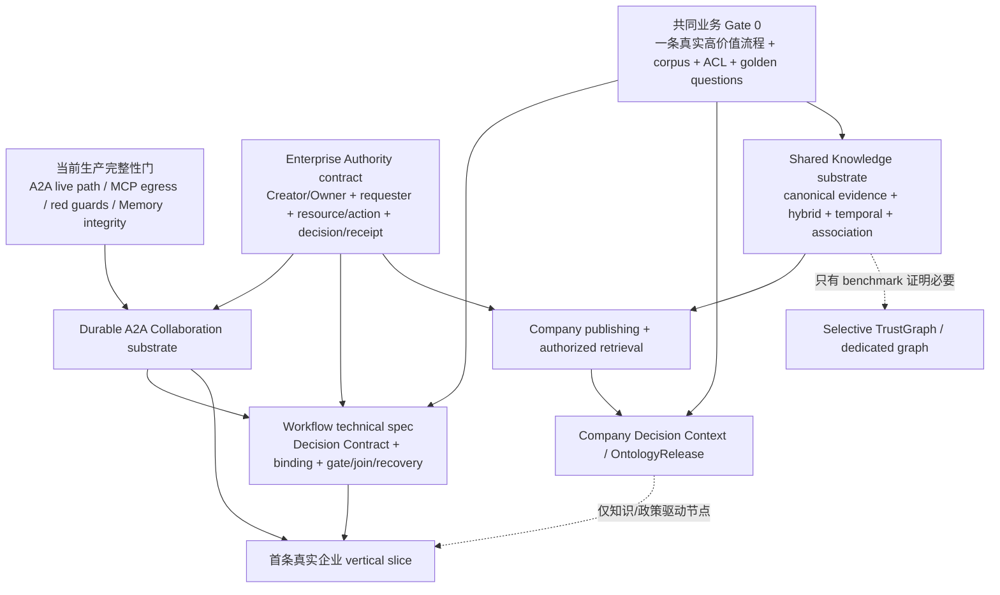
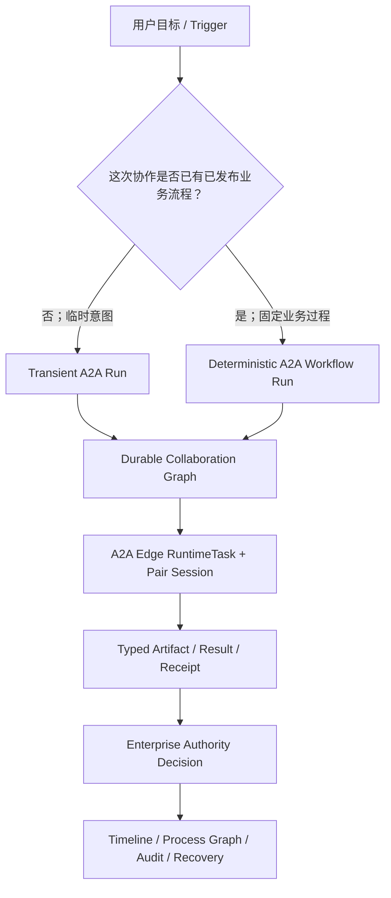
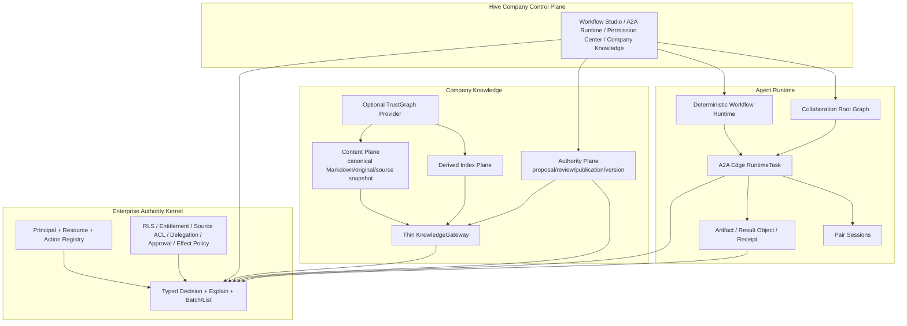
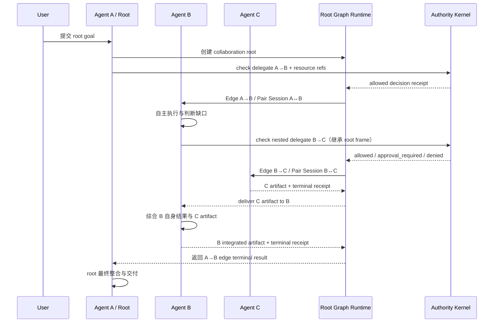
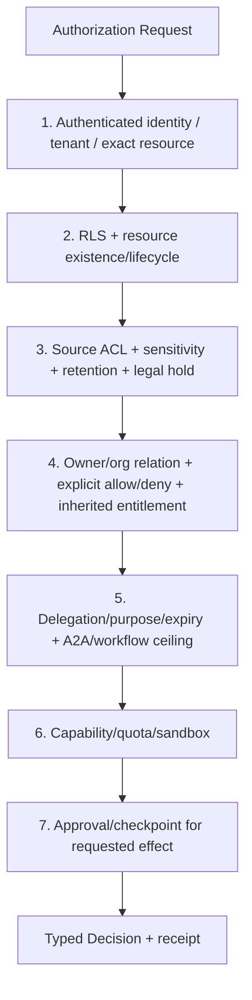
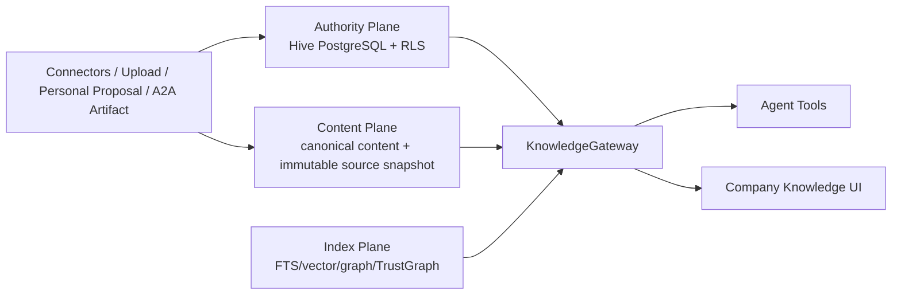
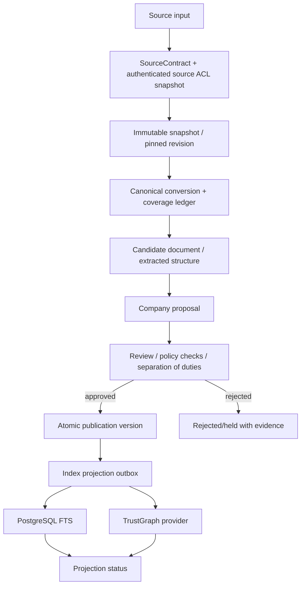
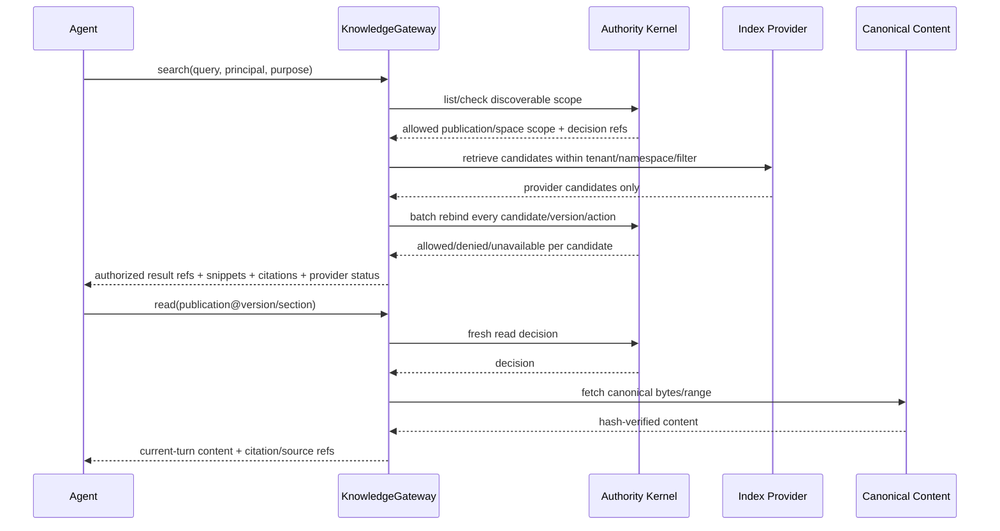
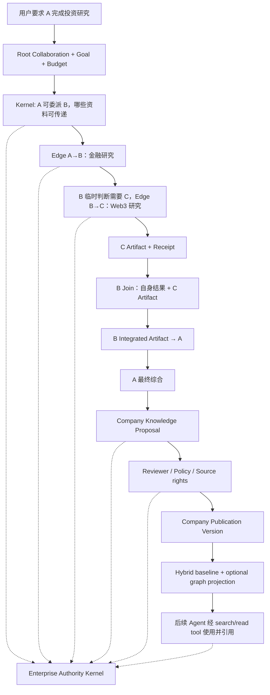

# Hive 企业 A2A Workflow、统一权限与 Company Knowledge 一体化方案

> 日期：2026-07-19
>
> 文档类型：跨域架构决策、生产事故复盘与单轮完整施工规格
>
> 本轮边界：只写文档；未修改代码、数据库、Railway 配置，未部署
>
> 取证基线：Hive `f901b7f29f570a7cfc6398f5394fc79208e471b4`、Bisheng `e87e2655eea412a8422f0a425e6712d3fa63504f`、StaffDeck `f7fa7d7c216ca72ac66f346fe0e1ef161f0053a8`、TrustGraph `80ca41f8d222e245534ae0d4302944e07973c575`
>
> 2026-07-20 更新：综合三份 07-20 专题方案、CC 反馈、当前源码、目标回归测试与 Railway production 只读证据，新增统一优先级、交叉依赖和当前断点总账；本次仍只改文档

## 0. 文档定位与最终结论

### 0.1 这次真正要解决的不是三个孤立功能

Hive 当前的核心问题不是分别缺少一个 A2A 页面、一个 ACL 表和一个 RAG 服务，而是缺少一套共同的企业运行契约：

1. Agent 之间如何形成持续、可恢复、可控制的协作图；
2. 每条协作边、每个资源、每次工具副作用到底由谁授权；
3. Agent 产出的知识如何从个人或临时协作结果，经审核成为企业资产；
4. Workflow、A2A、Knowledge、Workspace、Connector 和 UI 如何消费同一份执行与权限事实。

因此，本方案只允许形成以下三个平台级能力，禁止继续按功能散装新增旁路：

- **A2A Collaboration Graph + Deterministic Workflow**：临时 A2A 和确定性 A2A Workflow 共用一套 durable root/edge/session/artifact/evidence substrate；是否发布为 Workflow 是上层产品选择，不是把所有 A2A 固化。
- **Enterprise Authority Kernel**：统一 `principal × resource × action × context` 请求、统一 typed decision 和解释/审计；RLS、source ACL、delegation、approval、sandbox 等仍保留各自硬边界，但不再各自产生互相矛盾的最终权限语义。
- **Company Knowledge Control Plane**：Company Knowledge 是企业权威、发布与治理系统，不是 Personal KB 的共享开关，也不是某个向量库或知识图谱产品。TrustGraph 可以成为可替换的 Content/Index provider，不能成为 Hive 权限或 Company 发布事实源。

### 0.2 对用户核心判断的直接确认

用户提出的关键区分是正确的：**A2A 不能整体被定义为一种固定状态。**

| 用户意图 | 正确产品形态 | 是否需要 Workflow Definition |
| --- | --- | --- |
| 临时咨询、临时委派、一次性协作、模型临场决定找谁 | Direct/Delegated A2A | 不需要；但每次运行仍必须有 durable edge、Session、receipt 和权限证据 |
| 重复发生、顺序和交付物明确、需审批/等待/重试/审计的业务流程 | Deterministic A2A Workflow | 需要版本化、发布态的 Workflow Definition 与可视化 Process Graph |
| 多角色讨论、brainstorm、manager 选择 speaker | Agent Team / Multi-Agent Chat | 不等于 Workflow；可被 Workflow 的一个节点调用 |
| 模型在运行时临时生成计划或过程 | Dynamic Workflow / Plan | 不是本文所说的确定性业务 Workflow |

Hive 已经有临时 A2A 的真实调用能力，但本次生产 canary 证明它只是“消息 transport 可用”，Authority、Execution、Evidence、Recovery、Consumption 仍有严重断点，所以不能写成“临时 A2A 已经完成”。更准确的状态是：

> **临时 A2A 的语义入口已存在，运行闭环未完成；确定性 A2A Workflow 的完整产品与运行闭环尚未建设。**

### 0.3 对 TrustGraph 的裁决

TrustGraph 适合做 Company Knowledge 的一类可插拔底座，但“底座”必须被限定为：

- 文档/图谱摄取与加工；
- GraphRAG、DocumentRAG、OntologyRAG；
- ontology/schema 编辑与派生索引；
- 可移植、可装载的 Context Core；
- retrieval trace 与 provenance。

它不适合直接拥有：

- Company proposal/review/approve/publish/retire/rollback；
- Hive 的 user/Agent/delegation/resource authority；
- 细粒度 source/document/field/action ACL；
- 企业职责分离、legal hold、retention、审批与副作用控制；
- Hive 的 A2A Session、RuntimeTask 和恢复事实。

正式边界是：

```text
Hive PostgreSQL / RLS / Enterprise Authority Kernel
  = Authority Plane，唯一企业权威

Hive canonical Markdown / original object / immutable source snapshot
  = Content truth

TrustGraph Context Core / graph / vector / retrieval
  = 可替换、可重建的 Content processing + Index provider
```

### 0.4 与既有文档的关系

本文件不删除既有设计，而是把它们与最新生产证据重新收敛：

- `docs/unified-enterprise-authority-architecture-2026-07-20.md`：统一 Authority 的当前机器合同、Creator/Owner 冻结口径、PEP 收敛与一次切换施工权威；本文件只负责跨方向排序。
- `docs/a2a-workflow-product-consensus-2026-07-20.md`：A2A Communication/Workflow 双形态、企业角色、Owner binding、Decision Contract 与待讨论项的当前产品权威；它不是技术施工规格。
- `docs/company-knowledge-semantic-layer-decision-memo-2026-07-20.md`：Company Knowledge 轻内核、Semantic Contract、Evidence Association、hybrid/temporal retrieval、Gate 0 与 selective graph/provider 的当前专项权威。
- `docs/a2a-workflow-orchestration-design-2026-06-24.md`：保留 Direct A2A、Team、A2A Process Graph 的区分；本文件补齐最新运行事故、root/edge authority 和 A→B→C 精确契约。
- `docs/company-knowledge-base-spec-2026-07-07.md`：保留 Company-owned authority、三平面、proposal/review/publish 与 tool-first；本文件加入 TrustGraph 适配裁决和统一权限内核。
- `docs/knowledge-substrate-plugin-architecture-2026-07-09.md`：保留 Authority/Content/Index 与 thin `KnowledgeGateway`；TrustGraph 落在 provider 边界内。
- `docs/bisheng-borrow-analysis-2026-07-19.md`：保留对 Bisheng 的判断；本文件增加 StaffDeck、TrustGraph 和 Railway canary，成为三大问题的统一决策面。
- `docs/agent-permission-governance-spec-2026-07-07.md`：其中“先建 Company-specific resolver、以后再抽通用 Kernel”的建议被本文件覆盖。继续这样做会再次产生碎片；本轮应直接建设统一 Enterprise Authority Kernel。

原请求中出现一次 “A2I”。当前 Hive 仓库没有独立的 A2I 领域定义，结合后续完整描述，本文件按 A2A runtime/interface 问题处理，不另行发明第四套概念。

原请求文字中的 “StackDeck” 按用户同时提供的本地仓库 `/Users/example-owner/vc-saas/StaffDeck/` 解释为 **StaffDeck**。

### 0.5 三个方向的正确排序：不是串行三阶段，而是交叉汇合

统一权限、A2A Workflow 和 Company Knowledge 不能被排成一条简单的：

```text
先做 Authority → 再做 Company KB → 最后做 Workflow
```

这条严格串行链有三个错误：

1. 当前 Communication A2A 已经在生产失败，不能等待 Company KB 后再修；
2. 纯审批、材料收集、状态流转等 Workflow 不依赖 Company Knowledge，只有需要企业政策、事实或时序判断的智能节点才依赖 `Decision Context`；
3. Company Knowledge 不需要等 Personal KB 的 Ask、Notes、Profile 和全部 UX 完成，只需要先统一两者共享的内容表示、检索、时序、索引与评测 substrate。

本方案同时维护两种排序，不能混为一谈：

| 排序轴 | 回答的问题 | 当前结论 |
| --- | --- | --- |
| **生产阻塞顺序** | 什么必须先修，系统才不继续带病运行或带病发布？ | 先关闭 A2A live-path、MCP 出站安全和两条失效回归守卫；同时收敛 Goal 1 的 Memory 完整性断点 |
| **产品建设依赖** | 三个方向如何并行建设，在哪里必须汇合？ | Authority machine contract 是共同硬框；真实业务 Gate 0 同时驱动 Workflow Decision Contract 与 Company Decision View；A2A substrate、Knowledge substrate 可并行，最终在一条真实企业流程汇合 |

三个方向的实际优先级和边界如下：

| 工作面 | 启动优先级 | 现在即可开始 | 对外启用前的硬依赖 | 不应被误设为前置 |
| --- | --- | --- | --- | --- |
| **Enterprise Authority** | 共同架构优先级最高 | 冻结 Creator/Owner、requester、delegation、resource/action、typed decision/receipt；统一 canonical facts 与 migration 规则 | 所有 PEP 一次切换、shadow 对比、回填、撤权/缓存/审计/生产验收 | 不等待首个业务流程；业务样例只补 action/resource policy，不定义身份与发权内核 |
| **Communication A2A + A2A substrate** | 当前生产修复优先级最高 | 修 Pair member authority、effect-specific gate、root/delegation 保真、durable edge、artifact/result、Pair evidence 和 UI consumer | same-owner、nested、重启、撤权、长结果与 UI replay canary 全通过 | 不等待 Company KB 或可视化 Workflow |
| **Deterministic A2A Workflow** | 产品定义与技术规格并行推进 | 以首个真实流程定义角色、Node Decision Contract、Owner binding、gate/join/recovery；把 `agent_task` 设计为编译到同一 A2A edge runtime | Authority binding/version/revoke、A2A durable substrate、完整 process evidence；知识判断节点另需 pinned Decision Context | 不要求所有节点都接 Company KB；也不把临时 A2A 固化 |
| **Company Knowledge** | Gate 0 与共享 substrate 立即推进，产品上线晚于 Authority closure | 选 domain/corpus/golden questions；补 canonical block、Evidence Association、exact/BM25/dense/temporal、provider/eval contracts | Company publication authority、prefilter + candidate rebind + fresh read/cite、revoke/rebuild、真实 Agent E2E | 不等待 Personal KB 全产品完成；不等待 TrustGraph；不默认需要独立图数据库 |

统一依赖图是：



这里的 Gate 0 是 Company 与 Workflow 的**共同业务输入**，不是阻止 Authority 合同、当前 A2A 修复和共享技术底座工作的总闸门。设计、取证和内部工作流可以并行；任何对外能力仍须在自己的七原子 go-live gate 上一次闭环，不能把并行工作解释成允许上线半成品。

### 0.6 三个方向在北极星中的位置

CC 反馈把三者都归为 Goal 2，因此得出“单 Agent P0 未关闭前都不应大规模启动”。这个分类过于粗糙：

| 方向 | 北极星位置 | 正确约束 |
| --- | --- | --- |
| Enterprise Authority | **Goal 1 + Goal 2** | “enterprise-grade access control”本来就是 Goal 1 的一部分，同时为公司控制中台提供治理事实 |
| Company Knowledge | **Goal 1 + Goal 2** | 它既给 Agent 提供完整、可引用的授权证据，也承担 Company 发布、治理与权限消费 |
| Deterministic A2A Workflow | **主要是 Goal 2，依赖 Goal 1** | 企业责任网络属于控制中台，但每个智能节点、Memory、Session、Tool 和 A2A runtime 必须先达到 Goal 1 质量底线 |

所以正确动作不是“先暂停三份方案”，而是：**当前生产和 Goal 1 断点优先修；Authority 合同、业务 Gate 0、Workflow 产品规格和 Knowledge substrate 设计同步推进；只有完整 vertical slice 的代码上线受共同验收门约束。**

### 0.7 对 CC 三方案评估的复核裁决

| CC 判断 | 本文裁决 | 修正后的事实 |
| --- | --- | --- |
| 三个方向成立，且共享首个真实业务流程 | **成立** | Company Gate 0 与 Workflow 的首个业务样例是同一个产品输入，建议优先财务或法务中的高价值、可评测流程 |
| Authority 是 Company retrieval 与跨 Owner Workflow 的共同底座 | **成立** | 但它是横切 contract，不是要求所有实现严格串行等待的第一期产品 |
| Company KB 应停在 Gate 0，不先上重型 Graph/Ontology | **成立** | 同时可建设共享 substrate；L1 Semantic Contract 与 Evidence Association Kernel 是基线，TrustGraph 由 benchmark 决定 |
| A2A/Session 的主要断点已大量闭环 | **被生产证据推翻** | 07-17 same-owner canary 仍有 6 次 A2A、35 次工具失败、0 child RuntimeTask、0 result object、UI A2A=0；只能说 transport 存在 |
| 三份方案都是 Goal 2，必须全部等待单 Agent 完成 | **需修正** | Authority 与 Company 同时承担 Goal 1；当前缺陷优先，但不阻止合同、Gate 0 和技术规格工作 |
| Company 必须等待 Personal KB 补齐 | **需修正** | 只等待共享 substrate，不等待 Personal-specific profile/notes/全部 UX；Personal 与 Company 不共享 authority |
| `Tool.config` / `TenantToolConfig.config` 全部明文 | **表述过宽** | `AgentTool.config` 已 envelope 加密，schema 标记为 password 的 tenant/tool 字段已有边界加密；仍缺 whole-document/所有写路径的一致保障，故保留为部分断点 |
| 生产是否使用非 owner RLS role 无法确认 | **已由生产证据关闭** | `/api/health` 已确认 `app_rls`、strict、非 superuser、非 BYPASSRLS；不能继续列为当前开放缺陷 |
| 约 55 个前端死 API | **精确数量未复核** | 当前只把已确认的两个 404 contract 记入总账，不把未逐条验证的估算数升级为事实 |

---

## 1. 当前真实基线：生产 canary 已失败

### 1.1 Railway 只读取证范围

本轮对 Railway production、生产 PostgreSQL 与当前源码做了只读核验。目标测试根会话：

```text
root_session_id = acbe033a-6801-45cb-af54-c3ce031e2f44
root Agent       = EventPilot
tenant_id        = aac728fb-fe1c-45df-a2ff-a56e024a37a0
accountable user = 42778d4b-fa70-47c1-ad3a-15f7fcf5e8aa
test window      = 2026-07-17 11:21–11:45 UTC
                 = 2026-07-17 19:21–19:45 Asia/Shanghai
```

三个 Agent 的生产 authority 事实：

| Agent | `owner_user_id` | `tenant_id` | 结论 |
| --- | --- | --- | --- |
| EventPilot（A） | 同一用户 | 同一 tenant | root Agent |
| 金融模式研究员（B） | 同一用户 | 同一 tenant | 合法 same-owner collaborator |
| Web3 研究员（C） | 同一用户 | 同一 tenant | 合法 same-owner collaborator |

这不是跨 tenant、跨 owner 或匿名访问。因此，正常文档协作被拒绝不能解释为预期安全策略。

### 1.2 生产机械事实

| 证据项 | 生产结果 | 架构含义 |
| --- | --- | --- |
| A↔B Pair Session | 3 requester + 3 assistant，0 tool item | 对话结果存在，执行证据没有进入 Pair Session |
| A↔C Pair Session | 3 requester + 3 assistant，0 tool item | 同上 |
| `send_message_to_agent` | 6 次，全部由 A 发起 | B/C 没有形成嵌套 A2A |
| nested `send_message_to_agent` | 0 次 | B→C 自主协作没有发生 |
| 子 Agent 工具失败 | 35 次 | runtime 权限错误摧毁了子 Agent 的正常能力 |
| B 失败 | 20 次：`track_todo` 5、`web_search` 13、`search_memory` 1、`fs_list` 1 | Workspace gate 错误污染无关工具 |
| C 失败 | 15 次：`track_todo` 7、`web_search` 6、`list_files` 1、`fs_list` 1 | 同上 |
| 35 次错误文本 | `The workspace operation is not bound to a session owned by the requester.` | 同一 WorkspaceAuthority 断点 |
| 测试窗口 `RuntimeTask` | 仅 1 个 root `web_chat_turn` | 没有 durable A2A edge task |
| root task terminal | `completed` | 35 次子 Agent 工具失败没有进入 root terminal 语义，形成 false success |
| non-root task type | 0 | UI/恢复/取消无 A2A 执行事实可消费 |
| child task edge | 0 | 协作树没有持久化 |
| child Agent manifest 绑定当前 root | B=0、C=0 | 子 Agent 产物无法通过当前 root authority 读取 |
| `runtime_result_objects` 测试窗口 | 0 | 长结果没有进入受治理 result object 事务 |
| `memory.context.resolve` | B 2 次 degraded、C 1 次 degraded | 独立 JSON 解析/上下文退化问题，不应混入 Workspace 根因 |

因此，当前状态必须从“deployed pending canary”改为：

```text
in_progress — deployed-canary-failed
```

### 1.3 已坐实的源码断点

| 断点 | 当前源码 | 结果 |
| --- | --- | --- |
| Pair Session 把 Agent ID 排序 | `backend/app/session_identifiers.py:11-15` | 谁是执行方被稳定 UUID 顺序替代 |
| 排序结果写入 `session.agent_id` | `backend/app/services/agent_pair_session.py:33-54` | Pair Session 的成员关系被错误表达成单 Agent 所有权 |
| Workspace Session authority 要求 `session.agent_id == executing agent_id` | `backend/app/services/workspace_resource_authority.py:176-199` | 排序后不是 `session.agent_id` 的 B/C 必然越权 |
| Resolver 在任何工具执行前加载 Workspace scope | `backend/app/tools/resolver.py:100-110` | `web_search`、Todo、Memory 等无关工具一起失败 |
| 嵌套 A2A 用当前 Pair Session 重建 root principal | `backend/app/tools/service.py:246-271` | B→C 会丢失原始 root session/task 与 delegation chain |
| 超长结果直接写本地路径 | `backend/app/kernel/engine.py:3462-3529` | 文件存在不等于 manifest/result authority 已提交 |
| A2A 面板只按 RuntimeTask 类型分类 | `backend/app/services/session_control_plane.py:1035-1057` | 没有 edge task 时 UI 只能显示 A2A=0 |

### 1.4 七原子现状判定

| 原子 | 状态 | 当前证据 |
| --- | --- | --- |
| Input | 局部闭环 | A 能发起 A2A；nested requester/delegation 输入未保真 |
| Authority | 断点 | same-owner 合法协作被 Pair Session 所有权模型误拒绝 |
| Execution | 断点 | 消息完成，但 35 次工具失败；没有 child task graph |
| Evidence | 断点 | Pair Session 无 tool lifecycle；结果文件无受治理对象 |
| Recovery | 缺失 | 无 durable edge task，无法独立 retry/resume/cancel/reconcile |
| Consumption | 断点 | UI 显示 A2A 0；B/C 无法读取合法资源；结果不能可靠回流 |
| Acceptance | 失败 | 真实 same-owner A→B/C canary 已失败 |

总体判定：**Transport 局部可用，A2A runtime 是断点，不是闭环。**

### 1.5 必须重新打开的现有账项

至少重新打开：

- `P1-004`：Pair Session / live A2A authority；
- `ROOT-TREE-001`：root identity 与 nested delegation chain；
- `A2A-TERMINAL-001`：terminal receipt 与 child completion；
- `XCB-RESULT-001`：长结果、manifest、result object 与 cross-boundary delivery；
- `SES-CONSUMER-001`：Session/Control Plane/UI 消费；
- `MISS-XCHANNEL-A2A-001`：仍保持 Missing，不被本次 direct A2A 假完成覆盖。

不能机械把总问题数加 8；这批证据主要是既有 canonical leaf 的最新 live-path 反证。

### 1.6 当前综合断点总账：按阻塞面而不是按文档归属排序

下面只记录在当前 HEAD、目标测试或 production truth surface 上仍能成立的断点。`Missing` 表示尚未建设的产品能力，不应被伪装成回归；`Acceptance gap` 表示代码已落但缺少当前生产验收，也不能写成闭环。

#### B0：当前生产正确性、安全与发布完整性

这些问题优先于新增企业功能代码；不关闭就会继续出现 false success、越权误拒、SSRF 或失效安全守卫。

| ID | 七原子/状态 | 当前机械事实 | 必须闭合的结果 |
| --- | --- | --- | --- |
| `A2A-01` Pair authority | Authority · 断点 | Pair Session 把排序后的成员写成单值 `session.agent_id`，Workspace authority 又要求它等于当前执行 Agent | Pair Session 改为成员关系；执行者、requester、owner、resource authority 分开表达 |
| `A2A-02` eager Workspace gate | Authority/Execution · 断点 | `ToolRuntimeResolver` 在所有工具前加载 Workspace scope，Workspace mismatch 同时摧毁 web、Todo、Memory 等无关能力 | 只在真实 workspace/file effect 前判相应资源；一个 denied effect 不降级无关工具 |
| `A2A-03` nested root overwrite | Authority/Recovery · 断点 | B→C 会以当前 A↔B Pair Session/任务重建 principal，原始 root session/task/delegation chain 不保真 | root identity immutable；子 edge 只追加 delegation frame，scope 只能缩小 |
| `A2A-04` no durable sync edge | Execution/Evidence/Recovery · 断点 | 生产 6 次同步 `send_message_to_agent` 均无 child `RuntimeTask`；只有 async delegate 路径建立任务 | direct/sync/async/nested 全部进入同一 durable edge runtime，支持 restart/retry/cancel/join |
| `A2A-05` ungoverned large result | Evidence/Consumption · 断点 | 长结果文件直接写 `workspace/tool_results`，目标窗口 `runtime_result_objects=0` 且无 manifest binding | result object、manifest、artifact delivery、receipt 和 outbox 在可恢复事务中提交 |
| `A2A-06` failure/evidence/UI split | Evidence/Consumption/Acceptance · 断点 | Pair Session 没有工具 lifecycle；resolver 早抛错缺 typed Pair failure；Control Plane 只消费 A2A RuntimeTask，故 UI 显示 0 | tool failure、edge terminal、artifact、Activity 和 graph 消费同一事实源 |
| `SEC-01` MCP governed egress | Authority/Execution · 安全断点 | MCP import/test/runtime HTTP lane 通过 `MCPClient` 直接访问用户 URL；现有校验没有 DNS/IP public-address 约束，client 还允许 redirect | 所有 MCP 出站复用 governed DNS resolve、IP pin、redirect revalidation、私网/metadata 拒绝和 typed failure |
| `QA-01` RLS bypass ledger | Acceptance · 红测 | 目标复跑仍因 `wechat_personal_stream.start_all` 新增 `select:ExternalPrincipal.id` 未登记 allowlist 而失败 | 先判断该 BYPASS 查询是否必要；收敛代码/manifest 后恢复守卫为绿，不能只改测试迁就漂移 |
| `QA-02` legacy OpenClaw guard | Acceptance · 红测 | 安全回归测试对 `_IncludedRouter.path` 的错误假设导致测试自身崩溃，当前不能证明 legacy route 已移除 | 按 FastAPI 当前 route shape 修复内省并重新证明全部 legacy gateway route 不可达 |

本轮目标命令的当前结果是 `2 failed, 5 passed`。这两条测试都不等同于已发现生产泄漏，但它们意味着发布 gate 本身不可信，必须在下一次实现/部署前恢复。

#### B1：Goal 1 单 Agent、Memory 与运行完整性

这些不应阻止本文继续做产品定义和 Gate 0，但会阻止后续企业能力被宣称为完整闭环。

| ID | 七原子/状态 | 当前机械事实 | 正确裁决 |
| --- | --- | --- | --- |
| `MEM-01` terminal hook latency | Execution/Consumption · 断点 | `TURN_STOP` hook 串行等待 T2 summary/labels/review 三次 LLM；`build_done` 在 hook 之后 | canonical terminal outcome 已先提交，因此不是结果丢失；仍须把 semantic packaging 迁到 durable sidecar/job，立即交付 terminal event |
| `MEM-02` plane write race | Evidence/Recovery · 断点 | `plane_read` 存在锁外 read/replace/write，多个 writer 可 lost update | revision/CAS 或锁内原子写，冲突 typed retry，保留可恢复旧版本 |
| `MEM-03` T0 hash verification | Evidence/Acceptance · 断点 | T0 写入 `prev_event_hash/event_hash`，读取、replay 和恢复路径没有机械 verifier | 增加完整链验证、破损 quarantine、告警与恢复证据，不能把“写了 hash”当 integrity closed |
| `MEM-04` background T0 idempotency | Evidence/Recovery · 断点 | heartbeat/dream hook append 缺 hook-boundary idempotency/dedup contract | 以稳定 event key/segment identity exactly-once 或可证明幂等重放 |
| `MEM-05` bounded surfacing | Acceptance gap | 每项 4 KiB、每 turn 20 KiB、每 session 60 KiB 与 typed degraded 已接线，但尚无 production canary | 保持为“已实现、待生产验收”，不重新列为 Missing，也不写 Closed loop |
| `CTX-01` child memory resolve | Execution/Evidence · 待独立诊断 | 生产 B/C 共 3 次 `memory.context.resolve` JSON decode degradation | 与 Workspace authority 分开复现、记录输入覆盖与 repair/fallback；不能用 A2A 修复掩盖 |

#### B2：三个方向的共同架构断点

| ID | 方向/状态 | 当前事实 | 为什么阻塞后续上线 |
| --- | --- | --- | --- |
| `AUTH-01` Owner semantics drift | Authority · 断点 | 产品共识已冻结 `AgentOwner = creator_id`；当前调用面仍混用 `owner_user_id`、`sponsor_user_id`、`creator_id` fallback | same-owner A2A、Personal KB、Workflow binding 和审计会算出不同主体 |
| `AUTH-02` no unified decision contract | Authority/Evidence · Missing | 现有 RLS、resource ACL、delegation、approval、sandbox 多为有效硬层，但没有所有 PEP 消费的单一 request/typed decision/receipt | Company retrieval、A2A 与 Workflow 若各自补 resolver，会继续长出互相矛盾的 ACL |
| `AUTH-03` Hook grant ambiguity | Authority · 断点 | managed hook 聚合仍可产生 `allow_grant` 语义 | Enterprise Hook 只能 `deny / require_approval / narrow / pass`；entitlement 必须来自 canonical authority facts |
| `WFL-01` product-to-tech gap | Input/Execution · Missing | 07-20 文档是产品共识，不是技术规格或授权实施；第一条真实流程和 Node Decision Contract 仍未选定 | 无法定义真实角色、损失、gate、人工责任、状态与验收问题 |
| `WFL-02` full-Agent node gap | Execution/Recovery · 断点 | 通用 deterministic runtime 存在，但 `agent_task` 未编译到 durable A2A edge，handoff/join 未统一 | Workflow 画布即使存在，也无法获得 A2A 的 authority、artifact、receipt 与恢复语义 |
| `WFL-03` binding/version/visual gap | Authority/Consumption · Missing | 固定绑定授权、撤销、版本/in-flight policy、Decision Contract 与真实 Process Graph 消费面未定/未建 | 不能形成可发布、可撤回、可担责的确定性企业流程 |
| `CKB-01` Company authority plane | Input/Authority/Execution · Missing | 当前无 Company model/gateway/tool；Control Plane 明示 unavailable | Company-owned source/proposal/review/publication/version/retire 不存在，不能用 Personal KB 或共享文件冒充 |
| `CKB-02` shared knowledge substrate | Execution/Evidence · Partial/Missing | Personal KB 只有部分骨架；canonical block、hybrid provider、temporal/object ref、Evidence Association、durable index/eval 尚未形成共同合同 | Personal 与 Company 会重复造不兼容的切片、索引、关系和 provider 状态 |
| `CKB-03` business/eval Gate 0 | Input/Acceptance · Missing | 首个 domain/workflow、真实 sources/ACL、50–200 golden questions、permission matrix、时间/版本/撤权样例与 SLA 尚未拍板 | 不能有证据地决定 Ontology 深度、检索权重、向量模型或是否需要 TrustGraph |
| `CKB-04` authorized retrieval lifecycle | Authority/Recovery/Consumption · Missing | 尚无 prefilter → hybrid candidates → rebind → fresh read/cite → revoke/rebuild 的 Company live path | 未闭合前不能向 Agent 开放 Company search/read，更不能让 Workflow 把结果当业务事实 |

#### B3：已确认但不阻塞主线的消费面清理

| ID | 状态 | 当前事实 | 处理原则 |
| --- | --- | --- | --- |
| `UX-01` dead API contracts | 局部断点 | 已确认前端 `PUT /messages/{id}/read` 和 `POST /agents/{id}/{slug}/test` 没有对应后端合同 | 在相关消费面施工时删除或接到真实 route，并加 contract test；目前不宣称存在精确“55 条” |

### 1.7 不应重新打开或误报的事项

| 事项 | 当前裁决 | 证据边界 |
| --- | --- | --- |
| production RLS runtime role | **已验证关闭** | Railway health 返回 `role=app_rls`、`strict=true`、`superuser=false`、`bypassrls=false` |
| web/document 普通抓取 SSRF | **既有治理路径已修，不因 MCP 新缺陷整体重开** | 当前开放项只针对绕过该路径的 MCP HTTP lanes |
| credential config | **部分闭环，不是“全部明文”也不是“全部安全”** | `AgentTool.config` 已 envelope 加密；schema password 字段有边界加密；whole-document 与旁路写入仍需收敛 |
| Memory bounded surfacing | **实现已接线，验收未闭环** | 保留 `MEM-05` production canary，不重复列成实现缺失 |
| TrustGraph 未接入 | **不是当前断点** | 它是 Gate 0 benchmark 后的可选 provider；baseline 达标且 graph 无显著增益时“不接入”是合法选型结果 |
| 全部 A2A/Session 已修 | **不能成立** | 其他 Session/委派改进不覆盖本次 same-owner production canary 的六个 live-path 断点 |

---

## 2. 核心概念重构：A2A 是协作协议，不是一种固定状态

### 2.1 两类意图，共用一个运行底座



关键点：

- 临时 A2A **不需要 definition**，但绝不能是不落盘的函数调用；
- 确定性 Workflow 只是在同一 substrate 上增加版本化 definition、编译、发布、固定 edge/gate/join；
- Agent 的语义判断仍由模型完成，Workflow 固定的是业务控制流、交付合同、权限、恢复和副作用边界；
- 不使用关键词/正则去机械判断“用户这句话是不是 Workflow”。可以由用户显式选择、已发布流程路由、或模型提出候选后让用户确认。

### 2.2 四个不能再混淆的概念

| 概念 | 拥有什么 | 不拥有什么 |
| --- | --- | --- |
| Pair Session | 两个 Agent 的持续对话与 transcript | root control、Workflow definition、资源所有权 |
| A2A Edge Run | 一次有方向的委派、输入、输出、状态和 receipt | 永久流程定义 |
| Collaboration Root | root goal、总预算、graph、控制、最终整合责任 | 对所有内容的无条件读取权 |
| Workflow Definition | 版本化节点/边/合同/发布态 | Agent 的具体语义答案 |

Pair Session 是**无方向的成员关系**；A2A edge 才是**有方向的执行关系**。当前把排序后的成员 ID 写成 `session.agent_id`，正是把两种概念错误压成一个字段造成的事故。

### 2.3 “持续 Session”的正确含义

持续不等于把 A、B、C 所有消息塞进一个多人 ChatSession。正确结构是：

```text
Root Collaboration：A 的主 Session + root RuntimeTask
├── Edge A→B：A↔B 持续 Pair Session + durable edge runs
│   └── Edge B→C：B↔C 持续 Pair Session + durable nested edge runs
└── Edge A→C：仅在 A 直接委派 C 时创建
```

持续性来自：

- 所有 edge 共享 `root_session_id`、`root_runtime_task_id`、`collaboration_id`；
- 每个 pair 有稳定 `pair_session_id`，但每次调用有独立 `edge_run_id`；
- delegation chain、artifact refs、receipt、checkpoint 能在重启后恢复；
- UI 可以从 root graph 下钻到 Pair Session 和某一次 edge run；
- Pair Session 不因 root run 结束而删除，可在下一个协作 epoch 继续使用，但旧 edge run 保持不可变。

---

## 3. 三个外部项目的取舍结论

### 3.1 总对比

| 领域 | Bisheng | StaffDeck | TrustGraph | Hive 应采用的位置 |
| --- | --- | --- | --- | --- |
| 可视化流程 | 成熟 Canvas、丰富节点、条件、输入中断、事件流 | 自然语言生成 SOP、状态机、版本/分支 | Flow Blueprint 偏数据处理 | Bisheng 产品面 + StaffDeck SOP 体验，运行时复用 Hive Workflow |
| A2A | Agent/LLM 节点为主，不是完整企业 Agent principal graph | 多 Agent 仍在 roadmap | 有 supervisor fanout/fanin，但更像 flow 内 subagent | Hive 自建 durable full-Agent collaboration graph |
| 恢复 | Redis + `MemorySaver` + 进程内 `_global_workflow` | 本地状态机/Session | aggregator correlation 进程内保存 | 均不能替换 Hive RuntimeTask/journal/checkpoint |
| 权限 | `PermissionService`、OpenFGA/ReBAC、组织层级、check/list/authorize | tenant/admin/owner/gallery 粗粒度 | workspace reader/writer/admin IAM | 借统一入口、关系模型和 UX；Hive PostgreSQL 仍为权威 |
| 知识产品 | Knowledge Space、文档处理、混合检索、版本/重建 | 结构感知检索、OKF、分支/晋升/回滚、trace UX | GraphRAG/Ontology/Context Core 很强 | 三者组合，但 Company 发布/权限由 Hive 原生拥有 |
| 作为 Company truth | 不适合 | 不适合 | 不适合 | Hive Company aggregates + Enterprise Authority Kernel |

### 3.2 Bisheng：借产品闭环，不借进程内恢复

Bisheng 的 Workflow 路径是 Canvas → API → Celery → `Workflow` / `GraphEngine` / `GraphState` → LangGraph。`docs/architecture/03-workflow-engine.md:15-55` 展示了完整产品链；节点、条件、fan-in、INPUT/OUTPUT interrupt 和 Redis 事件流都值得借鉴。

但其暂停恢复依赖：

- LangGraph `MemorySaver`：`src/backend/bisheng/workflow/graph/graph_engine.py:287`；
- Worker 进程内 `_global_workflow`：`src/backend/bisheng/worker/workflow/tasks.py:22-43`；
- `StatefulWorker` 把继续任务路由到同一节点：`docs/architecture/03-workflow-engine.md:369-373`。

这不满足 Hive 的重启、横向扩容、claim fencing、replay 与 durable recovery 标准。因此只借：

- 可视化 authoring；
- 节点目录、typed input/output；
- 条件、join、人工输入、运行事件和单步调试；
- definition/version/publish 的产品体验。

不借：

- 进程内暂停对象；
- Worker affinity 作为恢复真相；
- 把组件节点或内部 subagent 叫成完整 A2A Agent。

Bisheng Knowledge 的 `Load → Transform → Ingest`、Milvus + Elasticsearch 双路召回、MinIO 原件、文件状态、元数据过滤和 Knowledge Space 是很好的企业知识产品参考，证据见 `docs/architecture/04-knowledge-rag.md:1-86`。但其 `PUBLIC/PRIVATE/APPROVAL`、`is_released` 和处理状态不能替代 Company proposal/review/publication authority。

Bisheng `PermissionService` 的优势是一个 facade 提供：

- `check`：`src/backend/bisheng/permission/domain/services/permission_service.py:82-215`；
- `list_accessible_ids`：同文件 `:218-312`；
- `authorize`：同文件 `:315-390`；
- user/department/resource relation 扩展、cache、batch tuple、失败补偿和迁移对账。

这些应该吸收。但它在 OpenFGA 不可用或连接失败时回退 owner/implicit DB 语义，且 `check`/`list` 各有分支；这说明外部关系引擎不能直接成为 Hive 第二权威。Hive 必须返回 typed `unavailable` 或执行显式、版本化的本地 authoritative evaluation，不能在故障时悄悄换一套放权逻辑。

### 3.3 StaffDeck：借 SOP 与知识晋升体验，不把它当 A2A/权限底座

StaffDeck 当前最值得借的是：

- 状态机驱动 SOP、上下文保留、可视化编辑、版本和分支演化，见 `README.zh.md:28-37`；
- `SkillGraphNode` / `SkillGraphEdge` / `SkillCard.validate_graph` 的简单、可解释 graph contract，见 `backend/app/skills/skill_schema.py:8-71`；
- 文档 → section → bucket → OKF concept → chunk/evidence 的结构感知检索与 route trace，见 `backend/app/knowledge/service.py:213-337,378-521`；
- Agent 私有知识分支、immutable version、promote、rollback，见 `backend/app/agents/branching.py:898-953`；
- “复制/晋升生成新版本，不直接改原件”的产品直觉。

但 StaffDeck 当前不是 A2A 基线：`README.zh.md:200-205` 明确把“群聊，多数字员工沟通/分工”和细粒度高风险审批放在 roadmap。其 SOP 由单 Agent 的 `agent_loop` 执行；`_next_steps_from_graph` 只解析 Skill 内部节点，见 `backend/app/core/agent_loop.py:5649-5684`。

权限同样只到粗粒度：tenant admin、Agent owner、overall、gallery，见 `backend/app/security/permissions.py:19-77`。这适合小型产品，不足以承担 Hive 的 enterprise authority。

结论：

- 借 SOP 创建与编辑体验；
- 借 private branch → reviewed promotion → version/rollback；
- 借 document/bucket/evidence/trace 调试界面；
- 不借其多 Agent runtime；
- 不借其粗粒度权限作为统一控制面。

### 3.4 TrustGraph：强知识 provider，弱企业 authority

TrustGraph 的亮点：

- event-driven processor 架构、Pulsar、Cassandra、Garage 和多种 graph/vector store；
- DocumentRAG、GraphRAG、OntologyRAG；
- ontology/schema 与 Workbench；
- Context Core 将图边、schema、embedding、metadata 打包为可导出、导入、加载、卸载的知识单元；
- REST/WebSocket/SDK 与 explain/provenance。

官方资料：

- [Architecture](https://docs.trustgraph.ai/overview/architecture)
- [Retrieval](https://docs.trustgraph.ai/overview/retrieval.html)
- [Context Cores](https://docs.trustgraph.ai/guides/context-cores/)
- [Ontologies](https://docs.trustgraph.ai/reference/configuration/ontologies)
- [Schemas](https://docs.trustgraph.ai/reference/configuration/schemas)
- [Flows](https://docs.trustgraph.ai/guides/flows/)
- [Workspaces and IAM](https://docs.trustgraph.ai/overview/workspaces.html)
- [GitHub source](https://github.com/trustgraph-ai/trustgraph)

TrustGraph 当前 IAM 是 workspace 粒度的 reader/writer/admin capability：`trustgraph-flow/trustgraph/iam/service/iam.py:97-129,1304-1344`。它没有 Hive 所需的 resource/version/source/field/action ACL、delegation、same-owner cross-Agent resource semantics、Company review/publish separation，也没有 approval-required/unavailable 等完整 typed result。

TrustGraph 虽然有 supervisor/subagent fanout/fanin 与 provenance，但不能拿来替换 Hive A2A：

- `Aggregator` 明确把 correlation 放在 `self.correlations` 进程内，重启即丢失，见 `trustgraph-flow/trustgraph/agent/orchestrator/aggregator.py:26-45`；
- unknown correlation 只 warning 后返回 `None`，见同文件 `:65-77`；
- stale correlation 直接 `pop`，没有 durable recovery receipt，见同文件 `:155-165`；
- supervisor 先 `await next(sub_request)`，再 `register_fanout`，存在 completion 抢先到达的竞态，见 `supervisor_pattern.py:156-185`；
- 它的 subagent 是同一 flow/tool group 内执行单元，不是带 owner/workspace/memory/session/authority 的 Hive full Agent；
- B→C 这种 nested full-Agent delegation 不是它当前实现的目标形态。

因此 TrustGraph 的正确位置只能是 `KnowledgeProviderAdapter`；其 flow/agent runtime 只作为 fanout、correlation、provenance 的研究参考。

---

## 4. 统一目标架构

### 4.1 一张图看清三块能力



### 4.2 四条系统不变量

1. **RuntimeTask 是执行真相**：每次 A2A edge、Workflow run、agent node、retry/resume 都必须落到 durable execution identity；Pair Session 不是执行真相。
2. **Enterprise Authority Kernel 是最终应用层裁决入口**：功能模块可以拥有自己的权威事实，但不能各自发出互相矛盾的最终 allow。
3. **Company Knowledge Authority 永远在 Hive**：provider 可替换，索引可重建，publication/version/ACL 不随 provider 丢失。
4. **模型拥有语义，平台拥有确定性边界**：Agent 决定如何研究、综合、解释；平台固定谁能读什么、谁能调用谁、交付物合同、状态、预算、审批、证据和恢复。

---

## 5. A2A 与确定性 Workflow 的完整设计

### 5.1 一个 substrate，两种运行入口

临时 A2A 与确定性 A2A Workflow 不能有两套 Session、权限和结果协议：

```text
Transient A2A
  输入：模型或用户本次临时委派
  definition_id：null
  执行：创建 durable A2A edge RuntimeTask

Deterministic A2A Workflow
  输入：已发布 WorkflowDefinition@version
  definition_id：非空
  执行：Workflow node 编译为相同的 A2A edge RuntimeTask
```

两者都必须得到：

- root collaboration identity；
- direction-aware edge；
- pair membership Session；
- inherited-and-narrowed delegation frame；
- typed input/output contract；
- artifact/result object；
- terminal receipt；
- transcript/span/root timeline；
- cancel/retry/resume/reconcile；
- Enterprise Authority decision receipts。

### 5.2 Root、Pair Session 与 Edge 的权威模型

#### Root Collaboration

Root 持有：

```text
collaboration_id
tenant_id
accountable_user_id
root_agent_id
root_session_id
root_runtime_task_id
root_goal_ref
definition_id? / definition_version?
integration_epoch
budget_snapshot
depth_limit / edge_limit / cycle_policy
status
created_at / terminal_at
```

`root_runtime_task_id` 是执行根，`root_session_id` 是用户与主 Agent 的交互根。`collaboration_id` 允许同一个 root session 中存在多个独立协作 epoch，避免后续新任务污染旧图。

#### Pair Session

Pair Session 只表达成员关系和持续 transcript：

```text
pair_session_id
tenant_id
member_agent_ids[exactly 2]
accountable_user_id
root_session_id
visibility_scope
created_at / last_message_at
```

必须新增机械成员关系，例如：

```text
chat_session_agent_members
  session_id
  agent_id
  member_role: peer
  joined_at
  left_at?
  UNIQUE(session_id, agent_id)
```

现有 `chat_sessions.agent_id` 可以暂时作为兼容展示字段，但**不得再被 Workspace/A2A authority 当作 Pair Session 唯一执行 Agent**。Pair Session 权限判断必须验证 executing Agent 是成员之一，并结合 root/delegation/resource authority。

#### A2A Edge Run

每次有方向调用必须是一个 `RuntimeTask(task_type="a2a_edge")`，而不是只有同步 Python 返回值：

```text
id                         # edge_run_id，复用 RuntimeTask.id
parent_runtime_task_id     # 直接父 edge/root task
root_runtime_task_id
collaboration_id
integration_epoch
source_agent_id
target_agent_id
pair_session_id
return_to_agent_id
return_to_edge_run_id?
delegation_chain_json
input_contract_json
accepted_resource_refs_json
expected_artifact_contract_json
budget_snapshot_json
policy_snapshot_hash
status
terminal_receipt_id?
```

这些字段中直接参与索引、claim、恢复、authority 的字段应为 typed column；仅展示性扩展才放 `metadata_json`。不能继续把关键 root/edge identity 只埋在不受约束 JSON 中。

### 5.3 A→B→C 场景的唯一正确执行序列

用户描述的主流程应实现为：



这里有两个容易混淆的变体：

1. **B 自主调用 C**：如果 C 的工作属于 B 的交付责任，必须创建 `B→C` nested edge。C 先回 B，B 再回 A。这是首选结构。
2. **A 直接调用 C**：如果 A 把 C 作为独立 sibling branch，则创建 `A→C`。若最终要求 B 合并 C 结果，root graph 必须再创建显式 `C artifact → B join` handoff；不能让 C 的结果靠聊天上下文“神秘地出现在 B 那里”。

A→C 与 B→C 可以同时存在，但每一次调用都有不同 edge identity、contract 和 receipt。Pair Session 可以复用，edge run 不能复用。

### 5.4 主 Agent 的“全部控制”到底是什么

A 的 root control 不是对 B/C 私有数据的无限读取，而是对协作执行的机械控制：

- 创建/确认 root goal 和 expected outcome；
- 分配总 token/cost/tool-round/time budget；
- 限制最大 depth、edge count、fanout、cycle；
- 查看所有 edge 的状态、owner、进度、blocked reason、receipt 和授权摘要；
- pause、resume、cancel、retry、reassign；
- 对高风险 edge/effect 发起或等待 approval；
- 指定 join/return target 和最终整合责任；
- 在权限撤销时阻止后续读取/副作用并触发可恢复 terminal state；
- 对最终交付负责。

A 不自动获得：

- B/C 的 PL4 credential；
- 未委派、未授权的 Personal Knowledge；
- B/C Workspace 中所有内部控制文件；
- source ACL 已撤销的外部内容；
- 绕过 Company review/publish 的能力。

控制权与内容可见性必须分离。UI 可以告诉 A “C 因 source ACL 被拒绝、可重试=false”，而不泄露被拒绝内容。

### 5.5 Delegation Frame：嵌套调用只能继承并缩小

目标 `ExecutionPrincipal` / `DelegationFrame`：

```text
tenant_id
accountable_user_id           # 原始 requester，整个 root 不变
root_agent_id
actor_agent_id                # 当前执行 B 或 C
delegator_agent_id            # 当前边的上游 A 或 B
root_session_id
root_runtime_task_id
collaboration_id
parent_edge_run_id
current_edge_run_id
delegation_chain[]            # A→B→C，append-only
purpose
allowed_capabilities[]
allowed_resource_refs[]
sensitivity_ceiling
budget_remaining
expires_at
policy_snapshot_hash
```

继承规则：

```text
child authority
  = parent authority
  ∩ delegator 可再委派范围
  ∩ target Agent capability policy
  ∩ current resource/source ACL
  ∩ current effect/approval/sandbox/resource limits
```

子 edge 只能缩小，不能扩大。B→C 时保留原始 A root identity，只追加 B→C；不得把 A↔B Pair Session 重新冒充为新 root。任何 delegated grant 都绑定 `current_edge_run_id`、purpose、expiry 和 resource refs，edge terminal 后自动失效或进入明确 retention policy。

### 5.6 Same-owner Workspace 的正式规则

用户的判断应成为明确产品合同：

> 同一 tenant、同一 accountable owner 拥有的 Agent，默认可以在 A2A 任务范围内发现并读取彼此 Workspace 中已登记的普通文档与交付物；不能把 Pair Session 的主字段、文件路径字符串或“同 tenant”当成放权依据。

默认允许必须同时满足：

1. source Agent、target Agent、requester 属于同一 tenant；
2. `accountable_user_id` 是两个 Agent 的当前 owner，而不是历史 creator；
3. 资源存在于 `WorkspaceResourceManifest`，有稳定 `resource_id/path/revision/hash`；
4. 资源类型属于可共享文档面，例如 `document | artifact | tool_result | delivery`；
5. 当前 edge 的 `allowed_resource_refs` 或 same-owner policy 允许 discover/read；
6. sensitivity/source ACL/retention 没有更严格 deny；
7. 读取发生在受治理 resource API，而不是任意 raw filesystem path。

默认不允许：

- Secret Store、credential、token、环境变量与 PL4；
- `soul.md`、Memory control/T0/T3、运行时控制 sidecar 等 Agent 内部身份与学习真相；
- 未进入 manifest 的任意路径；
- 写入另一个 Agent 的主 Workspace；
- 跨 owner、跨 tenant 自动共享；
- 因为能使用某个 Agent 就自动能读它全部 Workspace。

写入规则：

- B/C 默认只写自己的 Workspace；
- 向 A 或 B 交付使用 `ArtifactDelivery`/Inbox，生成新 manifest binding；
- 修改另一个 Agent 的文件需要显式 `workspace.document.update` 权限、revision precondition 和审计；
- Company Knowledge 写入只能走 proposal/review/publish，不允许跨 Workspace copy 后自动成为企业真相。

建议的 typed ref：

```json
{
  "resource_id": "uuid",
  "tenant_id": "uuid",
  "owner_agent_id": "uuid",
  "owner_user_id": "uuid",
  "resource_class": "document",
  "path": "workspace/reports/market.md",
  "revision": 7,
  "sha256": "...",
  "media_type": "text/markdown",
  "sensitivity": "PL2_pii",
  "source_acl_snapshot_hash": "...",
  "authority_state": "owned",
  "created_by_edge_run_id": "uuid"
}
```

### 5.7 Workspace authority 必须按 effect 懒加载

当前 `ToolRuntimeResolver` 在所有工具前统一加载 Workspace authority，导致一个文件权限错误摧毁 `web_search`、Todo 和 Memory。正确顺序是：

```text
resolve base execution context
  -> tenant / actor / accountable principal / task / budget

tool declares required effects
  -> web.search
  -> ledger.write:self
  -> personal_knowledge.search
  -> workspace.document.read(resource_ref)
  -> workspace.document.write(target_ref)

before each actual effect
  -> Enterprise Authority Kernel.check(effect-specific request)
```

具体要求：

- `web_search` 不加载 Workspace authority；
- `track_todo` 只检查当前 executing Agent 的 ledger write，不检查 Pair Session 文件所有权；
- `search_memory` 走 Personal Knowledge/Memory authority；
- `read_file`/`list_files` 才解析 Workspace resource scope；
- 一个 effect denied 不得删掉或阻塞其他已授权工具；
- denial、unavailable、approval_required 必须以 typed tool result 回给模型并写 span/transcript，不能在 resolver 构造期抛掉整轮。

### 5.8 Artifact 与长结果必须事务化

所有 A2A 结果，无论长短，都先形成 `RuntimeResultObject` 或 inline typed result；超阈值时必须在同一 commit/outbox 链创建：

```text
1. immutable payload/object
2. sha256 + size + media_type
3. WorkspaceResourceManifest / ArtifactManifest
4. ACL/source/sensitivity binding
5. edge result binding
6. transcript tool_result / artifact event
7. terminal receipt
8. root timeline projection
```

只有全部成功后，模型才能收到：

```text
artifact_ref://<resource_id>@<revision>#<sha256>
```

禁止再返回“完整结果已保存到 `workspace/tool_results/...`”而没有 manifest/result object。若持久化失败，返回 typed `result_persistence_failed`，保留重试/恢复引用，不伪装为成功。

目标 `A2ATerminalReceipt`：

```text
edge_run_id
status: succeeded | failed | cancelled | denied | approval_required | unavailable
source_agent_id / target_agent_id
root_runtime_task_id / parent_edge_run_id
input_contract_hash
result_object_ids[]
artifact_refs[]
authority_decision_ids[]
token/cost/tool usage
started_at / terminal_at
retryable / retry_after?
recovery_cursor?
error_code? / failure_evidence_refs[]
```

### 5.9 Pair Session 必须保存完整 tool lifecycle

每个 target Agent 的运行事件必须写入它实际执行的 Pair Session：

- model turn started/completed；
- tool call requested/authorized/started/progress/completed/failed；
- approval requested/resolved；
- artifact created/delivered/read；
- nested edge created/terminal；
- result synthesis；
- terminal receipt。

Root timeline 保存摘要和引用，不复制所有私有正文。这样既能从 A 的 Control Plane 看全局，也能进入 A↔B 或 B↔C Session 查看经授权的细节。

### 5.10 Deterministic A2A Workflow Definition

在 Hive 现有 `WorkflowDefinition`、compiler、admission、engine、step/leaf journal、gate/wait/signal/resume 上扩展，不新建第二 workflow engine。

最小 node vocabulary：

| Node | 职责 |
| --- | --- |
| `agent_task` | 运行一个完整 Hive Agent，创建 A2A edge task 与 Pair Session |
| `artifact_handoff` | 校验 schema/hash/ACL 后把 artifact 绑定给下游 |
| `join` | 等待指定 edge/artifact 集合，定义 partial/fail-fast/all semantics |
| `decision` | 由 Agent/LLM 对授权证据作语义判断；输出必须匹配 typed branch schema |
| `condition` | 只对 exact machine fields 做确定性分支，不扫描自然语言语义 |
| `approval` | 等待结构化 authenticated approval/checkpoint |
| `wait` / `signal` | durable suspend/resume |
| `human_input` | 收集用户输入并绑定当前 node/run |
| `tool_effect` | 明确的受治理副作用；不用于替代 Agent 的语义工作 |
| `subgraph` | 调用已发布 workflow version，固定输入输出 contract |

`agent_task` contract：

```yaml
node_id: finance_analysis
type: agent_task
agent_ref:
  selector: fixed_agent_id | role_query | runtime_binding
  value: 118f8979-b3ce-4494-9d2f-740c44097994
input_schema: FinanceResearchRequest@1
accepted_artifact_types:
  - CompanyDocumentRef@1
  - WorkspaceDocumentRef@1
output_schema: FinanceResearchReport@1
allowed_capabilities:
  - web.search
  - personal_knowledge.search
  - workspace.document.read
delegation_policy:
  may_delegate: true
  allowed_agent_classes: [researcher]
  max_child_depth: 1
budget:
  max_tokens: 120000
  max_tool_rounds: 40
retry:
  max_attempts: 2
  retry_on: [provider_unavailable, timeout]
authority_policy_ref: finance_research_internal@7
```

重要边界：`allowed_capabilities` 是上限，不是直接授权。每个实际资源/副作用仍按运行时 principal 与 resource 重新裁决。

### 5.11 固定流程里仍然允许 Agent 自主发挥

确定性 Workflow 不是把 Agent 降级为脚本：

```text
平台固定：
  节点顺序、可用资源上限、输入输出 schema、交付对象、审批、预算、恢复

Agent 决定：
  如何理解任务、查询什么、如何研究、是否在允许范围内委派、如何综合和表达
```

允许在一个 `agent_task` 内产生 bounded transient A2A 子图。例如 Workflow 固定 A→B，B 在节点内部判断需要 C，于是创建 B→C transient child edge。该 child edge 仍属于同一 root graph，受 definition 的 delegation ceiling 约束。这样既有业务确定性，也不抹杀模型能力。

### 5.12 Workflow Studio 与运行可视化

借 Bisheng 的 Canvas 和 StaffDeck 的 SOP 体验，但消费 Hive 自己的 truth：

#### Authoring 视图

- 左侧：Agent、artifact、join、condition、approval、wait、human input、subgraph 节点库；
- 中间：图编辑、schema 连线校验、循环/不可达/缺终点提示；
- 右侧：Agent selector、authority ceiling、resource contract、budget、retry、approval；
- 顶部：draft/version/diff/validate/publish/deprecate/rollback；
- 发布前：compiler/admission、权限影响预览、测试样例与 migration compatibility。

#### Runtime 视图

- root goal、状态、预算、开始/结束时间；
- A→B→C 有方向 graph，不是 A2A 数字计数；
- 每个 edge 的 waiting/running/blocked/approval/failed/succeeded；
- Pair Session 入口；
- tool failures、authority reasons、artifact refs、terminal receipt；
- retry/resume/cancel/reassign；
- provider unavailable 与 denied 分色、分语义；
- raw IDs/payload 只在 operator inspector 展开。

### 5.13 恢复、幂等与并发

必须满足：

- `edge_idempotency_key = root_runtime_task_id + node/edge identity + attempt generation`；
- 在发送子任务前先事务提交 edge task 和 fanout expectation，避免 TrustGraph 式先 emit 后 register 竞态；
- child completion 使用 outbox/inbox 与 unique receipt，重复消息只消费一次；
- join expectation 和已完成 sibling 集合持久化，不放进进程内 dict；
- worker claim 带 fencing generation，旧 worker 不能提交 terminal；
- retry 创建新 attempt/child run，但保留 logical edge identity；
- restart 从 RuntimeTask + journal + receipt 重建，不依赖 Pair Session 最后一条文本；
- cancel 沿 root graph 传播，但已完成 immutable artifact 不删除；
- permission revoke 后未发生的 effect 重新裁决，已交付 artifact 依据 retention/revocation policy tombstone；
- cycle 由 edge graph 机械检测，模型可以提出循环但平台按显式 depth/cycle ceiling 拒绝或请求批准。

### 5.14 A2A 七原子闭环目标

| 原子 | 闭环合同 |
| --- | --- |
| Input | root goal、edge envelope、resource refs、expected artifact、budget 可恢复 |
| Authority | root principal + nested delegation + effect-specific Kernel decision |
| Execution | `RuntimeTask(a2a_edge)` 是唯一执行入口；Workflow agent node 编译到同一路径 |
| Evidence | Pair tool lifecycle、InvocationSpan、root timeline、artifact/result、terminal receipt |
| Recovery | durable claim/journal/outbox、retry/resume/cancel/reconcile、restart-safe join |
| Consumption | A/B/C Sessions、root graph UI、Workflow、Knowledge proposal、最终 Agent 都消费同一 refs |
| Acceptance | same-owner A→B→C、嵌套委派、权限撤销、长结果、重启、UI replay 的生产 canary |

---

## 6. Enterprise Authority Kernel：把权限统一成一个体系

### 6.1 “统一”不是把所有安全层塞进一张 ACL 表

当前碎片化的根因有两类：

1. **合法的多层硬边界**：tenant/RLS、外部 source ACL、resource entitlement、delegation、tool capability、approval、sandbox 分别约束不同事实，不能物理删除；
2. **非法的多套最终裁决**：`AgentPermission`、`ResourcePermission`、`KnowledgeGrant`、A2A policy、Workspace authority、Company-specific resolver 各自返回 allow/deny，消费者随意挑一个，产生冲突和旁路。

正确统一方式：

```text
多类 authority facts
  -> 一个 Enterprise Authority Kernel
  -> 一种 request contract
  -> 一种 typed decision
  -> 所有 API / Agent tool / Workflow / A2A / Knowledge / UI 消费
```

因此：

- RLS 继续是数据库硬隔离，不降级为应用 ACL；
- Connector/source ACL 继续由外部权威快照约束；
- approval 继续是某次 action/object/session 的临时证据，不变成永久 grant；
- sandbox/capability 继续约束副作用；
- 但最终应用层必须由 Kernel 汇总为一个可解释 decision envelope。

### 6.2 统一请求合同

```text
EnterpriseAuthorizationRequest
  request_id
  tenant_id

  accountable_principal
    type: user | service_account
    id

  actor_principal
    type: user | agent | workflow | system_job | external_principal
    id

  delegation
    root_agent_id?
    root_session_id?
    root_runtime_task_id?
    collaboration_id?
    edge_run_id?
    chain[]
    purpose?
    expires_at?

  resource
    type
    id
    owner_type / owner_id
    tenant_id
    revision?
    sensitivity?
    source_ref?

  action
  context
    origin_channel
    tool_name?
    workflow_definition_id/version?
    source_acl_snapshot_hash?
    approval_receipt_id?
    policy_snapshot_hash?
    requested_effect?
```

外部输入不能自报 `accountable_principal`、tenant、owner 或 delegation chain。HTTP/session/runtime 入口从 authenticated server state 组装；模型只能选择已暴露 resource refs 和请求动作。

### 6.3 统一结果合同

```text
EnterpriseAuthorizationDecision
  decision_id
  status: allowed | denied | approval_required | unavailable
  requested_action
  effective_actions[]
  principal_snapshot
  resource_snapshot
  reason_codes[]
  authority_sources[]
  hard_constraints[]
  approval_requirement?
  redaction_policy?
  sensitivity_ceiling?
  policy_version
  entitlement_version
  source_acl_snapshot_hash?
  expires_at?
  retryable
  retry_after?
  recovery_action?
  audit_evidence_refs[]
```

四种状态不能互相折叠：

- `denied`：权威事实明确不允许；重试不会自行成功；
- `approval_required`：基础关系允许，但本次 effect 缺结构化批准；
- `unavailable`：权限引擎、source authority 或必要 fact 暂不可用；不能冒充“无权限”或“空结果”；
- `allowed`：仅对该 request/resource/action/context 有效，不是永久万能授权。

### 6.4 权威事实的 owner

| 事实 | 唯一 owner | Kernel 如何使用 |
| --- | --- | --- |
| tenant/user/Agent/current owner | Hive PostgreSQL + RLS | 身份和隔离下界 |
| department/team/role/membership | Company org authority | 关系继承与职责分离 |
| durable resource entitlement | 演进后的 `ResourcePermission`/relation store | allow/deny/action/condition |
| Personal Knowledge grant | `KnowledgeGrant`，限定 Personal | 作为事实输入，不自行完成最终裁决 |
| A2A collaboration/delegation | collaboration group + edge delegation frame | 是否可联系/委派以及可传递上限 |
| Workspace manifest/owner/revision | `WorkspaceResourceManifest` | 资源存在、owner、hash、authority state |
| Connector source ACL | connector authoritative snapshot | 只能缩小，不由 Hive grant 放大 |
| approval/checkpoint | authenticated approval receipt | 仅当前 action/object/session |
| capability/sandbox/quota | runtime policy/budget/sandbox | 副作用与资源边界 |
| Company proposal/publication | Company Knowledge aggregates | review/publish/retire 权威 |
| OpenFGA tuple | 可重建 projection | 关系计算加速/验证，不是第二 durable truth |

### 6.5 确定性裁决顺序



裁决规则：

1. tenant/RLS mismatch 绝对拒绝或按 anti-enumeration 返回 not-found；
2. resource 不存在、quarantined、deleted、revoked 单独 reason code；
3. source ACL/sensitivity/retention 可以缩小 entitlement，不能被普通 grant 覆盖；
4. explicit deny 优先于 inherited allow；
5. owner 不是无限权限：publish、export、PL4、high-risk effect 可继续要求 policy/approval；
6. delegation 只能在 delegator 自己拥有且可再委派的范围内；
7. approval 不能把原本 denied 的 resource 变成 allowed，除非是单独定义、受审计的 operator override；
8. provider/engine outage 返回 unavailable；禁止临时切换到更宽松 creator fallback；
9. 对外可以隐藏资源存在性，对内部 audit/explain 必须保留真实 reason。

### 6.6 统一 Action Vocabulary

不能再用 Agent 的 `use/manage` 去代表所有事情。建议建立 versioned action registry：

| Resource family | Actions |
| --- | --- |
| Agent | `agent.discover`、`agent.read_profile`、`agent.chat`、`agent.delegate`、`agent.manage`、`agent.transfer_owner` |
| A2A | `a2a.contact`、`a2a.delegate`、`a2a.nested_delegate`、`a2a.inspect_status`、`a2a.read_transcript`、`a2a.control` |
| Workspace | `workspace.resource.discover`、`read`、`create`、`update`、`delete`、`deliver`、`export` |
| Workflow | `workflow.discover`、`read`、`run`、`edit`、`publish`、`control_run`、`inspect_evidence` |
| Personal Knowledge | `personal_knowledge.search`、`read`、`write`、`grant`、`propose_to_company` |
| Company Knowledge | `company_knowledge.discover`、`search`、`read`、`propose`、`review`、`approve`、`publish`、`retire`、`restore`、`export`、`admin` |
| Source/Connector | `source.discover`、`ingest`、`read`、`refresh`、`revoke`、`export` |
| Tool/effect | `tool.invoke` 与具体 `effect.*`，例如 `effect.email.send`、`effect.file.write` |
| Permission | `permission.read`、`grant`、`revoke`、`explain`、`operator_override` |

Registry 条目至少包含：

```text
resource_type
action
risk_class
is_read / is_write / is_external_effect
default_approval_policy
delegable
cacheability
audit_level
```

### 6.7 Same-owner Agent 的权限矩阵

Same-owner 是一种有价值的关系，但不能成为万能 shortcut：

| 动作 | 默认结果 | 额外条件 |
| --- | --- | --- |
| 发现同 owner Agent | allowed | 同 tenant、active |
| 与同 owner Agent chat/delegate | allowed | capability/depth/budget/policy 未限制 |
| 读取同 owner Agent 普通 manifest 文档 | allowed | A2A purpose、typed ref、非 PL4、source ACL 允许 |
| 列出对方整个 raw filesystem | denied | 只能经 manifest/resource API discover |
| 读取对方 Memory/Soul/control files | denied | 必须专用显式授权；默认不可委派 |
| 写入对方 Workspace | denied | 用 delivery；直接 update 需显式 grant + revision |
| 使用对方 credential | denied | credential 永不随 same-owner A2A 自动传播 |
| 读取同 owner Personal KB | approval/grant dependent | 仍由 Personal Knowledge owner/grant/purpose 控制 |
| 将结果发布到 Company | approval_required | 必须 proposal/review/publish |
| 执行高风险外部副作用 | approval/policy dependent | same-owner 不跳过 effect policy |

管理员、owner、Agent 使用者也是不同关系：

- `owner`：对 Agent 生命周期和普通资源拥有管理关系；
- `sponsor/accountable user`：对服务型 Agent 的运行负责；
- `operator`：可在明确 operator mode 下恢复/审计，不自动读取业务内容；
- `viewer/user`：能看/用 Agent，不自动拥有 Workspace/Knowledge；
- `delegator/delegatee`：仅在某个 edge/purpose/time/resource frame 内成立。

### 6.8 对所有消费者只暴露五个核心能力

借 Bisheng 的 facade 思想，Kernel 对内提供：

```text
check(request) -> decision
check_many(requests[]) -> decisions[]
list_accessible(principal, resource_type, action, cursor, context) -> ids + decision refs
explain(decision_id | request) -> authority path + reason codes
mutate_entitlement(command) -> grant/revoke receipt
```

要求：

- `check` 与 `list_accessible` 使用同一 evaluator、同一 policy version；
- batch/list 不能另写一套 fallback；
- mutation 先写 Hive authoritative fact + outbox，再投影 OpenFGA/cache/read model；
- UI、API filter、Agent tool、provider result rebind 全部调用同一 contract；
- 结果含 `decision_id`，执行 span、artifact、Company citation 可追溯到裁决；
- `explain` 默认只给 operator/有权主体，普通用户获得不泄露资源存在性的解释。

### 6.9 PostgreSQL 与 OpenFGA 的边界

正式决策：

```text
Hive PostgreSQL/RLS
  = durable entitlement + org/resource/delegation facts 的 authority

OpenFGA
  = optional relation evaluation projection
```

OpenFGA 可以带来：

- user/group/department/resource hierarchy；
- inherited relation query；
- 大规模 check/list 加速；
- 模型验证和授权关系可视化。

但必须满足：

1. tuple 由 authoritative mutation outbox 生成；
2. projection 有 checkpoint/version/hash；
3. 有 reconcile、drift detection、failed tuple retry 和 rebuild；
4. OpenFGA 不可用时，不临时启用 creator/owner 宽松 fallback；
5. 若本地 authoritative evaluator 能完整计算，则标记 `allowed` + `evaluation_mode=local_authoritative`；否则返回 `unavailable`；
6. 不允许 DB allow、FGA deny、legacy ACL allow 三者随机取其一；
7. cache key 必须包含 tenant、principal/delegation、resource revision、action、policy/entitlement/source ACL version。

### 6.10 数据模型的完整演进

#### `ResourcePermission` 演进

当前 `backend/app/models/security_audit.py:43-56` 只有 principal/resource/actions/conditions/tenant/created_at，不足以表达企业权限。目标至少补齐：

```text
effect: allow | deny
source_kind: direct | role | department | policy | migration
purpose?
sensitivity_ceiling?
delegable
valid_from?
expires_at?
revoked_at?
revoked_by?
created_by?
policy_version
entitlement_version
conditions_schema_version
```

#### 新增或明确的权威表

```text
enterprise_resource_registry
  tenant/resource_type/resource_id/owner/lifecycle/sensitivity/revision

enterprise_authority_relations
  subject/relation/object/effect/conditions/version/lifecycle

authorization_decision_receipts
  request hash/decision/reasons/authority refs/policy version/expiry

authority_projection_outbox
  target provider/event/idempotency/status/attempt/error/checkpoint

authority_projection_checkpoints
  provider/tenant/applied version/hash/drift status
```

是否最终物理合并 `ResourcePermission` 与 relation 表可在实施时依据现有 migration 成本决定；不可变要求是只有一个 durable entitlement contract 和一个 Kernel consumer path。

#### 现有碎片的归宿

| 当前机制 | 处理方式 |
| --- | --- |
| `AgentPermission` | backfill 到 canonical Agent relations；API 保留兼容 adapter，业务读取切到 Kernel；迁移验证后停止独立发权 |
| `ResourcePermission` | 演进为通用 durable entitlement authority 或被 canonical relation store 吸收 |
| `KnowledgeGrant` | 保留 Personal-only grant fact；所有读取仍经 Kernel；禁止扩成 Company 第二 ACL |
| A2A collaboration policy | 变成 Kernel 的 contact/delegate context evaluator，不再决定 artifact/Knowledge/tool 权限 |
| Workspace authority | 变成 `workspace.resource.*` adapter，按 effect 调用 Kernel |
| Connector source ACL | 作为不可放大的 external hard constraint 与 snapshot evidence |
| session permission profile | 当前 Session 能力上限，不是资源 grant |
| approval/checkpoint | 当前 action 的短期 receipt，不写入永久 entitlement |

### 6.11 一次性迁移与切换，不留双读技术债

完整交付必须在一个 change 中完成以下依赖顺序；这是施工顺序，不是分期发布：

1. 建 canonical registry、request/decision schema、evaluator 与 receipt；
2. 为现有 Agent、Workspace、Workflow、Personal Knowledge、Connector、Company candidate 建 resource registry/backfill；
3. 把 `AgentPermission`、`ResourcePermission`、Personal `KnowledgeGrant`、org relations 转换为 versioned authority facts；
4. 运行 old-vs-new shadow comparison，输出每个 mismatch 的资源、动作、旧来源、新路径；shadow 只观测，不能双重放权；
5. 修完 mismatch 后，一次切换 API、tools、A2A、Workflow、Knowledge、UI filter；
6. 禁止 legacy resolver 继续被新代码调用，保留只读兼容 adapter 和明确删除窗口；
7. projection/outbox 全量对账，OpenFGA 可从 Hive truth 重建；
8. 权限 cache 按 entitlement/policy/source ACL version 失效；
9. migration/backfill 可重入、带 checkpoint、dry-run report 和 rollback mapping；
10. 生产 canary 通过后才把账项标 Closed loop。

如果兼容期必须存在旧 API，旧 API 只能调用新 Kernel，不能保留旧 evaluator。

### 6.12 权限故障与恢复语义

| 故障 | Typed result | 允许行为 |
| --- | --- | --- |
| 明确无 grant / explicit deny | `denied` | 模型可解释、改用其他授权资源；不得重试轰炸 |
| 缺审批 | `approval_required` | 创建 checkpoint，其他无关推理/工具继续 |
| OpenFGA projection outage，本地权威可完整算 | `allowed/denied` + local mode | 记录 degraded metric，继续 |
| 必要外部 source authority 不可用 | `unavailable` | 保留任务与证据，retry/hold；不得返回空知识 |
| cache/version mismatch | bypass cache + authoritative check | 触发 reconcile，不使用过期 allow |
| RLS/tenant precondition 缺失 | `unavailable` 或 fail-closed boundary error | 阻止数据访问，保留 operator evidence |
| permission revoke mid-run | 后续 effect `denied` | 已完成证据保留，pending node blocked/cancelled，可恢复 |

一个 resource effect 被拒绝时，只拒绝该 effect；不得像本次事故一样让 `web_search`、Todo、Memory 一起失效。

### 6.13 Enterprise Permission Center

控制台至少提供：

- Principal：用户、Agent、service account、department、team、role；
- Resource：Agent、Workspace document、Workflow、Knowledge、source、tool/effect；
- Effective Access：直接、继承、same-owner、delegated、source-limited；
- Grant/Revoke：effect、actions、purpose、expiry、sensitivity、delegable；
- Explain：为什么允许/拒绝，经过哪些关系和硬边界；
- A2A Preview：A 是否能委派 B、B 是否能委派 C、哪些资源可传递；
- Policy Simulator：给定 principal/resource/action/context 的只读决策；
- Projection Health：outbox lag、OpenFGA drift、cache version、reconcile；
- Audit：谁在何时以什么 authority 修改了什么关系；
- Emergency revoke/operator mode：明确 reason、时限、事后复核。

### 6.14 权限七原子闭环目标

| 原子 | 闭环合同 |
| --- | --- |
| Input | authenticated principal、typed resource/action/context，模型不能伪造 authority |
| Authority | PostgreSQL/RLS + canonical relations/source/delegation/effect facts；OpenFGA 仅 projection |
| Execution | 所有消费者调用同一 Kernel；legacy API 只能适配到 Kernel |
| Evidence | decision receipt、reason、policy/entitlement/source version、span/audit refs |
| Recovery | outbox/reconcile/rebuild/cache invalidation、unavailable 与 approval 可恢复 |
| Consumption | A2A、Workflow、Workspace、Knowledge、Connector、API、UI filter 同一结果 |
| Acceptance | check/list/explain 一致；same-owner、deny、revoke、outage、审批、RLS 真 PG 测试 |

---

## 7. Company Knowledge：企业知识库到底怎么做

### 7.1 Company Knowledge 不是 RAG，也不是共享 Personal KB

Company Knowledge 的产品定义：

> 企业对来源、内容、语义结构、版本、权限、审核、发布、引用、保留、撤回和可追溯性负责的一套组织知识权威。

RAG、vector、graph、ontology、TrustGraph 都是它的加工或检索能力，不是它本身。

必须保留三层 ownership：

| 知识面 | Owner | 权威形态 | 如何进入下一层 |
| --- | --- | --- | --- |
| Agent Memory | Agent | T0/T2/T3/soul 与 source refs | 生成候选，不能直接成为用户或企业真相 |
| Personal Knowledge | User / accountable principal | Personal document/grant/version | owner consent + Company proposal |
| Company Knowledge | Tenant / Company | proposal/review/publication/version/retention | 只有 Company 生命周期能修改企业发布态 |

因此：

- Personal 文档切换 `scope=company` 是错误设计；
- Agent A/B/C 的结果文件被其他 Agent 读到，也不等于已进入 Company Knowledge；
- index/provider 命中不等于有权读；
- `published` 是企业治理状态，不是“embedding 已完成”；
- Company Knowledge 可以引用 Personal/A2A 原件，但 publish 必须创建新的 Company-owned record/version。

### 7.2 三平面不变



#### Authority Plane — Hive 必须原生拥有

- tenant、namespace、owner、steward；
- source/document/proposal/review/publication/version；
- source ACL snapshot、sensitivity、retention、legal hold；
- permission decision、separation of duties、approval；
- provider projection/outbox/checkpoint；
- audit、domain event、rollback/tombstone。

#### Content Plane — canonical evidence

- canonical Markdown / structured text；
- original object-store ref；
- immutable source snapshot 或 connector revision；
- attachments/media derivative；
- content hash、conversion metadata、coverage ledger；
- A2A artifact / Personal document pinned revision；
- citation-addressable chunks/sections，但 chunk 不是 authority root。

#### Index Plane — 全部可重建

- PostgreSQL FTS；
- embedding/vector；
- entity/assertion/typed graph；
- ontology inference；
- TrustGraph Context Core / graph / retrieval cache；
- ranking、freshness、heat、backlink、trace projection。

删除整个 Index Plane 不得改变 Company publication、owner、ACL、retention 或原始证据。

### 7.3 Company Knowledge 的权威对象

完整对象集：

```text
CompanyKnowledgeSpace
  namespace、stewards、default policy、retention、sensitivity ceiling

CompanyKnowledgeSource
  connector/upload/personal/a2a/living-object source contract
  source ACL、refresh/revoke、snapshot strategy

CompanyKnowledgeDocument
  stable logical identity、space、lifecycle

CompanyKnowledgeProposal
  pinned source refs/revisions/hashes、proposer、change summary、risk class

CompanyKnowledgeReviewDecision
  reviewer、decision、comments、evidence refs、policy version，append-only

CompanyKnowledgePublication
  company-owned logical published object

CompanyKnowledgePublicationVersion
  immutable content/evidence/ontology binding、effective/retire dates

CompanyKnowledgeEvidenceBinding
  publication claim/section -> original source revision/range/hash

CompanyKnowledgeIndexProjection
  provider、external IDs、publication version、status、checkpoint、error

CompanyOntologyPackage / CompanyOntologyRelease
  与 publication 分开版本，但共享 authority/review/evidence
```

Space 是 namespace 和 policy/collection 边界，不是另一个 Company truth root。Department/team/project 可以挂在 Space 或 ACL 上，但 `tenant_id` 仍是唯一 Company authority root。

### 7.4 统一摄取与发布链



#### SourceContract

至少包含：

```text
source_type
connector_id? / original_uri?
source_owner_principal
tenant_id
source_revision / etag / modified_at
content_hash
source_acl_snapshot_hash
sensitivity
retention/legal_hold
refresh_policy
revocation_strategy
provenance locator
```

任何 connector refresh 都创建新 candidate/revision，不原地改已发布 version。source revoke 触发 discover/read deny、projection tombstone/unload 和受保留策略约束的内容处置。

#### 智能与机械边界

LLM 负责：

- 结构理解、摘要、实体/关系候选；
- 知识价值判断与 proposal 内容；
- 冲突分析、review assist、ontology mapping candidate；
- 最终回答与引用解释。

平台负责：

- source bytes 是否可进入；
- revision/hash/coverage/source refs；
- schema validity、dedupe 的机械候选；
- proposal/review/publish transaction；
- permission、retention、audit、outbox、rollback；
- provider projection 与恢复。

机械 fallback 只能 hold/retry/quarantine/report unavailable，不能替 LLM 写出“企业真相”。

### 7.5 Personal、A2A 与 Company 的连接方式

#### Personal → Company

```text
PersonalDocument@revision
  -> owner consent
  -> CompanyKnowledgeProposal(pinned source hash)
  -> reviewer/policy
  -> new CompanyPublicationVersion
```

Personal 原件和原 grant 不改变；Company version 拥有新的 owner、ACL、retention 和生命周期。

#### A2A Artifact → Company

A→B→C 产生的 integrated artifact 可以被提案，但必须保留：

```text
root_session_id
root_runtime_task_id
edge_run_ids[]
contributing_agent_ids[]
input artifact refs[]
tool/source evidence refs[]
authority decision refs[]
result object hash
model/provider provenance
```

Agent 可以在拥有 `company_knowledge.propose` 时发起 proposal，不能自己 approve/publish。A 是 root owner 也不改变这条规则。若 B/C 使用了只允许当前 A2A purpose 的 Personal/Workspace 资源，reviewer 必须判断 Company publication 是否有再发布权；A2A read grant 不自动包含 publish/export。

### 7.6 Tool-first 与检索授权

Company Knowledge 继续严格 tool-only，禁止原始 context assembly 预取标题、snippet、向量命中或 KB hint：

```text
search_company_knowledge
  -> read_company_knowledge
  -> current-turn tool result with citations
```

建议模型工具：

```text
search_company_knowledge(query, space_refs?, filters?, purpose?)
read_company_knowledge(publication_ref, section_refs?, revision?)
propose_company_knowledge(source_refs, target_space, summary, risk_class)
get_company_knowledge_citation(citation_ref)
explain_company_knowledge_access(resource_ref, action)
```

检索执行顺序：



要求：

- provider 只返回 candidate，不返回最终 authority；
- search 前尽量用 allowed space/publication filter 缩小范围；
- 无论 provider 是否支持 fine-grained filter，每个 candidate 都必须回到 Kernel rebind；
- snippet 只有 rebind allowed 后才进入模型；
- read 每次 fresh check，不能只信 search 时的旧 allow；
- denied 从结果中移除并留内部 audit；
- provider/source authority unavailable 不能伪装成“没有结果”；
- citation 固定 publication version、section/range、content hash 和 original source ref。

### 7.7 TrustGraph Adapter 的正式边界

#### 选择结论

TrustGraph 应作为 Hive 首个重点验证、可生产部署的 graph/ontology/context provider 候选，但不成为 Company Knowledge 的 mandatory authority dependency。Company Knowledge 的 authority/read/citation contract 必须在无 TrustGraph 时仍成立；TrustGraph 提供增强的图谱、ontology 与 retrieval 能力。

#### 映射

```text
Hive tenant / CompanyKnowledgeSpace
  -> TrustGraph workspace / collection namespace

CompanyKnowledgePublicationVersion
  -> one or more Context Core packages

Company source/evidence refs
  -> Context Core metadata/provenance links

Company ontology release
  -> TrustGraph ontology/schema projection

TrustGraph entity/edge/chunk/result
  -> Hive publication_id@version + evidence binding
```

Context Core 应以 immutable publication/source revision 为输入。可以按单文档、文档包或 domain release 打包，但必须记录：

```text
provider = trustgraph
provider_instance_id
workspace / collection
context_core_id
context_core_version
hive_publication_version_ids[]
input_hashes[]
ontology_release_id?
projection_status
provider_checkpoint
created_at / loaded_at / unloaded_at
```

TrustGraph 的 online/offline/load/unload 只改变 projection availability，不改变 Hive 的 published/retired 状态。

#### 调用边界

- end user 和 Agent 不直接持有 TrustGraph credential；
- 只有 `KnowledgeGateway` service identity 调用；
- Hive Kernel 先确定 tenant/space/action，TrustGraph workspace role 只是 provider 内部纵深；
- TrustGraph reader/writer/admin 不能映射成 Company reviewer/publisher；
- provider 返回的所有 ID 必须有 Hive binding；无 binding 命中 quarantine，不返回模型；
- PL4/credential 默认不进入 provider；高敏内容按独立 workspace/collection、加密和 tenant policy 决定是否索引；
- provider deletion/unload 通过 outbox 幂等执行并对账。

#### 为什么不能把整个 TrustGraph 直接嵌进 Hive Core

TrustGraph 默认运营面包含 Pulsar、Cassandra、Garage、graph/vector stores 和多 processor。它适合独立扩缩容的数据/知识处理面，但会显著增加：

- 部署与升级复杂度；
- 多存储一致性和备份恢复；
- projection lag 与 drift；
- credential、network、tenant isolation 运维面；
- 故障时 search/read 的产品语义处理。

因此 Adapter 必须保持远程、可替换、可观测；Hive Core 不导入 TrustGraph 内部数据模型为自己的 authority schema。

### 7.8 TrustGraph 采用门槛与评测

在将 TrustGraph 标记为某类生产 provider `ready` 前，必须完成同一套真实 corpus 评测：

| 维度 | 验收问题 |
| --- | --- |
| Fidelity | canonical source 的段落、表格、引用是否可无损回溯 |
| Retrieval | 与 PostgreSQL FTS/现有 retrieval 相比，GraphRAG/OntologyRAG 是否提高任务正确率 |
| ACL | candidate rebind、撤权、tenant/space 隔离是否无泄漏 |
| Freshness | publish/update/retire 到 provider ready/tombstone 的延迟与可见状态 |
| Recovery | Pulsar/processor/graph/vector 任一故障后能否从 Hive outbox/checkpoint 重建 |
| Portability | Context Core export/import/hash/version 是否稳定 |
| Explainability | result 能否回到 Hive publication/source evidence，而不只有 provider graph edge |
| Operations | 备份、升级、容量、成本、metrics、alert、runbook 是否可接受 |

Provider capability 状态必须是：

```text
configured | indexing | ready | degraded | unavailable | rebuilding | retired
```

这不是 default-off 半成品开关。只有完成 adapter、migration、recovery、UI、acceptance 的 provider 才能配置为 ready；未配置租户使用完整的 baseline provider contract。

### 7.9 Baseline 与 provider fallback

Company Knowledge 的最低完整能力由 Hive 自己保证：

- PostgreSQL authority/read models；
- canonical content；
- exact metadata/filter 与 PostgreSQL FTS；
- proposal/review/publish/version/citation；
- Kernel 权限；
- provider status 与 outbox。

当 TrustGraph 不可用：

- exact/FTS 能满足的 search 可返回 `degraded` + baseline results；
- 明确请求 graph/ontology 能力时返回 `unavailable`，不能伪装成普通空结果；
- canonical `read_company_knowledge` 不依赖 TrustGraph；
- pending projection 保留并自动重试；
- 模型看到 typed capability 状态，自主选择继续、重试或告知用户。

### 7.10 Ontology 的位置

TrustGraph 的 ontology/schema/Workbench 值得借，但 Hive 继续拥有：

- Company ontology proposal/review/release；
- System Ontology 与 tenant Domain Pack；
- ontology rule version、migration、evidence；
- ontology action 到 Tool/Workflow 的声明；
- 实际 action 的 Kernel/ToolRuntime/Workflow/Approval 执行。

TrustGraph 可以执行 validate/map/derive/query/explain/simulate，并存图 projection；不能因为 ontology 声明了某个 action 就绕过 Hive effect permission。

### 7.11 Company Knowledge 产品面

组合三个项目最值得借的 UI：

#### Space / Source / Document

- Knowledge Space、owner/steward、成员与 effective permission；
- connector/upload/Personal/A2A 来源；
- source ACL、last sync、revision、revoke、retention；
- 文档处理状态、parse/convert/index 步骤、错误、retry/rebuild；
- canonical preview、original、section tree、metadata、citation。

#### Proposal / Review / Publication

- Personal/A2A candidate inbox；
- source diff、coverage、conflict、risk；
- reviewer queue、separation-of-duties、approval history；
- publication versions、effective date、retire/restore/rollback；
- “已发布但索引 pending/degraded”与“未发布”明确分开。

#### Retrieval / Ontology Debug

- document → section → bucket/concept → chunk/evidence 路由；
- query trace、provider、candidate、rebind deny、rank、citation；
- ontology class/property/entity/relation 与 source evidence；
- Context Core status、load/unload/export/import；
- 只对 operator 展示 raw provider payload 和 IDs。

#### Permission

不在知识库页面重做一套 ACL 编辑器。页面嵌入 Permission Center 的 resource-scoped view，所有修改仍调用 `mutate_entitlement`，所有 effective access 仍来自 Kernel。

### 7.12 发布、撤回与恢复事务

#### Publish

同一数据库事务提交：

```text
approved review set
publication version
content/evidence bindings
authority/policy snapshot
domain events
index projection outbox
audit receipt
```

provider indexing 在事务外幂等执行。provider 失败不回滚已合法发布的 Company version，但 UI/工具必须显示 projection degraded；baseline read/FTS 按能力工作。

#### Retire/Revoke

- authority 首先立即阻止新 discover/read（按 policy 可保留历史审计访问）；
- 写 tombstone/outbox 到所有 index provider；
- cache 以 version 失效；
- in-flight A2A/Workflow 在下一个 effect/read fresh check 时 blocked；
- 已经进入 transcript 的合法历史证据按 retention 保留，不暗中重写；
- provider deletion 失败进入 reconcile，不恢复 allow。

#### Rollback

rollback 创建新的 active publication version 或恢复已验证版本，不修改旧 immutable record；provider projection 绑定新 active set并保留历史追溯。

### 7.13 Company Knowledge 七原子闭环目标

| 原子 | 闭环合同 |
| --- | --- |
| Input | SourceContract、ACL snapshot、pinned revision/hash、Personal/A2A proposal |
| Authority | Company-owned aggregates + Kernel；review/publish separation；provider 不发权 |
| Execution | ingest/proposal/review/publish/KnowledgeGateway 是唯一 live paths |
| Evidence | canonical content、coverage、source refs、review、publication、citation、projection trace |
| Recovery | outbox/checkpoint/reindex/tombstone/retry/retire/restore/rollback/provider rebuild |
| Consumption | Agent tools、Workflow/A2A artifacts、Company UI、ontology、citations 消费同一 publication refs |
| Acceptance | source revoke、权限矩阵、publish/rollback、provider outage/rebuild、citation replay、真实 Agent E2E |

---

## 8. 三块能力如何在一个真实业务流程里合并

以“企业投资研究报告”为例：



同一个 resource ref 从 A2A 到 Company 的语义变化：

| 时刻 | Owner/authority | 可见范围 | 可做动作 |
| --- | --- | --- | --- |
| C 生成原始结果 | C Workspace / accountable user | 当前 B→C edge 与 owner policy | C 写、B 按 delivery 读 |
| C 交付 B | B delivery binding + immutable C source ref | 当前 collaboration | B 读/综合，不自动 publish |
| B 交付 A | A delivery binding + B/C provenance | root collaboration | A 读/最终综合 |
| A 发起 Company proposal | proposal authority | reviewer/steward 可见 | review，不是 published read |
| Company publish | CompanyPublicationVersion | Kernel 决定的企业 audience | search/read/cite；另行控制 export/effect |

这条链回答了三块为什么必须一起做：

- 没有 A2A artifact contract，Company proposal 不知道来源和版本；
- 没有统一权限，A2A 同 owner 读取、reviewer 访问、published search 会各自长出 ACL；
- 没有 Company lifecycle，Agent 协作结果只能停留在临时文件，无法成为可信企业资产；
- 没有 durable Workflow/edge，权限和知识证据也无法绑定到可恢复的业务过程。

---

## 9. 单轮完整施工规格

> 本节是后续实施边界，不代表本轮已修改代码。交付时必须一次完成全部工作包、迁移、回填、UI、测试、生产 canary 和旧路径收口；不得以 V1/V2、MVP、default-off 半成品分期逃避闭环。

### 9.1 施工编排：按依赖拓扑推进，不按 A→F 机械串行

本节的“并行”和“先后”描述内部施工依赖，不授权任何半成品提前对外启用。当前安全缺陷可以作为完整 hotfix 独立发布；企业 vertical slice 一旦进入实施，则其选中的 Authority、A2A、Workflow、Company、UI、migration 和 acceptance 必须在同一交付闭环内完成。

| Lane | 工作内容 | 与其他 Lane 的关系 | 完成出口 |
| --- | --- | --- | --- |
| **R：恢复当前系统事实** | 关闭 `B0/B1`：A2A live-path、MCP governed egress、两条红守卫、Memory terminal/integrity、child context degradation | 与 Gate 0、Authority contract 同时开始；任何新企业能力部署前先过 R | 目标回归全绿，A→B→C production canary、Memory terminal/corruption/replay 证据通过 |
| **G：共同业务 Gate 0** | 选一条真实流程、角色、损失、sources/ACL、corpus、golden questions、时序/撤权/冲突样例与 SLA | 同时给 Workflow Decision Contract 和 Company Decision View 输入；不阻塞当前 A2A/安全修复 | 可执行产品规格与可复现评测集，不是抽象 demo |
| **A：Authority common contract** | Creator/Owner、requester、resource/action、delegation、approval、decision/receipt、canonical facts 与迁移 | 三个方向共同消费；可以在 G 未完全结束前冻结通用机器合同，domain action/policy 由 G 补充 | shadow 无分歧或有解释清单；全部 PEP 一次切换且旧 resolver 无 live caller |
| **B：两条共享 substrate 并行** | `B-A2A` durable collaboration/edge/artifact；`B-Knowledge` canonical evidence/hybrid/temporal/association/provider/eval | 两者互不等待；分别依赖 A 的最小 authority contract；Workflow 消费前者，Company 消费后者 | 两条 substrate 各自七原子闭合并有真实 consumer，不是孤立库或表 |
| **C：两个企业产品面并行** | `C-Workflow` definition/compiler/binding/process runtime；`C-Company` publish/authorized retrieval/Decision Context | 都依赖 A；Workflow full-Agent node 依赖 B-A2A；Company 依赖 B-Knowledge；只有知识驱动节点把二者再连接 | 已发布 Workflow 与 Company publication/tool 都有 version、revoke、recovery、evidence |
| **D：首条 vertical slice 汇合** | 一条真实业务流程使用真实 Agent、权限、Company evidence、人工 gate、结果交付与反馈候选 | 汇合 G/A/B/C；TrustGraph 只有 Gate 0 benchmark 选中时才加入 | 真实账号、真实 ACL、重启/撤权/长结果/失败恢复/UI replay canary 全通过 |

推荐把 Gate 0 的首个候选收敛到**合同付款前审查**，因为它能在一条流程里同时暴露三个方向的真实问题：

- 非结构化合同、发票/附件与 ERP/CRM 结构化数据同时存在；
- 法务 Agent 判断条款与义务，财务 Agent 校验金额、主体、付款条件和预算，主 Agent 汇总；
- Company Knowledge 提供已发布政策、合同定义、供应商事实、时序事件与引用；
- Workflow 固定材料收集、并行审查、缺失补件、冲突处理、人工确认与最终状态，不固定 Agent 的语义答案；
- Authority 验证多 Owner Agent binding、source/field ACL、职责分离、审批、结果交付和撤权。

这是当前推荐的共同样例，不是未经用户确认的永久首发业务选择。即使最终改选报税、费用合规或法务审查，Gate 0 也必须保留同样的真实损失、数据、权限和评测密度。

三个方向的交叉产物必须只有一个归宿：

| 上游产物 | 下游消费者 | 强制边界 |
| --- | --- | --- |
| Authority decision/receipt | A2A、Workflow、Company retrieval、UI explain | 任何模块都不能再生成第二个最终 allow/deny 事实 |
| A2A edge/artifact/receipt | transient collaboration、Workflow `agent_task`、Company proposal | 临时结果不能自动成为 Company truth；proposal 时重新授权并固定 hash/revision |
| Knowledge Evidence Pack | Agent 与 Company Decision Context | candidate 与 snippet 必须先鉴权；citation 指回 immutable evidence |
| Company Decision Context | 需要企业事实/政策的智能 Workflow node | 只提供 facts、definitions、pure predicate results、missing/conflict；不发 effect permission |
| Workflow feedback/result | Agent Memory candidate、Company proposal candidate、业务评测 | 不能直接改写运行中标准、OntologyRelease、Company publication 或 Agent Memory truth |
| Runtime/read models | A2A graph、Workflow canvas、Permission Center、Company UI | UI 不从聊天文本、provider payload或本地状态猜运行事实 |

下面 A–F 是完整责任工作包，不是实际启动顺序：A 先冻结共同合同；B 与共享 Knowledge substrate 可并行；C/D 在真实业务 Gate 0 下分别收敛；E/F 从第一天参与 read model、迁移和验收，而不是最后补页面和测试。

### 9.2 Work Package A：Enterprise Authority Kernel

建议新增：

```text
backend/app/models/enterprise_authority.py
backend/app/services/enterprise_authority/contracts.py
backend/app/services/enterprise_authority/registry.py
backend/app/services/enterprise_authority/evaluator.py
backend/app/services/enterprise_authority/service.py
backend/app/services/enterprise_authority/projection.py
backend/app/api/enterprise_permissions.py
backend/alembic/versions/<enterprise_authority_kernel>.py
backend/app/scripts/backfill_enterprise_authority.py
backend/app/scripts/reconcile_enterprise_authority.py
```

必须修改并切到统一 Kernel：

```text
backend/app/core/permissions.py
backend/app/core/policy.py
backend/app/core/resource_authority.py
backend/app/services/a2a_collaboration_policy.py
backend/app/services/workspace_resource_authority.py
backend/app/services/personal_knowledge_access.py
backend/app/services/session_permission_runtime.py
backend/app/services/runtime_task_authority.py
backend/app/tools/service.py
backend/app/tools/resolver.py
```

完成条件：

- request/decision/receipt schema；
- action/resource registry；
- RLS、org/resource relation、source ACL、delegation、capability、approval evaluator；
- `check/check_many/list/explain/mutate`；
- AgentPermission/ResourcePermission/KnowledgeGrant backfill；
- outbox/projection/reconcile/cache version；
- 所有 consumer 切换；
- legacy evaluator 无生产调用者。

### 9.3 Work Package B：A2A Collaboration Graph 与 runtime 修复

建议新增：

```text
backend/app/models/a2a_collaboration.py
backend/app/services/a2a_collaboration_runtime.py
backend/app/services/a2a_edge_receipts.py
backend/app/services/a2a_artifact_delivery.py
backend/alembic/versions/<a2a_collaboration_graph>.py
backend/app/scripts/backfill_agent_pair_members.py
backend/app/scripts/backfill_a2a_edge_evidence.py
```

必须修改：

```text
backend/app/session_identifiers.py
backend/app/services/agent_pair_session.py
backend/app/services/agent_tool_domains/messaging.py
backend/app/agents/orchestrator.py
backend/app/models/runtime_task.py
backend/app/services/runtime_task_service.py
backend/app/services/runtime_task_worker.py
backend/app/services/session_control_plane.py
backend/app/models/workspace_resource.py
backend/app/services/workspace_resource_authority.py
backend/app/models/runtime_result.py
backend/app/kernel/engine.py
backend/app/tools/resolver.py
backend/app/tools/service.py
backend/app/api/a2a.py
```

完成条件：

- Pair member relation 替代 `session.agent_id` authority；
- every sync/async/direct/nested A2A 创建 `a2a_edge` RuntimeTask；
- root principal/parent edge/delegation chain 保真；
- same-owner document read contract；
- lazy effect authority；
- result object + manifest + delivery + receipt transaction；
- Pair transcript 完整 tool lifecycle；
- restart-safe fanout/join/terminal/cancel/retry；
- 旧的“同步函数返回即成功”路径被统一 runtime 包裹。

### 9.4 Work Package C：确定性 A2A Workflow

复用并扩展：

```text
backend/app/runtime/workflow_definition.py
backend/app/runtime/workflow_compiler.py
backend/app/runtime/workflow_admission.py
backend/app/runtime/workflow_engine.py
backend/app/services/workflow_definitions.py
backend/app/services/workflow_runtime_service.py
backend/app/services/workflow_launch.py
backend/app/services/workflow_ops.py
backend/app/services/workflow_signal_consumer.py
backend/app/models/workflow.py
backend/app/api/workflow_definitions.py
backend/app/api/workflows.py
backend/app/tools/handlers/workflow.py
```

必须完成：

- `agent_task/artifact_handoff/join/decision/approval/wait/human_input/subgraph` contract；
- `agent_task` 编译为 Work Package B 的 `a2a_edge`；
- schema/resource/authority/budget/delegation validation；
- nested transient A2A ceiling；
- definition draft/validate/publish/deprecate/rollback；
- graph diff、版本兼容、不可达/cycle/join validation；
- step/edge/artifact/decision journal；
- restart/retry/cancel/approval/signal 真实路径。

### 9.5 Work Package D：Company Knowledge baseline 与 selective provider gate

建议新增：

```text
backend/app/models/company_knowledge.py
backend/app/services/company_knowledge/contracts.py
backend/app/services/company_knowledge/ingest.py
backend/app/services/company_knowledge/proposals.py
backend/app/services/company_knowledge/publications.py
backend/app/services/company_knowledge/retrieval.py
backend/app/services/company_knowledge/projections.py
backend/app/services/knowledge_gateway.py
backend/app/services/knowledge_providers/base.py
backend/app/services/knowledge_providers/postgres.py
backend/app/api/company_knowledge.py
backend/app/tools/handlers/company_knowledge.py
backend/alembic/versions/<company_knowledge_control_plane>.py
backend/app/scripts/backfill_company_knowledge.py
backend/app/scripts/reconcile_company_knowledge_projections.py
```

只有 Gate 0 benchmark 选择 TrustGraph 时，才在同一完整 provider change 中新增：

```text
backend/app/services/knowledge_providers/trustgraph.py
```

复用/修改：

```text
backend/app/models/knowledge.py
backend/app/services/knowledge_read_model.py
backend/app/services/knowledge_provenance.py
backend/app/services/personal_knowledge_proposals.py
backend/app/tools/handlers/knowledge.py
backend/app/runtime/prompt_sections/knowledge.py
```

必须完成：

- Space/source/document/proposal/review/publication/version/evidence/projection；
- Connector/Upload/Personal/A2A SourceContract；
- proposal/review/publish/retire/restore/rollback；
- separation-of-duties；
- tool-first search/read/propose/citation；
- authority prefilter + candidate Kernel rebind + fresh read/cite；
- structure-aware canonical block、EvidenceUnit/SemanticCard/EntityMention/AssociationBinding；
- exact + Chinese-aware BM25 + dense + metadata/temporal baseline、RRF/authorized rerank 与 evaluation；
- PostgreSQL baseline provider 与 durable index outbox；
- source revoke 与 provider outage recovery；
- citation replay 和 canonical content hash verification。

若 TrustGraph 或 dedicated graph 被 Gate 0 选中，还必须在同一次 provider 交付中完成 Context Core binding、Hive ID/evidence 回绑、ontology projection、per-result rebind、outbox/rebuild/tombstone、备份升级和故障 runbook。若 baseline 达标且 benchmark 没有证明显著增益，则不接入生产就是完成态，不构成技术债或功能缺失。

### 9.6 Work Package E：统一前端消费面

复用/修改：

```text
frontend/src/pages/agent-detail/AgentA2ASection.tsx
frontend/src/pages/agent-detail/AgentWorkflowsSection.tsx
frontend/src/pages/agent-detail/SessionRuntimePanel.tsx
frontend/src/pages/agent-detail/SessionLineageSurface.tsx
frontend/src/pages/session-workbench/SessionRunControls.tsx
frontend/src/pages/session-workbench/ThreadItemRenderer.tsx
frontend/src/pages/ControlPlane.tsx
frontend/src/api/domains/a2a.ts
frontend/src/api/domains/workflows.ts
frontend/src/api/domains/knowledge.ts
```

建议新增：

```text
frontend/src/pages/WorkflowStudio.tsx
frontend/src/pages/PermissionCenter.tsx
frontend/src/pages/CompanyKnowledge.tsx
frontend/src/components/a2a/CollaborationGraph.tsx
frontend/src/components/workflow/WorkflowCanvas.tsx
frontend/src/components/permissions/EffectiveAccessInspector.tsx
frontend/src/components/knowledge/PublicationLifecycle.tsx
frontend/src/api/domains/enterprisePermissions.ts
frontend/src/api/domains/companyKnowledge.ts
```

必须消费同一 read model：

- A2A graph 来自 root/edge RuntimeTask，不从聊天文本推断；
- Workflow runtime edge 与 transient A2A edge 同一视觉语法；
- permission 解释来自 decision receipt；
- Company retrieval trace 显示 provider candidate 与 Kernel rebind；
- denied、approval_required、unavailable、failed 不混色；
- 用户可进入 A↔B、B↔C Session，受同一 visibility decision 控制；
- raw payload/UUID/stack trace 渐进披露，不污染普通用户主界面。

### 9.7 Work Package F：迁移、清理、观测与运维

完整交付还必须包含：

- schema migration 与 legacy backfill；
- Pair Session member repair；
- 历史 Workspace manifest/result file 扫描、hash、owner/root binding 或 quarantine；
- 已存在 A2A Session 的 root/edge evidence 能修则 backfill，不能证明的标 `legacy_unverified`；
- AgentPermission/ResourcePermission/KnowledgeGrant authority reconciliation；
- OpenFGA projection rebuild 与 drift report；
- Company provider projection rebuild；
- old resolver/call site orphan scan；
- metrics、structured events、alerts、operator runbook；
- dry-run、checkpoint、幂等重跑、rollback mapping；
- 三服务部署一致性和生产 canary。

关键指标：

```text
a2a_edge_started_total / terminal_total / orphan_total
a2a_nested_edge_total / depth_rejected_total / cycle_rejected_total
a2a_result_persistence_failed_total
a2a_pair_tool_event_projection_lag
authority_decision_total{status,action,reason}
authority_check_list_mismatch_total
authority_projection_lag / drift_total
workspace_manifest_unbound_total
company_proposal_review_publish_total
company_projection_lag{provider,status}
company_candidate_rebind_denied_total
knowledge_provider_unavailable_total
```

### 9.8 禁止的交付切法

以下均不算完成：

- 只修 Pair Session 条件，不持久化 edge task；
- 只让 B/C 工具不报错，不补 authority receipt；
- 只新增 A2A 表或 API，不让 `send_message_to_agent` 真实走它；
- 只画 Workflow Canvas，不接 compiler/runtime/recovery；
- 只加 Company 表或页面，没有 proposal→publish→search/read；
- 只接 TrustGraph demo，绕开 Hive authority/citation；
- 新建 Company ACL resolver，保留其他模块自行判断；
- 测试用 fake 构造 child task/manifest，却未证明生产入口接线；
- 以 feature flag 长期隐藏未完成纵向切片；
- 生产只部署一部分服务或只看 health，不跑真实 A→B→C 与 Company canary。

---

## 10. 验收矩阵

### 10.1 A2A / Workflow

| Case | 必须证明 |
| --- | --- |
| same-owner A→B | B 正常使用 web/Todo/Memory/Workspace；Pair transcript 有 tool lifecycle；edge task terminal |
| B→C nested | root/accountable principal 不变，chain=A→B→C，C 先回 B，B 再回 A |
| A→B + A→C + B join | sibling branch 与显式 artifact handoff/join，无隐式上下文串线 |
| different owner allowed | 明确 collaboration/delegation/resource grants，scope 只能缩小 |
| cross-tenant | unauthorized bytes 不进入 context/provider；typed deny/not-found |
| same-owner Workspace | manifest 普通文档可读；raw path/Memory/Soul/PL4 不可读；delivery 可用 |
| unrelated tool isolation | Workspace read denied 时 web search/Todo 等已授权 effect 继续 |
| long result | result object、manifest、hash、delivery、receipt 原子成立，模型 ref 可读 |
| nested result too large | C→B→A 每级只传 typed refs，不重复拷贝或丢 provenance |
| restart during child run | 新 worker claim 后继续，旧 worker 无法 terminal commit |
| duplicate completion | inbox/outbox 幂等，join 只完成一次 |
| permission revoke mid-run | 后续 effect blocked，已完成 evidence 保留，可取消/重新授权恢复 |
| approval | 当前 edge 等待，root 其他独立 edge 可继续；批准后 exact resume |
| cancel root | pending/running child 受控取消，terminal receipts 完整 |
| cycle/depth/budget | 机械限制基于 graph/resource facts，不扫描自然语言 |
| deterministic Workflow | draft→publish→run→wait/approval→resume→join→terminal→replay |
| runtime UI | A→B→C、35 类失败、状态、artifact、receipt 与 Session 下钻准确显示 |

### 10.2 Enterprise Authority

| Case | 必须证明 |
| --- | --- |
| check/list consistency | 同 policy/version/context 下无差异；batch 结果同单查 |
| explicit deny | 覆盖 inherited allow；explain 给出 authority path |
| expiry/revoke | cache 立即按 version 失效，后续 effect fresh deny |
| unavailable | 不折叠为空结果/无权限，不启用更宽松 fallback |
| RLS 真 PostgreSQL | app role、tenant context、BYPASS 审计与 anti-enumeration 均验证 |
| source ACL | Hive grant 不能放大外部 source deny；snapshot/revoke 可追溯 |
| approval semantics | 不能把基础 denied 变 allowed；receipt 只绑定当前 action/object |
| OpenFGA outage | 本地权威完整时 deterministic local evaluate，否则 unavailable |
| projection drift | 能发现、重建、checkpoint，OpenFGA 删除不损失 Hive truth |
| legacy backfill | 每条旧 grant 有 mapping/result；unknown quarantined，不静默放权 |
| consumer closure | API/tool/A2A/Workflow/Knowledge/UI 无 legacy resolver live caller |

### 10.3 Company Knowledge / selective provider

| Case | 必须证明 |
| --- | --- |
| upload/connector ingest | source ACL/revision/hash/canonical content/coverage 全链 |
| Personal proposal | 原件不变；Company 创建新 proposal/publication authority |
| A2A proposal | root/edge/artifact/source/decision provenance 完整 |
| review separation | Agent 不能自提自批；敏感知识满足多签/职责分离策略 |
| publish | publication/content/evidence/event/outbox 同事务，provider 异步幂等 |
| search/read | exact + Chinese-aware BM25 + dense + metadata/temporal 按 typed plan 组合；candidate batch rebind + fresh read check + citation |
| temporal query | event/source/as-of time、planned/occurred/cancelled、conflict/supersession 与引用正确 |
| association | 只对已授权 seed 做 SQL local association/必要时 bounded PPR；每条 path 回到 typed evidence |
| Decision Context | pinned `OntologyRelease`、facts/definitions/pure predicates/missing/conflict/citations；不签发 effect permission |
| permission side channel | title/count/score/graph path/oversampling 均不能暴露 denied candidate |
| source revoke | discover/read 立即受限，所有已启用索引 tombstone/reconcile |
| provider outage | baseline 可降级时明确 degraded；graph-only 请求 typed unavailable |
| provider selection | 同一 corpus 比较 baseline 与候选 provider；未达增益阈值时保留 baseline 是合法完成态 |
| conditional TrustGraph rebuild | 仅在被选中时，从 Hive publication/outbox 重建 Context Core/graph，无 authority 漂移 |
| ontology | release/version/evidence 可追溯；action 仍经 ToolRuntime/Kernel/approval |
| rollback/retire | immutable history、active version、cache/index state 一致 |
| UI | source/process/proposal/review/version/index/permission/retrieval trace 可操作 |

### 10.4 必须执行的真实生产 canary

使用真实同 owner A/B/C 账号与至少一个可治理 Workspace 文档：

```text
1. A 委派 B；B 读取获准文档并使用 web_search/track_todo。
2. B 自主委派 C；C 读取自己与被交付资源，生成超长结果。
3. C artifact 事务化交付 B；B 综合后交付 A。
4. A 在 root graph 看到 A→B→C、全部 tool/authority/result receipts。
5. 中途重启 worker，验证 resume 与 exactly-once join。
6. 中途撤销一个文档授权，验证只阻断相关 read，不摧毁 web/Todo。
7. 将最终 artifact 提交 Company proposal，由另一 reviewer 发布。
8. 经 Company tool search/read 命中并引用；撤销 source 后立即不可再读。
9. 暂停当前已启用的 retrieval provider，验证 degraded/unavailable 与重建；只有 Gate 0 选中 TrustGraph 时才执行其专属重建验收。
10. Web UI 刷新/replay 后与数据库 root graph、Pair transcript、artifact 一致。
```

通过条件不是“最终回答看起来不错”，而是七原子全部有机械证据，且 UI 消费与 truth 一致。

---

## 11. 对当前几个问题的直接回答

### 11.1 临时 A2A 是不是已经做完了？

**没有。** 调用入口和消息返回存在，但最新生产 canary 证明 authority、工具执行、durable edge、result、Pair evidence、nested delegation、recovery 和 UI 都没有闭环。状态应是 **断点/局部闭环**，不能称完成。

### 11.2 确定性 A2A Workflow 做了吗？

Hive 已有很强的通用 deterministic Workflow substrate，但 full-Agent `agent_task`、A2A edge contract、artifact handoff、统一 authority 和业务可视化没有接起来。因此 **底层 Workflow 局部闭环，A2A Deterministic Business Workflow 缺失/断点**。

### 11.3 A 如何控制 B 和 C？

A 通过 root collaboration graph 控制 goal、预算、edge、状态、审批、取消、恢复、join 和最终结果；不是通过读取所有私有内容或把所有 Agent 塞进一个 Session 控制。

### 11.4 B 怎么自主找 C？

B 在继承且只能缩小的 delegation frame 内调用同一 A2A runtime，创建 durable B→C edge。若超出 Agent/capability/resource/depth/budget ceiling，Kernel 返回 approval_required/denied，而不是删除 B 的其他能力。

### 11.5 A、B、C 是否是持续 Session？

是持续协作，但不是一个三人 ChatSession。A 的 root Session 统领 graph；A↔B、B↔C、必要时 A↔C 各有稳定 Pair Session；每次有方向调用有独立 edge run。

### 11.6 同 owner Agent 能不能互读 Workspace 文档？

**可以，而且应成为默认企业合同。** 但只读取 manifest 中的普通文档/交付物，绑定 tenant、owner、purpose、resource ref、revision/hash 和 sensitivity。不能扩展到 raw filesystem、Memory/Soul/control、PL4 credential；写入对方 Workspace 默认走显式 delivery。

### 11.7 权限如何不再碎片化？

不是删除纵深安全层，而是把它们的事实统一送进 Enterprise Authority Kernel。所有消费者提交同一种 request，得到同一种 typed decision 和 receipt；OpenFGA 只能是可重建 projection，Company 不再自建独立最终 resolver。

### 11.8 TrustGraph 适不适合做企业知识库底座？

**适合做重点评测候选的知识加工、图谱、ontology、Context Core 与 retrieval provider；不适合做企业知识权威和权限底座，也不是当前必接组件。** Hive 原生拥有 Company proposal/review/publication/version/ACL/evidence。只有真实 corpus 证明其相对 hybrid baseline 有足够增益时，TrustGraph 才经 `KnowledgeGateway` 接入，所有命中仍回到 Kernel rebind。

### 11.9 Company Knowledge 最终是什么？

它是一个 Company-owned publishing and governance system：来源进入、固定证据、提案、审核、发布、版本、权限、检索、引用、撤回、保留、回滚和可观测性完整闭环。RAG/graph/vector 只是派生能力。

---

## 12. Definition of Done 与最终裁决

### 12.1 三块能力的目标状态

| 能力 | 当前 | 目标 DoD |
| --- | --- | --- |
| Release / Goal 1 integrity | 两条安全守卫红；MCP egress 与 Memory integrity 存在断点 | 目标回归绿、governed egress、terminal sidecar、T0 verify/idempotency、production canary |
| Transient A2A | 断点/局部闭环；生产 canary failed | 每次调用都有 durable edge、Pair evidence、nested delegation、artifact/receipt、recovery、UI |
| Deterministic A2A Workflow | 通用 runtime 存在，full-Agent 组合缺失 | versioned visual graph 编译到相同 edge runtime，完整 gate/join/retry/resume |
| Enterprise Permission | 多事实、多 resolver、typed 语义不统一 | 单 Kernel request/decision/receipt，所有 consumer closure，projection 可重建 |
| Company Knowledge | 规格存在、生产能力 Missing | authority/content/index 三平面，hybrid/temporal/association、Decision Context、proposal→publish→search/read→retire 全闭环 |
| TrustGraph selection | 未接入，且尚无 Gate 0 benchmark | 形成可复现选型记录；若选中则完整 adapter/Context Core/rebind/rebuild/observability，若未达阈值则明确不接入且无虚假依赖 |

### 12.2 最终裁决

接下来不应该分别“再修一个 A2A 权限 bug”“再加一张 Company ACL 表”“先把 TrustGraph 接上看看”。正确编排是：

1. 立即关闭当前 A2A、安全回归守卫、MCP egress 与 Goal 1 运行完整性断点；同时完成首条真实业务 Gate 0；
2. 冻结统一 Authority machine contract、Creator/Owner 事实与迁移策略，禁止三个方向继续新增独立 resolver；
3. durable A2A substrate 与 shared Knowledge substrate 并行完成，Workflow 与 Company 产品面分别消费；
4. 在首条真实流程中汇合 full-Agent Workflow、Company Decision Context、人工 gate、结果交付、UI 与恢复；
5. TrustGraph 只在同 corpus benchmark 证明必要时进入该交付，否则保留轻量 baseline。

首条完整 vertical slice 的逻辑组成是：

```text
Enterprise Authority Kernel
  + durable A2A Collaboration Graph
  + existing Workflow runtime 的 full-Agent node
  + governed artifact/result contract
  + Company Knowledge publishing + authorized hybrid retrieval + Decision Context
  + optional selected graph/TrustGraph provider
  + one Control Plane UI/read model
```

本次生产事故是架构问题的集中显现，不是单个 `session.agent_id` 条件写错：即使把那一行修掉，如果不同时解决 edge task、root principal、effect-specific authority、manifest/result、Pair evidence 和 UI consumption，下一次仍会以另一种形式失败。

同样，Company Knowledge 若不与统一权限和 governed source/artifact contract 接上，只会变成第三套知识表与第四套 ACL；A2A artifact 是其合法来源之一，但不是所有 Company source 的前置。TrustGraph 若越过 provider 边界，则会把企业权威拆到另一个复杂分布式系统里。

所以三块必须一起定边界，但不应机械串行，也不必让所有 Workflow 强依赖 Company KB。最终验收至少包含三条互相引用同一 Authority 与 evidence contract 的真实路径：Communication A→B→C canary、Company publish→authorized retrieve→revoke canary，以及一条按需要消费 Decision Context 的确定性 Workflow canary。三条均闭环，才可以把这一企业 vertical slice 称为完成。

---

## 附录 A：证据与参考索引

### A.1 Hive 当前源码

```text
backend/app/session_identifiers.py
backend/app/services/agent_pair_session.py
backend/app/services/workspace_resource_authority.py
backend/app/tools/resolver.py
backend/app/tools/service.py
backend/app/kernel/engine.py
backend/app/services/session_control_plane.py
backend/app/core/permissions.py
backend/app/core/resource_authority.py
backend/app/services/a2a_collaboration_policy.py
backend/app/services/personal_knowledge_access.py
backend/app/models/security_audit.py
backend/app/models/agent.py
backend/app/models/knowledge.py
backend/app/tools/hook_governance.py
backend/app/runtime/workflow_definition.py
backend/app/runtime/workflow_compiler.py
backend/app/runtime/workflow_engine.py
backend/app/runtime/hooks.py
backend/app/runtime/hooks_setup.py
backend/app/services/web_chat_run_orchestrator.py
backend/app/memory/t2/segment_package.py
backend/app/memory/plane_read.py
backend/app/memory/t0/ledger.py
backend/app/services/resource_discovery.py
backend/app/services/mcp_authz.py
backend/app/services/mcp_client.py
backend/app/models/tool.py
backend/app/models/tenant_tool_config.py
backend/app/services/tool_config_service.py
backend/app/api/enterprise.py
backend/app/api/messages.py
backend/app/api/tools.py
frontend/src/pages/ControlPlane.tsx
frontend/src/api/domains/messages.ts
frontend/src/api/domains/channels.ts
backend/tests/security/test_rls_bypass_allowlist.py
backend/tests/api/test_security_regressions.py
```

### A.2 Bisheng

```text
docs/architecture/03-workflow-engine.md
docs/architecture/04-knowledge-rag.md
src/backend/bisheng/workflow/graph/graph_engine.py
src/backend/bisheng/worker/workflow/tasks.py
src/backend/bisheng/permission/domain/services/permission_service.py
src/backend/bisheng/permission/domain/knowledge_space_permission_template.py
src/backend/bisheng/knowledge/domain/models/knowledge.py
```

### A.3 StaffDeck

```text
README.zh.md
backend/app/skills/skill_schema.py
backend/app/core/agent_loop.py
backend/app/knowledge/service.py
backend/app/agents/branching.py
backend/app/security/permissions.py
```

### A.4 TrustGraph

- [GitHub repository](https://github.com/trustgraph-ai/trustgraph)
- [Architecture](https://docs.trustgraph.ai/overview/architecture)
- [REST API](https://docs.trustgraph.ai/reference/apis/rest)
- [Retrieval](https://docs.trustgraph.ai/overview/retrieval.html)
- [Context Cores](https://docs.trustgraph.ai/guides/context-cores/)
- [Ontologies](https://docs.trustgraph.ai/reference/configuration/ontologies)
- [Schemas](https://docs.trustgraph.ai/reference/configuration/schemas)
- [Flows](https://docs.trustgraph.ai/guides/flows/)
- [Workspaces and IAM](https://docs.trustgraph.ai/overview/workspaces.html)
- `trustgraph-flow/trustgraph/agent/orchestrator/aggregator.py`
- `trustgraph-flow/trustgraph/agent/orchestrator/supervisor_pattern.py`
- `trustgraph-flow/trustgraph/iam/service/iam.py`

### A.5 生产证据边界

- Railway production 与 PostgreSQL 仅只读；
- Hive 取证开始时 HEAD 为 `27f1a55b4`，写文档期间另一并发工作把 HEAD 推进到 `f901b7f29`；两者之间本文件引用的 A2A、Workspace、权限、Knowledge、Workflow 代码路径无 diff，文档基线按最终 HEAD 记录；
- 使用 RLS BYPASS 只读取跨 tenant 汇总/目标 root 数据，未写入或修改任何 row；
- 未重启、删除、部署或变更变量；
- 生产查询核验了 Session、RuntimeTask、InvocationSpan、Workspace manifest、RuntimeResultObject；
- Volume 中文件存在性沿用用户提供的前一轮只读审计结论，本轮因 `backend` worker 实例已退出，未重新进入 Volume；
- UI “A2A 0 / Activity 0”由用户提供的截图描述与当前 `RuntimeTask` 消费代码共同支持，本轮未把截图作为独立机械事实源；
- `memory.context.resolve` 的 3 次 degradation 独立记录，不归因于 Workspace authority。
- 2026-07-20 目标复跑 `pytest tests/security/test_rls_bypass_allowlist.py tests/api/test_security_regressions.py::test_legacy_openclaw_gateway_routes_are_removed -q`，结果为 `2 failed, 5 passed`；本轮没有把目标复跑冒充全量测试。
- 2026-07-20 Railway production 三服务最新 deployment 均为 `SUCCESS`；backend health 同时确认 `app_rls`、strict、非 superuser、非 BYPASSRLS。该证据关闭“生产 RLS 角色未知”，不替代本文列出的 A2A、MCP、Memory 或测试断点。
- 本轮所有新增判断均为文档与只读取证；没有遵循其他 change 的部署提示，也没有修改代码、数据库、环境变量或外部系统。
