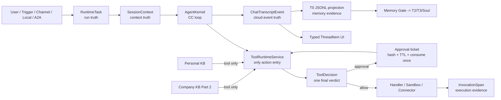

# Hive Agent-Native 终极原子化与 KISS 重审报告

> 日期：2026-07-10
>
> 文档性质：独立新报告，不替换、不修改历史原子化报告
>
> 当前 Hive 基线：`512200142c247922566afb6497dee67febc1c2f2` / `1.7.0`
>
> 结论口径：以当前 checkout 的真实代码、调用链、测试与迁移为准；“有 API / 有表 / 有页面”不算完成

---

## 0. 执行结论

Hive 已经不是一个“缺核心 Agent 能力”的系统。当前真实状态是：

1. **Single Agent 的 CC 主循环和大部分生命周期已经成立**：统一 Kernel 入口、工具循环、Hooks、Compaction、Plan Mode、Work Ledger、Skill、Subagent、Workflow、持久化 RuntimeTask、断线继续运行、代码沙箱均有真实消费路径。
2. **Hive-native 优势已经形成**：T0/T2/T3/`soul.md`、Memory Gate + Platform Gate、动态激活、Dream、Skill evolution、反馈回流、Personal KB Tool-first 读取均不是空壳。
3. **当前最大的风险不是“功能太少”，而是同一语义有多套表示和多处判定**：工具治理、审批后执行、事件事实源、RuntimeTask 租约、RLS bypass、配置版本、前端消息模型存在事实源分裂或恢复断点。
4. **企业 AI 资产管理还没有统一闭环**：Agent、Skill、Subagent、Workflow、外部能力各自有部分生命周期，但版本、所有权、信任、依赖、发布、回滚和消费证据没有统一控制索引。
5. **Personal KB 的原始上下文污染问题已修正**：现在应维持 Tool-first；它不参与原始上下文组装。剩余缺口是 Agent 向 Personal KB 的受治理提案/写入闭环，以及内部服务的复杂度治理。
6. **Company KB 是明确的第二部分已知缺失**：当前 `/enterprise/knowledge-base` 文件树不是新的企业知识权威平面。第一部分不得偷建 Company KB，也不得把它自动塞入原始上下文。
7. **UI/UX 的主要问题不是视觉皮肤，而是协议不够类型化**：后端事件、运行状态、工具调用、审批、Plan、Subagent/Workflow 尚未形成 Codex Desktop 风格的稳定 `ThreadItem` 判别联合，导致前端巨型组件和大量可选字段。

### 最终判断

- **当前系统整体：局部闭环。**
- **Single Agent CCPlus：局部闭环，已接近目标，但治理结果、事件事实源、云端幂等仍有关键断点。**
- **Hive-native：局部闭环，Memory 强，Personal KB 和 Local/A2A 仍未全闭。**
- **企业治理与 AI 资产：局部闭环，RLS 与审批存在可导致 Agent 无法运行或绕过判定的结构性冲突。**
- **Company KB：已知缺失，明确进入第二部分。**
- **目标方案置信度：95%。** 这里的 95% 指对“应如何收敛”的架构判断，不代表当前实现已经达到 95% 完成度。

---

## 1. 什么叫“原子化”

本文不把“有 API”“有表”“有页面”算作完成。每个能力按七个原子检查：

1. **输入**：谁发起，输入结构是什么，是否可恢复。
2. **权威**：谁有权读取、决定和写入，租户/用户/Agent/代理关系如何绑定。
3. **执行**：唯一执行入口是什么，是否可能绕过治理。
4. **证据**：事件、span、transcript、文件和数据库谁是机械事实源。
5. **恢复**：断线、重启、重试、取消、回滚、fork 是否幂等。
6. **消费**：Memory、Skill、Workflow、Knowledge、UI 是否真实使用产物。
7. **验收**：测试、迁移、回填、故障注入、可观测性是否覆盖。

状态定义：

- **闭环**：七个原子均有当前消费路径。
- **局部闭环**：主路径成立，但存在双事实源、旁路、恢复或 UI 断点。
- **断点**：能力存在，但生产路径在两个原子之间断开。
- **缺失**：当前源码无实现；若是明确暂不建设，会标成“已知缺失”，不伪装成回归。
- **排除**：CC/Codex 的服务商私有远程能力，不计入 Hive 的 CC parity 债务。

本文矩阵符号：`●` 闭合，`△` 局部，`×` 缺失/断开，`—` 不适用或已排除。

该标准已经同步写入根目录 `AGENTS.md` 与 `CLAUDE.md`，以后所有架构审计、实现、重构和退役都应按此验收。

---

## 2. 对照基线与边界

### 2.1 当前源码基线

| 系统 | 当前本地提交 | 用途 |
|---|---|---|
| Hive | `512200142c247922566afb6497dee67febc1c2f2` | 被审计实现 |
| FreeCode TS | `7dc15d6c8fb0c40c7fcc02ce9b58204324252632` | CC 运行语义第一基线 |
| claw-code Python/Rust | `d229a9b022d4845d28a728677e6a6b7c22ec5a2e` | Python port 与 session hygiene 参考 |
| claude-code-org | `a99de1bb3c0c301b83b784abbcdb7a3674b2cd45` | CC 交叉校验 |
| Codex Rust | `be33f80bc65159c094ecd06bf155afa3061ce23d` | 工程控制、typed protocol、桌面交互增量 |
| Hermes Agent | `18e840469ffe9f8235331c787e34ebbe908564b8` | 单 Agent 智能与自进化体感下限 |
| Hive Connect | `20718e629be1a1d506aa366a526bff245edd8277` | Local Agent / Bridge 边界参考 |

代码知识图谱当前可用，Hive 图为约 `39,592` nodes / `173,270` edges。桌面会话内 MCP transport 曾返回 `Transport closed`，本次通过同一图服务 CLI 读取；这是审计工具传输问题，不计作 Hive 产品缺陷。

### 2.2 北极星边界

#### 第一部分：本轮必须完整收敛

1. CCPlus Single Agent：CC 语义 + Codex 工程控制、可观测性、typed UI 与云端鲁棒性。
2. Hive-native：Agent Memory、Personal KB、Skill/Subagent/Workflow、Local Agent、A2A、自进化。
3. 企业控制面：身份、RLS、权限、审批、安全、预算、审计与 AI 资产管理。
4. Codex Desktop 级 UI/UX：信息结构、状态、动效、恢复、审批与详情检查器。
5. KISS 代码收敛：减少事实源、删除死路、拆分巨型实现但不拆散核心 Agent loop。

#### 第二部分：Company KB

Company KB 是 Personal KB 之上的新租户权威平面，包含发布、权限、版本、审计和知识治理。它明确不在第一部分实现，不得用现有文件树或 `company_profile` 假称完成。

#### 排除项

服务商私有远程基础设施，例如不可访问的 Claude/Codex 托管远程执行服务，不构成 CC parity 债务。Hive 自建的云端等价能力属于 Hive-native，而不是“偷偷欠着的 CC 功能”。

---

## 3. 对旧原子化报告的必要修正

旧报告有价值，但当前 checkout 和 KISS 重审后，以下结论必须更新：

| 旧方向 | 当前修正 |
|---|---|
| Personal KB 可由全局 Context Arbitrator 参与组装 | **取消。** Personal KB 只通过 `search_personal_kb` / `read_personal_kb` 工具读取；不进入原始上下文 |
| 新建 `RunEnvelope` | **不新建。** 扩展现有 `RuntimeTask` 即可 |
| 新建独立 `AgentEvent` 表 | **不新建。** 扩展现有 `ChatTranscriptEvent` 为 typed event/item 事实面 |
| 新建独立 `ExecutionReceipt` | **默认不新建。** 扩展 `InvocationSpan`；只有法规要求不可变独立凭证时才考虑新表 |
| 新建全局 Authority 服务 | **不新建网络服务。** 在 `ToolRuntimeService` 内把各规则组合成一个 typed `ToolDecision` |
| T0 与 DB 都可称机械事实源 | **不能继续含糊。** 云端运行事实与 Memory 证据必须明确分工，不能双主 |
| Personal KB 自动激活缺口仍存在 | **该缺口已关闭。** 当前缺口转为受治理写入/提案和内部复杂度 |

这不是减少目标，而是用第一性原理去掉不必要的中间层：**一个语义只保留一个权威表示，一个副作用只保留一个执行入口，一个恢复动作只保留一个幂等键。**

---

## 4. Single Agent CCPlus 七原子矩阵

### 4.1 全生命周期

| 能力 | 输入 | 权威 | 执行 | 证据 | 恢复 | 消费 | 验收 | 总判定 |
|---|---:|---:|---:|---:|---:|---:|---:|---|
| Agent 定义与身份 | ● | ● | ● | ● | ● | ● | ● | **闭环** |
| 原始上下文组装 | ● | △ | ● | △ | ● | ● | ● | **局部闭环** |
| LLM 主循环 | ● | ● | ● | ● | ● | ● | ● | **闭环** |
| Provider 路由与 fallback | ● | ● | ● | ● | ● | ● | ● | **闭环** |
| 工具发现与 progressive disclosure | ● | ● | ● | ● | ● | ● | ● | **闭环** |
| 工具统一执行 | ● | △ | △ | ● | △ | ● | ● | **局部闭环** |
| 审批与审批后执行 | ● | △ | × | △ | △ | ● | △ | **断点** |
| Hooks | ● | △ | ● | ● | △ | ● | ● | **局部闭环** |
| Transcript / event stream | ● | ● | ● | × | △ | ● | △ | **断点** |
| Compaction / microcompact | ● | ● | ● | ● | ● | ● | ● | **闭环** |
| RuntimeTask 持久运行 | ● | ● | ● | ● | △ | ● | ● | **局部闭环** |
| 断线继续与重连 | ● | ● | ● | ● | ● | ● | ● | **闭环** |
| 取消 / 重试 / 重启 | ● | ● | ● | ● | △ | ● | △ | **局部闭环** |
| Resume / fork / rewind / checkpoint | ● | ● | ● | ● | △ | ● | ● | **局部闭环** |
| Plan Mode | ● | ● | ● | ● | ● | ● | ● | **闭环** |
| Work / Progress Ledger | ● | ● | ● | ● | ● | ● | ● | **闭环** |
| Skill 加载 | ● | ● | ● | ● | ● | ● | ● | **闭环** |
| Subagent / delegation | ● | ● | ● | ● | △ | ● | ● | **局部闭环** |
| Workflow | ● | ● | ● | ● | ● | ● | ● | **闭环** |
| Code execution / sandbox | ● | ● | ● | ● | ● | ● | ● | **闭环** |
| 云端多 worker 争抢 | ● | ● | ● | △ | × | ● | △ | **断点** |
| Codex typed thread/status protocol | ● | ● | △ | △ | △ | △ | △ | **局部闭环** |

### 4.2 已经真正平齐或优于 CC 的部分

1. `invoke_agent() -> AgentKernel.handle()` 是统一模型循环入口，Kernel 保持无 DB import。
2. 最大 200 轮工具调用、LoopGuard、75% proactive compaction、60% microcompact pressure、prompt-too-long reactive compaction均有真实运行路径。
3. Web chat 脱离 WebSocket 生命周期，浏览器断开不会取消 RuntimeTask，重启扫描可恢复未完成运行。
4. Plan Mode、Todo/Work Ledger、Skill、Subagent、Workflow 已经进入生产调用链，不只是模型或页面。
5. 代码执行在本地可信环境走 OS sandbox，在 Railway 走 Vercel Sandbox，不允许 raw subprocess fallback。
6. `invocation_spans` 已经是 DB 可关联的调用证据面，包含 tenant/agent/user/runtime task/session/request/trace join keys。

### 4.3 关键断点

#### SA-01：审批结果没有绑定待执行内容

`ToolRuntimeService.execute_approved()` 接收 `approval_id`，但该入口本身不重新加载并验证：

- approval 是否属于同一 tenant / agent / user；
- approval 是否过期、撤销或已消费；
- normalized tool arguments hash 是否与批准时一致；
- capability / policy snapshot 是否仍有效；
- 是否重复执行同一副作用。

随后它直接进入 `_execute_without_governance()`。这使“批准 A 参数，执行 B 参数”在入口合同上没有被彻底封死。

**修复原则：** approval 必须成为一次性、可消费、带 input hash 和 policy snapshot 的授权票据；`execute_approved` 只能用票据恢复原始规范化请求，不再接受任意替换参数。

#### SA-02：`execute_direct()` 是无生产消费者的治理旁路

`execute_direct()` 当前无生产 inbound caller，语义是“认为已批准并跳过治理”。它与 `execute_approved()` 重叠，增加未来误用概率。

**结论：** 写回归测试证明无生产消费后删除；测试不应为了保留它而成为唯一消费者。

#### SA-03：默认 `bypassPermissions` 与企业治理目标冲突

后端 `DEFAULT_CCPLUS_PERMISSION_MODE` 和前端新会话默认均为 `bypassPermissions`。虽然企业硬规则仍在，但该命名和默认语义会把“无需逐项确认”与“绕过权限”混在一起。

**修复原则：**

- 新会话默认取 tenant policy 的 `standard` / `askOnRisk`；
- `bypassPermissions` 只允许 break-glass；
- 必须有 operator、reason、scope、TTL、审批与审计；
- 任何模式都不能绕过 tenant、RLS、secret、MCP token、irreversible hard deny。

#### SA-04：云端租约没有 fencing token

`RuntimeTask` 有 `claimed_by`、`claim_expires_at`、`attempt_count`，但没有单调递增的 `claim_version/fencing_token`。旧 worker 在租约过期后仍可能完成外部副作用，新 worker 又接管重跑。

**修复原则：** 每次 claim 原子递增 `claim_version`；所有状态写入和副作用 receipt 必须带 `(runtime_task_id, claim_version, idempotency_key)`，旧 token 的提交被拒绝。

#### SA-05：运行事件与 T0 事实源双主

`append_session_event()` 先 flush DB event，再可能直接写 T0 文件；DB 与文件无法在同一事务提交。API role 又可能走 relay。与此同时，当前项目规范把 T0 JSONL 称为机械事实源，而云端运行恢复依赖 DB。

**终极裁决：**

- `ChatTranscriptEvent`：云端 run/event 的唯一事务事实源；
- T0 JSONL：Memory raw evidence 的 canonical portable artifact，由已提交 DB event exactly-once 投影；
- `InvocationSpan`：执行证据，不替代 event 顺序；
- UI read model：可重建投影，不是事实源。

这要求后续同步修订当前“T0 是所有 resume/replay 机械真相”的旧表述：T0 仍是 Memory evidence truth，但运行恢复的机械真相属于事务事件流。

---

## 5. Hive-native 七原子矩阵

### 5.1 Memory、Knowledge、Evolution、Local、A2A

| 能力 | 输入 | 权威 | 执行 | 证据 | 恢复 | 消费 | 验收 | 总判定 |
|---|---:|---:|---:|---:|---:|---:|---:|---|
| T0 原始证据 | ● | ● | ● | △ | △ | ● | ● | **局部闭环** |
| T2 Segment Package | ● | ● | ● | ● | ● | ● | ● | **闭环** |
| T3 semantic memory | ● | ● | ● | ● | ● | ● | ● | **闭环** |
| `soul.md` evolution | ● | ● | ● | ● | ● | ● | ● | **闭环** |
| Memory Gate + Platform Gate | ● | ● | ● | ● | ● | ● | ● | **闭环** |
| Dynamic activation / working set | ● | ● | ● | ● | ● | ● | ● | **闭环** |
| Session feedback 回流 | ● | ● | ● | ● | ● | ● | ● | **闭环** |
| Dream / reflection | ● | ● | ● | ● | ● | ● | ● | **闭环** |
| Skill evolution | ● | ● | ● | ● | ● | ● | △ | **局部闭环** |
| Personal KB Tool-first read | ● | ● | ● | ● | ● | ● | ● | **闭环** |
| Personal KB 跨轮消费 | ● | ● | ● | ● | ● | ● | ● | **闭环** |
| Personal KB owner 管理 | ● | ● | ● | ● | ● | ● | ● | **闭环** |
| Agent -> Personal KB 提案/写入 | △ | × | × | △ | × | × | × | **缺失** |
| Personal KB 服务内聚性 | ● | ● | ● | ● | ● | ● | △ | **局部闭环** |
| Local Agent channel | ● | △ | ● | △ | △ | ● | △ | **局部闭环** |
| A2A / peer delegation | ● | ● | ● | ● | △ | ● | ● | **局部闭环** |
| Interoperability descriptor | ● | ● | ● | ● | ● | ● | ● | **闭环** |
| Company KB | × | × | × | × | × | × | × | **已知缺失，第二部分** |

### 5.2 Personal KB 的正确边界

Personal KB 的设计现在必须固定为：

```text
原始上下文
  = system / identity / charters / project instructions / Agent Memory working set / 当前会话状态
  ≠ Personal KB 搜索结果
  ≠ Company KB 搜索结果

Agent 需要外部知识时
  -> search_personal_kb
  -> 返回可审计候选、摘要和 source refs
  -> read_personal_kb
  -> 当前轮完整使用
  -> T0 记录完整工具证据
  -> 跨轮只保留引用/指针，不自动重放正文
```

Personal KB 是 native tool，不是 always-on memory。Agent Memory 与 Personal KB 的区别不是“都能搜”，而是：

| 维度 | Agent Memory | Personal KB |
|---|---|---|
| 所有者 | Agent 身份与工作连续性 | Owner 及其授权主体 |
| 原始上下文 | 可按 Memory activation 进入 | 禁止自动进入 |
| 读取 | activation/retriever | 显式工具调用 |
| 写入 | Memory Gate + Platform Gate | owner explicit write 或 Agent proposal + owner/policy gate |
| 跨轮 | working set / T2 / T3 | 只保留引用，按需再读 |

### 5.3 Personal KB 剩余落地

必须新增一条清晰的写入闭环，但不得让 Agent 直接写 owner 知识库：

1. Agent 调用 `propose_personal_kb_item`，提交内容、来源、目标 collection、敏感级别、去重依据和用途。
2. 平台验证 owner/agent/delegation、grant、source refs、DLP、重复项和内容大小。
3. 根据 tenant/owner policy 得到 `approve / ask / reject`。
4. 通过后由 Personal KB commit service 写入并产生 immutable revision、audit event 和 rollback ref。
5. UI 在 Personal Knowledge 页面展示 pending proposal、diff、来源和审批。
6. 写入结果不会自动注入下一轮上下文，仍只能通过工具读。

### 5.4 Memory 代码的 KISS 断点

1. `run_scene_wiki_curation_tick()` 已是明确 compatibility no-op，但 evolution maintenance 仍调用并上报状态；应删除活调用、模块和状态字段。
2. `extract_queue.py` 无生产 import；应删除。
3. `ExtractAgent.schedule_extract()` 无生产消费者；`extract_agent.py` 主要退化为 admin/backfill 兼容代码。应把确需的 backfill 迁入一次性脚本，跑完迁移/隔离后从 runtime 删除。
4. `t2_store.py` 仍被 legacy extractor / archive 兼容路径牵连。需要把有效 archive 逻辑迁入 hygiene/retention，再做 fleet dry-run、apply、quarantine，最后删除 fallback。
5. `skill_distiller.run_skill_distillation_cycle()` 约 846 行，应拆成纯阶段函数，但保留一个公共 cycle 入口，不能拆成互相调用的微服务链。
6. `PersonalKnowledgeService` 约 3,285 行，同时承担 ACL、ingest、index、graph、job、search。应在同一 facade 后分成 `access`、`ingest`、`index_search`、`jobs` 四个内部组件；API 和工具入口不变化。

### 5.5 Local Agent / A2A 剩余断点

Local Agent 当前 `capabilities_json` 未形成签名、过期、版本化能力快照；channel event 也没有严格单调 cursor。目标合同：

- capability snapshot = signed hash + issuer + subject + tenant + scope + issued_at + expires_at；
- 有效能力 = server policy ∩ Agent grant ∩ local snapshot；客户端自报不能扩大权限；
- channel event 使用 per-channel monotonic sequence；
- 每个远程动作返回 execution receipt：request hash、capability snapshot hash、result refs、status、replay key；
- reconnect 从 acknowledged cursor 恢复，重复 request 由 idempotency key 去重。

A2A 不需要变成 Workflow。Lease/Signal/Checkpoint 继续用于协作；Workflow 继续负责确定性控制流。两者只共享 RuntimeTask、事件、权限与 receipt，不共享执行语义。

---

## 6. 企业治理、安全、RLS 与 AI 资产七原子矩阵

### 6.1 治理矩阵

| 能力 | 输入 | 权威 | 执行 | 证据 | 恢复 | 消费 | 验收 | 总判定 |
|---|---:|---:|---:|---:|---:|---:|---:|---|
| Tenant identity / RLS | ● | ● | ● | ● | ● | ● | △ | **局部闭环** |
| RLS bypass 管理 | △ | △ | × | △ | △ | ● | × | **断点** |
| User/Agent/delegation principal | ● | ● | ● | ● | ● | ● | ● | **闭环** |
| CapabilityPolicy | ● | ● | ● | ● | ● | ● | ● | **闭环** |
| ResourcePermission | ● | ● | ● | ● | ● | ● | ● | **闭环** |
| GuardPolicy | ● | ● | △ | ● | ● | △ | △ | **局部闭环** |
| ActionPreflight | ● | ● | ● | ● | △ | ● | ● | **局部闭环** |
| Approval | ● | ● | × | △ | △ | ● | △ | **断点** |
| Quota / budget | ● | ● | ● | ● | ● | ● | ● | **闭环** |
| Secrets / credential boundary | ● | ● | ● | ● | ● | ● | ● | **闭环** |
| MCP authz | ● | ● | ● | ● | ● | ● | ● | **闭环** |
| Invocation/audit spans | ● | ● | ● | ● | ● | ● | △ | **局部闭环** |
| Agent 资产管理 | ● | ● | ● | △ | △ | ● | △ | **局部闭环** |
| Skill 资产管理 | ● | △ | ● | △ | △ | ● | △ | **局部闭环** |
| Workflow 资产管理 | ● | ● | ● | ● | ● | ● | ● | **闭环** |
| Subagent 资产管理 | ● | △ | ● | △ | △ | ● | △ | **局部闭环** |
| External capability trust | ● | ● | ● | ● | ● | ● | ● | **闭环** |
| Config version / rollback | ● | △ | × | △ | × | × | × | **断点** |
| 企业 AI 资产统一目录 | △ | △ | × | △ | × | △ | × | **缺失** |

### 6.2 为什么治理、限制和 RLS 会让 Agent“无法运行”

问题不是治理太多，而是当前有多种互不统一的 verdict：

- RLS 决定数据库行可见性；
- ResourcePermission 决定资源访问；
- CapabilityPolicy 决定工具能力；
- GuardPolicy 记录管理策略；
- Plan Mode gate 决定当前会话是否只读；
- Hook 可以改参数或阻断；
- ActionPreflight 返回 `DO / PREPARE_ONLY / ASK / REFUSE / ESCALATE`；
- approval 又有自己的恢复路径；
- permission mode 还可能生成 synthetic `bypassPermissions` profile。

这些层本身有合理职责，但如果每一层都独立“再审批一次”，Agent 会进入：已经批准仍被另一层要求批准、RLS 看不到审批所需资源、恢复时 policy snapshot 改变、同一工具被多套静态表分类的状态。

### 6.3 终极治理模型：规则可多，最终决定只能有一个

不合并所有权限表，也不新建 Authority 微服务。保留领域真相，统一成一个执行时结果：

```text
ToolRequest
  -> resolve PrincipalContext
  -> hook argument transform
  -> schema validation
  -> RLS/resource locator
  -> capability + resource + guard + risk + budget rules
  -> ToolDecision
       ALLOW
       ALLOW_PREPARE_ONLY
       REQUIRE_APPROVAL
       DENY
  -> execute once
  -> InvocationSpan / side-effect receipt
```

固定优先级：

1. **身份与租户不变量**：不可绕过。
2. **RLS/资源存在性**：只决定可见范围，不替代业务授权。
3. **硬安全规则**：secret、token passthrough、sandbox、不可逆 hard deny，不可被 permission mode 覆盖。
4. **能力和资源授权**：求交集，不求并集。
5. **会话模式与风险审批**：只决定是否需确认，不扩大能力。
6. **预算/配额**：决定本次是否可执行或暂停。
7. **最终 ToolDecision**：一次记录、一次审批、一次消费。

`ToolDecision` 最少包含：

```text
decision_id
tenant_id / agent_id / actor_user_id / delegated_by
tool_name / normalized_input_hash
policy_snapshot_hash / capability_snapshot_hash
outcome / reason_codes / approval_id
expires_at / consumed_at
runtime_task_id / session_id / trace_id
```

### 6.4 RLS bypass 的原子化修复

当前 `backend/app` 内 `enter_rls_bypass(` 约 90 个调用、分布约 54 个文件。RLS 是正确的底层隔离，但 bypass 过宽会形成两种相反失败：

- worker 不 bypass：因没有 user context 读不到待处理行，任务永远不运行；
- worker 全程 bypass：后续业务查询在 super-scope 下运行，越权风险扩大。

唯一允许的模式：

```text
bypass locator transaction
  -> 只查 task_id + tenant_id + claim metadata
  -> 立即退出 bypass
tenant-scoped execution transaction
  -> set tenant principal
  -> 重新加载完整实体
  -> 执行业务逻辑
```

必须新增 AST/CI allowlist，逐个登记 bypass 的：文件、函数、原因、允许查询字段、owner、到期日期。新 bypass 未登记即 CI 失败。现有调用逐个迁移到少量 sanctioned locator helper，不能简单用全局 decorator 隐藏。

### 6.5 ConfigRevision 是典型“有表有 API但没有闭环”

当前 `config_versioning.save_revision()` 无生产 caller；rollback 只新增一个 ConfigRevision 行，并不把内容应用回 Agent/Skill/Workflow。前端也没有配置历史消费者。

此外，`save_revision()` 查询只选择 `version, content`，后续却读取 `row.content_hash`，已有 revision 时存在潜在错误。

结论：这不是“部分完成的统一版本平台”，而是**执行、恢复、消费、验收断开的横向脚手架**。

修复方式不是另建版本系统：

1. 修复查询与 tenant/entity-specific authorization。
2. 定义 Agent/Skill/Workflow/Subagent 各自的 serializer 和 apply adapter。
3. 所有 create/update/publish/evolve 必须写 immutable revision。
4. rollback 事务中调用对应 apply adapter，产生新版本、事件和 audit。
5. UI 显示 history、diff、source、publisher、trust 和 rollback。
6. 为旧资产回填 version 1 与 content hash。

### 6.6 企业 AI 资产管理：统一控制元数据，不统一内容与执行

当前资产成熟度不一致：

- Workflow 已有 version/hash/status/visibility/call policy/owner/provenance；
- Skill 缺少统一 version/status/owner/trust/evidence；
- Subagent definition 多为文件/materialized 形态；
- AgentTemplate 只有有限 `config_version`；
- ExternalCapabilitySnapshot 的 trust/admission/revoke 相对成熟；
- `TenantInstalledPlugin` 是 legacy projection。

目标是建立薄的 `AIAssetRecord` 控制索引：

```text
asset_id / tenant_id / asset_type / native_entity_id
owner_principal / visibility / lifecycle_status
active_revision_id / content_hash
source_type / source_ref / trust_state
dependencies / compatibility / admission_state
created_by / published_by / revoked_by
```

它只做目录、版本、信任、生命周期和依赖，不保存所有资产正文，不执行资产：

- Skill 仍由 Skill runtime 加载；
- Workflow 仍由 Workflow runtime 执行；
- Subagent 仍由 delegation runtime 执行；
- Agent 仍由 AgentKernel 执行；
- `ConfigRevision` 保存版本快照；
- `InvocationSpan` 与事件提供消费证据。

这保证统一治理而不制造“万能 Asset Runtime”。

---

## 7. UI/UX：对齐 Codex Desktop 的信息协议，而不是复制皮肤

### 7.1 七原子矩阵

| 能力 | 输入 | 权威 | 执行 | 证据 | 恢复 | 消费 | 验收 | 总判定 |
|---|---:|---:|---:|---:|---:|---:|---:|---|
| Thread / turn status | ● | ● | △ | △ | △ | ● | △ | **局部闭环** |
| Assistant/user message | ● | ● | ● | ● | ● | ● | ● | **闭环** |
| Tool call/result card | ● | ● | ● | △ | △ | ● | ● | **局部闭环** |
| Approval card | ● | ● | △ | △ | △ | ● | △ | **局部闭环** |
| Plan / progress / todo | ● | ● | ● | ● | ● | ● | ● | **闭环** |
| Subagent / Workflow activity | ● | ● | ● | △ | △ | ● | △ | **局部闭环** |
| Reasoning/compaction/boundary | ● | ● | △ | △ | △ | △ | △ | **局部闭环** |
| Runtime inspector / evidence | △ | ● | △ | ● | △ | △ | △ | **局部闭环** |
| Keyboard / command palette | ● | ● | ● | ● | ● | ● | △ | **局部闭环** |
| Accessibility / reduced motion | △ | ● | △ | — | ● | △ | △ | **局部闭环** |
| Empty/error/offline/reconnect | ● | ● | ● | ● | △ | ● | △ | **局部闭环** |

### 7.2 当前结构问题

- `AgentChatSection.tsx` 约 4,802 行，主组件约 1,708 行。
- `AgentDetail.tsx` 约 3,164 行。
- `AgentChatMessage` 依赖大量 optional fields 承载 event/tool/permission/session 状态。
- `ThreadTimelineCell` 只有 `user_turn / assistant_final / active_run / boundary`，无法稳定表达 Plan、Reasoning、Command、File Change、MCP、Subagent、Review、Compaction 等项目。
- 后端存在大量 string `event_type`，前端依赖 shape inference 和 `Record<string, unknown>`。

Codex Rust 当前使用显式 `ThreadItem` enum 和清晰的 Turn/Thread status。Hive 应吸收这个工程优势，但保留自己的 Memory、Workflow、Approval、Governance 项。

### 7.3 目标协议

后端从 `ChatTranscriptEvent` 输出 schema-versioned 判别联合，前端由 schema 生成 TypeScript 类型：

```text
ThreadItem =
  UserMessage | AgentMessage | Reasoning | Plan | WorkLedger
  | ToolCall | ToolResult | CommandExecution | FileChange
  | ApprovalRequest | ApprovalDecision
  | SkillLoad | SubagentActivity | WorkflowActivity
  | MemoryEvent | KnowledgeToolResult
  | ContextCompaction | Checkpoint | Error | Boundary
```

每个 item 共享：

```text
id / schema_version / item_type / status
thread_id / turn_id / run_id / sequence
causation_id / correlation_id
created_at / completed_at
visibility / evidence_refs
```

状态统一：

- Thread：`not_loaded | idle | active | system_error`
- Turn：`in_progress | completed | interrupted | failed`
- Item：`pending | running | waiting_user | succeeded | failed | cancelled`

### 7.4 目标工作台

```text
┌──────────────┬─────────────────────────────────┬──────────────────┐
│ Thread/Run   │ Timeline                         │ Inspector        │
│ List         │ typed ThreadItems                │ input/policy/    │
│              │ streaming + compact grouping     │ span/artifact    │
├──────────────┴─────────────────────────────────┴──────────────────┤
│ Composer · mode · model · permission · attachments · stop/retry │
└─────────────────────────────────────────────────────────────────┘
```

交互要求：

1. Running item 原位更新，不用新消息模拟状态。
2. Tool/Workflow/Subagent 默认折叠为摘要，展开后看输入、决策、结果、span 和 artifact。
3. Approval 永远显示批准对象、参数 diff、能力、风险、有效期与影响范围。
4. 断线后按 sequence/cursor 回补，不把 reconnect 当新 turn。
5. Cancel 与 Stop 明确区分；重复点击必须幂等。
6. 动效只表达状态迁移：150–220ms，支持 `prefers-reduced-motion`，无装饰性持续动画。
7. 所有状态不仅靠颜色，必须有文字、图标和可访问 label。

---

## 8. KISS / 奥卡姆剃刀 / 第一性原理代码审计

### 8.1 规模事实

| 范围 | 规模 |
|---|---:|
| `backend/app` | 约 637 个 Python 文件 / 224,302 LOC |
| `frontend/src` | 约 306 个 TS/TSX/CSS 文件 / 83,352 LOC |
| `backend/app/services` | 约 280 个 Python 文件 |
| 后端 ≥100 行函数/方法 | 约 224 个 |
| 前端 ≥100 行函数 | 约 85 个 |
| broad `except Exception` | 约 985 处 |
| legacy/compat/deprecated 标记 | 约 418 处 |
| TODO/FIXME/HACK/XXX | 仅约 3 处 |

低 TODO 数不代表低技术债；当前债务主要是**结构性兼容层、巨型函数和多事实源**，没有被写成 TODO。

### 8.2 最大复杂度热点

| 位置 | 当前量级 | 判断 |
|---|---:|---|
| `kernel/engine.py` | 约 5,855 行；`AgentKernel.handle` 约 2,400 行 | 有大量本质复杂度，但函数级过大 |
| FreeCode `queryLoop` | 约 1,489 行 | 证明 Agent loop 本身就复杂，不能为拆而拆 |
| `web_chat_runtime.py` | 约 4,271 行 | 生命周期、事件、恢复耦合过多 |
| `personal_knowledge_service.py` | 约 3,285 行 | ACL/ingest/index/job/search 多职责 |
| `llm_client.py` | 约 3,017 行 | provider 适配集中但可按 provider boundary 内拆 |
| `agents/orchestrator.py` | 约 2,860 行 | 协作策略与执行混杂 |
| `skill_distiller.py` | 约 2,479 行 | 单 cycle 约 846 行 |
| `AgentChatSection.tsx` | 约 4,802 行 | 协议、状态、渲染、命令、恢复混杂 |
| `index.css` | 约 6,036 行 | 页面级样式边界消失 |

### 8.3 什么应该拆，什么不能拆

#### 不应拆散

- `AgentKernel.handle()` 的唯一循环入口；
- `ToolRuntimeService.execute()` 的唯一副作用入口；
- Workflow 与 Subagent 的独立语义；
- Agent Memory 与 Personal/Company Knowledge 的所有权边界；
- DB RLS 和业务 capability authorization 的职责边界。

#### 应拆成纯阶段或内部组件

- Kernel：context prepare、provider request、tool batch、compaction decision、terminal finalize；仍由一个 loop 调度。
- Tool governance：argument transform、rule evaluation、approval materialization、execution；只输出一个 `ToolDecision`。
- Web chat runtime：claim/resume、input append、kernel invoke、event project、terminal finalize。
- Personal KB：access、ingest、index/search、jobs。
- Skill distiller：evidence collect、candidate authoring、eval、promotion、rollback metadata。
- Frontend：protocol reducer、timeline、item renderers、composer、inspector、runtime controls。

### 8.4 应删除或合并的确定性清单

| 对象 | 动作 | 前置证据 |
|---|---|---|
| `ToolRuntimeService.execute_direct()` | 删除 | inbound caller 为零；补 forbidden bypass test |
| `run_scene_wiki_curation_tick()` live path | 删除 | 当前明确返回 disabled/no-op |
| `extract_queue.py` | 删除 | 生产 import 为零 |
| runtime `ExtractAgent.schedule_extract()` | 移出 runtime | 仅保留已验证 backfill script |
| legacy `t2_store.py` | 迁移后删除 | fleet dry-run/apply/quarantine 完成 |
| RuntimeAssembly top-level metadata mirrors | backfill 后删除 | nested state 成为唯一持久表示 |
| static safe/sensitive/capability/timeout 第二来源 | 合并到 `ToolMeta` | 注册测试覆盖所有工具 |
| CC/Codex adapter 重复 `_split_frontmatter` 等 | 提取共享 utility | characterization tests 先锁行为 |
| legacy `TenantInstalledPlugin` projection | 完成迁移后删除 | ExternalCapabilitySnapshot/AIAssetRecord 消费已切换 |

### 8.5 统一工具描述，不新增万能服务

扩展现有 `ToolMeta`：

```text
capability
risk_level
read_only / parallel_safe
timeout_seconds
retry_policy
idempotency_policy
approval_policy
audit_policy
```

然后由 registry 生成 `CAPABILITY_MAP`、safe/sensitive 集、timeout 配置和 UI 工具元数据。外部 MCP/connector tool 也映射成同一 descriptor。这样消灭静态散表，但工具执行仍由既有 handler/domain 完成。

### 8.6 异常处理纪律

约 985 个 broad `except Exception` 不可机械全替换。按边界分类：

1. Runtime 顶层 supervisor 可以 catch-all，但必须记录 trace、分类状态并决定 retry/terminal。
2. Provider/connector boundary 可以 catch-all 转为 typed operational error，保留 cause。
3. 领域逻辑不得 catch-and-return-null/empty；应捕获具体异常或 fail fast。
4. 所有 fallback 必须有 metric/event，禁止静默降级。

---

## 9. 极简目标架构：复用五个现有根

旧方案倾向再建五个合同；KISS 重审后的目标是扩展现有权威根：

| 语义 | 唯一根 | 需要补的内容 |
|---|---|---|
| Run | `RuntimeTask` | typed kind/status、root idempotency、claim fencing、config snapshot |
| Context | `SessionContext` + `RuntimeAssemblyState` | 去 metadata mirrors；Knowledge 不自动注入 |
| Authority | `DecisionTraceRecord` + typed `ToolDecision` | input/policy/capability hash、approval consumption |
| Event | `ChatTranscriptEvent` | schema/item/status、sequence、causation/correlation、projection state |
| Execution evidence | `InvocationSpan` | decision id、input hash、fencing、idempotency、side-effect refs |
| Tool descriptor | `ToolMeta` | capability/risk/timeout/retry/idempotency/audit |



核心不变量：

1. 一个 run 只有一个 RuntimeTask 根。
2. 一个 tool call 只有一个 ToolDecision 和一个执行入口。
3. 一个 approval 只能消费一次，并绑定输入 hash。
4. 一个 event sequence 由 DB 事务流定义；T0 和 UI 是可追踪投影。
5. 一个资产保留自己的 native runtime，但共享控制元数据与版本证据。
6. Personal/Company Knowledge 永远 Tool-first；Agent Memory 才参与动态上下文激活。

---

## 10. 第一部分：单轮完整落地包

这里不是 MVP、Phase 0/1/2，也不是“先打桩以后补”。以下工作流必须在同一合并轮中全部满足迁移、回填、故障注入和 UI 消费，任何一项未完成都不能称第一部分完成。

### A. Run / Event / Receipt 收敛

主要触点：

- `backend/app/models/runtime_task.py`
- `backend/app/services/runtime_task_claim_service.py`
- `backend/app/services/chat_transcript.py`
- `backend/app/models/chat_message.py` 或当前 `ChatTranscriptEvent` 模型位置
- `backend/app/services/web_chat_runtime.py`
- `backend/app/services/runtime_task_service.py`
- `backend/app/services/invocation_trace.py`
- 相应 Alembic migration

完整动作：

1. 给 RuntimeTask 增加 typed kind/status 约束、`claim_version`、`root_idempotency_key`、config/policy snapshot hash。
2. claim 时原子递增 fencing token；续租、完成、失败、取消均校验 token。
3. 给 ChatTranscriptEvent 增加 typed item/status、schema version、turn/run、causation/correlation、projection state。
4. 采用数据库生成的 per-session sequence，不再用 `time.time_ns()` 作为“monotonic-enough”顺序保证。
5. T0 写入改为 committed-event projector，使用 event id 去重和 projection watermark；失败可重试。
6. InvocationSpan 绑定 decision、claim version、idempotency 和 side-effect refs。
7. 对旧 RuntimeTask、event、span 回填；projection 全量校验后再删除旧 mirrors。

### B. ToolDecision / Approval / RLS 收敛

主要触点：

- `backend/app/tools/service.py`
- `backend/app/tools/governance.py`
- `backend/app/services/action_preflight.py`
- `backend/app/services/approval_service.py`
- `backend/app/services/session_control_plane.py`
- `backend/app/services/governance_capability_taxonomy.py`
- `backend/app/tools/registry.py`
- `backend/app/tools/decorator.py`
- `backend/app/tools/types.py`
- RLS helper 与 CI check

完整动作：

1. 先用 characterization tests 固定现有硬规则。
2. 引入纯数据 `ToolDecision`，让各规则返回 verdict/reason，不各自执行审批。
3. 删除 `execute_direct()`；`execute_approved()` 必须加载、验证、消费 approval ticket。
4. 标准模式替代默认 bypass；break-glass 加 TTL/reason/scope/operator。
5. ToolMeta 成为 capability/risk/timeout/retry/idempotency 唯一描述源。
6. 建 RLS bypass AST allowlist，并迁移到 locator -> tenant execution 模式。
7. GuardPolicy 接入最终 decision composition；仍不替代 CapabilityPolicy 或 ResourcePermission。

### C. 兼容层与巨型模块清理

主要触点：

- `backend/app/runtime/context.py`
- `backend/app/services/web_chat_runtime.py`
- `backend/app/kernel/engine.py`
- `backend/app/services/memory_curation.py`
- `backend/app/services/evolution_daemon.py`
- `backend/app/services/extract_queue.py`
- `backend/app/services/extract_agent.py`
- `backend/app/memory/t2_store.py`
- `backend/app/services/personal_knowledge_service.py`
- `backend/app/services/skill_distiller.py`

完整动作：

1. 先补 characterization/fault tests，再拆纯函数和内部组件。
2. 删除 no-op、zero-consumer 和已迁移 legacy runtime。
3. 对 legacy memory 做 dry-run、apply、quarantine report、count/hash 对账，再删除 fallback。
4. RuntimeAssembly 只保留 nested canonical state。
5. 任何拆分都不能新增网络 hop、队列或新的平行数据库表。

### D. 企业 AI Asset Control Plane

主要触点：

- `backend/app/models/config_revision.py`
- `backend/app/services/config_versioning.py`
- `backend/app/api/config_history.py`
- Agent/Skill/Workflow/Subagent/External Capability models/services/APIs
- 新的薄 `AIAssetRecord` 模型、service、API 与 migration
- Enterprise 前端资产目录、详情、版本、依赖、信任和 rollback UI

完整动作：

1. 修复并接通 ConfigRevision。
2. 为每类资产实现 serializer/apply/authorization adapter。
3. 创建统一 asset control record，不搬移 native content。
4. 所有 create/update/evolve/publish/revoke/rollback 写 revision + event + audit。
5. 旧资产回填版本、owner、hash、status、source/trust；无法推断项进入显式 quarantine/review queue。
6. UI 真正消费 history/diff/dependency/trust/usage evidence。

### E. Personal KB 完成与 Local/A2A receipts

主要触点：

- `backend/app/tools/handlers/knowledge.py`
- `backend/app/services/personal_knowledge_service.py`
- Personal Knowledge API/models/pages
- local agent models/services/APIs
- A2A/delegation services

完整动作：

1. 保持 Tool-first read 与跨轮 pointer-only 不变量。
2. 新增 proposal -> authority -> commit -> revision -> audit -> UI review 完整链。
3. 拆 PersonalKnowledgeService 内部职责，API facade 不变。
4. Local capability snapshot 签名/过期/求交集；event cursor 和 receipt 幂等。
5. A2A 共享 decision/event/span/receipt，但不合并为 Workflow。

### F. Codex Desktop 级 typed workbench

主要触点：

- backend ChatTranscriptEvent schema/read model
- `frontend/src/api/domains/chat.ts`
- `frontend/src/pages/agent-detail/AgentChatSection.tsx`
- `frontend/src/pages/session-workbench/timelineModel.ts`
- `frontend/src/pages/agent-detail/chatRuntime.ts`
- 新的 typed item renderer、inspector、composer、run controls 模块
- `en.json` / `zh.json`

完整动作：

1. 由后端 schema 生成 TS 判别联合，禁止可选字段袋继续扩张。
2. 先让新 reducer 同时读取历史兼容事件，再迁移数据，最后删除 shape inference。
3. 拆 timeline、renderer、inspector、composer、runtime controller。
4. 全覆盖 streaming、reconnect、approval、cancel/retry、Plan、Subagent、Workflow、compaction、error/offline。
5. 完成键盘、screen reader、reduced motion、responsive 与视觉回归。

---

## 11. 第二部分：Company KB 完整定义

Company KB 在 Personal KB 之上，但不是 Personal KB 加一个 `tenant_id` 字段。它是独立的公司知识权威平面。

### 11.1 七原子目标

| 原子 | Company KB 完成条件 |
|---|---|
| 输入 | 人、Agent、connector、Personal KB promotion 都有 typed ingestion/proposal |
| 权威 | tenant/department/role/resource/agent/delegation 与 sensitivity policy 共同裁决 |
| 执行 | ingest、review、publish、search、read、retire、rollback 均有唯一入口 |
| 证据 | immutable source、revision、publisher、policy snapshot、usage refs、audit |
| 恢复 | job retry、dedupe、partial failure、reindex、rollback、revoke、cursor resume |
| 消费 | `search_company_kb` / `read_company_kb` Tool-first；不得自动注入原始上下文 |
| 验收 | cross-tenant/department denial、policy change、revoke、backfill、fault injection、UI E2E |

### 11.2 递进关系

```text
Agent Memory
  -> Agent 自己的连续性、经验与能力证据

Personal KB
  -> Owner 的私有知识资产
  -> owner 可授权 Agent/人读取或提案

Company KB
  -> 公司发布的共享知识资产
  -> 可能由 Personal KB item 提案晋升
  -> 必须经过 review/publish/policy/version/audit
```

Personal -> Company 是 promotion，不是物理搬家：保留原 source refs、owner consent、license/sensitivity、reviewer、company revision 和撤回传播策略。

### 11.3 硬上下文例外

Company Charter、Owner Agency Charter、不可违反的安全政策可以作为治理/身份硬上下文。这些不是 Company KB 检索结果，不应通过 KB search 注入；二者必须在数据模型和 UI 中分开。

---

## 12. 严重级别清单

严重级别用于排定同一完整交付轮内的施工顺序，不代表允许延期。

### P0：可造成越权、重复副作用或事实源分裂

1. `execute_approved` 未绑定并消费 approval ticket。
2. 默认 `bypassPermissions`。
3. RuntimeTask 无 fencing token / root idempotency。
4. DB event 与 T0 双主、`time.time_ns()` 顺序。
5. RLS bypass 分散且无 allowlist。

### P1：能力看似存在但消费/恢复断开

1. ConfigRevision 无生产保存消费者，rollback 不应用实体。
2. AI 资产统一版本/所有权/信任/依赖/消费证据缺失。
3. Personal KB Agent proposal/write 缺失。
4. Local capability snapshot、cursor、receipt 不完整。
5. 前端 optional field bag 与后端 string event 协议。

### P2：复杂度与长期鲁棒性

1. Kernel/WebChat/PersonalKB/SkillDistiller/AgentChat 巨型实现。
2. no-op / zero-consumer / legacy memory 活路径。
3. ToolMeta 与静态能力/风险/timeout 多事实源。
4. RuntimeAssembly compatibility mirrors。
5. broad exception 的静默 fallback 风险。

---

## 13. 完成验收门槛

第一部分只有同时满足以下条件才可标记“闭环”。

### 13.1 自动化验证

```bash
cd /Users/rocky243/vc-saas/hiveclaw-main/backend
source .venv/bin/activate
ruff check app tests
ruff format --check app tests
alembic heads
pytest tests -q

cd /Users/rocky243/vc-saas/hiveclaw-main/frontend
npm test -- --run
npm run build

cd /Users/rocky243/vc-saas/hiveclaw-main
git diff --check
```

额外必须新增并通过：

1. Approval input mutation / replay / expiry / cross-tenant tests。
2. Lease expiry 后旧 fencing token 提交被拒绝。
3. 同一 idempotency key 的外部副作用只执行一次。
4. DB commit 成功、T0 projector 失败后可恢复且不重复。
5. 多 worker 同 session event 顺序无冲突。
6. RLS bypass AST allowlist 与 locator-only tests。
7. Config rollback 真正更新 native entity 且保留新 revision。
8. Personal KB proposal 的 owner/agent/delegation/DLP/reject/rollback E2E。
9. Local reconnect/cursor/replay/capability expiry tests。
10. Typed ThreadItem exhaustive reducer/render tests。
11. 历史数据 migration/backfill count/hash 对账测试。

### 13.2 故障注入

必须覆盖：DB commit 前进程退出、DB commit 后 projector 退出、审批后执行前退出、外部副作用完成但 receipt 写入前退出、租约过期双 worker、Redis 不可用、WebSocket 断开、provider timeout、sandbox timeout、policy 在等待审批期间变化、Personal KB index job 部分失败。

### 13.3 生产前数据门槛

1. 所有 migration dry-run 与 count/hash report 可审计。
2. legacy memory / asset backfill 先 dry-run，再经确认 apply；这是不可逆数据操作的安全门，不是 MVP 分期。
3. `alembic heads` 必须单 head。
4. Railway 三服务 `backend`、`backend-api`、`frontend` 同一版本部署成功。
5. 生产 smoke 覆盖普通会话、工具审批、断线恢复、Personal KB tool、Workflow、Subagent、Local/A2A 和资产 rollback。

---

## 14. 最终北极星

终极系统不是“把所有东西放进 Agent prompt”，也不是“给每个概念建一个 service/table”。它应当遵守六条极简法律：

1. **CC loop 只保留一个核心循环，Codex 优势加在控制、类型、恢复和 UI 上。**
2. **Agent Memory 是身份连续性；Personal/Company Knowledge 是 Tool-first 资产。**
3. **治理规则可以多，最终执行决定只能有一个。**
4. **运行、事件、执行证据、资产版本各自只有一个机械事实源。**
5. **统一控制元数据，不统一不同资产的内容和执行语义。**
6. **任何“完成”都必须同时闭合输入、权威、执行、证据、恢复、消费、验收。**

在此基础上，Hive 的差异化才是稳定的：

- Single Agent 体感与能力达到 CCPlus；
- Memory / evolution / Personal Knowledge 明显优于通用编码 Agent；
- Agent、Skill、Subagent、Workflow 成为可治理、可版本、可审计的企业 AI 资产；
- RLS 与治理保护边界，但不再因为多重 verdict 和恢复断点把 Agent 锁死；
- UI 像 Codex Desktop 一样清晰表达每个状态、动作和证据，同时呈现 Hive 独有的组织与进化信息。

这才是一个优雅、干净、模块化、鲁棒且可维护的 Agent-native 系统。

---

## 15. 第一部分落地证据账本

本节只记录已经进入真实消费路径并通过验证的工作。未满足七原子的工作不得提前登记为完成。

### 15.1 基础闭环：七原子标准 + Personal KB Tool-first（2026-07-10）

完成内容：

1. 将七原子完成标准写入根目录 `AGENTS.md` 与 `CLAUDE.md`。
2. 删除 Personal KB 在 `invoke_agent()` 原始上下文阶段的自动候选检索、排序和 prompt hint 注入。
3. 删除旧 `runtime/retrieval` Personal KB provider/candidate 平行路径。
4. 保留并强化 `search_personal_kb`，新增受同一 tenant/owner/grant/sensitivity 边界约束的 `read_personal_kb`。
5. 当前轮模型接收完整工具结果；T0 保留完整证据；后续 transcript replay 只恢复 document/segment/source refs 指针，不隐式重放正文。
6. 更新 Personal KB 规范、完成合同、实施计划与 create-employee Skill 边界说明。

七原子结果：

| 输入 | 权威 | 执行 | 证据 | 恢复 | 消费 | 验收 | 判定 |
|---:|---:|---:|---:|---:|---:|---:|---|
| ● | ● | ● | ● | ● | ● | ● | **闭环** |

验证证据：

```text
cd backend && source .venv/bin/activate
pytest tests/tools/test_personal_knowledge_tool.py tests/services/test_web_chat_runtime.py tests/runtime/test_invoker.py tests/api/test_chat_sessions_permissions.py tests/services/test_knowledge_read_model.py tests/tools/test_bridge_equivalence.py -q
-> 186 passed, 4 warnings

ruff check <本节变更的 Python 与测试文件>
-> All checks passed!

pytest tests -q
-> 6035 passed, 1 skipped, 5 warnings in 105.98s

cd frontend && npm test -- --run
-> 84 test files passed, 528 tests passed

npm run build
-> 7046 modules transformed, build succeeded

git diff --check
-> passed

cd backend && alembic heads
-> external_capability_strict_rls_0709 (head)
```

本节没有建设 Company KB，也没有把 Personal KB 改回自动上下文注入。
