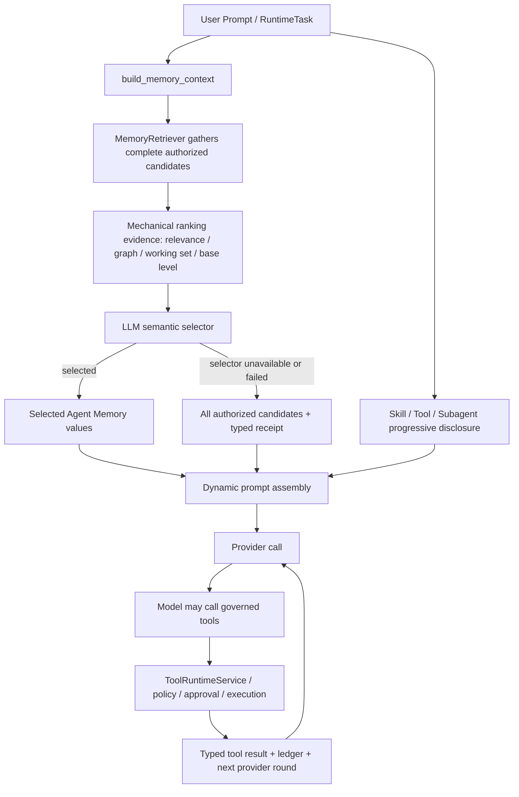

# Hive Native Read-side Attention 与 Capability Disclosure Runtime

> 首版日期：2026-07-06
> 重基线日期：2026-07-14
> 当前代码基线：`09fcca1aa1e49ace9db335e1216845418b0ce27b`
> 状态：当前 engineering 入口
> 范围：Agent Memory read side、model-led semantic selection、prompt assembly、Skill / Tool / Subagent progressive disclosure、feedback sidecar。Personal / Company Knowledge 只通过 governed tools 读取。

## 0. 当前裁决

Hive 当前没有一个统一的 `ActivationQuery -> ActivationRouter -> top-k V` 生产链路。旧 `activation_query.py`、`activation_router.py`、activation hints 与 `activation_qkv_trace` 已从当前 checkout 退役；旧 Q/K/V 文档只能作为历史施工证据，不能继续描述为现行 runtime。

当前真实机制由四条相互衔接、但权威不同的路径组成：

1. **Agent Memory read side**：机械检索、graph/working-set/base-level 等信号只产生可观察的排序证据；最终语义选择由 LLM 完成。LLM selector 不可用或失败时返回全部已授权候选，不用机械 top-k 代替语义判断。
2. **Capability disclosure**：Skill、deferred Tool、Subagent 分别产生结构化候选或目录，由各自的 progressive-disclosure 入口加载；候选本身不执行能力。
3. **Prompt assembly**：frozen prefix、dynamic suffix、messages 和显式已治理 retrieval context 被装配并记账。section budget 是可观察的 advisory，不进行静默语义裁剪；最终超过 provider 容量时 fail closed。
4. **Knowledge Tool-first**：Personal / Company Knowledge 正文不 prefetch、不成为自动 activation candidate、不静态注入原始上下文。模型通过知识 search/read tools 按需发现和读取。

这四条路径共同构成 Hive 的 read-side attention 与 capability disclosure，但不应再被包装成一个不存在的全局 Router。

## 1. 当前运行链路



Knowledge 不从 `B -> C` 自动进入。Personal 当前只能通过 `search_personal_kb` / `read_personal_kb`；Company 完成后使用 `search_company_kb` / `read_company_kb`。工具返回值经过授权后进入后续 provider round，并保留 source/revision refs。

## 2. 代码事实

| 机制 | 当前代码触点 | 当前事实 |
| --- | --- | --- |
| Memory 入口 | `backend/app/services/memory_service.py::build_memory_context` | 建立 principal/goal/session working-set context，调用 Memory retriever，并记录 degraded component |
| 完整候选收集 | `backend/app/memory/retriever.py::MemoryRetriever.retrieve` | 收集已授权 explicit、Wiki、episodic、semantic/external memory 证据；`limit` 不作为语义裁剪器 |
| 排序证据 | `backend/app/memory/retriever.py::_apply_activation`、`backend/app/memory/activation.py::ActivationScorer` | sensitivity/lifecycle 先做硬约束；relevance、working set、base level、task modulation 形成可观察 score trace，不能替代最终语义选择 |
| 模型语义选择 | `backend/app/memory/retriever.py::_select_candidates` | LLM 选择 candidate ids；模型不可用或失败时返回全部已授权候选并写 selection receipt，不机械 top-k |
| Session working set | `backend/app/memory/session_working_set.py` | 只持久化 refs、strength、turn 与时间等 control data，不持久化正文；用于 bounded context boost |
| Prompt section ledger | `backend/app/runtime/prompt_builder.py::ContextSectionCandidate`、`_select_context_section_candidates` | 记录存在/为空、source hash、rendered chars/tokens 和 advisory budget；不按关键词决定语义取舍 |
| Dynamic assembly | `backend/app/runtime/prompt_builder.py::build_dynamic_prompt_suffix` | 装配 Memory、runtime metadata、permissions、tool groups、deferred tools、Skill catalog、environment；只在调用方显式提供已治理 `retrieval_context` 时装配 knowledge section |
| Provider 容量门 | `backend/app/runtime/prompt_builder.py::assemble_runtime_prompt` | frozen + dynamic 无法在 provider window 内完整装配时抛 `PromptBudgetExceededError`，拒绝 blind truncation |
| Context 证据 | `backend/app/runtime/turn_envelope.py::build_context_selection_manifest`、`build_runtime_prompt_assembly_manifest` | 记录 context candidate refs、selected/suppressed-empty、source hashes、budget decisions、tool/skill/message usage |
| Capability 候选 | `gather_skill_candidates_for_prompt`、`gather_deferred_tool_candidates_for_agent`、`gather_subagent_candidates` | Skill / Tool / Subagent 各自生产 progressive-disclosure 元数据；不存在统一语义 Router |
| Knowledge 默认入口 | `backend/app/runtime/invoker.py::_resolve_retrieval_context` | 默认返回空，不 prefetch Personal / Company Knowledge；只保留专用 runtime 传入 governed evidence 的 seam |
| Feedback sidecar | `backend/app/services/session_feedback.py::_write_feedback_activation_sidecar` | feedback 是 control/evidence sidecar，不是 T0/T2/T3 或 Knowledge truth |

## 3. 权威边界

### 3.1 LLM 拥有的语义

- 哪些已授权 Memory 候选对当前任务真正有用；
- 是否需要搜索 Personal / Company Knowledge；
- 使用哪个 Skill / Tool / Subagent；
- 如何解释工具结果并形成最终表达。

### 3.2 平台拥有的机械事实

- principal、tenant、owner、delegation、RLS、source ACL；
- lifecycle/sensitivity 访问硬门；
- tool policy、approval、sandbox、quota、idempotency；
- provider context window 与显式资源上限；
- candidate/source hashes、selection receipt、tool result、transcript、span、replay/recovery evidence。

平台可以给 LLM 排序证据，但不得让 regex、关键词、固定阈值或 top-k 机械替代语义选择。无法调用 LLM selector 时，允许的 fallback 是完整暴露已授权候选、标记 typed degradation、保留 evidence 并等待恢复。

## 4. Knowledge 的严格 Tool-first 边界

| 项目 | Agent Memory | Personal Knowledge | Company Knowledge |
| --- | --- | --- | --- |
| 当前状态 | 已有真实 read-side 消费 | search/read/proposal 主路径已落地 | 当前 `Missing` |
| 原始 context | 可经受治理的 Memory assembly 进入 | 不 prefetch、不静态注入 | 不 prefetch、不静态注入 |
| 模型发现 | Memory selector + Memory tools | `search_personal_kb` | 目标 `search_company_kb` |
| 读取正文 | selected Memory value / Memory tool | `read_personal_kb` | 目标 `read_company_kb` |
| durable 写入 | Memory Gate + Platform Gate | Owner 决策 Personal proposal | Company proposal/review/publication authority |
| replay | T0/source refs + selection receipt | tool pointer + citation refs | 目标 tool pointer + source/revision/publication refs |

`retrieval_context` 不是 Knowledge 自动召回的后门。只有已经在专用 runtime 边界完成 authority 与 provenance 检查的证据，才可以显式传入这个 seam；默认 Agent runtime 永远不从 Personal/Company store 预取它。

## 5. 七原子检查

| 原子 | 当前 read-side 事实 | Knowledge 影响 |
| --- | --- | --- |
| 输入 | 用户 prompt、session/goal/principal context、显式 tool call | Knowledge 查询由模型发起，不由原始 context assembler 偷偷发起 |
| 权威 | sensitivity/principal 约束，工具执行前再做 policy/approval | Personal 使用 owner/grant；Company 必须新增 tenant/source/policy authority |
| 执行 | MemoryRetriever + model selector；ToolRuntimeService 是工具唯一执行面 | Knowledge search/read 必须注册为 governed tools |
| 证据 | score trace、selection receipt、context manifest、tool ledger、transcript/span | Knowledge tool 返回 source/revision refs，replay 只保留可授权 pointer |
| 恢复 | selector 失败返回完整已授权候选；prompt oversize typed fail；tool result 可重放 | denied/unavailable/empty/retryable 必须区分，不能伪装成空结果 |
| 消费 | selected Memory 真进入 prompt；loaded capability 真进入 model/tool loop | Knowledge 只有 search -> read -> model 使用才算消费闭环 |
| 验收 | Memory selector、working set、no-truncation、manifest 与 tool tests | Personal 已有 no-prefetch/replay tests；Company 尚无闭环测试，状态仍为 `Missing` |

## 6. 已退役表述

以下语句只属于 2026-07-05 至 2026-07-08 的历史施工语境：

- “runtime 先构建 `ActivationQuery`”；
- “统一 `ActivationRouter` 先 hard mask 再 multi-head top-k”；
- “Personal / Company KB 是 `ActivationCandidate`”；
- “dynamic suffix 注入 KB hint / Activation Hints”；
- “manifest 保存 `activation_qkv_trace`”。

当前测试反而明确断言 `activation_qkv_trace` 不存在，空 Activation Hints 不进入 suffix。任何后续设计若要重新引入这些概念，必须重新做 Model Agency Boundary 审查和 TDD，不能复活历史 dead path。

## 7. 文档责任

| 文档 | 责任 |
| --- | --- |
| `docs/memory-system-spec.md` | Agent Memory T0/T2/T3/soul truth 与生命周期 |
| `docs/personal-knowledge-base-spec.md` | Personal Knowledge 产品与数据契约 |
| `docs/personal-company-knowledge-tool-boundary-2026-07-10.md` | Personal / Company Knowledge Tool-first runtime |
| `docs/company-knowledge-base-spec-2026-07-07.md` | Company Knowledge 单轮完整施工规格 |
| `docs/knowledge-substrate-plugin-architecture-2026-07-09.md` | 三层 Knowledge substrate、Gateway 与 provider 边界 |
| `docs/ccplus-transformer-style-memory-runtime-upgrade-plan-2026-07-05.md` | 历史 Q/K/V 施工和测试证据，不是当前 runtime contract |

## 8. 当前验收入口

```bash
cd /Users/example-owner/vc-saas/hiveclaw-main/backend
source .venv/bin/activate

pytest -q \
  tests/memory/test_activation_scoring.py \
  tests/memory/test_base_level_activation.py \
  tests/memory/test_context_boost_activation.py \
  tests/services/test_memory_service.py \
  tests/runtime/test_prompt_builder.py \
  tests/runtime/test_turn_envelope_prompt_manifest.py \
  tests/runtime/test_invoker.py::test_resolve_retrieval_context_does_not_prefetch_knowledge
```

这组测试用于证明当前 read-side 机制与 Knowledge no-prefetch 边界；它不证明 Company Knowledge 已落地。
