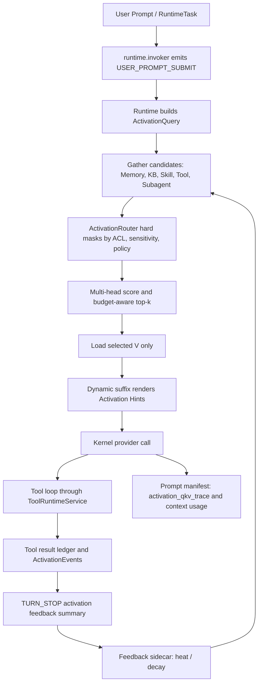

# Hive Native External Attention Runtime

日期：2026-07-06  
状态：当前机制说明 / engineering 入口文档  
范围：描述 HiveNature / Hive Native 在单 Agent runtime 上的原生特色：Memory read side、context assembly、tool loop、feedback sidecar 之间的 external attention control layer。

相关文档：

- `docs/ccplus-transformer-style-memory-runtime-upgrade-plan-2026-07-05.md`：48 个原子项落地账本与 Q/K/V 施工证据。
- `docs/ccplus-runtime-context-tooling-debt-ledger-2026-07-06.md`：Runtime / Context / Tooling 技术债闭环。
- `docs/ccplus-runtime-activation-weight-design-2026-07-04.md`：权重、召回强度、activation dynamics 的前置讨论。
- `docs/memory-system-spec.md`：Agent Memory T0/T2/T3/soul 基础规格。
- `docs/knowledge-pyramid-agent-person-org-2026-07-03.md`：Agent / Personal / Company Knowledge 的三级晋升路径。

---

## 1. 核心判断

Hive 当前最有价值的 native 机制，不只是“有长期记忆”，也不只是“有工具调用”。真正的差异点是：

```text
Hive 在模型外部做了一层可审计、可回放、可治理的 External Attention Control Layer。
```

这层不改模型权重，不声称控制模型内部 KV cache，也不要求主模型在 CoT 里自行决定“该召回什么”。它的职责是：

```text
Q：把当前用户输入、session、agent role、owner/company context、task profile 转成 ActivationQuery；
K：把 memory、knowledge、skill、tool、subagent、KB 等候选统一成 ActivationCandidate；
Router：先做 ACL / sensitivity / policy hard mask，再做 multi-head score 和 budget-aware top-k；
V：只加载入选 value slice 或 capability hint，不把所有内容平铺塞进 prompt；
Trace：把 Q/K/V、usage、selected/suppressed reasons 写进 manifest / ledger；
Feedback：把 tool result、turn stop、user feedback 写回 control sidecar，影响后续 heat / decay / ranking。
```

换句话说，Hive 的 runtime 不是被动拼 prompt，而是在模型外面做一层“可治理的注意力控制器”。

---

## 2. 这层到底控制什么

External Attention Control Layer 控制三件事：

| 控制面 | 解决的问题 | 当前实现形态 |
| --- | --- | --- |
| 更好的 memory 召回 | Wiki / Memory 越来越大后，不能平均平铺召回 | `ActivationQuery` + `ActivationCandidate` + `ActivationRouter` + selected memory values |
| 更好的工具加载 | 工具 schema 不应该全部暴露；要先发现、再按任务加载 | deferred tool index、tool candidate refs、active tool groups、tool result ledger |
| 更好的上下文组装 | frozen / dynamic、budget、manifest、selected/suppressed reasons 必须可解释 | dynamic suffix、`ContextUsageLedger`、`activation_qkv_trace`、prompt assembly manifest |

这三件事本质上是同一个 runtime attention 问题：

```text
当前任务到底应该看什么？
应该加载哪个能力？
应该把什么放进 prompt？
应该把什么留在 sidecar / manifest 里而不进入模型上下文？
```

---

## 3. 当前单 Agent 循环



这个循环有几个关键边界：

1. `T0/T2/T3` 仍然是 Memory truth surface。
2. `activation_events`、heat/decay、router output 是 control sidecar / read model，不是新的 truth layer。
3. 权限、敏感级别、policy hard mask 发生在排序之前。
4. Tool 执行仍然经过 `ToolRuntimeService`、preflight、approval、hook，不允许 Router 绕过治理。
5. Skill / Tool / Subagent 是 capability candidate，不是第 4 个产品。

---

## 4. 代码事实

| 机制 | 代码触点 | 事实 |
| --- | --- | --- |
| Q 生成 | `backend/app/runtime/invoker.py::_build_activation_query_for_request` | 在 request 进入 kernel 前生成 `ActivationQuery`，包含 prompt、turn_id、intent_id、agent_id、role、owner context、task profile、entities、temporal hints、risk level、candidate lanes |
| Runtime 状态账本 | `backend/app/runtime/context.py::RuntimeAssemblyState` | 统一承载 prompt manifest、context usage、tool result、cache/runtime decision、activation query/candidates/router output/events、skill/tool disclosure 状态 |
| Router | `backend/app/runtime/activation_router.py::route_activation_candidates` | 先 `_policy_mask` / `_acl_mask` / `_sensitivity_mask`，再 `_multi_head_score`，最后 `_apply_budget` |
| Dynamic injection | `backend/app/runtime/prompt_builder.py::build_dynamic_prompt_suffix` | dynamic suffix 统一渲染 memory、runtime metadata、permissions、tool groups、deferred tools、skill catalog、activation hints、knowledge、environment |
| Q/K/V trace | `backend/app/runtime/turn_envelope.py::build_activation_qkv_trace` | 记录 query trace、top/suppressed candidate refs、loaded memory values、loaded skills、loaded tool schemas，不嵌入 value body |
| `/context` 类账本 | `backend/app/runtime/turn_envelope.py::build_context_usage_ledger` | 记录 system prompt、system tools、custom agents、memory files、skills、deferred tool index、messages、MCP tools、free space，以及 selected memory value count / tokens |
| Tool loop | `backend/app/kernel/engine.py::_execute_tool_with_hooks` | 工具执行仍在统一 hook / result / failure 语义内，activation feedback 是旁路记录，不替代工具治理 |
| Feedback sidecar | `backend/app/services/session_feedback.py::_write_feedback_activation_sidecar` | 用户 feedback 产生 heat_delta、activation_event.feedback.credit、credited_entry_ids，写入 `hive.ccplus.activation_feedback_sidecar.v1` |

---

## 5. 和 Harness Agent / CC / Codex 的对比

这里的对比只看单 Agent 运行时，不展开公司控制面、A2A、企业知识库。

| 对标对象 | 强项 | Hive 已吸收或对齐 | Hive Native 额外层 |
| --- | --- | --- | --- |
| Harness Agent | 强调 Model + Harness、长任务状态外置、append-only replay、budget / sandbox / eval / recovery | Hive 有 durable runtime、T0 append-only、RuntimeTask、tool result ledger、sandbox、health/eval 证据 | 在 harness 外再加 memory/skill/tool/KB 的 external attention router，让“召回什么、加载什么、注入什么”可排序、可压制、可反馈 |
| CC | 强 prompt assembly、progressive disclosure、skills、hooks、subagent、context window / compaction 哲学 | Hive 对齐 CC 生命周期、dynamic suffix、Skill progressive disclosure、hooks、tool_search、context usage 分类账 | CC 更像“模型 + 上下文/工具披露规范”；Hive 把 Memory Wiki 与 capability disclosure 统一成 Q/K/V read-side 控制层 |
| Codex | 强工程控制：sandbox/approval、AGENTS.md、worktree/session ergonomics、tracing、长任务执行纪律 | Hive 吸收 approval / sandbox / trace / runtime task / structured ledger / deterministic evidence 的工程优势 | Codex 的优势主要是执行工程；Hive 的差异是把个人/企业 Memory 与工具加载一起纳入 external attention dynamics |

简化成一句话：

```text
Harness 给了“agent 应该有 harness”的尺度；
CC 给了“上下文、工具、Skill、hook 应该怎样披露”的语义基底；
Codex 给了“工程控制、sandbox、approval、trace、worktree discipline”的优势；
Hive Native 把这些接到 Memory Wiki / Knowledge Wiki / Tool loop 上，形成外部 attention control layer。
```

---

## 6. 为什么这是 HiveNature 原生特色

普通 Agent runtime 往往有两种形态：

1. **Prompt 拼接型**：把 memory summary、tool list、system instruction 拼成一个大 prompt。
2. **RAG 检索型**：用 query 去搜一批文档，把 top-k 塞回 prompt。

Hive 当前这层不是简单 RAG，也不是简单 prompt engineering。它的特点是：

| 特点 | 含义 |
| --- | --- |
| 多源候选 | Memory、Personal / Company KB、Skill、Tool、Subagent 都能成为候选 |
| 权限先于智能 | Router 排序前先做 ACL / sensitivity / policy hard mask |
| Value 延迟加载 | 只加载入选 V；未入选候选保留在 trace / suppressed reasons |
| prompt 预算可解释 | `ContextUsageLedger` 解释每类内容占用和 free space |
| 反馈回路独立 | tool result / turn stop / user feedback 进入 sidecar，不污染 truth surface |
| 可回放可审计 | prompt manifest、activation_qkv_trace、runtime assembly state 都是可检查对象 |

这也是它和传统 RAG 的核心区别：RAG 主要解决“找文档”；Hive Native external attention 解决“在一个 agent cycle 中，哪些记忆、能力、工具、上下文应该获得注意力”。

---

## 7. 文档边界

这份文档只描述当前 runtime native 机制，不替代以下文档：

| 文档 | 仍然负责 |
| --- | --- |
| `docs/ccplus-transformer-style-memory-runtime-upgrade-plan-2026-07-05.md` | 原子落地、测试、commit、验收证据 |
| `docs/ccplus-runtime-context-tooling-debt-ledger-2026-07-06.md` | 技术债闭环与 CC parity 差距清理 |
| `docs/memory-system-spec.md` | Agent Memory truth surface 与 T0/T2/T3/soul 规格 |
| `docs/personal-knowledge-base-spec.md` | Personal Knowledge / Knowledge LM 产品规格 |
| `docs/knowledge-pyramid-agent-person-org-2026-07-03.md` | Agent → Personal → Company Knowledge 的晋升路径 |

本文件可以作为 engineering 叙事入口：当我们要解释 Hive 为什么不是“又一个 RAG Agent”时，先读这份。

---

## 8. 后续写法建议

如果后续要把这份文档继续加强，不应该追加新的产品规划，而应该补三类证据：

1. **真实 turn 样例**：给出一次用户 prompt 进入 runtime 后的 `ActivationQuery`、candidate refs、selected/suppressed、dynamic suffix、manifest 片段。
2. **对标样例**：同一个任务分别说明 Harness / CC / Codex / Hive 会把注意力放在哪里。
3. **指标样例**：selected memory value tokens、loaded tool schema tokens、suppression reasons、feedback heat/decay 的变化。

这样这份文档会从“机制说明”升级成“可演示的单 Agent native advantage 说明书”。
