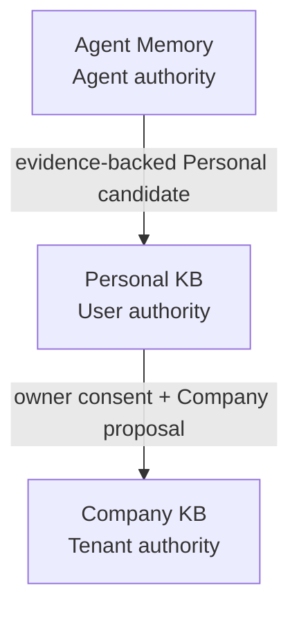
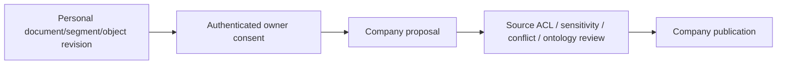

# 知识金字塔：Agent -> Personal -> Company Authority Chain

> 首版日期：2026-07-03
> 重基线日期：2026-07-14
> 状态：canonical 概念边界；不承担当前实施状态、provider 选型或施工顺序
> 当前实现状态以 current checkout、`docs/company-knowledge-base-spec-2026-07-07.md` 和 Personal completion contract 为准

## 0. 一句话

Agent Memory、Personal KB、Company KB 是沿 ownership/authority chain 递进的三个知识层：下层可以提交带证据的 candidate，上层通过自己的 authority 接受并形成新的 canonical truth；它们不是三份自动同步的副本，也不是一个表里切换 scope 的同一条记录。

## 1. 三层结构

| 层 | Owner | Canonical truth | 核心职责 | 当前状态（2026-07-14 checkout） |
|---|---|---|---|---|
| Agent Memory | Agent，受 owner/company 治理 | T0/T2/T3/soul Markdown Vault | 学习、反思、个人工作记忆、自我演化 | 有真实主链 |
| Personal KB | User/Principal | owner-scoped artifacts + Knowledge Core | 个人资料、直接来源、跨 Agent 个人资产 | 有真实 API/tools/proposal/UI 底座 |
| Company KB | Tenant/Company | published artifacts/objects/relations + publication history | 组织事实、政策、SOP、对象、关系、决策 | 已知缺失，待一次完整落地 |



重要纠正：

- 三级结构是 ownership chain，不要求三层采用完全相同的文件、表、检索或 UI 形式；
- 复用的是 evidence、proposal、gate、source refs、rollback 等治理形状；
- 每跨越一次 authority boundary，都创建上层自己的权威记录；
- Company Context、Legacy files、Company KB 是三个不同 surface。

## 2. 边界机器

每次跨层 promotion 都遵循：

```text
lower-layer evidence/canonical source
  -> LLM-authored semantic candidate
  -> authenticated consent/delegation
  -> target-scope permission/sensitivity/conflict review
  -> target-scope durable commit
  -> structured source refs back to evidence
```

### 2.1 LLM 与平台分工

LLM 负责：

- 判断哪些内容值得形成 candidate；
- 提炼、合并建议、冲突解释；
- ontology mapping、proposal draft；
- 对完整授权证据作语义判断。

平台负责：

- principal/tenant/source ACL；
- schema、hash、幂等和 exact evidence refs；
- proposal/review/publish state；
- dedupe candidate collection、audit、rollback、最终 commit。

机械 fallback 不能接受、拒绝、合并、删除或重写语义，只能 hold/quarantine/retry/request review。

### 2.2 Evidence 规则

旧稿“上层永不读 T0/T2 原文”过度绝对，现改为：

1. 上层不自动批量复制下层 raw context。
2. 日常检索消费 target-scope canonical publication，而不是遍历所有下层 raw data。
3. Review、审计、冲突取证和 source verification 可以沿 structured refs 下钻到原始 evidence。
4. source ref 可以指向 T0/T2、Personal document/segment、canonical artifact、Living Object revision、connector source；不存在唯一 `t2-*` 证据货币。
5. 下层 source 撤权/删除不允许静默破坏上层 truth；触发 target policy 的 hold/review/revoke，并保留 lineage。

## 3. Agent Memory

Agent Memory 是 Agent 的学习与行为演化系统：

- T0 raw evidence；
- T2 session Segment Packages；
- T3 episodes/user/worker/capabilities；
- `soul.md`；
- Memory Gate + Platform Gate；
- dynamic activation。

它不是：

- Owner 的所有资料库；
- Company policy repository；
- 每个 Agent 私建的 Personal KB index；
- 可由 Company 自动读取的员工画像源。

Agent Memory 可以生成 Personal candidate，但 candidate 必须保留 Agent/session/T0/T2 evidence refs，且不能直接 commit owner truth。

## 4. Personal KB

Personal KB 是 user/principal-owned canonical workspace，有两个真实进水口：

1. Owner direct sources：paste/upload/URL/media/chat attachment；
2. Agent-generated candidate：报告、笔记、可复用资料、Owner 明确要求保存的产物。

Personal KB 不是 Agent Memory 的派生索引，因为 direct sources 在 Agent 层没有 canonical home。

### 4.1 读取

Personal Knowledge 内容严格 Tool-first：

```text
search_personal_kb -> read_personal_kb
```

不做 prefetch、KB Hint 或静态 prompt 注入。Agent Memory activation 与 Personal Knowledge tools 是两个不同机制。

### 4.2 写入

- Owner direct ingest 进入 governed ingestion；
- Owner authenticated instruction 可以按 Personal policy 保存；
- Agent 自主 durable write 形成 Personal proposal；
- 其他 user/Agent 需要 explicit delegated grant。

Personal governance 不是“自动提交为主”。Owner ownership 不等于 Agent 可以无证据直写。

### 4.3 当前技术底座

当前 Person scope 已有 canonical artifacts、documents/segments/entities/assertions/links/index jobs/grants、full-text/entity/graph search、API、tools、proposal 和 UI。Vector/provider 是可选 derived capability，不是 Personal truth 的前置条件。

本文不再保留 M1/M2/M3 的历史施工次序；完成状态只以代码消费路径和当前 completion contract 为准。

## 5. Company KB

Company KB 是 Company Control Plane 的组织权威面，负责：

- policies、SOP、decisions、projects、customers、products、systems；
- object/property/link/action types；
- documents/assertions/objects/relations；
- source lineage、validity、sensitivity、retention；
- proposal/review/publish/retire/restore；
- Company resource permission、audit、rollback；
- Tool-first search/read；
- Living Object published references。

Company KB 不是：

- `/enterprise/knowledge-base` 旧文件树；
- `company_profile.md`、`org_structure.md` Company Context；
- Personal KB 记录的 `scope_type` 翻转；
- Graphiti/SAG/vector DB；
- Company Charter/Policy enforcement 的替代品。

Company 的完整目标、schema 和施工账本只以 `docs/company-knowledge-base-spec-2026-07-07.md` 为准。

## 6. Personal -> Company



不变量：

1. Personal source 保持 private authority；
2. promotion 固定 source revision/content hash；
3. Company 创建独立 publication/ACL/version；
4. Personal grant 不升级为 Company permission；
5. Agent 不能自提自批；
6. profile/behavior/私人资料默认不进入 ordinary promotion；
7. Living Object publication 固定 revision 或 reviewed-follow policy；
8. Company publish 后的 provider/index 全部可重建。

## 7. Company Context 与 Governance

| Surface | 作用 | 是否 Knowledge tool-only |
|---|---|---|
| `company_profile.md` / `org_structure.md` | 可信组织上下文投影 | 否，按独立 Company Context contract |
| Company Charter/Policy Plane | 强制权限、规则、行动约束 | 否，必须在 effect boundary 生效 |
| Company KB | 可检索的 published organization knowledge | 是，search/read tools |
| Legacy company files | 隔离与只读证据导出 | Agent 不可消费 |

政策原文可以被 Company KB 引用；真正的强制规则需要经过独立治理投影，不能依赖 Agent 主动搜索。

## 8. Provider 与索引

三层各自选择适合的 derived index，不要求同构：

- Agent Memory：Markdown/wiki map/relations/PPR/activation；
- Personal：PostgreSQL full-text/entity/link graph/optional vector；
- Company：PostgreSQL full-text/typed ontology graph/optional vector/provider fusion。

Graphiti、SAG、HippoRAG、GraphRAG、pgvector 等只提供算法/provider/eval 参考。任何 provider：

- 不拥有 authority；
- 不决定 ACL/publish；
- 不直接注入 prompt；
- 输出必须绑定 Hive IDs/source refs；
- 可禁用、替换、重建。

外部项目版本、stars、活跃度等时间敏感快照不再放在本 canonical 概念文档中；需要选型时重新实核并形成 scorecard。

## 9. 七原子跨层检查

任何 promotion 或知识层完成声明都要检查：

| 原子 | 问题 |
|---|---|
| Input | candidate/source 谁提交，是否带完整证据与恢复 ref |
| Authority | 下层 owner 是否同意，上层谁有权 review/commit |
| Execution | 是否只有一个受治理入口，能否 scope/filesystem/provider 旁路 |
| Evidence | source refs、decision、event、hash、version 在哪里 |
| Recovery | 重复、失败、撤权、rollback、删除如何恢复 |
| Consumption | 上层是否真实检索/引用/展示 target publication |
| Acceptance | 权限、迁移、故障、E2E 是否证明完整路径 |

## 10. 当前结论

1. 三层 ownership/authority 方向正确，不需要第四个 Knowledge 产品。
2. Agent Memory 和 Personal KB 已有不同程度的真实实现；Company KB 仍是 Missing。
3. 当前下一步不是继续沿历史 Phase 0-5，而是先锁定 Company spec 的剩余产品决策，再按其单轮七原子施工图一次落地。
4. 本文只负责概念边界；任何实现状态都必须重新核对 current checkout。

## 11. 修订记录

- 2026-07-14：从历史实施/选型计划重写为 canonical ownership/authority 概念契约；删除 M1/M2/M3/Phase 状态、自动 Personal governance、唯一 T2 证据货币、pgvector/provider 时间快照；加入 Tool-first、structured source refs、Company Context/Governance/Legacy 分离和 current-checkout 状态。
- 2026-07-03：初版三级 Wiki 递进架构与 Personal 技术选型讨论。
