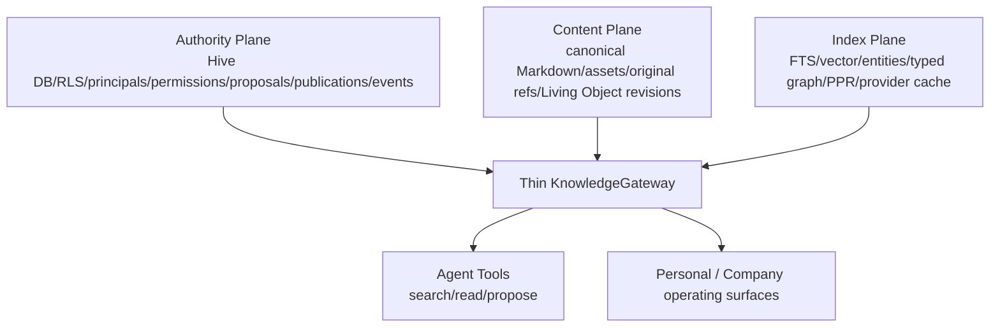
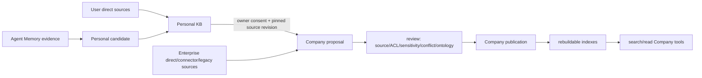

# Knowledge Substrate 与 Provider 架构契约

> 首版日期：2026-07-09
> 重基线日期：2026-07-14
> 状态：跨 Agent Memory / Personal KB / Company KB 的 canonical architecture contract
> 当前代码基线：Hive checkout `09fcca1aa1e49ace9db335e1216845418b0ce27b`
> 范围：ownership、Authority/Content/Index 三平面、薄 Gateway、provider、promotion 与 Tool-first consumption

## 0. 文档职责

本文只定义跨知识层的稳定架构边界，不取代各产品面的专项规格：

- Personal 产品与当前完成证据：`docs/personal-knowledge-base-spec.md`、`docs/personal-knowledge-base-completion-contract-2026-07-08.md`；
- Company 完整施工规格：`docs/company-knowledge-base-spec-2026-07-07.md`；
- Knowledge runtime 披露：`docs/personal-company-knowledge-tool-boundary-2026-07-10.md`；
- 权限判定：`docs/agent-permission-governance-spec-2026-07-07.md`；
- Living Object：`docs/hive-living-object-native-surface-architecture-2026-07-10.md`。

本文覆盖首版中的以下旧结论：

1. Knowledge 需要先拆独立仓库；
2. Personal 先包装成通用 provider 才能继续建设；
3. Gateway 把搜索结果直接做 Runtime Injection；
4. 模型工具应立即收敛成一个 `search_knowledge(scope=...)`；
5. Company `/enterprise/knowledge-base` 旧文件树仍是临时产品面；
6. Company 当前已经存在 proposal、ACL、provider config/status 表。

## 1. 一句话结论

> Hive 拥有知识 authority、governance、audit 和 durable commit；Content/Index provider 提供可替换能力；Agent 只通过受治理工具按需读取 Personal/Company Knowledge。

Knowledge 不应吞入 Agent Memory，也不应先抽象成一个脱离真实消费者的独立平台。正确做法是：在当前仓库内通过真实 Personal/Company vertical slice 建立薄 `KnowledgeGateway`，等 contract 被多个稳定消费者证明后，再决定是否拆包或拆仓。

## 2. 三层 ownership / authority

| 层 | Authority owner | Canonical truth | 主要消费者 | 晋升边界 |
|---|---|---|---|---|
| Agent Memory | Agent（受 owner/company 治理） | T0/T2/T3/soul Markdown Vault | Agent runtime、Memory/Soul/Skill evolution | 生成 evidence-backed candidate |
| Personal KB | User/Principal | owner-scoped artifacts + Knowledge Core | Owner、被授权 Agents | Owner consent + Company proposal |
| Company KB | Tenant/Company | published artifacts/objects/relations + immutable publication history | 被授权人员、Agents、Workflows、Control Plane | review/publish/retire authority |

不可混淆：

1. Agent Memory 是学习层，不是个人文档库。
2. Personal KB 是 user-owned canonical workspace，不是某个 Agent 的扩大记忆。
3. Company KB 是组织权威面，不是共享版 Personal KB。
4. 三层可以共享 schema/value objects/provider contract，但不能共享 owner、proposal row 或 publish authority。
5. 晋升是创建上层 authority record，不是复制所有 raw data，也不是原地修改 scope。

## 3. 当前真实状态

| 能力 | 当前状态 | 判断 |
|---|---|---|
| Agent Memory | 有真实主链 | MD-first T0/T2/T3/soul、Memory Gate/Platform Gate 和动态 activation 已存在 |
| Personal KB | 有真实产品/运行时底座 | ingest、documents/segments/entities/assertions/links/jobs/grants、search/read/proposal/API/UI 已存在 |
| Company KB | Missing | 没有 Company proposal/publication/permission decision/Gateway/tools/API/UI |
| Legacy company files | 隔离/只读导出闭环 | 不是 Company KB，Agent 不可消费 |
| KnowledgeGateway | Missing | 当前没有该 class/service 或 provider registry |

`KnowledgeDocument` 的 generic scope 字段只是未来兼容底座，不证明 Company runtime 已实现。`KnowledgeGrant` 和 `PersonalKnowledgeProposal` 的当前 authority 都是 Personal。

## 4. Authority / Content / Index 三平面



### 4.1 Authority Plane

Hive 主系统必须拥有：

- tenant、principal、delegation 与 scope；
- RLS、resource permission、source ACL、sensitivity；
- source/document lifecycle；
- proposal/review/publish/retire/rollback；
- immutable version/publication；
- provider capability/config status；
- domain events、AuditLog、InvocationSpan、outbox。

外部 provider、editor、connector 和 object store 均不得产生最终 allow/publish 决策。

### 4.2 Content Plane

Content Plane 保存或引用：

- canonical Markdown；
- original file/object-store ref；
- normalized transcript/media derivative；
- source preview；
- Living Object pinned revision；
- accepted note/document content；
- source hash、artifact hash、conversion metadata。

Content 可以在 workspace、object store 或外部 content provider 中，但必须能通过稳定 artifact/source ref 回到 Authority Plane。

### 4.3 Index Plane

Index Plane 全部是 derived state：

- PostgreSQL `tsvector`/GIN；
- optional embedding/vector rows；
- entity/assertion/link graph；
- typed Company ontology graph；
- backlink/heat/freshness；
- provider index/cache；
- retrieval traces。

删除或替换 Index Plane 不得改变 owner、ACL、proposal、publication、source refs 或内容 truth。

## 5. Thin KnowledgeGateway

### 5.1 为什么需要

Personal API/UI/tools 与 Company API/UI/tools 需要共享：

- typed request/response；
- authority preflight；
- source/artifact lookup；
- index capability/status；
- current-turn/replay evidence；
- provider result rebind 与 post-filter。

这些真实重复足以支持一个薄 Gateway，但不足以支持先建一个独立 Knowledge 平台或把所有 Personal service 包装成外部 provider。

### 5.2 唯一职责

```python
class KnowledgeGateway:
    async def ingest(self, request: KnowledgeIngestRequest) -> KnowledgeIngestResult: ...
    async def search(self, request: KnowledgeSearchRequest) -> KnowledgeSearchResult: ...
    async def read(self, request: KnowledgeReadRequest) -> KnowledgeReadResult: ...
    async def propose(self, request: KnowledgeProposalRequest) -> KnowledgeProposalResult: ...
    async def capability_status(self, request: KnowledgeCapabilityRequest) -> KnowledgeCapabilityStatus: ...
```

Gateway：

- dispatch 到 Personal/Company domain service；
- 要求调用方提供 authenticated actor/context；
- 统一 provider capability 与 evidence envelope；
- 不自己决定 Personal owner consent 或 Company publish；
- 不包含 prompt assembly；
- 不把 provider 裸文本直接返回模型。

Review/publish/retire 是 Company authority operations，留在 `CompanyKnowledgeService`，不为了接口对称塞进所有 scope。

### 5.3 请求最小字段

```text
tenant_id
scope: personal | company
scope_id
actor_user_id
actor_agent_id?
session_id?
runtime_task_id?
operation
resource_ref?
source_refs[]
permission_context
trace_id
idempotency_key?  # mutation only
```

Agent Memory 不伪装成 `scope=agent` 的 Knowledge provider；它继续使用自身 Memory runtime 和 write gates。

## 6. Model-visible 工具契约

模型侧保留清楚的 authority 名称：

```text
search_personal_kb -> read_personal_kb
search_company_kb  -> read_company_kb
propose_personal_kb_item
propose_company_kb_update
```

理由：

- Personal/Company owner、grant、proposal 和风险不同；
- 模型需要知道自己正在请求哪种 authority；
- Tool governance/capability discovery 更容易解释；
- 内部仍通过 Gateway 复用，不需要暴露 `scope` 字符串给模型。

禁止：

- Base Context 自动搜索 Personal/Company KB；
- 通过 Generic RetrievalContext、filesystem 或 provider API 旁路工具；
- 用一个模糊 `search_knowledge(scope=...)` 隐藏 authority 差异；
- 工具 unavailable 时偷偷注入知识作为补偿。

## 7. Current-turn、Evidence 与 Replay

知识工具结果有三个视图：

| 视图 | 内容 |
|---|---|
| Current-turn model | 完整 bounded result，足以完成本轮推理 |
| Durable evidence | tool input/output、authority decision、source refs、hash、provider trace |
| Next-turn model replay | query、IDs、source refs、content omitted、重新调用说明 |

任何 context/window 限制不得通过静默 head/tail 截断丢失已授权证据。超长结果使用模型可见的分页/引用与完整 coverage ledger；provider 失败只能产生 typed unavailable/degraded 状态。

## 8. Provider Contract

### 8.1 Provider 类型

可以存在：

- Content provider；
- Import/conversion provider；
- Full-text/vector/graph index provider；
- Editor/workspace provider；
- Ontology candidate provider；
- Media transcription/OCR provider。

不是所有 provider 都需要一个继承层；只有存在两个真实实现或稳定外部边界时才抽象 interface。

### 8.2 Index provider 最小契约

```python
class KnowledgeIndexProvider:
    provider_name: str

    async def capability_status(self, context: ProviderContext) -> ProviderStatus: ...
    async def index(self, artifact: IndexedArtifact, context: ProviderContext) -> IndexReceipt: ...
    async def tombstone(self, resource: IndexedResourceRef, context: ProviderContext) -> IndexReceipt: ...
    async def search(self, query: ProviderQuery, context: ProviderContext) -> list[ProviderCandidate]: ...
```

Provider candidate 必须包含 Hive document/publication/segment/object ID、artifact hash、index version 和 source refs。Gateway 在 Authority Plane 重新 fetch/filter 后才生成 model-visible hit。

### 8.3 Provider 禁止事项

Provider 不得：

- 决定 ACL、sensitivity、owner 或 publish；
- 写 Personal/Company canonical truth；
- 直接注入 prompt；
- 将无 Hive IDs/source refs 的裸文本当结果；
- 把失败伪装为空结果或 ready；
- 成为不能重建、不能替换的唯一索引。

### 8.4 Provider 选择

Graphiti、SAG、pgvector、Qdrant、Weaviate、GraphRAG 等都是候选 provider/eval，不是预先锁定的地基。选择必须由同一 corpus 上的质量、安全、成本、更新和恢复 scorecard 决定。

## 9. Promotion Boundary



Rules：

1. 下层 raw evidence 不自动批量复制到上层；review/取证可沿 structured source refs 下钻。
2. Agent Memory candidate 进入 Personal 需要 owner authority。
3. Personal 进入 Company 需要可信 owner consent 和 Company review。
4. profile/behavior memory 默认不进入 Company ordinary promotion。
5. Company publication 独立 version/ACL/retention，不随 private latest 静默更新。
6. Index jobs 在 publish 后异步运行，不参与 authority commit。

## 10. Living Object

Knowledge 可以保存 Living Object reference，但不接管对象内部 truth：

- Personal collection 保存 owner-owned object ref；
- Company publication 保存 pinned revision 或 reviewed-follow policy；
- Dataset rows、Deck blocks、Dashboard state 继续由 Living Object authority 管理；
- Surface 是投影，不是第二份 knowledge truth；
- object mutation 继续走 ToolRuntime/Workflow/Approval。

## 11. Connector 与 Source ACL

Connector 只能：

1. 注册 authoritative source items/ACL metadata；
2. 映射外部 user/department/role/document ACL 到 Hive permission/source snapshot；
3. 提交 ingest/proposal；
4. 在读取结果前后参与 fail-closed permission validation。

Connector 不建立平行 ACL 真相，也不把 provider 命中直接送入模型。现有 `backend/app/services/connector_acl.py` 的 source registration/filter/final validation 是可复用底座，但不是 Company PermissionDecision 的替代。

## 12. 存储与仓库边界

### 12.1 Hive 主库保留

- authority metadata；
- document/source/publication stable IDs；
- RLS/permissions/proposals/reviews/events/outbox；
- index jobs/capability status；
- structured source refs；
- 小型 queryable derived indexes（例如 PostgreSQL FTS/typed links）。

### 12.2 可外置

- 大文件 bytes；
- provider 私有 vector/graph rows；
- editor transient state；
- rebuildable caches；
- OCR/STT intermediate assets。

### 12.3 是否独立仓库

当前决定：**不先拆仓。**

只有同时满足以下条件才评估 `hive-knowledge` 独立包/仓：

1. Gateway contract 已被 Personal 和 Company 两个 production consumers 使用；
2. 至少一个外部 provider 有稳定 adapter；
3. auth/tenant/ToolRuntime/RuntimeTask 边界无需跨仓复制；
4. migration/version compatibility 有真实维护收益；
5. 拆分不会让 Company authority 或 evidence 变成分布式双事实源。

## 13. 能力状态

统一状态枚举：

```text
ready
degraded
unconfigured
blocked
rebuilding
failed_retryable
failed_terminal
```

必须区分：permission denied、provider unavailable、not configured、empty result、index stale。UI/tool result/audit 使用同一 machine-readable status，模型负责向用户解释其意义。

## 14. 实现纪律

1. 先从 live API/tool/UI vertical slice 定义 contract，不建 unreachable framework。
2. 智能提取、mapping、冲突、摘要、proposal 内容由 LLM 主导；平台只做 authority/schema/evidence/commit。
3. 权限尽量在 ingress 和 effect boundary 强制，不扫描自然语言限制模型推理。
4. Provider/index 可以降级；authority/evidence 不能降级成 silent success。
5. Company 实现严格服从专项 spec 的七原子、migration/backfill/fault-injection/acceptance。
6. 文档中的 target 和 implemented 必须分列；不得用接口草案冒充 current code。

## 15. Canonical 术语

| 术语 | 定义 |
|---|---|
| Agent Memory | Agent learning/evolution layer，不属于 Knowledge scope enum |
| Personal KB | user/principal-owned canonical workspace |
| Company KB | tenant/company authority plane |
| Authority Plane | RLS/permission/proposal/publication/event/commit truth |
| Content Plane | canonical artifacts/assets/revisions/source snapshots |
| Index Plane | full-text/vector/graph/provider cache，全部可重建 |
| KnowledgeGateway | Personal/Company shared 的薄调用边界，不是 authority owner |
| Provider | 可替换的 content/import/index/editor/ontology capability |
| Proposal | 跨 authority 或修改 Company truth 的受治理候选 |
| Publication | Company 已审查、不可变、可 supersede/retire 的权威版本 |

## 16. 修订记录

- 2026-07-14：改为 canonical architecture contract；更新 current checkout 状态；将 Runtime Injection 改为 Tool-first Agent Tool Consumption；确定显式 model tools + thin Gateway；移除先拆仓、scope=agent、旧 Company file surface、通用工具强制收敛和 provider 预设。
- 2026-07-09：初版 Knowledge substrate/plugin 架构草案。
