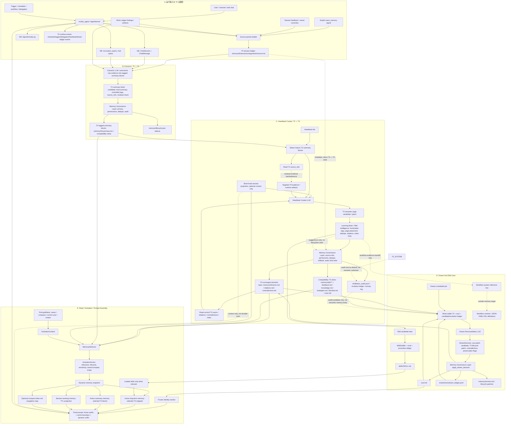

# Hive 记忆系统流程图（2026-06-17）

> 用途：把 Hive 记忆系统从运行输入到 prompt recall 的完整链路放在一张图里，用来定位断点、重复职责和越权写入。
>
> Core boundary: LLM 负责判断、提炼、反思、归纳、候选生成；平台负责证据引用、权限、去重、回滚、审计、最终落盘。
>
> 当前目标：Agent Markdown Wiki / Learning Vault 是包含 T0、T2、T3、`soul.md`、skills/evolution/audit sidecars 的完整 Markdown 文件系统；T3 只是其中的语义收敛层。主梯度仍是 `T0 -> T2 -> T3 -> soul.md`。残差连接表示 T3 curation 先看 T2，再沿 T2 `source_refs` 回到目标 T0 evidence 做复核；它不是新记忆层，也不是 T0 -> T3 捷径。

## 按流程读图

1. Runtime turn 先产生 source packet 和 T0 evidence。T0 是可回放证据，不是语义结论。
2. Extractor 是唯一正常的 T0 -> T2 路径，输出带 `source_refs` 的 T2 tagged summary blocks。
3. Heartbeat 是正常的 T2 -> T3 路径。它从 T2 summary blocks 起步，再沿 `source_refs` 回到目标 T0 evidence 做残差式复核。
4. Learning Brain 不替代三层蒸馏器。它只组织 Wiki candidate：页面归位、frontmatter、tags、aliases、relations、去重、矛盾和检索提示。
5. Memory Governance Layer 是 T2、T3、lifecycle、archive、soul patch 的唯一最终写入权威。
6. Dream 读取稳定 T3 和 `soul.md`，提出 identity 或 lifecycle 变更；它不直接写 durable files。
7. Skill 可以从 memory evidence 中长出候选并晋升为 `skills/<name>/SKILL.md`。Workflow 是独立执行控制体系；memory 只提供 evidence handoff / reference hint，不生成 workflow definition。
8. Prompt assembly 只经过 activation 和 visibility filter 读取，不创建新记忆状态；`soul.md` 常驻，`index.md` 只作为可选 compact navigation map，T0 raw 只在 residual/debug/replay 时按 refs 加载。

## 断点检查清单

- `RESPONSE_COMPLETE` / source packet 缺失：Extractor 不能可靠生成 T2；后续 replay 必须标记为 replay/backfill。
- Extractor cursor drift：T2 可能跳过 source slices；检查 T2 summary block 的 `source_refs`。
- T2 summary block 缺少 `source_refs`：Heartbeat 不能做残差式证据复核，必须 hold T3 candidate。
- Heartbeat 从 raw T0 起步而不是从 T2 起步：这是边界违规，因为 T0 不能绕过 T2 进入 T3。
- Learning Brain 写文件：这是边界违规。它只能提出 Wiki organization suggestion。
- T3 semantic layer 漂移：broken `[[wikilinks]]`、缺 source refs、low-confidence claims、contested pages 必须在 wiki lint 中暴露。
- 机械 fallback 失真：regex、counter、截断摘要不能直接写成语义记忆；预算不足时必须保留 source refs、range、hash、artifact path 和 held candidate。
- 验证强度错位：metadata/index patch 可以轻验证；T3 稳定结论需要 T2/T0 证据；soul/skill 晋升需要强验证和 gate；workflow promotion 不属于 memory lane。
- `evolution/lineage.md` 误用：它只能是 audit/counter/candidate evidence，不能成为 semantic memory body。
- T2 过早 absorbed：heartbeat 只能在 curation result 和 write decision 记录后标记 absorbed。
- `save_memory` 误用：它是显式高优先级用户记忆信号，默认进入 T2 summary block / Review Queue；不能绕过治理层直写 T3。
- Skill lane bleed：capability candidates 可以引用 T3 evidence，但最终 source of truth 不能存进 T3。
- Workflow lane bleed：workflow definition 不能进入 memory target；只能通过 Workflow 系统自己的 JSON/YAML/DSL 和治理链路管理。
- Dream candidate blindness：如果 `evolution_ledger.jsonl` 有 useful candidates 但 dream prompt 看不到，soul/T3 promotion 会停滞。
- Activation fail-closed：principal context 不能解析时，prompt memory 可以被抑制，不能泄漏。
- Prompt budget trims：dynamic memory 应优先保留证据指针；如果内容无法完整放入 prompt，应保留可回溯引用而不是写失真摘要。
