# Hive Memory System Flow Map (2026-06-17)

> Purpose: one-page flow map for finding breakpoints in Hive's memory pipeline.
>
> Core boundary: LLM 负责判断、提炼、反思、归纳、候选生成；平台负责证据引用、权限、去重、回滚、审计、最终落盘。
>
> Current fact pattern: the four-layer pyramid is only the storage core. Around it are hooks, Learning Brain, Extractor, candidate ledger, heartbeat curator, dream consolidator, write/read control-plane gates, derived indexes, and prompt assembly.

```mermaid
flowchart TB
  %% ---------------------------------------------------------------------------
  %% Runtime event producers
  %% ---------------------------------------------------------------------------
  subgraph A["A. Runtime inputs and durable trace surfaces"]
    U["User / channel / web chat"] --> INV["invoke_agent / AgentKernel"]
    TR["Trigger / scheduler / workflow / delegation"] --> INV
    HB_RUN["Heartbeat daemon run"] --> INV
    DR_RUN["Dream daemon run"] --> DR_PROC["Dream LLM consolidator"]
    FB["Session feedback / explicit save_memory / update_memory"] --> MEM_TOOL["Memory tools"]
    WL["Work Ledger findings"] --> WL_SETTLE["SESSION_CLOSE ledger -> T2 consolidation"]

    INV --> DB_CHAT["DB: ChatSession + ChatMessage"]
    INV --> SPANS["DB: invocation_spans / tool spans"]
    INV --> ACTIVITY["DB: AgentActivityLog"]
    INV --> HOOKS["Runtime hooks"]
  end

  %% ---------------------------------------------------------------------------
  %% Hook fanout
  %% ---------------------------------------------------------------------------
  subgraph B["B. Hook fanout after/around each turn"]
    HOOKS --> RESP["RESPONSE_COMPLETE"]
    HOOKS --> PRECOMP["PRE_COMPACTION"]
    HOOKS --> CLOSE["SESSION_CLOSE"]
    HOOKS --> IDLE["SESSION_IDLE"]
    HOOKS --> TR_END["TRIGGER_END / DELEGATION_END"]
    HOOKS --> HB_END["HEARTBEAT_TICK_END"]
    HOOKS --> DR_END["DREAM_END"]

    RESP --> SESSION_MEM["session_memory snapshot"]
    RESP --> EXTRACT_SCHED["Extractor.schedule_extract"]
    RESP --> LB["Learning Brain: full-context LLM classifier"]
    PRECOMP --> EXTRACT_SYNC["Extractor.extract synchronous before compaction"]
    CLOSE --> EXTRACT_DRAIN["Extractor.drain"]
    CLOSE --> WL_SETTLE
    CLOSE --> T0_CHAT["T0 behavior log: logs/YYYY-MM-DD/behavior/chat-*.md"]
    IDLE --> T0_CHAT
    TR_END --> T0_TRIG["T0 behavior log: logs/YYYY-MM-DD/behavior/trigger|delegation-*.md"]
    HB_END --> T0_SYS_HB["T0 system audit: logs/YYYY-MM-DD/system/heartbeat-*.md"]
    DR_END --> T0_SYS_DR["T0 system audit: logs/YYYY-MM-DD/system/dream-*.md"]
  end

  %% ---------------------------------------------------------------------------
  %% Learning brain and candidate lanes
  %% ---------------------------------------------------------------------------
  subgraph C["C. LLM-primary learning and candidate lanes"]
    LB --> LB_DECISION["JSON decision: low_signal / session_learning / memory_candidate / soul_candidate / skill_candidate / workflow_candidate"]
    LB_DECISION --> FAST_REFLECT["Fast reflection candidate creator"]
    FAST_REFLECT --> EV_LEDGER["evolution/evolution_ledger.jsonl: candidate / eval / promotion / rollback"]
    FAST_REFLECT --> SESSION_PROJ["evolution/session_learning_projections.jsonl"]
    FAST_REFLECT --> SKILL_FLY["Skill flywheel candidate lane"]

    EXTRACT_SCHED --> EXTRACTOR["Extractor LLM primary atom extraction"]
    EXTRACT_SYNC --> EXTRACTOR
    EXTRACT_DRAIN --> EXTRACTOR
    WL_SETTLE --> EXTRACTOR
    T0_CHAT -. "backfill/replay if hook missed" .-> EXTRACTOR
    T0_TRIG -. "backfill/replay if hook missed" .-> EXTRACTOR

    EXTRACTOR --> EXTRACT_PARSE["Parse atom lines + container hints + source refs"]
    EXTRACT_PARSE --> T2_WRITE_GATE["T2 write gate: LLM threat classifier -> regex fallback; privacy; form lint; lifecycle metadata"]
    T2_WRITE_GATE --> T2_FILES["T2 files: memory/learnings/insights.md / errors.md / requests.md"]
    T2_WRITE_GATE --> T2_LIFECYCLE["memory/lifecycle.json: sketches, status, refs, conflicts, revalidation"]

    HB_RUN --> HB_REFLECT["Non-noop heartbeat reflection"]
    HB_REFLECT --> HB_REF_ROUTE["Route as source=heartbeat_reflection to RESPONSE_COMPLETE"]
    HB_REF_ROUTE --> RESP
    HB_REFLECT -. "noop / HEARTBEAT_OK" .-> HB_AUDIT_ONLY["audit only; no T2/candidate pollution"]
  end

  %% ---------------------------------------------------------------------------
  %% Storage core: four-layer pyramid
  %% ---------------------------------------------------------------------------
  subgraph D["D. Four-layer memory storage core"]
    T0_CHAT --> T0_CORE["T0 behavior substrate: logs/.../behavior/*.md"]
    T0_TRIG --> T0_CORE
    T0_SYS_HB --> T0_SYSTEM["T0 system audit only: logs/.../system/*.md"]
    T0_SYS_DR --> T0_SYSTEM
    T2_FILES --> T2_CORE["T2 episodic atoms: memory/learnings/*.md"]
    T2_LIFECYCLE --> T2_CORE
    T3_FILES["T3 semantic memory: memory/feedback.md / knowledge.md / strategies.md / blocked.md / user.md"] --> T3_INDEX["memory/INDEX.md + T3 entry manifest"]
    T3_FILES --> ARCHIVE["memory/archive.md"]
    T3_FILES --> LIFECYCLE["memory/lifecycle.json"]
    SOUL["soul.md: identity + learned behavior layer"]
  end

  %% ---------------------------------------------------------------------------
  %% Memory Control Plane write side
  %% ---------------------------------------------------------------------------
  subgraph E["E. Memory Control Plane: write authority"]
    MEM_TOOL --> T3_APPEND["append_t3_memory_candidate"]
    HB_CURATOR["Heartbeat Memory Curator LLM"] --> SAVE_MEM["save_memory tool"]
    SAVE_MEM --> T3_APPEND
    DR_APPLY["Dream apply decisions"] --> SOUL_CANDIDATE["record_memory_promotion_candidate"]
    SOUL_CANDIDATE --> EV_LEDGER
    SOUL_CANDIDATE --> PROMOTE_DECIDE["decide_memory_promotion + frozen mission contradiction gate"]
    PROMOTE_DECIDE --> SOUL_DECISION["record_memory_promotion_decision"]
    SOUL_DECISION --> EV_LEDGER

    T3_APPEND --> T3_WRITE_GATE["T3 write gate: LLM threat classifier -> regex fallback; PrivacyLayer; form lint"]
    T3_WRITE_GATE --> T3_DEDUP["semantic near-dedup / reinforcement counters"]
    T3_DEDUP --> T3_MD_APPEND["append_t3_entry + lifecycle active record + INDEX rebuild"]
    T3_MD_APPEND --> T3_FILES
    T3_MD_APPEND --> ENHANCEMENT["Memory enhancement adapter: no-op; no configured external program"]

    DR_APPLY --> T3_RETIRE["retire_t3_entries / retire_t3_entries_by_id"]
    T3_RETIRE --> ARCHIVE
    T3_RETIRE --> LIFECYCLE
    DR_APPLY --> PRESERVE["memory/.preservation.json"]
    DR_APPLY --> SOUL_WRITE["append/upsert guarded soul.md sections"]
    SOUL_WRITE --> SOUL

    WORKSPACE_GUARD["Workspace/file API guard"] -. "blocks raw writes" .-> BLOCKED_PATHS["memory/ / evolution/ / logs/ direct write refused"]
  end

  %% ---------------------------------------------------------------------------
  %% Heartbeat curator
  %% ---------------------------------------------------------------------------
  subgraph F["F. Heartbeat curator: T2 -> T3 plus audit"]
    T2_CORE --> HB_READ_T2["Read full T2 on first tick; incremental T2 later"]
    T3_FILES --> HB_READ_T3["Read T3 summary for dedup reference"]
    HB_READ_T2 --> HB_CURATOR
    HB_READ_T3 --> HB_CURATOR
    HB_CURATOR --> SAVE_MEM
    HB_CURATOR --> T2_ABSORB["mark_t2_entries_absorbed"]
    T2_ABSORB --> T2_CORE
    HB_CURATOR --> EVO_LINEAGE["evolution/lineage.md + scorecard.md + blocklist.md: platform audit, not semantic memory"]
    HB_CURATOR --> HB_REFLECT
    HB_CURATOR --> SKILL_DISTILL["SkillDistiller / skill curator / scene-wiki curation"]
    HB_CURATOR --> DREAM_GATE["record_dream_activity + should_dream"]
    DREAM_GATE --> DR_RUN
  end

  %% ---------------------------------------------------------------------------
  %% Dream consolidator
  %% ---------------------------------------------------------------------------
  subgraph G["G. Dream consolidator: T3 + candidates -> soul/T3 cleanup"]
    T3_FILES --> DR_INPUT["Dream input: all T3 files"]
    SOUL --> DR_INPUT
    EV_LEDGER --> CAND_DIGEST["recent candidate evidence digest"]
    CAND_DIGEST --> DR_INPUT
    PRESERVE --> DR_INPUT
    DR_INPUT --> DR_PROC
    DR_PROC --> DR_JSON["LLM JSON: soul_promotions, t3_merges, contradictions, preservation_flags, reasoning"]
    DR_JSON --> DR_APPLY
    DR_APPLY --> T3_INDEX
    DR_APPLY --> T2_TRUNCATE["truncate old T2 rows; keep recent evidence"]
    T2_TRUNCATE --> T2_CORE
    DR_APPLY --> T0_AUDIT["audit/backfill/cleanup T0 logs"]
    T0_AUDIT --> T0_CORE
    DR_APPLY --> DR_END
  end

  %% ---------------------------------------------------------------------------
  %% Read side and prompt assembly
  %% ---------------------------------------------------------------------------
  subgraph H["H. Memory Control Plane: read/activation authority"]
    PRINCIPAL["PrincipalStack: owner / company / current user / creator"] --> ACTIVATION["ActivationContext"]
    T3_FILES --> RETRIEVER["MemoryRetriever"]
    T3_INDEX --> RETRIEVER
    T2_CORE --> RETRIEVER
    WIKI["memory/wiki + memory/scenes + external knowledge"] --> RETRIEVER
    T0_CORE --> EPISODIC["episodic/session recall layer"]
    EPISODIC --> RETRIEVER
    ACTIVATION --> RETRIEVER
    RETRIEVER --> SCORE["ActivationScorer: sensitivity strip, lifecycle suppression, goal/owner/company/open-loop/heat"]
    SCORE --> ASSEMBLER["MemoryAssembler"]
    ASSEMBLER --> MEM_SNAPSHOT["Dynamic memory snapshot"]
    T3_INDEX --> NAV["Memory Navigation: heat-ordered id table; load_memory for full entries"]
    SESSION_PROJ --> SESSION_RENDER["Session Learning projection: short-lived next-turn lesson"]
  end

  subgraph I["I. Final prompt assembly"]
    SOUL --> IDENTITY["build_identity_section: soul text in Identity & Mission"]
    IDENTITY --> FROZEN["Frozen prefix: identity + role + system + tasks + tools"]
    MEM_SNAPSHOT --> DYNAMIC["Dynamic suffix"]
    NAV --> DYNAMIC
    SESSION_RENDER --> DYNAMIC
    SKILL_FLY --> SKILL_DIGEST["Skill evolution digest / skill catalog"]
    SKILL_DIGEST --> DYNAMIC
    WIKI --> KNOWLEDGE["Knowledge retrieval section"]
    KNOWLEDGE --> DYNAMIC
    DYNAMIC --> FINAL_PROMPT["assemble_runtime_prompt: frozen prefix + PROMPT_CACHE_BOUNDARY + dynamic suffix"]
    FROZEN --> FINAL_PROMPT
    FINAL_PROMPT --> INV
  end

  %% ---------------------------------------------------------------------------
  %% Observability and UI
  %% ---------------------------------------------------------------------------
  subgraph J["J. Observability and UI surfaces"]
    EV_LEDGER --> EVO_VIEW["Evolution UI/API timeline"]
    EVO_LINEAGE --> EVO_VIEW
    ACTIVITY --> ACTIVITY_UI["Activity log UI"]
    SPANS --> TRACE_UI["Invocation/tool trace UI"]
    T0_SYSTEM --> OPS_AUDIT["Operator audit of distiller decisions"]
    T0_CORE --> OPS_AUDIT
    LIFECYCLE --> MEMORY_UI["Memory UI/search/load/update/retire"]
  end

  %% Key non-flow warnings
  T0_SYSTEM -. "must not be primary T2 substrate" .-> EXTRACTOR
  EVO_LINEAGE -. "audit/candidate ledger only; not semantic memory body" .-> DR_INPUT
  EV_LEDGER -. "candidate evidence only; dream must gate before soul/T3 write" .-> DR_INPUT
```

## Read This Diagram By Flow

1. A normal chat turn enters `invoke_agent`, writes DB trace state, then fires `RESPONSE_COMPLETE`.
2. `RESPONSE_COMPLETE` forks two learning lanes:
   - Extractor: full context -> atom candidates -> T2.
   - Learning Brain: full context -> semantic classification -> fast reflection candidate/session projection.
3. T0 is mostly written at close/idle/trigger/delegation end. It is a replay substrate, not the first live path.
4. Heartbeat is the T2 -> T3 curator. It reads T2 and T3, calls `save_memory`, marks T2 absorbed, and records audit in `evolution/`.
5. Dream reads T3 + soul + recent candidate evidence and applies gated consolidation: soul promotions, T3 merge/retirement, preservation flags, and ledger decisions.
6. Runtime prompt assembly reads the resulting state through the read-side control plane:
   - `soul.md` becomes frozen identity.
   - activated T3/T2/session/external memory becomes dynamic memory snapshot.
   - Memory Navigation and Session Learning are dynamic suffix sections.

## Breakpoint Checklist

- `RESPONSE_COMPLETE` missing or delayed: Learning Brain and Extractor will not run; only later T0/backfill may recover.
- Learning Brain unavailable: fast reflection falls back to observable mechanical classification; watch fallback metrics.
- Extractor cursor drift: T2 may skip source slices; `heartbeat_reflection` now has a separate cursor.
- T0 behavior vs system split: only `logs/.../behavior/*.md` should be replay substrate; heartbeat/dream system logs are audit.
- `evolution/lineage.md` misuse: it must stay audit/counter/candidate evidence, never the semantic memory body.
- T2 absorbed too early: heartbeat marks entries absorbed after its run; if curation failed silently, check heartbeat result and activity logs.
- `save_memory` misuse: it is an escape hatch and heartbeat write path, but still passes T3 write gate and dedup.
- Dream candidate blindness: if `evolution_ledger.jsonl` has useful candidates but dream prompt lacks them, soul/T3 promotion stalls.
- Activation fail-closed: if principal context cannot resolve, prompt memory can be suppressed rather than leaked.
- Prompt budget trims: dynamic memory is preserved before frozen-prefix trimming, but oversized `soul.md` can trigger identity overrun markers.
