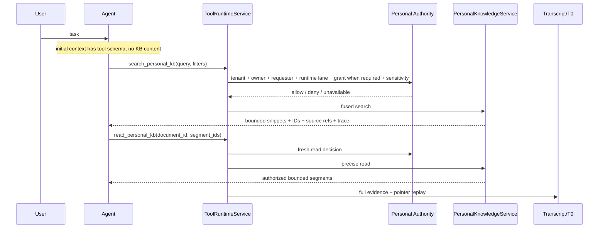
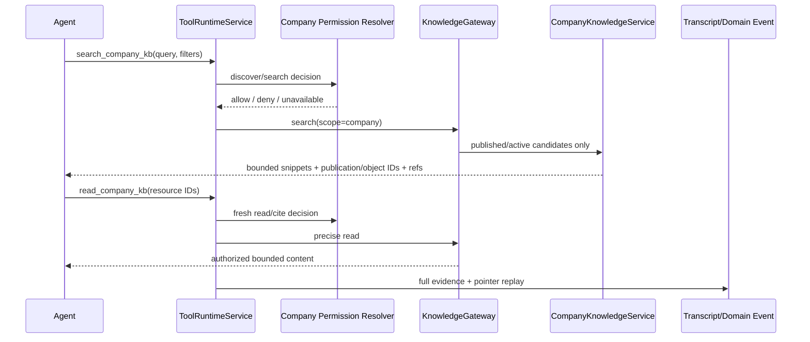

# Personal / Company Knowledge Tool-first 边界契约

> 首版日期：2026-07-10
> 重基线日期：2026-07-14
> 状态：canonical runtime contract
> 当前代码基线：Hive checkout `ff465f3f607a47fe780b2dfbe886b9d3320b166b`
> 范围：Personal KB、Company KB、Agent Memory、Context Assembly、Tool Runtime、Transcript Replay

## 0. 最终决策

Personal KB 和 Company KB 的知识内容必须 **Tool-first**：

1. Agent Turn 开始前，平台不得主动搜索 Personal/Company KB。
2. Knowledge 标题、preview、snippet、分数、source ref、正文不得进入 Base/System Context。
3. Base Context 可以携带当前可用知识工具的 schema；工具存在不等于知识内容已注入。
4. 模型根据任务自主调用 knowledge tools；ToolRuntime 在 effect boundary 执行 tenant/principal/grant/ACL/sensitivity/capability 检查。
5. 当前 Turn 获得完成任务所需的完整 authorized bounded result，不得为了 replay 或 context convenience 只返回 pointer。
6. Durable evidence 保留完整 tool input/output、authority decision、source refs 和 hash；下一 Turn model-visible replay 只保留可重新检索的 pointer。
7. Agent Memory 继续走 governed dynamic activation。Agent Memory 是学习/认知层，不因 Knowledge Tool-first 而被工具化。
8. Company Governance/Charter/RLS/强制策略必须在行动前直接生效，不能降格为 Company KB 可选搜索。

一句话：

> Context Assembly 告诉 Agent“我是谁、当前状态和可用能力”；Knowledge tools 告诉 Agent“Owner 或 Company 的已授权知识是什么”。

本文覆盖所有仍要求 Personal/Company KB prefetch、KB Hint、candidate injection、dynamic suffix knowledge content 或自动 Company retrieval 的旧文档段落。

## 1. 四个不可混淆的平面

| 平面 | Authority owner | 初始上下文 | 读取 | Durable write |
|---|---|---|---|---|
| Agent Memory | Agent + owner/company governance | 可按授权证据动态激活 | Memory runtime | Memory Gate + Platform Gate |
| Personal KB | User/Principal | 知识内容禁止自动进入 | `search_personal_kb -> read_personal_kb` | Owner direct ingest 或 Agent proposal |
| Company KB | Tenant/Company | 知识内容禁止自动进入 | `search_company_kb -> read_company_kb` | Company proposal/review/publish |
| Governance/Charter | Company/Platform | 必须在行动前生效 | Authority/Policy plane | 受治理 policy lifecycle |

Current-turn 用户直接提供的消息、粘贴、附件属于 User Input，不因为未来可能入库而变成 Knowledge tool result。

Company Context 中的 `company_profile.md`、`org_structure.md` 是受信任治理/组织上下文，不是 Company KB 自动检索结果；其内容范围和投影必须由独立 context contract 管理。

## 2. Base Context

### 2.1 允许

- system/developer/project instructions；
- `soul.md`、Agent identity、Owner/Company Charter；
- 当前 session/turn/run state；
- Agent Memory governed activation；
- principal/authority 的必要机械事实与 typed status；
- active/deferred tools metadata；
- Personal/Company Knowledge 工具名称、用途、参数 schema；
- 当前用户显式提供的消息、附件与 steer input。

### 2.2 禁止

- Personal/Company KB 预搜索结果；
- Knowledge 标题、preview、snippet、score、source ref；
- “可能有相关知识”的 KB Hint；
- 关键词/regex 机械触发的 KB 内容；
- 上一 Turn knowledge tool 的完整 body/snippet/score trace；
- 因 owner/tenant 拥有知识而静态加载的目录、热门内容或 profile；
- provider 裸结果；
- 通过 filesystem/canonical artifact path 绕过 Knowledge authority 的内容。

工具不可用时应从 catalog 移除或返回明确 `unavailable/denied/unconfigured`，不得自动注入内容作为补偿。

## 3. Personal KB 读取闭环

Personal read authority 使用下列唯一矩阵；owner-direct PL1–PL3 不因文档 sensitivity 再被 blanket deny，但 typed sensitivity 仍必须传播到 durable evidence、蒸馏、outbound 与审计：

<!-- personal-kb-read-authority-matrix-start -->
| Runtime lane | PL1–PL3 read authority | PL4 result |
|---|---|---|
| Interactive owner-direct turn | Authenticated requester is the owner; owner policy plus `agent_searchable`; explicit grant not required | opaque credential reference only |
| Autonomous owner Agent | unexpired explicit grant bound to requester/Agent, session or task purpose, delegation when applicable, and sensitivity ceiling | opaque credential reference only |
| Shared/cross-user/A2A/subagent | unexpired explicit grant bound to requester, session or task purpose, delegation when applicable, and sensitivity ceiling; owner-Agent relationship alone is insufficient | opaque credential reference only |
<!-- personal-kb-read-authority-matrix-end -->



### 3.1 `search_personal_kb`

职责是发现，返回：

- document/segment ID；
- bounded snippet；
- source ref、heading path、sensitivity；
- score/score trace；
- typed warnings/status。

不负责返回整份文档。

### 3.2 `read_personal_kb`

职责是精确读取：

- `document_id` 必填；
- `segment_ids` 可选；
- 仅在调用方显式给出时使用 `max_chars`；
- 每次调用按同一矩阵重新执行 tenant/owner/runtime-lane/agent_searchable，并在需要 grant 的路径 fresh-check purpose/expiry/delegation/sensitivity ceiling；
- 返回 selected IDs、source refs、`truncated`；
- 不能通过 canonical path/filesystem tool 绕过。

### 3.3 当前实现状态

当前 checkout 已闭合以下边界：

- `search_personal_kb`、`read_personal_kb`、`propose_personal_kb_item` 已注册；
- `runtime/invoker.py` 不在 kernel 前 prefetch/inject Personal KB；
- `_knowledge_tool_replay_projection` 生成 `knowledge_tool_replay.v1`；
- durable tool evidence 保留完整 payload，next-turn pointer 不含 private title/snippet/trace；
- knowledge search/read 是 governed read-only tools。

当前仍应区分：

- Owner 直接 ingest 已实现；
- Agent 自主 durable write 走 Personal proposal；
- Personal -> Company promotion 尚未实现；
- Company search/read/proposal/runtime 尚未实现。

## 4. Company KB 读取闭环

Company 完整实现必须复用相同披露纪律，但使用 Company authority：



Company 特殊规则：

1. 只返回 `published/active`；proposal 对普通 Agent 不可见。
2. discover/search/read/cite 分别判权。
3. tenant、current user、Agent、role/department、resource ACL、source ACL、sensitivity、purpose 取交集。
4. denied object 不泄露 title、数量、graph neighbor、score 或 source URI。
5. Company provider candidate 必须回到 Hive Authority Plane re-fetch/filter。
6. Agent visibility=company、A2A relationship 或 tenant membership 都不是 Knowledge grant。

## 5. Model-visible 工具命名

保持显式 authority：

```text
search_personal_kb
read_personal_kb
propose_personal_kb_item

search_company_kb
read_company_kb
propose_company_kb_update
explain_company_kb_source
```

内部可以共享 `KnowledgeGateway(scope=personal|company)`，但不把一个模糊 `search_knowledge(scope=...)` 暴露给模型。工具名本身是 authority 提示，也便于 capability policy、approval 和 audit 分离。

## 6. Current-turn / Durable Evidence / Replay

### 6.1 三个视图

| 视图 | 内容 | 目的 |
|---|---|---|
| Current-turn model | 完整 authorized bounded result | 完成本轮推理 |
| Durable evidence | 原始 tool input/output、decision、source refs、hash、trace | T0、domain event、audit、recovery |
| Next-turn model replay | query、result count、resource IDs、source refs、content omitted | 防止 KB 内容永久进入后续原始上下文 |

### 6.2 Pointer schema

```json
{
  "schema": "knowledge_tool_replay.v1",
  "tool_name": "search_company_kb",
  "scope": "company",
  "query": "current retention policy",
  "result_count": 2,
  "references": [
    {
      "document_id": "uuid",
      "publication_id": "uuid",
      "segment_id": "uuid",
      "source_ref": "kb://company/..."
    }
  ],
  "content_omitted": true,
  "instruction": "Call search_company_kb/read_company_kb again if the content is needed."
}
```

### 6.3 规则

1. Current Turn 不得因 pointer replay 保护而拿不到正文。
2. Durable evidence 不得因 privacy projection 丢失原始 tool result。
3. Next Turn 不重放 title/snippet/body/score trace/provider payload。
4. 用户在 assistant final 中已经看到的正常 conversation text 仍按 transcript contract 回放。
5. 超长结果使用显式分页、source refs、coverage ledger；不得静默 slice head/tail。
6. compact 后仍可通过 pointer 重新读取，不把 omitted 当作 empty。

## 7. 写入与 Promotion

### 7.1 Personal

| 来源 | 处理 |
|---|---|
| Owner upload/paste/URL/media | governed direct ingest |
| Owner 明确要求 Agent 保存 | 需要 authenticated instruction evidence；可按 Personal policy direct ingest/proposal |
| Agent 自主判断值得沉淀 | Personal proposal，不能直写 owner truth |
| 其他 user/Agent | explicit delegated grant，否则 deny/proposal |

Agent 不能通过自然语言字段自报 `user_directed=true` 绕过 authority。

### 7.2 Personal -> Company

```text
Personal source + pinned revision/hash
  -> authenticated owner consent
  -> Company proposal
  -> Company source ACL/sensitivity/conflict/ontology review
  -> Company publication
```

不允许：scope 翻转、自动同步、Personal grant 升格、员工 profile 普通晋升、Company silent follow private latest。

### 7.3 Company mutation

Agent 只获得 propose 工具。Review/publish/retire/restore/permission mutation 必须由 authenticated Company Control Plane action 或明确 governed workflow 执行，并写 domain evidence。

## 8. Permission 与 unavailable semantics

Knowledge tool 必须区分：

```text
allowed
denied
approval_required
unavailable
unconfigured
degraded
empty
retryable_failure
```

平台返回 typed state、reason code、request/receipt refs 和 retryability；模型负责结合任务向用户解释。禁止用固定平台 prose 替代模型结论，也禁止把 denied/unavailable 伪装成 empty。

## 9. Observability

至少记录：

- tool name/scope/query hash/resource refs；
- principal/delegation/permission decision；
- result count、selected IDs、source refs；
- provider capability/status/latency；
- current-turn payload hash；
- replay projection hash；
- denied/unavailable/empty 区分；
- citation resolution；
- `InvocationSpan`/T0/domain event linkage。

不得把完整敏感正文写入普通日志；正文只保存在受权威约束的 evidence surface。

## 10. 回归与验收

### Personal（当前必须持续通过）

- invoker 不 prefetch/inject Personal KB；
- default retrieval context 不 prefetch knowledge；
- search/read 使用 canonical runtime-lane matrix；需要 grant 的路径 fresh-check purpose/expiry/delegation/sensitivity ceiling；
- current-turn result 完整；
- durable evidence 完整；
- next-turn pointer 无 title/snippet/body/score trace；
- non-knowledge tool replay 不变。

### Company（实现时必须新增）

- Base Context 无 Company content/hint；
- Company tools discoverable 且明确 authority；
- published-only；
- user+agent+role/department+resource+source ACL 交集；
- search/read split permission；
- denied graph/provider side-channel 为 0；
- provider unavailable != denied != empty；
- current-turn/durable/replay 三视图；
- Personal promotion consent；
- no filesystem/provider bypass；
- cross-tenant isolation；
- compact/reconnect/restart 后可重新读取。

## 11. Definition of Done

本契约只有同时满足以下条件才算保持：

1. Agent 在模型判断前看不到任何 Personal/Company KB 内容；
2. authorized knowledge 可被模型自主发现和完整渐进读取；
3. 知识读取经过 ToolRuntime 和唯一 authority resolver；
4. T0/domain evidence 完整，next-turn replay 不永久携带 KB 内容；
5. Agent Memory activation、Company Governance 和 user current-turn input 未被误伤；
6. denied/unavailable/empty/retryable 均是可恢复 typed state；
7. Personal/Company ownership、proposal 和 publication authority 没有合并；
8. tests、tool registry、capability map、runtime projection、UI disclosure 和文档一致。

## 12. 修订记录

- 2026-07-14：将 07-10 的目标修复改为当前 canonical contract；记录 Personal no-prefetch/read/replay 已实现，Company 尚 Missing；补 Company sequence、explicit tool naming、typed unavailable semantics 和 Model Agency Boundary。
- 2026-07-10：首版 Tool-first 决策与 Personal runtime 修复范围。
