# Personal Knowledge Base 完成契约（Open Notebook 对标闭环）

日期：2026-07-08

状态：施工契约。本文不是新产品定义，也不是阶段路线图；它把 `personal-knowledge-base-spec.md` 中已经定义的目标逐项收敛成“必须全部完成”的实现清单。完成标准以当前代码、测试、前端可操作性和文档证据同时满足为准。

## 0. 总判断

当前 Personal KB 已经有薄壳：

- `knowledge_documents`、`knowledge_segments`、`knowledge_entities`、`knowledge_assertions`、`knowledge_links`、`knowledge_index_jobs`、`knowledge_grants` 表已存在。
- Owner scoped `/api/knowledge/personal/` 已支持 Markdown paste、documents list/get/search。
- `search_personal_kb` 工具已注册为 read-only / parallel-safe。
- 基础 owner-or-grant ACL 已进入查询语句。

但 Open Notebook / NotebookLM 级个人知识库还没有闭环。缺口不是 UI 样式，而是这些核心能力尚未实装：

- 多源导入：文件、URL、批量、EPUB、音频、视频。
- 真实摄取管线：queued/running/failed/degraded/ready、重试、成本与进度。
- LLM 抽取：实体、断言、关系、source refs。
- 知识图谱 writer：写入 `knowledge_entities`、`knowledge_assertions`、`knowledge_links`。
- 多通道检索：全文、实体、图扩散、热度/新鲜度、RRF、score trace。
- Runtime 注入：KB 提示行进入模型可见动态后缀。
- 聊天附件顺流：默认入库、单条排除、T0 与 KB refs。
- 授权闭环：grant API、UI 创建/撤销、agent/user/session 过期授权。
- 前端闭环：导入中心、任务状态、文库详情动作、知识网、授权、证据链。

## 1. 对标目标

Open Notebook 的功能结果可以概括为：用户把 sources 放入个人空间，系统把 sources 转成可引用、可检索、可对话的知识单位。Hive Personal KB 的完成形态必须是：

```mermaid
flowchart LR
  A["Source: paste / upload / URL / chat attachment / agent output / audio / video"] --> B["Source Acquisition: auth, path, URL, size, tenant guard"]
  B --> C["DocumentConversionService: canonical Markdown + source_sha256 + warnings"]
  C --> D["Knowledge Index Job: observable pipeline"]
  D --> E["Segments: 500-1000 token target + stable seg_hash"]
  E --> F["LLM Extractor: entities / assertions / links + source refs"]
  F --> G["Alignment: aliases / merged_into tombstone"]
  G --> H["Indexes: tsvector + graph + score stats"]
  H --> I["Search: RRF fusion + ACL + score trace"]
  I --> J["Consumers: /knowledge UI, search_personal_kb, runtime KB hint, future org proposal"]
```



## 2. 完成定义

一项功能只有同时满足以下条件，才算完成：

1. 后端真实能力存在，不允许只放前端按钮或占位文案。
2. 入口走后端唯一真相，不能在前端手写语义。
3. 权限和敏感度在返回前过滤，不能只在 UI 隐藏。
4. 每个 source 必须有 canonical MD、source hash、source refs。
5. 智能步骤由 LLM 或明确 provider 执行；机械处理只能作为可观测 fallback。
6. 失败必须落入 `failed` 或 `degraded`，支持重跑，不允许静默 ready。
7. UI 必须显示真实状态、错误、重试或降级原因。
8. 测试必须覆盖成功、失败、权限、重复入库、重跑、前端操作。
9. 文档必须记录证据：改动文件、测试命令、测试结果、剩余风险。
10. 每个原子项完成后独立 commit。

## 3. 原子项清单

### A1. 文档与验收基线

目标：本文与原 spec 对齐，后续每个原子项都在本文追加证据。

必须完成：

- 在 `personal-knowledge-base-spec.md` 中引用本文为当前施工契约。
- 列出 spec 目标与当前代码差距。
- 保持三层产品边界：Agent Memory、Personal KB、Enterprise KB，不引入第四产品。

证据：

- 本文存在并被 spec 引用。
- `git diff -- docs/personal-knowledge-base-spec.md docs/personal-knowledge-base-completion-contract-2026-07-08.md` 可见清单。

### A2. Personal KB 多源导入 API

目标：Personal KB 不再只吃 Markdown JSON，而是有真实导入中心。

必须完成：

- `POST /api/knowledge/personal/imports`：multipart 文件导入。
- `POST /api/knowledge/personal/import-url`：URL 导入。
- `POST /api/knowledge/personal/documents` 保持 paste 兼容，但内部复用统一 ingestion。
- 支持 `txt`、`md`、`markdown`、`html`、`csv`、`pdf`、`docx`、`xlsx`、`pptx`。
- EPUB 必须验证 MarkItDown 支持；若不稳定，补 explicit extractor 或返回 unsupported 且 UI 不展示为 ready。
- 文件大小、MIME、扩展名、路径、tenant/user 边界受后端校验。

测试：

- 文件上传转 canonical MD 并入库。
- URL 获取后转 canonical MD 并入库。
- 重复文件通过 `source_sha256` 幂等。
- unsupported type 返回结构化错误，不创建 ready 文档。

### A3. 真实 index job 状态机

目标：`knowledge_index_jobs` 成为真实 pipeline 状态，不再直接写 ready。

必须完成：

- Job 状态：`queued`、`converting`、`segmenting`、`extracting`、`aligning`、`indexing`、`ready`、`degraded`、`failed`。
- Job 字段写入 progress、warnings、error、attempt_count、cost metadata。
- `GET /api/knowledge/personal/import-jobs`：列出 job。
- `POST /api/knowledge/personal/import-jobs/{job_id}/retry`：重跑 failed/degraded。
- 转换失败、LLM 抽取失败、部分抽取失败分别落到可观测状态。

测试：

- 成功 job 经过完整状态。
- 转换失败 -> failed。
- 抽取失败但全文可用 -> degraded。
- retry 会增加 attempt_count 并重跑。

### A4. LLM 知识抽取

目标：实现 spec 第 4 步，逐段抽取实体、断言、关系。

必须完成：

- 新增 extractor service，输入为 segment content + metadata，输出 schema 化 JSON。
- 输出至少包含 entities、assertions、links。
- 每条 entity/assertion/link 都保留 source refs：document_id、segment_id、seg_hash、heading_path。
- LLM 失败时不静默，进入 degraded/failed。
- 提示词遵守 AI-Native：完整段落视野、结构化输出、可追溯证据。

测试：

- fake LLM 返回 entities/assertions/links 后写入草稿。
- malformed LLM output 进入 degraded 且保留 warning。
- PL/sensitive 文档不会泄露到未经授权的 extractor 外部上下文。

### A5. 图谱 writer 与对齐

目标：`knowledge_entities`、`knowledge_assertions`、`knowledge_links` 不再是空表。

必须完成：

- Upsert entity by tenant/scope/type/canonical_name。
- aliases 合并；`merged_into_entity_id` 作为 tombstone，支持回滚语义。
- Upsert assertions by subject/predicate/object/source refs。
- Upsert links by from/to/relation/source refs。
- 同一文档重建索引时清理旧图谱投影并写入新投影。

测试：

- 首次写入创建 entity/assertion/link。
- 重复导入不重复创建。
- 改版重索引清理旧投影。
- alias merge 写入 aliases 与 merged tombstone。

### A6. 融合检索服务

目标：实现 spec §5.1 的 KnowledgeSearchService。

必须完成：

- 全文通道：tsvector + ilike fallback。
- 实体通道：匹配 canonical_name / aliases。
- 图扩散通道：从实体命中出发，经 `knowledge_links` 做 PPR 或受限多跳扩散。
- 热度/新鲜度 boost：引用次数、更新时间、用户交互。
- RRF 融合：每个结果返回 `score_trace`。
- 过滤顺序：先候选，后 ACL/sensitivity/agent_searchable，返回前绝不泄露。

测试：

- text-only 命中。
- entity 命中带出相关段落。
- graph expansion 命中相邻知识。
- ACL 过滤后 `score_trace` 不泄露被过滤对象。

### A7. Runtime KB 提示行

目标：Personal KB 的轻召回结果进入模型可见上下文，而不是只写 observability。

必须完成：

- 在 prompt cache anchor 之后的动态后缀区注入 top-3 KB hint。
- 空结果不注入。
- 注入内容小于 200 tokens，包含 title、document_id/source_ref、简短理由，不注入正文。
- 注入发生在 kernel request 进入模型前。
- 与 Hook Additional Context、Memory activation、Skill loading 不冲突。

测试：

- 有 KB 命中时 system_prompt_suffix 包含 KB hint。
- 无命中时 suffix 不变。
- 注入位置不破坏固定 prompt cache anchor。

### A8. `search_personal_kb` 工具升级

目标：工具返回与 UI search 使用同一 fused search，不只是全文。

必须完成：

- 工具调用 `KnowledgeSearchService`。
- 返回 top-k 段落、source refs、score_trace、warnings。
- 大结果走 envelope/artifact 规则。
- `filters` 支持 sensitivity/source_kind/document_id。

测试：

- 工具注册仍 read-only/parallel-safe。
- 工具结果包含 `score_trace`。
- 超限结果进入 artifact envelope。

### A9. 聊天附件顺流入库

目标：丢给 agent 的文件默认进入 Personal KB，且用户可单条排除。

必须完成：

- Chat upload response 增加 `personal_kb_candidate` / `skip_personal_kb` 控制。
- 默认入库：文档类附件转换后注册 Personal KB。
- 图片/音频/视频根据当前可支持 modality 进入 pending/degraded 或 unsupported，不伪装 ready。
- origin 记录 `agent:<id>`、session_id、message_id、T0 source refs。
- 同一文件给多个 agent，库内保持一份 truth，多条引用边。

测试：

- 上传文档默认创建 Personal KB job。
- skip 不创建 job。
- 同 hash 重复上传只增加 refs。

### A10. 授权管理 API

目标：`knowledge_grants` 从底表变成可操作权限系统。

必须完成：

- `GET /api/knowledge/personal/grants`
- `POST /api/knowledge/personal/grants`
- `DELETE /api/knowledge/personal/grants/{grant_id}`
- 支持 grantee_type：`user`、`agent`、`session`。
- 支持 resource：scope/document。
- 支持 permission：read/search/manage。
- 支持 expires_at。
- Owner 可管理；非 owner 不能越权创建 grant。

测试：

- owner 创建/删除 agent grant。
- 非 owner 创建 grant 被拒绝。
- 过期 grant 不再生效。

### A11. 前端导入中心与文库详情

目标：`/knowledge` 变成真实可用页面。

必须完成：

- 横向主导航保留；收集箱显示拖拽上传、文件类型卡、URL 导入、paste。
- 支持上传进度、job 状态、失败重试、degraded 原因。
- 文库列表显示 source kind、状态、segments、entities、引用者、agent_searchable。
- 详情页按钮可操作：重建索引、敏感度、agent 检索开关、归档。
- 不展示后端不支持的格式为 ready 能力。
- i18n 中英都更新。

测试：

- 上传 UI 调用 imports API。
- URL UI 调用 import-url API。
- job retry UI 调用 retry API。
- detail action 调用 PATCH/rebuild/archive。

### A12. 知识网与授权 UI

目标：去掉图谱和授权占位。

必须完成：

- 知识网 M1：实体列表、实体邻居、关联段落、source refs。
- 授权：agent/user/session grant 列表、创建、撤销、过期时间。
- 画像 plane 仍归 Personal Knowledge 内部；如果后端未产出 profile，就显示后端真实空状态，不手写语义。

测试：

- graph lane 从 API 渲染实体/链接。
- grants lane 创建/删除授权。
- 空状态不伪装完成。

### A13. 音频、视频与图片摄取

目标：对齐 Open Notebook 的 audio/video source 能力，但必须真实。

必须完成：

- 音频：mp3/wav/m4a/ogg -> transcription job -> canonical MD transcript。
- 视频：mp4/mov/webm -> audio extraction/transcription；可选 keyframe/vision OCR 作为 warning-gated supplement。
- 图片：png/jpg/webp -> OCR/vision summary；无法 OCR 时 degraded。
- 所有 media job 都有 cost、duration、provider、warnings。
- 没有 provider credential 时返回 `unsupported_or_unconfigured`，UI 显示未配置，不生成 ready 文档。

测试：

- fake transcription provider 生成 transcript 并入库。
- provider 未配置返回可观测状态。
- 大视频走 async job，不阻塞请求。

### A14. 效果验收与三轮复查

目标：不能再用绿测试替代完成。

必须完成：

- 单元测试：service/API/tool/frontend。
- 集成测试：真实或测试 PG 下 migration + RLS + Personal KB ingest/search。
- E2E：上传、搜索、agent tool search、runtime KB hint、grant。
- 三轮复查：
  1. Spec checklist 逐项 grep/code review。
  2. API/UI route walkthrough。
  3. Regression test + manual browser verification。

## 4. 证据日志

每个原子项完成后在此追加：

```text
日期：
原子项：
改动文件：
测试命令：
测试结果：
commit：
剩余风险：
```

### 2026-07-08 A1 文档与验收基线

改动文件：

- `docs/personal-knowledge-base-completion-contract-2026-07-08.md`
- `docs/personal-knowledge-base-spec.md`

测试命令：

```bash
git diff -- docs/personal-knowledge-base-spec.md docs/personal-knowledge-base-completion-contract-2026-07-08.md
```

测试结果：

- `docs/` 被 `.gitignore` 整目录忽略；`git diff -- docs/...` 默认无输出。
- 已用 `sed`/`ls` 验证本文存在，且 `personal-knowledge-base-spec.md` 已引用本文。
- 本原子项提交时需使用 `git add -f` 精确加入两份 docs 文件。

commit：

- 本提交：`personal-kb completion contract baseline`。

剩余风险：

- 无实现变更；后续原子项必须逐项清零。

### 2026-07-08 A2/A3 多源导入 API 与真实 job 状态机骨架

改动文件：

- `backend/app/api/agent_knowledge.py`
- `backend/app/services/personal_knowledge_service.py`
- `backend/tests/api/test_agent_personal_knowledge_api.py`
- `backend/tests/services/test_personal_knowledge_service.py`
- `docs/personal-knowledge-base-completion-contract-2026-07-08.md`

功能证据：

- 新增 owner-scoped `POST /api/knowledge/personal/imports`，接收 multipart 文件，后端读取 bytes 后进入 `PersonalKnowledgeService.ingest_source_bytes()`。
- 新增 `POST /api/knowledge/personal/import-url`，后端 source acquisition 后进入同一 bytes ingestion。
- 新增 `GET /api/knowledge/personal/import-jobs` 与 `POST /api/knowledge/personal/import-jobs/{job_id}/retry`。
- 新增 `PATCH /api/knowledge/personal/documents/{document_id}` 与 `POST /api/knowledge/personal/documents/{document_id}/rebuild-index`。
- `PersonalKnowledgeService` 支持可注入 `DocumentConversionService`，文件导入使用 `convert_bytes()` 生成 canonical Markdown。
- unsupported file type 会创建 failed document + failed job，不伪装 ready。
- `PersonalKnowledgeIngestResult` 返回 `job_id` 与 warnings，job metadata 记录 source kind、filename、conversion engine、warnings。

测试命令：

```bash
cd backend && source .venv/bin/activate && pytest tests/api/test_agent_personal_knowledge_api.py tests/services/test_personal_knowledge_service.py -q
```

测试结果：

```text
21 passed in 0.45s
```

commit：

- 本提交：`feat: add personal kb import job endpoints`。

剩余风险：

- A2/A3 当前完成的是同步执行的 job 状态机骨架；A4/A5 会继续把 LLM extraction、graph writer、degraded 细分状态挂入同一 job。
- EPUB、音频、视频、图片在 A13 统一处理；当前 supported import guard 只打开已由本地转换层稳定覆盖的文档格式。

### 2026-07-08 A4/A5 LLM 知识抽取与图谱 writer

改动文件：

- `backend/app/services/personal_knowledge_extractor.py`
- `backend/app/services/personal_knowledge_service.py`
- `backend/tests/services/test_personal_knowledge_service.py`
- `docs/personal-knowledge-base-completion-contract-2026-07-08.md`

功能证据：

- 新增 `PersonalKnowledgeLLMExtractor`，生产默认复用租户 summary/default model 配置，并通过 `create_llm_client_from_config()` 走现有 LLM client/usage metering。
- extractor 输入是完整 segment content + document metadata + source_ref；输出 strict JSON schema：entities、assertions、links、warnings。
- `ingest_markdown()` 现在会在写入 canonical MD 和 segments 后执行 graph extraction，并写入 `knowledge_entities`、`knowledge_assertions`、`knowledge_links`。
- 每条图谱投影都带 source refs：`document_id`、`segment_id`、`seg_hash`、`heading_path`、`position`。
- entity 按 tenant/scope/type/canonical_name upsert；aliases 合并，并对 alias 既有实体写 `merged_into_entity_id` tombstone。
- assertions 按 subject/predicate/object upsert，并写 `source_document_id`。
- links 按 from/to/relation upsert，并保留 source refs。
- 同一文档重建前会清理 assertions/links 旧投影；entity 作为 person-scope canonical projection 保留并合并 source refs。
- LLM/抽取失败时 document/job/result 进入 `degraded`，全文 segment 和 tsvector 仍可用，不再伪 ready。
- 高敏 `private/secret/restricted/pl3/pl4/credential` 默认跳过外部抽取并 degraded，避免把高敏内容发给未确认的外部模型。

测试命令：

```bash
cd backend && source .venv/bin/activate && pytest tests/services/test_personal_knowledge_service.py -q
cd backend && source .venv/bin/activate && pytest tests/api/test_agent_personal_knowledge_api.py tests/services/test_personal_knowledge_service.py -q
```

测试结果：

```text
15 passed in 0.16s
23 passed in 0.44s
```

commit：

- 本提交：`feat: extract personal kb graph projections`。

剩余风险：

- A6 会把这些图谱投影接入检索融合；当前 search 仍主要走全文通道。
- A13 会补 media source 的真实 transcription/OCR provider；当前 A4/A5 只处理 canonical Markdown segment 的知识抽取。

### 2026-07-08 A6/A7/A8 融合检索、Runtime KB hint 与工具统一入口

改动文件：

- `backend/app/services/personal_knowledge_service.py`
- `backend/app/tools/handlers/knowledge.py`
- `backend/app/runtime/retrieval/personal_knowledge_provider.py`
- `backend/app/runtime/invoker.py`
- `backend/tests/services/test_personal_knowledge_service.py`
- `backend/tests/tools/test_personal_knowledge_tool.py`
- `backend/tests/runtime/test_personal_knowledge_provider.py`
- `backend/tests/runtime/test_personal_knowledge_activation.py`
- `backend/tests/runtime/test_invoker.py`
- `docs/personal-knowledge-base-completion-contract-2026-07-08.md`

功能证据：

- `PersonalKnowledgeService.search_personal()` 不再只跑全文单通道；现在执行全文、实体、图扩散三类候选，按 RRF 融合排序。
- 全文通道继续使用 `tsvector + ilike/title fallback`，并允许 `ready/degraded` 文档参与搜索，因为 degraded 仍有 canonical MD 与 segments。
- 实体通道读取 `knowledge_entities.canonical_name/aliases_json`，通过 `source_refs_json.segment_id` 回到段落。
- 图扩散通道从实体命中的 `knowledge_links.from_id/to_id` 出发，通过 link source refs 回到相关段落。
- 返回 `score_trace`：每个 channel 的 rank/raw_score、RRF、heat/freshness boost、final score、document status。
- `search_personal_kb` 工具复用同一 search service，并返回 `score_trace`。
- Runtime `PersonalKnowledgeCandidateProvider` 把 `score_trace` 写入 candidate metadata，保留召回证据。
- `_record_knowledge_activation_for_request()` 现在返回 top-3 `## Personal Knowledge Hint`，包含 title、source_ref、score、短 preview，不注入正文。
- `invoke_agent()` 在 kernel 调用前把 KB hint 追加到 `kernel_request.system_prompt_suffix`，因此模型实际可见；空召回不注入。

测试命令：

```bash
cd backend && source .venv/bin/activate && pytest tests/services/test_personal_knowledge_service.py tests/tools/test_personal_knowledge_tool.py tests/runtime/test_personal_knowledge_provider.py tests/runtime/test_personal_knowledge_activation.py tests/runtime/test_invoker.py::test_invoke_agent_builds_activation_query_after_user_prompt_submit_before_kernel tests/runtime/test_invoker.py::test_invoke_agent_injects_personal_kb_hint_before_kernel -q
cd backend && source .venv/bin/activate && ruff check app/services/personal_knowledge_service.py app/runtime/invoker.py app/runtime/retrieval/personal_knowledge_provider.py app/tools/handlers/knowledge.py tests/services/test_personal_knowledge_service.py tests/tools/test_personal_knowledge_tool.py tests/runtime/test_personal_knowledge_activation.py tests/runtime/test_invoker.py
```

测试结果：

```text
23 passed, 4 warnings in 0.39s
All checks passed!
```

commit：

- 本提交：`feat: fuse personal kb retrieval into runtime`。

剩余风险：

- 当前 Personal KB 仍未引入向量库；这是符合薄内核路线的选择。企业 KB 阶段再决定 pgvector/Ontology 深化。
- UI 还需要在 A11/A12 展示 `score_trace`、graph lane 和真实授权入口。

### 2026-07-08 A10 授权管理 API

改动文件：

- `backend/app/api/agent_knowledge.py`
- `backend/app/services/personal_knowledge_service.py`
- `backend/tests/api/test_agent_personal_knowledge_api.py`
- `backend/tests/services/test_personal_knowledge_service.py`
- `docs/personal-knowledge-base-completion-contract-2026-07-08.md`

功能证据：

- 新增 owner-scoped `GET /api/knowledge/personal/grants`，返回当前 owner personal scope 下的 grant 列表。
- 新增 `POST /api/knowledge/personal/grants`，支持 `resource_type=scope/document`、`grantee_type=user/agent/session`、`permission=read/search/manage`、`expires_at` 与 metadata。
- 新增 `DELETE /api/knowledge/personal/grants/{grant_id}`，owner 可撤销 personal grant。
- service 层统一校验 owner 边界；非 owner 不创建 grant。
- grant upsert 会复用同一 tenant/scope/resource/grantee/permission 组合，避免重复授权记录。

测试命令：

```bash
cd backend && source .venv/bin/activate && pytest tests/api/test_agent_personal_knowledge_api.py tests/services/test_personal_knowledge_service.py -q
cd backend && source .venv/bin/activate && ruff check app/api/agent_knowledge.py app/services/personal_knowledge_service.py tests/api/test_agent_personal_knowledge_api.py tests/services/test_personal_knowledge_service.py
```

测试结果：

```text
27 passed in 0.46s
All checks passed!
```

commit：

- 本提交：`feat: add personal kb grant management`。

剩余风险：

- 授权 UI 在 A12 完成；当前 A10 是后端唯一真相入口。
