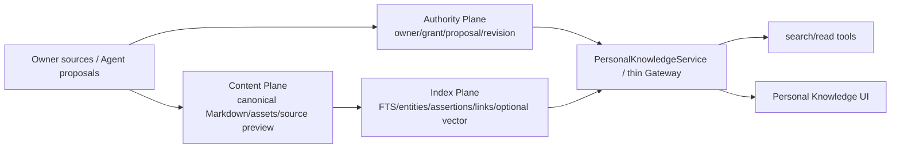

# Hive Personal Knowledge Base 实施规格

> 首版日期：2026-07-03
> 重基线日期：2026-07-14
> 状态：Personal 产品/架构 canonical spec；实现证据以 completion contract 和 current checkout 为准
> Runtime 边界：Personal Knowledge 严格 Tool-first，不 prefetch、不注入 KB Hint

## 0. 文档关系

- `docs/personal-knowledge-base-completion-contract-2026-07-08.md`：当前实现证据与验收账本；
- `docs/personal-company-knowledge-tool-boundary-2026-07-10.md`：search/read/current-turn/replay canonical contract；
- `docs/knowledge-substrate-plugin-architecture-2026-07-09.md`：Authority/Content/Index 与 thin Gateway；
- `docs/knowledge-pyramid-agent-person-org-2026-07-03.md`：Agent -> Personal -> Company ownership chain；
- `docs/company-knowledge-base-spec-2026-07-07.md`：Personal -> Company promotion 与 Company authority；
- `docs/runtime-model-agency-constraint-audit-2026-07-13.md`：Model Agency Boundary。

本文覆盖初版中的：KB 提示行、自动 prefetch、Personal profile 常驻注入、person->org scope 翻转、M1/M2/M3 阶段计划和 pgvector 前置要求。

## 1. 定位

Personal KB 是 user/principal-owned canonical workspace：

- 接收 Owner 直接上传、URL、粘贴、媒体和聊天附件；
- 保存 Owner 认可的 Agent 产物；
- 为多个被授权 Agent 提供同一知识工具面；
- 保存 source refs、revisions、entities/assertions/links 和 grants；
- 作为 Company proposal 的可选来源。

Personal KB 不是：

- Agent Memory；
- 每个 Agent 各自的索引；
- Company KB 的预发布目录；
- 自动进入所有 Agent prompt 的 owner profile/热门知识；
- Company truth 的同一行不同 scope。

## 2. 当前真实状态

当前 checkout 已有：

- `knowledge_documents / segments / entities / assertions / links / index_jobs / grants`；
- canonical Markdown artifacts 与 source hashes；
- paste/upload/URL/media 等 ingestion surface 与 observable jobs；
- full-text/entity/graph retrieval 与 optional vector provider；
- owner-or-grant access、sensitivity、agent_searchable；
- `/api/knowledge/personal/*` 与 Agent read surface；
- `search_personal_kb`、`read_personal_kb`、`propose_personal_kb_item`；
- Personal proposal/review/commit/rollback metadata；
- Personal Knowledge UI、source preview、graph、grants、proposals；
- `knowledge_tool_replay.v1` pointer projection；
- no-prefetch/no-hint runtime regressions。

完成状态不能由本文声明；以 current code consumption path、tests 和 `personal-knowledge-base-completion-contract-2026-07-08.md` 为证据。

## 3. Authority / Content / Index



### Authority

- owner 是最终责任主体；
- Agent 只是被委托 actor；
- Owner direct ingest 与 Agent autonomous proposal 分离；
- grant/sensitivity/source policy 在返回前生效；
- revisions/rollback/tombstone 可审计。

### Content

- canonical Markdown 是 human/LLM-readable artifact；
- original source、conversion metadata、source preview 与 hash 可追溯；
- Living Object 保存 pinned reference，不复制 Dataset/Deck 内部 truth；
- 文件/对象 bytes 可以外置，但 Authority Plane 保留稳定 ref。

### Index

- PostgreSQL full-text；
- entities/assertions/links；
- bounded graph expansion/PPR；
- heat/freshness/score trace；
- optional vector provider。

Index 全部可重建，不拥有 owner、grant、proposal 或 content truth。

## 4. 输入与摄取

支持：

```text
paste
file upload
URL
chat attachment
audio/video/image conversion
Owner-approved Agent output
Living Object reference
```

统一过程：

```text
authenticated input
  -> source acquisition / size/path/URL/tenant guard
  -> canonical artifact + source hash
  -> observable index job
  -> complete segment coverage
  -> LLM extraction of entities/assertions/links
  -> alignment candidates
  -> derived indexes
  -> ready/degraded/failed typed state
```

LLM 负责语义 extraction/alignment/synthesis；平台负责 schema、authority、hash、idempotency、evidence、job state 和 commit。机械 fallback 不生成 semantic truth。

## 5. 读取：严格 Tool-first

### 5.1 Initial context

Initial/Base Context 只携带 knowledge tool schema，不携带 Personal KB title、preview、snippet、score、source ref、profile 或 hint。

Personal read authority 使用下列唯一矩阵；`sensitivity` 在 owner-direct 路径仍进入 evidence、持久化、蒸馏、outbound 与审计策略，但不是 PL1–PL3 的第二个 blanket read deny：

<!-- personal-kb-read-authority-matrix-start -->
| Runtime lane | PL1–PL3 read authority | PL4 result |
|---|---|---|
| Interactive owner-direct turn | Authenticated requester is the owner; owner policy plus `agent_searchable`; explicit grant not required | opaque credential reference only |
| Autonomous owner Agent | unexpired explicit grant bound to requester/Agent, session or task purpose, delegation when applicable, and sensitivity ceiling | opaque credential reference only |
| Shared/cross-user/A2A/subagent | unexpired explicit grant bound to requester, session or task purpose, delegation when applicable, and sensitivity ceiling; owner-Agent relationship alone is insufficient | opaque credential reference only |
<!-- personal-kb-read-authority-matrix-end -->

### 5.2 Search

```text
search_personal_kb(query, filters?, top_k?)
```

职责：发现 relevant authorized segments，返回 bounded snippet、document/segment IDs、source refs、sensitivity、score trace 和 typed warnings。

融合可包括：

- full-text；
- entity match；
- graph expansion；
- heat/freshness；
- optional vector candidates；
- RRF/equivalent explainable fusion。

所有 candidates 在 model-visible return 前执行上述 runtime-lane authority decision 与 `agent_searchable` filter；需要 grant 的路径还必须 fresh-check purpose、expiry、delegation 和 sensitivity ceiling。PL4 不进入 Knowledge 正文结果。

### 5.3 Read

```text
read_personal_kb(document_id, segment_ids?, max_chars?)
```

职责：fresh authorization 后精确读取 selected segments。返回完整 bounded content、selected IDs、source refs 与 `truncated`。不得使用 filesystem/canonical path 绕过。

### 5.4 Replay

- current-turn model：完整 authorized bounded result；
- durable evidence：完整 tool input/output/authority/source refs/hash；
- next-turn replay：`knowledge_tool_replay.v1` pointer，不含 title/snippet/body/score trace。

## 6. 写入与 Proposal

| 来源 | Authority path |
|---|---|
| Owner upload/paste/URL/media | governed direct ingest |
| Owner authenticated instruction to Agent | 按 Personal policy direct ingest 或 proposal，保留 instruction event |
| Agent autonomous candidate | `propose_personal_kb_item`，Owner/policy review |
| Other Agent/user | explicit delegated write grant，否则 deny/proposal |

Agent 不能通过自然语言参数自报“用户已经要求”绕过 authority。Personal proposal 需要 source refs、content hash、diff、purpose、sensitivity、idempotency、policy outcome、review 和 rollback ref。

## 7. Personal -> Company

Personal record 不原地翻转成 Company scope。

```text
Personal document/segment/Living Object revision
  -> authenticated owner consent
  -> Company proposal with pinned source hash/revision
  -> Company review
  -> independent Company publication
```

规则：

- Personal source 和 grants 保持不变；
- Company publication 拥有自己的 ACL/version/retention/rollback；
- profile/behavior/private data 默认不走普通 promotion；
- Agent 不能自提自批；
- Personal source 后续变化不让 Company silent follow。

## 8. Personal Profile 边界

Personal profile 可以作为 owner 自阅/纠正的 Personal product surface，但 **不自动进入 Agent initial context**。

- Agent 对 owner 的稳定学习仍来自其自身 governed Agent Memory activation；
- Personal profile 若需被 Agent 使用，应通过明确 tool/read contract 与 grant；
- profile correction 可以成为 Agent Memory/Personal proposal 的 evidence，但不能机械改写所有 Agents 的 semantic memory；
- profile promotion 到 Company 默认禁止。

## 9. Permission

Personal read/write 取以下交集：

```text
tenant/RLS
owner/current user
actor Agent delegation
KnowledgeGrant
agent_searchable
sensitivity/source policy
session/purpose/expiry
requested action
```

支持并区分 discover/search/read/cite/propose/manage/export。Personal 不使用 Company role/department/publish authority，也不因为 Agent visibility=company 自动授权。

## 10. UI

Personal Knowledge 是用户级 workspace，应提供：

- Inbox/import jobs；
- Library/document detail/source preview/revisions；
- Search/citations/score trace；
- Knowledge graph；
- Grants/Agent access；
- Proposals/review/diff；
- Profile self-view/correction；
- Company promotion proposal entry；
- capability/degraded/error/retry status。

UI 只消费真实 API/read model，不提供无后端能力的假按钮。

## 11. Provider

Provider/index 都是可拔 derived capability：

- 当前 Personal baseline 不要求 pgvector；
- optional vector provider 必须在 SQL authority filter 后融合；
- provider 输出绑定 Hive document/segment IDs 和 source refs；
- provider unavailable、unconfigured、degraded、empty 与 denied 分开；
- 选择 SAG/Graphiti/其他 provider 需当前实核和统一 eval，不在本 spec 固定。

## 12. 七原子验收

| 原子 | Personal 完成要求 |
|---|---|
| Input | 多源 authenticated ingest、canonical artifact、job/retry/dedupe |
| Authority | canonical runtime-lane matrix + owner/agent_searchable + required grant/purpose/expiry/delegation/sensitivity ceiling |
| Execution | API/UI/tools 共享 Personal domain service，无 filesystem/provider bypass |
| Evidence | source refs/hash/job/proposal/revision/tool/T0/span |
| Recovery | retry/cancel/reindex/rollback/revoke/delete/tombstone |
| Consumption | Owner UI 与 authorized Agent search/read/propose 真实消费 |
| Acceptance | migration/RLS/unit/API/tool/runtime/frontend/E2E/fault tests |

## 13. 不变量

1. Personal KB 和 Agent Memory 互不接管。
2. Knowledge 内容只通过 tools 进入当前 Turn。
3. Owner 直接写与 Agent proposal 的 authority evidence 不混淆。
4. Index 可重建，provider 不拥有 truth。
5. Unauthorized bytes 不进入 model-visible result、trace summary 或 graph side channel。
6. Current-turn evidence 不因 replay 保护而缩水；next-turn 不永久回放 KB content。
7. Personal -> Company 创建新 authority record，不 scope flip。
8. 所有工具走 ToolRuntime/capability governance。
9. denied/unavailable/unconfigured/degraded/empty 是不同 typed state。
10. 完成声明以 current checkout 七原子证据为准，不以本文或 UI shell 为准。

## 14. 验证入口

```bash
cd /Users/rocky243/vc-saas/hiveclaw-main/backend
source .venv/bin/activate
pytest -q \
  tests/migrations/test_personal_knowledge_core_migration.py \
  tests/integration/test_personal_knowledge_proposals.py \
  tests/services/test_personal_knowledge_service.py \
  tests/tools/test_personal_knowledge_tool.py \
  tests/runtime/test_invoker.py \
  tests/services/test_web_chat_runtime.py
```

前端验证以 `PersonalKnowledge`、knowledge API domain、Agent detail knowledge consumption 相关 tests 加 `npm run build` 为准。实际完成结论必须记录本次运行结果，不能复制历史数字。

## 15. 修订记录

- 2026-07-14：按当前实现重写；移除 KB Hint/prefetch/profile 常驻注入、scope flip、M1/M2/M3、pgvector 前置和旧 provider 快照；加入 search/read/replay、Personal proposal、Company promotion、typed capability 与七原子。
- 2026-07-03：初版 Personal Wiki 实施规格。
