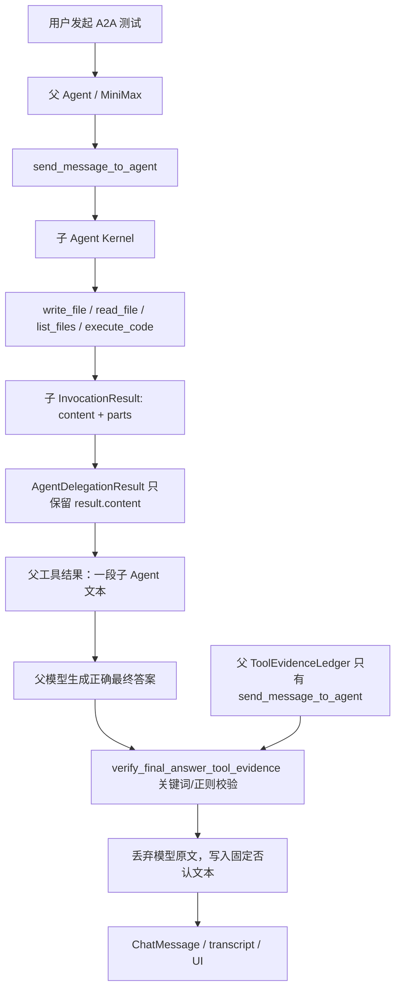
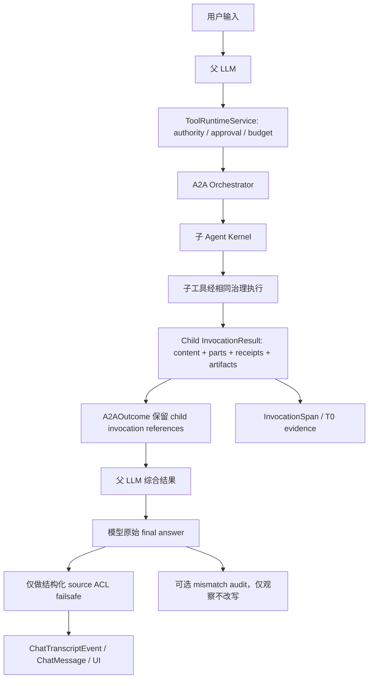
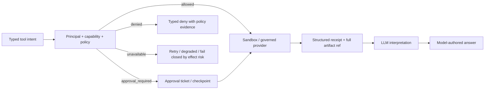

# Hive Runtime 模型自主性与过度约束审计、单轮修复与验收记录

> 日期：2026-07-13
> 文档状态：**当前 checkout 的 C-01 至 C-20 已完成单轮修复；普通本地验收已通过；production 三服务已部署成功；历史数据 apply 未执行**
> 审计与修复对象：当前 checkout；事故证据来自当时 Railway production 三服务、生产会话与调用记录；对照基线为当前本地 FreeCode / Codex 源码
> 本轮边界：完成代码、测试、前后端消费契约、根规范、production 三服务部署与本文闭环；不对生产消息执行历史修复

## 0. 最终裁决

这次截图里的 A2A **没有失败**。失败发生在 A2A 已经成功、父 Agent 也已经生成正确答案之后：Hive 又执行了一次平台侧语义校验，错误地把父 Agent 的最终答案替换成固定文本：

> 我不能确认刚才的工具状态：本轮没有实际工具调用记录……

因此，截图里 “Thinking 已经成功” 与 “最终回答又说无法确认” 并不矛盾。它们分别来自两个不同阶段：

1. MiniMax 已收到 A2A 子 Agent 的成功结果，并生成了正确的最终回答；
2. `verify_final_answer_tool_evidence()` 在模型输出之后运行；
3. 该函数只认父 Agent 当前轮的直接工具账本，不认 A2A 子调用内部的 `write_file`、`read_file`、`list_files`、`execute_code` 证据；
4. 它通过关键词和正则猜测最终回答是否在“声称工具成功”；
5. 猜中关键词但匹配不到父层直接工具名后，平台丢弃模型原文，写入固定否认文本。

这不是 MiniMax、A2A transport、子 Agent 文件工具或 Railway 超时问题，而是 **Hive 自己增加的 post-hoc final-answer rewriter 误判**。

本审计的核心决策是：

> **平台治理模型可以做什么，不能替模型决定它可以说什么、怎么理解已经观察到的证据。**

具体裁决：

- **删除** `verify_final_answer_tool_evidence()` 的在线回答改写能力，并删除相关关键词/正则判定；
- `ToolEvidenceLedger` 保留为 span、event、审计和调试事实源，不能再成为“模型是否有资格说这句话”的许可证；
- A2A 必须把子调用的结构化 receipt / invocation reference 保留到父调用，而不是只把 `result.content` 压成一段文本；
- 权限、审批、租户隔离、sandbox、secret isolation、MCP authz、显式预算等治理继续保留，而且仍需 fail closed；
- prompt 关键词删除、重复工具硬中止、sandbox 外再做字符串黑名单、客户端回显 hash、Memory 不可用就完全阻止模型、Skill/Soul 机械截断等机制，按本文清单分别删除、降级或重构。

这不是“取消安全”。这是把安全重新放回正确边界：**行动之前约束 authority / effect，行动之后忠实记录 evidence；不要在模型完成推理后用字符串规则替它发言。**

### 0.1 当前 checkout 闭环结论

本文最初记录的是审计时断点；当前 checkout 已按同一份施工图完成 C-01 至 C-20 的单轮修复。最终复扫还补齐了以下同源残留：

- IM 权限授权不再扫描任意自然语言中的“允许/批准/allowed”等子串；只有 authenticated structured action 或显式、锚定的命令语法可改变权限；
- Workflow 完成状态、步骤计数不再生成 `promotion_eligible`；产品只消费 `model_promotion_review` 或显式人工 review；
- Skill invocation 的 runtime `completed` 不再被平台解释成 Skill `success`；没有模型声明时保持 `unknown`；
- Knowledge 页的 PL3 不再由 `salary/medical/financial` 等主题词猜测，改由写入侧显式 sensitivity metadata；精确 credential/PII 识别仍保留为数据安全边界；
- Coordinator 的 fresh-worker、同文件必串行、固定报告模板不再是硬规则；它们是非绑定策略提示，由模型结合冲突、证据与成本判断；
- Skill Distiller 给模型的工作流名称提示不再只保留前三步或前 120 字符。

当前 checkout 已以 commit `4b9e96820100cc8f374cd0fa20a317ad9ec32a99` 部署到 Railway production 的 `backend`、`backend-api`、`frontend`。这证明本轮 source freshness 已进入生产，但不自动等于 production-like A2A、故障注入、新调用指标和历史 77 条错误消息回填均已验收；这些行为与数据操作仍按各自证据和授权单独收口。

---

## 1. 审计范围与完整性边界

### 1.1 本次覆盖的完整运行链

本审计按一次 Agent turn 的真实生命周期向前、向后追踪，覆盖：

1. 用户输入与 trusted context 组装；
2. model route、context budget 与 Memory availability；
3. tool discovery、tool eligibility、coordinator mode；
4. tool governance、hook、approval、sandbox、code execution；
5. A2A / subagent 调用、深度与循环、结果回传；
6. Plan Mode / HR 创建确认与 hash 绑定；
7. Memory / Soul / Skill 的 LLM 输入、机械 fallback 与静态拦截；
8. tool result 持久化、eviction 与恢复指针；
9. source ACL 与最终回答落盘；
10. transcript、InvocationSpan、前端最终消费。

在上述 runtime/session 核心链内，本文件列出当前发现的 **20 组语义或能力限制**，并逐一给出 `删除 / 降级 / 重构 / 保留` 裁决。第二轮 current-checkout 复核新增 C-18 至 C-20，分别覆盖 runtime prompt 二次裁剪、session compaction 证据删除、以及 Memory/Soul 的机械语义 fallback。

### 1.2 不把正常治理误算为“过度限制”

以下内容不属于本次要移除的对象：

- tenant / RLS / principal / delegation authority；
- 对外发送、不可逆操作、敏感数据访问的审批；
- Vercel Sandbox / OS sandbox、host secret isolation；
- MCP token passthrough、URL userinfo 和未授权 credential 的拒绝；
- 用户取消、最大工具轮数、明确成本预算、provider context window；
- A2A cycle detection、最大深度、总预算与幂等恢复；
- 文件快照、事务、single-use ticket、回滚和 replay protection；
- 外部 Skill / MCP 的导入 quarantine、管理员审核和 capability assignment；
- 服务器内部 canonical hash、input hash、idempotency hash。

这些机制约束的是 **authority、side effect、resource 与 recovery**，不是替代模型的语义判断。

### 1.3 当前完成声明的边界

- 本文确认当前 checkout 已修复，并以 targeted regression、全量 backend、全量 frontend、lint 和 build 作为本地验收证据；不把旧测试期望当成架构权威。
- 本文不声称历史 77 条错误回答都可以无损恢复；当前只交付 exact-match、可审计、默认 dry-run、`--apply --confirm` 双门槛的修复工具，未对生产执行。
- Railway production 三服务已经部署本次 commit，并按各自新 deployment ID 回读为 `SUCCESS`；没有用旧 production health 代替 source freshness。
- 本文不授权或伪装历史消息回填；repair production dry-run 与 `--apply --confirm` 均未执行。

---

## 2. 生产事故事实

### 2.1 截图对应对象

| 对象 | 生产标识 |
|---|---|
| 父 Agent | `8b7153bb-a53b-49fd-885b-b6408e2edc9e` |
| 父 Session | `43a2bc01-1148-4893-b6bd-281812ac8912` |
| 子 Agent（AI 产品经理） | `b20e2559-3a4d-4ce5-bf26-cf471a536070` |
| 子 Session | `3ef9a0fa-8887-5990-bc67-c39b2d0d0ab4` |
| 父 RuntimeTask | `9771b704-a219-4d05-8d6a-a36de54a90e1` |

### 2.2 子 Agent 的实际工具事实

子 Agent 的任务真实完成：

- `write_file`：成功；
- `read_file`：成功；
- `run_command`：曾返回 exit code `2`，原因是 shell 当前目录已经是 `/vercel/sandbox/workspace`，命令又加了一层 `workspace/`；
- `list_files`：成功；
- `execute_code`：成功；
- 最终文件：`/vercel/sandbox/workspace/a2a-test-doc.md`；
- 文件大小：`32 bytes`；
- 文件内容正确：`当前文档是用于 A2A 测试`。

父 Agent 的 `send_message_to_agent` 也成功返回了子 Agent 的完整文字结果。也就是说，真实链路是：

```text
A2A 接收成功 -> 子 Agent 执行成功 -> 文件生成成功 -> 子结果回父 Agent 成功
-> 父模型总结成功 -> Hive 最终回答校验器误写为失败
```

### 2.3 影响面不是单次 A2A

生产事实检索到同一固定否认文本共：

- `77` 条消息；
- `49` 个 Session；
- `9` 个 Agent；
- 首次出现：`2026-06-26`；
- 最近一次：本次截图对应事故。

涉及的不只是 A2A，还包括 Feishu、文件工具、Web、HR / 创建 Agent、`ask_user_question` 等调用。因此用户感知到“基本上很多工具调用都会出现”与生产数据一致。

### 2.4 Railway 当时状态

事故核查时 production 三服务最新 deployment 均为 `SUCCESS`：

| Service | Deployment ID |
|---|---|
| `backend` | `58c30df0-8dc3-4bac-8cda-9fa098dd07ca` |
| `backend-api` | `674b7c7f-1d32-42b2-a707-78725874b0c3` |
| `frontend` | `084058da-26e5-4042-b44a-3c5bd1fd5159` |

生产 archive 标签 / commit 为 `ac19ee17b`，backend health 正常。当前本地 checkout 为：

```text
branch: main
HEAD:   7adeb8c66187b55dc7f9ecda45e27f60a820cdc5
```

上述 Railway deployment 与生产 archive 仍是事故发生时的历史证据快照；`HEAD` 已在第二轮审计时重新读取。生产相对当前 checkout 的精确 commit 距离可能继续变化，但这不改变事故根因：final-answer verifier 仍存在于当前源码和事故生产版本中。

### 2.5 引入时间

`verify_final_answer_tool_evidence` 由以下 commit 引入：

```text
cd1aacfe9b3daf4169578058a37ca7622f1dfcf2
2026-07-09
kernel: verify final answers against tool evidence ledger
```

该提交把一个本应服务于可观测性的 ledger，升级成了最终回答的语义裁判。

---

## 3. 为什么 Thinking 成功，最终答案却失败

### 3.1 当前错误链路



### 3.2 精确代码断点

1. `backend/app/kernel/final_answer_evidence.py`
   - `verify_final_answer_tool_evidence()` 位于约 `77-106` 行；
   - 通过 marker / regex 识别“工具成功、返回、失败、超时”等语言；
   - 匹配不到当前 ledger 后返回平台固定文案。

2. `backend/app/kernel/turn_orchestrator.py`
   - 约 `1627-1643` 行在模型最终内容已经生成后调用 verifier；
   - 调用发生在最终内容持久化之前，所以 UI 最终看到的是被替换后的文本。

3. `backend/app/runtime/tool_evidence_ledger.py`
   - ledger 只收集本 Agent 当前调用中直接 `tool_call` parts；
   - 父调用能看到 `send_message_to_agent`，但看不到子调用内部工具。

4. `backend/app/services/agent_tool_domains/messaging.py`
   - A2A 调用真实执行并返回；
   - `send_message_to_agent` 最终把 A2A outcome 作为父工具结果交给父模型。

5. `backend/app/agents/orchestrator.py`
   - 约 `1796-1809` 行把 child `InvocationResult` 转成 `AgentDelegationResult`；
   - 当前只保留 `result.content`，丢失 `result.parts` 及其工具证据结构。

### 3.3 固定文案本身也与事实冲突

固定文案声称“本轮没有实际工具调用记录”，但父层 ledger 至少有 `send_message_to_agent`。它真正想表达的是“父层没有直接看到某几个被文字提及的子工具”，却把这一内部 evidence-scope mismatch 说成了“没有工具调用”。

所以它不仅是过度谨慎，而且是 **平台主动生成了一个错误事实**。这恰好违反了它试图维护的“工具诚实性”。

---

## 4. CC / FreeCode / Codex 是否有同类机制

当前本地源码对照结论：**没有发现 CC / FreeCode 或 Codex 在模型最终输出后，用工具名关键词和正则重写整个答案的同类机制。**

| 维度 | FreeCode / CC 基线 | Codex Rust 基线 | Hive 审计时 |
|---|---|---|---|
| 工具循环事实 | 由真实 tool-use message 驱动 | 由 typed turn / tool event 驱动 | 有 typed parts 和 ledger |
| 最终回答 | 模型最后消息直接成为回答 | `last_agent_message` 成为完成结果 | 模型回答后再过 regex verifier |
| 无工具调用 | 正常允许模型直接回答 | 正常允许模型直接回答 | 若文字命中工具 marker，可能被替换 |
| 多层调用 | 子任务有自己的 transcript / result | thread / turn 保留结构化事件 | A2A 父 envelope 丢失 child parts |
| 安全边界 | permission、sandbox、hooks、max turns | approval、sandbox、policy、budget | 同样边界之外又加了语义改写 |
| 循环终止 | 明确 abort、hook、max turns | 明确 cancel、budget、needs-follow-up | 另有多组字符串/重复启发式硬中止 |

对照位置：

- FreeCode：`/Users/rocky243/vc-saas/free-code-main/src/query.ts`
  - tool-use 决定是否继续 loop；
  - abort 来自显式中止、hook 或最大轮数；
  - 未发现 final-answer evidence regex rewriter。

- Codex：`/Users/rocky243/Context Engineering/codex/codex-rs/core/src/session/turn.rs`
  - 使用 `needs_follow_up` 和 typed event 决定 turn 生命周期；
  - 原始 `last_agent_message` 作为完成结果；
  - 未发现按工具名关键词重写模型最终语义。

因此，删除该 verifier 不是降低 CCPlus parity，而是删除一项偏离基线、并且实际伤害 Agent intelligence 的 Hive 自定义限制。

### 4.1 CC / Codex 真正“收敛”的位置

第二轮审计直接重读了当前本地源码，而不是依赖产品印象：

- FreeCode `queryLoop()` 收集真实 `tool_use` block，只有显式 abort、hook stop、max turns 等生命周期事实结束或中断循环；模型没有 tool use 时自然结束，平台不扫描最后文字来反推是否“该调用工具”。
- Codex `run_turn()` 根据 typed `needs_follow_up`、pending input、context window、cancel/error、stop hook 推进 turn；完成时把 sampling 得到的 `last_agent_message` 作为结果。approval、sandbox、policy 与 budget 是行动/资源边界，不是最终语义重写器。

两者都不是“没有 harness”，而是把强 harness 放在正确 ownership：**输入之前控制可见数据，执行之前控制权限与副作用，执行之后忠实记录 typed evidence，模型自己消费 evidence 并发言。** 这也解释了为什么它们能同时做到高 Agent 能力和强工程控制。

### 4.2 Hive 为什么会在错误位置继续加机械收敛

从 commit、代码注释、测试命名和实际调用位置推断，当前机制想解决的目标大多合理，但把问题放错了层：

| 合理目标 | 当前错误做法 | 正确收敛位置 |
|---|---|---|
| 防止模型虚构工具结果 | 最终答案关键词/regex 整段替换 | typed receipt 注入、mismatch audit、必要时证据驱动 LLM 重答 |
| 防 prompt injection / contradiction | trusted context、Memory/Soul 自然语言 regex hard reject | provenance/ACL 隔离；语义由 LLM judge；不可用时 hold/quarantine |
| 防无限循环 | 重复参数/文本相似 heuristic 直接结束 turn | explicit budget/deadline、tool-specific state token、cancel、模型总结 typed stop |
| 控制 context/cost | blind prefix/head/tail、固定前 N、按时间清 tool result | task-sized budget、model-led compaction、chunk coverage、artifact recovery |
| 确定性与可测试性 | 固定文案、client 回显 hash、静态语义 blocker | deterministic evidence/state machine；语义质量用离线 eval 与模型回归测试 |
| 安全与审批 | sandbox 外再叠通用字符串黑名单 | capability policy、approval、sandbox、secret/data boundary |

根因不是“平台不该收敛”，而是把 **mechanical control-plane truth** 升格成了 **semantic authority**。后续设计审查必须先回答“我们约束的是 external effect，还是在替模型判断意义”；只有前者可以成为 hard gate。

---

## 5. 最高设计裁决：Model Agency Boundary

### 5.1 一句话法律

> **LLM 负责语义、判断、综合、解释和最终表达；平台负责权限、外部效果、机械证据、资源、恢复和审计。**

### 5.2 权责分界

| 问题 | 权威所有者 |
|---|---|
| “这个结果意味着什么？” | LLM |
| “哪些事实值得写进最终答案？” | LLM |
| “子 Agent 的文字和 receipt 如何综合？” | LLM |
| “能否读取这个 tenant / source？” | Platform Gate |
| “能否发送邮件、删文件、创建员工？” | Platform Gate + Approval |
| “工具到底执行过没有？” | typed tool event / InvocationSpan / transcript |
| “工具调用是否可重试、回滚、恢复？” | runtime / provider / idempotency layer |
| “回答可能与 ledger 不一致怎么办？” | 记录 audit；必要时把结构化证据交给模型再答一轮 |
| “可以用平台固定文本替换整段回答吗？” | 不可以；仅有确定的未授权内容可由安全 failsafe 阻止或精确脱敏 |

### 5.3 三条实现原则

1. **Action boundary before execution**
   在调用工具、读取受限 source、写入 durable memory、产生外部效果之前做 authority / approval / sandbox 检查。

2. **Evidence envelope after execution**
   工具完成后返回结构化 `status`、`receipt_ref`、`invocation_id`、`artifact_ref`、`retryability`；模型根据这些证据回答。

3. **Observe, do not impersonate**
   平台可以记录 `unsupported_tool_claim_observed`，但不能把模型回答换成平台自己编写的语义结论。若必须纠错，应触发有证据输入的下一次 LLM synthesis。

### 5.4 根规范同步结果

本次第二轮审计已把上述法律同步补入根目录 `AGENTS.md` 与 `CLAUDE.md` 的 `Model Agency Boundary — 模型语义主权与平台治理边界`：

- hard-constraint allowlist：authority/data ingress、side effect、execution isolation、resource/lifecycle、evidence/recovery、machine contract；
- forbidden patterns：自然语言机械裁决、post-hoc final rewrite、blind truncation、mechanical semantic fallback、非权威 tool narrowing、秘密 model downgrade；
- required runtime shape：pre-input authority → in-frame model freedom → pre-effect governance → typed evidence → exact failsafe；
- mechanical fallback contract：observable、evidence-preserving、non-semantic、recoverable；
- mandatory review/TDD gate：任何 prompt/context/compaction/routing/loop/tool/delegation/final/Memory/Soul/Skill/Plan 改动必须逐项举证。

两个文件的规范块必须保持 byte-identical；如果未来只修改其中一个，应由 contract test 直接失败。

### 5.5 跨 Provider 的公开进度仍必须由模型写（2026-07-17）

真实 production canary 证明：部分 Provider 只返回 private reasoning 和 tool calls，即使用户明确要求“先公开说一句再调用工具”，也可能完全不产生 public commentary/text。平台不能因此把 private reasoning 展示成过程，更不能补一条固定的“正在思考”。正确的 Hive/Codex additive delta 是一个始终可见的模型表达通道：

- `report_progress(message)` 的 `message` 由 LLM 自己写，语义所有者仍是模型；
- 工具形态只解决 Provider protocol 没有 public commentary phase 的可达性问题，不能启动工作、授权 effect、改变 Task 或生成平台结论；
- canonical tool event 保存原始 arguments、stable event/item identity 和顺序，handler 只回机械 ACK，不复制或改写 message；
- frontend 将该 exact message 投影为公开 Markdown commentary；空 message 只产生 typed error/不渲染，不能用 fallback prose 补洞；
- 该表达通道以 `agent.session.progress` 进入 capability taxonomy 供 registry/audit 守恒，但不进入 admin policy definitions，不得伪装成可关闭的外部 effect 开关；Plan Mode 也不得禁止它，因为它等价于普通 assistant public text；authority、secret ingress 和 Session visibility 仍照常约束哪些字节可以进入模型和谁能看到 Session。

这不是让平台“强迫模型暴露思维链”。模型只报告已观察进展、决定和下一动作；provider-private reasoning 继续隔离。完整实现与生产证据统一回填 Session V2 §28.5 和总报告 `EVID-G2-016/017`。

---

## 6. 全量限制清单与裁决

以下 C-01 至 C-20 描述保留审计时事实和裁决依据；不要把正文中的“当前错误路径”误读为修复后的现状。当前 checkout 的实现状态以总表最后一列和第 15 节为准。

### 总表

| ID | 机制 | 审计等级 | 裁决 | 当前 checkout |
|---|---|---:|---|---|
| C-01 | Final answer tool-evidence regex rewrite | P0 | **删除** | **已修复** |
| C-02 | Trusted context prompt 关键词整段屏蔽 | P0 | **删除** | **已修复** |
| C-03 | LoopGuard 字符串/重复启发式硬中止 | P1 | **降级为观察；只保留可证明的硬边界** | **已修复** |
| C-04 | Memory availability failure 阻止整个模型 | P1 | **改为 degraded conversation + side-effect freeze** | **已修复** |
| C-05 | Sandbox 外重复 code / command 字符串黑名单 | P1 | **删除泛化黑名单，保留真实 capability gate** | **已修复** |
| C-06 | 工具 stdout / stderr 静默截断 | P1 | **改为持久化 + 可恢复指针** | **已修复** |
| C-07 | shell glob / env expansion 语法硬拒绝 | P1 | **改为 ask / sandbox / scoped expansion** | **已修复** |
| C-08 | 治理基础设施异常被当作 policy denied | P1 | **区分 unavailable 与 denied** | **已修复** |
| C-09 | Hook 默认 required，hook 崩溃阻断 turn | P1 | **默认 advisory；显式 security hook 才 required** | **已修复** |
| C-10 | Coordinator mode 机械剥夺直接工具 | P1 | **默认只做策略提示；strict dispatcher 才过滤** | **已修复** |
| C-11 | A2A / subagent blanket tool narrowing 与禁止嵌套 | P1 | **改为继承后收窄 + 有界嵌套** | **已修复** |
| C-12 | HR / Plan 客户端回显 canonical hash | P1 | **删除客户端 hash 门槛，保留服务器内部绑定** | **已修复** |
| C-13 | Memory / Soul / Skill blind prefix truncation | P1 | **改为完整、分块且可恢复的模型输入** | **已修复** |
| C-14 | Skill external-action / time-sensitive 静态语义硬拒绝 | P1 | **改为 LLM review + 执行期治理** | **已修复** |
| C-15 | Source ACL 在最终答案后整段替换 | P2 | **前移 ACL；failsafe 精确脱敏或模型重答** | **已修复** |
| C-16 | Eviction pointer 在落盘失败时仍可能被展示 | P2 | **保证 pointer truthfulness** | **已修复** |
| C-17 | heuristic smart model routing | P2 | **保留 opt-in，但必须全链可见** | **已修复（显式 opt-in + route evidence）** |
| C-18 | Runtime prompt assembly 二次盲裁 frozen contract | P1 | **禁止破坏 immutable contract；按 section/recovery contract 重算预算** | **已修复** |
| C-19 | Session compaction / microcompact 先机械删除模型证据 | P1 | **模型压缩优先；全量 artifact + coverage + 可恢复 pointer** | **已修复** |
| C-20 | Memory / Soul 机械 form、regex、token-overlap fallback 直接裁决语义 | P1 | **机械层只能 hold/quarantine；语义裁决回到 LLM** | **已修复** |

### C-01：Final answer evidence verifier

**代码位置**

- `backend/app/kernel/final_answer_evidence.py`
  - `verify_final_answer_tool_evidence()`；
- `backend/app/kernel/turn_orchestrator.py`
  - 最终回答生成后的调用点；
- `backend/app/kernel/engine.py`
  - import 与兼容 wrapper；
- `backend/tests/kernel/test_tool_evidence_honesty.py`
  - 当前测试固化了“平台替换回答”的错误 contract。

**问题**

- 通过自然语言关键词猜测工具声明；
- 不理解 A2A、subagent、resume、历史工具或外部 evidence scope；
- ledger 不完整时不是“模型撒谎”；
- 固定替换文本本身可能制造错误事实；
- 将 observability 误作 semantic authority。

**裁决**

- 从 hot path 删除 verifier；
- 删除固定否认文案与 marker / regex；
- ledger 仅用于结构化 event、span、debug、eval；
- 可选 mismatch detector 只能发 audit event，不能修改 `final_content`；
- 若产品要求自动纠错，使用一个新的 LLM turn：输入原回答 + typed receipt，让模型自己修订。

### C-02：Trusted context 关键词屏蔽

**代码位置**

- `backend/app/services/agent_context.py`
  - `_sanitize_prompt_context()`，约 `143-157` 行；
  - 应用于 `company_intro`、`soul.md`、`org_structure.md`。
- `backend/tests/services/test_prompt_contracts.py`
  - 当前测试把关键词命中后整段 `[BLOCKED]` 当成正确行为。

**问题**

可信 workspace / company context 只要正常讨论 “ignore previous instructions” 一类安全主题，就可能整段消失。这既不是来源鉴权，也不是 prompt injection 防护，而是字符串删减模型输入。

**裁决**

- 删除 trusted context 的关键词内容过滤；
- trusted / untrusted 由来源、authority、签名、ingestion path 决定，不由句子决定；
- 外部非可信内容用 provenance envelope 和 data delimiters 注入，提示模型将其视为资料；
- 真正越权内容在 ingestion / ACL 边界阻止，不在 prompt 里按英文短语删整段。

### C-03：LoopGuard 过度硬中止

**代码位置**

- `backend/app/kernel/loop_guard.py`
  - string failure detection、identical args、repeated result、repeated assistant text、cost pressure、escalation；
- `backend/app/kernel/turn_orchestrator.py`
  - 多个 hard-abort 消费点。

**问题**

- “同一个工具 + 同参数”不必然是死循环：读取正在变化的文件、轮询 deployment、重试暂时失败都是正常工作；
- 通过结果字符串识别失败会把业务文本误当系统状态；
- repeated assistant text 可能来自需要多次报告的真实状态；
- heuristic cost pressure 与显式 budget 重复。

**裁决**

- 保留显式 `max_tool_rounds`、token / cost budget、用户 cancel；
- string failure、repeated text、cost pressure 默认只记录 warning；
- identical-call hard stop 必须同时满足：相同 canonical args、相同 structured result digest、相同 state/version、明确不可重试或已耗尽 retry policy；
- polling / wait 工具必须有自己的 interval、deadline、state token，不由通用文本 heuristic 猜测；
- hard stop 时把 typed reason 给模型，让模型总结，而不是平台直接生成任务结论。

### C-04：Memory unavailable 就不允许模型运行

**代码位置**

- `backend/app/services/memory_service.py`
  - 多条 `block_model=True` 分支；
- `backend/app/runtime/invoker.py`
  - 消费 `runtime_memory_result.block_model`；
- `backend/app/kernel/turn_orchestrator.py`
  - 返回 `MEMORY_UNAVAILABLE`，模型不再运行。

**问题**

Memory storage、resident context 或 authority projection 临时失败，被放大成整个 Agent 无法回答。治理失败与智能失败被耦合。

**裁决**

- 核心身份认证本身缺失时仍拒绝请求；
- 仅 Memory subsystem / owner context 加载失败时，允许模型以 `degraded_memory=true` 继续对话；
- 在 authority 不完整期间冻结：外部 side effect、durable memory write、Soul / Skill promotion；
- 允许：解释、分析、读取明确公开或当前用户提供的材料、准备草稿；
- 给模型明确 structured availability 状态，让它诚实表达上下文缺失；
- recovery 后从同一 RuntimeTask checkpoint 恢复，不要求用户重发整轮。

### C-05：Sandbox 外重复字符串黑名单

**代码位置**

- `backend/app/services/agent_tool_domains/code_exec.py`
  - `_check_code_safety()`；
  - `_check_command_safety()`；
  - `execute_code` 与 `run_command` 调用前检查。

**现状例子**

- Python 正常使用 `requests` 可能被判 unsafe；
- `curl -I` 可能在进入 Vercel / OS sandbox 之前被判 dangerous。

**问题**

生产已经要求 Vercel Sandbox，trusted host 要求共享 OS sandbox builder；再用 import / command 字符串猜危险，会把能力治理变成语法治理。

**裁决**

- 删除 `requests`、`socket`、`curl`、`wget` 等泛化内容黑名单；
- 网络、文件、secret、process 权限由 sandbox profile 和 `ToolRuntimeService` capability 决定；
- 保留明确 host-escape、credential injection、raw subprocess bypass 的结构化阻止；
- provider 不具备所需 isolation 时，不允许退回 raw subprocess，而是返回 typed `sandbox_unavailable`。

### C-06：工具输出静默截断

**代码位置**

- `backend/app/services/agent_tool_domains/code_exec.py`
  - `stdout[:12000]`；
  - `stderr[:6000]`；
  - 另有更小的输出切片。
- 其他 Web / Feishu 工具也存在无恢复指针的局部切片，需要按相同规则复核。

**问题**

输出在进入 kernel 统一 eviction 机制前已经不可逆丢失。模型既看不到完整结果，也不知道还有内容被删掉。

**裁决**

- provider raw output 完整保存到受治理的 invocation artifact；
- inline 结果可按 context budget 摘要，但必须包含 `artifact_ref`、字节数、截断区间与读取方法；
- 复用 kernel 已有 `workspace/tool_results` 机制，不再由各 handler 自己盲切；
- 正常 API pagination 可以保留，因为它本身有 cursor；无 cursor 的切片不允许。

### C-07：shell glob / env expansion 硬拒绝

**代码位置**

- `backend/app/tools/governance.py`
  - `_detect_high_risk_path_syntax()`；
  - `_check_path_and_secret_risks()`；
  - command preprocessing / policy evaluation。

**现状例子**

- `pytest tests/test_*.py` 因 glob 被阻止；
- `echo "$PWD"` 因环境变量展开被阻止。

**裁决**

- 语法“不确定”不等于 policy deny；
- 在 sandbox 内解析 glob，并将解析后的路径集合记入 receipt；
- 允许白名单环境变量或从 sanitized env 显式传入；
- secret-bearing variables、host paths、path traversal、destructive wildcard 仍阻止或要求 approval；
- `allow -> ask` 可以由不确定性触发，`allow -> deny` 必须有具体 authority / effect 证据。

> 实施注意：该文件在审计时包含用户未提交修改。后续施工必须在当前 worktree 上逐块合并，禁止覆盖或回退现有 single-call session grant 与 destructive delete 相关改动。

### C-08：基础设施不可用被当成策略拒绝

**代码位置**

- `backend/app/tools/governance.py`
  - governance overall timeout；
  - security zone、GuardPolicy、MCP mode、capability service、hook registry 异常分支。

**问题**

`policy says deny` 与 `policy service did not answer` 是两个不同事实。混在一起会导致错误提示、错误重试策略和不必要的 Agent 停摆。

**裁决**

- 标准化 typed outcome：`allowed / approval_required / denied / unavailable / retryable_error`；
- 外部可见、不可逆、敏感写操作在 authority 无法证明时继续 fail closed；
- 已授权的 read-only、isolated sandbox work 可重试或 degraded；
- UI 和模型必须看到真实状态“治理服务暂时不可用”，不能伪装成“你没有权限”；
- 每个 unavailable outcome 写 span，并带 dependency、latency、retry-after。

### C-09：Hook 默认 required

**代码位置**

- `backend/app/runtime/hooks.py`
  - `default_hook_failure_mode()`；
  - hook exception / timeout 到 blocking result 的映射。

**问题**

普通 observability 或 automation hook 崩溃，会阻止模型继续工作。可插拔扩展被赋予了默认 deny authority。

**裁决**

- 默认 `advisory`；
- 只有显式注册为 security / compliance enforcement、且部署时验证存在的 hook 才能 `required`；
- hook 显式返回 block 仍有效；
- required hook timeout 对高风险 action fail closed，对纯对话不应抹掉模型回答；
- hook registry 加载失败与 hook policy deny 分开记录。

### C-10：Coordinator mode 机械剥夺工具

**代码位置**

- `backend/app/runtime/coordinator.py`
  - `COORDINATOR_ALLOWED_TOOLS`；
  - `COORDINATOR_SYSTEM_PROMPT`；
  - `filter_tools_for_coordinator()`；
- `backend/app/kernel/turn_orchestrator.py`
  - 初始和 dynamic expansion 后两次过滤。

**问题**

“优先协调”被实现成“只能协调”。模型即使判断直接读取一个文件最有效，也看不到该工具。

**裁决**

- 默认 coordinator mode 只增加策略指导和 delegation budget；
- 显式 `dispatcher_only=true`、由管理员或用户选择时，才允许 mechanically filter；
- persisted `execution_mode` 必须在 UI / agent definition 可见；
- direct tool 与 delegation 都走相同 authority gate，不能因“协调者身份”永久削弱智能。

### C-11：A2A / Subagent blanket narrowing

**代码位置**

- `backend/app/agents/tool_policies.py`
  - blanket exclusion set；
- `backend/app/services/agent_tool_domains/messaging.py`
  - `A2A_SYSTEM_PROMPT_SUFFIX` 禁止嵌套 delegation，并规定刚性回复格式；
- `backend/app/agents/orchestrator.py`
  - A2A profile、depth、cycle、child result projection。

**问题**

- target Agent 并未获得其正常 assigned capability；
- Skill、Memory write、A2A、Workflow 等被按运行形态一次性剥离；
- 这比 FreeCode 的有界同步 subagent 语义更弱；
- 丢失 child parts 又直接造成了本次 final evidence 误判。

**裁决**

- 保留 max depth、cycle、budget、trace、delegation token；
- 工具集合采用：`target assigned tools ∩ delegated authority ∩ current execution profile`；
- 允许有界嵌套，同一 trace 内 cycle 仍硬阻止；
- 外部 side effect 仍正常 approval，不因 A2A 绕过；
- target 可加载自己的 Skill；durable Memory write 仍走 Memory Gate；
- 需要向人澄清时，子 Agent 返回 structured clarification signal 给父 Agent，不直接假装用户；
- child `InvocationResult.parts`、receipt refs、artifact refs 必须被父 envelope 保留。

### C-12：客户端回显 canonical hash

**代码位置**

- HR：
  - `backend/app/services/hr_creation_service.py::validate_hr_draft_confirmation()`；
  - `frontend/src/pages/agent-detail/HrBlueprintPreviewCard.tsx`；
- Plan Mode：
  - `backend/app/services/plan_mode_core.py::validate_confirmation()`；
  - `frontend/src/pages/agent-detail/PlanCard.tsx`；
- 模型工具现状：
  - `backend/app/tools/handlers/hr.py` 的 `create_digital_employee` 已只要求 `blueprint_id`，方向更合理。

**裁决不是“删除所有 hash”**。正确区分如下：

| hash 用途 | 裁决 |
|---|---|
| server canonical content hash | 保留 |
| provisioning step input hash | 保留 |
| idempotency / replay hash | 保留 |
| 用户确认绑定 exact version | 保留 |
| 要浏览器或模型原样回显 canonical hash 才算确认 | 删除 |
| hash mismatch 后只返回失败、不给恢复路径 | 删除 |

目标 contract：

- 客户端发送经过认证的 `plan_id / blueprint_id + version`，或 server-issued opaque confirmation ticket；
- 服务器从持久化对象解析 canonical hash，不信任客户端提供的 hash；
- 对象已变化时返回 typed `stale_confirmation`，同时返回最新 preview / version；
- 用户重新确认最新版本即可恢复；
- 旧客户端多传的 hash 可在兼容期被忽略，但不能继续成为必填门槛。

### C-13：Memory / Soul / Skill 输入饥饿

**代码位置**

- `backend/app/memory/write_gate.py`
  - threat classifier 只看 `content[:4000]`；
- `backend/app/services/auto_dream.py`
  - 每个 T3 `[:6000]`、current soul `[:12000]`、charter `[:6000]`，还有 combined cap；
- `backend/app/services/heartbeat.py`
  - 每个 accepted T3 profile 只注入前 `500` 字符；
- `backend/app/services/skill_distiller.py`
  - candidate `[:4000]`、只取前若干 candidates / drafts、referee report / rendered Markdown 再截断。

**问题**

盲 prefix slice 不等于 context management。重要证据可能恰好在后半段，模型却不知道内容被删。

**裁决**

- 全量原文先成为可寻址 artifact / memory package；
- 在单次 context window 不够时，按 semantic segment + source refs 分块；
- 由 LLM 先做覆盖式 map，再做 reduce / judge，保留每块证据引用；
- prompt 内的任何摘要都必须有完整输入指针和覆盖范围；
- 不允许 regex fallback 对未完整阅读的语义内容做最终拒绝；fallback 只能标记 `review_required / quarantined`；
- output budget 由任务规模决定，不能固定饥饿。

#### C-13 补充裁决：Memory 自动披露上限不是语义删除（2026-07-17）

本项需要区分“把所有授权证据交给一个具体智能任务”与“每轮把所有 Memory body 自动塞进主模型 prompt”。后者不是完整输入可见性，而是把资源库误当 prompt，最终会让 provider physical window 把整个 Session 判失败。

FreeCode / CC 当前源码合同是：`MEMORY.md` index 常驻（200 lines / 25,000 bytes）；辅助模型只从 filename/description manifest 选择最多 5 个文件；每个自动正文最多 4,096 bytes/200 lines、每轮合计 20KiB、Session 60KiB；完整文件仍可通过 Read 到达。Hive 因此采用同一能力语义并保留 Hive-native authority/source refs：

- hard fact：4KiB/200行、20KiB/turn、60KiB/Session 只约束**自动披露表示**，权威事实源是 provider/resource budget 与 durable Session byte ledger；它不删除、拒绝、降级或重写 Memory truth；
- semantic choice：selector 只看完整 authorized name/description/load-ref manifest，由 LLM 最多选择 5 条；平台 score/recency/graph 只是观察，不能直接选 body；
- recoverability：每条 excerpt 带 stable ref和 `search_memory/load_memory` action；4KiB preview 之后的决定性尾部仍可完整读取；
- failure：selector unavailable/invalid、Session budget exhausted或ledger failure只产生 typed pressure/degrade，conversation 与正常 authority 下的无关 effect继续；绝不回退全量正文，也不产生平台伪造结论；
- output：模型 final 不被扫描、追加、替换或截断。

2026-07-17 本地实现已进入 `profile_plane.py`、`retriever.py`、`assembler.py`、`session_surfacing.py`、`memory_service.py` 与 `invoker.py`；定向回归 `104 passed`，backend 全量 `7543 passed, 2 skipped`，frontend 当前 checkout `693 passed` 且 production build 通过。它仍是 `in_progress-local-green`：三服务 exact-source deploy、production 长 Session canary 与 provider actual-token 曲线未完成，因此不得把本补充项写成 production closed。完整实现/证据以 `unified-context-assembly-and-progressive-disclosure-2026-07-14.md` §18.10 与 AA `EVID-G6-001` 为准。

### C-14：Skill 静态语义硬拒绝

**代码位置**

- `backend/app/services/skill_distiller.py`
  - external action tool 触发 `external_action_workflow` blocker；
  - `_TIME_SENSITIVE_PATTERNS` 机械拒绝日期 / session marker；
- `backend/app/services/skill_guard.py`
  - 静态扫描 command-like content、tenant UUID、持久化或 destructive instructions。
- `backend/app/services/managed_capability_guard.py`
  - `sanitize_managed_credential_guidance()` 在 Skill 被读取/加载时按自然语言 pattern 逐行删除内容，再插入平台固定解释；
  - 实际 credential/env command 的执行拒绝是正确物理边界，但 runtime 改写已审核 Skill 的语义内容不是同一件事。

**问题**

Skill 描述“如何发送邮件”并不等于它已经发送邮件；执行期本来就有 approval 和 capability gate。把外部动作知识从 Skill 学习阶段剔除，会让 Agent 永远学不会完整能力。

**裁决**

- Skill 可包含 external-action workflow / instructions；
- 真正执行时仍走 `preview_workflow / start_workflow`、tool governance、approval；
- 日期、session marker 由 LLM 判断是否是偶然样本污染，不做纯 regex 最终拒绝；
- path escape、真实 secret、private key、binary payload 继续 hard block；
- command-like / destructive instruction 进入 quarantine + admin / LLM review，而不是直接销毁候选。
- managed credential boundary 应在 capability assignment、secret isolation 和 tool execution 上 enforce；Skill guidance 若可疑，在激活前 quarantine/review，不能在每次读取时静默删行并由平台补写语义。

### C-15：Source ACL 后置整段替换

**代码位置**

- `backend/app/services/connector_acl.py`
  - source-derived args 与 final scan；
- `backend/app/kernel/turn_orchestrator.py`
  - `_SOURCE_PERMISSION_BLOCK_MESSAGE` 和最终内容替换。

**问题**

ACL 属于必须保留的安全边界，但当前主要在模型已经生成答案之后做整段替换，既损失允许内容，也让平台再次替模型发言。

**裁决**

1. source ACL 前移到 retrieval / tool-result ingress；
2. 未授权 source 不进入模型 context；
3. 每段进入 context 的资料携带 `source_id / acl_decision / principal / provenance`；
4. final scan 只作为 failsafe；
5. failsafe 命中确定泄露时，精确删除 forbidden fragments，或把允许 evidence 交给模型重新生成；
6. 不用固定文案重写与权限无关的整个回答。

### C-16：Eviction pointer 真实性

**代码位置**

- kernel 的 tool result eviction / workspace persistence 路径。

**现状判断**

`50KB/result`、`200KB/round` 并配合 `workspace/tool_results` recovery pointer 的总体思路与 CC 类似，应保留。问题是落盘目录缺失或写入失败时，模型仍可能收到一个无法读取的 pointer。

**裁决**

- 只有 artifact 持久化成功后才能返回 pointer；
- 写入失败时返回 typed `tool_result_persistence_failed`，包含可重试性；
- 不能声称“完整结果在某文件”但该文件不存在；
- dynamic suffix 若被截断，也必须有恢复指针或明确标为不可恢复。

### C-17：Heuristic smart model routing

**代码位置**

- `backend/app/runtime/context_budget.py` 的简单任务 route heuristic。

**现状判断**

该功能当前为显式 opt-in、默认关闭，因此不是本次 P0。可以保留，但必须满足：

- UI 显示本轮实际 model / fallback；
- InvocationSpan 记录 route reason；
- 不因关键词判断秘密降低高复杂度任务；
- 用户锁定模型时不得改路由；
- route failure 可回主模型，不丢 transcript / thinking signature。

### C-18：Runtime prompt assembly 二次盲裁 frozen contract

**代码位置**

- `backend/app/runtime/prompt_builder.py`
  - `_enforce_frozen_prefix_budget()`（约 `466-553`）已经正确保护 `System / Tasks / Tools`，只裁可恢复的 Agent context，并留下 `read_context_resource` 指针；
  - `assemble_runtime_prompt()`（约 `989-1064`）随后又在总预算超限时执行 `frozen_prefix[:max_frozen]`，会把前一步保护过的 frozen tail 再次从尾部切掉；
  - dynamic suffix 更大时甚至只保留 `dynamic_suffix[:available_dynamic]`，没有 section coverage 或 recovery ref。

**问题**

这不是普通的 token 物理边界，而是两个互相冲突的预算权威：第一层明确声明 static execution contract 不可静默裁剪，第二层却按字符数把它重新裁掉。结果可能是模型仍看到 Memory/retrieval 动态材料，却丢失 System、Tasks 或 Tools contract；truncation notice 还只声称 Agent context 被截断，无法忠实描述实际损失。

**裁决**

- `assemble_runtime_prompt()` 不得对 frozen prefix 做无结构 `[:N]`；
- frozen/static sections、dynamic sections 都进入统一 section ledger，逐段声明 `immutable / recoverable / deferred / drop_policy`；
- immutable contract 物理放不下时 fail loud 或换大 context/model，不能静默弱化；
- recoverable section 只能用 hash-pinned resource pointer 替换，并记录省略范围；
- dynamic suffix 也必须按 section 优先级与 recovery contract 缩减，不能盲切字节；
- 新测试必须把 decisive rule 放在 frozen tail，证明总预算压力下仍 byte-identical。

### C-19：Session compaction / microcompact 在模型前删除证据

**代码位置**

- `backend/app/services/conversation_summarizer.py`
  - `_serialize_message_for_summary()` 在交给 summary LLM 前，把每条 user/assistant 固定裁到 `8000` 字符、tool result 固定裁到 `12000` 字符、tool args 固定裁到 `2000` 字符；
  - `_build_summary_input()` 再按窗口从最老消息开始丢弃；因此所谓 “FULL history” 在序列化阶段已经不是完整历史。
- `backend/app/kernel/turn_orchestrator.py` + `backend/app/kernel/engine.py`
  - microcompact 在 context pressure 下按时间和“最近 5 条”把旧 tool result 改成 `[Old tool result cleared to save context space]`，没有逐条 artifact recovery ref；
  - `_build_restoration_context()` 对 soul、session memory、T3 profile、最近文件执行 per-file prefix slice，省略内容没有统一 hash/coverage pointer；
  - PTL 的 `_truncate_head_for_ptl()` 是 provider prompt-too-long 后的 terminal fallback，应保留为显式失败恢复，而不能成为正常摘要前置步骤。

**问题**

平台在模型判断“什么重要”之前先根据消息类型、长度、时间和固定数量删除证据。关键结论可能位于单条长消息末尾、较老工具结果或被裁的 soul/T3 尾部；模型既无法选择，也无法可靠恢复。日志里写了 “truncated/cleared” 只满足可观察性的一半，没有完整证据指针就不满足恢复原子。

**裁决**

- 原始 message/tool result 先持久化为可寻址 artifact，并在 transcript/T0/InvocationSpan 中保留机械事实；
- summary LLM 默认读取窗口内完整消息，不设与真实模型窗口无关的每消息固定 cap；
- 超窗口时先做覆盖式 chunk/map-reduce，coverage ledger 必须列出每条消息/每块 source ref；
- microcompact 只能替换已经有 durable artifact ref 的 tool result，marker 必须携带真实 `artifact_ref + byte_range/hash`；
- post-compact restoration 复用 prompt-builder 的 recoverable resource contract，不维护另一套 blind per-file slice；
- mechanical head drop 仅用于模型 compaction 失败且 provider 已拒绝请求的终端恢复，必须发 typed event、保留 dropped ranges 并允许后续读取。

### C-20：Memory / Soul 机械 fallback 仍直接裁决语义

**代码位置**

- `backend/app/memory/form_lint.py`
  - `lint_memory_form()` 用 pronoun / relative-time regex 把“他、这、最近、今天”等直接判为 form violation；
- `backend/app/memory/write_gate.py`
  - `prepare_memory_write()` 默认创建 `_regex_threat_assessment()`；
  - `prepare_memory_write_with_llm()` 在 classifier 失败或不可用时回退 regex；
  - regex match 随后成为 `rejected=True`；form lint 的 regex violation 同样成为 durable write reject；
  - LLM threat classifier 本身也只读取 `content[:4000]`。
- `backend/app/services/auto_dream.py`
  - `_promotion_contradicts_frozen()` 在 LLM judge 缺失、报错或 abstain 时调用 `_mechanical_contradiction_fallback()`；
  - negation + token overlap 命中后直接阻止 Soul promotion；现有注释写着 “never blocks”，实际返回值却是 `True`。

**问题**

这些机制名义上是“observable fallback”或“form contract”，实际上拥有最终 accept/reject 权。pronoun、相对时间、prompt-injection 教程、带否定词的 Mission 讨论都可能被机械误杀；这正是 Memory 早期“平台替模型选择、替模型回答”的同类错误。PL4 credential zero-retention、确切 path escape、签名可验证的 unauthorized source 仍是机械安全边界，但自然语言含义不是。

**裁决**

- form lint 改为结构化 review signal 或把候选退回 LLM 修订，不能直接 reject；
- LLM threat/contradiction reviewer 必须看完整候选或有 coverage 的 chunks；
- reviewer unavailable / invalid / abstain 时统一进入 `semantic_review_unavailable` hold/quarantine，保留原候选、source refs 和 retry state；
- regex/token overlap 只允许写 observation label，不得成为 accept、reject、promotion 或 deletion authority；
- 确切 credential/secret 仍按数据安全 policy fail closed，但 outcome 必须标成 `deterministic_secret_boundary`，不能混为语义判断；
- 反转当前固化误行为的测试，包括 pronoun/relative-time hard reject、regex threat reject 和 Soul mechanical contradiction block。

### 6.1 已对齐的正例：整改时必须保留

全面审计不能把所有 mechanical harness 都当成问题。current checkout 中以下路径已经符合目标边界，后续重构必须把它们作为 pattern，而不是一起删除：

1. `backend/app/services/plan_mode_core.py` 的 mode-entry regex 只识别用户显式选择，不代写计划、不因“复杂任务”自动夺走模型控制；实际 plan content 仍由模型生成。
2. `backend/app/services/fast_reflection_learning_brain.py` 让 learning brain 读取完整消息并生成候选；失败时不从 raw marker 机械伪造 durable candidate。
3. `backend/app/runtime/prompt_builder.py::_enforce_frozen_prefix_budget()` 已采用 immutable tail + hash-pinned `read_context_resource` recovery pointer；C-18 要求统一复用这套 contract。
4. PTL 正常路径先调用 LLM compaction；`_truncate_head_for_ptl()` 位于 provider prompt-too-long 后的显式恢复路径。它可以保留，但必须补齐 dropped-range evidence 和可恢复指针。
5. tenant/RLS、approval/checkpoint、Vercel/OS sandbox、MCP credential policy、explicit token/tool-round budget、A2A cycle/depth、idempotency/replay 都是需要保留的物理边界。

---

## 7. 必须保留的“物理边界”

删除语义过度限制不等于放弃系统物理约束。以下能力在目标架构中必须继续存在：

1. **Authority physics**：tenant、RLS、principal、agent ownership、delegation scope；
2. **Effect physics**：外发、转账、删除、员工创建、持久化变更前审批；
3. **Execution physics**：Vercel Sandbox / OS sandbox，不允许 raw subprocess fallback；
4. **Secret physics**：host secrets 不继承、credential 只由 provider / vault 注入；
5. **Protocol physics**：MCP 禁 token passthrough / URL userinfo；
6. **Resource physics**：context window、明确 token/cost budget、max tool rounds；
7. **Coordination physics**：A2A cycle、depth、trace、budget、lease、checkpoint；
8. **Recovery physics**：idempotency、snapshot、single-use confirmation、rollback、resume；
9. **Evidence physics**：`ChatTranscriptEvent`、`InvocationSpan`、T0 projection 不可伪造；
10. **Evolution physics**：Memory / Soul / Skill durable write 仍需 evidence refs、Memory Gate、Platform Gate、rollback。

判断标准：**它是否限制真实外部效果或资源？** 如果只是根据自然语言猜测“模型是否应该这么想/这么说”，就不属于物理边界。

---

## 8. 七原子审计基线与目标闭环

### 8.1 Final Answer

| 原子 | 当前 | 目标 |
|---|---|---|
| 输入 | 模型原始 final content + 不完整父 ledger | 模型 final content + typed direct / delegated receipts |
| 权威 | regex verifier 实际拥有最终语义否决权 | 模型拥有语义权；平台仅拥有 ACL / effect 安全权 |
| 执行 | post-hoc 整段替换 | 原样持久化；确定 ACL 泄露才精确处置 |
| 证据 | ledger scope 与回答 evidence scope 不一致 | InvocationSpan + nested receipt refs + transcript event |
| 恢复 | 用户只能重试，且可能重复误判 | evidence 缺失时模型重答或 receipt 恢复 |
| 消费 | UI 只看到错误固定文本 | UI 显示模型回答与可展开证据链 |
| 验收 | 当前 A2A 用例失败 | exact production-like A2A regression 通过 |

**当前状态：断点**，位于 Evidence → Consumption。

### 8.2 A2A / Subagent

| 原子 | 当前 | 目标 |
|---|---|---|
| 输入 | 父任务文本 + rigid A2A suffix | 任务、delegated authority、budget、expected outcome schema |
| 权威 | blanket exclusions | target tools 与 delegated authority 求交集 |
| 执行 | child kernel 能真实执行 | 保持 child kernel；允许有界 nested delegation |
| 证据 | child parts 存在但 projection 丢失 | child invocation / receipt / artifact refs 全保留 |
| 恢复 | depth/cycle/timeout 部分可区分 | typed retryability、resume token、idempotent continuation |
| 消费 | parent 只消费 content 字符串 | parent 模型消费结构化 outcome + human-readable content |
| 验收 | child 成功但 parent 最终误报 | 成功、部分失败、timeout、cycle 四类 E2E 全覆盖 |

**当前状态：局部闭环**，主要断点在 Evidence → Consumption。

### 8.3 Tool Governance / Code Execution

| 原子 | 当前 | 目标 |
|---|---|---|
| 输入 | tool args + command string | typed tool intent、args、principal、risk、sandbox profile |
| 权威 | capability + 多层字符串 heuristic | capability / policy / approval 是唯一权威 |
| 执行 | sandbox 前可能被语法黑名单阻止 | governance 后进入唯一 sandbox provider |
| 证据 | deny / unavailable 易混淆 | typed policy outcome + sandbox receipt |
| 恢复 | 多数只返回失败文本 | retry-after、approval continuation、provider resume |
| 消费 | 模型看到不精确错误 | 模型看到真实 allowed / denied / unavailable |
| 验收 | 正常 requests / curl / glob 可误杀 | 正常 sandbox 工作通过，真实越权仍拒绝 |

**当前状态：局部闭环**。

### 8.4 Memory / Soul / Skill

| 原子 | 当前 | 目标 |
|---|---|---|
| 输入 | 多处 blind prefix slice | 完整 artifact、semantic segments、source refs |
| 权威 | 部分 regex fallback 直接做语义否决 | LLM 做语义判断，Platform Gate 做写入物理约束 |
| 执行 | Memory 不可用可阻止整个模型 | 对话 degraded，durable write / side effect freeze |
| 证据 | 被截掉部分不可追踪 | coverage map + segment refs + decision trace |
| 恢复 | 用户重试或候选直接丢失 | quarantine / resume / re-review |
| 消费 | 模型只看到前缀 | 模型可读取全部证据或显式分块覆盖 |
| 验收 | 长尾证据容易漏判 | 关键证据位于末尾的故障注入测试通过 |

**当前状态：局部闭环**。

### 8.5 Confirmation / Hash

| 原子 | 当前 | 目标 |
|---|---|---|
| 输入 | client 回显 version + canonical hash | authenticated action + object id/version 或 opaque ticket |
| 权威 | hash echo 被当成确认有效性组成部分 | authenticated actor + server-side current version |
| 执行 | mismatch 硬失败 | exact current object 执行；stale 返回新 preview |
| 证据 | server hash 已存在 | server hash、actor、version、ticket consumption event |
| 恢复 | 用户常只看到失败 | typed stale recovery + re-confirm |
| 消费 | UI 复制 server hash 再发回 | UI 只表达用户动作，不承担 integrity 计算 |
| 验收 | normalization / stale 可能卡死 | stale、double click、refresh、replay 全覆盖 |

**当前状态：局部闭环**。

### 8.6 Source ACL

| 原子 | 当前 | 目标 |
|---|---|---|
| 输入 | denied source 可能先进入模型 | retrieval 前按 principal 过滤 |
| 权威 | ACL 正确，但后置 verifier 权力过大 | ACL 只决定数据可见性 |
| 执行 | final answer 整段替换 | prefilter；failsafe 精确 redaction / model re-answer |
| 证据 | args / final text 推断 source | source provenance + ACL decision event |
| 恢复 | 回答整体丢失 | 使用允许资料重生成 |
| 消费 | 用户看到固定 permission 文案 | 用户保留允许部分，并获知哪些资料不可用 |
| 验收 | 混合来源回答损失过大 | authorized / mixed / denied 三组 E2E |

**当前状态：局部闭环**。

### 8.7 Runtime Prompt / Compaction

| 原子 | 当前 | 目标 |
|---|---|---|
| 输入 | frozen/dynamic、message/tool result、post-compact resources 多处独立字符预算 | 统一 section/chunk manifest，所有 authorized evidence 可寻址 |
| 权威 | 后层字符预算可覆盖前层 immutable contract | provider window 是物理边界；section policy 决定 inline/defer，不决定语义 |
| 执行 | `[:N]`、per-message caps、time-based clear | model-led compaction；超窗时覆盖式 map/reduce；terminal fallback 才 mechanical drop |
| 证据 | truncation marker 无 dropped range / artifact ref | hash、byte range、coverage ledger、artifact ref、compaction span |
| 恢复 | 被裁内容常无法由模型取回 | `read_context_resource` / artifact read / resume 可精确恢复 |
| 消费 | 模型基于不完整输入作语义判断 | 模型知道覆盖范围并能读取全部授权证据 |
| 验收 | frozen tail、long-message tail、old tool result 可丢 | 三类末尾证据与 post-compact recovery 故障注入均通过 |

**当前状态：断点**，主要位于 Input → Execution 与 Evidence → Recovery。

---

## 9. 目标运行链

### 9.1 A2A 与最终回答



### 9.2 工具治理



---

## 10. 单轮完整施工图

以下分组只是并行施工包，不是 MVP 阶段。所有包、测试、历史修复、可观测性和三服务生产验收必须在同一轮变更中闭环。

### 包 A：删除 final rewriter，补齐 A2A evidence envelope

**修改**

1. `backend/app/kernel/turn_orchestrator.py`
   - 删除 `verify_final_answer_tool_evidence()` 调用；
   - final content 由模型结果直接进入 source ACL failsafe 和持久化；
   - mismatch 检测若保留，只发 `InvocationSpan` / audit event。

2. `backend/app/kernel/engine.py`
   - 删除 verifier import 与兼容 wrapper；
   - 清理只服务于 verifier 的 dead marker plumbing。

3. `backend/app/kernel/final_answer_evidence.py`
   - 删除文件；若尚有外部 import，先在同一变更中消除后再删除，不保留 inactive dead code。

4. `backend/app/runtime/tool_evidence_ledger.py`
   - 保持 direct-call mechanical facts；
   - 支持记录 nested invocation reference，但不把 child tools伪装成 parent direct calls；
   - 明确文档：ledger 是 evidence surface，不是 semantic gate。

5. `backend/app/agents/orchestrator.py`
   - `AgentDelegationResult` 保留 child invocation id、session id、`parts` 或 receipt refs、artifact refs、status、retryability；
   - `_delegate_after_cycle_check()` 不再只取 `result.content`；
   - 复用现有 `InvocationResult.parts`，不另造第二套 tool event truth。

6. `backend/app/services/agent_tool_domains/messaging.py`
   - `A2AOutcome` 向父模型提供稳定结构化 envelope；
   - human-readable `content` 保留，但不再是唯一证据；
   - timeout / failed / partial / completed 状态分开。

**删除/改写测试**

- 重写 `backend/tests/kernel/test_tool_evidence_honesty.py`：
  - 不再期待固定文本替换；
  - 断言模型 final answer 原样保留；
  - 断言 mismatch 只生成 audit event。
- 新增 `backend/tests/agents/test_a2a_evidence_envelope.py`；
- 新增 `backend/tests/kernel/test_delegated_tool_evidence.py`。

### 包 B：恢复 trusted context 与 Memory degraded intelligence

**修改**

1. `backend/app/services/agent_context.py`
   - 删除 `_sanitize_prompt_context()` 的关键词整段屏蔽；
   - 改为基于 provenance 的 trusted / untrusted envelope。

2. `backend/app/services/memory_service.py`
   - 将 Memory subsystem 故障从 `block_model` 拆成：
     - `conversation_available`；
     - `authority_context_available`；
     - `durable_write_available`；
     - `external_effects_available`；
     - `degraded_reasons`。

3. `backend/app/runtime/invoker.py`
   - 只在核心 authentication / tenant / agent identity 无法建立时阻止请求；
   - Memory degraded 时继续进入 kernel，并收窄 side-effect capability。

4. `backend/app/kernel/turn_orchestrator.py`
   - 移除 Memory unavailable 的平台固定回答；
   - 把 typed degraded context 注入模型；
   - recovery event 到达后支持同一 task resume。

**测试**

- 更新 `backend/tests/services/test_prompt_contracts.py`；
- 新增 `backend/tests/runtime/test_memory_degraded_turn.py`；
- 新增 `backend/tests/runtime/test_memory_authority_effect_freeze.py`。

### 包 C：Loop、code execution、governance 与 hook 回归正确边界

**修改**

1. `backend/app/kernel/loop_guard.py`
   - heuristic 改为 observe / warn；
   - hard abort 只保留 explicit budget 和可证明无状态变化的重复调用。

2. `backend/app/kernel/turn_orchestrator.py`
   - hard-abort reason 作为 typed runtime result 交给模型总结；
   - polling / retry 使用 tool-specific policy。

3. `backend/app/services/agent_tool_domains/code_exec.py`
   - 删除泛化 code / command 内容黑名单；
   - 删除 handler 级 silent stdout / stderr slicing；
   - 统一交给 sandbox + kernel artifact eviction。

4. `backend/app/tools/governance.py`
   - glob / safe env expansion 从 unconditional deny 改为 sandbox resolution 或 approval；
   - 统一 outcome enum；
   - 将 infra unavailable 与 policy denied 分离；
   - 保留真实 secret / destructive / path escape 硬边界。

5. `backend/app/runtime/hooks.py`
   - 默认 advisory；
   - required 仅允许显式 security enforcement registration；
   - failure / timeout 写 span 并按 action risk 处理。

**测试**

- 更新 `backend/tests/kernel/test_loop_guard.py`；
- 新增 `backend/tests/services/test_code_exec_sandbox_boundary.py`；
- 新增 `backend/tests/tools/test_governance_outcomes.py`；
- 新增 `backend/tests/runtime/test_hook_failure_modes.py`。

### 包 D：Coordinator 与 A2A capability parity

**修改**

1. `backend/app/runtime/coordinator.py`
   - 默认不 filter tool list；
   - 新增显式 strict dispatcher policy 判断；
   - strategy prompt 不再把直接执行描述为违规。

2. `backend/app/agents/tool_policies.py`
   - blanket exclusion 改为 capability intersection；
   - 按 recursive coordination、human interaction、external effect 分开处理。

3. `backend/app/services/agent_tool_domains/messaging.py`
   - 删除一律禁止 nested delegation 的 prompt；
   - 改为明确 max depth、cycle、budget 与 clarification return contract。

4. `backend/app/agents/orchestrator.py`
   - 保留 depth / cycle；
   - 实施 inherited-and-narrowed authority；
   - nested delegation 每次重新计算 principal / budget。

**测试**

- 新增 `backend/tests/runtime/test_coordinator_tool_scope.py`；
- 新增 `backend/tests/agents/test_a2a_capability_inheritance.py`；
- 保留并扩充 cycle / depth / budget regression。

### 包 E：确认 contract 去客户端 hash 化

**修改**

1. `backend/app/services/hr_creation_service.py`
   - confirmation 根据 authenticated actor + blueprint id/version + server current row 校验；
   - server 内部继续使用 `blueprint_hash` 绑定 provisioning steps；
   - stale 返回最新 preview 与可恢复 continuation。

2. `backend/app/services/plan_mode_core.py`
   - `validate_confirmation()` 不要求 caller 回显 `plan_hash`；
   - server 读取 current `plan_hash` 并记录到 confirmation event；
   - version mismatch 返回 `stale_confirmation`。

3. `frontend/src/pages/agent-detail/HrBlueprintPreviewCard.tsx`
   - 不再发送 `blueprint_hash`；
   - stale 后刷新 preview 并保留用户上下文。

4. `frontend/src/pages/agent-detail/PlanCard.tsx`
   - 不再发送 `plan_hash`；
   - 只发送 authenticated confirmation action 与 object version / ticket。

5. API schema / domain client
   - 同步移除 hash 必填；
   - 旧客户端多传字段可兼容读取，但服务器不以其作为授权事实。

**测试**

- 更新 `backend/tests/services/test_hr_creation_service.py`；
- 新增/更新 Plan Mode confirmation tests；
- 更新 `frontend/src/pages/agent-detail/HrBlueprintPreviewCard.test.tsx`；
- 新增 `frontend/src/pages/agent-detail/PlanCard.test.tsx`；
- 更新 `frontend/src/pages/agent-detail/AgentDetailSections.test.tsx` 的集成路径。

### 包 F：Memory / Soul / Skill 完整输入与执行期治理

**修改**

1. `backend/app/memory/write_gate.py`
   - LLM threat review 读取完整候选或覆盖式 chunks；
   - regex fallback 只 observation + quarantine，不最终 semantic reject；
   - `semantic_review_unavailable` 保存原候选、source refs、retry state。

2. `backend/app/memory/form_lint.py`
   - pronoun / relative-time 规则改为 review signal；
   - 由 LLM 修订候选或补充 explicit actor / absolute timestamp；
   - empty/schema 仍可作为 machine-contract failure，但不能由平台补写语义。

3. `backend/app/services/auto_dream.py`
   - Soul review 使用完整 T3 manifest + segment refs；
   - map/reduce 每块覆盖可证明；
   - current soul / charter 不再 blind slice；
   - contradiction judge 不可用时 hold，不再用 negation/token overlap 直接 block promotion。

4. `backend/app/services/heartbeat.py` 与 `backend/app/services/heartbeat_t3_core.py`
   - 不再把每个 T3 profile 限为 500 字符；
   - direct T3 consolidator / Memory Gate 不再对拼接输入做 120K head-tail blind truncation；
   - 使用 activation selection 后的完整 segment、coverage ledger 与 recovery refs。

5. `backend/app/services/skill_distiller.py`
   - 移除固定前 N 个 candidate / draft 和 blind slices；
   - external action 不再自动 blocker；
   - time-sensitive regex 改为 review signal。

6. `backend/app/services/skill_guard.py` 与 `backend/app/services/managed_capability_guard.py`
   - secret / path escape / binary 保持 hard block；
   - semantic risk 进入 activation-time quarantine / review；
   - 已审核 Skill 的读取路径不再逐行静默删除内容；实际 env/credential probe 继续在 tool execution fail closed。

**测试**

- 新增长尾证据位于输入末尾的 regression；
- 新增 external-action Skill 可进入 candidate、执行仍需 approval 的 integration test；
- 新增 fallback 失败只 quarantine、不丢候选的 recovery test；
- 反转 pronoun / relative-time hard reject 与 Soul mechanical contradiction blocker 的现有错误测试。

### 包 G：Source ACL、artifact pointer 与 UI observability

**修改**

1. `backend/app/services/connector_acl.py`
   - ACL 前移到 retrieval / tool-result ingress；
   - 产出 typed provenance metadata；
   - final scan 只作 failsafe。

2. `backend/app/kernel/turn_orchestrator.py`
   - mixed authorized answer 不再整段固定替换；
   - 支持 exact redaction 或 model re-answer。

3. tool-result artifact persistence 路径
   - pointer 仅在 durable save 成功后生成；
   - 统一 receipt schema。

4. 前端 Agent chat / invocation detail
   - 显示实际 model route；
   - 显示 A2A child invocation 与 tool receipts；
   - 区分 denied、approval required、dependency unavailable、timeout、partial success。

**测试**

- 新增 `backend/tests/services/test_connector_acl_ingress.py`；
- 新增 `backend/tests/kernel/test_tool_result_pointer_truth.py`；
- 更新 AgentDetail chat/invocation frontend integration tests。

### 包 H：Runtime prompt 与 compaction evidence integrity

**修改**

1. `backend/app/runtime/prompt_builder.py`
   - 合并 `_enforce_frozen_prefix_budget()` 与 `assemble_runtime_prompt()` 的预算权威；
   - 建立 section ledger：`immutable / recoverable / deferred / drop_policy / resource_ref / hash`；
   - 禁止 frozen tail 和 dynamic suffix 的无结构 `[:N]`；
   - immutable contract 超过真实 provider window 时 typed fail loud，不静默弱化。

2. `backend/app/services/conversation_summarizer.py`
   - 删除与 provider window 无关的 per-message hard caps；
   - 单条超窗与总历史超窗统一走覆盖式 chunk/map-reduce；
   - summary package 写 message/chunk coverage、source hashes、dropped ranges（目标为零）。

3. `backend/app/kernel/turn_orchestrator.py` 与 `backend/app/kernel/engine.py`
   - microcompact 只清除已有 durable artifact ref 的 inline payload；
   - cleared marker 带 artifact ref、hash、byte range 与读取方式；
   - post-compact restoration 复用 prompt-builder recovery resource，不再逐文件盲裁；
   - PTL mechanical head drop 保持 terminal fallback 身份，补 span、dropped range、resume/read path。

4. `AGENTS.md` 与 `CLAUDE.md`
   - 同步 Model Agency Boundary、hard-constraint allowlist、forbidden patterns、fallback contract、review/TDD gate；
   - 两个文件中的规范块必须 byte-identical，防止不同 coding agent 获得不同架构法律。

**测试**

- 新增 decisive instruction 位于 frozen tail 的 prompt-budget test；
- 新增 single long message 的尾部证据 compaction coverage test；
- 新增 microcompact artifact recovery test；
- 新增 post-compact soul/T3/resource recovery test；
- 新增 `AGENTS.md` / `CLAUDE.md` Model Agency Boundary 同步 contract test。

---

## 11. TDD 回归矩阵

实施时必须先写失败测试，再改实现。以下每一项都必须先看到正确原因的 Red：

| 场景 | Red 期望 | Green 验收 |
|---|---|---|
| A2A 子工具成功、父层仅有 send_message | 当前 final 被固定文案替换 | 模型原回答保留，child receipt 可查 |
| 模型提到未直接调用的工具 | 当前被平台改写 | 只产生 audit event，不改回答 |
| trusted soul 含 prompt-injection 安全讨论 | 当前整段 `[BLOCKED]` | trusted content 完整进入 prompt |
| 同参数轮询但 state token 变化 | 当前可能被 LoopGuard 中止 | 继续执行直到 deadline / success |
| 完全相同无状态重复且 retry exhausted | 需要仍能防循环 | typed hard stop，模型总结 |
| Memory storage 暂时不可用 | 当前模型完全不运行 | 模型继续对话，外部效果被冻结 |
| sandbox Python 使用 `requests` | 当前 safety checker 阻止 | 进入 governed provider |
| sandbox `curl -I` | 当前 command checker 阻止 | 按 network capability 执行或 approval |
| `pytest tests/test_*.py` | 当前 glob 可能 deny | sandbox 内解析并记录 resolved paths |
| governance dependency timeout | 当前看起来像 permission deny | typed unavailable + risk-based recovery |
| advisory hook 崩溃 | 当前可能阻止 turn | turn 继续，span 记录异常 |
| required security hook 崩溃 | 不得放宽 | 高风险 action fail closed |
| coordinator 一次直接 read_file | 当前工具被过滤 | 默认可见；strict dispatcher 才过滤 |
| A2A B 再委派 C，未超深度 | 当前 prompt / policy 禁止 | 在继承权限内成功 |
| A2A A→B→A cycle | 不得放宽 | cycle 仍硬阻止 |
| HR / Plan 不回显 hash | 当前确认失败 | server-side exact version 确认成功 |
| HR / Plan version stale | 当前恢复差 | 返回最新 preview，可重新确认 |
| 关键 Memory 证据位于 4000 字符后 | 当前 reviewer 看不到 | coverage refs 证明已读取 |
| frozen tail 含关键 System/Tasks/Tools rule | 当前 assembly 可能从尾部裁掉 | immutable contract byte-identical 或 typed fail loud |
| 单条 20K message 的决定性证据在末尾 | 当前 summarizer per-message cap 先删除 | chunk coverage 包含末尾证据与 source hash |
| context pressure 触发 microcompact | 当前旧 tool result 只剩无指针 marker | marker 指向真实 artifact/hash/range，可由模型恢复 |
| post-compact soul/T3 内容超过 per-file cap | 当前只恢复 prefix | resource pointer + coverage ledger 可读取全部内容 |
| Memory candidate 含“他/最近/今天” | 当前 form regex 直接 reject | 进入 LLM 修订/review，不由 regex 裁决 |
| Memory threat LLM unavailable | 当前 regex match 可最终 reject | `semantic_review_unavailable` hold + retry，不丢候选 |
| Soul candidate 含否定词且 judge unavailable | 当前 token overlap 可 block | hold/quarantine，等待 LLM judge |
| Skill 包含 send_email 教程 | 当前可能 `external_action_workflow` blocker | 可学习；执行时仍 approval |
| 已审核 Skill 讨论 managed credential 架构 | 当前 load/read 可能按 pattern 删行 | 原文保留；真实 env probe 在执行边界拒绝 |
| artifact persistence 失败 | 当前可能给出假 pointer | typed failure，无虚假路径 |
| mixed ACL sources | 当前可能整段替换 | forbidden fragment 不进 prompt，允许内容保留 |

---

## 12. 历史错误消息修复与兼容

### 12.1 77 条历史固定否认文本

必须新增一次性、可审计、默认 dry-run 的修复脚本：

```text
backend/app/scripts/repair_false_tool_evidence_notices.py
```

建议 contract：

```bash
cd backend
source .venv/bin/activate
python -m app.scripts.repair_false_tool_evidence_notices
python -m app.scripts.repair_false_tool_evidence_notices --apply --confirm
```

规则：

1. 只命中 verifier 固定签名，不用模糊文本批量改写；
2. 通过 message → runtime task → generation span → invocation evidence 找原始模型 final；
3. 原始 final 可证明存在时，追加 `response_repair` transcript event，并修复产品 read model；
4. 不原地篡改 T0 raw evidence；
5. 无法恢复原文的记录标为 `unrecoverable_original_output`，不编造答案；
6. 每条 repair 使用 `original_message_id + repair_version` 保证幂等；
7. dry-run 输出：命中数、可恢复数、不可恢复数、跨 tenant 分布，不输出敏感正文；
8. 生产 apply 属于不可逆数据动作，必须单独确认。

### 12.2 A2A metadata 兼容

- 新 envelope 字段采用 additive JSON metadata，不复制 child transcript；
- 旧记录没有 receipt refs 时显示 `legacy_evidence_unavailable`；
- 新调用必须写 child invocation ref；
- 不从自然语言反向猜工具 receipt。

### 12.3 Confirmation 兼容

- 新前端不再发送 hash；
- backend 可容忍旧客户端附带 hash，但不把它作为 authority；
- pending old draft 继续由 server row 的 canonical hash 驱动 provisioning；
- stale draft 走 typed recovery，不 silently rebind。

---

## 13. 可观测性要求

至少增加或统一以下指标 / span attributes：

| 指标或事件 | 目的 |
|---|---|
| `unsupported_tool_claim_observed` | 只审计，不改写回答 |
| `delegation_receipt_missing_total` | 发现 A2A evidence projection 断点 |
| `memory_degraded_turn_total` | 观测 Memory 故障但模型继续运行 |
| `effect_frozen_due_to_authority_context_total` | 证明 degraded mode 没绕过治理 |
| `governance_dependency_unavailable_total` | 与 policy denied 分离 |
| `hook_failure_total{mode,event}` | 区分 advisory / required |
| `tool_result_persistence_failure_total` | 防止假 recovery pointer |
| `context_truncation_without_pointer_total` | 目标必须为 0 |
| `prompt_immutable_contract_trim_total` | 目标必须为 0；任何命中均为 P0 runtime contract 事故 |
| `semantic_input_coverage_ratio{lane}` | compaction / heartbeat / memory / soul / skill 每次审查覆盖率必须为 1.0 |
| `mechanical_semantic_decision_total{lane,outcome}` | 目标必须为 0；机械 fallback 不得 accept/reject/promote/delete |
| `semantic_review_hold_total{lane,reason}` | 观测 reviewer unavailable 后的可恢复 hold，而不是静默丢失 |
| `confirmation_stale_total{domain}` | 观察 HR / Plan 恢复体验 |
| `a2a_outcome_total{status,depth}` | completed / partial / failed / timeout / cycle |
| `actual_model_route` span attribute | UI 与审计看到真实 model |

删除在线 rewriter 后，不能只观察“固定文案不再出现”；还必须证明：

- child receipt 覆盖率达到 100%；
- unauthorized source 没进入 prompt；
- Memory degraded 时 side effect 确实被冻结；
- sandbox / approval deny rate 没有因删除字符串黑名单而失控；
- 用户重试率和无意义失败率下降。

---

## 14. 验证命令与验收路径

### 14.1 当前约束基线

现有测试通过只能证明当前 contract 被实现，不证明 contract 正确。审计时的一个定向基线为：

```bash
cd /Users/rocky243/vc-saas/hiveclaw-main/backend
source .venv/bin/activate
pytest tests/kernel/test_tool_evidence_honesty.py \
  tests/kernel/test_loop_guard.py \
  tests/services/test_hr_creation_service.py \
  tests/runtime/test_prompt_builder.py \
  tests/services/test_conversation_summarizer.py \
  tests/memory/test_write_gate.py \
  tests/services/test_auto_dream.py -q
```

在 `HEAD 7adeb8c66187b55dc7f9ecda45e27f60a820cdc5` 的实测结果：`169 passed in 6.06s`。这证明当前约束被测试稳定固化，不证明 contract 正确；实施后其中的错误期望必须先改成 Red，再随新实现转 Green。

### 14.2 实施后的 backend 验收

```bash
cd /Users/rocky243/vc-saas/hiveclaw-main/backend
source .venv/bin/activate

pytest \
  tests/kernel/test_tool_evidence_honesty.py \
  tests/kernel/test_delegated_tool_evidence.py \
  tests/kernel/test_loop_guard.py \
  tests/kernel/test_tool_result_pointer_truth.py \
  tests/agents/test_a2a_evidence_envelope.py \
  tests/agents/test_a2a_capability_inheritance.py \
  tests/runtime/test_memory_degraded_turn.py \
  tests/runtime/test_memory_authority_effect_freeze.py \
  tests/runtime/test_coordinator_tool_scope.py \
  tests/runtime/test_hook_failure_modes.py \
  tests/runtime/test_prompt_builder.py \
  tests/memory/test_write_gate.py \
  tests/services/test_auto_dream.py \
  tests/services/test_conversation_summarizer.py \
  tests/services/test_conversation_summarizer_prompt.py \
  tests/services/test_code_exec_sandbox_boundary.py \
  tests/services/test_connector_acl_ingress.py \
  tests/services/test_hr_creation_service.py \
  tests/services/test_prompt_contracts.py \
  tests/tools/test_governance_outcomes.py -q

pytest tests -q
ruff check app/ tests/
```

验收要求：exit code `0`、zero failure；不得只跑新增测试。

### 14.3 实施后的 frontend 验收

```bash
cd /Users/rocky243/vc-saas/hiveclaw-main/frontend
npm run test -- \
  src/pages/agent-detail/HrBlueprintPreviewCard.test.tsx \
  src/pages/agent-detail/PlanCard.test.tsx \
  src/pages/agent-detail/AgentDetailSections.test.tsx
npm run build
```

验收要求：Vitest zero failure；TypeScript + Vite build exit code `0`。

### 14.4 Production-like A2A 必测用例

使用与本次事故相同的验收任务：

```text
父 Agent 调用 AI 产品经理：
1. 在子 Agent workspace 创建 a2a-test-doc.md；
2. 内容为“当前文档是用于 A2A 测试”；
3. 子 Agent 用文件工具核验内容和字节数；
4. 父 Agent 根据 A2A outcome 返回最终结论。
```

必须同时验证：

1. 子文件真实存在；
2. child InvocationSpan 中有工具 receipts；
3. parent A2A outcome 中有 child invocation refs；
4. parent final answer 是模型原文；
5. UI 不再出现固定否认文本；
6. transcript replay / resume 后证据链仍成立；
7. 真实 timeout 用例返回 `timed_out`，不会被说成 success；
8. child 部分失败后恢复成功，父模型能看到完整序列。

### 14.5 Railway production 验收

实现完成并获得部署授权后，必须按项目规则部署全部三个服务：`backend`、`backend-api`、`frontend`。三者任一旧版本都不算完成。

部署后至少验证：

```bash
PROJECT_ID=dd959a13-19f9-497a-9704-42c310eae230

railway deployment list --service backend --environment production --project "$PROJECT_ID" --limit 1 --json
railway deployment list --service backend-api --environment production --project "$PROJECT_ID" --limit 1 --json
railway deployment list --service frontend --environment production --project "$PROJECT_ID" --limit 1 --json

curl -fsS https://backend-production-326d.up.railway.app/api/health
curl -I -fsS https://frontend-production-0346.up.railway.app/
```

并在 production 运行 A2A 验收，再核对：

- 三服务最新 deployment 均为 `SUCCESS` 且指向同一修复版本；
- 新增固定否认文本计数为 `0`；
- historical repair dry-run 总数与审计基线可解释；
- `delegation_receipt_missing_total` 对新调用为 `0`；
- source ACL、approval、sandbox 的拒绝路径仍通过。

#### 14.5.1 2026-07-14 production 部署实测

本次从干净 HEAD `4b9e96820100cc8f374cd0fa20a317ad9ec32a99` 生成保留顶层目录的 archive-root 上传包，并部署到项目 `dd959a13-19f9-497a-9704-42c310eae230` 的 `production` 环境：

| 服务 | 上传根 | Deployment ID | 终态 |
|---|---|---|---|
| `backend` | `backend-root/` | `30f050dd-20bb-43d5-bed1-1af723600e75` | `SUCCESS` |
| `backend-api` | `backend-root/backend/` | `03c92eb1-a49a-4ff9-ae02-5e32d937c4dc` | `SUCCESS` |
| `frontend` | `frontend-root/` | `809611b9-0352-47b4-aefb-36ad4875f5d8` | `SUCCESS` |

部署运行证据：

- `backend` entrypoint 完成 schema 校验、Alembic `agent_session_permission_default_0713` 与 `session_permission_semantics_0713`、schedule data migration（无待迁移记录）、RLS role grant，并启动 Uvicorn；
- `backend-api` 以 API role 启动 Uvicorn，按设计跳过 schema/bootstrap migration；
- `frontend` Nginx worker 正常启动；新 deployment 的首批 61 个真实请求中 60 个为 2xx；
- 唯一 503 是 backend 切换期间的 `POST /api/auth/feishu/sso/init`，随后同一客户端的 `/api/auth/login`、agents、notifications、sessions 与 activity 请求均返回 200；
- 本执行环境的 shell DNS、通用网页读取器和 Node HTTP 客户端均无法直接访问 Railway 公网子域，因此没有伪造 `curl` 结果；三服务 freshness 由 Railway deployment ID/终态回读证明，公开消费由新 frontend deployment 的真实 2xx 流量证明。

本次部署没有执行 historical repair dry-run 或 `--apply --confirm`，也没有把普通真实流量冒充 production-like A2A、timeout、governance unavailable、Memory degraded、ACL mixed-source 或 compaction recovery 故障注入。

### 14.6 本轮普通本地验收实测

本轮按用户要求没有使用 `ultra-verify`，只使用仓库现有测试、静态检查、生成物一致性和生产构建：

```text
backend targeted regression（最后一组）:
  56 passed in 2.51s

backend full suite:
  cd backend && source .venv/bin/activate && pytest tests -q
  6889 passed, 1 skipped in 226.00s

backend lint:
  cd backend && source .venv/bin/activate && ruff check app/ tests/
  All checks passed!

frontend full suite:
  cd frontend && npm run test
  Test Files 115 passed (115)
  Tests 668 passed (668)

frontend production build:
  cd frontend && npm run build
  TypeScript + Vite build exit 0
  AgentDetail bundle budget passed
  Shared vendor bundle budget passed
```

最终 source-level contract 还包括：生成的 `threadItems.generated.ts` 与 backend Pydantic union 一致；Model Agency Boundary 在 `AGENTS.md` / `CLAUDE.md` 中 byte-identical；`promotion_eligible` / `promotion_eligibility` / `promotionEligible` 不再存在于 backend app 或 frontend source。

---

## 15. 完成定义

完成状态必须分为两个 scope，不能再用旧 production 状态否定已经完成的当前 checkout，也不能用本地测试冒充 production freshness。

### 15.1 当前 checkout：闭环

以下本地闭环条件已经满足：

1. `verify_final_answer_tool_evidence()` 及在线回答改写调用已删除，同义固定否认路径没有兼容残留；
2. A2A child parts、receipt、invocation/artifact refs 被保留到父层，父模型消费 typed outcome；
3. C-01 至 C-20 全部按裁决实施，不只修截图单点；
4. trusted context 不再按自然语言关键词整段删除；
5. Memory degraded 允许纯模型推理，同时冻结不能证明 authority 的 side effect；
6. code execution 由真实 sandbox/provider/governance 约束，泛化语法黑名单已移除；
7. tool output、prompt pressure、compaction 和恢复路径没有不可见、不可恢复的静默语义截断；
8. `denied / approval_required / unavailable / timeout / retryable_error` 保持 typed 区分；
9. A2A 有界嵌套、cycle、depth、budget、approval 继承均有回归；
10. client 不再回显 canonical plan / blueprint hash，server-side version/hash/idempotency binding 保留；
11. source ACL 前移到 ingress，最终 failsafe 不再整段平台代答；
12. Memory/Soul/Skill reviewer unavailable 只产生可恢复 hold/quarantine，不能机械 accept/reject/promote/delete；
13. runtime completion/count/similarity/score 只作为 evidence 或排序，不再自动生成 Skill/Workflow/Memory 语义结论；
14. IM 权限变化要求 structured action 或显式 anchored command grammar，不扫描任意自然语言子串授权；
15. `AGENTS.md` 与 `CLAUDE.md` 的 Model Agency Boundary 规范块由 byte-identical contract test 保护；
16. backend full suite、frontend full suite、lint、TypeScript/Vite build 和最终 diff 检查均以 zero failure / exit 0 为门槛。

| 能力 | 当前 checkout 状态 |
|---|---|
| A2A 子 Agent 执行与证据回传 | **闭环** |
| 最终回答 byte-faithful delivery | **闭环** |
| Tool governance / sandbox / approval | **闭环** |
| Memory degraded intelligence | **闭环** |
| Confirmation authority / recovery | **闭环** |
| Memory / Soul / Skill 完整输入与语义 Gate | **闭环** |
| Runtime prompt immutable contract | **闭环** |
| Session compaction evidence recovery | **闭环** |
| Source ACL ingress / final failsafe | **闭环** |
| Workflow / Skill semantic promotion ownership | **闭环** |

### 15.2 Production source freshness：闭环；行为场景与历史数据：待独立验收

Railway production 的源码新鲜度已经闭环：

- `backend`、`backend-api`、`frontend` 三服务均已部署 commit `4b9e96820100cc8f374cd0fa20a317ad9ec32a99`；
- 三个本轮 deployment ID 均为各自服务的最新记录且终态为 `SUCCESS`；
- backend migrations、API Uvicorn、frontend Nginx 和部署后真实 2xx 请求均有 Railway 日志证据。

以下事项仍需要独立行为证据或额外数据操作授权，不能由三服务 `SUCCESS` 代替：

- production-like A2A、真实 timeout、governance unavailable、Memory degraded、ACL mixed-source、prompt pressure 与 compaction recovery 尚未在新 deployment 上做 live fault injection；
- 历史 77 条固定错误消息尚未运行 production dry-run，更没有执行 `--apply --confirm`；
- 新 deployment 的固定否认文本增量和 delegation receipt 覆盖率尚未形成足够观察窗。

因此准确表述是：**当前 checkout 与 production source freshness 均已闭环；production 语义行为场景仍待独立 live 验收；历史数据修复待独立 dry-run 审核与 apply 授权。**

---

## 16. 最终原则

这次问题不是“校验还不够聪明”，所以不应该继续给 `verify_final_answer_tool_evidence()` 加更多工具名、A2A 特判或正则例外。那只会把一个错误的 ownership 设计变得更复杂。

正确方向是：

```text
模型看见完整、结构化、可恢复的证据
        ↓
模型自己做语义判断并回答
        ↓
平台记录证据、约束外部行动、保障恢复和审计
        ↓
平台不冒充模型，不用字符串规则改写模型结论
```

Hive 要达到 CC / FreeCode / Codex 级别的 Agent 能力，必须保留强 harness，但 harness 的职责是 **constrain action, preserve truth, enable recovery**，不是 **replace intelligence**。
