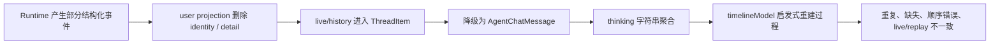
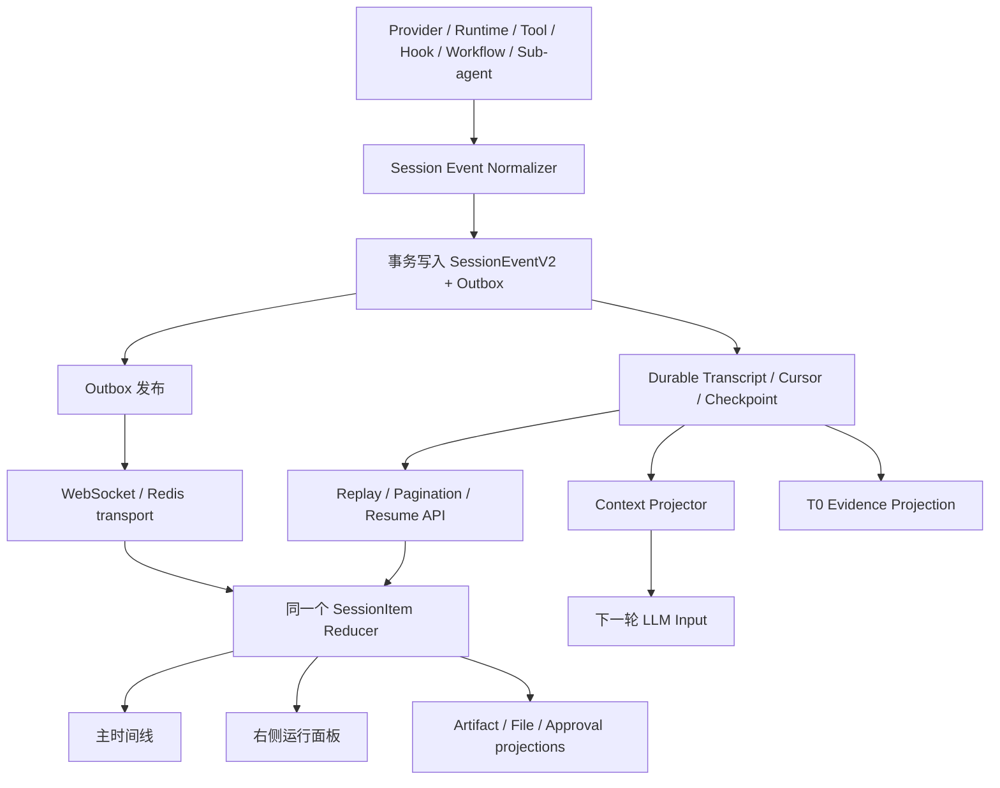

# Hive Session V2：CC 底线与 Codex 抽象对齐契约（2026-07-14）

> 状态：设计权威，待实现
>
> 集成关系：本文裁决 Session Event / Item / Reducer，不独立定义当前断点总数或程序施工顺序。fleet、单根 Session 的 100-way root execution、Context Resource Plane、跨渠道 A2A 与 canonical ledger 统一以 `docs/agent-native-unified-atomic-review-2026-07-14.md` 为准。
>
> 施工消费合同：后续实现必须先读本文全文，不得用 Group 摘要、旧 UI 文档或兼容投影替代。总报告 §8.1 维护本文章节、`S-01`–`S-12` 与 `SESSION-G1`–`SESSION-G13` 的唯一 Group 归属；§9 的 Group 2 是 Session 机械事实语言主实现，Group 3/4/6/7/8/9/10 分别消费 root admission、result/fan-in、compaction、跨渠道、Memory/Knowledge evidence、产品投影与最终重认证合同；§12 维护 canonical owner、状态和对应 `EVID-G*`。任何 event/item/schema、migration/backfill、reducer、UI/E2E 或生产证据都必须回填总报告，并同步更新本文设计状态；两边不一致时不得宣称闭环。
>
> 适用范围：Web Session、RuntimeTask、ChatSession、模型循环、工具循环、Hook、Skill、Memory、Sub-agent、A2A、Workflow、Compaction、文件与交付物，以及它们在主时间线、右侧运行面板、恢复/重放中的统一表达
>
> 本文只确定目标契约、事实源、抽象边界与验收标准；不声称当前实现已经完成，也不在本轮修改实现代码。

---

## 0. 本文的裁决位置

本文在 `docs/ccplus-north-star-contract-2026-06-24.md` 的总边界之下，专门裁决 Session Runtime 与 Session UX：

1. **CC / FreeCode 是完整 Agent 生命周期和能力语义的底线。**
2. **Codex 是 Thread / Turn / Item、事件生命周期、恢复与 Workbench 表达的工程抽象增量。**
3. **Hive-native 的 Memory、Skill、Sub-agent、A2A、Workflow、治理和自进化必须作为一等类型加入该模型，不能退化成一串通用日志。**

当本文与以下历史文档在 Session 事件模型、数据权威或“是否已落地”的结论上冲突时，以本文为准：

- `docs/ccplus-session-ux-contract-2026-06-26.md`
- `docs/session-rendering-streaming-cc-codex-gap-analysis-2026-07-03.md`
- `docs/session-timeline-projection-contract-2026-07-04.md`

上述文档中的视觉目标、性能分析和交互细节仍可复用；但其中“已有底层事实流基本完整”“仅剩展示密度问题”或“已落地”的判断，不再作为当前完成事实。

本文的核心公式是：

```text
CC 的有序 Agent 生命周期事实
+ Codex 的 Thread / Turn / typed Item 与 started-delta-completed 抽象
+ Hive 的治理、自进化和协作原生类型
= Hive Session V2
```

一句话裁决：

> Session 不能再从一条最终 `ChatMessage`、一个聚合 `thinking` 字符串或前端相邻关系中“猜”出过程；Runtime 必须直接产生可持久化、可恢复、可重放、可投影的 typed Session Items。

---

## 1. 为什么这不是一个 UI 样式问题

用户期待看到的不是更多日志，而是一个连续、可信、可恢复的工作过程：

```text
用户请求
→ 模型公开工作说明
→ 工具调用与结果
→ 上下文压缩
→ 模型继续工作
→ 文件编辑 / 子 Agent / Workflow
→ 最终答案与交付物
```

当前 Hive 的主要问题不是折叠样式，而是这条链路在事实层被压扁：

- 中间模型输出通常聚合进最终消息的 `thinking` 字段；
- user projection 会清除部分工具、Workflow、Sub-agent、Compaction 标识；
- live 路径和 history/replay 路径经过不同形态的数据；
- 前端把 `ThreadItem` 再降级成旧 `AgentChatMessage`；
- 时间线随后依据字符串、消息位置和相邻关系重新推断“思考—工具—结果”；
- 运行中、刷新后、断线重连后可能得到不同的结构；
- 右侧面板和主时间线可能从不同派生状态计算，造成重复的 `Action Started`、错误计数或幽灵运行态。

因此，单纯修改 CSS、折叠样式、文案或 `buildCells()` 无法闭环。必须先修正 Session 的事实模型，再由同一事实模型投影 UI。

---

## 2. 本轮目标与非目标

### 2.1 目标

本文一次性明确：

1. CC 已经做到、Hive 必须守住的生命周期底线；
2. Codex 在底线上抽象出的工程对象，Hive 应当采纳的部分；
3. Hive-native 能力如何进入同一 Session 模型；
4. Session 的唯一事实源、事件信封、Item 模型、顺序与幂等规则；
5. 公开工作说明、Reasoning、最终答案的边界；
6. Tool、Hook、Compaction、Sub-agent、Workflow、Memory、Skill、文件和交付物的表达；
7. live、reconnect、replay、reload、resume 如何得到同一结果；
8. 历史数据如何无损迁移；
9. 什么证据出现后，才可以说 Session 已经对齐 CC + Codex。

### 2.2 非目标

本文不做以下事情：

- 不要求或承诺展示模型不可公开的原始私有 Chain of Thought；
- 不把“显示更多原始 token”当作产品透明度；
- 不用固定文案伪造模型的思考过程；
- 不通过自然语言关键词决定一段话是不是 final、permission、progress 或 reasoning；
- 不把 Codex 的 UI 像素级复制当作架构对齐；
- 不让 Codex 抽象覆盖 CC 已有的工具、Hook、Sub-agent、Skill 或生命周期能力；
- 不借 Session 重构删除 Hive-native 的 Memory、A2A、Workflow 或治理语义；
- 不在本文中宣称实现、迁移或生产验收已经完成。

---

## 3. 术语：必须先把层级说清楚

| 对象 | 定义 | 关键不变量 |
|---|---|---|
| Session / Thread | 一段可持续、可恢复、可 fork 的用户工作上下文 | 拥有稳定 ID、递增 cursor、可分页历史 |
| Turn | 一次已接受的用户输入及其对应 Agent 工作 | 用户输入先持久化；一个 Turn 可以包含多轮模型/工具往返 |
| Run | 执行某个 Turn 的 RuntimeTask 实例 | 可恢复、可取消、可重试；不能由浏览器连接生命周期决定 |
| Round | 一次模型请求及其后续工具响应闭环 | 用于模型循环和 compaction 前后排序，不等于用户 Turn |
| Event | 不可变的事实变化 | append-only、唯一 `event_id`、有 session sequence |
| Item | 由一组 Event 归约得到的可识别工作对象 | 稳定 `item_id`；started/delta/completed 更新同一个对象 |
| Projection | 从事实流生成的读模型 | 可重建；不能成为新的事实权威 |
| Transcript | 用户和 Runtime 的持久事实历史 | Compaction 不得删除其证据 |
| Context Projection | 为下一次模型调用组装的上下文 | 可以压缩、引用和渐进式加载，但必须有覆盖账本 |

### 3.1 四种助手内容必须分开

Hive 不得继续用一个 `thinking` 字段承载所有非 final 内容。至少必须区分：

| 语义 | 用途 | 默认用户可见性 | 是否进入最终答案 |
|---|---|---:|---:|
| `assistant_commentary` | 模型主动给用户的工作说明、阶段结论、下一步动作 | 可见 | 否 |
| `reasoning_summary` | Provider 或模型提供的安全推理摘要 | 按产品策略可见 | 否 |
| `reasoning_private` | Provider 原始受限推理证据 | 不直接展示 | 否 |
| `assistant_final` | Turn 的终局回答 | 可见 | 是 |

产品界面可以把 `assistant_commentary` 或公开 `reasoning_summary` 显示为“思考”“工作过程”或“进展”，但底层语义不能混淆。

### 3.2 对“思考过程”的明确裁决

用户需要的是**可信的工作可见性**，不是强行泄露私有 Chain of Thought：

- Codex 风格的 commentary、preamble、progress narration 应保留在原始顺序中；
- Provider 明确提供的安全 reasoning summary 可以作为独立 Item；
- Provider 标记为受限的 raw reasoning 只做受控证据保存，不直接进入普通用户 UI；
- 如果模型没有产生 commentary 或 reasoning summary，平台必须如实不显示，不能插入“Agent 正在整理思路”；
- 平台可以通过高质量 Runtime prompt 鼓励模型在长任务中给出有意义的公开进展，但不能替模型撰写语义内容。

---

## 4. 源码核对基线

本文基于以下当前本地 checkout，而不是历史印象：

| 基线 | Commit | 用途 |
|---|---|---|
| Hive | `501db6555dae374e5fcf43a6fdcfe8a3dd89343e` | 当前实现事实 |
| FreeCode | `7dc15d6c8fb0c40c7fcc02ce9b58204324252632` | CC 可运行语义底线 |
| claude-code-org | `a99de1bb3c0c301b83b784abbcdb7a3674b2cd45` | CC 交叉验证 |
| Codex | `5c19155cbd93bfa099016e7487259f61669823ff` | typed thread/item 与 Workbench 工程增量 |

源码优先级遵守项目总契约：FreeCode 第一，claude-code-org 交叉验证，Codex 只提供不削弱 CC 语义的增量。

---

## 5. CC / FreeCode：Hive 必须对齐的底线

CC 的关键价值不只是“能调用工具”，而是它保留了一条完整、有序、可继续的 Agent 生命周期。

### 5.1 已接受的用户输入先成为事实

用户输入被 Runtime 接受后，必须先进入持久 transcript，再开始模型循环。这样才能保证：

- 浏览器断开不会丢失 Turn；
- Runtime 崩溃可以恢复；
- resume/fork/compact 有稳定边界；
- 用户看到的输入与模型实际接受的输入一致。

Hive 对齐要求：`user_message.accepted` 必须是 Turn 的首个权威事件，而不是仅依赖客户端气泡或异步补写的 `ChatMessage`。

### 5.2 内容块按原始顺序保留

FreeCode 的 `normalizeMessages()` 会把 assistant/user content blocks 规范化为有序消息，并为其产生稳定顺序标识，而不是把整轮压成一个大字符串。

Hive 对齐要求：

- commentary、reasoning、tool use、tool result、final 的相对顺序必须来自 Runtime 事实；
- 不能在最终回答到达后，再把聚合 `thinking` 人工塞到 final 前面；
- 同一 Round 中多次“说明—工具—说明—工具”必须逐项保留；
- Tool use 与 Tool result 必须通过稳定调用 ID 配对。

### 5.3 工具循环是一等生命周期

CC 的工具调用不是一条泛化日志，而是 assistant content block、tool use、tool result、下一轮 assistant output 组成的循环。

Hive 对齐要求：

```text
assistant_commentary
→ tool.started
→ tool.progress / approval / waiting（可选）
→ tool.completed | tool.failed | tool.denied | tool.unavailable
→ assistant_commentary 或 assistant_final
```

每个节点必须能被 transcript、恢复逻辑、UI 和审计共同消费。

### 5.4 Compaction 是明确边界，不是删除历史

FreeCode 通过显式 compact boundary 决定下一轮给模型的消息投影；历史 transcript 本身仍然存在。

Hive 对齐要求：

- `context.compaction` 是明确、可见、可恢复的 Item；
- 它改变后续模型输入投影，不重写用户已经看到的 Session 历史；
- 压缩摘要、覆盖范围、source refs、前后 token 计数、恢复引用必须可查；
- compact 后的新 commentary/tool cycle 继续追加在同一 Turn/Session 顺序中。

### 5.5 Session、Hook、Sub-agent 与 resume 是生命周期语义

CC 的能力边界包含 session lifecycle、hooks、sub-agent、tool permission、resume/fork/compact。它们不能仅作为后端内部实现存在。

Hive 对齐要求：

- Hook 的开始、阻断、批准、拒绝、失败、恢复要成为 typed Item；
- Sub-agent 的创建、运行、等待、产出与回收要有父子关系；
- resume/fork 必须恢复事实顺序和未完成 Item，而不是仅恢复聊天文本；
- denied、unavailable、failed、cancelled、waiting 必须是不同状态。

### 5.6 CC 底线对照表

| CC 语义底线 | Hive 必须提供的等价物 | 不合格替代 |
|---|---|---|
| accepted prompt 写入 transcript | `user_message.accepted` 事实事件 | 仅客户端气泡 |
| 有序 content blocks | 有序 typed Items | final + 聚合 thinking |
| tool use/result pairing | 稳定 `tool_call_id` 与一个 Tool Item | 根据相邻消息猜测 |
| compact boundary | `context.compaction` Item + context projection | 删除旧 UI 消息 |
| hook lifecycle | Hook Item 状态机 | 一条通用 warning |
| resume/fork | cursor、checkpoint、未完成 Item 恢复 | 只重放 ChatMessage |
| sub-agent lifecycle | 父子 Session / Item 引用 | 把子对话全文扁平化 |
| final answer | 独立 terminal Item | 混在 Processed 日志内 |

---

## 6. Codex：在 CC 底线上值得对齐的抽象

Codex 的主要增量不是比 CC 多几个工具，而是把 Session 的变化抽象成稳定、可消费的协议对象。

### 6.1 Thread → Turn → ThreadItem

Codex protocol v2 用 `ThreadItem` 表达不同工作对象，包括：

- `UserMessage`
- `AgentMessage`，并带 `phase`
- `Plan`
- `Reasoning`
- `CommandExecution`
- `FileChange`
- `McpToolCall`
- `DynamicToolCall`
- `CollabAgentToolCall`
- `SubAgentActivity`
- `WebSearch`
- `ImageView`
- `ContextCompaction`

Hive 应当采用同级抽象原则，而不是逐字复制枚举：**凡是用户、恢复器、治理面板或审计需要识别的工作对象，都必须有显式类型和稳定 ID。**

### 6.2 `started → delta → completed`

Codex 为 Item 提供开始、增量和完成通知；增量通过 `item_id` 更新既有对象，而不是不断追加相似日志。

Hive 对齐要求：

```text
item.started(item_id = A)
item.delta(item_id = A, ordinal = 1)
item.delta(item_id = A, ordinal = 2)
item.completed(item_id = A)
```

前端 reducer 对 `item_id=A` 执行 upsert。任何 transport 重发都不得制造第二个“Action Started”。

### 6.3 `Commentary` 与 `FinalAnswer` 是显式 phase

Codex 的 `MessagePhase` 区分中间 commentary 与 terminal final answer。这解决了一个根本问题：UI 不需要从消息位置或自然语言中判断“这是不是最后回答”。

Hive 对齐要求：

- 模型适配器尽量保留 Provider 的显式 phase；
- Runtime 根据模型循环的机械边界补充生命周期事实，而不是按关键词分类；
- 无法可靠映射的历史内容标记为 `legacy_unknown`，不能伪造 phase；
- `assistant_final.completed` 每个 Turn 最多一个有效 terminal Item，重试/替换关系必须显式。

### 6.4 Reasoning summary 与 raw reasoning 是不同通道

Codex 分离 reasoning summary delta 与 reasoning text delta，且二者都通过稳定 item ID 归约。

Hive 对齐要求：

- `reasoning_summary`、`reasoning_private`、`assistant_commentary` 分别建模；
- visibility 在服务端权威决定；
- user projection 可以隐藏内容，但不能删除 item identity、状态或存在性；
- UI 的“思考”标签必须知道自己展示的是 commentary 还是 safe summary。

### 6.5 持久 rollout 与产品 history 使用同一 typed projection

Codex 从 durable rollout lines 投影 Thread history，并通过 stable item ID 更新同一工作对象。Live 与 history 不是两套语义。

Hive 对齐要求：

- 生产事实流只有一种 canonical envelope；
- WebSocket、Redis、分页 API、resume 和历史回放消费同一种事件；
- live 和 reload 使用同一个 reducer；
- Redis 是 transport，不是另一份运行事实源；
- `ChatMessage` 只能是兼容读模型，不能继续承担 process authority。

### 6.6 稳定历史与 active tail 分离

Codex 的 Workbench/TUI 把已提交历史与当前流式单元分开处理。这是性能和视觉稳定性的工程抽象，而不是改变事实顺序。

Hive 对齐要求：

- completed items 冻结为稳定历史；
- 只有 active item 接受 delta 更新；
- 虚拟化、分页、折叠只影响渲染，不改变 item identity；
- active tail 完成后原位提交，不能删除后重新追加。

### 6.7 Codex 抽象对照表

| Codex 抽象 | Hive 采纳方式 | 采纳原因 |
|---|---|---|
| Thread / Turn / Item | Session / Turn / SessionItemV2 | 稳定层级与恢复边界 |
| Message `phase` | commentary / final 显式语义 | 消除前端猜测 |
| item started/delta/completed | Item 生命周期事件 | 流式、幂等与 UI 原位更新 |
| typed tool/file/compaction items | Hive typed item family | 过程可理解、可审计 |
| reasoning summary/raw 分离 | visibility-aware reasoning channels | 透明度与隐私兼容 |
| stable item upsert | `item_id` reducer | 消除重复活动 |
| durable history projection | canonical event → same reducer | live/replay 一致 |
| stable history + active tail | Session Workbench 渲染模型 | 长 Session 性能与稳定性 |

---

## 7. Hive-native：不是附加日志，而是一等 Session 类型

Hive 相比 CC/Codex 的优势必须在统一模型上增量表达。

### 7.1 RuntimeTask 与 ChatSession

- `RuntimeTask` 是执行权威，包含可恢复、取消、重试和 checkpoint 状态；
- `ChatSession` / Thread 是用户工作上下文；
- 二者通过 `run_id`、`turn_id` 明确关联；
- 浏览器断线只影响 transport，不终止 RuntimeTask。

### 7.2 Memory 与 Context

Memory 的发现、加载、引用、写入候选、审查和 durable commit 必须分别表达：

- `memory.search`
- `memory.loaded`
- `memory.write_proposed`
- `memory.write_committed`
- `memory.write_held`
- `context.source_loaded`
- `context.compaction`

这些 Item 展示的是操作事实和证据引用，不泄露未授权 Memory 内容，也不由平台生成语义判断。

### 7.3 Skill 与 Tool Search

- `tool_search` 是能力发现，不等于工具执行；
- `skill.loaded` 是 progressive disclosure，不等于运行脚本；
- Skill 内的 Workflow/Sub-agent/Script 仍通过各自受治理的执行入口；
- UI 应显示“发现/加载了什么能力”和结果范围，而不是只写“已使用某集成”。

### 7.4 Sub-agent、A2A 与 Agent Team

- 父 Session 记录 delegation Item；
- 子 Agent 拥有自己的 child Session/Turn/Item 流；
- 父 Item 保存 child session refs、状态、结果摘要、artifact refs；
- 子对话不能全部扁平复制到父时间线；
- denied、waiting、running、completed、failed、cancelled 分开；
- A2A receipt、delegation authority 和结果来源必须可审计。

### 7.5 Workflow

- Workflow 是确定性编排，与 Sub-agent 语义分离；
- 主时间线显示 run、关键 step、gate、wait、resume、completion；
- 完整 step journal 可在展开层或右侧面板消费；
- 同一 `workflow_run_id` 驱动主时间线和右侧统计，不能各算一份。

### 7.6 Hook 与治理

- Hook 必须是 Runtime boundary，不只是通知；
- `hook.started`、`hook.blocked`、`hook.approval_required`、`hook.completed`、`hook.failed`、`hook.recovered` 都是 typed lifecycle；
- 普通用户看到意图、所需动作和恢复方式；operator 才展开原始 payload；
- visibility 可以隐藏敏感字段，不能让 Item 从事实链中消失。

---

## 8. 当前 Hive 的真实断点

### 8.1 已核对的关键代码事实

| 当前路径 | 当前行为 | 结果 |
|---|---|---|
| `backend/app/services/thread_items.py::_user_summary` | reasoning 被替换成固定“Agent 正在整理思路。” | 伪造统一过程文案，丢失真实语义 |
| `backend/app/services/thread_items.py::_user_item_data` | user projection 清除 tool/workflow/subagent/compaction 标识 | 用户侧无法稳定关联、恢复和去重 |
| `backend/app/services/thread_items.py::build_live_thread_item` | live event 强制走 user projection | live 流在进入前端前已破坏事实 |
| `backend/app/services/web_chat_run_orchestrator.py::_finalize_invocation_result` | `thinking_content` 被拼接到最终 assistant 结果 | 多轮过程被压扁成 final 附件 |
| `frontend/src/pages/session-workbench/threadItemReducer.ts::threadItemToAgentChatMessage` | typed `ThreadItem` 被降级成旧 `AgentChatMessage` | 类型、状态与 identity 再次丢失 |
| `frontend/src/pages/session-workbench/timelineModel.ts::buildCells` | 从 message/thinking 重新合成 process step 与 final cell | UI 依靠启发式重建 Runtime 事实 |

这些不是单个函数 bug，而是一条连续的数据降级链：



### 8.2 七原子现状判断

| 原子 | 当前事实 | 状态 |
|---|---|---|
| 输入 | 用户输入和部分 runtime delta 存在，但 phase/round/item identity 不完整 | 局部闭环 |
| 权威 | Transcript、ChatMessage、ThreadItem、Redis/WS 与前端派生状态边界不清 | 断点 |
| 执行 | 模型/工具在运行，但不同执行分支产生的可消费事件不一致 | 断点 |
| 证据 | user projection 和 message 降级删除关键关联字段 | 断点 |
| 恢复 | live、reload、replay、resume 不能证明同构 | 断点 |
| 消费 | 主时间线通过旧 message 与启发式合成，右侧面板可能另行计算 | 断点 |
| 验收 | 缺少覆盖完整黄金轨迹的 live/replay/reload 等价测试 | 缺失 |

总状态：**Session 当前是“断点”，不是“已对齐但样式不佳”。**

### 8.3 历史结论为什么失效

旧文档正确识别了“Codex 风格的 Processed 折叠、工具行、文件卡片、动态压缩与最终回答”这一产品目标，也解决过部分流式性能问题；但它把以下事实过早当作已成立：

- 后端已经提供足够完整的事件语义；
- `thinking` 可以作为过程载体；
- 前端只需把已有事件整理成时间线；
- 测试通过即可证明 live/history 一致。

当前源码证明，这些前提并不成立。因此本文不是继续给旧模型打补丁，而是重设事实契约。

---

## 9. 目标架构：事实流与读模型分离

### 9.1 唯一权威

Session V2 的云端运行事实权威是事务性、append-only 的 `SessionEventV2` 流；在现有模型上，它应由 `ChatTranscriptEvent` 演进承载，而不是再新建一个平行真相。

其他对象的定位：

| 对象 | 定位 |
|---|---|
| `ChatTranscriptEvent` / `SessionEventV2` | 云端运行、顺序、恢复、重放的唯一机械事实 |
| `SessionItemV2` | 由 Event reducer 生成的可识别工作对象 |
| `ChatMessage` | 用户聊天兼容读模型，不是过程权威 |
| Redis / WebSocket | Event transport，不是事实源 |
| T0 `events.jsonl` | exactly-once portable Memory evidence projection，不是第二个云端 run authority |
| Timeline / Right Rail | 同一 reducer 的不同 UI projection |

### 9.2 数据流



关键规则：

1. **先持久化，后发布。** 用户可见且需要恢复的事实不能只存在于 live transport。
2. **写入和发布使用同一个序列化 envelope。** 不允许 broadcast 路径再做一次破坏性转换。
3. **同一个 reducer。** live、reconnect、history、reload、resume 不得各写一套解释逻辑。
4. **Context Projection 与 UI Transcript 分离。** Compaction 可以改变 LLM 输入，但不能改变历史事实。
5. **读模型可删可重建。** 任何前端 cell、right-rail counter、ChatMessage 都不能反向成为事实权威。

---

## 10. `SessionEventV2` 事件契约

以下为概念契约；实现时可以使用 Pydantic/TypeScript discriminated union，但字段语义必须保留。

```ts
type SessionEventV2 = {
  schema: "hive.session_event";
  schema_version: 2;

  event_id: string;
  sequence: number;          // session 内严格递增
  ordinal?: number;          // 同一 item 的 delta 顺序

  tenant_id: string;
  session_id: string;
  thread_id: string;
  turn_id: string;
  run_id: string;
  round_id?: string;

  item_id: string;
  parent_item_id?: string;
  causation_event_id?: string;
  correlation_id?: string;

  kind: SessionEventKind;
  lifecycle: "started" | "delta" | "snapshot" | "completed" | "failed" |
             "denied" | "unavailable" | "waiting" | "cancelled";

  actor: {
    type: "user" | "assistant" | "runtime" | "tool" | "hook" |
          "workflow" | "agent" | "system";
    id?: string;
  };

  visibility: {
    audience: "direct_user" | "participants" | "operator" | "private_provider";
    redacted_fields?: string[];
  };

  payload: Record<string, unknown>;
  display?: {
    title?: string;
    summary?: string;
    detail_ref?: string;
  };

  evidence_refs?: Array<{
    type: string;
    id: string;
    locator?: string;
  }>;

  occurred_at: string;
  persisted_at: string;
};
```

### 10.1 字段不变量

- `event_id` 全局唯一，重放与重发保持不变；
- `sequence` 在一个 Session 内严格递增，是分页、gap detection 和 resume cursor 的基础；
- `item_id` 从 started 到 terminal 状态始终不变；
- `ordinal` 只表达同一 Item 内 delta 的顺序；
- `turn_id`、`run_id` 不能从当前页面状态猜测；
- `parent_item_id` 表达结构关系，不能依赖 UI 相邻位置；
- `visibility` 由服务端 authority 决定；
- 隐藏 payload 字段不等于删除事件、Item identity 或状态；
- `display` 是安全、非权威的展示元数据，不能覆盖原始 typed payload；
- `evidence_refs` 指向文件、artifact、invocation span、child session、T0 或 approval receipt。

### 10.2 持久与发布语义

- 数据库提交成功后才允许发布对应 event；
- Outbox 至少一次投递；
- Consumer 以 `event_id` 幂等，以 `sequence` 检测缺口；
- 缺口存在时前端暂停 terminal 判断，通过 history API 补齐；
- event 重发不得产生新 `event_id`；
- transport 断线不改变 Item lifecycle；
- 未完成 Item 由 resume/checkpoint 恢复或进入明确 `failed/cancelled`，不能永远残留 `running`。

---

## 11. `SessionItemV2` 归约契约

多个 Event 归约为一个稳定工作对象：

```ts
type SessionItemV2 = {
  id: string;
  kind: SessionItemKind;
  session_id: string;
  turn_id: string;
  run_id: string;
  round_id?: string;
  parent_id?: string;

  status: "pending" | "running" | "waiting" | "completed" | "failed" |
          "denied" | "unavailable" | "cancelled";
  phase?: "commentary" | "final";
  visibility: SessionVisibility;

  title?: string;
  summary?: string;
  content?: string;
  detail_ref?: string;
  artifact_refs?: string[];
  child_session_refs?: string[];

  first_sequence: number;
  last_sequence: number;
  started_at?: string;
  completed_at?: string;
};
```

归约规则：

- `item.started` 创建或幂等确认 Item；
- `item.delta` 原位追加指定语义字段；
- `item.snapshot` 替换明确声明的 snapshot 字段，不能与 delta 混用；
- terminal event 冻结 Item；
- 晚到重复 delta 根据 `ordinal` 去重；
- terminal 后出现的合法补充证据通过关联 Item 或 correction event 表达，不能静默改历史；
- retry 创建新的 attempt Item，并通过 `parent_id`/`correlation_id` 关联，不复用失败 attempt 的 identity。

---

## 12. 必须覆盖的 Item Family

### 12.1 Session、Turn 与 Run

- `session.created`
- `session.resumed`
- `session.forked`
- `turn.user_message`
- `run.started`
- `run.waiting`
- `run.cancelled`
- `run.failed`
- `run.completed`

### 12.2 Assistant 内容

- `assistant.commentary`
- `assistant.reasoning_summary`
- `assistant.reasoning_private`
- `assistant.final`
- `assistant.plan`

### 12.3 Tool 与外部能力

- `tool.search`
- `tool.call`
- `tool.progress`
- `tool.result`
- `tool.permission`
- `mcp.call`
- `web.search`
- `image.view`
- `code.execution`

`tool.started` 和 `tool.completed` 是同一个 Tool Item 的生命周期，不是两行独立活动。

### 12.4 文件与交付物

- `file.read`
- `file.change`
- `file.preview`
- `artifact.created`
- `artifact.updated`
- `artifact.delivered`

文件事实必须在实际 commit/receipt 时产生，不能等到 final 文本里再解析“我编辑了文件”。

### 12.5 Context、Memory 与 Skill

- `context.source_loaded`
- `context.compaction`
- `memory.search`
- `memory.load`
- `memory.write_proposal`
- `memory.commit`
- `skill.search`
- `skill.load`

### 12.6 协作与编排

- `subagent.spawn`
- `subagent.activity`
- `subagent.result`
- `a2a.delegation`
- `a2a.receipt`
- `workflow.run`
- `workflow.step`
- `workflow.gate`
- `workflow.resume`

### 12.7 Hook、审批与用户交互

- `hook.execution`
- `approval.request`
- `approval.response`
- `user_question.request`
- `user_question.response`

### 12.8 警告与错误

- `runtime.warning`
- `runtime.error`
- `provider.degraded`
- `provider.unavailable`
- `recovery.action`

错误必须带 typed cause、retryability、recovery action 和 evidence ref。平台不能用固定自然语言假装这是模型结论。

---

## 13. Assistant 输出的映射规则

### 13.1 显式信号优先

映射优先级：

1. Provider 原生显式 phase/type；
2. Runtime 已知的机械模型循环边界；
3. 兼容 adapter 的保守 unknown；
4. **禁止**自然语言关键词扫描。

### 13.2 机械边界允许做什么

Runtime 可以根据可验证协议事实判断：

- 一个 assistant block 后面明确跟随 tool use，因此该 block 不是 terminal final；
- 模型循环已经正常结束，且该输出被 Provider 标为最终响应；
- 一个 reasoning block 被 Provider 标记为 summary 或 restricted content；
- 当前 Item 属于哪一个 round/tool call。

Runtime 不可以根据文字内容判断：

- “我正在”“接下来”“完成了”是否意味着 progress/final；
- 一段话是否足够重要；
- 模型是否真的完成任务；
- 某段 reasoning 是否应该被改写成更好看的总结。

### 13.3 无 commentary 时的诚实降级

如果 Provider/模型只产生 tool call 和 final：

```text
Tool call
→ Tool result
→ Final answer
```

UI 就显示这三个事实。不得插入“Agent 正在思考”“Agent 正在整理思路”或重复 final 内容作为过程。

---

## 14. Tool、Hook、文件与交付物的产品表达

### 14.1 Tool Item

一个 Tool Item 在主时间线只占一个稳定位置：

```text
● 正在搜索代码库                         running
  └─ 已扫描 128 个符号                    progress

✓ 搜索了代码库                           completed · 1.2s
  └─ 12 个匹配项                          expandable detail
```

不得把 started、progress、completed 各追加成一个新的“Action Started”。

### 14.2 Hook Item

Hook 的主视图应回答：

- 为什么运行；
- 是否阻断；
- 用户需要做什么；
- 能否重试/恢复；
- 审批或结果在哪里。

原始 hook name、payload、span ID 放在展开层/operator view。

### 14.3 FileChange 与 Artifact

- 文件修改是 typed `file.change`；
- 可预览产物是 typed `artifact`；
- 主时间线显示文件名、动作、状态、可点击预览；
- 最终回答可以引用 artifact，但不是 artifact 存在的唯一证据；
- Deliverables 面板通过同一 artifact item projection 计算，不能扫描 final 文本。

---

## 15. Compaction 与动态上下文

### 15.1 两条历史必须分开

```text
UI / Audit Transcript：不可因 compaction 丢失
LLM Context Projection：可以被摘要、引用、渐进式加载
```

Compaction 不是聊天消息删除器，也不是把早期 Item 合并成一句 UI 文案。

### 15.2 `ContextCompactionItem` 必需字段

- `boundary_sequence`
- `trigger`：provider physical limit / explicit user action / model-led handoff
- `input_token_estimate`
- `output_token_estimate`
- `summary_ref`
- `coverage_ledger_ref`
- `preserved_source_refs`
- `dropped_from_active_context_refs`
- `recovery_ref`
- `status`

其中 `dropped_from_active_context_refs` 只表示不再 inline 进入下一轮 prompt；原始事件仍在 transcript/T0 中可恢复。

### 15.3 压缩后的 Session 表达

```text
Commentary
Tool
Tool
Context compacted
Commentary
File change
Commentary
Final answer
```

这正是长 Session 应该呈现的真实循环。多个 Compaction Item 可以按序出现；不能把压缩前所有过程折叠成最终 `thinking`。

---

## 16. Sub-agent、A2A 与 Workflow 的层级表达

### 16.1 Sub-agent 不扁平化

父时间线：

```text
Sub-agent：核对后端 Session truth             completed
├─ child session: session_xxx
├─ 发现：3 个事实断点
└─ artifact: backend-session-audit.md
```

点击后进入 child session 或展开摘要。父 Session 不复制 child 的每一个 tool delta。

### 16.2 A2A 保留 authority 与 receipt

父 Item 必须保留：

- delegator principal；
- target agent；
- delegated scope；
- permission/approval state；
- child task/session ref；
- completion receipt；
- artifact/result refs。

### 16.3 Workflow 与 Agent 协作分离

Workflow 展示确定性 step/gate；Sub-agent 展示自主协作活动。二者可以互相引用，但不能合并成同一个 generic activity 类型。

右侧 `Team / Workers / Workflow / Activity` 数字必须来自同一个 Item store，并按唯一 ID 去重。

---

## 17. UI 投影契约

### 17.1 主时间线

每个 Turn 的结构固定为：

```text
UserMessage
└─ RunGroup / Processed
   ├─ commentary / reasoning summary
   ├─ tool / hook / skill / memory / subagent / workflow
   ├─ context compaction
   ├─ file changes / artifacts
   └─ runtime warnings or recoveries
FinalAnswer
Artifacts / Deliverables（如果存在）
```

规则：

- running Turn 默认展开 active tail；
- completed Turn 可以折叠为紧凑摘要；
- 展开后必须恢复真实顺序；
- FinalAnswer 不属于 `Processed` 内部工具日志；
- 用户消息不与前一轮 run 混合；
- 相同 item ID 在任何视图只出现一次。

### 17.2 “Thinking” 的显示

界面可显示：

- `Thinking`：公开 commentary 或 provider-safe reasoning summary；
- `Working`：当前工具/Hook/Workflow/Sub-agent 活动；
- `Processed`：已完成的过程组。

展开层必须标明内容语义，避免把 commentary 冒充 raw reasoning。

### 17.3 右侧运行面板

右侧面板不是第二个日志系统。它是同一 `SessionItemV2` store 的 filtered projection：

- Run status：Run Item；
- Team/Workers：Sub-agent/A2A Item；
- Workflow：Workflow Item；
- Activity：所有 active non-message Item 去重计数；
- Deliverables：Artifact Item；
- Notifications：approval/question/recovery Item。

### 17.4 稳定历史与 active tail

- completed Item 渲染结果 memoize/virtualize；
- active Item 只更新自身；
- delta 不触发整段历史重新 `buildCells()`；
- pagination 使用稳定 sequence/ordinal；
- prepend older history 后，已有 item identity 和 scroll anchor 不变。

---

## 18. Live、Reconnect、Replay、Reload、Resume 必须同构

### 18.1 同一条归约链

```text
Live WebSocket events ─┐
                      ├─> normalize envelope ─> SessionItem reducer ─> UI
History API events ───┤
Reconnect gap events ─┤
Resume replay events ─┘
```

禁止存在：

- live 用 socket projector，reload 用 ChatMessage mapper，二者语义不同；
- final 到达后再清空 live process、重新合成一份 process；
- Redis-origin event 和 DB replay event 使用不同 ID；
- 右侧面板按通知次数计数，主时间线按 Item 数量计数。

### 18.2 等价性定义

对于同一事件序列 `E`：

```text
reduce(live(E))
== reduce(reconnect(E))
== reduce(history(E))
== reduce(reload(E))
== reduce(resume(E))
```

等价包含：

- Item 数量与 ID；
- 顺序与父子关系；
- content 字节或显式 redaction 结果；
- terminal 状态；
- artifact refs；
- 右侧计数；
- final answer 只出现一次。

---

## 19. Visibility 与隐私：安全投影不能破坏事实

服务端可以基于权限：

- 隐藏 `reasoning_private.content`；
- 对 tool args 中的 secret 做精确 redaction；
- 限制 operator-only payload；
- 不向无权用户传递 child session 内容。

但服务端不可以：

- 删除 `item_id`、`tool_call_id`、`workflow_run_id` 或 `compaction boundary`；
- 把真实 commentary 替换成固定模板；
- 把 denied 伪装成 empty result；
- 把 unavailable 伪装成 success warning；
- 把多个 Item 合成不可恢复的字符串；
- 为了 UI 简单而改变事件顺序。

推荐投影形态：

```json
{
  "item_id": "item_123",
  "kind": "assistant.reasoning_private",
  "status": "completed",
  "visibility": "private_provider",
  "content": null,
  "display": {
    "title": "推理过程",
    "summary": "此内容受 Provider 隐私策略限制"
  }
}
```

存在性、顺序和状态仍然真实，内容按 authority 隐藏。

---

## 20. 历史数据迁移与兼容边界

Session V2 不能只覆盖新 Session，也不能用有损 heuristic 假装旧数据完美可恢复。

### 20.1 迁移来源优先级

1. 原始 `ChatTranscriptEvent` / provider content blocks；
2. invocation spans、tool receipts、workflow/subagent journals；
3. T0 evidence projection；
4. 旧 ThreadItem；
5. 最后才是 `ChatMessage` 和聚合 `thinking`。

### 20.2 迁移规则

- 能确定 ID、顺序、类型的历史事件转换为 V2；
- delta 与最终聚合 thinking 的去重必须依据 provenance/ID/sequence，不能依据文本相似度；
- 无法证明 phase 的内容标记 `legacy_unknown`；
- 无法还原的关联写入 coverage gap，不编造 tool/subagent identity；
- 历史 final 保持字节忠实；
- backfill 先 dry-run，输出每类成功/模糊/缺失计数和样本；
- apply 必须幂等、可回滚、保留原始记录；
- 完成 cutover 后，旧读路径退出生产消费，不能永久双事实源。

### 20.3 不允许的“兼容”

- 永久同时维护 V1 message timeline 与 V2 item timeline；
- 默认关闭 V2，继续让旧路径成为主路径；
- 把所有旧 thinking 当作公开 reasoning；
- 为了迁移率，把未知历史强行分类成 commentary/final；
- 删除旧证据后再宣称迁移完成。

---

## 21. 七原子目标闭环

| 原子 | Session V2 目标事实 | 闭环证据 |
|---|---|---|
| 输入 | `user_message.accepted` 带 principal、turn、run 和序列 | 断线前后用户输入只接受一次 |
| 权威 | `SessionEventV2` 是唯一运行事实；读模型可重建 | 删除 projection 后从 event 全量重建一致 |
| 执行 | Runtime、Tool、Hook、Workflow、Sub-agent 统一发 typed lifecycle | 每个执行入口均有 contract test |
| 证据 | event、span、receipt、artifact、T0 refs 互相可追溯 | 任一 UI Item 可定位机械事实 |
| 恢复 | cursor、checkpoint、item lifecycle 支持 reconnect/replay/resume | 故障注入后无重复、无幽灵 running |
| 消费 | 主时间线、右侧面板、Deliverables、Context projector 消费同一事实 | 同 ID、同状态、同计数 |
| 验收 | 黄金轨迹、迁移、长 Session、生产 smoke 均通过 | 自动化证据 + 生产 session 录屏/trace |

只有七项全部成立，Session V2 才能标记为**闭环**。

---

## 22. 禁止模式

以下模式在目标实现中一律禁止：

1. 以 `ChatMessage` 作为工具/Hook/Sub-agent/Compaction 的事实权威；
2. 用一个 `thinking: string` 承载多轮模型过程；
3. 把 reasoning 固定替换为“Agent 正在整理思路”；
4. 在 user projection 中删除稳定关联 ID；
5. 从 final message 重新构造 process timeline；
6. 通过自然语言关键词判断 final、progress、approval 或 task completion；
7. 通过 UI 相邻关系推断 Tool result 属于哪个 Tool call；
8. started/progress/completed 各追加一个重复 Activity；
9. live-only 发送需要恢复的用户可见事件；
10. Compaction 删除 UI transcript 或 T0 证据；
11. 展示 Provider 限制的 raw private reasoning；
12. 在无 commentary 时伪造“思考过程”；
13. 把 child session 全量扁平化到父 Session；
14. 把 Workflow 和 Sub-agent 混成一个 generic activity；
15. 主时间线和右侧面板各自维护运行状态；
16. 把“单元测试通过”当作 live/replay/reload 同构证据；
17. 以 feature flag 长期保留半成品双路径；
18. 在没有 migration/backfill/cleanup 的情况下宣称一次改完。

---

## 23. 必须通过的黄金轨迹

### G1：基础模型—工具循环

```text
User
→ Commentary A
→ Tool started
→ Tool progress
→ Tool completed
→ Commentary B
→ Final
```

断言：顺序一致、Tool 仅一个 Item、Final 一次、刷新后完全相同。

### G2：多次工具与动态压缩

```text
Commentary
→ Tool A
→ Tool B
→ Context Compaction
→ Commentary
→ File Change
→ Final + Artifact
```

断言：压缩前历史仍可展开；下一轮 context 使用 summary/ref；artifact 可预览。

### G3：无 commentary Provider

```text
Tool
→ Final
```

断言：不出现伪造 Thinking。

### G4：受限 reasoning

Provider 产生 private reasoning、safe summary 与 final。

断言：普通用户只见 safe summary；operator 按授权见元数据；Item 顺序和 identity 在两种视图一致。

### G5：断线、重连与重复投递

在 Tool delta 中断开 WebSocket，重连时同时收到一个重复 event 和一个 sequence gap。

断言：重复 event 被幂等忽略；gap 补齐后继续；没有第二个 Action Started。

### G6：Tool 的不同失败态

分别触发 denied、unavailable、timeout/failed、cancelled。

断言：状态、用户文案、retryability、recovery action 不混淆；Agent 可以继续处理其他能力。

### G7：Hook approval 与用户问题

Hook 阻断并请求 approval；另一次模型循环请求用户回答结构化问题。

断言：两者是不同 Item family；resume 后更新原 Item，不复制卡片。

### G8：嵌套 Sub-agent / A2A

父 Agent 委派两个子 Agent，其中一个调用工具并交付文件，另一个失败后重试。

断言：父时间线只保留高层 child Items；child transcript 可进入；receipt/artifact 关联正确；Team/Workers 计数去重。

### G9：Workflow gate / wait / resume

Workflow 进入 gate，等待用户批准，Runtime 重启后继续。

断言：step journal 与主 Item 状态一致；右侧 Workflow 数字与时间线一致；无幽灵 running。

### G10：文件已提交但 final 前崩溃

FileChange 已产生 receipt，模型尚未 final 时 Runtime 崩溃。

断言：文件 Item 和 artifact 不丢；resume 后继续 final；不会再次执行非幂等文件效果。

### G11：多次 Compaction + resume/fork

超长 Session 中发生多次 compaction，随后 resume 和 fork。

断言：原 Session 与 fork 的边界、coverage ledger、source refs 正确；UI 历史不被截断。

### G12：历史 backfill

覆盖：结构化旧 event、只有 ThreadItem、只有 ChatMessage/thinking、数据不完整四类样本。

断言：可证明内容无损迁移；不确定内容诚实标为 legacy；coverage report 可审计；重复运行幂等。

### G13：高压长 Session

至少 10,000 个 events、1,000 个 items、多次 prepend pagination、持续 active delta。

断言：稳定 item identity、scroll anchor 不漂移、completed history 不反复重算、无明显 O(N) per-token 更新。

---

## 24. 测试与验收门槛

### 24.1 单元测试

- event schema 与状态机；
- reducer 的 started/delta/snapshot/completed；
- duplicate、out-of-order delta 与 gap detection；
- visibility projection 保留 identity；
- phase mapping 不读取自然语言；
- compaction coverage ledger；
- item counter 与 parent/child 关系。

### 24.2 Contract 测试

每个 Runtime emitter 必须验证：

- 产生合法 V2 envelope；
- 先持久化后发布；
- persisted event 与 broadcast event 字节等价或有明确 transport wrapper；
- tool/workflow/subagent/hook ID 不在 user projection 中丢失；
- terminal event 与 receipt 对应。

### 24.3 集成测试

- RuntimeTask → DB → Outbox → WebSocket → reducer；
- RuntimeTask → restart → resume；
- history pagination → prepend → same reducer；
- Redis duplicate/origin suppression；
- T0 projection exactly-once；
- Artifact / Deliverables projection；
- backfill dry-run/apply/rollback。

### 24.4 浏览器 E2E

对 G1–G13 核心轨迹至少覆盖：

- streaming 中 UI；
- 完成态 UI；
- 浏览器刷新；
- 断线重连；
- 加载更早历史；
- 右侧面板计数；
- 折叠/展开；
- 文件点击预览。

### 24.5 字节与结构等价快照

同一个固定事件 fixture 必须分别走 live、history、reconnect、reload、resume，最终 `SessionItemV2[]` snapshot 完全一致。若 visibility 不同，只允许 exact redaction 字段不同。

### 24.6 生产验收

实现部署后，必须用真实生产模型与工具跑至少：G1、G2、G5、G6、G8、G9、G10、G11，并保存：

- Session URL；
- event sequence / item IDs；
- invocation spans；
- reload 前后截图或录屏；
- artifact/文件预览证据；
- 三个 Railway production 服务为同一版本且 deployment `SUCCESS`。

没有生产证据，不得宣称用户截图中的问题已经真正修复。

---

## 25. 后续实现的精确边界

本文不在本轮动代码，但后续完整施工必须覆盖以下真实消费点，不能只改其中一个组件。

### 25.1 Backend

- `backend/app/models/`：`ChatTranscriptEvent` / schema migration / sequence 与 outbox 约束；
- `backend/app/services/chat_transcript.py`：append、cursor、replay、fork、resume；
- `backend/app/services/thread_items.py`：V2 non-destructive projection，退出固定 reasoning 文案；
- `backend/app/services/web_chat_run_orchestrator.py`：不再把过程聚合进 final thinking；
- `backend/app/services/web_chat_runtime.py`：provider/runtime event normalizer；
- `backend/app/api/chat_sessions.py` 及 WebSocket 路径：同 envelope 分页与 live transport；
- kernel / provider adapters：phase、reasoning channels、round/item identity；
- Tool、Hook、Workflow、Sub-agent、Memory、Skill、File、Artifact emitters；
- T0 projection、invocation span、outbox、recovery/checkpoint。

### 25.2 Frontend

- V2 generated/shared types；
- `frontend/src/pages/session-workbench/sessionSocketEventProjector.ts`：仅 transport normalize，不做语义猜测；
- `frontend/src/pages/session-workbench/threadItemReducer.ts`：直接归约 V2，不降级为 `AgentChatMessage`；
- `frontend/src/pages/agent-detail/chatRuntime.ts`：live/history 同入口；
- `frontend/src/pages/session-workbench/timelineModel.ts`：从 typed items 投影，不从 final thinking 合成；
- `RunDisclosureBlock.tsx`：稳定 Item 的折叠与展开；
- `SessionRuntimePanel.tsx`：同 store 的 filtered projection；
- Artifact、File、Approval、Question、Sub-agent、Workflow 的 typed cells；
- stable history + active tail + pagination/virtualization。

### 25.3 迁移与清理

- Alembic migration；
- legacy backfill dry-run/apply/rollback；
- V1/V2 fixture corpus；
- 旧 heuristic projector 与 `thinking` 聚合消费路径退役；
- 旧双事实源 cleanup；
- metrics、gap/duplicate/recovery dashboards；
- 文档中旧“已落地”状态回填为真实验收结果。

这里列的是一个完整改造面的边界，不是可延期的阶段列表。施工时必须测试、迁移、backfill、可观测性、生产验证和旧路径清理一次闭环。

---

## 26. 架构决策记录

| ID | 决策 | 原因 |
|---|---|---|
| S-01 | CC 有序完整生命周期是语义底线 | 先保证 Agent 能力与可继续性 |
| S-02 | Codex typed Thread/Turn/Item 是 Session 工程抽象 | 消除字符串和 UI 推断 |
| S-03 | commentary、reasoning summary/private、final 分离 | 同时满足工作透明度与隐私 |
| S-04 | `SessionEventV2` 是唯一运行事实 | live/replay/resume 才能同构 |
| S-05 | `SessionItemV2` 是 reducer 读模型 | 稳定 identity 与原位更新 |
| S-06 | 先持久化后发布，Outbox 至少一次 | 可恢复且不丢用户可见事实 |
| S-07 | 主时间线与右侧面板消费同一 store | 消除重复活动和计数漂移 |
| S-08 | Compaction 只改变 context projection | 保留 UI、审计和 T0 证据 |
| S-09 | Hive-native 能力全部是一等 Item | 保留 CCPlus 与自进化优势 |
| S-10 | user projection 可 redaction，不可删除 identity | 权限与恢复同时成立 |
| S-11 | 历史未知内容保持 unknown | 不用 heuristic 制造伪事实 |
| S-12 | 旧 Session “已落地”结论撤销到重新验收 | 当前源码不支持完成声明 |

---

## 27. 最终目标体验

用户最终看到的应当是：

1. 自己的请求明确开始一个 Turn；
2. Agent 在需要时用公开 commentary 说明正在做什么；
3. 工具、Hook、Memory、Skill、Sub-agent、Workflow 各自以紧凑、可展开的 typed Item 出现；
4. 动态压缩作为明确边界出现，压缩前历史仍然存在；
5. 文件编辑与交付物在事实发生时出现并可预览；
6. 最终答案独立、完整、只出现一次；
7. 运行中、刷新后、断线重连后、恢复后看到同一条时间线；
8. 普通用户看到意图、进展、结果和恢复动作，operator 可以展开机械证据；
9. 不出现伪造 Thinking、重复 Action Started、幽灵 running 或无来源的 warning；
10. Session 足够长、工具足够多、发生多次 compaction 和多层协作时，结构仍然稳定。

这才是“CC 底线 + Codex 抽象 + Hive-native 增量”的 Session，而不是一套外观接近 Codex、底层仍由聊天字符串拼接的界面。

---

## 28. 当前完成状态

| 项目 | 状态 | 说明 |
|---|---|---|
| CC / Codex 源码基线核对 | 已完成 | 使用当前本地 checkout |
| Session V2 目标契约 | 已完成 | 本文 |
| 当前 Hive 七原子审计 | 已完成 | 总状态为“断点” |
| Runtime/Event 实现 | 未开始 | 本轮按用户要求不改代码 |
| 数据迁移/backfill | 未开始 | 必须随实现一次闭环 |
| Frontend typed projection | 未开始 | 当前仍存在 message 降级和启发式合成 |
| 自动化黄金轨迹验收 | 未开始 | G1–G13 尚未成为完成证据 |
| Railway 生产验收 | 未开始 | 实现完成后执行 |

因此，本文完成只代表**设计边界已经明确**，不代表 Session 问题已经修复。

---

## 29. 源码参考

### Hive

- `backend/app/services/thread_items.py`：`_user_summary`、`_user_item_data`、`build_live_thread_item`
- `backend/app/services/web_chat_run_orchestrator.py`：`_finalize_invocation_result`
- `frontend/src/pages/session-workbench/threadItemReducer.ts`：`threadItemToAgentChatMessage`
- `frontend/src/pages/session-workbench/timelineModel.ts`：`buildCells`

### FreeCode / CC

- `/Users/rocky243/vc-saas/free-code-main/src/utils/messages.ts`：`normalizeMessages`
- `/Users/rocky243/vc-saas/free-code-main/src/utils/messages.ts`：`getMessagesAfterCompactBoundary`
- `/Users/rocky243/vc-saas/free-code-main/src/query/QueryEngine.ts`：accepted prompt、model/tool loop、compact boundary

### Codex

- `/Users/rocky243/Context Engineering/codex/codex-rs/protocol/src/models.rs`：`MessagePhase`
- `/Users/rocky243/Context Engineering/codex/codex-rs/app-server-protocol/src/protocol/v2/item.rs`：`ThreadItem`、Item lifecycle 与 delta notifications
- `/Users/rocky243/Context Engineering/codex/codex-rs/app-server-protocol/src/protocol/thread_history.rs`：stable item upsert
- `/Users/rocky243/Context Engineering/codex/codex-rs/app-server-protocol/src/protocol/thread_history_projection.rs`：durable rollout 到 Thread history 的 typed projection
