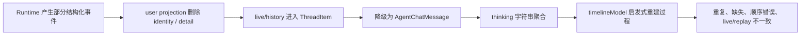
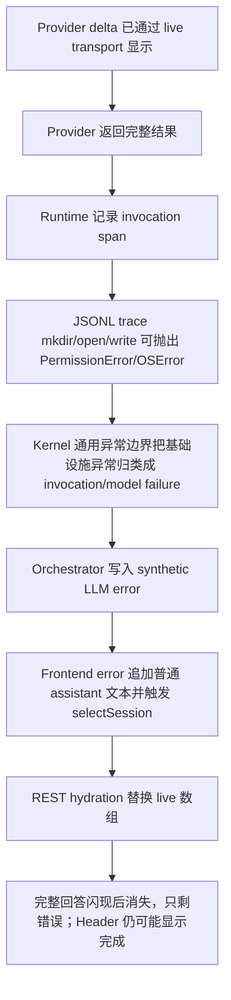
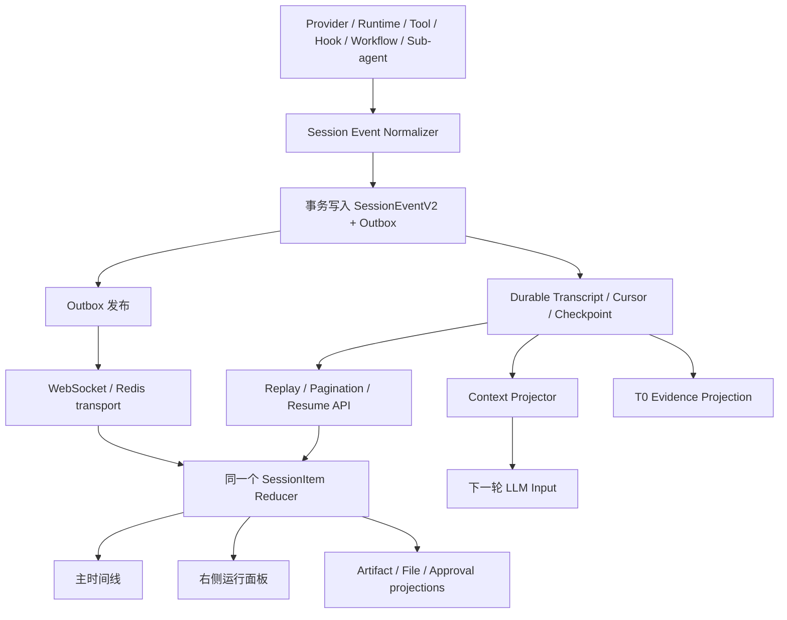

# Hive Session V2：CC 底线与 Codex 抽象对齐契约（2026-07-14）

> 状态：设计权威；Group 2/3/4 substrate 已分别形成并部署，但 2026-07-17 live-entry/path 复核重新打开 `P1-004`、`SES-CONSUMER-001`、`A2A-TERMINAL-001`、`TEAM-FANOUT-001`、`ROOT-TREE-001` 五个回归 leaf。协作类型修复已随 commit `b9852f37f` 三服务同源部署并完成 production migration/readiness/health；随后真实截图再次证明 `SES-CONSUMER-001` 的公开 prose、Task、live refresh 与 artifact 消费仍未闭环，当前 §28.5 / `EVID-G2-016` 仅为 `in_progress-local-green`。新代码发布和 authenticated/browser 行为 canary 前，总报告不得恢复 Group 2 closed；完整 Session V2 继续由 Group 6/7/8/9/10 验收。
>
> 集成关系：本文裁决 Session Event / Item / Reducer，不独立定义当前断点总数或程序施工顺序。fleet、单根 Session 的 100-way root execution、Context Resource Plane、跨渠道 A2A 与 canonical ledger 统一以 `docs/agent-native-unified-atomic-review-2026-07-14.md` 为准。
>
> 施工消费合同：后续实现必须先读本文全文，不得用 Group 摘要、旧 UI 文档或兼容投影替代。总报告 §8.1 必须同步维护本文章节、`S-01`–`S-30` 与 `SESSION-G1`–`SESSION-G30` 的唯一 Group 归属；§9 的 Group 2 是 Session 机械事实语言主实现，Group 3 已消费并关闭 root admission/coverage/G9，Group 4 已消费并关闭 result/fan-in/mailbox，Group 6/7/8/9/10 继续消费 compaction、跨渠道、Memory/Knowledge evidence、产品投影与最终重认证合同；§12 维护 canonical owner、状态和对应 `EVID-G*`。任何 event/item/schema、migration/backfill、reducer、UI/E2E 或生产证据都必须回填总报告，并同步更新本文设计状态；两边不一致时不得宣称闭环。
>
> 适用范围：Web Session、RuntimeTask、ChatSession、模型循环、工具循环、Hook、Skill、Memory、Sub-agent、A2A、Workflow、Compaction、文件与交付物，以及它们在主时间线、右侧运行面板、恢复/重放中的统一表达
>
> 本文同时记录目标契约与当前证据。2026-07-16/17 已建立 canonical event/item、persist-before-publish、ready/cursor transport、canonical frontend reducer、mixed-runtime root ledger、durable cycle/approval、immutable result object、ref-only outbox、ordered integration page 与 governed reader；这些 substrate 证据仍有效，但不能覆盖后来坐实的消费/终态/产品身份回归。§28.4 与统一总报告 `EVID-G1-017/G2-015/G3-008` 是本轮五个回归 leaf 的当前状态；极端 compaction、跨渠道 A2A、首次连接/真实重连浏览器终验、全历史 backfill、V1 writer 退出、feedback 产品面与最终生产观察仍由其唯一 owner Group 继续关闭。

---

## 0. 本文的裁决位置

本文在 `docs/ccplus-north-star-contract-2026-06-24.md` 的总边界之下，专门裁决 Session Runtime 与 Session UX：

1. **CC / FreeCode 是完整 Agent 生命周期和能力语义的底线。**
2. **Codex 是 Thread / Turn / Item、事件生命周期、恢复与 Workbench 表达的工程抽象增量。**
3. **Hive-native 的 Memory、Skill、Sub-agent、A2A、Workflow、治理和自进化必须作为一等类型加入该模型，不能退化成一串通用日志。**

当本文与以下历史文档在 Session 事件模型、数据权威或“是否已落地”的结论上冲突时，以本文为准：

- `docs/ccplus-session-ux-contract-2026-06-26.md`
- `docs/session-rendering-streaming-cc-codex-gap-analysis-2026-07-03.md`
- `docs/session-timeline-projection-contract-2026-07-04.md`

上述文档中的视觉目标、性能分析和交互细节仍可复用；但其中“已有底层事实流基本完整”“仅剩展示密度问题”或“已落地”的判断，不再作为当前完成事实。

本文的核心公式是：

```text
第一层（不得削弱）：CC / FreeCode 的完整 Session 行为语义
第二层（只能增量）：Codex 的 Thread / Turn / typed Item、恢复和 Workbench 工程
第三层（只能增量）：Hive 的治理、自进化和协作原生类型
= Hive Session V2
```

这个公式有严格顺序，**不是三组选项的并集，更不是拿 Codex 替换 CC**：

- CC 决定“Agent 在一个 Session 内如何接受信息、排队、继续当前工作、调用工具、等待权限、压缩、恢复、fork 和结束”；
- Codex 决定“如何给上述事实稳定 ID、typed lifecycle、持久 history、active tail、steer precondition 和更清楚的 UI”；
- Hive-native 只能在前两层之上增加企业 authority、Memory、Skill、A2A、Workflow 和可审计恢复；
- 若某个 Codex/Hive 设计让 CC 已有能力消失，或者把 CC 的可恢复队列退化成浏览器瞬时状态，裁决结果一律是**不采纳该设计**。

一句话裁决：

> Session 不能再从一条最终 `ChatMessage`、一个聚合 `thinking` 字符串或前端相邻关系中“猜”出过程；Runtime 必须直接产生可持久化、可恢复、可重放、可投影的 typed Session Items。

### 0.1 CC 是基础、Codex 是追赶目标：同维度裁决表

| 维度 | CC / FreeCode 语义底线 | Codex 可采纳工程增量 | Hive Session V2 最终合同 |
|---|---|---|---|
| Session 权威 | append-only transcript、conversation/query state、resume/fork/compact 边界 | Thread → Turn → ThreadItem；rollout/history projection 与 active turn lifecycle | `SessionEventV2` 唯一事实 + Turn/Run aggregates；projection 可删可重建 |
| 新输入 | 空闲时进入 query；active 时进入 `now/next/later` queue，在 tool/result 安全边界 drain；主输入不被 subagent 消费 | `TurnSteerParams` 带 expected turn precondition；TUI 有 pending input preview，但 queue-next 主要是 client memory，不是 durable cloud API | durable `HumanInputIntentV2` + command receipt + Hook admission + mailbox settlement；保留 CC steer floor，增加显式 queue/replace/fork |
| 内容与流式 | text/thinking/tool blocks 保持原字节、原顺序和稳定 UUID；没有原生 commentary/final phase | 有 phase 时显式 Commentary/FinalAnswer；typed item started/completed 与部分 delta；committed history + active streaming tail | 无 phase 先 `assistant_text(unknown)`；显式 phase 才映射；同 ID 原位 delta/snapshot/complete；zero-copy final envelope |
| Tool loop | 每个 tool use 必须恰好一个 matching tool result；失败/拒绝/取消也要 API-valid；下一轮才能继续 | tool/file/plan/reasoning 等 typed Items 提升 UI 可消费性，但 lifecycle/delta 覆盖并非所有 kind 完全一致 | `tool_call` 稳定主 Item + child `tool_result.completed` exactly-one；恢复前 half-pair repair |
| Hook/权限 | SessionStart、UserPromptSubmit、PreToolUse、Stop/SubagentStop 各有不同 blocking/prevent 语义 | Codex 的 typed approval/request/item 表达可改善呈现，不改变 CC Hook 行为 | boundary-specific Hook state + versioned approval/control receipt；executor warning 不冒充模型失败 |
| Compaction | transcript 证据保留；model input 固定为 boundary → summary → preserved → attachments → hook results | typed compaction/history item 与稳定 Workbench 表达可采纳 | UI/Audit history 与 Context Projection 分离；coverage ledger、source refs、Pre/SessionStart/Post Hook 完整 |
| Resume | 从 transcript 恢复；修复 unresolved tool use/orphan result/thinking 与中断 continuation，不能发 half-pair | Thread/Turn state、stable item identity、active lock 与 replay reducer 提升工程确定性 | highest-contiguous replay + result/input/saga reconciliation + Provider API-validity gate |
| Sub-agent | 父层能看到 child live progress、最近活动、tool count/tokens，并展开 sidechain | typed collaboration items/active tail 可改善层级呈现 | 父 Item 实时摘要 + 内部 child execution stream；它不是普通用户可导航的数字员工 Session，不全量扁平化，也不只剩 terminal 摘要 |
| 用户呈现 | queue preview、按发生顺序的 messages/tool groups、可展开完整 transcript；状态回答“收到/在做/已采用/可恢复” | 稳定历史 + active tail、pending input、typed failure/approval，减少 UI 猜测 | Codex 风格克制 Workbench；Run/Turn/Transport/Projection 四状态正交，错误域与恢复动作可理解 |

所以“对齐 Codex”绝不等于把 CC 改成 Codex：**先证明 CC 的输入、循环、Hook、tool pair、compact、resume、subagent 行为没有丢，再用 Codex 的类型、稳定 identity、active tail 和 UI 把它做得更清楚。**

---

## 1. 为什么这不是一个 UI 样式问题

用户期待看到的不是更多日志，而是一个连续、可信、可恢复的工作过程：

```text
用户请求
→ 模型公开工作说明
→ 工具调用与结果
→ 上下文压缩
→ 模型继续工作
→ 文件编辑 / 子 Agent / Workflow
→ 最终答案与交付物
```

当前 Hive 的主要问题不是折叠样式，而是这条链路在事实层被压扁：

- 中间模型输出通常聚合进最终消息的 `thinking` 字段；
- user projection 会清除部分工具、Workflow、Sub-agent、Compaction 标识；
- live 路径和 history/replay 路径经过不同形态的数据；
- 前端把 `ThreadItem` 再降级成旧 `AgentChatMessage`；
- 时间线随后依据字符串、消息位置和相邻关系重新推断“思考—工具—结果”；
- 运行中、刷新后、断线重连后可能得到不同的结构；
- 右侧面板和主时间线可能从不同派生状态计算，造成重复的 `Action Started`、错误计数或幽灵运行态。

因此，单纯修改 CSS、折叠样式、文案或 `buildCells()` 无法闭环。必须先修正 Session 的事实模型，再由同一事实模型投影 UI。

---

## 2. 本轮目标与非目标

### 2.1 目标

本文一次性明确：

1. CC 已经做到、Hive 必须守住的生命周期底线；
2. Codex 在底线上抽象出的工程对象，Hive 应当采纳的部分；
3. Hive-native 能力如何进入同一 Session 模型；
4. Session 的唯一事实源、事件信封、Item 模型、顺序与幂等规则；
5. 公开工作说明、Reasoning、最终答案的边界；
6. Tool、Hook、Compaction、Sub-agent、Workflow、Memory、Skill、文件和交付物的表达；
7. live、reconnect、replay、reload、resume 如何得到同一结果；
8. 历史数据如何无损迁移；
9. 初次连接、断线恢复、运行状态和历史追平如何各自表达；
10. 用户在运行中继续输入时，steer、下一轮排队、中断重做、回答问题与评价 feedback 如何分开；
11. 模型已经产生的内容如何先成为 durable fact，且永不被 trace、projection 或 transport 故障改写成 LLM failure；
12. 什么证据出现后，才可以说 Session 已经对齐 CC + Codex。

### 2.2 非目标

本文不做以下事情：

- 不要求或承诺展示模型不可公开的原始私有 Chain of Thought；
- 不把“显示更多原始 token”当作产品透明度；
- 不用固定文案伪造模型的思考过程；
- 不通过自然语言关键词决定一段话是不是 final、permission、progress 或 reasoning；
- 不把 Codex 的 UI 像素级复制当作架构对齐；
- 不让 Codex 抽象覆盖 CC 已有的工具、Hook、Sub-agent、Skill 或生命周期能力；
- 不借 Session 重构删除 Hive-native 的 Memory、A2A、Workflow 或治理语义；
- 不在本文中宣称实现、迁移或生产验收已经完成。

---

## 3. 术语：必须先把层级说清楚

| 对象 | 定义 | 关键不变量 |
|---|---|---|
| Session / Thread | 一段可持续、可恢复、可 fork 的用户工作上下文 | 拥有稳定 ID、递增 cursor、可分页历史 |
| Turn | 一次已接受的用户输入及其对应 Agent 工作 | 用户输入先持久化；一个 Turn 可以包含多轮模型/工具往返 |
| Run | 执行某个 Turn 的 RuntimeTask 实例 | 可恢复、可取消、可重试；不能由浏览器连接生命周期决定 |
| Round | 一次模型请求及其后续工具响应闭环 | 用于模型循环和 compaction 前后排序，不等于用户 Turn |
| Event | 不可变的事实变化 | append-only、唯一 `event_id`、有 session sequence |
| Item | 由一组 Event 归约得到的可识别工作对象 | 稳定 `item_id`；started/delta/completed 更新同一个对象 |
| Projection | 从事实流生成的读模型 | 可重建；不能成为新的事实权威 |
| Transcript | 用户和 Runtime 的持久事实历史 | Compaction 不得删除其证据 |
| Context Projection | 为下一次模型调用组装的上下文 | 可以压缩、引用和渐进式加载，但必须有覆盖账本 |

### 3.1 CC 原始块与 Hive/Codex 语义通道必须同时保留

这里不能倒置基线：**CC / FreeCode 原生底线不是 `commentary/final` phase，而是按 Provider/API 合法顺序保留 text、thinking、tool use 与 tool result block 的原始字节、顺序、UUID 和配对关系。** Codex 的显式 `MessagePhase` 与 Hive 的 typed Item 是建立在这条底线上的追赶增量，不是用来重写 CC transcript 的理由。

因此 Hive 不能继续用一个 `thinking` 字段承载所有非 final 内容，也不能在 Provider 没有 phase 时猜 phase。目标协议至少区分：

| 语义 | 用途 | 默认用户可见性 | 是否进入最终答案 |
|---|---|---:|---:|
| `assistant_text`（`phase=unknown`） | Provider 未给 phase 的原始 assistant text block | 可见 | 由后续机械 terminal seal 引用，不能预先猜测 |
| `assistant_commentary` | 模型主动给用户的工作说明、阶段结论、下一步动作 | 可见 | 否 |
| `assistant_reasoning_summary` | Provider 或模型提供的安全推理摘要 | 按产品策略可见 | 否 |
| `assistant_reasoning_private` | Provider 原始受限推理证据 | 不直接展示 | 否 |
| `assistant_final` | Turn 的终局回答 | 可见 | 是 |

产品界面可以把 `assistant_commentary` 或公开 `reasoning_summary` 显示为“思考”“工作过程”或“进展”，但底层语义不能混淆。对于 CC/Provider 没有显式 phase 的 text，必须先保存为 `assistant_text(unknown)`；只有模型循环的机械 terminal 边界成立后，才能创建一个引用该原始 Item 的 final envelope，不能复制、删除或改写原 block。

### 3.2 对“思考过程”的明确裁决

用户需要的是**可信的工作可见性**，不是强行泄露私有 Chain of Thought：

- Codex 风格的 commentary、preamble、progress narration 在 Provider 明确标注时应保留在原始顺序中；
- CC 风格的无 phase text block 先按 `unknown` 原样保留，不能因位置或措辞被提前分类；
- Provider 明确提供的安全 reasoning summary 可以作为独立 Item；
- Provider 标记为受限的 raw reasoning 只做受控证据保存，不直接进入普通用户 UI；
- 如果模型没有产生 commentary 或 reasoning summary，平台必须如实不显示，不能插入“Agent 正在整理思路”；
- 平台可以通过高质量 Runtime prompt 鼓励模型在长任务中给出有意义的公开进展，但不能替模型撰写语义内容。

### 3.3 Session 的三个输入平面

“用户又发了一句话”不是一个足够精确的 Runtime contract。Session 必须显式区分三个输入平面，不能再根据请求到达瞬间“刚好有没有 active run”来猜用户意图：

| 输入平面 | 典型输入 | 是否进入模型上下文 | 权威语义 |
|---|---|---:|---|
| Conversation Input | `start_turn`、`steer_current_turn`、`queue_next_turn`、`answer_request` | 是 | 用户与 Agent 的对话事实 |
| Control Input | `cancel`、approval、permission response、Workflow gate | 只以 typed receipt 进入 | 控制执行、权限和外部效果 |
| Evaluation Feedback | 点赞/点踩、评分、质量标签、运营评价 | 默认否 | 对已完成结果的评价证据 |

因此：

- `evaluation_feedback` command 永远不等于 steering；
- 用户纠正当前工作，必须显式选择 `steer_current_turn`；
- 用户希望当前工作继续、自己的新问题稍后处理，必须显式选择 `queue_next_turn`；
- 用户希望停止当前工作并用新要求重做，必须显式选择 `interrupt_and_replace`；
- 对已完成回答的评价，除非用户再次确认“把它作为新消息发给 Agent”，否则不得偷偷注入模型上下文或 Memory；
- approval、permission、ask-user answer 必须绑定原 request Item，不能降级成普通聊天文本。

### 3.4 四套正交状态机

Session V2 同时存在四套状态，但它们回答的是不同问题：

| 状态机 | 回答的问题 | 示例状态 |
|---|---|---|
| Run State | 当前执行 attempt 做到了哪一步 | `queued/starting/running/waiting/cancelling/completed/failed/cancelled/needs_reconciliation` |
| Turn State | 这次用户意图及其全部 retry attempts 的总体结果 | `accepted/queued/active/waiting/completed/failed/cancelled/needs_reconciliation` |
| Transport State | 当前浏览器能否实时接收增量 | `initializing/connected/reconnecting/degraded/offline/auth_failed` |
| Projection Sync State | 当前读模型是否追上 canonical sequence | `hydrating/catching_up/current/gap_detected/stale` |

硬规则：Transport 断开不改变 Run；Projection 落后不改变 Run；Run terminal 也不等于浏览器 transport 已关闭。任何 UI 文案、Header、右侧面板或 composer 行为都必须明确自己消费哪一套状态。

### 3.5 Canonical Run 状态机

```ts
type RunStateV2 =
  | { state: "queued" }
  | { state: "starting" }
  | { state: "running" }
  | {
      state: "waiting";
      reason: "user_question" | "approval" | "permission" |
              "workflow_gate" | "resource" | "retry_backoff";
      waiting_item_id: string;
    }
  | { state: "cancelling"; cancellation_item_id: string }
  | { state: "needs_reconciliation"; recovery_item_id: string }
  | { state: "completed"; result_id?: string }
  | { state: "failed"; error_item_id: string; retryable: boolean }
  | { state: "cancelled"; cancellation_item_id: string };
```

合法主迁移：

```text
queued → starting|failed|cancelled|needs_reconciliation
starting → running|failed|cancelling|needs_reconciliation
running ↔ waiting
running|waiting → cancelling → cancelled|needs_reconciliation
running|waiting → completed|failed|needs_reconciliation
needs_reconciliation → starting|running|waiting|cancelling|completed|failed|cancelled
```

- `completed/failed/cancelled` 是该 Run attempt 的 terminal；retry 创建新的 attempt 和 ID，不把旧 Run 倒回 running；
- `completed_with_warnings` 是 `completed + operational_health=degraded` 的产品投影，不是把 semantic outcome 改成另一种失败；
- `waiting` 必须有 typed reason 和原 request/gate Item；“idle”不是 active Run 的模糊等待态；
- queue-next 创建新 Turn 的 `queued` 状态；steer 不创建第二个并发 Run；
- WebSocket connect/close、React mount/unmount、history hydrate 都不在上述迁移图中。

Event → Run state 是一对一机械映射，禁止 reducer 再猜：

| Canonical event | Run state |
|---|---|
| `run.queued` | `queued` |
| `run.starting` | `starting` |
| `run.running` | `running` |
| `run.waiting` | `waiting(reason, waiting_item_id)` |
| `run.cancelling` | `cancelling` |
| `run.needs_reconciliation` | `needs_reconciliation` |
| `run.completed/failed/cancelled` | 对应 terminal state |
| `run.reconciled` | payload 指定的已证明 `resume_state`；本身不是长期产品状态 |

`run.reconciled` 不得携带一个任意字符串让 reducer “猜回去”。它的 payload 必须是以下 discriminated union，并且只能从 `needs_reconciliation` 迁移到对应状态：

```ts
type RunReconciledPayloadV2 = {
  reconciliation_generation: number;
  recovery_item_id: string;
  proof_refs: string[];
} & (
    | { resume_state: "starting"; dispatch_fence_ref: string }
    | { resume_state: "running"; execution_fence_ref: string }
    | {
        resume_state: "waiting";
        reason: "user_question" | "approval" | "permission" |
                "workflow_gate" | "resource" | "retry_backoff";
        waiting_item_id: string;
      }
    | {
        resume_state: "cancelling";
        cancellation_item_id: string;
        effect_fence_ref: string;
      }
    | { resume_state: "completed"; outcome_id: string; result_id?: string }
    | { resume_state: "failed"; error_item_id: string; retryable: boolean }
    | { resume_state: "cancelled"; cancellation_item_id: string }
  );
```

恢复器必须在同一数据库事务内锁定 Run aggregate/version、验证 `proof_refs`、append `run.reconciled` 和 outbox，再 CAS 到 payload 指定的状态。`starting/running/waiting/cancelling` 各自要有上表必需的 fence/Item；terminal 要有 outcome/error/cancellation 证据。不能因为 worker “看起来正在跑”就写 `running`，也不能用 UI 旧状态作证据。

### 3.6 Canonical Turn 状态机与 Run attempt 聚合

```ts
type TurnStateV2 = {
  state: "accepted" | "queued" | "active" | "waiting" |
         "completed" | "failed" | "cancelled" | "needs_reconciliation";
  turn_id: string;
  input_id: string;
  run_attempt_ids: string[];
  active_run_id?: string;
  terminal_result_id?: string;
  terminal_run_id?: string;
};
```

Turn 和 Run 不是同一状态机：

- `start_turn` 接受后创建 Turn；立即获得 admission 时进入 `active`，否则进入 `queued`；
- `queue_next_turn` 在还没有 Run 时已经是合法 Turn，因此 Turn-scoped Item 不能强制有 `run_id`；
- 每次执行/重试创建新的 `run_id` 并 append 到 `run_attempt_ids`。旧 attempt 的失败、取消和证据永远保留；
- 同一用户意图、无新增语义输入的基础设施/provider retry 可以留在同一 Turn；用户修改任务目标、stop-and-replace 或 queue-next 创建新 Turn；
- 只有一个有效 `RunOutcomeSeal` + terminal final envelope 能使 Turn `completed`；per-Round `ModelResultSeal` 即使 finish reason 是 tool use 也绝不能结束 Turn；所有 attempt 已 terminal 且没有可继续 retry 时，Turn 才按最后权威 outcome 进入 `failed/cancelled`；
- 任一 attempt 正在 `running/waiting/cancelling/needs_reconciliation` 时，Turn 映射为对应的 `active/waiting/needs_reconciliation`；
- retry 被 admission 后，新 Run 成为 `active_run_id`。Header 显示 active Turn + active Run；旧失败 attempt 只在展开历史中显示，不能把正在重试的 Header 改回 failed；
- 没有 active Turn 时，Header 才显示最新 Turn 的 terminal outcome；排队 Turn 用独立 queue badge，不能覆盖当前 active Turn。

合法主迁移：

```text
accepted → queued|active|failed|cancelled|needs_reconciliation
queued → active|failed|cancelled|needs_reconciliation
active ↔ waiting
active|waiting → completed|failed|cancelled|needs_reconciliation
needs_reconciliation → active|waiting|completed|failed|cancelled
```

Turn reducer 同样只消费 canonical events：`turn.accepted/queued/started/waiting/completed/failed/cancelled/needs_reconciliation` 分别映射 `accepted/queued/active/waiting/completed/failed/cancelled/needs_reconciliation`；`turn.reconciled` 必须带以下精确 payload：

```ts
type TurnReconciledPayloadV2 = {
  reconciliation_generation: number;
  recovery_item_id: string;
  proof_refs: string[];
  run_attempt_ids: string[];
} & (
    | { resume_state: "active"; active_run_id: string }
    | {
        resume_state: "waiting";
        active_run_id: string;
        waiting_item_id: string;
      }
    | {
        resume_state: "completed";
        terminal_run_id: string;
        terminal_result_id: string;
        outcome_id: string;
      }
    | { resume_state: "failed"; terminal_run_id: string; error_item_id: string }
    | {
        resume_state: "cancelled";
        terminal_run_id: string;
        cancellation_item_id: string;
      }
  );
```

`turn.reconciled` 也只能从 `needs_reconciliation` 进入 payload 指定的 `active/waiting/terminal` 状态，并与 Turn aggregate CAS/outbox 同事务。队列是已持久的确定状态，不用 reconciliation “恢复成 queued”；如果无法证明 active/waiting/terminal 中的任一个，就继续 `needs_reconciliation`。Run attempt 聚合只能决定 Turn 的派生 active/waiting/terminal 选择，不能制造 Event Matrix 中不存在的状态。

---

## 4. 源码核对基线

本文最初基于 2026-07-14 的冻结源码快照；2026-07-16 又对当前 checkout 与生产部署做了只读取证。这里的 commit 是证据快照，不应被描述成永久“当前版本”：

| 基线 | Commit | 用途 |
|---|---|---|
| Hive（原始设计快照） | `501db6555dae374e5fcf43a6fdcfe8a3dd89343e` | 2026-07-14 实现事实 |
| Hive（事故补全 stable HEAD） | `b805dd67eaeb4ee6ef78f661fb52777ea9cc859c` | 2026-07-16 只读设计证据；当时相关 dirty code 只能算 WIP，不能倒填为实现完成 |
| Hive（本文完整设计校对快照） | `af8b42e29f7c4859ef3eb17bee34096d68413748` | S-01–S-30 / G1–G30 结构与源码引用复核时的 checkout provenance |
| Hive（Group 2 implementation） | `c50fea9da`、`578e773ba`、`5ffdb464f` | canonical mechanical truth、legacy-open evidence projection 与 frontend single-reducer 三个独立 code commit；文档证据 commit 不改变 deployed runtime bytes |
| Railway production（Group 2 exact source） | backend `e59dd282-97e5-42cb-b67a-84836bed0e09`；backend-api `77967ddf-77d8-4b70-84f4-f3b2d8299895`；frontend `3eb6c453-90dc-422d-990e-96ee2ee0131b` | 三服务均 `SUCCESS` 且来自 `5ffdb464f` archive；结合 migration/projection/health/log canary 才构成 Group 2 生产证据，不能外推为完整 Session V2 完成 |
| Hive（Group 3 implementation） | `01e979bb3` | `runtime_root_items`、A2A/Subagent/Team/Workflow admission、durable path/approval/terminal、Team fanout recovery 与对应 migration/tests；只关闭 Group 3，不吞并 Group 4 result/fan-in |
| Railway production（Group 3 exact source） | backend `b67055e5-9dbc-4e4d-903e-14fe8322b728`；backend-api `dd748dd4-ea68-4d94-a5bb-4fda7ecd7b90`；frontend `20ca32aa-7682-4f6a-b6a5-ceebcca0fdad` | 三服务最新 deployment 均 `SUCCESS` 且来自 `01e979bb3`；首次 API readiness fail-closed/同 archive 重提、migration head、145-table/4-trigger readiness、RLS/health 共同构成 Group 3 生产证据 |
| Hive（Group 4 implementation） | `4e385d423` | immutable `runtime_result_objects`、ref-only completion outbox、mailbox cursor、integration epoch/page、governed reader、metrics、lossless migration 与 real-PG concurrency/fault tests；只关闭 Group 4，不吞并 Group 6 完整 Context Resource Plane |
| Railway production（Group 4 exact source） | backend `b16d1c5b-c28a-480e-896b-a8dd2ffd153a`；backend-api `da84f7ae-0157-4551-95d0-4f93dbe0f029`；frontend `96090a47-4267-488a-b0f5-94a5c18e6667` | 三服务均 `SUCCESS` 且来自 `4e385d423`；migration head=`runtime_result_fanin_0717`，148-table/4-trigger readiness、147-row lossless backfill、RLS/FORCE、source hash、health 与 ref-only production inventory 共同构成 Group 4 生产证据 |
| FreeCode | `7dc15d6c8fb0c40c7fcc02ce9b58204324252632` | CC 可运行语义底线 |
| claude-code-org | `a99de1bb3c0c301b83b784abbcdb7a3674b2cd45` | CC 交叉验证 |
| Codex | `5c19155cbd93bfa099016e7487259f61669823ff` | typed thread/item 与 Workbench 工程增量 |

源码优先级遵守项目总契约：FreeCode 第一，claude-code-org 交叉验证，Codex 只提供不削弱 CC 语义的增量。

### 4.1 源码证据账本：每条“对齐”必须能回到具体实现

以下路径均相对 §4 对应冻结仓库根目录。后续实现评审若改变本文语义，必须先给出同一冻结基线或更新基线中的反证；不能以产品印象、截图或旧文档覆盖源码事实。

| 裁决 | CC / FreeCode 第一证据 | Codex 增量证据 | 本文采用方式 |
|---|---|---|---|
| accepted prompt / transcript | `src/QueryEngine.ts::submitMessage`、`src/hooks/useLogMessages.ts` | 不作为 CC floor | §5.1 如实区分 interactive 异步记录、SDK 非 bare await 与 bare fire-and-forget；Hive 云端再加强为 dispatch 前 durable |
| active input queue | `src/utils/handlePromptSubmit.ts`、`src/utils/messageQueueManager.ts`、`src/query.ts` 的 `queued_command` drain | `core/src/session/mod.rs::steer_input`、`core/src/session/input_queue.rs`、`core/src/session/turn.rs` | CC 决定 queue priority/FIFO/safe boundary；Codex 增加 expected-turn precondition；Hive 增加 durable mailbox/receipt |
| raw blocks / tool pair | `src/utils/messages.ts::normalizeMessages/normalizeMessagesForAPI`、`src/components/Messages.tsx` | `app-server-protocol/src/protocol/v2/item.rs::ThreadItem` | 原 bytes/order/Provider tool ID 是底线；typed Item/runtime invocation 是增量 |
| Hook 边界 | `src/utils/processUserInput/processUserInput.ts`、`src/utils/hooks.ts`、`src/query/stopHooks.ts` | typed approval/request Item 仅作表达增量 | §5.5/§10.3.1 分别保留 SessionStart、UserPromptSubmit、PreToolUse、Stop/SubagentStop 语义 |
| Compaction | `src/services/compact/compact.ts::buildPostCompactMessages` 与 Pre/PostCompact Hook 路径 | `ThreadItem::ContextCompaction` | Context Projection 改变但完整 transcript 不删除；顺序与 coverage ledger 见 §15 |
| resume / API-valid repair | `src/utils/conversationRecovery.ts`、`src/utils/sessionRestore.ts`、`src/utils/messages.ts::normalizeMessagesForAPI` | typed Thread/Turn replay 只作工程参考 | 恢复 unresolved tool pairs/orphan blocks/continuation，再允许 Provider dispatch |
| sub-agent lifecycle | `src/tools/AgentTool/AgentTool.tsx`、`src/tools/AgentTool/runAgent.ts` | `ThreadItem::CollabAgentToolCall/SubAgentActivity` | CC live child progress 是底线；Codex typed collaboration 是增量；Hive 用父 Item + child Session |
| Thread/Turn/Item | 不用 Codex 替代 CC transcript | `app-server-protocol/src/protocol/v2/item.rs`、`app-server-protocol/src/protocol/v2/turn.rs::TurnSteerParams` | 作为稳定 identity/lifecycle 的追赶目标 |
| phase | CC/FreeCode 没有原生 commentary/final phase | `protocol/src/models.rs::MessagePhase` | 只有显式 phase 才映射；`None`/无 phase 保持 unknown，terminal 用 zero-copy envelope |
| history reducer | CC 完整 transcript 仍是语义 floor | `app-server-protocol/src/protocol/thread_history.rs::ThreadHistoryBuilder`、`app-server/src/thread_state.rs` | 借 stable typed reducer family，不复制 Codex lossy persistence |
| active tail / pending UI | `src/components/PromptInput/PromptInputQueuedCommands.tsx` 已证明 queued preview 是 CC 用户语义 | `tui/src/chatwidget.rs`、`tui/src/chatwidget/input_queue.rs::PendingInputPreview`、`tui/src/chatwidget/streaming.rs`、`tui/src/pager_overlay.rs` | committed history + mutable active tail + pending chips；完成时同 identity 原位冻结 |

因此，“CC 是基础、Codex 是追赶目标”的精确定义不是视觉偏好，而是**裁决权分层**：遇到冲突时，CC 的完整输入/循环/Hook/恢复能力获胜；Codex 的类型、precondition、stable reducer 与 UI 只有在不删能力时才获准进入 Hive。

---

## 5. CC / FreeCode：Hive 必须对齐的底线

CC 的关键价值不只是“能调用工具”，而是它保留了一条完整、有序、可继续的 Agent 生命周期。

### 5.1 已接受的用户输入先成为事实

CC 的 interactive REPL 与 `QueryEngine`/SDK 路径需要精确区分，不能写成一个不存在的统一时序：

- interactive REPL 先把用户消息加入 UI state，`useLogMessages()` 随渲染异步写 transcript，并不是所有交互提交都在 query loop 前同步等待落盘；
- `QueryEngine.submitMessage()` 在非 `--bare` SDK/print 路径会在进入 model loop 前 `await recordTranscript(messages)`；`--bare` 仍写 transcript，但 fire-and-forget；
- 这说明 CC 的语义底线是“accepted prompt 必须进入可恢复 transcript”，而 Hive 云 Runtime 的**更强工程合同**是 command receipt 与输入证据 durable commit 后才能 dispatch Provider。

Hive 采用这个 stronger cloud contract，才能保证：

- 浏览器断开不会丢失 Turn；
- Runtime 崩溃可以恢复；
- resume/fork/compact 有稳定边界；
- 用户看到的输入与模型实际接受的输入一致。

Hive 还必须区分三个不同的“接受”：

1. `human_input.accepted`：command registry 已幂等接受并持久化原始输入，只代表“系统收到了”；
2. `UserPromptSubmit` admission：CC hook gate 判断该 prompt 能否进入 query；
3. `turn.accepted`：hook gate 通过后创建的第一个 Turn 事实，才代表“Agent 会处理这次意图”。

`human_input.accepted` 不能被客户端气泡或异步 `ChatMessage` 代替；`turn.accepted` 也不能在 hook gate 之前预建，否则会产生 ghost Turn。

### 5.2 内容块按原始顺序保留

FreeCode 的 `normalizeMessages()` 会把 assistant/user content blocks 规范化为有序消息，并为其产生稳定顺序标识，而不是把整轮压成一个大字符串。

CC 并不提供 commentary/final phase；它提供的是有序的 text/thinking/tool blocks。Hive 对齐要求：

- 原始 text、thinking、tool use、tool result 的相对顺序、字节和稳定 ID 必须来自 Runtime 事实；
- Provider 有显式 phase 时才直接映射 commentary/final；没有时先写 `assistant_text(phase=unknown)`，不能机械猜测；
- 不能在最终回答到达后，再把聚合 `thinking` 人工塞到 final 前面；
- 同一 Round 中多次“说明—工具—说明—工具”必须逐项保留；
- CC transcript 内 Tool use 与 Tool result 必须通过 Provider 给出的稳定 `tool_use_id` 配对；Hive durable execution 额外分配全局 runtime `invocation_id`，不能把 Provider-scoped ID 当跨请求幂等身份。

### 5.3 工具循环是一等生命周期

CC 的工具调用不是一条泛化日志，而是 assistant content block、tool use、tool result、下一轮 assistant output 组成的循环。

Hive 对齐要求（下图中的 `assistant_text` 是 CC 原始 floor；显式 commentary/final 是 Codex/Hive 增量）：

```text
assistant text/thinking blocks
→ tool_call.started
→ tool_call.progress / approval / waiting（可选）
→ tool_call.completed | failed | denied | unavailable | cancelled
→ tool_result.completed（同一 runtime invocation；保留原 provider tool_use_id；exactly one）
→ 下一组 assistant blocks
```

每个 CC Provider `tool_use_id` 无论成功、失败、denied、unavailable、cancelled 或有证据的 abort，都必须产生**恰好一个** API-valid matching `tool_result`；Hive 用一一映射的 runtime `invocation_id` 承担执行幂等与恢复。权限卡片、错误 badge 或 Tool Item terminal 状态都不能替代 matching result。每个节点必须能被 transcript、恢复逻辑、UI 和审计共同消费。

### 5.4 Compaction 是明确边界，不是删除历史

FreeCode 通过显式 compact boundary 决定下一轮给模型的消息投影；历史 transcript 本身仍然存在。

Hive 对齐要求：

- `context_compaction` 是明确、可见、可恢复的 Item；
- 它改变后续模型输入投影，不重写用户已经看到的 Session 历史；
- 压缩摘要、覆盖范围、source refs、前后 token 计数、恢复引用必须可查；
- compact 后的新 assistant/tool cycle 继续追加在同一 Turn/Session 顺序中。

### 5.5 Session、Hook、Sub-agent 与 resume 是生命周期语义

CC 的能力边界包含 session lifecycle、hooks、sub-agent、tool permission、resume/fork/compact。它们不能仅作为后端内部实现存在。

CC 的 Hook 语义不是统一的“成功/失败通知”，而是按边界不同：

- `SessionStart` 覆盖 `startup/resume/clear/compact`；CC 在这个边界忽略 blocking error，加载/执行异常作为 warning，Session 继续；合法 additional context 仍进入后续上下文；
- `UserPromptSubmit` 的 `blockingError` 阻止 query，保留原 prompt 作为 warning/evidence；`preventContinuation` 保留 prompt，并附加 stopped message，但不调用模型；
- `PreToolUse` 可修改 tool input、决定 `allow/deny/ask`、追加 context 或停止；修改前后输入和决策必须可追溯；
- `Stop/SubagentStop` 的 blocking error 会成为隐藏 meta user feedback 并触发另一次模型迭代；`preventContinuation` 才是 terminal stop；
- Hook executor 自身异常是可见 warning，默认允许原生命周期继续，不能伪装成模型失败。

上述“异常后继续”适用于 CC-style lifecycle Hook。若某个检查实际承担 tenant/RLS、外部 effect policy 或其他 hard-invariant authority，它必须被建模为独立、可用性可观测的权威边界，而不是伪装成 best-effort Hook；该权威不可用时可 typed fail-closed，但只能阻止对应未授权 effect，不能把 Session/模型结果改写成 LLM failure。

Hive 对齐要求：

- Hook 的开始、阻断、prevented、批准、拒绝、失败、恢复要成为 typed Item，并保留上述边界差异；
- Sub-agent 的创建、运行、等待、产出与回收要有父子关系；
- resume/fork 必须恢复事实顺序和未完成 Item，而不是仅恢复聊天文本；在再次调用 Provider 前修复 unresolved tool use、orphan tool result/thinking 和中断 continuation，使请求永远不包含 half-pair；
- denied、unavailable、failed、cancelled、waiting 必须是不同状态。

### 5.6 Active Session 中的新输入：先排队，再在合法边界注入

这是本次最容易被错误理解、也是用户体验最关键的 CC 语义。FreeCode 的真实路径是：

1. `handlePromptSubmit.ts` 发现 `queryGuard.isActive || isExternalLoading` 时，不会启动第二个并发 query；它把 prompt/bash 连同 UUID、粘贴内容和 mode 放进统一 command queue；
2. 只有当前执行中的工具明确声明可中断时，提交才会触发 `abort('interrupt')`；普通 active turn 不会因为用户继续输入就被无条件杀掉；
3. `messageQueueManager.ts` 按 `now → next → later` 优先级、同级 FIFO 保存 user input、task notification 和 orphaned permission 等待项；用户输入默认 `next`，不会被后台通知饿死；
4. `query.ts` 只在已有 assistant tool use 与 tool result 已经形成合法 API 顺序后，抓取 queue snapshot，把 prompt 作为 `queued_command` attachment 注入**当前 query chain 的下一次模型请求**；slash command 不在 mid-turn 直接当文本注入；
5. 主线程只消费用户 prompt，sub-agent 不会偷走主用户输入；真正消费后才从 queue 删除并发出 command lifecycle `started`；
6. 如果本轮没有再进入一个合法模型边界，输入继续留在 queue，由 turn-end/下一轮路径处理，不能消失，也不能谎称已被模型看到。

因此，Hive 的 `steer_current_turn` 不是“修改一个已经发给 Provider 的 HTTP 请求”，而必须等价于：

```text
接受并持久化输入
→ 在 Composer 上显示为 pending steer
→ 等待当前 response/tool-result 边界闭合
→ 绑定下一次尚未发出的 Round
→ 进入模型上下文
→ 用 receipt 确认 applied
```

`queue_next_turn` 和 `interrupt_and_replace` 是更明确的产品增量，但不得删除上述 CC 默认能力。用户在 Agent 工作时继续发送补充，系统必须先接受并展示它，不能只给一个模糊的 disabled composer，也不能让浏览器刷新后丢失。

### 5.7 CC 在 Session 内维护什么状态、怎样呈现

CC 的事实状态和显示状态可以概括为下面五层：

| 层 | FreeCode 当前源码语义 | 用户看到的表达 | Hive 必须保持 |
|---|---|---|---|
| Conversation state | 一个 `QueryEngine` 对应一个 conversation；每次 `submitMessage()` 开新 turn，messages/file cache/usage 等跨 turn 保留 | 连续的一段 Session，而不是每次发送都像新任务 | Session 稳定 ID；Turn 分界；跨 Turn context 与证据可恢复 |
| Accepted input | interactive REPL 先入 UI state、由 `useLogMessages` 异步记录；非 bare `QueryEngine` 在 query loop 前等待 transcript，bare fire-and-forget | 用户立刻看到输入；运行中输入先作为 queue preview 出现 | stronger cloud contract：command/input evidence durable 后才 dispatch；再经 hook gate 产生 Turn |
| Active model/tool loop | text/thinking/tool use/hook/permission/tool result/下一次 assistant blocks 保持原始顺序；queued prompt 只在安全边界加入 | 工作过程按发生顺序展开；工具调用和结果成对；streaming text 原位收敛为 completed message | typed Item + stable block/call ID；无 phase 先 unknown；禁止 final + 聚合 thinking 倒推过程 |
| Compaction/resume | compact boundary 写 transcript；写 boundary 前先 flush preserved tail；模型上下文切窗不等于删除完整 transcript | 主视图可只呈现 compact 后活跃窗口，完整 transcript 仍可查看/恢复 | UI history/T0 不丢；Context Projection 独立；resume/fork 恢复原边界 |
| Pending input UI | `PromptInputQueuedCommands` 订阅 queue，以稳定 memoized message 呈现，避免 streaming re-render 闪烁 | Composer 下方能看见自己还没被消费的输入 | pending/applied/rejected 必须可见、可编辑/撤回；刷新后仍一致 |

FreeCode 的 `Messages.tsx` 还会：

- 先 `normalizeMessages()`，再按 `tool_use_id` 把 tool use、pre-hook、tool result、post-hook 归组；
- 保留 mid-turn drained user input，而不是把它当后台 notification 过滤掉；
- 底层 transcript 保留完整事实；transcript UI 可以分页、虚拟滚动或默认 cap，但必须提供 show-all/expand，普通主视图也可以做 compact-aware filtering 和折叠；这些都只是渲染投影；
- 使用稳定 UUID/分组 key，避免 streaming、compaction 或折叠时把已显示内容销毁重建。

所以，“CC 的呈现”不是要求 Hive 复制终端像素，而是要求用户始终能回答四个问题：**我刚才的话收到了吗、Agent 现在在做什么、它是否真的用到了我的补充、失败/中断后还能不能继续。**

### 5.8 CC 底线对照表

| CC 语义底线 | Hive 必须提供的等价物 | 不合格替代 |
|---|---|---|
| accepted prompt 可恢复；云端 stronger durability | `human_input.accepted` durable command receipt；hook 通过后 `turn.accepted` | 仅客户端气泡、gate 前 ghost Turn |
| active prompt 进入统一 queue | durable pending HumanInput + 可见 receipt | disabled composer、浏览器内临时数组 |
| safe-boundary mid-turn drain | bind 到下一次未发送 Round | 改写在途请求、并发启动第二个 Run |
| 有序 raw content blocks | `assistant_text(unknown)`/thinking/tool blocks 原样落 typed Items；显式 phase 仅做增量 | final + 聚合 thinking、无 phase 强行分类 |
| tool use/result pairing | Provider transcript 保留稳定 `tool_use_id`；Hive runtime invocation 一一映射；每个 use 恰好一个 `tool_result.completed` | 根据相邻消息猜测、只画错误 badge |
| compact boundary | `context_compaction` Item + context projection | 删除旧 UI 消息 |
| hook boundary semantics | 按 SessionStart/UserPromptSubmit/PreToolUse/Stop/SubagentStop 区分的 Hook Item | 一条通用 warning/统一阻断逻辑 |
| resume/fork | cursor、checkpoint、未完成 Item 与 API-valid tool pairs 恢复 | 只重放 ChatMessage、把 half-pair 发给 Provider |
| sub-agent lifecycle | 父子 Session / Item 引用 + live child progress | 只保留 terminal 摘要、把子对话全文扁平化 |
| terminal assistant output | 原 block byte-faithful + Codex/Hive final envelope | 混在 Processed 日志、复制或改写原 block |

---

## 6. Codex：在 CC 底线上值得对齐的抽象

Codex 的主要增量不是比 CC 多几个工具，而是把 Session 的变化抽象成稳定、可消费的协议对象。

这里必须再次强调：Codex 的 steer/input queue 与 UI 做法是追赶目标；**只要它与 CC 的完整生命周期发生冲突，CC 语义优先。** Hive 采纳的是 Codex 对 CC 能力的 typed engineering，不是把 CC 的 Session loop 改造成一组前端动画。

### 6.1 Thread → Turn → ThreadItem

Codex protocol v2 用 `ThreadItem` 表达不同工作对象，包括：

- `UserMessage`
- `AgentMessage`，并带 `phase`
- `Plan`
- `Reasoning`
- `CommandExecution`
- `FileChange`
- `McpToolCall`
- `DynamicToolCall`
- `CollabAgentToolCall`
- `SubAgentActivity`
- `WebSearch`
- `ImageView`
- `ContextCompaction`

Hive 应当采用同级抽象原则，而不是逐字复制枚举：**凡是用户、恢复器、治理面板或审计需要识别的工作对象，都必须有显式类型和稳定 ID。**

### 6.2 `started → delta → completed`

Codex 提供通用 `ItemStarted` / `ItemCompleted` 通知，并为 AgentMessage、Plan、Reasoning、Command 等**部分** Item 提供专用 delta；不是每个 Item 都保证三段齐全。客户端通过 `item_id` 更新既有对象，而不是不断追加相似日志。Plan 的 completed snapshot 明确是权威值，不能假设它等于所有 delta 的机械拼接；已废弃/不再发送的 delta 也不能被 Hive 当成必有协议。

Hive 对齐要求：

```text
item.started(item_id = A)
item.delta(item_id = A, ordinal = 1)
item.delta(item_id = A, ordinal = 2)
item.completed(item_id = A)
```

这是 Hive 的统一 target lifecycle 示例，不是声称 Codex 每个 Item 都会发出四条事件。Hive emitter 只能发 §10.3 对该 kind 合法的 lifecycle；前端 reducer 对 `item_id=A` 执行 upsert，任何 transport 重发都不得制造第二个“Action Started”，completed snapshot 与 durable result seal 最终裁决内容。

### 6.3 `Commentary` 与 `FinalAnswer` 是显式 phase

Codex 的 `MessagePhase` 区分中间 commentary 与 terminal final answer；**当 phase 存在时**，UI 不需要从消息位置或自然语言中判断“这是不是最后回答”。Codex 源码同时明确 Provider 并不稳定提供 phase，`None` 只能按 unknown/legacy compatibility 处理，不能被平台机械认定为 final。

Hive 对齐要求：

- 模型适配器尽量保留 Provider 的显式 phase；
- Runtime 根据模型循环的机械边界补充生命周期事实，而不是按关键词分类；
- Provider 本身没有 phase 时，V2 adapter 必须长期、诚实地输出 `assistant_text(phase=unknown)`，绝不能为了“协议完整”伪造 commentary/final；在 terminal result boundary 只由 Runtime seal 创建 zero-copy final envelope；
- 无法可靠映射的历史内容标记为 `legacy_unknown`，不能伪造 phase；
- `assistant_final.completed` 每个 Turn 最多一个有效 terminal Item，重试/替换关系必须显式。

### 6.4 Reasoning summary 与 raw reasoning 是不同通道

Codex 分离 reasoning summary delta 与 reasoning text delta，且二者都通过稳定 item ID 归约。

Hive 对齐要求：

- `assistant_reasoning_summary`、`assistant_reasoning_private`、`assistant_commentary` 分别建模；
- visibility 在服务端权威决定；
- user projection 可以隐藏内容，但不能删除 item identity、状态或存在性；
- UI 的“思考”标签必须知道自己展示的是 commentary 还是 safe summary。

### 6.5 持久 rollout 与产品 history 使用同一 typed projection

Codex 使用 `ThreadHistoryBuilder` 将持久 rollout 与运行中事件归约到同一 `Thread/Turn/ThreadItem` 读模型，并在 running-thread resume 时合并内存中的 active-turn snapshot。但当前 Codex 持久层仍有 Legacy/Paginated 双模式，事件持久化有显式过滤，app-server history 也明确是 lossy read model；新 paginated projector 主要消费 Turn lifecycle 与 completed Item snapshot。因此 Hive 对齐的是 **typed projection、stable identity、running active merge 和共享 reducer family**，不是把 Codex 的持久覆盖范围误当成 CC 的完整 transcript 底线。

Hive 对齐要求：

- 生产事实流只有一种 canonical envelope；
- WebSocket、Redis、分页 API、resume 和历史回放消费同一种事件；
- live 和 reload 使用同一个 reducer；
- Redis 是 transport，不是另一份运行事实源；
- `ChatMessage` 只能是兼容读模型，不能继续承担 process authority。

### 6.6 稳定历史与 active tail 分离

Codex 的 Workbench/TUI 把已提交历史与当前流式单元分开处理。这是性能和视觉稳定性的工程抽象，而不是改变事实顺序。

Codex 并非让每一种 Item 都共用同一个 mutable cell：agent/plan 使用 stream tail，exec/MCP 会更新 active cell，file change 也可能直接进入 history。Hive 对齐的是“两区模型与 stable identity”，下面是 Hive 自己必须满足的统一验收契约：

- completed items 冻结为稳定历史；
- 只有 active item 接受 delta 更新；
- 虚拟化、分页、折叠只影响渲染，不改变 item identity；
- active tail 完成后以同一 item identity 提交/合并，不能出现用户可见的删除再追加或 final 闪烁。

### 6.7 Codex 怎样处理运行中输入与 UI 状态

Codex 当前本地源码把同一问题做得比 Hive 更工程化：

- `TurnSteerParams` 强制携带 `thread_id + expected_turn_id + typed input`；服务端会拒绝空 expected ID、已无 active turn、turn ID 已变化，以及不可 steer 的 Review/Compact turn；
- `Session::steer_input()` 在持有 active-turn 状态边界时核对 precondition，把输入放进该 Turn 的 `pending_input`，不会开启第二个 Turn，也不会声称修改在途 sampling request；
- `turn.rs` 在每次 sampling 返回后检查 pending input，并在构造**下一次**模型请求前 drain 到 history；首个 sampling 以及 auto-compact 后需要先恢复 model/tool continuation 的边界会明确延后 drain；
- pending input 本身使 `needs_follow_up=true`，因此即使模型刚给出一个貌似 final 的 block，只要 steer 尚未消费，Turn 仍继续；
- `ThreadItem` 给 UserMessage、AgentMessage、Plan、Reasoning、CommandExecution、FileChange、MCP、WebSearch、SubAgent、ContextCompaction 等稳定 ID；started/completed 和各种 delta 都引用同一 item ID；
- `ThreadHistoryBuilder` 的同一 reducer family 同时覆盖 persisted rollout replay 与 running-thread rejoin，按 `(turn_id, item_id)` upsert snapshot；但 live 与 persisted 输入覆盖不同，Hive 不能复制其 lossy persistence；
- TUI 明确区分 committed transcript cells 与可原位变化的 `active_cell`；active cell 完成后 flush 进稳定 history，transcript overlay 只附加一个 render-only live tail；
- Composer 上方的 `PendingInputPreview` 把 pending steer、被拒后等待 turn-end 重投的 steer、普通 follow-up queue 分开显示，并明确告知“下一个 tool/result 边界后提交”以及“按键中断并立即发送”；这里的 follow-up queue 是 TUI client state，Codex app-server V2 当前没有 durable `queue_next_turn` API/receipt；
- steer 被拒或 turn 被中断时，输入会恢复到可编辑/可重投状态，不能静默丢失。

这给 Hive 的直接结论是：

```text
CC 决定 queue + safe-boundary injection + transcript/resume 的完整语义；
Codex 补上 expected_turn_id、typed rejection、stable Item、active tail 和清晰 pending preview；
Hive 再补 durable cloud mailbox、authority、exactly-once receipt、reconnect/replay 和多租户审计。
```

Hive 不得照抄 Codex 的本地内存队列、只返回 `turn_id` 的 steer response 或 lossy history 作为云端权威；云端必须把 pending input、command receipt 和 settlement durable 化。Session `sequence/highest-contiguous/gap detection` 也是 Hive 为云端 reconnect/replay 增加的更强协议，不是把 Codex 的 turn-ID pagination cursor 改个名字。但 Hive 不得因为要做数据库而改变 Codex/CC 的用户语义：输入仍然在下一合法 Round 生效，仍然可见，仍然不会与 active Run 并发。

### 6.8 Codex 抽象对照表

| Codex 抽象 | Hive 采纳方式 | 采纳原因 |
|---|---|---|
| Thread / Turn / Item | Session / Turn / SessionItemV2 | 稳定层级与恢复边界 |
| Message `phase` | 仅显式 phase 映射 commentary/final；`None` 保持 `assistant_text(unknown)` | 消除前端猜测且不伪造 Provider 语义 |
| 通用 started/completed + selected delta | 按 §10.3 为每类 Item 定义合法 lifecycle | 流式、幂等且不伪造不存在的 delta |
| typed tool/file/compaction items | Hive typed item family | 过程可理解、可审计 |
| reasoning summary/raw 分离 | visibility-aware reasoning channels | 透明度与隐私兼容 |
| stable item upsert | `item_id` reducer | 消除重复活动 |
| shared typed history reducer family | Hive canonical event → one reducer | 借鉴 typed projection，但补齐 Codex lossy persistence |
| stable history + active tail | Session Workbench 渲染模型 | 长 Session 性能与稳定性 |
| typed steer + expected turn | HumanInput command + target precondition | 防止把补充注入错误 Turn |
| pending steer preview/recovery | durable queue chips + receipt/retry/edit | 用户知道输入何时生效且不会丢失 |

---

## 7. Hive-native：不是附加日志，而是一等 Session 类型

Hive 相比 CC/Codex 的优势必须在统一模型上增量表达。

### 7.1 RuntimeTask 与 ChatSession

- `RuntimeTask` 是执行权威，包含可恢复、取消、重试和 checkpoint 状态；
- `ChatSession` / Thread 是用户工作上下文；
- 二者通过 `run_id`、`turn_id` 明确关联；
- 浏览器断线只影响 transport，不终止 RuntimeTask。

### 7.2 Memory 与 Context

Memory 的发现、加载、引用、写入候选、审查和 durable commit 必须分别表达：

- `memory_search`
- `memory_load`
- `memory_write_proposal`
- `memory_commit`
- `context_source`
- `context_compaction`

这些 Item 展示的是操作事实和证据引用，不泄露未授权 Memory 内容，也不由平台生成语义判断。

### 7.3 Skill 与 Tool Search

- `tool_search` 是能力发现，不等于工具执行；
- `skill_load` 是 progressive disclosure，不等于运行脚本；
- Skill 内的 Workflow/Sub-agent/Script 仍通过各自受治理的执行入口；
- UI 应显示“发现/加载了什么能力”和结果范围，而不是只写“已使用某集成”。

### 7.4 Sub-agent、A2A 与 Agent Team

这四种协作不能再共用一个含糊的 “child session” 产品语义：

| 类型 | 权威执行形态 | 用户 Session 产品面 | 父级消费 |
|---|---|---|---|
| Peer Digital Employee A2A | 目标数字员工自己的 governed RuntimeTask + task-scoped event stream | **必须有**独立 `delegation_run`，owner 可见且 read-only；它代表真实的另一位数字员工，不接管对方输入权 | 父 Session 保存 delegation Item、只读 Session ref、typed terminal receipt、artifact/result refs，并可进入该只读窗口 |
| Lightweight Sub-agent | 父 Agent 权威下的内部 child execution stream/sidechain | **不得进入普通 Session 列表**；实现可复用内部 ChatSession 存储，但必须是 `listed_surface=parent` 或等价隐藏面，不能冒充另一位数字员工会话 | 父 Item 投影 live progress、最近活动、tool/usage 与 terminal result；展开在父上下文内完成 |
| Agent Team | Team run + member ledger/fanout result | 不为每个 member 自动制造普通用户 Session；Team 面板消费成员状态与可恢复 refs | 父级消费 Team requested/admitted/terminal coverage、成员进度与聚合结果 |
| Workflow | deterministic step/gate journal | 不变形成聊天 Session；只在 Workflow/父 Session 中投影必要状态 | 父级消费 step/gate/wait/resume/terminal 与交付物 |
| Local Agent Channel | 远端/本地 Agent transport channel 自己的连接与回执合同 | 保持独立 channel surface；不能用 `source="a2a"` 偷渡成 Peer A2A 或 Sub-agent Session | 父级只消费经过 authority 绑定的 channel receipt/result |

共同要求：子过程不能全部扁平复制到父时间线；`denied`、`waiting`、`running`、`completed`、`failed`、`cancelled` 必须分态；Peer A2A receipt、delegation authority 和结果来源必须可审计。`Session` 是否存在由上述产品身份决定，不由底层是否复用了同一张 `chat_sessions` 表决定。

### 7.5 Workflow

- Workflow 是确定性编排，与 Sub-agent 语义分离；
- 主时间线显示 run、关键 step、gate、wait、resume、completion；
- 完整 step journal 可在展开层或右侧面板消费；
- 同一 `workflow_run_id` 驱动主时间线和右侧统计，不能各算一份。

### 7.6 Hook 与治理

- Hook 必须是 Runtime boundary，不只是通知；
- `hook.started`、`hook.waiting`、`hook.completed`、`hook.blocked`、`hook.prevented`、`hook.failed`、`hook.denied`、`hook.cancelled` 是唯一 Hook lifecycle；需要人工审批时另建 `approval.created`/`approval.waiting`/`approval.completed`/`approval.denied` Item，不能创造 `hook.approval_required` 别名；
- 普通用户看到意图、所需动作和恢复方式；operator 才展开原始 payload；
- visibility 可以隐藏敏感字段，不能让 Item 从事实链中消失。

---

## 8. 当前 Hive 的真实断点

### 8.1 已核对的关键代码事实

| 当前路径 | 当前行为 | 结果 |
|---|---|---|
| `backend/app/services/thread_items.py::_user_summary` | reasoning 被替换成固定“Agent 正在整理思路。” | 伪造统一过程文案，丢失真实语义 |
| `backend/app/services/thread_items.py::_user_item_data` | user projection 清除 tool/workflow/subagent/compaction 标识 | 用户侧无法稳定关联、恢复和去重 |
| `backend/app/services/thread_items.py::build_live_thread_item` | live event 强制走 user projection | live 流在进入前端前已破坏事实 |
| `backend/app/services/web_chat_run_orchestrator.py::_finalize_invocation_result` | `thinking_content` 被拼接到最终 assistant 结果 | 多轮过程被压扁成 final 附件 |
| `backend/app/services/web_chat_runtime.py::_persist_stream_step_event` | transcript 持久化失败会被捕获并返回 `None`，调用方仍可继续发布 live delta | 违反“先持久化后发布”；用户可能先看到无法 replay 的内容 |
| `backend/app/kernel/engine.py::_record_runtime_span` → `backend/app/services/invocation_trace.py::append_invocation_span` | 同步 JSONL `mkdir/open/write` 没有故障隔离，`PermissionError/OSError` 可越过 best-effort DB/metric 语义 | Provider 已返回内容后，观测 sidecar 仍可能把成功路径打成通用 `[LLM Error]` |
| `backend/app/services/web_chat_runtime.py::_queue_mid_run_user_message` | 运行中消息先写 `ChatMessage`，mailbox 放在 `RuntimeTask.metadata_json.pending_user_messages`，到下一次模型 round 才 claim | 输入接受、展示、实际应用不是一个事务；末轮到达的 steer 可永久滞留 |
| `backend/app/api/websocket.py` | socket 在 auth/model/session/history bootstrap 完成前即 accept，且没有 `session.ready`/resume cursor 握手 | TCP/WebSocket open 被 UI 误当成 Session 已可实时消费 |
| `backend/app/services/web_chat_stream_bus.py` | Redis 有写入/发布路径，但当前 backend 没有对应 stream replay reader，且 Redis 自己生成另一套序列 | transport 不能补齐 DB gap，序列也不是 canonical session cursor |
| `frontend/src/pages/session-workbench/threadItemReducer.ts::threadItemToAgentChatMessage` | typed `ThreadItem` 被降级成旧 `AgentChatMessage` | 类型、状态与 identity 再次丢失 |
| `frontend/src/pages/session-workbench/timelineModel.ts::buildCells` | 从 message/thinking 重新合成 process step 与 final cell | UI 依靠启发式重建 Runtime 事实 |
| `frontend/src/pages/agent-detail/useSessionTransportController.ts` | `transportPhase` 初始值就是 `reconnecting`，首次建立连接也先写 `reconnecting` | 用户一进入 Session 就看到“重新连接中”，即使此前从未建立过连接 |
| `frontend/src/pages/agent-detail/chatRuntime.ts::applySessionActiveRunObservedState` | REST 发现 active run 且本地未 streaming 时映射为 `resuming` | “服务器仍在运行”被误译为“当前页面正在恢复” |
| `frontend/src/pages/agent-detail/sessionSocketEventProjector.ts` → `AgentDetail.tsx::selectSession` | live `done/error` 后立即重新拉 Session；REST hydration 可整数组替换刚刚显示的 live 消息 | 已经显示的完整回答会闪一下，然后被旧/降级 projection 覆盖 |
| `frontend/src/pages/agent-detail/sessionSocketEventProjector.ts` + `timelineModel.ts::getHeaderStatus` | raw error 被追加成普通 assistant 文本；Header 只要已有 cell 又可计算为 `complete` | 同一 Turn 同时出现“完成”和 `[LLM Error]` |
| `frontend/src/pages/agent-detail/chatTransportRecovery.ts::latestTranscriptSequence` | backfill cursor 取“已见最大 sequence”，不是“最高连续 sequence” | 已收到 `1,3` 后从 `3` 继续请求会永久跳过 `2` |
| `frontend/src/pages/AgentDetail.tsx` + `SessionRunControls.tsx` | Stop 先在 UI 本地标成 cancelled；运行时同时显示 Stop 与普通 Send，但没有 steer/queue/replace 语义选择 | 取消失败会制造假终态；运行中输入语义取决于时序而不是用户意图 |

这些不是单个函数 bug，而是一条连续的数据降级链：



### 8.2 七原子现状判断

| 原子 | 当前事实 | 状态 |
|---|---|---|
| 输入 | 首轮输入、运行中输入、控制输入和评价输入没有完整分型；pending steer 仍是 RuntimeTask JSON mailbox | 断点 |
| 权威 | Transcript、ChatMessage、ThreadItem、Redis/WS 与前端派生状态边界不清 | 断点 |
| 执行 | 模型/工具在运行，但不同执行分支产生的可消费事件不一致 | 断点 |
| 证据 | user projection/message 降级删除关键关联字段；stream 可以先 broadcast 后丢 durable event | 断点 |
| 恢复 | 首次连接与重连混淆；max-seen cursor 会永久跳过 sequence gap；live final 可被 hydration 覆盖 | 断点 |
| 消费 | 主时间线通过旧 message 与启发式合成，右侧面板可能另行计算 | 断点 |
| 验收 | 缺少覆盖完整黄金轨迹的 live/replay/reload 等价测试 | 缺失 |

总状态：**Session 当前是“断点”，不是“已对齐但样式不佳”。**

### 8.3 历史结论为什么失效

旧文档正确识别了“Codex 风格的 Processed 折叠、工具行、文件卡片、动态压缩与最终回答”这一产品目标，也解决过部分流式性能问题；但它把以下事实过早当作已成立：

- 后端已经提供足够完整的事件语义；
- `thinking` 可以作为过程载体；
- 前端只需把已有事件整理成时间线；
- 测试通过即可证明 live/history 一致。

当前源码证明，这些前提并不成立。因此本文不是继续给旧模型打补丁，而是重设事实契约。

### 8.4 2026-07-15 截图事故的证据分级与根因裁决

本次截图对应 Agent `118f8979-b3ce-4494-9d2f-740c44097994`、Session `04167751-45aa-40be-8c59-b098d2251cd4`。证据必须分四层，不能把“同一个 Session 后来发生的日志”冒充“截图那一次 Run 的唯一 trigger”：

| 证据层 | 已确认事实 | 不能推出的结论 |
|---|---|---|
| 截图直接观察 | 首次进入即显示“重新连接中”；模型完整内容曾经出现；随后界面闪变，只剩 `[LLM Error]`；Header/右栏还出现完成或 idle 等相互混淆状态 | 不能仅凭截图知道是哪一个 backend exception、哪条 socket close 或哪次 hydration 触发 |
| 同一 Run DB/log | 当前保留的 Railway 日志和只读查询不足以把截图对应 Run 的 provider result、trace exception、terminal event、REST refresh 按同一 correlation ID 串起来 | 不能宣称某个 `PermissionError` 就是截图的直接异常，也不能宣称 MiniMax 本身失败 |
| 同一 Session 的后续 transport 证据 | `backend-api` 在 `2026-07-15T17:27:05.698Z` 到 `17:27:06.825Z` 约 1.13 秒内，对同一 Agent/client 连续记录 5 次 WebSocket `accepted`，同一时间窗至少有一次历史加载 | 这不是截图时刻的同一 Run 因果证据；只能证明该 Session/client 后续确实存在连接抖动或重复尝试，不能区分 React effect、网络、bootstrap 或组合 |
| current-source 可达机制 | 首次连接被标成 reconnect、socket accepted 无 ready、trace sidecar exception 可越过语义边界、terminal REST hydration 可整数组替换 live messages、Header 又从另一套状态推导 | 证明这些缺陷路径当前可达且足以解释同类症状，但不能在没有同一 Run correlation evidence 时选定唯一实际 trigger |

源码可达的复合失败路径是：



因此当前可下的严格结论是：**产品缺陷类别已经确认，截图对应的具体 trigger 尚未被同一 Run 证据唯一确认。** 不能把它缩写成“MiniMax 调用不稳定”；需要同时修复四类 Session contract 缺陷：

1. **Transport 语义错误**：首次连接、真实重连和服务器 bootstrap 没有握手分界；
2. **结果提交不单调**：已经展示或已经完成的模型内容可被后续基础设施异常和旧 projection 覆盖；
3. **错误分类错误**：trace/metrics/projection 等 sidecar 故障可以冒充 Provider/LLM failure；
4. **读模型双轨**：live store 与 REST hydration 不是同一 reducer，terminal 时刻发生整数组替换。

这四项任何一项只做 UI 文案修补都不能解决问题。Session V2 必须同时修复事实提交、错误隔离、握手恢复和统一归约。

### 8.5 用户问题到永久修复的闭环映射

| 用户看到的问题 | 当前机制 | 永久修复 | 验收 |
|---|---|---|---|
| 一进入 Session 就“重新连接中” | transport 初始值/首次 effect 直接写 `reconnecting`，socket open 又无 ready 分界 | `initializing + ever_ready + session.ready`；一个 connection owner | G14、G19；accept-without-ready/churn 指标 |
| 完整回答闪一下后消失 | live `done` 后触发 `selectSession`，旧 REST projection 整数组替换 | canonical event store、highest-contiguous merge、terminal final identity 冻结 | G5、G15、G18；final regression 指标恒为 0 |
| 最后变成 `[LLM Error]` | Provider 后置 trace/持久化异常进入通用 invocation failure，再写 synthetic assistant error | per-Round result seal + 独立 RunOutcome/terminal transaction；sidecar 隔离；typed provider/runtime error | G15、G17；false-provider-error 指标恒为 0 |
| Header “完成”与错误同时出现 | Run 状态、cell 数量、raw error message 分别推导 | Run/Turn/Transport/Projection 四状态；error 是独立 Item | 四状态 unit/E2E；任一时刻主状态不矛盾 |
| 运行中发消息不知道发生什么 | 普通 Send 根据 active run 时序落入 metadata queue | 显式 steer/queue/replace/answer intent + durable receipt/settlement | G16；stranded input 恒为 0 |
| Stop 看似成功但服务器未停 | 客户端乐观改 terminal 状态 | accepted → cancelling → durable terminal | G20；cancel settlement 指标 |
| 点赞/点踩与继续纠正混在一起 | session-level feedback 无 item/result target，交互能力有限 | Evaluation Feedback 与 HumanInput 分平面 | G21；上下文 fixture 证明纯 feedback 未注入 |

---

## 9. 目标架构：事实流与读模型分离

### 9.1 唯一权威

Session V2 的云端运行事实权威是事务性、append-only 的 `SessionEventV2` 流；在现有模型上，它应由 `ChatTranscriptEvent` 演进承载，而不是再新建一个平行真相。

其他对象的定位：

| 对象 | 定位 |
|---|---|
| `ChatTranscriptEvent` / `SessionEventV2` | 云端运行、顺序、恢复、重放的唯一机械事实 |
| `SessionItemV2` | 由 Event reducer 生成的可识别工作对象 |
| `ChatMessage` | 用户聊天兼容读模型，不是过程权威 |
| Redis / WebSocket | Event transport，不是事实源 |
| T0 `events.jsonl` | exactly-once portable Memory evidence projection，不是第二个云端 run authority |
| Timeline / Right Rail | 同一 reducer 的不同 UI projection |

### 9.2 数据流



关键规则：

1. **先持久化，后发布。** 用户可见且需要恢复的事实不能只存在于 live transport。
2. **写入和发布使用同一个序列化 envelope。** 不允许 broadcast 路径再做一次破坏性转换。
3. **同一个 reducer。** live、reconnect、history、reload、resume 不得各写一套解释逻辑。
4. **Context Projection 与 UI Transcript 分离。** Compaction 可以改变 LLM 输入，但不能改变历史事实。
5. **读模型可删可重建。** 任何前端 cell、right-rail counter、ChatMessage 都不能反向成为事实权威。

---

## 10. `SessionEventV2` 事件契约

以下为概念契约；实现时可以使用 Pydantic/TypeScript discriminated union，但字段语义必须保留。

```ts
type SessionVisibility = {
  audience: "direct_user" | "participants" | "operator" | "private_provider";
  redacted_fields?: string[];
};

type SessionScopeV2 =
  | { level: "session"; session_id: string; thread_id: string }
  | { level: "turn"; session_id: string; thread_id: string; turn_id: string }
  | { level: "run"; session_id: string; thread_id: string; turn_id: string; run_id: string }
  | {
      level: "round";
      session_id: string;
      thread_id: string;
      turn_id: string;
      run_id: string;
      round_id: string;
    };

type SessionItemKindV2 =
  | "session" | "turn" | "run"
  | "human_input" | "input_admission" | "control_input" | "turn_replacement"
  | "assistant_text" | "assistant_commentary" | "assistant_reasoning_summary"
  | "assistant_reasoning_private" | "assistant_final" | "assistant_plan"
  | "tool_search" | "tool_call" | "tool_result" | "tool_permission" | "mcp_call"
  | "web_search" | "image_view" | "code_execution"
  | "file_read" | "file_change" | "file_preview" | "artifact"
  | "context_source" | "context_compaction"
  | "memory_search" | "memory_load" | "memory_write_proposal" | "memory_commit"
  | "skill_search" | "skill_load"
  | "subagent" | "a2a_delegation" | "a2a_receipt"
  | "workflow_run" | "workflow_step" | "workflow_gate"
  | "hook" | "approval" | "user_question"
  | "result_commit" | "run_outcome" | "runtime_failure" | "recovery_action"
  | "evaluation_feedback_mutation";

type SessionLifecycleV2 =
  | "created" | "resumed" | "forked"
  | "accepted" | "revised" | "requested" | "recorded" | "updated" | "withdrawn"
  | "queued" | "bound" | "applied" | "rolled_over" | "rejected"
  | "prepared" | "streaming" | "starting" | "running"
  | "started" | "delta" | "snapshot" | "progress"
  | "waiting" | "cancelling" | "fenced" | "admitted"
  | "completed" | "failed" | "blocked" | "prevented"
  | "denied" | "unavailable" | "expired" | "cancelled"
  | "delivered"
  | "sealed" | "round_committed" | "terminal_committed"
  | "needs_reconciliation" | "reconciled";

type SessionEventKindV2 = `${SessionItemKindV2}.${SessionLifecycleV2}`;

type SessionEventV2 = {
  schema: "hive.session_event";
  schema_version: 2;

  event_id: string;
  sequence: number;          // session 内严格递增
  ordinal?: number;          // 同一 item 的 delta 顺序
  command_id?: string;       // 外部 command 的稳定聚合 ID；幂等 key 不复制到每个 event

  tenant_id: string;
  scope: SessionScopeV2;

  item_id: string;
  item_kind: SessionItemKindV2;
  input_id?: string;
  result_id?: string;
  invocation_id?: string;     // Hive runtime 全局稳定调用 ID，不等于 provider ID
  provider_tool_use_id?: string; // 仅在对应 provider request/round 内有意义
  content_hash?: string;
  parent_item_id?: string;
  causation_event_id?: string;
  correlation_id?: string;

  kind: SessionEventKindV2;  // 精确等于 `${item_kind}.${lifecycle}`
  lifecycle: SessionLifecycleV2;
  payload_schema: string;    // 精确等于 hive.session.payload.<item_kind>.<lifecycle>.v2

  actor: {
    type: "user" | "assistant" | "runtime" | "tool" | "hook" |
          "workflow" | "agent" | "system";
    id?: string;
  };

  visibility: SessionVisibility;

  payload: Record<string, unknown>;
  display?: {
    title?: string;
    summary?: string;
    detail_ref?: string;
  };

  evidence_refs?: Array<{
    type: string;
    id: string;
    locator?: string;
  }>;

  occurred_at: string;
  persisted_at: string;
};
```

### 10.1 字段不变量

- `event_id` 全局唯一，重放与重发保持不变；
- `sequence` 在一个 Session 内严格递增，是分页、gap detection 和 resume cursor 的基础；
- `item_id` 从 started 到 terminal 状态始终不变；
- `input_id` 标识一份已接受的人类输入，从 accepted、claim、bind 到 settlement 始终不变；
- `command_id` 引用 §10.4 的 command registry；同一 command 的多个 lifecycle events 共享 command ID，但每个 event 有自己的 event ID；
- `result_id` 与 `content_hash` 在对应 Provider Round result seal 后固定；只有另一个 `RunOutcomeSeal` 能证明整个 Run/Turn terminal；
- `invocation_id` 是 Hive 生成的全局 UUID；`provider_tool_use_id` 只在 `(provider_request_id, round_id)` 内解释。调用 Item 与对应 `tool_result` 共享同一 runtime invocation ID 和 provider tool-use ID，不能假设 Provider ID 在整个 Session 全局唯一；
- `ordinal` 只表达同一 Item 内 delta 的顺序；
- `scope` 是 discriminated union：Session/Turn/Run/Round 所需 ID 由类型强制，不能靠散落 optional 字段或当前页面状态猜测；
- 同一 `item_id` 的 scope 从首个 event 到 terminal 永远不变；跨层目标使用 typed target refs，不允许 accepted 时 session scope、bound 时偷偷改成 run scope；
- `kind` 必须精确等于 `${item_kind}.${lifecycle}`，且 `(item_kind, lifecycle, scope)` 必须出现在 §10.3 矩阵；禁止别名；
- `payload_schema` 由 kind 唯一决定，未知 schema/version 拒绝写入，不能把任意 dict 当成已支持事件；
- `parent_item_id` 表达结构关系，不能依赖 UI 相邻位置；
- `visibility` 由服务端 authority 决定；
- 隐藏 payload 字段不等于删除事件、Item identity 或状态；
- `display` 是安全、非权威的展示元数据，不能覆盖原始 typed payload；
- `evidence_refs` 指向文件、artifact、invocation span、child session、T0 或 approval receipt。

### 10.2 持久与发布语义

- 数据库提交成功后才允许发布对应 event；
- Outbox 至少一次投递；
- Consumer 以 `event_id` 幂等，以 `sequence` 检测缺口；
- 缺口存在时前端暂停 terminal 判断，通过 history API 补齐；
- event 重发不得产生新 `event_id`；
- transport 断线不改变 Item lifecycle；
- 外部 mutation 先经过 command registry；event 表不对 idempotency key 设唯一约束；
- 未完成 Item 由 resume/checkpoint 恢复或进入明确 `failed/cancelled`，不能永远残留 `running`。

### 10.3 唯一 Event Kind Matrix

`SessionItemKindV2`、`SessionLifecycleV2` 和下表是 Pydantic、OpenAPI、生成 TypeScript、Runtime emitter、reducer 与测试的**唯一命名权威**。Event kind 只能由精确 `item_kind + "." + lifecycle` 组成；下表未列出的组合一律拒绝写入。

| 精确 `item_kind` | 合法 lifecycle | 合法 scope | 必需引用/关键 payload | terminal lifecycle | replay |
|---|---|---|---|---|---:|
| `session` | `created/resumed/forked` | session | principal、authority snapshot、base/fork cursor | 无；Session 由单独 close/retention policy 管理 | 是 |
| `turn` | `accepted/queued/started/waiting/completed/failed/cancelled/needs_reconciliation/reconciled` | turn | `input_id`、attempt IDs；waiting 带 reason/item；terminal 带 result/error/cancel ref | `completed/failed/cancelled` | 是 |
| `run` | `queued/starting/running/waiting/cancelling/completed/failed/cancelled/needs_reconciliation/reconciled` | run | RuntimeTask/attempt ID；waiting/cancel/error/outcome ref | `completed/failed/cancelled` | 是 |
| `human_input` | `accepted/revised/queued/bound/applied/rolled_over/rejected/cancelled/needs_reconciliation/reconciled` | session | `command_id/input_id/revision/intent/content_hash`；`target_turn_id/target_run_id/bound_round_id` 是 payload refs，scope 不迁移；settlement 带 receipt | `applied/rolled_over/rejected/cancelled` | 是 |
| `input_admission` | `prepared/started/sealed/admitted/rejected/cancelled/needs_reconciliation/reconciled` | session | `input_id/hook_run_id/state version/lease/result hash/additional-context refs/carry-forward policy` | `admitted/rejected/cancelled` | 是 |
| `control_input` | `accepted/started/applied/rejected/failed/needs_reconciliation/reconciled` | run | `command_id/control_id/request_item_id/request_version/authority_snapshot_hash/response_payload_hash` | `applied/rejected/failed` | 是 |
| `turn_replacement` | `requested/cancelling/fenced/queued/admitted/completed/failed/needs_reconciliation/reconciled` | session | saga、old turn/run、cancel control、replacement turn/input、lease generation | `completed/failed` | 是 |
| `assistant_text` | `started/delta/snapshot/completed/failed/cancelled` | round | Provider 未给 phase 的原始 text block index/ID/bytes/hash；`phase=unknown` | `completed/failed/cancelled` | 是 |
| `assistant_commentary` | `started/delta/snapshot/completed/failed/cancelled` | round | Provider/Runtime 显式 commentary phase、content block index/ID；delta 带 ordinal | `completed/failed/cancelled` | 是 |
| `assistant_reasoning_summary` | `started/delta/snapshot/completed/failed/cancelled` | round | summary part index、visibility | `completed/failed/cancelled` | 是 |
| `assistant_reasoning_private` | `started/delta/snapshot/completed/failed/cancelled` | round | provider evidence ref；普通用户 payload 必须 redacted | `completed/failed/cancelled` | 受 authority 控制 |
| `assistant_final` | `started/delta/snapshot/completed/failed/cancelled` | round | 显式 final 带原始 blocks；无 phase terminal 使用 `render_owner_id` + 有序 `source_blocks[]/result_id/result_content_hash` zero-copy envelope；一个 Turn 最多一个有效 completed final | `completed/failed/cancelled` | 是 |
| `assistant_plan` | `started/delta/snapshot/completed/failed/cancelled` | round | plan item ID；completed snapshot 是权威 | `completed/failed/cancelled` | 是 |
| `tool_search/tool_call/tool_permission/mcp_call/web_search/image_view/code_execution` | `queued/started/progress/waiting/completed/failed/denied/unavailable/cancelled/needs_reconciliation/reconciled` | round | invocation/call ID、typed args hash、approval/effect fence/receipt、result/error ref；reconciled 带已证明 resume state | `completed/failed/denied/unavailable/cancelled` | 是 |
| `tool_result` | `completed` | round | invocation/provider request/provider tool/invocation-item IDs；typed outcome 与 content-or-error ref；每个 runtime invocation 唯一一条；`aborted` 必须带“effect authority 从未发放”的 pre-effect fence ref | `completed` | 是 |
| `file_read/file_change/file_preview` | `started/progress/completed/failed/denied/unavailable/cancelled` | round | governed path/artifact ref、content/diff hash、receipt | `completed/failed/denied/unavailable/cancelled` | 是 |
| `artifact` | `created/updated/delivered/failed` | run 或 round | artifact ID/version/content hash/locator/delivery receipt | `delivered/failed`；created/updated 可继续演进 | 是 |
| `context_source` | `started/completed/failed/denied/unavailable` | round | source、ACL/provenance、coverage ref | `completed/failed/denied/unavailable` | 是 |
| `context_compaction` | `started/progress/completed/failed/needs_reconciliation/reconciled` | run 或 round | coverage ledger、source refs、preserved tail、token counts | `completed/failed` | 是 |
| `memory_search/memory_load/memory_write_proposal/memory_commit/skill_search/skill_load` | `started/progress/completed/failed/denied/unavailable/cancelled` | round | authority、query/package/version/evidence/commit receipt | `completed/failed/denied/unavailable/cancelled` | 是 |
| `subagent/a2a_delegation/a2a_receipt` | `queued/started/progress/snapshot/waiting/completed/failed/denied/unavailable/cancelled` | run 或 round | parent/child session、principal/delegation、receipt refs；progress/snapshot 必须满足 §16.1 revision/child cursor/visibility/usage provenance | `completed/failed/denied/unavailable/cancelled` | 是 |
| `workflow_run/workflow_step/workflow_gate` | `queued/started/progress/waiting/completed/failed/denied/cancelled/needs_reconciliation/reconciled` | run 或 round | workflow/run/step/gate ID、checkpoint、receipt | `completed/failed/denied/cancelled` | 是 |
| `hook` | `started/waiting/completed/failed/blocked/prevented/denied/cancelled` | 由 §10.3.1 boundary matrix 唯一决定 | hook boundary/source、hook run/idempotency ID、failure policy、input mutation/permission/additional context/result ref | 由 §10.3.1 决定 | 是 |
| `approval/user_question` | `created/waiting/completed/denied/expired/cancelled` | run 或 round | request schema/version、authority snapshot、response receipt | `completed/denied/expired/cancelled` | 是 |
| `result_commit` | `prepared/streaming/sealed/round_committed/failed/needs_reconciliation/reconciled` | round | per-Round `result_id/provider_request_id/continuation verdict/pending obligation snapshot/content_hash/block_ledger/outbox refs` | `round_committed/failed` | 是 |
| `run_outcome` | `prepared/sealed/terminal_committed/failed/needs_reconciliation/reconciled` | run | terminal-eligibility fence、terminal result、ordered source blocks、result content hash、input/tool/hook/compact closure refs | `terminal_committed/failed` | 是 |
| `runtime_failure` | `recorded` | session/turn/run/round | typed domain/code/retryability/recovery/evidence refs | `recorded` | 是 |
| `recovery_action` | `requested/started/completed/failed/reconciled` | session/turn/run | owner/lease/target/error/result refs | `completed/failed/reconciled` | 是 |
| `evaluation_feedback_mutation` | `recorded/updated/withdrawn` | session | `command_id/feedback_id/expected_revision/target item/result/mutation payload` | 每个 mutation event 自身 terminal | 是 |

#### 10.3.1 Hook boundary 子矩阵

`hook` 不能只凭宽泛 lifecycle union 通过 schema。生成器和 emitter 必须再验证 `(boundary, source, lifecycle, scope, failure_policy)`：

```ts
type HookBoundaryV2 =
  | { boundary: "SessionStart"; source: "startup" | "resume" | "clear" | "compact" }
  | { boundary: "UserPromptSubmit" }
  | { boundary: "PreToolUse" }
  | { boundary: "Stop" }
  | { boundary: "SubagentStop" }
  | { boundary: "PreCompact"; source: "manual" | "auto" | "reactive" }
  | { boundary: "PostCompact"; source: "manual" | "auto" | "reactive" };
```

| boundary | 合法 scope | 合法 lifecycle | failure policy / 机械效果 |
|---|---|---|---|
| `SessionStart` | session | `started/completed/failed` | blocking output 只作为 ignored warning；`failed` 必须 `continue` |
| `UserPromptSubmit` | session | `started/completed/blocked/prevented/failed/cancelled` | `blocked → input rejected`；`prevented → input cancelled/carry-forward`；executor `failed → continue` |
| `PreToolUse` | round | `started/waiting/completed/blocked/prevented/denied/failed/cancelled` | waiting=ask；blocked/denied/prevented 均禁止该 effect；executor failure 默认 continue，独立 authority gate 例外见 §5.5 |
| `Stop` | run | `started/completed/blocked/prevented/failed/cancelled` | blocked=`continue_iteration`；prevented=`terminate_continuation`；failed=`continue` |
| `SubagentStop` | run | `started/completed/blocked/prevented/failed/cancelled` | 与 Stop 相同，但必须绑定 child run/session |
| `PreCompact` | run | `started/completed/failed/cancelled` | failed/cancelled 保留 warning/evidence，按 compact policy retry/continue；不得伪造 blocked |
| `PostCompact` | run | `started/completed/failed/cancelled` | failed/cancelled 不回滚已提交 compact boundary；derived recovery 单独表达 |

矩阵外的 Hook boundary 默认**拒绝写入**；新增 CC Hook 必须先在此增加源码核对后的合法行。特别地，`SessionStart hook.blocked`、`Stop hook.denied`、`PostCompact hook.prevented` 都是 schema error，不得等到 UI 才解释。

Payload schema 不能另起别名，精确格式为：

```text
hive.session.payload.<item_kind>.<lifecycle>.v2
```

例如只允许 `human_input.accepted`、`assistant_text.delta`、`assistant_final.completed`、`tool_result.completed`、`memory_load.completed`、`hook.started`。全文、迁移器和测试中不得再出现 `user_message.accepted`、`turn.user_message`、`assistant.final`、`memory.loaded`、`memory.load`、`hook.execution` 等平行协议名；历史名称只能作为带 provenance 的 V1 decoder 输入，不能从 V2 API 输出。

`session.ready`、`result.commit_pending` 和 reconnect/backoff 是 transport/local delivery control，**不属于 canonical Event Kind Matrix**，也不得占用 Session sequence。

### 10.4 `SessionCommandV2`：Exactly-once 的唯一幂等权威

外部 mutation 的幂等不由 event 表、各业务表或 Redis 分别猜测。所有 HumanInput、ControlInput、feedback 和 replacement 必须先进入统一 command registry：

```ts
type SessionCommandV2 = {
  command_id: string;
  tenant_id: string;
  principal_id: string;
  session_id: string;
  namespace: "human_input" | "control_input" |
             "evaluation_feedback" | "turn_replacement";
  causation_command_id?: string; // 仅内部派生 command；例如 replacement cancel
  idempotency_key: string;
  command_kind: string;
  request_hash: string;       // canonical JSON + referenced content hashes
  target_hash: string;        // expected turn/run/item/revision/authority target
  status: "accepted" | "applied" | "rejected" | "failed" |
          "needs_reconciliation";
  receipt_ref: string;
  created_at: string;
  updated_at: string;
};
```

数据库唯一键是：

```text
UNIQUE(tenant_id, principal_id, session_id, namespace, idempotency_key)
```

接受算法必须在一个事务内完成：锁定/插入 command registry → 校验 request/target hash 与 authority → 写 domain aggregate/index → append **该 namespace 的首个 canonical event set** → 写 outbox → 保存 receipt ref/status。“首个 event”不能被概括成一个并不存在的通用 `*.accepted`：

| command namespace | 首个 canonical event set | 事务后 command status | 特殊规则 |
|---|---|---|---|
| `human_input` | `human_input.accepted + input_admission.prepared` | `accepted` | 所有外部 `interrupt_and_replace` 也先是 HumanInput；未 admitted 时不存在 saga |
| `control_input` | `control_input.accepted` | `accepted` | approval/permission/cancel 各绑定 expected Run/request version |
| `turn_replacement` | `turn_replacement.requested` | `accepted` | 仅在 parent HumanInput admitted 后内部派生；必须带 `causation_command_id` 与确定 saga ID |
| `evaluation_feedback` | `evaluation_feedback_mutation.recorded` / `.updated` / `.withdrawn` 中精确一个 | `applied` | aggregate CAS、mutation event、outbox、receipt 同事务；没有伪造的 feedback accepted event |

请求在进入 domain mutation 前因 authority、schema、target precondition 或 feedback revision 失败时，command registry 以 `rejected + typed receipt` 幂等结算，不写 domain event/outbox/effect；同 key 重放返回同一 rejection。这个 command-level rejection 是 API receipt 事实，不是一条伪造的 Session 时间线 Item。

- 同一 key、同一 namespace、同一 command kind、同一 request/target hash：返回原 `command_id` 和原 receipt，不产生新 event/effect；
- 同一 key 但 payload、kind 或 target 任一不同：返回 typed `409 idempotency_conflict`，包含原 command/receipt ref，不产生 event/effect；
- 不同 namespace 可以使用相同用户生成字符串，但会得到不同 command；客户端 SDK 仍应默认生成全局 UUID；
- 一个 command 可以产生 `accepted → bound → applied` 等多个 lifecycle event，所以 event 只引用 `command_id`，绝不对 `idempotency_key` 建唯一约束；
- 内部派生 command 的 ID/key 由 `H(causation_command_id, command_kind, stable_target)` 确定生成；恢复器只能 read-or-create 同一 command，不能换 key 重发 effect；
- command registry 与 domain row/event/outbox 必须同事务提交；不能先登记 key、后异步补 accepted event，造成“key 已占用但请求不存在”。

---

## 11. `SessionItemV2` 归约契约

多个 Event 归约为一个稳定工作对象：

```ts
type SessionItemV2 = {
  id: string;
  kind: SessionItemKindV2;
  scope: SessionScopeV2;
  parent_id?: string;

  lifecycle: SessionLifecycleV2;
  terminal: boolean;          // 只能由 §10.3 matrix 推导
  revision: number;
  operational_health?: "healthy" | "degraded";
  assistant_phase?: "unknown" | "commentary" | "final";
  invocation_id?: string;
  visibility: SessionVisibility;

  title?: string;
  summary?: string;
  content?: string;
  detail_ref?: string;
  artifact_refs?: string[];
  child_session_refs?: string[];

  first_sequence: number;
  last_sequence: number;
  started_at?: string;
  completed_at?: string;
};
```

归约规则：

- `<item_kind>.started` 创建或幂等确认 Item；
- `<item_kind>.delta` 原位追加指定语义字段；
- `<item_kind>.snapshot` 替换明确声明的 snapshot 字段，不能与 delta 混用；
- terminal event 冻结 Item；
- 晚到重复 delta 根据 `ordinal` 去重；
- terminal 后出现的合法补充证据通过关联 Item 或 correction event 表达，不能静默改历史；
- retry 创建新的 attempt Item，并通过 `parent_id`/`correlation_id` 关联，不复用失败 attempt 的 identity。
- `scope` 决定必需 ID：queue-next Turn Item 合法地没有 `run_id`，HumanInput 等 session Item 合法地没有 `turn_id`；target/bound refs 在 payload 中显式表达；reducer 不得从当前 Header 猜 scope，也不得在 Item 生命周期中改 scope；
- `assistant_phase` 只允许出现在 `assistant_text/assistant_commentary/assistant_final`：`assistant_text` 必须是 `unknown`，其余必须与 kind 一致；其他 kind 出现该字段即 schema error；
- 任一 Provider-facing invocation Item（`tool_call/mcp_call/code_execution` 等）与其 `tool_result` 必须携带同一 Hive runtime `invocation_id`；这是跨 Round/Provider request 全局稳定的 UUID。Provider 返回的 `tool_use_id` 只写入 `provider_tool_use_id`，并以 `(provider_request_id, provider_tool_use_id)` 定位该次 Provider transcript block，绝不能冒充 runtime identity；`tool_result` reducer 作为 child 归入对应 Tool Item，不在主时间线制造重复行；
- 无 phase 的一个或多个 `assistant_text` 被 `RunOutcomeSeal` 选为最终输出时，`assistant_final.completed` 只能保存 `render_owner_id/ordered source_blocks[]/result_content_hash/result_id` envelope；UI 对每个 source block 只渲染一次，禁止复制、删除、拼接替换或改写原始 bytes；
- `evaluation_feedback_mutation` 的每个 mutation Item 都是不可变 terminal 事实；可修改的是独立 Feedback Aggregate projection，不是原地解冻旧 Item。

### 11.1 `HumanInputIntentV2`：运行中输入不能靠时序猜

```ts
type HumanInputIntentV2 =
  | {
      kind: "start_turn";
      input_id: string;
      idempotency_key: string;
      session_id: string;
      content_parts: ContentPart[];
    }
  | {
      kind: "steer_current_turn";
      input_id: string;
      idempotency_key: string;
      session_id: string;
      expected_turn_id: string;
      expected_run_id: string;
      content_parts: ContentPart[];
      terminal_fallback: "queue_next_turn" | "reject";
    }
  | {
      kind: "queue_next_turn";
      input_id: string;
      idempotency_key: string;
      session_id: string;
      content_parts: ContentPart[];
    }
  | {
      kind: "interrupt_and_replace";
      input_id: string;
      idempotency_key: string;
      session_id: string;
      expected_turn_id: string;
      expected_run_id: string;
      content_parts: ContentPart[];
    }
  | {
      kind: "answer_request";
      input_id: string;
      idempotency_key: string;
      session_id: string;
      request_item_id: string;
      content_parts: ContentPart[];
    }
  | {
      kind: "fork_side_thread";
      input_id: string;
      idempotency_key: string;
      session_id: string;
      fork_after_sequence: number;
      content_parts: ContentPart[];
    };

type HumanInputReceiptV2 = {
  input_id: string;
  idempotency_key: string;
  intent: HumanInputIntentV2["kind"];
  revision: number;
  status: "accepted" | "queued" | "bound" | "applied" |
          "rolled_over" | "rejected" | "cancelled" |
          "needs_reconciliation";
  accepted_sequence: number;
  target_turn_id?: string;
  target_run_id?: string;
  bound_round_id?: string;
  queue_priority: "now" | "next" | "later";
  queue_ordinal?: number;
  rolled_over_to_turn_id?: string;
  reason_code?: string;
};
```

语义裁决：

- 所有 intent 先产生 session-scoped `human_input.accepted` 与 `input_admission.prepared`，只证明 command/input 已 durable；随后由可恢复 admission aggregate 执行 `UserPromptSubmit` gate。Hook 通过且 `input_admission.admitted` 后，`start_turn/queue_next_turn/interrupt_and_replace` 才能产生 `turn.accepted`，该事件是新 Turn 的首个事实；steer/answer 则关联既有 Turn/request，不创建 ghost Turn；
- `UserPromptSubmit` 返回 `blockingError` 时同一 settlement 写 `hook.blocked`、`input_admission.rejected` 与 `human_input.rejected`，保留原始 input bytes 与 warning/evidence，但不创建 Turn、不调用 Provider；
- `preventContinuation` 时写 `hook.prevented`、`input_admission.cancelled` 与 `human_input.cancelled`，**不创建 Turn**、不调用 Provider，也不得取消既有 active Run。与 blocking 不同，aggregate 保存 `carry_forward=next_admitted_turn`；下一次合法 Round 创建 round-scoped `context_source.completed` 引用原 prompt/stopped evidence，使 CC 的“prompt kept in context”可恢复而不复活 cancelled HumanInput；
- Hook executor 自身异常写 `hook.failed`（payload `failure_policy=continue`）与 warning，按 CC 默认继续 admission；只有显式、受支持的 blocking/prevent contract 能产生硬结果；
- Hook 返回的 additional context 先保存在 session-scoped immutable Hook result/admission aggregate；只有实际建立 Round 时才创建 round-scoped `context_source.completed` 引用它。不能在尚无 Round 时伪造 scope、拼进用户原文、丢失来源或由平台改写语义；
- `steer_current_turn` 先遵守 CC 的 queue + safe-boundary injection 语义，再采用 Codex 的 typed `expected_turn_id` precondition。它只能在**下一次尚未发出的 Provider request** 组装前绑定，不能声称修改已经在途的模型请求；
- `queue_priority` 由服务端根据显式 intent 确定，客户端不能用一个自报 priority 插队：空闲时 `start_turn=now`，`interrupt_and_replace=now`，`steer_current_turn/answer_request=next`，`queue_next_turn=later`。这对应 FreeCode 的 `now`=中断当前调用、`next`=当前 tool result 后/下次 API request 前 drain、`later`=本 Turn 结束后开新 query；同优先级严格 FIFO，用 `queue_ordinal` 证明。后台 notification 默认 `later`，不能饿死用户的 `next`；
- `start_turn` 只在没有 active Turn 时 admission；并发请求若已经创建 active Turn，必须按 idempotency 返回既有 receipt，或 typed conflict 要求客户端明确改为 steer/queue，不能暗中改 intent；
- 如果当前 Run 在 bind 前已经 terminal，必须按请求中的 `terminal_fallback` 原子地 `rolled_over` 到下一 Turn 或 `rejected`，绝不能把消息留在已完成 RuntimeTask 的 metadata 里；
- `queue_next_turn` 在 input command 接受时获得 FIFO ordinal；Hook gate 通过后才原子写 `turn.accepted` + `turn.queued` 并分配/确认新 `turn_id`，且必须等待前一 Turn terminal 后才能启动 Run；
- `interrupt_and_replace` 必须先通过 input admission，之后 replacement saga 才能把当前 Run 变成 `cancelling`。替代 Turn 只有在旧 attempt durable terminal，或 execution fence 已证明旧 attempt 不可能再产生效果后才能 admission；`needs_reconciliation` 本身不是放行条件，新 Turn 必须继续排队；
- `answer_request` 只绑定原 `user_question.created/waiting` Item；如果 request 已关闭，返回 typed `rejected`，不能退化成普通 steer。Approval/permission 使用下面的 Control Input，不走自然语言 answer；
- `fork_side_thread` 从明确 sequence 建立新 Session/Thread，不干扰当前 Run；
- UI 只有收到 server receipt 后才能显示“已接受/已排队/已应用”，不能先画一条普通用户气泡再赌后端会处理。
- 未 bind 输入的编辑使用 stable `input_id` + `If-Match revision`，append `human_input.revised` event 并递增 revision；不得原地覆盖最初接受的 evidence。撤回同理写 settlement event。

### 11.2 Durable input mailbox 与 exactly-once settlement

运行中输入需要独立的 durable authority，不能继续藏在 `RuntimeTask.metadata_json.pending_user_messages`：

| 层 | 权威职责 |
|---|---|
| `SessionEventV2` | append-only 接受、bind、apply、rollover、reject、cancel 证据 |
| `session_turn_inputs`（建议表名） | input + admission + delivery aggregate：intent、target、ordinal、Hook run/result、lease、bound round、settlement |
| `ChatMessage` | 兼容聊天读模型；不得作为是否已被模型消费的证据 |
| Runtime prompt/context | 只消费已经 `bound` 到本 round 且尚未 `applied` 的 inputs |

接受 command/input 的第一笔事务必须：

1. 校验 principal、Session、expected turn/run 和 intent；
2. 以 idempotency key 插入或读取 `session_turn_inputs`，同时固定服务端分配的 `queue_priority + queue_ordinal`；
3. 创建 `SessionInputAdmissionV2(state=admission_pending)`；
4. append session-scoped `human_input.accepted + input_admission.prepared` events；
5. 写 outbox；
6. 返回 receipt。

```ts
type SessionInputAdmissionV2 = {
  admission_id: string;
  command_id: string;
  input_id: string;
  state:
    | "admission_pending"
    | "hook_running"
    | "hook_result_committed"
    | "admitted"
    | "rejected"
    | "cancelled"
    | "needs_reconciliation";
  hook_run_id: string;
  hook_idempotency_key: string;
  hook_result_hash?: string;
  hook_item_id?: string;
  additional_context_refs: string[];
  carry_forward: "none" | "next_admitted_turn";
  lease_owner?: string;
  lease_expires_at?: string;
  recovery_owner?: string;
  version: number;
};
```

Aggregate 与 canonical event 必须精确映射：

| Aggregate state | Canonical event / 事务效果 |
|---|---|
| `admission_pending` | 第一事务的 `input_admission.prepared` |
| `hook_running` | lease/CAS + `input_admission.started` + `hook.started` |
| `hook_result_committed` | 同事务保存 immutable Hook result、`hook.*` terminal event、`input_admission.sealed` |
| `admitted` | `input_admission.admitted`；如需新 Turn，同事务写首个 `turn.accepted`/可选 `turn.queued` |
| `rejected` | `input_admission.rejected + human_input.rejected`；无 Turn |
| `cancelled` | `input_admission.cancelled + human_input.cancelled`；可带 carry-forward，仍无 Turn |
| `needs_reconciliation` | `input_admission.needs_reconciliation` + owner/SLO；恢复后写 `reconciled` 并返回已证明 state |

Hook 执行必须带稳定 `hook_run_id/hook_idempotency_key`。Managed/idempotent Hook 通过同 ID 查询或去重；已经 `hook_result_committed` 时恢复器只消费保存结果，绝不重跑。Legacy/non-idempotent Hook 如果在“外部执行可能发生、result 尚未 commit”之间崩溃，必须进入 `needs_reconciliation`，不能盲目重跑并重复外部行为。恢复 lease、result hash 和 state version 都由数据库 CAS 裁决。

这一步是 **Hive enterprise governance delta**：FreeCode active path 会先直接 enqueue，再在 safe boundary drain，并不对每个 active prompt 重走同一次 `processUserInput/UserPromptSubmit`。Hive 可以在 durable queue 前增加上述 authority/admission gate，但不得改变 CC 的 `now → next → later` 优先级、同级 FIFO、safe-boundary delivery、主输入不被 subagent 消费、以及用户输入不被后台 notification 饿死的能力；Hook 不得用自然语言判断硬结果。

以下四类 crash 都必须有确定恢复：accepted commit 后/Hook claim 前继续 claim；Hook started/result 前按 idempotency query 或 reconciliation；Hook result commit 后/admission settlement 前只消费保存结果；admission settlement commit 后 ACK 丢失返回原 receipt。任何边界都不能产生第二次 Hook effect、ghost Turn 或永久 pending。

消费时使用 lease/compare-and-swap claim，先把输入绑定到精确 `round_id`，并在 Provider dispatch 前持久化不可变 `model_request_snapshot`（request hash、attempt ID、input IDs）。收到可证明的 Provider response/stream-start 后写 `applied`；如果 request 是否到达 Provider 无法确认，写 `needs_reconciliation`，不能把同一输入静默 rollover 或按新 input 再发。进程在 bind 后崩溃时，resume 根据 request/result evidence 决定同 attempt 恢复或结算，不能既丢输入又不能安全重试。每个 accepted input 最终必须落入 `applied/rolled_over/rejected/cancelled` 之一；`needs_reconciliation` 是有恢复 owner/SLO 的暂态，“一直 pending”不属于合法状态。`steer_current_turn` 的 terminal fallback 只允许 `applied` 或显式 `rolled_over/rejected`，绝不能暗示一定进入原 Turn。

#### 11.2.1 `preventContinuation` carry-forward 的 exactly-once claim/consume

`carry_forward=next_admitted_turn` 不是 admission row 上一个永远没人消费的 flag，也不是 resume 时把原文再拼一次。它必须是独立、可锁定、可结算的 aggregate：

```ts
type SessionCarryForwardV2 = {
  carry_forward_id: string;        // H(source_admission_id, purpose)
  tenant_id: string;
  session_id: string;
  purpose: "prevented_prompt_context";
  source_admission_id: string;
  source_input_id: string;
  source_hook_run_id: string;
  source_evidence_refs: string[];
  context_source_item_id: string;  // H(carry_forward_id, "context_source")
  state: "pending" | "turn_claimed" | "round_bound" |
         "consumed" | "needs_reconciliation";
  target_turn_id?: string;
  target_round_id?: string;
  claim_generation: number;
  claim_owner?: string;
  claim_lease_expires_at?: string;
  model_request_snapshot_ref?: string;
  consumed_event_id?: string;
  recovery_owner?: string;
  version: number;
};
```

数据库至少强制：

```text
UNIQUE(tenant_id, source_admission_id, purpose)
UNIQUE(tenant_id, context_source_item_id)
CHECK(state != 'consumed' OR
      (target_turn_id IS NOT NULL AND target_round_id IS NOT NULL AND
       model_request_snapshot_ref IS NOT NULL AND consumed_event_id IS NOT NULL))
```

唯一合法流程是：

1. `UserPromptSubmit prevent` 的 settlement 事务在写 `input_admission.cancelled + human_input.cancelled` 的同时，read-or-create 唯一 `pending` carry-forward；不允许窗口期内只有 flag 没有 aggregate。
2. 下一个 admitted Turn 的事务持有 `(tenant_id, session_id)` carry-forward lane lock，按 source sequence/ID FIFO 对**全部合法 pending 项**做 CAS `pending → turn_claimed`，写入唯一 `target_turn_id + claim_generation`。两个并发 successor Turn 不能同时 claim 同一项，也不能用数量上限静默截断 evidence。
3. 该 Turn 第一个合法 Round admission 以 `claim_generation/version` CAS 到 `round_bound`。在 Provider dispatch 前的一笔事务中，它用稳定 `context_source_item_id` 写 round-scoped `context_source.completed`，保存原 prompt/stopped evidence refs，让不可变 `model_request_snapshot` 引用该 Item，再 CAS 为 `consumed` 并写 outbox。四者必须同事务；不存在“先标记 consumed、后补 context”。
4. 在 `consumed` 事务前崩溃，恢复器按同一 ID/generation 重做；提交后 ACK 丢失，只能 read-after-write 返回同一 `consumed_event_id`。已 `consumed` 项永不能释放给另一 Turn；Provider dispatch 不确定由该 Round/model request 的 reconciliation 处理，不得复制 context source。
5. 如果 target Turn 在 context 消费前已 terminal，只有在 pre-dispatch fence 证明未向 Provider 发放 effect authority 时，才能以 CAS 将 `turn_claimed/round_bound → pending`、清除 target 并递增 generation；否则进入 `needs_reconciliation`。无法证明时既不重用也不丢弃。

`pending/turn_claimed/round_bound/needs_reconciliation` 都必须有 recovery owner、age metric 和 SLO；Session reload/resume 从 aggregate 恢复，不从一段 Hook 文案重新推理。这样既保留 CC 的“prompt kept in context”，又避免重连、并发 Turn 或 worker crash 造成重复注入。

### 11.3 `EvaluationFeedbackV2`：评价不是对话输入

```ts
type EvaluationFeedbackRatingV2 =
  | "useful" | "misleading" | "incorrect" | "unsafe" | "other";

// union 强制 update patch 至少有一个字段；null 表示显式清空 comment。
type EvaluationFeedbackPatchV2 =
  | { rating: EvaluationFeedbackRatingV2; comment?: string | null; tags?: string[] }
  | { rating?: EvaluationFeedbackRatingV2; comment: string | null; tags?: string[] }
  | { rating?: EvaluationFeedbackRatingV2; comment?: string | null; tags: string[] };

type EvaluationFeedbackMutationV2 = {
  mutation_idempotency_key: string;
  feedback_id: string;
  session_id: string;
} & (
  | {
      operation: "record";
      expected_revision: 0;
      target_item_id: string;
      target_result_id?: string;
      value: {
        rating: EvaluationFeedbackRatingV2;
        comment?: string;
        tags?: string[];
      };
    }
  | {
      operation: "update";
      expected_revision: number; // runtime 强制 > 0
      patch: EvaluationFeedbackPatchV2;
    }
  | {
      operation: "withdraw";
      expected_revision: number; // runtime 强制 > 0
      reason?: string;
    }
);

type EvaluationFeedbackAggregateV2 = {
  feedback_id: string;
  revision: number;
  target_item_id: string;
  target_result_id?: string;
  current_value?: {
    rating: EvaluationFeedbackRatingV2;
    comment?: string;
    tags?: string[];
  };
  status: "active" | "withdrawn";
  last_mutation_item_id: string;
};
```

Feedback 的产品合同是：

- 支持文本理由、更新和撤回；每次 mutation 是一个不可变 `evaluation_feedback_mutation.recorded` / `.updated` / `.withdrawn` Item，有独立 idempotency key；同一 key 重试不重复计数；`feedback_id` 稳定、aggregate revision 单调递增；
- `record` 必须有稳定 target 和 rating；`update` 只能提交非空 patch，不能改 target；`withdraw` 不接受 rating/comment/tags。三者不能通过“所有字段都 optional”的单一 schema 互相伪装；
- `expected_revision` 不匹配返回 typed `409 feedback_revision_conflict` 和最新 aggregate，不写 mutation event；两个并发 update/withdraw 最多一个成功；
- 绑定稳定 `item_id/result_id`，不能绑定“当前页面最后一条消息”；
- 进入评价、审计和受治理的 learning candidate 流，但默认**不进入当前或下一次模型上下文**；
- 若用户希望“把这条评价告诉 Agent 并继续对话”，客户端必须另发一个显式 `HumanInputIntentV2`；
- 评价产生自己的紧凑 receipt/状态，不伪装成 assistant/user ChatMessage；
- Memory/Skill promotion 仍需 evidence refs、模型判断、治理审查和 durable commit，不能因为一个点踩就机械写入长期记忆。

“把 feedback 放进 Session”只能表示它作为**关联该 Session 结果的评价事实**进入同一 canonical event stream，不能表示把评价伪装成聊天。唯一写入流是：

```text
用户点击/填写评价
→ SessionCommandV2(namespace=evaluation_feedback)
→ immutable evaluation_feedback_mutation.* event
→ CAS 更新 EvaluationFeedbackAggregateV2
→ outbox / 同一 reducer 更新 final 下方 action bar
→ 异步评价分析或 governed learning-candidate consumer（可失败重试）
```

它不创建 `ChatMessage`、不改变 Turn/Run、不中断 active stream、不进入 Context Projection、不直接写 Memory。用户另选“告诉 Agent 并继续”时，系统创建一个全新的 `HumanInputIntentV2`，其 `evidence_refs` 可以引用 `feedback_id/target_result_id`；这才是模型可见输入，两条事实链必须分别留 receipt。

Feedback 的 exact transaction mapping 是：

| operation | 前置校验 | 同事务 mutation | canonical event | command 结算 |
|---|---|---|---|---|
| `record` | `expected_revision=0`，target 存在且 principal 可评价 | insert aggregate revision 1 | `evaluation_feedback_mutation.recorded` | `applied + receipt` |
| `update` | aggregate active，revision 相等，patch 非空 | CAS revision + 1，target 不变 | `evaluation_feedback_mutation.updated` | `applied + receipt` |
| `withdraw` | aggregate active，revision 相等 | CAS revision + 1，status withdrawn | `evaluation_feedback_mutation.withdrawn` | `applied + receipt` |

上表的 aggregate write、immutable mutation Item、outbox 和 command receipt 必须同事务。revision/target/authority/schema 冲突则按 §10.4 记录幂等 `rejected` command receipt，不产生 mutation event；不存在一条先写的泛化 `evaluation_feedback.accepted`。

### 11.4 `ControlInputV2`：Stop、Approval、Permission 和 Gate 是结构化控制

```ts
type ControlInputV2 =
  | {
      control_id: string;
      idempotency_key: string;
      kind: "cancel_run";
      session_id: string;
      expected_run_id: string;
    }
  | {
      control_id: string;
      idempotency_key: string;
      kind: "approval_response" | "permission_response" |
            "workflow_gate_response";
      session_id: string;
      expected_run_id: string;
      request_item_id: string;
      request_version: number;
      authority_snapshot_hash: string;
      response_schema: string;
      response_payload: Record<string, unknown>;
      reason?: string;
    };

type ControlInputReceiptV2 = {
  control_id: string;
  status: "accepted" | "applying" | "applied" | "rejected" |
          "failed" | "needs_reconciliation";
  accepted_sequence?: number;
  reason_code?: string;
  recovery_action?: string;
};
```

- `cancel_run` 被接受后 Run 才进入 `cancelling`；worker fence/cleanup 完成后才进入 `cancelled`；
- HTTP 明确返回 `rejected/failed-before-accept` 时 Run 保持原状态；
- 请求超时或 ACK 丢失属于 delivery ambiguity：客户端用同一 idempotency key 查询/重试 receipt，显示“正在确认停止请求”，不能换新 key 重发，也不能假装 running 或 cancelled；
- approval/permission/gate 必须绑定 `request_item_id + request_version + authority_snapshot_hash`，`response_payload` 按 request Item 当时发布的 exact JSON Schema 校验；资源 scope、有效期、一次/会话级授权、workflow choice 都放在 typed payload，不能被二元 approve/deny 丢失；
- request 已过期/结算、version 已变化、authority snapshot 失效或 payload schema 不匹配时返回 typed rejected；不把旧批准套到新权限对象；
- 控制 receipt 可以作为下一轮模型的机械事实输入，但平台不能把任意自然语言解释成批准、授权或取消。

### 11.5 `TurnReplacementSagaV2`：Stop-and-replace 必须跨崩溃闭环

`interrupt_and_replace` 不是“先调 cancel，再碰运气调 start”两个松散请求。外部 command/input 必须先通过 §11.1/§11.2 的 durable admission；只有 `input_admission.admitted` 后才允许创建持久 saga aggregate，因而 blocked/prevented Hook 永远不会触碰旧 Run：

```ts
type TurnReplacementSagaV2 = {
  saga_id: string;
  parent_command_id: string; // namespace=human_input
  saga_command_id: string;   // namespace=turn_replacement, causation=parent
  session_id: string;
  old_turn_id: string;
  old_run_id: string;
  cancel_control_id: string;
  cancel_command_id: string;
  replacement_turn_id: string;
  replacement_input_id: string;
  state: "requested" | "cancel_accepted" | "old_run_fenced" |
         "replacement_queued" | "replacement_admitted" |
         "completed" | "failed" | "needs_reconciliation";
  lease_owner?: string;
  lease_expires_at?: string;
  generation: number;
  last_event_id: string;
};
```

外部 `interrupt_and_replace` command、replacement HumanInput 与 input admission 仍由第一笔事务按 §11.2 以 `namespace=human_input` 接受；此时**没有 saga、没有 cancel、没有 replacement Turn**。Admission terminal 事务若为 admitted，才以 `saga_id = H(parent_command_id, "turn_replacement_saga", old_run_id, replacement_input_id)` 幂等创建 saga、预留 `replacement_turn_id`（尚不是 Turn 事实），并 read-or-create `saga_command_id = H(parent_command_id, "turn_replacement", old_run_id, replacement_input_id)`（同值作为内部 idempotency key）。该内部 command 的 namespace 是 `turn_replacement`、`causation_command_id=parent_command_id`；saga row、command row、`turn_replacement.requested` 和 outbox 同事务。若 ACK 丢失或 worker 崩溃，恢复器按 parent command 找回或补建同一个 saga/command，不能创建第二个。

取消旧 Run 不是第二个外部用户命令，而是 saga 拥有的 deterministic child ControlInput：

```text
cancel_command_id = H(saga_command_id, "cancel_run", old_run_id)
cancel_idempotency_key = cancel_command_id
namespace = control_input
causation_command_id = saga_command_id
```

这样外部重试只命中 parent receipt，内部 cancel 也只能产生一次 effect。Worker 通过 lease/CAS 单调推进：

```text
requested
→ cancel_accepted
→ old_run_fenced
→ replacement_queued
→ replacement_admitted
→ completed
```

- Aggregate 与 canonical event/事务必须按下表一一映射，不能只改 saga row 不写用户可恢复事实：

| Saga state | Canonical event / 原子事务效果 |
|---|---|
| `requested` | admission terminal 事务创建 saga + `turn_replacement.requested`；无 cancel/Turn |
| `cancel_accepted` | child command/ControlInput + `control_input.accepted` + `turn_replacement.cancelling` |
| `old_run_fenced` | 旧 Run terminal 或 effect fence receipt + `control_input.applied + turn_replacement.fenced` |
| `replacement_queued` | 同事务写 `turn_replacement.queued + human_input.queued + turn.accepted + turn.queued`；这是 replacement Turn 首次成为事实 |
| `replacement_admitted` | queue head/active-run fence 成立，同事务写 `turn_replacement.admitted + run.queued`，随后由 Run admission 写 `run.starting/run.running` |
| `completed` | `turn_replacement.completed` + **saga command** applied receipt；只表示替换 handoff 已完成，不表示 replacement HumanInput 已被模型消费或新 Turn 任务成功 |
| `failed` | `turn_replacement.failed`；若尚无 `turn.accepted`，同事务以 `human_input.rejected(reason=replacement_failed_before_turn_admission)` 结算；已有 Turn 时由该 Turn/Run 的 typed outcome 结算，saga 不得伪造它的结果 |
| `needs_reconciliation` | `turn_replacement.needs_reconciliation` + owner/SLO；修复后写 `turn_replacement.reconciled`，并按 `resume_state` 回到已证明的单调状态 |

- 只有旧 Run durable terminal，或 execution fence 已证明旧 attempt 不会再产生外部效果时，才能进入 `old_run_fenced`；
- `replacement_turn_id` 在 fence 前只是 saga 内的幂等预留 ID；`turn.accepted + turn.queued` 只能在 `old_run_fenced` 后原子产生，不能预建 ghost Turn；
- 在 child cancel command commit 前、commit 后 ACK 丢失、fence commit 后、replacement Turn transaction 前后、Run admission 前后任一处崩溃，重启 worker 都从 saga state/command receipt 继续，不得重复 cancel、丢 replacement 或创建第二个 Turn；
- 在 replacement Turn admission ACK 丢失后重试，依据 `replacement_turn_id` 返回原 receipt，不得创建第二个 Turn；
- saga receipt 与 parent HumanInput receipt 是两个独立结算面：`turn_replacement.completed` 只把 `saga_command_id` 结算为 applied；输入绑定 exact Round 后，parent HumanInput **command status 仍为 `accepted`**、HumanInput receipt 为 `bound`，只有可证明的 Provider response/stream-start 才写 `human_input.applied` 并把 parent command 结算为 applied。若新 Turn 在消费前 terminal，必须依 HumanInput settlement 合同写明确 `rolled_over/rejected/cancelled/needs_reconciliation`，不能因 saga handoff 成功伪造 applied；
- fence 状态不确定时进入 `needs_reconciliation` 并保持 replacement queued；operator/recovery worker 解决后重入原 saga；
- old/new Run 绝不能并发拥有外部 effect authority。数据库约束与 RuntimeTask fence 必须共同证明这一点。

---

## 12. 必须覆盖的 Item Family

本节只列 canonical `SessionItemKindV2` family；每个事件的完整名字必须由 §10.3 的 `item_kind.lifecycle` 生成。这里不再创造 `tool.result`、`assistant.final` 一类平行命名。

### 12.1 Session、Turn 与 Run

- `session`
- `turn`
- `run`

### 12.2 Assistant 内容

- `assistant_text`
- `assistant_commentary`
- `assistant_reasoning_summary`
- `assistant_reasoning_private`
- `assistant_final`
- `assistant_plan`

### 12.3 Tool 与外部能力

- `tool_search`
- `tool_call`
- `tool_result`
- `tool_permission`
- `mcp_call`
- `web_search`
- `image_view`
- `code_execution`

例如 `tool_call.started`、`tool_call.progress` 和 `tool_call.completed` 是同一个 `tool_call` Item 的生命周期，不是三行独立活动。`tool_result.completed` 是 Provider/API 合法性所需的 child fact：它不在主时间线另占一行，而由 reducer 嵌入对应 Tool Item；每个 Hive runtime `invocation_id` 有且仅有一个，并保留其 Provider-scoped `provider_tool_use_id`，不能只把输出塞进 tool terminal payload，也不能另造 `tool.result` 别名。

### 12.4 文件与交付物

- `file_read`
- `file_change`
- `file_preview`
- `artifact`

文件事实必须在实际 commit/receipt 时产生，不能等到 final 文本里再解析“我编辑了文件”。

### 12.5 Context、Memory 与 Skill

- `context_source`
- `context_compaction`
- `memory_search`
- `memory_load`
- `memory_write_proposal`
- `memory_commit`
- `skill_search`
- `skill_load`

### 12.6 协作与编排

- `subagent`
- `a2a_delegation`
- `a2a_receipt`
- `workflow_run`
- `workflow_step`
- `workflow_gate`

### 12.7 Hook、审批与用户交互

- `hook`
- `approval`
- `user_question`

### 12.8 人类输入、取消与评价

- `human_input`
- `control_input`
- `turn_replacement`
- `evaluation_feedback_mutation`

其中同一个 `human_input` Item 以 `accepted → queued/bound → applied/rolled_over/rejected/cancelled` 原位更新；delivery ambiguity 可以暂入 `needs_reconciliation`，但必须有恢复 owner。Stop 是 `control_input` receipt 与 `run.cancelling → run.cancelled|failed|needs_reconciliation` 的关联事实。每个 feedback mutation Item 自身不可变，只属于评价平面，不进入 `RunGroup / Processed` 的对话过程。

### 12.9 警告、错误与恢复

- `runtime_failure`
- `result_commit`
- `recovery_action`

warning、provider/runtime/transport/persistence/sidecar error 都使用 `runtime_failure.recorded`，由 payload 中的 typed domain/code 区分；不能再为同一故障另造事件 kind。错误必须带 typed cause、retryability、recovery action 和 evidence ref。平台不能用固定自然语言假装这是模型结论。

```ts
type SessionFailureV2 = {
  failure_id: string;
  domain: "provider" | "runtime" | "persistence" | "transport" |
          "projection" | "policy" | "tool" | "sidecar";
  code: string;
  retryable: boolean;
  preserves_committed_content: boolean;
  affected_item_id?: string;
  affected_result_id?: string;
  recovery_action: "automatic_retry" | "reconnect" | "reconcile" |
                   "request_user" | "request_operator" | "none";
  user_message_key: string;
  operator_evidence_refs: string[];
};
```

`user_message_key` 只把机械状态翻译成产品文案，例如“实时更新已中断，任务仍在继续”；它不可以写成一条 assistant message，也不可以声称模型得出了某个结论。UI 对 `domain=provider` 才使用“模型服务”措辞；trace、数据库、WebSocket 或 projection 故障必须说出自己的真实故障域。

Transport 的 `initializing/connected/reconnecting/degraded/offline/auth_failed` 是当前 client connection 的瞬时状态，不写成 canonical Session timeline Item；服务器的 `session.ready` 是带 cursor 的 transport handshake。只有真正影响 durable run/result 的 recovery action 才进入 `SessionEventV2`。

---

## 13. Assistant 输出的映射规则

### 13.1 显式信号优先

映射优先级：

1. Provider 原生显式 phase/type；
2. Provider 未给 phase 时，立刻以 `assistant_text(phase=unknown)` 保存原始 block、ID、顺序和 bytes；
3. Runtime 已知的机械模型循环边界只负责 terminal seal / tool pairing，不负责从自然语言推断 phase；
4. 兼容 adapter 的保守 unknown；
5. **禁止**自然语言关键词扫描。

### 13.2 机械边界允许做什么

Runtime 可以根据可验证协议事实判断：

- 一个 assistant block 后面明确跟随 tool use，因此当前 Round 尚未 terminal；但无 phase block 仍保持 `unknown`，不能自动改成 commentary；
- Provider Round 正常结束只允许形成 `ModelResultSeal`；只有 `continuation.verdict=terminal_candidate`、当前 Turn 的 durable `pending_obligations` 在最新 fence 下为空、且 terminal-eligibility fence 通过后，才可创建 `RunOutcomeSeal` 和 `assistant_final.completed`；
- 无 phase terminal output 的 final envelope 必须引用有序 `source_blocks[]`；Provider 明确给出 final phase 时可流式更新同一个 `assistant_final` Item，但显式 phase 本身也不能绕过 tool/pending-input/Hook/compact continuation fence；
- response 同时含 tool use 与 final phase 时属于 protocol inconsistency：原 bytes/phase 按 provenance 保留在该 `assistant_final` attempt，但该 Item 必须以 `failed(reason=protocol_inconsistent_nonterminal)` 关闭且不成为有效 terminal final；Run 不 terminal，并发 typed provider-protocol warning/repair，下一合法 Round 使用新的 Item ID；不得用该 phase 提前结束 CC 工具循环；
- 一个 reasoning block 被 Provider 标记为 summary 或 restricted content；
- 当前 Item 属于哪一个 round/tool call。

Runtime 不可以根据文字内容判断：

- “我正在”“接下来”“完成了”是否意味着 progress/final；
- 一段话是否足够重要；
- 模型是否真的完成任务；
- 某段 reasoning 是否应该被改写成更好看的总结。

### 13.3 无 commentary 时的诚实降级

如果 Provider/模型没有 commentary phase，只产生 tool call 和一段无 phase text：

```text
Tool call
→ Tool result
→ Assistant text (phase=unknown)
→ RunOutcomeSeal 引用完整 source block set 为 Final answer
```

UI 就显示工具和最终文字各一次。原始 text Items 保留 bytes/order，final envelope 只引用有序 source block set，不能复制一份相同文字。不得插入“Agent 正在思考”“Agent 正在整理思路”或把 unknown text 伪造成 commentary。

Final 的 render ownership 也必须稳定：每个 Round admission 时预先分配 `render_owner_id = H(result_id, "visible_text_wrapper")`，active tail 从首个可见 source block 起就由该 wrapper 持有，内部每个 row key 固定为 `(item_id, block_index)`。如果 `continuation.verdict=continue`，该 wrapper 以相同 identity 冻结在 Processed/history；如果 `RunOutcomeSeal` 选择该 result，`assistant_final` envelope 必须携带同一个 `render_owner_id`，selector 只把**同一个 wrapper**的 display role 从 active 改成 FinalAnswer 并冻结 ordered sources，不创建第二个 DOM tree、不把 source Items 从 store 删除再追加。空 text block 保留在 block ledger/hash 中但不渲染空行；多个 text blocks 按 `source_blocks[]` 顺序显示。

### 13.4 Terminal Outcome Commit Protocol：模型结果与观测 sidecar 隔离

Session V2 必须把“模型语义结果”和“围绕结果的基础设施”分成两个故障域：

| 故障域 | 包含 | 能否改变模型结果 |
|---|---|---:|
| Semantic outcome | Provider block/delta、tool request、final content、finish reason、usage receipt | 只有该域的 typed Provider failure 能使本 round 失败 |
| Canonical commit | `SessionEventV2`、result identity/hash、input settlement、RuntimeTask terminal、outbox | 提交未确认时进入 reconciliation，不能编造 LLM error |
| Observability sidecar | JSONL trace、metric、search index、T0 projection、analytics | 否；失败只产生 operator evidence/metric |
| Product projection | ChatMessage、ThreadItem cache、right rail、WebSocket connection | 否；可以 stale/degraded，但不能覆盖 outcome |

完整提交顺序必须把“Round 已结束”和“Run 已结束”分开：

1. **Round admission**：在 Provider 调用前持久化 `round_id/provider_request_id/result_id`、bound inputs 和开始事件；
2. **Durable streaming**：可按延迟/大小做有界 micro-batch，但每批可见 content blocks/deltas 必须先以同一 `result_id` 写 `SessionEventV2 + outbox`，事务提交后才发布；禁止 `_persist_stream_step_event` 失败后继续裸 broadcast；
3. **Per-Round result seal**：Provider 正常结束后计算 canonical content hash，形成包含 finish reason、usage、block ledger 和机械 `continuation` snapshot 的 `ModelResultSeal`，并先作为 non-terminal recovery record durable commit；seal 只证明这次 Provider request 已结束，不能把并存的 tool/input/Hook/compact 义务压成一个枚举；
4. **Round commit / obligation registry**：同一事务写 `result_commit.round_committed`、从 seal 与当前各 generation read-or-create 稳定 `SessionRoundObligationV2`、并写 outbox。一个 result 可同时有 tool follow-up、pending steer、Hook retry 和 compact continuation；`round_committed` 只表示这些义务已持久且可恢复，不表示它们已结算，更不表示 Run terminal；
5. **Next-Round assembly / Terminal eligibility**：在每次 Provider dispatch 前，锁定 Run frontier 和 tool/input/Hook/compaction/cancellation generations，重读所有 unresolved obligations 并形成不可变 `NextRoundAssemblyPlanV2`。如果任一 generation 变化，废弃未 dispatch 的 plan 并重算，不丢弃任何 obligation。只有 `continuation.verdict=terminal_candidate`、最新 fence 下无本 Turn unresolved obligation、无未闭合 tool pair/应消费 input/compact continuation、Stop/SubagentStop 已通过、未 cancelling，且该 result 仍是当前 candidate，才允许 terminal；
6. **Run outcome seal**：eligibility 通过后写唯一 `RunOutcomeSeal` + `run_outcome.sealed`，包含完整 ordered source block set、result content hash、terminal result ID 和所有 closure refs。它是 Run terminal 的恢复 fence，不是另一次模型输出；
7. **Terminal transaction**：读取已提交 `RunOutcomeSeal`，同一事务写 `assistant_final.completed`（无 phase时为 zero-copy multi-block envelope）、剩余 input settlements、`run.completed`、`turn.completed`、`run_outcome.terminal_committed` 和全部 outbox；
8. **Derived sinks / Delivery**：JSONL、metric、T0、搜索索引、ChatMessage 等从已提交事实异步投影；客户端只有归约到 canonical terminal sequence 后才冻结 final。REST hydration 只能 merge 更高 sequence，不得整数组替换。

`ModelResultSeal` 与 continuation obligation 至少包含：

```ts
type RoundObligationSnapshotV2 = {
  obligation_id: string;
  source_generation: number;
  source_ref: string;
} & (
  | {
      kind: "tool_followup";
      invocation_ids: string[];
      tool_pair_fence_ref: string;
    }
  | {
      kind: "pending_input";
      input_ids: string[];
      mailbox_generation: number;
      max_queue_priority: "now" | "next" | "later";
    }
  | {
      kind: "hook_retry";
      hook_run_id: string;
      hook_fence_ref: string;
    }
  | {
      kind: "compact_continue";
      compaction_generation: number;
      compaction_ref: string;
      resume_model_continuation_before_steer: boolean;
    }
);

type SessionRoundObligationV2 = RoundObligationSnapshotV2 & {
  tenant_id: string;
  session_id: string;
  turn_id: string;
  run_id: string;
  source_result_id: string;
  state: "pending" | "claimed" | "settled" | "needs_reconciliation";
  claim_owner?: string;
  claim_lease_expires_at?: string;
  settlement_ref?: string;
  recovery_owner?: string;
  version: number;
};

type ModelResultSeal = {
  result_id: string;
  provider_request_id: string;
  run_id: string;
  round_id: string;
  first_sequence: number;
  last_content_sequence: number;
  content_hash: string;
  block_ledger: Array<{
    item_id: string;
    kind: string;
    block_index: number;
    content_hash: string;
    first_sequence: number;
    last_sequence: number;
  }>;
  finish_reason: string;
  continuation: {
    verdict: "continue" | "terminal_candidate";
    pending_obligations: RoundObligationSnapshotV2[];
    obligation_snapshot_hash: string;
  };
  provider_receipt_ref?: string;
};

type NextRoundAssemblyPlanV2 = {
  plan_id: string;
  run_id: string;
  source_result_id: string;
  next_round_id: string;
  obligation_ids: string[];
  ordered_sources: Array<{
    role: "tool_result" | "pending_input" | "hook_feedback" |
          "post_compact_context";
    ref: string;
  }>;
  fences: {
    run_frontier_generation: number;
    tool_pair_generation: number;
    input_mailbox_generation: number;
    hook_generation: number;
    compaction_generation: number;
    cancellation_generation: number;
  };
  plan_hash: string;
  state: "prepared" | "committed" | "dispatched" |
         "abandoned" | "needs_reconciliation";
};

type FinalSourceBlockV2 = {
  item_id: string;
  block_index: number;
  content_hash: string;
};

type RunOutcomeSeal = {
  outcome_id: string;
  session_id: string;
  turn_id: string;
  run_id: string;
  terminal_result_id: string;
  terminal_round_id: string;
  terminal_eligibility_snapshot_hash: string;
  closure_refs: {
    tool_pair_fence: string;
    input_mailbox_fence: string;
    hook_fence: string;
    compaction_fence: string;
    cancellation_generation: number;
  };
  render_owner_id: string;             // H(terminal_result_id, "visible_text_wrapper")
  source_blocks: FinalSourceBlockV2[]; // 按 Provider/Runtime 原始可见顺序
  result_content_hash: string;          // 对 ordered source block hashes 计算
  sealed_at: string;
};
```

Obligation 是可并存的机械事实，不是模型语义排序器。它们的调度规则由 CC/FreeCode 的 loop boundary 与 Codex 的 typed steer 语义共同限定：

- `tool_followup + pending_input` 可在同一 next Round 共存：先保证 tool use/result protocol pair 完整，再按 `now → next → later`、同级 FIFO 把本边界允许的主线输入放进 `ordered_sources`。子 Agent 不得消费主线 prompt；
- `compact_continue` 是 dispatch 前 barrier；它先完成全覆盖 compaction 并更新 fence。如果这次 auto-compact 前已有 model/tool continuation，遵守 Codex 的恢复顺序：先让该 continuation 发出一次，但 pending input 仍保留未 claim，下一 safe boundary 必须重读；不得借 compact 名义丢 steer；
- Stop/SubagentStop 只在没有 model/tool/input/compact continuation 时被评估。blocking result 创建稳定 `hook_retry` obligation；若用户输入在 Hook 期间到达，两者可在下一 assembly plan 共存，不得互相覆盖；
- `interrupt_and_replace(now)` 不作为普通 pending-input obligation 塞进旧 Run；它走 §11.5 saga/cancellation fence。`later` queue-next 属于下一 Turn，不阻止当前 Turn terminal，但 terminal transaction 必须使它可唤醒；
- `pending_obligations[]` 按 `(kind, obligation_id)` canonical sort 只为稳定 hash，不表示“只做第一个”。每个 obligation 用稳定 ID、CAS version、lease、settlement ref 与 recovery owner；一个结算失败不能清空其他项；
- Provider 只能消费 `state=committed` 的 assembly plan。`prepared` 后崩溃尚未 dispatch 就按最新 generation 废弃/重算；`dispatched` 是否发生不可证明则进入 request reconciliation，不能换 plan/round 重发；
- terminal candidate 后新到的 `next` input、Hook block 或 compact request 会递增相应 generation 并使旧 eligibility snapshot 失效。只有在同一锁定快照中证明所有本 Turn obligations 已 settled/不再合法，才可写 `RunOutcomeSeal`。

崩溃恢复不是读 seal 里的“一个下一动作”，而是扫描并恢复**全部** unresolved obligation aggregates：已 settled 的不重复执行，claimed 超时后按 effect/request 证据重 claim 或 reconciliation，pending 按最新 fence 重新组装。

`source_blocks[]` 只能引用 terminal `result_id` 中允许进入用户答案的显式 final 或无 phase assistant text blocks；tool result、private reasoning、Hook/context metadata 和更早 Round 的 commentary 不得被平台拼进 final。显式多块 final 同样按原顺序列出，不得先 join 成平台新写的字符串。

如果 durable stream batch 写入失败，Runtime 必须施加 backpressure 并重试；达到显式资源/超时边界后停止继续消费 Provider stream，保留已提交 partial blocks，写 typed persistence failure/recovery state。禁止无限内存缓存、静默丢 delta，或把未提交 bytes 发给用户。

如果 result seal、Round commit、Run outcome seal 或 terminal transaction 暂时失败：

- 不发布 `assistant_final.completed`，不追加第二条固定 `[LLM Error]`，不把已经 committed 的 delta 删除；
- 在 socket 仍可用时，服务端可以发非权威 `result.commit_pending` transport control；客户端保持最后一个 canonical Run state和已显示内容，并用独立 `LocalDeliveryNotice` 标记“正在确认结果”，不能自行归约出 `needs_reconciliation`；**如果 canonical watermark 没有前进且不存在 sequence gap，Projection Sync 仍然是 `current`**，不能把 commit uncertainty 污染成 projection stale；
- per-Round seal 已 durable commit 时禁止重发同一个 Provider request；worker 扫描并幂等恢复该 Run 的**全部** unresolved obligation aggregates，只有 `continuation.verdict=terminal_candidate` 且最新 obligation/fence 条件同时成立才进入 eligibility；
- `RunOutcomeSeal` 已 durable commit 时，worker 使用同一 `outcome_id` 重试 terminal transaction；ACK 丢失先按 outcome ID read-after-write，不能盲目再插一份；
- recovery scanner 分别查找“有 ModelResultSeal、无 round_committed”和“有 RunOutcomeSeal、无 terminal_committed”，写对应 `needs_reconciliation`，再按同一 ID 补 commit/reconciled；绝不能把第一类直接补成 Run terminal；
- 只有 committed blocks、没有 durable seal 时，recovery 不能推断 Provider 已正常结束；它保留 partial content并写 coverage gap/`needs_reconciliation`，不得自动宣称 completed；
- 在已有 per-Round durable seal 时禁止重新调用同一 Provider request，以免产生第二个 Round 结果；没有 seal 时也不得静默重跑，必须按 typed retry policy 或用户显式 retry 创建新 attempt；
- 无法证明完整覆盖时保留 partial content，明确 `incomplete`/retry action，由用户决定 retry；平台不得伪造缺失的 final。

Provider failure 也必须 typed，例如 `provider_auth`、`provider_rate_limit`、`provider_timeout`、`provider_unavailable`、`provider_protocol`、`provider_context_limit`、`provider_safety`、`provider_cancelled`。`trace_persistence`、`transcript_persistence`、`projection_stale`、`websocket_closed` 不是 Provider failure，禁止映射成 `[LLM Error]` assistant message。

### 13.5 `SessionModelResultV2` 与 `SessionRunOutcomeV2`：Round/Run 两级权威

`ModelResultSeal` 不是 JSONL、outbox payload 或某个内存 flag。它是 `session_model_results` durable aggregate 中 sealed 状态的不可变内容：

```ts
type SessionModelResultV2 = {
  result_id: string;
  tenant_id: string;
  session_id: string;
  turn_id: string;
  run_id: string;
  round_id: string;
  provider_request_id: string;
  state: "prepared" | "streaming" | "sealed" |
         "round_committed" | "failed" | "needs_reconciliation";
  model_request_hash: string;
  bound_input_ids: string[];
  last_content_sequence?: number;
  seal?: ModelResultSeal;
  round_committed_event_id?: string;
  reconciliation_owner?: string;
  reconciliation_lease_expires_at?: string;
  version: number;
};
```

单一权威关系：

- `SessionEventV2` 仍是用户可见内容、顺序和 replay 的 canonical fact；`session_model_results` 是 Provider request/result 的幂等、fence 和 crash-recovery aggregate，角色与 RuntimeTask 类似，不是第二份 transcript；
- `prepared` 必须在 Provider dispatch 前与 `result_commit.prepared`、bound input/model request snapshot、outbox 同事务提交；
- 第一个 durable content batch 使 aggregate 进入 `streaming`；每批内容仍以 canonical events 为准，aggregate 只记录 last durable sequence/ledger fence；
- Provider 正常结束时，aggregate 的 `seal` 与 `result_commit.sealed` event/outbox 同事务写入，状态进入 `sealed`；
- Round continuation transaction 写 `result_commit.round_committed`、aggregate `round_committed`、下一机械 action/outbox；任何一项失败都整体回滚。`round_committed` 从不等价于 Run terminal；
- `result_commit` Item 是 aggregate lifecycle 的用户/operator 读模型，不是另一个可以独立修改 aggregate 的入口；
- JSONL、Redis、T0、ChatMessage、metrics 只能从 committed aggregate/events 派生。它们绝不保存一个能反向覆盖 `state/seal` 的影子状态。

Run/Turn terminal 使用独立 aggregate，不能复用 per-Round result 状态：

```ts
type SessionRunOutcomeV2 = {
  outcome_id: string;
  tenant_id: string;
  session_id: string;
  turn_id: string;
  run_id: string;
  terminal_result_id: string;
  state: "prepared" | "sealed" | "terminal_committed" |
         "failed" | "needs_reconciliation";
  eligibility_snapshot_hash: string;
  seal?: RunOutcomeSeal;
  terminal_event_id?: string;
  reconciliation_owner?: string;
  reconciliation_lease_expires_at?: string;
  version: number;
};
```

- 一个 Run 最多一个有效 `RunOutcomeSeal`；一个 Turn 最多一个 non-superseded terminal outcome；
- eligibility transaction 先写 `run_outcome.prepared`，锁定所有 fence/version；验证仍成立后写 seal + `run_outcome.sealed`；任一版本变化则放弃本次 candidate 并继续对应 CC loop；
- terminal transaction 同时写 zero-copy/multi-block `assistant_final.completed`、剩余 input settlements、Run/Turn terminal、`run_outcome.terminal_committed`、aggregate `terminal_committed` 与全部 outbox；任何一项失败都整体回滚；
- final envelope 的 `render_owner_id/source_blocks[]` 必须与 `RunOutcomeSeal` 完全一致，`result_content_hash` 覆盖 ordered hashes；不能从 `ChatMessage` 或 UI 聚合文本反推。

### 13.6 Outcome 单调性矩阵

| 已发生事实 | 后续故障 | 合法结果 | 禁止结果 |
|---|---|---|---|
| 尚无 committed model content | Provider typed failure | Run `failed` + 独立 error Item | 固定 assistant 错误文本冒充模型回答 |
| 已有 committed partial blocks，无 result seal | Provider typed failure | 保留原 content，Item 标记 `failed/incomplete` 并显示 retry；“stream interrupted”只能作为原因文案，不是 tool outcome | 清空 partial content |
| RunOutcomeSeal + final 已 committed | trace/metric/T0/index failure | Final 保持 completed；附 operator warning/derived-sink retry | Run/Final 回退成 failed |
| per-Round result seal 已 committed、尚无 RunOutcomeSeal | tool/input/hook/compact continuation | 按全部 unresolved obligations 与最新 fences 恢复 CC loop | 只取一个下一动作，或直接写 Run/Turn terminal |
| RunOutcomeSeal 已 committed，terminal transaction 未确认 | DB/worker interruption | read-after-write；必要时 canonical `needs_reconciliation`，按同一 outcome_id 补 terminal | 再调用 Provider 或追加第二个 final/error |
| 只有 partial blocks，没有 durable seal | 进程中断 | 保留 partial + coverage gap；显式 retry 创建新 attempt | 推断 completed 或静默重跑 Provider |
| Run 仍在服务器运行 | WebSocket 断开 | Run 不变；Transport `reconnecting/degraded` | UI 把 Run 改成 resuming/failed/cancelled |
| canonical sequence 已到 N | REST projection 只到 N-1 | 保留本地 N，Projection `catching_up` | 用旧数组覆盖 N |
| cancel request 已接受 | worker 暂时失败 | `cancelling/needs_reconciliation`，按同一 control ID 收敛 | 客户端立即伪造 `cancelled` |
| cancel ACK 丢失 | delivery ambiguity | 同 idempotency key 查询/retry receipt，显示正在确认 | 换 key 重发、直接显示 running/cancelled |

强不变量：**一个已提交的 terminal final 可以获得新的 evidence/warning，但其 semantic outcome 永远不能从 `completed` 回退到 `failed/cancelled`。** 如果业务需要替换回答，必须创建显式 correction/retry attempt，并保留 supersedes 关系。

---

## 14. Tool、Hook、文件与交付物的产品表达

### 14.1 Tool Item

一个 Tool Item 在主时间线只占一个稳定位置：

```text
● 正在搜索代码库                         running
  └─ 已扫描 128 个符号                    progress

✓ 搜索了代码库                           completed · 1.2s
  └─ 12 个匹配项                          expandable detail
```

不得把 started、progress、completed 各追加成一个新的“Action Started”。

主时间线的稳定 Tool Item 与 Provider transcript 的 `tool_result` 不可混为一谈：

- Tool Item 归约 `tool_call.*` 生命周期，供 UI、恢复和审计消费；
- 每个 Hive runtime `invocation_id` 还必须有且只有一个 child `tool_result.completed`，并保留原 `provider_tool_use_id/provider_request_id`；outcome 明确为 `success/failed/denied/unavailable/cancelled/aborted`；
- permission card、approval receipt、error Item 或 cancelled badge 都只是证据/展示，不能替代 matching tool result；
- Tool dispatch 前必须先持久化 pre-effect invocation row/event：runtime `invocation_id`、`provider_request_id/provider_tool_use_id`、args hash、authority/approval snapshot、effect idempotency key 与 `effect_state=prepared_not_started`。只有 CAS/receipt 能把它推进到 `effect_started/effect_committed`；Provider ID 不得作为跨请求幂等键；
- resume/replay 在下一次 Provider call 前验证全量 pair。已有 durable execution receipt 时按真实 outcome 补唯一 matching result；只有 pre-effect fence 能证明 `effect_state=prepared_not_started` 且执行权从未发放时，才可生成 `outcome=aborted`。如果 effect 可能已经发生而 receipt 缺失，必须进入 `needs_reconciliation`、冻结重试和 Provider continuation；`interrupted` 只能描述中断原因，**不是**允许伪造的 tool outcome；发现 orphan result/thinking 时先隔离/修复并记录 recovery evidence，绝不把 API-invalid half-pair 发给 Provider。

### 14.2 Hook Item

Hook 的主视图应回答：

- 为什么运行；
- 是否阻断；
- 用户需要做什么；
- 能否重试/恢复；
- 审批或结果在哪里。

原始 hook name、payload、span ID 放在展开层/operator view。

但 reducer/Runtime 必须按 CC 边界保留不同语义，不能把所有 Hook 套进同一失败模板：

| Hook 边界 | CC/FreeCode 语义 | Hive canonical outcome |
|---|---|---|
| `SessionStart(startup/resume/clear/compact)` | blocking error 被忽略；plugin/executor 失败 warning 后继续 | session-scoped `hook.completed` 或 `hook.failed`（`failure_policy=continue`）；不得阻断 Session |
| `UserPromptSubmit` blocking | query 不开始；原 prompt 保存在 warning/evidence | `hook.blocked + input_admission.rejected + human_input.rejected`；无 `turn.accepted` |
| `UserPromptSubmit` prevent | 原 prompt 与 stopped message 保留；不 query | `hook.prevented + input_admission.cancelled + human_input.cancelled`；carry-forward 有 evidence，不能取消既有 active Run |
| `PreToolUse` | 可改 input、`allow/deny/ask`、追加 context、stop | 原/新 input hash、permission decision、context ref 与 outcome 全部入 evidence；只有受支持决策约束 effect |
| `Stop/SubagentStop` blocking | 隐藏 meta user feedback 进入下一次 model iteration | `hook.blocked` 后 Run 继续；feedback 进入下一 Round context，不得显示 terminal failed |
| `Stop/SubagentStop` prevent | 终止 continuation | `hook.prevented`，按当前 Run/Turn 合法 terminal protocol 收敛 |
| executor exception | warning，允许原生命周期完成 | `hook.failed`（`failure_policy=continue`）；不能包装成 LLM/tool failure |

### 14.3 FileChange 与 Artifact

- 文件修改是 typed `file_change`；
- 可预览产物是 typed `artifact`；
- 主时间线显示文件名、动作、状态、可点击预览；
- 最终回答可以引用 artifact，但不是 artifact 存在的唯一证据；
- Deliverables 面板通过同一 artifact item projection 计算，不能扫描 final 文本。

---

## 15. Compaction 与动态上下文

### 15.1 两条历史必须分开

```text
UI / Audit Transcript：不可因 compaction 丢失
LLM Context Projection：可以被摘要、引用、渐进式加载
```

Compaction 不是聊天消息删除器，也不是把早期 Item 合并成一句 UI 文案。

### 15.2 `ContextCompactionItem` 必需字段

- `boundary_sequence`
- `trigger`：provider physical limit / explicit user action / model-led handoff
- `input_token_estimate`
- `output_token_estimate`
- `summary_ref`
- `coverage_ledger_ref`
- `preserved_source_refs`
- `dropped_from_active_context_refs`
- `recovery_ref`
- `status`

其中 `dropped_from_active_context_refs` 只表示不再 inline 进入下一轮 prompt；原始事件仍在 transcript/T0 中可恢复。

CC/FreeCode 的 post-compact model input 顺序是精确合同，不得由各 adapter 重排：

```text
boundary marker
→ summary messages
→ preserved messages/messagesToKeep
→ restored attachments
→ hook results
```

生命周期同时包含 `PreCompact`、成功压缩后的 `SessionStart(source=compact)` 与 `PostCompact`。Hive 必须分别记录这些 Hook、coverage ledger 和最终 Context Projection hash；Hook warning/失败遵守各自 contract，不能让 UI transcript 丢失或把摘要当成历史替换。

### 15.3 压缩后的 Session 表达

```text
Assistant text / Commentary
Tool
Tool
Context compacted
Assistant text / Commentary
File change
Assistant text / Commentary
Final answer
```

这正是长 Session 应该呈现的真实循环。多个 Compaction Item 可以按序出现；不能把压缩前所有过程折叠成最终 `thinking`。

---

## 16. Sub-agent、Agent Team、A2A 与 Workflow 的层级表达

Agent 协作有**三层**，禁止压成"轻量 sub-agent vs peer A2A"两层——中间的 **Agent Team** 必须有独立表达。三层加 Workflow：

- **① Sub-agent**（§16.1）：主 agent 内部临时开的匿名 worker，走 `spawn_subagent`（`app/agents/subagent.py:1460`），`SessionContext.source="subagent"`。
- **② Agent Team**（§16.2）：同一个 lead agent 在当前环境瞬间开出的多个**具名可寻址** teammate child session，走 `spawn_subagent(team_name+name)` → `spawn_agent_team_member_runtime`（`app/services/agent_team_runtime_service.py:588`，`command="spawn_subagent"`），仍是 lead agent 这套系统，建在 ① 之上。
- **③ A2A 到 peer employee**（§16.3）：委派给**另一位不同的数字员工**（不同 agent_id），走 `orchestrator.delegate_async`（`app/agents/orchestrator.py:3287`），`SessionContext.source="agent"`，带 principal/depth/cycle/budget 治理。
- **Workflow**（§16.4）：确定性 step/gate 编排，与自主协作分离。

② 与 ③ 只在最底层 `invoke_agent()` → `AgentKernel.handle()` 汇合，编排层是**两条独立的路**：② 复用 sub-agent 机制（同一 lead agent 的具名 teammate），③ 是跨 agent 的独立治理路径。对齐 CC/FreeCode：`AgentTool.tsx:284` 靠 `name` 参数二选一 teammate vs sub-agent，in-process teammate 复用同一个 `runAgent()`/`query()` 用主 agent system。

### 16.1 第 ① 层 Sub-agent 不扁平化

父时间线不能只在结束后出现一行 terminal summary；CC 的 AgentTool 在运行中持续投影 child progress、最近活动、tool-use count 和 token usage，并允许在父上下文里展开 child sidechain。Hive 父时间线至少要实时呈现：

```text
Sub-agent：核对后端 Session truth             running
├─ internal sidechain: child_xxx
├─ 最近活动：读取 QueryEngine.ts
├─ 12 tool uses · 18.4k tokens
└─ 展开实时 child progress

Sub-agent：核对后端 Session truth             completed
├─ 发现：3 个事实断点
└─ artifact: backend-session-audit.md
```

点击后可在父 Session 内展开经过权限投影的实时 child progress；terminal 后收敛为结果摘要和 artifact。内部实现可以保存可恢复的 child event stream/ChatSession，但它必须保持 `listed_surface=parent`（或等价的非列表面），不能作为普通可导航 Session 出现在数字员工会话列表。父 Session 不复制 child 的每一个 raw tool delta，也绝不能只保留 terminal 摘要，让用户在几十分钟内看不到子任务状态。

父时间线中的 live progress 必须是可重放的 typed snapshot/delta，而不是内存计数器或一句临时文案：

```ts
type SubagentProgressPayloadV2 = {
  child_session_id: string;
  child_generation: number;
  child_snapshot_through_sequence: number;
  progress_revision: number;
  status: "queued" | "starting" | "running" | "waiting" |
          "completed" | "failed" | "cancelled";
  last_activity?: {
    child_item_id: string;
    child_event_id: string;
    child_sequence: number;
    title?: string;
    kind: SessionItemKindV2;
  };
  counters: {
    tool_uses: number;
    completed_steps?: number;
  };
  usage?: {
    tokens: number;
    source: "provider_receipt" | "runtime_estimate";
    through_child_sequence: number;
  };
  visibility: SessionVisibility;
};
```

- Parent `subagent.progress/snapshot` event 使用稳定 parent Item ID；同一 child generation 下 `progress_revision`、`child_snapshot_through_sequence`、counters 和 usage cursor 单调递增，duplicate 幂等忽略，out-of-order revision 进入 gap buffer，不能把新计数覆盖成旧值；
- snapshot 只能替换 payload 明确列出的 progress fields；result/artifact/authority 等其他字段仍按各自事件归约。Delta 若存在必须带 ordinal，并能从最近 committed snapshot + 后续 delta 完整恢复；
- `last_activity` 只引用经过 visibility 投影后可见的 child Item；无权查看内容时仍保留稳定 identity/status/counter，但 title 省略或精确 redaction，不能把私有 child bytes 复制到 parent；
- 父进程重启或重连后，从 child canonical events 按 `child_snapshot_through_sequence` 重建，或读取已提交 snapshot，再继续追 gap；terminal child 必须提交最后一个 progress snapshot 与结果 receipt，二者顺序/因果可验证；
- usage 必须标明 Provider receipt 还是 runtime estimate，不能把估算 token 当作账单事实；child generation 变化代表显式 retry/new attempt，计数不得跨 generation 静默累加。

### 16.2 第 ② 层 Agent Team 是同一 lead agent 的具名 teammate 群

Agent Team 建在 Sub-agent 机制之上，但语义不同：它是**同一个 lead agent** 在当前 parent session 下瞬间开出的多个**具名、可寻址、可常驻**的 teammate child session（`spawn_subagent(team_name+name)` → `spawn_agent_team_member_runtime`，member 挂 `lead_agent_id`、`runtime_task_type="team_member"`、`member_runtime_policy="enterable_chat_session"`）。它不是"匿名一次性 worker"，也不是"另一位数字员工"。

父时间线对 Team 的表达在 §16.1 的可重放 typed progress 之上，还必须表达 team 特有的结构：

- **roster 与寻址**：每个 teammate 有稳定 `member_name`，可被 `SendMessage(to=name)` 等 team 工具寻址；父 Session 要能呈现 roster（谁在、状态、最近活动），不是一堆匿名 child。
- **同一 lead 身份**：teammate 用 lead agent 的 system/soul/工具（member_spec 可覆盖 model/tool_policy），不是不同 agent 的独立身份；因此它们共享 lead 的 authority 边界，不走跨 agent A2A 的 principal/cycle 治理。
- **enterable child session**：teammate child session 可进入查看，但保持非列表面（`listed_surface=parent` 或等价），不作为普通数字员工会话出现在会话列表。
- **协作与回收**：teammate 之间经 mailbox/共享任务表协调；Team 的创建/派发/回收（TeamCreate 只建容器，spawn 才起 teammate）必须有 typed 生命周期事件，父投影不能只在结束时出现一行 terminal。

Team 与 ③ A2A 的分界必须显式：**同一 lead agent 的具名并行 = Team；跨到不同 agent_id = A2A delegation**。两者禁止合并成同一个 generic "delegation" 表达。

### 16.3 第 ③ 层 A2A 到 peer employee 保留 authority 与 receipt

Peer Digital Employee A2A 与 ① Sub-agent 和 ② Agent Team 都不同：目标是另一位真实数字员工，所以每个 admitted task 必须在 coordination publish 前创建或复用一个 task-scoped、owner 可见、read-only 的 `delegation_run` Session。即使 admission 被 cycle/lease 阻断、目标 runtime 不可用或执行失败，该 Session 和父投影也必须留下 typed terminal evidence，不能让用户只看到永久 `running`。父 Item 必须保留：

- delegator principal；
- target agent；
- delegated scope；
- permission/approval state；
- child task/session ref；
- completion receipt；
- artifact/result refs。

### 16.4 Workflow 与 Agent 协作分离

Workflow 展示确定性 step/gate；Sub-agent 展示自主协作活动。二者可以互相引用，但不能合并成同一个 generic activity 类型。

右侧 `Team / Workers / Workflow / Activity` 数字必须来自同一个 Item store，并按唯一 ID 去重。

---

## 17. UI 投影契约

### 17.1 主时间线

每个 Turn 的结构固定为：

```text
UserMessage
└─ RunGroup / Processed
   ├─ commentary / reasoning summary
   ├─ tool / hook / skill / memory / subagent / workflow
   ├─ context compaction
   ├─ file changes / artifacts
   └─ runtime warnings or recoveries
FinalAnswer
Artifacts / Deliverables（如果存在）
```

规则：

- running Turn 默认展开 active tail；
- completed Turn 可以折叠为紧凑摘要；
- 展开后必须恢复真实顺序；
- FinalAnswer 不属于 `Processed` 内部工具日志；
- 用户消息不与前一轮 run 混合；
- 相同 item ID 在任何视图只出现一次。

### 17.2 “Thinking” 的显示

界面必须区分三种模型内容，不能只靠一个 `Thinking` 标签兜底：

- **公开 assistant text**：CC / FreeCode 不要求 provider 提供 phase；无 phase 的模型公开 text 以 `assistant_text(unknown)` 原字节持久化并直接渲染为过程正文，不标成 `Thinking`，也不伪造成 Codex `Commentary`；
- **显式 commentary**：只有 provider 明确给出 commentary phase 时才使用 typed `assistant_commentary`，仍以公开正文展示；
- `Thinking`：只表达 private reasoning 曾发生或 provider-safe reasoning summary；不得显示私有 Chain of Thought，也不得拿它承载本应公开的 assistant text；
- `Working`：当前工具/Hook/Workflow/Sub-agent 活动；
- `Processed`：已完成的过程组。

展开层必须标明内容语义，避免把公开正文冒充 raw reasoning。CC/FreeCode 的能力底线是保留并展示公开 assistant text；Codex `MessagePhase::Commentary` 只能作为显式 phase 的加法，不能反向要求所有 provider 都提供该字段。

### 17.3 右侧运行面板

右侧面板不是第二个日志系统。它是同一 `SessionItemV2` store 的 filtered projection：

- Run status：Run Item；
- Team/Workers：Sub-agent/A2A Item；
- Workflow：Workflow Item；
- Activity：所有 active non-message Item 去重计数；
- Deliverables：Artifact Item；
- Notifications：approval/question/recovery Item。

### 17.4 稳定历史与 active tail

- completed Item 渲染结果 memoize/virtualize；
- active Item 只更新自身；
- delta 不触发整段历史重新 `buildCells()`；
- pagination 使用稳定 sequence/ordinal；
- prepend older history 后，已有 item identity 和 scroll anchor 不变。

### 17.5 Header 与连接提示：三种状态各说各的话

| 状态来源 | UI 位置 | 正确表达 | 不允许的表达 |
|---|---|---|---|
| Run / Turn | Header 主状态、Stop 控件 | 等待输入、运行中、正在取消、完成、失败、待核对 | 因 socket 断开改成“运行失败” |
| Transport | Header 次级 badge/轻量 banner | 首次连接、实时更新中断并重连、已降级为轮询、离线、认证失效 | 首次进入就写“重新连接中” |
| Projection Sync | 时间线底部/局部提示 | 正在加载、正在追平、已同步、发现缺口、数据可能过期 | 用旧 history 覆盖更新的 live content |

产品行为：

- 首次进入是 `initializing`，短暂建立连接可只显示低干扰 loading；无论尝试几次，在从未收到过 `session.ready` 前都不能叫“重新连接”；
- 只有曾经 ready 的连接异常关闭后才进入 `reconnecting`，文案必须说明“实时更新暂时中断，任务仍在服务器继续”；
- 超过恢复预算后进入 `degraded`，继续用 canonical history polling 追平，并提供“重试实时连接”；
- `auth_failed` 是非重试态，明确要求重新登录；`offline` 等待浏览器网络恢复；
- Header 主状态只从 canonical Run Item 计算；独立 warning 不能与 Header 同时制造“已完成 + LLM Error”的矛盾；
- terminal final 一旦提交即固定在原位置。后到的 history、warning、artifact 或 feedback 只能 merge 关联信息，不能让 final 闪烁、消失或换成另一条消息。

### 17.6 Composer：Codex 风格 steering，但意图必须可见

Composer 随 Run 状态改变提交合同：

| 当前状态 | 主提交动作 | 可选动作 |
|---|---|---|
| 无 active Run / terminal | `start_turn` | fork side thread |
| `running` | `steer_current_turn`（“补充当前任务”） | `queue_next_turn`、`interrupt_and_replace` |
| `waiting(reason=user_question)` | `answer_request`，绑定 request Item | 另开下一 Turn |
| `waiting(reason=approval/permission/workflow_gate)` | 在结构化 request card 上批准/拒绝 | Composer 只允许排下一 Turn，不解释自然语言为授权 |
| `cancelling` | 禁止再次 cancel；允许先排队下一 Turn | 等待 settlement |

具体体验：

- active Run 时输入框提示“补充当前任务…”，发送按钮的 tooltip/状态标签明确写“发送补充”；不能继续显示一个语义不明的普通 Send；
- 发送旁的轻量菜单提供“排到下一轮”和“停止当前任务并按此重做”；默认不弹确认框，但破坏性/外部效果尚在执行时要显示准确影响；
- 已接受但未 applied 的输入显示为可撤回/可查看状态的 queue chip：`已接受`、`等待应用`、`已应用`、`已转入下一轮`；不能把它们直接混入当前已完成对话；
- FIFO queue 支持在未 bind 前编辑/撤回；一旦 bound 只能通过新的 steer/cancel 改变，不允许客户端篡改已发送 input；
- Stop 与 Send 是两个独立意图。点击 Stop 后，只有 server `accepted` receipt 才显示 `cancelling`，只有 durable cancellation terminal 才显示 `cancelled`；请求失败则恢复/保持 `running` 并提供重试；
- Stop 请求若丢失 ACK，显示“正在确认停止请求”，用原 idempotency key 查询 receipt；不能直接回到 running，也不能换 key 再发一次；
- `interrupt_and_replace` 不是“同时发送消息并乐观 Stop”，而是一个服务端编排的原子意图：旧 Run settlement 后启动新 Turn；
- final 下方的点赞/点踩属于 `EvaluationFeedbackV2`，与 Composer、steer queue 和 ChatMessage 分开；支持填写理由、修改和撤回。

### 17.7 Composer 上方的 Task 是 durable ledger，不是过程日志

`task_create` / `task_update` / `task_stop` 是对 Agent Work Ledger 的 mutation；它们的结果必须由同一个 durable ledger 投影到 Composer 上方，不能各自变成一条长期占据主时间线的 `task_create`/`task_update` 日志。

- Run 为 `pending/queued/running/waiting` 时，Task 面板固定常驻在 Composer 上方，完整显示全部授权 task；in-progress 优先，但不得静默只留前 10 条或把其余 task 变成不可恢复的 `+N` 文案；
- Run terminal 后，摘要仍固定存在，明细改为显式可访问的 disclosure；默认折叠只改变呈现，不删除 ledger、状态、依赖或 owner；
- 正常成功的 task mutation 归入可展开 tool history，不重复成为永久主行；mutation 失败/blocked/reconciliation 必须立即 surface，并保留恢复证据；
- canonical `tool_call` 只表示 mutation 开始，真正刷新 ledger 的权威边界是 committed `tool_result`；socket event 应使 Session/Runtime/Work-Ledger query 失效，5 秒 polling 只能作为 transport 降级兜底；
- live、reload、reconnect、history 必须看到同一个 task 集合和状态；CSS hover 不是可访问性或持久性的替代品。

---

## 18. Live、Reconnect、Replay、Reload、Resume 必须同构

### 18.1 同一条归约链

```text
Live WebSocket events ─┐
                      ├─> normalize envelope ─> SessionItem reducer ─> UI
History API events ───┤
Reconnect gap events ─┤
Resume replay events ─┘
```

禁止存在：

- live 用 socket projector，reload 用 ChatMessage mapper，二者语义不同；
- final 到达后再清空 live process、重新合成一份 process；
- Redis-origin event 和 DB replay event 使用不同 ID；
- 右侧面板按通知次数计数，主时间线按 Item 数量计数。

### 18.2 等价性定义

对于同一事件序列 `E`：

```text
reduce(live(E))
== reduce(reconnect(E))
== reduce(history(E))
== reduce(reload(E))
== reduce(resume(E))
```

等价包含：

- Item 数量与 ID；
- 顺序与父子关系；
- content 字节或显式 redaction 结果；
- terminal 状态；
- artifact refs；
- 右侧计数；
- final answer 只出现一次。

### 18.3 四个正交 store 与单一所有者

```ts
type TransportState =
  | { phase: "initializing"; attempt: number; ever_ready: false }
  | { phase: "connected"; subscription_id: string; ever_ready: true }
  | { phase: "reconnecting"; attempt: number; ever_ready: true }
  | { phase: "degraded"; polling: true; ever_ready: boolean }
  | { phase: "offline"; ever_ready: boolean }
  | { phase: "auth_failed"; ever_ready: boolean };

type ProjectionSyncState = {
  phase: "hydrating" | "catching_up" | "current" | "gap_detected" | "stale";
  highest_contiguous_sequence: number;
  server_last_committed_sequence?: number;
  buffered_sequences: number[];
};

type LocalDeliveryNotice =
  | { kind: "result_commit_pending"; result_id: string; since: string }
  | { kind: "control_receipt_pending"; command_id: string; since: string }
  | { kind: "none" };
```

- Run/Turn state 只能由 canonical `SessionEventV2` reducer 改变；
- Transport state 只能由当前连接 controller 和 `session.ready` handshake 改变；
- Projection state 只能由 cursor/gap reducer 改变；
- `LocalDeliveryNotice` 只表达当前 view 等待 receipt/terminal commit 的非权威提示，不改变 Run/Turn/Projection；
- React 页面不得再同时维护 `wsConnected`、`isWaiting`、`isStreaming`、`activeRunRef`、hydration inference 等可互相覆盖的平行真相；兼容 selector 只能从 Run/Turn/Transport/Projection 四个 store 派生；
- 每个 `(client_instance_id, view_instance_id, agent_id, session_id, visibility_scope)` 内同一时刻只有一个 active connection generation。React StrictMode/mount race 通过 generation token 与 idempotent dispose 消除，同一 view 的过期 socket callback 不得修改当前 store；
- 服务端允许同一 principal/session 存在多个合法 `subscription_id`（例如两个浏览器标签页、桌面端和移动端）；不同 `view_instance_id` 不能互相驱逐。权限、visibility 与 event sequence 仍由同一 canonical Session 事实裁决；
- 服务端记录 `connection_attempt_id/subscription_id/close_code/ready_latency`，同一 client 的重复 accept 超阈值发 transport metric，但该 metric 不改变 Run。

### 18.4 Cursor 必须是 highest-contiguous，不是 max-seen

客户端维护 `highest_contiguous_sequence = C` 和 out-of-order buffer：

```text
已提交：1
收到：3        → buffer[3]，C 仍为 1，history 请求 after=1
收到：2        → reduce 2，再 drain 3，C 变为 3
重复收到：2/3  → 按 event_id + sequence 幂等忽略
```

规则：

- history/reconnect 的 `after_sequence` 永远取 `C`，不能取已见最大值；
- sequence `<= C` 只做 event-id 一致性校验；`> C+1` 进入 buffer 并触发 gap fetch；
- gap 补齐前不得归约 terminal、清空 active tail 或宣称 `current`；
- 如果同一个 sequence 对应不同 `event_id/content_hash`，进入 `stale` 并上报数据一致性事故，禁止 last-write-wins；
- buffer 有上限，但超限行为是暂停 live、全量从 canonical history 重新 hydrate，而不是机械丢弃最早/最晚事件。

### 18.5 `session.ready` 握手与无竞态 catch-up

首次加载和重连使用同一协议：

1. 客户端从 canonical history hydrate 到 `C`；
2. 建立 WebSocket，发送 `session.subscribe { session_id, after_sequence: C, schema_version: 2, connection_attempt_id }`；
3. 服务端只完成认证、租户/Session authority、visibility、schema negotiation、history/outbox subscription，并注册 live buffer；**模型配置、Provider 可用性和新 Run 初始化不得成为 Session 实时订阅的前置条件**；
4. 只有这些步骤成功后才返回：

```json
{
  "type": "session.ready",
  "session_id": "...",
  "subscription_id": "...",
  "accepted_after_sequence": 42,
  "last_committed_sequence": 57,
  "active_turn_id": "...",
  "active_run_id": "...",
  "run_status": "running",
  "schema_version": 2
}
```

5. 服务端把 `(C, ready_watermark]` 的 DB events 按 sequence 发出，同时缓存 watermark 之后到达的 live events；catch-up 完成后再按序 drain buffer；
6. 客户端归约到 server watermark 后进入 `current`，后续 live event 继续走同一 reducer；
7. subscription bootstrap 失败返回 typed close/control code：`auth_failed`、`session_forbidden`、`session_not_found`、`schema_unsupported`、`event_store_retryable`。Socket `accepted` 本身永远不等于 ready；模型/Provider 配置错误在连接保持 ready 的前提下由 Run Item 单独表达；
8. 正常 reload/dispose 不安排 reconnect；只有 ready 后的非预期 close 才进入 reconnect backoff。

这套握手消除“先订阅还是先查历史”的竞态：服务端先建立带 watermark 的 live buffer，再补 DB gap，最后切 live。Redis 如继续存在，只运送同一个 canonical event envelope/event ID/sequence；它不能自创 run sequence，也不能替代 DB replay。

`active_turn_id/active_run_id/run_status` 是绑定 `last_committed_sequence` 的 server projection hint，只用于决定需要追平到哪里；客户端在归约到该 watermark 前不能拿它直接覆盖 Run reducer。需要快速首屏时可以返回可验证 checkpoint，但 checkpoint 也必须有 `snapshot_through_sequence` 并进入同一 reducer 语义。

### 18.6 禁止 terminal hydration 整数组替换

`done/error/run_cancelled` 到达后不得调用一条会把当前 message array 整体替换的 `selectSession()` 路径。合法做法只有：

- history API 返回 canonical events + `snapshot_through_sequence`；
- events 进入与 live 相同的 reducer；
- `sequence <= C` 幂等忽略，`> C` 按 gap 规则 merge；
- derived projections 可以重新计算，但稳定 Item/final 的 identity 和 DOM key 不变；
- Session metadata（title、last_message_at 等）可以单独 refresh，不能夹带旧 message snapshot 覆盖 event store。

### 18.7 Resume 前的 Provider API-validity repair

Resume 不是“把数据库里所有 message 原样再发一次”。在恢复任何 mid-turn query 前，Context Projector 必须以 Hive runtime `invocation_id` 为执行身份、以 `(provider_request_id, provider_tool_use_id)` 为 Provider transcript 身份做确定性完整性检查：

1. 已有 tool use + durable execution receipt、缺 tool result：按真实 receipt 补唯一 `tool_result.completed`；
2. 已持久化 tool use，但 pre-effect fence 证明执行权从未发放、`effect_state=prepared_not_started`：补 `outcome=aborted` 的 matching result，并保留 fence/recovery ref；
3. tool effect 可能已经开始或发生、但 execution receipt/outcome 不确定：invocation 与 Run 进入 `needs_reconciliation`，禁止重复 effect、禁止补猜测结果、禁止调用 Provider，直到有权威 settlement；
4. orphan tool result、孤立 thinking/signature 或失败 streaming attempt 的残片：从下一次 Provider projection 隔离，并写 `recovery_action.*`/coverage evidence；原 transcript 不删除；
5. mid-turn interruption 需要继续时，追加显式、可审计的 continuation meta/sentinel，不能假装上一轮自然结束；
6. 修复后再次验证“每个 runtime invocation 恰好一个 matching result、Provider tool IDs 在原 request 内唯一映射、没有 orphan result、thinking/signature 顺序合法”，验证通过才能 dispatch。

Hive 可以比 CC 更 durable、更可审计，但不能把 CC 已经避免的 half-pair 重新暴露给 Provider。修复是 machine contract recovery，不允许修改模型语义文本。

---

## 19. Visibility 与隐私：安全投影不能破坏事实

服务端可以基于权限：

- 隐藏 `assistant_reasoning_private` payload 的受限 content；
- 对 tool args 中的 secret 做精确 redaction；
- 限制 operator-only payload；
- 不向无权用户传递 child session 内容。

但服务端不可以：

- 删除 `item_id`、`tool_call_id`、`workflow_run_id` 或 `compaction boundary`；
- 把真实 commentary 替换成固定模板；
- 把 denied 伪装成 empty result；
- 把 unavailable 伪装成 success warning；
- 把多个 Item 合成不可恢复的字符串；
- 为了 UI 简单而改变事件顺序。

推荐投影形态：

```json
{
  "item_id": "item_123",
  "kind": "assistant_reasoning_private",
  "lifecycle": "completed",
  "visibility": {
    "audience": "private_provider",
    "redacted_fields": ["content"]
  },
  "content": null,
  "display": {
    "title": "推理过程",
    "summary": "此内容受 Provider 隐私策略限制"
  }
}
```

存在性、顺序和状态仍然真实，内容按 authority 隐藏。

---

## 20. 历史数据迁移与兼容边界

Session V2 不能只覆盖新 Session，也不能用有损 heuristic 假装旧数据完美可恢复。

### 20.1 迁移来源优先级

1. 原始 `ChatTranscriptEvent` / provider content blocks；
2. invocation spans、tool receipts、workflow/subagent journals；
3. T0 evidence projection；
4. 旧 ThreadItem；
5. 最后才是 `ChatMessage` 和聚合 `thinking`。

### 20.2 迁移规则

- 能确定 ID、顺序、类型的历史事件转换为 V2；
- delta 与最终聚合 thinking 的去重必须依据 provenance/ID/sequence，不能依据文本相似度；
- 无法证明 phase 的原始 text 转为 byte-faithful `assistant_text(phase=unknown)`；只有可证明的 terminal boundary 才增加 source-ref final envelope，否则保持 `legacy_unknown`，不能按位置猜；
- tool use/result 按稳定 ID 成对迁移；缺 result 且无法证明 outcome 时写 coverage gap/recovery item，不能伪造 success，也不能把 half-pair投影给 Provider；
- 无法还原的关联写入 coverage gap，不编造 tool/subagent identity；
- 历史 final 保持字节忠实；
- backfill 先 dry-run，输出每类成功/模糊/缺失计数和样本；
- apply 必须幂等、可回滚、保留原始记录；
- 完成 cutover 后，旧读路径退出生产消费，不能永久双事实源。

### 20.3 不允许的“兼容”

- 永久同时维护 V1 message timeline 与 V2 item timeline；
- 默认关闭 V2，继续让旧路径成为主路径；
- 把所有旧 thinking 当作公开 reasoning；
- 为了迁移率，把未知历史强行分类成 commentary/final；
- 删除旧证据后再宣称迁移完成。

---

## 21. 七原子目标闭环

| 原子 | Session V2 目标事实 | 闭环证据 |
|---|---|---|
| 输入 | `HumanInputIntentV2` 明确 start/steer/queue/replace/answer/fork；control 与 feedback 分平面 | 重复投递只接受一次；每个 input 最终有 settlement |
| 权威 | `SessionEventV2` 是唯一运行事实；input/result/outbox 是同一事务体系；读模型可重建 | 删除 projection 后从 event 全量重建一致；无 metadata mailbox/ChatMessage 旁路 |
| 执行 | Runtime、Tool、Hook、Workflow、Sub-agent 统一发 typed lifecycle；Provider result 与 sidecar 隔离 | 每个执行入口 contract test；trace 故障不改变模型结果 |
| 证据 | event、result seal、input/cancel receipt、span、artifact、T0 refs 互相可追溯 | 任一 UI Item 可定位机械事实；final 有 result ID/content hash |
| 恢复 | ready handshake、highest-contiguous cursor、checkpoint、reconciliation 支持 reconnect/replay/resume | `1,3,2`、terminal commit timeout、进程重启后无重复/无幽灵 running |
| 消费 | 主时间线、Header、右侧面板、Deliverables、Context projector 消费同一 Item store | 同 ID、同状态、同计数；旧 hydration 不能覆盖 live final |
| 验收 | G1–G30、迁移、fault injection、长 Session、生产观察窗与流量分母均通过 | 自动化证据 + 生产 Session 录屏/trace/receipts/metrics |

只有七项全部成立，Session V2 才能标记为**闭环**。

---

## 22. 禁止模式

以下模式在目标实现中一律禁止：

1. 以 `ChatMessage` 作为工具/Hook/Sub-agent/Compaction 的事实权威；
2. 用一个 `thinking: string` 承载多轮模型过程；
3. 把 reasoning 固定替换为“Agent 正在整理思路”；
4. 在 user projection 中删除稳定关联 ID；
5. 从 final message 重新构造 process timeline；
6. 通过自然语言关键词判断 final、progress、approval 或 task completion；
7. 通过 UI 相邻关系推断 Tool result 属于哪个 Tool call；
8. started/progress/completed 各追加一个重复 Activity；
9. live-only 发送需要恢复的用户可见事件；
10. Compaction 删除 UI transcript 或 T0 证据；
11. 展示 Provider 限制的 raw private reasoning；
12. 在无 commentary 时伪造“思考过程”；
13. 把 child session 全量扁平化到父 Session；
14. 把 Workflow 和 Sub-agent 混成一个 generic activity；
15. 主时间线和右侧面板各自维护运行状态；
16. 把“单元测试通过”当作 live/replay/reload 同构证据；
17. 以 feature flag 长期保留半成品双路径；
18. 在没有 migration/backfill/cleanup 的情况下宣称一次改完；
19. 把首次连接、首次连接重试和真实重连都显示成 `reconnecting`；
20. 用 max-seen sequence 作为 replay cursor，永久跳过中间缺口；
21. Provider 已成功后让 trace/metric/T0/index 异常改写成 LLM failure；
22. terminal 到达后用 REST message snapshot 整数组替换 live event store；
23. 把运行中普通 Send 的意图交给后端按时序猜；
24. 把 steer 藏在 terminal RuntimeTask metadata 中且没有 applied/rollover/reject settlement；
25. Stop 请求发出后由客户端乐观伪造 cancelled；
26. 把 feedback 当成 steer、ChatMessage 或未经审查的长期 Memory 写入。

---

## 23. 必须通过的黄金轨迹

### G1：基础模型—工具循环

```text
User
→ Commentary A
→ Tool started
→ Tool progress
→ Tool completed
→ Commentary B
→ Final
```

断言：原始 block bytes/ID/顺序一致；Tool 主时间线仅一个 Item，对应 Hive runtime `invocation_id` 恰好一个 `tool_result.completed`，并保持该 request 内的 `provider_tool_use_id` 映射；Final 一次；刷新后完全相同。

### G2：多次工具与动态压缩

```text
Commentary
→ Tool A
→ Tool B
→ Context Compaction
→ Commentary
→ File Change
→ Final + Artifact
```

断言：压缩前历史仍可展开；下一轮 Context Projection 严格为 boundary → summary → preserved messages → attachments → hook results；PreCompact、SessionStart(compact)、PostCompact 各有 evidence；artifact 可预览。

### G3：无 commentary / 多 raw-block Provider

```text
Tool
→ Tool result
→ unknown text block A
→ unknown empty text block
→ unknown text block B
```

再覆盖 `text + tool_use`（必须继续下一 Round）和“显式 final phase + unknown text 混合”的 terminal 样本。

断言：每个 text 先以原 item/block identity 和 bytes 提交；`text + tool_use` 得到 `continuation.verdict=continue` 与稳定 `tool_followup` obligation，即使同时存在 pending input 也绝不 terminal；terminal 样本的 RunOutcome/final envelope 引用相同 `render_owner_id`、完整 ordered `source_blocks[]` 与独立 `result_content_hash`；active wrapper 原位冻结，UI 非空 text 各显示一次，不出现伪造 Thinking/commentary，也不删除、拼接替换或复制原 block。

### G4：受限 reasoning

Provider 产生 private reasoning、safe summary 与 final。

断言：普通用户只见 safe summary；operator 按授权见元数据；Item 顺序和 identity 在两种视图一致。

### G5：断线、重连与重复投递

在 Tool delta 中断开 WebSocket，重连时同时收到一个重复 event 和一个 sequence gap。

断言：重复 event 被幂等忽略；gap 补齐后继续；没有第二个 Action Started。

### G6：Tool 的不同失败态

分别触发 denied、unavailable、timeout/failed、cancelled；再分别在 pre-effect fence 后、effect 已发生但 receipt commit 前注入崩溃。

断言：状态、用户文案、retryability、recovery action 不混淆；每种 outcome 都为原 runtime `invocation_id` 产生恰好一个 matching `tool_result.completed`；Agent 可以继续处理其他能力。pre-effect 样本只有在 fence 证明执行权从未发放时才补 `aborted`；effect-uncertain 样本必须冻结 retry/Provider continuation 并进入 reconciliation，绝不把中断猜成 aborted/failed，绝不重复 effect。另构造 resume half-pair，验证 dispatch 前补真实/有证据的 aborted result 或进入 reconciliation，绝不向 Provider 发送 API-invalid history。

### G7：Hook 边界、approval 与用户问题

分别覆盖：SessionStart blocking/executor failure；UserPromptSubmit blocking 与 preventContinuation；PreToolUse input mutation、allow/deny/ask/additional context；Stop/SubagentStop blocking 与 preventContinuation；另一次模型循环请求用户回答结构化问题。

断言：SessionStart warning 不阻断；UserPromptSubmit blocking 写 `input_admission.rejected + human_input.rejected` 且无 ghost Turn，prevent 保留 prompt/stopped evidence、写 cancelled/carry-forward 且不调用 Provider；PreToolUse 保留 before/after hash 与 permission receipt；Stop/SubagentStop blocking 形成 hidden meta feedback 并再迭代，prevent 才 terminal；executor exception 只是 continue warning。分别在 accepted/Hook claim、Hook external effect/result commit、result/admission settlement、settlement/ACK 之间崩溃：恢复后 Hook effect 至多一次、Turn 至多一个、receipt 一致；不可证明的 legacy Hook 进入 reconciliation。对 prevented carry-forward 再并发 admission 两个 successor Turn，并在 claim、round bind、context-source/model-snapshot 同事务前后注入 crash：只有一个 Turn/Round 消费稳定 `context_source_item_id`，ACK 丢失返回同一 receipt，无 duplicate context；未发放 effect 的 cancelled target 可以 CAS 释放，不可证明时 reconciliation。Hook、approval、user question 是不同 Item family；resume 后更新原 Item，不复制卡片。

### G8：嵌套 Sub-agent / A2A

父 Agent 委派两个子 Agent，其中一个调用工具并交付文件，另一个失败后重试。

断言：父时间线在运行中持续显示 child 状态、最近活动、tool-use count/token usage；对 progress snapshot/delta 做重复、乱序、gap、父进程重启和父 WebSocket 重连注入，最终按 `child_snapshot_through_sequence/progress_revision` 同构恢复且计数不回退；usage provenance 可区分 receipt/estimate；无权视图不泄露 child content；可展开 live progress 或进入完整 child transcript；terminal 最后 snapshot 与结果 receipt 因果正确并收敛到摘要/artifact；父层不复制每个 raw delta；receipt/artifact 关联正确；Team/Workers 计数去重。

### G9：Workflow gate / wait / resume

Workflow 进入 gate，等待用户批准，Runtime 重启后继续。

断言：step journal、RuntimeTask、Session Item 与 `runtime_root_items` 状态一致；waiting approval 不唤醒执行，批准/拒绝绑定 exact intent；Runtime 重启后只恢复未结算步骤；sealed kill/cancel 不被 late completion 覆盖；右侧 Workflow 数字与时间线一致；无幽灵 running。

当前证据：Group 3 / `EVID-G3-006`、`EVID-G3-007` 已关闭 SESSION-G9 的 canonical scenario：backend durable gate/wait/restart/resume、terminal/root coverage，以及 frontend `timelineModel` 对 Workflow segment、gate waiter、dedupe/count 的现有单 reducer 投影均在全量回归内。Group 9 仍负责跨场景的真实浏览器、多标签页与长时产品终验；这是 Group 9 自有 consumer acceptance，不复制或重开 SESSION-G9 的唯一 owner/status。

### G10：文件已提交但 final 前崩溃

FileChange 已产生 receipt，模型尚未 final 时 Runtime 崩溃。

断言：文件 Item 和 artifact 不丢；resume 后继续 final；不会再次执行非幂等文件效果。

### G11：多次 Compaction + resume/fork

超长 Session 中发生多次 compaction，随后 resume 和 fork。

断言：原 Session 与 fork 的边界、coverage ledger、source refs 正确；底层完整 transcript 不丢，UI 分页/虚拟化后仍可 show-all/expand；resume 前修复 unresolved tool pairs/orphan thinking 和 mid-turn continuation sentinel，Provider request API-valid。

### G12：历史 backfill

覆盖：结构化旧 event、只有 ThreadItem、只有 ChatMessage/thinking、数据不完整四类样本。

断言：可证明内容无损迁移；不确定内容诚实标为 legacy；coverage report 可审计；重复运行幂等。

### G13：高压长 Session

至少 10,000 个 events、1,000 个 items、多次 prepend pagination、持续 active delta。

断言：稳定 item identity、scroll anchor 不漂移、completed history 不反复重算、无明显 O(N) per-token 更新。

### G14：首次连接不是重连

在新标签页首次进入 Session，同时启用 React StrictMode 双 effect；服务端延迟发送 `session.ready`，期间发生两次初始连接尝试。

断言：UI 只显示 initializing/正在连接，从不显示“重新连接”；同一 generation 只有一个 connection owner；过期 socket callback 不修改状态；ready 后 transport 为 connected，Run 状态保持服务器事实。

### G15：模型已输出，trace sidecar 抛 `PermissionError`

Provider 流式返回完整 final；最后一个 content block 已 durable commit 后，让 `append_invocation_span`/JSONL sink 抛 `PermissionError`。

断言：final 原位保留且只出现一次；Run semantic outcome 为 completed；sidecar 进入 retry/dead-letter/metric；不生成 `[LLM Error]` assistant 文本；reload/reconnect 后 content hash 一致。

### G16：steer、queue-next 与 stop/replace 竞态

在 Provider request 在途时依次提交：一个 `steer_current_turn`、一个 `queue_next_turn`；另一个样本提交 `interrupt_and_replace`，并对所有 HTTP/WebSocket receipt 做重复投递。

断言：steer 只在下一尚未发出的 round bind，或按 terminal fallback rollover；queue-next 只创建一个后继 Turn 且 FIFO；stop/replace 等待 durable cancellation/execution fence，旧 Run 仍待核对时新 Turn 不 admission；服务端 receipt 中 `now/next/later + ordinal` 与 CC 语义一致。另分别造出 `tool_followup + steer`、`hook_retry + steer`、`compact_continue + steer` 同时存在；断言 obligation 全部保留，普通 tool 跟进可与 next 输入同 plan，auto-compact 需恢复 model continuation 时 steer 延迟但不被 claim/丢失，Hook retry 不覆盖新输入；每个 input 最终且仅有一个 settlement。

### G17：terminal transaction 超时与进程重启

terminal Round 的全部 blocks、ModelResultSeal 与 `RunOutcomeSeal` 已 commit，Run/Turn terminal transaction 第一次超时，worker 随后重启。另一个样本提交了 `continuation.verdict=continue` 且同时含 `tool_followup + pending_input` obligations 的 ModelResultSeal/registry 后重启。

断言：terminal 样本 UI 保留内容并显示“正在确认结果”；recovery 读取同一 `outcome_id` 的 durable seal，先 read-after-write 再幂等补 terminal；Provider 不被再次调用；最终只出现一个 multi-block terminal final；Run 从 `needs_reconciliation` 依 `RunReconciledPayloadV2` 和 proof refs 收敛到 completed，Turn 依 `TurnReconciledPayloadV2` 同步收敛。continuation 样本在每个 obligation claim 后、settlement 前，以及 settlement 后、plan commit 前逐个崩溃；恢复后 tool/input 两项都恰好结算一次，不重发已 sealed Provider request，不写 final 或 Run/Turn terminal。

### G18：sequence `1, 3, 2`

live 先到 sequence 1、3，history 后补 2，并重复投递 2、3。

断言：cursor 在 2 到达前停在 1；history 请求 `after=1`；2 到达后按 2、3 归约；terminal 不提前；重复事件不产生重复 Item。

### G19：WebSocket accepted，但 bootstrap 失败

分别模拟权限失败、Session 不存在、schema 不兼容、event-store subscription 暂时失败；另在 socket 已 ready 后模拟模型配置/Provider 不可用。

断言：没有任何一个仅因 socket open 就进入 connected；前三者返回 typed non-retry state；subscription 可重试失败保留 initializing/degraded 语义；模型/Provider 错误不关闭 transport，只让对应 Run 写 typed failure。

### G20：取消请求失败

用户点击 Stop，分别模拟：accepted 后 worker 暂时不可达、明确 rejected/failed-before-accept、服务端已接受但 HTTP ACK 丢失。

断言：accepted 样本显示 cancelling 并最终按 receipt 收敛；明确未接受样本保持 running 并允许重试；ACK 丢失样本使用同一 idempotency key 查回原 receipt；任何样本都不由客户端先画 cancelled；重复 Stop 不产生第二次取消。

### G21：评价 feedback 与继续对话分离

用户对 final 点“误导”，填写理由，随后修改并撤回；另一次明确选择“把这条意见发给 Agent 并继续”。

断言：纯 feedback 不进入模型上下文/ChatMessage；update/withdraw 绑定同一 feedback ID；第二次操作额外产生显式 HumanInput receipt；Memory/Skill 不因评价被机械改写。

### G22：Provider request 已发出、stream-start receipt 前崩溃

`SessionModelResultV2=prepared` 和 bound input snapshot 已提交，Provider request 已经发出；在任何可证明 response/stream-start receipt、content event 或 seal 到达前进程崩溃。

断言：重启后不得把 bound input 自动 rollover，也不得用新 request ID 静默重发；若 Provider 支持同 request ID 查询/幂等恢复则按原 request 收敛，否则进入有 owner/SLO 的 `needs_reconciliation` 并要求 typed retry decision；UI 保留“请求结果待核对”，不伪造 final/LLM error；显式 retry 创建新 Run attempt 并保留旧 attempt 证据。

### G23：cancel execution fence 后、settlement 前崩溃

cancel command 已 accepted，worker 已取得旧 Run execution fence，尚未写 `run.cancelled + control_input.applied` terminal transaction 时崩溃。

断言：重启后依据同一 `control_id`/fence generation 幂等完成 settlement；外部 effect 不再执行；Run 不会倒回 running；没有第二次 cancel；ACK 丢失查询返回原 receipt。

### G24：replacement 的 cancel 与新 Turn admission 之间崩溃

先在 input admission terminal/saga create 之间注入崩溃；再让 `TurnReplacementSagaV2` 到 `requested/cancel_accepted/old_run_fenced`，分别在 child cancel commit/ACK、replacement Turn 事务前、事务 commit/ACK 和 Run admission 前后注入崩溃；另测 input Hook blocked/prevented。

断言：Hook blocked/prevented 不创建 saga、不取消旧 Run；admitted 后恢复器按 parent command 只创建一个 saga；child cancel 的 command ID/key 与 causation 都从 `saga_command_id` 确定派生，只 cancel 一次；replacement Turn transaction 只产生一个 `turn.accepted`，ACK 丢失 read-after-write 找回同一个 `replacement_turn_id`；任何时刻 old/new Run 不并发拥有 effect authority；saga handoff 只结算 saga command，在可证明 Provider response/stream-start 前 parent HumanInput command 仍 accepted、其 receipt 仍 queued/bound，不得提前 applied；失败在 Turn admission 前结算 HumanInput，Turn admission 后由新 Run typed outcome 结算；saga 最终 completed/failed 或明确 needs reconciliation，不丢用户 replacement input。

### G25：feedback revision race

两个客户端基于相同 `expected_revision` 并发提交 update 与 withdraw，并对成功/失败响应重复投递。

断言：CAS 最多一个 mutation 成功；另一个收到幂等 `feedback_revision_conflict` receipt 和最新 aggregate；事件流中没有两个相同 revision；成功 command 的首个事件就是精确 `recorded/updated/withdrawn`，不存在 feedback accepted 事件。再分别提交无 rating 的 record、空 update patch、携带 value 的 withdraw 和企图改 target 的 update，全部 schema/rejected receipt 收敛且无 mutation event。纯 feedback 仍不进入 conversation/Memory；用新 revision 重试后可合法收敛。

### G26：两个标签页 + React StrictMode

同一 principal/session 打开两个 `view_instance_id`，每个 view 都经历 StrictMode mount/unmount 双 effect；其中一个 tab 网络抖动重连，另一个持续正常。

断言：每个 view 只有一个 active generation；同 view 旧 callback 被 fence；两个合法 subscription 并存且互不驱逐；一个 tab 的 transport 状态不修改另一个 tab 或 canonical Run；两边最终归约到相同 sequence/items。

### G27：并发 sequence allocation 与 outbox

至少 32 个并发 emitter 为同一 Session 提交混合单事件和 terminal event group，同时运行多个 outbox workers 并注入重复 claim/worker restart。

断言：`UNIQUE(session_id, sequence)` 无碰撞；每个事务组获得连续 range；event/outbox 不分离；published envelope 与 persisted bytes/hash 一致；重复 publish 由 event ID 幂等；不存在 `SELECT max+1` race、永久 gap 或乱序 terminal。

### G28：同一 idempotency key、不同 payload/kind/target

对四个 namespace 分别重复原请求，并尝试复用同 key 提交不同 content、不同 command kind、不同 target turn/run/item/revision。

断言：同 payload/kind/target 返回原 command/receipt；任一 hash 不同返回 `409 idempotency_conflict`；不产生新 domain row/event/effect；event lifecycle 可以继续引用同一 `command_id`，不会被 event-table uniqueness 阻断。

### G29：durable stream DB failure 与 backpressure exhaustion

Provider 持续输出 delta；让某一 micro-batch DB transaction 可重试失败，再让重试超过明确 time/byte budget，并分别模拟客户端在线与断线。

断言：未提交 bytes 从不 publish；Runtime 有界 backpressure 后停止消费 Provider stream；已提交 partial blocks/sequence 保留；result 进入 typed persistence failure/needs reconciliation；内存不无限增长；不生成 `[LLM Error]` assistant 文本；retry 创建新 attempt 或按可证明 provider resume 恢复。

### G30：既有 runtime artifact 权限污染修复

fixture 创建 owner/mode 正确、root-owned、错误 mode、symlink、并发新建和跨 tenant path；先 dry-run，再 apply，随后以 `hive` runtime identity 执行 trace create/fsync/rename/unlink，最后演练 rollback manifest。

断言：dry-run 零写入且 coverage 精确；apply 只修改 manifest 覆盖的真实目录/文件，symlink 不跟随，目标 owner 为启动时解析的 `hive:hive` UID/GID、目录 `0750`、trace 文件 `0640`；rollback 不碰 inode 已变化对象；startup invariant/metrics 正确；权限 sink 故障始终不改变 semantic result。

---

## 24. 测试与验收门槛

### 24.1 单元测试

- event schema 与状态机；
- reducer 的 started/delta/snapshot/completed；
- duplicate、out-of-order delta 与 highest-contiguous gap detection；
- visibility projection 保留 identity；
- phase mapping 不读取自然语言；无 phase `assistant_text` 与 zero-copy final envelope；
- compaction coverage ledger、精确 post-compact 顺序与 Pre/SessionStart/Post Hook；
- item counter 与 parent/child 关系；
- Transport 的 `ever_ready` 与首次连接/重连分支；
- Run/Turn/Transport/Projection 四状态互不改写；
- `RunReconciledPayloadV2`/`TurnReconciledPayloadV2` 的合法 resume union、必需 proof refs 与非法跳转拒绝；
- model result 单调性与 typed error classifier；
- HumanInput intent、幂等、`now/next/later`、同级 FIFO、bind、settlement 与 terminal rollover；
- carry-forward pending/claim/bind/consume/release/reconciliation 的 CAS、稳定 context-source ID 与并发 successor Turn；
- Round obligations 可并存、assembly-plan fence 变化重算、逐项结算与 crash replay；
- cancellation receipt 状态机；
- feedback discriminated record/update/withdraw schema、非空 patch、首个 canonical event mapping，且不进入 conversation reducer。
- §10.3 exact Event Kind/Scope/Payload Matrix 的合法/非法组合；
- command registry 的 same-key same-hash replay 与 different payload/kind/target conflict；
- Turn attempt 聚合、Header active Run selector 与 retry 历史；
- replacement saga、feedback revision CAS、ModelResult aggregate 单调迁移；
- multi-tab/view generation isolation 与 LocalDeliveryNotice 不污染 Projection。
- tool use/result exactly-one、resume half-pair repair 与 orphan block quarantine；
- SessionStart/UserPromptSubmit/PreToolUse/Stop/SubagentStop 各自 blocking/prevent/exception contract；

### 24.2 Contract 测试

每个 Runtime emitter 必须验证：

- 产生合法 V2 envelope；
- 先持久化后发布；
- persisted event 与 broadcast event 字节等价或有明确 transport wrapper；
- tool/workflow/subagent/hook ID 不在 user projection 中丢失；
- 每个 terminal tool outcome 产生唯一 matching `tool_result.completed`，且 Provider projection 无 half-pair；
- terminal event 与 receipt 对应；
- stream persistence 失败时禁止 publish；
- JSONL/metric/T0/index sink 抛异常时不可改变 InvocationResult；
- `session.subscribe/session.ready` cursor 与 typed close code；
- HumanInput、ControlInput、cancel、approval、feedback 的 idempotency receipt；
- model/Provider 配置失败不关闭已 ready 的 Session transport；
- cancel ACK 丢失后以原 idempotency key read-after-write。
- command registry/domain/event/outbox 的单事务原子性；
- input admission 在 accepted/Hook claim、Hook effect/result、result/settlement、settlement/ACK 各 crash boundary 的 exactly-once/needs-reconciliation contract，且 blocking/prevent 不创建 Turn；
- carry-forward aggregate/context-source/model-request-snapshot 同事务与 claim-generation 唯一约束；
- per-Round result aggregate/event/outbox 的 `prepared → streaming → sealed → round_committed`，以及独立 RunOutcome 的 `prepared → sealed → terminal_committed` 原子关系；
- obligation registry/NextRoundAssemblyPlan 不丢失 `tool+input`、`hook+input`、`compact+input` 并存组合，且 terminal eligibility 要求最新 fence 下全部结算；
- approval/permission/gate request version、authority snapshot 与 response schema 校验；
- tool runtime invocation UUID 与 Provider-scoped tool ID 映射唯一；只有 pre-effect fence 可合成 aborted，effect-uncertain 必须 reconciliation；
- subagent progress revision/cursor、visibility、usage provenance 与 terminal snapshot contract；
- N/N+1/rollback artifact × schema/epoch contract matrix；per-Run writer generation、new-run cutover、late old-writer DB rejection 和 V1 wrapper 只读派生；
- protocol negotiation 与 `client_upgrade_required`；
- runtime artifact repair dry-run/apply/rollback manifest 与 non-root startup invariant。

### 24.3 集成测试

- RuntimeTask → DB → Outbox → WebSocket → reducer；
- RuntimeTask → restart → resume；
- history pagination → prepend → same reducer；
- Redis duplicate/origin suppression；
- T0 projection exactly-once；
- Artifact / Deliverables projection；
- backfill dry-run/apply/rollback；
- terminal commit timeout → restart → same-outcome reconciliation；sealed tool-followup result → continuation 而非 terminal；
- in-flight Provider + steer/queue/interrupt race，以及 tool/hook/compact 分别与 steer 并存的 obligation recovery；
- prevented carry-forward 在双 successor Turn 并发、target cancel、worker crash/ACK loss 下恰好消费一次；
- WebSocket watermark catch-up 与 out-of-order buffer；
- Provider final + trace `PermissionError` 的 failure-domain isolation。
- Provider request dispatch 后、stream-start receipt 前 crash；
- cancel fence/settlement 与 replacement saga 每个 crash boundary；
- tool effect committed/receipt missing 的 reconciliation、禁止重复 effect，以及 pre-effect aborted 对照；
- feedback revision race；
- 并发 sequence range allocation + multi-worker outbox；
- durable stream DB failure/backpressure exhaustion；
- cleanup artifact → V2-aware rollback artifact → replay/reconciliation 演练。
- generation 1 active Run drain、stale lease/old writer late mutation rejection、已接受 command reconciliation、V2-only epoch 后 rollback artifact 写入；
- resumed transcript 的 unresolved tool use/orphan result/thinking repair与 API-valid Provider request；
- parent/child progress duplicate/out-of-order/gap、父 worker restart 与 reconnect 后 replay 同构；

### 24.4 浏览器 E2E

对 G1–G30 中所有用户可见轨迹至少覆盖；数据库/worker/permission-only 故障由 integration/ops test 覆盖。浏览器必须包括：

- streaming 中 UI；
- 完成态 UI；
- 浏览器刷新；
- 断线重连；
- 加载更早历史；
- 右侧面板计数；
- 折叠/展开；
- 文件点击预览；
- active Run 中 steer/queue/stop-and-replace；
- Stop accepted/failed/cancelling；
- feedback 创建、修改、撤回；
- 首次连接与真实重连文案；
- final 在 terminal hydration 前后不闪烁、不消失。
- 两个标签页叠加 StrictMode，互不驱逐且最终同构；
- pending steer/rejected steer/queued follow-up 分型、编辑、撤回和中断发送；
- feedback revision conflict 的可恢复 UI；
- result/control commit pending 只显示局部确认提示，不把 Projection/Run 改成 stale/failed。
- subagent live progress 在乱序、断线和刷新后不回退、不重复、权限投影不泄露 child content。

### 24.5 字节与结构等价快照

同一个固定事件 fixture 必须分别走 live、history、reconnect、reload、resume，最终 `SessionItemV2[]` snapshot 完全一致。若 visibility 不同，只允许 exact redaction 字段不同。

### 24.6 生产验收

实现部署后，必须用真实生产模型与工具跑至少：G1、G2、G3、G5、G6、G7、G8、G9、G10、G11、G14、G16、G18、G20、G21、G26；并在专用 production 验收 Agent 上用 invocation-scoped、安全故障注入跑 G15、G17、G22、G23、G24、G29。G25/G27/G28/G30 必须先在 CI/integration/ops 环境完整通过；生产只做无客户影响的 smoke/metric 验证。保存：

生产故障注入必须同时满足：专用测试 tenant/Agent、只影响指定 invocation ID、无客户数据/外部写效果、自动过期、可审计并有 kill switch；不得通过修改全局目录权限、关闭共享数据库或影响其他 Session 来制造样本。

- Session URL；
- event sequence / item IDs；
- invocation spans；
- reload 前后截图或录屏；
- artifact/文件预览证据；
- HumanInput/cancel/feedback receipts；
- connection attempt、`session.ready` 与 contiguous cursor 证据；
- result ID/content hash、sidecar failure 与 reconciliation 证据；
- 三个 Railway production 服务为同一版本且 deployment `SUCCESS`；
- 部署后观察窗同时满足 **连续至少 30 分钟** 和以下 release-tagged denominator：`accepted_turns >= 100`、`session_events >= 100000`、`tool_bearing_turns >= 20`、`active_human_inputs >= 20`（steer/queue/replace 均有样本）、`cancel_commands >= 10`、`ready_connections >= 50`、`forced_reconnect_cases >= 20`、每个 scoped fault case 至少 5 次；不足则延长观察，不能用“零流量下错误为 0”验收；
- 模型覆盖至少包含截图使用的 MiniMax M3、所有本次改动过的 Provider adapter，以及按上线前 7 日成功 Turn 计算覆盖至少 95% 生产流量的 Provider 集合；每个 Provider 至少一个 tool-bearing Turn、steer 与 reconnect 样本；
- 在上述分母下，`session_final_projection_regression_total`、`session_false_provider_error_total`、`session_stranded_input_total`、`session_tool_pair_violation_total`、`session_tool_effect_duplicate_total`、`session_assistant_source_duplication_total`、`session_subagent_progress_regression_total`、unreconciled sequence/progress gap、重复 command/Hook/tool effect、stuck admission/cancelling/replacement 必须为 0（明确 fault-injection 标签样本单独分桶并最终收敛）；
- `session_ws_accept_without_ready_total` 在正常流量为 0；unexpected connection accepts/ready session 不高于上线前同等流量基线且目标 ≤ 1.05，ready latency p95 不劣化超过 10%；任何超标必须有逐条 correlation evidence，不能笼统排除；
- permission mismatch repair 后新增污染为 0，trace sink writable probe 全绿；sidecar 注入失败只增加隔离告警，不改变 semantic outcome。
- writer epoch 最终为 `v2_only`，`active_runs{writer_generation=1}=0`，所有 live backend/backend-api/worker heartbeat 只声明 generation 2；对已下线旧 artifact 的受控写入探针必须得到 DB `writer_epoch_rejected`，且 canonical event/final hash 无变化。

没有生产证据，不得宣称用户截图中的问题已经真正修复。

---

## 25. 一次性交付施工图：精确 owner、touchpoint 与删除面

本文本轮只交设计文档，不修改 Runtime；下一轮实现必须按下面同一 release graph 一次闭环。这里的编号是依赖顺序和验收 gate，不是 MVP/Phase roadmap；任何 gate 未完成都不能把 V2 标成已交付。

### 25.1 数据模型、事务与迁移

| Touchpoint | 必须完成的修改 | 删除/退出的旧权威 |
|---|---|---|
| `backend/app/models/chat_transcript_event.py` | 演进为 V2 envelope：稳定 `event_id/item_id/scope/result_id`、session sequence、ordinal、visibility、content hash；DB CHECK/FK 执行 §10.3 scope/kind/schema matrix | 仅靠 event type + message text 解释生命周期 |
| 新 `backend/app/models/session_event_outbox.py`（或在现有 canonical event 表上实现等价 transactional outbox） | 与 event 同事务写入；发布记录持有 canonical event ID/sequence，不复制改写 payload | Redis 自创序列和 live-only event |
| 新 `backend/app/models/session_command.py` | §10.4 统一 command registry、namespace/request/target hash、receipt ref 与唯一键 | 各 route/table 各自解释 idempotency |
| 新 `backend/app/models/session_writer_epoch.py` + Run immutable `writer_generation` | 环境级 `epoch/state/new_run_generation/allowed_existing_generations/enforcement_mode/version`、instance heartbeat/support set；DB function/trigger 约束新 Run 与 legacy/V2 mutation 权限 | Railway 滚动期间靠部署顺序猜唯一 writer、旧实例晚到后继续覆盖新 truth |
| 新 `backend/app/models/session_turn_input.py` | durable intent mailbox：`command_id`、target、服务端分配 `now/next/later`、同级 FIFO ordinal、bound round、settlement、rollover ref | `RuntimeTask.metadata_json.pending_user_messages` |
| 新 `backend/app/models/session_input_admission.py`（也可与 input row 同表但必须是独立 versioned aggregate） | `hook_run_id/idempotency/result hash/additional-context refs/carry-forward`、lease/CAS、recovery owner 与 §11.2 单调状态 | Hook 运行在内存、先建 Turn 后 gate、崩溃后盲目重跑 |
| 新 `backend/app/models/session_carry_forward.py` | §11.2.1 独立 aggregate：stable context-source ID、target Turn/Round、claim generation、consume receipt、release/reconciliation | admission flag 永久 pending、resume 时拼文本或重复注入 |
| 新 `backend/app/models/session_control_input.py`（或扩展现有 approval/cancel authority 为同一 receipt contract） | ControlInput target、authority snapshot、idempotency、delivery/settlement、reconciliation | 乐观 Stop、自然语言 approval、无法查询的 control signal |
| 新 `backend/app/models/session_turn_replacement.py` | §11.5 saga：old run/cancel/replacement Turn/Input、state、lease、generation、reconciliation | cancel + start 两次松散调用 |
| 新 `backend/app/models/session_tool_invocation.py`（不能用 `InvocationSpan` 代替 effect authority） | runtime invocation UUID、Provider request/tool ID mapping、args/authority hash、effect idempotency key、pre-effect fence、effect/receipt/reconciliation state | 用 provider `tool_use_id` 当全局身份、effect 不确定时猜 aborted 或重跑 |
| 新 `backend/app/models/session_model_result.py` | §13.5 per-Round aggregate：immutable request snapshot + `prepared/streaming/sealed/round_committed/needs_reconciliation`、continuation snapshot/seal/block ledger/content hash | 把 Provider Round 结束误当成 Run terminal |
| 新 `backend/app/models/session_round_obligation.py` + `session_next_round_plan.py` | 可并存 tool/input/Hook/compact obligations、stable ID/CAS/lease/settlement、六类 generation fence 和 immutable assembly plan | 单一 next-action enum 覆盖其他义务、crash 后丢 steer 或提前 terminal |
| 新 `backend/app/models/session_run_outcome.py` | 独立 terminal-eligibility/RunOutcome aggregate：closure fences、ordered source blocks、result content hash、`prepared/sealed/terminal_committed` | final 文本、trace 或 per-Round seal 反推 Run/Turn terminal |
| `backend/app/models/session_feedback.py` | stable feedback aggregate：target、revision/current value/status/last mutation；mutation 本身写 canonical event/command receipt | 只有 session 级 useful/misleading、原地覆盖且不可撤回的记录 |
| Alembic revision + migration test | expand schema、约束、索引、RLS/tenant 绑定；dry-run backfill；apply；可逆 downgrade 只回退 schema，不删除原 evidence | 无迁移直接切新 reducer |
| 新 `backend/app/scripts/repair_runtime_artifact_permissions.py` | fleet permission inventory/repair：默认 dry-run；`--apply --confirm`；symlink-safe；rollback manifest；owner `hive:hive`（启动时解析实际 UID/GID），目录 `0750`、trace 文件 `0640` | 只 catch `PermissionError`，长期保留 root-owned/unwritable trace 树 |

关键数据库约束：

- `UNIQUE(session_id, sequence)`、`UNIQUE(event_id)`；
- command registry 使用 `UNIQUE(tenant_id, principal_id, session_id, namespace, idempotency_key)`；domain 表只对 `command_id` 建唯一 FK。同 key 不同 payload/kind/target 返回 `idempotency_conflict`；
- 一个 `result_id` 最多一个 per-Round result seal；一个 Run 最多一个有效 RunOutcomeSeal；一个 Turn 最多一个有效 terminal final，replacement 使用显式 `supersedes_item_id`；
- runtime `invocation_id` 必须是 Hive 生成的全局 UUID；`UNIQUE(invocation_id)`，并对 `(provider_request_id, provider_tool_use_id)` 建唯一映射。对 `tool_result.completed` 建 `UNIQUE(session_id, invocation_id)` partial constraint/index，保证一个 runtime invocation 最多一个 matching result；Provider dispatch gate/terminal tool transaction 再保证合法 continuation 前至少一个，合起来形成 exactly-one；
- tool effect state 只能由带 version/fence 的 `prepared_not_started → effect_started → effect_committed/failed/needs_reconciliation` 单调迁移；只有 `prepared_not_started` 且执行权从未发放的 durable fence 可结算 aborted；
- mailbox claim 使用 lease + compare-and-swap，settlement 只能从允许的前置状态单调迁移；
- carry-forward 强制 `UNIQUE(tenant_id, source_admission_id, purpose)` 与稳定 context-source ID 唯一；按 session lane lock + generation CAS claim/consume，consumed 后不可释放；
- Round obligation 以稳定 `(run_id, source_result_id, kind, source_ref, source_generation)` 唯一；assembly plan hash 包含全部 obligation IDs 与 tool/input/Hook/compact/cancel/frontier generations，Provider dispatch 只接受 committed plan；
- feedback mutation 使用 `(feedback_id, expected_revision)` CAS；失败不写 event；
- replacement Turn admission 必须持有 old Run execution fence，saga state/generation CAS 防双 admission；
- active Run 唯一约束与现有 RuntimeTask fence 对齐，不能在 Session 表和 RuntimeTask 表各维护一份 current truth；
- 每个 Run 的 `writer_generation` 创建后不可变；数据库只允许与该 Run generation 匹配的 mutation。`new_run_generation` 切到 2 后禁止创建 generation 1 Run；`allowed_existing_generations` 移除 1 后，即使旧进程仍存活也必须在 DB 层拒绝其 legacy mutation。拒绝必须留下 release/instance/run/command evidence，并使已接受但未落事实的工作进入 reconciliation，不能 fallback 到 V1。

Session sequence 不能用 `SELECT max(sequence)+1`。在 `ChatSession` cursor 列或独立 `session_event_cursors` row 上执行 tenant-scoped row lock/atomic `UPDATE ... RETURNING`，一次为事件组预留连续 range，并在同一事务插入 events/outbox；并发 emitter 只能通过这个入口分配 sequence。

### 25.2 Backend canonical write path

| Touchpoint | 精确职责 |
|---|---|
| `backend/app/services/chat_transcript.py` | 提供唯一 `append_session_events()` 事务入口、sequence allocation、event+outbox、history cursor、snapshot watermark、fork/resume；所有 emitter 禁止直接拼一套 envelope |
| `backend/app/services/web_chat_runtime.py` | 把现有 `_queue_mid_run_user_message/_claim_pending_mid_run_user_messages` 替换为 HumanInput + InputAdmission service；只有 admitted input 才进入 CC-compatible active queue；`_persist_stream_step_event` 失败时禁止 publish；每个 provider block 带稳定 result/item/round identity；无 phase text 原样写 `assistant_text(unknown)` |
| `backend/app/services/web_chat_run_orchestrator.py` | 分离 per-Round result commit、可并存 obligation registry/assembly plan、terminal eligibility、RunOutcome seal 与 terminal transaction；无 phase terminal 创建 ordered multi-source final envelope；移除 `thinking_content` 聚合进 final 和 synthetic `[LLM Error]` assistant 消息路径 |
| `backend/app/kernel/turn_orchestrator.py` | 在每个尚未发出的 Provider round 前锁定 generations、恢复全部 obligations、生成/commit `NextRoundAssemblyPlanV2`，claim/bind inputs/carry-forward 并持久化 model request snapshot；执行 tool-pair/orphan/continuation API-validity gate；返回 typed provider outcome；terminal 前结算 inputs；不得在在途 request 中假装应用 steer |
| `backend/app/kernel/engine.py::_record_runtime_span` | 只消费 committed semantic outcome；span sink 失败不得改变 `InvocationResult` 或触发 provider fallback |
| `backend/app/services/invocation_trace.py::append_invocation_span` | JSONL 写入变成明确 best-effort/异步 sink，捕获 `OSError/PermissionError`，记录 metric/dead letter；不能位于语义成功返回的必经异常路径 |
| `backend/entrypoint.sh` + permission repair/startup verifier | root 阶段只做 `/data/agents/**/runtime_artifacts` ownership repair并记录前后 manifest；drop 到 `hive` 前验证 owner/mode；以 `hive` 执行 create→fsync→rename→unlink sentinel；失败时 trace sink 标 degraded/告警但不得伪装 LLM failure；runtime 进程禁止以 root 创建 Agent 子目录 |
| `backend/app/services/web_chat_stream_bus.py` | 只发布 canonical outbox envelope；移除独立 run sequence；若保留 Redis Stream，补 reader/replay 也只以 DB sequence 为 cursor |
| `backend/app/services/thread_items.py` | 生成 non-destructive V2 projection；`assistant_text` + zero-copy final envelope 只渲染一次；删除固定“Agent 正在整理思路。”、identity 清空和 phase 伪造 |
| `backend/app/services/session_feedback.py` | 唯一写入路径改为 command registry + immutable mutation event + aggregate CAS；当前 overlay/activation 只能成为异步 governed learning-candidate consumer，失败不回写 feedback；feedback 不得直接机械 promotion 到 Memory/Soul/Skill |
| Tool/Hook/Workflow/Sub-agent/Memory/Skill/File/Artifact emitters | 经统一 append API 写 stable Item lifecycle；Tool 在 effect 前写 runtime invocation/fence、outcome terminal transaction 写唯一 matching `tool_result.completed`，uncertain effect 进入 reconciliation；Hook 保留 boundary-specific blocking/prevent 与 stable hook-run receipt；Sub-agent 按 §16.1 发可重放 child progress snapshot/delta；补齐 deny/unavailable/wait/cancel/receipt；不得只写 ChatMessage/notification |
| T0、search、analytics、ChatMessage projection | 改成 canonical event 的可重试 derived consumers；失败有 lag/dead-letter 指标但不回写 semantic outcome |

`append_session_events()` 必须支持同事务写入一组边界事实，例如：`assistant_final.completed + human_input.applied + run.completed + turn.completed + run_outcome.terminal_committed + outbox rows`。Per-Round 则独立原子写 `result_commit.round_committed + all discovered obligation rows + outbox rows`；Provider dispatch 前另一原子边界写 committed assembly plan + input/carry-forward binding + model request snapshot。它们不能混成 Run terminal，也不能分散为多个 `commit()` 后再靠补偿脚本猜 terminal。

权限修复的 rollback manifest 必须逐 path 记录原 `uid/gid/mode`、修复值、inode/type、时间和 release ID；rollback 只能恢复 manifest 中同 inode 且未被后续 release 改动的对象，不能递归盲目 chown。生产 startup 暴露 `session_runtime_artifact_permission_mismatch_total`、`session_runtime_artifact_permission_repair_total`、`session_invocation_trace_sink_unwritable`；三者必须带 service/release，不带 tenant/agent 高基数字段。该卫生修复用于消灭已存在的权限污染，但不把权限污染宣称为截图 Run 的已确认 trigger。

### 25.3 API 与 WebSocket 协议

| Touchpoint | 必须完成的修改 |
|---|---|
| `backend/app/api/chat_sessions.py` | 增加统一 `POST .../sessions/{session_id}/inputs`；现有 `turns/steer` 变为该服务的兼容 wrapper；提供未 bind input 的 edit/cancel；feedback 支持 create/update/withdraw；history 返回 event envelope + watermark |
| `backend/app/api/chat_sessions.py` cancel route | 返回 cancellation receipt，不把发送 control signal 当作已 cancelled；重复 idempotency key 返回同一 receipt |
| `backend/app/api/websocket.py` | accept 后执行 `session.subscribe → authority/schema/subscription → session.ready → watermark catch-up → live`；model/Provider 初始化完全解耦；所有 close/error typed；连接断开不 cancel RuntimeTask |
| WebSocket/REST shared schema | OpenAPI/TypeScript 同一生成源定义 SessionEvent、ready、HumanInput/ControlInput/cancel/feedback receipt；禁止两端手写漂移 union |

滚动切换必须按下面的可执行顺序完成；这是一个完整 release 内的可逆 deploy gates，不是永久 Phase/MVP。关键不是“先后差几秒”，而是任何时刻都由数据库 epoch 证明每个 Run 只有一个 writer generation：

1. **构建兼容与回滚 artifact**：预先构建 N+1 compatibility artifact 和 N+1 rollback artifact，保存 backend/backend-api/frontend digest。二者都必须读取 V1/V2、理解 writer epoch、继续执行 generation 1 Run，并能对 generation 2 Run 只写 V2；严禁同一 Run dual-write。contract matrix 覆盖 `N binary × old schema`、`N binary × expanded schema(enforcement=observe)`、`N+1 × generation 1`、`N+1 × generation 2`、rollback artifact × 已有 V2 events；
2. **Schema expand / observe**：部署 additive tables/columns/index/RLS、writer epoch row 与 DB enforcement function/trigger，但先置 `state=legacy_open, new_run_generation=1, allowed_existing_generations={1}, enforcement_mode=observe`，保证尚在滚动的 N 实例不会因未知 epoch token 突然失败；不删 V1 数据。跑 migration/backfill dry-run、permission repair dry-run和触发器 shadow violation report；
3. **全量换成 N+1 compatibility artifact**：先滚动 `backend` workers，再滚动 `backend-api`，仍只创建/执行 generation 1 Run。等待所有 live instances/queue consumers/outbox publishers heartbeat 均报告同一 artifact digest 且 `supported_writer_generations={1,2}`，确认无旧 N lease；此时才能把 DB enforcement 从 observe 改为 enforce；
4. **按 Run 切换 writer，不按实例赌时序**：原子 CAS writer epoch 为 `state=v1_draining, new_run_generation=2, allowed_existing_generations={1,2}`。从该 commit 起，任何新 Run（包括旧 V1 route wrapper 发起）都必须是 generation 2，只写 V2 canonical event/command/aggregate；旧客户端响应由 V2 派生。已经存在的 generation 1 Run 由 N+1 bridge 继续只写 V1 到 terminal。数据库拒绝任何新 generation 1 Run、generation 不匹配 mutation或无 epoch token 的旧 writer，并产生 `writer_epoch_rejected` evidence/metric；若 command 已接受而后续 mutation 被拒绝，按原 command ID 进入 reconciliation，绝不 fallback；
5. **排空 generation 1 Run**：持续统计 `active_runs{writer_generation=1}`、generation 1 outbox/lease/tool-effect inflight。正常 Run 在有界 deadline 内由 bridge 完成；卡住的 Run 不允许中途改 generation，而是先撤销 effect authority、根据 durable receipts 完成或进入有 owner/SLO 的 reconciliation，并向用户给 typed retry/recovery。只有 generation 1 active/lease/outbox/effect-uncertain 全部为 0，且至少经过一个最大 worker lease + outbox retry 窗口，才能继续；
6. **V2-only epoch**：原子 CAS 为 `state=v2_only, new_run_generation=2, allowed_existing_generations={2}`。从此 DB 硬拒绝全部 legacy writer mutation；运行 backfill apply/coverage ledger。兼容 artifact 对旧 endpoint/socket 只提供**由 V2 canonical event 派生**的 V1 read/response wrapper，不存在第二份 V1 truth；
7. **Frontend cutover 与旧连接 drain**：部署 V2 frontend；`session.subscribe` 带 supported schema/protocol generation，`session.ready` 返回 selected/min-supported schema。旧标签页在有界 grace 内消费 V2 派生 wrapper，随后收到 typed `client_upgrade_required { deadline, recovery_cursor }` 并安全 reload；等待 `active_v1_subscription=0`、`v1_command_inflight=0` 和一个最大 reconnect/backoff 窗口；
8. **Legacy removal / final verify**：部署预先构建的 cleanup artifact，删除 V1 socket branch、generation 1 executor、旧 reducer consumer 和 terminal array replacement；V1 decoder 仅留离线 import。按项目规则确认 `backend`、`backend-api`、`frontend` 三服务都是 cleanup artifact 对应版本且 Railway deployment `SUCCESS`，再跑 §24 production acceptance。

回滚边界必须由 epoch 决定：在步骤 4 前且尚无 generation 2 事实时，可以先 CAS `enforcement_mode=observe` 再回到 N，schema 保持 expanded；不能在 enforce 模式直接启动不携带 epoch token 的 N。只要存在任何 generation 2 Run/Event，**只能**回到预先验证的 N+1 V2-aware rollback artifact，并保留当前 writer epoch、V2 events/outbox/commands 与 reconciliation worker，不能把 epoch 降回 1、不能让 N binary 重新获得写权。步骤 4–5 回滚时 bridge 继续按每个 Run 的 immutable generation 单写；步骤 6 后 rollback artifact 只允许 generation 2。发布演练必须实际证明晚到 N/旧 N+1 writer 被数据库拒绝且不会污染 final。

### 25.4 Frontend 单一 Store 与 UI 消费

| Touchpoint | 必须完成的修改 | 必须删除的旧行为 |
|---|---|---|
| 新 `frontend/src/pages/session-workbench/sessionEventStore.ts` | event ID 去重、highest-contiguous cursor、gap buffer、stable Item reducer、active tail；live/history/reload 共用 | message array 作为 Session authority |
| 新 `frontend/src/pages/agent-detail/sessionConnectionStore.ts`（或等价 reducer） | 唯一 TransportState/ProjectionSyncState、`ever_ready`、generation owner、ready/catch-up | 初始 `reconnecting`、平行 ws flags |
| `frontend/src/pages/agent-detail/useSessionTransportController.ts` | 只管理 subscribe/ready/reconnect/backoff；首次连接和真实重连分开；stale socket callback 被 generation fence 拒绝 | effect 一运行就写 reconnecting |
| `frontend/src/pages/agent-detail/chatTransportRecovery.ts` | cursor 改为 highest-contiguous + buffer；history fetch 永远从连续 cursor 开始 | `latestTranscriptSequence=max(seen)` |
| `frontend/src/pages/agent-detail/sessionSocketEventProjector.ts` | 只验证/送入 canonical reducer；terminal 只 merge metadata | `done/error` 后 `selectSession()` 整数组替换、错误伪装 assistant 文本 |
| `frontend/src/pages/AgentDetail.tsx` | 删除 Session 运行真相 refs/state；查询只 dispatch canonical events；metadata query 与 message/event query 分开 | `setChatMessagesAfterQueued(() => preParsed)` terminal overwrite |
| `frontend/src/pages/agent-detail/chatRuntime.ts` | 仅保留 V2 selector/兼容纯函数；Run 状态不再由 transport/hydration 推断 | active run → resuming 的页面猜测 |
| `frontend/src/pages/session-workbench/threadItemReducer.ts` | 直接归约 `SessionItemV2`，稳定 ID/phase/status/parent | `threadItemToAgentChatMessage` 降级主路径 |
| `frontend/src/pages/session-workbench/timelineModel.ts` | 从 typed items 生成 cells；Header 只消费 Run selector；warning/error 独立 | 从 thinking/相邻消息重建过程、cells 非空即 complete |
| `SessionComposer.tsx` + `SessionRunControls.tsx` | active Run 默认 steer；queue-next/interrupt-replace 明确菜单；queue chips；Stop receipt/cancelling | active 时普通 Send 与乐观 Stop 并存 |
| `SessionTransportStatus.tsx` | initial/reconnect/degraded/offline/auth 文案和无障碍状态 | 首次连接“Live updates reconnecting” |
| `RunDisclosureBlock.tsx`、`SessionRuntimePanel.tsx`、Artifact/Approval/Question/Sub-agent/Workflow cells | 同一 Item store 的不同 selector；稳定历史与 active tail 原位更新 | right rail 自算计数、final 闪烁 |
| feedback action bar | 使用稳定 final item/result ID，支持理由、修改、撤回和“另发给 Agent”显式动作 | 固定 reason、无撤回、live message 无 ID 就没有 feedback |

### 25.5 Backfill、兼容数据与 stranded input 处理

Backfill 工具必须先 dry-run 并输出逐类 coverage ledger：

1. `ChatTranscriptEvent/provider blocks` 可证明的事件直接转 V2，保留原 ID/provenance；
2. invocation/tool/workflow/subagent receipts 补 stable Item 关系；
3. 只有 ThreadItem/ChatMessage/thinking 的记录标 `legacy_unknown`，不按自然语言猜 phase；
4. 对 `RuntimeTask.metadata_json.pending_user_messages`：
   - active Run 且尚有安全 bind 边界：迁移为 accepted mailbox row；
   - terminal/不可证明是否已消费：迁移为 `needs_reconciliation` HumanInput，展示给用户选择“转入下一轮/撤回”，绝不静默注入或丢弃；
5. 旧 feedback 转成 target 可证明的 evaluation event；无法定位 final item 时保留 session-level legacy target 和 coverage gap；
6. backfill 重跑幂等，保留回滚映射和原始 evidence；完成后 production reader 只走 V2。

### 25.6 一次性交付 DAG 与验收 gate

```mermaid
flowchart LR
    R["Build/test N+1 compatibility + rollback artifacts"] --> A["V2 schema + constraints + writer epoch observe"]
    A --> X["All backend/backend-api instances on N+1"]
    X --> B["Canonical append + transactional outbox"]
    B --> C["Result seal / sidecar isolation / reconciliation"]
    B --> D["HumanInput + cancel + feedback receipts"]
    B --> E["WebSocket ready + contiguous cursor"]
    C --> F["All runtime emitters cut to V2"]
    D --> F
    E --> G["Frontend one event store + three state reducers"]
    F --> G
    G --> W["new_run_generation=2 + drain generation 1 runs"]
    W --> H["V2-only epoch + backfill + frontend/protocol"]
    H --> I["Old connection drain + V1 branch removal"]
    I --> J["G1-G30 + fault injection + load"]
    J --> K["backend/backend-api/frontend cleanup deploy"]
    K --> L["production acceptance + observation window + docs status update"]
```



每个节点都在同一完整交付范围内。允许因为数据库迁移和三服务滚动更新设置可逆 gate，但不允许：默认关闭 V2、长期 dual-read、把 migration/backfill/tests/cleanup 留到以后，或在旧 reducer 仍可覆盖 final 时先宣布上线。

### 25.7 Observability、SLO 与回滚

必须新增并按 session/run/result/input 关联：

- `session_ws_accept_without_ready_total`、`session_ws_ready_latency_ms`、`session_ws_connection_churn_total`；
- `session_event_outbox_lag_ms`、`session_sequence_gap_total`、`session_projection_stale_seconds`；
- `session_result_reconciliation_age_seconds`、`session_terminal_commit_retry_total`；
- `session_sidecar_failure_total{sink}`、`session_false_provider_error_total`（目标恒为 0）；
- `session_human_input_settlement_age_seconds{intent}`、`session_stranded_input_total`（目标恒为 0）；
- `session_cancel_settlement_age_seconds`、`session_final_projection_regression_total`（目标恒为 0）。
- `session_tool_pair_violation_total`、`session_assistant_source_duplication_total`（目标恒为 0）；
- `session_hook_admission_age_seconds{boundary,outcome}`、`session_feedback_revision_conflict_total`。
- `session_tool_effect_reconciliation_age_seconds`、`session_tool_effect_duplicate_total`（目标恒为 0）；
- `session_subagent_progress_gap_total`、`session_subagent_progress_regression_total`（目标恒为 0）；
- `session_writer_epoch_rejected_total{service,release,writer_generation}`、`session_active_runs{writer_generation}`、`session_writer_epoch_transition_age_seconds`；不得带 tenant/session 高基数字段，逐 Run 证据放 operator event/log。

回滚以**预先构建且通过 contract/E2E 的 V2-aware artifact**、schema-preserving code rollback 和 canonical event raw replay surface 为基础：保留 V2 数据、command registry、result aggregate 和 outbox，不重新启用 V1 写权威，不删除新 evidence。发布前必须演练“cleanup artifact → rollback artifact → replay/reconciliation → 再升级”，并记录 artifact digest 与数据库 head。若 frontend 出现事故，可临时切到只读 canonical event inspector/简单 typed timeline；不能回到会覆盖 final 的 ChatMessage hydration。部署回滚后仍要完成 stranded input/result/replacement reconciliation。

---

## 26. 架构决策记录

| ID | 决策 | 原因 |
|---|---|---|
| S-01 | CC 有序完整生命周期、active input queue、tool pair、Hook 与 resume 是语义底线；Hive runtime invocation/fence 只增强恢复 | 先保证 Agent 能力、API 合法性与可继续性，effect 不确定时不猜结果 |
| S-02 | Codex typed Thread/Turn/Item 是 Session 工程抽象 | 消除字符串和 UI 推断 |
| S-03 | CC raw blocks/unknown byte-faithful；仅显式 phase 映射 commentary/final；无 phase final 用 zero-copy envelope | Codex/Hive 类型化不得改写 CC 原始事实，同时满足透明度与隐私 |
| S-04 | `SessionEventV2` 是唯一运行事实 | live/replay/resume 才能同构 |
| S-05 | `SessionItemV2` 是 reducer 读模型 | 稳定 identity 与原位更新 |
| S-06 | 先持久化后发布，Outbox 至少一次 | 可恢复且不丢用户可见事实 |
| S-07 | 主时间线、右侧面板和可重放 child progress snapshot/delta 消费同一 store | 消除重复活动、乱序计数回退和 subagent 黑箱 |
| S-08 | Compaction 只改变 context projection，并固定 boundary→summary→preserved→attachments→hooks 顺序 | 保留 UI、审计、T0 证据与恢复语义 |
| S-09 | Hive-native 能力全部是一等 Item | 保留 CCPlus 与自进化优势 |
| S-10 | user projection 可 redaction，不可删除 identity | 权限与恢复同时成立 |
| S-11 | 历史未知内容保持 unknown | 不用 heuristic 制造伪事实 |
| S-12 | 旧 Session “已落地”结论撤销到重新验收 | 当前源码不支持完成声明 |
| S-13 | Run、Turn、Transport、Projection Sync 是四套正交状态机 | attempt 与用户意图分离；连接故障不能污染执行结果，历史落后不能污染连接语义 |
| S-14 | 所有人类输入都有显式 intent、command acceptance、durable Hook admission aggregate 与 exactly-once receipt | 不再由消息到达时序猜 steer/queue/replace/answer；Hook crash 不重复 effect，也不预建 ghost Turn |
| S-15 | 运行中输入使用 durable mailbox 与最终 settlement | 消除 terminal RuntimeTask 中 stranded input |
| S-16 | Evaluation Feedback 独立于 Conversation/Control | 评价不偷偷改变当前上下文或长期记忆 |
| S-17 | ModelResultSeal 只结束 Round；全部可并存 obligations 结算后，RunOutcomeSeal + terminal transaction 才结束 Run/Turn | 保住 CC 工具/输入/Hook/compact continuation，并保证 final outcome 单调 |
| S-18 | Observability/projection 是隔离的 derived sink | trace/metric/T0/index 失败不得冒充 LLM failure |
| S-19 | `session.ready` + highest-contiguous cursor 是恢复协议 | socket open 不是 ready，max-seen 不能跳 gap |
| S-20 | Stop 采用 accepted/cancelling/terminal receipt | 客户端不乐观伪造取消成功 |
| S-21 | terminal history 只能 event-merge，禁止整数组替换 | live final 永不闪烁或消失 |
| S-22 | V2 以一次 release graph 完成迁移、backfill、清理和生产验收 | 不留下永久双事实源或默认关闭的半成品 |
| S-23 | §10.3 Event Kind Matrix 是唯一协议词表 | 消除 backend/OpenAPI/TS/reducer 的命名分叉 |
| S-24 | §10.4 command registry 是外部 mutation 的唯一幂等权威 | 同 command 多事件与跨 kind conflict 均可证明 |
| S-25 | Turn 与 Run 分离，Turn 聚合 immutable attempts | retry 不改写旧失败，Header 不被旧 attempt 污染 |
| S-26 | Stop-and-replace 在 input admission 后使用 durable saga、deterministic child cancel command 与 execution fence | 任一 crash boundary 不重复 cancel、不丢 replacement、不并发外部效果 |
| S-27 | Feedback 是 immutable mutations → CAS aggregate | 支持更新/撤回且不解冻历史或机械写 Memory |
| S-28 | `SessionModelResultV2`、obligation/assembly aggregate 与 `SessionRunOutcomeV2` 分别恢复 Round continuation 与 Run terminal | Provider request seal、并存 continuation、terminal event 和 outbox 不混成隐藏双真相 |
| S-29 | connection generation 以 client/view 为边界 | StrictMode 去重不误伤多标签页/多客户端 |
| S-30 | 切换和回滚使用 per-Run immutable writer generation + DB writer epoch，并修复既有 runtime artifact 权限 | Railway 混合版本不 dual-write；晚到旧 writer 被拒绝/对账，不复活 V1 truth，sidecar 证据持续可用 |

---

## 27. 最终目标体验

用户最终看到的应当是：

1. 自己的请求明确开始一个 Turn；
2. Agent 在模型/Provider明确提供时用公开 commentary 说明正在做什么；无 phase text 保持原样，不伪造过程；
3. 工具、Hook、Memory、Skill、Sub-agent、Workflow 各自以紧凑、可展开的 typed Item 出现；
4. 动态压缩作为明确边界出现，压缩前历史仍然存在；
5. 文件编辑与交付物在事实发生时出现并可预览；
6. 最终答案独立、完整、只出现一次；
7. 运行中、刷新后、断线重连后、恢复后看到同一条时间线；
8. 普通用户看到意图、进展、结果和恢复动作，operator 可以展开机械证据；
9. 不出现伪造 Thinking、重复 Action Started、幽灵 running 或无来源的 warning；
10. Session 足够长、工具足够多、发生多次 compaction 和多层协作时，结构仍然稳定；
11. 首次连接只显示正在连接；真正断线时明确“实时更新中断，但任务仍在继续”，不让用户误以为 Session/模型重启；
12. 运行中继续输入时，用户知道自己是在补充当前任务、排下一轮，还是停止并重做，并能看到输入何时真正应用；
13. Stop 只有在服务器确认后才进入取消态，失败时可恢复；
14. 已显示并提交的 final 永不闪一下消失；trace/metrics 等故障不会被包装成 LLM 错误；
15. 评价 feedback 可解释、可修改、可撤回，但不会偷偷变成给 Agent 的新指令或长期记忆。

这才是“CC 底线 + Codex 抽象 + Hive-native 增量”的 Session，而不是一套外观接近 Codex、底层仍由聊天字符串拼接的界面。

---

## 28. 当前完成状态

| 项目 | 状态 | 说明 |
|---|---|---|
| CC / Codex 源码基线核对 | 已完成 | 使用冻结 commit；已补 steer/input queue 与 typed history/recovery 对照 |
| 2026-07-15 生产事故取证 | 局部完成 | Railway 已证实 1.13 秒内 5 次 WS accepted；保留日志不足以唯一确认某个 PermissionError，未作伪结论 |
| Session V2 完整目标契约 | 已完成 | 本文已覆盖 CC semantic floor、Codex additive delta、exact event/hook matrix、Turn/Run/Round、typed reconciliation、input admission/carry-forward、command/result/outcome/obligation/assembly/saga/tool aggregates、可重放 child progress、writer epoch、四状态、steer/queue/replace/Stop/feedback、迁移与验收 |
| 当前 Hive 七原子审计 | 已完成并持续更新；5 leaf 仍 open | §28.4 五个协作回归已部署但行为验收 open；§28.5 又以真实截图坐实 `SES-CONSUMER-001` 的 live presentation/product-consumption 缺口。最新代码仅 local Green，三服务发布与 authenticated browser canary 前总报告仍维持 38/103 |
| Runtime/Event V2 | Group 2 闭环 | accepted input、command、event/outbox、stable item/lifecycle/ordinal、typed projection 与 writer epoch substrate 已进入 live path；Group 9 仍拥有全历史 backfill、V1 writer 退出与最终 cleanup |
| Model result/sidecar isolation | Group 2 + Group 4 闭环 | Group 2 已建立 per-Round model result、obligation/assembly、tool pair、RunOutcomeSeal 与 terminal reconciliation；Group 4 已把高压 child result 收敛为 immutable bytes + ref-only ordered pages，trace/metric/T0 等 sidecar 失败不改写模型结果。Group 6/8 仍分别验收完整 context plane 与 durable evidence consumer |
| WebSocket ready + contiguous recovery | Group 2 协议闭环 | 服务端 `session.ready`、attempt/generation、highest-contiguous cursor、gap/duplicate/out-of-order reducer 已实现；Group 9 仍拥有多标签页、真实浏览器重连和长时生产观察 |
| HumanInput intent/mailbox | Group 2 闭环；Group 4 result mailbox 闭环 | start/steer/queue/replace/answer/fork 继续使用 Group 2 durable command/Hook admission/mailbox settlement；100-way child completion 使用 Group 4 独立 result mailbox cursor/page，不另造输入事实语言，也不把 input queue 与 result fan-in 混为一表 |
| Mixed-runtime root admission/coverage | Group 3 regression 已部署、pending canary；Group 4 保持闭环 | direct/Subagent/A2A/Team/Workflow 的统一 root identity 保持；`SessionRunOutcome` 对 `RuntimeRootItem` 的同事务 closure 与历史 backfill 已生产 apply，reconciliation canary 前不恢复 Group 3 closed 声明 |
| Durable result / parent fan-in | Group 4 闭环 | 100×1 MiB synthetic return storm 形成 4 个 25-ref page；完整 bytes 只在 immutable result truth，通过 governed reader 恢复；parent Prompt 不线性承载 raw child bytes。真实 100 个付费 child provider 曲线仍是独立 coverage gap |
| Stop contract | Group 2 闭环 | cancel 使用 typed ControlInput receipt，accepted 后才进入 cancelling，terminal settlement/ACK 丢失重查/幂等恢复均有测试；前端不再乐观伪造 cancelled |
| Evaluation Feedback V2 | 局部闭环 | 有 useful/misleading 和 feedback/memory sidecar；无 item/result target、文本/更新/撤回完整合同，且不得与 steer 混用 |
| Frontend typed projection | `in_progress-local-green:EVID-G2-016` | 三类协作 discriminated ThreadItem 保持；最新 local 实现新增公开 prose、Composer Task、canonical query invalidation 与 final artifact parts consumer，full/build/Playwright 已绿。该 source 尚未部署，production browser canary 前 `SES-CONSUMER-001` 不得 closed |
| 数据迁移/backfill/cleanup | 本轮 additive head 已生产 apply；完整历史 cleanup 仍局部 | production head=`collaboration_runtime_closure_0717`；Team hidden surface、Peer A2A task-bound Session identity、terminal root drift 与历史 collaboration ThreadItem backfill 已由 writer migration 执行，148-table/4-trigger readiness clean；Group 9 的全历史/V1 cleanup 仍未完成 |
| 自动化黄金轨迹验收 | 既有 Group 4 保持；最新 live presentation local Green | `EVID-G2-016`：backend focused=`34 passed`、full=`7569 passed, 2 skipped`；frontend focused=`197`、full=`720`；Playwright Workbench=`12 passed`；build/budget、Ruff 与 architecture ledger 全绿。旧协作 migration/real-PG 证据仍保留在 §28.4 |
| Railway 行为修复与生产验收 | 旧协作 source 已部署；最新 live presentation source 未部署 | 当前 production 仍是 `b9852f37f` 这一轮的 backend=`a64092a1-395b-48c2-9853-83ff9b45c2ae`、backend-api=`ab14d317-3c29-4b74-9d31-341e778f92b7`、frontend=`3ff852aa-e078-464c-80c7-7568b1272a2a`。必须发布 `EVID-G2-016` 的新 commit 并完成公开 prose/Task/live/artifact browser canary后才能更新本行 |

### 28.1 Group 2 实现与验收记录（2026-07-16）

Group 2 没有把本文当作要逐字实现的产品答案，而是先按北极星和原始诉求重判：CC/FreeCode 的完整模型—工具—Hook—resume 生命周期是能力底线；Codex typed Item/Turn/transport 只提供可恢复的工程增量；Hive Memory、Skill、A2A、Workflow 与治理继续是一等能力。硬状态只由 authenticated authority、协议、lifecycle、evidence 与 exact machine contract 决定，平台不扫描自然语言决定 finality，也不替模型写 assistant/final。

- code commits：`c50fea9da` 建立 canonical Session mechanical truth；`578e773ba` 修复 rolling cutover 中 legacy-open Run 的 evidence projection；`5ffdb464f` 删除 canonical event → legacy reducer 的前端二次解释链。
- Red→Green：新增测试先分别坐实缺失 canonical projector、`assistant_text` 被误判 final、tool result 重复渲染以及 legacy-open projection 被 writer epoch 拒绝；修复后 focused backend `219 passed`、Group 2 backend `700 passed`、full backend `7466 passed, 2 skipped`、frontend `119 files / 687 tests`，`tsc + vite build + bundle budget` 通过。
- production fault/recovery：首轮上线发现 `writer_epoch_rejected legacy run authority`，事件未丢失；additive migration `session_v2_projection_epoch_0716` 后同一事件投影成功、attempt=`1`、`error=null`，open projection count=`0`。这证明 writer gate 的 observe/cutover 状态必须区分“新写权威”与“旧 Run 的证据投影”，不能用一句 fail-closed 丢历史。
- production truth：数据库 head=`session_v2_projection_epoch_0716`；runtime role=`app_rls`、strict RLS、non-superuser、non-BYPASSRLS；health、sandbox 和三个 daemon 均正常。最终 deployment ID 与 exact-source 验收同步记入总报告 `EVID-G2-*`。
- residual boundary：Group 2 的 14/14 owner leaf 已闭环，不代表 103/103 或 Session G1–G30 全部闭环。Group 3/4/6/7/8/9/10 继续拥有 root admission、100-way result/fan-in、极端 context/compaction、跨渠道协同、Memory/Knowledge durable evidence、产品/legacy cutover 与总重认证；这些不能被 Group 2 状态吞并。

因此当前正确结论是：**Group 2 的 Session 机械事实语言已经修复并形成可消费底座；完整 Session V2 仍未完成。** 后续不得退回字符串聊天投影、客户端乐观终态、V1 双 writer 或平台 authored prose，也不得因后续 Group 尚未完成而否认本 Group 可独立发布的安全闭环。

### 28.2 Group 3 root admission/coverage 实现与验收记录（2026-07-17）

Group 3 没有把“100 个 child”解释成平台全量 Agent 数，而是严格按原始诉求处理单个 root Session 内 direct/Subagent/A2A/Team/Workflow 混合 fanout。模型继续决定是否、为何、向谁委派；平台只保存 requested/admission/budget/authority/lifecycle/recovery 的机械事实，避免通过固定小上限、关键词或平台 prose 牺牲 CC 能力面。

- code/migration：commit=`01e979bb3`；新增 `runtime_root_items`、统一 root ledger 和 Team fanout recovery，接入 RuntimeTask、budget approval、coordination、Subagent、Team、Workflow、web/channel terminal；additive production head=`runtime_root_ledger_0716`。
- admission/recovery：A2A/Subagent 先持久化 task/root item，再发布 coordination 或 child projection；Team 先提交完整 requested set，再逐项 admission。cycle path、approval ref、producer/recovery lease 与 terminal seal 都 durable；恢复只能复用 exact intent/signal，缺字段时 hold，不能由平台补写语义。
- capacity/Golden G9：pure root ledger 与 Team runtime 均覆盖 `1/10/25/50/100` mixed fanout，并满足 `requested = admitted + deferred + not_admitted`。Workflow gate/wait/restart/resume 更新同一 RuntimeTask/root item；frontend full regression 同时覆盖 Workflow segment、gate waiter、dedupe/count，因此 SESSION-G9 canonical scenario 已闭环。Group 9 的真实浏览器/right-rail 组合终验是独立 consumer acceptance，不重开 G9 owner。
- tests：Group 3 focused=`480 passed`；backend full=`7508 passed, 2 skipped in 332.99s`；frontend SESSION-G9 `timelineModel` targeted=`31 passed`，full=`119 files / 688 tests`，typecheck/build/bundle budget 通过；real-PG migration、RLS、authority、100-way tenant isolation 与 lease fault injection 均在上述分母内。
- production：backend=`b67055e5-9dbc-4e4d-903e-14fe8322b728`、backend-api=`dd748dd4-ea68-4d94-a5bb-4fda7ecd7b90`、frontend=`20ca32aa-7682-4f6a-b6a5-ceebcca0fdad` 均 `SUCCESS`。生产 actual/expected head=`runtime_root_ledger_0716`、145 tables/4 triggers readiness clean，runtime=`app_rls/strict/non-superuser/non-BYPASSRLS`，worker/daemon/HTTP healthy。首次 backend-api 在 migration 前按设计 fail-closed，schema ready 后同 archive 重提成功，未放宽门也未改写客户数据。
- residual boundary：Group 3 的 7/7 owner leaf 已闭环；在该证据形成时 result manifest、mailbox/integration epoch 与 return storm 仍属 Group 4，现已由下节 `§28.3` 和总报告 `EVID-G4-001`–`006` 独立关闭。context/compaction 仍属 Group 6，跨渠道属 Group 7，UI/backfill/writer cutover 属 Group 9；完整 Session V2 仍未完成。

因此当前正确结论扩展为：**Group 2 已建立唯一 Session 机械事实语言，Group 3 已建立其上的统一 root admission/coverage 与 G9 backend substrate；后续 Group 必须消费这两层事实，不得另造 event、root ledger 或 terminal 解释。**

### 28.3 Group 4 durable result/mailbox/fan-in 实现与验收记录（2026-07-17）

Group 4 严格消费 Group 2 的 canonical Session event/item 与 Group 3 的 root/item identity，没有把“减少 prompt”实现成截断 child 语义。CC/FreeCode 的可恢复完整 task output 是语义底线；Codex typed wait/status 是工程增量；Hive 在其上增加 tenant RLS、immutable hash ref、durable page、epoch/lease 与 governed reader。平台只决定 bytes 存放、authority、顺序、重试和恢复，模型继续决定结果含义与最终表达。

- code/migration：commit=`4e385d423`；新增 `runtime_result_objects`、`runtime_result_mailbox_cursors`、`runtime_result_integration_pages`，将 `runtime_notification_outbox` 改为 ref-only，加入 `read_runtime_result`、parent continuation 与 bounded Prometheus metrics。additive production head=`runtime_result_fanin_0717`，upgrade/downgrade 均对 legacy summary/artifacts/private metadata lossless。
- concurrency/recovery：parent mailbox 使用唯一 sequence + cursor version；page 使用 integration epoch、claim token、lease、manifest hash 与 prior-page fence。interleaved roots 保留全局 mailbox 顺序，parallel workers 不能先交付更晚 epoch；duplicate、partial、late、payload-rank revision、ACK-after-commit、expired lease 与 final-before-crash 都有 typed replay 路径。旧 hash ref 在新 revision 交付后仍可读取。
- capacity/consumer：100 个各约 1 MiB 的 synthetic child result 保留 100 份完整 immutable bytes，但 parent 只收到 4 个各 25 refs 的 page；每页 runtime context `<16,000` chars、合计 `<64,000` chars，raw decisive tail 可经 governed reader 恢复且不在 prompt manifest 中。A2A/Subagent/Team/Workflow/Trigger/Approval/RuntimeTask 均消费同一 completion contract。
- tests：四个新增边界测试先为 `FFFF`；第一次 full suite 的唯一失败暴露 cursor first-create race，修复后 critical real-PG=`5 passed`、focused=`81 passed`、backend full=`7525 passed, 2 skipped in 375.96s`。frontend full=`119 files / 688 tests`，typecheck/build/bundle budget、Ruff、diff check 与 Alembic single-head 均通过。
- production：backend=`b16d1c5b-c28a-480e-896b-a8dd2ffd153a`、backend-api=`da84f7ae-0157-4551-95d0-4f93dbe0f029`、frontend=`96090a47-4267-488a-b0f5-94a5c18e6667` 均 `SUCCESS`。production 147 条历史 outbox 对应 147 个 result object，hash/size/orphan/missing-ref 均为 0；inline `summary/artifacts_json` 列为 0，新 ref 列为 8。四张相关表 RLS ENABLE+FORCE，source SHA 与本地 commit 一致，schema readiness/health/daemon/sandbox/frontend 全绿。
- rollout incident：migration 曾等待旧 stopped backend 的 outbox AccessShareLock；只读 `pg_blocking_pids` 锁图确认唯一直接 blocker 后，使用 PID + blocker relation 双前置条件终止该旧事务，PostgreSQL 回滚它后 migration 正常提交。没有批量 terminate、没有删除客户结果、没有放宽 readiness；该恢复事实同步保存在总报告 `EVID-G4-006`。
- residual boundary：Group 4 的 6/6 owner leaf 已闭环，但 Group 6 仍负责所有资源域统一 disclosure、compaction/output continuation 与 pressure recovery；Group 7 仍负责跨渠道 delivery；Group 9 仍负责真实浏览器、全历史 Session backfill 与 V1 writer cleanup；Group 10 仍负责总重认证。真实 100 个付费 child 同秒 completion 仍是 coverage gap，不影响本 Group 的 ref-only mechanical contract 已独立发布。

因此当前正确结论进一步扩展为：**Group 2 提供唯一 Session 机械事实语言，Group 3 提供统一 root admission/coverage，Group 4 提供其上的无损、可恢复、ref-only result integration；后续 Group 必须消费这三层，不得恢复 inline result、JSON mailbox 或第二套 terminal/wake 解释。**

### 28.4 三类协作运行时回归校正（2026-07-17）

本节撤销“Sub-agent、Agent Team 与 Peer Digital Employee A2A 已经彻底区分”的过强结论。当前源码重新做 live-entry/path proof 后，确认产品语义虽已在 §7.4/§16 写清，原生产实现仍有五个 seam；下述代码修复现已部署，但 authenticated/browser 行为 canary 尚未完成，因此不能用 deployment success 改写七原子完成事实：

1. `delegation_run` DTO/UI 标注 `read_only=true`，server authority 却未阻止 start/steer/rename/delete/Team/Workflow/Plan 等 mutation；这让调用方仍可能接管另一个数字员工的 task-scoped Session。
2. backend `runtime_sections` 把 `task_type=delegation` 算作 `subagents`，frontend `timelineModel` 也没有 `peer_a2a` section；截图中的 Child Session/Workers/Working 因此混淆了 Peer A2A、内部 worker 和 terminal state。
3. `SessionRunOutcome` terminal transaction 完成 `RuntimeTask` 后没有推进绑定的 `RuntimeRootItem`，导致模型/provider 已失败或完成、右栏 root coverage 仍长期 `Working`。
4. `AgentTeamMember.model_id` 虽已持久化，member continuation/worker loader 没有消费，实际仍走 lead Agent primary model。
5. Team member implementation Session 使用 `listed_surface=chat`，会出现在普通 Session 列表，违背“同 lead 内部具名 teammate、父上下文内展开”的产品身份。

本轮修复合同：

- **Peer A2A**：唯一跨 `agent_id` 的 digital-employee delegation；创建 owner 可见、read-only `delegation_run`，server 用 exact `session_kind` 在 mutation effect 前 typed 409，manager override 也不能放宽；读 transcript/workbench/export 保持可用。
- **Lightweight Sub-agent**：父 Agent 内部匿名/临时 child execution；只进入 `subagents` section，在父上下文展示 progress/result，不进入普通数字员工 Session 列表。
- **Agent Team**：同 lead Agent 的具名 teammate；member model 必须经过 tenant+enabled authority 校验并由 worker 真正使用，member Session 只作为 `listed_surface=parent` 的恢复存储。
- **Root terminal**：`SessionRunOutcome`、`RuntimeTask`、`RuntimeRootItem` 在一个 transaction 中单调收敛；root 缺失/冲突进入 reconciliation，不能留 ghost running，也不能伪造完成。
- **产品消费**：backend 必须分别输出 `agent_teams`、`peer_a2a`、`subagents`、`workflows`、`background`；canonical ThreadItem 必须分别使用 `agent_team_activity`、`peer_a2a_activity`、`subagent_activity`；frontend 只通过 generated union + canonical reducer 消费同名 typed section，不从标题、summary 或自然语言猜类型。runtime section 的 wire shape 是 `{schema,key,count,items}`，consumer 不能把 envelope 当 raw array 后静默读成空。

当前实现状态：backend authority、terminal/root、Team model、hidden surface、typed runtime section、三类 canonical ThreadItem、frontend `timelineModel`/right rail 与 additive backfill 均已由 commit `b9852f37f` 部署；migration single head=`collaboration_runtime_closure_0717`。并行 Session disclosure 已由父级 commit `92500e4c0` 落定。focused backend=`382 passed`、backend full=`7567 passed, 2 skipped`、完整 real-PG migration=`214 passed`、frontend typed consumer=`51+1 passed`、frontend full=`120 files / 709 tests`，production build/bundle budget 全绿。production writer/API readiness、RLS/health 与 frontend HTTP 已绿；authenticated deny/read、真实 Team model route、terminal/root reconciliation 与三类 collaboration browser canary 完成前，总报告保持 `P1-004/SES-CONSUMER-001/A2A-TERMINAL-001/TEAM-FANOUT-001/ROOT-TREE-001` 重开。详细 Red→Green、deployment IDs、ownership 与残余 canary 只写在统一总报告 `EVID-G1-017`、`EVID-G2-015`、`EVID-G3-008`，避免本文形成第二份施工账本。

### 28.5 Session live presentation 与交付物消费闭环（2026-07-17）

本节由真实生产截图再次证伪：先前组件 fixture 能渲染，不代表生产 Session 真消费了同一条事实。线上仍出现公开工作说明丢失、重复 `Thinking`、`task_create/task_update` 占据时间线、Task 仅 hover/截断、状态必须刷新才变化、最终交付物为 0。该回归继续归 `SES-CONSUMER-001`，不新增 canonical leaf，也不把 Group 9 的完整历史/V1 cleanup 偷并进 Group 2。

**CC / Codex 裁决：** FreeCode/CC 的 `sdkMessageAdapter.ts`、`REPL.tsx` 保留并流式展示模型公开 assistant text，但没有强制 commentary/final phase；Codex `protocol/src/models.rs::MessagePhase` 明确允许 `None` 以兼容 provider/legacy，并只把显式 `Commentary` 作为 additive typed phase。Hive 因此采用：无 phase 公开文字=`assistant_text(unknown)` 原字节；显式 commentary=`assistant_commentary`；private reasoning=`assistant_reasoning_private`。前两者是用户可见正文，只有最后一种可显示克制的 `Thinking` 存在性/安全摘要。

**实现与 live wiring：**

1. `session_model_round.seal_model_response()` 在 response/outbox 同事务提交后返回 public content event IDs；`web_chat_run_orchestrator._commit_session_model_response()` 从已提交 outbox 读取同一 envelope，在 round registry commit 后即时 broadcast。broadcast 失败只记录 warning 并由 durable outbox 重放，不得反向把已成功模型 round 改成失败。
2. `sessionEventConsumer` 与 `chatDisclosureReducer` 把 canonical `assistant_text` 投影为 Markdown 过程正文；terminal final 的 source item 由 final render owner 去重，正文不会同时出现在 process/final。private reasoning 继续与公开文字分离。
3. `ChatWorkLedgerDock` 在 live Run 中固定常驻 Composer 上方并显示全量授权 task；terminal 时保留固定摘要、明细进入原生 `<details>`。正常 task mutation 进入可恢复 tool history，失败/blocked 仍直接 surface。
4. `sessionSocketEventProjector` 在 canonical task `tool_call` 开始、所有 committed `tool_result`、runtime kind 变化与 terminal run 上失效 Session/Runtime/Work-Ledger query；5 秒 polling 只是 socket/query 失效遗漏时的降级恢复。E2E 先完成 REST hydration，再注入 sequence 连续的 live canonical event，证明不是 fixture 覆盖 live store。
5. terminal outcome 不再只携带 final text：模型声明且本 turn 已写、tenant/agent/session/run/root-user/root-session 全匹配、`authority_state=owned` 的 `ChatArtifact` 才进入 `assistant_final.parts`。seal→commit 间 authority/manifest 漂移进入 `needs_reconciliation`，不展示未授权或陈旧文件。
6. Runtime behavior contract 要求多步任务在首次工具调用前及关键里程碑发送简短公开进度；这只要求模型公开可见工作说明，不要求或泄露 hidden reasoning。

**Red→Green 与验收：** task `tool_result` 不刷新 read model、artifact authority 在 outcome seal 后漂移、即时 broadcast 失败污染已提交 round 三条新增回归均先按预期失败，再分别转绿。backend focused=`34 passed`、仓级 full=`7569 passed, 2 skipped`；frontend focused=`7 files / 197 tests`、full=`120 files / 720 tests`；Playwright Workbench desktop/narrow/dark/a11y/offline/live-prose/1000-artifact=`12 passed`；`npm run build` 通过，AgentDetail=`336836/380000` bytes、gzip=`92843/115000`，vendor=`591449/620000`、gzip=`186474/200000`；architecture ledger=`11 passed`，scoped Ruff 全绿。当前仍不得把本地 Green 写成 production closed。

**七原子：** Input=provider public text、canonical task/tool events、current-turn artifact declarations；Authority=Session visibility + exact RuntimeTask/ChatArtifact ownership；Execution=round seal/outbox→socket、single Session reducer、ledger query 与 terminal outcome；Evidence=SessionEventOutbox、stable event/item ID、RuntimeTask metadata、artifact manifest hash；Recovery=outbox replay、query invalidation+polling、authority drift reconciliation、reload/reconnect reducer；Consumption=Run disclosure、Composer Task dock、right-rail deliverables；Acceptance=Red→Green、full frontend/backend、production build、browser live/reload/canary。部署和真实浏览器 canary 完成前，状态为 `in_progress-local-green:EVID-G2-016`。

---

## 29. 源码参考

### Hive

- `backend/app/services/thread_items.py`：`_user_summary`、`_user_item_data`、`build_live_thread_item`
- `backend/app/services/chat_transcript.py`、`backend/app/models/chat_transcript_event.py`：当前 durable transcript、sequence 与 history
- `backend/app/services/web_chat_runtime.py`：`_queue_mid_run_user_message`、`_claim_pending_mid_run_user_messages`、`_persist_stream_step_event`
- `backend/app/services/web_chat_run_orchestrator.py`：stream publish、`_finalize_invocation_result` 与 terminal path
- `backend/app/kernel/engine.py::_record_runtime_span`、`backend/app/services/invocation_trace.py::append_invocation_span`：语义结果之后的 trace sidecar 断点
- `backend/app/api/chat_sessions.py`：steer、cancel、feedback、history API
- `backend/app/api/websocket.py`：当前 accept/bootstrap/receive/cancel transport
- `backend/app/services/web_chat_stream_bus.py`：Redis stream/pubsub transport
- `backend/app/models/runtime_result.py`、`backend/app/models/runtime_notification_outbox.py`：immutable result、mailbox cursor/page 与 ref-only completion schema
- `backend/app/services/runtime_result_store.py`、`backend/app/services/runtime_notification_outbox.py`：canonical result encoding/hash、sequence/epoch、claim/lease、page delivery 与 recovery
- `backend/app/services/agent_session_continuation.py`、`backend/app/tools/handlers/context_resources.py::read_runtime_result`：parent ref-only continuation 与 governed complete-result reader
- `backend/app/models/session_feedback.py`、`backend/app/services/session_feedback.py`：当前评价、overlay 与 activation sidecar
- `frontend/src/pages/agent-detail/useSessionTransportController.ts`、`chatTransportRecovery.ts`：连接状态与 replay cursor
- `frontend/src/pages/agent-detail/sessionSocketEventProjector.ts`、`frontend/src/pages/AgentDetail.tsx`：live terminal、REST hydration 与数组替换
- `frontend/src/pages/agent-detail/chatRuntime.ts`：active run observed state
- `frontend/src/pages/session-workbench/threadItemReducer.ts`：`threadItemToAgentChatMessage`
- `frontend/src/pages/session-workbench/timelineModel.ts`：`buildCells`、`getHeaderStatus`
- `frontend/src/pages/session-workbench/SessionComposer.tsx`、`SessionRunControls.tsx`：active Run 的 Send/Stop surface

### FreeCode / CC

- `/Users/rocky243/vc-saas/free-code-main/src/utils/messages.ts`：`normalizeMessages`
- `/Users/rocky243/vc-saas/free-code-main/src/utils/messages.ts`：`getMessagesAfterCompactBoundary`
- `/Users/rocky243/vc-saas/free-code-main/src/utils/handlePromptSubmit.ts`：用户输入提交与 queue/abort 入口
- `/Users/rocky243/vc-saas/free-code-main/src/utils/messageQueueManager.ts`：运行中输入队列
- `/Users/rocky243/vc-saas/free-code-main/src/components/PromptInput/PromptInputQueuedCommands.tsx`：queued input 产品消费
- `/Users/rocky243/vc-saas/free-code-main/src/query.ts`：canonical model/tool loop、safe-boundary queue drain、Stop hook retry、tool pair repair 与 compaction continuation
- `/Users/rocky243/vc-saas/free-code-main/src/QueryEngine.ts`：SDK/print wrapper、accepted prompt durability、stream/transcript projection 与 compact boundary flush
- `/Users/rocky243/vc-saas/free-code-main/src/utils/processUserInput/processUserInput.ts`：`UserPromptSubmit` blocking 与 preventContinuation 精确差异
- `/Users/rocky243/vc-saas/free-code-main/src/utils/sessionStart.ts`、`src/query/stopHooks.ts`、`src/utils/hooks.ts`：SessionStart/PreToolUse/Stop/SubagentStop 边界语义
- `/Users/rocky243/vc-saas/free-code-main/src/services/compact/compact.ts::buildPostCompactMessages`：boundary → summary → preserved → attachments → hook results 精确顺序
- `/Users/rocky243/vc-saas/free-code-main/src/tools/AgentTool/UI.tsx`：child live progress、最近活动、tool count 与 token usage
- `/Users/rocky243/vc-saas/free-code-main/src/tasks/LocalAgentTask/LocalAgentTask.tsx`、`src/tools/TaskOutputTool/TaskOutputTool.tsx`、`src/utils/task/diskOutput.ts`：atomic completion notification、完整 task output/ref 与 durable disk result 底线
- `/Users/rocky243/vc-saas/free-code-main/src/screens/REPL.tsx`、`src/components/Messages.tsx`：running queue、abort、稳定 streaming identity、完整 transcript/虚拟滚动/展开消费

### Codex

- `/Users/rocky243/Context Engineering/codex/codex-rs/protocol/src/models.rs`：`MessagePhase`
- `/Users/rocky243/Context Engineering/codex/codex-rs/app-server-protocol/src/protocol/v2/item.rs`：`ThreadItem`、Item lifecycle 与 delta notifications
- `/Users/rocky243/Context Engineering/codex/codex-rs/app-server-protocol/src/protocol/thread_history.rs`：stable item upsert
- `/Users/rocky243/Context Engineering/codex/codex-rs/app-server-protocol/src/protocol/thread_history_projection.rs`：durable rollout 到 Thread history 的 typed projection
- `/Users/rocky243/Context Engineering/codex/codex-rs/core/src/session/input_queue.rs`：session input queue
- `/Users/rocky243/Context Engineering/codex/codex-rs/core/src/session/inject.rs`、`core/src/session/mod.rs::steer_input`：运行中输入注入与 session 语义
- `/Users/rocky243/Context Engineering/codex/codex-rs/app-server-protocol/src/protocol/v2/turn.rs::TurnSteerParams`：typed steer contract
- `/Users/rocky243/Context Engineering/codex/codex-rs/app-server/src/request_processors/turn_processor.rs`：turn steer request processing
- `/Users/rocky243/Context Engineering/codex/codex-rs/app-server/tests/suite/v2/turn_steer.rs`：steer acceptance/regression evidence
- `/Users/rocky243/Context Engineering/codex/codex-rs/app-server/src/thread_state.rs`、`app-server/src/request_processors/thread_lifecycle.rs`：active turn lock、lifecycle 与 terminal follow-up
- `/Users/rocky243/Context Engineering/codex/codex-rs/tui/src/chatwidget.rs`、`tui/src/streaming/controller.rs`、`tui/src/chatwidget/input_queue.rs`：committed history、active streaming tail 与 pending input 产品表达
- `/Users/rocky243/Context Engineering/codex/codex-rs/core/src/tools/handlers/multi_agents/wait.rs`、`multi_agents_common.rs`：typed agent wait/status 与 collaboration state 工程增量
