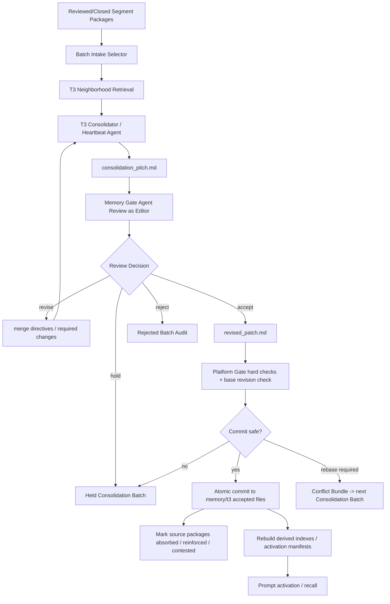

# T2 到 T3 Consolidation / Semantic Wiki 改造文档

日期：2026-06-18

范围：只定义 T2 -> T3。T0 -> T2 已由 `docs/t0-to-t2-segment-package-redesign-2026-06-18.md` 约束；T3 -> `soul.md`、Skill 晋升、Workflow 设计不在本文落地范围内。

状态：主链路已实装并作为当前契约。本文用于统一 T2 -> T3 的目标链路、文件结构、Prompt 边界、写入路径、平台审核和红线测试；legacy adapter 只能作为迁移/兼容面存在，不能回到 canonical runtime path。

## 1. 核心结论

T2 -> T3 是真正的跨 Session 收敛层，不是把 T2 行直接搬进长期记忆文件，也不是让每个 T2 package 单独生成一个 patch 后做“进/不进”的门禁。

T0 -> T2 的特点是单 segment 对应单 Segment Package；T2 -> T3 的特点是多 package 共同维护少数长期语义文件。因此 T3 的主过程必须是 **Consolidation Batch**：先整理一批 eligible T2 packages 和当前 T3 neighborhood，再由 LLM 做语义编目、合并、强化、替换、冲突标注和最终 patch。

目标链路必须是：

```text
reviewed/closed Segment Packages
  -> T3 Consolidation Batch Builder 组装 source bundle + T3 neighborhood
  -> T3 Consolidator / Heartbeat Agent 生成 consolidation_pitch.md
  -> Memory Gate Agent 可给出 editorial feedback / merge directives
  -> T3 Consolidator 生成或修订 revised_patch.md
  -> Memory Gate Agent final-review 最新 revised_patch.md
  -> Platform Gate hard check + atomic commit
  -> memory/t3/{episodes.md,user.md,worker.md,capabilities.md}
  -> mark consumed Segment Packages as absorbed
  -> prompt activation / recall
```

设计要点保持不变：

```text
LLM 负责判断、提炼、反思、归纳、候选生成；
平台负责证据引用、权限、去重、回滚、审计、最终落盘。
```

T3 不允许变成新的文件夹森林。T3 是从多个 T2 Segment Package 中提炼出来的长期语义层，最终只收敛到四个 accepted Markdown 文件：

```text
memory/t3/
  episodes.md
  user.md
  worker.md
  capabilities.md
```

整个 Agent Memory Vault 仍然是 MD-first Wiki：T0、T2、T3、`soul.md` 都属于这个 Wiki/Vault 的不同层级。T3 不是整个 Wiki 的别名，而是其中的长期收敛语义层。

## 2. 当前代码事实

当前 canonical T3 主链路已经切到 Consolidation Batch：

```text
reviewed / closed Segment Packages
active Explicit Memory Overlay entries
  -> stage_pending_t3_consolidation_job(...)
  -> memory/.staging/t3_jobs/<job_id>/
       source_bundle.json
       t3_neighborhood.md
       consolidation_pitch.md
       review.md
       revised_patch.md
       manifest.json
  -> submit_t3_consolidation_pitch(...)
  -> submit_t3_revised_patch(...)
  -> submit_t3_memory_gate_review(...)
  -> apply_t3_consolidation_patch(...)
  -> memory/t3/{episodes.md,user.md,worker.md,capabilities.md}
```

当前已完成的边界：

1. `backend/app/memory/md_store.py` 的 accepted T3 file specs 已收敛为 `episodes.md`、`user.md`、`worker.md`、`capabilities.md`。
2. `backend/app/memory/t3_consolidation.py` 只组装 source bundle、T3 neighborhood 和 staging artifact，不生成语义结论，也不写 accepted T3。
3. `backend/app/templates/HEARTBEAT.md` / `T3_CONSOLIDATOR.md` 要求 Heartbeat/T3 Consolidator 先提交 `consolidation_pitch.md`，再提交 `revised_patch.md`。
4. `backend/app/templates/T3_MEMORY_GATE.md` 要求 Memory Gate 作为 editor/reviewer 给出证据、去重、合并和打分判断；它不能替 Consolidator 改写 accepted block。
5. `backend/app/memory/t3_platform_gate.py` 只校验 XML、target、source refs、base revision、review rubric 和安全阈值，再按 Agent-authored patch exact apply。
6. `backend/app/tools/handlers/memory.py` 的 `save_memory` 只写 Explicit Memory Overlay；accepted T3 只能由 T3 Consolidation Batch 吸收。
7. 普通 `write_file` / `edit_file` / `delete_file` 写 `memory/` 被 workspace guard 拒绝。

当前仍需防守的残留面：

1. `append_t3_memory_candidate()` 是 compatibility adapter，只能把单条候选放进 Explicit Memory Overlay，不能写 accepted T3。
2. `md_store.append_t3_entry()` 仍服务 legacy tests、manifest/index/retrieval compatibility 和 migration repair；不得被新 runtime semantic write path 直接调用。
3. `memory/learnings/*.md` 只能作为 legacy/derived compatibility view，不能作为 T3 primary input；T3 intake 必须来自 reviewed Segment Package 或 active Explicit Memory Overlay。
4. `memory/.derived/**`、relation graph、contradiction views、index views 只能从 accepted T3 重建，不能成为 semantic truth。

## 3. 不在本文范围内

本文只处理 T2 -> T3。

不处理：

1. T0 append-only session ledger 的实现细节。
2. T0 -> T2 Summary Agent / Learning Brain / Segment Package 生成细节。
3. T3 -> `soul.md` 的 Dream / Soul Writer 流程；最高层不存在 optional `source.md` identity 文件。
4. Skill 文件生成、Skill eval、Skill 安装。
5. Workflow JSON 设计、Dynamic Workflow 生成、workflow runtime。
6. OpenViking、Handside、vector DB、graph DB 等外部增强记忆系统。

Skill、Workflow、外部索引可以消费 T3 证据或 derived read model，但它们不是 T3 的写入目标。

## 4. T2 -> T3 的输入边界

T3 Consolidation Batch 只允许纳入成熟的 Segment Package。

Canonical T2 package：

```text
memory/sessions/<session_id>/segments/<t2_segment_id>/
  summary.md
  labels.md
  review.md
  manifest.json
```

允许进入 T3 intake 的条件：

| 条件 | 要求 |
| --- | --- |
| package status | `reviewed` 或 `closed` |
| promotion status | `review.md` 中 Memory Gate 已允许进入 `t3_intake` |
| source refs | `summary.md` / `labels.md` / `review.md` / `manifest.json` 中有可解析 source refs |
| distillation scope | 必须是用户相关、人类对话、用户显式记忆、用户反馈、项目事实、可复用方法等可进化语料 |
| completeness | `closed` 优先；`open` 只能用于短期 carryover，不允许 T3 promotion |

禁止进入 T3 intake：

| 输入 | 处理 |
| --- | --- |
| `rolling_checkpoint` | 只能用于短期上下文 carryover，不能晋升 T3 |
| `audit_only` | 只保留 T0 provenance，不进入 T3 |
| Heartbeat / Dream / distiller / eval / platform background job 自己的运行日志 | 不作为可进化语料 |
| 直接 T0 raw event | 禁止直达 T3 |
| `memory/learnings/*.md` | 只能作为迁移期 derived compatibility view，不能作为 canonical T2 truth |
| derived graph/index/search cache | 只能辅助检索，不能作为 T3 evidence root |

残差链接规则：

```text
T3 Consolidator 必须从 T2 package 起步；
可以沿 T2 source_refs 回看 targeted T0 evidence；
T0 只能用于核验、纠偏、补充证据；
T0 不能成为 T3 的直接 primary input。
```

## 5. T3 Accepted File Boundary

T3 只允许四个 accepted memory files。

| 文件 | 职责 | 典型召回入口 | 不能做什么 |
| --- | --- | --- | --- |
| `episodes.md` | 场景/事件锚点，保留用户会以“你还记得上次那个场景吗”方式召回的线索 | 场景、时间段、项目片段、问题上下文、cue terms | 不能写成纯方法库；不能替代 capability |
| `user.md` | 稳定用户/owner/principal 偏好、约束、工作模型 | 用户偏好、沟通方式、长期边界、个人工作习惯 | 不能写 session-local 情绪或临时需求 |
| `worker.md` | Agent 自己应遵守的操作原则、条件性规则、红线 | “这个 Agent 在什么条件下应该怎么做” | 不能变成 `soul.md`；不能写不可审计的身份宣言 |
| `capabilities.md` | 可复用方法、SOP、渐进式能力胶囊、Skill seeds | 方法复用、调研套路、验证步骤、失败处理 | 不能直接生成 Skill；不能承载 workflow JSON |

禁止的 canonical T3 文件：

```text
memory/t3/index.md
memory/t3/canon.md
memory/t3/relations.md
memory/t3/contradictions.md
memory/t3/chapters/**
memory/t3/**/<topic>/**
```

这些内容如果需要，只能作为 derived read model：

```text
memory/wiki_map.md                   # single generated Memory Wiki map / persistent navigation read model
memory/.derived/relation_graph.md
memory/.derived/contradictions.md
```

Derived read model 的规则：

1. 可以从 accepted T3 Markdown 重建。
2. 可以用于 UI、搜索、prompt navigation、debug。
3. 不能成为 semantic truth。
4. 不能被 Heartbeat / Dream 当作 primary evidence。
5. 不能在 derived 文件里新增 accepted memory。
6. Platform Gate 每次 accepted T3 commit 后必须重建唯一 generated map `memory/wiki_map.md`，并清理旧 `memory/INDEX.md` / `memory/index.md` / `memory/.derived/t3_index.md`；运行时 prompt 仍优先消费实时 T3 entry manifest / Memory Navigation。

## 6. T2 -> T3 运行流程



关键边界：

1. T3 Consolidator 是语义整理作者，不是提交者。
2. Memory Gate Agent 是 reviewer/editor，不是二选一门卫，也不是最终内容作者。
3. Platform Gate 是硬规则执行器，不是语义作者。
4. 平台可以检索相似块、拒绝、hold、rollback、校验 XML、校验 source refs、做安全 append rebase，但不能机械改写 Consolidator 的语义结论。
5. 缺证据、证据冲突、XML/schema 错误、路径不合法、base revision 失效时，batch 进入 held/rebase_required/rejected，不允许静默降级为“已吸收”。

## 7. T3 Consolidation Batch

T3 Consolidator 不直接写 `memory/t3/*.md`。它通过专门工具提交 staging artifact。这个 artifact 不是聊天记录，而是一组可审计、可重放、可 review、可 apply 的 Markdown/JSON 文件。

建议路径：

```text
memory/.staging/t3_jobs/<job_id>/
  source_bundle.json
  t3_neighborhood.md
  consolidation_pitch.md
  review.md
  revised_patch.md
  manifest.json
```

| 文件 | 作者 | 内容 | 是否 semantic truth |
| --- | --- | --- | --- |
| `source_bundle.json` | Platform context builder | 本次 batch 输入的 Segment Packages、source refs、principal context、policy context、allowed target files | 否 |
| `t3_neighborhood.md` | Platform retrieval builder | 当前 T3 中与本 batch 相关或相似的 accepted blocks、base revisions、similarity hints、source overlap hints | 否 |
| `consolidation_pitch.md` | T3 Consolidator / Heartbeat Agent | LLM-authored first pass，说明如何把多个 T2 packages 整理到 T3：create/merge/reinforce/supersede/contest/noop | 否 |
| `review.md` | Memory Gate Agent | Evidence Check、Residual T0 Check、Semantic Dedup/Consolidation Review、merge directives、required changes | 否 |
| `revised_patch.md` | T3 Consolidator / Heartbeat Agent | 根据 review 修订后的 final LLM-authored patch，包含最终要 apply 的 XML blocks 原文 | 否，直到 Platform Gate commit |
| `manifest.json` | Platform Gate | job id、prompt version、model id、hash、decision、rollback ref、committed paths、absorbed packages | 否 |

`consolidation_pitch.md` 必须说明本 batch 与当前 T3 neighborhood 的关系：

```text
accept_new
reinforce_existing
merge_required
supersede_existing
contest_existing
noop
reject
```

其中 `merge_required` 是 T3 的核心能力：当候选和现有 T3 有 90% 重复但各有 10% 独特价值时，不能机械拒绝，也不能追加重复块；必须把独特增量合并进更完善的 block。

`revised_patch.md` 必须包含：

```xml
<t3_consolidation_patch id="t3p_..." schema_version="t3.consolidation_patch.v1">
  <base_revisions>
    <base_revision path="memory/t3/episodes.md" sha256="..."/>
    <base_revision path="memory/t3/capabilities.md" sha256="..."/>
  </base_revisions>
  <source_packages>
    <source_package ref="t2://session/<session_id>/segment/<segment_id>" status="reviewed"/>
  </source_packages>
  <target_files>
    <target_file path="memory/t3/episodes.md"/>
    <target_file path="memory/t3/capabilities.md"/>
  </target_files>
  <target_view_labels>
    <target_view>episodes</target_view>
    <consolidation_mode>merge</consolidation_mode>
    <source_coverage>multi_session</source_coverage>
    <cue_strength>0.82</cue_strength>
    <stability>evolving</stability>
    <behavior_impact>recall_and_method_reuse</behavior_impact>
    <prompt_priority>p1_dynamic</prompt_priority>
  </target_view_labels>
  <proposed_changes>
    <append_block target="memory/t3/episodes.md" block_id="ep_..."/>
    <append_block target="memory/t3/capabilities.md" block_id="cap_..."/>
  </proposed_changes>
  <consolidation_decisions>
    <decision type="merge_required" existing_block="cap_existing_..." new_delta="Web3-specific verification branch"/>
    <decision type="reinforce_existing" existing_block="usr_existing_..." source_package="t2://session/..."/>
  </consolidation_decisions>
  <evidence>
    <source_ref>t2://session/<session_id>/segment/<segment_id>#summary</source_ref>
    <source_ref>t2://session/<session_id>/segment/<segment_id>#labels</source_ref>
    <source_ref>t2://session/<session_id>/segment/<segment_id>#review</source_ref>
    <source_ref>t0://session/<session_id>/segment/<t0_segment_id>#event-range</source_ref>
  </evidence>
</t3_consolidation_patch>
```

`revised_patch.md` 可以提出 append、merge、reinforce、supersede、contradict、retract、noop，但所有动作都要由 Memory Gate Agent 复查，再由 Platform Gate 原子提交。Memory Gate 如发现语义需要改写，不能自己改写 accepted block，而是把 merge directives 写入 `review.md`，退回 Consolidator 生成新的 `revised_patch.md`。

### 7.1 Review Feedback 回流协议

Memory Gate 的 `reject`、`hold`、`revise` 不是一句自然语言评论，而是写入同一个 job 的结构化 review artifact。这个 artifact 是下一轮 T3 Consolidator 的强输入，不能丢失，也不能只存在于聊天上下文。

状态语义：

| decision | 含义 | 是否回到 T3 Consolidator |
| --- | --- | --- |
| `accept` | 语义内容、证据、目标文件和合并策略通过 | 否，进入 Platform Gate commit |
| `revise` | 内容有价值，但 pitch / patch 需要语义改写、合并、拆分、补证据或换目标文件 | 是，必须携带 review feedback 重新生成 `revised_patch.md` |
| `hold` | 当前证据、权限、source refs 或 neighborhood 不足，不能判断 | 暂不重写；补齐上下文后重新进入 batch |
| `reject` | 不属于 durable T3、证据不成立、违反边界或不可修复 | 否，关闭 job，保留 audit |

`review.md` 必须至少包含：

```xml
<memory_gate_review id="t3r_..." schema_version="t3.review.v1">
  <decision>revise</decision>
  <blocking_issues>
    <issue severity="high" code="duplicate_without_delta">
      Candidate overlaps cap_existing_123 but loses a unique Web3 verification branch.
    </issue>
  </blocking_issues>
  <merge_directives>
    <directive target_block="cap_existing_123" required_action="merge_unique_delta">
      Keep the existing generic research SOP, add the source-specific on-chain verification branch from package t2://session/... .
    </directive>
  </merge_directives>
  <target_file_corrections>
    <correction from="memory/t3/worker.md" to="memory/t3/capabilities.md" reason="method memory, not operating redline"/>
  </target_file_corrections>
  <evidence_gaps>
    <gap source_ref="t2://session/...#summary" required_ref="t0://session/...#event-range"/>
  </evidence_gaps>
  <must_preserve_deltas>
    <delta source_package="t2://session/..." description="User asked to recall scenario first, then reuse method."/>
  </must_preserve_deltas>
</memory_gate_review>
```

T3 Consolidator 的下一轮输入必须包含：

1. 原始 `source_bundle.json`。
2. 最新 `t3_neighborhood.md`，如果 T3 已变化则重新生成。
3. 上一轮 `consolidation_pitch.md`。
4. 上一轮 `revised_patch.md`。
5. Memory Gate 的 `review.md`。
6. 若 commit-time 冲突发生，还要包含 `conflict_bundle.json` 和 `latest_t3_neighborhood.md`。

因此反馈不是通过隐式消息传给 T3，而是通过 job 内的 review artifact 回流。Heartbeat / T3 Consolidator 只是读取这些 artifacts 后重新生成 LLM-authored patch；Memory Gate 不替它写 patch。

### 7.2 Batch 触发与并发前提

单 Agent 实例下，T0 -> T2 会在不同 session / segment / runtime task 上并行产出多个 Segment Packages。T2 package 内部是串行链路，但 agent 级别不是单线程。因此 T3 不能假设“一次只来一个 T2”。

T3 Consolidation Batch 的触发条件：

1. 有 N 个 eligible reviewed/closed Segment Packages 等待 T3 intake。
2. Explicit Memory Overlay 有待吸收的 active entry。
3. 当前 T3 有 held/rebase_required batch 需要重新整理。
4. 周期性 heartbeat 到达，但只在有新增 eligible packages 或 pending conflict 时运行。

Batch size 建议：

| 类型 | 建议 |
| --- | --- |
| 普通 heartbeat | 5-20 个 Segment Packages |
| Explicit Memory Overlay intake | 可单独成 batch，但仍需读取 T3 neighborhood |
| 大量 backlog / migration | 分主题 cluster 后多 batch 处理 |
| rebase_required | 只纳入冲突 patch、冲突 neighborhood、相关 source packages |

### 7.3 T3 Neighborhood

`t3_neighborhood.md` 是平台为 Consolidator 和 Memory Gate 准备的“当前库上下文”，用于防止重复、冲突和漏合并。

它应包含：

1. 本 batch source packages 里每个主要 claim / cue / capability hint 对应的相似 T3 blocks。
2. 同 target file 下的相邻 blocks。
3. source overlap 命中的 existing blocks。
4. semantic signature / BM25 / embedding / Jaccard 等机械相似候选。
5. 当前 target files 的 base revision hash。
6. 已知 contested / superseded / reinforced lifecycle records。

平台只负责找候选 neighborhood，不负责判断语义关系。相似度只是提示，不是决定。

## 8. Markdown + XML Block 标准

所有需要在单个 Markdown 文件内部切块的内容，统一使用 XML block。Markdown 负责人类可读文件外壳，XML block 负责机器可解析结构。

文件内不要用随机 heading 当语义边界；heading 可以用于阅读，但 accepted memory block 的真实边界必须是 XML tag。

### 8.1 `episodes.md`

用途：场景优先召回。它解决用户自然提问时通常先想起“上次那个场景/事件”，再从场景追到方法、偏好和规则的问题。

```markdown
# T3 Episodes

<t3_episode id="ep_20260618_memory_t3_design" status="active" confidence="0.86" prompt_priority="p1_dynamic">
  <title>T3 需要从多份 Segment Package 收敛为场景锚点和长期语义块</title>
  <scene_context>用户连续讨论 Hive 记忆系统，从 T0/T2 到 T3 的边界、Wiki 形态、残差链接和场景召回。</scene_context>
  <cue_terms>
    <cue>T2 到 T3</cue>
    <cue>场景记忆</cue>
    <cue>Segment Package</cue>
    <cue>残差链接</cue>
  </cue_terms>
  <what_happened>用户明确要求 T3 不要扩散成大量分类文件，而要收敛为少数 accepted memory files。</what_happened>
  <why_it_matters>后续 recall 应先通过 episode 找到相关 capability/user/worker blocks，而不是只靠方法名搜索。</why_it_matters>
  <links>
    <capability_ref>cap_memory_t3_consolidation_batch_flow</capability_ref>
    <worker_ref>wrk_memory_platform_gate_boundary</worker_ref>
  </links>
  <source_refs>
    <source_ref>t2://session/.../segment/...#summary</source_ref>
    <source_ref>t2://session/.../segment/...#review</source_ref>
  </source_refs>
</t3_episode>
```

### 8.2 `user.md`

用途：用户/owner/principal 的稳定偏好、约束、工作模型。

```markdown
# T3 User

<t3_user_memory id="usr_memory_discussion_first" status="active" confidence="0.91" prompt_priority="p1_dynamic">
  <claim>用户在架构不清晰时要求先讨论并形成文档，不希望直接改代码。</claim>
  <applies_when>用户明确说“先讨论”“不要先改”“先写文档”等架构收敛场景。</applies_when>
  <does_not_apply_when>用户明确说“开始干活”“全部改完”“实装并验证”。</does_not_apply_when>
  <evidence_status>user_stated_repeated</evidence_status>
  <source_refs>
    <source_ref>t2://session/.../segment/...#summary</source_ref>
    <source_ref>t2://session/.../segment/...#labels</source_ref>
  </source_refs>
</t3_user_memory>
```

### 8.3 `worker.md`

用途：Agent 的条件性操作原则、红线、治理边界。它不是身份宣言；身份级内容属于后续 Dream / Soul Writer。

```markdown
# T3 Worker

<t3_worker_rule id="wrk_memory_platform_gate_boundary" status="active" confidence="0.88" prompt_priority="p0_if_memory_write">
  <rule>平台层只能做证据引用、权限、去重、回滚、审计和最终落盘，不能替代 LLM 做语义判断。</rule>
  <applies_when>任何 T2/T3/soul/skill 相关写入、晋升、回滚、去重、审核流程。</applies_when>
  <does_not_apply_when>纯路径校验、XML schema 校验、hash 校验、权限拒绝等硬规则执行。</does_not_apply_when>
  <redlines>
    <redline>机械 fallback 不能把截断摘要写成 durable memory。</redline>
    <redline>Platform Gate 不能重写 Consolidator 的语义 patch。</redline>
  </redlines>
  <source_refs>
    <source_ref>t2://session/.../segment/...#review</source_ref>
  </source_refs>
</t3_worker_rule>
```

### 8.4 `capabilities.md`

用途：可复用方法、SOP、渐进式能力胶囊、Skill seed。它是能力记忆，不是最终 Skill 文件。

```markdown
# T3 Capabilities

<t3_capability id="cap_memory_t3_consolidation_batch_flow" status="active" confidence="0.84" prompt_priority="p1_dynamic">
  <name>T3 Consolidation Batch Flow</name>
  <when_to_use>需要把多份 reviewed Segment Packages 收敛成长期记忆时。</when_to_use>
  <method>
    <step>从 reviewed/closed Segment Packages 起步。</step>
    <step>读取当前 T3 neighborhood，先理解已有 accepted blocks。</step>
    <step>根据 T2 source_refs 回看 targeted T0 evidence 做 residual check。</step>
    <step>生成 consolidation_pitch.md，说明 accept_new / reinforce / merge / supersede / contest / noop / reject。</step>
    <step>交给 Memory Gate Agent 做 evidence、语义去重、独特增量、冲突和 target selection 复查。</step>
    <step>根据 review 生成 revised_patch.md，而不是直接写 T3 accepted files。</step>
    <step>由 Platform Gate 做 hard check 和 atomic commit。</step>
  </method>
  <verification>
    <check>每个 accepted block 至少引用一份 T2 package。</check>
    <check>任何 T0 ref 必须能从 T2 source_refs 反查。</check>
    <check>commit 后才允许把 source packages 标记为 absorbed。</check>
  </verification>
  <failure_modes>
    <failure>直接从 raw T0 提炼 T3，绕过 Segment Package。</failure>
    <failure>把 Skill 或 Workflow 定义写进 capabilities.md。</failure>
  </failure_modes>
  <promotion_hint>如果该方法被多次复用并通过 eval，可以进入 Skill candidate lane。</promotion_hint>
  <source_refs>
    <source_ref>t2://session/.../segment/...#summary</source_ref>
    <source_ref>t2://session/.../segment/...#review</source_ref>
  </source_refs>
</t3_capability>
```

## 9. T3 Target-View Labels

T2 的标签服务单 Segment Package 的归纳、检索、治理和 T3 intake。T3 的标签不是新的 `labels.md` 文件，而是 Consolidation Batch 和 accepted XML block 上的 target-view metadata。

T3 target-view labels 必须是闭集。

| 字段 | 允许值 / 标准 | 作用 |
| --- | --- | --- |
| `target_view` | `episodes`、`user`、`worker`、`capabilities` | 决定写入哪个 accepted T3 file |
| `consolidation_mode` | `create`、`merge`、`supersede`、`contradict`、`retract`、`noop` | 决定对旧 block 的处理关系 |
| `source_coverage` | `single_session`、`multi_session`、`explicit_user`、`tool_verified`、`weak` | 描述证据覆盖，不自动决定通过 |
| `cue_strength` | `0.00-1.00`，按下方锚点打分，必须说明依据 | 衡量是否有足够场景线索支持 recall |
| `confidence` | `0.00-1.00`，按 Memory Gate rubric 归一化公式计算 | accepted block 的工程置信分，不是模型自报概率 |
| `stability` | `ephemeral`、`short_lived`、`evolving`、`stable` | 控制能否进入 long-term accepted T3 |
| `behavior_impact` | `recall_only`、`response_style`、`tool_policy`、`memory_policy`、`method_reuse`、`identity_candidate`、`skill_candidate` | 控制后续审核强度 |
| `prompt_priority` | `p0_if_relevant`、`p1_dynamic`、`p2_on_demand`、`archive_only` | 控制动态激活，不代表常驻 prompt |
| `principal_scope` | `user`、`agent`、`owner`、`company`、`tenant` | 控制可见性和权限 |
| `sensitivity` | `PL0`、`PL1`、`PL2`、`PL3`，`PL4` 禁止 durable memory | 权限和脱敏边界 |

量化要求：

1. `cue_strength >= 0.80` 才能作为强 episode recall anchor；否则可以写入 capability/user/worker，但 episode 需要 hold 或低优先级。
2. `source_coverage=weak` 且 `stability` 不是 `stable` 时，不能写入 `worker.md` 的红线或 `capabilities.md` 的 SOP。
3. `behavior_impact=tool_policy`、`memory_policy`、`identity_candidate`、`skill_candidate` 时，Memory Gate Agent 必须执行更强 Evidence Check。
4. `prompt_priority=p0_if_relevant` 不能由 Consolidator 单独决定，必须由 Memory Gate Agent 明确接受。
5. `PL4` 一律拒绝，不允许进入 accepted T3 或 derived index。

`cue_strength` 锚点：

| 分值 | 判定标准 |
| --- | --- |
| `1.00` | 用户有明确场景召回原话，cue terms 独特，且 source refs 直接支持该场景 |
| `0.80` | 场景线索清楚，能稳定从用户自然提问召回对应 episode |
| `0.60` | 有场景或主题线索，但需要其他标签辅助才能稳定召回 |
| `0.40` | 只有宽泛 subject / project 线索，episode anchor 弱 |
| `0.20` | 线索主要来自模型推断，用户原话支持弱 |
| `0.00` | 没有可用场景线索，不能作为 episode recall anchor |

Accepted block `confidence` 公式：

```text
confidence = round_to_0_05(clamp(
  (
    evidence_strength
    + scope_clarity
    + stability
    + future_utility
    + conflict_safety
  ) / 20,
  0.00,
  1.00
))
```

这里的五个输入来自 Memory Gate 统一判分 Rubric，取值都是 `0-4`。如果没有 Memory Gate rubric，accepted block 不能写数值 `confidence`；只能写非数值 `evidence_status` 并进入 hold。

这些量化边界是审核标准，不是机械语义替代。分数由 LLM 按 rubric 给出并解释，平台只校验字段范围、必填项、公式结果和禁用组合。

## 10. Agent 分工

### 10.1 T3 Consolidator / Heartbeat Agent

职责：

1. 读取 batch-level `source_bundle.json`，不是逐条孤立处理 T2。
2. 读取 `t3_neighborhood.md`，先理解当前 T3 已经有什么。
3. 用 T2 source_refs 回看 targeted T0 evidence 做 residual check。
4. 对多个 Segment Packages 做 cluster、归并、抽取独特增量和冲突识别。
5. 判断 accept_new / reinforce_existing / merge_required / supersede_existing / contest_existing / noop / reject。
6. 生成 LLM-authored `consolidation_pitch.md`。
7. 根据 Memory Gate 的 review / merge directives 生成 `revised_patch.md`。
8. 给出 target-view labels、source refs、证据解释、召回理由、风险说明。

禁止：

1. 直接调用 `save_memory` 写 accepted T3。
2. 直接 `write_file` / `edit_file` 修改 `memory/t3/*.md`。
3. 把 T0 raw event 当作 T3 primary input。
4. 生成 Skill 文件或 Workflow JSON。
5. 改 `soul.md`。
6. 把 derived read model 当作 semantic truth。
7. 在没有读取 T3 neighborhood 的情况下创建新 block。

### 10.2 Memory Gate Agent

职责：

1. 独立读取 `source_bundle.json`、`t3_neighborhood.md`、`consolidation_pitch.md`、`revised_patch.md`。
2. 校验 source refs 是否足够支撑 claim。
3. 对关键 claim 沿 T2 source_refs 回看 targeted T0 evidence。
4. 判断当前 pitch 是否过度泛化、错放目标文件、遗漏独特增量或错误合并。
5. 对当前 T3 neighborhood 中的相似 blocks 做 semantic consolidation review。
6. 给出 accept / revise / hold / reject。
7. 对 revise 给出明确 merge directives，而不是只说“不通过”。
8. 对高影响 patch 执行更强验证。

Memory Gate Agent 可以否决、hold、要求 revise，也可以指出“90% 重复但 10% 独特价值必须合并”。它不能自己重写 accepted block。需要语义改写时，退回 T3 Consolidator 重新生成。

### 10.3 Platform Gate

职责：

1. 校验允许写入路径只包含：

```text
memory/t3/episodes.md
memory/t3/user.md
memory/t3/worker.md
memory/t3/capabilities.md
```

2. 校验 XML well-formed。
3. 校验 source refs 可解析，且至少有一个 T2 package ref。
4. 校验任何 T0 ref 都能从 T2 source refs 追溯。
5. 校验 package status、review decision、principal scope、sensitivity。
6. 校验 target-view labels 是闭集。
7. 校验禁止写 `soul.md`、`skills/**`、workflow JSON、`memory/.derived/**` semantic truth。
8. 校验 base revision；如 target file 已变化，进入 commit-time conflict / safe rebase 判断。
9. 做 per-agent T3 commit lock、atomic commit、hash、rollback ref、audit log。
10. commit 成功后才 mark source Segment Packages as absorbed / reinforced / contested。

Platform Gate 禁止：

1. 机械生成 accepted block 内容。
2. 机械缩写、改写、合并 Consolidator 的语义文本。
3. 因 parser 失败把 patch 静默降级为 accepted。
4. 因预算不足写入截断摘要。
5. 在语义冲突时自行二选一。

### 10.4 最终写入协议

T3 写入必须区分两种“作者”：

1. **Semantic Writer**：T3 Consolidator / Heartbeat Agent。它负责判断、提炼、合并、拆分、改写，并在 `revised_patch.md` 中给出最终 XML block 原文和操作意图。
2. **Physical Committer**：Platform Gate。它负责把已经通过 review 的 LLM-authored block 原样、原子地 apply 到 accepted T3 files，并记录 hash、rollback ref、audit log。

因此最终写入不是 Agent 直接 `write_file` / `edit_file` 修改 `memory/t3/*.md`，也不是平台自己生成或改写记忆内容。正确模型更接近 `git apply`：

```text
LLM writes exact patch artifact
  -> Memory Gate reviews semantic correctness
  -> Platform Gate validates schema / refs / permissions / base revisions
  -> Platform Gate applies exact block operations atomically
```

`revised_patch.md` 里的 `proposed_changes` 不能只写“我要更新 user.md”。它必须给出确定性操作：

```xml
<proposed_changes>
  <append_block
    target="memory/t3/episodes.md"
    block_id="ep_20260618_web3_research_recall"
    insert_policy="append_to_active_blocks">
    <block_content><![CDATA[
<t3_episode id="ep_20260618_web3_research_recall" status="active" confidence="0.86">
  <cue>用户再次提到之前的 Web3 调研方法时，通常先以场景回忆触发，再要求复用方法。</cue>
  <summary>...</summary>
  <source_refs>
    <source_ref>t2://session/...#summary</source_ref>
  </source_refs>
</t3_episode>
    ]]></block_content>
  </append_block>

  <replace_block
    target="memory/t3/capabilities.md"
    block_id="cap_existing_123"
    expected_old_hash="sha256:..."
    replacement_policy="whole_xml_block">
    <block_content><![CDATA[
<t3_capability id="cap_existing_123" status="active" confidence="0.91">
  <name>...</name>
  <method>...</method>
  <source_refs>
    <source_ref>t2://session/old...#summary</source_ref>
    <source_ref>t2://session/new...#summary</source_ref>
  </source_refs>
</t3_capability>
    ]]></block_content>
  </replace_block>
</proposed_changes>
```

允许的物理操作只有：

| operation | 适用场景 | 平台如何写入 |
| --- | --- | --- |
| `append_block` | 新 episode / user fact / worker rule / capability | 解析目标文件 XML blocks，按 `insert_policy` 插入完整 LLM-authored block |
| `replace_block` | merge、supersede、contest 后需要重写一个 existing block | 校验 `block_id` 和 `expected_old_hash`，用 LLM-authored `block_content` 替换整个 XML block |
| `retire_block` | 内容被 supersede 或撤回，但不需要新语义文本 | 只写 lifecycle/audit sidecar；不机械改写语义正文 |
| `reinforce_block` | 现有 block 被更多证据支持，语义不变 | 优先写 lifecycle/audit sidecar；如要改正文，必须走 `replace_block` |

写入位置不能用脆弱行号决定，只能用 `target file + block id + expected hash + insert_policy` 决定。平台可以定位、校验、加锁、原子提交，但不能替 LLM 猜应该怎么合并一句话、删哪一句、保留哪一个前提条件。

如果 `replace_block` 的 `expected_old_hash` 已失效，Platform Gate 必须进入 `rebase_required`，生成 conflict bundle，交回 T3 Consolidator 重新做 LLM rebase。

## 11. Prompt Contract

### 11.1 T3 Consolidator Prompt 输入

必须包含：

1. 本次 batch candidate Segment Packages：

```text
summary.md
labels.md
review.md
manifest.json
```

2. 每个 package 的 source refs。
3. Targeted T0 excerpts，只能由 T2 source_refs 解析得到。
4. `t3_neighborhood.md`：当前四个 accepted T3 文件中相似/相关/冲突候选 blocks。
5. 当前 target file base revisions。
6. 当前 principal / owner / company / tenant context。
7. Allowed target files。
8. XML block schema。
9. Redlines。

禁止只注入旧 `memory/learnings/*.md` weighted lines。

### 11.2 T3 Consolidator Prompt 骨架

```text
You are the T3 Consolidator.
You synthesize a batch of reviewed T2 Segment Packages into a smaller, stronger T3 semantic wiki.

You must:
- Start from Segment Packages, not raw T0.
- Use residual T0 evidence only through T2 source_refs.
- Read the T3 neighborhood before creating new blocks.
- Produce consolidation_pitch.md first.
- Produce revised_patch.md only after the pitch is complete and any Memory Gate feedback has been addressed.
- Require a fresh Memory Gate final review after the latest revised_patch.md; any review that predates the current patch is stale and cannot authorize commit.
- Use only these target files:
  memory/t3/episodes.md
  memory/t3/user.md
  memory/t3/worker.md
  memory/t3/capabilities.md
- Use XML blocks inside Markdown.
- Prefer convergence over proliferation.
- Treat dedup as semantic consolidation, not binary rejection.
- Preserve unique deltas when two paths overlap.
- Preserve scene-first recall cues when the user is likely to remember a situation before a method.
- Keep Skill and Workflow as separate candidate lanes.

You must not:
- write accepted T3 files directly
- call save_memory
- modify soul.md
- create Skill files
- create Workflow JSON
- write index.md / relations.md / contradictions.md / chapters/**
```

### 11.3 Memory Gate Prompt 骨架

```text
You are the Memory Gate Agent for T3 promotion.
You review T3 consolidation as an editor, not as a binary gate.

Check:
- Is every claim supported by reviewed T2 packages?
- Does residual T0 evidence confirm or contradict the T2 summary?
- Is the target file correct?
- What existing T3 blocks are semantically similar?
- What overlap is shared with existing T3?
- What unique delta would be lost if this patch is rejected?
- Should the result be accept_new, reinforce_existing, merge_required, supersede_existing, contest_existing, noop, or reject?
- Is the block too broad, too local, too speculative, or too mechanical?
- Does it preserve model-authored reasoning rather than platform-generated text?
- Does it need stronger review because it changes behavior, tool policy, identity, or capability?

Return:
- accept | revise | hold | reject
- evidence_check
- residual_check
- semantic_consolidation_review
- overlap_analysis
- unique_delta_analysis
- merge_directives
- contradiction_check
- target_file_check
- prompt_impact_check
- rubric_scores
- required_platform_checks
```

## 12. Explicit `save_memory` 的目标路径

当前 `save_memory` 直接写 T3，这是旧路径。

用户显式说“你应该记住 / remember X”时，语义级别是 T3：它表达的是跨 session 生效的用户关键记忆。但它不能直接进入 accepted T3，因为 accepted T3 需要跨 session consolidation、T3 neighborhood、语义去重、冲突处理和 Platform Gate commit。

因此目标设计是 **Explicit Memory Overlay**：

```text
memory/explicit/
  MEMORY.md
  entries/
    <explicit_memory_id>.md
  manifest.jsonl
```

参考系统对照：

1. Claude Code 的显式/自动 memory 是项目级 Markdown memory directory：每条 memory 写入独立 topic file，`MEMORY.md` 只是索引并立即进入上下文；这证明“显式记住”需要即时生效，而不是等待后台蒸馏。
2. Codex 的 memories pipeline 更偏 rollout extraction -> global consolidation，并受 idle/rate-limit/rollout age 控制；它适合后台长期沉淀，不适合作为用户显式“马上记住”的唯一入口。

Overlay 的定位：

| 层级 | 结论 |
| --- | --- |
| 是否属于 T2 | 否。T2 是 session summary / Segment Package，不承诺即时跨 session 生效。 |
| 是否属于 T3 | 是。它是 T3 级 long-term intent，但尚未进入 accepted T3。 |
| 是否是 accepted T3 truth | 否。accepted T3 仍只在 `memory/t3/{episodes,user,worker,capabilities}.md`。 |
| 是否参与上下文 | 是。Overlay active index 应立即进入 memory activation，优先级高于普通 T3 retrieval，低于 `soul.md` / frozen charter。 |
| 是否需要后续吸收 | 是。Heartbeat / T3 Consolidation Batch 必须高优先级处理 active overlay entries。 |

目标路径：

```text
user says "remember X" / agent calls save_memory
  -> Platform hard gate: principal scope / PL4 / secret / source refs / abuse checks
  -> write memory/explicit/entries/<explicit_memory_id>.md
  -> update memory/explicit/MEMORY.md one-line index
  -> mark entry active in memory/explicit/manifest.jsonl
  -> context assembly can activate it immediately
  -> T3 Consolidation Batch later includes active overlay entries with current T3 neighborhood
  -> T3 Consolidator produces pitch/revised patch
  -> Memory Gate Agent reviews as editor
  -> Platform Gate commits accepted T3 patch
  -> overlay entry becomes absorbed / reinforced / contested / keep_overlay_only / retired
```

显式记忆是强信号，不是绕过信号。

规则：

1. 用户显式要求“记住”时，`evidence=user_stated`，`origin=explicit_user_request`。
2. Overlay write 可以即时发生，但必须先通过平台 hard gate：PL4、secret、权限、principal scope、source refs、abuse checks。
3. Overlay entry 必须是 Markdown，带 XML block 或 frontmatter metadata；`MEMORY.md` 只存索引，不存长正文。
4. Overlay active entries 参与上下文，但需要明确标识为 `explicit_overlay`，不能伪装成 accepted T3。
5. `save_memory` 不能直接变成 accepted T3 writer，也不能调用旧 `append_t3_memory_candidate()` 直接 commit。
6. T3 Consolidation Batch 吸收 overlay 时必须读取 T3 neighborhood，处理 duplicate / conflict / merge_required。
7. 吸收成功后，overlay entry 不删除证据；改为 `absorbed` / `reinforced` / `contested` / `retired` 状态，并记录 accepted T3 block id。
8. 如果用户只是要求“本轮先记着”，而不是长期记忆，应进入 short-term session projection，不进 overlay，也不进 T3。

建议单条 overlay entry：

```md
---
id: explicit_20260618_...
origin: explicit_user_request
principal_scope: direct_owner
status: active
target_hint: user|worker|capabilities|episodes|unknown
source_refs:
  - t0://session/<session_id>/segment/<segment_id>#event-range
created_at: 2026-06-18T00:00:00Z
---

<explicit_memory id="explicit_20260618_..." schema_version="explicit_memory.v1">
  <user_words>...</user_words>
  <normalized_memory>...</normalized_memory>
  <why_it_matters>...</why_it_matters>
  <source_refs>
    <source_ref>t0://session/<session_id>/segment/<segment_id>#event-range</source_ref>
  </source_refs>
</explicit_memory>
```

## 13. Absorption / Lifecycle

这里必须区分两个词：

1. **进入 T3 吸收流程**：active overlay entry 或 reviewed Segment Package 被 T3 Consolidation Batch 读取、对照 T3 neighborhood、由 LLM 做语义整理。
2. **成为 accepted T3 truth**：内容被写入 `memory/t3/{episodes,user,worker,capabilities}.md` 的 accepted XML block。

所有显性长期记忆都必须进入 T3 吸收流程；但不是所有显性记忆都会原封不动成为 accepted T3 truth。T3 是收敛层，不是原话堆积层。

### 13.1 Explicit Memory Overlay 的吸收判定

显性记忆会被 accepted T3 吸收，当且仅当同时满足：

1. 用户表达的是跨 session 长期记忆，而不是“本轮先记着”。
2. Platform hard gate 通过：principal scope、权限、PL4/secret、abuse、source refs 都合格。
3. T3 Consolidator 读取当前 T3 neighborhood 后，判断该记忆能稳定归入 `episodes.md`、`user.md`、`worker.md` 或 `capabilities.md`。
4. Memory Gate Agent 复查通过，确认没有语义冲突、重复损失、权限越界或证据不足。
5. Platform Gate atomic commit 成功。

显性记忆不会直接成为 accepted T3 truth 的情况：

| 状态 | 什么时候出现 | 记忆是否还在 |
| --- | --- | --- |
| `reinforced` | 与现有 T3 block 语义基本一致，但它能作为新的 source evidence 强化现有 block | 在 accepted T3 的 source refs / evidence 中体现，不新增重复 block |
| `contested` | 与现有 T3 或用户后续表达冲突，需要保留争议而不能当成事实 | 保留为 contested evidence，等待澄清或下一轮 consolidation |
| `held` | 权限、证据、schema、base revision、T3 neighborhood 不完整 | 暂留 overlay / staging，不进入 accepted T3 |
| `keep_overlay_only` | 用户显式要求记住，且允许即时激活，但内容过窄、过临时、过依赖场景，写进 accepted T3 会污染收敛层 | 暂留 overlay，必须带 review_after / expiry；重复出现或变稳定后重新进入 T3 吸收流程 |
| `retired` | 用户撤回、内容过期、已被更高质量 T3 block 完整覆盖，或不再应激活 | 保留审计和 source refs，不再进入 prompt |
| `rejected` | PL4、secret、越权、滥用、无合法 source refs | 不作为记忆激活，只保留必要审计 |

因此，“所有跟用户有关的记忆最终都会被 T3 吸收”应改成更精确的规则：

> 所有用户显式长期记忆都必须被 T3 审阅和处理；只有通过收敛、去重、冲突和平台提交检查的语义，才会成为 accepted T3 truth。

### 13.2 Memory Gate 统一判分 Rubric

只要涉及打分，就必须使用同一套 rubric。Memory Gate Agent 负责按 rubric 做语义判断；平台只校验 hard gate、字段完整、分值范围、证据引用和状态转移是否合法，不能用机械分数替代 LLM 判断。

先做 hard gate。hard gate 失败时不进入语义打分：

| Hard gate | 失败结果 |
| --- | --- |
| PL4、secret、credential、private key、token | `rejected` |
| tenant / company / principal scope 越界 | `rejected` |
| 当前用户无权要求写入该记忆 | `rejected` |
| 无合法 source refs，无法追溯到 T0 / explicit user request | `rejected` |
| source refs 存在但缺必要上下文、target revision 过期、schema malformed | `held` |
| target file 不在四个 accepted T3 文件内 | `held` |

hard gate 通过后，Memory Gate 必须输出 5 个 0-4 分。每个分数必须带 `rationale` 和 `source_refs`，不能只给数字。

| 维度 | 0 | 1 | 2 | 3 | 4 |
| --- | --- | --- | --- | --- | --- |
| `evidence_strength` | 无证据或纯模型猜测 | 只有模糊上下文推断，没有用户原话或 reviewed T2 支撑 | 有单一 source，但表达含糊或只能弱支持 | 用户显式表达，或 reviewed T2 + T0 residual 能清楚支持 | 用户显式表达且跨 session / 多次一致，或 owner 再确认 |
| `scope_clarity` | 不知道属于 user / worker / capability / episode 哪一类 | scope 混杂，可能是个人、项目、公司或 agent 行为边界之一 | 大致知道类别，但适用条件不清 | target file、适用对象、适用条件清楚 | scope、例外条件、触发条件、失效条件都清楚 |
| `stability` | 明显只是当前消息或当前任务的临时状态 | 可能是短期偏好或临时上下文 | 可能长期有用，但目前只出现一次，稳定性未验证 | 明确表达为长期偏好、原则、方法或事实 | 长期反复出现、被用户纠正后确认，或已经被多轮行为验证 |
| `future_utility` | 对未来 session 没有可操作价值 | 只对极窄一次性任务有价值 | 对类似任务有帮助，但触发场景窄 | 能明显改善未来召回、行为、偏好或方法复用 | 高杠杆记忆，会影响多个未来任务、工作方式或 agent 行为边界 |
| `conflict_safety` | 与现有 T3 或权限规则直接冲突，且无法解决 | 有明显冲突，需要用户澄清 | 与现有 T3 重叠或部分冲突，需要 merge / supersede 说明 | 与现有 T3 兼容，仅需 reinforce 或小幅 merge | 与现有 T3 兼容且能减少歧义、补全缺口或明确 supersede |

结果阈值：

| 结果 | 必要条件 |
| --- | --- |
| `accept_new` / `merge_required` / `supersede_existing` | hard gate pass；`evidence_strength >= 3`；`scope_clarity >= 3`；`future_utility >= 3`；`conflict_safety >= 3`；总分 `>= 16/20` |
| `reinforced` | hard gate pass；与现有 block 高度重复；`evidence_strength >= 3`；`conflict_safety >= 3`；独特增量不足以新增 block |
| `contested` | hard gate pass；`conflict_safety <= 1`，或 Memory Gate 无法判断新旧说法谁应覆盖谁 |
| `held` | hard gate 未失败但上下文、schema、base revision、source context 或 target selection 不完整 |
| `keep_overlay_only` | hard gate pass；用户显式要求长期记住；但 `stability <= 2` 或 `future_utility <= 2` 或 `scope_clarity <= 2`；必须写 `review_after` / `expiry` |
| `retired` | 用户撤回、内容过期、或被更高质量 T3 block 完整覆盖，且 Memory Gate 写明 `supersede_reason` |
| `rejected` | hard gate rejected，或内容不可合法保存/激活 |

Memory Gate review artifact 必须包含：

```xml
<memory_gate_rubric schema_version="memory_gate_rubric.v1">
  <score name="evidence_strength" value="0-4">
    <rationale>...</rationale>
    <source_refs>
      <source_ref>...</source_ref>
    </source_refs>
  </score>
  <score name="scope_clarity" value="0-4">...</score>
  <score name="stability" value="0-4">...</score>
  <score name="future_utility" value="0-4">...</score>
  <score name="conflict_safety" value="0-4">...</score>
  <decision>accept_new|reinforced|merge_required|supersede_existing|contested|held|keep_overlay_only|retired|rejected</decision>
  <decision_rationale>...</decision_rationale>
  <required_followup>clarify_with_user|revise_patch|commit|hold_for_context|none</required_followup>
</memory_gate_rubric>
```

平台校验规则：

1. 缺任意 score、score 超出 0-4、缺 rationale、缺 source refs，review 无效。
2. 阈值不满足但 decision 仍为 accepted / merge / supersede，Platform Gate 必须 hold。
3. hard gate rejected 时，LLM 分数不能覆盖拒绝结果。
4. `keep_overlay_only` 必须有 `review_after` 或 `expiry`，否则不能长期激活。
5. `retired` / `supersede_existing` 必须引用被覆盖 block id 和 `supersede_reason`。
6. `contested` 必须生成 clarification packet 或下一轮 review 条件。

### 13.3 Segment Package 的吸收判定

Segment Package 只有在以下全部完成后才能标记为 `absorbed`：

1. T3 Consolidator 生成 `consolidation_pitch.md`。
2. Memory Gate Agent review，必要时要求 revise。
3. T3 Consolidator 生成 `revised_patch.md`。
4. Memory Gate Agent `accept`。
5. Platform Gate hard checks 通过。
6. Accepted T3 file atomic commit 成功。
7. `manifest.json` 记录 committed file、block id、hash、rollback ref。

不同 package 的最终 lifecycle 不一定都是 absorbed：

| 状态 | 含义 |
| --- | --- |
| `absorbed` | package 的语义被写入新的或合并后的 accepted T3 block |
| `reinforced` | package 与现有 T3 基本重复，但作为 evidence 强化 existing block |
| `contested` | package 与现有 T3 有冲突，需要保留争议信息 |
| `archived_recall_only` | 有召回价值但不适合进入长期 T3 |
| `held` | 证据、冲突、权限、schema 或 base revision 问题，等待下一轮 |

Absorption metadata 示例：

```json
{
  "status": "absorbed",
  "absorbed_by": "t3p_20260618_...",
  "absorbed_at": "2026-06-18T00:00:00Z",
  "accepted_blocks": [
    "ep_20260618_memory_t3_design",
    "cap_memory_t3_consolidation_batch_flow"
  ],
  "committed_paths": [
    "memory/t3/episodes.md",
    "memory/t3/capabilities.md"
  ]
}
```

禁止：

1. Consolidator 一产生 pitch 就 mark absorbed。
2. Memory Gate accept 但 Platform Gate commit 失败后 mark absorbed。
3. Noop heartbeat 把 package 标记为 absorbed。
4. 因重复/冲突/缺证据静默删除 package。
5. 90% 重复但 10% 有独特价值的 package 被简单 rejected。

重复、冲突、低证据的结果应该是：

```text
held
rejected
archived_recall_only
reinforced
superseded
contested
```

这些状态都必须可审计、可回滚、可追溯 source refs。

## 14. Commit-Time Conflict / Rebase Loop

Memory Gate 通过只代表 patch 在当时的 T3 base revision 上成立，不代表永久可提交。

`revised_patch.md` 必须携带 target files 的 base revisions：

```json
{
  "base_revisions": {
    "memory/t3/user.md": "sha256:abc...",
    "memory/t3/capabilities.md": "sha256:def..."
  }
}
```

Platform Gate commit 前必须重新读取当前 T3：

```text
review accepted
  -> acquire per-agent T3 commit lock
  -> reload target files
  -> compare base revisions
  -> if unchanged: atomic apply
  -> if changed: classify conflict
```

冲突分类：

| 类型 | 处理 |
| --- | --- |
| `safe_append_rebase` | 非重叠 append，block id/signature/source package 不冲突；平台可重新校验后追加，但不能改写内容 |
| `mechanical_conflict` | 同 block id、同 source package、同 supersede target、同 signature；进入 `rebase_required` |
| `semantic_conflict` | 新旧内容含义冲突或部分重叠；进入 `rebase_required` |
| `stale_neighborhood` | T3 neighborhood 已过期，review 上下文不完整；进入 `rebase_required` |

`rebase_required` 的结果不是失败删除，而是生成 conflict bundle：

```text
memory/.staging/t3_jobs/<job_id>/
  conflict_bundle.json
  latest_t3_neighborhood.md
  prior_revised_patch.md
```

下一轮 Consolidation Batch 读取 conflict bundle，由 T3 Consolidator 做 LLM rebase。平台可以发现冲突、阻止冲突、做机械安全 append rebase；平台不能做语义合并。

## 15. Context Assembly

Prompt 组成目标：

```text
Soul / Identity
Explicit Memory Overlay active index / relevant entries
Activated Long-Term Memory from selected T3 blocks
Active T2 Summary / unabsorbed high-priority Segment Packages
Session Working Memory / rolling checkpoint carryover
Optional Memory Navigation
Skills
Workflow State
Tool Context
```

原则：

1. `soul.md` 是身份和最高层收敛，不是导航索引。
2. Explicit Memory Overlay 是用户显式长期记忆入口，按 principal / sensitivity / relevance 即时激活，但必须标识为 `explicit_overlay`，不能伪装成 accepted T3。
3. T3 是 long-term dynamic memory，按 relevance / owner / company / sensitivity / prompt priority 动态激活。
4. T2 仍可进入 prompt，但只限新近、未吸收、高优先级、与当前任务相关的 Segment Package。
5. `rolling_checkpoint` 是短期 carryover，不是 T3。
6. `memory/wiki_map.md` 这类导航可以作为 optional memory navigation，但不能常驻 prompt。
7. prompt builder 只能读，不允许产生写副作用。

## 16. 旧路径迁移

| 旧路径 | 目标迁移 |
| --- | --- |
| `memory/feedback.md` | 迁移/映射到 `memory/t3/user.md` 或 `memory/t3/worker.md` |
| `memory/knowledge.md` | 根据内容迁移到 `episodes.md` / `user.md` / `worker.md` / `capabilities.md` |
| `memory/strategies.md` | 迁移到 `capabilities.md`，Skill evidence 只作为 promotion hint |
| `memory/blocked.md` | 迁移到 `worker.md` 的 redline/failure pattern，或 `capabilities.md` 的 failure_modes |
| `memory/user.md` | 迁移到 `memory/t3/user.md` |
| `memory/learnings/*.md` | 停止作为 canonical T2；只允许迁移期 derived compatibility view |
| `append_t3_memory_candidate()` | 退役为 compatibility adapter，最终只写 Explicit Memory Overlay 或 T3 Consolidation Batch staging |
| Heartbeat `save_memory` loop | 改为 reviewed Segment Packages / active Explicit Memory Overlay entries -> T3 Consolidation Batch |
| `save_memory` direct T3 append | 改为 Explicit Memory Overlay immediate write + T3 consolidation absorption |

迁移要求：

1. 旧文件不能直接删除，先 archive/backfill，保留 source refs。
2. 迁移后的 accepted block 必须有原始旧 entry id 或 source path。
3. 旧文件不能继续被 runtime 当作 T3 truth。
4. derived compatibility view 可以服务 UI 或临时 heartbeat，但不能双写。

## 17. 实施顺序

### Step 1：T3 File Boundary Tests

先写测试，确认只允许四个 T3 accepted files。

建议测试：

```text
backend/tests/memory/test_t3_file_boundary.py
```

必须失败于当前旧代码：

1. `ensure_t3_layout()` 不应创建 `feedback.md/knowledge.md/strategies.md/blocked.md`。
2. `memory/t3/index.md`、`relations.md`、`contradictions.md`、`chapters/**` 被拒绝。
3. Accepted target 只允许四个文件。

### Step 2：T3 Consolidation Batch Model

新增模型和 staging builder：

```text
backend/app/memory/t3_consolidation.py
backend/app/memory/t3_platform_gate.py
backend/tests/memory/test_t3_consolidation_batch.py
```

验证：

1. Batch 必须至少引用一个 reviewed T2 package。
2. Batch 必须生成 `source_bundle.json`、`t3_neighborhood.md`、`consolidation_pitch.md`、`review.md`、`revised_patch.md`、`manifest.json`。
3. Revised patch target 必须是四个 accepted files。
4. XML block 必须 well-formed。
5. Any T0 refs must be derivable from T2 source refs。
6. Similar existing T3 blocks 必须进入 `t3_neighborhood.md`，供 LLM 判断。

### Step 3：T3 Consolidator Prompt

新增或重写：

```text
backend/app/templates/T3_CONSOLIDATOR.md
backend/app/templates/HEARTBEAT.md
backend/tests/runtime/test_t3_consolidator_template.py
```

验证：

1. Prompt 明确禁止 `save_memory` direct T3。
2. Prompt 明确禁止 raw T0 -> T3。
3. Prompt 明确必须先读 T3 neighborhood。
4. Prompt 明确先写 `consolidation_pitch.md`，review 后再写 `revised_patch.md`。
5. Prompt 包含四个 accepted file schema。
6. Prompt 把 dedup 定义为 semantic consolidation，不是二元 reject。

### Step 4：Memory Gate Agent Review

新增：

```text
backend/app/templates/T3_MEMORY_GATE.md
backend/app/memory/t3_review.py
backend/tests/memory/test_t3_memory_gate.py
```

验证：

1. Gate accept/revise/hold/reject 是独立 review。
2. Gate 不能改写 patch 内容。
3. Gate 必须产出 overlap_analysis、unique_delta_analysis、merge_directives。
4. 高影响 patch 要有更强 evidence check。

### Step 5：Platform Gate Atomic Commit

新增或替换旧 append：

```text
backend/app/memory/t3_platform_gate.py
backend/tests/memory/test_t3_platform_gate.py
```

验证：

1. commit 成功前不 mark absorbed。
2. commit 失败保持 held。
3. rollback ref 可用。
4. hash / revision / audit metadata 写入 manifest。
5. base revision 变化时进入 safe_append_rebase 或 rebase_required。

### Step 6：Heartbeat 改造

改造 Heartbeat 从旧 weighted-line curation 变成 T3 Consolidator。

验证：

```text
backend/tests/services/test_heartbeat_t3_package_intake.py
backend/tests/runtime/test_heartbeat_template.py
```

必须断言：

1. Heartbeat 读取 reviewed Segment Packages。
2. Heartbeat 读取 T3 neighborhood。
3. Heartbeat 不直接调用 `save_memory` 写 accepted T3。
4. Noop heartbeat 只留 audit，不 mark absorbed。
5. rolling_checkpoint package 不进入 T3。

### Step 7：`save_memory` / Explicit Memory Overlay 改造

改造 `save_memory` direct T3 append，使显式“你应该记住”进入 T3 级 overlay，而不是 accepted T3 direct write，也不是普通 T2 快车道。

验证：

```text
backend/tests/tools/test_save_memory_explicit_overlay.py
```

必须断言：

1. `save_memory` 生成 `memory/explicit/entries/<id>.md` 和 `memory/explicit/MEMORY.md` 索引。
2. `save_memory` 不直接调用旧 `append_t3_memory_candidate()` commit accepted T3。
3. 用户显式记忆保留 `origin=explicit_user_request`、source refs、principal scope 和 active/absorbed lifecycle state。
4. Overlay active entry 能被 context assembly 激活，但标识为 `explicit_overlay`，不能伪装成 accepted T3。
5. T3 Consolidation Batch 能读取 active overlay entries，并在 commit 成功后把 entry 标记为 absorbed / reinforced / contested / keep_overlay_only。

### Step 8：旧 T3 文件迁移

新增 migration/backfill：

```text
backend/app/memory/t3_legacy_migration.py
backend/tests/memory/test_t3_legacy_migration.py
```

必须断言：

1. 旧 accepted 文件被 archive/backfill。
2. 新四文件 schema 可重建。
3. 旧 id/source path 可追溯。
4. runtime 不再读取旧文件作为 T3 truth。

### Step 9：Prompt Activation

改造 prompt dynamic memory activation。

验证：

```text
backend/tests/runtime/test_t3_activation.py
backend/tests/runtime/test_runtime_context_composition.py
```

必须断言：

1. T3 blocks 动态激活。
2. T2 unabsorbed high-priority package 可以短期激活。
3. derived navigation 不常驻 prompt。
4. 权限/sensitivity 过滤先于 prompt 注入。

## 18. 红线测试清单

整改验收必须至少覆盖这些红线：

1. `raw T0 -> T3` 被拒绝。
2. `rolling_checkpoint -> T3` 被拒绝。
3. Heartbeat 直接 `save_memory` 写 T3 被拒绝。
4. `save_memory` direct accepted T3 append 被拒绝。
5. `save_memory` 必须写 Explicit Memory Overlay，不允许写普通 T2 快车道后等待一天才生效。
6. Overlay entry 激活时必须明确标识为 `explicit_overlay`，不能冒充 accepted T3。
7. `memory/t3/index.md` / `relations.md` / `contradictions.md` / `chapters/**` 被拒绝。
8. T3 Consolidation Batch 没有 T2 source ref 或 explicit overlay ref 被拒绝。
9. Revised patch 有 T0 ref 但无法从 T2 source refs 或 explicit overlay source refs 追溯，被拒绝。
10. XML malformed 被 hold，不允许静默 commit。
11. 缺少 T3 neighborhood 的 batch 被 hold。
12. 90% 重复但 10% 独特增量的内容不能被简单 reject，必须 `merge_required` 或 `reinforce_existing + delta`。
13. Platform Gate 不允许机械改写 Consolidator patch 内容。
14. Memory Gate Agent 不能自己替 Consolidator 写新 block。
15. `PL4` 内容被拒绝。
16. Skill 文件不能由 T3 Consolidator 创建。
17. Workflow JSON 不能由 T3 Consolidator 创建。
18. `soul.md` 不能由 T3 Consolidator 修改。
19. Derived index 不能成为 semantic truth。
20. Commit 失败不能 mark absorbed。
21. base revision 变化不能盲写；必须 safe_append_rebase 或 rebase_required。
22. Noop heartbeat 不能 mark absorbed。
23. 旧 `memory/learnings/*.md` 不能继续作为 canonical T2 truth。
24. 旧 `feedback/knowledge/strategies/blocked/user` 不能继续作为 canonical T3 truth。
25. Prompt builder 不能有写副作用。

## 19. 验证命令

文档落地后，代码整改应使用以下回归入口：

```bash
cd /Users/rocky243/vc-saas/hiveclaw-main/backend
source .venv/bin/activate

pytest \
  tests/memory/test_t3_file_boundary.py \
  tests/memory/test_t3_consolidation_batch.py \
  tests/memory/test_t3_memory_gate.py \
  tests/memory/test_t3_platform_gate.py \
  tests/services/test_heartbeat_t3_package_intake.py \
  tests/tools/test_save_memory_explicit_overlay.py \
  tests/runtime/test_t3_activation.py \
  -q

pytest tests -q
ruff check app tests
```

文档本身检查：

```bash
cd /Users/rocky243/vc-saas/hiveclaw-main
git diff --check docs/t2-to-t3-curation-redesign-2026-06-18.md
```

## 20. 最终验收标准

T2 -> T3 改造完成的判定：

1. T3 主梯度只接受 `reviewed/closed Segment Packages -> Consolidation Batch -> Consolidator pitch -> optional Memory Gate feedback -> revised patch -> fresh Memory Gate final review -> Platform Gate Commit`。
2. T0 不能直接进入 T3；只能作为 residual evidence。
3. T3 accepted files 只剩四个：`episodes.md`、`user.md`、`worker.md`、`capabilities.md`。
4. T3 文件内部 block 使用 XML。
5. T3 target-view labels 是闭集，且在 batch/patch/block metadata 中，不新增独立 `labels.md`。
6. Heartbeat 不再是旧 weighted-line -> `save_memory` 的 direct writer。
7. `save_memory` 写入 Explicit Memory Overlay，立即可激活，但不绕过 T3 accepted gate。
8. Platform Gate 只做 hard check、审计、rollback、atomic commit，不做语义作者。
9. Memory Gate Agent 独立复查，不和 Consolidator 共用同一个上下文结论。
10. Memory Gate 是 reviewer/editor，必须能输出 merge directives，不只是 accept/reject。
11. Package 只有 commit 成功后才能 `absorbed`；重复内容可以 `reinforced`，冲突内容可以 `contested`。
12. Derived index 可以重建，不能成为 source of truth。
13. Skill / Workflow / Dream / Soul Writer 与 T3 Consolidator 边界清晰。
14. Prompt activation 能从 episode 场景召回 capability/user/worker blocks。
15. Full backend tests pass。

## 21. 已冻结策略

这份文档作为 T2 -> T3 的整改蓝图。以下策略已经冻结，后续代码实现必须遵守。

### 21.1 T3 canonical 只保留四个文件

四个 accepted files 足够覆盖当前长期记忆形态：

| 文件 | 主职责 |
| --- | --- |
| `episodes.md` | 场景记忆；负责用户自然召回入口 |
| `user.md` | 用户 / owner / principal 的稳定偏好、约束和工作模型 |
| `worker.md` | Agent 自己的长期操作原则、条件规则和红线 |
| `capabilities.md` | 可复用方法、SOP、渐进式能力胶囊和 Skill seed |

`index.md`、`relations.md`、`contradictions.md`、`chapters/**` 不进入 canonical T3。它们只能作为 `memory/.derived/**` read model，从 accepted T3 重新生成。

### 21.2 Accepted block schema 收缩

Accepted T3 block 必须保持简洁。review 过程、merge directives、rubric、冲突分析留在 `memory/.staging/t3_jobs/<job_id>/` 和 manifest 中，不塞进 accepted T3 正文。

Accepted block 只保留必要字段：

```text
id
status
confidence 或 evidence_status
prompt_priority
main semantic body
applies_when / does_not_apply_when  # user / worker / capability 必须有
source_refs
created_at / updated_at
```

如果一个字段只是为了审计、review 或平台提交服务，不应写进 accepted block 正文。

### 21.3 Target-view labels 闭集保留但收紧

T3 target-view labels 保留闭集：

```text
target_view
consolidation_mode
source_coverage
cue_strength
confidence
stability
behavior_impact
prompt_priority
principal_scope
sensitivity
```

规则：

1. 数值字段必须有 rubric 或公式：`cue_strength`、`confidence`、Memory Gate rubric scores。
2. 非数值字段必须是闭集枚举。
3. 不新增独立 `labels.md`。
4. 标签服务 routing、review、activation，不替代 block 正文。

### 21.4 Explicit Memory Overlay 先 hard gate 后即时激活

`save_memory` / 用户显式“你应该记住”不走普通 T2 快车道，也不直接写 accepted T3。

目标路径固定为：

```text
save_memory
  -> Platform hard gate
  -> write Explicit Memory Overlay
  -> immediately activatable as explicit_overlay
  -> later T3 Consolidation Batch absorption
  -> Memory Gate semantic review
  -> Platform Gate accepted T3 commit
```

Overlay 写入前只做平台 hard gate，不做完整 Memory Gate。hard gate 只拦：

```text
PL4 / secret / token / credential
越权
跨 tenant / company / principal scope
无 source ref
滥用或安全违规
```

重复、冲突、语义质量、是否进入 accepted T3，留给后续 T3 Consolidation Batch + Memory Gate 处理。

### 21.5 T3 neighborhood 第一版使用可解释检索

第一版 T3 neighborhood retrieval 必须优先使用可解释、可测试、可回放的信号：

```text
1. target_view / target file
2. source_refs overlap
3. cue_terms / subject terms
4. BM25 / keyword overlap
5. embedding rerank as optional enhancement
```

Embedding 不能作为第一版唯一依据。平台只负责找候选 neighborhood，不负责判断语义关系。

### 21.6 语义正文改写必须回 Consolidator

Memory Gate 可以 review、hold、reject、要求 revise，也可以给 merge directives；但它不能自己改写 accepted block。

写入规则：

| 操作 | 是否必须回 Consolidator | 原因 |
| --- | --- | --- |
| `reinforce_block` 且不改正文 | 否 | 只写 evidence / lifecycle sidecar |
| `append_block` | 否，只要 revised_patch 已含完整 LLM-authored block | 新 block 已由 Consolidator 写好 |
| `replace_block` | 是 | 会改写 existing block 正文 |
| `merge_required` | 是 | 需要 LLM 合并独特增量 |
| `supersede_existing` | 是 | 需要 LLM 生成新的替代 block |
| `semantic_conflict` | 是，或进入 `contested` | 平台不能二选一 |

总原则：

```text
不改语义正文 = Memory Gate accept 后 Platform Gate 可以提交；
改语义正文 = 必须回 T3 Consolidator 重新生成 revised_patch.md。
```
