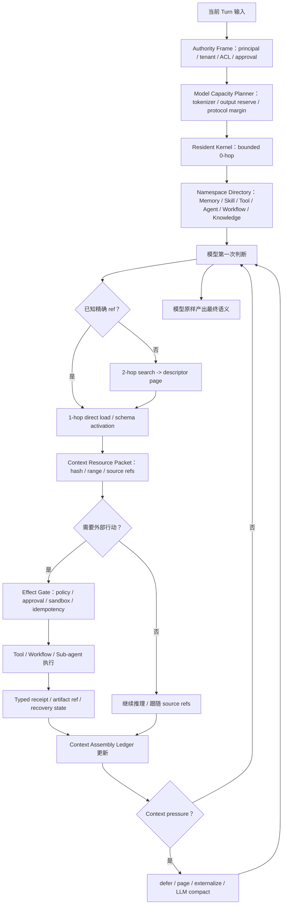
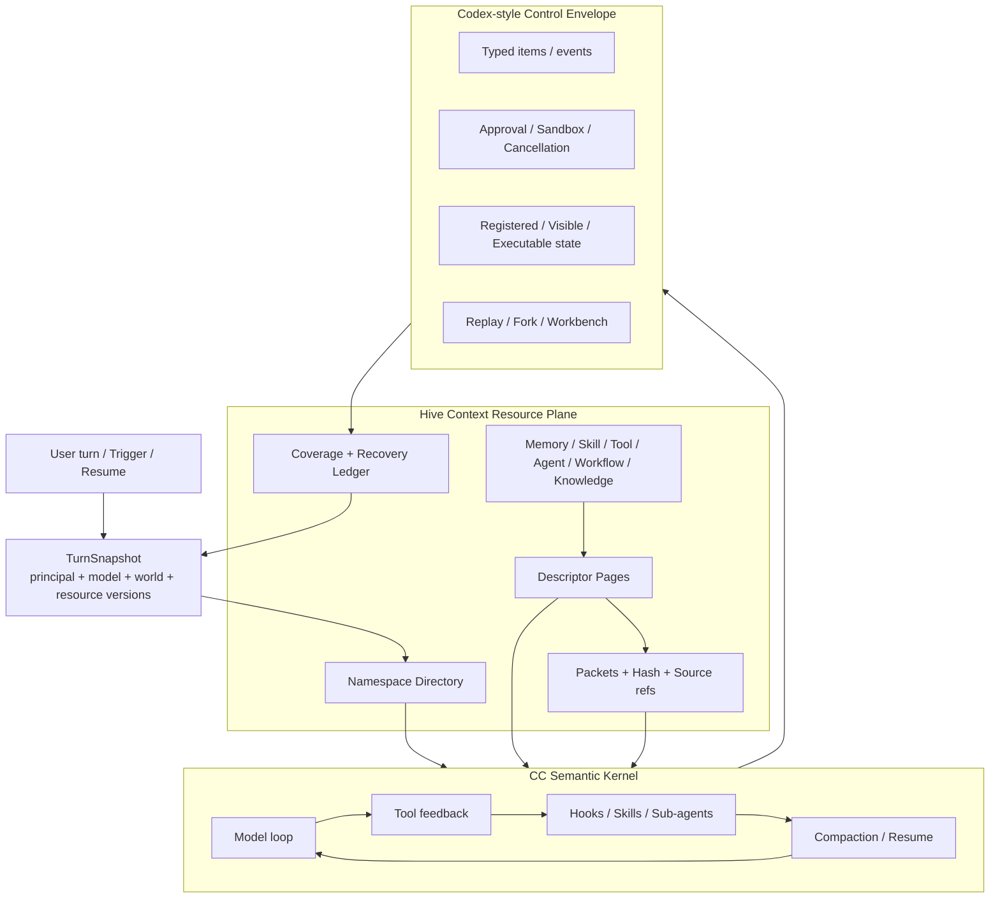

# Hive 统一上下文组装与渐进式披露架构

> 集成关系：本文是 Context Resource Plane 的设计权威，不独立定义当前断点总数或程序施工顺序。fleet、单根 Session 的 100-way root execution、Session truth、跨渠道 A2A 与 canonical ledger 统一以 `docs/agent-native-unified-atomic-review-2026-07-14.md` 为准。
>
> 施工消费合同：后续实现必须先读本文全文，不得用 Group 摘要、旧审查结论或单个参数表替代。总报告 §8.1 维护本文章节交叉表与 `CTX-A`–`CTX-F` 决策归属；§9 的 Group 6 是 Context/Capability 主实现，Group 4 已消费并关闭 durable result/ref-only fan-in 子合同，Group 1/2/3/7/8/9 消费各资源域子合同，Group 10 做最终重认证；§12 维护 canonical owner、状态与对应 `EVID-G*` 证据。任何实现、测试、容量曲线、迁移或裁决变化都必须回填总报告，并同步更新本文对应设计状态；两边不一致时不得宣称闭环。

- 日期：2026-07-14
- 状态：设计权威；Group 4 durable result/ref-only fan-in 子域已于 2026-07-17 闭环，Group 6 完整 Context Resource Plane 仍未完成
- 范围：Agent Memory、Skill、Tool / MCP、Sub-agent / Agent Team、Workflow、Knowledge、Hooks、会话历史、Tool Result 与 Provider Prompt 组装
- 基准模型：256K context window；同时要求 128K、512K、1M 窗口可按同一公式工作
- 目标：在资源数量近似无限时，首轮常驻上下文仍保持有界，全部授权资源保持真实可发现、可读取、可恢复、可审计，且不做静默硬截断

---

## 0. 本文要拍板的核心结论

这次暴露的不是“35K 应不应该改成 65K”这一类参数问题，而是一个统一的系统缺陷：

> Hive 目前把 Context Assembly、Memory Recall、Skill Catalog、Tool Search、Sub-agent Listing、Workflow State、Tool Result Compaction 分成了多个局部机制，但它们实际上都在竞争同一个物理 context window，也都在回答同一个问题：模型现在知道什么、还能去哪里找、下一步能调用什么、取回的证据如何进入后续推理。

本文建议拍板以下八条架构决策：

1. **不再设置 35K、65K 这类跨模型、跨语言的“语义硬上限”。** 唯一硬上限来自 provider 的真实 token capacity；平台在发送前做 token-native admission，不对语义内容做静默字符截断。
2. **常驻上下文目标设为模型窗口的 5%–10%，默认中心值为 8%。** 对 256K 模型，目标是 12,800–25,600 tokens，默认约 20,480 tokens。这个区间只约束“每轮都常驻的内核”，不限制模型按任务需要加载的动态证据。
3. **把上下文组装重定义为 Context Resource Disclosure（上下文资源披露），而不是字符串拼接。** 资源可以不在 prompt 正文里，但必须由真实、可发现、无损、可恢复的 ref 代表。
4. **首轮 prompt 的增长必须相对于资源总量保持 O(1)。** 一百万条 Memory、一万个 Skill、十万个 Tool、十万个 Workflow 不能让首轮 prompt 随资源数量线性增长。
5. **Memory 正文默认不再自动注入。** 常驻层只保留身份核心、当前任务工作态和可加载的 Memory 地址/激活提示；T2/T3、跨会话 transcript、T0 残余证据通过 `search_memory -> load_memory` 或已知 ref 的直接 `load_memory` 按需进入。
6. **保留领域 public tools，但统一内部协议。** 不强行发明一个包办一切的 `context_search` public tool；`tool_search`、`load_skill`、`search_memory/load_memory`、`read_context_resource`、Workflow preview/start 继续表达不同语义，但共享 descriptor、page、hash、coverage、ledger、pressure contract。
7. **“跳数”表示披露成本，不表示真相等级或价值等级。** 0-hop 只是首轮必须知道；3-hop 的 T0 原始证据可能比 0-hop 的导航摘要更权威。相关性由模型在授权证据内判断，权威性由 source/ACL/provenance 决定。
8. **压力处理顺序是：延迟 schema/body -> 分页 -> 外置大结果 -> 模型主导压缩 -> 完整覆盖的 map-reduce -> 最终 provider 物理拒绝。** 禁止把“返回全部候选”当 selector 失败兜底，也禁止把“最后统一报 prompt too long”当正常容量管理。

其中 5%–10% 与 8% 是 Hive 为 256K 基准提出的产品 SLO / review center，**不是**从 CC 或 Codex 源码中抄出的常量。CC 与 Codex 都采用自己的分域预算、延迟披露和 compaction 机制；它们提供的是设计证据，不替 Hive 决定最终比例。

一句话概括目标：

> 无限资源不是“无限正文同时注入”，而是“授权资源全集在逻辑上完整可达；首轮只携带稳定内核、命名空间目录、当前工作集和可恢复地址”。

---

## 1. 先把“没有硬截断”说准确

“上下文窗口不应该存在硬截断”在产品语义上是正确方向，但工程上要区分三件事。

### 1.1 必须消灭的硬截断

- 用固定字符数对 Memory、Skill、Hook context、Tool Result、Prompt section 做 `text[:N]`；
- 只保留候选的头部或尾部，且没有 ref、cursor、hash、coverage ledger；
- selector、reranker 或 LLM 失败后，把所有正文重新塞回 prompt；
- 用 35K / 65K 这类单一常量代替模型窗口、输出预算、tokenizer 和语言密度；
- 在最终 prompt gate 才发现超限，然后让整个 turn 失败；
- 为了“能发出去”而静默丢失决定性尾部、冲突、例外或 provenance。

### 1.2 必须保留的硬边界

Provider 的 context window、max output、协议序列化开销是真实物理边界。平台必须在发送前证明：

```text
projected_input_tokens
+ reserved_output_tokens
+ provider_protocol_margin
<= model_context_window_tokens
```

如果连最小不可延迟内核都放不下，正确结果不是截断，而是：

```text
status = provider_capacity_unavailable
retryable = true | false
required_tokens = ...
available_tokens = ...
recovery = switch_model | compact_history | repair_resident_source
```

### 1.3 本文采用的精确定义

本文所说的“无硬截断”是：

> 不存在静默、不可恢复、语义盲目的内容切割；允许由 provider capacity 触发显式 admission failure，也允许把正文转换成稳定 ref、分页资源或模型生成的有 provenance 的 compacted packet。

---

## 2. 当前 checkout 的真实状态与系统性缺陷

以下不是历史印象，而是 2026-07-14 当前代码路径的核验结果。

| 当前机制 | 已有正确资产 | 当前规模化缺陷 |
|---|---|---|
| `runtime/context_budget.py` | 能从模型窗口派生 prompt budget | 仍以字符为主，`20% * 3.5 chars/token`，且有 15K/350K 字符边界；不能表达 CJK、tool schema、provider serialization 与 output reserve |
| `provider_prompt_ledger.py` + `services/token_tracker.py` | 当前 live `RuntimeBudgetedLLMClient` 已按 messages、tools 与 extra surfaces 构建 provider prompt ledger；已有 CJK-aware estimator | system prompt planner 仍是字符比例；`runtime_budget_llm.py` 中保留的 `len(text)/4` helper 当前没有 live caller，但多套估算/预算 authority 仍未收敛成同一个 token-native admission truth |
| `prompt_builder._select_context_section_candidates()` | 有 section ledger 与选择原因 | section 超预算仍标记 `selected_over_advisory_budget` 并完整保留；预算没有驱动“内联或引用”的实际决策 |
| `assemble_runtime_prompt()` | 明确拒绝 blind truncation | 它是最后一道错误闸门，不是渐进式披露控制器；上游全部保留时只能整轮失败 |
| `MemoryRetriever` | 语义选择归 LLM，保留 coverage receipt | model 不可用或 selector 失败会返回全部候选；候选正文越多，失败兜底越危险 |
| `MemoryAssembler` | 保留分类与 activation reason | `del budget_chars` 后渲染全部已选正文；无法产生 descriptor/page/deferred packet |
| `runtime/invoker._resolve_memory_context()` | Memory 作为 dynamic suffix，避免污染 frozen cache；降级态可见 | 每轮仍主动构建并注入 Memory body；与“模型按需搜索/读取”的目标不一致 |
| `search_memory` | 已有 facts/session 两类搜索与 `load_memory` hint | 默认无隐藏 result cap，Session Recall 可直接返回完整 transcript；search 和 load 边界被打穿 |
| `load_memory` | 能按 ID 读取 T3/profile 与 explicit overlay | 尚无统一 typed ref、hash-pinned page、session/T0 source traversal 与 cursor contract |
| Skill catalog | `load_skill` 与执行工具边界已写清 | `SkillRegistry.render_catalog()` 和 section builder 明确渲染每个可见 Skill 的完整 description，预算参数被丢弃 |
| Sub-agent listing | 区分 Session Worker、Agent Team、Workflow、A2A | `build_subagent_listing_section()` 是 always-visible，所有 custom definitions 线性进入 prompt |
| `tool_search` | deferred schema discovery 与 Skill/Sub-agent/MCP manifest 已结构化分区 | lexical match 可以返回全部 Skill/候选并加载全部命中 schema；renderer 线性渲染每个候选，没有 cursor/coverage |
| Workflow | `preview_workflow` 会 compile/admit 并持久化 preview；`start_workflow` 只从 durable preview 启动 | Workflow discovery、definition body、active journal 还没有统一进入资源披露协议 |
| `read_context_resource` | 已有 trusted principal、ref allowlist、offset/limit、SHA-256、stale recovery | 只覆盖 soul/company/org/channels/A2A；它证明了 paging contract 可用，但尚未推广到其他 context resource |
| Prompt manifest / Context artifacts | 已有 candidate、source hash、usage ledger、selection reason | ledger 主要记录“最终塞了什么”，还不能驱动 defer/load/evict/compact/recover |

因此，当前系统不是完全没有渐进式披露，而是处于“多个局部正确、全局未统一”的状态：

- Tool 有 deferred schemas；
- Skill 有 catalog + load；
- Memory 有 search + load；
- Agent Context 有 hash-pinned paging；
- Workflow 有 durable preview；
- 会话有 compaction；
- Prompt 有 ledger。

真正缺的是把这些资产接入同一个 token-native Context Resource Protocol，并让它成为每次 provider call 前唯一的组装路径。

---

## 3. 统一心智模型：逻辑上下文无限，物理 prompt 有限

定义两个完全不同的集合：

```text
Authorized Resource Universe U_t
  = 当前 principal 在本 turn 有权发现或读取的全部资源

Physical Prompt P_t
  = 本次 provider call 实际内联的 token 序列
```

正确约束不是 `U_t == P_t`，而是：

```text
P_t ⊂ U_t

对每个 r ∈ U_t：
  r 已内联
  OR r 由可发现、无损、可恢复、授权绑定的 descriptor/ref 表示
  OR 当前 coverage ledger 明确声明该 scope 尚未覆盖，以及如何继续
```

这同时满足两个 North Star：

1. 模型不会因为平台静默裁剪而失去授权证据；
2. 平台不需要把无限资源全部塞进 prompt。

### 3.1 Context 不再是文本块，而是五种对象

| 对象 | 作用 | 是否直接进入 prompt |
|---|---|---|
| `ContextResourceDescriptor` | 告诉模型资源是什么、是否可用、如何搜索/加载 | 可以，必须紧凑 |
| `ContextDirectoryPage` | 有界的候选页，含 shown/total/cursor/coverage | 按需进入 |
| `ContextResourcePacket` | 已加载正文或结构化证据，含 ref/hash/range/source refs | 按需进入 |
| `ContextAssemblyLedger` | 记录 resident/loaded/deferred/evicted/compacted 与 token 事实 | 通常不全量进入模型；供 runtime/UI/audit |
| `ContextRecoveryReceipt` | stale、partial、denied、unavailable、compacted 的恢复信息 | 与相关失败一起进入 |

### 3.2 统一不等于混成一个工具

模型仍然需要语义清晰的领域入口：

- Tool：`tool_search` 发现并激活 schema；
- Skill：`load_skill` 加载方法、规则与组件说明；
- Memory：`search_memory` 找地址，`load_memory` 读证据；
- Agent Context：`read_context_resource` 读取受信 runtime context；
- Workflow：search/list descriptor -> `preview_workflow` -> 用户确认 -> `start_workflow`；
- Sub-agent：发现 worker descriptor -> `spawn_subagent`；
- Knowledge：Personal/Enterprise 各自的 governed search/read tools。

这些入口共享内部的 descriptor/page/packet/ledger 协议，但不能因为“统一”而抹掉 load 与 execute、Skill 与 Tool、Session Worker 与 A2A、Personal KB 与 Enterprise Knowledge 的边界。

---

## 4. 五层披露结构与跳数定义

### 4.1 L0：Resident Kernel（0-hop）

模型在第一次推理之前必须拥有、且无法通过后续工具补救的最小集合：

1. **身份核心**：精炼、稳定、受治理的 `soul` core；
2. **当前 principal / tenant / delegation / authority frame**；
3. **不可绕过的运行协议**：effect 前审批、sandbox、secret、evidence、recovery 规则；
4. **当前用户输入、当前 goal/plan boundary、当前 turn/run/session ref**；
5. **未完成承诺与恢复指针**：pending approval、pending tool frame、active workflow gate、subagent mailbox ref；
6. **Bootstrap Capability Kernel**：发现、加载、读取、恢复所必需的一小组 tool schemas；
7. **命名空间级 Capability Directory**：告诉模型有哪些资源域以及该去哪个入口，不列出域内全部资源。

L0 的判定标准不是“它很重要”，而是：

> 如果首轮看不到它，模型是否可能在不知道其存在的情况下作出不可恢复的错误推理或越权行动？

常驻/非常驻边界应明确写死：

| 默认常驻 | 默认不常驻 |
|---|---|
| bounded identity / soul core | T2/T3 Memory 正文、完整 wiki map |
| principal、tenant、delegation、effect authority | 完整 company/org 文档、完整 A2A roster |
| 当前 user turn、active goal/plan boundary | 旧会话 transcript、T0 raw evidence |
| pending approval/tool frame/workflow gate refs | 完整 Workflow definition/journal/history |
| Bootstrap discovery/load/recovery schemas | 所有 Tool/MCP schemas |
| resource namespace directory 与 availability | 所有 Skill、custom subagent、workflow catalog |
| 当前已 pin 的最小 recovery state | 大型 Hook context、Tool Result、artifact body |

System rules、soul、Skill 等源文件自身也可能无限增长，因此必须在 authoring/install/promotion 时拆成 **bounded resident root + versioned resource refs**。这是内容治理与发布校验，不是 runtime 截断。

### 4.2 L1：Address / Capability Directory（0-hop 或 1-hop）

L1 是地址簿，不是内容缓存。它包含：

- 当前 warm Memory refs；
- 已激活 Skill 名称与版本；
- 当前 callable tool schemas 与 deferred capability namespaces；
- 可用 Sub-agent/Team/Workflow 类型的紧凑 descriptor；
- Agent Context、Personal KB、Enterprise Knowledge、workspace artifact 的 search/load 入口；
- 每个目录的 `shown/total/next_cursor/coverage`。

资源无限时，L1 也不能列出每个对象。它必须是两级目录：

```text
namespace directory（常驻、有界）
  -> query/page directory（按需、有界）
     -> exact resource descriptor
```

### 4.3 L2：Activated Descriptor / Capsule（1-hop 或 2-hop）

模型已决定某个能力与任务相关，但尚未读取完整证据：

- 精确 Skill capsule root；
- 某几个 Tool schemas；
- Sub-agent definition/worker contract；
- Workflow preview / active-step contract；
- Memory/Knowledge result descriptors；
- 大型 workspace/context resource 的 page manifest。

### 4.4 L3：Evidence Packet（2-hop 或 3-hop）

这是模型真正读取并用于推理的正文：

- Memory T2/T3 entry；
- Knowledge 文档段落；
- Skill reference/template；
- Tool result page；
- Sub-agent structured result/artifact；
- Workflow step receipt；
- 文件内容或 Agent Context page。

每个 packet 必须带：authority、source refs、hash/version、range/cursor、complete/partial 状态。

### 4.5 L4：Residual / Raw Evidence（3-hop 及以上）

- T0 session segment；
- 完整 transcript；
- 原始 artifact；
- invocation spans；
- Workflow journal；
- relation/contradiction 的原始证据。

L4 通常不进入 prompt；只有模型发现冲突、需要核验、需要审计或用户明确要求完整覆盖时才读取。

### 4.6 跳数不是固定价值层级

| 跳数 | 典型路径 | 适用场景 | 平台责任 |
|---|---|---|---|
| 0-hop | resident kernel | 首轮安全推理所必需 | 保持有界、完整、版本化 |
| 1-hop | 已知 ref -> load；已知 Skill -> load；已知 Tool -> activate schema | warm working set、稳定 ID、显式用户引用 | 直接、低延迟、hash-pinned |
| 2-hop | search -> descriptor -> load | 大多数 Memory/Tool/Skill/Workflow 发现 | coverage、分页、可改写 query |
| 3-hop | loaded packet -> source_refs / relation -> raw evidence | 冲突、例外、深度核验 | provenance 与 authority 重新校验 |
| 4-hop+ | 递归关联、跨资源域、多轮探索 | 深度研究或审计 | 显式 exploration ledger、预算与停止条件 |

平台不能规定“超过三跳就不重要”。4-hop 的决定性证据仍然必须可达；只是不能在每个普通 turn 自动展开。

---

## 5. 模型究竟应该看到什么

### 5.1 首轮看到的不是完整 catalog，而是可行动的目录

建议的紧凑 descriptor：

```json
{
  "ref": "memory://t3/entry/abc123",
  "kind": "memory",
  "title": "Railway production deployment lessons",
  "description": "部署与 schema drift 的既有经验；正文未加载",
  "availability": "available",
  "authority_scope": "agent_private",
  "freshness": "2026-07-14T10:12:00Z",
  "estimated_tokens": 1460,
  "activation_reasons": ["warm_session_ref", "goal_related"],
  "load": {
    "tool": "load_memory",
    "arguments": {"refs": ["memory://t3/entry/abc123"]}
  },
  "sha256": "..."
}
```

模型需要理解的关键字段是：

- **它是什么**：kind/title/description；
- **为什么现在出现**：activation reasons 只是可解释信号，不是平台语义裁决；
- **是否真的可用**：available / denied / unavailable / stale；
- **读它的成本**：estimated tokens；
- **如何继续**：明确 tool + args；
- **如何核验版本**：source ref + hash。

### 5.2 目录必须诚实表达覆盖范围

任何搜索/目录结果都必须包含：

```json
{
  "shown": 20,
  "matched_total": 1834,
  "authorized_total": 1802,
  "coverage": "partial_page",
  "next_cursor": "...",
  "query": "railway deployment",
  "scopes_searched": ["memory_t3", "memory_t2", "session_index"],
  "scopes_unavailable": [],
  "ranking_observations": ["semantic", "graph", "session_warmth"]
}
```

禁止用一个没有 `matched_total/coverage/cursor` 的 top-k 假装“已经看完”。

### 5.3 平台排序与模型价值判断的边界

平台可以做：

- authority/sensitivity 过滤；
- exact syntax/schema 校验；
- semantic/vector/BM25/graph 候选检索；
- freshness、usage、working-set 等可解释 ranking observation；
- cursor、分页、dedupe、hash、成本估算；
- exhaustive 请求时的 coverage ledger。

平台不能做：

- 用关键词或固定阈值宣布某条 Memory “有价值/没价值”；
- 用 hop 数宣布证据不重要；
- selector 失败后全量注入；
- 用机械 summary 取代 LLM 语义压缩；
- 把 Skill 的 `allowed-tools` 文本直接当授权事实；
- 把自然语言命中当 approval / permission。

模型负责：

- 当前任务需要读哪些 descriptor；
- 是否需要换 query、翻页、跟 source refs；
- 冲突如何解释；
- 何时证据已经足够；
- 最终结论和表达。

---

## 6. 256K 基准预算

### 6.1 统一 token authority

所有预算必须基于同一个 `ModelCapacity`：

```python
ModelCapacity(
    context_window_tokens=256_000,
    max_output_tokens=...,
    tokenizer_id=...,
    provider_protocol_margin_tokens=...,
    input_limit_tokens=...,
)
```

计量优先级：

1. provider 官方 tokenizer / 实际 usage；
2. provider adapter 的统一 tokenizer；
3. CJK-aware conservative estimator；
4. 只有 char count 时才使用带 safety margin 的估算。

禁止 `3.5 chars/token`、`4 chars/token`、CJK estimator 三套口径同时决定不同 runtime gate。

### 6.2 预算公式

```text
C_model       = provider 声明的物理窗口
R_output      = 当前任务真实 output budget，不得为了塞 input 而饿死输出
R_protocol    = tool schema / message serialization / provider wrapper 的实测余量
C_input       = C_model - R_output - R_protocol

R_resident_target = 8% * C_model
R_resident_band   = [5%, 10%] * C_model

D_available = C_input
              - resident_tokens
              - current_user_turn_tokens
              - required_history_tokens
              - pinned_recovery_tokens
```

对 256K：

| 项目 | 默认目标 | 说明 |
|---|---:|---|
| Resident target-band floor | 12,800 tokens（5%） | 不是硬下限，也不是必须用满；小 Agent 应更低 |
| Resident center | 20,480 tokens（8%） | 本文推荐默认值 |
| Resident review ceiling | 25,600 tokens（10%） | 超过时触发构建/配置审查与资源外置，不做 runtime 切片 |
| Dynamic evidence | 按任务使用 `D_available` | Memory、Skill references、tool results、files、workflow evidence |
| Output reserve | 按模型与任务真实配置 | 不能用固定 2.5K/4K 饿死复杂任务 |
| Growth/compaction buffer | 从 `C_input` 动态保留 | 至少容纳下一轮 tool result + 一次 compact 调用 |

关键解释：

- 5%–10% 是**常驻内核**目标，不是“每次调用最多只能用 10% 窗口”；
- 对复杂研究，动态证据可以占很大窗口，只要它是当前任务真实需要的；
- 1M 模型不会因为百分比而自动常驻 80K tokens。百分比是 review band，resident 还要受“最小必要”原则控制；
- resident source 在 authoring/promotion 时就必须有 bounded root + external refs，不能到 runtime 才裁剪。

### 6.3 压力状态不是一个数字

建议把容量状态做成 typed state：

| 状态 | 条件 | 动作 |
|---|---|---|
| `normal` | 预计输入远低于有效窗口 | 正常加载 |
| `discovery_pressure` | descriptor/schema 数量增长过快 | directory 分页、defer schema、停止 catalog 全展开 |
| `evidence_pressure` | 已加载正文/tool results 增长 | page、外置 payload、释放非 pinned packet |
| `compaction_required` | 历史与已消费证据逼近 growth buffer | LLM-primary compaction，写 coverage/source refs |
| `provider_limit` | 最小不可延迟集合仍无法 admission | typed failure；换模型、恢复或修复 resident source |

状态阈值应由压力测试校准，不应把某个百分比写成语义裁决器。默认可以在预计输入达到有效窗口约 70% 时开始主动治理、80% 前完成 compaction，但上线阈值必须来自 128K/256K/1M 与真实 tool-loop traces。

---

## 7. 各资源域的具体契约

### 7.1 Memory

#### 常驻

- `soul` 的 bounded identity core；
- 当前 turn/session 的 working-set refs，不存正文；
- 用户本轮显式提供或显式 pin 的 task-local facts；
- Memory capability hint：如何 search/load、当前 availability/authority 状态；
- 少量 warm descriptors，含 ref/title/reason/size，不含 T2/T3 body。

#### 按需

- T3 profile/knowledge entry body；
- T2 session segment summary；
- T0 source/raw transcript；
- contradictions/relations；
- cross-session complete transcript。

#### 目标调用路径

```text
warm exact ref:
  Memory Directory -> load_memory(refs=[...])

cold recall:
  search_memory(query, scopes, cursor)
  -> descriptor page
  -> load_memory(refs, cursor/offset, expected_sha256)

verification:
  loaded T3/T2 packet
  -> follow source_refs
  -> load T0/session/artifact page
```

#### 必须修改的现有语义

- `search_memory` 只返回 descriptor/preview，不再返回完整 transcript；
- `load_memory` 支持 typed ref、session/T0/artifact source、分页、SHA-256 与 complete flag；
- 自动 activation 只产生排序后的地址提示，不直接产生全部正文；
- working set 只在真实 load/consume 后更新，candidate 出现不等于已使用；
- selector 不可用时返回 `selection_unavailable + searchable directory`，禁止返回全部正文；
- exhaustive memory 请求走完整 coverage job/map-reduce，而不是超大单 prompt。

### 7.2 Skill

#### 常驻

- Skill namespace 与 `load_skill` 使用规则；
- 已激活 Skill 的 name/version/ref；
- 与当前 task/path 明确相关的少量 descriptor page。

#### 按需

- `SKILL.md` root capsule；
- references/templates/assets/evals；
- workflow/subagent component definitions；
- scripts 的内容与执行说明。

#### 约束

- catalog 不再 `render every model-visible skill`；
- Skill root 必须在 save/install/promote 时验证为 bounded capsule，长材料放 references；
- `load_skill` 只增加上下文/指导，不激活 tool schema、不启动 workflow、不 spawn；
- Skill 内部资源仍通过受限 loader/read surface 加载；
- search/discovery 可以复用 `tool_search` 的 structured manifest 或扩展 `load_skill` 的 candidate mode，但 public execution boundary 不改变。

### 7.3 Tool / MCP

#### 常驻

- Bootstrap Capability Kernel 的少量 schemas；
- 当前 pending call 所需 schema；
- `tool_search` 本身及 capability namespace hints。

#### 按需

- deferred tool schemas；
- MCP server/tool descriptors；
- integration pack schemas；
- 暂时不相关的工具说明。

#### 约束

- discovery 与 schema activation 必须分开返回：`candidates` vs `loaded_tool_schemas`；
- 搜索必须分页，包含 `shown/matched_total/next_cursor/coverage`；
- `select:<exact-name>` 或等价结构化参数只激活明确 schema；
- 不能把所有 lexical match 一次加载；
- 长会话允许 schema working-set eviction，但 pending call / replay frame 的 schema 必须 pin；
- eviction 只移除 prompt schema，不删除能力，必须写 receipt，模型可用稳定名称重新加载；
- Tool result 超大时返回 typed preview + lossless resource ref；语义 summary 由 LLM 生成，平台只负责事实外置与 page contract。

### 7.4 Sub-agent / Agent Team / A2A

#### 常驻

- `spawn_subagent`、Agent Team、A2A 的边界说明；
- built-in worker types 的极短 descriptor；
- 当前 active child/team 的状态与 mailbox/result refs。

#### 按需

- custom subagent definition；
- Team member details；
- child transcript；
- child artifact/result body；
- A2A collaborator details。

#### 约束

- custom definitions 不再全量 always-visible；
- parent 给 child 的是 scoped task + delegated authority + context refs，不复制父上下文全集；
- child 在自己的 authority frame 内按需 load；
- child 返回结构化 result/artifact/source refs，完整 transcript 默认不回灌父 prompt；
- pending child tool frame、resume/reconciliation receipt 必须 pin，不能被 schema eviction/compaction 破坏；
- Agent Team、Session Worker、Workflow、A2A 继续是四种不同 execution semantics。

### 7.5 Workflow

#### 常驻

- Workflow 何时适用的短规则；
- 当前 active workflow 的 run ref、current step、gate/wait/recovery 状态；
- `preview_workflow` / `start_workflow` 的基本契约。

#### 按需

- workflow catalog；
- definition body；
- preview details；
- step journal、leaf receipts、artifacts；
- completed run history。

#### 约束

- discovery 只返回 Workflow descriptor；
- preview 是 exact definition/args 的 durable compiled artifact；
- start 继续只接受 durable preview ref，不能让 prompt 文本成为执行权威；
- active prompt 只放当前 step/gate/recovery 的最小状态，完整 journal 用 ref 读取；
- resume 必须从 RuntimeTask/Workflow journal 真相源恢复，而不是依赖被压缩的自然语言摘要。

### 7.6 Personal KB / Enterprise Knowledge

- Personal KB 继续保持 tool-only，禁止被新的统一目录偷偷静态注入正文；
- Enterprise Knowledge 继续使用 tenant/company authority、ACL/RLS、provenance、retention、audit；
- 两者可以共享 descriptor/page/packet 形状，但 authority plane 和工具命名必须可区分；
- denied、unavailable、empty 必须是三种状态；
- Knowledge 引用必须跟随 source ref 进入最终回答/产物。

### 7.7 Hooks

Hook 是上下文 ingress，不是无限字符串注入口。

目标契约：

```text
hook result
  -> bounded resident_hint（确实必须首轮看到）
  OR ContextResourceDescriptor/ref
  OR blocking/approval typed decision
```

必须禁止：

- hook 把大型正文通过 `additional_contexts` 无上限追加；
- hook 失败后回退为全量正文；
- hook 用自然语言字符串改变 permission/approval；
- hook context 不进入 prompt manifest/usage ledger；
- transaction/lock 内等待外部 hook/network/LLM。

Hook context 与 Memory/Skill 一样必须有 source、authority、hash、estimated tokens、load/recovery action。

### 7.8 会话历史与 Tool Result

- `ChatTranscriptEvent` / T0 是完整历史真相，prompt history 只是可恢复投影；
- Tool result 大 payload 先机械外置为 lossless resource，prompt 内保留 typed fact preview/ref；
- LLM compaction 保留 goals、decisions、constraints、pending work、tool receipts、source refs 与 coverage；
- compaction 不删除 durable truth，也不让 summary 变成唯一执行权威；
- 任何 compacted boundary 都要能回到原 transcript/tool result；
- selector/compactor 不可用时只能 hold/defer/retry/typed degrade，不能机械改写语义真相。

---

## 8. 统一运行流程



### 8.1 每次 provider call 的固定步骤

1. 绑定 principal、tenant、delegation 与授权 source scopes；
2. 读取真实模型 capacity/tokenizer/max output；
3. 构建 bounded resident kernel；
4. 合并当前已加载/pinned packets 与 active schemas；
5. 生成 descriptor/page/coverage，而不是全 catalog；
6. 计算 projected provider input tokens；
7. 若有压力，先 defer/page/externalize/compact；
8. 通过 admission 后发送；
9. 记录 provider actual usage 与 assembly ledger；
10. 将真实 load/use、tool receipt、source traversal 反馈到 session working set。

---

## 9. 建议的内部数据契约

以下为架构契约，不代表当前代码已经存在同名 class：

```python
class ContextResourceDescriptor:
    ref: str
    kind: str
    title: str
    description: str
    authority_scope: str
    availability: str
    source_ref: str
    sha256: str | None
    version: str | None
    estimated_tokens: int | None
    activation_reasons: list[str]
    relations: list[str]
    load_action: dict


class ContextDirectoryPage:
    schema: str
    query: str | None
    scope: str
    descriptors: list[ContextResourceDescriptor]
    shown: int
    matched_total: int | None
    coverage: str
    next_cursor: str | None
    unavailable_scopes: list[str]


class ContextResourcePacket:
    schema: str
    status: str
    ref: str
    source_ref: str
    sha256: str
    offset: int | None
    next_offset: int | None
    complete: bool
    estimated_tokens: int
    content: str | dict | list
    source_refs: list[str]


class ContextAssemblyDecision:
    candidate_ref: str
    decision: str  # resident | loaded | deferred | evicted | compacted | denied | unavailable
    reason_code: str
    token_estimate: int
    actual_tokens: int | None
    source_hash: str | None
    recovery_ref: str | None


class ContextAssemblyLedger:
    turn_id: str
    model_capacity: dict
    resident_tokens: int
    dynamic_tokens: int
    tool_schema_tokens: int
    history_tokens: int
    reserved_output_tokens: int
    pressure_state: str
    decisions: list[ContextAssemblyDecision]
    provider_actual_usage: dict | None
```

### 9.1 统一状态码

至少需要：

```text
ok
empty
partial_with_cursor
authority_denied
temporarily_unavailable
stale_resource
coverage_incomplete
selection_unavailable
budget_deferred
compaction_required
provider_capacity_unavailable
needs_reconciliation
```

不得把 `denied`、`unavailable`、`empty` 都表现成“没有结果”。

---

## 10. 高压模拟与验收矩阵

这套架构不能靠普通三五条 Memory 的单测验收，必须用组合压力。

### 10.1 规模矩阵

| 维度 | 压力值 | 核心断言 |
|---|---:|---|
| Memory | 1,000,000 descriptors | 首轮 prompt 不随总量线性增长；尾部资源可 search/load |
| Skills | 10,000 | catalog 不全展开；精确 Skill 与 query candidate 可达 |
| Tools/MCP | 100,000 schemas | bootstrap schemas 有界；search 分页；只激活 select 的 schemas |
| Custom subagents | 10,000 | listing 有界；custom definition 按需加载 |
| Workflows | 100,000 definitions | descriptor search 有界；preview/start 仍 hash/durable 绑定 |
| Cross-session history | 100,000 sessions | search 不返回完整 transcript；load page 可读决定性尾部 |
| Tool result | 单次 50MB | payload 外置；prompt 保留 typed preview/ref；可完整恢复 |
| Hook context | 单 hook 10MB | hook 只能内联 bounded hint，其余产生 ref/page |
| Active children | 1,000 receipts | parent 只看到状态/结果 refs；pending frames 不丢失 |

### 10.2 模型窗口矩阵

至少运行：

```text
128K / 256K / 512K / 1M
English-heavy / CJK-heavy / mixed schemas
small output / 32K output / reasoning-heavy output
```

断言：

- 同一资源集合在不同模型上由 token-native planner 产生不同可用动态预算；
- Resident Kernel 不超过 10% review ceiling，默认接近或低于 8%；
- CJK 不被 `chars/4` 低估；
- 输出预算不会因为输入贪占而被静默缩小；
- provider 实际 usage 与估算误差可观测并反馈校准。

### 10.3 语义完整性回归

1. 决定性证据只存在于最后一页/最后一个 source ref；模型仍可到达；
2. benign 内容包含 `tool`、`secret`、`approve`、`workflow` 等关键词，不触发硬权限结果；
3. Memory selector 返回非法 JSON，不全量注入、不终止普通对话，返回可搜索的 typed degrade；
4. Tool Search 命中一万项，只加载显式选择 schema；
5. Skill root 很小、reference 很大；只在模型读取 reference 时占用 context；
6. Nested A2A/subagent receipts 经过 compaction 后仍可 resume；
7. Workflow 在 gate 前后重启，恢复依赖 durable journal，不依赖 prompt 文本；
8. Context resource 读取中途内容更新，SHA mismatch 返回 `stale_resource` 并从 0 恢复；
9. Personal KB denied、provider unavailable、query empty 三种 UI/model 状态不同；
10. 模型最终回答除精确 secret redaction 外保持 byte-faithful，不由平台扫描器重写。

### 10.4 TDD 红测清单

实现时第一批测试必须先失败，并至少覆盖：

```text
test_resident_prompt_is_constant_with_million_memory_descriptors
test_skill_catalog_is_paged_and_tail_skill_is_discoverable
test_tool_search_does_not_activate_every_lexical_match
test_memory_selector_failure_never_inlines_all_candidates
test_search_memory_returns_session_descriptor_not_full_transcript
test_load_memory_pages_session_and_t0_with_sha256
test_cjk_and_ascii_share_single_token_authority
test_hook_large_context_becomes_hash_pinned_resource
test_schema_eviction_preserves_pending_tool_replay
test_compaction_preserves_nested_subagent_and_workflow_receipts
test_provider_gate_never_blindly_slices_content
test_exhaustive_request_emits_complete_coverage_ledger
```

---

## 11. 七原子闭环

| 原子 | 目标闭环 |
|---|---|
| 输入（Input） | 当前 turn、query、explicit refs、active goal、provider capacity 进入同一 assembly request；输入本身可 replay |
| 权威（Authority） | descriptor/search/load 都从 trusted principal/tenant/delegation 派生；caller 不能选择别人的 principal |
| 执行（Execution） | 所有 prompt 资源只能通过 Context Resource Gateway/adapter 进入；禁止裸字符串绕过 ledger；外部 effect 仍走各自 governed runtime |
| 证据（Evidence） | descriptor/ref/hash/page、assembly decision、provider actual usage、invocation span、T0/transcript/receipt 都有稳定关联 |
| 恢复（Recovery） | cursor、offset、SHA mismatch、compaction boundary、pending tool frame、workflow/subagent resume 都有 typed recovery |
| 消费（Consumption） | model-visible directory 能真实调用 search/load；加载 packet 真进入下一轮；Memory working set、Skill active set、schema working set 只记录真实消费 |
| 验收（Acceptance） | 规模矩阵、窗口矩阵、CJK、tail evidence、failure injection、resume、UI pressure diagnostics 与 production traces 全覆盖 |

只有七项都成立，才能把“统一上下文组装”标成闭环。单独有 schema、tool、manifest 或 prompt preview 都不算完成。

---

## 12. 故障与恢复契约

| 故障 | 禁止兜底 | 正确恢复 |
|---|---|---|
| Memory selector unavailable | 返回所有 Memory 正文 | 返回 selection unavailable + directory/search action；核心对话继续 |
| Search index unavailable | 声称无结果 | `temporarily_unavailable`，可按 known ref direct load；必要时请求 review/retry |
| Directory page 太大 | 截头/截尾 | cursor page + coverage |
| Resource 读取中版本变化 | 拼接两版内容 | SHA mismatch，restart offset 0 |
| Tool schema 太多 | 全部 schema 加载 | deferred candidates + exact select + evictable schema working set |
| Tool result 太大 | 截断 result 文本 | lossless artifact/resource + bounded fact preview |
| LLM compactor 失败 | regex summary | 保留原 evidence/ref，hold/retry/typed degrade |
| Provider 超限 | 最后静默切 prompt | preflight admission；先治理 dynamic pressure；最小集合仍超限则 typed failure |
| Workflow/child 重启 | 从自然语言 summary 猜状态 | durable preview/journal/pending frame replay 或 needs_reconciliation |
| Hook provider 超时 | transaction 内持续等待或吞错 | transaction 外执行；typed retryable hook state；正文仍以 ref 可恢复 |

---

## 13. CC、Codex 与 Hive 当前 Runtime 的源码对照

### 13.1 对照快照与裁决方式

本节不是依据产品文案或历史印象，而是依据以下本地源码快照：

| 基线 | 当前快照 | 本文用途 |
|---|---|---|
| FreeCode / CC runnable baseline | `/Users/rocky243/vc-saas/free-code-main` @ `7dc15d6c8fb0c40c7fcc02ce9b58204324252632` | 裁决 CC 的 agent loop、context、tool、Skill、subagent、compaction 语义底座 |
| Codex Rust | `/Users/rocky243/Context Engineering/codex/codex-rs` @ `5c19155cbd93bfa099016e7487259f61669823ff` | 只提取不削弱 CC 能力面的 typed state、approval、sandbox、replay、deferred tools 等工程增量 |
| Hive current checkout | 本仓库 @ `501db6555dae374e5fcf43a6fdcfe8a3dd89343e` 加当前 worktree | 判断 Hive 当前真实消费路径；不能把文档、schema 或未接入口的模块当作闭环 |

对齐目标不是逐行复刻，而是：先保住 CC 的完整生命周期语义，再吸收 Codex 的控制与恢复能力，最后把 Hive-native Memory / Workflow / A2A / enterprise authority 接入同一个 Runtime。

### 13.2 CC 真正做到的 Runtime 语义

FreeCode 的主循环集中在 `src/query.ts`：

```text
session truth
  -> compact boundary 之后的 model view
  -> tool-result budget / history snip / microcompact / collapse / autocompact
  -> stable system prefix + dynamic suffix
  -> provider call
  -> assistant tool_use
  -> hook + permission + tool execution
  -> tool_result 写回 transcript
  -> 下一次模型判断
```

关键事实是：

1. **模型主导语义循环已经闭环。** `queryLoop()` 在每次 provider call 前治理上下文，执行 tool 后把结果写回下一轮；max turn、orphan tool use、compact boundary 都是 lifecycle state，不依赖模型自己记住。
2. **Hook、权限与工具执行处于同一效果边界。** `src/services/tools/toolExecution.ts` 的 PreToolUse 可以 allow / ask / deny、更新 input、追加 context 或 stop；permission resolve 后才执行，PostToolUse 再产生可观察结果。
3. **缓存边界是稳定前缀与动态后缀。** `src/constants/prompts.ts` 使用 `SYSTEM_PROMPT_DYNAMIC_BOUNDARY`，避免高频动态内容破坏整个 system prefix 的 prompt cache。
4. **完整 session truth 与当前 model view 分离。** compaction、tool-result 持久化替换、loaded-tool state 与 invoked skills 可以跨轮保存，当前 prompt 不必等于完整 transcript。
5. **Tool、Skill、Sub-agent 都是真实可调用能力。** Tool Search 能将 deferred tool schema 激活为 provider `tool_reference`；Skill 加载完整 capsule；subagent 有 fork/fresh context、sidechain transcript、resume 和 background notification。

这五项构成 Hive 必须守住的 **CC semantic floor**。如果 Hive 只做更复杂的 Memory 或治理，却让普通 agent loop、工具反馈、compaction、resume、Skill/Sub-agent 变弱，就不是 CC Plus。

### 13.3 CC 的上下文、Memory、Skill 与 Tool Search 到底怎么做

CC 并非“不限量全部注入”，而是按资源域采用不同机制：

| 资源域 | FreeCode 当前机制 | 做对了什么 | 规模上仍未解决什么 |
|---|---|---|---|
| Project instructions / memory files | `src/context.ts` 经 `getClaudeMds()` 注入文件正文；`MAX_MEMORY_CHARACTER_COUNT=40000` 只告警，不截断 | 保证项目规则完整、缓存边界稳定 | 文件数量/正文仍可线性增长；40K 是警告线，不是无限资源协议 |
| Auto memory | manifest 最多扫描 200 个文件；辅助模型从 manifest 选文件；最多附加 5 个，每个只给 bounded preview 并提示用 Read 读完整内容 | 已经是“先地址、一跳再读正文”的原型 | 200/5/单文件 preview/会话累计字节都是固定边界；selector 失败为空，且不提供跨资源统一 coverage |
| Tool Search | deferred MCP/tool metadata；`ToolSearch` 默认返回 5 个；精确 `select:` 或关键词搜索；命中后用 provider-native `tool_reference` 激活 schema | 把“已注册”与“当前模型可见 schema”分开 | 依赖 provider 能力，只覆盖 tools；不是 Memory/Skill/Workflow 的统一 resource plane |
| Skill | Skill metadata 预算约为 context 的 1%；优先保住名字，再缩 description；调用后加载完整 Skill，invoked skills 跨 compaction 保留 | Progressive disclosure 与 durable active set 成立 | 大规模时仍存在 O(N) 名称目录；预算退化主要靠 description/name 压缩而非可分页目录 |
| Sub-agent | Agent tool 暴露 agent definitions，支持 fork/fresh context、sidechain、resume、background/worktree | delegation 是一等 runtime capability，不是 prompt 模拟 | agent catalog 本身仍会随数量增长，没有统一 discovery/page/coverage contract |
| Compaction | effective window 扣除 summary output reserve；多层治理；model summary 为主路径；保留 loaded-tool/skill/session state | 在 provider 拒绝前治理压力，且可继续执行 | 它解决“长会话”，不等于解决“无限资源目录”；压缩仍可能失去未被结构化外置的工作态 |

所以对 CC 的准确结论是：

> CC 已经完成高质量 agent loop 和若干领域内的 progressive disclosure；它没有把无限 Memory、Skill、Tool、Agent、Workflow 统一成一个具备 authority、cursor、hash、coverage、recovery 的资源平面。

### 13.4 Codex 相比 CC 的 Runtime 增量

Codex 的优势主要不在“给模型塞更多上下文”，而在 **控制信封（control envelope）**：

1. **Turn snapshot 一致性。** `codex-rs/core/src/session/turn.rs::run_turn()` 为一轮捕获 `StepContext`，使模型配置、context、tools、approval/cancellation 等共享同一快照；world state 与 reference context 也作为 typed items 记录。
2. **Typed thread / turn / event / item。** 模型输入、tool call、tool result、approval、compaction、错误与完成事件可持久化、replay、resume、fork，而不是只靠自然语言 transcript 推断状态。
3. **注册、发现、可见、执行分离得更清楚。** direct tools 进入当前 schema；deferred tools 留在 runtime registry；`tool_search` 对 metadata 做 BM25 检索，默认 limit 8，返回 `LoadableToolSpec` 供后续调用。
4. **Approval、sandbox 与 retry 是 effect envelope。** `ExecApprovalRequirement` 区分 Skip / Forbidden / NeedsApproval；执行器绑定 filesystem/network sandbox，sandbox denial 可进入受控审批与重试，权限拒绝不会被自然语言绕过。
5. **并发与取消更机械可靠。** Tool runtime 明确 per-tool parallel/serial、cancellation、abort 与 typed outcome，避免把这些职责推给 prompt。
6. **Compaction 和 cache 可观测。** compaction 有 typed window/turn metadata 与 warning；prompt cache key 与 thread 绑定；model-visible history 会标准化 call/output pair。

但 Codex 也没有解决无限资源：

- `AGENTS.md` 项目指令总预算默认 32 KiB，超出时机械截断；
- Skill metadata 默认占 context 的 2%，先缩 description，仍超限就省略一部分 skill，并发出 warning；
- tool search 默认 8 个结果，且仍是 tool-only；
- tool output 会按 policy 机械截短 model-visible 内容；
- compaction 在持续 `ContextWindowExceeded` 时会移除最老 history item 后重试，compact history 也只重建一部分 recent user messages。

因此 Codex 提供的是比 CC 更强的 **typed control、effect isolation、recovery 和 workbench state**，不是“无限上下文”的答案。Hive 应吸收它的工程外壳，但不能复制其不可恢复截断或用固定预算省略资源后不提供可发现地址。

### 13.5 Hive 当前是否已经做到 CC 对齐

用七原子状态判断，当前结论如下：

| 能力 | CC 语义底座 | Codex 可加增量 | Hive 当前状态 | CC Plus 目标 |
|---|---|---|---|---|
| Model ↔ tool 循环 | tool result 回到下一轮，hook/permission/effect 闭环 | typed invocation、并发、取消、approval/sandbox | **局部闭环**：Kernel/Hook/Tool Result 主路径成立，但多条 context/tool surface 尚未由同一 snapshot/ledger 驱动 | 单一 TurnSnapshot + effect envelope，所有结果具 typed receipt/ref |
| System/context assembly | cached stable prefix + dynamic suffix | typed reference context、prompt cache key | **局部闭环**：section/manifest/ledger 已有；上游仍可能全量正文，最后 gate 才失败 | token-native projection + O(1) resident kernel + resource packets |
| Tool discovery | deferred schema + ToolSearch | runtime registry 与 model-visible schema 明确分离，BM25 | **局部闭环**：已有 deferred manifest，但搜索/renderer/activation 仍可能线性扩大 | registered / discoverable / active / executable 四态，分页且只激活明确选择 |
| Skill disclosure | budgeted catalog + load full Skill | explicit structured mention、budgeted metadata | **断点**：`render_catalog()` 忽略 budget 并渲染全部可见 description | bounded Skill directory + `search_skills` + `load_skill`，执行仍走治理工具 |
| Memory recall | project context + bounded auto-memory one-hop | 无统一长期 Memory 解法 | **断点**：selector failure 可暴露全部候选；assembler 忽略 budget；每轮仍主动注入 body | warm descriptors + model-directed search/load + T0/T2/T3 source traversal |
| Sub-agent | fork/fresh context、sidechain、resume | typed collaboration state/worktree/event | **局部闭环**：运行能力存在；custom definitions 的首轮 listing 仍线性 | bounded directory + scoped context refs + result distillation + replay-safe pending frame |
| Workflow | 非核心确定性 orchestration substrate | typed event/state/recovery 可借鉴 | **局部闭环**：Hive-native durable preview/start/journal 已有，discovery/context projection 未统一 | 保持独立 Workflow authority，并接入 descriptor/packet/ledger |
| Compaction / recovery | model-led compaction + loaded state preservation | typed compact events、replay/fork | **局部闭环**：`SessionContextController` 与 recoverable tool artifacts 是强资产，但尚未覆盖所有 resource domains | working-set lease、coverage、source refs、pending frames 全部跨 compact 恢复 |
| Enterprise authority | CC 本地权限/approval | sandbox/approval/typed policy | **局部闭环**：tenant/RLS/governed tools 很强，但 disclosure 与 authority 状态尚未统一表达 | denied / unavailable / empty / partial 全链路可辨、可审计、可恢复 |
| 无限资源平面 | **缺失** | **缺失** | **断点**：各域有局部机制，没有统一消费路径 | **闭环**：所有授权资源 O(1) bootstrap、按需加载、lossless ref、coverage ledger |

这里最重要的判断是：Hive 并非“整体弱于 CC”。Workflow、企业权限、Memory Vault、A2A、durable RuntimeTask、invocation spans 都是可形成优势的 native 资产。当前缺陷是这些资产尚未通过一个统一的 Runtime 资源披露与上下文组装平面进入模型，因此在高压力下会退化成 catalog/body 拼接，抵消 native 优势。

### 13.6 CC Plus 的准确公式

```text
CC Plus Runtime
  = CC semantic kernel
      agent loop + tool feedback + hooks + skills + subagents + compaction + resume
  + Codex control envelope
      typed turn state + registry/visibility split + approval + sandbox + cancellation + replay
  + Hive resource plane
      tenant authority + Memory Vault + Knowledge + Workflow + A2A
      + unified descriptor/page/packet/coverage/recovery protocol
```

三者不是替代关系：

- 没有 CC kernel，Agent 会“治理很强但不会干活”；
- 没有 Codex envelope，Agent 会“能干活但 effect/state 不够可控可恢复”；
- 没有 Hive resource plane，系统会“功能很多，但资源一多就重新膨胀 prompt”。

真正能超越 CC 的点，不是把 35K 调到 65K，而是让 **资源总量与首轮 prompt 体积解耦，同时保持每个授权资源都真实可达、可执行、可追证、可恢复**。

---

## 14. 一轮完整实现的精确代码触点

本文当前只写设计，不改实现。讨论拍板后，必须按 TDD 在一轮交付中同时完成协议、迁移兼容、压力测试、观测和 UI 消费，不做隐藏在 flag 后的半成品。

### 14.1 Capacity 与 Prompt Assembly

- `backend/app/runtime/context_budget.py`
  - 用 `ModelCapacity` / token-native planner 替代 char-ratio authority；
  - 区分 resident、dynamic、tool schemas、history、output、protocol reserve；
  - 输出 pressure state，不做语义 selection。
- `backend/app/services/token_tracker.py`
  - 收敛统一 estimator/tokenizer adapter。
- `backend/app/services/runtime_budget_llm.py`
  - 保留当前 `build_provider_prompt_ledger()` live 路径；删除或隔离无 caller 的 legacy `len/4` helper，避免它重新成为旁路；
  - 与 system prompt planner、output reserve 和 provider actual usage 收敛为同一 token authority。
- `backend/app/runtime/prompt_builder.py`
  - section candidate 产生 inline/ref/deferred decision；
  - final gate 只保留 provider physical admission。
- `backend/app/runtime/turn_envelope.py`
  - manifest 扩展 directory/page/packet/eviction/compaction/recovery decisions；
  - ledger 对齐 provider actual usage。
- `backend/app/runtime/context_engine.py`
  - 禁止未记录的裸字符串 context ingress。

### 14.2 Memory

- `backend/app/services/memory_service.py`
  - 自动路径改为 resident core + activation descriptors；不再默认返回全部 selected bodies。
- `backend/app/memory/retriever.py`
  - selector failure 不返回全量 body；
  - 输出 typed directory/selection receipt；
  - exhaustive path 使用 coverage job。
- `backend/app/memory/assembler.py`
  - 从纯字符串 renderer 改为 packet/descriptor assembler；移除 `del budget_chars` 语义。
- `backend/app/tools/handlers/memory.py`
  - `search_memory` descriptor-only + cursor/coverage；
  - `load_memory` typed refs + paging + SHA + T2/T3/session/T0 source traversal。
- `backend/app/memory/session_working_set.py`
  - 只在真实 load/use 后更新 refs/strength，不存正文。
- `backend/app/runtime/invoker.py`
  - `_resolve_memory_context()` 消费 descriptors/status，不再无条件注入全部 body。

### 14.3 Skill / Tool Search

- `backend/app/skills/registry.py`
  - `render_catalog()` 改为 bounded namespace/page；
  - install/save/promote 时校验 bounded root capsule。
- `backend/app/runtime/prompt_sections/skills_catalog.py`
  - 不再完整渲染所有 Skill。
- `backend/app/services/tool_search_manifest.py`
  - 增加 query、shown、matched_total、coverage、cursor、selected schemas；
  - renderer 不再保留每个候选的全量线性契约。
- `backend/app/services/agent_tool_domains/workspace.py`
  - `_tool_search()` 分离发现与 schema activation，只激活明确选择；
  - Skill/Sub-agent 候选分页。
- `backend/app/runtime/invoker.py`
  - schema working set pin/evict/reload receipt；
  - pending/replay frames pin 依赖 schema。
- `backend/app/tools/handlers/skills.py`
  - 保持 load vs execute 边界，返回 version/ref/estimated tokens/resource index。

### 14.4 Agent Context / Hooks

- `backend/app/tools/handlers/context_resources.py`
  - 抽取现有 hash-pinned paging 为可复用内部 packet contract；
  - 保持 Personal KB 不混入此 authority plane。
- `backend/app/services/agent_context.py`
  - namespace index 与 bounded resident hints；大 company/org/A2A context 默认 ref 化。
- `backend/app/runtime/hook_runner.py`
- `backend/app/runtime/hooks.py`
- `backend/app/services/plugin_hook_service.py`
  - hook 产出 typed hint/descriptor/block decision；
  - 大 context 进入 resource store，不进 transaction，不裸拼 prompt。

### 14.5 Sub-agent / Workflow

- `backend/app/runtime/prompt_sections/subagent_listing.py`
  - built-in compact descriptors 常驻；custom definition search/load。
- `backend/app/agents/subagent.py`
- `backend/app/tools/handlers/subagent.py`
- `backend/app/services/subagent_run_service.py`
  - scoped context refs、child load、structured result、pending frame pin/recovery。
- `backend/app/tools/handlers/workflow.py`
  - 保持 durable preview/start authority；返回/消费 resource refs。
- `backend/app/services/workflow_definitions.py`
- `backend/app/services/workflow_runtime_service.py`
  - descriptor discovery、active-step projection、journal paging。

### 14.6 UI / Observability

Session Workbench / context diagnostics 展示：

- resident/dynamic/schema/history/output token 分布；
- pressure state；
- loaded/deferred/evicted/compacted counts；
- unavailable/denied/partial scopes；
- recovery action；
- 不把 raw internal payload 默认暴露给普通用户。

---

## 15. 明确禁止的实现

1. 把 35K 改成 65K 后结束；
2. 把所有 Memory 先召回，再让一个 LLM 从超大候选里选；
3. selector/LLM 失败时返回全部候选正文；
4. catalog/search 没有 cursor/coverage 却声称完整；
5. resident prompt 列出所有 Skill、custom subagents、Workflows 或 Tool names；
6. `search_memory` 直接返回完整 transcript；
7. `load_skill` 偷偷激活工具或执行组件；
8. 用关键词决定是否该 spawn、workflow、load memory 或批准行动；
9. 用 hop 数/recency/usage count 直接决定语义真相；
10. 用 regex/mechanical summary 作为 compactor 的主路径；
11. 把 Personal KB、Agent Memory、Enterprise Knowledge 混成同一个 authority store；
12. 让 Hook 的任意字符串绕过 Context Assembly Ledger；
13. 为了 O(1) prompt 而隐藏资源存在，且不给搜索入口或 coverage ledger；
14. 为了“完整可见”而把资源全集直接注入 prompt。

---

## 16. 仍需讨论并拍板的六个产品决策

本文给出推荐答案，但这六项会实质影响最终实现，应在施工前明确。

### 决策 A：T2/T3 Memory body 是否允许自动 0-hop 注入

**推荐：不允许，除非是用户本轮显式提供/显式 pin 的 task-local fact。**

原因：只要允许“挑几条自动注入”，系统就会继续围绕 top-k、失败兜底和 budget patch 打转。更稳的机制是自动注入 warm descriptors，由模型一跳读取正文。这样召回排序仍有价值，但排序只决定地址提示，不决定真相进入 prompt。

### 决策 B：常驻默认中心值用 8% 还是更保守的 6%

**推荐：先以 8% 作为 256K 产品基准，同时要求真实基线尽可能低于它。**

8% 不是配额消费目标，而是 review center。上线前应测量现有 system rules、authority frame、bootstrap schemas、current turn 最小集合；如果 6% 能完整承载则不应主动填到 8%。

### 决策 C：是否新增统一 public `context_search/context_load`

**推荐：暂不新增。**

统一内部 contract，保留领域 public tools。模型更容易理解 `search_memory` 与 `tool_search` 的不同含义，权限也更清晰。只有当多个领域出现完全相同、且用户可理解的跨域检索需求时，再新增聚合入口；不能为了架构图整齐而制造并行 surface。

### 决策 D：是否允许后台 Memory 召回自动影响首轮

**推荐：允许自动生成 bounded warm descriptors，不允许自动注入 Memory body。**

后台 index、embedding、graph relation、recency 与 session working set 可以为模型提出“可能相关的地址”，但必须同时给出 source ref、原因与可用状态。它们只决定首轮提示哪些地址，不替模型决定事实重要性；selector 不可用时返回 typed degrade，绝不能退回全量正文。

### 决策 E：provider-native Tool Search 是否成为唯一标准

**推荐：不成为唯一标准，只作为优化 adapter。**

FreeCode 的 `tool_reference` 和 Codex 的 `LoadableToolSpec` 都证明 deferred schema 有价值，但 Hive 必须保持 model/provider neutrality。内部 canonical state 应是 registered / discoverable / active / executable；provider 支持 native deferred tools 时映射过去，不支持时用同一状态机通过普通 tool result 激活，语义不变。

### 决策 F：`tool_search` 是否搜索 Memory、Skill、Workflow 等所有资源

**推荐：`tool_search` 只负责可执行 tool schema；其他资源使用领域入口，但共享底层检索协议。**

- `tool_search`：发现并激活 executable schema；
- `search_skills` / `load_skill`：发现与加载能力 capsule，不自动执行组件；
- `search_memory` / `load_memory`：发现与读取 evidence；
- `search_subagents` / `spawn_subagent`：发现 definition 与创建 child runtime；
- `search_workflows` / `preview_workflow` / `start_workflow`：发现、编译确认与执行；
- Knowledge：继续由 Personal / Enterprise 的 governed search/read tools 承担。

统一的是 descriptor/page/packet/cursor/hash/coverage/status，不是把语义不同的资源伪装成同一种 callable tool。

---

## 17. 从当前到目标的结构转换

这次问题的正确修复方向不是“把 prompt 上限扩大”，而是完成下面的结构转换：

```text
当前：
  各域先生成正文
  -> advisory char budgets
  -> 尽量全部拼接
  -> 最终 prompt gate 报错

目标：
  authority + model capacity
  -> bounded resident kernel
  -> namespace directory
  -> model-directed search/load
  -> typed evidence packets
  -> tool/workflow/subagent receipts
  -> pressure-aware defer/page/compact
  -> provider physical admission
```

只有这套机制落地后，Memory 越来越多、Tool 越来越多、Skill/Workflow/Sub-agent 越来越多才会成为 Agent 能力增长，而不是 prompt 体积增长。

---

## 18. CC Plus Runtime 目标结构

### 18.1 三层结构



`TurnSnapshot` 是一次模型 step 的机械事实快照，不是把全部资源复制进 prompt。它至少固定：principal/tenant/delegation、模型 capacity、当前 world state 版本、active schemas、working-set leases、pending effects、resource index versions 与 assembly ledger ref。这样一次调用所看到的 context、tool schema 和执行权限不会发生竞态漂移。

### 18.2 每次模型 step 的固定顺序

```text
1. Capture
   绑定 TurnSnapshot：authority、model、world、resource/index versions。

2. Bootstrap
   组装稳定 Resident Kernel：身份核心、规则、当前输入、pending state、
   最小 discovery/load/recovery schemas、资源命名空间目录。

3. Restore working set
   恢复上轮真实加载且仍被 pin 的 packets、active schemas、workflow/subagent receipts；
   正文若已 externalize，则只恢复 lossless ref 与 bounded preview。

4. Project
   用唯一 token authority 计算 stable prefix、dynamic evidence、tool schemas、history、
   output reserve 与 provider protocol overhead。

5. Admit
   压力下依次 defer body/schema、page、externalize、请求模型 compact；
   不通过自然语言关键词做硬选择，不做不可恢复切割。

6. Sample
   模型决定 search、load、invoke、delegate、preview workflow 或回答。

7. Govern effect
   只有真正的 effect 才经过 policy、approval、sandbox、quota、idempotency。

8. Record
   transcript/T0、typed tool receipt、artifact/resource ref、invocation span、
   coverage/recovery state 与 provider actual usage 持久化。

9. Continue or finish
   tool/resource 结果进入下一 step；stop hook 只能按 typed contract 阻塞或恢复；
   最终语义保持 model-authored。
```

这条顺序把 Context Assembly 与 Tool Use 连成一个循环：工具不是 system prompt 外的附属物，资源读取也不是普通文本拼接；它们都改变下一次模型 step 的可见工作集。

### 18.3 无限资源时的检索与跳数

假设有一百万条 Memory、十万个 Tool、十万个 Skill、十万个 Workflow 和十万个 Agent definition：

| 跳数 | 模型看到/执行什么 | 规模约束 |
|---|---|---|
| 0-hop | 固定资源域名称、域能力、状态摘要、bootstrap tools；当前 task/pending state | 相对资源总量 O(1) |
| 1-hop | 领域 search 返回 bounded `ContextDirectoryPage`；或已知精确 ref 直接 load | 每页 O(k)，含 cursor/coverage |
| 2-hop | 显式 load body / activate schema / load Skill root / preview Workflow | 只进入当前工作集 |
| 3-hop | 跟随 relation/source refs，读取更细证据或依赖 | 继续分页，保留 provenance |
| 4-hop+ | T0/raw transcript/大型 artifact/原始文件范围读取 | hash-pinned、offset/range、可恢复 |

必须同时满足四条：

1. **跳数是成本，不是价值。** 精确 ref 可以从 0-hop 直接跳到 raw evidence；不能强迫模型机械走完层级。
2. **每一跳都必须可行动。** descriptor 必须告诉模型下一步调用什么、需要什么 authority、当前是 ok/empty/denied/unavailable/partial 中哪一种。
3. **搜索返回地址，不默认返回全集正文。** exhaustive 请求走可分页 coverage job，直到 ledger 证明覆盖完整；不是提高 top-k。
4. **索引不是事实源。** embedding、BM25、graph、recency、usage 只帮助提出 descriptor；Memory Vault、tool registry、Skill package、Workflow definition/journal 和原始 artifact 才是可追证 source。

### 18.4 Tool 的四态必须分开

```text
registered
  runtime 知道该工具存在，但模型未必知道

discoverable
  当前 principal 有权知道其存在，search metadata 可被检索

active
  完整 schema 已进入当前模型 step，可形成合法 tool call

executable
  对这一次具体 input，通过 authority / approval / sandbox / quota 后可执行
```

状态转换如下：

```text
registered
  -- authority-filtered indexing --> discoverable
  -- exact select / search result --> active
  -- concrete call + effect gate --> executable
  -- pressure + no pending dependency --> active schema externalized back to discoverable
```

Tool Search 只负责 `discoverable -> active`，不能把“搜索命中”当权限批准，也不能因为 schema 当前未展示就声称工具不存在。pending tool frame、resume/fork dependency 和正在执行的 call 必须 pin 对应 schema/version；否则 compaction 或 eviction 后无法机械 replay。

### 18.5 Memory 的正确位置

Memory 不是每轮 system prompt 的附录，而是 Hive Context Resource Plane 中最重要的 evidence domain：

```text
T0 raw evidence
  -> T2 segment packages
  -> T3 semantic pages
  -> bounded index/descriptors
  -> model search/load
  -> source_refs 回看 T2/T0
```

- `soul.md` 中稳定身份核心可以常驻；
- 当前用户显式给出的事实与 task-local pin 可以 0-hop；
- 其他 T2/T3 body、跨会话 transcript、capability evidence 默认不常驻；
- 自动召回只能产生 warm descriptors；
- 模型 load 后，packet 才进入 working set；
- compaction 时可把 packet 正文 externalize 成 hash/source refs，但不得丢失来源；
- Memory 写入仍遵循：模型判断/提炼，平台证据、权限、去重、审计、落盘。

这既不同于“所有 Memory 全塞进去”，也不同于“平台 top-k 就替模型决定重要性”。平台负责让授权候选可发现、让 bytes 可恢复；模型负责判断哪条与任务有关、是否继续追证。

### 18.6 Hive-native 能力如何融入，而不是挤进 prompt

| Hive-native 能力 | 常驻只保留 | 按需加载/执行 | Runtime truth |
|---|---|---|---|
| Memory | namespace、availability、warm descriptor count | `search_memory` / `load_memory` / source traversal | T0/T2/T3 + source refs |
| Skill | capability namespace、少量 task-local pins | `search_skills` / `load_skill`；组件走各自治理 runtime | versioned Skill package |
| Sub-agent / A2A | delegation capability、pending mailbox summary | `search_subagents` / `spawn_subagent` / `delegate_to_agent` | child RuntimeTask / sidechain / typed receipt |
| Workflow | workflow capability、active gate/step summary | `search_workflows` / `preview_workflow` / `start_workflow` | durable preview + journal |
| Personal KB | tool capability与 authority status | governed search/read，永不静态 prefetch body | Personal KB source + citations |
| Enterprise Knowledge | org namespace 与 availability | ACL/RLS 过滤后的 search/read | enterprise source + provenance/audit |
| Hooks | hook boundary 与 pending decision | hook 产出的 bounded hint/ref；effect 前后执行 | hook event/span/decision receipt |

关键原则是：Hive-native 能力必须成为模型可发现、可调用的一等能力，但其数据真相与执行状态留在外部 typed state，不依赖塞进自然语言 prompt 才存在。

### 18.7 预算不是新的 65K

对 256K 基准，建议继续把 8% 作为 Resident Kernel 的 review center，而不是把整轮输入锁死在 8%：

```text
C_model
  = provider context capacity

R_resident_actual
  = tokens(measured minimal complete resident kernel)

Resident SLO
  = 5%–10%, center 8%
  >10% 触发架构 review / ref 化，不触发静默裁剪

D_available
  = C_model
    - reserved_output
    - provider_protocol_margin
    - R_resident_actual
    - active_tool_schema_actual
    - history_working_set_actual
```

动态 evidence 可以在任务需要时使用 `D_available`，甚至明显超过 10%；不能为了追求漂亮比例而饿死复杂任务。真正硬边界只有 provider capacity、明确 output reserve、effect/resource ceilings 与 lifecycle limits。平台的职责是使压力前移、可观察、可恢复，而不是创造另一个 65K。

### 18.8 高压下的不可变验收条件

实现只有同时通过以下条件才可称为 CC Plus 闭环：

1. 资源从 1 个增长到 1,000,000 个，首轮 resident tokens 不随 N 线性增长；
2. 位于索引尾部的精确资源仍能通过 query/cursor/ref 到达；
3. `denied`、`unavailable`、`empty`、`partial` 对模型、UI、trace 三端一致可辨；
4. compaction 后 active schema、loaded source ref、pending tool/workflow/subagent frame 能 replay；
5. selector/index/compactor 故障不导致全量正文注入、静默删除或平台伪造语义；
6. provider-native Tool Search 开关不改变 Hive 的 registered/discoverable/active/executable 语义；
7. CJK、长 tool schema、32K output reserve 与 mixed multimodal surface 使用同一 admission truth；
8. 模型最终回答除精确 secret redaction外保持 byte-faithful；
9. 所有 exhaustive 请求都有 coverage ledger，不能用 top-k 冒充全集；
10. 普通小任务的首次响应延迟与 cache hit 不因统一协议显著回退。

### 18.9 Group 4 已落地的 result-resource 子合同（2026-07-17）

Group 4 只关闭本架构中的“大型 child/runtime result 如何无损外置、按 ref 汇入 parent、并可恢复读取”子域，不宣称完整 Context Resource Plane 已实现：

- 完整 canonical result bytes 只写 immutable `runtime_result_objects`，以 tenant/source/run/SHA-256 绑定；outbox、integration page 与 parent runtime context 只携 ref/hash/size/status/source/coverage，不携平台 summary 或 artifact body；
- `runtime_result_mailbox_cursors` 为同一 parent 分配唯一 sequence 和 integration epoch，`runtime_result_integration_pages` 保存 page manifest/hash、range、claim token、lease、attempt、receipt 与 coverage；前序 page fence 阻止乱序 wake；
- `read_runtime_result` 在当前 authenticated principal 和 page/outbox manifest 下读取完整 payload，并复核 expected hash/size；新 authority revision 不覆盖旧 object，旧 ref 保持可恢复；
- A2A、Subagent、Team、Workflow、Trigger、Approval 与 RuntimeTask terminal 共用同一 result contract；partial/late/duplicate/revision/final-before-crash 均由 durable mechanical facts 恢复，平台不判断结果语义；
- real-PG 100×1 MiB fixture 形成 4 个 25-ref page，每页 runtime context `<16,000` chars、合计 `<64,000` chars，100 份完整 payload 的 hash/size 和决定性尾部均可恢复；这证明 raw result 不线性进入 parent Prompt，但不冒充真实 100 个付费 child 的 provider/延迟曲线；
- implementation commit=`4e385d423`，migration=`runtime_result_fanin_0717`；backend full=`7525 passed, 2 skipped`，frontend full=`119 files / 688 tests`；三服务 production exact-source 均 `SUCCESS`。147 条历史 outbox 已无损回填，production `bad_sha256/bad_size/orphan/missing_ref=0`，相关表 RLS ENABLE+FORCE。

仍由 Group 6 唯一拥有的断点包括：所有 Skill/MCP/Sub-agent/Workflow/Memory/Knowledge/Hook/Workspace 资源的统一 descriptor/index/cursor、registered/discoverable/active/executable 四态、provider snapshot、pressure ledger、LLM-primary compaction/output continuation、跨资源 eviction/replay 与百万资源 tail reachability。Group 4 的 result store/page 可以被 Group 6 复用，但不能被外推为 CTX-A–CTX-F 已关闭。

---

## 19. 源码证据索引

| 结论 | 当前源码锚点 |
|---|---|
| CC provider 前治理与 tool-result 回流 | `/Users/rocky243/vc-saas/free-code-main/src/query.ts` |
| CC Hook/permission/tool effect 边界 | `/Users/rocky243/vc-saas/free-code-main/src/services/tools/toolExecution.ts` |
| CC project context 注入与会话缓存 | `/Users/rocky243/vc-saas/free-code-main/src/context.ts`、`src/utils/claudemd.ts` |
| CC auto-memory 一跳召回 | `/Users/rocky243/vc-saas/free-code-main/src/memdir/memoryScan.ts`、`findRelevantMemories.ts`、`src/utils/attachments.ts` |
| CC deferred Tool Search | `/Users/rocky243/vc-saas/free-code-main/src/tools/ToolSearchTool/ToolSearchTool.ts` |
| CC Skill 1% listing budget | `/Users/rocky243/vc-saas/free-code-main/src/tools/SkillTool/prompt.ts` |
| CC task result durability/notification | `/Users/rocky243/vc-saas/free-code-main/src/tasks/LocalAgentTask/LocalAgentTask.tsx`、`src/tools/TaskOutputTool/TaskOutputTool.tsx`、`src/utils/task/diskOutput.ts` |
| Codex turn snapshot 与 Skill/plugin injection | `/Users/rocky243/Context Engineering/codex/codex-rs/core/src/session/turn.rs` |
| Codex deferred tool registry/BM25 search | `/Users/rocky243/Context Engineering/codex/codex-rs/core/src/tools/spec_plan.rs`、`tools/handlers/tool_search.rs` |
| Codex approval/sandbox/retry | `/Users/rocky243/Context Engineering/codex/codex-rs/core/src/tools/orchestrator.rs` |
| Codex history projection/compaction | `/Users/rocky243/Context Engineering/codex/codex-rs/core/src/context_manager/history.rs`、`core/src/compact.rs` |
| Codex AGENTS/Skill budget | `/Users/rocky243/Context Engineering/codex/codex-rs/core/src/agents_md.rs`、`codex-rs/core-skills/src/render.rs` |
| Codex typed multi-agent wait/status | `/Users/rocky243/Context Engineering/codex/codex-rs/core/src/tools/handlers/multi_agents/wait.rs`、`multi_agents_common.rs` |
| Hive provider prompt ledger | `backend/app/runtime/provider_prompt_ledger.py`、`backend/app/services/runtime_budget_llm.py` |
| Hive current system prompt planner | `backend/app/runtime/context_budget.py`、`backend/app/runtime/prompt_builder.py` |
| Hive current Memory selection/assembly | `backend/app/memory/retriever.py`、`backend/app/memory/assembler.py`、`backend/app/tools/handlers/memory.py` |
| Hive current Skill/Sub-agent/Tool Search listing | `backend/app/skills/registry.py`、`backend/app/runtime/prompt_sections/subagent_listing.py`、`backend/app/services/agent_tool_domains/workspace.py` |
| Hive 可复用 hash-pinned paging | `backend/app/tools/handlers/context_resources.py` |
| Hive 可恢复 tool-result/compaction 资产 | `backend/app/runtime/session_context_controller.py`、`backend/app/kernel/engine.py` |
| Hive Group 4 immutable result/ref-only fan-in | `backend/app/models/runtime_result.py`、`backend/app/models/runtime_notification_outbox.py`、`backend/app/services/runtime_result_store.py`、`backend/app/services/runtime_notification_outbox.py`、`backend/app/services/agent_session_continuation.py`、`backend/app/tools/handlers/context_resources.py::read_runtime_result` |

这份索引用于后续实现 review：任何“已对齐 CC”“已吸收 Codex”“已完成 CC Plus”的声明，都必须回到这些 live path 与七原子验收，而不能只引用本文设计。

---

## 20. 本轮建议拍板的结论

1. **接受 `CC semantic kernel + Codex control envelope + Hive resource plane` 作为 Runtime 总体公式。**
2. **接受资源总量与首轮 prompt 解耦作为真正的 CC Plus 差异点。**
3. **接受 Memory body 默认不常驻、warm descriptor 可自动、模型按需 load 的边界。**
4. **接受 Tool registered / discoverable / active / executable 四态。**
5. **接受内部统一 Context Resource Protocol，外部保留领域 tools。**
6. **接受 8% 只是 Resident review center，不是新的输入硬上限。**
7. **拒绝局部 35K/65K patch；Group 6 必须按第 10、11、14、18 节一次完成剩余 Context Resource Plane 的测试、实现、观测与消费闭环。**
8. **接受 Group 4 `4e385d423` 的 immutable result + ref-only page 作为已验证子合同；后续只能复用/扩展，不能恢复 inline raw result、静默截断或平台 summary。**
