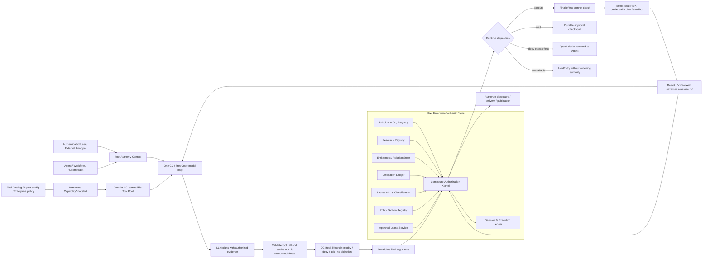

# Hive 统一企业权限架构：让权限成为 Agent 的运行边界，而不是 Agent 的大脑

> 日期：2026-07-20
> 状态：FROZEN-01 至 FROZEN-03 保持；原 FROZEN-04 已被后续 Owner/offboarding 决议取代
> 当前 Owner 规范：`docs/agent-owner-and-user-offboarding-contract-2026-07-20.md`
> 解释优先级：本文任何仍写作 `Creator = Owner` 或 Sponsor 作为运行时 Owner fallback 的历史文字，均以当前 Owner 规范为准
> Hive 源码基线：`f901b7f29f570a7cfc6398f5394fc79208e471b4`
> Bisheng 源码基线：`e87e2655eea412a8422f0a425e6712d3fa63504f`
> StaffDeck 源码基线：`f7fa7d7c216ca72ac66f346fe0e1ef161f0053a8`
> 说明：用户口述中的 “StackDeck” 在本地对应仓库 `/Users/rocky243/vc-saas/StaffDeck`，本文统一称 StaffDeck。

---

## 0. 直接结论

### 0.0 Owner 基础架构决议（2026-07-20，第四项已更新）

前三项继续作为上位合同；第四项按本日后续决议更新为可变当前 Owner。后续实现、重构、A2A、Workflow、Company Knowledge 或控制台建设都不能绕开它们。

#### FROZEN-01：单 Agent 智能与完整 Runtime 先成立，企业治理只能包裹，不能改写

Hive 继续以 CC / FreeCode 的完整单 Agent 生命周期为语义底盘，吸收 Codex 的 typed state、approval、sandbox、observability 和 recovery 工程优势，并保留 Hive-native Memory / Skill / self-evolution。统一权限是运行在这套底盘外侧的 `Authority Frame`，不是第二套 Agent Runtime。

必须保持同一套：

- Session 生命周期、上下文组装与 transcript/compaction/resume；
- 单一 model loop 与 `tool_use -> tool_result -> 下一轮模型` 反馈；
- `ToolUseContext` / execution principal / hook lifecycle；
- cancellation、checkpoint、replay、recovery 和 terminal delivery 合同。

权限只允许在两类最窄边界施加硬约束：未经授权的数据进入模型之前，以及真实外部 effect/披露发生之前。任何治理改造如果让普通单 Agent 在相同授权证据、模型和任务下比 CC / FreeCode 更弱、更容易断链，均属于北极星回归，不能以“企业安全增强”为理由接受。

#### FROZEN-02：工具“三档”只能是控制面分类，Runtime 永远只有一个平铺 Tool Pool

无论后续把工具称为核心能力、角色/扩展能力、高风险 effect 能力，还是采用其他 taxonomy，分类都只能存在于 Tool Catalog、Agent 配置和企业策略控制面。它们必须在 Session/turn 安全边界编译为一个版本化 `CapabilitySnapshot`，再投影成 CC 兼容的同一个平铺 Tool Pool。

明确禁止：

- 为不同工具档位建立不同 model loop、Tool Runtime、Resolver 或 recovery path；
- 让模型为了调用工具而理解平台内部权限档位；
- 让工具档位改变 Hook 顺序、Tool schema 或 `tool_result` 回流语义；
- 在无 snapshot/version 边界时于 turn 中途漂移工具定义；
- 因一个资源域的权限初始化失败而删除或摧毁无关工具能力。

工具分类只决定“哪些能力被投影以及调用时附带什么 obligation”；最终模型仍面对一个能力集合，所有调用仍进入同一个 canonical execution pipeline。

#### FROZEN-03：Enterprise Hook 是受保护的强制规则面，只能收窄或要求义务，不能创造权限

CC Hook 保持生命周期扩展语义；Enterprise Managed Hook 是其中由平台/企业治理面保护、普通用户和外部调用方不能随意授予、覆盖、关闭或绕过的一类 Hook。Hook 不是 IAM、relation store、credential issuer 或业务 entitlement 来源。

Enterprise Managed Hook 的权威输出只能是：

```text
deny | require_approval | narrow | pass
```

其中 `pass` 只表示本 Hook 无异议，不表示授予资源访问权。代码或协议中的 Hook `allow` 也必须被解释为“在既有 Authority 内解决 Hook/Session 交互”，绝不能覆盖 tenant/RLS、source ACL、企业 entitlement、delegation ceiling、mandatory approval、credential scope 或 sandbox hard boundary。

安全关键 Enterprise Hook 不可用时，可以 fail-closed 地 hold 当前精确 effect，并返回 typed unavailable/recovery state；不能终止无关推理、删除无关工具或让整个 Agent Session 失去继续工作的能力。普通观察型、UI 型、日志型 Hook 不应因为自身失败冒充企业硬权限。

#### UPDATED-04：Creator 是不可变来源，Owner 是可变当前责任主体

本文当前讨论的 Agent 仍是个人 Agent，但创建来源和当前责任归属已经拆分：`creator_id` 是不可变创建 provenance，`sponsor_user_id` 是不可变委派来源，`owner_user_id` 是当前 Owner。仅 legacy 空 Owner 行允许回退到 `creator_id`。

必须同时区分：

- Owner 关系回答“这个 Agent 归属于谁、代表谁形成画像和承担责任”；
- `use/manage/delete/publish/delegate` 是独立 action，不能从 Owner 身份机械推导出全部权限；
- 当前 requester/operator 可能不是 Owner，运行时不能用静态 Owner 顶替动态 requester；
- 同 Owner Agent 的判断以 `owner_user_id ?? creator_id` 为准，并进入同一个 Owner Authority Domain；
- Public 目前只表示可见性/可调用范围，不产生新的 Agent ownership 类型。

管理员可以通过唯一 handover service 变更 Owner，但不能改写 Creator/Sponsor。删除 User 时，系统先把其所有 Agent 原子转移给同租户管理员，再撤权并停用账号；Personal Knowledge 与历史证据不随 Agent 转移。

#### 固定后的递进关系

统一权限从此按四层递进，但四层都不构成新的 Runtime。前三层决定有效 Authority，第四层只决定在已获准范围内如何与用户互动：

```text
EffectiveAuthority
  = L0 Platform hard ceiling
  ∩ L1 Enterprise entitlement / policy
  ∩ L2 Agent + Task capability / delegation frame

RuntimeDisposition
  = EffectiveAuthority
  + L3 Session autonomy preference（只能 ask/auto/plan/deny，不能扩大 Authority）
```

Hook 不是第五层；它是在 CC 生命周期节点消费上述事实、提出 deny/approval/narrow/pass 的规则执行面。Sandbox 也不是授权来源；它是 effect 已获准后的执行隔离器。

建设顺序固定为：先证明单 Agent worked、智能、可恢复；再在个人 Agent Creator/Owner 语义上把 Authority 编译到它外侧；最后让 A2A、确定性 Workflow、Company Knowledge 和企业控制台复用同一合同。

### 0.1 Hive 现在不是“权限太少”，而是把不同问题都叫成了权限

当前 Hive 已经存在很多有效的安全机制：tenant/RLS、`AgentPermission`、`ResourcePermission`、Personal Knowledge `KnowledgeGrant`、A2A collaboration group、Workspace manifest authority、CapabilityPolicy、session permission mode、approval/checkpoint、sandbox、source ACL、Action Preflight。

问题不在于这些机制都应该被删除，而在于它们把下面九类完全不同的事实混在了一起：

1. **身份（Identity）**：当前是谁、代表谁、属于哪个公司；
2. **能力（Capability）**：某个 Agent/runtime 技术上会不会做这件事；
3. **可用性（Availability）**：工具、connector、provider 当前是否在线；
4. **资源授权（Entitlement）**：这个主体能否对这个资源执行这个动作；
5. **委托（Delegation）**：A 是否把自己的哪一部分权力临时交给了 B，B 是否可继续交给 C；
6. **审批（Approval）**：本次具体副作用是否还缺一个人类或职责主体确认；
7. **自主偏好（Autonomy Preference）**：用户希望 Agent 多问、少问，还是在已有权限内自动做；
8. **执行隔离（Containment）**：sandbox、network、credential、filesystem 如何限制真实副作用；
9. **证据与恢复（Evidence & Recovery）**：这次裁决、执行、撤权、重试是否可追溯和恢复。

当这九类事实都被命名为 “permission” 时，系统就会自然出现三类错误：

- 把 session 的 `bypassPermissions` 误解成企业级授权扩大；
- 把一个 Workspace 文件权限错误扩散成 `web_search`、Todo、Memory 等无关能力全部不可用；
- 把 Agent 是否能联系另一个 Agent，误当成它是否能读取对方 Workspace、Personal KB、credential 或把结果交付给第三方。

因此这次要做的不是“再加一张 ACL 表”，而是建立一套统一语言、一个统一裁决内核和一套分布式执行边界。

### 0.2 北极星指标

统一权限系统的目标函数应明确为：

```text
在未经授权的数据进入模型和未经授权的副作用发生次数为 0 的前提下，
最大化 Agent 合法自主完成任务的能力。
```

权限的正确角色是：

> **权限不是 Agent 的大脑，也不是模型可用工具的静态黑名单。权限是在真实数据披露和真实副作用边界上，对一个精确动作签发或拒绝可证明的执行租约。**

平台有权决定：

- 哪些数据可以进入模型；
- 哪个真实资源可以被读取、修改、交付或公开；
- 哪个外部 effect 可以执行；
- 是否需要审批、sandbox、credential broker、预算或审计；
- 如何暂停、撤销、恢复和证明。

平台无权替代模型决定：

- 用户意图是什么；
- 应该如何分解问题；
- 哪个已授权证据更重要；
- 如何综合、判断和表达；
- 一个被拒绝的动作之后，Agent 应选择哪个业务替代方案。

### 0.3 “统一”的精确定义

统一不是：

- 所有安全事实塞入一张万能 ACL 表；
- 所有工具在进入模型前按关键词机械裁剪；
- 所有权限判断集中到一个物理进程；
- 取消 RLS、source ACL、sandbox 或 connector 自己的硬边界。

统一是：

```text
一个 Authority Plane
  = 一套 Principal / Resource / Action / Delegation 语义
  + 一个最终 Policy Decision Point
  + 一个版本化决策合同
  + 多个靠近真实数据和 effect 的 Policy Enforcement Point
  + 一条统一的 decision / execution evidence chain
```

即：**一个控制面，分布式执行；多个事实 owner，一个最终裁决合同。**

### 0.4 与既有文档的关系

本文不推翻既有正确结论，而是对权限部分做更深一层修正：

- 保留 `docs/ccplus-session-permission-and-enterprise-hard-rules-2026-06-25.md` 中“session mode 不等于企业授权”的边界；
- 保留 `docs/agent-permission-governance-spec-2026-07-07.md` 中 Accountable/Actor/Resource/Context Principal 的方向；
- 保留 `docs/bisheng-borrow-analysis-2026-07-19.md` 中“一个裁决内核”和 Bisheng ReBAC 借鉴结论；
- 细化并部分修正 `docs/enterprise-a2a-workflow-authority-company-knowledge-solution-2026-07-19.md` 第 6 章：特别是不能再把授权、审批和运行可用性压成一个四值状态；
- 以 `docs/agent-owner-and-user-offboarding-contract-2026-07-20.md` 的 Creator/Sponsor provenance 与可变当前 Owner 合同为产品事实；
- A2A 确定性 Workflow 本身由另一个 session 继续讨论，本文只定义其必须遵守的统一权限与委托边界。

---

## 1. 先把九个概念彻底分开

| 概念 | 它回答的问题 | 权威事实源 | 它不能回答的问题 |
| --- | --- | --- | --- |
| Authentication / Identity | “当前是谁？” | IdP、authenticated session、server runtime | 不能说明可访问什么资源 |
| Capability | “Agent/runtime 技术上会不会？” | tool/plugin/connector/runtime registry | 不能说明当前调用有权执行 |
| Availability | “现在能不能连得上？” | provider/connector health | 不能把 outage 伪装成无权限 |
| Entitlement | “这个主体对这个资源能做什么？” | canonical relation/entitlement facts + RLS/source ACL | 不能代替本次风险审批 |
| Delegation | “谁把什么权力临时交给谁？” | delegation lease/edge ledger | 不能凭 Agent 联系关系自动扩大资源权力 |
| Approval | “本次精确 effect 是否已获得确认？” | authenticated approval lease | 不能把原本 denied 的资源变成 allowed |
| Autonomy Preference | “已有权限内需要多频繁询问？” | session/user/company preference | 不能扩大 entitlement、source ACL 或 credential scope |
| Containment | “真实执行被关在哪个笼子里？” | sandbox/network/path/credential policy | 不能决定业务语义或资源 ownership |
| Evidence / Recovery | “发生了什么，如何撤销或恢复？” | decision ledger、RuntimeTask、span、outbox、receipt | 不能作为事后补授权 |

从现在开始，产品和代码里不应再笼统使用 “permission” 表达上述全部概念。

建议正式命名：

- `Authority`：身份、资源关系、委托和最终裁决的总控制面；
- `Entitlement`：长期或有期限的资源动作授权；
- `DelegationLease`：运行时可衰减委托；
- `ApprovalLease`：对精确 effect 的短期批准；
- `AutonomyPreference`：Ask first / Auto within authority；
- `ExecutionContainmentProfile`：sandbox/network/path/credential 边界；
- `CapabilitySnapshot`：当次运行实际可用能力；
- `DecisionReceipt` / `ExecutionReceipt`：裁决和执行证据。

---

## 2. Hive 当前权限体系盘点

### 2.1 当前存在的事实面

| 当前机制 | 当前解决的问题 | 当前主要断点 | 目标归宿 |
| --- | --- | --- | --- |
| tenant + PostgreSQL RLS | 公司级硬隔离 | 部分应用逻辑仍依赖手工 tenant pin/bypass | 保留为不可绕过的最外层硬边界 |
| `check_agent_access()` | 用户能否 use/manage Agent | org admin 同 tenant 直接 manage；混用 `AgentPermission` 与 `ResourcePermission`；generic evaluator 异常被吞成 deny | 变成 Agent resource PEP，仅消费统一 Kernel |
| `AgentPermission` | company/department/user 的 use/manage | 动作只有 `use/manage`；API 删除全部再重建；读取只表达一种 scope | 回填为 canonical Agent relation，停止独立裁决 |
| `ResourcePermission` | 通用 principal-resource-actions grant | allow-only；conditions 弱；无版本、期限、撤销、delegable、purpose、provenance | 被 canonical relation/entitlement store 吸收或演进 |
| `KnowledgeGrant` | Personal KB owner/grant | 若扩到 Company 会形成第二套 ACL | 保留 Personal 事实，但最终读取仍走统一 Kernel |
| A2A collaboration policy | Agent 能否 contact/delegate 另一个 Agent | 只回答协作关系，不回答资源、数据和结果披露 | 作为 `a2a.contact/delegate` 的关系输入 |
| Workspace authority + manifest | Workspace 文件存在、owner、session 可读性 | Pair Session 主体建模错误；在所有工具前急切加载 | 变成精确 `workspace.resource.*` effect PEP |
| CapabilityPolicy / tool config | 能力是否对租户/Agent开放、是否需审批 | 容易与资源授权、session mode 混在一起 | 保留 Capability/Policy 事实，统一进入 Kernel obligations |
| session permission mode | Ask/Auto/`bypassPermissions` | 名称 “Full access/完全访问” 暗示扩大企业权限 | 重命名为 `AutonomyPreference`，只控制询问频率 |
| Action Preflight | 对代表性、可逆性、可见性等风险作 DO/ASK/PREPARE 判断 | 当前类名和 decision ledger 容易让人误以为它是资源授权 | 定位为 Risk/Interaction Policy，不是 Entitlement |
| approval/checkpoint | 暂停并等待人类确认 | 若不绑定 args hash/resource revision/policy version 会成为宽泛许可 | 演进成精确 `ApprovalLease` |
| sandbox/network/credential | 约束执行环境和秘密 | 若和 tool eligibility 混用，会提前剥夺模型能力 | 单独的 containment/credential obligation |
| frontend role/access checks | 隐藏或展示产品面 | UI 不能成为 authority；当前命名进一步混淆 | 只消费 server decision/explain projection |

### 2.2 当前源码已经证明的结构性问题

#### A. 一个 Profile 同时承载五类不同事实

`PermissionProfileV1` 同时放入：

- session mode；
- approval policy；
- readable/writable roots；
- network/sandbox；
- allowed tools；
- session grants；
- denied actions；
- capability snapshot；
- default decision。

这不是单纯命名问题。它会让任何消费者都可以误把 session 偏好、containment、capability 或 temporary grant 当成统一授权结果。

目标必须拆成：

```text
AutonomyPreference
AuthorityContext
DelegationLeaseSet
ApprovalLeaseSet
ExecutionContainmentProfile
CapabilitySnapshot
```

#### B. Agent 访问存在两套顺序和过宽管理员语义

`check_agent_access()` 先检查 platform admin、org admin、owner、`AgentPermission`，再尝试通用 `ResourcePermission`。因此：

- `AgentPermission` 与 `ResourcePermission` 都可以成为最终 allow；
- org admin 的 manage 同时隐含了治理权和业务内容访问权；
- generic permission evaluator 的异常被转换为普通 deny，无法区分无权与 authority 不可用；
- `use/manage` 无法表达 chat、delegate、inspect status、read transcript、manage settings、transfer ownership 等不同动作。

#### C. 通用 ResourcePermission 还不是企业权限合同

当前表只包含 principal、resource、actions、conditions、tenant、created_at；当前 evaluator 只返回 boolean。

缺失至少包括：

- allow/deny effect；
- relation 与 inheritance；
- issuer、provenance、purpose；
- valid_from/expires/revoked；
- delegable/redelegable；
- resource revision / source ACL version；
- policy/entitlement version；
- decision id 与可解释路径。

`conditions` 注释声明支持 `ip_ranges`，当前 evaluator 实际只处理 environment 和 time_range；未知条件不会自动 fail closed。这进一步证明任意 JSON 不能继续作为企业权限语义的主要承载方式。

#### D. Workspace authority 被放在了错误的边界

`ToolRuntimeResolver.resolve()` 在构建每一个工具执行上下文时都先加载 Workspace authority，而不是只在真正的 Workspace read/write/list/deliver effect 前加载。

于是一次 Workspace Session/Agent mismatch 可以同时摧毁：

- `web_search`；
- Todo/Work Ledger；
- Memory；
- 其他完全不读取 Workspace 的工具。

这不是“权限太严”，而是 PEP 位置错误。正确原则是：**在最靠近真实数据披露或真实副作用的位置判权，只拒绝精确 effect。**

#### E. Pair Session 被错误地当成执行主体

Agent pair session 会先排序两个 Agent ID，再把较小者固定写入 `session.agent_id`。Session 是持续对话容器，不应该被用作“当前执行 Agent”的身份事实。

Session 可以回答：

- 这两个 Agent 在哪个持续会话里协作；
- transcript 和 context continuity 属于哪里。

Session 不能回答：

- 当前 tool effect 是 B 还是 C 在执行；
- 当前代表哪个 requester；
- 当前拥有哪份 delegation lease；
- 当前读取哪个 owner 的资源。

#### F. A2A collaboration allow 不是资源授权

当前 A2A policy 可以因为 same owner、company-visible Agent 或 active collaboration group 允许 A 联系 B。这个判断只应代表：

```text
A may contact/delegate B
```

它绝不自动代表：

```text
B may read A's entire workspace
B may read requester's Personal KB
B may use A's credential
B may disclose data from B Owner's scope to A
B may redelegate everything to C
```

#### G. `bypassPermissions` 是自主偏好，不是 Full Access

现有后端设计文档已经说明它只跳过 session 内常规询问，企业规则仍然生效；但前端仍显示 “Full access/完全访问”。

目标产品文案应改为：

```text
Ask first
Auto-execute within authority
```

如需保留第三种兼容模式，也只能表述为：

```text
Do not ask for routine session choices; fail closed when approval is mandatory
```

任何 session mode 都不能扩大 entitlement、delegation、source ACL、credential 或 external-effect policy。

#### H. effective owner 公式已统一

Agent access、生命周期、审批、A2A requester fallback、Workflow headless principal、Local Agent、AI Asset 与 Personal Knowledge 均统一为：

```text
AgentOwner(agent) = agent.owner_user_id ?? agent.creator_id
```

`creator_id` 与 `sponsor_user_id` 只保留不可变 provenance，不再作为当前 Owner 的竞争事实源。Agent Owner 也不能被错误用作每次运行的 requester：任何 Session、RuntimeTask、A2A edge 和恢复路径仍必须保留真实 authenticated requester；只有确实没有动态 requester 的 headless runtime 才使用当前 Owner。

#### I. Tool pipeline 把 availability、authorization、approval 和 containment 串成了多套裁决

一次工具调用可能依次经历 Tool/AgentTool/TenantToolConfig availability、security zone、GuardPolicy、MCP assignment、CapabilityPolicy、delegation token、session profile、dangerous-operation policy、hooks、Action Preflight、sandbox 和 resource authority。

其中部分条件在 Cloud 与 Local Agent 路径的执行方式并不一致；缺少 CapabilityPolicy 时，产品层 enabled 还可能被当成隐式 allow；Governance 与 Action Preflight 又可能分别要求一次审批。这些机制不能继续各自返回最终答案，必须先分类为 fact/obligation，再由一个 composite Kernel 得出一次最终 disposition。

当前 `hook_governance.aggregate_verdicts()` 还允许 managed-layer `allow` 在 Hook lane 内压过 `ask` 并返回 `allow_grant`。这已经被 `FROZEN-03` 明确判定为待收敛断点：managed Hook 可以表达 policy `pass`，但长期 entitlement、mandatory approval 豁免和 hard-boundary grant 必须来自 canonical Authority facts，不能由一次 Hook verdict 创造。

### 2.3 当前 A2A 事故为什么是统一权限问题

线上 A→B/C canary 暴露的不是一个孤立 Workspace bug，而是整条 authority chain 没有统一：

1. Pair Session 的 `session.agent_id` 被误用成执行 Agent；
2. Workspace gate 在所有工具前统一加载；
3. B/C 因 Session identity mismatch 被判越权；
4. 与 Workspace 无关的 web/Todo/Memory 也一起失败；
5. B→C 重新构造 principal 时可能丢失 root requester、root task 和原始 delegation chain；
6. 长结果写文件但没有 manifest/result object 事务，交付时没有可重新判权的 typed resource ref；
7. UI 只消费 RuntimeTask，但同步 A2A 没有 durable edge task，最终“真实发生了调用”与“控制面显示为 0”同时存在。

因此正确修复不是给 Workspace 检查再加一个 same-owner bypass，而是让每个 effect 都携带统一、不可伪造、可衰减的 AuthorityContext。

---

## 3. 四个开源参考的真实价值

### 3.1 总对比

| 项目 | 已提供的权限能力 | 最值得借 | 不能替 Hive 解决什么 |
| --- | --- | --- | --- |
| Bisheng | 多租户、OpenFGA ReBAC、资源层级、操作模板、检索可见性过滤 | relation graph；知识层级继承；检索前过滤+返回后复核；outbox/retry 思想 | 没有 Agent/A2A delegation principal；仍是 OpenFGA+JSON+creator/member+旧 RBAC 多事实源 |
| StaffDeck | tenant、admin/member、Agent owner/gallery、用户 Session、知识可见性 | 简单产品语义；owner/gallery/admin 分离；端点测试 | 没有统一 resource/effect model、delegation、obligation、decision receipt 或 A→B→C authority |
| LangChain/LangGraph | Agent Server AuthN/AuthZ handlers、thread/assistant/store 过滤、runtime context、HITL、A2A continuity/tracing | 可信 server identity；统一 handler PEP；Store namespace rewrite；durable interrupt/resume | 不提供企业 IAM、Company Knowledge ACL、A2A scope attenuation、approval authority 或单一 PDP |
| Semantic Kernel / Microsoft Agent Framework | Kernel/Agent、function middleware、手动函数调用、orchestration/workflow、HITL、OpenTelemetry | 中央执行入口；调用前后拦截；manual invocation；checkpoint；信息流标签思路 | 不提供 Hive 所需的主体/资源/关系/委托/披露统一 IAM；Filter/Middleware 不是 policy truth |

### 3.2 Bisheng：借关系与知识检索纵深，不借混合 authority

值得吸收：

1. OpenFGA 中 `owner → manager → editor → viewer` 的关系继承；
2. `knowledge_space → folder → file` 的资源层级和最近显式 binding；
3. 检索前把可见文件集合下推索引，返回后逐文件复核；
4. 权限 projection 写入失败的 durable retry/dead-letter 思路；
5. relation 和产品 action vocabulary 分开建模。

明确不能复制：

- OpenFGA tuple、Config JSON、creator、成员、公开状态、旧 RoleAccess 都可能决定最终权限；
- OpenFGA 不可用时使用旁路 JSON/creator fallback 扩大访问；
- Workflow 以配置作者身份读取知识但没有正式 delegation lease；
- Tool 只在装配时检查 `use_tool`，真实 `_run/_arun` effect 前不复核；
- 交互返回失败后，后台 retry 仍可能让授权稍后生效；
- Linsight 客户端选择的知识库 ID 被当成授权白名单。

对 Hive 的直接启示是：关系图可以用 OpenFGA 计算，但 OpenFGA 不能成为另一个与 Hive PostgreSQL、legacy ACL、JSON sidecar 竞争的最终事实源。

### 3.3 StaffDeck：适合借产品简洁度，不适合借权限底座

StaffDeck 的核心语义较简单：

- token 里绑定 tenant/user；
- admin/member；
- Agent owner、overall/gallery；
- Session 主要按 tenant + current user 过滤；
- knowledge endpoint 再做 viewer/manager/admin 检查。

它的价值是提醒我们：普通用户看到的产品概念必须简洁，不能把底层十几种 policy source 直接暴露给用户。

但它没有回答：

- Agent 作为 actor，且 Creator/Owner 与当前 requester 分离；
- requester 与 accountable principal；
- A2A delegation chain；
- resource revision、source ACL、result disclosure；
- approval、containment、obligation；
- 一个统一 PDP 与 decision receipt。

所以 StaffDeck 可以帮助设计“谁能看到/使用/管理数字员工”的产品入口，不能成为 Hive enterprise authority kernel 的架构模板。

### 3.4 LangChain/LangGraph：借 PEP 与暂停恢复，不借统一 IAM 幻觉

官方文档当前提供的关键机制包括：

- `@auth.authenticate` 在每个 Agent Server 请求上建立可信身份；
- `@auth.on` 为 thread、assistant、cron、store 等内置资源执行 allow/deny/metadata filter；
- Store 默认 namespace 是共享的，需由 auth handler 基于可信用户身份验证或重写 namespace；
- 更具体的 auth handler 会替代而不是叠加更通用 handler，因此必须设计默认拒绝和完整覆盖；
- Deep Agents filesystem permission 只覆盖内置文件工具，不覆盖 custom/MCP tool，也不覆盖 sandbox arbitrary command；
- subagent 自定义 permission 会完整替换 parent rules，不天然保证委托只能缩小；
- HITL middleware 能 durable pause，并在 approve/edit/reject/respond 后恢复；
- A2A `contextId → thread_id` 解决持续会话和 tracing，不等于 requester/delegation authority。

Hive 应借：

- authenticated identity 由 server runtime 注入，不能相信模型或客户端自报；
- 数据 namespace 在进入底层 Store 时机械重写；
- 每个 effect 有统一 middleware/PEP；
- approval 通过 durable interrupt 恢复，而不是阻塞内存协程；
- secret 不进入模型上下文或通用 sandbox。

Hive 不应误以为安装 LangChain/LangGraph 就拥有：

- 企业组织和数字员工 ownership；
- Company Knowledge 的层级 ACL/source ACL；
- A→B→C 的 delegation attenuation；
- approval 的 approver authority、职责分离、args hash、TTL、撤销和 policy version；
- 全系统唯一 PDP。

### 3.5 Semantic Kernel / Microsoft Agent Framework：借中央调用拦截，不把 Filter 当权限模型

截至 2026-07-20，微软官方已把 Microsoft Agent Framework 定义为 Semantic Kernel 与 AutoGen 的直接继任者；它继承 SK 的 session、type safety、filter、telemetry，并加入显式 graph workflow、checkpoint 和 HITL。因此这里不能只看旧 Kernel API，也要检查新 Agent Framework 的 Middleware、Tool Approval 与 FIDES。但结论不变：两者都不是统一企业 IAM。

Semantic Kernel 的 Kernel 是 service/plugin/function 的中央 DI 和 invocation 入口；Function Invocation Filter、Prompt Render Filter 和 Auto Function Invocation Filter 可以观察、阻断或改变调用过程。手动函数调用模式还能让 caller 在模型选中函数后决定是否真正执行，再把结果送回模型继续推理。

这给 Hive 的启示是：

- 模型选择 tool 与平台允许真实执行必须是两个步骤；
- 每个 function/effect 都应经过一个共享 authorization adapter；
- execution/result/exception 应进入统一 OpenTelemetry/receipt；
- filter 适合作为 PEP，不适合作为 policy truth store。

官方文档同时说明，使用依赖注入注册多个 Filter 时顺序不保证。这进一步说明 Hive 不应把授权拆成一串互相不知道对方的零散 filters；应该在每个调用边界只接一个 composite Authority adapter，由它调用统一 Kernel 并返回一个完整 decision envelope。

Microsoft Agent Framework 新增的实验性 FIDES 信息流安全更接近 Hive 要解决的“数据流与 sink”问题：它把 integrity/confidentiality label 随输入与工具结果传播，并在敏感 sink 前执行检查。值得借的是 provenance、classification 和 sink-time enforcement。

但 Hive 不能照搬成全局 taint：一个低可信输入不能污染整段运行并让无关工具全部失效；也不能为了安全自动隐藏完整授权证据、用机械摘要替代模型。Hive 应把 label 绑定到具体 resource/artifact/field，并在具体 data ingress、effect 和 disclosure sink 上判定。

---

## 4. 统一架构的十条不可变原则

本章所有原则都受 `FROZEN-01` 约束：它们只能在 CC / FreeCode 单 Agent Runtime 的数据 ingress 和精确 effect 边界实施，不能通过新增一套 tool loop、提前剥夺合法能力或改变模型语义主权来实现。

### 原则 1：未授权数据不进入模型，已授权证据完整交给模型

权限首先控制 data ingress，而不是事后扫描模型语义。

- Personal KB、Company Knowledge、Workspace、connector content 在读取字节前判权；
- 授权后，模型获得完整、可发现、可引用的证据；
- 不用关键词、regex、静态前 N 条或平台摘要替代模型判断；
- source ACL 不可用时返回 typed unavailable，不能返回“搜索无结果”。

### 原则 2：模型可发现能力，不等于每次调用都自动获准

Tool/Agent/Workflow 的 capability description 可以对模型可见，帮助模型正确规划。真正读取受保护数据或提交外部副作用时，再对精确资源、参数和 effect 判权。

只有当“能力本身的存在”也属于敏感信息时，`discover` 才需要单独授权。

### 原则 3：在最晚但仍安全的边界阻断

四个阶段必须分开：

1. **Discover / Plan**：允许模型理解有哪些合法能力；
2. **Prepare / Simulate / Draft**：尽量允许在私有、可逆环境中准备；
3. **Protected Data Ingress**：受保护字节进入模型前判权；
4. **Commit / Disclose / External Effect**：真实写入、发送、发布、交付前再次判权。

不能为了防止第 4 阶段的风险，就在第 1 阶段把模型的整个能力面删除。

### 原则 4：一个 denied effect 只能拒绝自己

文件读取被拒绝，不应让 web search 失效；邮件发送缺审批，不应阻止模型继续写草稿；B 无权读 C 的 Personal KB，不应取消 B 对普通公开资料的研究能力。

### 原则 5：授权事实必须来自 server state

模型、客户端、tool args 都不能自报：

- tenant；
- accountable requester；
- Agent owner；
- delegation chain；
- resource sensitivity；
- approval satisfied；
- source ACL；
- output recipient authority。

它们只能传入业务意图和 typed resource ref；Authority adapter 从 authenticated session、resource registry、RuntimeTask/A2A edge 和 durable lease 组装事实。

### 原则 6：委托只能继承并缩小，不能静默 union

任何 B→C 调用都必须证明 C 的有效范围是父范围的子集。不能因为 C 在其他 requester、Owner Domain 或 delegation 关系下可以访问更多资源，就默认把这些权限并入当前任务并把结果返回。

### 原则 7：审批是义务，不是 entitlement 结果

`approval_required` 不应与 `denied`、`unavailable` 放在同一个平面里。先判断主体是否本来有资格执行，再判断是否还有审批、sandbox、credential 或审计义务。

审批不能覆盖 RLS、source ACL、explicit legal deny 或 resource ownership；break-glass 必须是独立、可审计的 operator authority。

### 原则 8：内容读取权和管理权分离

org admin 可以：

- 管理组织、策略、Agent 生命周期；
- 查看权限结构、运行状态和审计元数据；
- 发起 break-glass 请求。

org admin 不应天然：

- 读取所有 Session transcript；
- 读取所有 Workspace 文档；
- 查询所有 Personal KB；
- 查看 credential/secret；
- 以用户身份执行日常业务。

### 原则 9：结果交付本身也是数据披露 effect

Agent 能读取或生成一份内容，不等于它有权把内容交给 requester、另一个 Agent、Company Knowledge 或外部渠道。

所有 artifact/result 必须携带：

- provenance/source refs；
- classification/sensitivity；
- owner/custodian；
- source ACL/policy version；
- permitted recipient/purpose；
- revision/hash。

`deliver/disclose/export/publish` 必须单独判权。

### 原则 10：Authority outage 不得偷偷变宽

如果关键事实不可用：

- 返回 `indeterminate/unavailable/stale_authority`；
- hold 当前 effect；
- 保留任务、证据和恢复入口；
- 允许无关推理和无关工具继续。

禁止临时使用 creator、client allowlist、旧 cache 或 JSON sidecar 推导更宽的 allow。

---

## 5. 目标架构：一个 Authority Plane，多个精确 PEP



上图中的 Authority Plane 只编译和裁决边界事实，不拥有模型循环。`CapabilitySnapshot` 只投影工具能力；无论工具来自哪一档，模型只看到一个平铺列表，并沿同一个 Hook、executor、receipt 和 recovery 合同执行。

### 5.1 Authority Plane 的组件职责

#### Principal & Org Registry

统一表示：

- tenant/company；
- user/external principal/service account；
- Agent；
- department/group/team/workcell；
- workflow/system job；
- Agent Creator/Owner、requester/accountable、resource custodian 和 operator 关系。

当前 `Department` 与 `OrgDepartment`、User 与 `OrgMember` 的重叠必须被收敛为 canonical org identity + provider projections，不能让同一个部门在不同 resolver 中代表不同权限事实。

#### Resource Registry

每个被治理资源都有 typed identity：

```text
tenant_id
resource_type / resource_id
owner_principal
custodian_principal?
parent_ref?
revision / content_hash?
lifecycle
classification / sensitivity
source_ref / source_acl_version?
```

没有 resource registry/manifest 的文件路径不能直接成为跨 Agent 授权对象。

#### Entitlement / Relation Store

表达长期或有期限的：

```text
subject --relation/action--> object
```

例如：

```text
user:U --owner--> agent:A
department:D --viewer--> knowledge_space:K
agent:B --reader--> workspace_resource:R
workcell:W --operator--> workflow:F
```

#### Delegation Ledger

记录运行时：

- 谁委托谁；
- 代表哪个 requester/accountable principal；
- action/resource/purpose/recipient 上限；
- TTL、depth、budget；
- 是否可再委托；
- revocation epoch；
- root session/task/collaboration/edge。

#### Source ACL & Classification

外部 Feishu/Drive/SharePoint/connector 权限是不可由 Hive 普通 grant 放大的 hard constraint。它在内容进入模型前和内容交付前都必须可验证。

#### Policy / Action Registry

保存 versioned machine contract，而不是任意 JSON 语义：

```text
resource_type
action/effect
delegable
external_visibility
risk_class
required_approver_relation
containment requirements
audit level
cacheability
```

#### Authorization Kernel

唯一最终 PDP。它不读取自然语言来决定业务语义，只组合可机械验证的 authority facts，并产出完整 decision envelope。

#### Approval Lease Service

审批绑定精确 action/effect、参数 hash、resource revision、policy version、recipient 和 TTL。修改收件人、附件、金额、发布对象或 resource revision 后必须重新审批。

#### Credential Broker

credential 不进入模型、不进入通用 Workspace、不沿 A2A 自动传递。只有在 effect 已获准后，由 broker 为指定 connector/action/resource 注入最小凭据或代执行。

#### Decision & Execution Ledger

每次裁决和实际 effect 用 `decision_id`、`execution_receipt_id`、`resource_ref`、`RuntimeTask/A2A edge` 串联，支持 explain、replay、撤权、审计和 UI 消费。

### 5.2 PEP 必须分布在真实边界

统一 Kernel 不等于只有一个拦截点。至少需要：

| PEP | 何时执行 | 保护什么 |
| --- | --- | --- |
| API admission | HTTP/Channel/External request 进入时 | authenticated principal、tenant、入口 action |
| Agent discovery | 列出/选择 Agent 时 | Agent 存在性、profile、contact/delegate |
| Context ingress | 内容进入 prompt/model 前 | Workspace/KB/connector bytes、source ACL |
| Tool effect | 每个真实 read/write/send/delete/publish 前 | 精确资源与副作用 |
| A2A edge creation | A→B、B→C edge 创建时 | contact/delegate/redelegate、scope attenuation |
| Workflow leaf | 每个确定性 leaf 执行前 | 当前 run principal、resource revision、policy version |
| Credential broker | 凭据注入或代执行前 | connector/action/scope/TTL |
| Artifact delivery | result 发给 A/B/user/channel 前 | recipient、purpose、classification、source ACL |
| Company publish | 知识发布/retire/restore 前 | reviewer/publisher separation、publication policy |
| UI query/filter | 列表与详情读取时 | 与 server check/list 同一 evaluator；UI 本身不发权 |

单次 Tool effect 的标准顺序固定为：

```text
schema validation
-> CC PreToolUse lifecycle
-> modified args revalidation
-> Enterprise Authority preflight
-> Session autonomy / ordinary interaction decision
-> mandatory approval（如有，不能被 session mode 跳过）
-> final exact-effect commit check
-> sandbox / credential broker / tool.call
-> PostToolUse or PostToolUseFailure + typed receipt
-> tool_result 回到同一个 model loop
```

早期 preflight 用于减少无意义等待；真正发权的是紧邻 effect 的 final commit check。任何 Hook 参数改写、审批等待、resource revision/policy version 变化，都必须在 commit 前重新校验，避免 TOCTOU。拒绝、等待或 unavailable 只产生一个可恢复的 typed tool result，不得改写整个 Runtime。

---

## 6. 统一 Principal、Resource、Action 和 Ownership 模型

### 6.1 Principal 不能只写一个 `user_id`

一次真实执行至少存在以下角色：

| 角色 | 含义 |
| --- | --- |
| Requester | 发起当前任务的人或外部主体 |
| Accountable Principal | 对本次任务和结果负责的主体 |
| Actor | 当前真正执行动作的 Agent/workflow/service |
| Agent Owner | `owner_user_id ?? creator_id` 解析出的当前归属、责任和 Owner Profile 锚点 |
| Delegator | 把某一范围交给 Actor 的主体 |
| Beneficiary | 最终希望获得结果的人/Agent/系统 |
| Recipient | 当前 artifact/effect 的具体接收者 |
| Operator | 进行恢复、break-glass、审计操作的人 |

这些角色可能是同一个人，也可能完全不同。统一请求必须显式区分，不能继续用一个 `owner_user_id`、`creator_id` 或 `session.user_id` 代替全部含义。`owner_user_id` 只权威回答当前 Agent Owner；Creator/Sponsor 只回答来源；requester、delegator 和 recipient 必须来自本次已认证运行事实。

### 6.2 Agent Owner 可治理变更，但 Owner 不等于动作授权包

本文当前只讨论个人 Agent，产品事实固定为：

```text
AgentOwner(agent) = agent.owner_user_id ?? agent.creator_id
same_owner(A, B) = AgentOwner(A) == AgentOwner(B)
```

这个 Owner 关系只回答 Agent 的归属、责任和 Owner Profile / Personal Taste 主体。下面这些仍是独立 relation/action，不能从 Owner 身份机械推导：

- 谁可以 `use/contact/delegate/manage` 该 Agent；
- 谁可以 `delete/publish/change_visibility`；
- 谁可以读取、修改或交付某个 Workspace/Knowledge 资源；
- 当前任务由谁 requester、谁负责、交给谁。

资源自身还应分别表达 resource owner、custodian 和当前 operator/requester。它们不能反向改写 Agent Owner，也不能让静态 Owner/Creator 在运行时顶替动态 requester。

当前归属于同一 User 的个人 Agent 进入同一个 Owner Authority Domain；Owner 转移后，该 Agent 从新的运行边界消费权限，但不会带走原 Owner 的 Personal Knowledge、credential 或历史 grant。该 Domain 不自动合并 Agent 私有控制状态、secret、source ACL 或高风险 effect policy。

### 6.3 Action 必须从 Tool 名称下沉到原子 effect

`tool.invoke` 太粗。一个工具可能同时包含：

- 读取附件；
- 查询联系人；
- 生成草稿；
- 使用 credential；
- 发送邮件；
- 把结果写回 Workspace；
- 把结果交付给另一个 Agent。

统一 Kernel 应对解析后的 atomic effects 判权：

```text
resource.discover
resource.search
resource.read
resource.use_or_derive
resource.create/update/delete
resource.disclose/deliver
resource.export/publish
credential.use
effect.email.send
effect.payment.submit
effect.workflow.start
effect.agent.delegate
```

`search`、`read`、`use/derive`、`disclose/deliver`、`export/publish` 必须分开。能检索一份受限文档，不代表能在答案中披露；能在内部推理中使用，不代表能导出原文；能生成 artifact，不代表能发布到 Company Knowledge。

---

## 7. 统一请求与正交决策合同

### 7.1 `BoundaryAuthorizationRequest`

```text
BoundaryAuthorizationRequest
  request_id
  tenant_id                    # server-derived

  requester_principal         # authenticated initiator
  accountable_principal       # who owns the task/outcome
  actor_principal             # current Agent/workflow/service
  agent_owner_principal       # server-derived from actor Agent.owner_user_id ?? creator_id

  root_context
    root_session_id
    root_runtime_task_id
    collaboration_id?
    workflow_run_id?
    origin_channel

  delegation_context
    parent_delegation_id?
    current_edge_id?
    chain[]
    purpose
    depth
    budget
    expires_at
    revocation_epoch

  resource_ref
    tenant_id
    type / id
    owner / custodian
    parent?
    revision / hash?
    classification?
    source_ref / source_acl_version?

  atomic_action
  effect_args_hash?
  intended_recipients[]
  execution_context
    tool/function/workflow leaf
    sandbox/network request
    requested credential scope?
```

模型只负责提出业务 action 和已暴露 resource ref；其余 authority 字段均由 server 组装并校验。

### 7.2 不再使用一个扁平四值状态

上一版 `allowed | denied | approval_required | unavailable` 把不同维度压平了。正确返回应至少包含以下正交轴：

```text
AuthorityEvaluation
  entitlement
    status: permit | deny | indeterminate
    relation_path[]

  hard_policy
    status: pass | deny | indeterminate
    reason_codes[]

  delegation
    status: valid | invalid | absent_not_required | indeterminate
    effective_scope

  disclosure
    status: permit | redact_exact_fields | deny | not_applicable | indeterminate
    permitted_recipients[]

  approval
    status: not_required | required | satisfied | expired | invalid
    requirement?

  capability
    status: capable | not_capable | unavailable
    snapshot_version?

  containment
    status: satisfied | obligations_required | unavailable
    sandbox/network/credential obligations[]

  readiness
    status: ready | unavailable | stale_authority
    retry/recovery metadata

  derived_disposition
    execute | wait_for_approval | deny_exact_effect | not_executable | hold_unavailable

  decision_id
  policy_version
  entitlement_version
  source_acl_version?
  expires_at
  evidence_refs[]
```

这几个例子可以说明为什么必须正交：

| 场景 | Entitlement | Approval | Capability/Readiness | Derived disposition |
| --- | --- | --- | --- | --- |
| 有权发送，但金额需要财务批准 | permit | required | capable/ready | wait_for_approval |
| 无权读取某客户文档 | deny | not_required | capable/ready | deny_exact_effect |
| 有权读取，但 source ACL provider 宕机 | indeterminate | not_required | capable/unavailable | hold_unavailable |
| 有权生成内部摘要，但不能给外部收件人 | permit | satisfied | capable/ready | deny_exact_effect（仅 delivery） |
| 有权写 Workspace，但 sandbox provider 离线 | permit | not_required | capable/unavailable | hold_unavailable |
| 有权调用，但当前 connector 未安装 | permit | not_required | not_capable/ready | not_executable，不改写 entitlement |

审批完成不会把 `entitlement=deny` 变成 permit；provider 恢复也不会把 deny 变成 permit；session `auto` 只影响何时弹窗，不改变任何轴。

### 7.3 所有消费者只调用同一组能力

```text
check(request) -> AuthorityEvaluation
check_many(requests[]) -> AuthorityEvaluation[]
list_accessible(principal, resource_type, action, context) -> refs + decision refs
explain(decision_id | request) -> bounded authority path
simulate(request) -> non-mutating evaluation
mutate_entitlement(command) -> committed | accepted_pending + operation receipt
```

硬要求：

- `check` 和 `list_accessible` 使用同一 evaluator、同一版本；
- API、Tool、A2A、Workflow、Knowledge、UI 不得各自写 allow/deny fallback；
- legacy API 可以保留，但只能适配到新 Kernel；
- 权限写操作若异步，只能返回 `accepted_pending` 和 durable operation id，不能返回失败后偷偷后台生效；
- cache key 必须包含 tenant、principal/delegation、resource revision、action、policy/entitlement/source ACL version。

---

## 8. A2A 权限：同 Owner 默认协作，跨 Owner 显式授权

当前合同只有个人 Agent。Agent 不凭自身名称、角色描述或静态 Owner 自动获得一套可与 requester 权限合并的运行身份；每次 A2A 都必须绑定已认证 requester、当前 Owner、Creator/Sponsor provenance、root task 和 durable delegation edge。

### 8.1 同 Owner：进入同一个 Owner Authority Domain

```text
same_owner(A, B)
  := AgentOwner(A) == AgentOwner(B)

owner_domain_active(root_task, owner)
  := root_requester == owner
     OR root_task carries an explicit owner-issued authorization

same_owner_effective_scope
  = active_owner_domain_scope
  ∩ root_task_scope
  ∩ parent_effective_scope
  ∩ current_edge_delegated_scope
  ∩ target_agent_capability
  ∩ resource/source hard constraints
```

当 Owner 自己发起任务，或 Owner 已显式授权该 root task 使用其 Owner Domain 时，同 Owner Agent 默认可以彼此发现、contact、delegate、redelegate，并通过 governed resource refs/tools 使用该 Owner 范围内的普通 Workspace、Personal KB 和 Owner Profile 能力。它们不需要再为每个普通文档建立一条 Agent-to-Agent ACL。

但“同 Owner”不是把所有运行状态合并成一份：Agent 私有控制文件、raw Memory evidence、Soul、credential、secret、PL4、source ACL 和高风险 effect policy 仍保持各自边界。非 Owner 仅仅调用一个 Public Agent，也不能据此激活或继承该 Agent 的 Owner Domain。

B→C 时，即使三者同 Owner，task scope 仍只能继续缩小：

- actions；
- resource selectors；
- purpose；
- recipients；
- TTL；
- depth；
- budget；
- sensitivity ceiling；
- redelegable flag。

### 8.2 跨 Owner：可联系不等于可继承对方 Owner Domain

```text
cross_owner(A, B)
  := A.creator_id != B.creator_id
```

跨 Owner 时必须分两步：

1. `a2a.contact/delegate` 由 Public 可调用关系或显式 collaboration relation 决定；
2. data ingress、resource use、effect 和 result delivery 由 purpose-bound `DelegationLease` 加明确的 resource/action grant 决定。

Public 只解决“能否被发现和调用”，不授予调用方读取 B Owner 的 Workspace、Personal KB、Owner Profile 或 credential。B 也不能因为接受了任务，就自动读取 A Owner 的资源。若某个跨 Owner 任务确实需要资源，必须把具体 resource selector、action、purpose、recipient、TTL 与 redelegation ceiling 写入授权事实；交付结果时再次检查 recipient 是否有权接收。

### 8.3 禁止 Owner Domain 的隐式 union

以下逻辑必须禁止：

```text
requester 能访问 X
OR A Owner Domain 能访问 Y
OR B Owner Domain 能访问 Z
=> 整个 A→B→C collaboration 可以访问 X∪Y∪Z，并全部交回 requester
```

这会把每个 Agent 变成 confused deputy，并让多 Agent 协作自动扩权。合法范围只能来自当前 root task 与逐边授权的交集；其他 Owner Domain 中存在的权限不进入当前任务。

### 8.4 A→B→C 的权限序列

```text
1. 用户 U 发起 root task，由 server 建 RootAuthorityContext，并从 `owner_user_id ?? creator_id` 解析每个 Agent Owner。
2. A 计划调用 B；Kernel 先判断 same-owner 还是 cross-owner，再判 a2a.contact + a2a.delegate。
3. 创建 A→B durable edge 和 DelegationLease_AB；edge 记录双方 Owner、root requester 和有效 scope。
4. same-owner edge 只在 Owner Domain 已由 root task 激活时使用 owner-scope；cross-owner edge 只使用显式 resource/action grant。
5. B 决定调用 C；重复同一判断，并证明 DelegationLease_BC ⊆ AB effective scope。
6. C 产出 Artifact_C，先授权 deliver C→B。
7. B 合并自身结果和 C 结果，生成 Artifact_BC，保留 provenance/classification。
8. Kernel 授权 deliver B→A。
9. A 最终交付用户/外部渠道时再次授权 disclose/deliver/export。
10. 任意中间 deny 只阻断该资源或 effect，B/C 可以在剩余合法范围继续推理。
```

### 8.5 Session、RuntimeTask、Delegation 的职责不能再互相替代

| 对象 | 负责什么 | 不负责什么 |
| --- | --- | --- |
| Pair Session | A↔B 持续对话、transcript、context continuity | 不决定当前 actor 或资源权限 |
| RuntimeTask/A2A Edge | 本次执行状态、取消、恢复、budget、terminal receipt | 不天然授予数据访问 |
| DelegationLease | 当前 actor 可代表谁做哪些动作 | 不存储对话内容 |
| ResourceRef/Manifest | 被访问/交付资源的身份、owner、revision、hash | 不代表 recipient 一定可读 |
| DecisionReceipt | 某次精确授权事实 | 不替代 execution result |

---

## 9. Same-owner、Workspace、Personal KB 与 Credential 的建议规则

### 9.1 `same_owner` 只有一个产品定义

```text
same_owner(A, B) := AgentOwner(A) == AgentOwner(B)
```

部门、群组、workcell、collaboration purpose 都可以产生额外 relation，但不能改写 `same_owner`。同 tenant、同部门或都被标记为 Public 也不等于同 Owner。

同 Owner 的默认共享只在 Owner 本人发起或显式授权的 Owner Domain 内生效。这样既落实“同 Owner Agent 本来就在为同一 Owner 工作”，也避免非 Owner 调用 Public Agent 时反向继承当前或历史 Owner 的个人数据。

本文把“同 Owner 权限全公开”精确定义为：同 Owner Agent 之间的发现、调用、委托以及 Owner 范围普通信息能力默认开放，不再重复配置 per-Agent ACL；它不表示绕过 source ACL、secret/credential 隔离、高风险 effect policy，或把 Agent 私有控制文件直接并盘。

### 9.2 建议默认矩阵

| 资源/动作 | 同一 current Owner 且 Owner Domain 已激活 | 说明 |
| --- | --- | --- |
| 发现对方 Agent | allow | 同 tenant、active、非内部系统专用 Agent |
| contact/delegate | allow within policy | 仍受 depth/budget/purpose 限制 |
| 普通 manifest 工作文档 search/read/use | allow within task scope | typed ref、非 PL4、source ACL 允许；不再逐 Agent 建重复 ACL |
| 列出对方 raw filesystem | deny | 只能通过 manifest/resource discovery |
| 直接修改对方 Workspace | deny by default | 用 artifact delivery；直接 update 需显式 grant+revision |
| Owner Profile / Personal Taste | allow through governed owner-profile capability | 画像主体就是共同 Owner；禁止读取无关 raw control 文件 |
| 对方 raw T0/T2/T3/Soul/control | deny by default | 属于 Agent identity/learning/control plane，不因同 Owner 合并 |
| Personal KB | allow through governed KB tools | Personal KB 是 Owner-scoped、tool-only 资源；不做静态上下文注入 |
| Company Knowledge | 按 company relation/source ACL | 不因 Agent owner 自动变化 |
| Secret/Credential/PL4 | never inherit | 只能 effect-time credential broker |
| 高风险 external effect | policy/approval dependent | same owner 不跳过 effect policy |
| Artifact 返回 requester | reauthorize disclosure | 不能只检查生成者能否读取 |

### 9.3 Workspace 必须按资源类别分层

不能把 Agent Workspace 当成一个整体：

1. **Ordinary Working Resources**：报告、表格、代码、普通交付物；可经 manifest 和 delegation 共享；
2. **Owner-scoped Knowledge/Profile**：Personal KB、Owner Profile、Personal Taste；同 Owner Agent 通过专用 governed tools 使用，不通过 raw path 或原始上下文预加载；
3. **Agent Private Learning/Control**：raw Memory evidence、Soul、T0/T2/T3、control sidecars、private session state；默认不可跨 Agent；
4. **Secrets/Credentials**：永不通过 Workspace ACL 或 A2A artifact 自动共享；
5. **Recovery/Raw Paths**：只供受控恢复，不是普通模型可读取资源。

### 9.4 Personal KB 是 Owner-scoped、tool-only 的独立资源

Personal KB 的 owner 是 user/principal，不是某个 Agent 的普通文件夹。对个人 Agent，canonical owner 是 `owner_user_id ?? creator_id` 解析出的当前 Owner：

- 当前归属于同一 Owner 的 A、B、C 在 Owner Domain 已激活时，都可通过 `search/read personal KB` 能力使用 Owner 的 Personal KB，不应再复制三份 per-Agent grant；
- Personal KB 仍坚持 tool-only disclosure，不预取、不静态注入原始 context，且每次返回都保留 resource ref、citation、decision receipt；
- 跨 Owner Agent 不继承该 Personal KB；需要 Owner 对精确资源、purpose、recipient 和 TTL 的显式授权；
- 任何结果交给另一个 user、Company Knowledge 或外部渠道都需重新判定 `disclose/deliver/publish`。

---

## 10. 企业知识库必须直接消费统一 Authority Plane

### 10.1 资源层级

借 Bisheng 的层级产品语义，但由 Hive 统一建模：

```text
company
└── knowledge_space
    └── folder / collection
        └── document / object
            └── version / chunk / citation
```

关系可以从 space/folder 继承到 document，但每个实际返回给模型的 document/chunk 必须能够重新绑定到 canonical document resource、revision、source ACL 和 decision receipt。

### 10.2 检索权限必须两段执行

1. **检索前下推**：根据 `list_accessible(..., action=search/read)` 生成可检索 resource filter，减少越权候选；
2. **返回后复核**：对每个 canonical document/chunk 当前 revision 再执行 `read/use`，防止索引延迟、撤权或 projection drift；
3. **进入模型前绑定 evidence**：citation 带 resource ref、revision、source refs、decision id；
4. **回答/交付前披露检查**：若 recipient/purpose 不允许披露，返回 typed restriction 或只交付政策允许的变换结果。

单个文档权限失败只丢弃/hold 该文档，不应让整个 Agent 的其他知识工具或推理能力失效。

### 10.3 Personal → Company 不是 implicit sync

正确路径仍是：

```text
Personal source / Personal KB
  -> proposal with source refs and owner authority
  -> sensitivity / ACL / conflict / ontology checks
  -> reviewer approval
  -> publisher commit
  -> Company resource registry + canonical content
  -> rebuildable indexes
```

proposal、review、approve、publish、retire、restore 是不同 action；org admin 不应因为拥有后台管理权就自动拥有所有内容的 reviewer/publisher/content-reader 身份。

---

## 11. Org Admin、Agent Owner、Resource Role 与 Break-glass

### 11.1 推荐：管理面和内容面分离

| 关系 | 默认能力 | 默认不拥有 |
| --- | --- | --- |
| org admin | 组织、策略、Agent 生命周期、权限结构、审计元数据 | 全部 Session/Workspace/KB 内容读取 |
| Agent Owner（Creator） | Agent 归属、责任与 Owner Profile 锚点；作为该 Agent use/manage relation 的 canonical principal | 自动 delete/publish/change visibility、跨 Owner 数据、credential、绕过 hard policy |
| resource owner | 对普通资源 grant/revoke、生命周期管理 | 越过 legal hold/source ACL/Company hard policy |
| content reviewer | 审核 proposal 的真实性、适用性和敏感性 | 发布 commit 权（若要求职责分离） |
| publisher | 执行 Company publication | 自动成为全部源内容 owner |
| operator | 恢复运行、查看必要技术证据 | 常态业务内容访问 |

### 11.2 Break-glass 必须是一条独立 authority lane

不能用 `org_admin == manage everything` 替代。Break-glass 至少要求：

- 精确对象和目的；
- reason；
- TTL；
- 最小 actions；
- 二次批准或事后复核策略；
- 不可篡改 audit；
- 用户/资源 owner 通知策略；
- 自动到期和撤销；
- credential/PL4 仍需更严格独立流程。

Break-glass 是紧急可审计授权，不是 session “Full access”。

---

## 12. 目标数据合同与现有碎片归宿

### 12.1 建议的权威对象

```text
authority_resources
  tenant_id, resource_type, resource_id
  owner_type, owner_id, custodian_type, custodian_id
  parent_ref, lifecycle, classification, revision, source_ref

authority_relations
  subject_type, subject_id
  relation/action, object_type, object_id
  effect, condition_ref, delegable
  valid_from, expires_at, revoked_at
  issuer, provenance, entitlement_version

delegation_leases
  root_requester, accountable_principal, actor, parent_lease
  actions, resource_selectors, purpose, recipients
  ttl, depth, budget, sensitivity_ceiling
  redelegable, revocation_epoch, lifecycle

approval_leases
  action/effect, resource_ref/revision, args_hash, recipients
  requester, approver, approver_relation
  policy_version, issued_at, expires_at, revoked_at

authorization_decision_receipts
  request_hash, evaluation axes, reason codes
  fact/version refs, policy version, expiry

execution_receipts
  decision_id, actual effect, status
  artifact/result refs, provider receipt, recovery state

authority_mutation_outbox / projection_checkpoints
  operation_id, desired mutation, provider projection
  committed/pending/dead, retry, checkpoint, drift hash
```

### 12.2 现有机制的归宿

| 当前机制 | 目标处理 |
| --- | --- |
| `AgentPermission` | backfill 到 Agent canonical relations；旧 API 适配新 Kernel；停止独立读取发权 |
| `ResourcePermission` | 演进或吸收到 canonical relations；补 effect/version/lifecycle/delegation/provenance |
| Personal `KnowledgeGrant` | 保留 Personal grant fact；最终 check/list/read 统一由 Kernel 决定 |
| A2A collaboration groups | 只提供 contact/delegate relation 和 capability ceiling；不授予 Workspace/KB/credential |
| Workspace authority | 变成 manifest/resource adapter，在真实 file effect 前调用 Kernel |
| CapabilityPolicy/TenantToolConfig | 变成 capability/policy input；不等于 resource entitlement |
| session `PermissionProfileV1` | 拆成 autonomy、containment、approval、capability、authority refs |
| managed/company/user Hook governance | 保留 CC lifecycle seam 和 trust lanes；Enterprise Managed Hook 只允许 deny/require_approval/narrow/pass；删除 `allow_grant` 发权语义 |
| Action Preflight | 归到 risk/interaction policy；只产生 obligation/disposition，不冒充资源 ACL |
| approvals | 变成 exact effect `ApprovalLease`；不写永久 relation |
| source ACL | external hard constraint；只能缩小，不能被普通 Hive grant 放大 |
| OpenFGA | 语义稳定后可作为 relation evaluator/projection；不能与 legacy DB/JSON 随机择一 |

### 12.3 PostgreSQL 与 OpenFGA 的建议边界

在产品语义稳定之前，不应先把“统一权限”误解成“接入 OpenFGA”。建议：

```text
Hive PostgreSQL/RLS
  = durable mutation、resource registry、delegation、approval、receipt 的 authority

OpenFGA（可选）
  = versioned relation evaluation projection / accelerator
```

如使用 OpenFGA：

- tuple 由 committed mutation outbox 生成；
- 有 checkpoint/hash/reconcile/rebuild；
- projection outage 不触发宽松 fallback；
- 本地权威能够完整计算才允许 degraded local evaluation；否则返回 unavailable；
- 所有 check/list/explain 必须具有同一 entitlement version。

---

## 13. Enterprise Permission Center 应如何呈现

普通用户不应看到十套底层表；控制面应按真实问题组织：

### 13.1 数字员工访问

- Agent 的 Creator/Owner 是谁；
- 谁能分别发现、聊天、委派、管理、删除或改变其 Public 可见性；
- 当前运行由谁 requester、是否激活 Owner Domain；
- 当前有哪些跨 Owner collaboration/resource grants，何时到期、能否继续委托。

### 13.2 数据访问

- Agent/用户能访问哪些 Workspace、Personal KB、Company Space、connector source；
- 权限来自 direct、department、role、workcell、delegation 还是 source ACL；
- `search/read/use/disclose/export` 分别是什么结果。

### 13.3 动作与副作用

- 哪些 action 可直接执行；
- 哪些需要哪类 approver；
- 哪些要求 sandbox/credential broker；
- 哪些属于硬拒绝。

### 13.4 A2A Preview

输入 A、B、C 和任务目的，显示：

- A、B、C 是否同 Creator/Owner；
- A 是否可 delegate B；
- B 是否可 redelegate C；
- 同 Owner 的 Owner Domain 或跨 Owner 显式 scope 如何逐边缩小；
- 哪些结果可以 C→B→A→user 交付；
- Public callability 为什么不会自动带入 Agent Owner 的 Workspace、Personal KB 或 Owner Profile。

### 13.5 Explain / Simulator / Audit

- `Why allowed/denied/waiting/unavailable`；
- 当前 relation path 与 hard constraints；
- policy/entitlement/source ACL version；
- mutation/outbox/projection health；
- decision→execution→artifact→delivery 全链证据；
- break-glass 和撤权状态。

### 13.6 Session 模式的产品修正

“Full access/完全访问”应退出用户界面，因为它在安全语义上是错误名称。

建议：

- `Ask first`：在 policy 允许用户选择时，更多地请求确认；
- `Auto within authority`：在现有 entitlement、delegation、approval 和 hard policy 内自动执行；
- mandatory approval、denied、unavailable 始终不因模式而跳过。

为保持 CC / FreeCode 移植性，底层 wire value 可以继续兼容 `default`、`acceptEdits`、`plan`、`dontAsk`、`auto`、`bypassPermissions`；产品语义必须明确它们只是 `AutonomyPreference`。其中 `bypassPermissions` 只表示跳过 Session 内普通交互提示，不能绕过 Enterprise Managed Hook 或任何外层 Authority hard boundary。

---

## 14. 单轮完整收敛步骤

以下是一个 change 内的依赖顺序，不是 MVP 分期，也不是允许长期双轨：

### 14.1 先冻结继续碎片化

1. 把 `FROZEN-01/02/03/04` 写入实现 change 的 acceptance contract，禁止权限改造重写单 Agent loop、建立多套 Tool Runtime、让 Hook 发权或重新发明 Agent Owner；
2. 禁止新增独立 ACL 表、endpoint-local role shortcut、tool-specific allow cache；
3. 建立 Permission Surface Manifest，登记所有事实源、resolver、PEP、consumer、UI 文案、fallback 和审计面；
4. 把每个现有判断分类为 Identity、Capability、Availability、Entitlement、Delegation、Approval、Autonomy、Containment 或 Evidence。

### 14.2 把 Creator provenance 与当前 Owner 语义编译进统一合同

1. Agent 创建时永久保留 `creator_id` 与 `sponsor_user_id` provenance，并把 `owner_user_id` 写为初始当前 Owner；
2. 当前 Owner resolver 统一为 `owner_user_id ?? creator_id`；Sponsor 不得参与运行时 Owner fallback；
3. `use/manage/delete/publish/change_visibility/delegate` 各自成为独立 action，不再由一个模糊 owner check 代替；
4. `same_owner` 只按当前 Owner 判定，并通过同一 Kernel 激活 Owner Authority Domain；
5. 本次 schema、API 与 migration 只收敛现有个人 Agent，不扩展 Agent ownership 类型。

仍需拍板、但不妨碍上述 Owner 合同成立的语义只有：org admin 是否天然读内容、Public 调用与特殊 Owner 解除生命周期、explicit deny 与 break-glass、高风险 effect 默认，以及跨 Owner A2A 的批准方式。

### 14.3 建统一 machine contract

1. Principal/Resource/Action/Relation registries；
2. `BoundaryAuthorizationRequest`；
3. 正交 `AuthorityEvaluation`；
4. `DelegationLease`、`ApprovalLease`；
5. decision/execution receipt；
6. check/list/explain/simulate/mutate API；
7. reason code 与 policy version registry。

### 14.4 建 canonical facts 并回填

1. 收敛 Department/OrgDepartment、User/OrgMember canonical identity；
2. 为 Agent、Workspace manifest、Workflow、Personal/Company Knowledge、source、artifact 建 resource registry；个人 Agent resource owner 从 canonical current Owner resolver 产生；
3. 把 `AgentPermission`、`ResourcePermission`、KnowledgeGrant、org relation、A2A collaboration facts 映射到统一模型，并保持 handover 与所有运行消费者使用同一 Owner resolver；
4. 保留 source ACL 和 RLS 为不可放大 hard facts；
5. migration/backfill 可重入、可 dry-run、带 checkpoint/rollback mapping。

### 14.5 Shadow 只比较，不双重发权

对每个旧裁决记录：

- old decision/source；
- new evaluation axes；
- mismatch category；
- resource/action/principal；
- 是否为历史 bug、语义待定或实现缺口。

Shadow 期间 live effect 仍只有一个最终 authority；不能旧 allow OR 新 allow。

### 14.6 一次切换全部 PEP

切换范围必须同时覆盖：

- Agent API/list/detail/manage；
- Tool data ingress/effect；
- Workspace；
- Personal/Company Knowledge retrieval；
- A2A edge/delegation/result delivery；
- Workflow leaf；
- Connector/source ACL；
- Credential broker；
- UI list/filter/explain；
- approval/recovery/audit。

旧 API 只允许适配新 Kernel；旧 evaluator、fallback 和误导 UI 文案必须删除。

### 14.7 生产验收后才算统一

必须以真实账号覆盖：

- 同一 model/provider/task fixture 下，统一权限改造前后普通单 Agent 的上下文、平铺工具协议、model/tool feedback、compaction/resume 和 terminal delivery 非劣；
- 工具分类变化只改变版本化 `CapabilitySnapshot` 的投影，不产生第二套 loop/executor/hook/recovery 路径；
- `bypassPermissions` 和任意 Hook `allow` 均不能越过 Enterprise deny、mandatory approval、source ACL、credential 或 sandbox hard boundary；
- PreToolUse 修改参数后重新做 schema、Authority 和 final effect commit 校验；
- Agent 创建、Authority explain、A2A same-owner 均以同一 `creator_id` 得出 Owner，Owner 身份本身不自动产生 delete/publish 权；
- 同 Owner A→B→C 读取普通 manifest 文档，并通过 governed tools 使用同一 Owner 的 Personal KB / Owner Profile；
- B→C scope attenuation；
- 非 Owner 调用 Public Agent 时不能继承该 Agent 的 Owner Domain；
- 跨 Owner contact/delegate 与 resource grant 分离，未显式授权时不能读取对方 Owner Domain；
- Company Knowledge prefilter/postcheck；
- source ACL 撤销；
- mid-run entitlement/delegation/approval 撤销；
- OpenFGA/provider/cache outage；
- org admin 无内容读取 + break-glass；
- 一个 Workspace deny 不影响 web/Todo/Memory；
- UI explain 与真实 decision receipt 一致；
- restart/replay/retry 不重复 effect、不复活过期授权。

---

## 15. 七原子闭环与指标

### 15.1 七原子

| 原子 | 统一权限闭环合同 |
| --- | --- |
| Input | authenticated requester、server-derived principal、typed resource/action/effect/recipient |
| Authority | canonical org/resource/relation/delegation/source/approval facts；RLS 与 source ACL 不可放大 |
| Execution | 所有数据 ingress 和真实 effect 经同一 Kernel 合同；PEP 靠近边界 |
| Evidence | decision id、版本、relation path、receipt、span、artifact/source refs |
| Recovery | wait/retry/revoke/expiry/reconcile/rebuild；outage 不放宽，deny 不扩散 |
| Consumption | Agent、A2A、Workflow、Workspace、Knowledge、Connector、UI 使用同一结果 |
| Acceptance | old-vs-new mismatch 清零；真 PG/生产 canary；撤权、outage、A→B→C、disclosure 全覆盖 |

### 15.2 北极星指标与护栏

| 指标 | 目标 |
| --- | --- |
| 普通单 Agent 相对 CC / FreeCode 兼容路径的能力或恢复回归 | 0 |
| 因工具分类新增的 model/tool runtime 分支 | 0；保持一个 canonical loop/pipeline |
| Enterprise Hook 直接创造 entitlement 或越过 hard boundary | 0 |
| 未授权数据进入模型 | 0 |
| 未授权外部 effect | 0 |
| 受保护 effect 的 PEP 覆盖率 | 100% |
| A2A scope 单调缩小违规 | 0 |
| 一个 deny 导致无关能力丢失 | 0 |
| decision/execution/delivery receipt 覆盖率 | 100% |
| check/list/explain 版本不一致 | 0 |
| cutover 前 old-vs-new 未解释 mismatch | 0 |
| authority outage 触发宽松 fallback | 0 |
| 合法任务自主完成率 | 持续提升 |
| 非必要审批打断率 / false deny | 持续下降 |

安全指标不能单独优化。一个“什么都不让做”的系统可以得到 0 次越权，但会完全失败于 Hive 的产品目标。必须同时观察自主完成率、非必要审批、false deny 和 collateral capability loss。

---

## 16. 已拍板的 Owner 口径与仍需讨论的问题

### 16.1 本轮不再讨论的基础口径

1. 当前系统语境只定义个人 Agent；
2. Creator/Sponsor 是不可变来源；canonical current Owner 是 `owner_user_id ?? creator_id`；
3. Owner 是归属、责任、Owner Profile / Personal Taste 锚点，不是 `use/manage/delete/publish/delegate` 的万能授权包；Owner 当前没有 delete 权也不影响其 Owner 身份；
4. 同 Owner 只表示同一 current Owner，并在 Owner 已授权的 root task 内形成 Owner Authority Domain；
5. Public 目前只表示可见/可调用，不能推导调用方获得 Owner Domain；
6. 本轮只在现有个人 Agent 范围内定义统一权限。

下面的问题仍会影响 Authority Plane 的产品默认值，但都必须在上述口径内回答。

### Q1. org admin 是否天然拥有内容读取权？

**建议：不拥有。** org admin 管理组织、策略、Agent 生命周期和权限结构；读取 Session、Workspace、Personal KB、业务文档必须有业务 relation 或 break-glass。

需要 Owner 确认：是否接受“manage control plane ≠ read business content”？

### Q2. Public 调用与特殊 Owner 解除生命周期如何处理？

**当前建议：** Public 只开放 discovery/contact/callability；非 Owner requester 默认只能使用公开能力和本次显式提供的资源，不能激活 Creator 的 Workspace、Personal KB 或 Owner Profile。

后台解除 Owner 关系、Owner 缺失或历史 handover 的生命周期另立产品合同。在该合同拍板前，保留 immutable Creator provenance，不让这些特殊状态重新定义当前个人 Agent 的 Owner 规则，也不把 Public 解释为另一种 Agent 类型。

### Q3. explicit deny 应该由谁设置、覆盖到什么程度？

**建议：** explicit deny 主要用于 source owner、legal/compliance、incident response、resource owner 的明确封锁，并优先于 inherited allow；普通管理关系不应通过 blanket deny 让整个 Agent capability surface 消失。

需要确认 deny 是否允许被 break-glass 覆盖，以及哪些 deny 永不允许覆盖。

### Q4. 高风险动作的默认产品行为是什么？

**建议：** Agent 可自由 plan、research、prepare、draft；只有真实 commit/disclose/external effect 才根据 entitlement + policy 决定自动执行或等待审批。

需要确认是否接受“准备尽量自由，提交精确受控”。

### Q5. 跨 Owner A2A 的批准主体和有效期是什么？

**建议：** 目标 Agent 的 Creator/Owner 批准其可参与的 collaboration relation 和可贡献资源上限；root requester/资源 Owner 批准本次传入资源；Company policy 只设最大边界，org admin 不替代内容 Owner 授权，除非进入 break-glass。

需要确认跨 Owner collaboration relation 是长期关系，还是每次任务都要重新批准；本文建议长期 contact relation + 每次 purpose-bound `DelegationLease` / resource grant。

---

## 17. 已冻结裁决与后续待定语义

### 17.1 Owner 已确认并冻结

1. **单 Agent 优先且 Runtime 不变。** 先保证 CC / FreeCode 对齐后的单 Agent worked、智能、完整、可恢复；统一权限只能作为外部 Authority Frame 约束数据 ingress 和真实 effect，不能改写其 lifecycle、model/tool loop 或 model agency。
2. **工具分类不产生多套 Runtime。** 工具“三档”只存在于控制面并编译为一个 `CapabilitySnapshot`；模型始终消费一个平铺 Tool Pool，所有工具始终进入同一条 canonical execution/recovery path。
3. **Enterprise Hook 强制但不发权。** 普通用户或外部主体不能授予、覆盖或绕过 Enterprise Managed Hook；它只能 deny、require approval、narrow 或 pass，不能创造 entitlement，也不能以一个 effect 的失败摧毁无关能力。
4. **Creator/Sponsor 是 provenance，Owner 是可变当前责任主体。** `owner_user_id ?? creator_id` 是 canonical Owner；Owner 与具体 action 分离；Public 不转移 Owner Domain；User offboarding 必须先转移 Owner 再停用账号。

### 17.2 由四项冻结直接推出、无需再次争论的架构约束

1. Hive 必须建设原生、统一的 Enterprise Authority Plane；LangChain、Semantic Kernel、Bisheng、StaffDeck 都不能直接替代；
2. 统一的是语义、PDP、合同、证据和产品面，不是把 RLS/source ACL/sandbox 粗暴合并成一张 ACL；
3. session permission mode 必须退出企业授权语义，`Full access/完全访问` 命名应废弃；
4. tool capability presentation 与真实 effect authorization 必须分开；
5. Workspace/Knowledge/source 数据在进入模型前判权，真实外部 effect 和 artifact delivery 前再次判权；
6. A2A 的 presence 不能进入普通单 Agent 路径；只有创建真实 A2A edge 时才装配 delegation frame，并且嵌套委托只能缩小；
7. `search/read/use/disclose/export` 必须成为不同动作；结果回流是第一等权限边界；
8. approval、availability、containment 不能再和 entitlement 压成同一个状态；
9. Hook 是 lifecycle policy execution surface，不是第五层 Authority，也不是 Credential/Entitlement issuer；
10. 任一 effect 被拒绝，只阻断该 effect，不能再摧毁 Agent 的无关能力和模型判断空间；
11. Agent Owner 必须从 `owner_user_id ?? creator_id` 解析，Sponsor 不参与当前 Owner fallback；动态 requester 也不能被静态 Owner 替代；
12. 同 Owner Agent 在 Owner 已授权的 task 内共享 Owner Authority Domain；跨 Owner 和 Public caller 只能获得显式 grant，任何结果都在交付边界重新判权。

第 16 章的 org admin 内容读取、Public 调用与特殊 Owner 解除生命周期、explicit deny、break-glass、高风险 effect 和跨 Owner A2A 产品默认值仍待后续讨论；这些选择只能在上述冻结合同内收敛，不能反向修改四项基础架构决议。

一句话收口：

> **Hive 的统一权限系统应当让 Agent 在明确、可证明、可撤销的边界内尽可能自主；权限守住数据和 effect，不接管 Agent 的思考。**

---

## 附录 A：Hive 当前源码证据

- `backend/app/kernel/turn_orchestrator.py:715-738,1244-1263,1371-1394`：当前工具投影、单一 model/tool round 与 provider request 主链。
- `backend/app/tools/execution_pipeline.py:88-105,460-521,547-625`：当前 canonical Tool execution 的 Hook、参数重验、governance/preflight 与 executor 前 authority fence。
- `backend/app/tools/hook_governance.py:1-26,141-167`：当前 Hook trust lanes 与 managed `allow_grant`，是 `FROZEN-03` 需要收敛的已知断点。
- `backend/app/core/permissions.py:20-116`：Agent access 的 admin/owner/AgentPermission/ResourcePermission 多路径。
- `backend/app/models/agent.py:121-123,187-214`：session mode 与 AgentPermission 的粗粒度模型。
- `backend/app/models/security_audit.py:43-56`：当前 ResourcePermission 字段。
- `backend/app/core/policy.py:130-190`：boolean evaluator 与 conditions 实现范围。
- `backend/app/runtime/ccplus_contracts.py:41-80`：PermissionProfileV1 混合 autonomy、approval、roots、sandbox、tools、grants、capability。
- `backend/app/core/execution_context.py:29-143`：ExecutionPrincipal 与 A2AToolAuthorityFrame 当前边界。
- `backend/app/tools/resolver.py:62-129`：每个 Tool context 前急切加载 Workspace authority。
- `backend/app/api/agents.py`：个人 Agent 创建时同时写入 Creator、Sponsor 与初始 Owner；后两者此后分别承担 provenance 与 current responsibility。
- `backend/app/models/agent.py`：creator、sponsor 与可空 legacy owner 字段已经按本文合同分离语义。
- `backend/app/services/agent_pair_session.py:33-85,120-170`：pair ID canonicalization 与 session.agent_id。
- `backend/app/services/a2a_collaboration_policy.py:127-147,150-227`：当前 Public 来自 company-scope `AgentPermission`，same-owner/public/group 只裁决 contact/delegate；Public 不应被解释为 Owner Domain 转移。
- `backend/app/api/advanced.py` 与 `backend/app/services/agent_ownership_service.py`：handover 只改写 `owner_user_id` 并保留 Creator/Sponsor provenance。
- `backend/app/services/action_preflight.py:15-190`：风险与交互 preflight。
- `backend/app/models/user.py:65-84` 与 `backend/app/models/org.py:13-99`：两套 department/member/relationship identity。
- `backend/app/api/agents.py:982-1076`：AgentPermission UI/API 只表达单一 scope，更新时删除后重建。
- `frontend/src/pages/agent-detail/AgentChatSection.tsx:161-180,223-229`：`Full access` 用户文案。

## 附录 B：Bisheng 源码证据

- `src/backend/bisheng/core/openfga/authorization_model.py`：relation hierarchy 与资源模型。
- `src/backend/bisheng/permission/domain/services/fine_grained_permission_service.py`：知识层级和 binding evaluator。
- `src/backend/bisheng/knowledge/domain/services/knowledge_file_visibility_service.py`：检索可见性过滤与 fail-closed document drop。
- `src/backend/bisheng/permission/domain/services/permission_service.py`：OpenFGA check、fallback、failed tuple、subject expansion。
- `src/backend/bisheng/permission/api/endpoints/resource_permission.py`：Config JSON、grant/revoke API、tenant subject picker。
- `src/backend/bisheng/workflow/nodes/agent/agent.py`：以 workflow config author 读取知识的隐式身份切换。
- `src/backend/bisheng/tool/domain/services/executor.py`：tool 装配时 permission 与实际 invocation 的断点。
- `src/backend/bisheng/linsight/domain/services/agent_factory.py`：进程内 subagent tool inheritance。

## 附录 C：StaffDeck 源码证据

- `/Users/rocky243/vc-saas/StaffDeck/backend/app/security/auth.py:35-69`：token 绑定 tenant/user，并对 request tenant 做一致性检查。
- `/Users/rocky243/vc-saas/StaffDeck/backend/app/security/permissions.py:10-82`：admin/member、owner、overall/gallery 的 viewer/manager 入口。
- `/Users/rocky243/vc-saas/StaffDeck/backend/app/api/traces.py:21-41`：Session/trace 以 tenant + current user 过滤。
- `/Users/rocky243/vc-saas/StaffDeck/backend/app/api/memories.py:97-106`：Memory 仍以 admin 或 Agent owner 为主要内容访问条件。
- `/Users/rocky243/vc-saas/StaffDeck/backend/app/api/tools.py:86-110,395-429`：Tool visibility 由 Agent binding 与 open gallery 分支决定。

## 附录 D：LangChain/LangGraph 官方资料

- [Authentication & access control](https://docs.langchain.com/langsmith/auth)
- [Make conversations private](https://docs.langchain.com/langsmith/resource-auth)
- [Isolate Store data per user](https://docs.langchain.com/langsmith/store-auth)
- [Deep Agents filesystem permissions](https://docs.langchain.com/oss/python/deepagents/permissions)
- [Deep Agents subagents](https://docs.langchain.com/oss/python/deepagents/subagents)
- [Human-in-the-loop](https://docs.langchain.com/oss/python/langchain/human-in-the-loop)
- [A2A endpoint in Agent Server](https://docs.langchain.com/langsmith/server-a2a)

## 附录 E：Semantic Kernel 官方资料

- [Understanding the Kernel](https://learn.microsoft.com/en-us/semantic-kernel/concepts/kernel)
- [Semantic Kernel Filters](https://learn.microsoft.com/en-us/semantic-kernel/concepts/enterprise-readiness/filters)
- [Function Invocation](https://learn.microsoft.com/en-us/semantic-kernel/concepts/ai-services/chat-completion/function-calling/function-invocation)
- [Agent Orchestration](https://learn.microsoft.com/en-us/semantic-kernel/frameworks/agent/agent-orchestration/)
- [Observability](https://learn.microsoft.com/en-us/semantic-kernel/concepts/enterprise-readiness/observability/)
- [Semantic Kernel repository](https://github.com/microsoft/semantic-kernel)
- [Microsoft Agent Framework Overview](https://learn.microsoft.com/en-us/agent-framework/overview/)
- [Semantic Kernel to Agent Framework Migration Guide](https://learn.microsoft.com/en-us/agent-framework/migration-guide/from-semantic-kernel/)
- [Agent Middleware](https://learn.microsoft.com/en-us/agent-framework/agents/middleware/)
- [Tool Approval](https://learn.microsoft.com/en-us/agent-framework/agents/tools/tool-approval)
- [Agent Security with FIDES](https://learn.microsoft.com/en-us/agent-framework/agents/security)

## 附录 F：证据边界

- 本文对 Hive、Bisheng、StaffDeck 的结论来自上述本地 checkout 的只读源码审计；未因此修改或运行这些项目。
- LangChain 与 Semantic Kernel 结论来自 2026-07-20 查阅的官方文档；它们都提供可插入的执行/授权机制，但都不提供 Hive 所需的完整企业 Authority Plane。
- 线上 A2A 事实沿用 2026-07-19 已完成的 Railway/生产 PostgreSQL/Volume 只读取证；本轮未重新运行生产 canary，因此本文不宣称 A2A runtime 已修复。

## 附录 G：CC / FreeCode Runtime 与 Hook 源码证据

- `/Users/rocky243/vc-saas/free-code-main/src/services/tools/toolExecution.ts:800-862,916-931,1207-1222`：同一 Tool execution 中先运行 `PreToolUse`，再解析 permission decision，最后进入同一个 `tool.call()`。
- `/Users/rocky243/vc-saas/free-code-main/src/services/tools/toolHooks.ts:321-433`：Hook `allow` 可以解决普通交互，但不能覆盖 settings deny/ask rules；Hook deny/ask 仍回到统一 permission flow。
- `/Users/rocky243/vc-saas/free-code-main/src/entrypoints/sdk/coreTypes.ts:25-53`：CC Hook 是覆盖 Session、Prompt、Tool、Compact、Permission、Subagent、Stop 等节点的 lifecycle surface，不是一套独立 IAM 或第二 Runtime。
