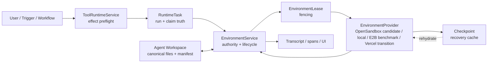
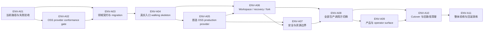

# WIP：Agent Environment Control Plane 完整落地计划

> 建档：2026-08-24
>
> 状态：实施中——`ENV-OD-00` 与 `ENV-OD-02` 已确认；owner 于 2026-08-25 授权完成代码、迁移、测试、文档证据并按可独立验证部分提交；`ENV-OD-01` 仍待确认，因此 interactive capability 不进入本轮代码范围
>
> 当前源码基线：`de66ac4ea8107254e9518d5119388f6e6d9f3526`
>
> 上位架构：`docs/agent-environment-extension-convergence-architecture-2026-08-23.md`
>
> 权威边界：本文是 owner-readable planning/implementation artifact，不是 `.ultra` canonical task ledger；当前授权覆盖本地代码、数据库 migration、自动化测试、文档和本地 commit，不覆盖 push、部署、生产 migration、外部 provider 资源创建/删除或付费动作
>
> 维护规则：实施期间只维护这一份 WIP；稳定决策回写上位架构，完成后删除本文。每次报告必须列出未完成项

> 验收边界：本轮先完成 code-complete 与非浏览器自动化验证；owner 明确把登录态浏览器 E2E 放在代码完成后的下一步，因此 `ENV-AC-08` 的 browser E2E、真实 OSS/Vercel provider live conformance 和生产部署证据不能在本轮伪写为已通过

---

## 0. 已确认结论

### ENV-OD-00：第一项完整 Change

owner 于 2026-08-24 确认：下一项完整 Change 是 **Environment Control Plane**，不是 Extension Convergence。

这项决定解决的不是“把 Vercel Sandbox API 再封一层”，而是建立一条唯一、可恢复、可审计的 Agent 执行环境路径：

> **每个 Agent 默认拥有一个私有逻辑环境；计算资源按需启动，workspace 持久、可恢复，Agent 之间默认隔离。所有真实代码执行都经过同一 EnvironmentService、权限与证据边界。**

这里的“每个 Agent 一个环境”指一对一的**逻辑环境 identity**，不是让每个 Agent 永久占用一台常开 VM。实际 provider session 可停止、丢失和重建；Agent workspace 与 Hive 证据不能依赖某一台 VM 永久存活。

### ENV-OD-02：开源优先的 Provider 路线

owner 于 2026-08-24 确认：Change A 不再以 Persistent Vercel 为终局，而采用以下角色分工：

- OpenSandbox 是首选开源 production provider **候选**，必须先通过 `ENV-A02` live conformance；
- Kubernetes SIG Agent Sandbox 可作为 Kubernetes lifecycle/调度底座，Kata/Firecracker 或 gVisor 属于部署隔离 profile，不进入 Hive 产品领域状态；
- Microsandbox 是 Local Agent / 本地开发候选；
- E2B Infra 是 Firecracker、snapshot/resume、故障恢复与运营成熟度基准，也是较重的备选；
- Vercel 只作为迁移、兼容和回滚 provider，不再承载长期产品语义；
- OpenBot 仅作为 browser computer、viewer、human takeover 与 workbench donor，不作为 Sandbox Control Plane。

这里确认的是 **OSS-first selection policy 与候选角色**，不是宣布 OpenSandbox 已经采用。exact version/digest、Docker/Kubernetes backend、secure runtime 与部署拓扑仍必须由 `ENV-A02` 的真实证据决定；若首选候选未通过 mandatory gate，回到 owner 决策，不自动自研第二套 runtime。

### 本 Change 的可观察完成结果

只有以下结果同时成立，Change 才能关闭：

1. 用户从真实 Chat/Tool 入口发起一次代码任务，系统为目标 Agent 获取私有环境 lease，并在可恢复的 provider session 中执行。
2. 第二次任务及 worker 重启后仍可恢复前一次已提交文件；provider session 丢失时可从 canonical workspace/checkpoint 重建。
3. Agent A 无法读取 Agent B 的文件、进程、环境变量、checkpoint 或任一 provider resource。
4. backend、OpenSandbox、Vercel、Connector 和模型供应商的原始 secret 不进入 sandbox、checkpoint、stdout/stderr、transcript、artifact 或日志。
5. RuntimeTask、Environment、Workspace 与 invocation span 各自只有一个清晰权威，不产生第二套 run truth 或文件 truth。
6. 当前所有生产代码执行调用方都迁移到唯一入口；选定的开源 provider 承接默认生产流量，旧的 per-command Vercel create/tar/stop 路径与所有 direct provider bypass 被删除。
7. 用户能看到真实的 starting/ready/recovering/stopped/failed 状态与可执行恢复动作；operator 能看到 provider receipt 和审计细节。
8. 真 PostgreSQL、真实 local sandbox、通过采用门的开源 production provider、Vercel migration profile、故障注入、跨 provider canonical rehydrate、迁移/回滚与全量回归全部通过。
9. 首选开源栈能由 exact pin/digest 可复现自托管，license、签名/attestation、依赖清单、升级与回滚证据完整；领域模型和公开 API 不包含任一 provider 专属产品语义。

任何 schema、service、provider adapter、UI shell 或单元测试单独存在，都不等于完成。

---

## 1. 落地分成八个模块

| 模块 | 责任 | 明确不拥有 |
|---|---|---|
| **M1 Domain & Authority** | `ExecutionEnvironment`、session、lease、checkpoint 的 identity、状态、租户/Agent 绑定与 fencing | 模型语义判断、工具业务权限、文件内容真相 |
| **M2 Provider & Lifecycle** | provider 能力探测、启动/恢复/停止/销毁、执行、checkpoint/fork 的机械适配 | tenant/Agent 授权、approval、secret 决策 |
| **M3 Workspace & Recovery** | 首次物化、增量回收、manifest 冲突、checkpoint、rehydrate、task fork | 把 provider snapshot 变成 canonical workspace |
| **M4 Runtime Wiring** | RuntimeTask、ToolRuntimeService、code execution 与 Environment lease 的唯一生产接线 | 新建第二套 Workflow、Team 或 task engine |
| **M5 Security & Effect Boundary** | 默认隔离、network policy、secret non-ingress、路径/资源限制、typed denial | 在 sandbox 内复制 ToolRuntimeService 或凭据库 |
| **M6 Product Surface** | Session Workbench/Agent 详情的环境状态、恢复动作、operator 证据投影 | ProjectWorkbench/Living Object 完整实现、自定义 UI runtime |
| **M7 Migration & Cutover** | additive schema、lazy adoption、兼容窗口、全调用方切换、旧路径清理、资源对账 | 永久双写、默认关闭的半成品 feature flag |
| **M8 Acceptance & Operations** | provider conformance、self-host/supply-chain proof、真 PG/RLS、故障注入、跨 provider rehydrate、可观测性、成本与回滚演练 | 用 mock、README 或绿单测替代 live-path proof |

这八个模块不是八个可独立发布的阶段。它们共同构成一个 Change；全部验收前不得把其中任何部分写成已交付能力。

---

## 2. 唯一主路径



主路径约束：

- `RuntimeTask` 继续是运行、claim、lease renewal、cancel、resume 与终态的 cloud truth。
- `EnvironmentService` 是环境生命周期和 attach 的唯一业务入口；provider 不能自行判断 tenant、Agent 或 approval。
- Agent filesystem/Git 与 `WorkspaceResourceManifest` 继续是文件事实源；provider snapshot 只是可丢弃的恢复加速层。
- `ToolRuntimeService` 继续拥有工具 eligibility、effect preflight 与 approval；Environment 不复制它。
- `invocation_spans` 与 transcript 记录执行证据；Environment 表不变成第二套 trace 系统。

---

## 3. 本 Change 的边界

### 3.1 包含

- 一个 Agent 一个默认 `agent_private` 逻辑环境；同一 Agent 的并发任务通过 lease/fencing 隔离写入。
- 受治理的 `task_fork`：从合法 checkpoint 创建隔离写分支，显式 merge 后才改变 parent workspace。
- provider-neutral lifecycle contract、通过采用门的一个首选开源 production provider、一个真实 local isolated provider，以及有界的 Vercel migration/rollback adapter；不并行建设多个无消费者 production adapter。
- 非交互 command、文件、进程生命周期、checkpoint/resume/fork、资源与网络限制。
- 当前所有 code execution 生产调用方迁移、旧路径清理、真实产品状态与恢复动作。

### 3.2 不包含

- 不重写 RuntimeTask、Workflow、Agent Team、A2A、ToolRuntimeService、Memory 或 Skill 语义。
- 不在本 Change 新建 `project_shared`；Project Workbench Change 再引入共享 workspace/environment。Team 当前通过各 Agent 私有环境与受治理 artifact 交换协作。
- 不做 Connector account convergence、Extension package convergence 或任意 host plugin 在 backend 进程内执行。
- 不做完整 ProjectWorkbench/Living Object、自定义 Surface 或 AG-UI/A2UI runtime。
- 不建设没有真实调用方的通用 credential proxy。需要凭据的外部 effect 继续由 ToolRuntimeService/Connector 在 sandbox 外执行；sandbox 内请求返回 typed denied/unsupported 和安全替代路径。
- `ENV-OD-01` 未确认前，不把持久 browser profile、viewer、PTY 或 exposed ports 写入 accepted outcome。

---

## 4. 领域模型与状态机

为保持最小内核，本 Change 新增四个环境领域实体，不新建平行 operation ledger。

### 4.1 `ExecutionEnvironment`

逻辑环境 identity，生命周期长于任何 provider VM/session。

最小字段：

- `id`, `tenant_id`, `agent_id`, `scope_type`（`agent_private` 或 `task_fork`）
- `parent_environment_id`, `source_checkpoint_id`, `owner_runtime_task_id`（仅 `task_fork` 使用）
- `provider_key`, `desired_state`, `observed_state`, `generation`, `row_version`
- `capability_profile`, `policy_snapshot_hash`
- `workspace_manifest_hash`, `current_checkpoint_id`
- `last_used_at`, `idle_expires_at`, `created_at`, `updated_at`, `deleted_at`

约束：一个 tenant 内同一 Agent 只有一个未删除的默认 `agent_private` 环境；`task_fork` 必须绑定 parent、source checkpoint 与 owner RuntimeTask，可存在多个但不能被 ambient 复用。`provider_ref` 不放在这里，避免把逻辑 identity 与一次 provider resource 混在一起。

### 4.2 `EnvironmentSession`

一次实际 provider compute generation。provider VM 被停止、回收或丢失后可创建下一代 session，逻辑环境 ID 不变。

最小字段：

- `id`, `environment_id`, `generation`
- `provider_resource_ref`, `provider_session_ref`
- `state`, `capability_snapshot`
- `started_at`, `last_observed_at`, `stopped_at`
- `provider_receipt_ref`, `redacted_error`, `retryable`

唯一约束：同一 environment/generation 只有一个 session；任一时刻最多一个 current writable session。

### 4.3 `EnvironmentLease`

证明“哪个 RuntimeTask 以什么权限附着到哪一代环境”，并提供并发写 fencing。

最小字段：

- `id`, `environment_id`, `environment_session_id`, `runtime_task_id`
- `tenant_id`, `principal_id`, `agent_id`, `access_mode`
- `fence_version`, `status`, `expires_at`, `renewed_at`, `released_at`, `revoked_at`

lease 不向 sandbox 发放数据库权威或 raw bearer token。过期、撤销、generation 不匹配的 lease 在 effect 前被拒绝，并返回可重新 attach 的恢复路径。

### 4.4 `EnvironmentCheckpoint`

环境恢复记录；它引用 provider snapshot 与 workspace manifest，但不拥有业务文件真相。

最小字段：

- `id`, `environment_id`, `environment_session_id`, `generation`
- `parent_checkpoint_id`, `source_runtime_task_id`
- `provider_checkpoint_ref`, `workspace_manifest_hash`
- `status`, `retention_until`, `created_at`, `deleted_at`
- `provider_receipt_ref`, `redacted_error`, `retryable`

### 4.5 不新增 `EnvironmentOperation`

mutating operation 必须绑定现有 `RuntimeTask`/tool invocation idempotency，执行证据写入 canonical invocation spans。环境表只保存当前机械状态、fencing 与 provider receipt reference，不复制 run ledger 和 trace。

### 4.6 状态与可达出口

| 对象 | 状态 | 必须可达的出口 |
|---|---|---|
| Environment desired | `ready`, `stopped`, `deleted` | reconcile、stop、delete |
| Environment observed | `uninitialized`, `provisioning`, `ready`, `stopping`, `stopped`, `lost`, `degraded`, `deleting`, `deleted`, `failed` | retry、rehydrate、stop、delete、operator review |
| Session | `provisioning`, `ready`, `stopping`, `stopped`, `lost`, `failed` | inspect、retry、replace、stop |
| Lease | `active`, `expired`, `released`, `revoked` | renew、release、re-attach |
| Checkpoint | `creating`, `ready`, `failed`, `deleting`, `deleted` | retry、choose previous、delete |

`denied`、`unavailable`、`unsupported`、`conflict` 与 `retryable_failure` 是 typed operation outcomes，不能压成空结果或统一 500。

---

## 5. Provider contract 与开源采用门

### 5.1 Provider 只做机械能力

建议的最小 contract：

```python
class EnvironmentProvider(Protocol):
    async def capabilities(self) -> EnvironmentCapabilities: ...
    async def ensure_ready(self, request: EnsureEnvironmentRequest) -> EnvironmentSessionHandle: ...
    async def inspect(self, handle: EnvironmentSessionHandle) -> EnvironmentObservation: ...
    async def execute(self, handle: EnvironmentSessionHandle, request: CommandRequest) -> CommandResult: ...
    async def checkpoint(self, handle: EnvironmentSessionHandle, request: CheckpointRequest) -> CheckpointResult: ...
    async def fork(self, request: ForkEnvironmentRequest) -> ForkResult: ...
    async def stop(self, handle: EnvironmentSessionHandle, request: StopRequest) -> StopResult: ...
    async def destroy(self, request: DestroyEnvironmentRequest) -> DestroyResult: ...
```

provider 不接收“这个用户是否有权”“这个命令是否应该执行”这类业务判断，只接收已经裁决的资源、网络、文件和生命周期规格。

### 5.2 当前事实与采用门

当前 `backend/pyproject.toml` pin `vercel>=0.5.9,<0.6`，现有 provider 使用 `AsyncSandbox.create()`，每次上传/下载 tar 后 `sandbox.stop()`；当前 checkout 没有 OpenSandbox、E2B、Microsandbox 或 Kubernetes SIG Agent Sandbox production adapter。任何候选的 persistent identity、lookup/resume、snapshot/fork、network policy、credential injection、receipt、销毁和运营语义都不能从 README、SDK type 或旧实现推断为已可用。

`ENV-A02` 必须在隔离的 self-host/lab 环境对所有候选使用同一测试定义，但只选择一个 production provider 实现：

| 候选 | 在采用门中的角色 | 不自动获得的结论 |
|---|---|---|
| OpenSandbox | 首选 OSS production candidate | 未通过 mandatory gate 前不是默认；roadmap 或 stable Helm profile 不证明 optional egress/snapshot/audit profile 全部生产可用 |
| Kubernetes SIG Agent Sandbox | Kubernetes lifecycle/调度 underlay | 不等于完整 exec/files/credential/evidence provider；Kata/gVisor 也必须独立证明隔离 |
| E2B Infra | Firecracker、snapshot/resume、故障恢复与运营成熟度 benchmark | 不因能力完整就默认接受 Terraform + Nomad/Consul/KVM 的重型 topology |
| Microsandbox | local-first microVM candidate | local disk snapshot 不等于 resumable process state，也不等于云端 fleet control plane |
| Vercel Sandbox | 当前行为基线、迁移与 rollback profile | 不再成为长期默认，也不得向领域模型泄漏 provider 专属语义 |

mandatory conformance 至少包括：

- exact version、source commit、SDK/package/Helm/image digest、license、签名/attestation、SBOM/依赖清单与可重放安装步骤；
- create/get-or-create、inspect、attach、exec、files、stop/resume、checkpoint/fork、destroy、TTL、tag、并发与 orphan cleanup；
- persistent files 与 process/memory/socket persistence 分开验证，不能把 rootfs/disk snapshot 写成完整 VM resume；
- Agent/tenant 隔离、symlink/path/archive attack、CPU/memory/storage/timeout ceiling 与 duplicate idempotency；
- 默认拒绝 private/metadata/control-plane/credential endpoints，按 approved profile 开放 package/source registry，并记录可审计 egress receipt；
- secret non-ingress；若使用 OpenSandbox Credential Vault，验证 sidecar 重建/pause-resume 后由 Hive trusted control plane 重新注入窄 binding，真实 secret 不落入 env、metadata、snapshot 或日志；
- provider/server/worker/registry/sidecar loss、stale state、partial create/delete、restart reconcile 与 canonical workspace recovery；
- OpenTelemetry/日志/receipt 的实际覆盖、运行成本、cold start、idle cost、capacity ceiling、升级和 rollback。

采用规则：OpenSandbox 全部 mandatory gate 通过时，冻结 exact profile 并成为 `ENV-A05` 的唯一首选开源 production provider；Microsandbox 通过 local profile 后成为 local provider。未通过项必须记录 `unsupported` 及 Hive 主路径是否仍可完成。若 OpenSandbox 的 hard isolation、恢复、secret/egress、运维或供应链门失败，暂停在 owner 决策点，在 E2B、缩小非必要 optional contract 或继续有界 Vercel 兼容之间选择；不得自动自研 runtime、引入第二个 production adapter 或把缺口伪装成成功。

SDK/package 安装、集群/VM 创建、Vercel/OpenSandbox/E2B/Microsandbox 配置与真实资源创建仍需对应实施授权；本文不执行。local provider 必须如实声明 `local_trusted_host` 或 `local_isolated`；任何 provider 都禁止 raw subprocess fallback。

---

## 6. Workspace、checkpoint 与 fork

### 6.1 文件提交协议

一次 writable attach 必须按下列顺序：

1. 读取 Agent workspace 当前 manifest/revision，并把它绑定到 RuntimeTask 与 lease。
2. 若 session 是新建或 rehydrate，按 manifest 物化 workspace；正常复用 session 不重复全量上传。
3. provider 执行 command，记录 exit、资源、网络和 provider receipt。
4. sandbox 内生成 changed-path manifest；backend 只回收授权路径。
5. 以 attach 时的 base manifest 做 optimistic merge；冲突返回 typed conflict，不静默覆盖。
6. 文件原子落盘后更新 canonical manifest，再创建 recovery checkpoint。
7. transcript/span 记录 input manifest、output manifest、checkpoint 与冲突/恢复证据。

### 6.2 Recovery

- session 存活：复用 session，但每次 effect 重新验证 lease、generation 与 policy snapshot。
- session 丢失：以 canonical workspace 为底，优先从合法 checkpoint 加速 rehydrate；snapshot 不完整时回到 workspace 全量物化。
- checkpoint 损坏：标记 failed/degraded，保留 receipt，选择上一合法 checkpoint 或 canonical workspace，不把 RuntimeTask 写成 completed。
- backend/worker 重启：RuntimeTask claim/lease 恢复后重新 inspect；相同 idempotency key 不重复创建环境、checkpoint 或外部 effect。

### 6.3 Task fork

- fork 继承 parent 的只读 checkpoint/manifest 和明确 policy snapshot。
- fork 具有独立 environment/session/lease 与写集，默认不能改变 parent。
- merge 是显式 governed effect；revision conflict 返回诊断与 retry/fork/discard 路径。
- Change A 不引入 Team/Project ambient shared write。

---

## 7. 权限、安全与资源边界

| 威胁 | 最小控制 | 恢复/替代路径 |
|---|---|---|
| 跨 Agent 数据读取 | `tenant_id + agent_id + environment_id + generation` 全链绑定；DB RLS；provider tag 仅作核对、不作授权 | deny 并重新选择有权 Agent/显式 artifact handoff |
| stale/抢占 lease 写入 | lease expiry、fence version、optimistic manifest merge | re-attach、fork 或人工解决 conflict |
| raw secret 进入 sandbox | secret non-ingress；env/command/files/output/checkpoint 精确 secret 扫描；sandbox 不持有凭据库 | 使用 ToolRuntimeService/Connector 的受治理 action |
| 任意网络外传 | 默认 profile 拒绝 private/metadata/control-plane/credential endpoints；coding profile 只开放已批准 package/source registry；其它 public egress 需显式 policy；网络状态写入 receipt | 请求受治理 allowlist/profile 或改用 Connector |
| provider 伪造/状态漂移 | DB desired state + provider inspect receipt + generation reconcile | retry、replace session、operator review |
| 路径穿越/恶意归档 | canonical path resolver、授权根、symlink/archive bomb 限制 | quarantine changed set，保留原 workspace |
| stdout/stderr 注入或超量 | 输出是非可信数据；大小/时间/CPU/磁盘明确 ceiling；截断必须可观察并保留 artifact ref | 分页读取 artifact、重试更小命令 |
| 资源与费用失控 | idle timeout、hard lifetime、quota、stop/destroy reconciliation、orphan inventory | stop、extend with approval、operator cleanup |

平台只对 authority、effect、isolation、资源、证据与 exact schema 做硬约束；不扫描自然语言来判断任务意义、答案正确性或学习价值。

---

## 8. 十一项依赖任务



### ENV-A01 — 冻结当前路径并先写失败验收

**任务**：从真实入口逐一追踪 `execute_agent_command` 及同名/间接 wrapper 的 production consumer，建立当前绿基线；先写 persistent resume、跨 Agent 隔离、provider loss、重复 idempotency、secret non-ingress 的失败测试。

**必须覆盖的已知消费者**：Chat/code exec domain、Skill runtime、Hook runner、HR tool、governance resolver、artifact eval、API command、sandbox probe；每个都要从 live entry 证明，不按 import 名称猜测。

**完成证据**：调用图、每个消费者分类、旧路径 characterization、预期失败测试、真实主入口 acceptance fixture。测试 fake 必须显式标注，不能充当首选 OSS provider、Vercel migration profile 或真 PG 证据。

### ENV-A02 — OSS Provider adoption/conformance gate

**依赖**：A01。

**任务**：对 OpenSandbox、Kubernetes SIG Agent Sandbox underlay、E2B benchmark、Microsandbox local profile 与 Vercel migration profile 使用 §5.2 的同一 contract/test definition；锁定 exact source/version/digest 与可重放 self-host topology，验证 lifecycle、isolation、workspace recovery、network/secret、receipt、failure、cost、upgrade/rollback 和清理。该任务只产出选型与 capability truth，不并行写多个 production adapter。

**完成证据**：exact source/version/digest、license/signature/attestation/SBOM、官方 API 对照、可复现安装记录、同一 live conformance matrix、成本/region/lifetime/capacity ceiling、process-vs-filesystem persistence 边界、失败语义、orphan 清单与 rollback。OpenSandbox 全部 mandatory gate 通过则冻结为 `ENV-A05` 唯一 production target；否则触发 §5.2 的明确 owner 决策点。

### ENV-A03 — 领域契约、schema、RLS 与 migration

**依赖**：A01、A02。

**任务**：实现四个实体、provider-neutral 枚举、唯一索引、FK、RLS、optimistic version、RuntimeTask nullable refs 与 Alembic upgrade/downgrade；注册 ORM 和序列化 contract。provider-specific ID/state/config 只进入 `EnvironmentSession`/checkpoint 的 opaque projection 或 capability snapshot，不进入公开领域状态。

**完成证据**：真 PostgreSQL migration/rollback、tenant/Agent 隔离、并发唯一性、旧 RuntimeTask nullable 兼容。不得为历史 per-command sandbox 伪造 environment backfill。

### ENV-A04 — 第一条真实 walking skeleton

**依赖**：A03。

**任务**：实现 `EnvironmentService`、state reconcile、lease/fencing 与 A02 选定的 local provider adapter（首选候选 Microsandbox），并把真实 Chat `execute_code` 路径贯通到 EnvironmentService、workspace commit、span 和结果消费。若目标 host 只能运行 trusted profile，必须如实标记，不能把它当隔离验收。

**完成证据**：不是 service 单测，而是 live entry → ToolRuntimeService → RuntimeTask → EnvironmentService → selected local sandbox → workspace → transcript/read model 的一条端到端测试，并记录实际 isolation profile。该任务完成仍不允许发布整个 Change。

### ENV-A05 — 首选开源 Production Provider

**依赖**：A02、A04。

**任务**：只实现 A02 通过采用门的首选开源 production provider（当前 preferred candidate 为 OpenSandbox）：命名/可查找 resource、session generation、inspect/reconcile、files/exec、checkpoint/fork、stop/destroy、capability snapshot 与 typed receipts；部署 backend 和 Kata/Firecracker/gVisor profile 由 A02 冻结。禁止 provider 内业务授权、provider-specific 产品状态和 raw subprocess fallback。

**完成证据**：真实首选 OSS provider 两次任务复用、stop 后 resume、worker/server/sidecar/registry restart、provider loss、fork isolation、duplicate request、receipt/OTel 覆盖与资源清理；明确证明 filesystem 恢复边界，不宣称迁移进程内存或 socket。

### ENV-A06 — Workspace、checkpoint、rehydrate 与 fork

**依赖**：A04、A05。

**任务**：实现首轮物化、changed-path 回收、manifest merge、checkpoint lineage、canonical fallback、task fork 与显式 merge/conflict；删除“每 command 无条件全量 tar roundtrip”作为正常主路径的语义。

**完成证据**：跨 session 文件恢复、snapshot 损坏回退、parent/fork 隔离、冲突不覆盖、symlink/archive/path attack 回归。

### ENV-A07 — Network、secret 与资源治理

**依赖**：A05、A06。

**任务**：实现明确 network profiles：拒绝 private/metadata/control-plane/credential endpoints，coding profile 允许经批准的 package/source registries，其它 public egress 需要显式 policy；同时实现 secret non-ingress、资源 ceilings、idle/lifetime stop、orphan reconciliation。若使用 OpenSandbox Credential Vault，它只承担 egress data plane，Hive trusted control plane 在 sidecar 重建或 resume 后重新注入 exact destination/action binding；sandbox 内其它 credentialed action 返回受治理替代路径。

**完成证据**：真实 provider deny/allow、授权 registry 安装成功、未授权目标与 metadata/private endpoint 拒绝、sidecar restart/resume 后先恢复窄 credential binding、secret canary 全证据面扫描、quota/timeout/disk exhaustion、stop/retry/reconcile；若 provider 无法强制某 network policy，状态必须是 unsupported，不得伪装成功。

### ENV-A08 — 全部生产调用方切换到唯一入口

**依赖**：A06、A07。

**任务**：迁移 A01 识别的全部生产消费者；为 command/skill/hook/governance/hr/probe 等保留领域输入语义，但 provider access 只能经过 EnvironmentService。RuntimeTask、transcript 与 spans 挂接 environment/session/lease/checkpoint refs。

**完成证据**：从每个 live entry 的 wiring proof；生产代码中除 Environment provider 模块外无直接 OpenSandbox、Microsandbox、E2B 或 Vercel SDK import；无调用旧 per-command provider 的旁路。

### ENV-A09 — 用户与 operator surface

**依赖**：A08。

**任务**：在现有 Session Workbench/Agent detail 增加环境 read model；普通用户看到意图、状态、恢复动作和成果，operator progressive disclosure provider ref、policy hash、receipt、orphan 与成本信息。

**完成证据**：starting/ready/recovering/stopped/denied/unavailable/failed 可区分；retry/stop/fork/discard/destroy 权限与结果真实接线；刷新、断线和后台恢复不丢状态。

### ENV-A10 — Migration、cutover、清理与资源对账

**依赖**：A08、A09。

**任务**：执行 additive migration；首次 code action lazy 创建 Agent environment；把默认流量切到首选 OSS provider；将现有 Vercel direct path 收敛为有界 migration/rollback adapter，并把 sandbox probe 收敛到 provider conformance/health 路径；移除旧 per-command Vercel create/tar/stop 主路径、所有 direct SDK bypass、重复探针与无消费者代码；盘点 rollout 前后所有 provider resources。Vercel adapter 的退出条件是：全部消费者已切换、跨 provider canonical rehydrate 与代码 rollback 已演练、领域/API 无 Vercel-only state、外部资源与凭据已对账。

**完成证据**：旧数据不丢、旧任务可读、新任务不双跑、所有消费者已切换、首选 OSS → Vercel/local compatible profile 的 canonical rehydrate、dead-code/import scan、全 provider orphan/credential 清单、回滚部署可继续读取 canonical workspace。删除 Vercel adapter、凭据或外部资源仍需单独 destructive authorization。

### ENV-A11 — 七原子整体验收与回滚演练

**依赖**：A10。

**任务**：运行真 PG、真实 local sandbox、真实首选 OSS production provider、Vercel migration profile、全量 backend/frontend tests、并发与故障注入；从 exact pin/digest 重建 self-host 栈；演练代码 rollback、primary provider loss、cross-provider canonical rehydrate、checkpoint/registry/sidecar loss、schema compatibility 与人工资源 reconcile。

**完成证据**：本文 §9 全部 acceptance 有 command、结果、receipt、截图/trace 或数据库证据；所有 deliberately excluded/not-done 项显式列出。生产部署仍需单独授权，并且必须同时验证 Railway 三服务。

---

## 9. Acceptance ledger

| ID | 可观察验收 | 必需证据 |
|---|---|---|
| `ENV-AC-01` | 同一 Agent 两次真实任务跨 session/worker restart 保留已提交文件 | live chat/tool trace + workspace hash + provider receipt |
| `ENV-AC-02` | Agent A 不能访问 Agent B 的 env/file/process/checkpoint/ref | 真 PG RLS + provider attempt + typed denial |
| `ENV-AC-03` | secret 不进入任何 sandbox 或证据面 | canary scan：env/files/output/checkpoint/transcript/span/log/artifact |
| `ENV-AC-04` | session/provider 丢失不产生假 completed，且可恢复 | fault injection + RuntimeTask terminal/recovery state |
| `ENV-AC-05` | 重复 ensure/execute/checkpoint/stop/destroy 不重复 effect | idempotency + fencing + provider inventory |
| `ENV-AC-06` | workspace 是 canonical；snapshot 损坏可回退；fork 不污染 parent | manifest lineage + corrupt snapshot/fork conflict tests |
| `ENV-AC-07` | 所有生产消费者走唯一入口，无 provider bypass | live-entry call graph + import/runtime instrumentation |
| `ENV-AC-08` | 用户与 operator 看到真实状态和可执行恢复动作 | browser E2E + API receipt + authz denial |
| `ENV-AC-09` | migration 可升级/回滚，旧 RuntimeTask 与文件不丢 | 真 PG upgrade/downgrade + compatibility test |
| `ENV-AC-10` | 首选 OSS provider 的 exact profile、真实 contract 和全系统回归通过 | exact source/version/digest + live commands/receipts + full suite result |
| `ENV-AC-11` | provider 整体丢失时可在另一真实 provider 从 canonical workspace/metadata 重建；不伪装迁移进程内存、socket、private snapshot 或未提交状态 | two-provider fault drill + manifest/receipt lineage + explicit portability ceiling |
| `ENV-AC-12` | 开源栈可复现 self-host，供应链与 Vercel 退出/回滚均可审计 | license + signature/attestation/SBOM + reproducible install + Vercel cutover/orphan/credential ledger |

### 七原子检查

| 原子 | 本 Change 的唯一答案 |
|---|---|
| Input | Chat/Tool、Trigger、Workflow 或受权 operator action；输入绑定 tenant/principal/Agent/RuntimeTask/idempotency |
| Authority | Agent/tenant/RLS + ToolRuntime effect preflight + Environment lease/fencing |
| Execution | `EnvironmentService` 是唯一环境入口；provider 只是机械执行边缘 |
| Evidence | RuntimeTask run truth、invocation spans/transcript、provider receipt、workspace manifest |
| Recovery | inspect/reconcile、lease reclaim、checkpoint/rehydrate、fork、retry/stop/delete、rollback |
| Consumption | code exec、Skill/Hook 等真实调用方、workspace、Session Workbench/operator surface |
| Acceptance | AC-01 至 AC-12、真 PG、真实 local/OSS/Vercel migration provider、供应链、自托管复现、故障注入、跨 provider rehydrate、全量回归、cutover/rollback |

---

## 10. Migration、cutover 与 rollback 原则

### Migration

- schema 先 additive；RuntimeTask 新 refs 允许 NULL，历史任务保留原 transcript/span 证据。
- 不为历史临时 sandbox 编造 `ExecutionEnvironment`；没有稳定 identity 就不存在可信 backfill。
- Environment 在 Agent 第一次新 code action 时 lazy create；唯一约束与 idempotency 防止并发重复。
- schema、状态机和公开 API 只表达 Hive lifecycle；OpenSandbox/Vercel/E2B/Microsandbox 的 ID、snapshot state、runtime class 与 tag 只保存为 opaque provider projection/capability evidence。
- 开发分支可有有界兼容窗口，但 production cutover 不允许双执行或双文件真相。
- provider 切换前必须停止旧 writable attach 并提交 canonical workspace；禁止两个 provider 同时持有同一 logical environment 的 current writable generation。

### Rollback

- 初始 schema 保持 previous release 可忽略，代码回滚不要求立即 downgrade。
- canonical workspace 已提交文件继续可被旧 release 读取；provider snapshot 不参与回滚正确性。
- cross-provider rollback/rehydrate 只恢复 canonical files、明确 metadata 与可重放 evidence；运行中进程、内存、socket、provider-private snapshot 和未提交临时文件明确不在可移植契约内。
- 回滚时先停止新 attach，保留 provider resources/checkpoints 并标记待 reconcile；不自动销毁唯一恢复材料。
- Alembic downgrade 只在确认没有新代码写入且外部 refs 已导出/对账后执行。
- Vercel adapter 只保留有界 rollback window；首选 OSS provider、跨 provider rehydrate、代码 rollback、资源/凭据对账全部通过后才进入删除候选。
- destructive provider cleanup、生产 migration 与 Railway/OpenSandbox/Vercel deployment 分别需要明确授权。

---

## 11. 当前明确未完成

- `ENV-OD-01`：Change A 是否包含 browser profile、viewer、PTY、exposed ports，尚未由 owner 确认。
- 以上十一项均尚未施工；没有 runtime、schema、SDK、UI、部署或 provider 资源变更。
- OpenSandbox 仍只是 preferred candidate；exact version/digest、backend、secure runtime、Credential Vault、pause/resume、OTel/audit 与运维 profile 均未通过 live conformance，不把文档或 roadmap 能力写成当前可用。
- Microsandbox local profile、E2B benchmark 与 Vercel migration/rollback profile 均未运行；Vercel 不再是目标终局。
- `.ultra/project-brief.md`、`.ultra/north-star.md` 与 canonical task ledger 当前缺失，且 active Change authority 冲突；本文没有选择、覆盖或修复任何 `.ultra` Change。
- Environment 完成后，Extension Convergence、Project Workbench 与 Public A2A 仍是独立后续 Change。

---

## 12. 下一项 owner 决策

### ENV-OD-01：Interactive capability profile

建议本 Change **不包含**持久 browser profile、viewer、PTY 和 exposed ports，只交付非交互 command/files/process + checkpoint/resume/fork。

理由：这四项引入独立的 Chromium/cookie secret、双向 WebSocket/PTY、端口 ingress、viewer UI 与断线恢复威胁面；当前生产 code execution 主路径没有必须依赖它们的消费者。先把底层 Environment Control Plane 闭环，后续可在同一领域模型上增加 `interactive_browser` capability，而不再造第二套 runtime。

如果 owner 要把它们纳入 A，则需要在 accepted outcome 中同时增加 browser profile 加密与隔离、cookie/credential policy、PTY session/resize/reconnect、port grant/expiry、viewer surface、录屏/审计与相应故障验收；任务、schema、前端和安全范围都会实质扩大。

---

## 13. 实施与证据日志

### 2026-08-25 — 规划基线提交

- commit：`c7a74e9f`（`docs(environment): freeze control plane implementation plan`）
- 范围：上位架构、A01–A11、AC-01–AC-12、OSS-first provider 路线，以及代码/E2E/部署授权边界。
- 验证：`git diff --cached --check` 通过；两份 Markdown 的 fenced code block 数量为偶数。

### ENV-A01 — 当前执行路径与断点冻结

当前 checkout 的唯一 provider 选择 seam 是
`backend/app/services/code_execution/service.py::execute_agent_command`，但它还不是
Environment Control Plane：它只按 `HIVE_CODE_EXEC_PROVIDER` 在每个 command 上选择
`local_provider` 或 `vercel_provider`。Vercel 路径的真实语义仍是
`AsyncSandbox.create -> tar upload -> command -> tar download -> stop`。

从 live entry 追到该 seam 的消费者如下：

| 消费者 | live entry / consumer | 当前 authority 输入 | 当前断点 |
|---|---|---|---|
| Chat `execute_code` / `run_command` | `ToolRuntimeService -> workspace_args adapter -> tools/handlers/filesystem.py -> agent_tool_domains/code_exec.py` | ToolRuntime 已解析 tenant、Agent、user、RuntimeTask、workspace authority、secret boundary | adapter 只传 workspace/tenant/authority scope；code-exec seam 看不到 tenant、Agent、RuntimeTask 或 policy snapshot |
| Skill executable capsule | `run_skill_tool -> agent_tool_domains/skill_runtime.py` | ToolRuntime 上下文在 handler 前存在 | handler 未向 command seam 传递 Agent/RuntimeTask authority |
| Governed command hook | `plugin_hook_service -> GovernedHookRunner` | `HookContext.metadata` 含 tenant/user/RuntimeTask/session | command executor 未收到这些字段，且默认使用 runner 级固定 work dir |
| Governance command hook | `ToolGovernanceResolver -> run_sandboxed_governance_hook` | payload 含 tenant/Agent/RuntimeTask，workspace 由 Agent 解析 | provider seam 只收到 work dir/env/runtime/network |
| HR external Skill intake | `hr_provisioning_runner -> _install_external_skill_from_skills_ref` | 显式 tenant/Agent | provider seam 未绑定逻辑 environment；当前使用独立临时目录 |
| Skill evolution artifact gate | `skill_distiller -> run_artifact_execution_gate` | 这是隔离 eval，不属于 Agent durable workspace | 仍直接走同一 per-command seam；应保留 ephemeral profile，但必须通过 EnvironmentService |
| Adversarial artifact eval | `evals/adversarial_suite -> run_artifact_execution_gate` | 这是隔离 eval | 同上 |
| Sandbox health probe | backend lifespan / health -> scheduled probe | operator/system scope | 只对 Vercel per-command path 特判，尚未成为 provider-neutral conformance/health |

静态搜索确认生产代码中只有上述八个文件引用 `execute_agent_command`；
`backend/app/api/commands.py::execute_agent_command` 是命令注册 API 的同名 HTTP handler，
不是 code-execution provider bypass。

现有 focused 绿基线：

```text
cd backend
.venv/bin/pytest -q \
  tests/services/test_command_tooling.py \
  tests/services/test_local_cloud_coding_profile.py \
  tests/services/test_vercel_code_execution.py \
  tests/services/test_code_execution_probe.py \
  tests/services/test_skill_tool_runtime.py \
  tests/runtime/test_governed_hook_runner.py \
  tests/tools/test_governance_hook_resolver.py \
  tests/evals/test_artifact_gate.py \
  tests/tools/test_hr_handler.py

111 passed in 1.07s
```

该结果只证明旧路径的 characterization baseline；它不证明 Environment、persistent
resume、跨 Agent isolation、provider-loss recovery、idempotency 或 secret non-ingress 已完成。
这些缺口必须先由新 contract tests 变红，再进入实现。
