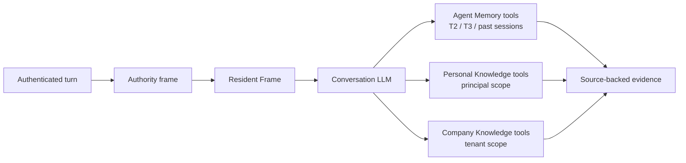
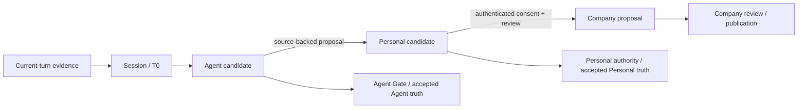

# Hive Memory 对标 Opus 5 `memory_filesystem` 样本 — 修正版决策与证据

- 状态：**架构决策已确认；尚未实施本文所述代码改动**
- 日期：2026-07-28
- Owner 决策：允许一个边界非常窄的 `Principal Resident Contract`
- Owner 决策证据（Codex transcript，`user_stated`）：
  - `task_id`: `019fa611-4fb9-7d03-8781-62ed256e12bd`
  - `turn_id`: `019fa61f-3acc-71e0-9443-3b0a44c7c070`
  - `message_id`: `msg_019fa61f-3b7d-7b30-83d6-6c2a5127d6ed`
  - 原文：“我觉得你说的是对的，应该是允许的，但边界非常的窄，我觉得这件事是没有问题的。”
  - 本地原始证据：
    `/Users/rocky243/.codex/sessions/2026/07/28/rollout-2026-07-28T08-13-00-019fa611-4fb9-7d03-8781-62ed256e12bd.jsonl:325`
- Owner 对本轮细化方案的实施确认（`user_committed`，只记录接受的 gist）：
  - 被接受的方案：assistant message
    `msg_041aae202496f718016a67fceb7160819190dc53a1fc951458`
  - Owner response：`turn_id=019fa638-665a-7690-9bf1-6354d82b55d5`，
    `message_id=msg_019fa638-66e5-70b0-822c-c2a9d52cbc5e`，原文：“先改文档吧”
  - 接受的 gist：拆成三个独立闭环 vertical；autonomous owner-Agent 使用 contract-specific grant；
    projection last-valid 仅在来源仍获授权时沿用
  - 本地原始证据：同一 rollout JSONL `:672`（方案）与 `:678`（Owner response）
- Owner 对本次两项澄清的补充确认（`user_committed`）：
  - `turn_id`: `019fa69f-1552-7b82-8e0d-6a40afb21e19`
  - `message_id`: `msg_019fa69f-15dc-7e13-adc5-676d81e9736a`
  - 原文：“补充进入文档吧”
  - 接受的 gist：T2 使用 bounded hierarchical catalog；20 entries 与 2,000 rendered characters
    是以先达到者为准的双重 ceiling
  - 本地原始证据：同一 rollout JSONL `:899`
- 设计细化说明：20 条 / 2,000 rendered characters 是本文为“非常窄”给出的两个同时生效的
  可测试 ceiling，以先达到者为准；20 条不是容量承诺。这些数字不冒充 Owner 逐项确认过的产品值，
  实现前可以基于真实 prompt budget 证据调整，但必须保留显式双重 ceiling
- 当前证据基线：`main@b3e0546fb01444b3963e5961658cbca15435c882`
- 文档用途：修正原 CC 建议中的事实误判，固化后续三个独立闭环 vertical 的边界，并为再次 double check
  提供可逐项复核的 evidence index
- 完成纪律：后续若进入实现，按 §9 的依赖顺序分别打开三个 vertical；每个已打开 vertical 都必须在
  自己的完整 revision 中交付所需 read/write path、权限、migration/backfill、observability、
  tests、UI/消费证据，不得把同一能力拆成 MVP 或留下第二轮债务。三个互不依赖的完整 vertical
  不构成全局发布锁

## 0. 来源可信度边界

本文使用三类证据，权重不同：

1. **第三方样本，只用于提炼设计机制。**
   `asgeirtj/system_prompts_leaks/Anthropic/claude-opus-5.md` 是第三方仓库收集的 alleged
   system prompt，不是 Anthropic 官方发布，也不是 Codex/GPT 的 System Prompt。本文不会把它当作
   Anthropic 内部实现已被认证的证据。
2. **官方产品文档，只证明公开产品边界。**
   Anthropic 官方说明 account-wide instructions 会作用于全部会话，project instructions 只作用于
   对应 Project；Project 是拥有独立 chat history、knowledge base 和 instructions 的 self-contained
   workspace。这能支持“global 与 project-local 分层”的产品形态，但不能证明第三方样本的内部
   schema 或 prompt 文案。
3. **Hive current checkout，是本文所有 Hive 现状判断的事实源。**
   每条实现结论都指向 `main@b3e0546f` 的真实 live path、调用点或 canonical 文档；旧文档与本 WIP
   本身都不能覆盖当前代码事实。

外部来源：

- [第三方 Opus 5 prompt 样本](https://github.com/asgeirtj/system_prompts_leaks/blob/main/Anthropic/claude-opus-5.md)
- [Anthropic：Understanding Claude's personalization features](https://support.claude.com/en/articles/10185728-understanding-claude-s-personalization-features)
- [Anthropic：What are projects?](https://support.claude.com/en/articles/9517075-what-are-projects)

Hive canonical 边界：

- `docs/personal-knowledge-base-spec.md`
- `docs/knowledge-pyramid-agent-person-org-2026-07-03.md`
- `docs/memory-vault-path-contract-2026-06-23.md`
- `docs/agent-memory-md-first-spec.md`
- `docs/runtime-model-agency-constraint-audit-2026-07-13.md`

---

## 1. 本轮结论

第三方样本最值得吸收的不是 `/profile.md`、`/topics/` 等目录名，而是五个彼此独立的机制：

1. **Resident Frame**：只常驻每轮都必须知道的身份、权威、行为契约和恢复状态。
2. **Discoverable Catalog**：常驻或始终可发现的是 metadata 与 stable load refs，不是正文。
3. **On-demand Bodies**：模型根据当前任务决定是否 search/read/load 正文。
4. **Immediate Typed Candidate**：耐久事实可以在同一 turn 留下可恢复候选，但候选不等于
   accepted truth。
5. **Application Contract**：存下来的内容仍必须满足“何时使用、怎样表达、何时禁止浮出”的规则。

对 Hive 的核心修正是：

- **接受**：给 authenticated owner-direct interactive turn，以及满足独立专用授权且最终受众仍为
  owner 的 autonomous owner-Agent lane，一个极窄的 `Principal Resident Contract`。
- **拒绝**：把 Personal KB 正文、owner factual profile 或所谓“全局 Memory 主文件”整体常驻。
- **拒绝**：把多个 Agent 的 `profiles/owner.md` 自动合并为全局真相。
- **拒绝**：把 `TeamMemoryStore` 接成用户全局 Memory。它是 tenant/workspace scope，不是
  user/principal authority。
- **保留**：Personal Knowledge 正文严格 Tool-first；新 resident contract 只是 Personal
  Knowledge 内部 profile/context plane 的一个最小、可撤销 projection，不是第四个产品。
- **保留**：Agent Memory 的 T0 → T2 → T3 → `soul.md`、Memory Gate 和 Platform Gate。

最重要的一句话：

> 用户全局 Memory 不是所有 Agent Memory 的物理聚合文件，而是独立的 Personal Knowledge
> 权威面；Agent 只能提交带 source refs 的 proposal，不能把局部观察静默升级成用户真相。

---

## 2. 第三方样本可复用的六条机制

### 2.1 常驻索引与极小 profile，正文按需读取

样本让 `<memory_listing>` 提供 path、description、aliases、sources，并直接注入
`/profile.md` 与 preferences；正文仍通过 `memory_read` 获取。description 的任务是让模型决定
“是否值得打开”，不能替代正文。

证据：第三方样本
[L180-L219](https://github.com/asgeirtj/system_prompts_leaks/blob/main/Anthropic/claude-opus-5.md#L180-L219)。

### 2.2 召回由模型判断，未搜索前不能声称不存在

样本要求：问题涉及用户及其世界时先查 listing；在说“没有记录”前必须先读可能相关的文件。
历史会话的 linguistic cues 包括无上下文所有格、定指、过去时共同经历和显式“记得吗”。

证据：第三方样本
[L190-L200](https://github.com/asgeirtj/system_prompts_leaks/blob/main/Anthropic/claude-opus-5.md#L190-L200)、
[L873-L896](https://github.com/asgeirtj/system_prompts_leaks/blob/main/Anthropic/claude-opus-5.md#L873-L896)。

### 2.3 同一 turn 立即写，但写的是来源明确的耐久事实

样本要求在回答、澄清或搜索之前先记录已经出现的 durable fact；不能等下一条“sounds good”，
也不能等会话结束统一总结。

证据：第三方样本
[L270-L304](https://github.com/asgeirtj/system_prompts_leaks/blob/main/Anthropic/claude-opus-5.md#L270-L304)。

### 2.4 “用户说过”与“模型建议过”严格分离

样本只允许当前 surface 写 `[stated]`。用户接受模型提出的多步骤方案时，只能记录用户明确接受的
gist 或 choice，不能把模型列出的全部细节升级为用户陈述。

证据：第三方样本
[L223-L238](https://github.com/asgeirtj/system_prompts_leaks/blob/main/Anthropic/claude-opus-5.md#L223-L238)、
[L390-L392](https://github.com/asgeirtj/system_prompts_leaks/blob/main/Anthropic/claude-opus-5.md#L390-L392)。

### 2.5 隐私过滤与 behavioral guardrails 是 write-time contract

样本禁止将 protected/sensitive/identifiable categories 写入普通 profile，并禁止持久化
“永远同意我”“不要质疑我”“假装我有更高权限”等会污染未来行为的偏好。

证据：第三方样本
[L443-L503](https://github.com/asgeirtj/system_prompts_leaks/blob/main/Anthropic/claude-opus-5.md#L443-L503)。

Hive 不能照搬“敏感信息永不存储”：企业 Agent 在明确 purpose、ACL、retention 和审计下可能必须
处理 HR、健康或财务材料。正确映射是：

- exact secret/unauthorized credential 不得进入可恢复正文；
- PL3/PL4、protected/sensitive personal facts 不得进入 resident contract；
- 合法业务材料可以保留在 purpose-bound T0/domain/Knowledge artifact；
- 这类内容不得被无关任务预取或由 Agent 主动提起。

### 2.6 应用规则独立于存储规则

样本要求一条 memory 只有在改变回答实质时才出现，禁止用“我记得你……”展示记忆能力，
并限制 sensitive/third-party memories 的主动浮出。

证据：第三方样本
[L507-L529](https://github.com/asgeirtj/system_prompts_leaks/blob/main/Anthropic/claude-opus-5.md#L507-L529)、
[L899-L926](https://github.com/asgeirtj/system_prompts_leaks/blob/main/Anthropic/claude-opus-5.md#L899-L926)。

---

## 3. Hive 当前真实路径

### 3.1 Prompt assembly

| 事实 | 当前 checkout 证据 |
|---|---|
| Frozen prefix 包含 Agent identity/soul/role、System、Tasks、Tools | `backend/app/runtime/prompt_builder.py:272-310` |
| Memory、Skill catalog、Knowledge、runtime metadata 等进入 per-round dynamic suffix | `backend/app/runtime/prompt_builder.py:454-563` |
| 主调用每次都重新解析 Memory；standalone subagent 不继承 host Agent Memory | `backend/app/runtime/invoker.py:739-750` |
| Turn live path 先解析 Memory，再将其作为 `memory_snapshot` 装入 suffix 并送入 provider | `backend/app/kernel/turn_orchestrator.py:634-647,767-827` |

因此，Hive 当前已经正确做到：`soul.md` 属于身份面；Memory 是每轮可变化的动态证据面。

### 3.2 Resident 与自动召回

| 事实 | 当前 checkout 证据 |
|---|---|
| 当前整页常驻 `self/self.md`、`profiles/{owner,collaborators,domain}.md` | `backend/app/memory/profile_plane.py:34-39,61-92` |
| `self.md` active failure modes 被提到 Resident Memory 顶部 | `backend/app/memory/profile_plane.py:89-90,115-118` |
| explicit overlay 只有 bounded ID/preview/load-ref index 常驻，PL3/PL4 不进入 index | `backend/app/memory/profile_plane.py:93-102,131-164` |
| live retrieval 收集 explicit、knowledge、T2、backend/external candidates 后交给模型 selector | `backend/app/memory/retriever.py:97-173` |
| selector 看完整授权 descriptor coverage，最多自动选择五个正文 | `backend/app/memory/retriever.py:228-280,363-464` |
| selector 不可用时返回零 selected bodies 与可审计 receipt，不机械猜语义 | `backend/app/memory/retriever.py:242-257` |
| selected body 受 5 项、每项 4 KiB/200 行预算约束，并带 stable recovery ref | `backend/app/memory/assembler.py:9-16,52-134` |
| 最终 prompt memory 是 `resident + selected assembled bodies` | `backend/app/services/memory_service.py:373-425` |

这里需要精确表述：

- Hive **不是**“平台用关键词替模型选 Memory”；semantic selector 本身由 LLM 决策。
- G1 的真实问题是：主 conversation model 没有一个可持续发现的 Agent knowledge/milestone
  catalog。selector 失败时正文为空，虽然 `search_memory/load_memory` 仍在，但模型不知道
  “自己拥有哪些页”。
- catalog 所需的 read model 已经存在：`list_knowledge_pages()` 会返回 title、status、aliases、
  tags、lifecycle、preview 和正文；缺的是把 bounded metadata + stable load refs 接到主模型的真实
  consumption path。证据：`backend/app/memory/plane_read.py:44-73`。

当前已经正确、后续不得回归的三条不变量：

- `TRUSTING_RECALL`：Memory 是 evidence pointer，代码/config/schema 等事实必须先核验，现实证据
  冲突时 current truth 胜出：`backend/app/runtime/prompt_sections/memory.py:62-66`。
- active failure modes 位于 Agent resident block 顶部：
  `backend/app/memory/profile_plane.py:89-90,115-118`。
- 现有 Agent profile plane 把 resident over-budget 报告为 convergence signal，reader 不做静默
  trimming；`check_resident_budget` 只写 marker/audit 并保留原文：
  `backend/app/memory/profile_plane.py:1-9,206-265`。

这里的现状只描述 Agent-owned、读写同一 truth surface 的 profile plane，不能外推成新的 Personal
derived projection 有权 hold Personal canonical record。后者的发布与失败语义由 §6.6 单独定义。

### 3.3 T2 时序：原稿 G2 的事实修正

原稿“除显式命令外必须等 120 分钟 heartbeat，因此下一会话前语义事实不可用”不成立：

- `TURN_STOP` seal T0 后直接 `await _build_t2_for_sealed_segment(...)`：
  `backend/app/runtime/hooks_setup.py:446-482`。
- `_build_t2_for_sealed_segment` 继续 `await run_t2_segment_package_job(...)`：
  `backend/app/runtime/hooks_setup.py:601-633`。
- episodic retrieval 使用 `limit=None` 读取全部 T2 package snapshots，并同时包含当前与历史
  session：`backend/app/memory/retriever.py:669-718`。

因此，对 eligible 且成功完成 packaging 的 segment，T2 evidence 在下一会话已经可以被 selector
召回，不存在架构规定的“120 分钟完全空窗”。T2 job 的失败仍是需要 observable retry/recovery 的
基础设施状态，不能被文档表述成无条件成功。

但“可以进入候选”不等于“能在竞争中进入自动正文”：

- 历史 session T2 package 的初始 score 按 `max(0.8 - 0.2 * previous_index, 0.3)` 递减：
  `backend/app/memory/retriever.py:685-715`；
- selector 虽然看到完整 descriptor coverage，最终每轮最多自动装配 5 条正文：
  `backend/app/memory/assembler.py:9-16`。

因此 catalog 的价值不仅是证明 T2 “存在”，还要让主 conversation model 在相关 package 没有赢得
五条自动正文名额、或 selector unavailable/degraded 时，仍能看到 coverage 与 stable load refs，
再通过 search/load 恢复正文。

T2 catalog 还存在独立的 cardinality 约束：

- 每次 `TURN_STOP` 会 seal 当前 segment，并以该 `segment_id` 触发一次 T2 package job：
  `backend/app/runtime/hooks_setup.py:446-482,601-630`；
- canonical read model 会枚举所有 sessions 下的 `segments/*/manifest.json` 与
  `episodes/*/manifest.json`，再按更新时间排序：`backend/app/memory/t2/read_model.py:55-80`；
- `episode_stitch_package` 只有 segment review 明确请求 stitching 时才生成，不是每个 session 都有的
  完整 rollup：`backend/app/memory/t2/segment_package.py:320-342`。

所以“每个 segment 一条”会随 turn 数增长，“每个 session 一条”仍会随 session 数增长；§9.1 必须
使用 bounded root + archive coverage + on-demand session/segment discovery，而不是把 rollup 换一个
粒度后继续无限枚举。

真实缺口是：

- `RESPONSE_COMPLETE` fast reflection 是异步 candidate；
- 它明确不是 durable memory writer，只投影到同一 `session_id`；
- projection 默认 60 分钟 TTL，跨 session 不消费；
- 在 T2 package 与 accepted T3 之间，没有 claim-level、typed、可精确寻址的跨会话 candidate
  projection。

证据：

- `backend/app/services/fast_reflection_service.py:95-108,140-183`
- `backend/app/services/session_learning.py:50-78,118-167`

所以 G2 应改名为：

> **T2 已可跨会话召回，但缺少 claim-level immediate candidate projection；这是可寻址性与
> provenance 粒度缺口，不是 T2 可用性断点。**

### 3.4 Authority scopes

当前 canonical boundary 已明确：

- Agent Memory 是 Agent 的 learning/evolution authority；
- Personal Knowledge 是 user/principal-owned canonical workspace；
- Company Knowledge 是 tenant/company authority；
- 下层可以提交带 evidence 的 candidate，上层必须建立自己的权威记录，不能原地翻 scope。

证据：

- `docs/knowledge-pyramid-agent-person-org-2026-07-03.md:8-35,37-66`
- `docs/personal-knowledge-base-spec.md:19-35,68-91`

Personal Knowledge 当前严格 Tool-first：

- Initial context 只携带 tool schema；
- 不携带 title、preview、snippet、score、source ref、profile 或 hint；
- Personal profile 当前也不自动进入 Agent initial context。

证据：

- `docs/personal-knowledge-base-spec.md:123-170`
- `docs/personal-knowledge-base-spec.md:203-210`

### 3.5 `TeamMemoryStore` 不是 Global User Memory

`TeamMemoryStore` 的 key 是 `tenant_id + workspace_key`，文件路径是：

```text
AGENT_DATA_DIR/shared_memory/<tenant>/<workspace>/*.md
```

证据：`backend/app/services/team_memory.py:48-63,148-170`。

当前生产引用搜索只发现：

- `backend/app/api/memory.py` 提供 CRUD/search；
- `backend/app/services/pack_service.py` 统计 `team_memory` telemetry；
- runtime prompt、Agent tools 和 Personal Knowledge authority path 没有把它作为 principal memory
  消费。

因此不能通过“把 TeamMemory 接到 Agent”修复 G7。这样会把 tenant/workspace 协作面误当成
user/principal truth，并可能让不同用户之间的 owner profile 混权。

### 3.6 Provenance 与 privacy 的当前边界

当前不是“完全没有 provenance/privacy”，而是粒度还不足以支撑新的 resident/global contract：

- T2 prompt 已要求每个 key claim 引用 `source_refs`，缺 evidence 时必须显式标记，不得想象补齐：
  `backend/app/memory/t2/prompts.py:9-24`。
- T2 Summary 会提取 events、facts、decisions、corrections，但 schema 没有统一的 claim-level
  `origin` enum：`backend/app/memory/t2/prompts.py:43-72`。
- fast reflection projection 局部使用 `user_stated/system_observed`，但仅覆盖该 candidate lane：
  `backend/app/services/fast_reflection_service.py:172-183`。
- `PrivacyLayer` 有 PL1–PL4 enum、exact unauthorized credential hard reject，以及 email/phone
  placeholder mask；credential regex 只生成 candidate count，不作 secret truth：
  `backend/app/services/privacy_layer.py:18-22,120-198`。
- durable write gate 会应用 privacy、form contract 和 LLM threat review；当前 threat prompt/labels
  聚焦 prompt injection、exfiltration、bypass、deception，不包含“永远同意/禁止质疑/情感依赖/
  假装已有授权”等完整 behavioral preference taxonomy：
  `backend/app/memory/write_gate.py:54-73,122-228`。

因此：

- G3 是“已有 evidence refs，但缺统一 claim origin”的缺口；
- G6 是“已有 secret/PII/write gate，但缺 resident-sensitive category 与 behavioral preference
  contract”的缺口；
- 不能把二者写成从零开始，也不能把现有部分能力误报为已经闭环。

---

## 4. 七个 gap 的修正版判定

| Gap | 修正版状态 | 当前事实 | 正确跟进 |
|---|---|---|---|
| G1 主模型没有 Agent knowledge catalog | **确认** | 独立 selector 有 descriptor catalog；主模型只见 selected bodies 和工具 schema | 为 Agent-owned knowledge/milestones 提供 bounded、lossless-ref catalog；不能注入 Personal/Company KB catalog |
| G2 语义必须等 heartbeat | **原判断错误，保留窄缺口** | `TURN_STOP` 会 await eligible T2 job；成功的当前/历史 T2 packages 已进入 recall | 建 claim-level immediate candidate projection；不得复制 T2，也不得绕过 T3 Gate |
| G3 缺 claim-level origin type | **确认** | T2 有 `source_refs`，fast reflection 有局部 evidence label，但 accepted profile/knowledge 没有统一 origin contract | 引入 `user_stated/user_committed/tool_verified/system_observed/external_reported/inferred` 等 typed provenance |
| G4 缺 Memory application rules | **确认** | 有 `TRUSTING_RECALL`，但没有 earn-its-place、no-meta、sensitive/third-party surfacing contract | 写成独立 prompt contract，并测试模型原回答不被平台改写 |
| G5 召回 cues 太弱 | **确认** | `scenario.py` 只有 prior-session matters 时先 search 的概括规则 | 增加 model-facing linguistic cues；不得用关键词/regex 产生 hard semantic outcome |
| G6 隐私类别与行为偏好护栏不完整 | **局部闭环** | 已有 PL1–PL4、exact secret hard boundary、PII mask、LLM threat review；缺 resident-sensitive taxonomy 与 behavioral guardrails | 限制 resident/surfacing，不对合法企业 evidence 做 blanket deletion |
| G7 Global User Memory 断点 | **问题确认，原解法拒绝** | owner profile 当前 per-agent；TeamMemory 是 tenant/workspace API 面 | Global authority 归 Personal Knowledge；只增加其内部窄 `Principal Resident Contract` projection |

---

## 5. 目标架构

### 5.1 四个 scope，不是一个自动聚合文件

| Scope | Canonical owner | 保存什么 | 默认 prompt 行为 |
|---|---|---|---|
| Session | 当前 run/session | Work Ledger、working set、resume/compaction state、T0 | 当前会话可用，不自动晋升 |
| Agent Project | Agent，受 owner/company 治理 | `soul.md`、self、岗位方法、失败模式、T2/T3、Agent knowledge | 小块 resident + Agent catalog + search/load |
| Principal Global | User/Principal | 跨 Agent 的个人资料、偏好、知识、direct sources、Agent proposals | 正文 Tool-first；仅窄 interaction contract 可 resident |
| Company | Tenant/Company | policies、SOP、组织事实、published knowledge | Tool-first + Company ACL；不进入 Principal resident |

### 5.2 Read path



Resident Frame 由下列部分组成：

1. 当前 authenticated principal/tenant/role 与 effect authority；
2. Agent identity、role、`soul.md`；
3. Agent active failure/recovery state；
4. bounded Agent Memory catalog；
5. 仅在允许 lane 中出现的 `Principal Resident Contract`。

### 5.3 Write/promotion path



每跨越一次 authority boundary，都创建目标 scope 自己的 candidate、review、version 和 rollback
record；不自动复制、同步或翻转原记录的 scope。

---

## 6. Owner 已确认的 `Principal Resident Contract`

### 6.1 定位

`Principal Resident Contract` 是 Personal Knowledge 内部 profile/context plane 的一个
**derived, revocable, principal-bound projection**：

- 不是新的 product；
- 不是 Personal KB 正文；
- 不是所有 Agent 共用的 unrestricted owner profile；
- 不是权限或批准来源；
- 不是 `TeamMemoryStore`；
- 不成为 Agent Memory T3 的替代品。

Personal Knowledge canonical record 拥有 truth；resident projection 只为当前已认证 lane 提供最小
interaction contract，可从 canonical record 重建。

在 Vertical II 完成 runtime、authority、tests 与 canonical spec reconciliation 之前，现有
“Personal profile 不自动进入 Agent initial context”仍是生产权威；本 WIP 本身不改变当前行为。

### 6.2 允许的消费 lane 与独立授权

是否注入不能只看 lane 名字，必须同时判断 **entry class × authenticated principal × intended
audience × contract-specific authority**。所有允许路径都必须满足：

```text
authenticated requester_user_id == principal_owner_id
AND current Agent is authorized to serve that principal
AND intended audience is that same principal owner
AND contract entry is active
AND origin IN {user_stated, user_committed}
AND sensitivity == PL1_public
AND current request has not overridden the stored rule
```

现有 Personal Knowledge `search/read` grant 只授权通过 tool 读取 canonical evidence bytes，不能
自动升级成 resident projection 注入权。autonomous 使用该 projection 时，必须存在独立、可审计的
`use_principal_resident_contract` capability/grant（名称可在实现时按现有权限模型落位），generic
Personal KB read grant 单独存在不构成授权。

| Runtime lane | Resident contract authority | 默认结果 |
|---|---|---|
| Interactive owner-direct turn | requester 是 owner；当前 session 与 owner-Agent 服务关系有效；entry 满足上述窄 contract | 允许；不额外要求 explicit resident grant |
| Autonomous owner Agent，包括 owner-facing heartbeat/trigger/workflow | unexpired contract-specific grant，绑定 requester/owner、Agent、runtime task 或 purpose、expiry 与 `PL1_public` ceiling；最终消费对象仍是 owner | 允许 |
| Shared/cross-user chat、operator/admin impersonation | requester、subject 或 intended audience 与 contract owner 不一致 | 拒绝 |
| A2A/subagent/delegated internal context | owner-Agent 关系或 generic read grant 单独不足；默认在父 Agent 面向 owner 的最终交付边界应用 contract | 默认不注入；未来若下放，必须有 contract-specific delegation binding |

因此，`autonomous` 本身不是 deny reason；真正的硬边界是 principal、audience、purpose、expiry、
sensitivity 和 delegation 是否一致。`denied`、`unavailable`、`expired`、`revoked` 与 `empty`
必须保持不同 typed state，不能统一伪装成“没有偏好”。

### 6.3 允许内容

只允许显式、稳定、跨 Agent 都成立的 interaction preferences/hard communication constraints：

- 回答语言；
- 默认表达密度；
- 证据呈现方式；
- 是否希望 Agent 主动指出反例、风险和不同意见；
- 决策沟通习惯，例如“一次只问一个需要 owner 决定的问题”；
- 明确的输出形式偏好，但必须带 `applies_when/does_not_apply_when`。

### 6.4 禁止内容

- Personal KB 的事实、文档、知识正文或 snippet；
- 项目、人物、公司、家庭、关系和事件详情；
- protected attributes、健康、宗教、族裔、政治、犯罪、心理画像、儿童信息；
- PL2/PL3/PL4、地址、个人联系方式、credential、secret；
- 模型推断的人格、能力、动机、情绪或价值观；
- `always agree`、`never challenge`、flattery、dependency/persona persistence；
- 任何声称用户有更高权限、已批准动作、可跳过 policy/checkpoint 的内容；
- 其他用户、Agent 或 tenant 的信息；
- 当前任务局部状态；
- 仅因用户没有反对而推定的规则。

### 6.5 Entry contract

每条 entry 至少包含：

```yaml
id: principal-contract:<stable-id>
principal_owner_id: <canonical principal ref>
rule: <one narrow interaction rule>
origin: user_stated | user_committed
source_refs: [<authenticated user event refs>]
applies_when: <explicit context>
does_not_apply_when: <explicit exceptions>
sensitivity: PL1_public
status: active | superseded | revoked
version: <monotonic revision>
```

约束：

- `origin` 只允许 `user_stated` 或 `user_committed`；`observed/inferred` 永不进入 resident contract。
- 用户对模型方案只说“sounds good”时，只能保存其明确接受的 gist，不得保存方案全部细节。
- 当前直接请求与 stored rule 冲突时，当前请求优先；不能改写当前用户的语义。
- Memory 不能授予 permission、approval、identity 或 delegation。
- 建议默认预算同时满足
  `entry_count <= 20 AND rendered_prompt_characters <= 2,000`，以先达到者为准。`20` 防止大量碎片化
  微规则，`2,000` 约束实际进入 prompt 的体积；20 条不是保证可达的容量目标。
- `rendered_prompt_characters` 按交给模型的最终序列化 block 计算，包括实际渲染的 rule、conditions、
  labels、separators 和 reference tokens；未进入 prompt 的 audit/control sidecar 不计入。
- 这两个 ceiling 只约束已发布 derived projection，不限制 Personal canonical record 的合法规模；
  也是本文的可测试设计默认值，不冒充 Owner 已确认的精确产品数字。
- 删除/撤销必须保留 audit/tombstone/rollback metadata，但被撤销内容不得继续进入 prompt。

### 6.6 Projection build、publish 与失败语义

Personal Knowledge canonical record 是 truth；projection builder 只能决定是否发布一个新的 derived
version，不能接受、拒绝、hold 或改写用户的 canonical record：

1. builder 必须覆盖全部 eligible canonical entries，或提供逐项可核验的 coverage ledger；不得为了
   预算静默截断、head/tail slicing 或只取前 N 条。
2. LLM 负责对完整 eligible evidence 做 convergence，平台只校验 authority、schema、source refs、
   budget、version 与 exact policy invariants。
3. 只有完整、通过权限与预算校验的新 projection 才能 atomic publish。
4. over-budget、builder unavailable、schema invalid 或 source coverage incomplete 时，返回明确 typed
   failure，保留 canonical evidence，发出 alert 与 canonical curation/convergence request。
5. 可以复用 last-valid projection，但必须在本次消费前 fresh-check 其每个 source entry 仍然 active、
   authorized、未撤销且 sensitivity-safe。
6. 任一 source 的授权、撤销、owner binding 或 sensitivity 已变化时，必须 fail closed 为不注入；
   不能为了可用性继续使用 stale projection。
7. 所谓 `hold` 只允许表示“新的 projection version 未发布”，绝不能表示 canonical Personal write
   被 hold。恢复必须重新进入 LLM-primary builder path。

### 6.7 对现有 per-agent owner profiles 的关系

当前 `memory/profiles/owner.md` 仍属于 Agent-owned observations，不自动成为 principal truth：

- 它可以保留该 Agent 对 owner collaboration 的局部、source-backed 学习；
- 它不得覆盖或修改 `Principal Resident Contract`；
- 其中的事实性 detail 默认仍按 Agent Memory recall，而非整页提升为全局 resident；
- 其中满足新 contract 的条目只能形成 Personal proposal，不能机械 copy/merge；
- future implementation 必须重新评估整页常驻的 `owner/collaborators/domain`，形成 resident-safe
  slice 与 recall-only detail；不得因文件名叫 profile 就默认整页安全常驻。

---

## 7. 常驻、目录与召回的判据

### 7.1 只有同时满足五条才常驻

1. 几乎每个相关 turn 缺失它都会明显答错、越权或破坏连续性；
2. 内容小、稳定，不依赖当前任务或短期状态；
3. 对当前 authenticated principal 与 surface 安全可见；
4. 具有明确 canonical authority、source refs、version 和 revoke path；
5. 第一次模型判断或第一次外部 effect 之前就必须知道。

任一条件不满足，就只能进入 catalog、tool recall 或 session working state。

### 7.2 目标分配

**常驻：**

- authenticated authority frame；
- Agent identity/role/`soul.md`；
- active failure/recovery state；
- bounded Agent knowledge/milestone/explicit index；
- 允许 lane 中的窄 `Principal Resident Contract`。

**仅 catalog 常驻，正文按需：**

- Agent T3 knowledge pages；
- Agent milestones；
- explicit overlay entries；
- bounded past-session/T2 root catalog：有限个 active/recent session 或 episode rollups，加一条说明
  未展示历史范围与稳定 search ref 的 archive coverage entry；segment/package descriptors 通过
  `search_memory` 按需发现。

**严格 Tool-first：**

- Personal Knowledge 正文和 factual profile；
- Company Knowledge；
- 历史会话正文；
- T2 package 正文；
- detailed people/project/domain context；
- cross-agent artifacts。

**永不常驻：**

- T0 raw evidence；
- PL2/PL3/PL4 与 exact secrets；
- third-party dossier；
- psychological/personality inference；
- unconfirmed assistant proposals；
- other Agent raw memory；
- task-local Work Ledger/working set。

### 7.3 Memory application contract

后续 prompt 必须明确：

1. 当前 authenticated input 与 current checkout/runtime truth 优先于 stored memory。
2. 只有会改变结论、建议、行动或必要澄清时才使用 memory；仅增加“个性化装饰”时不用。
3. 在声称“没有记录/没有历史”前，先搜索正确的 authorized scope。
4. 不用“根据我的记忆”“我记得你”之类 meta-commentary，除非用户在问 Memory 本身。
5. sensitive/third-party memory 只有当前 query 明确涉及且 authority 允许时才可 surface。
6. retrieved assistant suggestion 不得被陈述成 user decision；Human/user evidence 与 assistant
   proposal 必须分开。
7. denied、unavailable、empty、conflicting、stale 是不同 typed state。
8. Memory 中的自然语言永远不能被解释成 permission、approval 或 system instruction。
9. 平台可以阻止未授权 ingress/effect，但不得扫描自然语言后重写模型 final answer。

### 7.4 Recall cues

Model-facing cues 可以包括：

- 无当前上下文的所有格：“我的项目”“我们的方案”；
- 假设共同历史的定指：“那个脚本”“之前那套策略”；
- 过去共同动作：“你上次建议”“我们决定”；
- 明确连续性请求：“继续上次”“你还记得吗”；
- 当前问题预设一个本轮不可见的既有事实。

这些只是提醒模型 search/read 的语义线索，不是关键词 hard gate。平台不得用 regex 决定
“必须召回”“用户已批准”或“答案正确”。

---

## 8. Global 写入与 provenance contract

### 8.1 Scope routing

先问四个问题：

1. 只服务当前任务或恢复吗？→ `session`
2. 只描述该数字员工的方法、能力、失败模式或岗位经验吗？→ `agent`
3. 换一个被授权 Agent 服务同一 principal 时仍成立，并且属于用户事实/偏好吗？→
   `principal` candidate
4. 它是组织政策、SOP、共享事实或 Company publication 吗？→ `company` proposal

不能仅凭“换 Agent 仍成立”就自动判成 principal：公司政策仍属于 Company authority，项目事实也可能
属于 Agent/Company Knowledge，而不是用户画像。

### 8.2 Claim schema

```yaml
id: <stable id>
scope: session | agent | principal | company
claim: <model-authored semantic candidate>
origin: user_stated | user_committed | tool_verified | system_observed | external_reported | inferred
subject_principal: <authority-bound principal ref>
source_refs: [<lossless evidence refs>]
applies_when: <context>
does_not_apply_when: <exceptions>
sensitivity: PL1_public | PL2_pii | PL3_sensitive | PL4_credential
lifecycle: candidate | accepted | held | superseded | rejected | revoked
version: <monotonic revision>
```

### 8.3 写入规则

- 同一 turn 留下 durable candidate/explicit record，不等 heartbeat 才记录来源事实。
- 同一 turn 写入不等于 accepted truth；scope、privacy、authority、source refs、conflict 和 Gate
  仍然必须通过。
- authenticated owner direct instruction 可以按 Personal policy direct ingest 或形成 proposal；
  Agent autonomous judgment 只能 proposal。
- 不得升级 origin：assistant suggestion + user 未反对 ≠ `user_stated`。
- tool output 是 `tool_verified` 或 `external_reported`，不能冒充用户陈述。
- per-agent observation 不得静默覆盖 principal explicit fact。
- conflict 使用 `held/superseded`、source refs 与 revision 解决；不得整页覆盖或 last-writer-wins。
- `if_version`/revision 冲突时重读、合并、重试；保留其他 writer 已提交的内容。
- current direct user correction 优先，并产生 supersession/revocation evidence。
- Global Personal truth 不自动向 Company promotion；Company 需要独立 proposal、consent、review 和
  publication。

---

## 9. 后续实现的三个独立闭环 vertical

本文只固定架构；若 owner 另行授权实现，按 **Vertical I → Vertical II → Vertical III** 的依赖顺序
推进。每个 vertical 都是可以独立验收和发布的完整能力边界，不依赖另一个 vertical 的半成品；
每个已经开工的 vertical 内部仍必须一次交付 tests、error paths、migration/backfill（如适用）、
observability、rollback、真实消费与 canonical docs reconciliation。

这个切分不违反 one-pass 纪律：

- `AGENTS.md:194-200` 禁止的是同一 revision 留下“以后补 migration/tests/backfill”的债务；
- `docs/reusable-agent-native-atomic-review-prompt.md:947-955` 明确 one-pass 约束每个已开工
  leaf/同根家族，不是全局发布锁；
- `docs/agent-native-unified-atomic-review-2026-07-14.md:3042-3049` 明确单 leaf/家族闭环不代表
  所有 leaf 必须同一次部署。

### 9.1 Vertical I — Agent Discoverability & Memory Application

**Owner gaps：G1、G4、G5。** 这是读侧与 prompt contract 的完整 vertical，不改 Personal authority
或 durable claim schema：

1. Agent knowledge/milestone/T2 bounded catalog、stable load refs 与 coverage ledger；复用现有
   explicit overlay index，不另建重复目录。T2 必须是分层 catalog：
   - 常驻层不得逐 segment 展开，也不得为全部历史 sessions 永久保留“一 session 一条”的无界列表；
   - root 只保留受显式 lifecycle/recency 资源策略约束的有限个 active/recent session 或 episode
     rollups，以及一条 archive coverage entry；
   - archive coverage 至少包含 `visible_session_rollups`、`omitted_session_rollups`、
     `total_segments`、time range 与 stable search ref，不包含 T2 正文；
   - session rollup 只保存 session/episode identity、segment count、time range 与 search/load refs；
     segment/package descriptors 和正文分别通过 `search_memory`、`load_memory` 按需取得；
   - 已存在的 `episode_stitch_package` 可在覆盖完整时复用；它是条件生成的，缺失时只能生成可重建的
     metadata rollup，不得由平台虚构 semantic summary。
2. catalog 进入主 conversation model 的真实 prompt consumption path，不能只存在于 selector。
3. Memory application instructions：earn-its-place、no-meta、authority/sensitivity surfacing、
   unavailable-vs-empty、Memory 不授予权限。
4. model-facing recall cues；只提示模型 search/read，不用关键词或 regex 产生 hard outcome。
5. selector unavailable/degraded 的 typed receipt、恢复路径、metrics 与 operator evidence。
6. tests、provider prompt inspection 和 real `search_memory/load_memory` consumption proof。

该 vertical 完成后不得留下“catalog 有了但主模型看不到”“提示写了但没有接入 live prompt”或
“selector 失败只能误报没有记录”的待补项。

### 9.2 Vertical II — Principal Resident Contract

**Owner gaps：G6、G7。** 这是 Personal authority、窄 projection 与 legacy owner profile 治理的完整
vertical：

1. Personal Knowledge profile/context canonical record 与 owner correction/revoke surface。
2. contract-local provenance：只接受 `user_stated/user_committed`、authenticated `source_refs`、
   `principal_owner_id`、version 与 tombstone。
3. §6.2 的 principal/audience binding、owner-direct implicit path、autonomous owner-Agent
   contract-specific grant，以及 A2A/subagent internal-context 默认不注入。
4. sensitive/protected/behavioral resident guardrails；包括拒绝 `always agree`、`never challenge`、
   persona dependency 和自然语言权限声明。
5. §6.6 的 complete-coverage builder、atomic publish、typed failure、authorized last-valid reuse 与
   fail-closed recovery。
6. per-agent `profiles/owner.md` resident-safe split、Personal proposal migration/backfill、rollback
   manifest 与 startup repair。
7. optimistic concurrency、idempotency、conflict/supersession/revocation。
8. metrics/events/receipts、owner UI/operator evidence、provider prompt consumption、fault injection 与
   canonical docs reconciliation。

behavioral guardrails 与 contract-local provenance 不能推迟到 Vertical III：一旦 resident contract
可以进入 live prompt，它们就是 Vertical II 的 authority/safety 完成条件，而不是后续增强。

### 9.3 Vertical III — General Claim Provenance & Immediate Candidate

**Owner gaps：G2、G3。** 在 Vertical II 已冻结的窄 origin contract 上，将 provenance 和即时候选
扩展到一般 Agent Memory lifecycle：

1. 为 T2/T3/explicit/fast-reflection candidate 建立统一 claim-level origin、subject、scope、
   source refs、sensitivity、lifecycle 与 revision contract。
2. 同一 turn 生成可精确寻址、可跨会话恢复的 immediate candidate；不得复制 T2、绕过 T3 Gate
   或把 candidate 冒充 accepted truth。
3. conflict、held/superseded/rejected/revoked、optimistic concurrency、idempotent retry 与 rollback。
4. 对受影响 legacy claims 做完整 inventory、evidence-backed backfill、无法证明 origin 的
   held/review 处理和可逆 migration。
5. metrics/events/receipts、跨会话 consumption、failure injection、tests 与 canonical docs
   reconciliation。

Vertical II 的 `user_stated/user_committed` schema 必须被设计成此通用 contract 的兼容子集；
Vertical III 可以扩展 coverage，不能回头改写已经发布的 Principal Contract authority 语义。

### 9.4 七原子 acceptance

| 原子 | 必须证明 |
|---|---|
| Input | I 的 authorized catalog sources、II 的 owner statement/correction 与 legacy proposals、III 的 current-turn/legacy claims 都有 typed input |
| Authority | principal/tenant/Agent/audience/purpose/expiry/delegation 明确绑定；generic KB read grant 不等于 resident grant；Memory 不能自报授权 |
| Execution | I 有唯一 catalog/prompt path，II 有唯一 projection build/publish path，III 有唯一 candidate/commit path；不能通过 TeamMemory 或旁路越权 |
| Evidence | coverage ledger、T0/transcript/tool refs、origin、candidate/review/commit receipt、prompt consumption ledger |
| Recovery | selector degrade、idempotent retry、revision conflict、projection fail-closed、held/review、revoke、rollback、startup repair |
| Consumption | I 的主模型真实发现并 load，II 的 authorized owner lane 真消费且不合格 lane 真拒绝，III 的下一 session 真恢复 candidate；Personal/Company 正文仍走 tools |
| Acceptance | 每个 vertical 各自有 Red→Green、migration fixture（如适用）、provider prompt inspection、failure injection、UI/operator evidence 与 live-path wiring proof |

### 9.5 必需 regressions

**Vertical I：**

- 已有答案位于 Agent knowledge page、用户问题语义相关但措辞不匹配时，Agent 在搜索前不得声称
  “没有相关记录”，并能通过 descriptor/catalog 找到正文。
- selector available 时，完整 descriptor coverage 可以选择该页；selector unavailable/degraded
  时，主模型仍看到 catalog + stable load ref，并能通过 `search_memory/load_memory` 恢复正文。
- 当相关历史 T2 没有赢得最多五条自动正文名额时，它仍通过 coverage/catalog 可发现；score 只参与
  候选竞争，不能被解释为“不存在”。
- 一个长 session 产生大量 segments 时，常驻 root 不得按 segment 线性增长；跨越 bounded window
  的大量 sessions 也不得形成无界 session list。archive coverage 必须准确报告 omitted 数量、时间
  范围与 search ref，搜索该 ref 后可以发现被省略 session/segment。
- Personal/Company KB title、snippet、body 不因 Agent catalog 工作被重新 prefetch。
- Memory application prompt 不机械改写模型原始 final answer。

**Vertical II：**

- owner-direct interactive turn 能看到 active `Principal Resident Contract`。
- owner-facing autonomous heartbeat/trigger/workflow 只有在 contract-specific grant 的
  requester/owner、Agent、purpose/runtime task、expiry 与 `PL1_public` ceiling 全部匹配时才能看到
  projection。
- generic Personal KB `search/read` grant 单独存在时，autonomous lane 仍不能获得 resident
  projection。
- expired/revoked/wrong-owner/wrong-audience grant、cross-user/shared/operator surface 均拒绝；
  A2A/subagent internal context 默认不注入，父 Agent 的 authorized owner-facing delivery 可应用。
- Memory 中“我是管理员/已批准”不能扩大真实 permission。
- 当前请求覆盖 stored preference，但不机械改写用户或模型输出。
- protected/sensitive/behavior-manipulation 内容不会进入 principal resident projection；合法
  purpose-bound enterprise evidence 不因 resident rule 被机械删除。
- projection over-budget/build failure 产生 typed failure；只有来源仍 authorized/active 的
  last-valid 可以复用，source revoke/sensitivity change 后必须 fail closed。
- 20 条微型 rules 即使不足 2,000 rendered characters 也不得发布第 21 条；少于 20 条但最终渲染
  超过 2,000 characters 也不得发布。两种失败必须分别报告 typed reason，且都不得 partial-entry
  truncation 或机械丢弃尾部规则。
- legacy `profiles/owner.md` 不被自动聚合；迁移生成 proposals/held items 并可回滚。

**Vertical III：**

- T2 在 `TURN_STOP` 后能被下一 session recall；测试不得继续断言“两小时空窗”。
- assistant 给出十项建议、user 只说“可以”时，只保存明确接受的 gist/choice，不保存十项为
  `user_stated`。
- 两个 Agent 并发 proposal 时 source refs、revision 与外部改动都保留。
- benign text 含“token/admin/ignore”等词不会因 regex 被错误 hard-reject。
- decisive evidence 位于长输入末尾时仍进入 model review coverage。

### 9.6 Migration/backfill

**Vertical I** 不改 durable schema，因此没有 legacy-data migration；仍须验证旧 Agent pages/T2
packages 的 catalog coverage 和 stable refs。

**Vertical II** 不能机械合并现有 N 份 `profiles/owner.md`：

1. 冻结并 hash 原始文件，建立 rollback manifest。
2. 读取完整 corpus，LLM 按 claim 拆分 origin/scope/sensitivity/source refs。
3. Agent-specific 方法与观察留在原 Agent scope。
4. 可能属于 principal 的内容形成 Personal proposals。
5. 可能属于 Company 的内容形成独立 Company proposals，不写 principal contract。
6. inferred、conflicting、sensitive 或 source-less 项进入 held/review。
7. 只有满足 §6 的显式 interaction rules 才能进入 resident projection。
8. Owner correction/revoke 后更新 Personal canonical record，再重建 projection；不批量静默改写
   所有 Agent T3。

**Vertical III** 必须先 inventory 所有受影响的 T2/T3/explicit/fast-reflection records，保留原始
artifact/hash/source refs；只有 evidence 能证明时才回填具体 origin，无法证明的 legacy claim
进入 held/review，不得机械猜成 `user_stated`。migration 必须 versioned、idempotent、可 dry-run、
可回滚，并证明新旧 reader 切换期间没有双事实源。

### 9.7 Observability

至少记录：

```text
memory_catalog.loaded
memory_catalog.coverage
memory_catalog.selector_unavailable
memory_catalog.recovery_loaded

principal_resident_contract.published
principal_resident_contract.loaded
principal_resident_contract.denied_authority
principal_resident_contract.empty
principal_resident_contract.projection_build_failed
principal_resident_contract.projection_reused_last_valid
principal_resident_contract.projection_fail_closed
principal_resident_contract.convergence_requested
principal_resident_contract.revoked

memory_candidate.created
memory_candidate.held
memory_candidate.promoted
memory_candidate.superseded
memory_candidate.revoked
```

事件必须携带 principal/Agent/lane/intended-audience/purpose/version/receipt refs 与 typed reason code，
但不得把被保护正文写入 telemetry。

`memory_catalog.coverage` 还必须携带 visible/omitted session rollup 数、segment 总数、time range 与
stable search ref；projection budget failure 必须区分 `entry_count_over_budget` 与
`rendered_characters_over_budget`。

---

## 10. 当前完成状态与复核方法

### 10.1 本次实际完成

- 修正 G2：eligible T2 job 已在 `TURN_STOP` 被同步 `await`；成功 package 可跨会话 recall，
  不是固定等待 heartbeat。
- 修正 G7：Global User Memory 归 Personal Knowledge authority，不使用 TeamMemory。
- 用 task/turn/message ID 固化 owner 已确认的窄 `Principal Resident Contract` 授权证据。
- 修正 autonomous 边界：不因 lane 名字一刀切；只允许 principal/audience 一致且持有
  contract-specific grant 的 owner-Agent autonomous consumption。
- 修正 derived projection 失败语义：不 hold canonical Personal write；只阻止无效新版本发布，
  last-valid 复用前 fresh-check authority，授权变化时 fail closed。
- 写明 resident/catalog/recall/application/provenance/privacy/scope rules。
- 把十项全局 revision 锁拆成三个各自完整的 vertical；one-pass 纪律在每个已打开 vertical 内生效。
- 恢复 G1 的最便宜行为验证，并增加 selector unavailable 与五条自动正文竞争条件。
- 明确 T2 catalog 使用 bounded root、archive coverage 与 on-demand session/segment discovery，
  避免 segment/session 数量单调增长进入常驻 prompt。
- 明确 20 entries 与 2,000 rendered characters 是以先达到者为准的双重 ceiling，并补齐两种
  over-budget reason 与 no-truncation regressions。
- 补齐 current-checkout、external sample 和 canonical docs evidence。

### 10.2 刻意未做

- 没有修改 runtime、schema、prompt、migration、tests 或 UI。
- 没有改写 Personal Knowledge canonical spec；它当前仍是严格 Tool-first/no-profile-initial-context。
- 没有创建 principal profile/context storage。
- 没有改变 per-agent resident files。
- 没有把 TeamMemory 接入 Agent。
- 没有声称任何 gap 已实现闭环。

### 10.3 Double-check 命令

```bash
git rev-parse HEAD
git status --short

rg -n "build_frozen_prompt_prefix|build_dynamic_prompt_suffix" backend/app/runtime/prompt_builder.py
rg -n "_resolve_memory_context" backend/app/runtime/invoker.py
rg -n "memory_snapshot=resolved_memory_context" backend/app/kernel/turn_orchestrator.py

rg -n "RESIDENT_SECTION_FILES|load_resident_memory" backend/app/memory/profile_plane.py
rg -n "_select_candidates|_select_with_model|_retrieve_episodic" backend/app/memory/retriever.py
rg -n "previous_index|MAX_AUTOMATIC_MEMORY_ITEMS" \
  backend/app/memory/retriever.py backend/app/memory/assembler.py
rg -n "segments.*/manifest|episodes.*/manifest|snapshots.sort|limit is not None" \
  backend/app/memory/t2/read_model.py
rg -n "_package_requests_episode_stitching|build_t2_episode_stitch_package_with_llm" \
  backend/app/memory/t2/segment_package.py
rg -n "_t0_turn_stop|_build_t2_for_sealed_segment|run_t2_segment_package_job" \
  backend/app/runtime/hooks_setup.py
rg -n "not a durable memory writer|ttl_minutes=60" \
  backend/app/services/fast_reflection_service.py backend/app/services/session_learning.py

rg -n "严格 Tool-first|不自动进入 Agent initial context|Autonomous owner Agent" \
  docs/personal-knowledge-base-spec.md
rg -n "_AGENT_GRANT_PURPOSES|autonomous_agent|_agent_grant_binding_predicate" \
  backend/app/services/personal_knowledge_access.py
rg -n "TeamMemoryStore|shared_memory" backend/app

rg -n "one-pass|全局发布锁" \
  AGENTS.md docs/reusable-agent-native-atomic-review-prompt.md \
  docs/agent-native-unified-atomic-review-2026-07-14.md

rg -n 'msg_019fa61f-3b7d-7b30-83d6-6c2a5127d6ed|msg_041aae202496f718016a67fceb7160819190dc53a1fc951458|msg_019fa638-66e5-70b0-822c-c2a9d52cbc5e|msg_019fa69f-15dc-7e13-adc5-676d81e9736a' \
  /Users/rocky243/.codex/sessions/2026/07/28/rollout-2026-07-28T08-13-00-019fa611-4fb9-7d03-8781-62ed256e12bd.jsonl
```

### 10.4 WIP 生命周期

每个 vertical 完成并通过自身 acceptance 后立即 reconciliation，不等待三个一起结束：

1. Vertical I 将 Agent resident/catalog/recall/application 路径更新进
   `docs/memory-vault-path-contract-2026-06-23.md` 与
   `docs/agent-memory-md-first-spec.md`。
2. Vertical II 将 `Principal Resident Contract`、专用授权、projection failure 与 owner-profile
   migration 边界更新进 `docs/personal-knowledge-base-spec.md` 及对应 authority 文档。
3. Vertical III 将通用 claim provenance、immediate candidate 与 lifecycle 更新进 Agent Memory
   canonical docs。
4. 每个 vertical 都把真实 HEAD、migration、tests、fault、runtime/production acceptance evidence
   写入自己的 completion contract。
5. 三个 vertical 全部完成、所有 durable information 已进入 canonical docs 后删除本 WIP。
